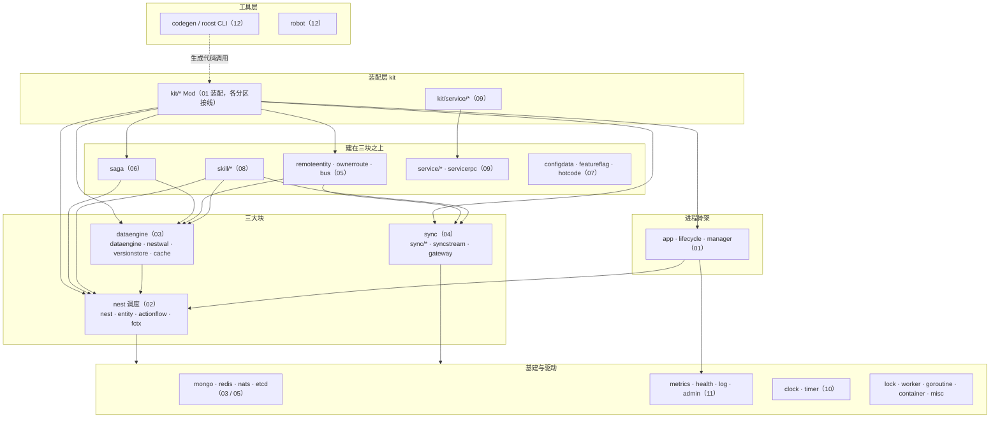

# 00 总览（说明）

> 源码基准：tag `v1.23.0`（`28912cd6`）。本篇是 01～12 分区的导航层，不重复分区内容：每一步只写结论，细节点链接进分区。
> 对应实现文档：[impl/00-overview.md](../impl/00-overview.md)。总入口与术语表：[框架文档 README](../README.md)。

## 速览

- **这是什么**：roost 是一个游戏服框架，一个 Go 模块（`github.com/tjbdwanghaibo/roost-core`）里装着运行时 core、装配层 kit、生成器 codegen 和工程模板。core 的骨干只有三块：**nest 调度**（谁、什么时候、拿着哪些锁改实体）、**dataengine**（改了的东西怎样落盘）、**sync**（落了盘的状态怎样复制给别人）。其余都是建在三块之上的服务，或者三块共用的基建。
- **最重要的保证**：同一实体 ID 的消息按准入顺序执行，handler 改的状态只在 DAO 里、失败整笔回滚；成功回复不早于 handler 声明的提交点；客户端看不到服务端还可能丢掉的状态（开了持久化水位门控时）；任何一处结果不确定，框架都 **fence、不猜、不回滚**，由新进程从 WAL 恢复。
- **最容易踩的坑**：① 在快池 handler 里等待（再发请求、开 goroutine、冷加载）；② 把事务会改的状态放在组件字段里而不是 DAO（维护者决定 A1）；③ 把“WAL durable”“Mongo 已投影”“客户端已收到”当成一回事；④ 把传输错误当成“没执行”再重试一遍（A2：结果未知交给调用方）；⑤ 业务代码直接读 `time.Now()` 或直接读 viper 配置。

### 本篇覆盖的包

本篇不拥有任何包。全部包的归属见 [§3 包地图](#3-包地图与依赖方向) 和 [README 的包 → 分区索引](../README.md#包--分区索引)。

| 分区 | 说明 | 实现 | 一句话 |
| --- | --- | --- | --- |
| 01 | [app 与生命周期](01-app-lifecycle.md) | [实现](../impl/01-app-lifecycle.md) | 进程骨架：配置检查 → 单实例锁 → Mod → Service → 三步停机；fail-stop |
| 02 | [nest 调度与实体](02-nest-entity.md) | [实现](../impl/02-nest-entity.md) | 修改实体的唯一入口：快慢双池、锁序、事务、提交点 |
| 03 | [dataengine](03-dataengine.md) | [实现](../impl/03-dataengine.md) | 唯一保存链路：DAO → WAL → Mongo 投影 → outbox |
| 04 | [sync](04-sync.md) | [实现](../impl/04-sync.md) | 状态复制：服务 → 客户端（entitysync）、服务 ↔ 服务（syncbus）、帧同步、玩家接入 |
| 05 | [remote 与 Mirror](05-remote-mirror.md) | [实现](../impl/05-remote-mirror.md) | 跨进程共享、可迁移所有权的实体；只读快照；bus / NATS |
| 06 | [saga](06-saga.md) | [实现](../impl/06-saga.md) | 跨事务域长事务：步骤收件箱、至多一次生效、倒序补偿 |
| 07 | [配置](07-config.md) | [实现](../impl/07-config.md) | 服务配置的声明与严格读；业务数据表的规则、热更、回滚 |
| 08 | [skill 与战斗](08-skill.md) | [实现](../impl/08-skill.md) | 技能编译器 / 确定性 Runtime / Host 边界；战斗数学 |
| 09 | [kit 服务](09-kit-services.md) | [实现](../impl/09-kit-services.md) | account、mail、session 等十个“玩家之外”的服务 |
| 10 | [时间](10-time.md) | [实现](../impl/10-time.md) | 业务时钟 / 系统时钟、业务时间高水位、定时器排序 |
| 11 | [可观测与运维](11-observability.md) | [实现](../impl/11-observability.md) | 指标、健康与 readyz、日志、admin（Bearer）、安全原语 |
| 12 | [代码生成与工程](12-codegen.md) | [实现](../impl/12-codegen.md) | `roost` CLI、生成器、模板、robot、仓库脚本与门禁 |

---

## 1. 定位与边界

**roost 负责**：一个服务进程从启动到停机的全部框架行为——装配、调度、事务、持久化、复制、跨进程实体、长事务、配置、时间、可观测，以及把这些拼成一个可部署工程的生成器。

**roost 不负责**：

- 业务规则本身（伤害公式、掉落、匹配算法的具体策略）。框架只给确定性的执行边界，例如 skill 的 Host 接口、saga 的步骤 handler。
- 外部系统的正确性：Mongo、Redis、NATS / JetStream 的部署与容量由运维保证。框架只对它们的“结果未知”给出处理口径（[03 §3.6 A2](03-dataengine.md#36-a2驱动不重放写结果未知交给调用方)）。
- 跨服务的强一致：一笔 Nest 事务只覆盖一个进程里的实体；跨进程、跨库的一致性用 [06 saga](06-saga.md)（最终一致 + 补偿），或用 [05 remote](05-remote-mirror.md)（共享实体的写许可在 Mongo）。
- 生产部署与压测结论：生成工程给出部署骨架和压测工具（[12 §4.9](12-codegen.md#49-机器人与压测)），容量数字要在真实环境测。

[↑ 速览](#速览) · [实现文档](../impl/00-overview.md)

---

## 2. 三大块原则

维护者 2026-09-23 定的原则（出处：[ARCH-12](../../bugfix/ARCH-12-sync-package-layout.md)、[sync/README](../../../sync/README.md)）：

> roost core 就是三块基础——nest 调度、dataengine、sync；其余是通用基建。review 最高优先级是这三块，而且不只查 bug，还查包结构与代码构造。除通用基建外，三块的代码要各自局部聚集。

| 块 | 回答的问题 | 主要包 | 分区 |
| --- | --- | --- | --- |
| nest 调度 | 一条消息由谁、在什么时候、拿着哪些锁执行；失败怎样回滚 | `nest`、`entity`、`actionflow`、`fctx`、`lock`、`worker`、`goroutine` | [02](02-nest-entity.md) |
| dataengine | 改了的状态怎样冻结成记录、进 WAL、写进 Mongo、带出外部消息 | `dataengine`、`dataengine/engine`、`nestwal`、`versionstore`、`cache`、`mongo`、`redis` | [03](03-dataengine.md) |
| sync | 状态怎样从一个地方复制到另一个地方：服务 → 客户端、服务 ↔ 服务 | `sync/*`、`syncstream`、`gateway` | [04](04-sync.md) |

建在三块之上的：

- **remote 实体**（[05](05-remote-mirror.md)）同时用到三块：写走 Nest 事务，持久走 DataEngine 的 WAL 投影，快照经 syncbus 推给只读方。它是三块之间耦合最紧的地方。
- **saga**（[06](06-saga.md)）的原生步骤是一笔 Nest 事务，生效点是 DataEngine 投影事务里的条件写。
- **skill**（[08](08-skill.md)）的 Runtime 不在 Nest 事务里（维护者决定 B4），只有战斗 DAO 随事务回滚；三条同步流走 `syncstream`。
- **kit 服务**（[09](09-kit-services.md)）不经 Nest，状态在 Redis（经 `versionstore`），跨进程调用走 bus。

判断一个新包放在哪里，先问：“它是三块中哪一块的一环，还是被三块共用的基建？”是某一块的一环，就收进那一块的目录；只是被用到的通用能力（日志、指标、并发小件），留在基建。sync 的目录已经按这个原则整理过（[ARCH-12](../../bugfix/ARCH-12-sync-package-layout.md)）；nest 与 dataengine 还有散落在顶层的包（例如 `lock`、`worker`、`cache`），见 [impl §2](../impl/00-overview.md#2-三大块原则的实现现状)。

[↑ 速览](#速览) · [实现文档 §2](../impl/00-overview.md#2-三大块原则的实现现状)

---

## 3. 包地图与依赖方向

### 3.1 四层

仓库按顶层目录分成四层，依赖只能向下（根包门禁 `TestLayerViolation`，见 [impl §1.2](../impl/00-overview.md#12-层与守卫)）：

| 层 | 目录 | 可以依赖 | 说明 |
| --- | --- | --- | --- |
| codegen | `codegen/` | 只依赖 `demo/` 模板与两个只依赖标准库的叶子包（`internal/configschema`、`configdata/rules`） | 生成器独立于它生成的运行时 |
| kit | `kit/` | core | 装配层：每个基础设施一个 Mod，把驱动、配置、生命周期接起来 |
| core | 其余全部顶层目录 | 只依赖 core 内部 | 纯运行时，不知道装配层和工具的存在 |
| demo | `demo/` | — | `-template game-demo` 的模板原件，除 embed 外没有可编译代码 |

### 3.2 core 内部的块与方向

下图是 core 与 kit 的块级依赖（箭头读作“依赖”）。细到包的真实 import 图见 [impl §1.1](../impl/00-overview.md#11-包级依赖图)。

要点：

- **dataengine 依赖 nest，不是反过来**：`dataengine/engine`、`nestwal` import `nest`；`nest` 只 import `dataengine` 的契约根包（`Mutation`、`CommitRecord` 等数据类型）。所以“DataEngine 是 Nest 的 committer 实现”，Nest 只认 committer 接口（[03 §1](03-dataengine.md#1-定位与边界)）。
- **sync 不依赖 nest**：`sync/entitysync` 只依赖 `entity`（实体的同步状态 `SubjectSyncState`）。Nest 在提交时把同步内容冻结（`SyncMutation`），entitysync 在 Flush 时读它（[02 impl §3.5](../impl/02-nest-entity.md#35-事务分支)、[04 §2.1](04-sync.md#21-实体复制entitysync)）。两者的接线由 kit 的 Nest Mod 或业务完成。
- **app 依赖 nest 只有一处**：日志行里的 Nest 帧号（`nest.CurTick`，`app/app.go:201`）。fail-stop 时先 fence Nest 的接线不在 app，在 kit 的 Nest Mod（`kit/nest/nest_mod.go:221` 向 `RuntimeFailure` 登记 `engine.Fence`，[01 §4.8](01-app-lifecycle.md#48-fail-stop)）。
- **契约包不链接驱动**：`mongo`、`redis`、`nats`、`etcd` 是接口，驱动在各自的 `driver/` 子包，只有 kit 的 Mod 装配驱动（根包门禁 `TestCoreContractsDoNotLinkDrivers`）。

[↑ 速览](#速览) · [实现文档 §1](../impl/00-overview.md#1-包与依赖)

---

## 4. 端到端走读

三条路径覆盖了 roost 最核心的行为。每一步只写“发生了什么、保证什么”，链接给出细节。实现视角（时序图、源码行号）见 [impl §3](../impl/00-overview.md#3-端到端走读实现视角)。

前提：进程已经按 [01 §4.1](01-app-lifecycle.md#41-进程入口生成的-bootstrap) 启动——配置在任何 Mod `Init` 之前检查完，单实例锁已持有，DataEngine 已投影完 WAL 并标记 ready（[03 §6.1](03-dataengine.md#61-启动顺序恢复屏障)），ops 的就绪位在 `service.started` 后置真（[01 §6.3](01-app-lifecycle.md#63-readiness)）。

### 4.1 一次请求：接入 → nest → handler → 回复

以 game-demo 的玩家 TCP 请求为例。

| # | 步骤 | 保证 / 要注意 | 细节 |
| --- | --- | --- | --- |
| 1 | 客户端连上生成的玩家 TCP 接入层，首帧带 ticket 鉴权；通过后进入读循环 | 鉴权只在首帧；`auth.go` 默认 fail-closed | [04 §4.11](04-sync.md#411-玩家-tcp-接入层) |
| 2 | 请求帧按 msgID 交给协议注册表，经 WriteGate 到生成的 handler 包装；每次 dispatch 有截止（`dispatch_timeout`） | 截止只限制**等待**，不限制不配合 ctx 的 handler；controller 返回 `error` 会断连，业务失败要编码进响应的 `Code` | [04 §4.11](04-sync.md#411-玩家-tcp-接入层)、[04 §5.4](04-sync.md#54-player_accesstcp生成的接入层) |
| 3 | handler 包装通过生成的 Sender 调 Nest `Client.Request`，目标实体 ID 就是 handler 的实体参数 | handler 内不能再派发；ctx 已取消、Nest 已停、已 fence 都立即返回错误 | [02 §4.3](02-nest-entity.md#43-发送client-的七个方法) |
| 4 | **准入**：消息按“声明的目标实体 ID”排进统一队列；同一 ID 的消息按准入顺序执行；冷目标（未加载）走慢池先加载 | 准入失败（`ErrQueueFull` 等）不阻塞发送方；准入只看“是否已加载”，不在发送方加载 | [02 §3.2](02-nest-entity.md#32-同-id-顺序在统一准入处建立)、[02 §3.3](02-nest-entity.md#33-冷目标走慢池而不是在-handler-里加载) |
| 5 | **快池执行**：取声明目标的锁（按全局锁序），开事务，执行 handler | handler 只能读内存、不能等待；事务会改的状态只能在 DAO | [02 §3.1](02-nest-entity.md#31-为什么是快慢双池快池为什么不能等)、[02 §4.4](02-nest-entity.md#44-handler-里能做什么不能做什么)、[02 §3.6](02-nest-entity.md#36-回滚统一走-dao维护者决定-a1) |
| 6 | **提交**：handler 成功后，事务按持久模式交给 committer（见 §4.2）；失败或 panic 则 DAO 整笔回滚 | 越过提交点的消息不再回滚、不再重排；结果未知则 fence | [02 §4.9](02-nest-entity.md#49-事务回滚策略持久策略与-a1-写法)、[02 §3.7](02-nest-entity.md#37-越过提交点不重排不能回滚的-handler-开始后也不重排)、[02 §3.8](02-nest-entity.md#38-结果未知时-fence不回滚) |
| 7 | **放锁与收尾**：释放全部锁，执行提交后回调（AfterCommit），把同步内容放行（见 §4.3） | 提交后回调出错带 `ErrAfterCommitFailed`，不代表没提交 | [02 §6.4](02-nest-entity.md#64-回复错误怎么判断) |
| 8 | **回复**：结果经回复通道回到第 3 步的调用方，再由接入层写回客户端 | 看到 `ErrLockTimeout` 之类的错误，先按判别表看有没有“可能已提交”的哨兵，再决定能否重试 | [02 §6.4](02-nest-entity.md#64-回复错误怎么判断) |

### 4.2 一次落盘：事务 → WAL → 投影 → Mongo / outbox

接 §4.1 第 6 步。

| # | 步骤 | 保证 / 要注意 | 细节 |
| --- | --- | --- | --- |
| 1 | handler 调生成 DAO 的 setter：登记回滚资料与持久变化 | 只有 DAO 会回滚（A1）；`nopersist` 字段只回滚、不落库 | [03 §4.1](03-dataengine.md#41-声明-dao)、[03 §4.3](03-dataengine.md#43-handler-与组件的写法规则) |
| 2 | 事务结束、仍持锁：DAO 的变化冻结成一条 `CommitRecord`（mutation + effect + receipt） | 一条记录原子准入 | [03 §2.1](03-dataengine.md#21-一次写入经过的五个阶段) |
| 3 | **WAL 准入**：按持久模式，`async` 等写入、`strict` 等 fsync、`pipelined` 在 `Enqueue` 后提前放锁、等 fsync 后再回复；`memory` 不写 WAL | 成功回复不早于该模式的提交点；准入失败是明确拒绝，事务回滚 | [03 §3.2](03-dataengine.md#32-四种持久模式与提交点)、[03 §4.2](03-dataengine.md#42-选-rollback-与-durability) |
| 4 | **投影**：解锁之后，投影器按 WAL 顺序把记录写进 Mongo（版本 CAS、多文档事务标记） | 至少投影一次，按版本与事务标记幂等；投影不越过仍持锁的事务 | [03 §3.1](03-dataengine.md#31-一条保存链路dao--wal--投影)、[03 §3.3](03-dataengine.md#33-至少一次重放--持久身份幂等) |
| 5 | **outbox**：记录里的 effect 在同一个 Mongo 事务里进 outbox，再由 outbox worker 发到 JetStream（MsgID = effect ID） | 发布失败不阻塞投影与 WAL ack；消费方用收件箱回执去重 | [03 §4.4](03-dataengine.md#44-效果流effect生产与消费) |
| 6 | **checkpoint**：连续投影成功的前缀推进 WAL 的 ack checkpoint | 崩溃后新进程从 checkpoint 重放 | [03 §6.5](03-dataengine.md#65-wal-启动时的尾部处理) |
| 7 | 需要“Mongo 里已经有了”的调用方用 `Flush` / `WaitEntityProjection` | strict 也不等 Mongo | [03 §4.5](03-dataengine.md#45-主动-flush-与投影屏障) |

带 Remote 实体的记录在第 4 步的同一个 Mongo 事务里校验写许可，提交后再发布快照，见 [05 §2.2](05-remote-mirror.md#22-一次-remote-写经过的阶段)。saga 原生步骤的生效点也在第 4 步（对步骤状态文档的条件写），见 [06 §4.4](06-saga.md#44-原生步骤业务是-nest-事务)。

结果不确定（写 / fsync 失败、Mongo 提交结论丢失、投影冲突）时：框架 fence 进程，不回滚、不猜，由新进程从 WAL 恢复（[03 §3.4](03-dataengine.md#34-结果未知fence不猜)）。

### 4.3 一次同步：dirty → Flush → 传输 → 客户端

接 §4.1 第 7 步。sync 有两条轴，下面先走“服务 → 客户端”（entitysync），再说“服务 ↔ 服务”（syncbus）。

| # | 步骤 | 保证 / 要注意 | 细节 |
| --- | --- | --- | --- |
| 1 | **变脏**：DAO setter 给同步字段打脏位；Nest 在锁内冻结同步内容（Admit），全部锁释放且提交确认后才放行（Release / Confirm） | 回滚的修改不会被同步出去 | [04 §4.2](04-sync.md#42-让实体可同步生成标记与-packer)、[02 §4.9](02-nest-entity.md#49-事务回滚策略持久策略与-a1-写法) |
| 2 | **Flush**：Manager 每个 tick（`periodic`）或提交后唤醒（`on_change`）处理脏 subject；先跑政策阶段（Interest / Group / Direct 决定谁订谁） | 政策回调不得调用 Flush、不得阻塞 | [04 §4.5](04-sync.md#45-两种同步模式)、[04 §4.4](04-sync.md#44-选一种政策) |
| 3 | **水位门控**：捕获到的内容如果 `CommitLSN` 高于 DataEngine 的 `DurableLSN`，整个 subject 本 tick 不发 | 客户端看不到服务端还可能丢掉的状态 | [04 §2.1](04-sync.md#21-实体复制entitysync)、[03 §3.2](03-dataengine.md#32-四种持久模式与提交点) |
| 4 | **组帧**：每个会话按自己的订阅生成 1..n 帧（第一帧全量，之后增量；同 tick 先 remove 再 create） | 同一捕获里增量与快照同版本 | [04 §4.3](04-sync.md#43-会话与订阅) |
| 5 | **传输**：`Transport.Push` 逐帧交出；game-demo 走玩家 TCP 推送（msg 10103） | 已准入的帧不撤回；`ErrRetryLater` 让整个 tick 重来、谁也不受罚；其他错误只关这一个会话 | [04 §4.1](04-sync.md#41-实体复制的最小装配)、[04 §7.1](04-sync.md#71-保证) |
| 6 | **客户端解码**：按 `sync/frame` 线格式解码，按 namespace 分流 | 客户端先装好解码器再开会话（`OpenHeldSession` + `ReadySession`） | [04 §4.7](04-sync.md#47-客户端解码) |

服务 ↔ 服务：

- 总线契约是 `syncbus`：普通 NATS 驱动最多一次；JetStream 驱动持久、确认，`SubscribeLive` 提供“订阅确认后至少一次”（[04 §4.8](04-sync.md#48-服务间总线syncbus)）。
- Remote 实体提交后，owner 进程先写 Redis L2，再只对有兴趣的只读方经 JetStream 推送快照；普通 NATS 上没有推送，只能按需读（[05 §3.5](05-remote-mirror.md#35-推送只在能确认订阅的总线上开mirror-第-4-步)、[05 §4.4](05-remote-mirror.md#44-读快照)）。
- skill 的三条同步流走 `syncstream`（有序持久流，保留到客户端 ACK），与 DataEngine 的 Mongo outbox 无关（[03 §4.11](03-dataengine.md#411-file-outboxskillsync)、[08 §4.6](08-skill.md#46-同步到客户端skillsync)）。

[↑ 速览](#速览) · [实现文档 §3](../impl/00-overview.md#3-端到端走读实现视角)

---

## 5. 全局保证一览

每个分区最核心的承诺，原文与限制以分区 §7 为准。

| 分区 | 最核心的保证 | 原文 |
| --- | --- | --- |
| 01 app | 配置在任何 Mod Init 之前一次检查完；单实例锁；fail-stop 先 fence Nest 再停机并非零退出；停机超预算时保留依赖与锁 | [01 §7](01-app-lifecycle.md#7-保证与不保证) |
| 02 nest | 同 ID 按准入顺序；handler 运行时目标已按锁序加锁；失败整笔回滚；越过提交点不重排 | [02 §7](02-nest-entity.md#7-保证与不保证) |
| 03 dataengine | 成功回复不早于提交点；WAL 记录至少投影一次且幂等；结果未知 fence | [03 §7](03-dataengine.md#7-保证与不保证) |
| 04 sync | 每会话每 tick 内容版本一致；水位门控；传输失败只关自己；退订返回 nil 即静止 | [04 §7](04-sync.md#7-保证与不保证) |
| 05 remote | 写许可权威在 Mongo，四维版本向量同事务校验；读出口交出的快照满足完整 key、未过期、不早于观察 token | [05 §7](05-remote-mirror.md#7-保证与不保证) |
| 06 saga | 记录只有 `stepTransition` 一个写出口；一个步骤操作至多一次生效；放弃后迟到的成功会被补偿 | [06 §7](06-saga.md#7-保证与不保证) |
| 07 配置 | 每个键只有一份声明，启动检查一次报全；业务数据规则只在加载层强制，违反整次拒绝 | [07 §7](07-config.md#7-保证与不保证) |
| 08 skill | 编译通过 ⇒ Runtime 与 Host 能执行；同一输入位一致回放；衍生物停止只有一个入口 | [08 §7](08-skill.md#7-保证与不保证) |
| 09 kit 服务 | 同进程与独立进程两种部署代码一字不差；每个写操作有自己的幂等依据；业务错误跨进程还原 | [09 §7](09-kit-services.md#7-保证与不保证) |
| 10 时间 | 偏移只有一个来源、只读一次；生产偏移必须为 0；业务时间只许前进；定时器触发全序 | [10 §7](10-time.md#7-保证与不保证) |
| 11 可观测 | 指标序列有上界；`/readyz` 不被卡住的 checker 拖死；Degraded 算就绪；admin 只认 token | [11 §7](11-observability.md#7-保证与不保证) |
| 12 codegen | 生成与同步在暂存树里完成、一次提交，中途失败工程不变；业务文件只创建一次 | [12 §7](12-codegen.md#7-保证与不保证) |

**一条贯穿全部分区的口径——结果未知**：驱动不重放写（A2），结果未知交给调用方；Nest 事务的结果未知 → fence 引擎；DataEngine 投影冲突 → fence 进程；Remote 写 → 带 `ErrRemotePersistenceIndeterminate`；saga → 按持久结论判定；versionstore → `ErrOutcomeUnknown`，用同一请求 ID 重试。框架从不“猜它没执行”。

[↑ 速览](#速览)

---

## 6. 运维入口

| 想做的事 | 去哪里 |
| --- | --- |
| 看进程是否就绪 / 为什么不就绪 | [01 §6.3](01-app-lifecycle.md#63-readiness)、[11 §6.2](11-observability.md#62-readyz-与健康来源) |
| 查一个指标是谁发的、标签有哪些 | [11 §6.3 全仓指标总表](11-observability.md#63-全仓指标总表) |
| 进程启动失败 / 停机卡住 | [01 §6.4](01-app-lifecycle.md#64-常见故障) |
| WAL / 投影 / outbox 积压或报错 | [03 §6.6](03-dataengine.md#66-错误速查)、[03 §6.7](03-dataengine.md#67-常见故障--troubleshooting) |
| 客户端收不到同步 | [04 §6.4](04-sync.md#64-常见故障--troubleshooting) |
| saga 卡住 | [06 §6.3](06-saga.md#63-看一个-saga-卡在哪里) |
| 配置报错 / 热更失败 | [07 §6.1](07-config.md#61-服务配置的错误)、[07 §6.3](07-config.md#63-常见故障) |
| 告警基线 | [11 §6.5](11-observability.md#65-告警基线按源码校正) |
| 故障编号（T 行） | [TROUBLESHOOTING](../../TROUBLESHOOTING.md) |

[↑ 速览](#速览)

---

## 7. 相关文档

- 总入口、术语表、包 → 分区索引：[README](../README.md)
- 实现总览（依赖图、走读时序、全局不变量索引、review 入口）：[impl/00-overview.md](../impl/00-overview.md)
- 已知问题：[FRAMEWORK-DOCS-FINDINGS-2026-10-07](../../review/FRAMEWORK-DOCS-FINDINGS-2026-10-07.md)
- 快速参考（旧文档，冲突以框架文档与源码为准）：[USER_GUIDE](../../USER_GUIDE.md)、[INTERNALS](../../INTERNALS.md)
- 本版改动记录：[v1.23.0 说明](../../release/v1.23.0-GUIDE.md)、[v1.23.0 实现](../../release/v1.23.0-IMPLEMENTATION.md)
- 执行契约：[roost-coding](../../agent-skills/roost-coding/SKILL.md)

[↑ 速览](#速览) · [实现文档](../impl/00-overview.md)

## v1.23.1 当前口径补充（2026-10-08，未发布）

F00已按B8统一不可回滚/持久确认、Mod/服务数量、跨块职责及JetStream结算归属；基建补充见FOUNDATION-PACKAGES。 原正文保留v1.23.0证据。完整对应表见 [B8文档收口](../../review/B8-DOCUMENTATION-CLOSURE-2026-10-08.md)。
