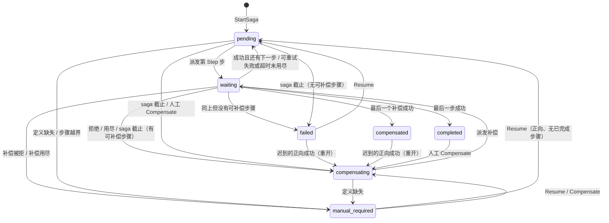

# 06 Saga 说明

> 本篇是框架整体文档 06 分区的**说明文档**，面向业务作者与运维。实现细节、不变量强制点和 review 检查点见 [实现文档](../impl/06-saga.md)。
>
> 源码基准：tag `v1.23.0`（`28912cd6`）。文中 `path:line` 都按这个 tag。codebase-memory 图谱停在 2026-09-30，`saga/step_transition.go`、`saga/step_operation_inbox.go`、`kit/saga/step_budgets.go` 未入索引，其余 saga 文件为 `metadata_changed`；本篇只用图谱核对覆盖情况，全部结论按 tag 源码直接读取。

## 速览

- Saga 是 roost 跨事务域（跨 Mongo database、跨服务、调外部系统）的长事务：协调器把每个 saga 存成一条带版本的记录，按步骤经 JetStream 派发命令，步骤完成后回送结果，失败时**按倒序做业务补偿**，不是内存回滚。
- 最重要的保证：协调器写记录只有一个出口（`stepTransition`），状态、待发命令、结果回执与操作关闭在**同一个 Mongo 事务**里提交；一个步骤操作（saga + 方向 + 步骤）的所有尝试里**至多一次生效**，并且只在协调器等它的窗口内生效；放弃之后才送达的正向成功会被协调器**补偿掉**（终态 `failed` / `compensated` 可能被重开）。
- 最容易踩的坑：把 `failed` / `compensated` 当成永不变化的终态；Mongo 步骤的业务写不经 handler 拿到的事务 ctx（那就不在“至多一次”之内）；在原生步骤里改 Remote 实体；把 `MaxDeliver` 当成业务重试上限；以为 handler 返回错误后同一次尝试会立即重试（原生步骤会等到命令截止）。
- 已知缺口（本篇写作时用探针证实，见 §7.3）：成功在**重试退避期间**送达被丢弃、随后在下一次派发前 saga 截止或被人工补偿时，这一步的生效既不补偿也不告警；启动 `Data` 超过 `max_payload_bytes` 时 saga 静默不创建。

本篇覆盖的包：

| 包路径 | 职责 |
| --- | --- |
| `saga/`（协调器） | `Engine`：定义注册、启动、协调循环、结果接收、`Resume` / `Compensate`；`stepTransition` 唯一写出口；记录 / 命令 / 结果数据模型 |
| `saga/`（存储） | `Store` 接口与唯一生产实现 `MongoStore`：记录、outbox、结果回执、操作 tombstone 四个集合 |
| `saga/`（步骤收件箱） | `stepOperationInbox`：每个操作一份状态文档的判定（15 行表），原生 `DataEngineStepInbox` 与 Mongo `MongoCommandInbox` 共用 |
| `saga/`（传输与消费者） | `JetStreamPublisher`、步骤消费者（`SubscribeMongoStep` / `SubscribeDataEngineStep`）、三个协调器侧消费者（普通结果、Nest 启动、原生 Nest 结果） |
| `saga/`（Nest 接口） | `EmitStart`、`BindCommand`、`EmitCompletion`：把启动意图、步骤回执与结果放进当前 Nest 事务 |
| `saga/assembly.go` | `Assemble` / `Assembly`：建 store、transport、engine，起三个消费者与协调循环，排空后停止 |
| `kit/saga/` | saga Mod：读 `saga.*` 配置（含步骤预算）、查 Mongo / JetStream 能力、转发生命周期、健康检查、跨 Mod 保留期校验 |
| `codegen/internal/roost/`（saga 部分） | `roost add saga` 生成定义与主题常量；bootstrap 把定义交给 `kitsaga.NewMod` |

---

## 1. 定位与边界

**一句话**：Saga 让“必须跨两个以上事务域、又要求最终一致”的业务流程可恢复、可补偿、可审计，并保证每一步不会因为重投、重试、崩溃重启而多生效。

| 负责 | 不负责 |
| --- | --- |
| 记录状态机：pending / waiting / compensating / completed / compensated / failed / manual_required | 单个 Nest handler、同一 Mongo 事务或 `RemoteWriteBatch` 能覆盖的操作（这些不该用 saga，`SAGA.md:3-4`） |
| 命令 outbox 至少一次发布、结果按 `CommandID` 回执去重 | 业务补偿的语义正确性（补偿怎么写由业务决定） |
| 步骤操作跨尝试、跨 Resume 代际的“至多一次生效” | 事务外的副作用（调另一个服务、发邮件）的幂等：仍要业务按 `IdempotencyKey` 去重 |
| 放弃后迟到的正向成功：自动补偿那一步；补偿方向的只告警 | 向业务推送终态（没有回调 / 事件流，业务只能 `Get` / `List`，`saga/engine.go:592-594`） |
| 步骤超时 / 重试预算（配置）、saga 截止、人工 `Resume` / `Compensate` 的 Go API | 运维命令入口（框架不提供 admin 命令；demo 只有只读的 `gm.saga.get` / `gm.saga.list`） |
| 从 Nest 事务原子地启动 saga、原生步骤与 Nest 事务原子提交 | WAL、投影与 lease fence 的执行（03 dataengine） |

跨分区：Nest 事务与 effect 见 [02 nest 与实体](./02-nest-entity.md)；原生步骤的生效点（投影事务对 fence 文档的条件写）、实体屏障与驱逐见 [03 DataEngine](./03-dataengine.md)；JetStream 驱动的 nak / Term 见 [04 sync 分区](04-sync.md)；配置读取规则见 [07 配置](07-config.md)；指标与健康见 [11 可观测](11-observability.md)；`roost add saga` 见 [12 codegen](12-codegen.md)。

[↑ 速览](#速览) · [实现文档 §1](../impl/06-saga.md#1-包与文件地图)

---

## 2. 核心概念与术语

### 2.1 一条 saga 记录的状态

| 状态 | 含义 | 是否终态 | 协调循环会不会再领取 |
| --- | --- | --- | --- |
| `pending` | 正向，等派发当前步骤（新建，或上一次尝试失败 / 超时后在重试退避） | 否 | 会（`next_run_at` 到期） |
| `waiting` | 已派发某次尝试，等它的结果；`next_run_at` 是这次尝试的截止 | 否 | 会（到期即超时处理） |
| `compensating` | 补偿方向，等派发下一个补偿（或补偿在重试退避） | 否 | 会 |
| `completed` | 全部正向步骤成功 | 是 | 否 |
| `compensated` | 全部需要补偿的步骤补偿成功 | 是，但**可能被重开**（§2.4） | 否 |
| `failed` | 正向失败且没有可补偿的步骤（第 0 步就失败） | 是，但**可能被重开** | 否 |
| `manual_required` | 补偿被拒绝或重试用尽、定义版本缺失、步骤下标越界：等运维处理 | 是（`Terminal()`，`saga/record.go:27-29`） | 否（`ClaimDue` 只领前三种，`saga/mongo_store.go:217`） |

`waiting` 在两个方向都用：`Phase` 字段（`forward` / `compensate`）区分正向等待与补偿等待。

状态机全图（简化，箭头上是原因）：



最后一条（`completed` 被人工 `Compensate`）是源码行为（`saga/engine.go:369-405` 只拒绝 `waiting` 和“没有可补偿的步骤”），`SAGA.md` 没有写到，见 §7.2。

### 2.2 术语表

| 术语 | 含义 | 出处 |
| --- | --- | --- |
| 定义（`Definition`） | `Type` + `Version` + 有序步骤；记录固化定义版本，旧 saga 不会跑新步骤 | `saga/record.go:179-201` |
| 步骤（`Step`） | 名字、正向主题、补偿主题（缺省 `<正向>.compensate`）、超时 / 重试预算 | `saga/record.go:72-80` |
| 操作（operation） | 一个 saga 的一个步骤的一个方向，键 `IdempotencyKey = <sagaID>:<phase>:<step>`（phase 1 正向、2 补偿）；**至多一次生效的单位** | `saga/engine.go:1058-1060` |
| 尝试（attempt） | 操作的一次派发；`CommandID = <操作键>:<attempt>`（第 0 代）或 `<操作键>:r<N>:<attempt>`（第 N 代） | `saga/engine.go:1087-1092` |
| 代际（incarnation，B1） | `Resume` 与“补偿方向的人工 `Compensate`”各开新一生，`Incarnation+1`，保证新 `CommandID` 与上一生的回执不相交 | `saga/step_transition.go:67-70` |
| 结果（`Completion`） | 成功 / 拒绝（`Retryable=false`）/ 可重试失败；成功的 `Data` 成为下一步命令的 `Payload` | `saga/record.go:303-320`、`saga/engine.go:937-939` |
| 回执（completion receipt） | 协调器侧：`_saga_completions`，`_id = CommandID`，与状态推进同事务；摘要不同即 `ErrIdentityConflict` | `saga/mongo_store.go:278-292` |
| tombstone | 协调器侧：操作关闭时写 `_saga_operations`，记关闭方式 `result`（接收了成功）/ `abandoned`（其他一切关闭） | `saga/mongo_store.go:323-346` |
| 步骤收件箱 | 步骤侧：判断“这次投递执行、回放还是等待”；原生与 Mongo 两种，共用一份判定 | `saga/step_operation_inbox.go:19-30` |
| 操作状态文档 | 步骤侧：每个操作一份，记当前尝试、租约、结论、拒绝（两生）、被接替尝试（16 条） | `saga/step_operation_inbox.go:92-117` |
| 租约（step lease） | 一次尝试的执行权，`lease_until = min(now + LeaseDuration, 命令截止)`；生效点要求租约未过期 | `saga/step_operation_inbox.go:321-327` |
| 生效点 | 原生步骤：DataEngine 投影事务对状态文档的条件写；Mongo 步骤：handler 事务里的 `settleOwnAttempt` | `saga/step_operation_inbox.go:25-27` |
| 接替（takeover / supersede） | 当前尝试租约过期、结论未知时，新尝试成为当前尝试（token+1），旧尝试再也不能生效 | `saga/step_operation_inbox.go:287-319` |
| 迟到步骤（`LateStep`） | 放弃之后才送达成功的正向步骤号+1；协调器先补它 | `saga/record.go:227-233` |
| 重开（reopen） | `failed` / `compensated` 因迟到成功回到 `compensating`；或 `manual_required` 上记下的迟到步骤在 `Resume` / `Compensate` 时先补 | `saga/engine.go:582-602` |

### 2.3 结果怎么被接收（协调器的接收规则）

协调器从 `CommandID` 解析代际，与记录当前代际比较（`saga/engine.go:429-448`）：

| 情形 | 处理 |
| --- | --- |
| 上一生（或比记录还新）的拒绝 / 可重试失败 | 不接收，计 `stale_incarnation`，消费者 ack |
| 上一生的成功，记录正停在这个操作上（在等它，或已回到这一步还没派发） | 接收为这一步的结果（成功在任何一生里都不重做） |
| 同一生，记录在等这个操作：成功或拒绝（任何一次尝试的） | 接收（这是“操作的结论”） |
| 同一生，记录在等这个操作：可重试失败，来自**正在等的那次** | 接收，退避后重试或用尽 |
| 同一生，记录在等这个操作：可重试失败，来自**较早的尝试**（方向 ③） | 不接收，计 `stale_attempt`，WARN |
| 其余（记录不在等这个操作） | 查回执与 tombstone：已记录 → 重复；放弃后迟到的成功 → §2.4；都没有 → `ErrNotWaiting`（消费者 Term） |

### 2.4 放弃后迟到的成功与重开（方向 ④）

协调器在**超时用尽、saga 截止、人工 `Compensate`、定义缺失、拒绝**时关闭一个操作，tombstone 记 `abandoned`。之后若送来这个操作的成功，说明这一步其实生效了、却不在 `CompletedSteps` 里：

| 迟到成功属于 | 记录当时 | 处理 |
| --- | --- | --- |
| 正向第 s 步 | 两个补偿之间，或已是 `failed` / `compensated` | 立即转去补偿第 s 步（终态被**重开**，计 `saga.reopened_total{reason="late_success"}`） |
| 正向第 s 步 | 某个补偿在等结果或在退避 | 不打断它；它结束后先补第 s 步 |
| 正向第 s 步 | `manual_required` | 只记下；运维 `Resume` / `Compensate` 时先补第 s 步（重开 `reason=resume/compensate`） |
| 补偿方向 | 任意 | 只告警（ERROR），按（操作，代际）一次；运维核对后 `Resume` |

补偿第 s 步的命令载荷是那次成功的 `Data`（`LateData`），它的补偿结果不进入 `Data` 链（`saga/engine.go:912-916`、`saga/engine.go:955-962`）。

[↑ 速览](#速览) · [实现文档 §3](../impl/06-saga.md#3-主流程)

---

## 3. 设计原因（关键取舍与维护者决定）

| 设计 | 为什么 | 出处 |
| --- | --- | --- |
| 协调器写记录只经 `stepTransition` | “放弃时关闭操作”曾在截止、人工 Compensate、定义缺失三个出口各漏写一次（U-0280、NC-250）。收成一个函数，由它决定关闭哪个操作、是否开新一生、带不带租约；`go/types` 守卫检查全包不能绕过（RR-20261006-14） | 维护者第六轮“saga 方向：按推荐 ①②，③④ 暂不做”；[方向 ①② 方案](../../feature/SAGA-DIRECTION-STEP-TRANSITION-AND-MONGO-INBOX-2026-10-06.md) |
| 至多一次的单位是“操作”而不是“命令” | 崩溃重启后协调器按超时发下一次尝试（新 `CommandID`），只按命令去重时同一步会生效两次（U-0280 的 kill -9 实测） | [U-0280](../../bugfix/U-0280-saga-step-reexecuted-after-crash.md)，维护者 2026-10-05 决定 |
| 租约封顶到命令截止 | 协调器只在截止后才判超时、发下一次尝试；截止后才到生效点的尝试（WAL 重放、投影积压）一律不生效，“生效”被关进“协调器在等”的窗口 | `SAGA.md:150-152` |
| Mongo 步骤也纳入同一契约（方向 ②） | 之前 Mongo 步骤只保证同一命令最多一次，跨尝试会重复生效（O-S5-4） | 第六轮决定；[方向 ①② 方案](../../feature/SAGA-DIRECTION-STEP-TRANSITION-AND-MONGO-INBOX-2026-10-06.md) |
| 收件箱每个操作一份状态文档 | 旧形状“每次尝试一份 claim + 按操作查询”连续出了 RR-20261006-15 / -16（claim 累积超上限）；判定真正需要的只是“谁持租约、有没有成功、本生有没有拒绝” | 维护者原话“我希望直接改成一份状态文档”；兼容：“不考虑旧进程，完成按照新的处理，线上还没有旧的进程跑”；[状态文档方案](../../feature/SAGA-OPERATION-STATE-DOC-2026-10-06.md) |
| Mongo 步骤两次提交（Reserve 事务 + 执行事务） | “在途可见”与“截止后可接替”同时成立就必须在业务事务之外先提交一次；合并成一个事务（选项 B）丢接替，乐观单事务（选项 C）丢在途等待。代价是单协程约 9 → 18 ms、吞吐约减半（本机） | 维护者选 A，原话“按照A，目前真正走saga的实际业务场景不多，55tps足够了”；[延迟分析](../../feature/SAGA-MONGO-STEP-LATENCY-2026-10-06.md) |
| 代际从 `CommandID` 解析、不加字段（B1） | 已生成工程的 handler 不会填新字段，缺省 0 会误判；`CommandID` 每份结果都带着 | 第二轮“协调器接收 completion 时核对代际：做”；[B1 方案](../../feature/B1-SAGA-COMPLETION-INCARNATION-2026-10-06.md) |
| 只接收正在等的那次尝试的可重试失败（方向 ③） | 较早尝试晚到的可重试失败会让协调器按后一次的尝试计数判用尽、放弃正在执行的尝试（O-S5-7）；拒绝仍从任何尝试接收，因为收件箱会回放它 | 第十三轮“希望本次能完成了”；[方向 ③④ 方案](../../feature/SAGA-DIRECTION-3-4-2026-10-07.md) |
| 迟到成功补偿那一步，允许重开终态（方向 ④） | 第 0 步被放弃即 `failed`、补偿结束即 `compensated`，只处理非终态覆盖不到这两种；重开只发生在“确有一步生效却未被补偿”时 | U-0280 方向 C；第十三轮“saga 迟到成功重开终态选 A”，补指标与日志 |
| `ErrDefinitionMissing` 在结果流上可重试（nak） | 滚动发布时派发方已有新定义、处理结果的协调器还没升级；Term 会丢结果 | 发版前审查观察，`saga/nest_completion_consumer.go:146-149` |
| 步骤预算是配置 | 重试次数要按部署调（例如 demo 的退款要撑过一次崩溃重启） | U-0280；`kit/saga/step_budgets.go:13-30` |

[↑ 速览](#速览) · [实现文档 §9](../impl/06-saga.md#9-历史与重要修复)

---

## 4. 怎么用（业务作者视角）

### 4.1 步骤清单

1. `roost add mod saga -service <svc>`（或 `roost add saga` 时自动加 saga Mod）。
2. `roost add saga GiftItem -service game -steps debit,deliver`：生成 `saga/gift_item/definition.go`（生成器 `codegen/internal/roost/add.go:462-553`）。
3. bootstrap 生成 `kitsaga.NewMod(kitsaga.CombineDefinitions(<pkg>.Definitions(), ...)...)`（`codegen/internal/roost/render.go:496-502`），saga Mod 在 `Provide` 时注册全部定义。
4. 在 Nest handler 里用 `<pkg>.EmitStart(...)` 启动（与实体修改同一条 WAL 记录）。
5. 为每个主题（正向、补偿）各订阅一个步骤消费者：业务是 Nest 事务的用 `SubscribeDataEngineStep`（原生），其他用 `SubscribeMongoStep`。
6. 在 `saga.step_defaults` / `saga.steps.<type>.<step>` 配预算。

### 4.2 生成的定义（gift_item）

生成物的形状（由 `add.go:497-551` 的模板产出）：

- 常量 `Type = "gift_item"`、`Version uint32 = 1`；每步两个主题常量 `TopicDebit = "gift_item.debit"`、`TopicDebitCompensation = "gift_item.debit.compensate"`；
- `Definition()` 只写名字与主题，**不写预算**（由 `Engine.Register` 按配置补齐）；
- `Definitions()`：改步骤顺序或补偿语义时递增版本，并把旧版本留在这里，直到旧版本没有非终态记录；
- `Register(engine)`、`EmitStart(businessKey, state, deadline)`（Nest handler 用）、`Start(ctx, engine, ...)`（已在可靠消费者 / 运维路径里用）；
- 每步 `Subscribe<Step>` / `Subscribe<Step>Compensation`：包装 `SubscribeMongoStep`。原生步骤不用它们，直接用主题常量调 `SubscribeDataEngineStep`。

### 4.3 启动：在 Nest 事务里发启动意图

真实示例：`demo/game/handler/start_gift.go.tmpl:34-53`。

```go
//roost:nest rollback=undo durability=strict
func handlerStartGift(target player.IBagEntity, /* ... */ sagaID string) (string, error) {
    // 在实体锁下检查；然后把启动意图放进同一条 WAL 记录
    return sagaID, saga.EmitStart(saga.StartRequest{
        ID: sagaID, Type: giftitem.Type, DefinitionVersion: giftitem.Version, BusinessKey: sagaID,
        Data: state, DeadlineAt: time.Now().Add(gift.Deadline),
    })
}
```

- 启动意图是 effect `saga-start:<摘要>`（`saga/nest.go:32-52`），随 DataEngine outbox 发到效果流 `<effect_prefix>.saga.start`，协调器的 Nest 启动消费者调 `StartSaga`（`saga/nest_start_consumer.go:88-108`）。
- **启动幂等**：同一 `(type, business_key)` 再次启动，只有定义版本、ID、`Data`、`DeadlineAt` 都相同才返回已有记录（不重置进度），否则 `ErrIdentityConflict`（`saga/engine.go:245-262`）。`DeadlineAt` 规范到 UTC 毫秒（`saga/engine.go:1113-1120`）。
- 不在 Nest 事务里时（可靠消费者、运维）才直接 `Engine.StartSaga`。
- **`Data` 不要超过 `saga.max_payload_bytes`（缺省 64 KiB）**：`EmitStart` 只按 4 MiB 校验，超过配置上限的启动意图在协调器侧被拒、且不会报回业务（§7.3）。

### 4.4 原生步骤（业务是 Nest 事务）

真实示例：consumer `demo/internal/service/game/gift_saga.go.tmpl:139-206`，handler `demo/game/handler/gift_debit.go.tmpl:30-41`，事务内绑定 `demo/game/gift/gift.go.tmpl:65-85`。

```go
// 消费者（每个主题一个 durable）
nativeInbox, _ := saga.NewDataEngineStepInbox(mongo, dataEngineDatabase, saga.DataEngineStepInboxOptions{
    Owner: "<本进程唯一>", LeaseDuration: 2 * time.Minute, // 必须 > AckWait
})
saga.SubscribeDataEngineStep(ctx, js, transport, nativeInbox,
    saga.StepConsumerConfig{Stream: stream, Durable: "game-gift-debit", Topic: giftitem.TopicDebit, Admit: admit}, debit)

// step handler：从 ctx 取 reservation，作为显式参数交给 Nest handler
reservation, ok := saga.ReservationFromContext(ctx)
// Nest handler 内：先改业务，再 Bind + EmitCompletion（成功或业务拒绝都要提交）
if err := inbox.Bind(command, reservation); err != nil { return err }
return saga.EmitCompletion(saga.Completion{CommandID: command.ID, IdempotencyKey: command.IdempotencyKey, SagaID: command.SagaID, Success: true})
```

要点：

- 业务修改、`saga-step/<CommandID>` 回执、lease fence 控制回执、`saga-completion:<CommandID>` 结果 effect 是**同一条 CommitRecord**（`saga/nest.go:66-125`）。step handler 的返回值不使用（`saga/command_consumer.go:488-491`）。
- 原生收件箱放在 **DataEngine 的库**里（`_dataengine_step_operations`），因为 fence 是投影事务对这个库的条件写；与 saga 的库无关（`gift_saga.go.tmpl:128-138`）。
- **业务拒绝也要提交**一笔只有回执与失败结果的事务；协调器听不到的拒绝只能等超时。
- `reservation` 只能显式传参，不能拷进后台 goroutine（`saga/dataengine_step_inbox.go:45-48`）。
- 原生步骤**不能修改 Remote 实体**：DataEngine 返回 `engine.ErrRemoteLeaseFenceUnsupported`（`SAGA.md:115-124`）。
- 实体屏障：原生步骤记录准入 WAL 后、投影结论前，写同一实体的其他事务得到可重试的 `dataengine.ErrFencedEntityPending`（[03 实现 §3.9](../impl/03-dataengine.md#39-原生步骤屏障与驱逐)）。

### 4.5 Mongo 步骤（业务是 Mongo 写或外部调用）

真实示例：`gift_saga.go.tmpl:590-634`（deliver 发邮件）。

```go
inbox, _ := saga.NewMongoCommandInbox(mongo, sagaDatabase, "_game_gift_step_inbox") // 状态文档在 <集合>_operations
saga.SubscribeMongoStep(ctx, js, transport, inbox,
    saga.StepConsumerConfig{Stream: stream, Durable: "game-gift-deliver", Topic: giftitem.TopicDeliver},
    func(txCtx context.Context, cmd saga.Command) (saga.Completion, error) {
        // 业务写必须经 txCtx 写进这笔 Mongo 事务，才在“至多一次”之内
        return saga.Completion{Success: true}, nil
    })
```

- handler 运行在可重跑的 Mongo 事务回调里（`saga/command_consumer.go:22-30`）：不要在里面做不可逆的网络调用，或者让外部服务按 `IdempotencyKey` 去重（gift deliver 用邮件的 `RequestID = IdempotencyKey`）。
- 返回 `error` 表示基础设施失败：事务回滚、交还租约，消息 nak 后重投会立即重试（`saga/command_consumer.go:134-141`）。业务拒绝返回 `Completion{Success:false, Error:...}`。

### 4.6 Admit：多进程下谁能执行

一个 durable 被同服务全部进程共享，命令会落到任意空闲进程。只有某个进程能执行时（例如步骤要写某个玩家，玩家绑定在某个 sid），设置 `StepConsumerConfig.Admit`：它在**取租约之前**被问，返回错误即 nak（`saga/command_consumer.go:230-249`）。在 handler 里拒绝太晚：租约已记在错误进程名下，正主要等租约过期。demo 的做法见 `gift_saga.go.tmpl:426-507`（拒绝 + 经 ownerroute 转交给正主）。

### 4.7 运维 API

| API | 作用 | 约束 |
| --- | --- | --- |
| `Engine.Get(ctx, id)` / `List(ctx, Query)` | 读记录；`List` 按类型 / 定义版本 / 状态 / 更新时间分页，`Limit ≤ 1000` | `saga/engine.go:287-296` |
| `Engine.Resume(ctx, ResumeRequest)` | `failed` / `manual_required` 修复原因后继续：正向无已完成步骤 → 回到 `pending`；否则进入补偿（先补迟到步骤）；总是开新一生 | 原截止已过且在正向时必须给新的未来截止或 `ClearDeadline`，否则 `ErrDeadlineExpired`（`saga/engine.go:300-365`） |
| `Engine.Compensate(ctx, id, reason, now)` | 人工发起补偿 | `waiting` 拒绝；没有已完成步骤也没有迟到步骤拒绝；已在补偿 / 已补偿直接返回（`saga/engine.go:369-405`） |

框架**没有**把这三个操作接到 admin 命令；demo 只提供只读的 `gm.saga.get` / `gm.saga.list`（`demo/internal/service/game/gm.go.tmpl:48-49`）。需要运维写操作时，业务自己用 Go API 包一层 admin 命令。

### 4.8 按终态做业务的一方要注意

saga 没有终态推送；读终态的一方要：

1. 读到终态时记下 `Record.Version`，之后 `Version` 变大就按新状态重新处理（重开、`Resume`、人工 `Compensate`）；
2. 不要假设 `failed` 的 saga 没有任何一步生效：迟到生效的那一步由协调器补偿掉，最终变成 `compensated`；
3. 按 saga id 幂等地执行“终态动作”（发失败通知、释放预留、写对账），第二次到达终态时重做一次即可（`SAGA.md:306-313`）。

[↑ 速览](#速览) · [实现文档 §3](../impl/06-saga.md#3-主流程)

---

## 5. 配置

### 5.1 `saga.*`（kit saga Mod，声明在 `kit/saga/config.go:31-75`）

缺省值与 `coresaga.DefaultOptions()` 一致（`TestSagaDeclaredDefaultsMatchCoreDefaults`）；写 0 或负数被拒绝，要缺省就不写这个键。

| 键 | 缺省 | 说明 |
| --- | --- | --- |
| `database` | `saga` | 协调器四个集合所在库 |
| `collections.{sagas,outbox,completions,operations}` | `_sagas` / `_saga_outbox` / `_saga_completions` / `_saga_operations` | `operations` 是协调器的 tombstone，**不是**步骤收件箱的状态文档 |
| `owner` | `saga-<sid>-<随机>` | 协调器租约持有者名（`kit/saga/mod.go:68-71`） |
| `subject_prefix` / `stream` | `roost.saga` / `ROOST_SAGA` | 命令 `<prefix>.command.<topic>`，结果 `<prefix>.result.<sagaID>` |
| `coordinator_workers` / `publisher_workers` | 4 / 4 | 协调循环 / outbox 发布 goroutine 数，上限 1024 |
| `coordinator_claim_batch` / `publisher_claim_batch` | 3 / 1 | 每次领取条数，上限 4096 |
| `lease_duration` | 15s | 记录与 outbox 领取租约 |
| `store_timeout` / `publish_timeout` | 3s / 3s | 每次存储调用 / 发布的超时 |
| `poll_interval` | 100ms | 没有 kick 时的扫描间隔 |
| `publish_backoff_min` / `publish_backoff_max` | 50ms / 5s | outbox 发布失败退避 |
| `max_payload_bytes` | 65536 | 启动 `Data` 与结果 `Data` 上限（硬上限 4 MiB） |
| `completion_receipt_ttl` | 720h | 结果回执与 tombstone 的 TTL；必须 > `stream_max_age`，且（结果效果流就是 DataEngine 效果流时）> `dataengine.effects.max_age`（`kit/saga/mod.go:111-137`） |
| `stream_max_age` / `stream_max_bytes` / `duplicate_window` / `replicas` | 168h / 8 GiB / 10m / 1 | saga 流参数 |
| `result_durable` + `result_{ack_wait,process_timeout,max_deliver,max_ack_pending,nak_backoff_min,nak_backoff_max}` | `roost-saga-coordinator`；30s / 3s / 25000 / 256 / 250ms / 30s | 普通结果消费者 |
| `start_effect_{stream,prefix,durable}` + `start_effect_*` | `ROOST_EFFECTS` / `roost.effect` / `roost-saga-start`；同上 | Nest 启动消费者 |
| `result_effect_{stream,prefix,durable}` + `result_effect_*` | 不写取 start 的流 / 前缀，durable 取 `<start_durable>-result` | 原生 Nest 结果消费者（`saga/assembly.go:35-75`） |
| `step_defaults.{timeout,max_attempts,backoff_min,backoff_max}` | 5s / 5 / 100ms / 5s | 步骤预算缺省 |
| `steps.<type>.<step>.<字段>` | 无 | 按步骤覆盖 |

### 5.2 步骤预算的取值顺序

每个字段独立取（`saga/record.go:101-136`）：

1. `saga.steps.<type>.<step>` 里该字段非零；
2. 定义里写的值；
3. `saga.step_defaults`；
4. 框架缺省 5s / 5 次 / 100ms..5s。

- 一次操作最多 `max_attempts` 次尝试（上限 1000），每次等 `timeout`，相邻两次按 `backoff_min..backoff_max` 指数退避加抖动（`saga/engine.go:1157-1185`）。**正向与补偿共用同一份预算**。
- 有定义时，`saga.steps` 下不存在的类型 / 步骤让 `Init` 失败；只差大小写的两个类型名或步骤名报歧义（viper 键一律小写，`kit/saga/step_budgets.go:82-106`）。没有定义时（`kitsaga.NewMod()` 无参）按小写键保存，`Resolve` 原样查不到再按小写查（`saga/record.go:120-127`）。
- 校验分两层：`StepBudgets.Validate` 只拒绝负数、>1000 次、**两者都写了**且上限 < 下限（`saga/record.go:139-159`）；补齐后的定义由 `Definition.Validate` 再查一遍（`saga/record.go:192`）。例如只在某步覆盖 `backoff_min: 10s`、不写 `backoff_max`，配置层放过，`Provide` 时 `Register` 失败。
- 生成工程可用 `kitsaga.StepBudgetsFromConfig(cfg, definitions...)` + `Resolve` 在单测里得到与运行时相同的预算（demo `gift_saga_budget_test.go`）。

demo 的例子：退款只能在发送方绑定的 sid 上执行，那个进程崩溃重启约 90s，于是 `saga.steps.gift_item.debit.max_attempts: 15`（`codegen/internal/roost/demo.go:217-246`，推导见 `gift_saga.go.tmpl:551-561`）。

### 5.3 启动时拒绝的组合（`saga/engine.go:150-188`）

| 条件 | 含义 |
| --- | --- |
| `store_timeout < lease_duration` | 一次存储调用不能比租约长 |
| `lease_duration > publish_timeout` | |
| `store_timeout < (lease_duration − store_timeout) / coordinator_claim_batch` | 批内最后一条处理前租约不能过期 |
| `publish_timeout < (lease_duration − store_timeout) / publisher_claim_batch`，且再减去 `publish_timeout` 后仍 > `store_timeout` | 发布 + ack 不能超出租约 |
| 三个消费者 `process_timeout < ack_wait`；`max_deliver ≤ 1e6`、`max_ack_pending ≤ 65536`、`nak_backoff_max ≤ 24h` | `saga/jetstream.go:114-116`、`saga/jetstream.go:165-167` |

### 5.4 步骤消费者与收件箱（代码参数，不在 `saga.*` 里）

| 参数 | 缺省 | 说明 |
| --- | --- | --- |
| `StepConsumerConfig.AckWait` / `MaxDeliver` / `MaxAckPending` / `NakBackoffMin` / `NakBackoffMax` | 30s / 25000 / 256 / 250ms / 30s | `saga/command_consumer.go:256-273`；`MaxDeliver × NakBackoffMax` 约 8.7 天 |
| `DataEngineStepInboxOptions.LeaseDuration` | 1 分钟 | 必须 > `AckWait`，否则 `SubscribeDataEngineStep` 拒绝（`saga/command_consumer.go:399`）；实际租约再封顶到命令截止 |
| `DataEngineStepInboxOptions.Owner` | 无，必填 | 每个进程唯一 |
| `CommandInboxOptions.Owner` / `LeaseDuration` / `ReceiptTTL` | 随机 / 1 分钟 / 30 天 | `saga/command_consumer.go:61-73` |
| `ReceiptTTL`（两种收件箱） | 30 天 | 回执与状态文档保留期 |

**`AckWait` 要大于步骤 `timeout`**：消费者处理一次投递最长等到命令截止（`processCtx` 截止 = `Command.DeadlineAt`），步骤超时调到超过 `AckWait` 时，同一消息会在处理中被重投。框架没有校验这一条（只校验 `LeaseDuration > AckWait`）。

[↑ 速览](#速览) · [实现文档 §7](../impl/06-saga.md#7-持久化与协议格式)

---

## 6. 运行与运维

### 6.1 指标与计数

| 指标 | `Stats()` 字段 | 含义 / 是否故障 |
| --- | --- | --- |
| `saga.reopened_total{saga_type,from_status,reason}` | `Reopened` | saga 被重开；不是故障，持续增长说明结果送达常晚于步骤截止 |
| `saga.completion.late_after_abandon_total{saga_type,phase}` | `LateAfterAbandon` | 放弃后迟到的成功。`phase=forward` 已自动补偿（WARN）；`phase=compensate` 要核对（ERROR，T-226） |
| `saga.completion.stale_attempt_total{saga_type,phase}` | `StaleAttempt` | 较早尝试的可重试失败被忽略（方向 ③），正常 |
| `saga.completion.stale_incarnation_total{saga_type,phase}` | `StaleIncarnation` | 上一生的拒绝 / 失败被忽略（B1），正常 |
| `saga.step_inbox.superseded_total` | — | 收件箱接替了一次租约过期的尝试 |
| `saga.step_inbox.mark_completed_error_total` | — | 读到回执后结算状态文档失败（RR-20260927-16），持续增长要查集合写入权限 / 校验 |
| `saga.step.expired_unexecuted_total` | — | 过期 / 被接替 / 被 fence 的投递不执行直接 ack（U-0281） |
| `saga.step.attempt_replayed_total` | — | 把同一操作另一次尝试的结果重发给协调器 |
| `dataengine.fence.skipped.total{resource="_dataengine_step_operations"}` | — | 原生步骤记录因租约失效被投影跳过（03） |
| `nats.jetstream.terminal.total{reason}` | — | `permanent`（Term）或 `max_deliver` |
| — | `Started` / `Dispatched` / `Completed` / `Compensated` / `Failed` / `ManualRequired` | 按**到达终态的次数**计，重开后再计；`Failed` 也包含进入 `ManualRequired` 的次数（`saga/engine.go:1143-1155`） |
| — | `Conflicts` / `Duplicates` / `PublishFailures` / `StoreFailures` / `WorkerFailures` | 健康消息里列出 |

健康检查 `saga`（`kit/saga/mod.go:203-218`）：协调循环没跑、三个消费者任一关闭、循环异常退出、Mongo ping 失败都报 fail；OK 时消息带上面的计数。

### 6.2 日志

| 级别 | 文本开头 | 场景 |
| --- | --- | --- |
| WARN | `saga: reopened to compensate a step ...` | 重开（字段 `saga_id`、`from_status`、`reason`、`late_step`、`version`） |
| WARN | `saga: step succeeded after the coordinator abandoned it; compensating it` | 正向迟到成功，已安排补偿 |
| INFO | `saga: compensated the step that took effect after ...` | 迟到的那一步补偿完 |
| ERROR | `saga: step succeeded after the coordinator abandoned it; the coordinator cannot account for it` | 补偿方向迟到成功，要人工核对 |
| WARN | `saga: ignored a retryable failure from an earlier attempt ...` / `... from an earlier incarnation ...` | 方向 ③ / B1 |
| ERROR | `saga: consumer processing failed`（`kind=...`） | 消费者处理失败，带 `deliveries` |
| ERROR | `saga: claim due` / `saga: process` / `saga: claim outbox` | 协调循环存储失败 |

### 6.3 看一个 saga 卡在哪里

- 记录：`db._sagas.findOne({_id: "<sagaID>"})`，看 `status`、`phase`、`step`、`attempt`、`incarnation`、`last_error`、`next_run_at`、`late_step`。
- 待发命令：`db._saga_outbox.find({saga_id: "<sagaID>"})`；`last_error` 是发布失败原因。
- 步骤侧：`db._dataengine_step_operations.findOne({_id: "<saga>:<phase>:<step>"})`（原生，在 DataEngine 库）或 `<收件箱集合>_operations`（Mongo 步骤）。`status=pending` 且 `lease_until` 在未来 = 有尝试在途；`superseded` 是被接替的尝试。
- 协调器 tombstone：`db._saga_operations.findOne({_id: "<操作键>"})`，`closure` 为 `result` / `abandoned`，`late_alarms` 是补偿方向迟到成功告警标记。

### 6.4 常见故障 → TROUBLESHOOTING

| 现象 | T 行 |
| --- | --- |
| `failed` / `compensated` 又变回 `compensating`，`late_step>0` | T-292 |
| 启动失败：`completion_receipt_ttl ... must exceed dataengine.effects.max_age` | T-281 |
| Mongo 分区时 saga 卡住远超 `transaction_timeout` | T-239 |
| 原生步骤同一操作多个尝试号回执 / `late_after_abandon` 告警 | T-226 |
| 原生步骤 durable `num_ack_pending` 卡在 `MaxAckPending` | T-225 |
| outbox 刚 Nack 又被另一发布者领取 | T-223 |
| 原生结果被判 invalid / Permanent（路由与 SagaID 不符） | T-222 |
| 启动重投报 identity conflict | T-221 |
| Resume 后代际丢失、命令 ID 复用 | T-219 |
| 原生结果消费者退出但健康仍 OK（旧版） | T-218 |
| 原生步骤 saga 永远 waiting（旧版无原生结果消费者） | T-125 |
| 步骤拒绝后记录一直 waiting / pending（旧版版本号 +2） | T-119 |
| 同一命令 ID 两份不同内容被当重投 | T-44 |
| 启动报 `unknown mod dependency "health"`（旧 kit） | T-31 |

运维要点（`SAGA.md:217-231`、`SAGA.md:330-358`）：

- **投影积压超过步骤 `timeout` 时步骤停住而不是重复执行**：每次尝试都在截止后才投影、被跳过；调大 `timeout` 或解决 Mongo 变慢，不要调大 `LeaseDuration`（已被截止封顶）。
- **进程被 kill -9 后遗留的 Mongo 事务**持锁到 `transactionLifetimeLimitSeconds`（缺省 60s），默认预算（约 30s）可能用尽；推荐把服务端参数调到 20，或按步骤调大 `max_attempts`。
- **屏障期间的重投消耗 `MaxDeliver`**：用尽后消息被 Term，只能等协调器的下一次尝试。
- 升级（v1.22.0 及以前 → v1.23.0）：步骤进程先停旧再起新，原生步骤进程先排空 WAL，丢弃旧 claims 集合（`SAGA.md:243-246`）。

[↑ 速览](#速览) · [实现文档 §6](../impl/06-saga.md#6-失败与不确定结果处理)

---

## 7. 保证与不保证

### 7.1 保证

| 保证 | 条件 |
| --- | --- |
| 记录状态、新命令、结果回执、操作关闭、清理旧排队命令在同一个 Mongo 事务里提交 | 生产 Store 为 `MongoStore`（`saga/mongo_store.go:243-350`）；自定义 Store 要自己做到 |
| 过期的协调器（租约被接管）写不进记录 | 协调循环按版本 + 租约 fence；`Complete` / `Resume` / `Compensate` 按版本 fence |
| 一个操作的所有尝试、所有代际里至多一次生效 | 业务写在生效点的同一事务里（原生：Nest 事务；Mongo：handler 的事务 ctx）；时钟偏差远小于步骤 `timeout` |
| 一次尝试只在命令截止前生效 | 同上 |
| 成功一旦生效，后来的尝试（包括新一生）回放它，不再执行 | 状态文档或回执未过 TTL |
| 同一生的拒绝被之后的尝试回放（最近两生） | 同上 |
| 放弃关闭之后送达的正向成功被补偿；补偿方向的只告警，按（操作，代际）一次 | 回执与 tombstone 未过 TTL（因此有 `completion_receipt_ttl` 的启动校验） |
| 启动重投幂等，不同意图明确冲突 | 记录有 `start_digest`（新记录都有） |
| 协调器时间不被步骤时钟污染 | `Complete` 用本地时间覆盖 `CompletedAt`（`saga/engine.go:426-428`） |

### 7.2 不保证 / 已知限制

- **事务外副作用**：被 fence 中止的 Mongo 步骤可能已经发出外部调用；外部服务必须按 `IdempotencyKey` 幂等。
- **原生步骤不能改 Remote 实体**；也没有原生步骤与 Remote 写原子提交的入口。
- **原生 handler 返回错误**（`ErrFencedEntityPending` 以外）时租约不交还：同一命令的重投得到 `Duplicate` 并等回执直到命令截止，这次尝试实际作废，下一次尝试要等步骤 `timeout` 之后（`saga/command_consumer.go:491-503`）。这是有意的（错误可能是“结果未知”），但 demo 模板注释写的是“delivery retries”，见实现文档 §11。
- **补偿顺序**：迟到步骤在“下一个边界”补偿，可能排在一个已在途的补偿之后，不是严格倒序。
- **终态可变**：`failed` / `compensated` 可被重开；`completed` 可被人工 `Compensate` 带回补偿（源码允许、不计 `reopened_total`，`SAGA.md` 未写明）。
- **时钟**：协调器、步骤进程、投影进程的时钟偏差要远小于步骤 `timeout`（`SAGA.md:222`）。saga 全部用系统时钟（`docs/USER_GUIDE.md:574`）。
- **Mongo 步骤延迟**：每次尝试两次落盘提交，本机单协程约 18 ms、吞吐约 55 次/s（32 协程约 1000 次/s）；生产形态未测（E12）。对延迟敏感的流程改用原生步骤或不走 saga。
- **TTL 之后**：回执 / tombstone / 状态文档 30 天后过期，之后到达的旧结果只能 `ErrNotWaiting` Term。
- **混跑**：步骤进程不支持 v1.22.0 及以前混跑（维护者决定，线上未部署）。

### 7.3 写作时确认的源码缺口（交 review 闭环）

1. **退避期间送达的成功可能永久丢失**（探针已证实）。同一生里，尝试 k 在截止前生效，但它的结果在 k 超时之后、下一次尝试派发之前（重试退避期间）送达：协调器不在等，返回 `ErrNotWaiting`，结果消费者 Term。正常情况下下一次尝试 k+1 会在收件箱里读到 k 的成功并回放；但如果在派发 k+1 之前 **saga 截止**、**人工 `Compensate`** 或**定义缺失 fence** 关闭了这个操作，就再也没有投递会重发这份成功。结果：这一步生效、不在 `CompletedSteps`、`LateStep=0`、没有任何告警。证据与探针输出见[实现文档 §11 S1](../impl/06-saga.md#11-源码疑点与文档不一致)。
2. **启动意图可能静默丢失**（探针已证实）。`EmitStart` 允许 `Data` 到 4 MiB，`StartSaga` 按 `saga.max_payload_bytes`（缺省 64 KiB）拒绝；Nest 启动消费者不把这个错误（以及 `ErrIdentityConflict`）当终态，nak 约 8.7 天后 Term，saga 从未创建，而发起它的 Nest 事务早已提交。在问题闭环前，业务自己保证启动 `Data` 不超过 `max_payload_bytes`。见[实现文档 §11 S7](../impl/06-saga.md#11-源码疑点与文档不一致)。
3. 其余疑点（原生步骤消费者对坏消息 nak 到 `MaxDeliver`、坏记录让 `ClaimDue` 丢弃整批）见实现文档 §11。

### 7.4 需外部验证

| 项 | 编号（[外部验证清单](../../review/EXTERNAL-VERIFICATION-2026-10-06.md)） |
| --- | --- |
| 跨主机分区与时钟偏差下的“至多一次”与迟到成功 | E02 |
| NATS JetStream 多节点 HA 下的 nak / MaxDeliver / 过期 ack | E06 |
| Mongo 跨主机副本集、切主中的协调器提交与收件箱 | E11 |
| Mongo 步骤延迟的生产形态 | E12 |
| 多主机强杀 | E13 |

[↑ 速览](#速览) · [实现文档 §4](../impl/06-saga.md#4-不变量清单)

---

## 8. 相关文档

| 文档 | 内容 |
| --- | --- |
| [实现文档 06](../impl/06-saga.md) | 本分区的实现、不变量、并发、review 检查点、源码疑点 |
| [SAGA.md](../../../SAGA.md) | 原生步骤执行契约全文、操作状态文档、运维观察（快速参考） |
| [USER_GUIDE §7](../../USER_GUIDE.md) | 跨服务 Saga、步骤预算 |
| [U-0280](../../bugfix/U-0280-saga-step-reexecuted-after-crash.md)、[U-0281](../../bugfix/U-0281-saga-expired-command-nak-forever.md) | 至多一次契约与过期 ack 的来由 |
| [方向 ①②](../../feature/SAGA-DIRECTION-STEP-TRANSITION-AND-MONGO-INBOX-2026-10-06.md)、[状态文档](../../feature/SAGA-OPERATION-STATE-DOC-2026-10-06.md)、[B1](../../feature/B1-SAGA-COMPLETION-INCARNATION-2026-10-06.md)、[方向 ③④](../../feature/SAGA-DIRECTION-3-4-2026-10-07.md)、[Mongo 步骤延迟](../../feature/SAGA-MONGO-STEP-LATENCY-2026-10-06.md) | 设计方案、论证与证据 |
| [v1.23.0 发版说明 SAGA](../../release/v1.23.0/guide-saga-drv-dao-rem.md) | 本版 SAGA-1～17 改动记录 |
| [02 nest 与实体](./02-nest-entity.md)、[03 DataEngine](./03-dataengine.md) | Nest 事务、effect、投影 fence、实体屏障 |
| 04 sync、07 配置、11 可观测、12 codegen 分区 | [guide/04-sync.md](04-sync.md)、[guide/07-config.md](07-config.md)、[guide/11-observability.md](11-observability.md)、[guide/12-codegen.md](12-codegen.md) |

[↑ 速览](#速览) · [实现文档](../impl/06-saga.md)
