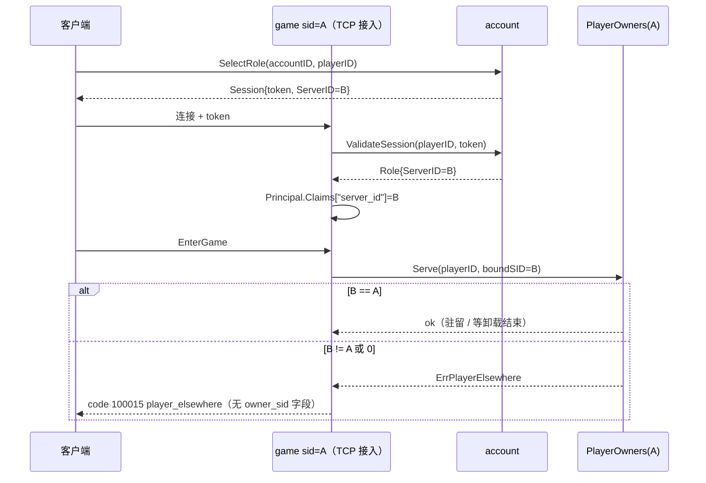

# 09 kit 服务（说明）

> 配套实现文档：[impl/09-kit-services.md](../impl/09-kit-services.md)（文件地图、主流程与状态机、键空间、不变量与守卫测试、review 检查点、源码疑点）。
> 源码基准：tag `v1.23.0`（`28912cd6`）。文中 `path:line` 都按这个 tag。codebase-memory 图谱的代际早于 tag（停在 2026-09-30 前后），本篇只用图谱定位，结论全部按 tag 源码直接读取（`git show v1.23.0:<path>` / tag 上的 detached worktree）。
> 已登记、本篇直接引用的问题：[框架文档发现登记](../../review/FRAMEWORK-DOCS-FINDINGS-2026-10-07.md) 的 F09-R1～R4、F09-V、F09-K、F09-D。

## 速览

- **这一块是什么**：kit 自带的十个“玩家之外”的业务服务——account（账号 / 角色 / 会话令牌）、platform（渠道登录 / 支付回调 / 发货）、session（副本类“一次运行”与资源回收）、global（game 服到全局服的路由绑定）、activity（跨服活动协调）、mail、chat、match、rank、directory（名字唯一）。每个服务是一个 Mod，状态全部放在 Redis 里，经 `versionstore`（带版本的 KV，见 [03 §4.8](03-dataengine.md)）或少量 Lua 读写；跨进程调用走生成的 servicerpc（NATS 总线）。另外一块是 game-demo 模板里的**玩家静态绑定**：玩家建角时定下 sid，之后只由那个 game 进程服务，跨服赠礼按 `FromSID` 转交。
- **最重要的保证**：同一份业务代码在“服务和 game 同进程”与“服务独立进程”两种部署下一字不差（`app.Lookup[mail.Mail]` 拿到的要么是本地包装，要么是总线客户端）；每个写操作都有自己的幂等依据（请求 ID / 状态比对 / 令牌），重试安全不依赖传输层；业务错误按 errcode 跨进程还原，`errors.Is(err, svc.ErrX)` 在两种部署下都成立。
- **最容易踩的坑**：① `key_prefix` 必填、没有缺省，Redis Cluster 下 platform / rank / activity 必须带 hash tag。② 总线客户端的 `affinity` 标记在 v1.23.1 前**没有生效**（F09-R1，已修复，见 RR-20261006-59：affinity 方法经 etcd discovery 按键路由，调用方必须装 etcd Mod，缺了启动时拒绝）、轻量传输 `call_timeout` 超过 5s 会被截到 5s（F09-R2）、服务端开 `nats.rpc.transport=jetstream` 时生成的 ClientMod 调不通（F09-R3）。③ 存储“回复丢失”（`versionstore.ErrOutcomeUnknown`）在服务层**没有任何处理**，会以 `CodeInternal` 返回；调用方必须用同一个请求 ID 重试（F09-V）。④ session、match、activity、platform 的后台扫描要显式配置（`WithSweepOwners`、`match.sweep_queues`、`activity.groups_file`），不配就什么都不扫。⑤ `player_elsewhere` 的回包里没有 `owner_sid`，客户端只能重新 SelectRole（F09-K ①）。

### 本篇覆盖的包

| 包 | 职责 |
| --- | --- |
| `kit/service/account` | 账号、建角（判定表 + 持久计划）、选角签 session token、校验令牌、区服登记、建角人工处理 |
| `kit/service/platform` | 渠道会话（Verifier + PlayerResolver）、支付回调验签与入账、发货状态机、后台重试、人工处理 |
| `service/session` + `kit/service/session` | 一次运行（run）的进入 / 挂资源 / 结束 / 过期，资源恰好释放；core 是领域实现，kit 是别名 + Mod |
| `kit/service/global` | game sid → 全局服 sid 的路由绑定与迁移（epoch 栅栏） |
| `kit/service/global/activity` | 跨服活动：开窗、各服上报阶段、进度账本、结果投递（dispatch）与 ACK、活动组文件 |
| `service/mail` + `kit/service/mail` | 邮件：信封、邮箱、发送账本、三段式领取（Reserve / Commit / Cancel） |
| `kit/service/chat` | 频道消息：发布（幂等键）、系统发布（令牌）、历史 / 私聊分页、按期裁剪 |
| `service/match` + `kit/service/match` | 匹配队列：入队、取候选、Commit 成局、过期扫描 |
| `kit/service/rank` | 排行榜：Lua CAS 提交、分页 / 名次 / 周边 |
| `kit/service/directory` | 名字目录原语：Reserve → Commit / Cancel，Release；account 内嵌一份 |
| `kit/service/servicemetrics`、`servicemetrics` | 服务业务指标的上报接口（Accepted / Refused / Replayed / Dropped / Conflict / Depth） |
| `kit/mods`（`service_name.go`、`service_servicemods.go`） | 服务 Mod 名表、Redis 能力查找、`key_prefix` 校验、`service_metrics.enabled` |
| `servicerpc` | 总线客户端（超时、传输选择、发现 + picker）、响应状态约定 |
| `kit/service/examples/split`、`kit/service/integration` | 两种部署的最小示例；真实 Redis 上的跨服务集成测试与键空间守卫 |
| game-demo 模板（`demo/internal/service/game/playerowner.go.tmpl`、`gift_saga.go.tmpl`、`demo/game/controllers/player/enter_game.go.tmpl`、`demo/internal/access/player/tcp/auth.go.tmpl`） | 玩家静态绑定、登录准入、WriteGate、赠礼按 FromSID 转交 |

跨分区：Mod 生命周期、依赖、静态注册见 [01 app 说明](01-app-lifecycle.md)；versionstore 的写令牌、结论判定、Redis 实现见 [03 dataengine 说明 §4.8](03-dataengine.md) 与 [03 实现 §3.11](../impl/03-dataengine.md)；玩家 TCP 接入层与认证器接口见 [04 sync 说明 §4.11](04-sync.md)；总线、NATS 传输、`ownerroute` 见 [05 说明 §4.6～4.8](05-remote-mirror.md)；赠礼 saga 本身（步骤收件箱、预算）见 [06 saga 说明](06-saga.md)；配置声明与 `LoadConfig` 见 [07 配置说明](07-config.md)；业务时钟见 [10 时间说明](10-time.md)；指标暴露与仪表盘见 [11 可观测](11-observability.md)；servicerpc 生成器本身见 [12 代码生成](12-codegen.md)。

---

## 1. 定位与边界

**负责**

- 十个服务的业务语义、错误码、存储形状、幂等依据、后台周期工作、运维面（Admin）。
- 服务 Mod 的统一形状：owner Mod（持有存储）、Server（注册总线 handler）、ClientMod（只持有总线客户端）。
- 服务间 RPC 的调用方视角：能力名、超时、错误还原、传输选择。
- 服务对 versionstore 的使用方式和对其错误的映射。
- 键空间约定：每个服务一个 `key_prefix`，每类记录一个子命名空间，由集成测试 `everyNamespace` 列出。
- game-demo 模板里玩家与 game 进程的静态绑定、登录准入、写准入、赠礼转交。

**不负责**

- 网关、玩家连接、协议编解码（04）。
- 总线与 NATS 的传输语义（05）；本篇只写服务怎么用它。
- versionstore 自身的实现（03）。
- 玩家实体数据（DataEngine 管的那部分，02 / 03）。
- 服务器列表 / 推荐区服：kit 里**没有**这类 API，`account.MaxPageSize`（`kit/service/account/types.go:164`）没有使用方；区服由 demo 的 `accountctl upsert-server` 登记（`demo/cmd/accountctl/main.go.tmpl:64-81`）。
- 封禁写入：`Account.Banned` 只被读（`kit/service/account/service.go:198`、`:237`），全仓没有写它的代码或 API。

→ [实现文档](../impl/09-kit-services.md)对应：§1 包与文件地图。

## 2. 核心概念与术语

| 术语 | 含义 | 定义位置 |
| --- | --- | --- |
| owner 进程 | 持有某服务存储、注册其总线 handler 的进程（装 `<svc>.NewMod(...)` + `<svc>.NewServer()`） | `kit/service/mail/mail_rpc_assembly_gen.go:59-64` |
| 调用方进程 | 只装 `<svc>.NewClientMod()` 的进程，拿到的是 `BusClient` | 同文件 `:195-240` |
| 公开能力名 / `.local` | `CapabilityName`（如 `service.mail`）发布**包装后的接口**；`LocalCapabilityName`（`service.mail.local`）发布实现本体，只在 owner 进程里有 | `service/mail/mail_rpc_gen.go` 尾部；`kit/service/mail/mail_rpc_assembly_gen.go:59-64` |
| 传输半 / 装配半 | 生成物分两半：wire 类型、handler 表、`BusClient`、`DefaultCallTimeout` 在接口所在包；`OwnerCapabilities`、`Server`、`ClientMod` 在 `kit/service/<x>/*_rpc_assembly_gen.go` | `docs/bugfix/M-10-servicerpc-split.md` |
| 业务错误 / 总线错误 | 业务拒绝放在响应信封的 `code/reason` 里；总线错误表示“调用没发生或不知道发生没有” | `service/mail/mail_rpc_gen.go:64-88` |
| 请求 ID / 幂等键 | 写操作调用方给的 ID（mail RequestID、session RequestID、chat RequestID、match requestID、rank requestID、activity requestID），服务把它和结果一起存下，重试时答旧结果 | 各服务 §4 |
| 按状态幂等 | 不存请求 ID，按“存储里的值是否已经是请求想要的样子”判断重放：global Bind、directory Reserve、session Attach | `kit/service/global/service.go:64-95` |
| run（session） | 一次有截止时间的运行（副本、对局），挂若干外部资源，结束或过期时逐个释放 | `service/session/types.go` |
| slot / 建角计划（account） | “一个账号在一个区服的一个角色名额”，同时是持久的建角计划 | `kit/service/account/creation_table.go:20-111` |
| dispatch（activity） | 活动结果发往某个 game 的一次投递记录，带服务端生成的 ACK 令牌 | `kit/service/global/activity/types.go:735-745` |
| 绑定 sid（静态绑定） | 角色建在哪个区服（`Role.ServerID`），就只由那个 sid 的 game 进程服务 | `kit/service/account/types.go:287-294` |
| FromSID | 赠礼信封里发送方的 sid；扣物 / 退款步骤按它找到发送方的 owner 进程 | `demo/game/gift/gift.go.tmpl:92-96` |

→ [实现文档](../impl/09-kit-services.md)对应：§2 关键类型与数据结构。

## 3. 设计原因

| 取舍 | 选择 | 原因 / 出处 |
| --- | --- | --- |
| 服务状态放哪 | Redis，经 `versionstore` 的带版本 CAS；不用 DataEngine | 服务记录不属于任何玩家实体，也不需要 WAL；一个 CAS 原语就能表达“插入一次”“比较后更新”。`kit/service/integration/doc.go:1-12` 说明“多数包不需要自己的存储代码” |
| 同进程 / 拆进程 | 同一接口，两种实现；业务代码只认 `app.Lookup[svc.X](r, svc.CapabilityName)` | `kit/service/examples/split/consumer.go:30-40`；owner 进程发布包装而不是实现本体，所以“在同进程里偷偷类型断言成 `*Service`”的代码一拆进程就会编译失败或查找失败，而不是线上才坏（`mods_test.go:574`） |
| 运维面不上总线 | `UpsertServer`、各服务 `Admin`、session `Sweep` / `ForceRelease` 只能经 `.local` 拿到 | `kit/service/account/account_rpc.go:20-25`：“任何能连到 account 的进程都能关服”不可接受 |
| 身份从哪来 | 方法参数（`accountID` / `playerID` / `ownerID` / `viewer`），由调用方进程从已认证的会话里取；服务只核对“存储里的记录属于这个身份” | 生成 handler 不读请求体之外的身份；见 §7.2 的信任模型说明（F09-K） |
| `key_prefix` 无缺省 | 必填 + 拒绝空白 | 缺省值在每套部署都一样，共用 Redis 的两套部署会静默共享状态（`kit/mods/service_servicemods.go:25-39`） |
| 回复丢失怎么办 | 服务不调 `versionstore.Resume`，靠值里的请求 ID / 状态比对让**重试**安全 | `Resume` 只在本进程有效（`versionstore/write_token.go:102-108`），跨进程调用方无法续上；F09-V |
| 时钟 | 业务过期用业务钟（D-L3），令牌 / 裁剪用系统钟 | account、chat 同时拿两个钟（`kit/service/account/account_mod.go:151`、`kit/service/chat/chat_mod.go:169`）；global、platform、directory 用 `time.Now`（`kit/service/global/service.go:48-49`、`kit/service/platform/service.go:186-187`、`kit/service/directory/store.go:65-66`） |
| 玩家与 game 进程 | 静态绑定：建角定 sid，此后不变；不做动态租约 | [PLAYEROWNER-STATIC-BINDING 方案](../../feature/PLAYEROWNER-STATIC-BINDING-2026-10-05.md)；进程活性由 App 单实例锁负责（[01 §4.9](01-app-lifecycle.md)），global 的租约 API 在 v1.20.0 删除 |
| 建角入口 | 一张纯函数判定表 `decideCreation`，所有入口共用 | 维护者决定 B9（[方案](../../feature/B9-C5-WINDOW-ENTRIES-ROLE-TABLE-2026-10-06.md)）；此前 RR-20260929-19 → RR-20261001-06 一串“只在部分入口生效”的修复 |
| 活动组 | 一个组文件定义每组 game（≤64），协调器与 game 共读 | 维护者决定 C4（[方案](../../feature/C4-ACTIVITY-GROUPS-FILE-2026-10-06.md)） |
| 服务指标 | 缺省开，`service_metrics.enabled: false` 一处关全部 | 维护者决定 C6（[方案](../../feature/C6-DEFAULT-SERVICE-METRICS-2026-10-06.md)） |

→ [实现文档](../impl/09-kit-services.md)对应：§3 主流程、§9 历史。

## 4. 怎么用

### 4.1 装配：owner、Server、ClientMod

最小示例在 `kit/service/examples/split/`，同一份 `consumer.go` 跑在两种进程里：

```go
// mail 进程（owner）：kit/service/examples/split/mailprocess.go:29-41
app.New("roost-example", "0.0.1").RegisterServer(
    app.ServiceName(mail.ServiceType), mail.NewServer(),
    kitredis.NewRedisMod(), mail.NewMod(nil /*broadcast*/, nil /*metrics*/))

// game 进程（调用方）：kit/service/examples/split/gameprocess.go:27-40
app.New("roost-example", "0.0.1").RegisterServer("game", &GameService{}, mail.NewClientMod())

// 两边都一样：kit/service/examples/split/consumer.go:33-40
svc, ok := app.Lookup[mail.Mail](r, mail.CapabilityName)
```

- owner Mod 注册两个能力：公开名放包装后的接口，`.local` 放实现本体（`kit/service/mail/mail_rpc_assembly_gen.go:59-64`）。
- `Server` 在 Service 的 `Init` 里注册 handler（不在 Mod 里注册）。它查不到 `.local`、却查得到公开名时会点名拒绝启动：那说明本进程只装了客户端，handler 会把每个请求转发给自己（`:107-131`）。
- `ClientMod` 依赖 `mods.ModNats`（`:206`），示例为了聚焦省略了 NATS Mod，真实装配要加（`gameprocess.go` 注释已写明）。守卫：`TestEveryClientModDependsOnTheNATSMod`（`kit/service/integration/client_mods_test.go:28`）。
- owner 和 ClientMod 用同一个 Mod 名，所以两个都装进一个进程会被 App 拒绝（`TestTheTwoMailModsCannotShareAProcess`，`kit/service/integration/mods_test.go:631`）。
- 运维面（Admin、UpsertServer、Sweep、ForceRelease）只能 `app.Lookup[*account.Service](r, account.LocalCapabilityName)` 这样经 `.local` 拿；守卫 `TestTheOperatorSurfacesAreNotReachableThroughTheBusCapability`（`mods_test.go:931`）。

各服务的接口所在包与方法数（以 tag 源码数，不以 README 为准）：

| 服务 | 接口（`//roost:rpc`） | 上总线的方法 | 只在进程内（经 `.local`） |
| --- | --- | --- | --- |
| account | `Accounts`，`kit/service/account/account_rpc.go:41-68` | Login、CreateRole、SelectRole、ValidateSession、UpdateProfile、MarkLogout（6） | UpsertServer、`Admin.ResolvePendingCreation` |
| platform | `kit/service/platform/platform_rpc.go:46-62` | AuthSession、HandleCallback、Order（3） | ValidateSession（无 ctx，只验 MAC）、AttemptDelivery、BackgroundRetryEnabled、Admin 三个方法 |
| session | `service/session/session_rpc.go:19-46` | Enter、Attach、Finish、Leave、Get、Current（6） | Sweep、SweepPending、BackgroundSweepEnabled、ForceRelease |
| global | `kit/service/global/global_rpc.go:49-69` | Bind、Resolve、BeginMigration、CompleteMigration、AbortMigration（5） | — |
| activity | `kit/service/global/activity/activity_rpc.go:48-134` | OpenActivity、LookupActivity、PendingActivities、NotifyPhase、ApplyProgress、LookupParticipant、Reservation、OwedDispatches、LookupDispatch、AttemptDispatch、AckDispatch（11，全部带 affinity 标记） | AdvanceExpired、DueDispatches、DeliveringActivities、RetireDelivered、NotifyAudits、AuditOverflow、SweepGroups、Admin 四个方法 |
| mail | `service/mail/mail.go:47-72` | Send、List、Summary、MarkRead、Delete、ReserveClaim、CommitClaim、CancelClaim（8） | Deliver 等 |
| chat | `kit/service/chat/chat_rpc.go:66-88` | Publish、PublishSystem、History、Conversation、Scrollback（5） | Resolve、Prune、Stats（`ChannelRef` 的 key 字段未导出，不能上线） |
| match | `service/match/match_rpc.go:30-71` | Enqueue、Cancel、Ticket、Candidates、Commit、Match、QueueLength（7，全部 `affinity=queue.Key()`） | Sweep |
| rank | `kit/service/rank/rank.go:23-46` | Submit、Remove、Page、Rank、Around、Size（6） | Reset |
| directory | 无 RPC | — | 整个服务只在进程内；account 自己内嵌一份（`kit/service/account/redis_store.go:85-95`） |

### 4.2 调用超时与传输

| 项 | 行为 | 位置 |
| --- | --- | --- |
| 缺省超时 | 每个服务的 `DefaultCallTimeout = 3s` | `service/mail/mail_rpc_gen.go:333` |
| 配置 | ClientMod 只读 `<svc>.service_type`（缺省为服务名）和 `<svc>.call_timeout`（`min:"0"`，0 = 3s）；不写单位的数字被 `app.LoadConfig` 拒绝 | `kit/service/mail/mail_rpc_assembly_gen.go:218-240` |
| 生效位置 | `servicerpc.BusClient.Call` 用 `context.WithTimeout(ctx, c.timeout)` 包住**一次**调用，没有自动重试 | `servicerpc/client.go:119-146` |
| 路由 | 生成的 `BusClient.call` 固定 `CallChecked(ctx, 0, …)`：按 service type 发到总线队列组，不经 etcd 发现 | `service/mail/mail_rpc_gen.go:360-367` |
| affinity | 接口上的 `//roost:rpc affinity=...` 标记在 v1.23.1 前**没有到达运行时**（生成客户端不带 discovery、固定走队列组）；v1.23.1 起 affinity 方法经 discovery + `KeyAffinityPicker` 落到固定 sid，`NewBusClient` 必须传 discovery，`ClientMod` 依赖 etcd Mod | F09-R1，已修复（RR-20261006-59） |
| 轻量传输上限 | `call_timeout` > 5s 被 NATS 驱动的单次尝试 5s 截断；超时错误不满足 `context.DeadlineExceeded` | F09-R2（缺陷，真实 nats-server 已证实） （v1.23.1 已修复，RR-20261006-73：按调用方期限计时） |
| JetStream 传输 | 服务端开 `nats.rpc.transport=jetstream` 后只订阅 JetStream，生成的 ClientMod 不读 transport，调用得 `ErrRPCCapturedByJetStream` | F09-R3（缺陷，读码推断） （v1.23.1 已修复，RR-20261006-74：ClientMod 读 `nats.rpc.transport`） |

**实用建议**：在 F09-R1～R3 修好之前，按“随机一个 owner 实例、单次、最多 5s、轻量传输”来理解服务调用；match / activity 的并发正确性本来就靠 CAS 而不是亲和（亲和只影响冲突率）。

### 4.3 错误怎样跨进程

- 服务端：handler 用 `statusOf(err)` 生成响应信封，先过服务自己的 `Error` 映射（把 `versionstore.ErrConflict` 等外来 sentinel 换成本服务的冲突码），再交给 `errcode.ClientError`：只回 sentinel 的 code 和它自己的 Message，包装时附带的 fields 与上下文**都不上线**（`errcode/errcode.go:99-115`）。未分类错误回 `CodeInternal`。
- 客户端：`CallChecked` 先看总线错误，再读信封的 code / reason，用 `errcode.Remote` 重建（`servicerpc/client.go:148-161`、`errcode/errcode.go:61-80`）；`IntError.Is` 按 code 比较（`errcode/errcode.go:190-202`），所以 `errors.Is(err, mail.ErrClaimHeld)` 在两种部署下都成立。
- 推论：**需要让客户端拿到的数据必须放进响应字段，不能放进错误的 fields**。`player_elsewhere` 的 `owner_sid` 就是这样丢的（F09-K ①，§4.15）。

各服务错误码段：

| 服务 | 号段 | 冲突码（`versionstore.ErrConflict` 映射到） | 位置 |
| --- | --- | --- | --- |
| directory | 530101～530106 | 不映射（`ErrVersionMismatch` → OwnerMismatch） | `kit/service/directory/directory.go:42-97` |
| rank | 540101～540108 | 540108（Lua CAS 8 次用尽） | `kit/service/rank/types.go:37-58` |
| match | 550101～550109 | 有 | `service/match/types.go:49-69`、`:289-297` |
| account | 560101～560116 | 560113 | `kit/service/account/types.go:55-114`、`:141-150` |
| global | 570101～570104、570110、570125（570105～570109、570111～570124 已退役） | 570110 | `kit/service/global/types.go:36-62`、`:153-161` |
| chat | 580101～580111 | 580111 | `kit/service/chat/chat.go:94-142`、`:169-177` |
| mail | 590101～590115 | 有 | `service/mail/types.go:56-118`、`:172-180` |
| platform | 600101～600113 | 有 | `kit/service/platform/types.go:46-114`、`:141-149` |
| session | 610101～610113 | 610111 | `service/session/types.go:56-102`、`:129-137` |
| activity | 620101～620119 | 620115 | `kit/service/global/activity/types.go:65-102`、`:195-208` |

### 4.4 versionstore：调用方视角

实现细节（写令牌、结论判定、墓碑、Redis 脚本）见 [03 说明 §4.8](03-dataengine.md) 与 [03 实现 §3.11](../impl/03-dataengine.md)。服务作者只需要记住：

| 操作 | 语义 | 注意 |
| --- | --- | --- |
| `Get` | 读值 + 版本 | — |
| `Create` | 只插入；已存在返回 `created=false` | 没建成时返回的是**零值**，不是撞上的那条（`versionstore/versionstore.go:113-118`）；要赢家就再 `Get`（session `service/session/service.go:285-292` 的注释讲了不这样做的后果） |
| `Update(fn)` | 读-改-CAS 循环，`fn` 可能被调多次 | `fn` 里不要做有副作用的计数（F09-V S8）；冲突重试用尽返回 `ErrConflict` |
| `Delete` / `DeleteIf` | 带版本删除 | 回复丢失且键已不在时报 `ErrOutcomeUnknown` |
| 没有 `Set` | — | 接口只有 Get / Update / Create / Delete（`versionstore/versionstore.go:83-131`） |
| `ErrOutcomeUnknown` | 写可能已生效，也可能没有 | **服务层零处理**（F09-V）：原样返回成 `CodeInternal`；调用方用同一个请求 ID 重试 |
| `Resume(ctx, err)` | 只在本进程续上一次结果未知的写 | 服务不用；跨进程调用方也用不了 |

### 4.5 account

- **登录**：`Login(identity)` 由注入的 `Verifier` 判定身份；`AccountID = escape(lower(channel)) + ":" + openID`，确定性推导，不需要查表（`kit/service/account/types.go:199-202`）。被封禁的账号拒绝（`service.go:198`）。
- **建角**：`CreateRole(accountID, serverID, name)`。入口依次检查名字、账号存在、未封禁、区服存在且 open（`service.go:223-252`），然后进 §实现 3.3 的判定表与计划推进。每个账号在每个区服**最多一个角色**；`RolesPerServer ≠ 1` 在构造时拒绝（`service.go:135-145`）。
- **名字唯一是全局的**（跨区服）：名字目录前缀是 `<account.key_prefix>:names`，不带 sid（`kit/service/account/redis_store.go:85-95`）。`account_rpc.go:33-39` 注释里“server's name index keyed by server id”与此不符（§7.2）。
- **选角**：`SelectRole(accountID, playerID)` 先签 token 再持久化登录时间（签名失败不留写），返回 `Session{PlayerID, AccountID, ServerID, Token, ExpiresAtUnix}`（`service.go:270-313`）。token 只含 `playerID:expMs:nonce`，**不含** server_id（`security/session_token.go:90-91`）。
- **校验**：`ValidateSession(playerID, token)` 验 MAC + 读角色 + `roleReady`，返回带 `ServerID` 的 Role（`service.go:316-332`）。认证器用它把 `ServerID` 写进 `Principal.Claims["server_id"]`（`demo/internal/access/player/tcp/auth.go.tmpl:68-103`）。
- **建角卡住**：`Admin.ResolvePendingCreation(accountID, serverID, note)` 只在 owner 进程内（`kit/service/account/admin.go:91`），按同一张表判定能否放弃计划（T-182）。

### 4.6 platform

- **会话**：`AuthSession(credential)` 由 `Verifier` + `PlayerResolver` 决定身份，且要求 `verified.Channel` 与请求一致（`kit/service/platform/service.go:206-252`）。`ValidateSession(playerID, token)` 只验 MAC，不上总线（`:255-260`）。
- **支付回调**：`HandleCallback(raw, signature)`（`:308-407`）：限 16KiB → 验签 → 解码与校验 → 计算内容摘要（不含 PaidAt）→ insert-only 建订单（state=reserved）→ 重放时常量时间比较摘要，不一致回 `ErrOrderMismatch`，一致则对未发货订单再驱动一次发货。
- **发货**：调注入的 `Deliverer`。只有它返回 `ErrDeliveryNotApplied`（“确定没生效”）时才会释放这次尝试并按退避重试；其他错误一律进 `exhausted` 等人工处理（`:594-627`）。
- **后台重试**：每 30s 一轮、每轮 128 单（`kit/service/platform/server_run.go:21`、`:37`），候选来自订单存储自带的 `<prefix>:pending` ZSET（与订单在同一个脚本里写）。
- **人工**：`Admin.ReopenDelivery` / `SettleOutOfBand` / `ResolvePendingAttempts`（`kit/service/platform/admin.go:98-232`）；exhausted 订单必须先清掉 pending attempt 才能重开或结算。

### 4.7 session

- `Enter(ownerID, {Kind, RequestID, Context})`：每个 owner 同时只有一个活 run；`RequestID` 必填，同一 owner 同一 RequestID 重放返回原 run，另一个 owner 用同一个 RequestID 被拒（`service/session/service.go:222-384`）。
- `Attach(ownerID, runID, resource)`：挂一个外部资源（同 kind 同 ID 幂等，每个 run 至多 8 个）。
- `Finish(ownerID, runID, state, outcome)` / `Leave(...)`：写终态，然后对每个资源调注入的 `Releaser`，全部释放后才放开 owner 的 claim。**资源释放失败时 claim 不放**，owner 进不了下一个 run，直到释放成功或运维 `ForceRelease`（`service/session/admin.go:86`）。
- `Releaser` 的语义是**至少一次**：Releaser 成功但 `markReleased` 失败时会再调一次，实现必须容忍重复释放（`service.go:40-52` 的注释前半句写“at most once”，后半句要求容忍重复，以后半句为准）。
- 过期：`Get` 读到过期的 open run 返回 `expired`（不落库）；落库由 Finish、下一次 Enter 的 `resolveClaim` 或后台 Sweep 完成。
- **后台 Sweep 需要 `session.WithSweepOwners(...)` 提供候选 owner**，不配就什么都不扫（`service/session/sweep_source.go:8-27`；`kit/service/session/server_run.go:17-71`，每 30s 扫 100）。

### 4.8 global

- `Bind(gameSID, groupID, globalSID)`：首次建立绑定（epoch 1，active）；同参数重试按**状态**判定为重放并返回当前绑定；迁移中但 globalSID 未变也算成功；参数不同或已迁走返回 `ErrConflict`（`kit/service/global/service.go:64-95`，RR-20261006-05）。绑定**永不删除**，没有 Unbind。
- 迁移：`BeginMigration(target, e)` → migrating(e+1) → `CompleteMigration(e+1)` → active(e+2, target)，或 `AbortMigration(e+1)` → active(e+2, 原 sid)；epoch 不符返回 `ErrRouteStale`（`service.go:120-224`）。
- 迁移步骤的“回复丢失后用原 epoch 重试”会得到 `ErrRouteStale`，与注释“retried completion must not fail”不符：F09-V S1。调用方遇到 `ErrRouteStale` 应先 `Resolve` 看当前状态。
- 只有一个配置键 `global.key_prefix`；没有后台循环。v1.20.0 之前留下的 `<prefix>:lease:*` 键无 TTL、不再读写，按 `docs/DEPLOYMENT.md` §7.1 手工删除。

### 4.9 activity（跨服活动）

一个活动 = `Key{Group, ActivityID, Phase}`。game-demo 的用法在 `demo/internal/service/game/activity.go.tmpl`：

1. 组内某个 game 到点 `OpenActivity(key, expected)`，expected 是本组当前活着的 game（`Live(...)`，`activity.go.tmpl:331-343`），`CodeExists` 视为成功（先写者赢）。
2. 玩家贡献走 `ApplyProgress(key, participantID, requestID, delta)`：带请求 ID 的进度账本，同一 requestID 不重复记；窗口还没开时 game 先自己开窗再记（RR-20261006-29，`activity.go.tmpl:390-421`）。
3. 各 game 到点 `NotifyPhase(key, gameSID)`；收齐 → complete（collected）；第一次通知后过 `grace_window` 由协调器 sweep 完成（grace_expired）。
4. complete 后协调器为每个 expected game 生成 dispatch。game 周期性 `OwedDispatches` → `AttemptDispatch`（花一次尝试、拿到结果和 ACK 令牌）→ 发邮件 / 写 World 记录 → `AckDispatch(token)`（`activity.go.tmpl:475-539`）。
5. 尝试次数用尽 → `exhausted`，运维 `Admin.ReopenDispatch` 重开（令牌不变、次数清零）。

组文件（C4）：`groups: [{id, game_sids}]`，每组 1～64 个 sid，sid 不得跨组（`kit/service/global/activity/groups.go:81-134`）；协调器与 game 都在启动时校验，game 的 sid 不在任何组里启动失败（T-260）。

### 4.10 mail

- `Send(req)`：按 `RequestID` 去重（发送账本 `<prefix>:send:<requestID>`，TTL = `mail.send_ttl`）；直发写入收件人邮箱，广播交给注入的 broadcast Deliverer（没配时 Send 拒绝广播，而不是丢掉）。
- `List` / `Summary` / `MarkRead` / `Delete`：邮箱是每个玩家一个版本化值。
- **三段式领取**（附件发放要和业务写对齐）：`ReserveClaim(playerID, mailID, scope)` 拿到 `{token, attempts}`（token 首次生成后不变，租期 `mail.claim_lease`）→ 调用方发放附件 → `CommitClaim(token)` 标 claimed；发放失败则 `CancelClaim(token, attempts)`。用法示例：`kit/service/examples/split/consumer.go:49-90`。
- 满了怎么办：只淘汰终态（claimed / deleted）条目，淘汰后留 SettledClaim 墓碑回答重投；没有可淘汰的就拒绝 `ErrMailboxFull`，墓碑超过 200 条拒绝 `ErrClaimHistoryFull`（`service/mail/service.go:407-433`）。**不会淘汰未读邮件**。

### 4.11 chat

- `Publish(from, req)`：`RequestID` 必填，同频道同键同发送者重放返回原消息；每个频道一个版本化值，内含 ring（缺省保留 200、最多 1000）与幂等键表（`kit/service/chat/store.go:91-106`、`:443-510`）。
- `PublishSystem(req)`：系统消息，令牌由注入的 `SystemAuthenticator` 铸造 / 校验（`kit/service/chat/service.go:71-85`）。跨总线时 handler 的 ctx 不带传输身份，认证器只能一律放行或一律拒绝：F09-K。
- `History` / `Conversation` / `Scrollback`：游标分页；页内跨过被裁剪的范围才报 gap（RR-20261001-08）。
- 裁剪：配 `chat.prune_channels` 后每 5 分钟一轮（`server_run.go:18-25`），按 `chat.retention_age` 删旧消息。**`retention_age: 0` 实际按 72h 裁剪**，与 help“0 不清理”相反：F09-K（探针已证实）。

### 4.12 match

- `Enqueue(queue, subject, requestID)`：每个 subject 一张活票，同 requestID 重放检查 owner；`Candidates(queue, limit)` 取最老的候选；`Commit(queue, ticketIDs)` 一次 CAS 把一组票转 matched 并记一局（先全部校验再修改）；`Cancel` / `Ticket` / `Match` / `QueueLength`。
- 整条队列存成**一个**版本化值 `<prefix>:queue:<Queue.Key()>`（`service/match/queue_store.go:28-41`），上限 10000 张票（`types.go:99-101`）。
- 过期：每次变更开头顺手过期；后台每 15s 扫 `match.sweep_queues` 列出的队列（格式 `mode:group_size[:partition]`），**不配就不扫**（`kit/service/match/server_run.go:16-69`）。
- `Commit` 没有请求 ID，回复丢失后重试得 `ErrConflict`、拿不回原局：F09-V S2。

### 4.13 rank

- `Submit(board, score, mode, requestID)`：Lua 原子读 owner 当前 member 与已应用请求 ring → 算新分 → Lua swap，最多 8 次，用尽回 540108（`kit/service/rank/redis_store.go:141-213`）。`score.Tie == 0` 时用提交时间（毫秒）作 tie，等分先到者在前。
- 排序靠 ZSET 成员的字节序编码（score 恒为 0），所以 `Page` / `Rank` / `Around` 走 `ZREVRANGE` / `ZREVRANK`（`member.go:21-63`）。
- `Remove` / `Reset` 会连带删除该 owner 的已应用请求 ring，被删 owner 的旧 requestID 重投会**重新生效**（`redis_store.go:128-137`；`bugfix_ring_compatibility_test.go:24-30` 把它当预期）。
- 没有后台循环（`server_run.go:5-19` 解释了为什么）。

### 4.14 directory

- Reserve(key, owner) → reserved（带 token、带过期时间，过期是 Entry 字段不是 Redis TTL）→ Commit(token) → committed；Cancel(token) 删除 reserved；Release(owner) 删除。同一 owner 重复 Reserve 幂等，所以它**不是互斥锁**。
- 规范化由注入的 `Normalize` 决定（account 用 `NormalizeLower`）。
- 仓内没有生产代码 Lookup 这个服务的 capability；唯一用户是 account 内嵌的那份。

### 4.15 玩家静态绑定与 FromSID 路由（game-demo）



- 绑定 sid 来自建角时的 `Role.ServerID`，之后不可改（UpdateProfile 只改 Profile）。认证器把它写进 claim（`demo/internal/access/player/tcp/auth.go.tmpl:68-103`）；登录端点 `BoundServerID` 读 claim，非正整数一律当作没有，fail-closed 回 `player_elsewhere`（`demo/game/controllers/player/enter_game.go.tmpl:45-50`、`:169-188`）。
- `PlayerOwners`（`demo/internal/service/game/playerowner.go.tmpl`）：`Serve` 只服务本 sid（`:180-217`）；`AdmitBound` 给跨进程消息用，local=false 时调用方负责转交（`:221-235`）；`Admit` / `AdmitMessage` 是 WriteGate，登录消息豁免（`:251-284`）；空闲 5 分钟卸载（`:101`），30s 扫一次（`:104`）。
- **赠礼**：发送方 sid 写进信封 `FromSID`（`demo/game/controllers/player/send_gift.go.tmpl:37-43`）。扣物 / 退款步骤带准入谓词：`AdmitBound(From, FromSID)`，不是本服就经 `ownerroute.Router` 按 `FromSID` 转交给 owner 进程，再拒绝本次投递等重投（`demo/internal/service/game/gift_saga.go.tmpl:457-514`）；接收方核对信封里的玩家和 sid（`:336-337`）。saga 本身见 [06 saga 说明](06-saga.md)，`ownerroute` 见 [05 说明 §4.6](05-remote-mirror.md)。
- **客户端怎么换服**：现状只能重新 SelectRole（拿到 `Session.ServerID` 后连对应网关）。`player_elsewhere` 错误注释和 `docs/release/v1.23.0/guide-app-own-clk-ops-tool.md` OWN-2 说“改连 owner_sid 对应服”，但 `owner_sid` 只在错误 fields 里、不上线（F09-K ①）。

→ [实现文档](../impl/09-kit-services.md)对应：§3 主流程（逐服务）、§3.13 静态绑定。

## 5. 配置

所有服务 Mod 的配置都由配置结构体 + tag 声明，经 `app.LoadConfig` 读取（[07 配置说明](07-config.md)）。`key_prefix` 全部 `required`、没有缺省，示例值形如 `roost:{project}:<svc>`（生成器替换 `{project}`，结果**不带** hash tag）。

| 键 | 类型 / 缺省 / 约束 | 说明 | 位置 |
| --- | --- | --- | --- |
| `account.key_prefix` | string，必填 | | `kit/service/account/account_mod.go:59` |
| `account.session_secret` | string，必填，secret | 生产校验只拒绝空值与 `dev-` 前缀 | `:82` |
| `account.session_ttl` | duration，30m，min 1ns | session token 有效期（系统钟） | `:83` |
| `account.claim_ttl` | duration，30s，min 1ns | 名字预约的有效期 | `:84` |
| `platform.key_prefix` | 必填；Cluster 要 hash tag | | `kit/service/platform/platform_mod.go:73`、`:149` |
| `platform.session_secret` / `payment_secret` | 必填，secret | | `:97-98` |
| `platform.session_ttl` | 30m | | `:99` |
| `platform.delivery_attempts` | int，8，min 1 | 发货尝试上限 | `:100` |
| `platform.delivery_backoff` | 5s | 退避 = backoff × min(attempt, 8) | `:101` |
| `session.key_prefix` | 必填 | | `kit/service/session/session_mod.go:54` |
| `session.run_ttl` | 30m，min 1ns | run 截止时间；**小于 1s 会让 Enter 间歇失败**（§7.2） | `:55` |
| `session.request_ttl` | 必填，min 1ns | Enter 请求账本 TTL，必须大于客户端最长重试窗口 | `:56` |
| `global.key_prefix` | 必填 | | `kit/service/global/global_mod.go:48` |
| `activity.key_prefix` | 必填；Cluster 要 hash tag | | `kit/service/global/activity/activity_mod.go:56`、`:115` |
| `activity.reservation_ttl` | 必填，min 1ns | 进度账本 TTL，必须大于最长重试窗口 | `:57` |
| `activity.grace_window` | 60s | 第一次通知后的宽限 | `:58` |
| `activity.dispatch_attempts` | 5，min 1 | | `:59` |
| `activity.dispatch_backoff` | 5s | 退避 = backoff × min(attempt, 10) | `:60` |
| `activity.groups_file` | 必填 | 组文件路径（C4） | `:61` |
| `activity.sweep_groups` | []string，空 = 组文件全部 | 拼错的组名不会报错，只是不扫 | `:62` |
| `mail.key_prefix` | 必填 | | `kit/service/mail/mail_mod.go:51` |
| `mail.send_ttl` | 必填，min 1ns | 发送账本 TTL | `:52` |
| `mail.claim_lease` | 30s | 领取租期（业务钟）；**小于 1s 截成 0** | `:53` |
| `chat.key_prefix` | 必填 | | `kit/service/chat/chat_mod.go:75` |
| `chat.retention_age` | duration，min 0 | help 写“0 不清理”，实际 0 → 72h（F09-K） | `:76` |
| `chat.prune_channels` | []string，`kind:target` | 启动时 Resolve，失败拒绝启动 | `:77` |
| `match.key_prefix` | 必填 | | `kit/service/match/match_mod.go:79` |
| `match.ticket_ttl` | 5m，min 1ns | **小于 1s 票一入队就过期** | `:80` |
| `match.sweep_queues` | []string，`mode:group_size[:partition]` | 不配不扫 | `:81` |
| `rank.key_prefix` | 必填；Cluster 要 hash tag | | `kit/service/rank/rank_mod.go:58`、`:80` |
| `directory.key_prefix` | 必填 | | `kit/service/directory/directory_mod.go:48` |
| `directory.reservation_ttl` | 必填，min 1ns | | `:49` |
| `service_metrics.enabled` | bool，true | false 关掉本进程全部服务指标（C6） | `kit/mods/service_servicemods.go:66-76` |
| `<svc>.service_type`（ClientMod） | string，缺省服务名 | 调用方寻址的 service type | `kit/service/mail/mail_rpc_assembly_gen.go:218-221` |
| `<svc>.call_timeout`（ClientMod） | duration，min 0，0 = 3s | 一次调用的超时（v1.23.1 起轻量传输也按它计时，之前实际上限 5s，F09-R2 / RR-20261006-73） | 同上 |

非配置项（代码常量）：activity 的 `OpeningGrace` 1 分钟（`kit/service/global/activity/service.go:138`）、platform 的 `PoisonedRetryDelay` 15 分钟（`kit/service/platform/server_run.go:146`）、PlayerOwners 的 `IdleUnload` 5 分钟。

## 6. 运行与运维

### 6.1 后台周期工作

| 服务 | 周期 / 批量 | 做什么 | 不配置时 |
| --- | --- | --- | --- |
| platform | 30s / 128 | 重试到期的发货；解码坏的订单延后 15 分钟；不存在的订单移出索引 | 缺省开（订单存储自带索引） |
| session | 30s / 100 | 解决过期 run、释放资源、清孤儿 claim | 没有 `WithSweepOwners` 就不扫 |
| activity | 20s / 每组 64 | 推进过期活动、处理 Opening 条目、观察到期 dispatch（**不代为投递**）、退役已投完的活动 | `sweep_groups` 空 = 组文件全部 |
| match | 15s / 200 | 过期票 | 不配 `sweep_queues` 不扫，启动告警一次 |
| chat | 5min / 200 | 按 `retention_age` 裁剪 | 不配 `prune_channels` 不裁，告警一次 |
| account、global、mail、rank、directory | 无 | — | — |

### 6.2 指标与日志

- 指标由 `servicemetrics.MetricsReporter` 写入：`service.accepted.total`、`service.refused.total`、`service.replayed.total`、`service.dropped.total`、`service.conflict.total`、`service.depth`，标签 service / op / reason / name / key（`servicemetrics/metrics_reporter.go:12-23`）。CAS 冲突由 versionstore 统一计数（rank 用 `<prefix>:o:` 作 store 标签，`kit/service/rank/redis_store.go:217`）。
- 值得告警的 Dropped：platform `order.exhausted`；activity `dispatch.exhausted`、`dispatch.stale`（等待超过 10 分钟，`server_run.go:33`）、`sweep.*_failed`、`sweep.window_key_malformed`；session `resource.release_failed`、`claim.orphaned`；account `create_role.plan_released`、`rollback.failed`。
- 面板迁移：chat / rank 的 `service_conflict_total{op="append"|"prune"|"submit"}` 已不再上报，改看 versionstore 的统一冲突指标（T-283）。

### 6.3 常见故障（[TROUBLESHOOTING](../../TROUBLESHOOTING.md)）

| 现象 | 行 |
| --- | --- |
| 进程启动即退 `depends on bus: unknown mod dependency "bus"` | T-30 |
| 写到 `key_prefix` 之外 / 两套部署串数据 | T-26、T-291 |
| Cluster 下启动报 hash tag | T-286 |
| 并发写偶发 `version conflict … after 8 attempts` | T-229、T-11 |
| Redis 抖动后重复写入 | T-238 |
| 建角永远失败（名字被占 / 名额被死计划占着） | T-182 |
| 订单停在 reserved / 后台重试不前进 / 坏记录 | T-128、T-142、T-147、T-150、T-156 |
| 活动一直 collecting / sweep 每 tick 失败 | T-46、T-47、T-85、T-181、T-230 |
| 活动结果没送到 game（exhausted） | T-151 |
| 窗口开头几秒的通关不计入 | T-287 |
| 组文件校验失败 | T-260 |
| 玩家反复 `player_elsewhere` | T-163 |
| 邮件重复发放 / 广播没人收到 | T-13、T-135 |
| ServiceRPC 超时不按配置 | T-196 |

## 7. 保证与不保证

### 7.1 契约

- **同一份调用代码两种部署**：业务只按公开能力名查接口；owner 进程发布的是包装（`mods_test.go:574`），同进程也拿不到 `*Service`。
- **每个写操作的重试安全**：

| 服务 / 操作 | 幂等依据 |
| --- | --- |
| account CreateRole | 持久建角计划（slot）+ 名字目录 owner = `slotKey/planID`；同名重试按判定表续上 |
| account SelectRole / UpdateProfile / MarkLogout | 重复执行无害（时间戳 / 整值替换） |
| platform HandleCallback | 订单 insert-only + 内容摘要；重放不重复发货 |
| platform 发货 | 每次尝试一个序号，完成 CAS 要求该序号仍在 pending |
| session Enter | 请求账本（RequestID → runID，带 owner） |
| session Attach / Finish | 状态比对；资源释放记录在 run 上 |
| global Bind | 按状态（同参数视为重放） |
| activity ApplyProgress | 进度账本 + 参与者 Applied 证明 |
| activity NotifyPhase | 已通知集合 |
| mail Send | 发送账本（RequestID）；Commit 同 token 重放 |
| chat Publish | 频道内幂等键表 |
| match Enqueue | requestID + owner |
| rank Submit | owner 的已应用请求 ring（8 条） |
| directory | 同 owner Reserve 幂等；Commit / Cancel 带 token |

- **错误可判别**：业务错误按 code 跨进程还原；总线错误与业务错误不走同一通道。
- **键空间互不覆盖**：每个服务一个必填前缀，每类记录一个子命名空间；集成测试 `TestPerPackageKeyNamespacesDoNotCollide` 与 `TestEveryModWritesUnderItsConfiguredPrefix` 守住（§实现 7）。

### 7.2 已知限制与本次核对发现的问题

已登记（只列要点，详见[登记表](../../review/FRAMEWORK-DOCS-FINDINGS-2026-10-07.md)）：

- F09-R1：affinity 不生效；F09-R2：轻量传输 5s 截断、错误不带 ctx 语义；F09-R3：JetStream 传输与 ClientMod 不兼容；F09-R4：servicerpc 生成器的若干漏洞。 （R2 / R3 v1.23.1 已修复，见 RR-20261006-73 / 74）
- F09-V：服务层零处理 `ErrOutcomeUnknown`；global 迁移重试得 `ErrRouteStale`；match Commit 无请求 ID；platform / activity 认领回复丢失后需人工；session 孤儿 run 无 TTL；activity sweep 忽略 `created`；`appendAudit` 非幂等；mutate 内计数在重试中多记。
- F09-K：`player_elsewhere` 丢 `owner_sid`；`everyNamespace` 漏 `:platform:pending`；chat `retention_age=0` 按 72h 裁剪；activity 一条坏记录令整组 sweep 停摆；启动窗口 WriteGate 未注册时放行（推断）；account SelectRole / chat PublishSystem 的信任模型与文档不符。
- F09-D：`kit/service/README.md` 多处过时等文档问题。

本次核对新发现（详见[实现 §11](../impl/09-kit-services.md)）：

- **亚秒级时长被截成秒**：`session.run_ttl`、`match.ticket_ttl`、`mail.claim_lease`、`activity.grace_window` 都声明 `min:"1ns"`，但截止时间按 Unix 秒存。session 小于 1s 时 Enter 间歇报 `ErrRunInvalid`；match 票一入队就过期；mail 租期为 0（N2）。
- **session Enter 撞上并发释放时报 `ErrConflict`**：注释说“由下面的重取处理”，实际进 `resolveClaim` 的空 runID 分支（N1）。
- **chat 幂等键被别人复用**：原消息已被 ring 淘汰时，新发送者得到 `ErrAlreadyPublished`，消息被丢（N3）；消息存下后发送者被禁言，同键重投拿到 `ErrNotPermitted` 而不是原消息（N4）。
- **activity：game 永久宕机时 dispatch 永不 exhausted**，活动一直留在 Delivering、每 20s 报 stale，没有运维出口；`admin.go:26-27` 的说法与此相反（N5）。`LookupDispatch` 在总线上返回 ACK 令牌（N6）。
- **platform 后台重试关不掉**：`WithPendingOrders(nil)` 回落到订单存储的索引（N7）；`ValidateSession(0, token)` 接受任意有效 token（N9）。
- **mail 投递时信封已不存在**会留下永不过期的未读条目（N12，推断）。
- **directory Release** 不看状态也不看过期（N14）。

其他设计限制：

- **身份是参数**：服务信任调用方进程传来的 `accountID` / `playerID` / `ownerID`，总线上任何进程都能以任意玩家名义调用（例如 SelectRole 为任意角色签 token，F09-K）。部署上必须把 NATS 视为可信内网。
- **没有令牌吊销**：`MarkLogout` 只记时间；account 与 platform 的 token 格式相同（`security.SignSessionToken`），两边 secret 相同时可以互换。
- **终态记录不清理**：session 的终态 run、match 的队列状态（`docs/bug/REVIEW-2026-09-17.md:55-59`）、platform 订单、global 绑定都没有 TTL，存储随时间增长。
- **rank Remove / Reset 会让旧 requestID 重新生效**（§4.13）。
- **match 一条队列一个值**：高并发 Commit 在同一个键上冲突，靠 versionstore 重试；跨进程匹配器只取最老 64 张票（demo），轮不到本进程的票会饥饿（`demo/internal/service/game/matchmaker.go.tmpl:117-135`，推断）。

### 7.3 需要外部验证的项

- F09-R3 只有读码推断，需在真实 nats-server 上开 JetStream 传输验证。 （v1.23.1 已在真实 nats-server 上证实并修复，RR-20261006-74）
- 启动窗口 WriteGate 未注册时直连能否绕过 EnterGame（F09-K，推断）。
- Redis Cluster 下各服务的多键原子写（platform、rank、activity）已由真实进程演练覆盖（`docs/bugfix/REAL-PROCESS-DRILLS-2026-10-06.md`），其余服务是单键，未单独演练。

## 8. 相关文档

- 实现：[impl/09-kit-services.md](../impl/09-kit-services.md)
- 其他分区：[01 app](01-app-lifecycle.md)、[02 nest](02-nest-entity.md)、[03 dataengine](03-dataengine.md)、[04 sync](04-sync.md)、[05 remote 与 Mirror](05-remote-mirror.md)、[06 saga](06-saga.md)、[07 配置](07-config.md)、[08 skill](08-skill.md)、[10 时间](10-time.md)、[11 可观测](11-observability.md)、[12 代码生成](12-codegen.md)、[00 总览](00-overview.md)
- 模块文档（部分过时，见 F09-D）：[kit/service/README.md](../../../kit/service/README.md)、[kit/README.md](../../../kit/README.md)
- 方案：[静态绑定](../../feature/PLAYEROWNER-STATIC-BINDING-2026-10-05.md)、[B9 / C5](../../feature/B9-C5-WINDOW-ENTRIES-ROLE-TABLE-2026-10-06.md)、[C4 活动组](../../feature/C4-ACTIVITY-GROUPS-FILE-2026-10-06.md)、[C6 服务指标](../../feature/C6-DEFAULT-SERVICE-METRICS-2026-10-06.md)、[A2-3 写令牌](../../feature/A2-3-VERSIONSTORE-WRITE-TOKEN-2026-10-07.md)
- 登记：[框架文档发现](../../review/FRAMEWORK-DOCS-FINDINGS-2026-10-07.md)、[TROUBLESHOOTING](../../TROUBLESHOOTING.md)

## v1.23.1 当前口径补充（2026-10-08，未发布）

当前10个kit服务包，9个独立托管服务，game-demo共10个进程；directory是嵌入能力。B3现行契约和F09-D更正见B8。 原正文保留v1.23.0证据。完整对应表见 [B8文档收口](../../review/B8-DOCUMENTATION-CLOSURE-2026-10-08.md)。
