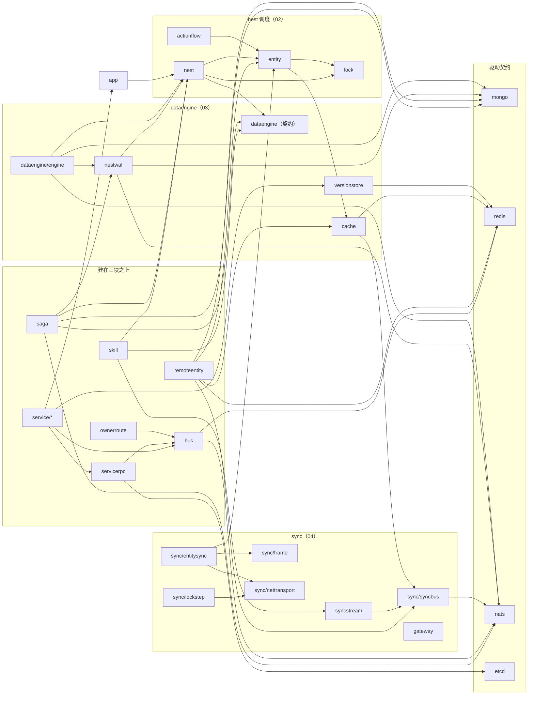
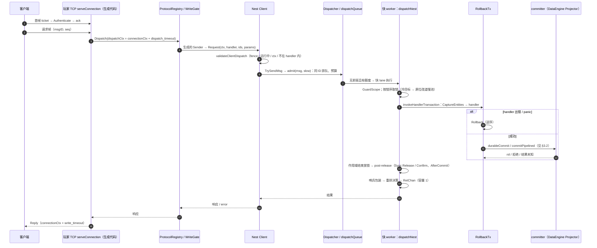
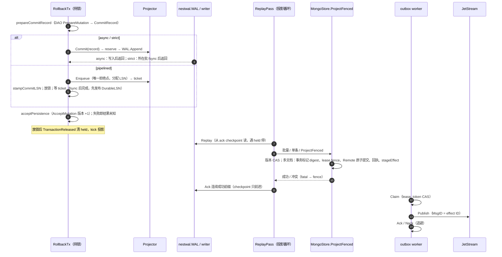
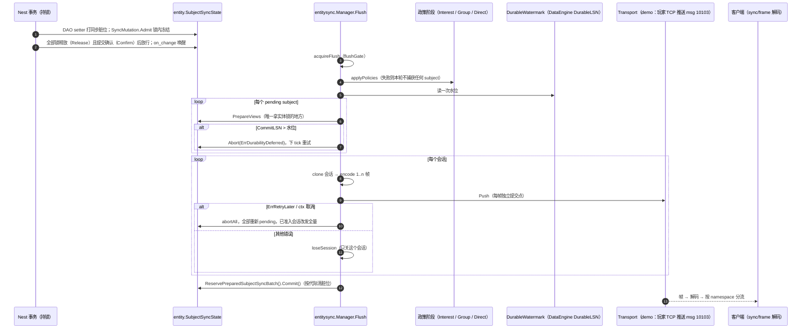

# 00 总览（实现）

> 源码基准：tag `v1.23.0`（`28912cd6`）。本篇所有 `path:line` 以这个 tag 为准；依赖图由 `go list` 在 tag 上生成（命令见 [§1.3](#13-重新生成)），不依赖 codebase-memory 图谱。
> 对应说明文档：[guide/00-overview.md](../guide/00-overview.md)。总入口与术语表：[框架文档 README](../README.md)。

## 速览

- **这一篇做什么**：给 review agent 一张全局地图——真实的包级依赖与层守卫、三大块在代码里的聚集现状、三条端到端路径的时序图（每一步链到分区实现文档的章节）、每个分区最关键的不变量，以及建议的 review 顺序和各分区检查点入口。
- **最重要的结构事实**：依赖方向是 `kit → core`、`codegen → (demo, 两个叶子包)`，core 内部 `dataengine/engine`、`nestwal`、`saga`、`skill` 依赖 `nest`，`nest` 只依赖 `dataengine` 的契约根包；`sync/*` 不依赖 `nest`；驱动只在 kit 被链接。这些由根包测试 `dependency_boundary_test.go` 守住。
- **最容易漏看的地方**：三块的交界——Nest 提交点与 DataEngine 准入（[02 impl §3.5](02-nest-entity.md#35-事务分支) ↔ [03 impl §3.1](03-dataengine.md#31-async--strict-提交)）、同步内容的冻结与水位门控（[02 impl §3.5](02-nest-entity.md#35-事务分支) ↔ [04 impl §3.1](04-sync.md#31-flush一次同步-tick)）、Remote 写在投影事务里的校验与之后的发布（[03 impl §3.4](03-dataengine.md#34-mongostoreprojectfenced) ↔ [05 impl §3.4](05-remote-mirror.md#34-投影与发布)）。单个分区的文档各自完整，交界处要两边对着读。

### 本篇覆盖的包

本篇不拥有包。层守卫所在的根包测试 `dependency_boundary_test.go` 属于 [12 分区](12-codegen.md)（根包门禁）；包 → 分区的完整归属见 [README](../README.md#包--分区索引)。

---

## 1. 包与依赖

### 1.1 包级依赖图

core 与“建在三块之上”的包之间的 import 关系（tag 上 `go list` 的非测试 import，合并到顶层包；略去 `metrics`、`fctx`、`goroutine`、`log`、`internal/operation`、`misc`、`worker`、`container`、`health`、`admin` 这些几乎人人都用的基建边）：



完整的顶层包依赖表（同一口径，但不略去基建边；`kit/*`、`codegen/*` 只列到二级）：

| 包 | core 内直接依赖 |
| --- | --- |
| `actionflow` | clock entity |
| `ai` | actionflow clock entity |
| `app` | admin clock fctx health internal/configschema lifecycle log metrics nest |
| `bus` | admin errcode failurelog fctx internal/operation metrics nats redis worker |
| `cache` | metrics redis sync/syncbus |
| `configdata` | fctx lifecycle |
| `dataengine`（根） | entity metrics |
| `dataengine/engine` | dataengine entity fctx internal/operation metrics mongo nats nest nestwal |
| `entity` | cache container event fctx goroutine lock log metrics |
| `failurelog` | metrics redis |
| `fctx` | clock goroutine |
| `gateway` | security |
| `hotcode` | admin |
| `log` | fctx goroutine metrics |
| `manager` | app fctx metrics |
| `mongo` | internal/operation metrics |
| `nats` | goroutine internal/operation metrics worker |
| `nest` | dataengine entity fctx goroutine hotcode lock log metrics misc worker |
| `nestwal` | dataengine entity internal/operation metrics mongo nats nest |
| `ownerroute` | bus |
| `remoteentity` | cache entity fctx internal/operation metrics mongo redis sync/syncbus |
| `saga` | dataengine metrics mongo nats nest nestwal |
| `service/{mail,match,session}` | app bus errcode servicemetrics servicerpc versionstore（mail 另有 redis） |
| `servicerpc` | bus errcode etcd misc |
| `skill`（含子包） | dataengine entity metrics nest syncstream |
| `sync/entitysync`（含 policy） | entity health log metrics spatial sync/frame sync/nettransport |
| `sync/lockstep` | metrics sync/nettransport |
| `sync/syncbus`（含 driver、mirror） | fctx internal/operation nats |
| `syncstream` | sync/syncbus |
| `timer` | clock metrics |
| `versionstore` | metrics redis |
| `kit/*` | app + 各自装配的 core 包（例如 `kit/dataengine` → dataengine entity health mongo nats nest nestwal） |
| `kit/internal/configschemagen` | 全部 kit Mod + internal/configschema（为生成声明快照） |
| `codegen/internal/*` | configdata/rules demo internal/configschema |

### 1.2 层与守卫

| 规则 | 强制位置 | 守卫测试 |
| --- | --- | --- |
| core 不 import kit / codegen / demo；kit 只 import core；codegen 只 import demo 与两个叶子包 | `layerViolation`（`dependency_boundary_test.go:175`），层由顶层目录决定（`moduleLayer`，`:150`） | `TestCoreDependencyBoundary`（`:16`）、`TestLayerViolation`（`:258`）、`TestModuleLayer`（`:296`） |
| 不 import 已合仓的旧模块路径（`roost-kit`、`roost-service`、`roost-skill`、`roost-codegen`、`cube-core`） | `forbiddenCoreImport`（`:245`） | `TestForbiddenCoreImport`（`:313`） |
| 契约包不链接驱动：除 kit 外没有非测试文件 import `*/driver` | 驱动表 `:74-79` | `TestCoreContractsDoNotLinkDrivers`（`:92`） |
| `internal/configschema` 与 `configdata/rules` 只依赖标准库（codegen 要 import） | — | `TestSharedConfigRulesStayALeaf`（`:215`） |
| core 内三大块（nest 调度 / dataengine / sync，即 §1.1 的三个子图）之间只许 §1.1 图里那几条跨块边（非测试 import）：nest → dataengine 契约根包、entity → cache、dataengine 根包 / engine / nestwal → entity、engine / nestwal → nest、cache → sync/syncbus、entitysync → entity；表里某行不再被用到也报 | `pillarPackages`、`allowedCrossPillarImports`、`crossPillarViolation`（`dependency_boundary_test.go`） | `TestCorePillarDependencyDirection`、`TestCrossPillarViolation`（[REFACTOR-2026-10-07-structural-guards](../../feature/REFACTOR-2026-10-07-structural-guards.md) §2） |

**块间方向**（2026-10-07 起有守卫）：core 内三大块之间的方向由上表最后一行的守卫固定，新增跨块 import 会红；确实需要时在 `allowedCrossPillarImports` 加一行写明理由，并同步改 §1.1 的图。块内、以及建在三块之上的包（skill、saga、remoteentity 等）之间的方向仍只是现状，review 新增 import 时人工看（[§6 检查点](#6-全局-review-入口)）。

### 1.3 重新生成

```sh
git worktree add --detach /tmp/roost-tag v1.23.0   # 或任意要核对的提交
cd /tmp/roost-tag
GOWORK=off go list -f '{{.ImportPath}}|{{join .Imports " "}}' ./... \
  | grep -v '/codegen/internal/.*/testdata/'        # 再按顶层目录合并即得 §1.1 的表
```

[↑ 速览](#速览) · [说明文档 §3](../guide/00-overview.md#3-包地图与依赖方向)

---

## 2. 三大块原则的实现现状

原则见 [说明 §2](../guide/00-overview.md#2-三大块原则)。下表是 tag 上的聚集现状，**只陈述事实，不做裁决**；是否搬迁按维护者“三块各自局部聚集”的准则另行提案。

| 块 | 已聚集的位置 | 仍散在顶层的相关包 | 说明 |
| --- | --- | --- | --- |
| nest 调度 | `nest/`、`entity/` | `lock`（实体锁、可重入锁，只有 entity / nest / kit/lock 用）、`worker`、`goroutine`、`fctx`、`actionflow` | `fctx` / `goroutine` / `worker` 也被 bus、nats、log 用，属基建还是 nest 块要按用途判断（推断） |
| dataengine | `dataengine/`（契约）、`dataengine/engine/` | `nestwal`（物理 WAL，import `nest`）、`versionstore`、`cache`、`migration`（只被 codegen 的 DAO 生成器用） | `cache` 同时被 `entity`（Remote 快照缓存）与 `remoteentity` 用，并 import `sync/syncbus`（`cache/mirror.go` 的 `ReplicaSyncer`），横跨两块 |
| sync | `sync/`（只是收纳目录，没有 Go 文件，[sync/README](../../../sync/README.md)） | `syncstream`（import `sync/syncbus`）、`gateway` | sync 块的整理已按 [ARCH-12](../../bugfix/ARCH-12-sync-package-layout.md) 实施 |

交界上的依赖方向（来自 §1.1）：

- `nest` → `dataengine`（契约）：Nest 用 `CommitRecord` / `Mutation` 等数据类型组装记录；提交经 `TransactionCommitter` 接口交给 `dataengine/engine` 的 `Projector`（[03 impl §2.2](03-dataengine.md#22-nest-侧)）。
- `nestwal` → `nest`：WAL 编码需要 `nest.Durability` 等常量（例如 `nestwal/wal.go:337` 用 `corenest.DurabilityStrict` 判定是否等 fsync）。
- `sync/entitysync` → `entity`：只经 `entity.SubjectSyncState` 读冻结的同步内容；Nest 侧的 `SyncMutation` 接线由 `kit/nest` 或业务完成（[04 说明 §4.1](../guide/04-sync.md#41-实体复制的最小装配)）。
- `app` → `nest`：只有日志帧号 `nest.CurTick`（`app/app.go:201`）。

[↑ 速览](#速览) · [说明文档 §2](../guide/00-overview.md#2-三大块原则)

---

## 3. 端到端走读（实现视角）

### 3.1 一次请求：接入 → nest → handler → 回复



| # | 关键点 | 位置（tag） | 分区 |
| --- | --- | --- | --- |
| 1 | 鉴权只在首帧；帧长在分配前检查；每次 dispatch 有截止（只限等待） | `codegen/internal/roost/render_player_tcp.go:818-826`、`:877-884`、`:852` | [04 impl §3.15](04-sync.md#315-生成的玩家-tcp-接入层)、[04 impl §4.6](04-sync.md#46-玩家-tcp-接入层生成测试只在生成工程里跑) |
| 2 | controller 返回 error（含 WriteGate 拒绝、panic）→ 断连 | 同上 `:859`；F04-10 | [04 impl §3.15](04-sync.md#315-生成的玩家-tcp-接入层) |
| 3 | 入口校验：fence、`Running()`、ctx、`InNestHandler` | `nest/client.go:172` | [02 impl §3.1](02-nest-entity.md#31-准入) |
| 4 | 准入预算：有执行额度不占等待位；冷热只用 `LoadedChecker` | `nest/dispatch_queue.go:149`、`nest/slow_load.go:120` | [02 impl §3.1](02-nest-entity.md#31-准入)、[02 impl §3.2](02-nest-entity.md#32-派发作业的状态) |
| 5 | 快 lane 首跑、取锁、事务、收尾都在 `dispatchNest` 一个 defer 里收口 | `nest/nest_dispatch.go:23`、`:50`～`:146`、`runNestLogic` `:193` | [02 impl §3.3](02-nest-entity.md#33-快-lane-首跑没有慢阶段)、[02 impl §3.4](02-nest-entity.md#34-慢阶段与快续行) |
| 6 | 事务分支与 `durableCommit` 的固定检查顺序 | `nest/rollback.go:586` | [02 impl §3.5](02-nest-entity.md#35-事务分支) |
| 7 | 重排只在未越过提交点时；`transactionPastCommitPoint` | `nest/msg.go:247`、`:269` | [02 impl §3.7](02-nest-entity.md#37-收尾重排与回复) |
| 8 | 停机与 fence：准入后的工作排空、延迟堆里的同步请求得到 `ErrNestStopped` | `nest/nest.go:494`、`:515`～`:552` | [02 impl §3.10](02-nest-entity.md#310-停机与-fence) |

### 3.2 一次落盘：事务 → WAL → 投影 → Mongo / outbox



| # | 关键点 | 位置（tag） | 分区 |
| --- | --- | --- | --- |
| 1 | memory 且无 effect：不准备、不交 committer（v1.23.1 起改为运行期拒绝持久写，RR-20261006-41） | `nest/rollback.go:589`～`:601` | [03 impl §3.1](03-dataengine.md#31-async--strict-提交) |
| 2 | 准入失败不留 WAL 记录；reserve 在 fatal / 屏障 / 背压 / held 下复查 | `dataengine/engine/projector.go:539` | [03 impl §3.1](03-dataengine.md#31-async--strict-提交)、[03 impl §4](03-dataengine.md#4-不变量清单) I1 |
| 3 | `Append` 对 strict 与回退的 pipelined 等 fsync，async 只等写入 | `nestwal/wal.go:333-337` | [03 impl §3.1](03-dataengine.md#31-async--strict-提交) |
| 4 | pipelined：LSN 分配与入队同在 `enqueueMu`；先发布 `DurableLSN` 再关票据 | `nestwal/wal.go:411-433`、`:446-473` | [03 impl §3.2](03-dataengine.md#32-pipelined-提交) |
| 5 | 投影：读与停止条件、checkpoint 只推进连续成功前缀、单文档快路径立即 ack | `dataengine/engine/projector_replay.go:31-55`、`:72-101`、`:171-179` | [03 impl §3.3](03-dataengine.md#33-投影replaypass) |
| 6 | 多文档事务回调（可能被驱动重跑）：标记 digest 不同即 fatal | `dataengine/engine/mongo_projection.go:80-142` | [03 impl §3.4](03-dataengine.md#34-mongostoreprojectfenced) |
| 7 | Remote 提交在同一事务里校验许可，提交后事务外发布 | `dataengine/engine/mongo_projection.go:156-160`、`remoteentity/transaction_manager.go:601-674` | [05 impl §3.4](05-remote-mirror.md#34-投影与发布) |
| 8 | outbox 认领按 lease_token CAS；ack / nack 须持当前租约；发布 MsgID = effect ID | `dataengine/engine/outbox_store.go:57-128`、`dataengine/engine/assembly.go:226-239` | [03 impl §3.5](03-dataengine.md#35-outbox-与效果流) |
| 9 | 消费方收件箱：回执与业务写同一事务，digest 不同即冲突 | `nestwal/effect_inbox.go:78-114` | [03 impl §3.5](03-dataengine.md#35-outbox-与效果流) |
| 10 | 启动恢复屏障：投影完 WAL 才挂加载器、标记 ready | `dataengine/engine/runtime.go:86-106` | [03 impl §3.6](03-dataengine.md#36-启动与停机) |

### 3.3 一次同步：dirty → Flush → 传输 → 客户端



| # | 关键点 | 位置（tag） | 分区 |
| --- | --- | --- | --- |
| 1 | Sync：锁内冻结（Admit），全部锁释放且提交确认后才外发 | `nest/execution.go:130`～`:149`、`:193` | [02 impl §4](02-nest-entity.md#4-不变量清单) N25 |
| 2 | 政策阶段失败直接返回，本轮不取 pending | `sync/entitysync/flush.go:93-95` | [04 impl §3.1](04-sync.md#31-flush一次同步-tick)、F04-1 |
| 3 | 水位门控挡整个 subject（快照与增量） | `sync/entitysync/flush.go:203` | [04 impl §3.1](04-sync.md#31-flush一次同步-tick)、[04 impl §4.1](04-sync.md#41-entitysync) E5 |
| 4 | 编码只改会话副本；每帧准入即采纳，后续帧失败不撤回前缀 | `sync/entitysync/flush.go:297`、`:338` | [04 impl §4.1](04-sync.md#41-entitysync) E4 |
| 5 | `ErrRetryLater` / ctx 取消：整体重试，不关会话 | `sync/entitysync/flush.go:353-365` | [04 impl §4.1](04-sync.md#41-entitysync) E6 |
| 6 | kit 装配时水位来源接到 DataEngine（未 Provide 前返回 0、不支持 pipelined 返回 `MaxUint64`） | `kit/nest/entity_sync.go:25`、`kit/nest/nest_mod.go:207` | [04 说明 §4.1](../guide/04-sync.md#41-实体复制的最小装配) |
| 7 | 帧格式（大端）、两端都校验结构规则 | `sync/frame/codec.go:150-214` | [04 impl §7.1](04-sync.md#71-entitysync-帧syncframe大端) |

服务 ↔ 服务这一侧：JetStream 驱动的订阅、扇出与底层 Ack / Nak / Term 见 [04 impl §3.10](04-sync.md#310-syncbussubscription-与-jetstream-驱动)；副本复制（`mirror.Replicator`、`ReplicaSyncer`、`PatchSyncer`）见 [04 impl §3.11](04-sync.md#311-副本复制mirror--replicasyncer--patchsyncer)；Remote 快照的 L2 准入与推送见 [05 impl §3.4](05-remote-mirror.md#34-投影与发布)、[05 impl §3.7](05-remote-mirror.md#37-快照缓存写入与读)。

[↑ 速览](#速览) · [说明文档 §4](../guide/00-overview.md#4-端到端走读)

---

## 4. 全局不变量索引

每个分区挑最关键的几条；编号是分区内的原编号（不同分区的编号会重名，引用时带分区号，例如 `03·I3`）。完整清单、强制位置与守卫测试见各分区 §4。

| 分区 | 编号 | 内容（摘要） | 原文 |
| --- | --- | --- | --- |
| 01 | I-01 | 配置在任何 Mod Init 之前按 App + 本服务全部 Mod + 服务本身的声明检查，错误一次报全 | [01 §4](01-app-lifecycle.md#4-不变量清单) |
| 01 | I-10 / I-12 | 启用锁时任何 Mod Init 之前持锁；只在全部 Mod 停完后 Release | 同上 |
| 01 | I-17 / I-18 | 启动期间的 fail-stop 在下一个阶段边界生效；fail-stop 一定非零退出 | 同上 |
| 01 | I-19 / I-22 | `Service.Shutdown` 与 `Serve` 结束后才停 Mod；Mod 逆序停，ctx 类错误中断链并保留更早的 Mod | 同上 |
| 02 | N1 / N3 | 同一声明目标 ID 按准入顺序执行；准入只用 `LoadedChecker` 判冷 | [02 §4](02-nest-entity.md#4-不变量清单) |
| 02 | N11 | 加锁按（category 值, ID）升序；Cast / 新建只能等更高 category 的锁 | 同上 |
| 02 | N15 / N17 | 可回滚事务失败整笔撤销；越过提交点的消息不重排、不回滚 | 同上 |
| 02 | N20 / N25 | 结果未知 abandon 并 fence；Sync 锁内冻结、释放且确认后外发 | 同上 |
| 03 | I2 / I3 / I4 | `Enqueue` 是 pipelined 唯一拒绝点；`Append` 对 strict 与 pipelined 等 fsync；LSN 顺序 = 物理顺序，`DurableLSN` 先于票据发布 | [03 §4](03-dataengine.md#4-不变量清单) |
| 03 | I10 / I11 | 投影不越过仍持锁的事务；ack 只推进连续成功前缀 | 同上 |
| 03 | I13 / I14 | 版本 CAS 与多文档事务标记：不匹配且不是本事务的更高版本即 fatal | 同上 |
| 03 | I22 / I30 | 启动恢复屏障；结果未知不回滚、fence 引擎 | 同上 |
| 03 | I36 / I37 | Redis 写不经驱动重放；Mongo 提交发出后才带 `ErrCommitResultUnknown`（A2） | 同上 |
| 04 | E4 / E5 / E6 | 每帧准入即采纳；水位门控挡整个 subject；`ErrRetryLater` 整体重试不罚 | [04 §4.1](04-sync.md#41-entitysync) |
| 04 | E8 / E10 | 结算只作用于同一订阅且 revision 相同；remove-before-create | 同上 |
| 04 | B1 / B8 | `Unsubscribe` 返回 nil 即静止（A3 ②）；总线停止返回 nil 时无在途回调 | [04 §4.3](04-sync.md#43-syncbus--mirror--cache) |
| 04 | S4 / S5 | syncstream write-ahead；结果不确定即 fail-stop | [04 §4.4](04-sync.md#44-syncstream) |
| 05 | R3 / R9 | 写门全序获取、一个实体同时一个写批次；Mongo 提交校验当前许可 | [05 §4](05-remote-mirror.md#4-不变量清单) |
| 05 | R15 / R18 | 写门 / 锁 / 额度只在持久结论之后释放；提交后工作至多一次、只经快池 | 同上 |
| 05 | S2 / S3 | 新值先 L2 判定再写 L1；非线性读只交出 `fresh` 条目 | 同上 |
| 05 | M2 / M4 | 推送只在可确认订阅上开；同进程只有一个快照客户端 | 同上 |
| 06 | I1 | `ApplyRequest` 只在 `stepTransition` 里产生，`Store.Apply` 只在那里调用 | [06 §4](06-saga.md#4-不变量清单) |
| 06 | I4 / I5 | 记录、outbox、回执、tombstone 原子提交；每次写恰好 `version+1` | 同上 |
| 06 | I10 / I13 | 放弃后的正向成功恰好计入一次并补偿；一个操作的所有尝试至多一次生效 | 同上 |
| 07 | C-07 / C-08 | 启动检查覆盖全部声明并在 Init 之前；框架代码只经声明读配置 | [07 §4](07-config.md#4-不变量清单) |
| 07 | C-16 / C-30 | 每次 Load / Reload 执行规则、违反整次拒绝；请求钉住准入时的那一代快照 | 同上 |
| 08 | I1 / I3 / I4 | 编译通过的 Program 不含“查不到却用了 0”的名字；引用只看求值上下文表；Host 需求在扣费前拒绝 | [08 §4](08-skill.md#4-不变量清单) |
| 08 | I8 / I14 | 衍生物停止只经 `requestSpawnStop`；checkpoint 同状态同字节、恢复 fail closed | 同上 |
| 09 | I1 / I2 / I4 | owner 发布包装、只有 Server 注册 handler、owner Mod 与 ClientMod 不同进程 | [09 §4](09-kit-services.md#4-不变量清单) |
| 09 | I7 / I32 | `key_prefix` 必填且 Cluster 下带 hash tag；玩家只由绑定 sid 的 game 服务 | 同上 |
| 10 | I-1 / I-4 | 生产偏移必须为 0；运行期没有改偏移的入口（**没有结构守卫**） | [10 §4](10-time.md#4-不变量清单) |
| 10 | I-5 / I-12 | 业务时间早于高水位 1 分钟以上拒绝启动；定时器 (End, Priority, ID) 全序 | 同上 |
| 11 | O-1 / O-9 | 每名序列数有上限；`/readyz` = 就绪位 ∧ 无 Fail，Degraded 不影响 | [11 §4](11-observability.md#4-不变量清单) |
| 11 | O-11 / O-13 | admin 只认 token、常数时间比较；命令在 `admin_timeout` 内执行，到期 504 | 同上 |
| 12 | G-01 / G-03 / G-05 | 暂存命令中途失败工程不变；提交前内容等于计划时的 before；业务文件只创建不覆盖 | [12 §4](12-codegen.md#4-不变量清单) |
| 12 | G-26 / G-27 | 冲突标记、Markdown 相对链接、示例实跑、workflow 包路径的根包门禁 | 同上 |

**跨分区的同一条不变量**（两边各写了一次，改一边时对照另一边）：

| 内容 | 分区 A | 分区 B |
| --- | --- | --- |
| 生产 `time.logic_offset` 必须为 0 | [01 §4](01-app-lifecycle.md#4-不变量清单) I-06 | [07 §4](07-config.md#4-不变量清单) C-14、[10 §4](10-time.md#4-不变量清单) I-1 |
| 配置启动检查在任何 Mod Init 之前、一次报全 | [01 §4](01-app-lifecycle.md#4-不变量清单) I-01 | [07 §4](07-config.md#4-不变量清单) C-07 |
| `internal/configschema` 只依赖标准库 | [01 §4](01-app-lifecycle.md#4-不变量清单) I-05 | [07 §4](07-config.md#4-不变量清单) C-10 |
| health checker 1.5s 期限、Degraded 不影响就绪 | [01 §4](01-app-lifecycle.md#4-不变量清单) I-31 / I-32 | [11 §4](11-observability.md#4-不变量清单) O-8 / O-9 / O-10 |
| 结果未知 fence、不回滚 | [02 §4](02-nest-entity.md#4-不变量清单) N20 | [03 §4](03-dataengine.md#4-不变量清单) I30 |
| A1：组件不登记 undo（glsvet 提示） | [02 §4](02-nest-entity.md#4-不变量清单) N35 | [03 §4](03-dataengine.md#4-不变量清单) I34 |
| 派发器指标序列只在最后一个同名派发器排空后删除 | [02 §4](02-nest-entity.md#4-不变量清单) N28 | [11 §4](11-observability.md#4-不变量清单) O-5 |

[↑ 速览](#速览)

---

## 5. 跨分区的并发与失败口径

### 5.1 谁拥有哪些 goroutine

| goroutine | 拥有者 | 能不能阻塞 | 分区 |
| --- | --- | --- | --- |
| Nest 快 worker | Nest 派发器 | **不能**：handler、本地锁、回滚、提交准入都在这里；pipelined 才在锁外等票据 | [02 impl §5](02-nest-entity.md#5-并发) |
| Nest 慢 worker、延迟 goroutine | Nest 派发器 | 可以等待（冷加载、Remote 准备） | [02 impl §5.1](02-nest-entity.md#51-goroutine-归属) |
| WAL writer、投影循环、outbox worker | DataEngine `Runtime` / `Assembly` | 可以；停机三步 | [03 impl §5.1](03-dataengine.md#51-goroutine-归属) |
| entitysync run 循环 | `entitysync.Manager` | Flush 持 `flushGate`；政策回调不得调用 Flush、不得阻塞 | [04 impl §5.1](04-sync.md#51-entitysync-的-goroutine-归属) |
| Remote finalizer、兴趣续租 | `remoteentity` | 可以；提交后工作只经快池 | [05 impl §5.1](05-remote-mirror.md#51-goroutine-归属) |
| saga 协调循环与三个消费者 | saga `Assembly` | 可以；领取租约的时间预算 | [06 impl §5.1](06-saga.md#51-goroutine-归属) |
| 单实例锁续期 | App | 可以；失锁走 fail-stop | [01 impl §5](01-app-lifecycle.md#5-并发) |

### 5.2 fail-stop 链

| 来源 | 触发 | 动作 | 位置 |
| --- | --- | --- | --- |
| 单实例锁失锁 | 续期窗口内没有确认 | `RuntimeFailure.Fail` | `app/singleton.go:474` |
| DataEngine fatal | 投影冲突、WAL terminal、存储结果未知 | `RuntimeFailure.Fail` | `kit/dataengine/mod.go:477` |
| Remote fatal | 释放失败 | `RuntimeFailure.Fail` | `kit/remoteentity/remote_entity_mod.go:117` |
| → 首次 `Fail` | — | 按登记顺序同步执行 `OnFail`（其中 Nest Mod 登记了 `engine.Fence`），执行完才投递 `Done` | `app/runtime_failure.go:35`、`:61`；`kit/nest/nest_mod.go:221` |
| → App | 收到 `Done` | 走同一条停机路径，非零退出 | [01 impl §3.6](01-app-lifecycle.md#36-runtimefailure) |

Nest 自己的 fence（事务结果未知）不经 `RuntimeFailure`：引擎立刻拒绝新消息与排队消息（[02 impl §3.10](02-nest-entity.md#310-停机与-fence)）。

[↑ 速览](#速览)

---

## 6. 全局 review 入口

### 6.1 建议顺序

按维护者的三大块优先，再按“耦合越紧越先看”：

| 顺序 | 分区 | 理由 |
| --- | --- | --- |
| 1 | [02 nest](02-nest-entity.md) | 一切写入口；提交点、重排、fence 的语义在这里定义 |
| 2 | [03 dataengine](03-dataengine.md) | Nest 提交点的另一半；WAL / 投影 / 结果未知 |
| 3 | [04 sync](04-sync.md) | 第三块；水位门控把它和 03 绑在一起 |
| 4 | [05 remote 与 Mirror](05-remote-mirror.md) | 同时跨三块，交界最多 |
| 5 | [06 saga](06-saga.md) | 原生步骤横跨 02 / 03；至多一次生效 |
| 6 | [01 app](01-app-lifecycle.md) | 启动 / 停机 / fail-stop 契约，所有 Mod 继承 |
| 7 | [07 配置](07-config.md)、[10 时间](10-time.md) | 启动检查与业务时钟，被所有 Mod 使用 |
| 8 | [11 可观测](11-observability.md) | readyz、指标名无守卫 |
| 9 | [09 kit 服务](09-kit-services.md)、[08 skill](08-skill.md) | 建在 core 之上的业务服务与技能 |
| 10 | [12 codegen](12-codegen.md) | 生成器、模板、门禁；生成代码的行为在各分区已对照 |

### 6.2 各分区检查点与已知疑点

| 分区 | review 检查点 | 源码疑点 / 文档不一致 |
| --- | --- | --- |
| 01 | [§10](01-app-lifecycle.md#10-review-检查点) | 见 [FINDINGS](../../review/FRAMEWORK-DOCS-FINDINGS-2026-10-07.md) F01-* |
| 02 | [§10](02-nest-entity.md#10-review-检查点) | [§10 已知出入](02-nest-entity.md#已知出入需要维护者判断) |
| 03 | [§10](03-dataengine.md#10-review-检查点) | [§6.3 已知的语义缺口](03-dataengine.md#63-已知的语义缺口供-review) |
| 04 | [§10.1](04-sync.md#101-具体问题清单) | [§10.2](04-sync.md#102-本篇写作时发现的源码疑点待闭环)、[§10.3](04-sync.md#103-文档与源码不一致) |
| 05 | [§10.1](05-remote-mirror.md#101-具体问题) | [§10.2](05-remote-mirror.md#102-源码疑点待闭环)、[§10.3](05-remote-mirror.md#103-与其他文档的不一致本篇按源码写未改原文档) |
| 06 | [§10](06-saga.md#10-review-检查点) | [§11](06-saga.md#11-源码疑点与文档不一致) |
| 07 | [§10](07-config.md#10-review-检查点) | [§11](07-config.md#11-源码疑点与文档不一致) |
| 08 | [§10](08-skill.md#10-review-检查点) | [§11](08-skill.md#11-源码疑点与文档不一致) |
| 09 | [§10](09-kit-services.md#10-review-检查点) | [§11](09-kit-services.md#11-源码疑点与文档不一致) |
| 10 | [§10](10-time.md#10-review-检查点) | [§11](10-time.md#11-源码疑点与文档不一致) |
| 11 | [§10](11-observability.md#10-review-检查点) | [§11](11-observability.md#11-源码疑点与文档不一致) |
| 12 | [§10](12-codegen.md#10-review-检查点) | [§11](12-codegen.md#11-源码疑点与文档不一致) |

全部疑点的处置状态统一登记在 [FRAMEWORK-DOCS-FINDINGS-2026-10-07](../../review/FRAMEWORK-DOCS-FINDINGS-2026-10-07.md)。

### 6.3 跨分区检查点（单个分区的清单不会问到的）

1. **提交点两边一致吗**：Nest 的 `transactionPastCommitPoint`（`nest/msg.go:269`）认定的“越过提交点”，与 DataEngine 各持久模式的提交点（[03 说明 §3.2](../guide/03-dataengine.md#32-四种持久模式与提交点)）逐模式对照：pipelined 在 `Enqueue` 接纳后就不再回滚，但回复要等票据——两份文档对“提交点”的用词不同（见 [README 术语表](../README.md#术语表)“提交点”条）。
2. **水位门控覆盖所有外发路径吗**：entitysync 走 `DurableWatermark`；Remote 快照发布在投影提交之后；skillsync 走 syncstream。确认没有一条外发路径绕过“持久之后才可见”。
3. **快池禁止阻塞**：新增的 Host 回调、政策回调、Remote 收尾项、AfterCommit 是否可能在快 worker 上等待（[02 impl §5.3](02-nest-entity.md#53-快池禁止阻塞)、[05 impl §5.3](05-remote-mirror.md#53-快池禁止阻塞)）。
4. **新的 core → core import**：是否引入了块间反向依赖（§1.2“没有守卫的方向”）。
5. **结果未知口径**：新代码遇到驱动的“结果未知”时是交给调用方 / fence，而不是当作失败重试（[03 说明 §3.6](../guide/03-dataengine.md#36-a2驱动不重放写结果未知交给调用方)）。
6. **配置与时钟**：新代码是否经 `app.LoadConfig` 读配置、经业务时钟读玩法时间（[07 说明 §4.5](../guide/07-config.md#45-守卫读了没声明--声明了没读)、[10 说明 §4.1](../guide/10-time.md#41-哪些逻辑走哪个钟归属总表)）。

[↑ 速览](#速览)

---

## 7. 测试与门禁总入口

| 层级 | 命令 | 说明 |
| --- | --- | --- |
| 根包门禁 | `GOWORK=off go test -count=1 .` | 层守卫、冲突标记、Markdown 相对链接、示例实跑、CI 路径等（[12 §8](12-codegen.md#8-测试与门禁)） |
| 文档锚点 | `python3 scripts/check-doc-anchors.py`（缺省查 `docs/framework`） | 相对链接 + `#锚点`；根包门禁不查锚点 |
| 全仓单测 | `GOWORK=off go test ./...` | 各分区 §8 列出了本分区的重点包与 race 命令 |
| 静态检查 | `go run ./cmd/glsvet ./...`（仓库根；生成工程用 `make glsvet`） | 快池并发违例与 A1 / 时钟提示（[02 说明 §4.14](../guide/02-nest-entity.md#414-glsvet跑法与全部规则)） |
| integration | 各分区 §8（真实 Mongo / Redis / NATS） | [03 §8.2](03-dataengine.md#82-integration真实-mongo--nats--redis)、[06 §8.2](06-saga.md#82-integration真实-mongo-副本集--nats) 等 |
| 生成工程 | `scripts/test-*-generated.sh`、`scripts/test-remote-matrix.sh` | [12 说明 §4.10](../guide/12-codegen.md#410-仓库脚本维护者用) |
| 发版前 | `scripts/pretag.sh` | [12 说明 §4.10](../guide/12-codegen.md#410-仓库脚本维护者用) |

[↑ 速览](#速览)

---

## 8. 历史

设计演进只在各分区 §9 记录（只列改变了设计的修复）。版本级的改动汇总见 [v1.23.0 说明](../../release/v1.23.0-GUIDE.md) 与 [v1.23.0 实现](../../release/v1.23.0-IMPLEMENTATION.md)。

[↑ 速览](#速览) · [说明文档](../guide/00-overview.md)
