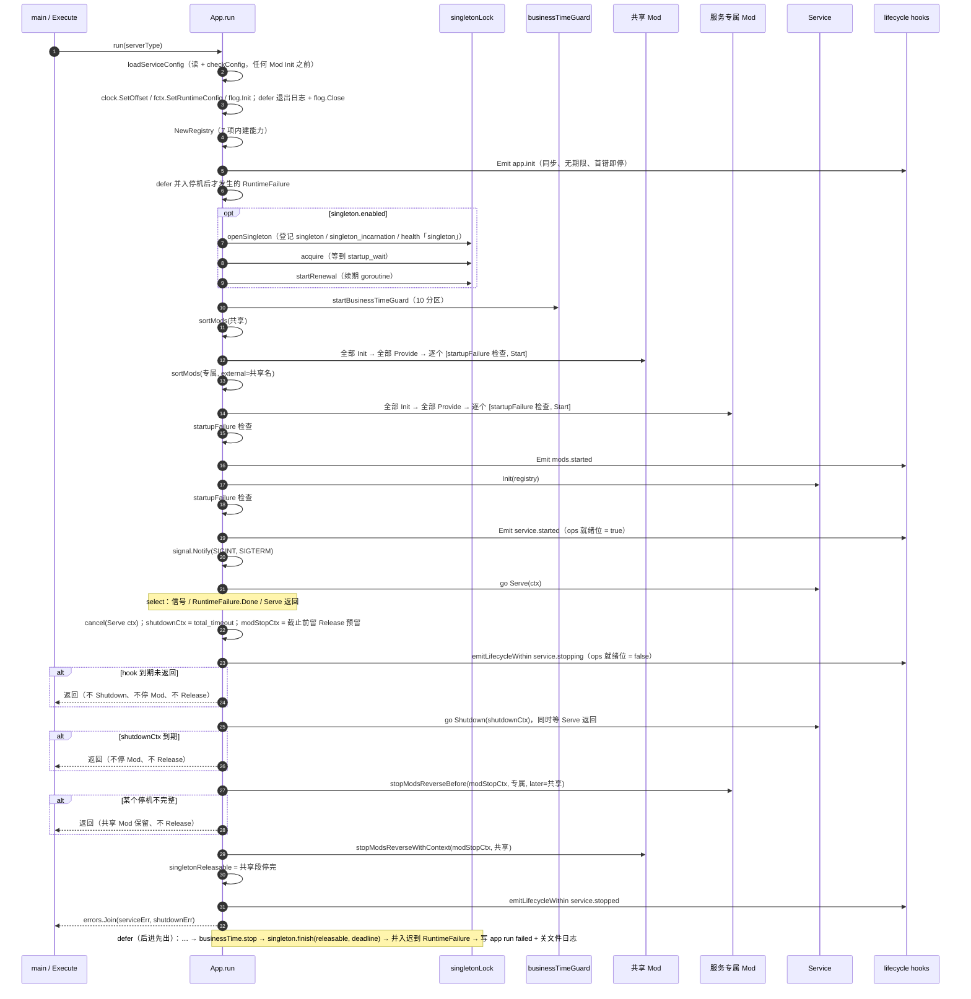
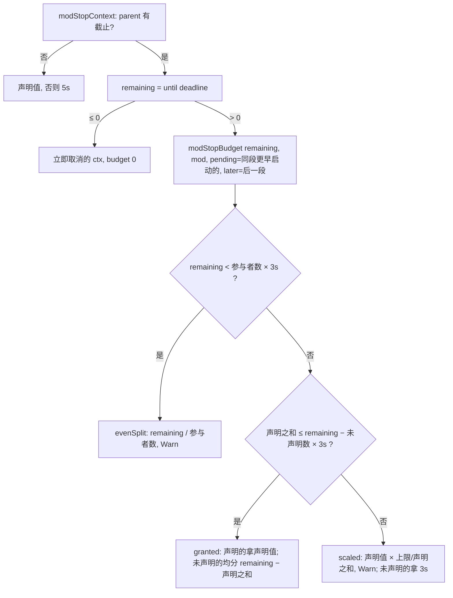
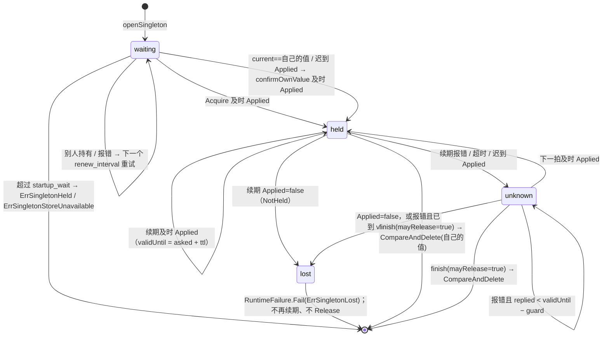
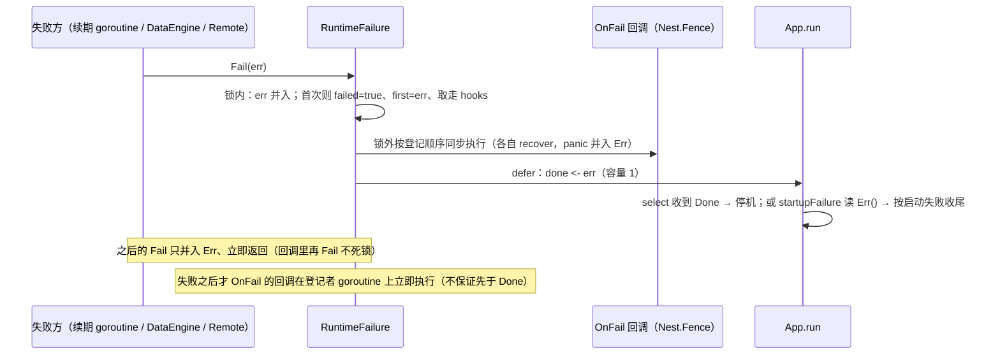
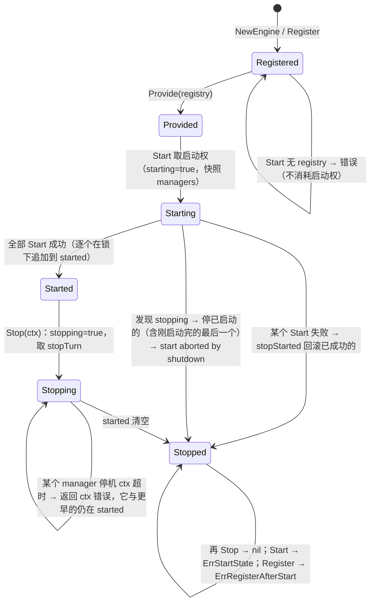

# 01 app 与生命周期（实现）

> 配套说明文档：[guide/01-app-lifecycle.md](../guide/01-app-lifecycle.md)（是什么、怎么用、配置、运维、保证）。
> 读者：review agent 与要改这一块代码的人。源码基准：tag `v1.23.0`（`28912cd6`），全部 `path:line` 按这个 tag。
> 图谱说明：codebase-memory 的索引代际是 2026-09-23（`check_index_coverage`：`app/app.go`、`manager/engine.go` 等为 `metadata_changed`，`app/singleton.go`、`app/config_schema.go`、`internal/*` 为 `not_tracked`），落后于 tag。本篇只用它定位，结论全部按 tag 源码直接读取。

## 速览

- `app.App.run`（`app/app.go:180`）是唯一的启动 / 停机编排点：配置检查 → 日志 → Registry → 单实例锁 → 业务时间守卫 → 共享 Mod（Init/Provide/Start）→ 服务专属 Mod → `Service.Init` → `Serve` 与等待 → 有预算的逆序停机。所有「进程级统一保证」都在这一个函数和它的 defer 链里兑现。
- 核心不变量是「停机不完整就保留依赖」：任何一步（hook、`Service.Shutdown`、某个 Mod 的 `StopWithContext`）因 ctx 取消 / 超时没停完，`run` 不再停更底层的 Mod，`singletonReleasable` 保持 false，锁不 Release、store 不关。这条规则在 `run` 里靠**逐个返回点置位**实现，漏置位的路径默认不释放（方向安全）。
- 第二个核心不变量是「fail-stop 先围栏再停机、并且一定非零退出」：`RuntimeFailure.Fail` 在锁外同步跑完 `OnFail` 再投递 `Done`；`run` 的 defer 把停机开始后才发生的失败并进返回值。
- 最容易改坏的地方：`run` 里各启动失败分支各自决定 `singletonReleasable` 和「停哪几段 Mod」；`modStopBudget` 的三种分配；`singletonLock` 的时间界（`cas` 的单次超时截到 `validUntil`、`timely` 判迟到）；`manager.Engine` 的 `starting` / `stopping` / `stopTurn` 交接。

### 本篇覆盖的包

| 包 | 职责 |
| --- | --- |
| `app` | 编排、接口、Registry、RuntimeFailure、单实例锁、配置声明入口、停机预算 |
| `app/buildinfo` | 链接期版本信息 |
| `lifecycle` | hook 注册表与派发；`ManagerGroup`（无 ctx，无生产调用方） |
| `manager` | `Engine`：manager 依赖序启动、逆序三步停止 |
| `kit/manager` | `ManagerMod`：Engine 的 Mod 外壳 |
| `kit/mods` | Mod / capability 名表、`RegisterAll`、`PersistenceConfig`、服务 Mod 小工具 |
| `kit/ops` | ops 端点；本篇只覆盖就绪位、`/readyz`、ops Mod 的启动 / 停止 |
| `health` | checker 注册表、并发快照、每 checker 期限 |
| `internal/operation` | `Lifetime`、`Serial` |
| `internal/stopcontract` | 三步停机契约测试骨架 |
| `internal/configschema` | 声明 / 解码 / 检查 / 合并 / YAML / 源码守卫（规则细节归 07） |

---

## 1. 包与文件地图

| 文件 | 职责 |
| --- | --- |
| `app/app.go` | `App`、CLI（`RegisterServer` / `Execute`）、`loadServiceConfig`、`run`、Mod 排序 `sortMods`、停机预算 `modStopBudget` / `modStopContext`、`stopModsReverseBefore`、启动失败收尾 `shutdownAfterStartupFailure`、hook 派发 `emitLifecycle` / `emitLifecycleWithin` |
| `app/mod.go` | `Mod`、`ModStopperWithContext`、`ModStopBudgetProvider`、`ModDependencyProvider`、`ModOptionalDependencyProvider` |
| `app/service.go` | `Service` 接口与它的启动失败契约 |
| `app/manager.go` | `IManager`、`IManagerStopperWithContext`、`ManagerDependencyProvider` |
| `app/name.go` | `ModName` / `ServiceName` 与内建能力名 |
| `app/registry.go` | `Registry`（7 项内建能力）、`RegisterBatch`、`Lookup` / `MustLookup` |
| `app/runtime_failure.go` | `RuntimeFailure`：首次失败、`OnFail`、`Done`、`Err` |
| `app/singleton.go` | 单实例锁：后端接口、配置、状态机、续期、释放、健康检查、`Live`、`openSingleton` |
| `app/business_time.go`、`app/business_clock.go` | 业务时间高水位守卫与业务时钟（归 10 分区，本篇只讲它在启动顺序里的位置） |
| `app/config_schema.go` | `ConfigSchema` / `ModConfigSchema` / `SchemaOf` / `LoadConfig` / `CheckConfig`、`appConfig`、`ServiceIdentity`、`viperSource`、生产判定 |
| `app/config_validation.go` | `ValidateServiceConfig`（= `CheckConfig`）与错误去重 |
| `app/config_values.go` | 单键严格读取 `ConfigBool` 等（只给工具与测试，框架代码禁止用） |
| `app/buildinfo/buildinfo.go` | `Version` / `Commit` / `BuildTime` / `Dirty` 与 `VersionString` |
| `lifecycle/lifecycle.go` | `Phase`、`Hook`、`Registry`、`Emit`（首错即停）/ `EmitAll` / `EmitAllWatched`（全跑、带「正在运行」回报）、panic 转错误 |
| `lifecycle/manager_group.go` | 泛型 `ManagerGroup`（opMu 串行、无 ctx 停止） |
| `manager/engine.go` | `Engine`：注册、Provide、Start（单次尝试、可被停机中止）、Stop（三步） |
| `manager/order.go` | `Order`：确定性拓扑序（注册序）、环 / 缺依赖点名 |
| `kit/manager/manager_mod.go` | `ManagerMod`（`Name()` = `manager`，Provide 登记自己） |
| `kit/mods/name.go`、`kit/mods/service_name.go` | kit 基础设施与服务的能力名表 |
| `kit/mods/registry.go` | `RegisterAll`（预检后整批登记） |
| `kit/mods/persistence.go` | `PersistenceConfig`（DataEngine 是唯一引擎） |
| `kit/mods/service_servicemods.go` | `Redis(r)`、键前缀检查、`ServiceMetricsConfig` |
| `kit/ops/ops_mod.go` | `OpsMod`：配置、就绪 hook、同步 bind、`/healthz` `/readyz`、三步停止（`http.Server.Shutdown`） |
| `health/health.go` | `Registry.Snapshot`：并发、每 checker 期限、单次在途调用、Degraded 聚合 |
| `internal/operation/lifetime.go`、`serial.go` | 共用停机类型 |
| `internal/stopcontract/stopcontract.go` | `Check`、`CallerReleases` |
| `internal/configschema/{schema,check,parse,yaml,guard}.go` | 声明推导、解码 / 检查、单值解析、YAML 输出、源码守卫 |
| `kit/redis/singleton.go` | 单实例锁的 Redis 后端 `SingletonStore`（opener） |
| `codegen/internal/roost/render.go:298`～`:420` | 生成的 `main.go` 与 `bootstrap.New()`（`RegisterAll` → `app.New` → `Singleton` → `Mods` → `RegisterServer`） |
| `codegen/internal/registry/` | `//roost:register` 解析与 `RegisterAll` 生成（归 12 分区） |
| `codegen/internal/roost/shutdown_budget.go` | 生成的 `shutdown.total_timeout` 公式（归 12 分区） |

→ [说明文档](../guide/01-app-lifecycle.md)对应：§1 定位与边界。

## 2. 关键类型与数据结构

| 类型 | 位置 | 要点 |
| --- | --- | --- |
| `App` | `app/app.go:28` | `mods`（共享）、`services map[ServiceName]*serviceEntry`（服务 + 专属 Mod）、`registry`、`cfg *viper.Viper`、`settings appConfig`（启动检查读出的 App 自己的配置）、`signalSource`（测试注入）、`singletonOpener` / `singletonClock` / `singleton`、`businessTimeInterval` |
| `serviceEntry` | `app/app.go:55` | `svc Service` + `mods []Mod` |
| `Mod` | `app/mod.go:12` | `Name / Init(cfg) / Provide(r) / Start / Stop` |
| `ModStopperWithContext` | `app/mod.go:20` | App 停 Mod 时优先用它；kit 全部 13 个基础设施 Mod 都实现（`kit/lifecycle_gate_test.go:25`） |
| `ModStopBudgetProvider` | `app/mod.go:30` | `StopBudget() time.Duration`，≤0 视为未声明。实现者：`kit/dataengine/mod.go:340`、`kit/remoteentity/remote_mirror_mod.go:175`、生成的 player TCP（`codegen/internal/roost/render_player_tcp.go:414`） |
| `ModDependencyProvider` / `ModOptionalDependencyProvider` | `app/mod.go:36` / `:45` | 返回 **Mod 名** |
| `Service` | `app/service.go:12` | `Init / Serve / Shutdown`；Shutdown 在启动失败时也被调用 |
| `Registry` | `app/registry.go:17` | `sync.RWMutex` + `map[ModName]any` + `cfg`。`NewRegistry`（`:29`）预置 health、metrics（并设为 `metrics` 包默认）、admin、admin.metadata、lifecycle、runtime.failure、clock.business |
| `Capability` | `app/registry.go:24` | 批量登记单元；kit 侧同形的 `mods.Capability`（`kit/mods/registry.go:10`） |
| `RuntimeFailure` | `app/runtime_failure.go:20` | `mu`、`err`（全部失败合并）、`first`、`failed`、`hooks`（首次失败前登记的回调）、`done chan error`（容量 1） |
| `singletonConfig` | `app/singleton.go:123` | `enabled / key_prefix / ttl / renew_interval / guard / startup_wait` 的声明 + `ValidateConfig`（`:146`，三条时间关系） |
| `SingletonStore` | `app/singleton.go:46` | `CompareAndSet(ctx,key,expected,next,ttl)`、`CompareAndDelete`、`Get(keys)`、`Close`；实现必须遵守 ctx 截止、内部重试受同一 ctx 限定、续期不被 Live 拖住（`:38` 注释） |
| `SingletonLiveness` / `ModSingleton` | `app/singleton.go:69` / `:74` | `Live(ctx, serverType, sids)`，≤200 个 sid（`:93`） |
| `SingletonIncarnation` / `ModSingletonIncarnation` | `app/singleton.go:80` / `:90` | `Key`、`Sid`、`Token`（锁值第一段） |
| `singletonLock` | `app/singleton.go:242` | `settings / store / clock / key / value / failure`；`mu` 只保护 `status`；`stopRenewal`、`renewalDone` |
| `singletonState` / `singletonStatus` | `app/singleton.go:203` / `:230` | `waiting / held / unknown / lost`；`validUntil`、`holder`、`err` |
| `casReply` | `app/singleton.go:267` | `applied / current / err / asked / replied`——`asked` 在发请求前读 |
| `appConfig` | `app/config_schema.go:203` | `ServiceIdentity`、`environmentConfig`、`log`、`time`、`metrics`、`shutdown.total_timeout`（缺省 30s）、`singleton` |
| `configDeclaration` | `app/config_schema.go:48` | `owner`（`mod <名>` / `service <名>`）+ `schema` |
| `viperSource` | `app/config_schema.go:156` | `configschema.Source` 的 viper 实现：框架里唯一直接读 viper 的地方（另一个是 `config_values.go`） |
| `configschema.Key` / `Schema` / `Validator` | `internal/configschema/schema.go:40` / `:63` / `:70` | `Schema.typ` 非 nil 时 `Check` 会解码一份新结构体，从而执行 `ValidateConfig` |
| `stopBudgetPlan` | `app/app.go:720` | `declaredGranted / declaredScaled / evenSplit` |
| `lifecycle.Phase` / `Event` / `Hook` / `Registry` | `lifecycle/lifecycle.go:11` / `:22` / `:31` / `:38` | hook 按 `Order` 稳定排序；同名替换 |
| `lifecycle.ManagerGroup` | `lifecycle/manager_group.go:43` | `opMu`（操作串行）+ `mu`（状态）；`New → Initialized → Started → Stopped` |
| `manager.Engine` | `manager/engine.go:44` | `managers`、`started`（已成功启动的，停止时从尾部缩短）、`registry`、`starting`（启动权，只置不清）、`stopping`、`stopTurn chan struct{}`（容量 1 的停止执行权） |
| `kit/manager.ManagerMod` | `kit/manager/manager_mod.go:38` | 只有 `engine` 一个字段；`Init` 不读配置 |
| `operation.Lifetime` | `internal/operation/lifetime.go:23` | `active`、`stopping`、`drained chan`；零值可用、一次生命 |
| `operation.Serial` | `internal/operation/serial.go:14` | `once` + `slot chan struct{}`（容量 1） |
| `stopcontract.Hooks` | `internal/stopcontract/stopcontract.go:30` | `Start / Block / Stop / Release / Released / Budget(50ms) / Patience(5s)` |
| `health.Registry` / `registeredChecker` / `checkCall` | `health/health.go:73` / `:84` / `:90` | 每 checker 至多一个在途 `checkCall` |
| `health.Snapshot` | `health/health.go:36` | `OK`（没有 Fail）、`Degraded`、`Results`（按名排序） |
| `kit/ops.OpsMod` | `kit/ops/ops_mod.go:39` | `ready atomic.Bool`、`readyMsg`、`server`（`serverMu` 保护）、`boundAddr` |

→ [说明文档](../guide/01-app-lifecycle.md)对应：§2 核心概念与术语。

## 3. 主流程

### 3.1 CLI 分派

`RegisterServer`（`app/app.go:83`）为每个服务类型建一个 cobra 子命令，`RunE` 按 flag 依次判断：`--print-config` → `printConfig`（`:158`，`ServiceConfigSchema(...).ReferenceYAML()`，不读配置文件）；`--print-config-schema` → `printConfigSchema`（`:170`，`json.Encode(schema.Keys)`）；`--check-config` → `loadServiceConfig` 后打印 `config ok: <ConfigFileUsed>`；否则 `run`。`Execute`（`:116`）给根命令加 `-c/--config`、`--sid`（缺省 1000）。

`loadServiceConfig`（`app/app.go:128`）：

1. 路径：`-c` 或 `configs/service/config.<type>.yaml`（`:579`）。
2. `SetDefault("sid", --sid)`、`SetDefault("server_type", type)`，`ReadInConfig`。显式 `-c` 失败、或默认路径存在但读不出 → 错误；默认路径不存在 → Warn 后继续（`:140`～`:145`，`isMissingConfig` `:583`）。
3. `Set("server_type", type)`；只有 `--sid` 被显式写出才 `Set("sid", …)`（`:147`）。
4. `checkConfig(cfg, serviceDeclarations(type))`（`:150`），成功后把 `appConfig` 存进 `a.settings`。

`checkConfig`（`app/config_schema.go:85`）：先 `LoadConfig(&appConfig)`（App 自己的键 + `ValidateConfig`），再对每份 Mod / Service 声明 `schema.Check(viperSource, production)`，错误加 `owner:` 前缀；最后 `configschema.Merge(App, 全部声明)` 检查同键冲突；`uniqueErrors` 去重后 `errors.Join`。生产判定 `isProductionServiceConfig`（`:186`）单独先解码 `env / app.env / environment`。

### 3.2 `run`：启动与停机时序



关键位置：配置 `app/app.go:182`；日志与退出日志 defer `:190`～`:216`；Registry 与 `app.init` `:227`～`:238`；迟到失败 defer `:245`～`:253`；`startupFailure` `:256`；单实例锁 `:269`～`:292`；业务时间 `:297`；共享段 `:304`～`:340`；专属段 `:343`～`:390`；`mods.started` `:397`；`Service.Init` 与 `service.started` `:409`～`:440`；信号 `:444`；select `:458`～`:471`；停机 `:475`～`:567`。

**defer 的执行顺序**（后进先出）是这一块正确性的一部分：`modStopCancel` → `shutdownCancel` → `cancel` → `stopSignals` → `businessTime.stop`（`:302`）→（测试 `signalSource` 的 stop）→ `singleton.finish`（`:276`）→ 并入迟到 RuntimeFailure（`:246`）→ 写 `app run failed` 并 `flog.Close`（`:211`）。后两个 defer 登记得最早，所以能看到锁收尾期间才发生的失败，以及最终错误。

### 3.3 启动失败分支与 `singletonReleasable`

| 失败点 | 停哪些 Mod | `singletonReleasable` | 位置 |
| --- | --- | --- | --- |
| 读配置 / 检查失败 | 无（还没开锁） | —（锁未打开） | `:182` |
| `app.init` hook 失败 | 无 | — | `:228` |
| 打开 / 获取锁失败 | 无 | —（`finish` 见 waiting 态，直接关 store） | `:269`～`:289` |
| 等锁期间收到信号（测试注入） | 无 | — | 返回 nil，`:285` |
| 业务时间守卫拒绝 | 无 | true | `:297` |
| 共享段排序失败 | 无 | true | `:304` |
| 共享 Mod `Init` 失败 | 无 | true | `:317` |
| 共享 Mod `Provide` 失败 | 已 Provide 的 + 失败的这个（逆序） | 是否全部停完 | `:323` |
| 共享 Start 前检查到 fail-stop / 共享 Mod `Start` 失败 | **全部已 Provide 的共享 Mod**（含未 Start 的） | 同上 | `:330`～`:337` |
| 未知服务类型 / 专属段排序失败 | 已启动的共享 Mod | 同上 | `:343`～`:355` |
| 专属 Mod `Init` 失败 | 已启动的共享 Mod（专属段不停） | 同上 | `:361` |
| 专属 Mod `Provide` 失败 | 已 Provide 的专属 + 失败的这个，再共享 | 两段都停完 | `:367` |
| 专属 Start 前 fail-stop / 专属 `Start` 失败 | 全部已 Provide 的专属，再共享 | 同上 | `:376`～`:387` |
| 专属全部启动后检查到 fail-stop / `mods.started` 失败 | 已启动的专属，再共享 | 同上 | `:391`～`:405` |
| `Service.Init` 失败 / 其后 fail-stop / `service.started` 失败 | 先 `shutdownAfterStartupFailure`（5s）；它没结束就**都不停** | 没结束：false；结束：两段都停完 | `:413`～`:440`，`:602` |

`stopModsReverse`（`:638`）用无总截止时间的 ctx，每个 Mod 用自己的声明预算或 5s（`defaultModStopTimeout` `:702`），返回「是否没有 ctx 类错误」。`allStopped`（`:647`）的参数在调用前全部求值，所以两段都会执行。

### 3.4 停机预算规划



- 参与者 = 本 Mod + 同段里尚未停的（`pending = mods[:i]`）+ 后一段里**声明了预算的**（`later`）；后一段未声明的不参与这一段的规划（`app/app.go:745`～`:789`）。
- 每停一个 Mod 重算一次，前面提前结束省下的时间自然留给后面。
- 启用单实例锁时 `modStopCtx` 的截止提前 `min(3s, total/2)`，已 Lost 时不预留（`app/app.go:483`～`:494`）。
- 生成器侧对应公式见 `codegen/internal/roost/shutdown_budget.go:147`；`app/stop_budget_generated_test.go` 用 game-demo 的 23 个 Mod 模拟最坏情况，钉住「每个 Mod ≥ 3s、dataengine 拿满 30s、player TCP 拿满 10s、不进入缩放 / 均分」。

`stopModsReverseBefore`（`app/app.go:664`）：逆序；每个 Mod 之前先看总 ctx 是否已结束（结束就返回、一个都不再停）；`stopModSafely`（`:827`）在独立 goroutine 里调 `StopWithContext`（否则 `Stop`），recover panic，ctx 先到期就返回 ctx 错误、**不等那个 goroutine**；ctx 类错误 `break`（保留更早启动的依赖），普通错误记下继续。

### 3.5 单实例锁状态机



- `cas`（`app/singleton.go:281`）：`asked` 在请求前读；单次超时 = `renew_interval`，持有期间截到 `validUntil`。
- `timely`（`:296`）：`replied < asked + ttl − guard` 才算数；迟到的 Applied 当作 Unknown 并立即再续（`:444`～`:448`）。
- `renewLoop`（`:430`）是持有期间唯一写者；节拍点 = 上次 Applied 的 `asked + k × renew_interval`；报错后在下一个节拍点重试，不额外睡。
- 时间界（`ValidateConfig` `:146` 的三条关系是它的前提）：`renew_interval ≤ guard` ⇒ 最后一个结论落在 `validUntil − guard` 之前的节拍之后，下一拍在 `validUntil` 之前发起，单次超时又截到 `validUntil`，所以 Lost 不晚于 `validUntil` 判定；`2 × renew_interval ≤ ttl − guard` ⇒ 一次续期失败不判 Lost；`startup_wait ≥ ttl + 2 × renew_interval` ⇒ 卡住的旧持有者的键一定在等待期内过期。
- `finish`（`:487`）：先停续期并等它退出；waiting 什么都不做；lost 不 Release；`!mayRelease` 不 Release；否则 `release(deadline)`（`:511`，预算 `min(剩余, 3s)`，剩余 ≤0 跳过）。**没拿到锁或全部 Mod 停完才关 store**；停机不完整时 store 留到进程退出，仍在跑的组件调 `Live` 不会读到 client closed。
- `checkHealth`（`:536`）：held=OK、unknown=Degraded、lost / waiting=Fail。
- `Live`（`:557`）：用本进程的 `key_prefix` 拼键，`store.Get` 逐键读，值非空即活；返回值个数不等于键数报错。

### 3.6 RuntimeFailure



位置：`Fail` `app/runtime_failure.go:35`、`OnFail` `:61`、`runHook` `:77`。回调不放在 `sync.Once` 里：`Once.Do` 里 panic 会让 Once 视为完成而 `done` 永不投递，回调里再 `Fail` 会重入死锁（`:17` 注释）。

### 3.7 manager.Engine



- 启动权：`starting` 在快照之前置位、永不清除（`manager/engine.go:130`～`:143`，RR-20261004-NC-02）；`Register` 看 `starting || started != nil`（`:72`，RR-20260916-07）。
- 交接：每个 manager Start 成功后在 `mu` 下判断 `stopping`——已在停就自己 `stopOne` 并报 `start aborted by shutdown`，否则追加进 `started`（`:185`～`:195`，RR-20260916-06）。
- 停止（`:226`）：置 `stopping`，`started` 为 nil 时换成空切片（关闭注册）；取容量 1 的 `stopTurn`（等待受各自 ctx 约束）；逆序逐个 `stopOne`，只有停完（含普通错误、panic 转成的错误）才从 `started` 尾部移除；ctx 类错误立即返回，留下它和更早的（RR-20261005-NC-170）。
- `stopOne`（`:283`）逐个 recover（RR-20261004-NC-01），优先 `StopWithContext`。
- 启动中止与回滚用 `fctx.BaseContext()`（没有绑定请求时就是 `context.Background()`，无期限）。
- `Order`（`manager/order.go:22`）：DFS，依赖按注册序访问；单个 manager 也校验；自依赖、环、缺依赖都点名。

### 3.8 lifecycle 派发

- `Emit`（`lifecycle/lifecycle.go:91`）：复制 hook 列表后锁外逐个调用，第一个错误就返回。App 用于启动阶段。
- `EmitAllWatched`（`:119`）：全部调用、错误合并；每个 hook 开始前回调 `starting(name)`。App 停机阶段在独立 goroutine 里调用它，`emitLifecycleWithin`（`app/app.go:857`）在 `shutdownCtx` 内等：到期且结果未到 → `finished=false`，错误点名最后一个开始的 hook（RR-20261006-25）；到期与返回同时发生按已返回算。
- `emitHook`（`:141`）：recover panic 为错误。

### 3.9 readiness 与 health

- 就绪位：`OpsMod.Provide` 在 Registry 的 lifecycle 上登记 `ops.ready.service_started`（置真）与 `ops.ready.service_stopping`（置假）（`kit/ops/ops_mod.go:154`～`:173`）。没装 ops Mod 的进程没有 `/readyz`。
- `OpsMod.Start`（`:177`）在 Start 里同步 `net.Listen`（RR-20261005-NC-230），之后才起 `Serve` goroutine。
- `/readyz`（`:284`）：`health.Snapshot(r.Context())`，`ok = ready && deps.OK`。
- `Snapshot`（`health/health.go:148`）：锁内复制 checker 表 → 对每个 checker `begin`（已有在途调用就复用，否则起 goroutine，调用 ctx = `WithoutCancel(请求 ctx)` + 期限）→ 用一个共同的 `waitCtx`（期限 1.5s）逐个 `wait`；到期没返回记 Fail（`message: check timed out`，`error` 写期限与已在途时长）。`checkOne`（`:236`）recover panic、空 Status 视为 OK。

### 3.10 静态注册在进程启动中的位置

`main` → `bootstrap.New()` → `registry.RegisterAll()`（`sync.Once` 包住的生成函数，按阶段顺序调用全部 `//roost:register` 函数，返回第一个错误；全部调用完后再做一次 `entity.ValidateEntityRegistry()` 整体校验，生成模板见 `codegen/internal/registry/gen.go:107` 起）→ `app.New` → … → `Execute` → `run`。`RegisterAll` 失败时 `New` 返回错误、main 打 `server exit` 退出——此时没有任何 Mod、没有日志文件（`codegen/internal/roost/render.go:394`、`codegen/internal/registry/gen.go:102`）。

→ [说明文档](../guide/01-app-lifecycle.md)对应：§3 设计原因、§4 怎么用。

## 4. 不变量清单

| # | 内容 | 强制位置 | 守卫测试 |
| --- | --- | --- | --- |
| I-01 | 配置在任何 Mod Init 之前按「App + 本服务全部 Mod + 服务本身」的声明检查，错误一次报全并点名主人 | `app/app.go:150`、`app/app.go:182`、`app/config_schema.go:85` | `TestCheckConfigReportsEveryModsErrorsAtOnce`（`app/config_declarations_promises_test.go:80`）、`TestServiceDeclarationsAreCheckedAndPrintedWithTheMods`（`:126`）、`TestKitModsRefuseOutOfRangeValuesAtLoadAndAtStartup`（`kit/config_schema_promises_test.go:115`）、`TestCheckConfigErrorsAreJoined`（`kit/config_schema_promises_test.go:232`） |
| I-02 | 同一个键被两处声明得不一样即启动失败；全部 kit Mod 与 App 的声明合并不冲突 | `internal/configschema/schema.go:296`、`app/config_schema.go:100` | `TestMergeRefusesConflictingDeclarations`（`internal/configschema/schema_test.go:134`）、`TestEveryKitModLoadsWhatItDeclares`（`kit/config_schema_promises_test.go:86`） |
| I-03 | 框架代码读配置只经声明（不直接调 viper 读方法、不用单键读取）；声明了的字段必须被读 | `internal/configschema/guard.go:66`、`:144` | `TestFrameworkModsReadConfigOnlyThroughDeclarations`（`app/config_declarations_promises_test.go:171`）、`TestEveryDeclaredConfigFieldIsRead`（`:201`）、`TestConfigDeclarationGuardsCatchTheirDrift`（`:230`）、生成工程 `TestGeneratedProjectsReadConfigOnlyThroughDeclarations`（`codegen/internal/roost/config_reads_promises_test.go:56`） |
| I-04 | 框架布尔 / 时长 / 整数严格读（`on`、不带单位、`8k` 报错） | `internal/configschema/parse.go:22`、`:42`、`:73` | `TestValidateServiceConfigRejectsABoolSwitchThatIsNotABool`（`app/config_types_promises_test.go:27`）、`TestValidateServiceConfigRejectsADurationWithoutAUnit`（`:54`）、`TestKitModsRefuseConfigValuesOfTheWrongType`（`kit/strict_config_promises_test.go:21`） |
| I-05 | `internal/configschema` 只依赖标准库（codegen 要导入它） | — | `TestSharedConfigRulesStayALeaf`（`dependency_boundary_test.go:215`） |
| I-06 | 生产环境 `time.logic_offset` 必须为 0；`server_type` 必填；`sid` 为正 | `app/config_schema.go:234` | `TestProductionRefusesANonZeroLogicOffset`（`app/logic_offset_production_promises_test.go:12`）、`TestValidateServiceConfigAcceptsMinimalConfig`（`app/config_validation_test.go:9`） |
| I-07 | Mod 图非法（nil、空名、重名、缺硬依赖、环，含单 Mod 段）在该段任何 Mod Init 之前失败；可选依赖缺席被忽略、在场时排序、环被拒 | `app/app.go:910`～`:1005` | `TestSingleModValidation`（`app/mod_validation_promises_test.go:13`）、`TestSingleModExecuteFailsBeforeInit`（`:50`）、`TestSortModsRefusesNilUnnamedAndDuplicateMods`（`app/guards_promises_test.go:78`）、`TestSortModsOrdersPresentOptionalDependencies` / `…IgnoresAbsent…` / `…DetectsOptionalDependencyCycle`（`app/mod_order_test.go:24`、`:37`、`:49`） |
| I-08 | kit Mod 的 `DependsOn` / `OptionalDependsOn` 只写 kit Mod 的名字 | 约定（`app/app.go:950` 按名解析） | `TestEveryModDependencyNamesAKitMod`（`kit/mod_dependencies_test.go:31`） |
| I-09 | 能力登记是原子的：一批里任何一个冲突就一个都不发布 | `app/registry.go:54`、`kit/mods/registry.go:18` | `TestRegistryRegisterBatchIsAtomic`（`app/registry_test.go:31`）、`TestRegisterAllPreflightPreventsPartialPublication`（`kit/mods/registry_test.go:10`） |
| I-10 | 启用锁时，任何 Mod Init 之前持锁；到 `startup_wait` 不抢锁 | `app/app.go:269`～`:292`、`app/singleton.go:330` | `TestSingletonWaitsForTheHolderBeforeAnyModInit`（`app/singleton_test.go:576`）、`TestSingletonGivesUpAtStartupWaitWithoutTakingTheKey`（`:599`）、`TestSingletonTakesOverAfterTheHolderExpires`（`:647`）、`TestSingletonReportsAnUnavailableStoreAtStartupWait`（`:694`）、`TestSingletonClaimsItsOwnValueAfterALostAcquireReply`（`:723`）、`TestSingletonKeepsWaitingWhenALostReplyHidesAnotherHolder`（`:765`） |
| I-11 | 失锁不晚于 `validUntil` 判定；窗口从请求发出时刻起算；迟到的 Applied 不作数；卡住后恢复且续期 Applied 时继续持有 | `app/singleton.go:281`、`:296`、`:430` | `TestSingletonUnknownRenewalsLoseOnlyAtTheEndOfTheWindow`（`:864`）、`TestSingletonUnknownRenewalTimeoutLosesNoLaterThanTheWindowEnd`（`:926`）、`TestSingletonAnAppliedRenewalAfterAStallKeepsTheLock`（`:979`）、`TestSingletonWindowStartsWhenTheRenewalWasAsked`（`:1003`）、`TestSingletonALateAppliedRenewalDoesNotCount`（`:1026`）、`TestSingletonNotHeldFailsOnceAndFencesBeforeShutdown`（`:802`） |
| I-12 | 只在全部 Mod 停完后 Release；停机不完整、失锁、启动期间失锁都不 Release；Mod 返回普通错误仍算停完 | `app/app.go:273`～`:276`、各返回点、`app/singleton.go:487` | `TestSingletonReleasesOnlyAfterEveryModStopped`（`:1066`）、`TestSingletonIsNotReleasedWhenShutdownIsIncomplete`（`:1159`）、`TestSingletonIsReleasedWhenAModStopReturnsAnOrdinaryError`（`:1240`）、`TestSingletonIsReleasedAfterAStartupFailureStopsTheMods`（`:1257`）、`TestSingletonLostDuringStartupStopsTheModsWithoutReleasing`（`:1340`）、`TestSingletonLostLockLeavesTheReleaseBudgetToModStop`（`:1394`） |
| I-13 | 锁配置的三条时间关系；启用时 `key_prefix` 必填且无空白；启用而无 opener 启动失败 | `app/singleton.go:146`、`:594` | `TestValidateServiceConfigPinsSingletonTimeRelations`（`:1471`）、`TestSingletonOpenerIsRequiredOnlyWhenEnabled`（`:1440`） |
| I-14 | `Live` 把停机中的进程算作活的，直到 Release | `app/singleton.go:557` | `TestSingletonLiveCountsAStoppingProcessUntilRelease`（`:1097`）、`TestSingletonLiveReportsSidsHoldingTheLock`（`:1604`） |
| I-15 | `SingletonIncarnation` 只在启用且（Mod 能读到时）已持锁时存在，Token 是锁值第一段 | `app/singleton.go:633`～`:638` | `TestSingletonIncarnationIsTheHeldLocksIdentity`（`app/singleton_incarnation_promises_test.go:12`） |
| I-16 | 首次 `Fail` 按登记顺序恰好一次执行全部 `OnFail`，执行完才投递 `Done`；回调 panic / 重入 / 并发登记都安全 | `app/runtime_failure.go:35`、`:61` | `TestRuntimeFailureOnFailRunsHooksOnceInOrderBeforeDone`（`app/singleton_test.go:1517`）、`TestRuntimeFailureOnFailSurvivesPanicsAndReentry`（`:1549`）、`TestRuntimeFailureOnFailConcurrentRegistrationRunsEachHookOnce`（`:1579`）、`TestRuntimeFailureFirstReportWakesShutdown`（`app/runtime_failure_test.go:8`） |
| I-17 | 启动期间的 fail-stop 在下一个阶段边界生效，不再启动后面的 Mod | `app/app.go:256`、`:330`、`:376`、`:391`、`:417` | `TestRunStopsStartingModsAfterARuntimeFailure`（`app/singleton_test.go:1303`） |
| I-18 | fail-stop 一定非零退出，包括停机开始之后、启动失败收尾期间才发生的；同一失败只报一次 | `app/app.go:245`～`:253`、`:464` | `TestRuntimeFailureDuringShutdownIsReturned`（`app/late_runtime_failure_promises_test.go:15`）、`TestRuntimeFailureThatStartsTheShutdownIsReturnedOnce`（`:36`） |
| I-19 | `Service.Shutdown` 与 `Serve` 都结束之后才停 Mod；`shutdownCtx` 到期就保留全部 Mod 与锁 | `app/app.go:511`～`:536` | `TestAppShutsServiceBeforeStoppingDependencies`（`app/app_test.go:234`）、`TestAppKeepsDependenciesAliveWhenServeMissesShutdownDeadline`（`:274`）、`TestAppReturnsShutdownError`（`:96`） |
| I-20 | 启动失败（含 `Service.Init` 返回错误）先调 `Service.Shutdown`（5s）；它没结束（超时、panic、按 ctx 超时返回）就不停 Mod、不 Release | `app/app.go:426`～`:440`、`:602` | `TestServiceInitFailureStopsWhatInitStartedBeforeTheMods`（`app/startup_cleanup_promises_test.go:38`）、`TestStartupCleanupThatDoesNotFinishKeepsTheModsAndTheLock`（`:82`） |
| I-21 | 停机阶段 hook 在总预算内等；卡住即停机不完整（`service.stopping` 卡住时不调 Shutdown、不停 Mod），错误点名卡住的 hook | `app/app.go:498`～`:510`、`:857` | `TestShutdownLifecycleHooksStayWithinTheShutdownBudget`（`app/shutdown_hooks_promises_test.go:44`）、`TestEmitAllWatchedReportsEachHookBeforeItRuns`（`lifecycle/lifecycle_test.go:83`）、`TestAppReturnsServiceStoppingLifecycleError`（`app/app_test.go:123`） |
| I-22 | Mod 逆序停；优先 `StopWithContext`；panic 被隔离；ctx 类错误中断链并保留更早的 Mod；总 ctx 已结束时一个都不停 | `app/app.go:664`、`:827` | `TestStopModsReversePrefersContextStopper`（`app/app_test.go:314`）、`TestStopModsReverseContainsPanicAndContinues`（`:340`）、`TestStopModsReversePreservesDependenciesAfterTimeout`（`:368`）、`TestStopModsReverseStopsNothingOnceTheContextIsDone`（`app/guards_promises_test.go:40`）、`TestAppReturnsModStopError`（`app/app_test.go:144`） |
| I-23 | 停机预算：声明之和不超过剩余总时长；未声明的保底 3s 不参与缩放；给不起保底时均分；服务专属段为后面共享段的声明预算留时间 | `app/app.go:745`、`:793` | `app/stop_budget_test.go:101`、`:120`、`:141`、`:153`、`:172`、`:188`；`app/stop_budget_floor_test.go:44`、`:58`、`:74`、`:96`、`:109`；`TestGeneratedGameServiceTotalCoversEveryModFloorAndTheDeclaredBudget`（`app/stop_budget_generated_test.go:68`）、`TestGeneratedGameServiceStopsWithoutBudgetWarnings`（`:117`） |
| I-24 | kit 全部 13 个基础设施 Mod 实现 `StopWithContext` | 编译期列表 | `TestBuiltInModsImplementContextStop`（`kit/lifecycle_gate_test.go:25`） |
| I-25 | 退出原因写进文件日志 | `app/app.go:211`～`:216` | `TestRunWritesTheExitReasonToTheFileLog`（`app/exit_reason_log_promises_test.go:29`） |
| I-26 | Engine 一次启动尝试；Start 之后（含第一个 Start 进行中）拒绝 Register；无 registry 的 Start 不消耗启动权；并发 Start 只有一个拥有者 | `manager/engine.go:69`、`:127` | `TestSingleAttemptAfterFailureOrStop`（`manager/engine_lifecycle_promises_test.go:73`）、`TestConcurrentStartHasOneOwner`（`:35`）、`TestProvidePreconditionDoesNotConsumeStartup`（`:109`）、`TestRegisterDuringTheFirstStartIsRefused`（`manager/register_during_start_promises_test.go:15`）、`TestEngineRefusesRegisterAfterStart`（`manager/engine_test.go:242`） |
| I-27 | Engine 只回滚已成功启动的；停机请求中止剩余启动（含最后一个的交接）；每个 manager 至多停一次 | `manager/engine.go:151`～`:197` | `TestEngineRollsBackStartedManagersWhenOneFails`（`manager/engine_test.go:137`）、`TestEngineShutdownDuringStartAbortsTheRemainingManagers`（`:391`）、`TestStopDuringTheLastStartStillStopsWhatStarted`（`manager/stop_during_last_start_promises_test.go:42`）、`TestEngineStopConcurrentWithStartStopsEachManagerAtMostOnce`（`manager/engine_test.go:309`）、`TestStartAbortedByShutdownReportsARollbackFailure`（`manager/abort_promises_test.go:32`） |
| I-28 | Engine 停止是三步停机：超时保留未停完的与更早的、重试从它继续、并发停止各按自己的 ctx 等 | `manager/engine.go:226` | `TestEngineStopContract`（`manager/stop_contract_test.go:12`）、`TestEngineStopRetryWaitsForTheManagerTheFirstStopCouldNotDrain`（`manager/stop_retry_promises_test.go:62`）、`TestEngineConcurrentStopWaitsWithinItsOwnContext`（`:114`）、panic 隔离 `manager/engine_lifecycle_promises_test.go:129`～`:240` |
| I-29 | manager 顺序确定（注册序）；环、缺依赖、重名、空名点名 | `manager/order.go:22` | `manager/order_test.go:31`、`:72`、`:86`、`:109`、`:128`、`:152`、`:165`；`TestEngineOrderIsStableAcrossRunsForIndependentManagers`（`manager/engine_test.go:110`） |
| I-30 | `Lifetime`：Stop 之后 Begin 失败；Wait 有界、可重试、已排空时任何 ctx 都返回 nil；`Serial` 后到者按自己的 ctx 等 | `internal/operation/lifetime.go:31`～`:94`、`serial.go:20` | `internal/operation/lifetime_test.go:10`、`:38`、`:68`；`TestSerialLaterCallerWaitsWithinItsOwnContext`（`internal/operation/serial_test.go:11`）；骨架自测 `internal/stopcontract/stopcontract_test.go:155`、`:162` |
| I-31 | 每个 checker 至多等 1.5s，卡住报 Fail 不拖住快照；同一 checker 同时一次调用；panic 记 Fail；Degraded 不影响 `OK` | `health/health.go:71`、`:148`、`:191`、`:236` | `TestSnapshotBoundsEveryCheckerByOneDeadline`（`health/checker_deadline_promises_test.go:12`）、`health/health_test.go:10`、`:31`、`:54`；`TestReadyzReportsAStuckCheckerAsFailInsteadOfHanging`（`kit/ops/readyz_checker_deadline_promises_test.go:21`） |
| I-32 | `/readyz` = 就绪位 ∧ 无 Fail；就绪位在 `service.started` 置真、`service.stopping` 置假；Degraded 返回 200 并列出 | `kit/ops/ops_mod.go:154`～`:173`、`:284` | `TestOpsReadyReflectsLifecycleState`（`kit/ops/ops_mod_test.go:51`）、`TestReadyzTreatsDegradedAsReadyAndNamesTheDegradedChecker`（`kit/ops/readyz_degraded_promises_test.go:46`）、`TestReadyzStillFailsOnFailOrNotReady`（`:67`） |
| I-33 | ops 在 Start 里同步 bind，端口被占启动失败；停止三步（失败保留 server、可重试） | `kit/ops/ops_mod.go:201`、`:244` | `TestOpsStartFailsWhenTheAddressIsTaken`（`kit/ops/listen_promises_test.go:20`）、`TestOpsStopContract`（`kit/ops/stop_contract_test.go:45`）、`kit/ops/shutdown_ownership_promises_test.go:31`～`:240` |

→ [说明文档](../guide/01-app-lifecycle.md)对应：§7 保证与不保证。

## 5. 并发

**goroutine 归属**

| goroutine | 起点 | 结束 | 说明 |
| --- | --- | --- | --- |
| `run` 本身 | `Execute` | `run` 返回 | 启动、select、停机编排都在这里；等锁期间（acquire）也在这里 |
| `Serve` | `app/app.go:451` | `Serve` 返回 | 停机时 ctx 被取消；`run` 在 Shutdown 期间同时等它 |
| `Shutdown` | `app/app.go:512` | `Shutdown` 返回 | `shutdownCtx` 到期时 `run` 不等它，它留到进程退出 |
| 启动失败收尾 | `app/app.go:610` | 同上 | 5s 不结束就放弃等待 |
| 每个 Mod 的停止 | `app/app.go:829` | Mod 停止返回 | 超时后不等；`result` 容量 1，不会泄漏阻塞 |
| 停机 hook 派发 | `app/app.go:860` | 全部 hook 返回 | 超时后不等 |
| 锁续期 `renewLoop` | `app/singleton.go:414` | `finish` 取消并等 `renewalDone` | 持有期间唯一写者 |
| 业务时间推进 `advanceLoop` | `app/business_time.go:208` | `stop` | 10 分区 |
| health checker 调用 | `health/health.go:199` | checker 返回 | 每 checker 至多一个 |
| ops HTTP `Serve` | `kit/ops/ops_mod.go:207` | `Shutdown` 之后 | |
| manager 引擎 | 无自有 goroutine | — | 在调用方 goroutine 上运行 |

**锁**

| 锁 | 保护 | 规则 |
| --- | --- | --- |
| `Registry.mu`（RWMutex） | `store` | 只做 map 读写，不在锁内调用户代码 |
| `RuntimeFailure.mu` | `err / first / failed / hooks` | 回调在锁外执行；判断「已失败」与追加回调在同一把锁下（并发登记恰好一次） |
| `singletonLock.mu` | `status` | 持锁时不做 I/O；读者是 health 与测试 |
| `lifecycle.Registry.mu` | `hooks` | 派发前复制列表，hook 在锁外运行（hook 里可以再 Register） |
| `manager.Engine.mu` | `managers / started / registry / starting / stopping / stopTurn` | manager 的 Start / Stop 在锁外调用；`stopTurn` 是容量 1 的通道，等待可被 ctx 取消（不用 Mutex） |
| `health.Registry.mu`、`registeredChecker.mu` | checker 表；在途调用 | checker 在锁外运行 |
| `OpsMod.serverMu` | `server / boundAddr` | `http.Server.Shutdown` 在锁外等待 |
| `operation.Serial` | 停止入口 | 等待受后到者 ctx 约束 |
| `lifecycle.ManagerGroup.opMu` | 操作串行 | 卡住的回调会让后续操作永远等——这就是它不满足三步停机的原因 |

上述锁之间没有嵌套持有关系（按源码逐个核对；推断，未做全仓锁序分析）。

**回调运行在谁的 goroutine 上**

- `OnFail` 回调运行在调用 `Fail` 的 goroutine 上：单实例锁时是 `renewLoop`，DataEngine 时是它的存储结果处理路径，Remote 时是它的 `OnFatal` 调用方。所以回调必须快速、不阻塞、不做 I/O；`NestMgr.Fence` 只拿两把锁各一次（`kit/nest/nest_mod.go:216` 注释）。
- 启动阶段 hook 在 `run` 上同步运行；停机阶段 hook 在派发 goroutine 上运行。
- `EmitAllWatched` 的 `starting` 在派发 goroutine 上同步调用，不能阻塞。

**快池约束**：本包不在 Nest 快池里执行任何东西；Nest 围栏的「快池不阻塞」由 02 分区负责。

→ [说明文档](../guide/01-app-lifecycle.md)对应：§4.7、§4.8。

## 6. 失败与不确定结果处理

| 情形 | 判定 | App 的动作 | 结果 |
| --- | --- | --- | --- |
| 配置错误 | `checkConfig` 返回非 nil | 直接返回 | 错误只到 stderr（文件日志尚未初始化）；退出码 1 |
| 锁被别人持有到 `startup_wait` | `ErrSingletonHeld` | 不抢锁、不启动任何 Mod | 退出码 1；T-212 |
| 锁后端不可用到 `startup_wait` | `ErrSingletonStoreUnavailable` | 同上 | 同上 |
| 续期答 NotHeld | `Applied=false` | `lose` → `Fail(ErrSingletonLost)` → Nest 围栏 → 正常停机，**不 Release** | 退出码 1；T-213 |
| 续期结果未知 | 报错 / 超时 / 迟到 | `unknown`，`/readyz` Degraded，下一拍重试；到 `validUntil − guard` 仍未知 → Lost | — |
| 启动中 fail-stop | `startupFailure` 读到 `Err()` | 按启动失败收尾（停已 Provide / 已启动的）、不 Release（Lost 态） | 退出码 1 |
| 运行中 fail-stop | `Done` | 正常停机 | 退出码 1 |
| 停机中才 fail-stop | defer 读 `Err()` | 并入返回值 `runtime failure after shutdown began` | 退出码 1（NC-232） |
| `Service.Shutdown` 超时 / 不配合 | `shutdownCtx.Done` | 返回；Mod 不停、锁不 Release、store 不关 | 键在 `ttl` 内过期 |
| 某个 Mod 停止超时 | `stopIncomplete(err)` | 中断停机链；之前（更底层）的 Mod 保留；不 Release | 同上 |
| 某个 Mod 停止返回普通错误 / panic | 非 ctx 错误 | 记下，继续停后面的；仍算停完 | 可以 Release |
| 停机 hook 卡住 | `emitLifecycleWithin` 返回 `finished=false` | `service.stopping`：不 Shutdown、不停 Mod、不 Release；`service.stopped`：Mod 已停完，只让 `run` 按预算返回（Release 若剩余时间不够就跳过） | 错误点名 hook |
| Release 失败 / 剩余时间不足 | `CompareAndDelete` 错误或剩余 ≤0 | Warn，键在 `ttl` 内过期 | 不影响退出码 |
| manager 停止超时 | `stopIncomplete` | 返回 ctx 错误，保留它与更早的 manager | `ManagerMod.StopWithContext` 把错误交给 App，App 视为停机不完整 |
| checker 卡住 | 期限到 | 记 Fail；那次调用继续在后台跑 | `/readyz` 503 |

「结果未知」在本层只出现在单实例锁续期：判定规则见 §3.5，原则是**只在续期失败时**才用时间窗判 Lost（卡住后恢复、续期 Applied 证明键一直是自己的，`app/singleton.go:426` 注释）。

→ [说明文档](../guide/01-app-lifecycle.md)对应：§6 运行与运维。

## 7. 持久化 / 协议格式

**Redis 键（单实例锁后端，`kit/redis/singleton.go`）**

| 键 | 值 | TTL | 操作 |
| --- | --- | --- | --- |
| `<singleton.key_prefix>:<server_type>:<sid>` | `token|hostname|pid|started_unix_ms`（token = 8 字节 crypto/rand 的 16 位十六进制；CAS 比较整个值） | `singleton.ttl` | 获取 `CAS(nil, v)`、续期 `CAS(v, v)`、释放 `CompareAndDelete(v)`、`Live` 逐键 `GET` |
| `<singleton.key_prefix>:business_time` | `<unix 毫秒>|<写入者偏移>|<server_type>:<sid>` | 不过期 | 只 CAS 前进（10 分区） |

（`app/singleton.go:169`、`:175`；`app/business_time.go:54`。）没有版本兼容：维护者 2026-10-06「未上线，不做旧格式兼容」。

**Registry 能力名**：内建 `health`、`metrics`、`admin`、`admin.metadata`、`lifecycle`、`runtime.failure`（`app/name.go:9`）、`clock.business`（`app/business_clock.go:9`）；启用锁时 `singleton`、`singleton_incarnation`；kit 的表在 `kit/mods/name.go:6`、`kit/mods/service_name.go:17`（服务名统一带 `service.` 前缀）。

**lifecycle 事件**：`app.init`（`Data`: `sid`、`config`）、`mods.started`、`service.started` / `service.stopping` / `service.stopped`（`Name` 为服务名）、`config.reload`（configdata 派发，07 分区）。

**CLI 输出**

- `--print-config`：`configschema.Schema.ReferenceYAML()`（`internal/configschema/yaml.go:24`），标了 `example` 的键写 example，其余写缺省值，键上方是 help 注释。
- `--print-config-schema`：`[]configschema.Key` 的 JSON（字段没有 json tag，键名是 Go 字段名 `Name`、`Kind`、`Default`、`Starter`、`Example`、`Min`、`Max`、`Enum`、`Required`、`Secret`、`Closed`、`Help`）。消费者：`codegen/internal/roost/config_schema_doctor.go:73`。改字段名会破坏 doctor。
- `--check-config`：`config ok: <ConfigFileUsed>`。

**`/readyz` 响应体**（`kit/ops/ops_mod.go:298`）：`ok`、`degraded`、`degraded_dependencies[]`、`service`、`sid`、`message`、`server_time_ms`、`metrics`、`dependencies[]`；每项 `name / status(ok|fail|degraded) / message / error / checked_at_ms`。

**关键日志**（运维与测试依赖的文本）：`starting server`、`singleton: acquiring / acquired / waiting for the current holder to release or expire / released / lock was lost; not releasing / shutdown incomplete; leaving the key to expire`、`singleton lock lost; fail-stop`、`mod init`、`mod start`、`mod stop … budget=`、`mod stopped … duration=`、`mod stop failed`、`mod stop budget scaled down…`、`…cannot cover the per-mod floor…`、`received signal, shutting down`、`runtime infrastructure failure, shutting down`、`service shutdown`、`server stopped`、`app run failed`（文件日志）、`server exit`（main，stderr）。

→ [说明文档](../guide/01-app-lifecycle.md)对应：§5 配置、§6 运行与运维。

## 8. 测试与门禁

```bash
# 本分区单测（不需要外部依赖）
GOWORK=off go test -count=1 ./app/... ./lifecycle ./manager ./internal/operation ./internal/stopcontract ./internal/configschema ./health ./kit ./kit/mods ./kit/manager ./kit/ops
GOWORK=off go test -race -count=1 ./app ./manager ./internal/operation ./health ./kit/ops

# 根包门禁（依赖边界、配置声明包是叶子、文档链接、冲突标记）
GOWORK=off go test -count=1 -run 'Markdown|Conflict|DependencyBoundary|SharedConfigRules|LayerViolation' .

# 单实例锁的真实 Redis 后端（integration tag，REDIS_ADDR 指向测试用 Redis）
REDIS_ADDR=127.0.0.1:6379 GOWORK=off go test -tags=integration -count=1 -run Singleton ./kit/redis
# Redis Cluster 套件（含跨槽 Live）
ROOST_REVIEW_CLUSTER=<种子,…> bash kit/scripts/integration/redis-cluster-suites.sh

# 生成工程侧：配置读取守卫、doctor 读业务声明、生成的停机预算
GOWORK=off go test -count=1 -run 'TestGeneratedProjectsReadConfigOnlyThroughDeclarations|TestDoctorReadsBusinessDeclarationsFromTheProcess|TestGeneratedShutdown|TestA4GeneratedConfigsPassValidation' ./codegen/internal/roost

# glsvet 的停机提示（带 ctx 的停止函数里不受 ctx 约束的通道接收）
GOWORK=off go test -count=1 -run StopHints ./cmd/glsvet
```

| 门禁 | 守什么 |
| --- | --- |
| `kit/lifecycle_gate_test.go:25` | 新的 kit 基础设施 Mod 必须加入列表并实现 `StopWithContext` |
| `kit/mod_dependencies_test.go:31` | 依赖写 Mod 名 |
| `kit/assembly_boundary_test.go:19` | kit Mod 不直接伸手拿驱动原始句柄 |
| `kit/dependency_boundary_test.go:19`、根 `dependency_boundary_test.go:16` | 包依赖方向 |
| `stopcontract.Check` 的 13 处使用（`manager`、`kit/ops`、`kit/nest`、`bus`、`etcd/driver`、`remoteentity`、`sync/syncbus/...`、codegen player TCP） | 三步停机 |
| `cmd/glsvet/stophints.go:13` | 只提示、不计入违例 |
| 真实进程演练 | 单实例锁 kill -9 / SIGSTOP / SIGTERM 接手（[方案 §13 第 5 笔](../../feature/APP-SINGLETON-LOCK-2026-10-05.md)，2026-10-05，手工） |

→ [说明文档](../guide/01-app-lifecycle.md)对应：§7「需要外部验证」。

## 9. 历史与重要修复（只列改变了设计的）

| 记录 | 改了什么 |
| --- | --- |
| [RR-20260916-06](../../bugfix/RR-20260916-06.md)、[RR-20260916-07](../../bugfix/RR-20260916-07.md) | manager 启动与停止的交接在锁下完成；`starting` 一旦置位就关闭注册 |
| [RR-20260926-42](../../bugfix/RR-20260926-42.md)、[RR-20260926-51](../../bugfix/RR-20260926-51.md)、[RR-20260926-66](../../bugfix/RR-20260926-66.md) | 引入 `ModStopBudgetProvider`；未声明 Mod 3s 保底不参与缩放；生成器按实际 Mod 计算 `total_timeout` |
| [RR-20261003-NC-01](../../bugfix/RR-20261003-NC-01.md) | 单 Mod 段同样校验依赖图（去掉 `len<=1` 快速返回） |
| [RR-20261004-NC-01](../../bugfix/RR-20261004-NC-01.md)、[RR-20261004-NC-02](../../bugfix/RR-20261004-NC-02.md) | manager 逐个隔离停止 panic；Engine 一次启动尝试 |
| [RR-20261004-NC-04](../../bugfix/RR-20261004-NC-04.md) | ops 停止超时保留 server，「三步停机」第一次成文 |
| [单实例锁方案](../../feature/APP-SINGLETON-LOCK-2026-10-05.md)（2026-10-05） | 单例 / 活性 / fail-stop 收归 App；`RuntimeFailure.OnFail`；取代 game-demo 的按玩家租约与 activity 全局租约 |
| [RR-20261005-NC-170](../../bugfix/RR-20261005-NC-170.md) 与 [A3](../../feature/REFACTOR-2026-10-05-shared-stop-contract.md) | manager / nest / syncbus / etcd / remote 停止改为真实排空；抽出 `internal/operation` 与 `internal/stopcontract` |
| [RR-20261005-NC-190](../../bugfix/RR-20261005-NC-190.md) → [A4 ②](../../feature/REFACTOR-2026-10-05-strict-config-reads.md) → [A4 ①](../../feature/A4-1-MOD-CONFIG-SCHEMA-2026-10-07.md) | 宽松读取 → 严格单键读取 → 每个 Mod 一份声明、启动前统一检查、`--check-config` / `--print-config(-schema)` |
| [RR-20261005-NC-193](../../bugfix/RR-20261005-NC-193.md) | 启动失败先调 `Service.Shutdown`（5s），不完整就保留 Mod 与锁 |
| [RR-20261005-NC-230](../../bugfix/RR-20261005-NC-230.md) | ops 在 Start 里同步 bind |
| [RR-20261005-NC-231](../../bugfix/RR-20261005-NC-231.md)、[RR-20261006-25](../../bugfix/RR-20261006-25.md) | 停机 hook 受总预算约束；错误点名卡住的 hook |
| [RR-20261005-NC-232](../../bugfix/RR-20261005-NC-232.md) | 停机后才发生的 fail-stop 也非零退出 |
| [RR-20261006-07](../../bugfix/RR-20261006-07.md) | `run` 自己把退出原因写进文件日志 |
| [RR-20261006-10](../../bugfix/RR-20261006-10.md) | 驱动与 Mod 的 Close 统一口径，停止入口用 `operation.Serial` |
| [RR-20261006-40](../../bugfix/RR-20261006-40.md) | 业务服务实现 `ModConfigSchema`，声明进启动检查与 `--print-config-schema` |
| [D1](../../feature/D1-READYZ-DEGRADED-IS-READY-2026-10-06.md)、[R12 §3](../../feature/DECISIONS-R12-KIT-2026-10-06.md) | Degraded 算就绪；每个 checker 1.5s 期限 |

→ [说明文档](../guide/01-app-lifecycle.md)对应：§3 设计原因。

## 10. review 检查点

**启动编排**

1. 新增的启动失败返回点是否给 `singletonReleasable` 赋了正确的值？对照 §3.3：没停完任何 Mod 却置 true，等于在 Mod 还在跑时放新进程进来；看 `TestSingletonIsReleasedAfterAStartupFailureStopsTheMods` / `TestSingletonLostDuringStartupStopsTheModsWithoutReleasing` 是否覆盖了这个新分支。
2. 新增的启动阶段之间是否插了 `startupFailure()` 检查？`TestRunStopsStartingModsAfterARuntimeFailure` 只覆盖 Mod Start 之间与 Service.Init 前后。
3. Start 失败时停的是 `providedSharedMods`（包括没 Start 的）——新 Mod 的 `StopWithContext` 是否容忍「Provide 过、没 Start」？是否有 Mod 在 `Init` 里建了需要关闭的资源（Init 失败时同段不会被 Stop）？
4. 服务专属段的 `sortMods` 发生在共享段已启动之后（`app/app.go:352`）；与共享 Mod 同名的服务专属 Mod 不会被 `sortMods` 拒绝（`byName` 只含本段）。确认装配里没有同名 Mod，或它们登记的能力会在 `Register` 处冲突（推断，未见专门守卫）。
5. 启动阶段 hook 用 `context.Background()` 同步派发：新登记在 `app.init` / `mods.started` / `service.started` 上的 hook 是否可能阻塞？
6. 信号在 `Service.Init` 之后才注册：改动是否让这段窗口变长（例如把耗时工作从 Mod Start 挪进 Service.Init）？

**停机**

7. 新增的停止步骤是否满足三步停机：首次超时返回 ctx 错误且保留资源、重试再等、排空后才释放？是否套了 `stopcontract.Check`，`Released` 是否观察真实后果而不是对象自己的字段？
8. 新的 kit 基础设施 Mod 是否加入 `kit/lifecycle_gate_test.go` 的列表？是否需要 `StopBudget`，若需要，生成器 `shutdown_budget.go` 是否认识它（手写 Mod 不会被算进 `total_timeout`）？
9. 改 `modStopBudget` 时：声明之和是否仍不超过剩余总时长？`later` 只计声明的这一约定是否保留？`app/stop_budget_generated_test.go` 的 23 Mod 模拟是否仍不进入缩放 / 均分分支？
10. `emitLifecycleWithin` 到期返回后，hook goroutine 仍在跑；新代码是否在 `finished=false` 后仍去停 Service / Mod？
11. `stopModSafely` 超时后不等 Mod 的 goroutine：调用方是否把这种情况当作「停完」继续停依赖？（应 `break`，看 `TestStopModsReversePreservesDependenciesAfterTimeout`。）

**fail-stop**

12. 新的 `OnFail` 回调是否快速、不阻塞、不做 I/O？它会在续期 goroutine 或存储路径上同步执行，阻塞会推迟 `Done`，也就推迟停机。
13. 新的「不能再安全写」路径是否调用了 `RuntimeFailure.Fail` 而不是自己停服务？是否有人从 `Done()` 读走信号（目前只有 `app/app.go:461` 一处读，`done` 容量 1，第二个读者会抢走唤醒）？
14. `failureReturned` 只在 `Done` 分支与 `startupFailure` 置位：新增的失败上报路径是否会让同一个失败报两次或零次？对照 `TestRuntimeFailureThatStartsTheShutdownIsReturnedOnce`。

**单实例锁**

15. 改续期 / 超时逻辑时，`asked` 是否仍在请求发出前读、`cas` 的单次超时是否仍截到 `validUntil`、迟到的 Applied 是否仍不延长窗口？对照 I-11 的六个用例。
16. 新的 `SingletonStore` 实现：每个方法是否遵守 ctx 截止？`Get` 是否避免多键单命令（Cluster CROSSSLOT）？续期与 `Live` 是否用独立连接（`TestSingletonStoreRenewalDoesNotWaitBehindStalledLiveQueries`，`kit/redis/singleton_integration_test.go:197`）？
17. 使用 `ModSingletonIncarnation` 接管旧状态的模块，是否在没有该能力（未启用锁）或 sid 不一致时拒绝接管（`kit/remoteentity/remote_entity_mod.go:122` 的条件）？
18. `finish` 在停机不完整时不关 store：新代码是否在别处关了它？

**配置**

19. 新的 Mod / Service 读的每个键是否都在声明里、声明了的字段是否都被读？`go generate ./...` 是否刷新了 `codegen/internal/roost/kitconfig_gen.go`？
20. 两个 Mod 共用的键是否嵌入同一个结构体（否则 `Merge` 报冲突，或者更糟：tag 恰好相同但语义不同）？
21. `--print-config-schema` 的 JSON 形状被 doctor 解析：改 `configschema.Key` 的导出字段是否同步了 `config_schema_doctor.go`？

**manager / readiness**

22. 改 `Engine` 时，`starting` 是否仍在快照之前置位、永不清除？`started` 是否只在停完之后缩短？`stopTurn` 的等待是否仍受 ctx 约束？
23. 新的 health checker 是否配合 ctx？不配合时会被记 Fail 并留一个在途 goroutine（每 checker 最多一个）。
24. 是否有人把就绪位改到 `Serve` 开始之后、或在 `service.stopping` 之后才置假？流量切换依赖它在任何资源释放之前变 503。

→ [说明文档](../guide/01-app-lifecycle.md)对应：§4 怎么用、§7 保证与不保证。
