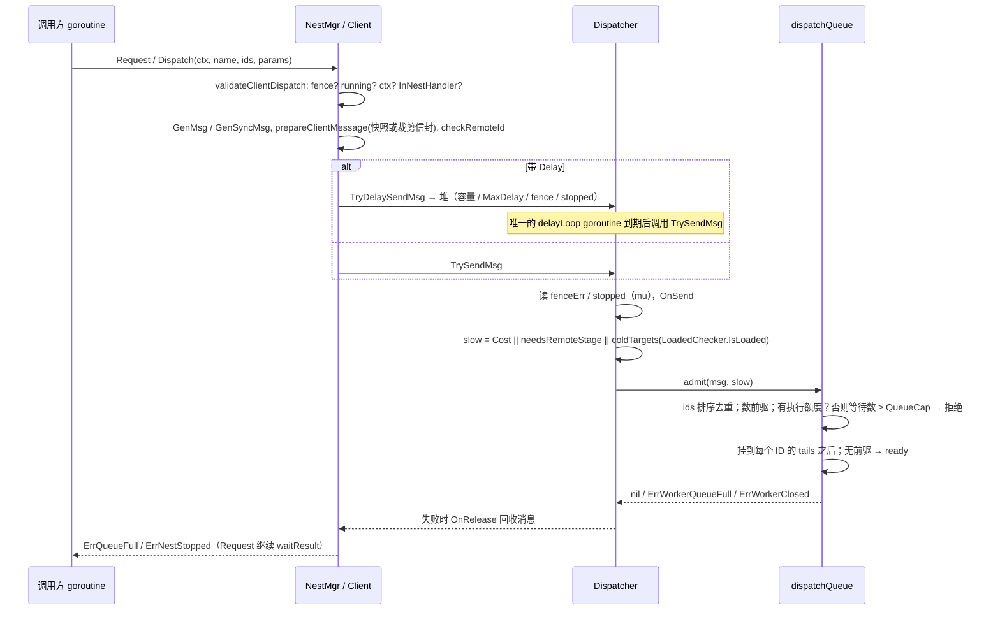
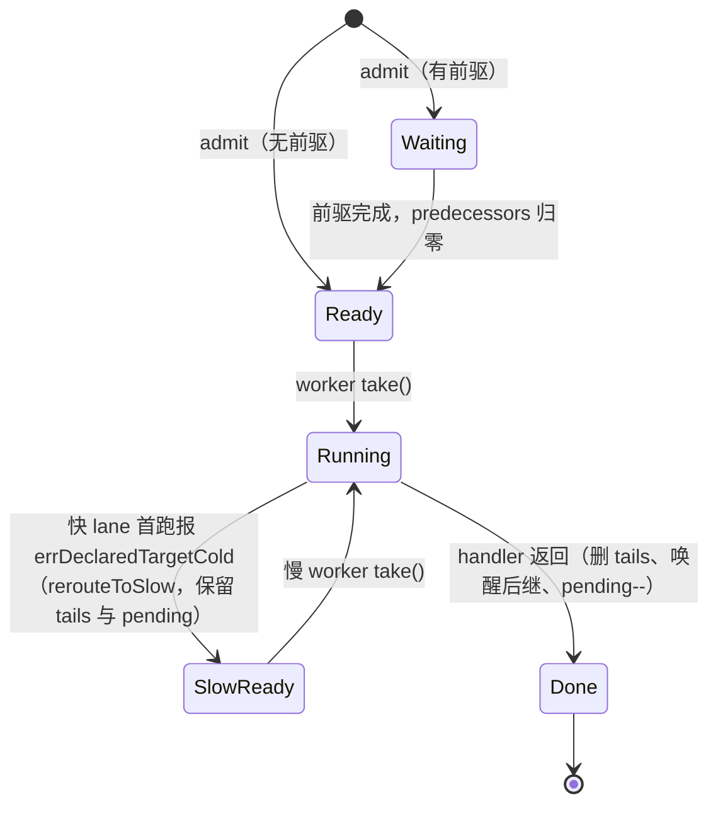
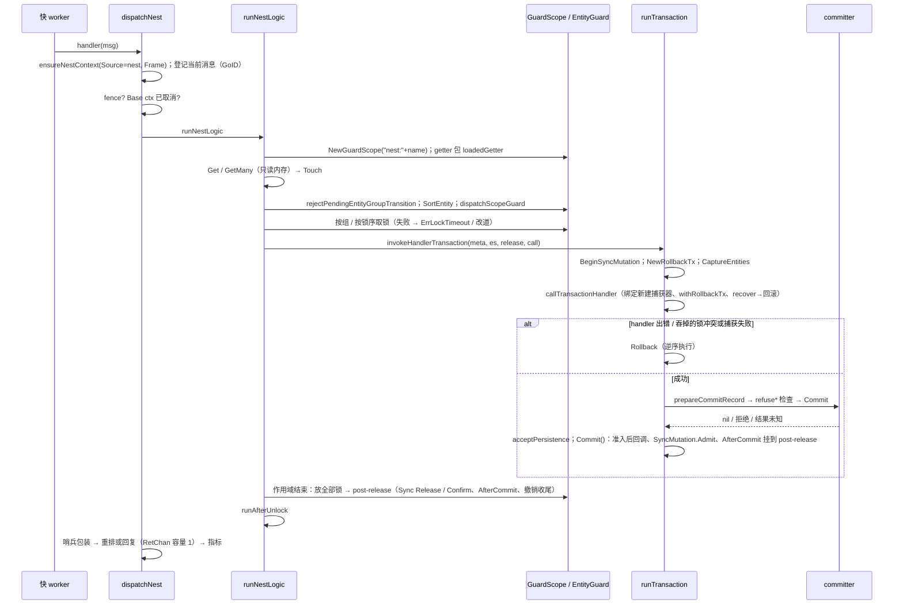
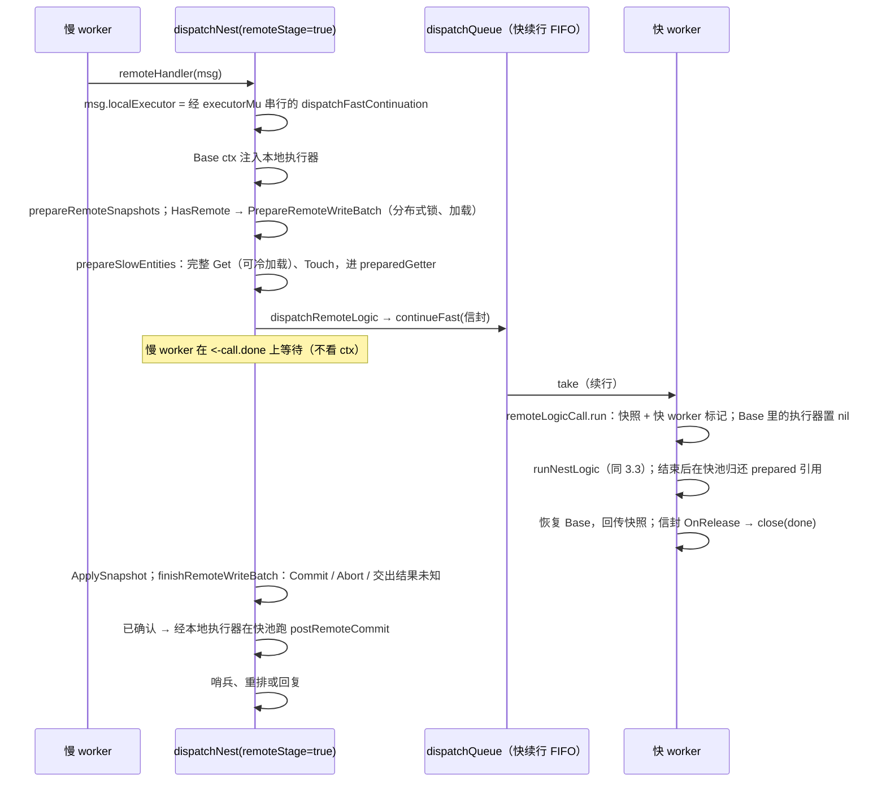
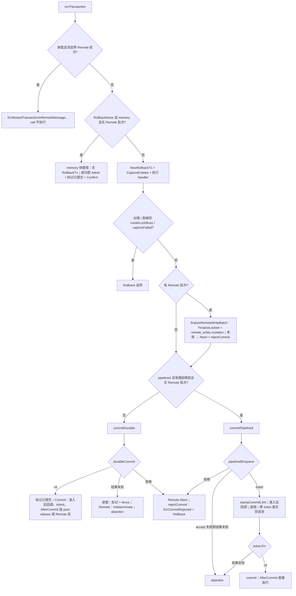
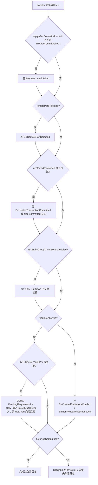
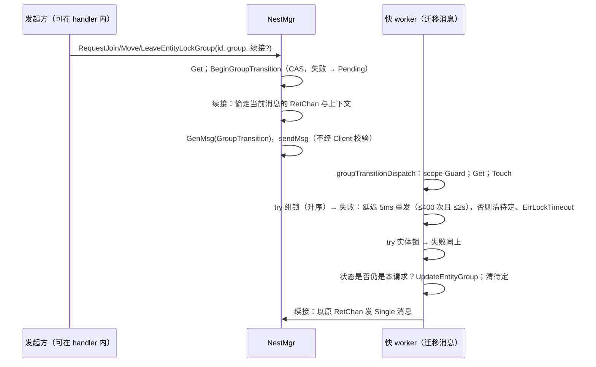
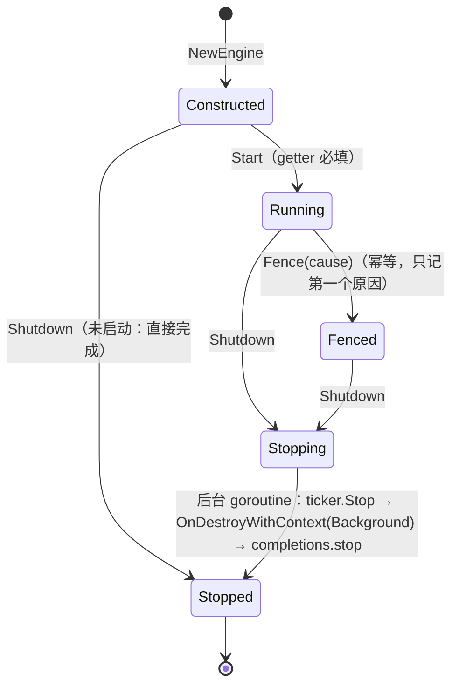
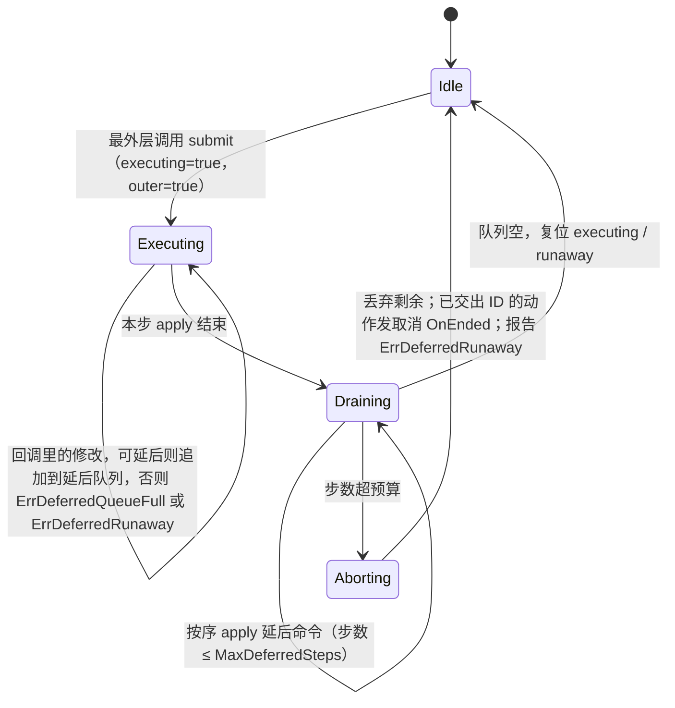
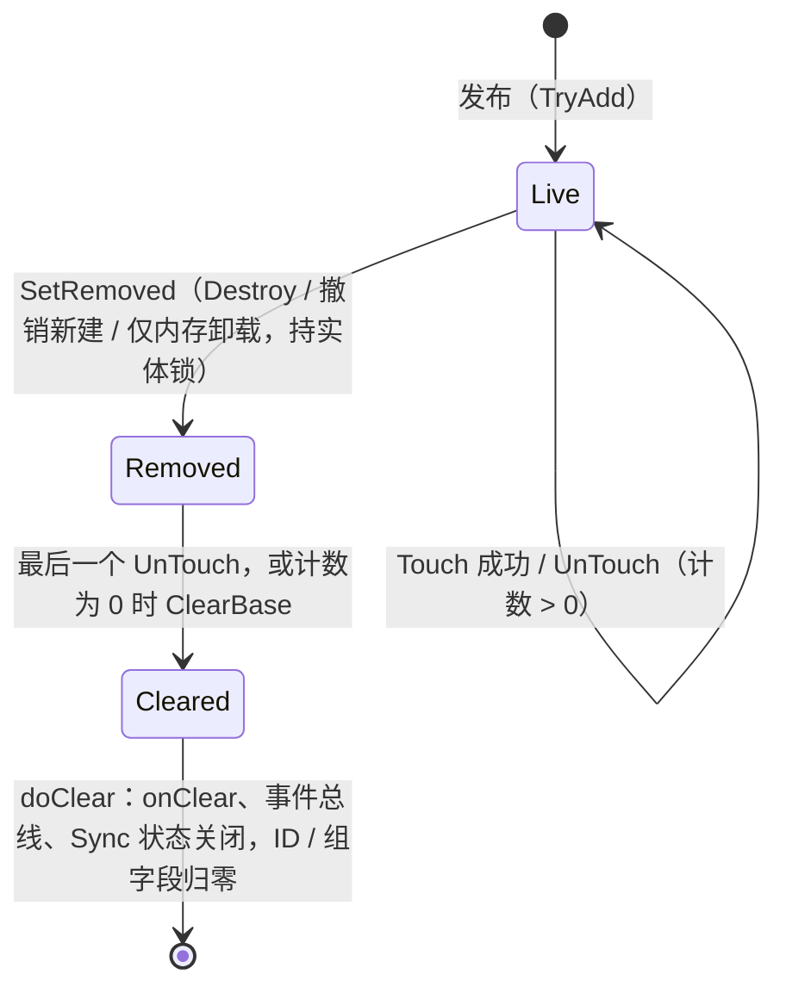

# 02 Nest 调度与实体：实现

> 配套说明文档：[guide/02-nest-entity.md](../guide/02-nest-entity.md)。
> 源码基准：tag `v1.23.0`（`28912cd6`），全部 `path:line` 按这个 tag。codebase-memory 图谱的 generation 是 2026-09-23（`check_index_coverage` 对本篇引用的文件报 `metadata_changed`），比 tag 旧，只用来定位；结论全部来自 tag 源码。
> 读者：review agent 与要改这块代码的人。每条不变量都给出“强制位置 + 守卫测试”，第 10 节是具体的 review 问题。

## 速览

- **一条消息的生命**：调用方 goroutine 上准入（登记同 ID 依赖、判冷热、检查预算）→ 快 lane（或先慢 lane 准备）的 worker 上 `dispatchNest` → `runNestLogic` 建 Guard 作用域、按锁序取锁 → `runTransaction` 执行 handler、回滚或提交 → 作用域结束时放全部锁、跑解锁后回调 → 慢阶段（若有）收 Remote 尾 → 决定回复 / 重排。
- **最重要的不变量**：Guard 只归作用域所有；快池上的框架等待入口 fail-fast；提交点之后不回滚、不重排；结果未知只 abandon + fence；`ErrCommitRejected` 只用于“写任何持久记录之前”的明确拒绝。
- **最容易出错的地方**：消息上的提交事实（`txAdmitted` / `nestedTxCommitted` / `remoteCommitted` …）由不同 goroutine 在不同阶段写读，任何新路径都要说清它在“认领消息的事务 / 嵌套独立事务 / 收尾阶段”哪一类；新的等待入口要先过快池检查；`durability=memory` 加回滚策略时持久变更被静默丢弃（§10 第 C-1 条）。

## 本篇覆盖的包

| 包 | 本篇覆盖 | 交给别的分区 |
| --- | --- | --- |
| `nest` | 全部文件 | pipelined 的 WAL 侧（03）、Remote 准备 / 收尾的被调方（05） |
| `entity` | `entity_guard.go`、`category_order.go` 锁序、`manager_factory.go` 新建、`entity_manager.go` 的 `Destroy`、`local_executor.go`、`manager_access.go` 的 Get / 共享加载 / `IsLoaded` | `remote_*`（05）、`subject_sync.go` / `sync_commit.go` 内容（04）、`idgen.go` / kind 注册细节（12） |
| `lock`、`fctx`、`goroutine`、`worker` | 全部 | — |
| `actionflow` | 全部 | — |
| `cmd/glsvet` | 全部规则 | 时钟提示的业务语义（10） |
| `kit/nest` | `nest_mod.go` | Mod 通用生命周期（[01 实现](01-app-lifecycle.md)） |

[→ 说明文档：本篇覆盖的包](../guide/02-nest-entity.md#本篇覆盖的包)

---

## 1. 包与文件地图

### nest

| 文件 | 职责 |
| --- | --- |
| `nest/nest.go` | 哨兵错误与语义注释、`NestMgr`、`NestOpts` / 选项、`NewEngine`（装配与 `LocalExecutorBinder` 绑定）、`Start` / `Shutdown` / `Fence`、`SendOpt`、Remote ID 判定、异步信封裁剪 |
| `nest/client.go` | `Client` 接口与七个方法、入口校验（`ErrSyncInHandler` / `ErrAsyncInHandler`）、`waitResult` |
| `nest/dispatcher.go` | `Dispatcher`：准入入口 `TrySendMsg`、延迟堆与唯一延迟 goroutine、停机应答延迟消息、统计采样、广播分批 |
| `nest/dispatcher_series.go` | `nest.dispatch.*{dispatcher}` 序列的持有 / 撤销（RR-20261006-18） |
| `nest/dispatch_queue.go` | 两条 lane 的派发队列：同 ID 依赖链、预算、快续行、冷目标原位改道、停机排空、统计 |
| `nest/nest_dispatch.go` | `dispatchNest`（收尾、哨兵包装、重排 / 回复决策）、`runNestLogic`、Single / Multi / MultiGroup / Broadcast 的加载与加锁、锁序比较、Remote 批次准备 |
| `nest/execution.go` | `invokeHandlerTransaction`、`runTransaction`（memory 快路径 / 事务路径）、`commitDurable`、`commitPipelined`、`RunIsolatedTransaction` / `RunDetachedTransaction` |
| `nest/rollback.go` | `RollbackTx`：undo / state 捕获、回滚、提交与回调、准入后回调、提交记录准备、fence 后拒绝、嵌套写外层快照拒绝、新建实体捕获 |
| `nest/persist_change.go` | DAO 的事务内持久化变更（`MarkPersist*`）、mutation 准备与接纳、回执 |
| `nest/transaction.go` | 持久策略、`TransactionID`、committer / pipelined committer / ticket / 绑定接口 |
| `nest/msg.go` | `Msg` 与提交事实字段、Remote 批次 finalize / finish / defer、重排判定、消息池 |
| `nest/handler.go` | 全局与实例级 handler 注册、校验、hotcode 解析 |
| `nest/slow_load.go` | 慢阶段 `preparedGetter`、快阶段 `loadedGetter`、准入冷热判定、改道错误 |
| `nest/remote_dispatch.go` | 快续行 `remoteLogicCall`、`RunLocal`、`dispatchFastContinuation` |
| `nest/remote_access.go` | handler 参数里的 Remote 只读快照准备（细节 05） |
| `nest/cast.go` | `CastMulti` 系列、`ReleaseCast`、未声明 Remote 目标拒绝 |
| `nest/group_lock.go` | 锁组作用域、组锁管理、按组取锁与快照重试、`dispatchScopeGuard` |
| `nest/group_transition.go` | 组迁移请求 / 派发 / 重试 / 续接、暂时性错误重排（含抖动）、当前派发消息的 GoID 映射 |
| `nest/pipelined_completion.go` | pipelined 阶段二完成池、同实体完成顺序链 |
| `nest/ticker.go` | 帧 ticker 与全局 tick 回调表 |
| `nest/trace.go` | 派发指标、慢派发日志与堆栈采样、阶段指标、trace 事件、锁持有指标 |
| `nest/stats.go` | `DispatcherStats` / `DispatchLaneStats` |

### 其余包

| 文件 | 职责 |
| --- | --- |
| `entity/entity_guard.go` | 锁序 `GetEntityGroup`、`EntityGuard` 按实例的锁账本、`GuardScope`、Cast / 新建的锁序判定、释放与解锁后回调 |
| `entity/category_order.go` | category 即锁序、Remote 固定最先、未知 kind 排最后 |
| `entity/manager_factory.go` | `Create` / `CreateInScope` / `CreatedEntityCapturer` / `revokeCreated` |
| `entity/entity_manager.go` | `TryAdd`（指针校验、removing）、`Destroy`（锁内删除准入） |
| `entity/local_executor.go` | `WithLocalExecutor`、`RunLocal`、`ErrColdLoadInLogic`、`LoadedEntitiesOnly` |
| `entity/manager_access.go` | 正式 Getter：只读内存路径、`IsLoaded`、共享冷加载 flight 与本地步骤交接 |
| `lock/reentrant_mutex.go`、`lock/lock.go`、`lock/lock_manager.go` | 按 GoID 可重入的信号量锁、锁接口、按 ID 的锁池 |
| `fctx/context.go`、`fctx/runtime_context.go`、`fctx/worker.go` | 请求上下文与快照、按 GoID 分片存储、快 worker 标记与阻塞检查 |
| `goroutine/goid_prod.go` / `goid_race.go`、`safe_func.go`、`task_pool.go`、`mpsc_queue.go`、`parallel.go` | GoID、panic 隔离、固定 worker 任务池、无锁 MPSC、有界并行 |
| `worker/pool.go`、`worker/worker.go` | 按 key 哈希的 worker 池、生命周期受控的 `Go` / `TryGo` |
| `actionflow/action_runner.go`、`mission_runner.go`、`plan.go`、`registry.go`、`runtime.go`、`action_types.go` | 动作 / 任务 runner、延后队列、计划任务、实例级注册表、接口 |
| `cmd/glsvet/main.go`、`componentfields.go`、`stophints.go`、`clockhints.go` | 入口与违例规则、A1 字段写提示、停机提示、时钟提示 |
| `kit/nest/nest_mod.go` | Mod：读配置、构造引擎、登记 capability、接 Fence 与健康 |

---

## 2. 关键类型与数据结构

| 类型 | 位置 | 要点 |
| --- | --- | --- |
| `NestMgr` | `nest/nest.go:175` | `lifecycleMu` 保护 `started` / `stopped` / `fenceErr` / `groupLocks`；`handlers` 是构造时全局表快照 + 实例注册（启动后只读）；`completions` 非 nil 表示 pipelined 阶段二 |
| `NestOpts` | `nest/nest.go:276` | 全部引擎选项；`HbWorkerNum` 被接收但不再使用（§10 C-2） |
| `Dispatcher` | `nest/dispatcher.go:18` | `mu` 保护 `delayed` 集合 / 堆、`stopped`、`fenceErr`；`coldTargets` 由 `NewEngine` 在 Getter 实现 `LoadedChecker` 时装配（`nest/nest.go:460`）；`seriesName` 由包级 `dispatcherSeries.mu` 保护 |
| `dispatchQueue` | `nest/dispatch_queue.go:56` | 下标 0 = 快 lane、1 = 慢 lane；`tails` 是每个 ID 的最后一个作业；`queued` / `readyCount` / `running` 按 lane 计数；`continuations` 是快续行的单独 FIFO；`pending` 是全部未完成作业（停机排空看它） |
| `dispatchJob` | `nest/dispatch_queue.go:18` | `ids` 是排序去重后的声明目标（无目标时为 `[0]`，`:120`）；`predecessors` 计数、`successors` 链；`slow` 可在改道时由快变慢 |
| `WorkerPoolConfig` | `nest/dispatch_queue.go:16` | `QueueCap` 是整条 lane 的等待预算 |
| `Msg` | `nest/msg.go:340` | 池化；`RefCount` 归零才回收并关闭快续行的 `done`（`:441`）。提交事实：`txInFlight`、`txAdmitted`、`txCommitted`、`txNoRollback`、`noRollbackHandlerStarted`、`createLockConflictNoRollback`、`nestedTxCommitted`、`remoteCommitted` / `remoteConfirmed` / `remotePartRejected` / `remoteIndeterminate`、`deferredCompletion`、`slowReroute` |
| `remoteLogicCall` | `nest/remote_dispatch.go:16` | 慢 worker 到快 worker 的一次借用：独立信封、快照往返、`done` 在信封回收后关闭 |
| `preparedGetter` / `loadedGetter` | `nest/slow_load.go:18`、`:99` | 前者缓存慢阶段取得并 Touch 的声明目标；后者给 ctx 加 `LoadedEntitiesOnly` |
| `RollbackTx` | `nest/rollback.go:63` | 状态 open / committed / rolledBack（`:112`），abandon 也记为 committed；`rollbacks` 逆序执行；`participantChanges` / `participantOrder` 是 DAO 的事务内变更；`dispatch` 非 nil 表示认领消息；`enclosing` / `snapshotted` 用于嵌套写冲突检查 |
| `HandlerMeta` | `nest/rollback.go:50` | `Rollback` + `Durability`，注册时 `validateHandlerMeta` 校验并归一（`nest/handler.go`）。`Durability` 零值表示未声明：`Rollback` 不为 none 时报 `ErrDurabilityUnset`，为 none 时归一成 memory。**v1.23.1 起注册时强制**（[RR-20261006-60](../../bug/RR-20261006-60.md)）；事务记录上的级别是 `dataengine.Durability`，经 `DurabilityPolicy.Record()` 换算 |
| `PersistChange` / `MutationParticipant` | `nest/persist_change.go:20`、`:51` | DAO 实现 `PrepareMutation` / `AcceptMutation`；变更只在事务里累积，回滚即丢弃 |
| `TransactionCommitter` / `PipelinedTransactionCommitter` / `CommitTicket` | `nest/transaction.go:91`、`:131`、`:118` | Commit 接纳后不得再报失败；Enqueue 是 pipelined 唯一拒绝点；ticket 只能是 nil 或 `ErrCommitIndeterminate` |
| `LocalExecutorBinder` / `TransactionReleaseNotifier` / `CommitParticipant` | `nest/transaction.go:109`、`:98`、`:140` | committer、Remote 管理器、Getter 的可选能力 |
| `completionPump` / `completionOrder` / `completionHandoff` | `nest/pipelined_completion.go:51`、`:73`、`:205` | 同主实体完成链在锁内建立；回复所有权显式交接 |
| `EntityLockGroupScope` / `entityLockGroupLockManager` / `dispatchGroupSnapshot` | `nest/group_lock.go:14`、`:109`、`:168` | 组作用域按 GoID 存；组锁是 `ReentrantMutex(-groupID)`，只 TryLock；快照记组 ID、纪元、迁移状态、目标 |
| `GroupTransitionRequest` | `nest/group_transition.go:27` | 状态、目标组、尝试次数、截止、可选续接 |
| `EntityGuard` / `GuardScope` / `heldEntity` | `entity/entity_guard.go:76`、`:110`、`:105` | `eMap` 按 ID 记当前实例；`superseded` 记被同 ID 新实例取代、锁仍持有的旧实例；`postRelease`；`revokedCreated` 以（Manager, ID）为键；`createdCapturer` 是当前 handler 的事务或 memory 标记 |
| `CreatedEntityCapturer` | `entity/manager_factory.go:54` | `RollbackTx` 与 `memoryHandlerCreates` 实现（`nest/rollback.go:879`、`:896`） |
| `ReentrantMutex` | `lock/reentrant_mutex.go:28` | 容量 1 的信号量通道 + 持有者 GoID + 重入计数；等待者停在通道上（FIFO 倾向），不自旋 |
| `fctx.Context` / `ContextSnapshot` | `fctx/context.go:14`、`:31` | `fastWorker` 不进快照；快照不带 `Now` |
| `ActionRunner` / `runnerCommand` | `actionflow/action_runner.go:151`、`:118` | `executing` 是“回调期间”的唯一判定；`outer` 区分错误归属；`advancing` 去重推进命令 |
| `MissionRunner` / `missionCommand` | `actionflow/mission_runner.go:96`、`:65` | 同上，`endExecution` 在 defer 里复位 |
| `DispatchLaneStats` | `nest/stats.go:17` | `BlockedOnPredecessor` 与 `WaitingForWorker` 分开，`DependencyWait` 与 `WorkerWait` 分开累计 |

[→ 说明文档：2 核心概念](../guide/02-nest-entity.md#2-核心概念与术语)

---

## 3. 主流程

### 3.1 准入

要点（行号均在 tag 上）：

1. 入口校验 `nest/client.go:172`：fence 错误原样返回；`Running()` 为假 → `ErrNestStopped`；ctx 已取消 → `ErrNestCanceled`；`fctx.InNestHandler()`（Meta.Source == "nest"）→ `ErrSyncInHandler` / `ErrAsyncInHandler`。
2. 快照：同步请求 `snapshot.Base = ctx`、带 KV；异步只留 Config / Meta / Trace（`nest/client.go:198`、`nest/nest.go:686`）。
3. 冷热判定只调用 `LoadedChecker.IsLoaded`，不调 Getter（`nest/slow_load.go:120`），因为准入跑在发送方 goroutine 上——可能是快 worker，也可能是唯一的延迟 goroutine（RR-20260926-47）。
4. 预算：`hasExecutionSlot := predecessors == 0 && busyWorkers + readyCount < Workers`（`nest/dispatch_queue.go:149`）。有额度的不占等待位；等待数 `waitingCount` 不把有前驱的作业算作已预留（`:357`）。
5. 准入成功即转移消息所有权；之后的失败只能经回复或日志可见。

### 3.2 派发作业的状态

- worker 循环 `nest/dispatch_queue.go:223`：取作业时持 `q.mu`，执行 handler 时不持任何队列锁；执行包在 `goroutine.SafeFunc` 和一个新的 fctx 里，快 lane 带 `WithFastWorker()`（`:237`～`:243`）。
- 快 lane 的 `take` 在外部作业与快续行之间交替（`preferContinuation`，`:199`），续行不会饿死，外部作业也不会被续行挤占。
- 改道 `rerouteToSlow`（`:296`）：作业保持在 `tails` / `successors` 的位置和 `pending` 计数，不占新的准入预算（慢 lane 等待数可暂时超过 `QueueCap`，上界是已准入的快作业数），计 `nest.dispatch.slow_reroute.total`。

### 3.3 快 lane 首跑（没有慢阶段）

关键代码：

- `dispatchNest` `nest/nest_dispatch.go:23`：收尾全在一个 defer 里（`:50`～`:146`），顺序是 recover → 冷改道分支（直接返回，不回复）→ `finishRemoteWriteBatch` → 归还慢阶段引用（经本地执行器，`:76`）→ 三种哨兵包装（`:80`～`:102`）→ `ErrEntityGroupTransitionScheduled` 视为 nil（`:105`）→ 重排决策（`:110`～`:127`）→ 回复 / 日志（`:128`～`:140`）。
- `runNestLogic` `nest/nest_dispatch.go:193`：作用域在 switch 之前建立（`:204`），清理顺序“先释放作用域、再 `runAfterUnlock`”（`:207`～`:212`）。
- `dispatchLoadedEntities` `nest/nest_dispatch.go:370`：释放函数用 `sync.Once` 包住，pipelined 提前释放与 defer 兜底只执行一次；兜底释放有自己的 recover，panic 并进返回值而不覆盖业务错误（`:397`～`:411`，RR-20260930-20）。
- `broadcastDispatch` `nest/nest_dispatch.go:501`：每个目标一个作用域、一笔事务，没有提前释放闭包，所以 pipelined handler 在这里按锁内提交执行（`:567`）。

### 3.4 慢阶段与快续行

- `dispatchFastContinuation` 开头 `fctx.AssertBlockingAllowed`（`nest/remote_dispatch.go:123`）：在快 worker 上调用直接 panic，杜绝快池自等。
- 慢阶段注入的执行器不能随快照漏进快阶段：`run` 把 `Base` 的执行器置 nil、结束再恢复（`nest/remote_dispatch.go:41`～`:54`）；即使业务保存了慢阶段的 ctx 在快阶段调用 `entity.RunLocal`，也因 `InFastWorker` 就地执行（`entity/local_executor.go:26`）。
- `preparedGetter.release` 里的 `UnTouch` 可能触发销毁，所以必须在快池执行（`nest/slow_load.go:17` 注释，`nest/nest_dispatch.go:76`、`nest/remote_dispatch.go:59`）。
- Remote 批次的 Commit / Abort / Close 都在慢 worker 上（`nest/msg.go:72`）；被 `remoteentity` 的 `AssertBlockingAllowed` 守住（05）。

### 3.5 事务分支

`durableCommit`（`nest/rollback.go:586`）的检查顺序是固定的，review 时逐条对照：

1. memory 且没有 effect：带 Remote 批次的先做 fence 检查，然后直接返回 nil——**不准备、不交 committer**（`:589`～`:601`）（v1.23.1 起运行期强制，见 [RR-20261006-41](../../bug/RR-20261006-41.md)。）；
2. `prepareCommitRecord`：提交参与者 `PrepareCommit` → `preparePersistence`（DAO `PrepareMutation`、规范化、`AddMutation`）→ 组装记录 → 校验（`:534`）；
3. 空记录 → nil；
4. `refuseWriteUnderEnclosingRollback`（嵌套写外层快照，`:641`）；
5. `refuseCommitAfterFence`（只对认领消息的事务，`:707`）；
6. committer 为 nil：非 memory 或有 effect → `ErrCommitterRequired`；
7. `committer.Commit`：`ErrCommitIndeterminate` 原样返回；其他错误加 `ErrCommitRejected`；
8. `acceptPersistence`：任何 DAO `AcceptMutation` 失败都是 `ErrCommitIndeterminate`（`nest/persist_change.go:312`）。

`RollbackTx.commit`（`nest/rollback.go:416`）：置 committed、清空回滚资料 → `runAfterAdmission`（把新建实体再纳入 Sync、执行准入后回调、`SyncMutation.Admit`）→ AfterCommit 的去处：消息带 Remote 批次 → `addPostRemoteCommit`（Remote 确认后执行）；有 Guard 作用域且锁未释放 → 逐个 `AppendPostRelease`；否则（pipelined 已放锁）就地执行并汇总错误。

### 3.6 A1：DAO 回滚在 Nest 侧的接线

DAO 本身（生成 setter、快照、标注）见 [03 dataengine 实现](03-dataengine.md)。Nest 侧只有四个接点：

| 接点 | 位置 | 行为 |
| --- | --- | --- |
| 捕获实体 | `RollbackTx.CaptureEntities` `nest/rollback.go:903` | 按 ID 去重；Remote 托管实体在 durable 事务且无 Remote 批次时拒绝（`ErrDurableRemoteWriteUnsupported`）；登记实体与 DAO 的 `CommitParticipant`（非 Remote）；`RollbackNone` 到此为止；其余记入 `snapshotted`；`state` 下先调实体的 `RollbackParticipant`；逐个 DAO 调 `captureDao` |
| `captureDao` | `nest/rollback.go:980` | `undo`：只登记 tracker 恢复（字段逆操作由生成 setter 经 `RecordUndo` 自己登记）；`state`：DAO 实现 `RollbackParticipant` 用它，否则 `RollbackSnapshotter` 拍快照、回滚时恢复快照与 tracker；两者都没有 → `ErrRollbackUnsupported` |
| 字段逆操作 | `RecordUndo` / `RecordUndoToken` `nest/rollback.go:163`～`:214` | 同一（owner, field, token）每笔事务只登记一次；owner / token 必须可比较；包级函数只在 `RollbackUndo` 事务里生效，其余返回 false |
| 持久化变更 | `persistChange` `nest/persist_change.go:56` | DAO 第一次 `MarkPersist*` 时快照 tracker 并登记恢复；变更只在事务里累积；事务外调用返回 `ErrTransactionClosed`（生成 setter 据此 panic） |

动态纳入的实体走同一个 `CaptureEntities`：Cast（`nest/cast.go:191`）、handler 内新建（`nest/rollback.go:835`，先登记撤销发布、再捕获，回滚时撤销最后执行）。

### 3.7 收尾、重排与回复

- `requeueAllowed`（`nest/msg.go:247`）= 未越过提交点 && 没有“不能回滚的新建冲突” && 不是“不能回滚的 handler 已开始”。
- `transactionPastCommitPoint`（`nest/msg.go:269`）看 `txAdmitted`、`nestedTxCommitted`、`remoteCommitted`、`remoteIndeterminate`，以及错误链上的 `ErrAfterCommitFailed` / `ErrCommitIndeterminate`。
- 重排是重新准入：排到当时已准入的同 ID 后继之后（`nest/group_transition.go:387`）；冷改道不是重排，保留位置。
- 回复通道容量 1（`GenSyncMsg`，`nest/msg.go:513`）；停机应答延迟消息后把 `RetChan` 置 nil，保证至多一次（`nest/dispatcher.go:205`）。

### 3.8 锁组与组迁移

普通派发的组路径 `lockDispatchEntitiesForHandlerWithStore`（`nest/group_lock.go:258`）：最多 4 轮（快照 → 解析组 ID，跨组即 `ErrEntityLockGroupMix` → 取锁 → 校验快照；待定立即返回、其他变化放锁重试）。组 ID 非 0 时组锁与实体锁都只 try，不等待（`:289`～`:325`）。

### 3.9 RunLocal

1. `fctx.BlockingError` → 快 worker 上返回 `ErrBlockingInFastWorker`（`nest/remote_dispatch.go:84`）。
2. ctx 已取消 → `ErrNestCanceled`；fence → fence 错误；未启动 / 已停 → `ErrNestStopped`。
3. 信封 `tryContinueFast`：队列未启动或已开始停止则拒绝（`nest/dispatch_queue.go:185`）。
4. 无条件等 `done`：fn 可能正持有实体锁，不能因 ctx 提前返回（`:115`）。fn 的 panic 作为错误返回。

`NewEngine` 把它绑定给 committer（DataEngine 驱逐）、Remote 管理器（finalizer）、Getter（共享冷加载的发布）（`nest/nest.go:471`～`:482`）。

### 3.10 停机与 fence

- `Shutdown`（`nest/nest.go:515`）：第一次调用置 `stopped` 并起后台 goroutine 排空；所有调用者在自己的 ctx 内等同一个 `stopDone`，超时返回 ctx 错误、排空继续，重试再等——满足“停止入口三步”。
- `OnDestroyWithContext`（`nest/dispatcher.go:167`）：先停延迟 goroutine，延迟堆里的同步请求回 `ErrNestStopped`、异步记日志；再 `queue.stop`（`stopping` 后拒绝新准入，worker 在 `pending == 0` 后退出）；排空返回 nil 才 `releaseSeries`。
- fence 生效点：准入（`nest/dispatcher.go:248`、`:390`）、派发开头（`nest/nest_dispatch.go:149`）、`runNestLogic`（`:213`）、`RunLocal`、交给 committer 之前（`nest/rollback.go:707`）。排队中的消息在派发开头被拒，handler 不执行。

### 3.11 actionflow 的执行模型

- 判定只有一处：`submit`（`actionflow/action_runner.go:362`、`actionflow/mission_runner.go:231`）。
- `ActionRunner.Start` / `Enqueue` 在提交前就构建动作、分配 ID（`:200`～`:233`），所以回调里也能立即返回 ID；被拒（队列满、截停）时不分配 ID（`admit`，`:334`）。
- 复位位置不同：`MissionRunner.submit` 用 `defer r.endExecution()`（`:240`）；`ActionRunner.submit` 依赖 `drain` 里的 defer（`:380`），`apply` 若有未恢复的 panic 不会走到 `drain`（见 §10 A-3）。

### 3.12 glsvet 的执行流程

1. `expandArgument`：普通参数必须是存在的目录；`<root>/...` 遍历，跳过 `.` 开头目录、`testdata`、`vendor`（`cmd/glsvet/main.go:115`）。
2. `vetDirectory`：带注释解析（`parser.ParseComments`），默认排除 `_test.go`（`:155`）；先时钟提示，再逐包：A1 undo 提示、A1 字段写提示、收集准入方法签名、逐文件跑 handler 并发、准入结果、停机提示、`go` 字面量里的 goroutine 绑定调用（`:162`～`:200`）。
3. 汇总：提示数、违例数、无法检查的输入数；退出码 2 > 1 > 0（`:96`～`:108`）。

### 3.13 实体引用计数、销毁与锁的复验

`EntityBase.tryTouch` 一个原子整数里放引用计数与两个标志位 removed / cleared（`entity/entity_base.go:312`、`:331`）：

- Touch 在 removed 或 cleared 后一律失败，Nest 把 Touch 失败当作“目标不存在 / 已被驱逐”（`nest/nest_dispatch.go:290`、`:344`）。
- 清理（ID 归零）只在最后一个引用归还后发生：持有引用的派发、慢阶段、广播都在结束时 UnTouch，最后一个 UnTouch 的那个 goroutine 执行清理——这就是慢阶段引用必须在快池归还的原因（N32）。
- `EntityManager.Destroy`（`entity/entity_manager.go:196`）的顺序：Touch → 取实体锁 → 复验 removed / 仍是登记实例 → 删除准入（确定失败保留实体；Deferred 交给当前事务收尾；结果未知防御性移除）→ 锁内标 removed、摘索引、记 removing → 放锁 → `DestroyAll` / `OnDestroy` → UnTouch + ClearBase → 回收 `LockManager` 条目、清 removing。销毁回调在锁外执行，以便它们按 Guard 锁序协调其他实体。
- 锁复验契约（`lock/lock_manager.go:34`、`:45` 注释）：`LockManager.ReleaseLock` 之后，迟到的等待者可能拿到旧锁实例；所以每个取锁方在拿到锁之后必须复验实体状态——`RequireEntity` / `TryRequireEntity` 拿到锁后检查 `IsClear() || IsRemoved()`，是就放锁返回失败（`entity/entity_guard.go:286`～`:290`、`:309`～`:315`）。
- `removing` 标记让同 ID 的新建在旧实例收尾结束前失败（`ErrEntityRemoved`），Nest 内转成锁冲突或确定失败（说明文档 §4.6、N38）。

[→ 说明文档：4 怎么用](../guide/02-nest-entity.md#4-怎么用)

---

## 4. 不变量清单

| # | 不变量 | 强制位置 | 守卫测试 |
| --- | --- | --- | --- |
| N1 | 同一声明目标 ID 的作业按准入顺序执行；等前驱的作业不占 worker | `nest/dispatch_queue.go:142`～`:167`（登记）、`:266`～`:280`（完成时唤醒后继） | `TestTwoPoolsOrderAllTargetsWithoutOccupyingFastWorker`（`nest/dispatch_queue_test.go:31`）、`TestWorkerBudgetDoesNotReserveWorkersForBlockedIDs`（`nest/worker_budget_test.go:49`）、`TestRemoteStagesPreserveOrderAndDrainBeforeShutdown`（`nest/remote_dispatch_test.go:140`） |
| N2 | 准入先用未占用的执行额度，再用等待预算；满即拒绝，不阻塞发送方 | `nest/dispatch_queue.go:149`～`:153` | `TestWorkerBudgetAdmitsBurstBeforeWorkersRun`、`TestWorkerBudget1024WorkersDrainWithSmallQueue`、`TestSlowPoolUsesSharedWorkersAndBoundedWaiting`、`TestClientAdmissionReportsQueueFull`、`TestQueueStatsAndAdmissionCountRunningContinuation` |
| N3 | 准入只用 `LoadedChecker` 判冷，从不在发送方调用 Getter | `nest/dispatcher.go:270`、`nest/slow_load.go:120`、`nest/nest.go:460` | `TestAdmissionNeverRunsCustomGetterOnSender`、`TestDelayedAdmissionIsNotSerializedByCustomGetter`、`TestAdmissionColdProbeRequiresLoadedChecker`（`nest/admission_loaded_probe_promises_test.go`） |
| N4 | 准入后变冷的声明目标原位改道，保留同 ID 位置，handler 未开始 | `nest/nest_dispatch.go:55`、`:273`、`:291`、`:357`、`:383`；`nest/dispatch_queue.go:253`、`:296` | `TestDeclaredTargetEvictedAfterAdmissionMovesToSlowKeepingOrder`、`TestDefaultSenderPreparesColdDeclaredTargetsOnSlowWorker`（`nest/cold_target_admission_promises_test.go`） |
| N5 | 快阶段的 Getter 只读内存；冷目标是可判别错误、不 panic | `nest/nest_dispatch.go:195`、`nest/slow_load.go:101`、`entity/local_executor.go:57`、`entity/manager_access.go:222` | `TestFastStageRejectsDirectColdAccessBeforeIO`、`TestFastLogicMarksGetterContextAndSlowPreparationCanLoad`、`TestFastWorkerColdMissReturnsErrorInsteadOfPanicking`、`TestFastCastColdTargetLetsBusinessFallBack` |
| N6 | 快 worker 标记只由快 lane 与快续行建立，嵌套继承、快照不带 | `nest/dispatch_queue.go:239`、`nest/remote_dispatch.go:39`、`fctx/context.go:105`、`fctx/worker.go:12` | `TestFastWorkerIsLocalExecutionState`（`fctx/worker_test.go:5`） |
| N7 | 快池上不会“投递到快池再等”：`dispatchFastContinuation` panic、`RunLocal` 报错、`entity.RunLocal` 就地执行 | `nest/remote_dispatch.go:123`、`:84`；`entity/local_executor.go:26` | `TestRunLocalFromAFastWorkerFailsFast`、`TestFastContinuationRejectsSelfDispatchAndSavedSlowExecutorRunsInline`、`TestSlowHandlerRunLocalDoesNotWaitForOwnPool` |
| N8 | `RunLocal` 不排在任何同 ID 链上；投递后一定等 fn 结束 | `nest/dispatch_queue.go:185`、`nest/remote_dispatch.go:115` | `TestRunLocalIsNotOrderedBehindTheEntitysSlowPreparation`、`TestRunLocalExecutesOnTheFastPoolAndIsBoundToTheCommitter` |
| N9 | handler 内不能再派发 | `nest/client.go:191` | `TestNestHandlerRejectsNestedSyncDispatch`、`TestNestHandlerRejectsNestedAsyncDispatch` |
| N10 | 派发取锁只用当前作用域的 Guard；取锁、重试、释放从不归还 Guard | `nest/group_lock.go:247`～`:261`、`nest/nest_dispatch.go:375`、`:485`、`nest/group_transition.go:134` | `TestDispatchLockingWithoutGuardScopeNeverReturnsCallerGuardToPool`、`TestDispatchLockingGroupRetryInScopeKeepsGuardUntilScopeEnds`、`TestDispatchEntriesRequireGuardScope`（`nest/dispatch_guard_scope_promises_test.go`） |
| N11 | 加锁按（category 值, ID）升序；Cast / 新建只能等待更高 category 的锁，否则拒绝或只 try | `nest/nest_dispatch.go:374`、`:604`；`entity/entity_guard.go:26`、`:386`、`:406`～`:465`；`nest/cast.go:132`、`:155` | `TestCastPlayerCanCastAllianceAndOtherByCategoryOrder`、`TestCastRejectsReverseCategoryOrder`、`TestRegisteredCategoriesMakeTheCategoryValueTheLockOrder`、`TestHandlerCreateThenHigherGroupCastDoesNotFormCycle`、`TestHandlerCreateCrossOrderResolvesWithoutDeadlock` |
| N12 | Guard 按实例记账：同 ID 换了锁的新实例不算已持有；被取代的旧实例的锁在作用域结束时一并释放 | `entity/entity_guard.go:340`～`:378`、`:497` | `TestGuardLocksNewInstanceWithDifferentMutex`、`TestGuardReleaseEntityKeepsSupersededLockAccounted`、`TestDestroyThenRecreateSameIDInHandlerLocksNewInstance`、`TestCastAfterDestroyDoesNotReturnUnlockedRecreatedInstance`、`TestReleaseCastOfDestroyedInstanceKeepsRecreatedLock` |
| N13 | 广播每个目标一个作用域、一笔事务，目标结束释放它取得的全部锁 | `nest/nest_dispatch.go:540`～`:574` | `TestBroadcastReleasesDestroyedAndRecreatedLocksPerTarget`、`TestBroadcastReleasePanicBalancesTouchesAndContinues`、`TestABroadcastSkipsMissingEntitiesAndKeepsGoing` |
| N14 | 实体实现必须是指针 | `entity/entity_guard.go:325`（`BuildEntity`、`TryAdd` 调用） | `TestValueTypeEntityIsRejectedAtRegistrationAndPublish`（`entity/entity_pointer_contract_promises_test.go:25`） |
| N15 | 可回滚事务失败：DAO 值、tracker、持久化变更、新建实体全部撤销 | `nest/rollback.go:370`、`:980`；`nest/persist_change.go:71`；`entity/manager_factory.go:151` | `TestRollbackStateRestoresDaoAndDirty`、`TestRollbackUndoRestoresStateAndDirty`、`TestRollbackRestoresDataEngineTracker`、`TestRollbackDiscardsPersistChangeWithoutPreparingParticipant`、`TestCreateInScopeRevokedWhenHandlerFails`、`TestCreateInScopeRevokedWhenStrictCommitRejected`、`TestRevokedCreationIsDestroyedWithCreateRevokedReason` |
| N16 | 业务吞掉新建锁冲突或捕获失败，事务仍整笔回滚 | `nest/execution.go:209`～`:219` | `TestSwallowedCreateLockConflictStillRollsBack`、`TestCreateCaptureFailureFailsTheTransactionEvenIfSwallowed`、`TestCastCaptureFailureFailsTheTransactionEvenIfSwallowed` |
| N17 | 越过提交点的消息不重排、不回滚 | `nest/msg.go:247`、`:269`；`nest/execution.go:312`、`:342`、`:392` | `TestCommittedLocalReplyIsNotRequeued`、`TestCommittedRemoteReplyIsNotRequeued`、`TestIsolatedCommitThenOuterLockTimeoutIsNotRequeued`、`TestIsolatedRejectedThenOuterLockTimeoutStillRequeues` |
| N18 | `rollback=none` 的 handler 开始执行后不重排，回复带可判别哨兵 | `nest/execution.go:162`～`:165`、`:204`～`:207`；`nest/nest_dispatch.go:118`～`:126`；`nest/rollback.go:866`～`:891` | `TestNonRollbackHandlerTransientFailureIsNotRequeued`、`TestRemoteNonRollbackHandlerTransientFailureIsNotRequeued`、`TestNonRollbackHandlerCreateConflictIsNotRequeued`、`TestRollbackHandlerTransientFailureStillRequeues` |
| N19 | 已提交后的收尾错误一律带 `ErrAfterCommitFailed`，每个提交后回调独立隔离 | `nest/nest_dispatch.go:80`；`nest/rollback.go:488`；`nest/pipelined_completion.go:248` | `TestLocalReleaseHookPanicAfterStrictCommitCarriesSentinel`、`TestMemoryHandlerReleaseHookPanicCarriesSentinel`、`TestUncommittedLocalReleaseHookPanicHasNoSentinel`、`TestCommitRunsEveryCallbackAndReportsAPanickingOne`、`TestAfterCommitPanicKeepsCauseChain` |
| N20 | 结果未知：abandon（不回滚、不跑提交后回调）并 fence 引擎 | `nest/execution.go:45`、`:289`～`:304`、`:345`、`:386`；`nest/rollback.go:510`；`nest/pipelined_completion.go:231`；`nest/persist_change.go:322` | `TestIndeterminateCommitDoesNotRollback`、`TestPipelinedIndeterminateAbandonsWithoutRollback`、`TestAsyncCompletionIndeterminateRepliesErrorWithoutRollback`、`TestAcceptFailureAfterAdmissionIsIndeterminate`、`TestPipelinedAcceptFailureDoesNotRollbackAndFencesNest`、`TestNestedIsolatedIndeterminateFencesBeforeReturning` |
| N21 | 写任何持久记录之前的明确拒绝统一带 `ErrCommitRejected`，并回滚 | `nest/execution.go:277` | `TestPreCommitRejectionsCarryErrCommitRejected` |
| N22 | fence 之后认领消息的事务不交给 committer（含 Remote 的 Durability 0 直写） | `nest/rollback.go:596`、`:612`、`:707`、`:770` | `TestOuterCommitAfterNestedAcceptFailureIsRefusedBeforeWAL`、`TestFencedMemoryRemoteWithoutEffectIsRefused`、`TestClientFenceRejectsAdmissionWithCause` |
| N23 | 独立事务从不认领消息；写外层可回滚事务已快照的实体被拒；在带 Remote 批次的消息里被拒 | `nest/execution.go:114`～`:125`、`:155`～`:161`；`nest/rollback.go:641`～`:690` | `TestNestedIsolatedWriteToOuterSnapshotIsRefused`、`TestNestedIsolatedRawMutationToOuterSnapshotIsRefused`、`TestNestedIsolatedInRemoteMessageIsRefused`、`TestIsolatedInClosingPhaseOfRemoteMessageIsRefused`、`TestIsolatedInClosingPhaseOfLocalMessageDoesNotClaimIt`、`TestIsolatedInSlowPrepareOfLocalMessageDoesNotClaimIt` |
| N24 | pipelined：拒绝只发生在锁内 Enqueue；锁在持久之前释放；回复与 AfterCommit 等 ticket；同主实体完成按提交顺序 | `nest/execution.go:337`～`:394`；`nest/rollback.go:762`；`nest/pipelined_completion.go:83`、`:221` | `TestPipelinedCommitReleasesLocksBeforeDurable`、`TestPipelinedEnqueueRejectionRollsBack`、`TestPipelinedAdmissionRunsBeforeUnlock`、`TestAsyncCompletionWaitsForEntityRelease`、`TestAsyncCompletionKeepsSameEntityCommitOrder`、`TestAsyncCompletionKeepsOrderWhenPumpIsSaturated`、`TestPipelinedAllowlistGatesHandlers`、`TestPipelinedRequiresCapableCommitter` |
| N25 | Sync：锁内冻结（Admit），全部锁释放（Release）且提交确认（Confirm）后才外发 | `nest/execution.go:130`～`:149`、`:193`；`nest/rollback.go:483` | `TestNestSyncModesShareCommitAndUnlockBoundaries`、`TestNestSyncRejectedCommitDoesNotFreezeOrPublish`、`TestPipelinedSyncReleasesDynamicLocksBeforeDurableWait`、`TestNestSyncTracksCastEntityUntilAdmission` |
| N26 | 释放 hook 的 panic 不覆盖 handler 的错误，组锁与组作用域仍释放 | `nest/nest_dispatch.go:401`～`:411`；`nest/group_lock.go:309`～`:324` | `TestRolledBackReleaseHookPanicKeepsBusinessError`、`TestGroupReleasePanicStillReleasesGroupLockAndScope` |
| N27 | 停机排空已准入的全部工作；延迟堆里的同步请求得到 `ErrNestStopped`；引擎一次性 | `nest/nest.go:494`、`:515`～`:552`；`nest/dispatcher.go:167`～`:225` | `TestShutdownAnswersDelayedRequestsInsteadOfDroppingThem`、`TestShutdownDropsDelayedFireAndForgetQuietly`、`TestAsyncCompletionShutdownDeliversPendingReplies`、`TestShutdownTimeoutDoesNotBlockIndependentEngine`、`TestEngineStartRefusesAfterShutdownAndWithoutGetter` |
| N28 | `dispatcher` 标签序列只在最后一个同名派发器排空后删除，上报与删除互斥 | `nest/dispatcher_series.go:41`～`:81`、`nest/dispatcher.go:223` | `TestDestroyedDispatchersLeaveNoSeries`、`TestADispatcherSharingItsNameKeepsTheSeries`、`TestADispatcherThatDidNotDrainKeepsItsSeriesUntilItDoes`、`TestTheSlowRerouteSeriesGoesWithItsDispatcher` |
| N29 | 暂时性重排有上限（400）且带独立随机抖动 | `nest/group_transition.go:387`～`:413` | `TestSymmetricTransientRequeuesAreNotReadmittedInLockstep`、`TestSymmetricCrossCreatePairsResolveWithinRequeueBudget` |
| N30 | 组迁移待定时普通派发不执行；取锁期间组成员 / 纪元变化即放锁重试 | `nest/group_lock.go:212`～`:229`、`nest/group_transition.go:340` | `TestEntityLockGroupSnapshotDetectsMembershipChange`、`TestEntityLockGroupTransitionPendingGatesNormalDispatch`、`TestLockDispatchEntitiesForHandlerRetriesEpochChangeWhileWaiting`、`TestEntityLockGroupTransitionTimeoutClearsPending` |
| N31 | durable handler 必须可回滚；策略字符串严格解析；rollback 不为 none 时必须显式写 Durability（v1.23.1 起注册时强制，RR-20261006-60） | `nest/handler.go:38`～`:49`、`nest/rollback.go:24`、`nest/transaction.go:30` | `TestRollbackNoneRequiresMemoryDurability`、`TestTransactionPolicyParsingRejectsLegacyAndUnknownValues`、`TestDefaultHandlerRegistrationUsesDurableAsyncPolicy`、`TestHandlerMetaRollbackRequiresExplicitDurability` |
| N32 | 慢阶段取得的引用在快池归还 | `nest/nest_dispatch.go:76`、`nest/remote_dispatch.go:59` | `TestRemoteStagesReturnContextAndConfirmAfterGuardRelease`、`TestDispatchRoutesPreserveArgumentsAndReleaseOnEveryOutcome` |
| N33 | actionflow：回调里的修改延后执行，有界，panic 不让 runner 卡在“执行中” | `actionflow/action_runner.go:362`～`:438`、`:277`；`actionflow/mission_runner.go:231`～`:302` | `TestCallbackMutationsAreDeferredUntilTheOuterCallReturns`、`TestMissionCallbackMutationsAreDeferredUntilTheOuterCallReturns`、`TestCallbacksThatKeepTriggeringEachOtherAreBounded`、`TestDeferredQueueIsBounded`、`TestDeferredStartThatCanNoLongerRunStillEndsItsID`、`TestMissionRunnerStaysUsableAfterCallbacksPanic`、`TestUpdateWhoseFnPanicsLeavesTheRunnerUsable`、`TestEndCurMissionBeforeEndAllLeavesNothingRunning` |
| N34 | glsvet：违例改退出码、提示不改；没检查到的输入退出 2 | `cmd/glsvet/main.go:96`～`:108`、`:162`～`:173` | `TestStopHintsDoNotCountAsFindings`、`TestClockHintsAreNotFindings`、`TestMissingDirectoryArgumentFails`、`TestUnparsableFileFailsInsteadOfSkippingTheDirectory`、`TestDirectoryWithoutGoFilesStillPasses` |
| N35 | glsvet A1：组件自登记 undo / 写非豁免字段给提示，跟一层同包 helper；skill 包零提示 | `cmd/glsvet/main.go:703`～`:777`、`cmd/glsvet/componentfields.go:271` | `TestComponentRecordingItsOwnUndoIsHinted`、`TestComponentRecordingUndoThroughHelperIsHinted`、`TestComponentFieldWritesOutsideTheDaoAreHinted`、`TestSkillPackagesGetNoComponentUndoHint`、`TestSkillPackagesGetNoComponentFieldHint` |
| N36 | glsvet handler 识别：`handler` 前缀或文档含 `roost:nest` | `cmd/glsvet/main.go:549` | `TestNestDirectiveMarksAHandlerWithoutTheHandlerPrefix`、`TestHandlerRawGoroutineIsRejected` 等（`cmd/glsvet/main_test.go`） |
| N37 | 实体清理只在最后一个引用归还后发生；removed / cleared 后 Touch 失败；取锁后复验状态 | `entity/entity_base.go:312`～`:357`、`entity/entity_guard.go:286`、`:312` | `TestTouchUnTouch`、`TestTouchAfterRemoved`、`TestUnTouchPanicsOnReferenceUnderflow`、`TestConcurrentTouch`、`TestClearCompletesAfterCleanupHookPanic`（`entity/entity_base_test.go`） |
| N38 | 删除准入：确定失败保留实体；结果未知不能报成功、停止服务该实体；同 ID 在收尾结束前不能重建 | `entity/entity_manager.go:196`～`:292` | `TestEntityManagerDestroyRequiresDurableAdmissionBeforeRemoval`、`TestEntityManagerDestroyIndeterminateAdmissionStopsServingEntity`、`TestEntityManagerDestroyIndeterminateAdmissionCannotReportSuccess`、`TestEntityManager_RemoveFencesSameIDUntilLifecycleCompletes`、`TestEntityManagerDestroyPanicStillCompletesFrameworkCleanup` |

[→ 说明文档：7 保证与不保证](../guide/02-nest-entity.md#7-保证与不保证)

---

## 5. 并发

### 5.1 goroutine 归属

| goroutine | 数量 | 做什么 | 能否持实体锁 / 能否等待 |
| --- | --- | --- | --- |
| 调用方 | — | `Client` 校验与准入（含 `IsLoaded`），同步请求在 `waitResult` 等 | 只拿队列 / 派发器内部锁；`waitResult` 受 ctx 与超时约束 |
| 延迟 goroutine | 每个派发器 1（`nest/dispatcher.go:127`） | 到期消息的准入 | 不持实体锁；准入不得阻塞（N3） |
| 快 worker | `fast.Workers` | 全部 handler、本地锁、回滚、提交、放锁、post-release、回复；快续行；`RunLocal` 的 fn | 持实体锁；只允许豁免内的等待（§5.3） |
| 慢 worker | `slow.Workers` | Remote 快照与批次准备、冷加载、等快续行、Remote 收尾、回复 | **不持实体锁**、不执行业务；需要本地锁的步骤经快续行 |
| ticker | 1 | tick 回调（`nest/ticker.go:153`） | 不在 Nest 作用域里 |
| 停机 goroutine | 每次 `Shutdown` 第一次调用 1（`nest/nest.go:540`） | 排空 | — |
| `queue.stop` 等待者 | 1（`nest/dispatch_queue.go:318`） | `wg.Wait` 后关闭 `done` | — |
| 完成泵 + 完成池 | 1 + `async_workers` | 等 ticket、按主实体哈希执行完成 | 不持实体锁；完成在 `unlocked` 屏障之后 |
| 共享加载 goroutine | 每个在途冷加载 1（`entity/manager_access.go:315`） | `LoadEntity`；发布步骤经领头方执行器 / 领头方 goroutine / `RunLocal` | 不是快 worker |

### 5.2 锁与锁序

| 锁 | 保护 | 持有期间禁止 |
| --- | --- | --- |
| 实体锁（`ReentrantMutex`，同 goroutine 可重入） | 实体状态 | 按（category, ID）升序取；Cast / 新建只能“向上”等，否则 try |
| 组锁（`ReentrantMutex(-groupID)`） | 同组实体串行 | 只 try（`nest/group_lock.go:140`），不形成等待环 |
| `entityLockGroupLockManager.mu` | 组锁表与引用计数 | 叶子锁，`TryLock` 前已释放（`:139`） |
| `dispatchQueue.mu` | 队列全部状态 | 执行 handler 时不持有（`nest/dispatch_queue.go:232`） |
| `Dispatcher.mu` | 延迟堆、`stopped`、`fenceErr` | 只读写字段；准入时读完即放 |
| `NestMgr.lifecycleMu` | 启停、fence、组锁管理器 | `Fence` 只拿它与 `Dispatcher.mu` 各一次，不做 I/O（`kit/nest/nest_mod.go:218` 注释） |
| `dispatcherSeries.mu`（包级） | 序列持有表与上报 | 每 1024 次准入一次，不在热路径 |
| `handlerMu`（包级 RW） | 全局 handler 表 | — |
| `completionPump.closeMu` / `chainMu` | 完成队列关闭 / 同实体链 | `submit` 在实体锁内调用，只 try 发送 |
| `ReentrantMutex` 内部 | 信号量通道 | 等待者停在通道上，不自旋（`lock/reentrant_mutex.go:15` 注释） |

框架内部锁都是叶子：持有它们时不取实体锁、不回调业务。实体锁之间的序由 `SortEntity` 与 Guard 的 `mayLock*` 保证；组锁与组内实体锁都是 try，不参与等待序。

### 5.3 快池禁止阻塞

**保护入口（实际生效的检查，按源码穷举 `BlockingError` / `AssertBlockingAllowed` / `InFastWorker` 的非测试调用方）**：

| 入口 | 位置 | 快 worker 上的行为 |
| --- | --- | --- |
| `nest.RunLocal` | `nest/remote_dispatch.go:84` | 返回 `ErrBlockingInFastWorker` |
| `nest.dispatchFastContinuation` | `nest/remote_dispatch.go:123` | panic |
| `entity.RunLocal` | `entity/local_executor.go:26` | 就地执行（不投递） |
| `entity.LoadedEntitiesOnly` → `ManagerAccess.Get` / `GetMany` 冷缺失 | `entity/local_executor.go:58`、`entity/manager_access.go:222`、`:259` | `ErrColdLoadInLogic` 包 `ErrBlockingInFastWorker` |
| `dataengine.EntityRepository.LoadEntity` | `dataengine/engine/entity_repository.go:132` | 返回错误 |
| `dataengine.WaitEntityProjection` | `dataengine/engine/entity_projection.go:87` | panic |
| `dataengine.admitRemoteEntityDelete` | `dataengine/engine/entity_delete.go:115` | 返回错误 |
| `remoteentity.PrepareRemoteWriteBatch`、批次 `Commit` / `Close`、`waitRemoteTransaction` / `waitTrackedRemoteTransaction`、`RemoteCommitStatus` 回源、`FlushRemoteAll` | `remoteentity/batch.go:49`、`:463`、`:629`；`remoteentity/transaction_tracking.go:142`、`:155`、`:214`、`:274` | panic |
| `Client.Request*` / `Dispatch*` 在 handler 内 | `nest/client.go:191` | `ErrSyncInHandler` / `ErrAsyncInHandler`（按 Meta.Source 判断，慢阶段同样生效） |

**豁免（设计内）**：实体锁 / Guard 的有序等待（`EntityGuard.RequireEntity`，`entity/entity_guard.go:271`）；锁内 WAL 准入与 strict 锁内 fsync，以及回退到 strict 路径的 pipelined（RR-20260928-11）；pipelined 阶段一在锁外等 ticket（`nest/execution.go:371`、`:381`），含完成队列满时的降级。

**不在保护范围**：业务 handler 里任意阻塞调用（RPC、`time.Sleep`、channel）。这不是全局 I/O 拦截。

### 5.4 预算与容量

| 预算 | 位置 | 满了怎样 |
| --- | --- | --- |
| 快 / 慢 lane 等待 | `nest/dispatch_queue.go:150` | `ErrQueueFull`（含 `worker.ErrWorkerQueueFull`） |
| 快续行 | 不计入外部等待预算；上界是慢 worker 数（每个慢 worker 同时至多一个信封，`nest/dispatch_queue.go:172` 注释）；`RunLocal` 的信封另计 | — |
| 慢 lane 改道 | 可暂时超过 `QueueCap`，上界是已准入的快作业 | — |
| 延迟堆 | `nest/dispatcher.go:407` | `ErrQueueFull` |
| 单条延迟 | `nest/dispatcher.go:381` | `ErrDelayTooLong` |
| 暂时性重排 | 400 次（`nest/group_transition.go:20`） | 回复最后一次的错误 |
| 组迁移重试 | 400 次或 2s（`:23`～`:24`） | `ErrLockTimeout`，清待定 |
| 组路径取锁轮次 | 4（`nest/group_lock.go:12`） | `ErrEntityLockGroupChanged`（可重排） |
| 完成队列 | `nest.pipelined.async_queue_capacity` | 单笔降级为 worker 内等待 |
| actionflow 延后命令 / 步数 | 64 / 1024（`actionflow/action_runner.go:29`） | `ErrDeferredQueueFull` / `ErrDeferredRunaway` |

[→ 说明文档：5 配置](../guide/02-nest-entity.md#5-配置)

---

## 6. 失败与不确定结果处理

| 阶段 | 失败 | 处理 | 回复 / 可见性 |
| --- | --- | --- | --- |
| 准入 | fence / 停止 / 预算满 / 延迟过长 | 回收消息 | 调用方立即拿到错误 |
| 派发开头 | fence、Base ctx 已取消 | 不执行 handler | `ErrNestFenced…` / `ErrNestCanceled`（不重排） |
| Remote 准备（慢） | 快照 / 批次准备失败 | 批次（若已挂）Abort | 原错误 |
| 加载 | 冷缺失 | 首跑且 Getter 判冷 → 改道；否则返回 | `ErrColdLoadInLogic` / `ErrEntityNotFound` |
| 取锁 | try 失败、组变更、待定 | 放已取的锁 | 重排（可回滚或未开始的）；跨组 `ErrEntityLockGroupMix` 不重排 |
| handler | 错误 / panic | `Rollback` 逆序；panic 时回滚后再抛，由 `runNestLogic` 并进错误 | 业务错误（回滚失败另并 `rollback failed` / `ErrRollbackFailed`） |
| 提交前检查 | 准备失败、嵌套写外层快照、fence、Remote 定稿拒绝 | `rejectCommit`：加 `ErrCommitRejected` 并回滚；Remote 批次 Abort | `ErrCommitRejected` + 原因 |
| committer | 明确拒绝 | 同上 | 同上 |
| committer / accept | 结果未知 | abandon；认领消息的经 `invokeHandlerTransaction` fence，嵌套的在 `commitDurable` 里 fence 并标记；Remote 批次 `Indeterminate` | `ErrCommitIndeterminate` |
| pipelined ticket | 结果未知 | abandon + fence（worker 内路径经 `invokeHandlerTransaction`，完成池路径经 `pump.fence`） | `ErrCommitIndeterminate`（+ 释放错误） |
| 提交后 | AfterCommit panic、释放 hook panic、Close 失败 | 每个回调独立 recover，后续框架义务照常执行 | 包 `ErrAfterCommitFailed`，不重排 |
| Remote 收尾 | 本地已提交、Commit 失败 | 提交后工作交给批次的持久结论（`deferPostRemoteCommit`）；无 `ErrRemotePersistenceIndeterminate` → 标记部分拒绝 | 结果未知哨兵或 `ErrRemotePartRejected` |
| Remote 收尾 | 结果未知 | `Close` 把门 / 租约转交 finalizer | `ErrRemotePersistenceIndeterminate` |
| 嵌套独立事务 | 已提交 / 未知 | 消息标记 `nestedTxCommitted`，不重排；未知时 fence | 外层失败时包 `ErrNestedTransactionCommitted` |
| 停机 | 延迟堆里的消息 | 同步回 `ErrNestStopped`，异步记日志 | — |

“取消等待不等于撤销业务”：`waitResult` 的 ctx 取消 / 超时只结束等待（`nest/client.go:274`～`:277`），已准入的消息照常执行、照常提交。

[→ 说明文档：6.4 回复错误怎么判断](../guide/02-nest-entity.md#64-回复错误怎么判断)

---

## 7. 持久化 / 协议格式

Nest 自己没有持久状态，也没有跨进程协议；它产出的是交给 committer 的 `CommitRecord`，格式与 WAL 版本归 03。

| 字段（`nest/rollback.go:561`） | 来源 |
| --- | --- |
| `ID` | `TransactionID`：8 字节进程随机前缀 + 8 字节大端自增序号（`nest/transaction.go:49`～`:65`），可排序，不在热路径调用 `crypto/rand` |
| `Handler` | handler 名 |
| `RequestID` | fctx 的 TraceID；没有时用 `player:%d/msg:%d/seq:%d`（`nest/rollback.go:575`） |
| `CreatedAt` | `time.Now().UnixNano()`（系统时间） |
| `Durability` | 事务的持久策略（emit effect / 删除意图会把 memory 升为 strict） |
| `Mutations` | DAO 参与者的 `PrepareMutation` 结果（规范化、按身份去重）+ `AddMutation` 的原始 mutation + Remote 批次的 `remote_entity` mutation（`Codec: "remote"`，`nest/msg.go:55`） |
| `Effects` | `Emit` 的 effect；缺省 ID `<txid>:<序号>` |
| `Receipts` | `AddReceipt` 的幂等回执；同一（namespace, id）摘要不同即 `ErrReceiptConflict` |

进程内约定：

- `Msg` 只在进程内流转，池化复用；`ContextSnapshot` 不序列化。
- 指标名与标签是运维“协议”，变更要同步 `dispatcherSeriesNames`（`nest/dispatcher_series.go:25`），否则序列比派发器活得久。
- 生成代码与 Nest 的约定：`BaseHandler` 签名、`HandlerMeta`、`NewParam*MismatchError`（`nest/nest.go:159`～`:173`）、`Client` 方法，见 [12 codegen 实现](12-codegen.md)。

---

## 8. 测试与门禁

| 目的 | 命令 |
| --- | --- |
| 本篇各包（含 race） | `GOWORK=off go test -race -count=1 ./nest/... ./entity/... ./actionflow/... ./fctx/... ./goroutine/... ./lock/... ./worker/... ./cmd/glsvet/... ./kit/nest/...` |
| 抖动与交叉冲突（重复跑） | `GOWORK=off go test -count=5 -run 'Requeue|CrossCreate|Symmetric' ./nest/` |
| 静态检查 | `GOWORK=off go vet ./...`；`GOWORK=off go run ./cmd/glsvet ./...`；`GOWORK=off go run ./cmd/glsvet -tests ./...` |
| 生成器 | `GOWORK=off go test -count=1 ./codegen/internal/nest/...` |
| 生成工程（真实 DataEngine） | `scripts/test-dataengine-generated.sh`、`scripts/test-sync-modes-generated.sh`（含 `codegen/internal/entity/testdata/dataengine/create_in_handler_test.go`、`nested_isolated_test.go`、`after_commit_test.go` 等） |
| Remote 链路 | `scripts/test-remote-matrix.sh`（05） |
| 基准 | `GOWORK=off go test -run '^$' -bench . ./nest/`（`optimization_bench_test.go`、`pipelined_bench_test.go`、`create_lock_bench_test.go`、`admission_probe_bench_test.go`） |
| 文档门禁 | `GOWORK=off go test -count=1 -run 'Markdown|Conflict' .` |
| 发版 | `scripts/pretag.sh vX.Y.Z`（`GOWORK=off` 下 build / vet / tidy / 全量测试） |

CI：`.github/workflows/ci.yml:33` 对 core 跑 glsvet；`framework-compat.yml:132`、`upgrade-compat.yml:63` 对生成工程跑 glsvet。

写测试的约束（[roost-coding](../../agent-skills/roost-coding/SKILL.md) 验证纪律）：nest 包级 handler 注册后 `t.Cleanup(ResetHandlersForTest)`，或改用实例级 `mgr.RegisterHandlerWithMeta`；同包 kind 号互不冲突；执行池变更覆盖 1 worker、N 请求占满 N worker、续行占用时的准入 / 统计与停机排空；用可控事件顺序而不是 sleep。测试里的旧全局入口 `InitNest` / `Nest` 只在 `nest/legacy_engine_test.go` 里。

---

## 9. 历史与重要修复（只列改变了设计的）

| 时间 / 编号 | 改了什么设计 | 记录 |
| --- | --- | --- |
| 实例化引擎 | 删除全局 `InitNest` / `nest.Nest` 与包级 Send / Sync，只剩 `NewEngine` + `Client` + 注入式 Sender | [RUNTIME_EXECUTION_MODEL](../../../RUNTIME_EXECUTION_MODEL.md)（“唯一生产入口”一节） |
| RR-20260926-06 | 快 worker 上的框架等待入口 fail-fast | [记录](../../bugfix/RR-20260926-06.md) |
| RR-20260926-25 / 47 / 26 | 冷声明目标在统一准入处自动走慢阶段；判冷只用 `IsLoaded`；快阶段冷缺失返回错误不 panic | [25](../../bugfix/RR-20260926-25.md)、[47](../../bugfix/RR-20260926-47.md)、[26](../../bugfix/RR-20260926-26.md) |
| RR-20260926-30 / 54 | `LocalExecutorBinder` / `RunLocal`；共享冷加载与调用方 ctx 解耦 | [30](../../bugfix/RR-20260926-30.md)、[54](../../bugfix/RR-20260926-54.md) |
| RR-20260926-35 / 48 / 64 | handler 内新建实体进提交边界；按 Cast 锁序取锁；冲突时可回滚的整笔回滚重排、不能回滚的不重排 | [35](../../bugfix/RR-20260926-35.md)、[48](../../bugfix/RR-20260926-48.md)、[64](../../bugfix/RR-20260926-64.md) |
| RR-20260926-49 / 73 / 77 | 越过提交点不重排；不能回滚的 handler 开始后不重排；“是否已提交 / 能否重试”判别表 | [49](../../bugfix/RR-20260926-49.md)、[73](../../bugfix/RR-20260926-73.md)、[77](../../bugfix/RR-20260926-77.md) |
| RR-20260926-65 / 74 / 75 / 76 / 84 | 嵌套独立事务：不认领消息、不得写外层快照、Remote 消息里拒绝、结果未知 fence、收尾阶段同样不认领 | [65](../../bugfix/RR-20260926-65.md)、[74](../../bugfix/RR-20260926-74.md)、[75](../../bugfix/RR-20260926-75.md)、[76](../../bugfix/RR-20260926-76.md)、[84](../../bugfix/RR-20260926-84.md) |
| RR-20260928-11 | 回退到 strict 路径的 pipelined 记录（广播、带 Remote 批次）锁内等 fsync | [记录](../../bugfix/RR-20260928-11.md) |
| RR-20260930-14 / 15 | 广播每目标一个 Guard 作用域；实体实现必须是指针 | [14](../../bugfix/RR-20260930-14.md)、[15](../../bugfix/RR-20260930-15.md) |
| U-0279 | 重排延迟加独立抖动 | [记录](../../bugfix/U-0279-nest-requeue-jitter.md) |
| A1（2026-10-05）/ A1 盲区（10-06） | 回滚统一走 DAO；glsvet 组件 undo 提示与字段写提示、`//roost:cache` | [方案](../../feature/REFACTOR-2026-10-05-dao-unified-rollback.md)、[字段写提示](../../feature/A1-COMPONENT-FIELD-WRITE-HINT-2026-10-06.md) |
| B7 / 第五轮（10-05～06） | actionflow 两个 runner 回调里的修改走延后队列 | [方案](../../feature/REFACTOR-2026-10-06-actionflow-deferred-mutations.md)、[NC-242](../../bugfix/RR-20261005-NC-242.md) |
| RR-20261005-NC-204 | glsvet 对没检查到的输入退出 2 | [记录](../../bugfix/RR-20261005-NC-204.md) |
| RR-20261006-12 | Guard 只归作用域所有，派发取锁必须有作用域 | [记录](../../bugfix/RR-20261006-12.md) |
| RR-20261006-13 | glsvet A1 提示跟进一层同包 helper | [记录](../../bugfix/RR-20261006-13.md) |
| RR-20261006-18 | 派发器指标序列随派发器撤销 | [记录](../../bugfix/RR-20261006-18.md) |

**旧文档与现行源码的出入**（只列出，未改原文档）：

- `docs/INTERNALS.md` §3 说“worker 哈希串行是调度优化”；现行派发队列是统一准入的 ID 依赖链 + 共享 worker（`nest/dispatch_queue.go:54` 注释），没有按 worker 哈希分槽（只有广播分批还按哈希切，`nest/dispatcher.go:556`）。`nest/pipelined_completion.go:284` 的注释“matching how dispatch itself hashes work”同样过时。
- `RUNTIME_EXECUTION_MODEL.md` 仍写 `roost-codegen` 独立仓与“多仓库发布顺序”，已合成单仓。
- `codegen/docs/NEST_RUNTIME.zh-CN.md`：“旧 `//roost:nest` 和 `rollback=dirty` 不属于生产协议”与现行标注同名，推断原意是更早的标注写法（未核对历史）；“升级步骤”第 8 条要求测 pipelined handler，但生成器不接受 `durability=pipelined`（`codegen/internal/nest/parse.go:177`）。
- 同一文件与 `codegen/docs/CODEGEN_REFERENCE.zh-CN.md:234` 写“`durability=memory` 的 handler 不能修改 persistent 字段”，只有 `rollback=none` 时由 panic 强制（§10 C-1）。（v1.23.1 起运行期强制，见 [RR-20261006-41](../../bug/RR-20261006-41.md)。）
- `nest/rollback.go:587` 注释“Memory-only handlers persist through entity release hooks”与 `NEST_RUNTIME.zh-CN.md`（“Entity release 只处理生命周期和 sync，不编码 BSON 或触发落库”）矛盾，按源码后者成立。

---

## 10. review 检查点

### 已知出入（需要维护者判断）

- **C-1（已确认的出入，未登记 RR）**：`HandlerMeta{Rollback: state|undo, Durability: memory}`（生成器 `rollback=undo durability=memory` 即得到它，`codegen/internal/nest/gen.go:202`）里修改持久字段：`MarkPersist` 成功，`durableCommit` 在 `nest/rollback.go:589` 直接返回 nil，不调 `PrepareMutation`、不交 committer、不报错；内存已改、持久层不变。2026-10-07 用临时单测在 tag 上验证（`durableCommit` 后 prepared=0、accepted=0、无错误，测试未提交）。需要维护者判断：是让 memory 事务拒绝持久变更（与“memory handler 不能改 persistent 字段”一致），还是改文档。（v1.23.1 起运行期强制，见 [RR-20261006-41](../../bug/RR-20261006-41.md)：memory 事务改了持久字段时整笔失败回滚，错误 `ErrMemoryTransactionPersistentWrite` 点名实体与字段。手写 meta 忘写 durability 的情形 v1.23.1 起注册时强制，见 [RR-20261006-60](../../bug/RR-20261006-60.md)。）
- C-2 `nest.heartbeat_worker_num` / `NestOpts.HbWorkerNum` 被读取但 `NewDispatcher` 不用（`nest/dispatcher.go:87`）；`ensureAsyncDispatchAllowed`（`nest/nest.go:699`）没有调用方。改配置声明或删代码时注意生成器快照 `kitconfig_gen.go`。

### 调度与准入

- A-1 新增任何消息类型或派发入口时：它的声明目标是否进了 `dispatchIDsInto`（`nest/dispatch_queue.go:102`）？没进就没有同 ID 顺序。
- A-2 新增的“在准入路径上做的判断”是否只读内存、不调 Getter、不等待（N3）？准入可能跑在快 worker 或延迟 goroutine 上。
- A-3 `ActionRunner.submit`（`actionflow/action_runner.go:362`）在 `apply` 前置 `executing=true`，复位依赖 `drain` 的 defer；若某条 apply 路径出现未被 `recoverActionPanic` 等包住的 panic，runner 会永远停在“执行中”。确认新增的回调 / 钩子调用都经过 recover 包装（对比 `MissionRunner.submit` 的 `defer r.endExecution()`）。推断：当前全部回调已包 recover，此路径不可达；未构造反例。
- A-4 新的内部消息（例如组迁移那样直接 `sendMsg`）是否绕过了 `validateClientDispatch` 的 fence / running / ctx 检查？绕过时是否有等价检查（组迁移只靠 `TrySendMsg` 的 fence / stopped）？
- A-5 改动 `take` / `work` 时：快续行与外部作业的交替（`preferContinuation`）是否仍成立？续行仍计入 `busyWorkers` 吗（准入与观测必须用同一执行容量，`nest/dispatch_queue.go:362`）？

### 快池禁止阻塞

- B-1 新的框架等待入口（等通道、等锁以外的同步、等远端）是否在等待之前调用了 `fctx.BlockingError` / `AssertBlockingAllowed`？对照 §5.3 清单逐个确认；不在豁免清单里的需要评审。
- B-2 新代码保存了慢阶段的 ctx 并在快阶段使用时，是否仍经 `entity.RunLocal`（快 worker 上就地执行）而不是直接调保存下来的执行器？
- B-3 新的 Getter 实现是否遵守 `LoadedEntitiesOnly`（快 worker 或 ctx 标记时只读内存、返回 `ErrColdLoadInLogic`、不 panic）并实现 `LoadedChecker`？

### Guard、锁序与实体生命周期

- C-3 有没有新代码调用 `entity.GetEntityGuard()` / `EntityGuardRelease` 而不在作用域里？派发取锁是否仍只经 `dispatchScopeGuard`（N10）？
- C-4 新的“提前释放”是按实例（`ReleaseEntityInstance`）还是按 ID？handler 内 Destroy 后同 ID 重建时按 ID 释放会放掉新实例的锁（RR-20260927-26）。
- C-5 Cast 或新建的锁序判断是否按实例（`mayLockEntity`）而不是按 ID？
- C-6 handler 内新建在 `TryAdd` 撞上 removing 时，是否区分“本 Guard 自己撤销的同 ID”（确定失败）与“别的持有者的收尾窗口”（锁冲突）？是否按（Manager, ID）判断（RR-20260928-02）？

### 事务与提交事实

- D-1 新的事务入口是 `invokeWithTransaction`（认领消息）还是 `RunIsolated/Detached`（不认领）？`claimsMessage` 传对了吗（`nest/execution.go:114`）？收尾阶段调用的独立事务会不会被当成消息自己的提交？
- D-2 新的提交失败分支：是“写任何持久记录之前的明确拒绝”（走 `rejectCommit`，带 `ErrCommitRejected`，回滚）还是“可能已到盘”（abandon + fence，不回滚）？不能把后者归为前者。`acceptPersistence` 的失败恒为结果未知（N20）。
- D-3 新的提交后工作是否放进 `AfterCommit`（每个回调独立 recover、错误带 `ErrAfterCommitFailed`），而不是写在提交路径里让 panic 跳过框架义务（如 `TransactionReleased`）？
- D-4 带 Remote 批次的路径：提交事实只看 `remoteCommitted` / `remoteIndeterminate`，从不按 `dispatchErr` 的类型推断（RR-20260926-32）？`remoteConfirmed` 与 `remotePartRejected` 是否互斥？
- D-5 动态纳入事务的实体（Cast、新建、未来的新入口）是否都经 `CaptureEntities` 并在失败时 `noteCaptureFailed`？是否进了 `SyncMutation.Include`？
- D-6 pipelined：所有可拒绝的条件都在 `pipelinedEnqueue` 里、持锁时同步判定了吗？ticket 只可能 nil 或 `ErrCommitIndeterminate`？完成顺序链是否在锁内 `link`、且每条执行路径都 `await` 前驱、最终 `release`？
- D-7 Sync 的三个时刻：`Admit` 在解锁前、`Release` 在全部锁释放后、`Confirm` 在提交确认后；新路径是否保持（N25）？

### 重排与回复

- E-1 新增的暂时性错误类型是否应进 `transientDispatchRequeueReason`（`nest/group_transition.go:376`）？加进去之后，越过提交点 / 不能回滚的判定（`requeueAllowed`）会不会被绕开？
- E-2 回复路径是否保持“至多一次”：`deferredCompletion`、续接偷走 `RetChan`、停机应答后置 nil、重排时把 `RetChan` 交给克隆并清空原消息（`nest/group_transition.go:394`）？
- E-3 新哨兵是否进了 USER_GUIDE §4 判别表与说明文档 §6.4，并给出“是否可能已提交 / 能否重试”？

### A1 与 glsvet

- F-1 新组件是否有可变的普通字段？glsvet 字段写提示看不见局部变量别名、方法调用修改、嵌入提升字段、两层以上 helper；review 时人工补看。
- F-2 `//roost:cache` 标注的字段：读它的代码能否容忍它与 DAO 不一致（事务失败后不回滚）？
- F-3 glsvet 的 handler 并发检查只认包级函数（`cmd/glsvet/main.go:389`、`:550`），生成器支持的指针方法 handler 不受检查；新增方法 handler 时人工确认没有 goroutine。
- F-4 glsvet 的 handler 检查只跟同文件函数调用；handler 调用了别的文件的 helper 时人工确认。
- F-5 新加的违例规则是否会让生成工程或全仓（`./...`、`-tests ./...`）出现新的 finding？A1 / 停机 / 时钟类规则应保持提示，不改退出码。

### 停机与指标

- G-1 停机路径是否保持三步：第一次调用发起、调用方 ctx 内等真实排空、排空后才释放（`releaseSeries`、完成池停止）？
- G-2 新增带 `dispatcher` 标签的指标是否加进 `dispatcherSeriesNames`，并只在 `reportSeries` 里上报？

[→ 说明文档：8 相关文档](../guide/02-nest-entity.md#8-相关文档)

## v1.23.1 后续修复（2026-10-07，未发布）

F02-3：glsvet 同时检查方法与包级 handler；不同接收者的同名方法分别检查，receiver 捕获同样报错。§10 的方法漏查疑点已修复，见 [RR-20261007-03](../../bugfix/RR-20261007-03.md)。跨文件与动态调用仍需人工复核，未扩大静态分析的保证。
