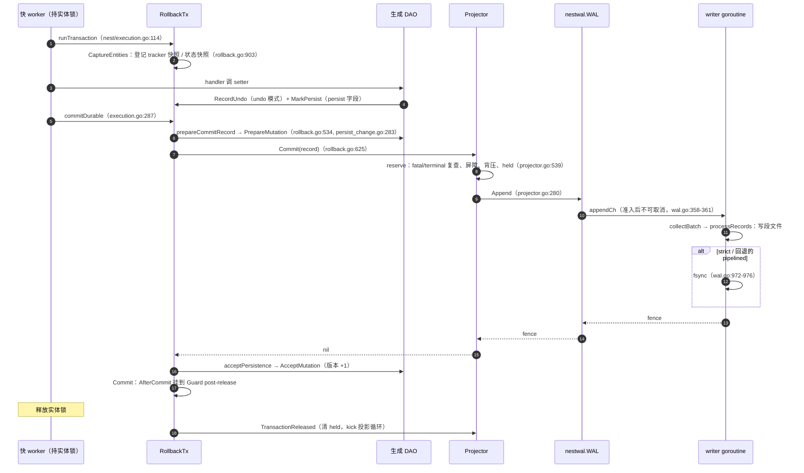
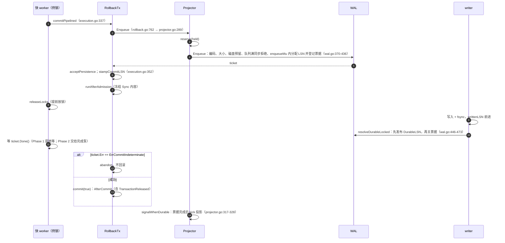
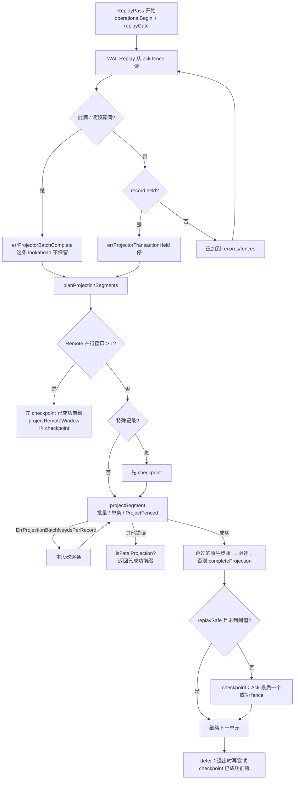
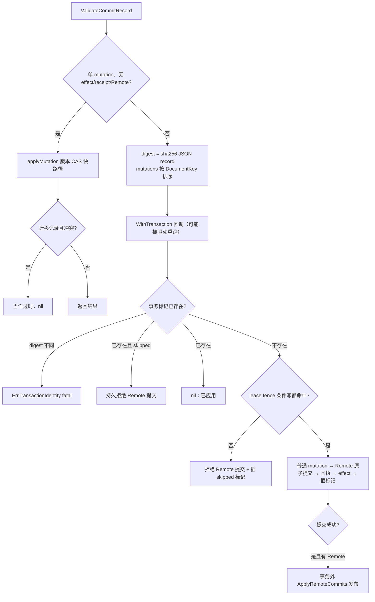
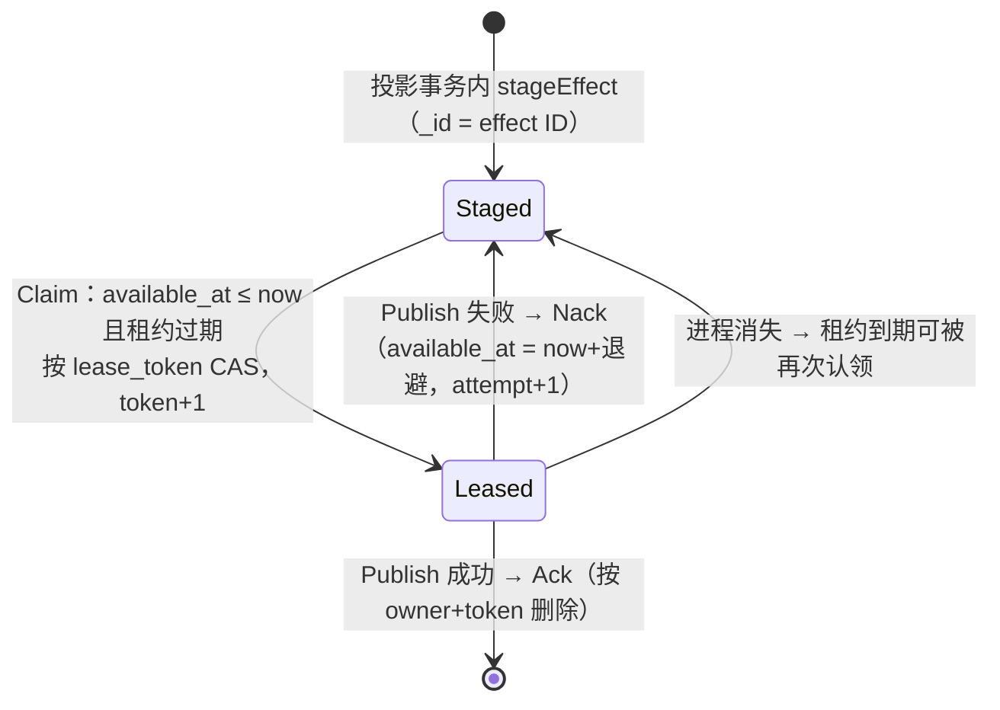
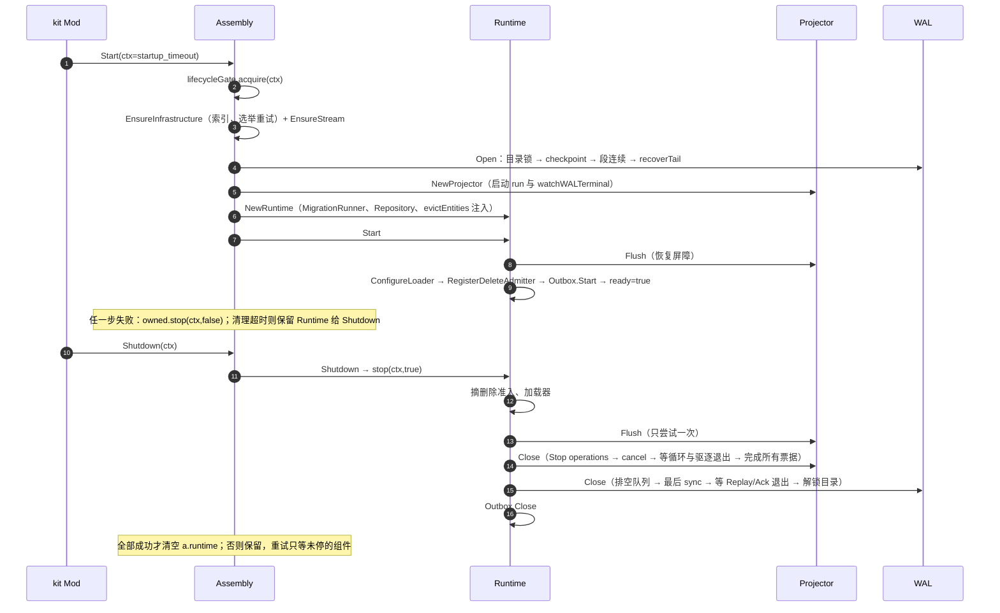
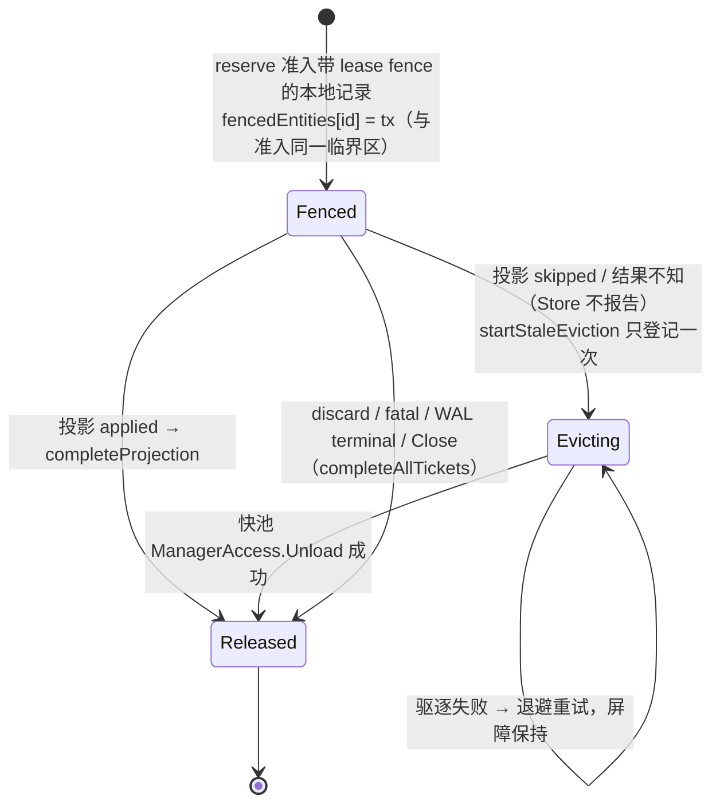
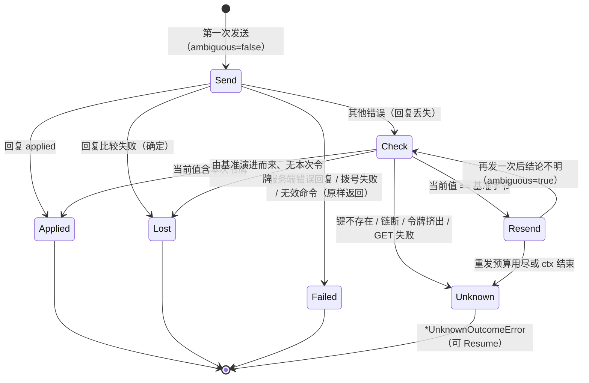

# 03 DataEngine 实现

> 本篇是框架整体文档 03 分区的**实现文档**，面向 review agent 与维护者。是什么、怎么用、配置与运维见 [说明文档](../guide/03-dataengine.md)。
>
> 源码基准：tag `v1.23.0`（`28912cd6`），全部 `path:line` 按这个 tag。本篇没有依赖 codebase-memory 图谱（图谱可能落后于 tag），全部结论按 tag 源码直接读取；引用的测试名都已在 tag 里核对存在。标“推断 / 未验证”的地方没有用测试或探针证实。

## 速览

- 主链路：Nest 在实体锁内结束事务 → `RollbackTx.prepareCommitRecord` 让每个 DAO `PrepareMutation` → `Projector.Commit`（async / strict，经 `WAL.Append`）或 `Projector.Enqueue`（pipelined，经 `WAL.Enqueue`）→ 解锁后 `TransactionReleased` 清掉 held → 后台 `ReplayPass` 按 WAL 顺序分段投影到 `MongoStore` → 成功前缀推进 ack checkpoint → outbox worker 独立发布 effect。
- 关键保证靠四个机制：WAL 单写者 + 前缀持久（LSN 顺序 = 物理顺序）；投影不越过 held；ack 只推进连续成功前缀且不超过落盘日志；Mongo 侧按版本 CAS + 事务标记 + 回执 digest 识别重放。
- 结果未知只有一条出路：WAL / 准入后接受失败 → `ErrCommitIndeterminate` → `abandon`（不回滚）→ Nest fence → Mod `onFatal` → `RuntimeFailure`。review 时最该盯的是：新增的等待或错误路径有没有把“未知”降级成“拒绝”或“成功”。
- 驱动层（A2）与 versionstore（A2 ③）把同一原则推到 Redis / Mongo：写不重放，只在能证明没执行时重发；能按令牌证明结论的就给结论，证明不了的返回结果未知。

本篇覆盖的包：

| 包路径 | 职责 |
| --- | --- |
| `dataengine/` | 契约：mutation / record / tracker / 校验 / 加载器 / lease fence |
| `dataengine/engine/` | 实现：Assembly、Runtime、Projector、MongoStore、EntityRepository、MigrationRunner、删除准入、Outbox |
| `nestwal/` | WAL、checkpoint、codec、pipelined 票据、effect 发布与收件箱、通用 Committer |
| `kit/dataengine/` | Mod：配置、依赖、生命周期转发、fatal → fence |
| `nest/`（`transaction.go`、`rollback.go`、`persist_change.go`、`execution.go`） | 持久模式、提交点、回滚事务、持久变化登记 |
| `codegen/internal/dao/`、`cmd/glsvet`（A1 部分） | 生成 DAO 的持久化参与者形状；A1 静态提示 |
| `mongo/`、`mongo/driver/`、`redis/`、`redis/driver/` | 驱动契约实现 |
| `versionstore/` | 版本化 KV、写令牌 |
| `cache/` | L1 / L2 缓存原语 |
| `skill/skillsync/`（`file_outbox.go`） | 文件 outbox |

---

## 1. 包与文件地图

### 1.1 `dataengine/`（契约，不依赖 Nest 与驱动）

| 文件 | 职责 |
| --- | --- |
| `doc.go` | 包说明：DAO 只登记变化，Nest 锁内冻结，engine 负责 WAL 与投影 |
| `mutation_types.go` | `TransactionID`、`Durability`、`MutationKind`、`DocumentKey`、`FieldPatch`、`Mutation`、`Effect`、`Receipt`、`CommitRecord`、克隆函数、`SyncFieldMeta` |
| `validate.go` | `CanonicalizeMutation`（v1 全量 → 规范形式）、`ValidateMutation`、`ValidateCommitRecord`、patch 路径校验 |
| `tracker.go` | `Tracker`：已接受持久版本 + 服务间 / 客户端同步脏掩码；快照与恢复 |
| `load.go` | `Store` 读接口、`RawDocument`、按依赖分层并发的 `Loader`（启动批量加载模板） |
| `lease_fence.go` | lease fence 回执编码 / 解码、协调文档谓词与确认写、`ErrFencedEntityPending` |
| `migration.go` | `Descriptor` / `Migrator` / `SystemCommitter` / `ProjectionTicket` / `WaitProjection` |
| `scope.go` | `ResolveDatabaseScope`、`MapPatchPath`（map 键能否安全做 patch 路径） |
| `sync_view.go` | 按字段名生成 Sync 视图集合 |
| `hook.go` | 嵌套值改动向父 DAO 冒泡的 `DirtyHook` |

### 1.2 `dataengine/engine/`

| 文件 | 职责 |
| --- | --- |
| `doc.go` | 阅读入口：Assembly → Runtime；三种确认阶段不可混用 |
| `assembly.go` | 构造顺序与失败回收；JetStream outbox 发布器 |
| `runtime.go` | 恢复屏障、注册加载器 / 删除准入、Nest 选项、可重试的分组件停机 |
| `operation_gate.go` | 可取消等待的单槽门（零值可用） |
| `projector.go` | 准入（reserve / held / 背压 / 屏障）、票据、Flush、fatal 与 WAL terminal 唤醒、Close |
| `projector_replay.go` | `ReplayPass`：读 → 分段 → 投影 → 前缀 ack；后台循环与退避 |
| `projection_plan.go` | 纯函数：可批量判定、逻辑字节估算、分段规划 |
| `projector_remote.go` | 纯 Remote 记录的并行窗口 |
| `fenced_step.go` | 原生 saga 步骤的实体屏障与跳过后的驱逐 |
| `entity_projection.go` | 本进程在途投影的实体索引与 `WaitEntityProjection` |
| `mongo_store.go` | `MongoStore` 配置、基础设施索引、单文档 CAS、标记 / 回执 / outbox 暂存原语 |
| `mongo_projection.go` | `ProjectFenced`（快路径或单 Mongo 事务）、`ProjectBatch` |
| `mongo_load.go` | 一致性读、流式加载、文档元数据解码 |
| `entity_repository.go` | 冷加载：singleflight、投影屏障、完整聚合、迁移、快池发布、加载回调 |
| `migration_runner.go` | schema 迁移写回（系统事务 + 等投影） |
| `entity_delete.go` | 删除准入：事务内 / 事务外本地 / 事务外 Remote |
| `outbox_store.go` | Mongo outbox：认领（租约 token CAS）/ ack / nack / 积压 |
| `outbox_worker.go` | 认领循环、发布、退避、积压限速探测与硬上限 |
| `health.go` | 一行健康摘要 |

### 1.3 `nestwal/`

| 文件 | 职责 |
| --- | --- |
| `wal.go` | `WAL`：Open / Append / Enqueue / Ack / Replay / Sync / Close，writer loop、组提交、轮转、尾部恢复、terminal |
| `checkpoint.go` | 双槽 ack checkpoint 文件 |
| `codec.go` | 记录编解码 v1（codec 5）/ v2（codec 6）、规范化 |
| `committer.go` | 通用 `Committer`（`MutationApplier` + `EffectPublisher`），可取消的 flush / replay 槽 |
| `runtime.go` | `OpenRuntime`：WAL + Committer 一体装配 |
| `jetstream_publisher.go` | `EffectEnvelope`、按 effect ID 作 MsgID 的发布器 |
| `effect_inbox.go` | Mongo 效果收件箱与 JetStream 消费者装配 |
| `lock_*.go`、`dirsync_*.go` | 目录文件锁、目录元数据 fsync（平台相关） |

`nestwal.Committer` / `OpenRuntime` 在仓内**没有生产调用方**（只有测试），生产路径是 `engine.Projector`。它保留为不依赖 Mongo 的独立 committer。

### 1.4 其余

| 文件 | 职责 |
| --- | --- |
| `kit/dataengine/mod.go` | 配置声明与读取、`Provide` 查能力并 `Assemble`、`Start`/`StopWithContext`、Nest committer 转发、`onFatal`、健康 |
| `nest/transaction.go` | 持久模式、committer / ticket / 绑定接口 |
| `nest/execution.go` | `runTransaction`、`commitDurable`、`commitPipelined`、fence |
| `nest/rollback.go` | `RollbackTx`：undo、快照、Emit、提交 / 回滚 / abandon、记录准备 |
| `nest/persist_change.go` | `PersistChange`、`MarkPersist*`、receipt、准备与接受持久化 |
| `codegen/internal/dao/template_dao.go` | 生成 DAO 模板：mark / setter / 快照 / `PrepareMutation` / `AcceptMutation` / `RestorePersisted` |
| `codegen/internal/dao/parse.go` | `//roost:dao` 标记与 `dao` tag 解析 |
| `cmd/glsvet/main.go`、`componentfields.go` | A1 提示 |
| `mongo/driver/session.go`、`collection.go`、`client.go` | 事务循环、选举重试、Close |
| `redis/driver/replay.go`、`client.go`、`pipeline.go`、`lock.go`、`replicated.go` | 重放策略、写命令、pipeline、DistLock、`EvalReplicated` |
| `redis/cas.go` | `CompareAndSet` / `CompareAndDelete` 脚本（含索引） |
| `versionstore/versionstore.go`、`redis_store.go`、`write_token.go`、`memory_store.go`、`codec.go` | 契约、Redis 实现、令牌、内存实现、JSON codec |
| `cache/*.go` | 见 §3.12 |
| `skill/skillsync/file_outbox.go`、`outbox.go` | 文件 outbox 与它的使用方 |

[↑ 速览](#速览) · [说明文档 §1](../guide/03-dataengine.md#1-定位与边界)

---

## 2. 关键类型与数据结构

### 2.1 数据模型

| 类型 | 位置 | 要点 |
| --- | --- | --- |
| `Mutation` | `dataengine/mutation_types.go:69-88` | 规范字段 `Key/Kind/ExpectedVersion/NextVersion/Mask/Schema/Codec/Data/Patch/Remote`；旧字段（`EntityID`…`Version`）只为 v1 兼容，与规范字段混用即 `ErrMixedMutationForms`（`dataengine/validate.go:33-38`） |
| `ValidateMutation` | `dataengine/validate.go:66-106` | `NextVersion == ExpectedVersion+1`；Put 有 Data 无 Patch；Patch 需 `ExpectedVersion > 0`；Delete 无 Data 无 Patch；Remote 时与 `RemoteCommit` 头交叉校验 |
| `CommitRecord` | `dataengine/mutation_types.go:108-117` | 一条 WAL 记录；`Empty()` 含 receipt（`dataengine/mutation_types.go:119-121`） |
| `Tracker` | `dataengine/tracker.go:7-12` | `version` 只经 `AcceptVersion`（`dataengine/tracker.go:25-30`，CAS expected→expected+1）或 `AdvanceVersion`（`dataengine/tracker.go:35-51`，Remote 跳号）前进 |
| `PersistChange` | `nest/persist_change.go:20-26` | 事务本地；第一次登记时对该 DAO 的 tracker 记快照并登记恢复（`nest/persist_change.go:71-78`） |
| `MutationParticipant` | `nest/persist_change.go:51-54` | 生成 DAO 实现；`PrepareMutation` 不得清 dirty，`AcceptMutation` 只推进版本 |
| `LeaseFence` | `dataengine/lease_fence.go:55-62` | `Predicate`（`dataengine/lease_fence.go:75-84`）与 `Confirmation`（`dataengine/lease_fence.go:92-94`）由契约包统一给出，投影方不得自拼过滤器 |

### 2.2 Nest 侧

| 类型 / 函数 | 位置 | 要点 |
| --- | --- | --- |
| `DurabilityPolicy` | `nest/transaction.go:17-28` | `memory/async/strict/pipelined` = 0/1/2/3，是 `dataengine.Durability` 的别名 |
| `TransactionCommitter` | `nest/transaction.go:88-93` | 已持久接受后不得报失败 |
| `PipelinedTransactionCommitter` / `CommitTicket` | `nest/transaction.go:118-135` | 票据 `Err` 只能是 nil 或 `ErrCommitIndeterminate` |
| `TransactionReleaseNotifier` | `nest/transaction.go:95-100` | 全部锁释放后通知，投影器据此清 held |
| `LocalExecutorBinder` | `nest/transaction.go:102-111` | Nest 把 `RunLocal` 交给 committer（驱逐在快池执行） |
| `RollbackTx` | `nest/rollback.go:63-110` | 回滚函数栈、持久变化、mutation / effect / receipt、删除意图、动态实体 |
| 错误哨兵 | `nest/nest.go:64-93` | `ErrCommitterRequired`(68)、`ErrCommitRejected`(75)、`ErrPipelinedCommitterRequired`(80)、`ErrPipelinedNotAllowed`(85)、`ErrCommitIndeterminate`(93) |

### 2.3 engine

| 类型 | 位置 | 要点 |
| --- | --- | --- |
| `Assembly` | `dataengine/engine/assembly.go:49-58` | 拥有构造顺序；`runtime` 在完成停机前不清空 |
| `Runtime` | `dataengine/engine/runtime.go:17-39` | `stopping` 终态；`drainAttempted/projectorClosed/walClosed/outboxClosed` 记住哪些已停 |
| `Projector` | `dataengine/engine/projector.go:98-149` | `held`/`admitted`/`pendingEntities`/`pendingTransactions`/`fencedEntities` 都在 `heldMu` 下；`tickets` 在 `ticketMu` 下；`fatalErr`/`walTerminalErr`/`lastErr` 在 `errMu` 下 |
| `ProjectorOptions` | `dataengine/engine/projector.go:48-77` | 缺省 256 条 / 4MiB / 4MiB 读、ack 每 256 条或 20ms、Remote 并行 8 |
| 存储能力接口 | `dataengine/engine/projector.go:24-46`、`dataengine/engine/fenced_step.go:36-39` | `BatchProjectionStore`、`MultiMutationBatchProjectionStore`、`RemoteParallelProjectionStore`、`FenceOutcomeProjectionStore`：未声明的能力一律按保守路径（逐条、串行、按“可能跳过”驱逐） |
| `entityProjection` | `dataengine/engine/entity_projection.go:12-21` | 一条在途记录涉及的实体、完成通道、`fenced`、`evicting` |
| `MongoStore` | `dataengine/engine/mongo_store.go:54-64` | `afterLeaseFence` 是测试缝，生产为 nil |
| `EntityRepository` | `dataengine/engine/entity_repository.go:41-53` | `flights` 按完整 ID 合并冷加载；`loadedHooks` 供 Sync 重绑 |
| `OutboxWorker` | `dataengine/engine/outbox_worker.go:49-73` | `lifecycleMu` 串行 Start / Close，`closed` 终态 |

### 2.4 nestwal

| 类型 | 位置 | 要点 |
| --- | --- | --- |
| `Options` / 缺省 | `nestwal/wal.go:43-91` | 段 256MiB、记录 16MiB、队列 8192、批 256 条 / 4MiB / 500µs、组提交 10ms、保留 2 段、磁盘 8GiB、未确认 24h；`WriterVersion` 缺省 v1（kit 改成 v2，`kit/dataengine/mod.go:183-187`） |
| `WAL` | `nestwal/wal.go:113-170` | 锁序 `stateMu → ticketMu`（`nestwal/wal.go:148-153`）；`terminalErr` 是 CAS 一次写入的原子指针 |
| `appendRequest` | `nestwal/wal.go:174-185` | `reserved` 表示容量已在 Enqueue 预留、此后不得拒绝；`barrier` 是 Sync 屏障 |
| `walTicket` | `nestwal/wal.go:189-204` | err 先写、后关 done |
| `checkpointState` | `nestwal/checkpoint.go:20-23` | `generation` 决定写哪个槽 |
| `Committer` | `nestwal/committer.go:101-146` | `flushSem` / `replaySem` 是单槽信号量（可取消等待） |
| `EffectEnvelope` | `nestwal/jetstream_publisher.go:18-25` | effect 的线上 JSON |

### 2.5 驱动、versionstore、cache

| 类型 / 函数 | 位置 | 要点 |
| --- | --- | --- |
| `IsDefinitelyNotExecuted` | `redis/driver/replay.go:36-54` | 拨号失败、池超时 / 耗尽、已关闭；服务端执行前拒绝（LOADING…NOREPLICAS） |
| `noReplay` / `sendOnce` | `redis/driver/replay.go:64-69`、`redis/driver/replay.go:110-123` | NoRetry 标记在 Clone 中保留；重发至多 `resendsFor(MaxRetries)` 次 |
| `ErrCommitResultUnknown` | `mongo/errors.go:11-16` | 只在提交命令发出后包上 |
| `session.WithTransaction` | `mongo/driver/session.go:56-115` | 自实现循环；`mongo/driver/session.go:111` 包哨兵 |
| `retryDuringElection` | `mongo/driver/collection.go:299-320` | 10 次 × 1s，错误码表 `mongo/driver/collection.go:284` |
| `versionstore.Store` | `versionstore/versionstore.go:83-131` | 没有 Set |
| `RedisConfig` / `RedisIndex` | `versionstore/redis_store.go:25-91` | `Index` 与值同一次写 |
| `pendingWrite` | `versionstore/write_token.go:126-144` | 一条写命令的原样字节，可逐字节重发 |
| `UnknownOutcomeError` | `versionstore/write_token.go:66-88` | `errors.Is` 同时命中 `ErrOutcomeUnknown` 与传输错误 |
| `cache.StoreConfig` | `cache/store.go:53-75` | Stale / Conflict / Superseded 三条准入规则 |
| `ReadThroughStore` | `cache/read_through.go:58-72` | `calls` 按键合并 miss |
| `FileOutboxStore` | `skill/skillsync/file_outbox.go:43-49` | 目录独占 |

[↑ 速览](#速览) · [说明文档 §2](../guide/03-dataengine.md#2-核心概念与术语)

---

## 3. 主流程

### 3.1 async / strict 提交



步骤要点：

1. memory + RollbackNone 且无 Remote 批次走快路径：没有 `RollbackTx`，直接内存提交（`nest/execution.go:162-175`）。
2. handler 返回错误或 panic：逆序执行回滚函数（含 tracker 恢复）后返回（`nest/execution.go:220-225`、`nest/rollback.go:370-407`）。
3. `durableCommit` 的 memory 分支：没有 effect 时直接返回，不准备记录（`nest/rollback.go:586-600`）。这意味着带回滚策略的 memory 事务里登记的持久变化被丢弃（说明文档 §7.2，探针已证实）。
4. committer 返回非未知错误 → `ErrCommitRejected` + 回滚；返回 `ErrCommitIndeterminate` → `abandon`（`nest/execution.go:287-310`）。
5. 已持久接受后 `AcceptMutation` 失败 → `ErrCommitIndeterminate`（`nest/persist_change.go:312-327`）。
6. Remote 批次的消息：`TransactionReleased` 改到 `addAfterUnlock`（`nest/execution.go:326-333`），Remote 收尾见 05 分区。

### 3.2 pipelined 提交



- 只有走 dispatcher、带 `releaseLocks`、且无 Remote 批次的消息才真正提前放锁（`nest/execution.go:176-189`）；其余回退到 `commitDurable` → `Append`，`requireSync` 对 pipelined 同样为真（`nestwal/wal.go:337`）。
- 完成泵、同实体完成顺序链见 02 分区与 `NEST_PIPELINED_COMMIT.md` §11。

### 3.3 投影：`ReplayPass`



对应源码：读与停止条件 `dataengine/engine/projector_replay.go:31-55`；checkpoint 闭包与退出时补 ack `dataengine/engine/projector_replay.go:72-101`；并行窗口 `dataengine/engine/projector_replay.go:102-126`；特殊记录前先 ack `dataengine/engine/projector_replay.go:129-135`；逐条回退 `dataengine/engine/projector_replay.go:143-159`；驱逐或完成 `dataengine/engine/projector_replay.go:163-168`；replay-safe 判定 `dataengine/engine/projector_replay.go:171-179`。

单文档快路径记录为什么必须立刻 ack（`dataengine/engine/projector_replay.go:171-173`）：快路径只在文档上留 `_last_tx`，若后一条记录又改了同一文档再重放前一条，`classifyNoMatch` 会看到更高版本而判为 fatal 冲突。立刻 ack 保证“已投影但未 ack”的快路径记录至多是每个文档的最后一次写。

后台循环 `run`（`dataengine/engine/projector_replay.go:220-255`）：held 时按 `RetryMin` 轮询；错误时指数退避（带抖动），fatal 时退出循环；空闲时等 `IdlePoll` 或 kick。

### 3.4 `MongoStore.ProjectFenced`



源码：快路径 `dataengine/engine/mongo_projection.go:35-44`；排序 `dataengine/engine/mongo_projection.go:54-63`；回调 `dataengine/engine/mongo_projection.go:80-142`（每次回调重新计算 `transactionSkipped`，`dataengine/engine/mongo_projection.go:84`）；跳过后通知 Remote 拒绝 `dataengine/engine/mongo_projection.go:146-155`；成功后发布 `dataengine/engine/mongo_projection.go:156-160`。版本 CAS 原语 `dataengine/engine/mongo_store.go:149-222`、冲突分类 `dataengine/engine/mongo_store.go:258-269`；事务内撞唯一键直接判冲突（事务已被服务端中止，不能再读，`dataengine/engine/mongo_store.go:171-177`）。

`ProjectBatch`（`dataengine/engine/mongo_projection.go:184-296`）：一个事务内先 `$in` 查全部标记（digest 不同即 fatal），按集合分组 ordered `BulkWrite`，`Matched+Upserted` 不等于模型数或撞键时返回 `ErrProjectionBatchNeedsPerRecord`（`dataengine/engine/mongo_projection.go:275-288`）——批量不能区分“已应用”与“真冲突”，交给单条路径判定。

### 3.5 Outbox 与效果流



- 认领 `dataengine/engine/outbox_store.go:57-101`；ack / nack 都要求当前 owner 与 token（`dataengine/engine/outbox_store.go:103-128`），租约被别人接管时返回 `ErrOutboxLeaseConflict`。
- 退避从失败返回时刻起算（`dataengine/engine/outbox_worker.go:124-131`）；积压探测按 `BacklogInterval` 全局限速（`dataengine/engine/outbox_worker.go:150-160`）；硬上限只触发一次 `OnHardLimit`（`dataengine/engine/outbox_worker.go:195-204`）。
- 发布器把 `EffectEnvelope` 发到 `<prefix>.<topic>`，MsgID = effect ID（`dataengine/engine/assembly.go:226-239`）。
- 消费方收件箱：同一 Mongo 事务里查回执 → 执行 handler → 插回执；回执 digest 不同返回 `ErrEffectIdentityConflict`（`nestwal/effect_inbox.go:78-114`）。

### 3.6 启动与停机



源码：`dataengine/engine/assembly.go:96-167`、`dataengine/engine/assembly.go:191-217`；`dataengine/engine/runtime.go:69-108`、`dataengine/engine/runtime.go:142-200`；`dataengine/engine/projector.go:501-529`；`nestwal/wal.go:791-808`、`nestwal/wal.go:1006-1036`。

### 3.7 冷加载

1. 恢复未完成 → `ErrRecoveryIncomplete`（`dataengine/engine/entity_repository.go:119-121`）。
2. 已加载直接返回；快 worker 上 panic `ErrColdLoadInLogic`；`LoadedEntitiesOnly` 上下文返回错误（`dataengine/engine/entity_repository.go:129-137`）。
3. 按完整 ID singleflight；首个调用者执行，其他等待者取消只退出自己的等待（`dataengine/engine/entity_repository.go:139-151`）；加载 panic 也会关闭 flight 并唤醒等待者（`dataengine/engine/entity_repository.go:160-173`）。
4. `WaitEntityProjection(id)`（`dataengine/engine/entity_repository.go:175-183`）。
5. `readAggregate` 在 `ReadConsistent`（snapshot 读事务）里读每个 DAO；回调可能被驱动重跑，累加器在回调内重置（`dataengine/engine/entity_repository.go:288-359`，`dataengine/engine/entity_repository.go:298-299`）。全缺失或全墓碑 → `ErrEntityAggregateNotFound`；部分缺失 → `ErrEntityAggregateCorrupt`。
6. 有旧 schema 的 DAO → `MigrationRunner.Migrate` → 回到 5 重读；第 3 轮仍需迁移 → `ErrMigrationConflict`（`dataengine/engine/entity_repository.go:208-237`）。
7. 全部 DAO `RestorePersisted`（解码、迁移、`SetVersion`、清 sync 脏）后，Remote 托管 kind 恢复版本向量（`dataengine/engine/entity_repository.go:241-265`）。
8. `entity.RunLocal` 回快池 `Create` 并执行加载回调（`dataengine/engine/entity_repository.go:269-273`）。

### 3.8 删除准入

| 情形 | 路径 | 结果 |
| --- | --- | --- |
| 非 AutoPersist | 立即 | `DeleteAdmissionImmediate` |
| 事务内 | `RequestEntityDelete`（升 strict）→ `PrepareDelete` → `AfterAdmission` 里 `Destroy(…, false)` | Deferred；回滚则实体存活（`dataengine/engine/entity_delete.go:56-85`） |
| 事务外本地 | `RunIsolatedTransaction`（strict） | 未知 → fence + Indeterminate（`dataengine/engine/entity_delete.go:87-104`） |
| 事务外 Remote | 快 worker 拒绝；慢路径 `PrepareRemoteWriteBatch` → `FinalizeLocked` → `CommitSystem` → `WaitProjection` → `batch.Commit` | 任何一步未知 → `batch.Indeterminate` + fence（`dataengine/engine/entity_delete.go:106-188`） |
| 准入 panic | recover | Indeterminate + fence（`dataengine/engine/entity_delete.go:28-40`） |

### 3.9 原生步骤屏障与驱逐



期间写同一实体的其他事务在 reserve 处以 `ErrFencedEntityPending` 拒绝（`dataengine/engine/fenced_step.go:75-86`）。驱逐 worker 不常驻，一次处理一笔，经 Nest 绑定的 `RunLocal` 在快池卸载（`dataengine/engine/fenced_step.go:136-238`）。重启后不需要屏障：恢复在 ready 前排空 WAL（`dataengine/engine/fenced_step.go:28-31` 注释）。

### 3.10 WAL 内部

- **writer loop**（`nestwal/wal.go:810-830`）：取一个请求后在 `BatchDelay` 内凑批（遇 Sync 屏障立即收批，`nestwal/wal.go:843-847`）；ticker 每 `GroupCommitInterval` fsync 一次（async 靠它）；关闭时排空。
- **processRecords**（`nestwal/wal.go:883-1004`）：terminal 时全部失败并兜底清票据；只有未预留的请求竞争剩余磁盘容量（`nestwal/wal.go:910-926`）；预留请求进入写路径后释放预留；按段边界轮转；写完若批里有 `requireSync` 则 fsync；任何写 / 轮转 / fsync 错误 → `indeterminate` + terminal。
- **Sync 屏障**（`nestwal/wal.go:629-692`）：快照 `nextLSN`，水位已覆盖且队列空则直接返回；否则经同一 FIFO 发屏障请求，writer 写完前面所有请求后才回答，再 `syncActive`。关闭中仍发屏障（`drainAndClose` 会回答）；`doneCh` 关闭后以 terminal 状态作答（RR-20260914-01）。
- **Ack**（`nestwal/wal.go:494-539`）：terminal 先拒；fence 不前进则无操作；越过日志末尾拒绝；**先刷段再写 checkpoint**；写成功后清理早于 `ack 段 − RetainSegments` 的段（`nestwal/wal.go:1305-1332`）。
- **Open / 尾部恢复**（`nestwal/wal.go:1038-1144`）：段号必须连续；首段 > 1 时必须有 checkpoint；只修最后一段。

### 3.11 versionstore 写入的结论判定（`settle`）



源码：`versionstore/write_token.go:302-361`（`settle`）、`versionstore/write_token.go:232-266`（`judge`）、`versionstore/write_token.go:282-292`（`replyNotLost`）。`Update` 比输后先退避再重读（`versionstore/redis_store.go:395-406`，NC-52）；`Resume` 要求同一键、同一种写、同样的值（Update 用纯 mutate 从同一基准重算并比较字节，`versionstore/redis_store.go:416-452`）。

### 3.12 cache 读路径

| 结构 | Get | Set | Delete |
| --- | --- | --- | --- |
| `LayeredStore`（`cache/layered.go`） | L1 在 TTL 窗口内才读（`cache/layered.go:31-46`）；否则读 L2 回填；L1 拒绝且窗口外 → 删 L1 再回填一次；仍被拒 → 交付 L1 已准入值或 miss（`cache/layered.go:54-90`） | 先写 L2 再读回 L2 作为 L1 值；L1 以 stale 拒绝时删 L1，写仍算成功（`cache/layered.go:99-145`） | 先删 L2，无论成败都删 L1（`cache/layered.go:147-170`） |
| `ReadThroughStore`（`cache/read_through.go`） | L1 → 合并 miss（等待者上限、取消归还名额，`cache/read_through.go:98-143`）→ L2（一致性裁决错误不降级）→ loader → 回写 L2 → L1 准入（`cache/read_through.go:146-212`） | L2（`RemoteTimeout`）→ L1 | 权威明确拒绝时保留 L1；其他错误清 L1 |
| `AtomicLocalStore`（`cache/atomic_local.go`） | 分片读锁 | Stale / Conflict / Superseded 在分片写锁内判定（`cache/atomic_local.go:147-190`）；插入时钟淘汰，order 有界压缩（`cache/atomic_local.go:291-303`） | |

[↑ 速览](#速览) · [说明文档 §4](../guide/03-dataengine.md#4-怎么用)

---

## 4. 不变量清单

每条：内容 / 强制位置 / 守卫测试。测试名后括号是所在文件。

| # | 不变量 | 强制位置 | 守卫测试 |
| --- | --- | --- | --- |
| I1 | 准入失败不留 WAL 记录、不留准入额度；Nest 以 `ErrCommitRejected` 回滚 | `dataengine/engine/projector.go:252-258`、`dataengine/engine/projector.go:277-283`、`dataengine/engine/projector.go:300-307`（失败 discard）；`nest/execution.go:277-285` | `TestProjectionAdmissionReturnsCapacityOnAppendFailure`（`batch_limits_test.go`）、`TestCommitAndEnqueueRejectAnOversizedRecordAlikeAndLeaveNoAdmission`（`pipelined_projection_promises_test.go`）、`TestPreCommitRejectionsCarryErrCommitRejected`（`nest/commit_rejected_sentinel_promises_test.go`）、`TestPipelinedEnqueueRejectionRollsBack`（`nest/pipelined_commit_test.go`） |
| I2 | `Enqueue` 是 pipelined 唯一拒绝点：编码、大小、磁盘预留、terminal、队列满全部同步判定；之后票据只能 nil 或 `ErrCommitIndeterminate` | `nestwal/wal.go:370-436`（预留 `nestwal/wal.go:385-391`，队列满 `nestwal/wal.go:422-428`）；预留请求不被拒 `nestwal/wal.go:897-926` | `TestWALEnqueueRejectsSynchronously`、`TestWALTerminalFailsPendingAndLateTickets`（`nestwal/pipelined_test.go`） |
| I3 | `Append` 对 strict 与 pipelined 都等所在批 fsync；async 只等写入 | `nestwal/wal.go:333-337` | `TestAppendWaitsForFsyncOnStrictPathForStrictAndPipelined`、`TestBroadcastPipelinedIsInvisibleUntilFsync`、`TestPipelinedFastPathStillReleasesLockBeforeFsync`（`nestwal/pipelined_strict_fallback_promises_test.go`） |
| I4 | LSN 顺序 = 物理日志顺序（LSN 分配与入队同在 `enqueueMu` 内）；`DurableLSN` 在唤醒票据之前发布 | `nestwal/wal.go:411-433`、`nestwal/wal.go:446-473` | `TestNestWALCrashKeepsDurablePrefix`（`nestwal/crash_test.go`，SIGKILL 子进程）、`TestWALEnqueueTicketResolvesDurableAndSurvivesReopen`、`TestPipelinedCascadedReadGatesBothRepliesInOrder`（`nest/pipelined_commit_test.go`） |
| I5 | fsync 失败粘滞：terminal 之后不再 fsync、不清 unsynced、`DurableLSN` 不前进、`Ack` 失败、追加失败；terminal 前已被水位覆盖的晚登记票据按 durable 完成 | `nestwal/wal.go:1206-1235`、`nestwal/wal.go:510-512`、`nestwal/wal.go:481-492`、`nestwal/wal.go:1283-1303` | `TestSyncAfterTerminalNeverFsyncsOrAdvancesDurableLSN`、`TestAckRefusesTerminalWALAndKeepsCheckpoint`、`TestAckFirstFsyncFailureIsIndeterminateForTickets`、`TestInflightAckFailsAfterFailedFinalSync`、`TestTerminalSweepResolvesTicketsAlreadyCoveredByDurableLSN`（`nestwal/fsync_failure_promises_test.go`） |
| I6 | checkpoint 只前进、不越过日志末尾、写之前先刷段 | `nestwal/wal.go:513-529` | `TestAckSyncsAsyncRecordBeforeCheckpoint`（`close_replay_test.go`）、`TestAckRefusesFencesThatWouldSkipRecords`（`nestwal/promises_test.go`） |
| I7 | `Sync` 返回 nil 时，调用前已返回的每张票据都 durable；关闭中不提前返回 | `nestwal/wal.go:629-692` | `TestWALSyncPromiseCoversAdmittedTickets`、`TestWALSyncPromiseDoesNotBlockAfterClose`（`sync_barrier_promises_test.go`）、`TestWALSyncPromiseWaitsForDrainWhileClosing`、`TestWALSyncPromiseAfterCompletedClose`（`sync_closing_promises_test.go`） |
| I8 | 尾部只在最后一段、坏点 ≥ checkpoint、形态为撕裂尾帧或全零时截断；否则 `ErrCorrupt` 且不改文件 | `nestwal/wal.go:1099-1144` | `TestOpenTruncatesZeroFilledTailOfLastSegment` 等 6 项（`zero_tail_promises_test.go`）、`TestOpenRefusesFrameWhosePayloadPageWasNotWrittenBack`（`torn_page_tail_promises_test.go`）、`TestWALRecoversTornTail`、`TestOpenRefusesSegmentGapsAndUnacknowledgedTruncation`（`corruption_promises_test.go`） |
| I9 | WAL 目录单写者；Close 等在途 Replay / Ack 退出才交出目录锁 | `nestwal/wal.go:222-229`、`nestwal/wal.go:1027-1030` | `TestWALDirectoryLock`（`wal_test.go`）、`TestCloseRetainsDirectoryUntilExternalReplayReturns`（`close_replay_test.go`） |
| I10 | 投影不越过仍持实体锁的事务；held 只在全部锁释放后清除 | `dataengine/engine/projector_replay.go:37-39`；`nest/execution.go:326-333`、`nest/execution.go:355-358` | `TestMultiCheckpointFlushesBeforeHeldAndOnCancel`（`batch_limits_test.go`）、`TestPipelinedCommitIsProjectedOnceDurableWithoutWaitingForIdlePoll`、`TestCommitterWaitsForEntityRelease`、`TestCommitterEnqueueHoldsReplayUntilReleased`（nestwal） |
| I11 | ack 只推进连续成功前缀；ack 失败后本轮停止、不被 held 哨兵掩盖 | `dataengine/engine/projector_replay.go:72-101`、`dataengine/engine/projector_replay.go:160-161` | `TestProjectorAcknowledgesSuccessfulPrefixBeforeLaterSegmentFailure`、`TestProjectorStopsAfterSegmentAckFailure`、`TestProjectorAckFailureOverridesHeldReplaySentinel`（`projector_test.go`）、`TestMultiCheckpointLossKeepsEntireSuccessfulPrefix`、`TestMultiCheckpointCancellationConfirmsOnlySuccessfulPrefix`、`TestRemoteProjectionFailureOnlyAcknowledgesPrefixAndReplaysSuffix` |
| I12 | 单文档快路径（没有事务标记）的记录投影后立即 ack | `dataengine/engine/projector_replay.go:171-179` | `TestMarkerlessSingleRecordStillCheckpointsImmediately`、`TestRealProjectionOnlyMongoAckFailureRestartPreservesSameEntityOrder`（kit integration） |
| I13 | 版本 CAS：无基准的 Put 要求 `_version` 不存在；不匹配时只有 `_version==Next && _last_tx==tx` 算已应用，否则 fatal 冲突；旧 Put 不能复活墓碑 | `dataengine/engine/mongo_store.go:217-222`、`dataengine/engine/mongo_store.go:258-269` | `TestMongoStorePatchExactVersionAndReplay`、`TestMongoStoreOlderPutCannotReviveTombstone`、`TestMongoStoreNewerPutRevivesTombstoneAtHigherVersion`（`mongo_store_test.go`）、`TestRealPatchConflictFencesWithoutFullFallback` |
| I14 | 多文档事务：先查标记（digest 不同即 fatal），回执 / effect 先快照读后插；快照未命中却撞键是非 fatal 可重试错误 | `dataengine/engine/mongo_projection.go:84-95`；`dataengine/engine/mongo_store.go:297-303`、`dataengine/engine/mongo_store.go:377-406`、`dataengine/engine/mongo_store.go:429-457` | `TestMongoStoreProjectIdentityVerdictsAcrossTransactions`、`TestStageEffectDuplicateAfterSnapshotMissIsRetryable`、`TestRealProjectionIdentityVerdictsAcrossTransactions`、`TestRealMultiDocumentReceiptAndOutboxAreAtomic` |
| I15 | 批量投影不自行分类“未匹配”，交单条路径判定；延迟信号永不 fence | `dataengine/engine/mongo_projection.go:275-288`；`dataengine/engine/projector.go:396-398` | `TestProjectorFallsBackToPerRecordWhenBatchDefers`、`TestProjectorPerRecordFallbackStillFencesRealConflict`、`TestMongoStoreProjectBatchDefersThenSingleRecordClassifies` |
| I16 | 只有无 effect / receipt / Remote / 迁移的本地记录进批量；不支持多 mutation 批量的 Store 只批单 mutation 记录 | `dataengine/engine/projection_plan.go:18-33`、`dataengine/engine/projection_plan.go:110-146`；`dataengine/engine/mongo_projection.go:200-202` | `TestBatchProjectionEligibilityMatchesMongoContract`、`TestLocalBatchEligibilityChecksEveryMutation`、`TestMultiBatchCapabilityAndSpecialBoundaries`、`TestMongoStoreProjectBatchRejectsUnsupportedBeforeSessionOrWrites` |
| I17 | Remote 并行只给相邻、互不共享实体、无 effect / receipt 的纯 Remote 记录，且两个 Remote 适配器都声明并发安全；首个失败后停止补位，只确认成功前缀 | `dataengine/engine/projector_remote.go:14-114`；`dataengine/engine/mongo_projection.go:169-177` | `TestRemoteProjectionWindowBoundaries`、`TestRemoteProjectionCancellationJoinsWorkers`、`TestRemoteProjectionFatalSuffixIsNotHiddenByEarlierTransientFailure`、`TestMongoStoreParallelCapabilityRequiresBothAdapters`、`TestRemoteProjectionWithoutCapabilityRemainsSerial` |
| I18 | fatal / WAL terminal：先写错误，再唤醒全部等待方与系统票据；reserve 在 `heldMu` 下复查，唤醒后不会有新等待项；OnFatal 异步 | `dataengine/engine/projector.go:393-423`、`dataengine/engine/projector.go:447-458`、`dataengine/engine/projector.go:557-562` | `TestEntityProjectionFatalWakesEveryPendingWaiter`、`TestProjectorOnFatalMayCloseProjector`（`projection_lifetime_test.go`）、`TestWALTerminalWakesEntityProjectionWaiters`（nestwal）、`TestTerminalAckWakesWaitersOfAPendingEviction` |
| I19 | Remote 写与 lease fence 回执不能同一次准入（WAL 之前拒绝） | `dataengine/engine/projector.go:542-551` | `TestRemoteLeaseFenceRejectedBeforeWALAdmission` |
| I20 | 原生步骤屏障：检查与登记同一临界区；跳过后驱逐完成才解除；按事务身份只驱逐一次；每条退出路径都解除 | `dataengine/engine/fenced_step.go:75-127`；`dataengine/engine/entity_projection.go:62-80` | `TestFencedStepBarrierIsReleasedOnEveryExit`、`TestFencedLocalStepSkippedAfterLeaseExpiryDoesNotFenceNextTransaction`、`TestSkippedFencedStepEvictsTheResidentEntityOnTheFastPool`（`lease_fence_skip_promises_test.go`）、`TestSkippedFencedStepIsQueuedForEvictionOnce`、`TestSkippedFencedStepResyncsSubscribersFromMongo` |
| I21 | lease fence 的确认是对协调文档的条件写（不是读），与租约接管写同一文档 | `dataengine/engine/mongo_store.go:305-341`；`dataengine/lease_fence.go:86-94` | `TestRealMongoFencedProjectionSerializesWithLeaseTakeover`（integration） |
| I22 | 启动恢复屏障：投影完 WAL 后才挂加载器、删除准入、标记 ready；ready 前 committer 拒绝 | `dataengine/engine/runtime.go:86-106`；`kit/dataengine/mod.go:403-417` | `TestDataEngineModRecoversBeforeReadyAndOwnsNestOptions`（`kit/dataengine/mod_test.go`）、`TestEntityRepositoryRecoveryBarrierAndIncompleteAggregate` |
| I23 | 冷加载：快 worker 拒绝在 join flight 之前；先等在途投影；一致性读；完整聚合；经 RunLocal 发布；panic 不卡死 flight | `dataengine/engine/entity_repository.go:115-286` | `TestRepositoryRejectsFastColdLoadBeforeJoiningFlight`、`TestEntityRepositoryRefusesEachUnloadableAggregate`、`TestEntityRepositoryLoadIsIdempotentAcrossTransactionRetries`、`TestEntityRepositoryPublishesThroughLocalExecutor`、`TestRepositoryReloadDoesNotResurrectPendingTombstone`、`TestARepositoryLoadPanicDoesNotWedgeTheAggregate` |
| I24 | 迁移先校验（BSON、`_id`、目标 DAO 能解码）后写 WAL，并等投影；Remote 信封拒绝 | `dataengine/engine/migration_runner.go:56-106` | `TestMigrationRunnerValidatesBeforeCommit`、`TestMigrationRunnerRejectsRemoteEnvelopeWithoutOwnershipLease`、`TestEntityRepositoryGivesUpAfterThreeNonConvergingMigrations`、`TestRealLoadAndMigrationRestoresTrackerVersion` |
| I25 | 删除：事务内准入后才摘内存；快 worker 上 Remote 删除是明确拒绝而非未知；准入 panic 视为未知并 fence | `dataengine/engine/entity_delete.go:27-188` | `TestDataEngineDeleteDefersMemoryRemovalUntilTransactionAdmission`、`TestDataEngineDeleteRollbackLeavesEntityLive`、`TestFastWorkerRemoteDeleteIsDefiniteRejection`、`TestDataEngineDeleteAdmissionPanicFencesAndStopsServingEntity` |
| I26 | 停机三步：超时返回错误并保留资源；重试只等未停组件；Assembly 停完才忘掉 Runtime；WAL 由 Runtime / Assembly 拥有 | `dataengine/engine/runtime.go:158-200`；`dataengine/engine/assembly.go:191-217` | `TestAssemblyKeepsTheRuntimeUntilShutdownCompletes`、`TestAssemblyOwnsWALWhenProjectorDoesNot`、`TestRuntimeConcurrentShutdownHonorsDeadline`、`TestAssemblyRetriedShutdownHandsOverWALWithoutCheckpointRegression`、`TestAssemblyCanceledRecoveryRetainsCleanupOwnership` |
| I27 | 可取消等待：生命周期、Flush、Replay 的串行门在调用方 ctx 内等；取消不影响当前持有者 | `dataengine/engine/operation_gate.go:15-33`；`nestwal/committer.go:554-563` | `TestProjectorWaitsRespectDeadline`、`TestProjectorShutdownDeadlineBehindBackgroundProjection`（`shutdown_deadline_test.go`）、`TestCommitterShutdownPromiseHonoursDeadlineWhileReplayBusy`、`TestCommitterFlushPromiseHonoursDeadlineBehindAnotherFlush` |
| I28 | outbox：认领按 lease_token CAS；ack / nack 须持有当前租约；发布失败不阻塞投影与 WAL ack | `dataengine/engine/outbox_store.go:57-128`；`dataengine/engine/projector.go:95-97`（outbox 不在 ack 路径） | `TestMongoOutboxStoreClaimTakesLeaseByTokenCAS`、`TestMongoOutboxStoreAckRequiresMatchingLease`、`TestProjectorAckNotBlockedByPublisherFailure`、`TestNATSOutageDoesNotBlockProjectionAndBacklogRecoversByEffectID`、`TestToxicNATSConnectionResetDeliversTheEffectExactlyOnce` |
| I29 | effect 收件箱：回执与业务写同一事务；digest 不同即冲突；handler 失败不留回执 | `nestwal/effect_inbox.go:78-114` | `TestMongoEffectInboxDeduplicatesAndRejectsIdentityConflict`、`TestMongoEffectInboxHandlerFailureLeavesNoReceipt`、`TestMongoEffectInboxSurvivesTransactionRetry` |
| I30 | 结果未知不回滚、fence 引擎；准入后 Accept 失败同属未知 | `nest/execution.go:45-47`、`nest/execution.go:289-305`、`nest/execution.go:344-348`、`nest/execution.go:386-389`；`nest/persist_change.go:321-323`；`kit/dataengine/mod.go:460-479` | `TestPipelinedIndeterminateAbandonsWithoutRollback`、`TestAcceptFailureAfterAdmissionIsIndeterminate`、`TestPipelinedAcceptFailureDoesNotRollbackAndFencesNest`（`nest/persist_change_test.go`）、`TestModFatalFencesNestAndSignalsApplication`（`kit/dataengine/fatal_fence_test.go`） |
| I31 | `Emit` 与删除意图把 memory 事务升为 strict | `nest/rollback.go:355-357`、`nest/rollback.go:247-249` | `TestEmitUpgradesTransactionToStrictDurability`（`nest/nest_test.go:1125`） |
| I32 | 回滚恢复 DAO 的 tracker（版本与同步掩码）；`AcceptVersion` 只接受 expected+1 | `nest/persist_change.go:71-78`；`nest/rollback.go:980-1013`；`dataengine/tracker.go:25-30` | `TestRollbackRestoresDataEngineTracker`、`TestTrackerAcceptVersionIsConsecutiveAndCompareAndSwap`、`TestTrackerSnapshotRestoreCoversVersionAndSyncState` |
| I33 | mutation / record 进 WAL 前规范化并校验；WAL v1 写不出 v2 特性；kit 缺省写 v2 | `nestwal/codec.go:57-79`、`nestwal/codec.go:95-108`；`kit/dataengine/mod.go:183-187` | `TestValidateMutationRefusesEachMalformedShape`、`TestValidateCommitRecordRefusesEachMalformedPart`、`TestWriterV1RefusesEveryV2OnlyFeature`、`TestDataEngineModDefaultsToCanonicalWALWriterV2` |
| I34 | A1：组件不登记 undo、不写非 DAO 字段（`hint:`，不计失败）；skill 各包零提示 | `cmd/glsvet/main.go:687-740`；`cmd/glsvet/componentfields.go:30`、`cmd/glsvet/componentfields.go:275-290` | `TestComponentRecordingItsOwnUndoIsHinted`、`TestComponentRecordingUndoThroughHelperIsHinted`、`TestSkillPackagesGetNoComponentUndoHint`（`cmd/glsvet/main_test.go`）、`TestComponentFieldWritesOutsideTheDaoAreHinted`、`TestSkillPackagesGetNoComponentFieldHint` |
| I35 | `nopersist,nosync` 字段参与 undo 与快照，不进提交记录与同步 | `codegen/internal/dao/template_dao.go:100-106`（mark 为空）、`:510-` 快照 | `TestATransientFieldRollsBackWithTheTransaction`、`TestATransientFieldNeverReachesTheCommitRecordOrSync`、`TestATransientFieldIsInTheStateSnapshot`（`codegen/internal/dao/testdata/runtime/transient_test.go`） |
| I36 | Redis 写 / 脚本 / 含写 pipeline / DistLock 不经驱动重放；只在确定没执行时重发；读命令保留驱动重试 | `redis/driver/replay.go:36-149`；`redis/driver/client.go:355`、`redis/driver/client.go:384-420`；`redis/driver/pipeline.go:115-124`；`redis/driver/lock.go:111` | `TestAWriteWhoseReplyIsLostIsNotReplayedByTheDriver`、`TestNotExecutedErrorsAreStillResent`、`TestAPipelineWithAnExecutedCommandIsNotResent`、`TestReadsKeepTheDriverRetry`、`TestIsDefinitelyNotExecuted`（`write_no_replay_promises_test.go`）、`TestAScriptWhoseReplyIsLostIsNotReplayedByTheDriver`、`TestNoReplayMarkSurvivesCloneAndUnmarkedCommandsKeepTheDriverRetry`、`TestRealRedisAWriteWhoseReplyIsLostRunsOnce` |
| I37 | Mongo：提交发出后才带 `ErrCommitResultUnknown`；提交前的失败都不带；整个事务受 timeout 约束；abort / EndSession 有 5s 上限 | `mongo/driver/session.go:56-167` | `TestWithTransactionFailuresBeforeTheCommitAreNotResultUnknown`、`TestWithTransactionKeepsTheLastCallbackErrorWhenTheWindowClosesInBackoff`、`TestWrapErrorKeepsTheDriverChainBehindTheSentinel`、`TestRealMongoCommitIsBoundedByTransactionTimeout`、`TestRealMongoEndSessionAfterCommitTimeoutIsBounded` |
| I38 | Close 口径：重复 nil、并发后到者等待、关闭后返回已关闭错误；DistLock 遇 ErrClosed 不记成未知 | `redis/driver/client.go:483-487`；`redis/driver/lock.go:113-118`；`mongo/driver/client.go:123-133` | `TestClientRepeatedCloseReturnsNilOnEveryDeployment`、`TestClientConcurrentCloseAllReturnNil`、`TestDistLockAfterClientCloseKeepsReportingErrClosed`（redis）、`TestClientConcurrentCloseWaitsForTheFirstDisconnect`、`TestClientCloseRetriesAfterAFailedDisconnect`（mongo） |
| I39 | 启动建索引遇选举有界重试，其他错误立即返回 | `mongo/driver/collection.go:247-320` | `TestIndexCreationRetriesThroughAnElectionWithinBounds` |
| I40 | versionstore 没有无条件写；版本从 1 起、每次写 +1；判定只按字节证明（不存在即不可证） | `versionstore/versionstore.go:83-131`；`versionstore/write_token.go:232-266` | `TestStoredVersionIsNeverZeroAndIncrementsPerWrite`、`TestAbsenceProvesNothing`、`TestATokenPushedOutOfTheHistoryIsNotGuessed`、`TestAnUpdateWhoseReplyIsLostIsNotAppliedTwiceWhenTheCallerRetries`、`TestACreateWhoseReplyIsLostIsNotReportedAsTakenWhenTheCallerRetries`、`TestRealRedisAWriteWhoseReplyIsLostIsRecognisedByItsToken`、`TestRealRedisClusterAWriteWhoseReplyIsLostIsRecognisedByItsToken` |
| I41 | `Resume` 只续核同一键、同一种写、同样的值 | `versionstore/redis_store.go:416-452`、`versionstore/redis_store.go:454-485`、`versionstore/redis_store.go:496-505` | `TestResumeReturnsTheEarlierWriteInsteadOfWritingAgain`、`TestResumeAfterTheEarlierWriteProvablyLostPerformsTheWrite`、`TestResumeRefusesTheSameTokenForADifferentWrite` |
| I42 | 索引条目当且仅当 CAS 生效时移动；NaN 分数发出前拒绝 | `redis/cas.go:106-133`；`versionstore/redis_store.go:155-175` | `TestIndexIsMaintainedInTheSameWriteIntegration`、`TestAnIndexedWriteWithANaNScoreChangesNothing`、`TestRealRedisAnIndexedWriteWithANaNScoreChangesNothing` |
| I43 | CAS 冲突率只在 versionstore 一层计数 | `versionstore/versionstore.go:157-191`；`versionstore/redis_store.go:391`、`versionstore/redis_store.go:408` | `TestUpdateCountsEveryCompareAndSetAndTheExhaustedConflict` |
| I44 | CAS 比输后先退避再重读 | `versionstore/redis_store.go:395-406` | `TestARetryAfterBackoffSeesWritesThatLandedDuringTheBackoff`、`TestARetryAfterBackoffSeesADeletionAsAbsence` |
| I45 | cache：回填被拒不交付被拒值；L1 窗口外的副本不否决权威；一致性裁决不降级 | `cache/read_through.go:146-212`；`cache/layered.go:54-90` | `TestCacheAdmissionBackfillAdmission`、`TestReadThroughLoaderFillRefusalIsNotReadFailure`、`TestLayeredExpiredLocalCopyDoesNotVetoAuthority`、`TestCacheAdmissionFatalRemotePolicy` |
| I46 | cache：等待者上限计“活着的跟随者”，取消归还名额；AtomicLocal 的 order 记录有界 | `cache/read_through.go:98-123`；`cache/atomic_local.go:291-303` | `TestReadThroughReturnsACanceledWaitersSlot`、`TestAtomicLocalOrderBoundedUnderOverwrite`、`TestAtomicLocalOrderBoundedUnderDeleteChurn` |
| I47 | file outbox：每包一个文件原子替换，打开时只删本 outbox 生成的临时文件 | `skill/skillsync/file_outbox.go:94-101`、`skill/skillsync/file_outbox.go:188-253`、`skill/skillsync/file_outbox.go:289-307` | `TestFileOutboxOpenRemovesCrashLeftoverTemporaryFiles` |

**没有守卫的约定**（review 时人工核对）：

- memory durability 的事务不改持久字段：没有运行期检查，见 §6.3 与 §10。
- `AfterCommit` 只放幂等外部动作：靠约定。
- 投影函数纯度、`//roost:cache` 字段确属缓存：glsvet 只提示。

[↑ 速览](#速览) · [说明文档 §7](../guide/03-dataengine.md#7-保证与不保证)

---

## 5. 并发

### 5.1 goroutine 归属

| goroutine | 创建者 | 退出条件 | 是否在快池 |
| --- | --- | --- | --- |
| WAL writer loop | `nestwal.Open`（`nestwal/wal.go:254`） | `closeCh` 后排空完成 | 否 |
| WAL `OnFatal` 回调 | `setTerminal`，一次（`nestwal/wal.go:1295-1302`） | 回调返回（panic 被吞） | 否 |
| Projector 回放循环 | `NewProjector`（`dataengine/engine/projector.go:208`；`ManualReplay` 时不起） | `ctx` 取消或 fatal | 否 |
| `watchWALTerminal` | `NewProjector`（`dataengine/engine/projector.go:202`） | terminal 或关闭 | 否 |
| `signalWhenDurable` | 每次 `Enqueue` 一个（`dataengine/engine/projector.go:313`） | 票据完成或关闭 | 否 |
| 驱逐 worker | `startStaleEviction`，队列空即退出（`dataengine/engine/fenced_step.go:117-126`） | 队列空或关闭 | 否；驱逐本身经 `RunLocal` 进快池 |
| Remote 并行投影 | `projectRemoteWindow`，窗口内至多 `RemoteProjectionWorkers` 个（`dataengine/engine/projector_remote.go:74-104`） | 全部返回后 ReplayPass 才继续 | 否 |
| Projector `OnFatal` 回调 | `isFatalProjection`，一次（`dataengine/engine/projector.go:416-419`） | 返回 | 否 |
| Outbox workers | `OutboxWorker.Start`：1 个协调 + `Workers` 个（`dataengine/engine/outbox_worker.go:236-260`） | ctx 取消 | 否 |
| Loader 并发 | `Loader.loadLevel`（`dataengine/load.go:99-144`） | 层内全部完成 | 否 |

快池禁止阻塞：本分区的阻塞入口都在慢路径——`EntityRepository.LoadEntity`（快 worker 上 panic，`dataengine/engine/entity_repository.go:132-134`）、`WaitEntityProjection`（`AssertBlockingAllowed`，`dataengine/engine/entity_projection.go:87`）、事务外 Remote 删除（`fctx.BlockingError`，`dataengine/engine/entity_delete.go:115-117`）。roost-coding 的显式豁免只有锁内 WAL 准入及其持久策略（strict 锁内 fsync、回退到 Append 的 pipelined）与 pipelined Phase 1 锁外等票据。

### 5.2 锁与锁序

| 锁 | 保护 | 锁序 / 规则 |
| --- | --- | --- |
| WAL `lifecycleMu`（RW） | `closed` 与入队 | 入队持读锁，`Close` 持写锁置 closed（`nestwal/wal.go:341-357`、`nestwal/wal.go:795-801`） |
| WAL `enqueueMu` | `nextLSN` 与入队、票据登记的原子性 | 在 `lifecycleMu` 读锁内；内含 `ticketMu`（`nestwal/wal.go:416-433`） |
| WAL `stateMu` | 段、偏移、unsynced、writtenLSN、active 文件 | `stateMu → ticketMu`（`nestwal/wal.go:148-153`）；fsync 在 `stateMu` 内 |
| WAL `checkpointMu` | checkpoint 状态与写盘 | `Ack`：`checkpointMu` 内取 `stateMu` 读锁、再 `syncActive` 取 `stateMu`（`nestwal/wal.go:506-526`）；推断：没有反向路径 |
| WAL `replayMu` | 串行化 Replay | |
| Projector `heldMu` | held / admitted / pending* / fenced | 准入检查与登记同一临界区；`completeAllTickets` 先 `heldMu` 后 `ticketMu`（`dataengine/engine/projector.go:644-657`，不嵌套） |
| Projector `errMu` | fatal / walTerminal / lastErr | 在 `heldMu` 内读（`reserve` 复查）——锁序 `heldMu → errMu` |
| Projector `ticketMu` | 系统票据 | |
| Projector `flushGate` / `replayGate` | Flush、ReplayPass 串行 | 可取消（`operation_gate.go`）；Flush 持 `flushGate` 再进 `replayGate` |
| Runtime / Assembly `lifecycleGate` | Start / Shutdown 串行 | 可取消；Assembly 持自己的门再调 Runtime 的门 |
| Outbox `lifecycleMu` | Start / Close | 短临界区，不等在途工作（等待在 `done` 上，受 ctx 约束） |
| Repository `flightMu` / `hookMu` | flight 表、回调表 | 回调在锁外执行 |

`operation.Lifetime`（Projector、WAL、Committer 都有一个）负责“停止准入 + 等在途调用退出”，`Close` 先 `Stop()` 再等 `drained`，受调用方 ctx 约束（`dataengine/engine/projector.go:508-514`）。

### 5.3 与 Nest 的交界

- WAL 准入在实体锁内：async / strict 的 `Append` 在队列满时**在锁内等**（`nestwal/wal.go:350-357`，ctx 是 Nest 的基础 ctx）；pipelined 的 `Enqueue` 队列满同步拒绝。这是 roost-coding 写明的豁免，不能“为吞吐移出锁”。
- `TransactionReleased` 在锁外：普通事务挂在 Guard post-release（`nest/rollback.go:452-458`），pipelined 在票据完成后的 commit 里，Remote 批次在 `addAfterUnlock`。
- 驱逐与冷加载发布经 Nest 绑定的 `RunLocal` 回快池（`dataengine/engine/fenced_step.go:199-238`、`dataengine/engine/entity_repository.go:269-273`）；未绑定时就地执行（启动恢复阶段没有常驻实体）。

[↑ 速览](#速览) · [说明文档 §6](../guide/03-dataengine.md#6-运行与运维)

---

## 6. 失败与不确定结果处理

### 6.1 按来源分类

| 来源 | 分类 | 处理 | 位置 |
| --- | --- | --- | --- |
| reserve：fatal / terminal / 屏障 / 背压 | 明确拒绝 | `ErrCommitRejected`，回滚 | `dataengine/engine/projector.go:539-580` |
| WAL 编码、超大、容量、关闭、队列满（Enqueue） | 明确拒绝 | 同上，并 discard | `nestwal/wal.go:318-436` |
| WAL 写 / 轮转 / fsync 失败 | 未知 | `indeterminate` → terminal → 票据与 Append 都返回未知 → `OnFatal` | `nestwal/wal.go:982-989`、`nestwal/wal.go:1258-1303` |
| 关闭时最后一次 sync 失败 | 未知 | 同上；在途 Ack 失败 | `nestwal/wal.go:1019-1026` |
| `AcceptMutation` 失败（已准入） | 未知 | `ErrCommitIndeterminate` | `nest/persist_change.go:321-323` |
| pipelined 票据 Err | 未知 | abandon，不回滚 | `nest/execution.go:344-348`、`nest/execution.go:386-389` |
| 投影 Mongo 瞬时错误（含 `ErrCommitResultUnknown`） | 可重试 | 记 lastErr，退避重放；标记 / 版本裁决重复 | `dataengine/engine/projector_replay.go:232-242` |
| 投影版本 / 事务 / 回执身份冲突 | fatal | 一次：唤醒等待方、`OnFatal`，循环退出，WAL 保留 | `dataengine/engine/projector.go:393-423` |
| 批量无法分类 | 路由信号 | 本段改逐条 | `dataengine/engine/projector_replay.go:156-159` |
| ack 失败 | 视原因 | `ErrCommitIndeterminate` 视为 WAL terminal；本轮停止 | `dataengine/engine/projector_replay.go:79-82`、`dataengine/engine/projector.go:438-442` |
| outbox 发布失败 | 可重试 | nack + 退避；不影响投影 | `dataengine/engine/outbox_worker.go:124-132` |
| outbox store 失败 | 可重试 | 计数，日志只记连续失败的开始与恢复 | `dataengine/engine/outbox_worker.go:289-302` |
| outbox 硬上限 | fatal | `OnHardLimit` → `onFatal` | `dataengine/engine/outbox_worker.go:189-205`；`kit/dataengine/mod.go:243` |
| 删除准入 panic / Remote 删除未知 | 未知 | Indeterminate + `onFatal` | `dataengine/engine/entity_delete.go:28-40`、`dataengine/engine/entity_delete.go:162-185` |
| 驱逐失败 | 可重试 | 退避重试，屏障保持 | `dataengine/engine/fenced_step.go:154-183` |

### 6.2 fatal 的传播

`onFatal`（`kit/dataengine/mod.go:460-479`）只记第一次错误，然后 `NestMgr.Fence`（之后的准入返回 `ErrNestFenced`，`nest/nest.go:227-240`）并 `RuntimeFailure.Fail`（App 进入停机流程，01 分区）。健康检查立即 Fail `fenced`。三个入口接到同一个 `onFatal`：WAL `OnFatal`（`kit/dataengine/mod.go:203`）、Projector `OnFatal`（`kit/dataengine/mod.go:232`）、Outbox `OnHardLimit`（`kit/dataengine/mod.go:243`），以及 Runtime 的 `fail`（删除准入）。

### 6.3 已知的语义缺口（供 review）

- **memory + 回滚策略的事务丢弃持久变化**：`nest/rollback.go:586-600`。本篇写作时用包内探针（`runTransaction` + `HandlerMeta{RollbackUndo, DurabilityMemory}` + `MarkPersist`）确认：err=nil、committer 调用 0 次、`PrepareMutation` 0 次。源码注释“Memory-only handlers persist through entity release hooks”（`nest/rollback.go:587`）与现状不符：仓内 `RegisterOnEntityRelease` 没有生产调用方。是否改为拒绝属维护者决定，本篇不改。
- async 记录可能在 fsync 之前被投影（`ReplayPass` 不调 `Sync`，重放读段文件）——推断，后果是 Mongo 可能领先于断电后的 WAL；结合 async 的契约（成功本来就早于 fsync），未判定为缺陷。
- 事务标记 TTL（缺省 720h）必须大于记录在 WAL 里未确认的最长时间；WAL 健康上限缺省 24h，配置时不要把两者反过来。没有启动校验。

[↑ 速览](#速览) · [说明文档 §6.6](../guide/03-dataengine.md#66-错误速查)

---

## 7. 持久化与协议格式

### 7.1 WAL 目录

| 文件 | 格式 | 位置 |
| --- | --- | --- |
| `writer.lock` | OS 文件锁 | `nestwal/wal.go:222-229` |
| `segment-%020d.wal` | 连续帧；段号从 1 起、必须连续 | `nestwal/wal.go:1441-1443`、`nestwal/wal.go:1046-1053` |
| `ack-0.chk` / `ack-1.chk` | 36 字节：magic `RSCP`(4) + version 1(2) + 保留(2) + generation(8) + segment(8) + offset(8) + CRC32(4)；写临时文件 → fsync → 替换 → fsync 目录；读两槽取 generation 大者，坏槽忽略 | `nestwal/checkpoint.go:14-102` |

帧（`nestwal/wal.go:1334-1343`）：

```text
0      4      6      8          12          16          20
| RSWL | ver1 | 0000 | len(u32) | CRC(payload) | CRC(header[0:16]) | payload ... |
```

记录 payload（`nestwal/codec.go`）：`codec(u16)` = 5（v1）/ 6（v2）、`ID[16]`、`CreatedAt(i64)`、`Durability(u8)`、`Handler`、`RequestID`；v2 的每个 mutation 写 `ID/Expected/Next/Mask/Schema/Kind/Scope/Database/Resource/Codec/Data/SetBSON/Unset[]/RemoteCommit`，effect 写 `ID/Topic/Key/Payload/AvailableAt/Headers(按 key 排序)`，receipt 写 `Namespace/ID/Digest/Payload/ExpiresAt`（`nestwal/codec.go:143-207`）。v1 只能写 Remote 或 Put、无 receipt、无 `AvailableAt`（`nestwal/codec.go:95-108`）。读端两种都认；未知 codec 返回 `ErrUnsupportedRecordVersion`，回放以 `ErrCorrupt` 失败、不推进 checkpoint。

### 7.2 Mongo

| 集合 / 字段 | 内容 | 索引 / TTL |
| --- | --- | --- |
| 业务文档 | 原字段 + `_id`、`_version`、`_schema`、`_last_tx`；删除时 `_deleted: true`、`_deleted_at` | 加载过滤 `_deleted != true`（`dataengine/engine/mongo_load.go:102-108`） |
| Remote 信封文档 | `_ver`、`_marker_epoch`、`_lock_fence`、`_route_epoch`、`data`（05 分区写） | 解码 `dataengine/engine/mongo_load.go:73-100` |
| `_dataengine_transactions` | `_id`=事务 ID hex、`digest`=sha256(JSON record)、`created_at`、`skipped` | `ttl_created_at`，`transaction_receipt_ttl` |
| `_dataengine_receipts` | `_id`=`namespace/id`、`receipt_id`、`transaction_id`、`digest`、`payload`、`expires_at`、`created_at` | `ttl_expires_at`（绝对过期，允许重建） |
| `_dataengine_outbox` | `_id`=`effect_id`、`transaction_id`、`topic`、`key`、`payload`、`headers`、`available_at`、`lease_owner`、`lease_until`、`lease_token`、`attempt`、`last_error`、`created_at` | `claim_due(available_at, lease_until)`、`uniq_effect`、`backlog_oldest(created_at)` |
| 效果收件箱（缺省 `_nest_effect_inbox`） | `_id`=effect ID、`digest`、`created_at` | TTL 缺省 30 天，须大于 broker 保留 / 重投窗口 |
| 原生 saga 步骤 | `_dataengine_step_operations` 等 | 06 分区 |

位置：`dataengine/engine/mongo_store.go:20-24`、`dataengine/engine/mongo_store.go:95-122`、`dataengine/engine/mongo_store.go:282-287`、`dataengine/engine/mongo_store.go:358-367`、`dataengine/engine/mongo_store.go:408-423`；`nestwal/effect_inbox.go:27-76`。

digest 用 `encoding/json` 序列化整条 `CommitRecord`（`dataengine/engine/mongo_store.go:459-466`）：**改 `CommitRecord` / `Mutation` 字段会改变 digest**，跨版本重放同一条 WAL 记录会被判为 `ErrTransactionIdentity`。线上未部署、维护者决定暂不做兼容（`roost-not-deployed` 约定），升级前应排空 WAL（推断，未有专门测试）。

### 7.3 JetStream 效果流

- 流 `dataengine.effects.stream`（缺省 `ROOST_EFFECTS`），主题 `<prefix>.>`，文件存储，`Duplicates` 窗口 10m（`kit/dataengine/mod.go:251-254`）。
- 消息主题 `<prefix>.<topic>`，`MsgID` = effect ID，正文 JSON `{"transaction_id","effect_id","topic","key","headers","payload"}`（`nestwal/jetstream_publisher.go:18-25`；`dataengine/engine/assembly.go:226-239`）。

### 7.4 versionstore 信封

```text
<version>|<token_v>|<token_v-1>|…\n<payload>
```

令牌 = 8 字节随机数的 base64url（11 字符），第 i 个写出 `version-i`，最多 `WriteTokenHistory` 个（`versionstore/write_token.go:146-218`）。没有令牌的旧格式报 `ErrMalformedRecord`，**不兼容，升级需清空**（T-291）。Lua 脚本与 Cluster 槽位不变。

### 7.5 file outbox

`<sha256(observer,stream,epoch,sequence)>.packet`，内容 `{"version":1,"record":{…},"checksum":"<sha256(record JSON)>"}`；临时文件 `outbox-<十进制>.tmp`（`skill/skillsync/file_outbox.go:20-35`、`skill/skillsync/file_outbox.go:326-335`）。

### 7.6 兼容性

- WAL 读端认 v1 与 v2；写端由配置选择，kit 缺省 v2。
- `CanonicalizeMutation` 把旧形式（`EntityID/Database/Resource/Version`）升成规范 Put；混用拒绝。
- versionstore 信封、`CommitRecord` digest：不兼容旧数据（线上未部署）。

[↑ 速览](#速览) · [说明文档 §5](../guide/03-dataengine.md#5-配置)

---

## 8. 测试与门禁

### 8.1 单元与性质测试（无外部依赖）

```bash
GOWORK=off go test -count=1 ./dataengine/... ./nestwal/... ./versionstore/... ./cache/... \
  ./redis/... ./mongo/... ./kit/dataengine/... ./skill/skillsync/...
GOWORK=off go test -count=1 -race ./dataengine/engine/ ./nestwal/ ./nest/
GOWORK=off go test -count=1 -run 'Persist|Pipelined|Commit|Rollback|Emit' ./nest/
GOWORK=off go test -count=1 ./codegen/internal/dao/... ./cmd/glsvet/
```

- `nestwal/crash_test.go`：`TestNestWALCrashKeepsDurablePrefix` 起子进程持续 Enqueue 后 SIGKILL，校验重放是连续前缀且覆盖每张已完成票据。
- `nestwal/*_promises_test.go`：fsync 失败（`syncFile` 测试缝模拟 EIO 与“只报告一次”）、零尾、撕裂页、Sync 屏障、关闭。
- 生成 DAO 运行期测试：`codegen/internal/dao/testdata/runtime/*`（经 codegen golden 测试驱动）。

### 8.2 integration（真实 Mongo / NATS / Redis）

```bash
bash kit/scripts/integration/dataengine-env.sh up
source "<ROOST_IT_HOME>/roost-dataengine-it/env.sh"    # 不要打印
GOWORK=off go test -tags integration -count=1 -run 'Real|Toxic' ./kit/dataengine/
GOWORK=off go test -tags integration -count=1 -run 'RealMongo' ./dataengine/engine/ ./mongo/driver/
GOWORK=off go test -tags integration -count=1 -run 'Real|Integration' ./versionstore/ ./redis/... ./cache/
```

共享环境规则：integration 一律加 `-run`；全局运维命令（up / down / heal / reset / fault、故障矩阵）须持有 `remote-acceptance.lock`（维护者决定 A5，[kit/scripts/integration/README.md](../../../kit/scripts/integration/README.md)）。故障注入：`dataengine-env.sh fault mongo-primary | nats-leader STREAM | nats-all`。

### 8.3 正式生成链路与压测

```bash
ROOST_DATAENGINE_IT_MONGO_URI=... bash scripts/test-dataengine-generated.sh   # 生成 DAO/Entity → Nest → WAL/Mongo → 三次独立进程
bash scripts/perf/dataengine.sh                                                # 压测（不与其他压测并跑）
```

压测口径见 [DATAENGINE-PRESSURE](../../feature/DATAENGINE-PRESSURE-2026-09-24.md)：区分 Request 完成 TPS、最终落库 TPS、record→Mongo 延迟；`Projected` 含幂等重放。

### 8.4 仓库级门禁

- 根包 `TestExamplesRun`（`examples_run_test.go:46`）：示例模块实跑（A1 后 statusbridge 示例 panic 就是这样被发现的）。
- 根包 `TestTrackedMarkdownRelativeLinksResolve`、`TestLegacyCheckpointWritePathIsAbsent`（`dataengine/architecture_test.go:13`）。
- `cmd/glsvet` 在生成工程与仓内全量运行，A1 提示为 0 条。

[↑ 速览](#速览) · [说明文档 §8](../guide/03-dataengine.md#8-相关文档)

---

## 9. 历史与重要修复

只列改变了设计的。完整记录见各 bugfix 文档与 [v1.23.0 发版实现文档](../../release/v1.23.0/impl-saga-drv-dao-rem.md)。

| 时间 / 编号 | 改变了什么 | 记录 |
| --- | --- | --- |
| 2026-09-24 DataEngine 重构 | 定为两个核心包；Projector 与重放、MongoStore 与事务编排分文件；多 mutation 批量、checkpoint 阈值、Remote 并行窗口、读预算 | [重构方案](../../feature/REFACTOR-2026-09-24-dataengine.md)、[批量](../../feature/DATAENGINE-BATCH-2026-09-24.md) |
| RR-20260909-03 | Assembly 只在停完后忘掉 Runtime；重试等同一批组件 | [bugfix](../../bugfix/RR-20260909-03.md) |
| RR-20260912-01 | Flush / 重放的串行改为可取消的单槽信号量（替代 `sync.Mutex`） | [bugfix](../../bugfix/RR-20260912-01.md) |
| RR-20260912-02 / RR-20260914-01 | `WAL.Sync` 改为经队列的屏障；关闭中不提前返回 | [RR-20260912-02](../../bugfix/RR-20260912-02.md)、[RR-20260914-01](../../bugfix/RR-20260914-01.md) |
| RR-20260919-04 | versionstore 索引与值在同一脚本写 | [bugfix](../../bugfix/RR-20260919-04.md) |
| RR-20260926-17 | Projector `OnFatal` 改为异步，回调里可同步 Close | [bugfix](../../bugfix/RR-20260926-17.md) |
| RR-20260926-27 | 快 worker 上的 Remote 删除改为明确拒绝（原为 panic → 未知 → fence） | [bugfix](../../bugfix/RR-20260926-27.md) |
| RR-20260926-30 | 原生步骤：准入屏障 + 跳过后快池驱逐 + lease fence 确认改为条件写 | [bugfix](../../bugfix/RR-20260926-30.md) |
| RR-20260926-31 | 跨进程交出所有权前等实体投影（`WaitEntityProjection` 对外） | [bugfix](../../bugfix/RR-20260926-31.md) |
| RR-20260926-33 | fsync 失败粘滞为 terminal；terminal 后不 fsync、不 ack | [bugfix](../../bugfix/RR-20260926-33.md) |
| RR-20260926-34 | 回执 / effect 先快照读后插；快照后撞键非 fatal | [bugfix](../../bugfix/RR-20260926-34.md) |
| RR-20260926-41 | 尾部截断判据（零填充尾、坏点 ≥ checkpoint） | [bugfix](../../bugfix/RR-20260926-41.md) |
| RR-20260926-50 | WAL terminal 唤醒全部投影等待方；驱逐按事务身份只登记一次 | [bugfix](../../bugfix/RR-20260926-50.md) |
| RR-20260928-11 | `Append` 对 pipelined（回退路径）也等 fsync | [bugfix](../../bugfix/RR-20260928-11.md) |
| RR-20261004-NC-31 | 迁移先校验后写 WAL | [bugfix](../../bugfix/RR-20261004-NC-31.md) |
| RR-20261004-02 / -04 | cache：L1 窗口外不否决权威；回填拒绝统一规则 | [RR-20261004-02](../../bugfix/RR-20261004-02.md)、[RR-20261004-04](../../bugfix/RR-20261004-04.md) |
| RR-20260930-03 | `AtomicLocalStore` order 记录压缩（有界） | [bugfix](../../bugfix/RR-20260930-03.md) |
| A1（2026-10-05） | 回滚统一走 DAO；`nopersist,nosync` 生成 mutator；glsvet 提示 | [方案](../../feature/REFACTOR-2026-10-05-dao-unified-rollback.md) |
| RR-20261005-NC-100 / NC-101，A2（2026-10-05） | 驱动不重放写；`IsDefinitelyNotExecuted`；Mongo 事务循环与 `ErrCommitResultUnknown` | [NC-100](../../bugfix/RR-20261005-NC-100.md)、[NC-101](../../bugfix/RR-20261005-NC-101.md)、[A2](../../feature/A2-DRIVER-REPLAY-CONTRACT-2026-10-05.md) |
| RR-20261005-NC-52 | CAS 比输后退避再重读 | [bugfix](../../bugfix/RR-20261005-NC-52.md) |
| RR-20261006-10 | 驱动与 Mod Close 统一口径 | [bugfix](../../bugfix/RR-20261006-10.md) |
| O-M6-5 | 启动建索引遇选举有界重试 | [第十二轮 kit 批 §7](../../feature/DECISIONS-R12-KIT-2026-10-06.md) |
| A2 ③ + RR-20261006-35（2026-10-07） | versionstore 写令牌（不兼容信封）；墓碑选 A；NaN 分数发出前拒绝 | [方案](../../feature/A2-3-VERSIONSTORE-WRITE-TOKEN-2026-10-07.md)、[RR-20261006-35](../../bugfix/RR-20261006-35.md) |
| RR-20261006-04 | file outbox 打开时清理崩溃遗留临时文件；目录独占 | [bugfix](../../bugfix/RR-20261006-04.md) |

**旧文档与现状的差异**（只列出，未改）：

| 文档 | 写法 | 现状（源码） |
| --- | --- | --- |
| `docs/USER_GUIDE.md` §4 | “`async`：WAL durable admission 后可返回”；“`strict`：等待事务 WAL 和存储提交点” | async 只等写入、不等 fsync（`nestwal/wal.go:337`）；strict 只等 WAL fsync，不等 Mongo 投影 |
| `docs/USER_GUIDE.md` §5 | “WAL/Projector backlog 有硬容量和年龄上限，超过门禁触发 runtime failure” | WAL 磁盘 / 年龄超限是健康失败；未 ack 上限是准入拒绝（缺省不限）；只有 outbox 硬上限触发 `onFatal` |
| `docs/INTERNALS.md` §4 | 状态机写成“WAL → Mongo conditional transaction → publish → unlock” | Mongo 投影在解锁之后（held 机制） |
| `docs/INTERNALS.md` §5～§6、`NEST_TRANSACTION_WAL.md` §2 | `kit/nestwal`、“kit Projector”、“kit/dataengine 提供 Mongo projection” | 实现在根包 `nestwal/` 与 `dataengine/engine/`，kit 只剩 Mod |
| `NEST_TRANSACTION_WAL.md` §3 | “memory：不写 commit WAL，因此禁止修改 persistent 字段” | 带回滚策略的 memory 事务改持久字段不报错、静默丢弃（§6.3） |
| `NEST_TRANSACTION_WAL.md` §6 | “mutation applier 必须按 (entity, version) 做 CAS；‘已存在相同或更高 version’视为成功” | `MongoStore` 只把“版本等于本次 Next 且 `_last_tx` 等于本事务”当成功，更高版本是 fatal 冲突（`dataengine/engine/mongo_store.go:258-269`）；该句对通用 `nestwal.MutationApplier` 也未见强制 |
| `NEST_PIPELINED_COMMIT.md` §8 | 测试路径写 kit `nestwal/pipelined_test.go`、`dataengine/projector_test.go` | 现为 `nestwal/pipelined_test.go`、`dataengine/engine/projector_test.go` |
| `nest/rollback.go:587` 注释 | “Memory-only handlers persist through entity release hooks” | 没有生产代码经 release hook 持久化 |

[↑ 速览](#速览) · [说明文档 §3](../guide/03-dataengine.md#3-设计原因)

---

## 10. review 检查点

### 10.1 提交与持久模式

1. 新增或修改的 committer 方法：已持久接受后是否还可能返回非未知错误？确认 `TransactionCommitter` 契约（`nest/transaction.go:88-93`）与 I30。
2. 改 `Projector.Enqueue` / `WAL.Enqueue` 的人：Enqueue 之后的失败是否只可能是 `ErrCommitIndeterminate`？看 `processRecords` 对 `reserved` 请求的处理（`nestwal/wal.go:897-931`）有没有新的拒绝分支；守卫 `TestWALEnqueueRejectsSynchronously` 是否覆盖新条件。
3. 新的提交路径是否经 `WAL.Append` 且 `requireSync` 判定仍是 `>= DurabilityStrict`？（I3，RR-20260928-11）
4. memory durability：新增业务或模板里，`durability=memory` 且带回滚策略的 handler 是否改了持久字段？目前没有守卫（§6.3）；若维护者决定改为拒绝，看 `durableCommit` memory 分支（`nest/rollback.go:589-600`）。
5. 新的“等待”入口在快池上会不会被调用？对照 roost-coding 豁免清单；本分区已有的 fail-fast 点见 §5.1。

### 10.2 WAL

6. 任何新增的 fsync 调用是否经 `syncActiveLocked`（terminal 检查 + 粘滞）？直接 `file.Sync()` 会绕过 I5。
7. `Ack` 路径改动后，checkpoint 写盘前是否仍先刷覆盖段（`nestwal/wal.go:524-526`）？守卫 `TestAckSyncsAsyncRecordBeforeCheckpoint`。
8. 尾部恢复判据改动：是否仍“拒绝前不改文件”？是否放宽了 payload CRC 不符（维护者决定不放宽）？守卫 `torn_page_tail_promises_test.go`。
9. `Close` 是否仍在 Replay / Ack 全部退出后才释放目录锁（`nestwal/wal.go:1027`）？
10. 新增 `Options` 字段的零值是否落到安全缺省（`normalizeOptions`，`nestwal/wal.go:258-314`）？

### 10.3 投影

11. 新的 Store 能力（批量、并行、跳过报告）：未声明能力时是否走保守路径？看 §2.3 能力接口与 `ReplayPass` 的类型断言（`dataengine/engine/projector_replay.go:65-67`、`dataengine/engine/projector_replay.go:102-103`、`dataengine/engine/projector_replay.go:193`）。
12. 新增 fatal 错误类别：是否加进 `isFatalProjection`（`dataengine/engine/projector.go:393-401`）且不会误把延迟信号当 fatal？
13. 新的等待方（冷加载、系统票据之外）：fatal / WAL terminal / Close 时是否被唤醒？是否在 `heldMu` 下登记（I18）？
14. 改 checkpoint 阈值逻辑：单文档快路径记录是否仍立即 ack（I12）？
15. 批量投影：`Matched+Upserted` 校验是否保留？撞键是否仍返回 `ErrProjectionBatchNeedsPerRecord` 而不是冲突（`dataengine/engine/mongo_projection.go:275-288`）？
16. 改 `CommitRecord` / `Mutation` / `Effect` 字段：digest（JSON）会变，旧 WAL 重放会撞 `ErrTransactionIdentity`；是否写明升级前排空？

### 10.4 Mongo 事务回调

17. `WithTransaction` 回调里的每个累加器 / 结论变量是否在回调开头重置（驱动会重跑回调）？现有例子 `dataengine/engine/mongo_projection.go:84`、`dataengine/engine/entity_repository.go:298-299`。
18. 事务内是否有“写失败后再读”的路径？Mongo 事务内任一写错误即中止事务（RR-20260926-34）；身份裁决必须在插入前。
19. 新的协调文档校验是否是条件写（I21）？只读校验与另一事务的接管互不冲突。

### 10.5 加载、迁移、删除

20. 冷加载新增分支：是否仍在 join flight 之前拒绝快 worker（`dataengine/engine/entity_repository.go:132-134`）？是否仍先 `WaitEntityProjection`？
21. 新的 DAO 生成形状：`RestorePersisted` 是否设置 tracker 版本并清同步脏（golden `codegen/internal/dao/testdata/golden/gen_hero_dao.go:1139-1157`）？
22. 迁移：是否仍在写 WAL 之前校验？Remote 信封是否仍被拒？
23. 删除：事务外 Remote 删除的每个失败分支是否区分了 `Abort`（明确）与 `Indeterminate`（未知）？

### 10.6 outbox 与效果流

24. 新的 effect 消费者：是否经 `MongoEffectInbox`？handler 是否只用传入的事务 ctx 写 Mongo？非 Mongo 副作用是否带 effect ID 作幂等键？
25. 改 outbox 认领：ack / nack 是否仍以 owner + token 为条件？
26. saga 用同一效果流时，完成回执 TTL 是否仍大于流保留期（T-281）？

### 10.7 DAO 与 A1

27. 新组件：有没有在组件字段里放事务会改的状态？glsvet 的 `hint:` 是否为 0？`//roost:cache` 标注的字段是否真不需要回滚？
28. 手写 DAO：方法里登记的逆操作是否与生成 setter 同形（首次改字段登记一次）？是否实现 `RollbackSnapshotter` 或 `RollbackParticipant`（否则 state 模式 `ErrRollbackUnsupported`，`nest/rollback.go:1016`）？
29. 派生值是否由唯一的 derive 在加载与改源字段的同一事务写？回滚时是否没有重算？

### 10.8 驱动、versionstore、cache

30. 新增 Redis 写调用：是否经 `fredis` 写方法（带 NoRetry），而不是 `Raw()`？错误是否按结果未知处理（§4.9 清单）？
31. 新增 Redis 写命令类型：是否加进写命令表并带 `noReplay`？守卫 `TestAWriteWhoseReplyIsLostIsNotReplayedByTheDriver` 是否覆盖？
32. Mongo 调用方：判断“可能已提交”是否只认 `ErrCommitResultUnknown`，没有再看标签或 `DeadlineExceeded`？
33. 驱动或 Mod 新增 Close：是否符合 RR-10 三条口径？会阻塞的等待是否受后到者 ctx 约束（`operation.Serial`）？
34. versionstore 调用方在 store 之外重试写：是否用了 `Resume`，或 mutate 自带请求 ID 去重？`Create` / `Delete` 的 `ErrOutcomeUnknown` 是否按回读裁决？
35. 新的 versionstore 判定规则：是否只凭字节证明？任何“当前值等于我的 Next 就算成功”的规则都会被字节相同的别人的写骗过（NC-100 已否定）。
36. cache 新的写 L1 入口：是否走同一套 Stale / Conflict / Superseded？被拒时是否交付 L1 已准入值而不是被拒值？
37. `LayeredStore` 的 TTL 来自配置时：缺配置得到 0，含义是“不从 L1 读”，确认调用方没有把它当永久缓存。

[↑ 速览](#速览) · [说明文档](../guide/03-dataengine.md)
