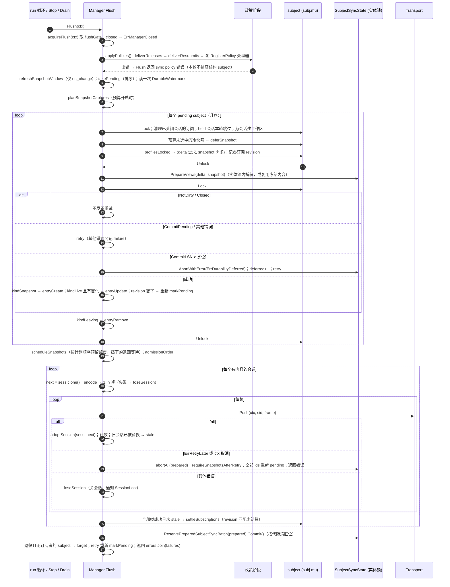
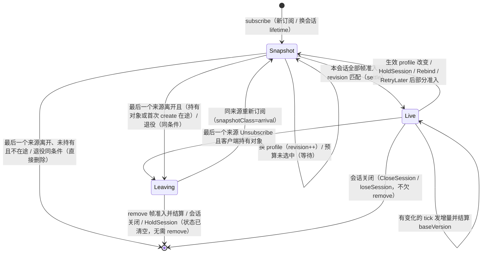
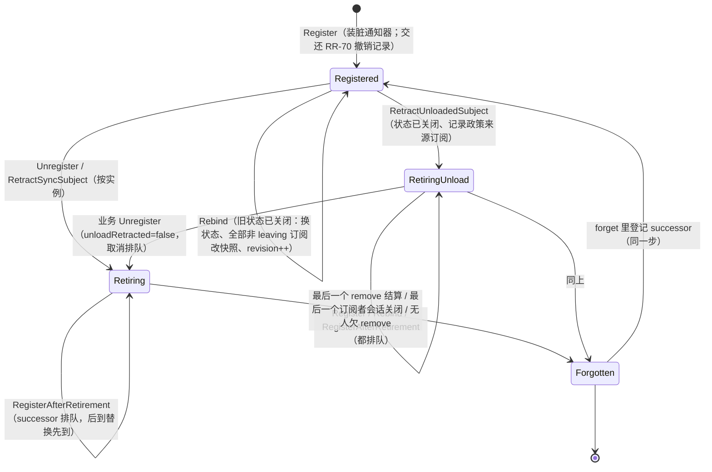
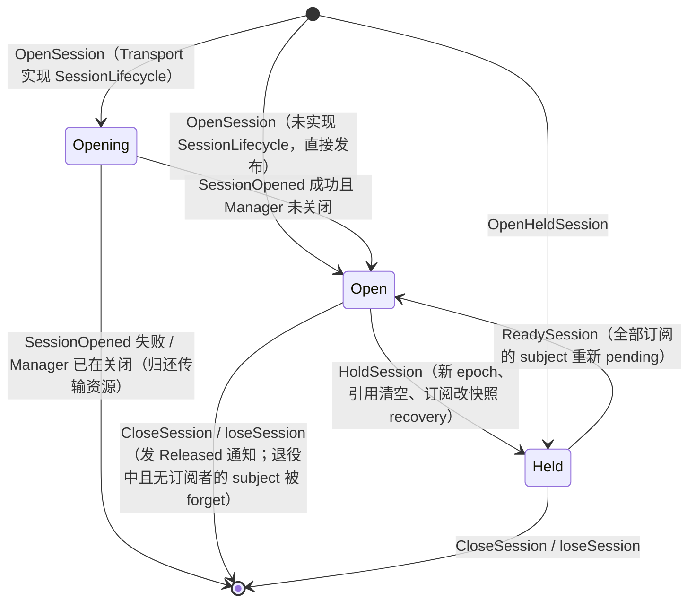
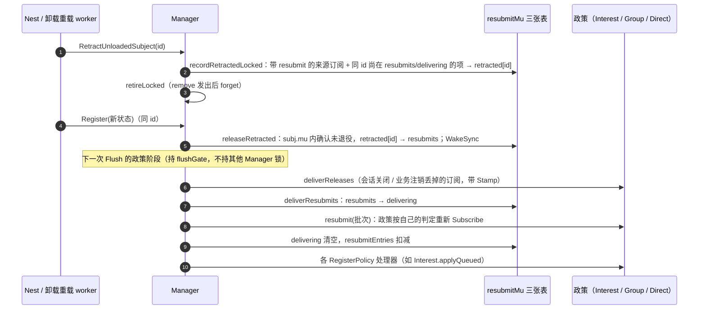
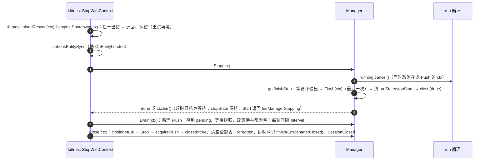
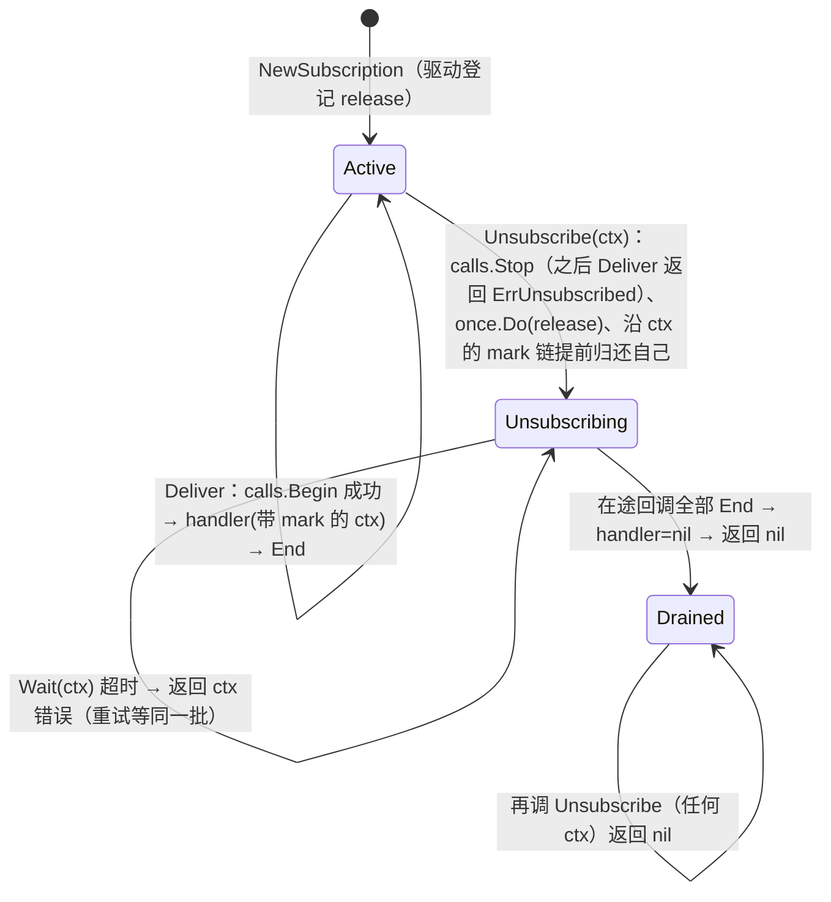
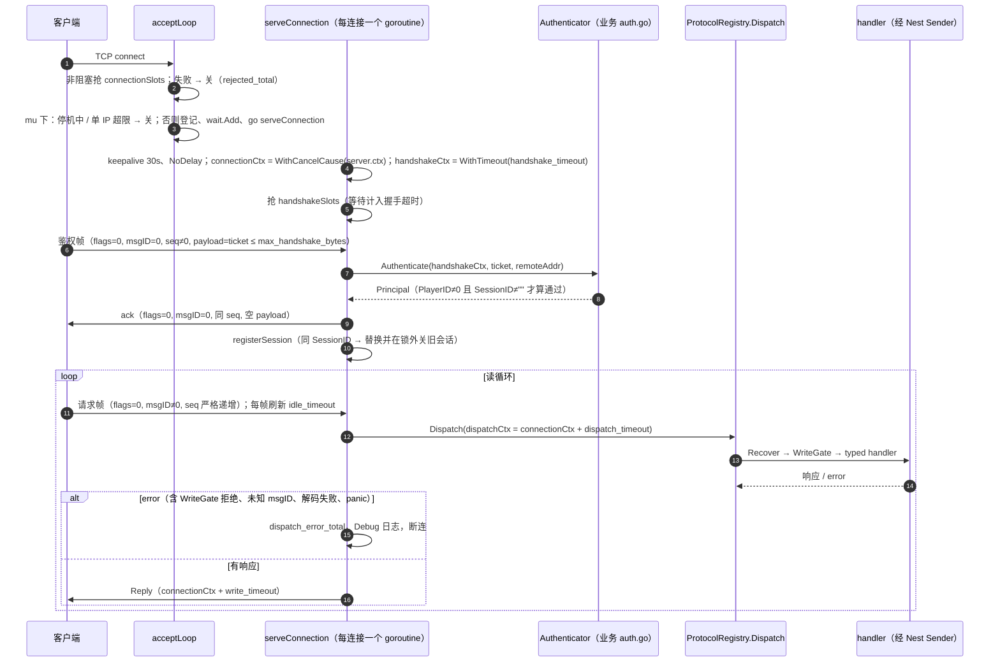

# 04 sync（实现）

> 配套说明文档：[guide/04-sync.md](../guide/04-sync.md)（是什么、怎么用、配置、运维、保证）。
> 读者：review agent 与要改这一块代码的人。源码基准：tag `v1.23.0`（`28912cd6`），全部 `path:line` 按这个 tag；生成代码引用的是**生成器模板源码**的行号（`codegen/internal/roost/render_player_tcp.go` 等文件里 Go 字符串的行号）。
> 图谱说明：codebase-memory 索引代际 2026-09-30。`sync/entitysync/*`、`syncstream/*`、`sync/lockstep/*` 为 `metadata_match`；`sync/syncbus/subscription.go` 为 `not_tracked`；`sync/syncbus/driver/jetstream.go`、`kit/syncbus/mod.go`、`cache/mirror.go`、`kit/nest/entity_sync.go`、`codegen/internal/roost/player_tcp_config.go` 为 `metadata_changed`。本篇只用图谱定位，结论全部按 tag 源码直接读取；标“探针”的结论是在 scratchpad 的副本里加临时测试实跑得出的（探针未入库）。

## 速览

- **实体复制的唯一编排点是 `Manager.Flush`**（`sync/entitysync/flush.go:66`）：持 `flushGate` → 政策阶段 → 取 pending → 快照预算计划 → 逐 subject 在实体锁内捕获（`PrepareViews`）并做水位门控 → 按会话组帧 → 逐帧 `Push`、逐帧采纳会话状态 → 会话全部帧成功才结算订阅 → 批量提交内容版本 → 遗忘退役完成的 subject。几乎所有不变量都在这一个函数和它调用的 `session.encode` / `settleSubscriptions` / `requireSnapshotsAfterRetry` 里兑现。
- **三个事实分开记**：内容版本（实体的 `SubjectSyncState`）、订阅意图（subject 上的 `subscription.kind/revision/profile`）、客户端实际持有的对象（会话的 `objects` 引用表，只在帧准入后采纳）。“欠不欠 remove”只看引用表（`sessionHoldsSubject`）和首次 create 在途标记（`inFlight`），不看 `kind`（`sync/entitysync/subscriptions.go:253`）。失败重试和退订时三者不能互相代替（`sync/entitysync/errors.go:10`）。
- **代际防护处处是“指针相等”**：会话用 `*session` / `*sessionLifetime` 比较（Hold、重开、旧 Push 采纳），subject 用 `*subject` 比较（forget、Unregister、按实例撤回），订阅用 `*subscription` + `revision` 比较（结算）。改这块代码时，任何“按 ID 查表后做事”的地方都要回答：查表到做事之间同 ID 换了一代怎么办。
- **最容易改坏的地方**：Flush 里 `subj.mu` 解锁调 `PrepareViews` 的窗口（`sync/entitysync/flush.go:184`）；`ErrRetryLater` 早返回路径（`sync/entitysync/flush.go:356`）；`unregister` 的“取锁后确认表项”循环（`sync/entitysync/manager.go:466`）；`forget` 先清通知器再删表的顺序（`sync/entitysync/manager.go:626`）；快照预算 plan / schedule / commit 三段的计费一致性；policy_queue 的计数器 `resubmitEntries` 与三张表的增减配平。
- **服务间总线**的核心是 `syncbus.Subscription`（`sync/syncbus/subscription.go:21`）：一份 `operation.Lifetime` 承担准入、在途计数与三步退订，所有驱动共用；JetStream 驱动另有总线级 `deliveries` Lifetime 管停机。
- **本篇写作时发现 16 条源码疑点**（§10.2），其中 F04-1（排队事实失效让每次 Flush 都失败）与 F04-3（entitysync 健康项无注册方）影响面最大。

### 本篇覆盖的包

| 包 | 职责 |
| --- | --- |
| `sync/entitysync` | Manager、subject、session、订阅与来源、Flush、快照预算、政策阶段、Rebind / 退役 / 卸载重载接口、线格式（subject update）、Trace |
| `sync/entitysync/policy` | Interest（AOI + 关系 + 排队事实）、AOI、AOICluster、Group、Direct、profile 选择 |
| `sync/frame` | 状态帧线格式 |
| `sync/nettransport` | AsyncTransport、UDP / KCP / QUIC 传输、AEAD |
| `sync/lockstep` | Room、Sequencer、History、DesyncDetector、wire、FrameAssembler |
| `sync/syncbus`、`/driver`、`/mirror` | 总线契约、Subscription、DeliveryIDs、PatchSyncer；NATS / JetStream 驱动；副本信封 |
| `kit/syncbus` | SyncBusMod |
| `syncstream` | History、FileHistoryJournal、Publisher / Subscribe / BufferedPublisher |
| `cache`（`mirror.go`） | ReplicaSyncer |
| `gateway` | 请求边界契约与中间件 |
| 生成的玩家接入层 | `codegen/internal/roost/render_player_tcp.go`、`render_access.go`、`player_tcp_config.go` |
| `kit/nest`（entitysync 接线） | `entity_sync.go` 与 `nest_mod.go` 的 sync 部分 |

---

## 1. 包与文件地图

### 1.1 `sync/entitysync`

建议阅读顺序（`sync/README.md:33`）：`manager.go` → `subscriptions.go` → `flush.go` → `session.go`。

| 文件 | 职责 |
| --- | --- |
| `errors.go` | 包文档（三个事实）、全部错误哨兵、`SessionOpenRetryable` |
| `manager.go` | `ManagerConfig` 与默认值、`Manager` 结构、`NewManager`、subject 登记 / Rebind / `RegisterAfterRetirement` / Unregister / `RetractUnloadedSubject` / `RetractSyncSubject` / forget、Start / Stop / Close、Stats / AuditStats / CheckHealth |
| `subject.go` | 订阅状态 `kindSnapshot/Live/Leaving`、`subscription`、`subject`、profile 需求缓存、`bestProfile` / `CompareProfiles` / `ValidateViewPriority` |
| `session.go` | `session` / `sessionLifetime`（反向索引）、对象引用分配 / 释放、`encode`（组帧、按完整实体包切分）、`objectFor` |
| `subscriptions.go` | OpenSession / OpenHeldSession / HoldSession / ReadySession / CloseSession / loseSession / dropSession、`adoptSession`、`SubscriptionSource`、subscribe / unsubscribe、`removeSubscriptionLocked` |
| `flush.go` | `markPending` / `takePending`、`Flush`、`captureSettlement`、`releaseInFlight`、`requireSnapshotsAfterRetry`、`settleSubscriptions`、`capturedAbove`、`recordFullReasons` |
| `snapshot_budget.go` | 快照窗口、等待集合、`SnapshotBudget`、`planSnapshotCaptures` / `scheduleSnapshots` / `admissionOrder` / `commitSnapshotAttempts` |
| `snapshot_requests.go` | 待快照订阅的增量索引（按类别、会话分组，带入队序号与字节预估）、`changeSubscriptionKindLocked` |
| `policy_queue.go` | `RegisterPolicy`、`applyPolicies`、RR-70 撤销记录与 Resubmit、RR-79 Released、RR-85 订阅戳 |
| `mode.go` | `SyncMode`、`WakeSync`、`CaptureSync`（on_change 冻结）、冻结字节预留 |
| `transport.go` | `Transport` / `SessionLifecycle` / `FrameSizeLimiter` 契约、`AsyncTransport` 适配器 |
| `wire.go` | `EncodeSubjectUpdate` / `DecodeSubjectUpdate` / `DecodeFrame`、tick 内编码缓存 `capturedUpdate` |
| `drain.go` | `Drain(ctx)` |
| `workspace.go` | Flush 工作区复用（容量有界） |
| `counters.go`、`trace.go` | 原子计数快照；有界阶段诊断环 |

### 1.2 `sync/entitysync/policy`

| 文件 | 职责 |
| --- | --- |
| `interest.go` | `Interest`：来源聚合、band → profile、拒绝重试、`Resubscribe`、resubmit、`Close` |
| `interest_queue.go` | 排队事实 `QueueMove` / `QueueRelation`、`applyQueued`（政策阶段）、`queuedPending` |
| `profiles.go` | `profileFor`、`validateProfile`、`validateConfiguredProfiles` |
| `source.go` | `Source` 接口、`RelationSource` |
| `aoi.go` | `AOI` 增量格子兴趣层 |
| `aoi_cluster.go` | `AOICluster`（多区域无缝拼接；仓内无生产调用方） |
| `group.go`、`direct.go` | `Group`、`Direct`（仓内无生产调用方） |

### 1.3 其余包

| 文件 | 职责 |
| --- | --- |
| `sync/frame/codec.go`、`frame_limits.go` | `Encode` / `Decode` / `validateFrame`；协议版本、错误、`Limits`、数据模型 |
| `sync/nettransport/channel.go`、`counters.go` | `AsyncTransport`（每会话有界可靠队列 + 一个 worker、驻留字节预算、消息年龄） |
| `sync/nettransport/sender.go`、`transport.go`、`session.go` | 发送接口、`SessionID`、ctx → 读写期限工具 |
| `sync/nettransport/udp_transport.go`、`udp_crypto.go`、`kcp_transport.go`、`quic_transport.go` | 三种协议传输与 AES-GCM 保护器 |
| `sync/lockstep/room.go` | Room：通道绑定、会话、旁观者、Tick、追帧、哈希裁决、指标 |
| `sync/lockstep/sequencer.go`、`history.go`、`desync.go`、`wire.go`、`assembler.go` | 输入排序与去重环；全量帧历史；多数派裁决；广播线格式与冗余编码；客户端组帧 |
| `sync/syncbus/sync.go`、`subscription.go`、`delivery_id.go`、`patch_syncer.go` | 契约；排空退订；投递身份；瞬时 patch 复制 |
| `sync/syncbus/driver/jetstream.go`、`nats.go` | 两种驱动 |
| `sync/syncbus/mirror/envelope.go` | `Envelope` 与 `Replicator`（New / NewLive） |
| `kit/syncbus/mod.go` | `SyncBusMod` |
| `cache/mirror.go` | `ReplicaSyncer` |
| `syncstream/syncstream.go`、`lifecycle_journal.go` | History 定序 / 保留 / ACK / Resync / Recover / 导入导出；journal 接口与生命周期操作 |
| `syncstream/file_journal.go`、`file_durability_{unix,windows}.go` | 分代 checkpoint + WAL、组提交、尾部截断、fail-stop；平台持久化 |
| `syncstream/publisher.go`、`observability*.go` | 传输侧（JSON / gzip / 分片 / checksum / 确认发布、有界重组）、指标 |
| `gateway/gateway.go`、`middleware.go` | `Principal` / `Session` / `Chain` / `RequireAuthenticated`；`RateLimit` / `Timeout` / `Recover`（仓内无装配方） |
| `codegen/internal/roost/render_player_tcp.go` | 生成 `server_gen.go`（TCP 层全部）、生成测试、`auth.go` 骨架、playerprobe、参考配置 |
| `codegen/internal/roost/render_access.go` | 生成 `player_agent/runtime_gen.go`（协议注册表）与 `access/player/mod_gen.go`（WriteGate） |
| `codegen/internal/roost/player_tcp_config.go` | `player_access.tcp` 声明（唯一来源）与补键 |
| `kit/nest/entity_sync.go`、`nest_mod.go` | `NewModWithEntitySync`、配置合并、自动水位、Start / Stop 接线 |

→ [说明文档](../guide/04-sync.md)对应：§1 定位与边界。

## 2. 关键类型与数据结构

### 2.1 entitysync

| 类型 | 关键字段 / 含义 | 位置 |
| --- | --- | --- |
| `ManagerConfig` | 见说明文档 §5.5；`normalized()` 填默认 | `sync/entitysync/manager.go:22`、`:71` |
| `Manager` | `mu`（RW）保护 `subjects` / `sessions` / `opening` / `closed` / `closing` / `heldSessions`；`pendingMu` 保护 `pending` / `waitingSnapshots` / `waitingOrder` / `pendingOverlap`；`flushGate`（容量 1 的通道）串行化 Flush 与 Close；`runMu` 保护 `runState` / `stopState`；`policyMu` 保护政策钩子；`resubmitMu`（叶子）保护 `retracted` / `resubmits` / `delivering` / `releases`；大量原子计数；四个测试缝（生产恒为 nil） | `sync/entitysync/manager.go:117` |
| `subject` | `mu`；`state *entity.SubjectSyncState`（Rebind 在 mu 下替换）；`subscribers map[SessionID]*subscription`；`retiring`、`successor *queuedRegistration`（至多一个排队登记）、`forgotten`、`unloadRetracted`；profile 需求缓存 `profilesValid` / `deltaProfiles` / `snapshotProfiles` | `sync/entitysync/subject.go:45` |
| `subscription` | `revision`（订阅意图代数）、`inFlight`（本轮捕获已为它组帧）、`lifetime *sessionLifetime`、`sources map[*SubscriptionSource]SyncProfile`、生效 `profile`、`kind`、`snapshotClass`（arrival / recovery）、`baseVersion` | `sync/entitysync/subject.go:29` |
| `sessionLifetime` | `traceID`、`subjects map[int64]*subject`——这一次打开的订阅反向索引（含待快照、待 remove），只由 `Manager.mu` 保护 | `sync/entitysync/session.go:47` |
| `session` | `lifetime`、`id`、`epoch`（从 1 起，Hold 加一）、`tick`（0 表示尚无基线）、`objects map[int64]frame.ObjectRef`、`generations` / `free` / `next`（uint16 引用分配，id 0 保留）、`held`、`snapshotAfter`、`referencesOwned`（写时复制） | `sync/entitysync/session.go:54` |
| `flushSession` / `settlement` | 一次 Flush 里每会话的 `entries` 与结算记录（`sub`、`revision`、`version`、`remove`、`snapshotClass`） | `sync/entitysync/flush.go:42`、`:52` |
| `encodedFrame` | 一帧的字节、计数与准入后要采纳的 `next *session` | `sync/entitysync/session.go:29` |
| `capturedUpdate` | 一份不可变捕获 + tick 内编码缓存（同 subject / profile 的多个会话共享） | `sync/entitysync/wire.go:122` |
| `SubscriptionSource` | `manager`、可选 `resubmit` / `released` 回调；令牌按指针比较 | `sync/entitysync/subscriptions.go:271` |
| `queuedRegistration` | 排在退役完成之后的登记（`state`、`done`） | `sync/entitysync/manager.go:392` |
| `snapshotRequests` | 待快照订阅的索引：`entries`、按类别与会话的 `groups`、全局入队序号 `sequence`、字节预估 `estimates` | `sync/entitysync/snapshot_requests.go:11` |
| `snapshotPlan` / `snapshotCharge` | 本轮预选的订阅、共用顺序、实际计费 | `sync/entitysync/snapshot_budget.go:150` |
| `SyncTrace` / `SyncTraceEvent` | 固定容量环；事件不含 payload | `sync/entitysync/trace.go:12`、`:27` |

实体侧（02 分区的内容层，这里只列被 Flush 调用的）：`SubjectSyncState`（`entity/subject_sync.go:189`）、`PrepareViews`（`:441`，在 `withEntityLock` 内取 `prepareMu` 与 `mu`，读 `lastCommitLSN`、有冻结内容就复用）、`PreparedSubjectSync`（`:649`）、`ReservePreparedSubjectSyncBatch` / `Commit`（`:732`、`:780`）、`FreezeSyncViews`（`entity/sync_frozen.go:15`）、`SyncMutation`（`entity/sync_commit.go:69`）。

### 2.2 policy

| 类型 | 关键字段 | 位置 |
| --- | --- | --- |
| `Interest` | `mu`、`aoi *AOI`、`relations`、`self`、`held map[pair]*hold`、`retry []pair`、`facts`（排队事实）、`queueActive`、`subscriptions *SubscriptionSource`（WithResubmit） | `sync/entitysync/policy/interest.go:77`、`:113` |
| `hold` | `bands map[source]int`、`subscribed`、`profile` | `sync/entitysync/policy/interest.go:107` |
| `AOI` | 格子索引、subjects、observers（订阅格、可见集与 band）、待发事件；非并发安全 | `sync/entitysync/policy/aoi.go:164` |
| `Direct` | `bound map[directBinding]directBound{profile, stamp}` | `sync/entitysync/policy/direct.go:22` |

### 2.3 syncbus / syncstream / 其他

| 类型 | 关键字段 | 位置 |
| --- | --- | --- |
| `syncbus.Subscription` | `handler`、`release`、`once`（release 一次）、`cleared`（排空后丢 handler）、`calls operation.Lifetime` | `sync/syncbus/subscription.go:21` |
| `deliveryMark` | `outer`（同订阅更外层的同步重入调用）、`ended`（CAS 保证只归还一次） | `sync/syncbus/subscription.go:51` |
| `jetStreamSyncBus` | `mu` 保护 `topics map[key]*topicFanout`；`deliveries operation.Lifetime`（总线级投递准入） | `sync/syncbus/driver/jetstream.go:81` |
| `topicFanout` | 一个 durable consumer + `locals map[uint64]*Subscription` | `sync/syncbus/driver/jetstream.go:107` |
| `mirror.Replicator` / `Envelope` | 见说明文档 §4.8 | `sync/syncbus/mirror/envelope.go:39`、`:22` |
| `syncstream.History` | `mutex`（RW）、`epoch`、`journal`、`streams`、`sequenceFloor`（本 epoch 已分配的最大序号，持久化）、`revision`（进程内修改代数） | `syncstream/syncstream.go:113` |
| `FileHistoryJournal` | `mutex`、`generation`、常驻 `walFile`、组提交 `batchMu` / `pending` / `waiters` / `flushing` / `idle`、`truncateTo`、`failure`、注入点 `syncFile` / `publish` | `syncstream/file_journal.go:23` |
| `lockstep.Room` | sequencer、history、encoder、detector、座位 / 旁观者 / 追帧状态 map、`ruled`；单所有者无锁 | `sync/lockstep/room.go:98`、`:128` |
| `nettransport.AsyncTransport` | `mu`（RW）→ 每会话 `queue.mu`；全局驻留字节原子预留 | `sync/nettransport/channel.go:136`、`sync/nettransport/counters.go:26` |
| 生成的 `Server` / `session` | `Server.mu`（RW）保护连接 / IP 计数 / 会话表；`connectionSlots` / `handshakeSlots`（通道当信号量）；`session.writeMu` 串行化写（含 close） | `codegen/internal/roost/render_player_tcp.go:643`、`:1037` |

→ [说明文档](../guide/04-sync.md)对应：§2 核心概念与术语。

## 3. 主流程

### 3.1 Flush：一次同步 tick



逐步对照源码（`sync/entitysync/flush.go`）：

1. **门与记账**（`:66-92`）：`acquireFlush` 可随 ctx 取消；所有失败的 Flush 在 defer 里统一计 `flushFailures`、记 `lastError`、观测 `entitysync_flush_duration`。
2. **政策阶段**（`:93-95`）：失败直接返回，**本轮不取 pending、不捕获**。这一点让 F04-1 的影响面扩大到全部 subject。
3. **取 pending**（`:96-106`）：`takePending` 清空 `pending` 并把 `pendingOverlap` 归零（`:25`）；水位只读一次。
4. **逐 subject 捕获**（`:127-261`）：
   - 订阅者所在会话已不存在或 lifetime 不同 → `removeSubscriptionLocked`（`:146`）。
   - held 会话、或本轮工作区里已是另一代会话 → `hold`，本 tick 不给它出帧（`:148-153`）。
   - 预算模式下，已持有对象的视图替换强制选中（`:163-166`），未选中的冷快照 `deferSnapshot`（`:168-171`）。
   - **解 subj.mu 调 `PrepareViews`**（`:184-186`）：这是唯一会拿实体锁的地方；解锁期间订阅可能变化，回来后用 `revisions` 检查，变了的订阅 `markPending` 留到下轮（`:229-231`）。
   - `kindLive` 只在 `dirty`（`Version != BaseVersion`）时发增量（`:242-245`）；隐藏字段的增量也推进客户端版本（`TestHiddenFieldDeltaStillAdvancesTheClientVersion`）。
   - `captureSettlement` 置 `inFlight = true`（`:405-408`），defer 的 `releaseInFlight` 在 Flush 结束时统一复位（`:410-418`）。
   - remove 在 `wantsCapture` 之外追加（`:254-259`）：内容门控不挡 remove。
5. **准入**（`:263-373`）：会话按 ID 排序，再按快照计划把带冷创建计费的会话提前（`admissionOrder`，`sync/entitysync/snapshot_budget.go:353`）。`next := sess.clone()` 后 `encode`（只改副本）；每帧 `Push` 前检查会话仍是同一代、ctx 未取消（`:316-323`）；成功即 `adoptSession`（`sync/entitysync/subscriptions.go:237`）——**每帧有独立提交点**，后续帧失败不撤回前缀。
6. **整体重试**（`:353-365`）：`ErrRetryLater`，或 ctx 已取消且这一帧失败，都按“谁也不怪”处理：`abortAll`、`requireSnapshotsAfterRetry`（已准入过的会话的非 remove 结算改回 `kindSnapshot`，`:422-438`）、全部 ids 重新 pending、返回错误。注意这条路径**提前返回**，跳过了末尾的 Commit、forget 与 `retry` 处理（ids 已全部重新 pending，所以 retry 不丢）。
7. **结算**（`:442-459`）：只有当前订阅仍是同一个 `*subscription` 且 `revision` 相同才生效：remove → `removeSubscriptionLocked`；否则 `baseVersion = version`、转 `kindLive`、`snapshotClass = arrival`。
8. **提交**（`:376-384`）：`ReservePreparedSubjectSyncBatch` 失败则全部 abort；`Commit` 失败只记 failure。
9. **收尾**（`:385-401`）：退役且没有订阅者的 subject `forget`；`retry` 重新 pending。

### 3.2 订阅状态机



关键实现点：

- 状态切换都经 `changeSubscriptionKindLocked`（`sync/entitysync/snapshot_requests.go:155`），它同时维护快照索引；**绕过它直接改 `kind` 会让预算计划看不到 / 看错待快照订阅**。
- `revision++` 是让在途捕获作废的唯一手段（换 profile `sync/entitysync/subscriptions.go:379`、退订成 leaving `:468`、退役 `sync/entitysync/manager.go:530`、Rebind `:380`、Hold `sync/entitysync/subscriptions.go:131`）。
- “欠 remove”的判定：`!existing.inFlight && !m.sessionHoldsSubject(...)` 才直接删（`sync/entitysync/subscriptions.go:462`、`sync/entitysync/manager.go:523`）；`kindSnapshot` 不能证明旧视图从未交付（换视图时客户端仍持有旧对象）。
- Leaving 状态的订阅 `sources` 为空（退役时 `clear(sub.sources)`，`sync/entitysync/manager.go:528`）；退役中的 subject 拒绝订阅（`sync/entitysync/subscriptions.go:365`），所以 `Leaving → Snapshot` 只发生在普通退订后又订回的情况。

### 3.3 subject 生命周期（登记、退役、排队登记、Rebind）



源码要点：

| 步骤 | 位置 | 说明 |
| --- | --- | --- |
| `register` | `sync/entitysync/manager.go:269` | 同 ID 已存在 → `rebind`；超 `MaxSubjects` → `ErrSubjectLimit`；登记后在锁外 `installDirtyNotifier`（状态已脏会立即排队）、`releaseRetracted` |
| `rebind` | `:348` | 四种情况：卸载退役中 → 排队（同一状态且 done==nil 时保留原排队项）；普通退役中 → `ErrSubjectRetiring`；同一状态 → 空操作；旧状态仍活 → `ErrSubjectRegistered`；否则换状态并强制全量 |
| `RegisterAfterRetirement` | `:419` | 最多三轮循环（退役恰在两步之间完成时重试）；排队项的 `done` 恰好调用一次 |
| `unregister` | `:465` | 无锁取 subject → 取 `subj.mu` → **取 `m.mu.RLock` 确认仍是表里那一个**（RR-20260927-22），不是就重查；`only != nil` 时比对状态（RR-20260927-28）；释放戳在读锁内取（RR-85）；释放读锁后 `retireLocked`（它要再取 `m.mu.RLock`，不能重入） |
| `retireLocked` | `:518` | 不欠 remove 的直接删；欠的 `clear(sources)` → Leaving、revision++ |
| `forget` | `:626` | 先在 `m.mu` 内确认表项、**清旧 subject 的脏通知器与冻结内容**、再删表（RR-20260926-69）；然后清快照等待、置 `forgotten`、取走 successor 并登记 |
| `RetractUnloadedSubject` | `:572` | 仅在“未退役且状态已关闭”时；先 `recordRetractedLocked` 再 `retireLocked` |
| `SubjectAwaitsReload` | `:548` | 未退役、状态已关闭、有非 leaving 订阅者 |

### 3.4 会话生命周期



- `opening` 集合让同 ID 的并发 `OpenSession` 返回 `ErrSessionOpening`，旧 lifetime 的发送尚未退出时传输返回 `ErrSessionAlreadyExists`，适配器包成 `ErrSessionClosing`（`sync/entitysync/transport.go:83`，RR-20260926-15）。
- `HoldSession` 复用 `lifetime`（反向索引不丢）、`framesSent` 延续，`epoch+1`；leaving 的订阅直接删（客户端状态已不在）（`sync/entitysync/subscriptions.go:96`）。
- `ReadySession` 用 `sess.clone()` 换代，只是把 held 置假并重新 pending（`:144`）。
- `dropSession` 的释放戳在删除会话的同一把 `m.mu` 内取（RR-85，`:203`）；`SessionLifecycle.SessionClosed` 在锁外调用；`SessionLost` 回调**在调用方路径上同步执行**——从 Flush 来时持有 `flushGate`（`:227-232`）。

### 3.5 政策阶段与框架撤销 / 释放（RR-70 / 78 / 79 / 85）



- 计数器 `resubmitEntries` 是 `retracted` + `resubmits` + `delivering` 的条数之和；每处增删都要配平（`recordRetractedLocked` `:193`、`deliverResubmits` `:271`、`dropRetracted` `:380`/`:393`、`dropRetractedSubject` `:411`、`clearRetracted` `:420`）。它也是热路径跳过加锁的依据（`releaseRetracted` `:226` 等）。
- 释放戳与订阅戳共用 `stampClock`，政策只删戳更小的簿记（`Direct.released`，`sync/entitysync/policy/direct.go:104`）。
- 撤销记录的生命周期见 `sync/entitysync/policy_queue.go:67` 的长注释；它是 RR-59 / 70 / 78 / 79 / 85 五轮修复叠加出来的，**改动前先跑 `retracted_*`、`released_hook_*`、`release_stamp_*`、`unregister_forgotten_*`、`forget_notifier_*` 全部测试**。

### 3.6 快照预算（plan → schedule → commit）

三段共用同一个候选顺序，保证“计划预留 = 实际尝试 = 游标推进”：

1. **plan**（`sync/entitysync/snapshot_budget.go:169`）：只读 `snapshotRequests` 索引与不可变 session（持 `m.mu.RLock` 与 `snapshotRequests.mu`，**不取任何 subject 锁**，守卫 `TestSnapshotPlanningAndStatsDoNotAcquireSubjectLocks`）。两类（arrival / recovery）交替，空类的额度给另一类；按会话游标轮转、会话内按入队序号；`MaxBytes` 下按上次捕获大小预判（未知按最小可能大小），首个放不下的候选挡住后缀（`byteBlocked`）。
2. **schedule**（`:256`）：在已捕获的冷创建上按同一顺序预留额度（已持有对象的全量替换不占额度），挡下的项 `inFlight=false`、`deferSnapshot`、从帧条目里剔除。
3. **commit**（`:378`）：只对**实际开始 Push** 的会话计费（包括 RetryLater）；游标只推进到按计划顺序的已尝试前缀，遇到仍有效却未尝试的会话就停（`TestSnapshotCursorStopsBeforeUnattemptedAcrossClasses`）。
4. **窗口**（`:15`，仅 on_change）：按固定 `Interval` 边界轮转，空闲窗口不积攒、晚醒不推迟后续边界；窗口轮转时把等待集合重新放回 pending。

### 3.7 on_change：冻结与唤醒

1. 生成 setter / `MarkSyncDirty` 只标脏；事务成功准入且 Guard 仍持有实体锁时，Nest 经 `SyncMutation.Admit` 调 `Manager.CaptureSync`（`sync/entitysync/mode.go:54`）：取 subject 当前的 profile 需求，在锁外调 `state.FreezeSyncViews(delta, snapshot, m.reserveFrozen)`。冻结字节用 CAS 预留（`:94`），超过 `MaxFrozenBytes` 返回失败、该 subject 留脏（`TestFrozenCapacityFailureLeavesDirtyForRecovery`）。
2. 冻结之后若 subject 已换代，丢弃冻结内容（`:85-87`）。
3. 全部实体解锁且提交协议确认（`Confirm`）后，状态的脏通知器 `markPending` + `SyncCommitReady` 为真时 `WakeSync`（`sync/entitysync/manager.go:305`）。`WakeSync` 是非阻塞的单槽通道发送，仅 on_change 生效（`sync/entitysync/mode.go:44`）。
4. 提交门未就绪时 `PrepareViews` 返回 `ErrSyncCommitPending`，Flush 把它放进 retry（`sync/entitysync/flush.go:195`）。

### 3.8 Manager 的 Start / Stop / Close / Drain 与 kit 停机



- `Start`（`sync/entitysync/manager.go:689`）：on_change 未绑定生产者报错；`stopState != nil` → `ErrManagerStopping`；已有未退出的 runState → 返回 nil（不起第二个循环）。
- `Stop`（`:747`）：第一次调用起 `finishStop` goroutine，后续调用等同一个 `stopState`；`finishStop` 用的是**第一次调用者的 ctx**做最后一次 Flush（`:781`）。
- `Close`（`:795`）：`closing` 阻止新注册 / 开会话 / Start，但允许最后一次 Flush；超时返回后可再次 Close 完成清理。
- kit 的三步停机：`kit/nest/nest_mod.go:310`。Stop / Drain / Close 任一失败都直接返回、`stopped` 保持 false。

### 3.9 Interest：排队事实与 AOI

1. `QueueMove(e, at, observer)` / `QueueRelation(e, source, subjects)`（`sync/entitysync/policy/interest_queue.go:24`、`:29`）在 Nest handler 的实体锁内调用：锁外取 `entity.SyncConditionFor(e)`（固定本次提交的门，`entity/sync_commit.go:345`），锁内校验关闭、关系是否声明、坐标在界内、id 已登记、容量，入队；已就绪时 `WakeSync`。
2. 政策阶段 `applyQueued`（`:70`）：逐条判定 `condition()` → discarded 丢弃；未就绪或同 id 有更早的阻塞事实 → 保留并阻塞该 id；就绪 → 应用（关系 `Set`；移动 `MoveSubject`，observer 时再 `MoveObserver`）；**出错 → 保留并阻塞该 id、错误并入返回值**。解锁后 `in.Apply()`，Refusal 丢弃。
3. `Apply`（`sync/entitysync/policy/interest.go:379`）：先取走 retry，再逐源 `Flush()` → `applyEvent`（第一个来源认领 → `subscribe`；来源变化 → `reband`，只有选出的 profile 变才重订；最后一个来源离开 → `Unsubscribe`），最后重说旧 retry。
4. AOI `evaluatePair`（`sync/entitysync/policy/aoi.go:497`）：自己不观察自己；原可见 → 超离开半径发 Leave、否则 band 变化发 BandChanged；原不可见且在进入半径内 → `MaxVisible` 已满时只淘汰严格更远者 → Enter。`MoveObserver` 先格子订阅差分、再由近到远评估（避免先进后踢的瞬时 Enter + Leave）。

### 3.10 syncbus：Subscription 与 JetStream 驱动



JetStream 投递路径（`sync/syncbus/driver/jetstream.go`）：

1. `subscribe`（`:205`）持 `b.mu` 直到返回——**包括首个订阅者建 consumer 的网络调用**（最长 `SetupTimeout`）。普通订阅用 key = topic、`DeliverAll`；live 用 key = `topic\x00live`、durable 主题 `topic.live`、`DeliverNew`（`:222-225`）。首个本地订阅者建 durable consumer（`:227-276`），之后的只加进 `locals`。
2. consume 回调（`:243-270`）：`deliveries.Begin()` 失败（总线停止中）→ 返回 `errJetStreamSyncStopping` → 底层 NAK；反序列化失败 → Warn 并 **ACK**；本服消息 → ACK；否则在 `b.mu` 下取 `locals` 快照（按 id 排序）、解锁，对每个本地订阅复制一份消息调 `invoke`（recover + `Deliver`，`:300-309`）。
3. 底层结算（`nats/driver/jetstream.go:106`）：回调返回 nil → Ack；返回错误 → `IsPermanent` 或 `NumDelivered >= MaxDeliver` 时 **Term**，否则 Nak（syncbus 未配 NakBackoff，立即重投）。
4. release（`:279-291`）：`b.mu` 下删 local；最后一个离开且 fanout 仍是表里那个 → 删 fanout，解锁后 `Stop()` consumer（nats.go 的 UNSUB 在后台异步完成）。
5. `StopWithContext`（`:323-333`）：`deliveries.Stop()` → `stopSubscriptions()`（不受 ctx 约束，可能等 `b.mu`）→ `deliveries.Wait(ctx)`。之后拒绝 Subscribe，Publish 仍可用。

### 3.11 副本复制：mirror / ReplicaSyncer / PatchSyncer

- `Replicator.Start`（`sync/syncbus/mirror/envelope.go:69`）：live 模式要求总线实现 `ILiveSubscriber`；handler 校验外层身份、Data 为空视为删除、内层身份非零时必须与外层一致，然后 `Store.ApplyReplica`。`Stop()` 只发起（用已取消的 ctx 调 `StopWithContext`，`:137-146`）；`StopWithContext` 逐个 `Unsubscribe(ctx)`、全部发起、只保留第一个错误，成功的从表里删除，可再 Start（`:151-174`）。
- `ReplicaSyncer.ApplyReplica`（`cache/mirror.go:88`）：Delete → `Store.Delete(DeleteKeyOf(key))`，**不带版本**；Upsert → payload 为 `null` 拒绝 → 反序列化 → 校验 `KeyOf(value) == env.Key` 与 `VersionOf(value) == env.Version`（RR-20261005-NC-33）→ `Store.Set`（新旧由 Store 的 Stale 判定）。
- `PatchSyncer.handle`（`sync/syncbus/patch_syncer.go:120`）：Key 为 0 或 Data 为空的消息忽略（没有删除语义）；本服消息跳过；key 不一致报错；然后 `Apply(投递 ctx, patch)`。

### 3.12 syncstream：Append、组提交、Load、Checkpoint

1. `History.Append`（`syncstream/syncstream.go:171` → `appendLocked` `:213`）：写锁内分配 `Sequence = latest+1`（新流从 `sequenceFloor` 之上开始，U-0215）、Full 或新流 `BaseSequence = 0`、schema 变化必须 Full；**先 `journal.Record` 再改内存**，失败时删掉新建的流（`:248-255`）；超出保留数丢最旧的。
2. `FileHistoryJournal.Record`（`syncstream/file_journal.go:224`）：组提交 leader / follower；`flushBatch`（`:281`）首次打开 WAL 前按 `truncateTo` **按路径截断**并 fsync（U-0211），Write 或 Sync 失败置 `failure`（fail-stop）。因为 History 在写锁内调用 Record，同一 History 的记录实际串行、每批一条（探针：64 次并发 Append = 64 次 fsync）。
3. `Load`（`:104`）：只取最新一代 checkpoint + 对应 WAL；无效就拒绝启动；WAL 只回放以换行结尾的完整行，半尾记 `truncateTo`；回放（`replayHistoryMutation`，`:472`）要求接上 checkpoint（同 epoch、序号连续、ACK 不越界）。
4. `Checkpoint`（`:343`）：建下一代空 WAL（`O_EXCL`，孤儿删除重建）→ 写临时文件并 fsync → **发布**（unix：rename + 目录 fsync；windows：`MoveFileExW(WRITE_THROUGH)`）——发布失败 fail-stop、保留临时文件 → 切代、删 `current-2`。
5. `Recover`（`syncstream/syncstream.go:354`）：`Resync` 判定 → 记 `revision` → 锁外调 provider → `appendIfUnchanged`（revision 变了返回 `ErrRecoverStale`，U-0216）。

### 3.13 lockstep：Tick、追帧、哈希裁决

1. `SubmitInput`（`sync/lockstep/room.go:259` → `sync/lockstep/sequencer.go:209`）：未知座位 / payload 超限拒绝；帧号小于 next 的改写为 next（迟到折入）；超过 `next+window` 拒绝；**先校验窗口再碰身份环**（U-0199）；原帧号在 64 帧地平线内命中身份环 = 重传，返回当初的目标帧、什么都不改（U-0193）；显式输入可覆盖折入的占位，其余先到者赢。
2. `Tick`（`sync/lockstep/room.go:294`）：`Advance` 切帧（按 PlayerID 排序，帧字节确定）→ `History.Append` → 冗余编码最近 depth 帧 → 按“座位升序、旁观者升序”同步 `SendDatagram`（追帧中的跳过）→ `pumpCatchup` → `errors.Join` 发送错误（帧照样切出）。
3. `pumpCatchup`（`:400`）：每个追帧会话一页（`ReadRange(next, batch)`）经 `SendReliable`；失败 `failures++`，达到上限放弃；成功推进游标，追上后回到实时广播；`next < FirstID` 时报 `ErrCatchupUnservable`（仅 `next != 0`）。
4. `ReportHash`（`:452`）：座位存在、`0 < frame ≤ Latest`；`DesyncDetector.Report` 每 (帧, 座位) 只记第一次；某哈希票数 ≥ quorum 时裁决（票最多者为多数、平票取值小的）；离群集合**任何变化**（含缩小）都回调。

### 3.14 nettransport.AsyncTransport

`RegisterSession`（`sync/nettransport/channel.go:164`）在持 `mu` 时级联下游 `RegisterSession` 并起 worker；`SendReliable`（`:215`）按 ctx → id → 非空 → 上限 → 关闭 → 已注册 → 会话失败 / 排空 → 条数 / 每会话字节 → 全局驻留字节 CAS 预留的顺序准入，复制 payload 入队；worker 发送期限 = min(now + SendTimeout, 入队时刻 + MaxReliableAge)，过期不发；下游出错 → 会话终态（丢队列、归还预算、取消 ctx、调 `OnError`）；`workerDone`（`:503`）归还额度、级联 `RemoveSession`、从表里删除——**此后同 ID 才能复用**。

### 3.15 生成的玩家 TCP 接入层



- 生成位置：常量与错误 `codegen/internal/roost/render_player_tcp.go:146-171`；`Config` / 默认 / 校验 `:183-325`；Mod `:348-434`；Runtime 与关闭事件 `:439-641`；Server `:643-1035`；session 与写 `:1037-1141`。
- 写失败分类（`:1098-1114`）：0 字节、截止来自调用方、`ErrDeadlineExceeded` → 写前拒绝（不关连接，RR-20260926-68）；其他 → `errConnectionBroken`，推送路径 `dropBrokenSession`（先 forget 再 close）。
- 停机：App 先 `Service.Shutdown`（demo 第一步 `CloseServedSessions`），再逆序停服务专属 Mod——`access.player.tcp` 注册在最后，所以第一个被停：`runtime.server.Store(nil)`（之后 Push 返回 `ErrTransportUnavailable`）→ `server.Stop(ctx)`（cancel `server.ctx`、关 listener、直接关全部连接、在 ctx 内等 wait；超时保留 server，NC-83）→ `stopLifecycleContext`（排空关闭事件派发）。

→ [说明文档](../guide/04-sync.md)对应：§4 怎么用。

## 4. 不变量清单

### 4.1 entitysync

| # | 内容 | 强制位置 | 守卫测试 |
| --- | --- | --- | --- |
| E1 | 一个会话每 tick 收到 1..n 帧，只在对象数 / 字节上限处切分；完整实体包不截断；单包超硬上限明确失败 | `sync/entitysync/session.go:142`、`:204`、`:207` | `manager_promises_test.go:TestOneFramePerSessionPerTickSplitOnlyAtTheObjectLimit`、`six_items_test.go:TestWholeEntityPacketsSplitAndRetainIndependentFrameState`、`TestWholeEntityTooLargeIsExplicitAndNeverTruncated`、`snapshot_progress_test.go:TestOverHardLimitSnapshotStillFailsExplicitly` |
| E2 | 会话第一帧是 FrameFull 且只含 create；之后每帧 delta 基于上一帧 | `sync/entitysync/session.go:177`、`:224` | `TestEachSessionGetsASnapshotThenDeltasAndOnePackServesThemAll` |
| E3 | 同 tick 先 remove 再分配新对象 | `sync/entitysync/session.go:145` | `session_capacity_promises_test.go:TestFullSessionCanReplaceAnObjectRegardlessOfSubjectID` |
| E4 | 编码只改会话副本；每帧准入后采纳；已准入前缀不回滚 | `sync/entitysync/flush.go:297`、`:338`；`sync/entitysync/session.go:78`、`:85` | `optimization_test.go:TestSessionReferenceCopiesAreIsolatedOnFirstWrite`、`partial_retry_promises_test.go:TestPartialSessionRetryContinuesAfterTheLastAdmittedFrame` |
| E5 | 水位门控挡整个 subject（快照与增量），无接收者的脏捕获也受门控 | `sync/entitysync/flush.go:203` | `TestTheDurabilityGateHoldsTheWholeSubjectUntilTheWatermarkReachesIt`、`optimization_test.go:TestUnobservedCaptureStillRespectsDurabilityWatermark` |
| E6 | `ErrRetryLater` / ctx 取消：全部 abort、全部重新 pending、不关任何会话；已准入会话的受影响订阅改全量 | `sync/entitysync/flush.go:353-365`、`:422` | `TestRetryLaterAbandonsTheTickWithoutBlamingAnySession`、`snapshot_retry_progress_test.go:TestEverySessionIsDeliveredUnderPersistentRetryLater`、`TestPartialTickRetryRestoresAnApplicableSubjectBaseline`、`failure_test.go:TestCancelledFlushRetainsAdmissionCauseAndRecovers` |
| E7 | 其他 Push 错误或编码错误只关该会话并通知 `SessionLost` | `sync/entitysync/flush.go:309`、`:366`；`sync/entitysync/subscriptions.go:182` | `TestAFailingSessionIsClosedAloneAndTheOthersStillReceive` |
| E8 | 结算只作用于同一 `*subscription` 且 revision 相同；Push 期间的换 profile / 撤订 / 退役不被旧捕获覆盖 | `sync/entitysync/flush.go:445` | `inflight_promises_test.go:TestInFlightDeliveryCannotOverwriteNewIntent` |
| E9 | 只有客户端持有对象（或首次 create 在途）才欠 remove | `sync/entitysync/subscriptions.go:462`；`sync/entitysync/manager.go:523` | `TestUnsubscribeAndUnregisterOweARemoveOnlyToWhoHoldsTheObject`、`subscription_removal_promises_test.go:TestPendingSnapshotStillRemovesAnAlreadyDeliveredObject` |
| E10 | remove-before-create：退役中拒绝订阅；全部 remove 结算后才 forget；排队登记在 forget 同一步登记 | `sync/entitysync/subscriptions.go:365`；`sync/entitysync/manager.go:536`、`:661` | `source_promises_test.go:TestRetirementCannotBeUndoneByReleasingOneSource`、`register_after_retirement_test.go:TestRegisterAfterRetirementCompletesOnceTheRemoveIsOut`、`TestRegisterAfterRetirementCompletesWhenTheLastSubscriberCloses`、`retract_subject_promises_test.go:TestRetractSyncSubjectRemovesHeldObjectsBeforeRecreate` |
| E11 | 排队登记至多一个、后到替换先到、`done` 恰好一次、不在持锁时调用 | `sync/entitysync/manager.go:356-359`、`:397`、`:510` | `TestAQueuedRegistrationIsBoundedAndCancellable`、`unloaded_retract_test.go:TestUnloadRetractionQueueLaterReplacesEarlier` |
| E12 | 按 ID 注销作用于当前登记；按实例撤回不碰别人的登记 | `sync/entitysync/manager.go:484`、`:489` | `unregister_forgotten_test.go:TestUnregisterOfAForgottenSubjectDoesNotReleaseTheNextRegistration`、`TestUnregisterBetweenUnlinkAndForgottenRetiresTheCurrentRegistration`、`TestRetractSyncSubjectDoesNotRetireALaterRegistration` |
| E13 | forget 只清自己装的通知器；同一状态对象重新登记后脏通知不丢 | `sync/entitysync/manager.go:630-637` | `forget_notifier_test.go:TestRegistrationInTheForgetWindowKeepsItsDirtyNotifier`、`TestALateForgetOfTheOldSubjectLeavesTheNewOneAlone` |
| E14 | Rebind 只接已关闭的旧状态、强制全量、订阅保持 | `sync/entitysync/manager.go:364-388` | `rebind_promises_test.go:TestReloadedSubjectIsRebound`、`TestRebindRefusesToReplaceALiveState` |
| E15 | 卸载退役中再加载 → 排队；业务 Unregister 的退役仍拒绝 | `sync/entitysync/manager.go:351`、`:496` | `TestReloadDuringUnloadRetractionIsRegisteredAfterTheRemove`、`TestBusinessUnregisterStillRefusesRegistrationWhileRetiring`、`TestRegisterAfterRetirementDuringUnloadRetractionIsQueued` |
| E16 | held 会话不出帧；Ready 后新 epoch 全量；Hold 让在收帧会话重新开始 | `sync/entitysync/flush.go:148`；`sync/entitysync/subscriptions.go:96`、`:144` | `TestAHeldSessionReceivesNothingUntilItIsReady`、`TestHoldingALiveSessionStartsItOverInANewEpoch` |
| E17 | 传输确认前会话不可见；同 ID 旧发送未退出时拒绝重开（可重试） | `sync/entitysync/subscriptions.go:53-71`；`sync/entitysync/transport.go:83` | `reconnect_transport_test.go:TestSessionInvisibleUntilTransportOpened`、`TestReopenRefusesDrainingTransportLifetime`、`TestConcurrentReopenWhileDrainingIsRetryable`、`TestConcurrentOpenResultMatchesSessionState` |
| E18 | 旧 Push 不覆盖 Hold / 重开后的会话；重开的会话不继承旧 lifetime 的订阅 | `sync/entitysync/subscriptions.go:240`；`sync/entitysync/flush.go:146`、`:316` | `subscription_index_test.go:TestFlushDoesNotSendOldSubscriptionToReopenedSession` |
| E19 | 多来源：同来源幂等 / 替换，最后一个来源离开才退订，只发一个生效视图，视图变化才发全量 | `sync/entitysync/subscriptions.go:368-385`、`:441-456`；`sync/entitysync/subject.go:127` | `TestSourcesSelectOneProfileAndReleaseIndependently`、`TestProfilePriorityHasDeterministicTieBreakers`、`TestChangingTheProfileResendsAFullSnapshotOnTheSameObject`、`six_items_test.go:TestProfileDowngradeReplacesClientFields` |
| E20 | 同 tick 同 (subject, profile, full/delta) 只编码一次，编码缓存不跨 tick | `sync/entitysync/wire.go:122-154` | `encoding_cache_test.go:TestTickEncodingSharesOnlyIdenticalCapturedContent`、`TestSharedEncodingKeepsSnapshotsDeltasAndProfilesSeparate` |
| E21 | 快照预算只限冷创建；增量、remove、已持有对象的全量不等预算 | `sync/entitysync/flush.go:163`；`sync/entitysync/snapshot_budget.go:275` | `refresh_budget_test.go:TestExistingObjectRefreshDoesNotWaitForColdSnapshotBudget`、`six_items_test.go:TestSnapshotBudgetRotatesAndDoesNotDelayLiveUpdates` |
| E22 | 只对实际尝试的会话计费；游标不越过未尝试的会话；成功帧前缀保留 | `sync/entitysync/snapshot_budget.go:378-407` | `snapshot_attempt_test.go` 全部 5 个测试 |
| E23 | 字节预算挡住首个候选，小包不插队；窗口不漂移不累积；被挡大对象不在每窗口重复打包 | `sync/entitysync/snapshot_budget.go:232-238`、`:315-320`、`:20-26` | `snapshot_window_test.go:TestSnapshotWindowDoesNotDriftOrAccumulate`、`snapshot_progress_test.go:TestByteBlockedWindowDoesNotRecaptureUntilNextWindow`、`TestByteBlockedSnapshotsAreNotRecapturedEveryWindow` |
| E24 | 新入场与恢复两类轮流，空类额度可借 | `sync/entitysync/snapshot_budget.go:215-249` | `recovery_fairness_test.go` 三个测试 |
| E25 | 计划与统计不取 subject 锁；反向索引覆盖全部移除路径 | `sync/entitysync/snapshot_budget.go:194`；`sync/entitysync/subscriptions.go:498` | `snapshot_requests_test.go:TestSnapshotPlanningAndStatsDoNotAcquireSubjectLocks`、`subscription_index_test.go:TestSubscriptionIndexTracksAllRemovalPaths`、`TestSubscriptionIndexConcurrentLifecycle` |
| E26 | 撤销的政策订阅只交还一次、只交还给原来源；交付前再撤销回到撤销表；释放先于重新提交；释放戳区分新旧 lifetime | `sync/entitysync/policy_queue.go:161`、`:225`、`:250`、`:46` | `retracted_resubmit_test.go` 三个测试、`retracted_again_promises_test.go` 两个、`retracted_before_handback_test.go`、`released_hook_promises_test.go` 两个、`release_stamp_promises_test.go` |
| E27 | 政策失败计一次、保留原因 | `sync/entitysync/flush.go:82-87` | `failure_test.go:TestPolicyFailureRetainsCauseAndCountsOnce` |
| E28 | Stop 取消循环与在途 Push，旧循环与最后 Flush 退出前拒绝重启；Stop / Close 受 ctx 约束、可重试 | `sync/entitysync/manager.go:710`、`:747`、`:795` | `TestStopCancelsPushAndPreventsRestartUntilItReturns`、`TestStopAndCloseRespectDeadlineWhileAnotherFlushIsInFlight`、`TestCloseReleasesStateAfterFinalFlushError` |
| E29 | on_change 必须有绑定的提交生产者；冻结字节受限，超出留脏 | `sync/entitysync/manager.go:690`；`sync/entitysync/mode.go:94` | `mode_test.go:TestModeConfigurationRequiresProducerAndKeepsDefault`、`TestFrozenCapacityFailureLeavesDirtyForRecovery`、`TestFrozenContentCoalescesAndRetainsBudgetUntilSettlement` |
| E30 | Drain 等预算与政策事实，尊重取消 | `sync/entitysync/drain.go:11` | `TestDrainWaitsForBudgetAndHonorsCancellation`、`TestDrainIncludesPolicyFactsWithoutDirtySubjects` |

### 4.2 policy 与 kit 接线

| # | 内容 | 强制位置 | 守卫测试 |
| --- | --- | --- | --- |
| P1 | 第一个来源订阅、最后一个来源退订；来源各自解析视图后再选优 | `sync/entitysync/policy/interest.go:415-447`、`:476` | `policy_promises_test.go:TestARelationKeepsASubscriptionDistanceDropped`、`TestLeavingReleasesBothDirections`、`optimization_test.go:TestInterestSelectsSourceViewsBeforeComparingPriority` |
| P2 | 被拒的订阅每次 Apply 再说，直到接受或 pair 释放 | `sync/entitysync/policy/interest.go:386-410` | `TestARefusedSubscribeIsSaidAgainUntilItIsTaken`、`TestARefusedSubscribeForAReleasedPairIsDropped` |
| P3 | 半径滞回、由近到远准入、`MaxVisible` 只淘汰严格更远者、事件稳定排序 | `sync/entitysync/policy/aoi.go:497-555`、`:340` | `aoi_test.go:TestInterestEnterLeaveWithHysteresis`、`TestInterestMaxVisibleEvictsFarthest`、`TestInterestObserverEvaluationAdmitsNearestFirst`、`TestInterestDeterministicEventStream` |
| P4 | 观察者格子数构造期设上限（饱和计算） | `sync/entitysync/policy/aoi.go:89-132` | `aoi_budget_promises_test.go` 四个测试 |
| P5 | 每个政策实例只释放自己的订阅；`Group.Close` 不注销实体 | `sync/entitysync/policy/group.go:198`；`sync/entitysync/policy/interest.go:489` | `TestPoliciesReleaseOnlyTheirOwnSubscriptions` |
| P6 | Group 部分失败回滚本组订阅 | `sync/entitysync/policy/group.go:110-121`、`:163-174` | `TestGroupAddFailureCanBeRetriedWithoutPartialMembership` |
| P7 | 兴趣事实只在提交确认后应用、回滚丢弃、同实体保序、混合事务只丢被拒 Remote 实体的事实 | `sync/entitysync/policy/interest_queue.go:70-110`；`entity/sync_commit.go:310-365` | `interest_queue_test.go:TestQueuedInterestFactsFollowCommitAndRollback`、`interest_remote_reject_test.go:TestRemoteRejectKeepsCommittedLocalInterestFact`、`TestPureRemoteRejectDiscardsItsInterestFacts` |
| P8 | Direct 只删戳更早的绑定，绑定表随释放收缩 | `sync/entitysync/policy/direct.go:104-115` | `direct_bindings_promises_test.go`、`direct_release_lifetime_promises_test.go` 全部 |
| P9 | 视图装配：fallback、SchemaVersion、优先级与 Manager 一致；动态未知视图在订阅前拒绝 | `sync/entitysync/policy/profiles.go:16-64` | `profiles_test.go:TestProfileAssemblyChecksFallbackSchemaAndPriority`、`TestProfileAssemblyCopiesSetsAndRejectsDynamicUnknownView` |
| K1 | kit 配置优先级 Config < 文件 < Configure；非法 interval 拒绝 | `kit/nest/entity_sync.go:29-45` | `kit/nest/entity_sync_test.go:TestEntitySyncModConfigurationAndLifecycle`、`TestEntitySyncModRejectsInvalidInterval` |
| K2 | 自动水位：Provide 前 0、非 pipelined 为 `MaxUint64` | `kit/nest/entity_sync.go:46`、`:85` | `TestEntitySyncModWiresPipelinedDurableWatermark` |
| K3 | 停机三步：resync 句柄只在 worker 退出后清除 | `kit/nest/nest_mod.go:272-283`、`:310-340` | `TestNestModStopContract`、`TestNestModStopRetryKeepsUnloadResyncUntilItDrains` |
| K4 | 重载后的实体重新绑定，订阅者收到全量 | `kit/nest/nest_mod.go:293` | `TestEntitySyncModRebindsReloadedEntities`、`TestEntitySyncModResyncsSubscribersAfterUnload` |
| K5 | 生成器只写 core 真有的字段；packer 标记互斥且要求 `sync=true`；`syncNamespace` 拒绝裸标识符 | `codegen/internal/entity/parse.go:249`、`:767`；`codegen/internal/entity/gen.go:410` | `TestGeneratedSyncBlockOnlyNamesFieldsCoreHas`、`TestBothPackerMarkersAreRefused`、`TestSyncNamespaceRejectsABareIdentifier`；运行时门 `testdata/syncruntime`；`testdata/syncmodes:TestGeneratedDAOChangesReachBothSyncModes` |

### 4.3 syncbus / mirror / cache

| # | 内容 | 强制位置 | 守卫测试 |
| --- | --- | --- | --- |
| B1 | `Unsubscribe` 返回 nil 即静止；超时返回 ctx 错误、重试等同一批；重复调用返回 nil | `sync/syncbus/subscription.go:99-113` | `subscription_promises_test.go:TestSubscriptionUnsubscribeStopContract`、`driver/unsubscribe_drain_promises_test.go:TestUnsubscribeWaitsForInFlightHandler`、`TestUnsubscribeStopContract`、kit integration `TestRealSyncBusUnsubscribeDrainsTheSubscription` |
| B2 | handler 里用投递 ctx 退订自己不死锁、仍等其他在途回调；同步重入同样成立 | `sync/syncbus/subscription.go:72-76`、`:105-107` | `TestSubscriptionSelfUnsubscribeWaitsOnlyForOthers`、`...InReentrantDelivery`、`...WithForeignContextTimesOut`、`TestUnsubscribeFromOwnHandlerDoesNotDeadlock` |
| B3 | handler panic 照样归还准入；JetStream 下兄弟订阅隔离 | `sync/syncbus/subscription.go:75`；`sync/syncbus/driver/jetstream.go:300-305` | `TestSubscriptionPanicReleasesAdmission`、`TestJetStreamSyncBusPromiseHandlerPanicIsIsolated` |
| B4 | JetStream 同 topic 多个本地订阅是广播：一个 durable、各自一份副本；最后一个离开停 consumer | `sync/syncbus/driver/jetstream.go:226-290` | `jetstream_fanout_promises_test.go:TestJetStreamSyncBusPromiseSameTopicSubscribersAllReceive`、`...ConcurrentFirstSubscribersShareOneConsumer` |
| B5 | live 订阅独立 durable（DeliverNew）；普通 NATS 不实现 `ILiveSubscriber` | `sync/syncbus/driver/jetstream.go:222-225`、`:478` | `jetstream_live_promises_test.go:TestJetStreamSubscribeLiveUsesASeparateDeliverNewDurable` |
| B6 | durable 名：非默认 prefix 计入身份，默认 prefix 名逐字节不变；清洗后不撞 | `sync/syncbus/driver/jetstream.go:431-443` | `TestDurableSyncNamePromiseDistinguishesPrefixes`、`TestDurableSyncNamePromiseKeepsTheDefaultPrefixNameStable`、`TestDurableSyncNameAvoidsSanitizationCollision` |
| B7 | 流名跟随 prefix；`roost.room` 映射 `ROOST_SYNC`；subjects 重叠升级明确失败 | `sync/syncbus/driver/jetstream.go:364-403`；`kit/syncbus/mod.go:107` | `TestJetStreamSyncStreamFollowsThePrefix`、`TestSyncBusStreamIsDerivedFromThePrefix`、integration `TestNonDefaultPrefixUpgradeFailsOnOverlapAndResumesOnTheLegacyStream` |
| B8 | 总线停止返回 nil 时无在途回调；停止后投递 NAK、拒绝 Subscribe；Mod 停止出错保留总线 | `sync/syncbus/driver/jetstream.go:219`、`:247`、`:323`；`kit/syncbus/mod.go:171-178` | `TestJetStreamSyncBusStopWaitsForAnInFlightHandler`、`TestJetStreamSyncBusStopWithContextIsBoundedAndRetryable`、`mod_stop_test.go:TestSyncModStopTimeoutKeepsTheBusForRetry`、integration `TestRealJetStreamSyncBusStopDrainsAnInFlightHandler` |
| B9 | 每次发布唯一 `MessageID`，JetStream MsgID 取它 | `sync/syncbus/delivery_id.go:33`；`sync/syncbus/driver/jetstream.go:405` | `TestDeliveryIDsAreUniquePerMinterAndMonotonic`、`TestPublishedMessagesCarryDistinctDeliveryIDs` |
| B10 | handler 出错只记日志并 ACK | `sync/syncbus/driver/jetstream.go:306`、`:269` | `TestJetStreamSyncBusPublishesAndAcknowledgesHandlerError`、remoteentity integration `TestRealJetStreamInterestHandlerErrorIsAcknowledged` |
| B11 | 副本入站双层身份校验，外层为准 | `sync/syncbus/mirror/envelope.go:89-125` | `TestReplicatorRejectsForgedInnerIdentity`、`TestReplicatorFillsInnerIdentityFromTheOuterMessage` |
| B12 | 订阅方停止等在途回调，停止后可重启 | `sync/syncbus/mirror/envelope.go:151`；`sync/syncbus/patch_syncer.go:61`；`cache/mirror.go:42` | `TestReplicatorStopWithContextWaitsForAdmittedHandlers`、`TestPatchSyncerStopWaitsForInFlightApply`、`cache:TestReplicaSyncerStopWaitsForInFlightStoreWrite`、`TestMirrorStopAndRestartWithOldDeliveryInFlight` |
| B13 | ReplicaSyncer 写入前绑定 payload 身份；`null` 先拒 | `cache/mirror.go:99-113` | `replica_payload_identity_promises_test.go` 三个测试 |

### 4.4 syncstream

| # | 内容 | 强制位置 | 守卫测试 |
| --- | --- | --- | --- |
| S1 | 每条流序号逐一递增；Full 或新流 base 为 0 | `syncstream/syncstream.go:237-246` | `TestHistoryAppendReplayAndAck`、`TestObserverStreamsAreIsolated` |
| S2 | 重建的流从本 epoch 的 floor 之上开始，floor 持久化、只有 RotateEpoch 归零 | `syncstream/syncstream.go:226`、`:256`；`syncstream/lifecycle_journal.go:117` | `history_identity_promises_test.go` 两个测试 |
| S3 | schema 变化必须由 Full 开启 | `syncstream/syncstream.go:234` | `TestHistoryLimitsSchemaTransitionAndMetrics` |
| S4 | write-ahead：Record 成功后才改内存，失败不变 | `syncstream/syncstream.go:248-255` | `TestDurableHistoryWritesAheadAndDoesNotMutateOnJournalFailure`、`import_durability_promises_test.go` |
| S5 | 结果不确定即 fail-stop | `syncstream/file_journal.go:332-339`、`:413-417` | `journal_failstop_promises_test.go` 三个测试 |
| S6 | 半尾忽略并在续写前截断；完整坏行拒绝；只认最新一代 | `syncstream/file_journal.go:205-216`、`:294-324`、`:138-142` | `wal_tail_truncate_promises_test.go`、`file_journal_promises_test.go:TestFileHistoryJournalLoadFailsClosedOnEachIntegrityDefect` |
| S7 | WAL 必须接上 checkpoint | `syncstream/file_journal.go:472-564` | `wal_replay_promises_test.go:TestWALReplayRefusesMutationsThatDoNotContinueTheCheckpoint` |
| S8 | Import 全量校验后原子替换；被拒不改现状 | `syncstream/syncstream.go:587-679` | `import_guards_promises_test.go:TestImportRefusesEveryInconsistentSnapshotAndLeavesTheHistoryUntouched` |
| S9 | Recover 只在 revision 未变时提交 | `syncstream/syncstream.go:198-211` | `recover_validation_promises_test.go`、`recover_replacement_promises_test.go` |
| S10 | 订阅端信任边界：分片、重组、解码、checksum、严格 JSON | `syncstream/publisher.go:274-388` | `subscribe_promises_test.go`、`TestSubscriberRejectsEnvelopeMismatch`、`TestSubscriberRejectsChecksumMismatch` |

### 4.5 lockstep / frame / nettransport / gateway

| # | 内容 | 强制位置 | 守卫测试 |
| --- | --- | --- | --- |
| L1 | 座位数 ≤ 256、座位号非负、不重复；必须有 datagram 发送器 | `sync/lockstep/sequencer.go:141-177`；`sync/lockstep/room.go:129` | `seat_identity_promises_test.go`、`guards_promises_test.go:TestRoomAndSequencerRefuseInvalidConfiguration` |
| L2 | 最坏广播包 ≤ `MaxDatagramBytes`；追帧 batch ≠ 1、≤ 64 | `sync/lockstep/room.go:145-162` | `room_test.go:TestRoomBudgetValidationRejectsOversizedConfig`、`catchup_rate_promises_test.go` |
| L3 | 64 帧地平线内重传幂等；身份环准入即有界；先校验窗口再碰环 | `sync/lockstep/sequencer.go:221-258`、`:276-289` | `input_replay_promises_test.go`、`replay_window_promises_test.go`、`submit_validation_promises_test.go` |
| L4 | 帧字节是提交的确定性函数 | `sync/lockstep/sequencer.go:313-321` | `TestSequencerDeterministicFrameBytes` |
| L5 | 追帧期间不发实时 datagram；失败超预算放弃；历史裁出缺口则放弃（仅 next≠0） | `sync/lockstep/room.go:305`、`:414-428` | `TestRoomCatchupPagesHistoryThenGoesLive`、`TestRoomCatchupBoundsAndRetryBudget`、`TestRoomCatchupAbandonedWhenHistoryTrimmed` |
| L6 | 哈希裁决先要求 quorum；裁过的帧墓碑化；离群集合变化才回调 | `sync/lockstep/desync.go:50-74`；`sync/lockstep/room.go:469-490` | `TestRoomDesyncVerdictSetSemantics`、`TestDesyncMinorityFirstCannotConvictHonestMajority` |
| L7 | 广播解码严格（magic / version、帧数、id 递增、输入数、payload、无尾随） | `sync/lockstep/wire.go:102-162` | `TestBroadcastCodecRoundTripAndFailFast`、`TestDecodeRejectsNonIncreasingFrameIDsAndInputBombs` |
| F1 | 帧结构规则（Full 只含 create、Delta 的 BaseTick、Ref 非零唯一、组件规则）两端都校验；解码在分配前按头部计数拒绝 | `sync/frame/codec.go:150-214`、`:96-141` | `codec_promises_test.go:TestEncodeFrameRefusesEachMalformedDelta`、`TestDecodeFrameRefusesHeaderCountsBeforeReadingOrAllocating` |
| N1 | AsyncTransport：队列有界、被拒时已准入的保序；下游失败是会话终态；旧发送退出前 ID 不可复用；年龄从入队算起 | `sync/nettransport/channel.go:251`、`:445`、`:514`、`:430` | `TestAsyncTransportReliableBackpressureKeepsAdmittedOrder`、`TestAsyncTransportReliableFailureIsTerminalAndHandlerPanicIsContained`、`TestAsyncTransportPreventsSessionIDReuseWhileOldSendDrains`、`TestReliableAgeIncludesQueueWaitAndDoesNotSendExpiredSuffix` |
| N2 | AEAD：双向 salt 不同、重放与篡改拒绝、序列耗尽不复用 nonce；只有认证通过才迁移地址 | `sync/nettransport/udp_crypto.go:33`、`:78`、`:98`；`sync/nettransport/udp_transport.go:253-269` | `TestAEADSessionProtectorRejectsReplayAndTamper`、`...NeverReusesNonceAfterSequenceExhaustion`（地址迁移无专门测试） |
| G1 | gateway 链顺序、限流在 limiter 为 nil 时仍做认证兜底、panic 只返回固定错误 | `gateway/gateway.go:66`；`gateway/middleware.go:36-42`、`:77-101` | `TestChainOrderAndAuthentication`、`TestRateLimitBackstopHoldsWithoutLimiter`、`recover_promises_test.go` |

### 4.6 玩家 TCP 接入层（生成测试只在生成工程里跑）

| # | 内容 | 强制位置 | 守卫测试 |
| --- | --- | --- | --- |
| T1 | 鉴权只在首帧，通过才进入读循环；auth.go 默认 fail-closed、enable 拒绝骨架 | `codegen/internal/roost/render_player_tcp.go:818-826`、`:42-44`；`codegen/internal/roost/cli.go:399` | `TestConfigEnablePlayerTCPRefusesSkeletonThenPreservesConfig`、`TestDoctorPlayerTCPPassesAfterAuthAndConfig`（`ROOST_NETWORK_TESTS`） |
| T2 | 帧长度在分配前检查；握手帧独立的小上限 | `codegen/internal/roost/render_player_tcp.go:877-884` | 生成测试 `TestReadFrameRejectsLengthBeforeAllocation`、`TestHandshakeFrameUsesIndependentSmallLimit` |
| T3 | 每次 dispatch 有截止，0 < login ≤ dispatch ≤ 5m；截止只限制等待 | `codegen/internal/roost/render_player_tcp.go:249-251`、`:312-323`、`:852` | 生成测试 `TestDispatchBudgetFollowsTheNestRequestTimeout`、`TestADispatchTimeoutBoundsTheWaitNotAnUncooperativeHandler` |
| T4 | 会话关闭取消在途 dispatch | `codegen/internal/roost/render_player_tcp.go:801`、`:1138` | 生成测试 `TestClosingASessionCancelsItsInFlightDispatch` |
| T5 | 推送：写一半 / 超时关连接；写前拒绝不关；一个连接收到即成功 | `codegen/internal/roost/render_player_tcp.go:962-992`、`:1098-1114` | 生成测试 `TestAWriteCutOffByTheCallerDeadlineBeforeAnyByteIsARefusal`、`TestAConnectionThatCannotTakeAPushIsClosedAndTheOthersKeepIt` |
| T6 | 关闭事件发布不阻塞、订阅者 panic 隔离 | `codegen/internal/roost/render_player_tcp.go:544-566` | 生成测试 `TestASubscriberPanicIsIsolated`、`TestAPanickingSubscriberDoesNotStopTheDispatcher` |
| T7 | 停机：超时不等于已排空，server 保留到真正排空 | `codegen/internal/roost/render_player_tcp.go:711-733`、`:423-434` | core 侧 `codegen/internal/roost/player_tcp_stop_contract_promises_test.go:TestGeneratedPlayerTCPStopContract`（真的生成并运行） |
| T8 | 声明默认值等于 `defaultConfig()`；越界逐键点名；停机预算计入 total_timeout | `codegen/internal/roost/player_tcp_config.go:31`；`codegen/internal/roost/shutdown_budget.go:138` | 生成测试 `TestDeclaredDefaultsAreDefaultConfig`、`TestAnOutOfBoundsSettingIsRefusedByName`；`TestGeneratedShutdownCountsThePlayerTCPStopBudget` |

→ [说明文档](../guide/04-sync.md)对应：§7 保证与不保证。

## 5. 并发

### 5.1 entitysync 的 goroutine 归属

| goroutine | 做什么 | 位置 |
| --- | --- | --- |
| run 循环（每个 Manager 一个） | ticker 或 wake → `Flush(runCtx)`；错误被吞（只进计数与 `LastError`） | `sync/entitysync/manager.go:727` |
| finishStop（每次 Stop 发起一个） | 等循环退出 → 最后一次 Flush | `sync/entitysync/manager.go:777` |
| 调用方 goroutine | `Subscribe` / `Register` / `OpenSession` 等都不等待、可在 Nest 快池调用；`Flush` / `Drain` / `Stop` 会等 | — |
| Nest 快池（实体锁内） | `CaptureSync`（on_change）、`RetractSyncSubject`、`QueueMove` / `QueueRelation`、`OnEntityLoaded` → `Rebind` | `sync/entitysync/mode.go:54`；`sync/entitysync/manager.go:602`；`sync/entitysync/policy/interest_queue.go:35`；`kit/nest/nest_mod.go:293` |
| 卸载重载 worker（≤ Workers） | 重载并 `Rebind` / `RetractUnloadedSubject` | `entity/unload_resync.go:232` |

**跑在持有 `flushGate` 的 Flush 里的回调**（不得调用 Flush、不得阻塞）：`RegisterPolicy` 处理器、`Resubmit`、`Released`、`SessionLost`（从 `loseSession` 来时）、`RegisterAfterRetirement` 的 `done`（从 Flush 里的 forget 来时）、`Transport.Push`。

### 5.2 entitysync 锁序

```
flushGate（Flush / Close 的最外层）
  └─ 政策锁（Interest.mu / Group.mu / Direct.mu）
       └─ subject.mu
            └─ Manager.mu（RW）
                 ├─ pendingMu
                 └─ snapshotRequests.mu
resubmitMu：叶子（持有时不取其他锁、不回调）
policyMu：只保护钩子表
runMu → Manager.mu（Start / Stop / Close）
实体锁（Guard）→ 政策锁（queueFact）；实体锁 → subject.mu → Manager.mu（RetractSyncSubject）
forget：Manager.mu → 实体内容状态锁（SetDirtyNotifier / DiscardFrozenSync，状态锁内不回调 Manager）
```

- **Flush 在调 `PrepareViews`（取实体锁）之前一定先放开 `subject.mu`**（`sync/entitysync/flush.go:184`）；所以“实体锁 → subject.mu”与“Flush 持 subject.mu”不构成环。新增代码若在持 `subject.mu` 时触碰实体锁就会死锁。
- `unregister` 持 `subj.mu` 时取 `m.mu.RLock`，释放读锁后才 `retireLocked`（它内部再取读锁）——注释明确指出 RWMutex 读锁重入遇到等待中的写者会死锁（`sync/entitysync/manager.go:506`）。
- `snapshotRequests` 的计划阶段只取 `m.mu.RLock` → `snapshotRequests.mu`，**绝不反向获取 subject 锁**（`sync/entitysync/snapshot_requests.go:9`）。

### 5.3 其他包

| 包 | goroutine / 锁 |
| --- | --- |
| policy | Interest 全部方法取 `in.mu`；AOI 非并发安全只在 `in.mu` 下用；RelationSource 自带锁、Flush 时嵌套在 `in.mu` 内；Group / Direct 各一把锁，调用方的 `session` 回调在锁内执行 |
| syncbus JetStream | consume 回调在 nats.go 的 ConsumeContext goroutine 上，同一 consumer 串行；本地扇出按订阅 id 串行；`b.mu` 在首个 subscribe 的网络调用期间一直持有——**期间所有 topic 的回调卡在取快照**；锁序 `PatchSyncer.mu` / `Replicator.mu` → `b.mu` |
| syncbus NATS | 每个订阅一个 goroutine，同 topic 多订阅并行 |
| syncstream | 不起 goroutine（BufferedPublisher 一个 worker）；锁序 `History.mutex` → `journal.batchMu` → `journal.mutex`；每次写在 History 写锁内 fsync；`Checkpoint` 持读锁做两次 fsync + rename，期间阻塞所有写 |
| lockstep | Room / Sequencer / History / Detector / Assembler 单所有者无锁；`Tick` 同步调发送器；demo 每场战斗一个 goroutine |
| nettransport | AsyncTransport 每会话一个 worker，锁序 `transport.mu` → `queue.mu`，`RegisterSession` 持 `mu` 调下游（`Async.mu` → 下游锁）；`OnError` 阻塞会卡住该会话 worker；KCP OOB 回调在 kcp-go goroutine，panic 被吞 |
| 玩家 TCP | 一个 accept 循环；每连接一个 goroutine（握手、读循环、dispatch、回写同步执行）；一个关闭事件派发 goroutine；`session.writeMu` 在整个阻塞写期间持有、`close()` 也要拿它 |

→ [说明文档](../guide/04-sync.md)对应：§4.3、§4.4 的“不得阻塞”约束。

## 6. 失败与不确定结果处理

| 场景 | 处理 | 位置 |
| --- | --- | --- |
| 政策阶段返回错误 | 整个 Flush 返回 `sync policy: ...`，本轮不捕获任何 subject；run 循环吞错 | `sync/entitysync/flush.go:93`；`sync/entitysync/manager.go:737` |
| `PrepareViews`：NotDirty / Closed | 不发、不重试、不算失败（Closed：订阅者保留原对象，等 Rebind 或 remove） | `sync/entitysync/flush.go:188-194` |
| `PrepareViews`：CommitPending | 重试，不算失败 | `sync/entitysync/flush.go:195` |
| `PrepareViews`：其他错误（含 InFlight、packer 错误） | 记 failure 并重试；Flush 最终返回 `errors.Join` | `sync/entitysync/flush.go:200` |
| 水位未到 | Abort(ErrDurabilityDeferred)、计数、重试 | `sync/entitysync/flush.go:203` |
| 编码失败（引用表不一致、单包超硬上限） | 关该会话（loseSession），业务修正后重新订阅 | `sync/entitysync/flush.go:309`；`sync/entitysync/session.go:140` |
| Push：`ErrRetryLater` 或 ctx 取消 | 整轮作废，已准入会话改全量，全部重新 pending | `sync/entitysync/flush.go:353-365` |
| Push：其他错误 | 关该会话、通知 `SessionLost`、发 Released 通知 | `sync/entitysync/flush.go:366`；`sync/entitysync/subscriptions.go:186` |
| `ReservePreparedSubjectSyncBatch` / `Commit` 失败 | abort / 记 failure | `sync/entitysync/flush.go:376-384` |
| `Stop` / `Close` 超时 | 返回 ctx 错误；保留 stopping / closing；可重试 | `sync/entitysync/manager.go:747`、`:795` |
| `OpenSession` 传输确认期间 Manager 开始关闭 | 归还传输资源，返回 `ErrManagerClosed` | `sync/entitysync/subscriptions.go:63-67` |
| syncbus 发布超时（JetStream） | 结果不确定：消息可能已入流；重试换新 MessageID，订阅方按版本准入 | `sync/syncbus/driver/jetstream.go:154-183` |
| syncbus 结算失败 | 记 Warn + 计数，AckWait 后重投 | `nats/driver/jetstream.go:123` |
| syncbus 停止期间到达的消息 | NAK（立即重投，计 NumDelivered） | `sync/syncbus/driver/jetstream.go:247` |
| syncstream Write / Sync / 发布出错 | fail-stop，之后 Record / Checkpoint 全部 `ErrHistoryJournalFailed`；History 本身无失败态，读继续返回内存视图 | `syncstream/file_journal.go:332`、`:413` |
| syncstream 发布部分帧后失败 | 非原子；接收端靠重组 TTL 淘汰残片 | `syncstream/publisher.go:155-163` |
| lockstep 发送失败 | 帧照常切出；`Tick` 返回拼接错误；追帧失败超预算放弃 | `sync/lockstep/room.go:298-311`、`:426` |
| 玩家 TCP dispatch 返回 error | 断连，只有 Debug 日志 | `codegen/internal/roost/render_player_tcp.go:859` |
| 玩家 TCP dispatch 超时 | 结果由 handler 决定（返回响应则回写，返回 error 则断连）；handler 不配合时一直等 | `codegen/internal/roost/render_player_tcp.go:851-869` |
| 玩家 TCP 停机超时 | 返回错误并保留 server（NC-83） | `codegen/internal/roost/render_player_tcp.go:711-733` |

## 7. 持久化 / 协议格式

### 7.1 entitysync 帧（`sync/frame`，大端）

```
帧头 32 字节：magic "CRP1"(4) | ProtocolVersion=1(2) | kind(1: Full=1/Delta=2) | reserved=0(1)
            | RoomID(8, entitysync 恒为 1) | Epoch(4) | Tick(4) | BaseTick(4) | SchemaVersion(2) | objectCount(2)
对象头 9 字节：op(1: Create/Update/Remove) | refID(2) | generation(2) | archetype(2) | componentCount(2)
组件头 9 字节：op(1: Set/Remove) | typeID(2) | schema(2) | len(4) | data
```

位置：`sync/frame/codec.go:17`（Encode）、`:68`（Decode）。版本严格相等比较（`:96`）。解码对象数上限是 `MaxObjects*2`（为同一 slot“移除旧代 + 创建新代”留余量）。entitysync 每个对象只有一个组件，类型 / schema / archetype 取 `ManagerConfig` 的线常量（默认都是 1，`sync/entitysync/manager.go:97-108`）。

### 7.2 subject update（组件数据，`WireVersion = 2`，大端）

```
 0  magic "RSSU"(4)        4  WireVersion=2(2)     6  flags(2, bit0=Full，其余必须为 0)
 8  SubjectID(8)          16  SubjectKind(4)      20  Version(8)
28  BaseVersion(8)        36  Mask(8)             44  Reason(4)
48  payload codec(2)      50  profile LOD(1)      51  保留=0(1)
52  profile SchemaVersion(4)                      56  namespace 长度(2)
58  profile key 长度(2)   60  payload 长度(4)     64  namespace | profile key | payload
```

位置：`sync/entitysync/wire.go:31`（编码）、`:78`（解码，要求总长精确相等、保留字节为 0、SubjectID 非零）。`WireVersion` 在 ARCH-10 帧改为每会话时从 1 升到 2（`:10`）；尚未上线，不做旧版本兼容（维护者 09-22 决定，[ARCH-10](../../bugfix/ARCH-10-sync-manager.md)）。

### 7.3 lockstep 广播（`sync/lockstep/wire.go:14`）

```
packet = 0xC7 | 0x01 | uvarint frameCount(≤64) | frame...
frame  = uvarint frameID(1..2^32-1, 严格递增) | uvarint inputCount(≤256) | input...
input  = uvarint uint32(player) | uvarint len(≤1024) | payload
```

追帧页走可靠通道，格式相同。

### 7.4 玩家 TCP 帧（生成层，`codegen/internal/roost/render_player_tcp.go:170-181`）

```
header 16 字节（大端）：magic "RS"(2) | version=1(1) | flags(1: 0=客户端/响应, 1=服务端推送)
                      | message_id(4) | sequence(4) | payload_length(4)
```

- 鉴权帧：flags=0、message_id=0、sequence≠0、payload=ticket；ack：flags=0、id=0、同 sequence、空 payload。
- 请求：message_id≠0，sequence 在连接内严格递增（`int32(seq-last) > 0`，允许回绕）；响应：id=RespID、同 sequence。
- 推送：flags=1，sequence 是每会话的服务端计数（从 1 起、跳过 0）。客户端按 flags 区分推送（`demo/loadtest/playertcp/conn.go.tmpl`）。
- 传输层没有错误码；业务错误码在响应体（`errcode` 号段 100000–199999）。entitysync 帧经 demo 的 msg 10103 `EntitySyncPush{Payload}` 推送。

### 7.5 nettransport

- UDP 信封：session(8) ‖ seq(8) ‖ GCM 密文 + tag(16)，头部作 AAD，nonce = salt(4) ‖ seq(8)；没有版本字段（`sync/nettransport/udp_crypto.go:57`）。
- KCP / QUIC 可靠通道：len(4, 大端) ‖ payload。QUIC ALPN `roost-nettransport-v1`，连接关闭码 0xc001，流错误码 0xc101–0xc104。

### 7.6 syncbus

- subject：`<prefix>.<topic>`；消息体是 `SyncMsg` 的 JSON（Go 字段名为键，Data base64）；两种驱动相同（`sync/syncbus/driver/jetstream.go:350`）。
- `MessageID`：`<kind>:<rand.Text()>:<n>`，kind 为 `patch` / `mirror` / `stream`（`sync/syncbus/delivery_id.go:33`）。JetStream header 只有 `Nats-Msg-Id`；`MessageID` 为空时退回 `room:<topic>:<key>:<version>:<fromSid>:<part>` 元组（死代码，见 §10.3）。
- 流：subjects `["<prefix>.>"]`，存储 / MaxAge / Duplicates / Replicas / MaxBytes，`CreateOrUpdateStream`。
- durable：`sanitize("sync_<topic>_<sid>")[:180]` + `_` + `hex(sha256(identity + "\x00" + sid)[:8])`；identity 在默认 prefix 下是 topic，否则 `prefix.topic`；live 订阅的 topic 是 `<topic>.live`（`:431-443`）。durable 从不删除、没有 InactiveThreshold。
- 副本信封：JSON `{topic,key,version,op(1 upsert/2 delete),payload(base64),updated_at}`，都 omitempty（`sync/syncbus/mirror/envelope.go:22`）。

### 7.7 syncstream 文件

- `history.checkpoint-%020d.json`：`{"generation":N,"snapshot":{Version:1,Epoch,Streams:[...],SequenceFloor}}`；`history.wal-%020d.jsonl`：每行一条 `HistoryMutation`（`Version:1`、Kind ∈ append / acknowledge / delete_stream / delete_observer / sweep_idle / rotate_epoch），以 `\n` 结尾。
- 目录 0700、文件 0600；代号从 1 起；保留当前代和上一代；没有 magic、没有逐条校验和——完整性只靠“换行结尾 + JSON 可解 + 接得上”。
- 传输信封复用 `SyncMsg`：`Version = Sequence`、`Checksum` = 压缩前 JSON 的 hex sha256、`Encoding` = identity / gzip、`Part` / `Parts` 分片。

→ [说明文档](../guide/04-sync.md)对应：§4.7、§4.11。

## 8. 测试与门禁

```bash
# 本分区单测（不需要外部依赖）；v1.23.0 tag 上本轮实跑全部通过
GOWORK=off go test -count=1 ./sync/... ./syncstream/... ./gateway/... ./kit/syncbus/... ./cache/...
GOWORK=off go test -race -count=1 ./sync/entitysync/... ./kit/nest ./entity ./nest ./robot

# 根包门禁（依赖边界、文档链接、冲突标记）
GOWORK=off go test -count=1 -run 'Markdown|Conflict' .

# 生成工程：entitysync 双模式（不在 CI，手动门禁；本地树）
bash scripts/test-sync-modes-generated.sh -count=1
# 生成工程：sync=true 实体的运行时门（在 CI，针对 core-pin 给出的已发布版本）
sh codegen/scripts/entity-sync-runtime.sh

# syncbus 真实 NATS（integration；PATH 上有 nats-server 即自起私有实例，找不到则 Skip）
GOWORK=off go test -tags integration -count=1 ./kit/syncbus
# remoteentity 的 JetStream 集成（需要 ROOST_DATAENGINE_IT=1 与 ROOST_DATAENGINE_IT_NATS_URL）
go test -tags integration -run '^TestRealJetStream' ./remoteentity

# 玩家 TCP：core 侧会真的生成 game-demo 并跑生成包里的停机契约测试（非 -short）
GOWORK=off go test ./codegen/internal/roost -run 'PlayerTCP|TestA3|TestAddPlayerTCPTransport|TestConfigEnablePlayerTCP'
# 生成测试 server_gen_test.go 的全集只在生成工程里跑：
roost project new planet -module example.com/planet -mods configdata,mongo,nats,dataengine,nest -template game-demo
(cd planet && go test ./internal/access/player/tcp/ ./game/controllers/player/ ./internal/service/game/)

# syncstream 长稳（可选）
ROOST_SYNC_SOAK=1 ROOST_SYNC_SOAK_DURATION=30m go test ./skill/integration/sync-e2e -run Soak

# 性能（输出到 artifacts/perf/sync/<label>/，目录已存在拒绝覆盖）
ROOST_PERF_COUNT=2 ROOST_PERF_LABEL=sync-change-1 ./scripts/perf/sync-aoi.sh -mode=on_change -dirty=1 -async
./scripts/perf/sync.sh
```

- CI：`.github/workflows/ci.yml` 按包分 4 片，每片 `go test` 与 `go test -race`；`entity-sync-runtime.sh` 接在 ci.yml；`framework-compat.yml` 的 demo / full 场景跑生成工程（含 `server_gen_test.go`），并 grep 启动日志 `syncbus mod: started ... "transport":"jetstream"`。
- 故障矩阵：`kit/scripts/integration/dataengine-env.sh` 列入 kit/syncbus 的 integration 套件；根门禁 `TestFaultMatrixScriptNamesEveryFullEnvironmentSuite` 保证列表完整。
- 32 位只验证过能编译（`GOARCH=386 go build ./sync/lockstep`，U-0199），没有 386 门禁。

## 9. 历史与重要修复（只列改变了设计的）

| 记录 | 改变了什么 |
| --- | --- |
| [ARCH-10](../../bugfix/ARCH-10-sync-manager.md) / [M-13](../../bugfix/M-13-entitysync-manager.md) / [M-14](../../bugfix/M-14-sync-policy-and-ready.md)（2026-09-22） | coordinator / RoomBroadcaster / sinks 退场，统一为一个 Manager；subject 持有订阅者；每会话帧；held / ready；`syncNamespace`；`entitysync/policy` 进 core；`WireVersion` 1 → 2 |
| [ARCH-11](../../bugfix/ARCH-11-view-priority-and-shared-encoding.md)（M-19 / M-20） | 多来源订阅与视图优先级；tick 内共享编码 |
| [ARCH-12](../../bugfix/ARCH-12-sync-package-layout.md)（M-15～M-18） | 包结构：`room/` → `sync/syncbus/driver`、statesync → `sync/frame`、AOI 搬进 policy；[M-18](../../bugfix/M-18-async-transport-reliable-only.md)：AsyncTransport 删掉 datagram 通道（RR-20260920-02） |
| RR-20260922-01 | 死会话撤不掉订阅导致全房间停发 → `loseSession` + `SessionLost` |
| RR-20260923-06 / 07 | Group 部分失败回滚；每个政策实例独立来源，Group 不再注销实体 |
| [sync-modes](../../feature/IMPLEMENTATION-2026-09-24-sync-modes.md)（09-24） | `ModeOnChange`：锁内冻结、确认后唤醒；排队兴趣事实；kit `NewModWithEntitySync` |
| [六项](../../feature/REFACTOR-2026-09-24-sync-six-items.md)、[快照调度](../../feature/REFACTOR-2026-09-25-sync-snapshot-scheduling.md)、[资源预算与会话恢复](../../feature/REFACTOR-2026-09-25-resource-budgets-and-session-recovery.md)、[恢复公平](../../feature/REFACTOR-2026-09-25-sync-recovery-fairness.md) | 完整实体包组帧；快照预算（plan / schedule / commit）；生命期反向索引；arrival / recovery 两类 |
| RR-20260926-15 | 同 ID 旧发送未退出时拒绝重开（`ErrSessionClosing`） |
| RR-20260926-30 / 35 / 59 | Rebind（卸载后重载）；事务内新建被回滚时按实例撤回、kit 自动接水位；卸载后重载不了退回 remove |
| RR-20260926-55 / 72 | `RegisterAfterRetirement`；卸载退役与业务排队共用一个排队位 |
| RR-20260926-69 | forget 先清通知器再删表 |
| RR-20260926-70 / 78 / 79 / 85 | 框架撤销的订阅交还政策；交付前再撤销回到撤销表；Released 通知；订阅 / 释放戳 |
| RR-20260927-22 / 28 | Unregister 取锁后确认表项；按实例撤回 |
| U-0009、RR-20260916-02 / 03、RR-20260926-12 / 56、RR-20261005-NC-172 | 投递身份与业务版本分离；durable 身份含 prefix；每 topic 一个 consumer 本地扇出；读 `syncbus` 段；流名由 prefix 派生；总线级停机 |
| [Mirror 第 4 步](../../feature/MIRROR-STEP-4-AND-O4-2026-10-06.md) | `ILiveSubscriber` / `SubscribeLive`、`mirror.NewLive` |
| [A3 ②](../../feature/A3-2-SYNCBUS-DRAINING-UNSUBSCRIBE-2026-10-07.md) / RR-20261006-36 | Handler 带 ctx；`Subscribe` 返回 `*Subscription`，排空下沉到契约层；PatchSyncer / ReplicaSyncer / syncstream 的停止改为带 ctx（API 破坏） |
| A4 ① | `syncbus.*`、`sync.entity.*`、`player_access.tcp.*` 改为声明式配置；syncbus 删除 room / sync 段回退 |
| RR-20260915-06 / 07 / 08 / 09、RR-20260916-01 / 04（U-0211～U-0216） | syncstream：序号 floor；WAL 尾部截断；绑定 journal 的 Import 先 checkpoint；Recover 一致性核对（位置 → revision）；fail-stop |
| RR-20260914-04～09、U-0199 | lockstep：重传身份去重；追帧 batch≠1；座位非负；座位数对齐解码上限；身份环准入有界；Bot 失败不丢尾帧；先校验后去重 |
| RR-20260918-06、RR-20260926-36 / 52 / 68、RR-20260927-02 / 05、RR-20261005-NC-83 | 玩家 TCP：会话关闭事件源；dispatch / login 超时与连接 ctx 带 cause；推送只关失败连接；写前拒绝不关连接；`CloseSessions` 计数；停机预算；可重试停机 |

## 10. review 检查点

### 10.1 具体问题清单

**entitysync**

1. 新增任何改 `subscription.kind` 的代码：是否经 `changeSubscriptionKindLocked`（`sync/entitysync/snapshot_requests.go:155`）？是否同时 `revision++` 让在途捕获作废、`profilesValid=false`？对照 `rebind`（`sync/entitysync/manager.go:373-381`）与 `HoldSession`（`sync/entitysync/subscriptions.go:127-133`）。
2. 新增任何“按 ID 查 subject / session 后做事”的路径：查表与做事之间同 ID 换代怎么办？参照 `unregister` 的确认循环（`sync/entitysync/manager.go:483-488`）与 `adoptSession` 的指针比较（`sync/entitysync/subscriptions.go:240`）。守卫是否覆盖（`unregister_forgotten_test.go` 用测试缝 `unregisterLookedUp` 确定性进入窗口）？
3. Flush 里是否有新代码在持 `subject.mu` 时触碰实体锁（`PrepareViews`、`FreezeSyncViews`、`DiscardFrozenSync` 都在状态锁内）？`sync/entitysync/flush.go:184` 的解锁窗口回来后是否仍用 `revisions` 校验？
4. `ErrRetryLater` 早返回（`sync/entitysync/flush.go:364`）跳过了 Commit 与 forget：新增的“Flush 末尾才做”的动作在这条路径上是否也需要？
5. `SessionLost`、`done`、政策钩子在 Flush 内同步执行：新增回调点是否写明“不得调用 Flush、不得阻塞”？业务实现（demo `sessionLost`、`registeredLater`）是否把工作交给自己的 goroutine？
6. 政策阶段失败会让整个 Flush 失败（`sync/entitysync/flush.go:93`）：一个政策的局部错误是否应该升级为全 Manager 停发？见 F04-1。
7. `CheckHealth` 不看 flush 失败、也没人注册（F04-3）：运维靠什么发现“Manager 一直在失败”？
8. `resubmitEntries` 的每一处增减是否与三张表配平？新增分支时跑 `retracted_*` 全部测试。
9. 快照预算：新增的跳过 / 剔除路径是否同时复位 `inFlight` 并 `deferSnapshot`（参照 `scheduleSnapshots` 末尾 `:328-335`）？是否破坏“只对实际尝试的会话计费”？
10. `encode` 对非 remove 条目调两次 `entry.update.encode`（`sync/entitysync/session.go:198`、`:259`），依赖 `capturedUpdate` 的缓存；改缓存时不要让第二次重新编码。

**policy / kit**

11. `applyQueued` 对出错的事实永久保留且阻塞该 id（`sync/entitysync/policy/interest_queue.go:98-102`）：事实失效（id 已 Leave / Hide）时是否应丢弃？`Leave` / `Hide` 是否应清掉该 id 的排队事实？
12. `queuedPending` 包含 retry（`sync/entitysync/policy/interest_queue.go:115`）：永久被拒的 pair 是否会让 `Drain` 永不结束（F04-2）？
13. `Group` 没有会话重开的恢复路径（F04-4）：是否补 `Released` 或 `Resubscribe`？
14. kit 的 `StopWithContext` 在 Stop / Drain / Close 任一失败时不置 `stopped`：对 F04-1 / F04-2 这类“永远失败”的情况，重试是否有出口？

**syncbus / mirror / cache**

15. `subscribe` 在持 `b.mu` 时做网络建 consumer（`sync/syncbus/driver/jetstream.go:216-235`）：能否改为锁外创建再二次检查？对 `stopSubscriptions` 的影响（不受 ctx 约束）？
16. 退订窗口内的消息被 ACK 而未处理（F04-14a）、停止窗口内立即 NAK 到 `max_deliver` 后 Term（F04-14b）：与 `sync/syncbus/driver/jetstream.go:97-98` 的“交还给下一个实例”是否一致？
17. `Subscribe("x.live")` 与 `SubscribeLive("x")` 算出同一 durable 名（`sync/syncbus/driver/jetstream.go:222-225`）：是否应拒绝以 `.live` 结尾的 topic？
18. syncbus 没有声明 `StopBudget`，只拿 3s 保底：handler 超过 3s 就会让 App 停机不完整、不关 NATS。预算是否应与 `ack_wait` 对齐？
19. 普通 NATS 总线没有停止状态，`SyncBusMod.StopWithContext` 立即返回 nil，完全依赖 NATS Mod 的 drain：与 JetStream 语义是否需要统一？
20. `ReplicaSyncer` 删除不比较版本（F04-16）：启用前是否先给删除带版本？

**syncstream**

21. 首次 checkpoint 之前的半条 WAL（F04-15a）：是否应只在 `valid > 0` 时采用 WAL 的 epoch，或在 `NewHistoryWithJournal` 时做首个 checkpoint？
22. 谁负责定期 `Checkpoint` 与 `SweepIdle`？WAL 无界增长、回放不恢复 `LastActivity`（重启后 SweepIdle 误删活跃流）。
23. 组提交在 History 下实际不合批（Record 在 History 写锁内）：修正 README 说法，或把 Record 移出写锁并重新论证 write-ahead？
24. `ErrRecoverStale` / `ErrHistoryJournalFailed` 在仓内无人处理：skillsync 是否应有界重试 Recover、journal 失败是否应升级为 App 级 fail-stop？

**lockstep / nettransport / gateway**

25. 指标名前缀（F04-5）与房间标签；`Tick` 的错误是否改为带 SessionID 的类型化错误，方便调用方摘除死会话？
26. Room 的包预算是否应由传输声明（`MaxDatagramBytes()` 能力）？见 F04-6。
27. `Tick` 是否应对每次发送加期限，或文档强制 `Reliable` 用 AsyncTransport？见 F04-7。
28. 帧号 0 在 Room 层是“未指定”，在 Sequencer 里却进身份环（`sync/lockstep/sequencer.go:216-218`、`:256`）：next ≤ 64 时同座位第二次以 0 提交被静默吞掉（探针：返回旧帧号、err=nil）。0 的语义要定。
29. QUIC `ReceiveReliable` 空闲超时会作废接收流，对端下一条可靠消息丢失（探针确认）；KCP 同情况是良性的。是否统一？
30. KCP 部分配置（非零但不完整）静默退化为慢模式；`failRoute` 无视 `PreserveSessions`。
31. UDP 地址迁移只凭第一个认证通过的包切换，没有路径验证；AEAD nonce 唯一性依赖调用方的密钥 / salt 分配（包内无握手）。

**玩家 TCP 接入层**

32. 新增端点：任何业务失败都不以 error 离开 controller？WriteGate 拒绝、解码失败是否也应该“回错误码”而不是断连（`codegen/internal/roost/render_access.go:379` 的注释说会回错误码，实际断连）？
33. `session.close` 要等在途阻塞写释放 `writeMu`（`codegen/internal/roost/render_player_tcp.go:1134-1137`）：`CloseServedSessions` 逐玩家串行，停机第一步可能吃掉 total_timeout 的一部分。
34. 生成器把 `dispatch_timeout` 写成显式值（`codegen/internal/roost/player_tcp_config.go:216-238`）：`validateConfig` / doctor 是否应检查 dispatch ≥ `nest.request_timeout`？
35. doctor 把 `shutdown_timeout: 0s` 当 10s（`codegen/internal/roost/shutdown_budget.go:577-578`、`:601-603`）而 `validateConfig` 拒绝 0（`codegen/internal/roost/render_player_tcp.go:311`）：口径统一，并修正固化错误认知的测试注释（`codegen/internal/roost/shutdown_player_tcp_budget_promises_test.go:76-83`）。
36. 没有心跳、没有请求限流：是否在协议里保留 ping、给 `ProtocolRegistry` 一个项目侧中间件注入点？
37. Service.Shutdown 期间 listener 仍开：维持现状的前提（新登录打到正在关闭的 owners 上）是否仍成立？

### 10.2 本篇写作时发现的源码疑点（待闭环）

| 编号 | 条件 → 后果 | 证据（v1.23.0） | 置信度 |
| --- | --- | --- | --- |
| **F04-1** | `Interest` 处于排队模式（用过 `QueueMove` / `QueueRelation`），某事实已就绪但在下一次政策阶段之前，同一 id 被 `Leave` / `Hide`（observer=true 时观察者被移除也一样）→ `applyQueued` 里 `MoveSubject` 返回 `ErrInterestUnknown`，事实保留并阻塞该 id，错误返回 → `applyPolicies` 失败 → **Flush 在取 pending 之前返回**，之后每次 Flush 都一样：这个 Manager 上所有 subject 都不再出帧；run 循环吞错、`CheckHealth` 不看失败；`Stop` 的最后一次 Flush 与 kit 的 `StopWithContext` 也一直报错、走不到 `Close`。事实没有 TTL，`Leave` / `Hide` 不清排队事实 | `sync/entitysync/policy/interest_queue.go:93-109`；`sync/entitysync/policy/interest.go:251-300`（不碰 `in.facts`）；`sync/entitysync/policy_queue.go:50-53`；`sync/entitysync/flush.go:93-95`；`sync/entitysync/manager.go:737-739`、`:781`；`kit/nest/nest_mod.go:328-330` | 高（探针复现：Enter(1)、Enter(2)、QueueMove(2)、Leave(2) 后连续 3 次 Flush 报 `policy: unknown interest id`，另一 subject 的新快照不再发出；Hide 版本下 Stop 连续两次报同错）。仓内唯一排队模式用户是 `scripts/perf/sync-aoi/nest.go:85`。v1.23.1 已修复，见 [RR-20261006-48](../../bug/RR-20261006-48.md) |
| **F04-2** | 排队模式下 `in.retry` 里有一个永远不会被接受的 pair（观察者会话已关闭且未重开、subject 已注销但未 Hide、resubmit 被拒）→ `queuedPending` 恒真 → `Drain` 退出条件永不满足，只能等 ctx 超时；kit 停机在 Drain 处返回、走不到 Close；排队模式丢弃 Refusal，没有日志 | `sync/entitysync/policy/interest_queue.go:108`、`:112-116`；`sync/entitysync/policy_queue.go:55-65`；`sync/entitysync/drain.go:22`；`kit/nest/nest_mod.go:331-333`；RR-20260926-70 修复记录 :47 已把“Drain 因 queuedPending 永不结束”列为否决某方案的理由 | 中高（探针复现：CloseSession(2) 后 QueueRelation 让 2 观察 1，`Drain(300ms)` 返回 deadline exceeded，retry=1）。v1.23.1 已修复，见 [RR-20261006-49](../../bug/RR-20261006-49.md) |
| **F04-3** | `Manager.CheckHealth` 在仓内**没有任何生产注册方**：kit 的 Nest Mod 只注册 `nest`（`kit/nest/nest_mod.go:224`），demo 定义了 `Scene.CheckHealth` 但没有登记（全仓无调用）→ entitysync 容量满、Manager 已关闭在 `/readyz` 都不可见；而 TROUBLESHOOTING T-267、D1 方案、`kit/ops/readyz_degraded_promises_test.go:18` 都把 entitysync 列为 Degraded 来源 | `sync/entitysync/manager.go:1018`；`demo/internal/service/game/scene.go.tmpl:429`；grep `CheckHealth` 无注册调用 | 高（读源码 + 全仓 grep） |
| **F04-4** | `Group` 成员会话因传输失败被 Manager 关闭，之后同 id 会话重开 → Group 的 `members` 仍有它，Manager 已丢掉它的订阅，重开的会话收不到组内任何实体，直到业务 Leave 再 Join。Group 只接 Resubmit，没有 Released / Resubscribe | `sync/entitysync/policy/group.go:59`；对比 `sync/entitysync/policy/interest.go:316`、`sync/entitysync/policy/direct.go:48`、`:104` | 中（推断；仓内无 Group 生产调用方） |
| **F04-5** | lockstep 指标名在合仓提交 `c8249526` 里丢了 `lockstep.` 前缀 → 按 `OBSERVABILITY.md` 配的 `lockstep.desync.total` 告警永远为 0；裸名 `frame.total` 在全局命名空间、无房间标签 | `sync/lockstep/room.go:266`、`:270`、`:301`、`:435`、`:457`、`:461`、`:486`；`OBSERVABILITY.md:98-102` | 高。v1.23.1 已修复，见 [RR-20261006-61](../../bug/RR-20261006-61.md) |
| **F04-6** | Room 用默认 `MaxDatagramBytes` 1232 而最坏包落在 1201..1232 → `NewRoom` 接受，满载时广播被传输以 `ErrPayloadTooLarge` 拒绝，所有接收者同时收不到（正是预算检查要防的“整房间变黑”）。KCP / QUIC 默认 1200，UDP 加密后多 32 字节 | `sync/lockstep/room.go:41-43`、`:145-152`；`sync/nettransport/sender.go:34`；`sync/nettransport/udp_crypto.go:57` | 高（探针：Players{1,2}、MaxInputBytes 595、depth 1、发送器上限 1200，第 1 帧即被拒）。v1.23.1 已修复，见 [RR-20261006-62](../../bug/RR-20261006-62.md) |
| **F04-7** | `Reliable` 直接接 KCP / QUIC 传输（`sync/lockstep/room.go:82-84` 的注释推荐这么接）且 `Tick` 的 ctx 无期限 → 对端停住、发送窗口满时 `SendReliable` 无限阻塞，房间唯一 goroutine 卡死，所有座位停帧 | `sync/lockstep/room.go:424`；`sync/nettransport/kcp_transport.go:306-326`；kcp-go v5.6.72 的 sess.go:398-400（外部依赖）；demo `demo/internal/service/game/battle.go.tmpl:241` 用 Background（demo 实际走 TCP push） | 中（推断，阻塞语义已在 kcp-go 源码核实）。v1.23.1 已修复，见 [RR-20261006-63](../../bug/RR-20261006-63.md) |
| **F04-8** | 默认 quorum = players/2+1，2 人房间为 2 → 任何哈希分歧都裁不出结果，无回调无指标；demo 两个匹配队列都是 2 人，`docs/feature/GAME_DEMO_TEMPLATE.md:324` 的“无 desync”是空真 | `sync/lockstep/room.go:167-170`；`sync/lockstep/desync.go:70-72` | 高（机制；探针 2 座位报不同哈希 fired=0）。属设计缺口。v1.23.1 已修复，见 [RR-20261006-64](../../bug/RR-20261006-64.md) |
| **F04-9** | `LockstepBot` 只在 `FrameAssembler.Ingest` 报错（缓冲溢出）时追帧，从不看 `Gap()` → 丢包长度超过冗余深度但不足以溢出 256 缓冲时 `Next` 永久停住；同一 Next 的追帧被服务端放弃后，`catchupFrom == from` 让后续请求被静默去重 | `robot/lockstep.go:150-156`、`:286-288`；`demo/cmd/loadtest/main.go.tmpl:1089-1093` 的注释声称会主动要历史 | 高（探针：丢 4..8 号包、再喂 32 包，Next=4、无追帧请求）。v1.23.1 已修复，见 [RR-20261006-65](../../bug/RR-20261006-65.md) |
| **F04-10** | 玩家 TCP：handler panic、WriteGate 拒绝、未知消息号、解码失败都经 dispatch error 断连，且只打 **Debug** 日志；`RecoverMiddleware` 把 panic 转成无栈 error → 默认 Info 级别下 handler bug 只剩计数与断连 | `codegen/internal/roost/render_access.go:93-102`、`:444-446`；`codegen/internal/roost/render_player_tcp.go:859-862` | 高（可观测性） |
| **F04-11** | 配置写 `player_access.tcp.shutdown_timeout: 0s` → `app.LoadConfig` 对显式 0 不回落默认，`validateConfig` 拒绝 0，Mod Init 失败；但 doctor 把 0 当 10s 报 OK，测试注释还把这个错误认知固化了 | `internal/configschema/check.go:209-224`；`codegen/internal/roost/render_player_tcp.go:311`、`:314`；`codegen/internal/roost/shutdown_budget.go:577-578`、`:601-603`；`codegen/internal/roost/shutdown_player_tcp_budget_promises_test.go:76-83` | 高 |
| **F04-12** | 生成器总把 `dispatch_timeout` 写成显式值（当时的 `nest.request_timeout` 或 3s）→ 之后调大 `nest.request_timeout`，传输层截止比 Nest 自己的预算还短，正是 RR-36 要避免的无理由截断；`validateConfig` 与 doctor 都不检查 | `codegen/internal/roost/player_tcp_config.go:71-79`、`:216-238`；help 文案 `:44` | 中（设计缺口） |
| **F04-13** | 玩家 TCP 没有心跳（鉴权后 id=0 帧是坏帧、未知 id 断连）与请求限流（`gateway.RateLimit` 类型与 `player_agent.Middleware` 不兼容，`Use` 只在生成的 `mod_gen.go` 调一次后 Seal）→ 只收推送的客户端 90s 被踢；`docs/USER_GUIDE.md:549` 的“自己装配 gateway.RateLimit”做不到 | `codegen/internal/roost/render_player_tcp.go:836`、`:839`；`codegen/internal/roost/render_access.go:58`、`:104-119`、`:412`；`gateway/middleware.go:33` | 高（机制） |
| **F04-14** | syncbus JetStream：(a) 最后一个本地订阅退订后、nats.go 异步 UNSUB 完成前派发的消息，快照为空或订阅返回 `ErrUnsubscribed` → 回调返回 nil 被 **ACK**，无人处理，同 sid 之后重新订阅也看不到；(b) `StopWithContext` 先关准入后停 consumer，期间（`b.mu` 被首个 Subscribe 的网络调用占住时最长 5s）到达的消息被立即 NAK、立即重投，`NumDelivered` 到 5 后 **Term**，永久丢失；(c) release 在解锁后才停 consumer，期间并发的同 topic Subscribe 会在同一 durable 上再开一个 Consume，消息在新旧之间分摊 | `sync/syncbus/driver/jetstream.go:259-269`、`:280-290`、`:226-276`、`:323-333`、`:235-243`（无 NakBackoff）；`nats/driver/jetstream.go:110-116` | (a) 机制高、影响低到中；(b) 中低（推断）；(c) 中（推断，未复现） |
| **F04-15** | syncstream：(a) 目录里还没有 checkpoint 时第一条 WAL 写了半截（崩溃 / 断电）→ Load 因文件非空把 Epoch 置 0，回放跳过半尾 valid=0，Import 报 `epoch is required`，History 永久打不开，要人工删 `wal-1`；(b) 回放不更新 `LastActivity`，重启后首次 `SweepIdle` 误删 checkpoint 之后活跃过的流；(c) `Recover` 用请求方的 `SchemaVersion` 覆盖 provider 包的版本，skillsync 的 provider 不看该字段 → 载荷与标签不一致，随后生产方的 delta 被拒直到下一个 Full | `syncstream/file_journal.go:119-124`、`:205-216`、`:495-539`；`syncstream/syncstream.go:591-593`、`:610-613`、`:378-380`；`skill/skillsync/coordinator.go:442-466` | (a)(b) 高（探针复现）；(c) syncstream 行为高、skillsync 能否触发中。v1.23.1 已修复，见 [RR-20261006-50](../../bug/RR-20261006-50.md) |
| **F04-16** | `ReplicaSyncer`：删除不带版本，乱序（durable 重放、AckWait 重投、多发布方）时旧 Delete 删掉新值、旧 Upsert 在 Delete 后复活旧值；`KeyOf` 为 nil 时 Publish 静默返回 nil，`DeleteKeyOf` 为 nil 时忽略全部删除 | `cache/mirror.go:50-52`、`:89-97`；`cache/local.go:72-76` | 高（机制）；影响低（无生产调用方） |

次要（不单列编号，随相关条目一起处理）：`syncstream` 首帧号 0 / `roost_sync_queue_depth_total` 是累计值 / `syncstream_epoch` 以 float64 导出丢精度 / journal 目录无排他锁 / 旧代与 `.tmp` 泄漏 / `BufferedPublisher.Close` 不等在途同步 Publish；lockstep 帧号 0 二次提交被吞（检查点 28）、从 0 追帧跳过已裁剪缺口、哈希上报内存靠调用方 Trim；QUIC 空闲接收超时丢消息（检查点 29）；`Interest` 排队模式丢弃 Refusal 无日志；`DefaultBandProfile` 在 Bands > 255 时 LOD 回绕；kit `rebindEntitySync` 对 `ErrSubjectRetiring` / `ErrManagerClosed` 打 Warn（demo 忽略）；demo `Moved` 用请求坐标在锁外更新兴趣（未用 `QueueMove`）；玩家 TCP `session.close` 等阻塞写（检查点 33）；syncbus health 读写 `m.bus` 无同步、`StopWithContext` 等 `b.mu` 不看 ctx。

### 10.3 文档与源码不一致

| 文档位置 | 文档说法 | 源码 |
| --- | --- | --- |
| `ENTITY_SYNC.md:53` | Manager **不建**“会话 → subjects”反向索引 | `sessionLifetime.subjects` 就是这份反向索引（`sync/entitysync/session.go:47-51`），Hold / Ready / Close 用它（`sync/entitysync/subscriptions.go:118`、`:162`、`:207`）；`sync/README.md:68` 写的是现状 |
| `ENTITY_SYNC.md:39`、`docs/INTERNALS.md:86`、`docs/feature/SYNC-COMPLETION-2026-09-23.md:17` | 按 LOD、Key、SchemaVersion 升序选生效视图 | 先比 `ProfilePriorities` 的排名（未配置用 LOD），再比 LOD、Key、SchemaVersion（`sync/entitysync/subject.go:162-174`） |
| `ENTITY_SYNC.md:18` | “旧的显式 Publish 接口继续兼容” | `EntityBase` 只有 `EnableSync` / `SetSyncState` / `Sync` / `SyncEnabled` / `MarkSyncDirty` / `MarkSyncFullDirty`（`entity/entity_base.go:148-220`），找不到对应的 Publish 接口（推断过时） |
| `docs/INTERNALS.md:84` | tick 里对 pending subject 调 `PrepareTick` | Flush 调 `PrepareViews`（`sync/entitysync/flush.go:185`）；`PrepareTick` 是兼容入口 |
| `docs/INTERNALS.md:92` | lockstep “历史按容量保存” | History 无界，必须调用方 `TrimBefore` / `Room.TrimHistory`（`sync/lockstep/history.go:26-33`、`:57`） |
| `docs/INTERNALS.md:88`、`kit/README.md:516` vs `skill/README.md:32` | syncstream 是服务间、与客户端方向无关 / skillsync 是客户端同步协议、构建于 syncstream 之上 | 两处定位需统一（skillsync 的 `Applier` 是客户端） |
| `docs/USER_GUIDE.md:466` | 状态同步“datagram 发可丢弃最新状态” | M-18 后状态帧只走可靠通道（`sync/nettransport/channel.go:60-63`；`ENTITY_SYNC.md:72`） |
| `docs/USER_GUIDE.md:470` | “单房间默认上限 100 Entity / 订阅者” | 已无房间：100 是每会话 `MaxObjects`（`sync/frame/frame_limits.go:29`），每 subject 订阅者上限 1024（`sync/entitysync/manager.go:68`） |
| `docs/USER_GUIDE.md:549` | 需要按请求限流时自己装配 `gateway.RateLimit`；“生成的游戏服接入层只有演示凭据” | 类型不兼容且无挂点（F04-13）；普通工程 auth.go 是 fail-closed 骨架（`codegen/internal/roost/render_player_tcp.go:42-44`），demo 的是 account 票据校验 |
| `docs/USER_GUIDE.md:701` vs `:25` | 2026-09-26 小节写“旧 `room:` / `sync:` 仍兼容” | A4 ① 已删除回退（`kit/syncbus/mod.go:22`）；同文件 :25 已更正，历史小节没有标“已取代” |
| `kit/README.md:504` | 旧 `room:` / `sync:` 段兼容读取并告警 | 只读 `syncbus` 段（`kit/syncbus/mod.go:22-23`；`kit/syncbus/config_test.go:29-37`） |
| `kit/README.md:519` | 接收端靠有界重组 + AssemblyTTL 自然丢弃残片 | TTL 只在下一次多片帧到达时清扫，没有定时器（`syncstream/publisher.go:306-310`） |
| `kit/README.md:573` | KCP / QUIC 已在 `replication/` 落地 | 该目录不存在，现为 `sync/nettransport/kcp_transport.go`、`quic_transport.go` |
| `OBSERVABILITY.md:94-102` | 小节标题“kit/lockstep”，指标 `lockstep.*` | 包是 `sync/lockstep`；指标无前缀（F04-5）；`OBSERVABILITY.md` 也没有收录任何 `player_tcp_*` 指标 |
| `docs/TROUBLESHOOTING.md` T-267、D1 方案、`kit/ops/readyz_degraded_promises_test.go:18` | entitysync ≥ 80% 是 `/readyz` 的 Degraded 来源 | 无生产注册方（F04-3） |
| `docs/TROUBLESHOOTING.md` T-100；`nestwal/runtime.go:40` 注释 | `SetDurableWatermark` | 现行 API 是 `ManagerConfig.DurableWatermark`（`sync/entitysync/manager.go:45`），全仓无 `SetDurableWatermark` 定义 |
| `docs/feature/SYNC-PROFILES.md:75`、`docs/feature/SYNC-AOI-1000-10000-2026-09-23.md:13` | 没有事件触发发送 / 不会在 MarkDirty 时立即发送 | 已有 `ModeOnChange`（`sync/entitysync/mode.go:13-17`、`:44-52`）；前者无更正标注 |
| `docs/feature/SYNC-PROFILES.md:60` | 失败在 Subscribe 之前返回 Refusal | 排队模式下 Refusal 被丢弃（`sync/entitysync/policy/interest_queue.go:108`） |
| `docs/feature/IMPLEMENTATION-2026-09-24-sync-modes.md:29` | Drain 包含等待提交的兴趣事实，超时明确返回错误 | 也等 retry 列表，永久被拒时只能靠 ctx 超时（F04-2）；排队事实失效时持续报政策错误（F04-1） |
| `kit/nest/nest_mod.go:113`（help）vs `entity/unload_resync.go:51-58` | 卸载重载最坏延迟 `ceil(queue_capacity/workers) * attempts * entity_load_timeout` vs `ceil((QueueCapacity+Workers)/Workers) × T_entity`（T_entity 含退避） | 两处口径不同 |
| `sync/entitysync/policy/interest.go:47-51` | `SelfVisible` 注释“see below” | 下文无相关说明；实际 nil / true 可见、只有显式 false 关闭（`:158`） |
| `sync/entitysync/policy/aoi_cluster.go:27` | “per-room InterestManagers” | M-17 已改名为 AOI |
| `codegen/internal/entity/testdata/syncruntime/roundtrip_test.go` 注释 | 由 `scripts/entity-sync-runtime.sh` 编译 | 单仓后路径是 `codegen/scripts/entity-sync-runtime.sh`，且针对已发布 pin 而非本地树 |
| `sync/syncbus/sync.go:46-48`（`ILiveSubscriber` 注释） | 每条消息至少一次交给 handler，不会被静默丢掉 | 反序列化失败被 ACK、F04-14、MaxAge / MaxBytes 淘汰都会丢；注释没有列出例外 |
| `sync/syncbus/driver/jetstream.go:406-407` | 反射读 MessageID 是为了“core and kit can be rolled out independently” | 已是单模块，`MessageID` 是编译期字段（`sync/syncbus/sync.go:7`）；反射与 `room:` 元组回退（`:414-420`）是死代码 |
| `kit/syncbus/mod.go:49` | `Depends on: "nats" (fnats.IClient)` | JetStream 模式用的是 `ModNatsJetStream`（`:123`），由同一个 NATS Mod 注册，注释不完整 |
| `docs/ROADMAP.md:18` | `core/syncbus.DeliveryIDs`、`core/mirror.Replicator`、`kit/room.syncMsgID` | `sync/syncbus/delivery_id.go:25`、`sync/syncbus/mirror/envelope.go:39`、`sync/syncbus/driver/jetstream.go:405` |
| `docs/bugfix/RR-20260927-35.md`、`RR-20261005-NC-174.md` | `configuredPrefix` 与三段优先级；`ReplicaSyncer.Stop` 调不等待的 `Replicator.Stop()` | 均已被后续修复取代（`kit/syncbus/mod.go:41-46`；`cache/mirror.go:42-47`），历史记录无后续标注 |
| `README.md:409-411`（syncstream 组提交） | fsync 次数从每条降到每批 | 经 History 的 Record 都在写锁内串行（`syncstream/syncstream.go:248`），探针 64 对 64 |
| `docs/skill/visual-sync-production-guide.md:18`、`:169`；`docs/skill/architecture-and-migration.md:8-22`；`skill/README.md:380-383` | 旧 kit / skill 仓路径 | 传输实现在 `syncstream/publisher.go`，skillsync 在本仓 `skill/skillsync` |
| `docs/skill/visual-sync-production-guide.md:147`、`:338-340`、`:127`、`:296-297` | delta 的 BaseSequence 必须指向前一网络包；订阅端有重组 / checksum 指标；定期 Export / Import；定期 SweepIdle | 新建流首包 base 为 0（`syncstream/syncstream.go:238-243`）；订阅端无指标；绑定 journal 的 Import 每次产生新一代 checkpoint；SweepIdle 不清 skillsync outbox 且重启后会误删（F04-15b） |
| `docs/review/IMPLEMENTATION-SYNCSTREAM-FRAGMENTS-AND-DELIVERY.md:9`、`:13` | 有确定时间推进的 TTL 测试、重试成功 / 耗尽测试 | 当前测试里没有 AssemblyTTL、MaxAttempts 的引用 |
| `syncstream/syncstream.go:1-4` 包注释 | 编码与传输留给上层 | 同包 `publisher.go` 负责 JSON、gzip、分片与总线发布 |
| `sync/lockstep/room.go:41-43` 注释 | 1232 与 UDP 传输默认包上限一致 | UDP 的 1232 是加密后的包长，KCP / QUIC 默认 1200（F04-6） |
| `demo/internal/service/game/battle.go.tmpl:203-205`、`docs/feature/GAME_DEMO_TEMPLATE.md:324` | desync 发生机器人就会失败 / 无 desync | 2 人房间 desync 永不触发（F04-8） |
| `codegen/internal/roost/render_access.go:379-380`、`docs/feature/PLAYEROWNER-STATIC-BINDING-2026-10-05.md:157` | WriteGate 错误经错误码路径到达客户端、连接保留 | 实际断连（`codegen/internal/roost/render_player_tcp.go:859-862`） |
| `codegen/internal/roost/render_workflow_docs.go:488`、`:493`、`:503-504`（生成的接入指南） | shutdown_timeout 只是示例；App 逆序关停时先停接入；在 Protocol middleware 里补业务维度 | 它是 StopBudget 并计入 total_timeout；App 先调 `Service.Shutdown`（listener 仍开）再停 Mod；项目没有 Protocol middleware 注入点 |
| `docs/feature/GAME_DEMO_TEMPLATE.md:24`、`:218`；`codegen/internal/roost/help.go:73`；`codegen/internal/roost/demo.go:491` | auth.go 认 `player:<id>` 调试凭据；推送帧 `sequence=0` | demo auth.go 只认 `session:` 前缀（`demo/internal/access/player/tcp/auth.go.tmpl:57-63`，`codegen/internal/roost/demo_test.go:163-165` 断言不能含 `player:`）；推送 sequence 从 1 起跳过 0 |
| `demo/internal/service/game/scene.go.tmpl:137-139` 注释 | 接入层铸造的 session id 就是 player id | 接入层 SessionID 是 `demo-<pid>-<nanos>`（`demo/internal/access/player/tcp/auth.go.tmpl:100`）；entitysync 的 SessionID = 玩家 id 是 scene 自己的选择 |
| 生成测试注释 `codegen/internal/roost/render_player_tcp.go:1569-1572`、`docs/bugfix/RR-20260926-36.md` | 重连 = 同 SessionID，会取消旧连接在途请求 | demo 每连接新 SessionID，重连不替换旧会话 |
| `demo/deploy/dev/observability/README.md.tmpl:17` | dispatch error 非零 = 端点把业务错误当 error 返回 | 还包括 WriteGate 拒绝、未知 id、解码失败、panic、ctx 取消 |

→ [说明文档](../guide/04-sync.md)对应：§7.3 已知限制、§8 相关文档。

2026-10-08 F04-3：v1.23.1 已修复（未发布），见 [RR-20261008-22](../../bugfix/RR-20261008-22.md)。Nest Mod 在 Provide 注册持有的 Manager；正式生成 Scene 在 Service.Init 注册自己的 Manager 健康检查。

2026-10-08 F04-4：v1.23.1 已修复（未发布），见 [RR-20261008-23](../../bugfix/RR-20261008-23.md)。Join 对已有成员幂等地重新提交订阅，新成员才占容量；重复 Join 失败不撤掉已有关系。

2026-10-08 F04-16：v1.23.1 已修复（未发布），见 [RR-20261008-24](../../bugfix/RR-20261008-24.md)。ReplicaSyncer 启动强制身份提取器与 ReplicaStore 原子能力；ReplicaLocalStore 以一条记录保存值/删除水位，同版本删除优先。默认 10000 键，满时拒绝新键，不淘汰水位。

2026-10-08 F04-14：候选修复，待确认，见 [RR-20261008-25](../../bugfix/RR-20261008-25.md)。每 topic 创建/关闭状态；网络创建不持全局锁，重订等旧 Closed；无接收者返回重投错误，停机取消创建并等待自持在途计数。候选消费者取消次数上限并使用延迟重投。

2026-10-08 F04-11/F04-12：v1.23.1 已修复（未发布），见 [RR-20261008-26](../../bugfix/RR-20261008-26.md)。doctor 区分缺失和显式零；新生成 dispatch_timeout/login_timeout 为0s，由运行时统一继承/限制。

2026-10-08 F04-10：v1.23.1 已修复（未发布），见 [RR-20261008-27](../../bugfix/RR-20261008-27.md)。RecoverMiddleware 在 Error 级记录 stack、player/message/sequence；TCP 派发错误提高到 Warn。内部错误和 WriteGate 拒绝仍断连，不把未知执行结果包装成成功业务包。

2026-10-08 F04-13/D2：v1.23.1 已修复（未发布），见 [RR-20261008-28](../../bugfix/RR-20261008-28.md)。鉴权后 MsgID0+空载荷+flags0 的递增序号帧为心跳，返回同序号空 ACK；默认 heartbeat_enabled=true。令牌桶默认100次/秒、burst200，心跳也扣令牌，request_rate=0显式关闭。

## v1.23.1 当前口径补充（2026-10-08，未发布）

F04-D逐组更正、TCP心跳/限流、Group重连及健康注册见B8。状态走可靠有序；RR-25仍待确认。 原正文保留v1.23.0证据。完整对应表见 [B8文档收口](../../review/B8-DOCUMENTATION-CLOSURE-2026-10-08.md)。
