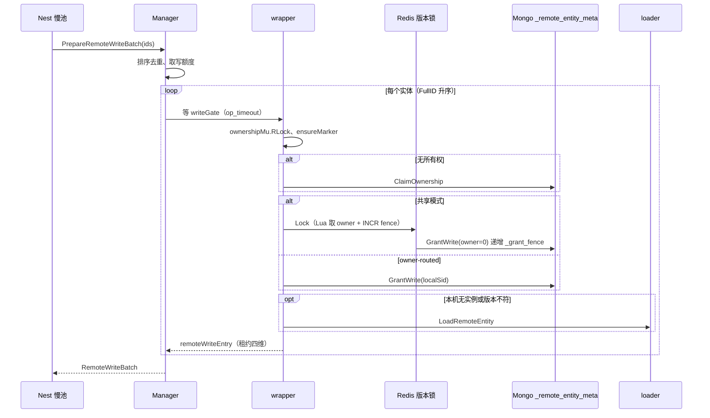
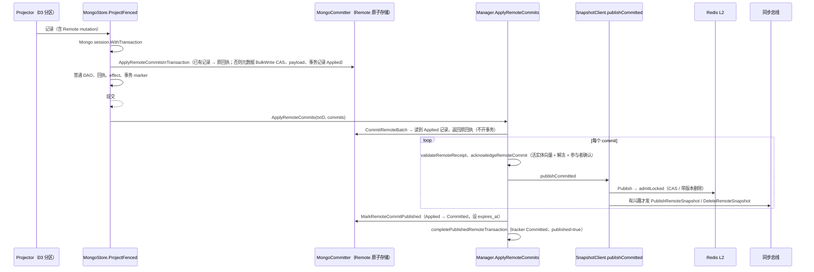
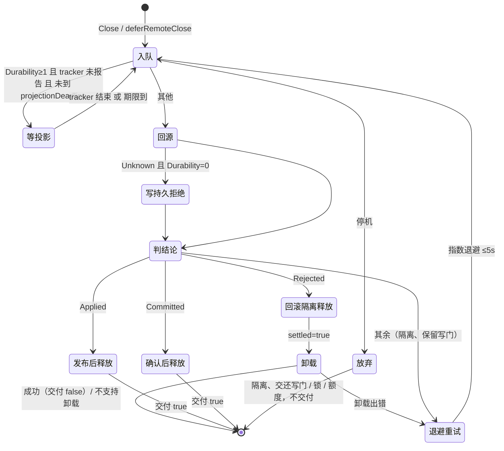
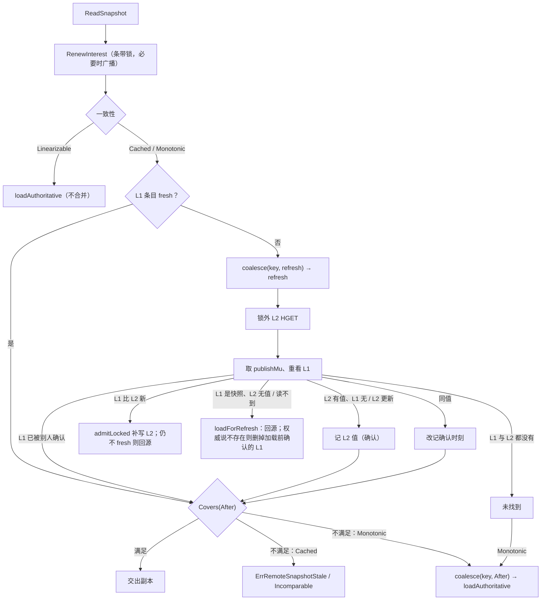

# 05 Remote Entity 与 Mirror 实现

**2026-10-08现行契约更新：** 下方按v1.23.0行号描述保留历史。当前投影只持久Applied并唤醒outbox，finalizer只等待确认与释放；`RecoverOutbox`是唯一发布协调者，页内按全部Entity依赖有界并行（`outbox_publish_workers`默认8、上限64），失败保留Applied，停止排空在途。`ApplyRemoteCommits`成功不承诺发布，需`FlushRemoteTransaction`确认。兴趣广播改为有界后台队列，不占ReadSnapshot预算。已被本轮实现取代的“投影/ finalizer直接发布”及发布阻塞疑点不再代表当前逻辑。详见[正式契约](../../../REMOTE_ENTITY.md)、[方案](../../feature/REFACTOR-2026-10-08-outbox-single-publisher.md)与[RR-47](../../bugfix/RR-20261008-47.md)。


> 本篇是框架整体文档 05 分区的**实现文档**，面向 review agent 与维护者。是什么、怎么用、配置与运维见 [说明文档](../guide/05-remote-mirror.md)。
>
> 源码基准：tag `v1.23.0`（`28912cd6`），全部 `path:line` 按这个 tag。本篇没有依赖 codebase-memory 图谱（图谱可能落后于 tag），全部结论按 tag 源码直接读取；引用的测试名都已在 tag 里核对存在。标“推断 / 未验证”的地方没有用测试或探针证实；§10.2 的“探针实测”是编写本篇时在 tag 的临时副本上跑的一次性用例，未入库。

## 速览

- 写链路：Nest 慢池 `PrepareRemoteWriteBatch`（写额度 → 按 ID 排序逐个取写门 → 所有权读锁 → 刷新 marker → 共享模式取 Redis 版本锁 → Mongo `GrantWrite` → 必要时权威加载）→ 实体锁内 `FinalizeLocked` 冻结 `RemoteCommit` 并作为 mutation 加进 WAL 记录 → 按 Durability：0 在 `Commit` 里同步 `ApplyRemoteCommits`，1 推测回执、2/3 等 tracker → 投影器在同一 Mongo 事务里 `ApplyRemoteCommitsInTransaction`，事务后 `ApplyRemoteCommits` 发布 → `Close` 释放或交给 finalizer。
- 关键保证靠四个机制：Mongo 元数据 CAS（`_ver` + 三个代际 + 许可 fence + token 非空，`MatchedCount` 必须等于实体数）；事务记录 `_id = TransactionID` + digest（幂等重放、持久拒绝裁决）；tracker 终态不可改写 + finalizer 只按持久结论释放；快照侧“新值只经 `admitLocked`、L2 先判”。
- 读链路：`SnapshotClient.ReadSnapshot` → 续租兴趣（条带锁）→ `RemoteSnapshotCache.Read`：Linearizable 直接回源；非线性读先看 L1 `fresh`，否则 `refresh`（锁外 L2 HGET、锁内重看 L1）；Monotonic 不满足时合并回源。复制消息经 `ApplyReplica`，加载在途时进首载缓冲。
- bus / nats：模块消息是 core NATS + 可选 SETNX 去重；轻量 RPC 是 request-reply；持久 RPC 是 JetStream 请求 / 响应两条流；nats 驱动以 `Client.state.closed` 为唯一已关闭判据。
- review 最该盯的：新增的等待或错误路径有没有把“未知”降级成“拒绝”或“成功”；新增的 L1 / L2 写入点是否进了封闭表；新增的 nats 导出方法是否进守卫表；§10.2 列的五条待闭环源码疑点。

本篇覆盖的包：

| 包路径 | 职责 |
| --- | --- |
| `remoteentity/` | Manager、批次、finalizer、所有权、版本锁、MongoCommitter、L2、SnapshotClient、兴趣、装配 |
| `entity/`（Remote 部分） | 协议类型、版本向量、`RemoteSnapshotCache`、只读契约 |
| `kit/remoteentity/` | 两个 Mod 与配置声明 |
| `sync/syncbus/mirror/` | `Replicator` |
| `ownerroute/` | 路由器与 bus 传输 |
| `bus/`、`nats/`、`nats/driver/`、`kit/nats/` | 服务间消息、RPC、驱动 |
| `codegen/internal/entity/`（`mirror.go`、`gen.go` 的 Remote 模板） | 只读 DTO 与 Managed 实体的生成 |

---

## 1. 包与文件地图

### 1.1 `remoteentity/`

| 文件 | 职责 |
| --- | --- |
| `doc.go` | 包说明：写权限由 Mongo majority 授予，Redis 只协调 |
| `config.go` | `Config` 与 `DefaultConfig` |
| `assemble.go` | `AssemblyDeps`、`Assemble`、`Assembly.Start / Stop`（含 O-M6-1 请求） |
| `assembly.go` | `Stats`、`Backend()`、旧的 `BindSync` |
| `manager.go` | `Manager`、wrapper 创建 / 淘汰、依赖注入与封存、release 失败 → fatal |
| `wrapper.go` | 每实体协调单元：写门、所有权锁、marker 缓存、活实体关联 |
| `batch.go` | `PrepareRemoteWriteBatch`、`beginWrite`、`remoteWriteBatch` 的 Finalize / Commit / Abort / Close |
| `transaction_manager.go` | `remoteState`、写额度、finalizer、`ApplyRemoteCommits`、`RecoverOutbox`、确认活实体、版本等待 |
| `transaction_tracking.go` | 事务 tracker：登记、终态、等待、淘汰 |
| `local_runtime.go` | 经 Nest 快池执行的本地步骤；被拒实例的卸载与重载窗口 |
| `ownership.go` | Claim / EnterShared / LeaveShared / Transfer；结果未知时按权威裁决 |
| `marker.go` | Redis marker（兼容装配用；正式装配不用） |
| `mongo_authority.go` | `WriteAuthority`、`GrantWrite`、所有权 CAS |
| `mongo_committer.go` | `MongoCommitter`：事务内 CAS、payload、快照、事务记录、outbox、持久拒绝、只读 loader |
| `mongo_payload.go` | 按集合合并的 BulkWrite |
| `commit_encoding.go` | BSON 可编码性检查（计数器 ≤ MaxInt64） |
| `backend.go` | `Backend`：loader + 存储 |
| `versioned_lock.go` / `versioned_lock_lua.go` | Redis 版本锁、fence、token 分代、O-M6-6 进程代际 |
| `snapshot_l2.go` | L2：CAS 脚本、带版本删除脚本、墓碑 WAIT |
| `snapshot_client.go` | `SnapshotClient`：读、兴趣续租、owner 发布入口、生命周期、依赖准入门 |
| `syncer.go` | 快照复制 wire、`SnapshotReplicaStore`（身份绑定、O5 过滤、缺基回填） |
| `interest.go` | 兴趣表：代际、撤销水位、溢出水位、O4 配额；`InterestReplicaStore` |
| `interest_refresh.go` | O-M6-1 续租请求 |

### 1.2 `entity/`（Remote 部分）

| 文件 | 职责 |
| --- | --- |
| `remote_protocol.go` | 错误、所有权状态机、版本向量、租约、`RemoteCommit` 与校验、提交状态、批次 / 参与者 / outbox 接口、兴趣 |
| `remote_manager.go` | `ErrRemotePersistenceIndeterminate`、loader / backend / ownership store / manager 接口 |
| `entity_remote.go` | `RemoteEntityBase`：原子版本向量与所有权状态 |
| `remote_snapshot.go` | `RemoteSnapshotCache`（L1、`admitLocked`、`refresh`、首载缓冲、合并加载） |
| `remote_snapshot_codec.go` | 增量应用注册、`RemoteChecksum` 的 BSON 编码 |
| `remote_mirror.go` | `RemoteObservation.Covers`、`RemoteSnapshotRead`、`RemoteSnapshotReadOnly`、`RemoteMirrorReader` |
| `remote_view.go` | Nest 读访问的 `RemoteReadOption` / `RemoteSnapshot` / `RemoteViewRef` |

### 1.3 其余

| 路径 | 职责 |
| --- | --- |
| `kit/remoteentity/remote_entity_mod.go` | owner Mod：读配置、`Assemble`、登记四项能力、健康、生命周期 |
| `kit/remoteentity/remote_mirror_mod.go` | 只读 Mod：只建 `SnapshotClient` |
| `kit/remoteentity/config.go` | `remote_entity.*` 声明、跨键校验、`apply` |
| `sync/syncbus/mirror/envelope.go` | `Replicator`（New / NewLive / Start / StopWithContext / Publish） |
| `ownerroute/route.go`、`ownerroute/bus.go` | `Router`、`BusTransport`、`RegisterBusHandler` |
| `bus/bus.go` | `IBus`、`Bus`：订阅、派发池、消息与 RPC、停机 |
| `bus/reliable.go`、`bus/admin.go` | 可靠存储（SETNX 收件箱、死信）与 DLQ 运维命令 |
| `bus/jetstream_rpc.go`、`bus/rpc_error.go` | 持久 RPC、响应信封、JetStream 截获识别 |
| `nats/*.go` | 接口、配置、错误、主题、`NatsMsg` |
| `nats/driver/*.go` | `Client`、`JetStreamClient`、`RPCClient`、`Assembly`、订阅句柄 |
| `kit/nats/nats_mod.go` | `NatsMod` |
| `codegen/internal/entity/mirror.go` | `//roost:mirror` 解析、校验与模板 |
| `codegen/internal/entity/gen.go:570-673` | Managed 实体的 `HasRemoteCommitLocked` / `BuildRemoteCommitLocked` / `AcknowledgeRemoteCommit` / `RollbackRemoteCommit` 模板 |

[↑ 速览](#速览) · [说明文档 §1](../guide/05-remote-mirror.md#1-定位与边界)

---

## 2. 关键类型与数据结构

### 2.1 协议

| 类型 | 位置 | 要点 |
| --- | --- | --- |
| `RemoteOwnershipState` / `ValidRemoteOwnershipTransition` | `entity/remote_protocol.go:30-88` | 八态；`fenced`、`quarantined` 只能去 `recovering` |
| `RemoteVersionVector` | `entity/remote_protocol.go:90-105` | 四维；`ValidateWrite`：两个 epoch 必须相等、fence 不能退、StateVersion 必须相等 |
| `RemoteWriteLease` | `entity/remote_protocol.go:114-135` | 准入结果；`Valid` 要求 epoch 非零、共享模式 fence 非零 |
| `RemoteTransactionOutcome` | `entity/remote_protocol.go:164-173` | `TransactionID`（= Nest 事务 ID）、`Durability`、变化源与删除意图 |
| `RemoteCommit` / `Validate` | `entity/remote_protocol.go:234-337` | `Next = Base+1`、epoch 非零、删除与 mutation 互斥、mutation 版本 = Next、快照字段与提交一致、key 不重复 |
| `RemoteCommitState` | `entity/remote_protocol.go:349-359` | Unknown / Admitted / Applied / Published / Committed / Rejected / Indeterminate |
| `IRemoteCommitParticipant` | `entity/remote_protocol.go:391-395` | Acknowledge 必须幂等且并发安全（`:386-390`） |
| `RemoteWriteBatch` / `RemoteOutcomeDeferrer` | `entity/remote_protocol.go:470-489` | Prepare 在锁外、Finalize 在锁内、Commit 在解锁后释放前 |
| `RemoteSnapshotInterest` | `entity/remote_protocol.go:509-519` | `Generation` 由发布方分配、只前进 |
| `RemoteEntityBase` 版本向量 | `entity/entity_remote.go:54-114` | 原子指针；fence 回退 → `ErrRemoteFenced`；同 fence 版本回退 → `ErrRemoteVersionConflict` |

### 2.2 写侧

| 类型 | 位置 | 要点 |
| --- | --- | --- |
| `Manager` | `remoteentity/manager.go:26-49` | wrapper 表、依赖（封存后 `Set*` panic，`:264-295`）、`snapshots *SnapshotClient`、fatal |
| `remoteEntityWrapper` | `remoteentity/wrapper.go:16-36` | `writeGate chan struct{}`（容量 1）、`ownershipMu`、`rMu` 版本锁、marker 缓存、`rejectedStale` |
| `remoteWriteEntry` / `remoteWriteBatch` | `remoteentity/batch.go:16-44` | 每实体租约与冻结提交；批次状态位 finalized / committed / aborted / indeterminate / rejected / closed |
| `remoteState` | `remoteentity/transaction_manager.go:21-54` | tracker 表 + 已结束链表、版本等待、finalizer 队列、`writeSlots`、`retryWG` / `retryMu` |
| `deferredRemoteClose` | `remoteentity/transaction_manager.go:62-78` | finalizer 收尾项：Durability、entries、`projectionDeadline`、`settled`、`onOutcome` |
| `remoteTransactionTracker` | `remoteentity/transaction_tracking.go:14-24` | `done`、`status`、`closed`、`published` |
| `WriteAuthority` / `WriteGrant` / `mongoAuthority` | `remoteentity/mongo_authority.go:16-42` | 元数据字段 `_ver _authority _owner_sid _owner_shared _owner_epoch _owner_route _grant_fence _grant_token` |
| `mongoRemoteTransaction` | `remoteentity/mongo_committer.go:54-63` | `_id`、`state`、`receipts`、`commits`、`digest`、`cause`、`expires_at`（只在已发布时设） |
| `versionedLock` | `remoteentity/versioned_lock.go:28-67` | `tokenPrefix + tokenSeq` 分代、`fence`、`grant`、续期代际 |
| `ProcessIncarnation` / `lockIncarnation` | `remoteentity/versioned_lock.go:550-587` | token 前缀 `~<sid>~<Holder 摘要>~<Token>~` |

### 2.3 读侧

| 类型 | 位置 | 要点 |
| --- | --- | --- |
| `RemoteSnapshotCache` | `entity/remote_snapshot.go:151-183` | `l1 *AtomicLocalStore`、`l2 cache.Store`、`publishMu [64]`、合并加载表、首载缓冲表 |
| `remoteSnapshotEntry` | `entity/remote_snapshot.go:215-219` | 快照或删除标记 + `confirmedAt` |
| `RemoteSnapshotReplica` / `remoteSnapshotBootstrap` | `entity/remote_snapshot.go:187-200` | 复制消息；某 key 在途加载数与缓冲 |
| `RemoteObservation` | `entity/remote_mirror.go:37-71` | `Covers` 与准入同一排序 |
| `RemoteMirrorReader[T]` | `entity/remote_mirror.go:112-156` | spec + decode；读侧核对 key / schema / codec |
| `SnapshotClient` | `remoteentity/snapshot_client.go:38-87` | 兴趣（条带锁 64）、`transport`、`push`、`work operation.Lifetime`、`stopCtx`、续租请求状态 |
| `remoteSnapshotL2Store` | `remoteentity/snapshot_l2.go:106-130` | 键前缀、TTL、墓碑 WAIT 计数 |
| `remoteInterestRegistry` | `remoteentity/interest.go:67-81` | `entries[key][sid]`、`perConsumer`、`total`、`overflow[sid]` |
| `remoteSnapshotWire` / `remoteInterestWire` / `remoteInterestRefreshWire` | `remoteentity/syncer.go:31-38`、`remoteentity/interest.go:365-368`、`remoteentity/interest_refresh.go:38-41` | 三种 wire |

### 2.4 bus / nats

| 类型 | 位置 | 要点 |
| --- | --- | --- |
| `Bus` | `bus/bus.go:69-104` | handler 表、派发池、停机两段（teardown / drain） |
| `ReliableStore` / `RedisReliableStore` | `bus/reliable.go:70-133` | SETNX `processing` → SET `done` |
| `jetStreamRPC` | `bus/jetstream_rpc.go:88-113` | pending 表、method 标签集合、请求 handler 准入 `operation.Lifetime` |
| `NatsMsg` | `nats/message.go:4-19` | 服务间 wire；`ReplySubject` / `DeadlineAt` 只给持久 RPC |
| `Client` / `natsLifecycleState` | `nats/driver/client.go:32-60` | `closed`（唯一判据）、`draining`（只影响日志级别） |
| `Assembly` | `nats/driver/assembly.go:28-36` | `closeSerial operation.Serial`；没有自己的 closed 标记 |
| `RPCClient` | `nats/driver/rpc.go:21-40` | pending 表、回调池、`callbackMu` 屏障 |

[↑ 速览](#速览) · [说明文档 §2](../guide/05-remote-mirror.md#2-核心概念与术语)

---

## 3. 主流程

### 3.1 写准入：`PrepareRemoteWriteBatch` / `beginWrite`

`remoteentity/batch.go:48-109`、`:111-329`。

1. `fctx.AssertBlockingAllowed`（只能在慢池调用）；有 fatal 直接 `ErrRemoteFenced`（`:67-69`）。
2. `ValidateRemoteWriteBatchIDs`：去重、只收 Managed kind、**按 FullID 排序**（`entity/remote_protocol.go:534-553`），全序取写门防死锁。
3. 超 `MaxWriteBatch` → `ErrRemoteOverloaded`；`reserveRemoteWriteSlot` 非阻塞取写额度（`remoteentity/transaction_manager.go:127-139`）。
4. 整批共用一个 `ownershipContext`（`op_timeout`，`remoteentity/ownership.go:294-300`）。逐实体：`getOrCreate` wrapper（容量满 → `ErrRemoteOverloaded`），`beginWrite`：
   - 在 `op_timeout` 内等写门（`:121-130`）→ `ownershipMu.RLock`；
   - `ensureMarker`：marker 缓存过期才读权威；
   - 没有所有权记录就 `ClaimOwnership`；不是本机 owner 也不是共享模式 → `ErrRemoteFenced`；
   - 共享模式：`rMu.Lock`（Redis 版本锁，TryLock 内部已对 Mongo `GrantWrite(owner=0)`），fence 为 0 或与 grant 不符即拒绝（`:164-200`）；
   - owner-routed 且有持久权威：`GrantWrite(id, newToken, localSid)`（`:214-223`）；
   - 本机实例不存在、或版本 ≠ 权威版本 → `loadEntity`（`ErrEntityRemoved` → `ErrRemoteEntityReloading`，`:224-240`）；
   - 实例处于 `recovering`：说明之前所有权 CAS 结果未知被冻结，这里权威已重读且仍指向本机，解冻（`:251-266`）；`draining / fenced / quarantined` 拒绝；
   - 写版本向量与所有权状态，返回 `remoteWriteEntry`。
5. 任何一步失败：`batch.Abort` + `batch.Close` 把已取得的写门、读锁、Redis 锁、额度还掉。



### 3.2 定稿：`FinalizeLocked`

`remoteentity/batch.go:338-410`，Nest 在实体锁内调用（`nest/msg.go:40-70`）。

1. 对每个 entry：没有本事务的变化（`HasRemoteCommitLocked`，旧参与者退回 dirty 检查）且不是删除就跳过。
2. `BuildRemoteCommitLocked(lease, outcome)`（生成代码：整文档 `MarshalPersist`、全量快照 `Full: true`，`codegen/internal/entity/gen.go:583-647`），删除意图必须与 `commit.Delete` 一致。
3. 用租约覆盖身份与四维：`Base = lease.BaseVersion`、`Next = Base+1`，快照同步改写（`:379-389`）。
4. `Validate`；`refuseServerScopedRemoteData`（`dbscope=sid` 在进 WAL 前唯一拒绝点，`:412-432`）；任一失败回滚已定稿的、返回错误（Nest 走 `rejectCommit`）。
5. `trackRemoteTransaction`（tracker 满且没有已结束的可淘汰 → 错误）。
6. Nest 把每个 commit 作为 `EntityMutation{Resource:"remote_entity", Remote:&commit}` 加进事务（`nest/msg.go:55-66`），随 WAL 记录准入；lease fence 回执与 Remote mutation 不能同记录（`dataengine/engine/projector.go:539-550`）。

### 3.3 提交：按 Durability

`remoteentity/batch.go:462-534`，Nest 在本地提交成功后、解锁后调用（`nest/msg.go:72-123`）。

| Durability | `Commit` 做什么 | 错误归类 |
| --- | --- | --- |
| 0 memory | `ApplyRemoteCommits`：`CommitRemote(Batch)` 开自己的 Mongo 事务（已存在记录则读回执，`remoteentity/mongo_committer.go:76-115`），然后发布、`MarkRemoteCommitPublished` | Fenced / VersionConflict / Rejected → tracker Rejected，同步回滚 + 隔离 + 标记重载窗口；其他 → Indeterminate |
| 1 async | 返回推测回执（`speculativeReceipts`，`:694-704`） | — |
| 2 strict、3 pipelined | `waitRemoteTransaction`：等投影器把 tracker 写成终态 | `waitedCommitError`：只有 `ErrRemoteRejected` 原样，其余加 `ErrRemotePersistenceIndeterminate`（`:544-549`） |

出错时（`:506-529`）：Durability ≥ 2 或带未知哨兵 → `indeterminate=true`，交 finalizer；Durability 0 的明确拒绝 → 同步回滚、`rejected=true`。都先 `quarantineEntries`。Nest 随后 `DeferUntilDurableOutcome` 把提交后工作交给批次（`nest/msg.go:133-167`）。

`Close`（`:628-676`）：`indeterminate`，或 async 且确有提交 → `deferRemoteClose` 交 finalizer（成功即返回）；否则同步 `releaseRemoteEntries`（逆序：Redis 锁按新版本 / 基版本 `UnlockWithRetry`、`ownershipMu.RUnlock`、出写门、wrapper 引用 -1，`remoteentity/transaction_manager.go:566-593`）、还额度；`rejected` 时卸载被拒实例并交付 `false`。

### 3.4 投影与发布



位置：`dataengine/engine/mongo_projection.go:64-161`、`remoteentity/mongo_committer.go:119-153`、`remoteentity/transaction_manager.go:601-674`、`:815-827`、`remoteentity/snapshot_client.go:389-421`。lease fence 失效被整笔跳过时，Remote 部分写持久拒绝（`RejectRemoteCommitsInTransaction`）并通知 `RejectRemoteTransaction`（`mongo_projection.go:100-108`、`:146-155`）。

`acknowledgeRemoteCommit`（`remoteentity/transaction_manager.go:996-1046`）：

- 没有 wrapper / 活实体，或活实体已在更新代际（`remoteReceiptObsolete`，`:971-979`）→ 视为完成；
- 活实体 ID 已不是这个实体（同事务删除后被清空或回收，RR-20261006-01）→ 摘掉、视为完成，照常发布墓碑（`:1005-1012`）；
- 否则设版本向量（失败时再核对 obsolete），`quarantined` 时解冻（另一方已解冻且向量相同视为成功，`:1022-1033`），调参与者 `AcknowledgeRemoteCommit`（不持实体锁）。

### 3.5 finalizer



位置：`remoteentity/transaction_manager.go:166-313`（入队、worker、处理）、`:318-336`（卸载）、`:369-425`（退避 / 等投影的计时 goroutine）、`:448-471`（持久拒绝裁决）、`:497-513`（拒绝后的回滚与隔离，经 `entity.RunLocal` 在 Nest 快池执行）、`:518-547`（Committed 对账：本进程已发布过则只做本地确认）。停机：`StopFinalizer` 在 `retryMu` 下置 `stopping` 并取消 ctx，`deferRemoteClose` 在同一把锁下判定，保证“要么入队被排空、要么调用方同步清理”二选一（`:151-186`、`:549-564`）。

### 3.6 所有权迁移

`remoteentity/ownership.go`。每个操作经 `beginOwnershipTransition`：取写门（与写准入互斥）、`ownershipMu.Lock`、刷新权威；需要时取 Redis 锁并再刷新（`:243-292`）。CAS 报错时 `settleIndeterminateOwnership`（`:172-209`）：

| 重读权威结果 | 处理 |
| --- | --- |
| 读不到 | marker 置未知、活实体冻结为 `recovering`；之后只有权威读成功的准入才解冻 |
| 与期望相同 | 证明没执行，恢复原状态 |
| 已是目标状态 | 当成功完成 |
| 仍是本机但别的租约 | 同步到权威模式并报错 |
| 别人 / 不存在 | fence |

Mongo 侧（`remoteentity/mongo_authority.go:121-160`）：按旧租约全字段过滤 `FindOneAndUpdate`，`MarkerEpoch+1`，Transfer 另 `RouteEpoch+1`，清空 `_grant_token`——旧许可立即失效（提交过滤要求 token 非空，`remoteentity/mongo_committer.go:433-435`）。

### 3.7 快照缓存：写入与读

写入（全部在 `publishMu[shard(key)]` 下）：

1. `publishLocked` 前置判断（`entity/remote_snapshot.go:906-930`）：同版本同值、已确认、有效期不更晚 → 不写；L1 已确认持有更新条目 → 不写 L2（L2 若已过期，写进去就是复活旧值）。
2. `admitLocked`（`:942-961`）：`writeShared` 调 L2（`Set` = CAS 脚本；删除 = `DeleteAtVersion`，`:964-977`），按结果：接受 → `confirmedAt = started`（权威答案取加载开始时刻）；`ErrStaleWrite` → `adoptSharedLocked`（读 L2 记下它；L2 无活值则删掉不新于被拒写的 L1 快照，`:988-1010`）；同版本异值 → 原样返回；其他 → 降级，`confirmedAt = authoritativeAt`（发布 / 复制为 0）。
3. `setL1Locked`：`AtomicLocalStore.SetWithTTL`，L1 自己的 Stale / Conflict 准入再执行一次（`:1013-1027`）。

读（`:641-829`）：



`loadAuthoritative`（`:396-437`）：取加载名额 → `beginBootstrap` → `fetchAndAdmit`（loader、核对 key、Covers、未过期、`publishLocked(…, loadStart)`）→ `endBootstrap` → 溢出且成功则再取一次 → 重放缓冲 → 读 L1 最终值再 Covers。返回的是**缓存最终持有的值**，不是权威原始答案（RR-20261005-NC-36）。

### 3.8 首载缓冲

`entity/remote_snapshot.go:480-578`。`ApplyReplica`：key 处于在途加载（`bootstraps[key].loads > 0`）时进缓冲；满了清空并标 `overflowed`，之后到达的也丢；最后一个加载结束时取走缓冲，按到达顺序经 `applyReplica`（→ `ApplyUpdate` / `DeleteAtVersion` / `Delete`）重放，失败只计数。复制侧缺基 / 换代 / schema 不符时 `SnapshotReplicaStore` 自己回源一次（`remoteentity/syncer.go:137-141`），这次回源本身也是一次首载。

### 3.9 兴趣

`remoteentity/snapshot_client.go:249-383`、`remoteentity/interest.go`。

- `renewInterest(key, refresh)`：取 `localInterestLocks[EntityID % 64]`（读路径每次都取）→ 在锁内分配代际 → 本机表“剩余 > TTL/2”就返回（refresh 时只续本机仍有效的 key）→ 本机表容量 → 本机兴趣表按同一配额 `renew` → `publishInterest`（经 `work` 准入）→ 失败回滚本机表并 `drop`。
- `ReleaseInterest`：同一条带锁内分配代际、删本机表、`interests.release` 留撤销水位、广播。
- `renewIfNeeded`（`remoteentity/interest.go:159-214`）：旧代际的 renew 不动现有租约；撤销水位或溢出水位之后、不新于它的 renew 忽略；新租约先按 consumer 配额、再按每节点总上限，拒绝时计数并限频日志。
- `release`（`:281-307`）：比现有租约旧的不动；发布与接收入口拒绝代际 0 和不完整身份；表满放不下水位 → `fenceOverflowLocked`（每 consumer 一个，到期 = 最后一次 release + TTL，位图 256 位）。
- 空 payload 的 Delete 也明确拒绝；当前 renew/release 都用携带完整身份的 Upsert。
- 广播是同步总线上的普通订阅（不需要可确认）；owner 侧 `ApplyReplica` 拒绝时返回错误，JetStream 上结算为 Ack（实测 `TestRealJetStreamInterestHandlerErrorIsAcknowledged`，`remoteentity/interest_handler_error_jetstream_integration_test.go:35`）。
- 同步总线不把自己发的消息投回自己（`sync/syncbus/driver/jetstream.go:256`），consumer 自己的续租只经本地 `renew` 进本机表。

### 3.10 O-M6-1 续租请求

`remoteentity/interest_refresh.go`。owner `Assembly.Start` 在订阅之后、存储初始化之前调 `requestInterestRefresh`（推送开着才发，`:49-75`）。接收方（推送开着才订阅，`remoteentity/snapshot_client.go:436-439`、`:482-488`）：核对 Key / Version 与 payload 绑定；丢弃自己的、发出超过一个兴趣 TTL 的；否则 `acceptInterestRefresh`：已有遍历在跑只置待办，否则在 `work` 准入下开 goroutine（`:116-131`）。遍历两次开始间隔 ≥ 1s，每个 key 用 `stopCtx` 派生、`snapshot_load_timeout` 限时的 ctx 调 `renewInterest(refresh=true)`（`:185-215`）。

### 3.11 O-M6-6 锁接管

`RemoteEntityMod.Provide` 在单实例锁身份的 sid 等于本 Mod sid 时传 `Incarnation`（`kit/remoteentity/remote_entity_mod.go:119-124`）；`Assemble` 校验后挂到锁工厂（`remoteentity/assemble.go:112-119`）。token = `~<sid>~<Holder SHA-256 前 8 字节十六进制>~<Token>~<随机串>.<序号>`。取锁 Lua（`remoteentity/versioned_lock_lua.go:16-44`）：owner 不存在、是本锁对象更早一代、或“带同一 scope 但不带本代 self 前缀” → INCR fence、换 owner、返回第 4 项 1 表示接管；随后照常 `GrantWrite(owner=0)`，Mongo fence 换代，上一代的许可全部失效。

### 3.12 Assembly 生命周期

见说明文档 §6.1。要点：`acquireLifecycle` 用一个 `operationDone` channel 串行 Start / Stop，等待受调用方 ctx 约束（`remoteentity/assemble.go:240-266`）；Start 失败时 `snapshots.unsubscribe()` 只发起退订、不等（留给之后的 Stop），`started` 不置位，可重试（`:166-175`）；`stopping` 一旦置位，Start 返回 `ErrAssemblyStopped`。

### 3.13 bus 消息派发与可靠消费

`bus/bus.go:729-898`、`bus/reliable.go:117-164`。`onMessage` 解码 → 按 `ToModule` 哈希派发到池（满 / 未运行 → 消息进死信、RPC 立即回拒绝信封，`:780-833`）→ `dispatchMsg`：查 handler（无 → 死信）→ `beginConsume`（SETNX，2s；出错 → 死信、不执行；已存在 → 计重复、跳过）→ handler（panic → 死信）→ `finishConsume`（SET done；出错 → 死信）。`encodeMsg` 只在可靠开着时给消息带 MsgID（`:708-727`）。

### 3.14 JetStream 持久 RPC

- 启用：确保请求流（`<prefix>.rpc.>`）与响应流（`<prefix>.rpc_resp.>`），订阅本 sid 的响应 durable（DeliverAll）（`bus/jetstream_rpc.go:119-200`）。
- `HandleRpc`：每个方法两个 durable（服务级共享、实例级），DeliverAll、AckExplicit（`:202-246`）。
- 调用（`:320-383`）：无截止时加 `call_timeout`；请求带 `ReplySubject`、`DeadlineAt` = 调用方截止；`MsgID = reqID` 去重发布；等响应或截止。
- 服务（`:430-548`）：准入（停机后 → 交还 broker）→ 解码 → 无回复主题（被截获的轻量调用）不执行 → 过期不执行 → 无 handler 回拒绝信封 → 执行（期限 = `DeadlineAt`）→ 停机打断返回错误让 broker 重投 → 回复（期限 = 调用方截止，与 Bus 生命周期脱钩）。
- 停机：先关请求准入并停请求消费者，再退订 core、排空池与在途 handler，最后停响应消费者并以 `ErrCancelled` 结束在途调用（`bus/bus.go:420-446`、`bus/jetstream_rpc.go:257-318`）。

### 3.15 nats 驱动的已关闭判据

`nats/driver/client.go`：`admit()`（`:82-90`）是每个导出方法入口；过了入口在 nats.go 里失败时 `wrapError`（`:247-261`）先看 `state.closed`；`Close` 先置位再关连接（`:228-236`）；`DrainWithContext` 正常结束时自己置位，超时硬关并返回 ctx 错误（`:196-223`）。`Assembly.Close`（`nats/driver/assembly.go:77-105`）：串行 → 停 RPC（等回调，超时保留所有权）→ 已关闭则 nil → 排空，失败硬关并报一次 `ErrClosedUndrained`。

[↑ 速览](#速览) · [说明文档 §4](../guide/05-remote-mirror.md#4-怎么用)

---

## 4. 不变量清单

| # | 内容 | 强制位置 | 守卫测试 |
| --- | --- | --- | --- |
| R1 | 正式装配必须有原子事务存储与持久写权威；锁工厂必须产出带 fence 的锁 | `remoteentity/assemble.go:93-107`、`remoteentity/manager.go:114-122` | `TestAssembleRefusesEachMissingDependency`（`remoteentity/assemble_admission_promises_test.go:35`）、`TestAssemblyRefusesMissingDurableAuthority`（`:165`） |
| R2 | 依赖在 Start 后封存，运行期不能替换 | `remoteentity/manager.go:264-295`、`remoteentity/assemble.go:183` | 无专门守卫（源码核对：测试里没有 `SealDependencies` / `dependencies are sealed` 的断言；`Set*` 封存后 panic） |
| R3 | 写门全序获取（FullID 升序），一个实体同时只有一个写批次 | `entity/remote_protocol.go:534-553`、`remoteentity/batch.go:124-130` | `TestRemoteWriteBatchRefusesStepsOutOfOrder`（`remoteentity/promises_test.go:32`） |
| R4 | 准入等待受 `op_timeout` 约束（含排队等写门） | `remoteentity/batch.go:87-89`、`:121-130` | `TestAQueuedWriterIsBoundedByTheOperationBudget`（`remoteentity/write_budget_promises_test.go:19`）、`TestACallerDeadlineShorterThanTheBudgetStillWins`（`:104`） |
| R5 | 写额度非阻塞、从 Prepare 持有到真正释放（含后台收尾） | `remoteentity/transaction_manager.go:95-139` | `TestRemoteWriteBudgetIsIndependentAndNonBlocking`（`remoteentity/write_budget_test.go:13`） |
| R6 | `RemoteCommit` 结构合法：`Next=Base+1`、epoch 非零、删除与 mutation 互斥、身份一致 | `entity/remote_protocol.go:267-337` | `TestRemoteCommitValidateRefusesEachBrokenField`（`entity/remote_commit_promises_test.go:39`）、`TestRemoteCommitRejectsMutationVersionDrift`（`entity/remote_snapshot_test.go:234`） |
| R7 | 不可编码（计数器 > MaxInt64）的提交在进 WAL 前拒绝 | `remoteentity/commit_encoding.go:26-65`、`remoteentity/mongo_committer.go:186` | `TestACommitWhoseCountersCannotBeEncodedIsRefusedUpFront`（`remoteentity/snapshot_encoding_promises_test.go:100`） |
| R8 | `dbscope=sid` 的 Remote 数据在进 WAL 前拒绝，且只在这里拒绝（不在投影 / 重放拒绝） | `remoteentity/batch.go:395-399`、`:412-432` | `TestFinalizeLockedRejectsServerScopedRemoteData`（`remoteentity/finalize_dao_scope_promises_test.go:33`） |
| R9 | Mongo 提交校验当前许可：`_ver=Base`、三个代际、`_grant_token ≠ ""`，`MatchedCount = 实体数` | `remoteentity/mongo_committer.go:414-438` | `TestMongoCommitterCASIdempotencySnapshotAndOutbox`（`remoteentity/mongo_committer_test.go:26`） |
| R10 | 同 TxID 重放返回原回执，内容不同拒绝；拒绝记录与迟到提交由 `_id` 唯一索引裁决 | `remoteentity/mongo_committer.go:89-93`、`:155-167`、`:480-507` | `TestMemoryNeverCommittedTransientErrorGetsDurableRejection`（`remoteentity/memory_unresolved_rejection_test.go:111`）、`TestMemoryLateCommitBeatsFinalizerRejection`（`:162`）、`TestMongoRejectUnresolvedDefersToExistingTransaction`（`:268`）、`TestRealMongoRejectionWaitsForInFlightCommitThenReportsApplied`（`remoteentity/unresolved_rejection_race_integration_test.go:278`，integration） |
| R11 | 未发布（Applied）事务记录不过期；启动先补发 | `remoteentity/mongo_committer.go:142`、`:224-237`、`:311-327`、`remoteentity/assemble.go:192-197` | `TestMongoCommitterCASIdempotencySnapshotAndOutbox`（`remoteentity/mongo_committer_test.go:26`：发布前无 `expires_at`、发布后才有）、`TestRemoteFinalizerReplaysAppliedOutboxWithoutRestart`（`remoteentity/batch_test.go:673`） |
| R12 | tracker 终态（Committed / Rejected）不可改写；Indeterminate 唤醒等待者但可被覆盖 | `remoteentity/transaction_tracking.go:95-139` | `TestCommittedTrackerSurvivesFailedReplayPublication`（`remoteentity/replay_outcome_test.go:204`） |
| R13 | 等待者持有 tracker 指针，淘汰不影响已接受的等待 | `remoteentity/transaction_tracking.go:33-48`、`:154-184` | `TestTransactionWaitReturnsTheTerminalStatusAfterEviction`（`remoteentity/transaction_wait_eviction_promises_test.go:39`） |
| R14 | strict / pipelined 的 Commit 错误：只有明确拒绝不带未知哨兵 | `remoteentity/batch.go:544-549`、`remoteentity/transaction_tracking.go:186-197` | `TestPipelinedRemoteOutcomeMatchesStrict`（`remoteentity/pipelined_remote_outcome_promises_test.go:28`）、`reply_sentinel_table_test.go` |
| R15 | 写门 / 锁 / 额度只在持久结论之后释放；停机排空时也释放但实体保持隔离 | `remoteentity/transaction_manager.go:231-313` | `TestDeferredCloseAcceptedBeforeTheStopIsStillDrained`（`remoteentity/finalizer_stop_handoff_promises_test.go:51`） |
| R16 | finalizer 停止后不再接受收尾项，调用方同步清理（二选一） | `remoteentity/transaction_manager.go:166-186`、`:549-564` | `TestDeferredCloseIsRefusedOnceTheFinalizerHasStopped`（`:19`） |
| R17 | 持久拒绝后回滚在 Nest 快池执行，实体隔离到卸载重载 | `remoteentity/transaction_manager.go:497-513`、`remoteentity/local_runtime.go:54-120` | `TestFinalizerRejectionRollbackRunsOnNestFastWorker`（`remoteentity/finalizer_rollback_fast_pool_promises_test.go:26`）、`rejected_memory_reload_test.go` |
| R18 | 提交后工作至多一次、只经快池；快池拒绝时不执行 | `remoteentity/transaction_manager.go:347-366` | `deferred_outcome_callback_test.go`、`deferred_outcome_nest_test.go` |
| R19 | 活实体版本向量：fence 不退、同 fence 版本不退；过期回执视为完成 | `entity/entity_remote.go:54-114`、`remoteentity/transaction_manager.go:971-1046` | `TestSetRemoteVersionVectorRejectsSameFenceRegression`（`entity/remote_version_vector_promises_test.go:10`）、`TestSameFenceReplayCannotRewindStateVersion`（`remoteentity/same_fence_version_regression_promises_test.go:21`） |
| R20 | 删除提交的确认遇到已清空的实例时视为完成并发布墓碑 | `remoteentity/transaction_manager.go:1005-1012` | `TestRemoteDeleteCommitPublishesItsTombstoneAfterTheInstanceIsCleared`（`remoteentity/remote_delete_ack_promises_test.go:57`） |
| R21 | 所有权 CAS 结果未知按权威裁决；读不到则冻结 `recovering` | `remoteentity/ownership.go:172-209` | `TestEnterSharedPromiseLostReplyFreezesUntilAuthorityAnswers`（`remoteentity/ownership_mode_indeterminate_promises_test.go:104`）、`TestTransferPromiseLostReplyFencesOldOwnerWhenAuthorityConfirmsTransfer`（`remoteentity/ownership_transfer_indeterminate_promises_test.go:78`） |
| R22 | 版本锁：本锁对象更早一代的 owner 可取回；迟到的旧代脚本挤不掉新代 | `remoteentity/versioned_lock_lua.go:17-27` | `TestVersionedLockReacquiresAfterAcquireReplyLost`（`remoteentity/versioned_lock_acquire_unknown_promises_test.go:125`）、`TestVersionedLockLateAcquireScriptCannotTakeNewGeneration`（`:229`） |
| R23 | O-M6-6 只接管同一单实例锁持有者的上一代 | `remoteentity/versioned_lock_lua.go:24-26`、`remoteentity/versioned_lock.go:568-587` | `TestLockTakeoverOnlyAppliesToThePreviousIncarnationOfTheSameSingletonHolder`（`remoteentity/lock_takeover_promises_test.go:218`）、`TestAssembleRejectsAMalformedIncarnation`（`:268`） |
| S1 | 一个 key 的全部 L1 写入在它的 `publishMu` 下；直接写 L1 / L2 只在封闭表里的函数 | `entity/remote_snapshot.go:166`、写入点表见守卫 | `TestRemoteSnapshotCacheWritesStayInTheListedFunctions`（`entity/remote_snapshot_write_guard_test.go:41`，表在 `:26-34`） |
| S2 | 新值先 L2 判定再写 L1；L2 不可用时降级为未确认 | `entity/remote_snapshot.go:942-961` | `TestB2EntryWrittenDuringL2OutageIsNotServedUnconfirmed`（`remoteentity/snapshot_l2_watermark_promises_test.go:112`）、`TestB2ConcurrentWritersAndReconfirmingReadersConvergeOnL2`（`:293`） |
| S3 | 非线性读只交出 `fresh` 的条目；确认不了返回错误 | `entity/remote_snapshot.go:333-336`、`:689-699`、`:724-829` | `TestB2CachedReadPastMaxStalenessReconfirmsAgainstL2`（`:84`） |
| S4 | L1 与 L2 同一排序规则；同版本异值是一致性错误 | `entity/remote_snapshot.go:592-631`、`remoteentity/snapshot_l2.go:43-72` | `TestL2RejectsSameVersionWithADifferentSchemaOrCodec`（`remoteentity/snapshot_l2_cas_promises_test.go:29`）、`TestL2ComparesVersionsExactlyBeyondFloatPrecision`（`:84`） |
| S5 | 带版本删除在 L2 留墓碑，墓碑只升不降，挡住不新于它的写 | `remoteentity/snapshot_l2.go:43-47`、`:88-101` | `TestDeleteWatermarkHoldsInL2AgainstAnInflightLoadOnAnotherNode`（`remoteentity/snapshot_l2_tombstone_promises_test.go:23`）、`TestRemoteSnapshotL2DeleteAtVersionKeepsNewerSnapshot`（`remoteentity/snapshot_l2_delete_promises_test.go:18`） |
| S6 | 墓碑 WAIT 只观察、从不让删除失败 | `remoteentity/snapshot_l2.go:324-351` | `TestSnapshotL2TombstoneWaitIsObservedButNeverFailsTheDelete`（`remoteentity/snapshot_l2_tombstone_wait_promises_test.go:56`）、`TestMirrorLocalTombstoneSurvivesAFailoverOnlyWithWait`（`remoteentity/snapshot_l2_tombstone_wait_integration_test.go:144`） |
| S7 | 读出口共享后置条件：key、未过期、Covers；加载结果按缓存最终值返回 | `entity/remote_snapshot.go:396-437`、`:641-685` | `TestRemoteSnapshotReadExitsShareOnePostCondition`（`entity/remote_mirror_promises_test.go:183`） |
| S8 | Cached 未命中不回源；Monotonic 未命中只回源一次；Linearizable 每次回源 | `entity/remote_snapshot.go:663-684` | `TestRemoteSnapshotCachedMissDoesNotLoadAuthority`（`entity/remote_snapshot_test.go:144`）、`TestReadRemoteSnapshotMonotonicMissLoadsAuthorityOnce`（`remoteentity/snapshot_read_exit_promises_test.go:53`）、`TestRemoteSnapshotLinearizableAlwaysLoadsAuthority`（`entity/remote_snapshot_test.go:116`） |
| S9 | 复制消息的三层身份（envelope、wire、update）绑定 | `remoteentity/syncer.go:167-185`、`sync/syncbus/mirror/envelope.go:89-125` | `TestApplyReplicaRefusesPayloadIdentityThatContradictsTheEnvelope`（`remoteentity/snapshot_payload_identity_promises_test.go:20`） |
| S10 | 过老复制快照不准入（删除不过滤） | `remoteentity/syncer.go:113-134` | `TestB2HistoricReplicaPastL2MemoryIsNotAdmitted`（`remoteentity/snapshot_l2_watermark_promises_test.go:255`）、`TestRealJetStreamReplayAfterL2ExpiryDoesNotResurrect`（`remoteentity/snapshot_replay_jetstream_integration_test.go:33`） |
| S11 | 加载在途时复制消息进缓冲、加载后按序重放；溢出整体回源 | `entity/remote_snapshot.go:396-578` | `TestSnapshotBootstrapReplayMatrix`（`remoteentity/mirror_step4_promises_test.go:226`）、`TestSnapshotBootstrapOverflowDropsTheBufferAndReloads`（`:292`） |
| M1 | 只读客户端没有写 / 提交 / 发布 / 所有权能力；Linearizable 只在声明时开放 | `remoteentity/snapshot_client.go:89-132`、`:186-188` | `TestSnapshotClientHasNoWriteCapability`（`remoteentity/snapshot_client_promises_test.go:101`）、`TestSnapshotClientLinearizableNeedsADeclaredLoader`（`:195`） |
| M2 | 推送只在可确认订阅上开；否则不订阅快照主题 | `remoteentity/snapshot_client.go:467-500` | `TestSnapshotClientWithoutConfirmedSubscriptionsReadsOnDemand`（`remoteentity/mirror_step4_promises_test.go:395`） |
| M3 | 三步停机：停后读返回 `ErrSnapshotClientStopped`，返回 nil 后不再碰依赖 | `remoteentity/snapshot_client.go:524-614` | `TestSnapshotClientStopContract`（`:267`）、`TestSnapshotClientStopCancelsLoads`（`:315`）、`TestRemoteAssemblyStopContract`（`remoteentity/stop_contract_test.go:16`） |
| M4 | 同进程只有一个快照客户端 | `kit/remoteentity/remote_entity_mod.go:138`、`kit/remoteentity/remote_mirror_mod.go:147` | `TestRemoteMirrorModRefusesASecondClientBesideTheOwner`（`kit/remoteentity/remote_mirror_mod_promises_test.go:125`） |
| M5 | DTO 读解码字节副本；读侧核对身份与 schema / codec | `entity/remote_mirror.go:135-156` | `TestRemoteMirrorReaderDTOMutationDoesNotPolluteCache`（`entity/remote_mirror_promises_test.go:72`）、`TestRemoteMirrorReaderRejectsForeignIdentityAndSchema`（`:142`） |
| M6 | `//roost:mirror` 只生成只读产物；`remote=mirror` 报迁移错误 | `codegen/internal/entity/mirror.go:53-184`、`codegen/internal/entity/parse.go:316-322` | `TestMirrorDTOGeneratesReadOnlyView`（`codegen/internal/entity/mirror_promises_test.go:37`）、`TestRemoteMirrorEntityMarkerIsAMigrationError`（`:16`） |
| I1 | 同一 key 的 renew / release 代际在条带锁内分配 | `remoteentity/snapshot_client.go:263-270`、`:316-319` | `TestInterestRenewReleaseConvergesInEveryDeliveryOrder`（`remoteentity/mirror_step4_promises_test.go:114`） |
| I2 | release 之后迟到的旧 renew 不复活租约（表满时由溢出水位兜住） | `remoteentity/interest.go:174-198`、`:281-307` | `TestInterestReleaseOnAFullRegistryStillFencesTheLateRenewal`（`remoteentity/interest_release_full_promises_test.go:16`）、`TestInterestOverflowFenceExpiresOneTTLAfterTheLastRelease`（`remoteentity/interest_overflow_expiry_promises_test.go:35`） |
| I3 | 配额按 consumer；拒绝可识别、可计数 | `remoteentity/interest.go:199-226` | `TestInterestCapacityIsPerConsumer`（`remoteentity/mirror_step4_promises_test.go:171`）、`TestInterestQuotaRefusalIsVisibleAndReadsGoOnDemand`（`:340`） |
| I4 | 代际种子高于本进程已发出的任何代际 | `remoteentity/transaction_manager.go:764-799` | `TestInterestGenerationSeedAdvancesPastIssuedGenerationsUnderAFrozenClock`（`remoteentity/interest_generation_seed_promises_test.go:15`） |
| I5 | O-M6-1 只续本机仍有效的 key；请求合并、可校验、停机可取消 | `remoteentity/interest_refresh.go:81-215` | `TestInterestRefreshRenewsOnlyLiveInterests`（`remoteentity/interest_refresh_promises_test.go:155`）、`TestInterestRefreshRequestsCoalesceAndAreValidated`（`:215`）、`TestInterestRefreshGapWaitEndsOnStop`（`:297`） |
| B1 | 可靠消费：同一 MsgID 对同一消费者至多执行一次（InboxTTL 内） | `bus/reliable.go:117-126`、`bus/bus.go:992-1018` | `TestReliableBroadcastDedupIsPerConsumer`（`bus/reliable_test.go:15`） |
| B2 | 死信重投 ID 稳定（发布成功、删除失败时重试不绕过去重） | `bus/reliable.go:292-303` | `TestDeadLetterRequeueIDIsStableAndDistinct`（`bus/promises_test.go:149`）、`TestBusDeadLetterRequeueUsesStableIDWhenDeleteFails`（`bus/reliable_test.go:131`） |
| B3 | 未准入的 RPC 立即回拒绝信封，不进死信 | `bus/bus.go:810-833` | `TestRefusedRPCIsAnsweredAtOnceWhenTheDispatcherIsNotRunning`（`bus/rpc_admission_promises_test.go:37`） |
| B4 | 没有回复主题的 JetStream 请求不执行；过期请求不执行 | `bus/jetstream_rpc.go:455-475` | `TestJetStreamRPCRequestWithoutReplySubjectIsNotExecuted`（`bus/jetstream_capture_promises_test.go:20`）、`TestJetStreamRPCDropsExpiredRequestWithoutCallingHandler`（`bus/jetstream_rpc_test.go:271`） |
| B5 | 停机：在途 JetStream handler 完成并送出响应；停机后的投递不执行、交还 broker | `bus/jetstream_rpc.go:257-318`、`:430-437` | `TestJetStreamStopWaitsForInFlightHandlerAndDeliversItsResponse`（`bus/jetstream_stop_promises_test.go:75`）、`TestJetStreamDeliveryAfterStopDoesNotRunBusiness`（`:147`） |
| B6 | RPC method 标签基数有界（被调方 = 注册数 + 1，调用方 ≤ 257） | `bus/jetstream_rpc.go:448-454`、`:685-716` | `TestCallerRPCMethodLabelsAreBounded`（`bus/rpc_method_label_bound_promises_test.go:35`）、`TestServedRPCMethodLabelsAreTheRegisteredMethods`（`:79`） |
| B7 | Bus 不可重启；停止超预算保留排空，下次继续等 | `bus/bus.go:266-273`、`:334-413` | `TestBusRejectsRestartAfterStop`（`bus/bus_lifecycle_test.go:110`）、`TestBusStopRetryWaitsForTheRetainedDrain`（`bus/stop_retry_promises_test.go:59`） |
| N1 | Close 之后每个导出方法返回 `fnats.ErrClosed`；与 Close 并发的调用要么先完成、要么 `ErrClosed` | `nats/driver/client.go:82-90`、`:247-261` | `TestEveryExportedDriverMethodHasAClosedStateCheck`（`nats/driver/closed_state_guard_promises_test.go:194`）、`TestCallsRacingCloseEitherCompleteOrReportErrClosed`（`:384`）、`TestRealNatsEveryExportedMethodAnswersFromTheDriverStateAfterAnUndrainedClose`（`nats/driver/closed_state_guard_real_promises_test.go:21`） |
| N2 | 重复 Close 返回 nil，`ErrClosedUndrained` 只报一次 | `nats/driver/assembly.go:77-105` | `TestAssemblyTerminalCloseErrorIsReportedOnce`（`nats/driver/close_contract_promises_test.go:36`）、`TestAssemblyConcurrentCloseReportsTheTerminalErrorOnce`（`:49`） |
| N3 | CallAsync 回调恰好一次 | `nats/driver/rpc.go:338-380` | `TestRpcClientPendingHasSingleTerminalWinner`（`nats/driver/rpc_test.go:125`） |
| N4 | 轻量 RPC 缺省不重试 | `nats/rpc.go:35-42` | `TestDefaultRetryPolicyDoesNotRetryNonIdempotentRPC`（`nats/rpc_test.go:5`） |
| O1 | ownerroute：非法键、无 owner、缺部件明确报错 | `ownerroute/route.go:38-72` | `TestRouterRefusesInvalidKeysAndOwnerlessRoutes`（`ownerroute/promises_test.go:12`）、`TestTransportAndRouterRefuseMissingParts`（`ownerroute/guards_promises_test.go:11`） |

[↑ 速览](#速览) · [说明文档 §7](../guide/05-remote-mirror.md#7-保证与不保证)

---

## 5. 并发

### 5.1 goroutine 归属

| goroutine | 谁起 | 谁停 / 等 |
| --- | --- | --- |
| finalizer 调度器 + N 个 worker | `StartFinalizer`（`remoteentity/transaction_manager.go:116-125`，`finalizeOnce`） | `StopFinalizer`：取消 ctx，等 `finalizeDone`（worker 退出 → 等 `retryWG` → 最终排空） |
| 退避 / 等投影计时 goroutine | `scheduleDeferredRetry`、`awaitRemoteProjection`（登记 `retryWG`） | 同上；停机时就地 `abandon` |
| 版本锁异步续期 | `startAsyncTouchLocked`（按 token 代际） | 新代际取消旧的；`Close` 等 `touchWg` |
| 复制 handler | 同步总线投递（`Subscription.Deliver`） | `Replicator.StopWithContext` → `Subscription.Unsubscribe(ctx)` 排空（04 分区） |
| O-M6-1 续租遍历 | `acceptInterestRefresh`（持有一次 `work` 准入） | `Stop` 取消 `stopCtx`，`work.Wait(ctx)` |
| bus 派发池 | `Bus.Start` | `StopWithContext` 排空，可多次等待 |
| JetStream RPC 请求 handler | nats.go consume 回调（不在 bus 池里） | `jsRPC.handlers`（`operation.Lifetime`）：先关准入再等 |
| `callJetStreamRPCAsync` | 每次调用一个 goroutine（`bus/jetstream_rpc.go:385-392`） | 自己的 `call_timeout` |
| RPC 回调池与停机任务 | `NewRPCClient`、`StopWithContext` 的 `drainCallbacks` | `stopDone` |

### 5.2 锁与锁序

写侧（同一实体，外 → 内）：`writeGate`（channel）→ `ownershipMu`（写准入 RLock，所有权迁移 Lock）→ Redis 版本锁 → 实体 Mutex（Nest Guard / `RunLocal`）。多实体按 FullID 升序取写门。`Manager.mu` 只保护 wrapper 表，不在持有它时做 I/O（创建 wrapper 时用 `creating` 表单飞，`remoteentity/manager.go:171-217`）。`remoteState.txMu` 只保护 tracker；`retryMu` 只与 `stopping` 配合；`versionMu` 保护版本等待。

读侧：`publishMu[shard]` 内会调 L2（受 `loadTimeout` 限时），不调 loader；`refresh` 的 L2 读在锁外；`bootMu`、`loadMu`、`waitMu` 内不做 I/O；AtomicLocal 分片锁在 `publishMu` 之内。`SnapshotClient.localInterestLocks[64]` → `localInterestMu` → 兴趣表 `mu`；**条带锁内会做总线发布**（见 §10.2 疑点 1）。`SnapshotClient.mu` 只保护生命周期字段，不在持有它时等待。

bus：`lifeMu` 内不排空（Start 失败的清理与 Stop 都把排空放到锁外，`bus/bus.go:248-261`、`:334-372`）；`mu` 只保护 handler 表。RPC 客户端：`callbackMu` 冻结 pending 准入与终结计数，停机任务用一次空临界区作屏障（`nats/driver/rpc.go:322-332`）。

### 5.3 快池禁止阻塞

`PrepareRemoteWriteBatch`、`Commit`、`Close`、`waitRemoteTransaction`、`FlushRemoteAll` 都先 `fctx.AssertBlockingAllowed`；需要实体锁的步骤（回滚、卸载、提交后工作）经 `entity.RunLocal` / Nest `RunLocal` 回到快池（`remoteentity/local_runtime.go:13-46`），不在 finalizer goroutine 上就地跑业务回调。

[↑ 速览](#速览)

---

## 6. 失败与不确定结果处理

### 6.1 写侧

| 情形 | 处理 | 对调用方 |
| --- | --- | --- |
| 准入任一步失败 | Abort + Close 释放已取得的资源 | 原错误（Fenced / Overloaded / OwnerTransition / Reloading / ctx） |
| 定稿失败 | 回滚已定稿的提交 | `nest.ErrCommitRejected` 链上带原因 |
| WAL 准入结果未知（03 分区） | Nest fence；批次 `Indeterminate`，Close 交 finalizer | `ErrCommitIndeterminate` |
| memory 的 Mongo 提交被版本 / fence 明确拒绝 | tracker Rejected、同步回滚、隔离、Close 后卸载 | `ErrRemotePartRejected`（本地已提交时） |
| memory 的 Mongo 提交传输错误 | tracker Indeterminate；finalizer 回源，Unknown 时写持久拒绝裁决 | `ErrRemotePersistenceIndeterminate` |
| strict 等待截止 / tracker 重新登记失败 | 交 finalizer | `ErrRemotePersistenceIndeterminate`（+ `ErrRemoteCommitTimeout`） |
| 投影器 Mongo 事务成功、发布失败 | tracker Indeterminate；投影器退避重试同一记录；finalizer 可能抢先回源发布 | 已回复的不变；见 §10.2 疑点 2 |
| 释放 Redis 锁失败 | `recordReleaseFailure`：第一次触发 `OnFatal`（kit 接 `RuntimeFailure`），之后写准入一律 `ErrRemoteFenced` | 进程 fail-stop |
| 所有权 CAS 未知 | §3.6 | 视裁决 |

### 6.2 读侧

见说明文档 §7.1 第 6 条与 B2 实现记录；要点：L2 断网降级为未确认、读时再确认；权威与 L2 都失败时返回错误不交旧值；同版本异值返回 `ErrRemoteVersionConflict`。复制消息 handler 返回错误时，同步总线按 04 分区的结算规则处理（兴趣 handler 的错误在 JetStream 上被 Ack）。

### 6.3 bus / nats

| 情形 | 处理 |
| --- | --- |
| 派发池满 / 未运行 | 消息进死信；RPC 立即回 `errRPCNotAdmitted` 信封 |
| 可靠存储 SETNX 出错（含回复丢失） | 不执行、进死信；原 ID 可能已被占，重投用新 ID |
| handler panic | 消息进死信；RPC 回错误信封 |
| JetStream handler 出错 | 回错误信封并 Ack（业务错误不是重投理由）；被停机打断则返回错误 → NAK |
| 结算（ack / nak）失败 | 计 `nats.jetstream.settle_failures.total` 并 Warn，broker 按 AckWait 重投 |
| 连接被 nats.go 自己关闭（放弃重连） | 驱动未置位；错误映射为 `ErrClosed`，`Assembly.Close` 报一次 `ErrClosedUndrained` |

[↑ 速览](#速览) · [说明文档 §6](../guide/05-remote-mirror.md#6-运行与运维)

---

## 7. 持久化 / 协议格式

### 7.1 Mongo（库 `remote_entity.mongo.database`）

| 集合 | 文档 | 写入方 |
| --- | --- | --- |
| `_remote_entity_meta` | `_id`、`_ver`、`_authority=true`、`_owner_sid`、`_owner_shared`、`_owner_epoch`、`_owner_route`、`_grant_fence`、`_grant_token`；提交时另写 `_marker_epoch`、`_route_epoch`、`_lock_fence`、`_deleted` | 认领、许可、所有权 CAS、提交（`remoteentity/mongo_authority.go`、`mongo_committer.go:414-438`）；存在 `_authority≠true` 的文档时拒绝启动（`:216-222`） |
| `_remote_entity_transactions` | `_id = TxID hex`、`state`（Applied=2 / Committed=4 / Rejected=5）、`receipts`、`commits`、`digest`（commits JSON 的 SHA-256）、`cause`、`created_at`、`expires_at`（只在已发布时设） | 索引 `state_created_at`、稀疏 TTL `created_at_ttl`（字段 `expires_at`，`:228-237`） |
| `_remote_entity_snapshots` | `_id = "<tenant>:<kind>:<id>:<scope>:<policy>"`、`key`、`state_version`、`base_version`、两个 epoch、`schema`、`codec`、`checksum`（8 字节）、`full`、`data` | 提交 payload（`remoteentity/mongo_payload.go:41-48`）；只读 loader 按 `state_version >= min` 读（`mongo_committer.go:358-378`） |
| DAO 集合（`mutation.Database` / `Collection`） | `_id`、`_ver`、`_marker_epoch`、`_route_epoch`、`_lock_fence`、`data`（整文档 bytes） | ReplaceOne upsert；删除提交为 DeleteOne（`mongo_payload.go:33-40`） |

### 7.2 Redis

| 键 | 结构 | 说明 |
| --- | --- | --- |
| `[<prefix>:]remote_entity:snapshot:<tenant>:<kind>:<id>:<scope>:<policy>` | hash：`marker route version checksum schema codec data`（data = JSON）或只有 `deleted_version`（墓碑） | TTL = `snapshot_l2_ttl`；版本 / epoch 按十进制字符串精确比较（`remoteentity/snapshot_l2.go:21-41`） |
| `lock:<lock_key>:<id>` | hash：`owner`（token）、`version`、`last_unlock` | TTL = `lock_ttl`，异步续期 |
| `lock:<lock_key>:<id>:fence` | 计数器，不过期 | 每次取锁 INCR |
| `remote_entity:marks`（或带前缀） | hash | 只有兼容装配（`NewRedisMarker*`）用，正式装配不写 |
| `<nats.reliable.prefix>:inbox:<svcType>:<sid>:<msgID>` | string `processing / done / failed` | TTL = InboxTTL |
| `<prefix>:dlq:<module>:<msg>`（经 `failurelog.RedisList`，namespace `bus_dlq`） | list | 每列表 ≤ 10000，TTL = DLQTTL |

### 7.3 同步总线主题（经 `sync/syncbus`，04 分区）

| 主题 | 订阅方式 | envelope | payload |
| --- | --- | --- | --- |
| `remote_entity_snapshot` | 推送开着时 `SubscribeLive`（DeliverNew） | `Key = FNV64(tenant,id,kind,scope,policy)`、`Version = StateVersion`（删除时为删除版本） | `{delete?, key, update?, published_at?}`（`remoteentity/syncer.go:31-38`） |
| `remote_entity_interest` | 普通 `Subscribe` | `Key = FNV64(consumerSid, key)`、`Version = ExpiresAt` | `{release?, interest:{ConsumerSID, Key, ExpiresAt, Generation}}` |
| `remote_entity_interest_refresh` | 推送开着时 `SubscribeLive` | `Key = sid + 1`、`Version = RequestedAt` | `{requester_sid, requested_at}` |

每条消息的 `MessageID` 由 `Replicator` 按次铸造（同版本的 upsert 与 delete 必须是两条消息，`sync/syncbus/mirror/envelope.go:201-210`）。JetStream durable 名：`sync_remote_entity_snapshot_live_<sid>_<16 位十六进制>`（`TestRealJetStreamLiveDurableNameShape`，`remoteentity/mirror_step4_jetstream_integration_test.go:97`）。

### 7.4 bus / nats

| 名字 | 格式 |
| --- | --- |
| 主题 | `<prefix>.srv.<sid>`、`.srv.all`、`.svc.<type>.<sid>`、`.svc.<type>.all`、`.rpc.<svc>.<method>`、`.rpc.<svc>.<sid>.<method>`、`.rpc_resp.<sid>.<reqID>`（`nats/subject.go`） |
| 服务间 wire | `NatsMsg` JSON（`nats/message.go:4-19`） |
| RPC 响应 | `{version:1, ok, payload?, error?{code, reason}}`（`bus/rpc_error.go:21-34`）；非信封或版本不符 fail-closed，PubAck 识别为截获 |
| JetStream RPC 流 / durable | `ROOST_RPC_REQUESTS`（`<prefix>.rpc.>`）、`ROOST_RPC_RESPONSES`（`<prefix>.rpc_resp.>`）；`rpc_<svc>_<method>`、`rpc_<svc>_<sid>_<method>`、`rpc_resp_<svc>_<sid>` |

### 7.5 版本兼容

维护者 2026-10-06：线上未部署，存储 / 协议改动不考虑旧进程与旧数据（除非另有说明）。现存的兼容处理：复制 wire 的 `published_at` 与兴趣 `Generation` 都是可缺省字段（旧发布者不带时照旧接受 / 只撤销）；L2 键与脚本自 B2 起未改；锁 token 旧格式不被接管、新格式旧进程不认，都退回 TTL。

[↑ 速览](#速览)

---

## 8. 测试与门禁

```bash
# 单元与承诺测试（不需要外部依赖）
GOWORK=off go test -race -count=1 ./remoteentity ./entity ./kit/remoteentity ./sync/syncbus/mirror \
  ./ownerroute ./bus ./nats/... ./kit/nats ./codegen/internal/entity

# 真实依赖的集成用例（-tags integration；环境见 03 分区“测试与门禁”）
GOWORK=off go test -tags integration -count=1 -run 'TestRealB2WatermarkMatrix|TestRealJetStream' ./remoteentity

# 私有依赖进程（自起 Redis 单机 / Cluster、Mongo 副本集、NATS、toxiproxy；不碰共享环境）
scripts/mirror-local.sh test-core          # remoteentity 的 ^TestMirrorLocal 用例（O-M6-1/3/5/6、迁槽）
scripts/mirror-local.sh test               # 两进程七类故障场景（Mirror 第 6 步本机替代）
ROOST_MIRROR_LOCAL_CORE_RUN='^TestMirrorLocalClusterSlotMigration' scripts/mirror-local.sh test-core

# 生成工程端到端（真实 Mongo / Redis / NATS，四种持久模式、拒绝、公会摘要）
scripts/test-remote-generated.sh
ROOST_REMOTE_RUN='^TestGeneratedRemoteMirror' scripts/test-remote-generated.sh
scripts/test-remote-matrix.sh               # 故障矩阵（持锁串行）

# 文档门禁
GOWORK=off go test -count=1 -run 'Markdown|Conflict' .
```

结构性守卫（改代码时必须一起看）：

| 守卫 | 位置 | 防什么 |
| --- | --- | --- |
| `TestRemoteSnapshotCacheWritesStayInTheListedFunctions` | `entity/remote_snapshot_write_guard_test.go:41` | 快照缓存新增绕过 `admitLocked` 的写入点 |
| `TestEveryExportedDriverMethodHasAClosedStateCheck` | `nats/driver/closed_state_guard_promises_test.go:194` | nats 驱动新增导出方法没查已关闭状态 |
| `TestRemoteEntityDeclaredDefaultsMatchCoreDefaults` | `kit/remoteentity/config_declaration_promises_test.go:14` | kit 声明的 default 与 core 缺省分叉 |
| `TestRemoteMirrorModRegistersOnlyReadCapability` | `kit/remoteentity/remote_mirror_mod_promises_test.go:87` | 只读 Mod 暴露写能力 |
| `TestSnapshotClientHasNoWriteCapability` | `remoteentity/snapshot_client_promises_test.go:101` | `SnapshotClient` 加导出写方法 |
| `TestServedRPCMethodLabelsAreTheRegisteredMethods` | `bus/rpc_method_label_bound_promises_test.go:79` | 被调方用对端给的方法名做标签 |

[↑ 速览](#速览)

---

## 9. 历史与重要修复

只列改变了设计的；逐条改动见 [v1.23.0 发版文档 REM / DRV 部分](../../release/v1.23.0/impl-saga-drv-dao-rem.md)。

| 时间 | 变化 | 记录 |
| --- | --- | --- |
| 2026-09-24 | 事务跟踪拆出 `transaction_tracking.go`；终态按完成顺序链表淘汰 | [REFACTOR-2026-09-24-remote](../../feature/REFACTOR-2026-09-24-remote.md) |
| 2026-09-25 | 写权威迁入 Mongo majority，Redis 只协调；删除弱校验与迁移入口；许可一次 FindAndModify；回执快路径 | [RR-20260924-26](../../bugfix/RR-20260924-26.md)、[RR-20260925-02](../../bugfix/RR-20260925-02.md)、[REMOTE-AUTHORITY](../../feature/REMOTE-AUTHORITY-2026-09-25.md)、[REMOTE-UNIFIED](../../feature/REMOTE-UNIFIED-2026-09-25.md) |
| 2026-09-25 / 26 | Remote 投影并行窗口；Nest Remote 慢操作隔离 | [remote-throughput](../../feature/REFACTOR-2026-09-25-remote-throughput.md)、[nest-remote-stages](../../feature/REFACTOR-2026-09-25-nest-remote-stages.md) |
| 2026-09-26 | 提交后工作交给持久结论（RR-37）；finalizer 等投影器结论（RR-38）；持久拒绝后卸载重载（RR-39 / 62）；重放发布遇更新 fence 视为完成（RR-11） | [RR-20260926-37](../../bugfix/RR-20260926-37.md)、[-38](../../bugfix/RR-20260926-38.md)、[-39](../../bugfix/RR-20260926-39.md)、[-62](../../bugfix/RR-20260926-62.md)、[-11](../../bugfix/RR-20260926-11.md) |
| 2026-09-28 | strict 等待失败一律带未知哨兵；pipelined 被拒也交 finalizer | [RR-20260928-08](../../bugfix/RR-20260928-08.md)、[-09](../../bugfix/RR-20260928-09.md) |
| v1.20.2 | B2：L2 水位权威、`admitLocked`、`cached_max_staleness`、O5 过滤 | [B2](../../feature/B2-REMOTE-SNAPSHOT-L2-WATERMARK-2026-10-06.md) |
| v1.21.0 | Mirror 1～3（只读契约、唯一读出口、`SnapshotClient`）；第 4 步（可确认订阅、首载缓冲、代际与撤销水位）；O4 配额；第 5 步（`RemoteMirrorMod`、`//roost:mirror`） | [1～3](../../feature/MIRROR-STEPS-1-3-2026-10-06.md)、[4 与 O4](../../feature/MIRROR-STEP-4-AND-O4-2026-10-06.md)、[5](../../feature/MIRROR-STEP-5-2026-10-06.md) |
| v1.22.0 | 删除确认遇已清空实例视为完成；第 6 步本机替代 | [RR-20261006-01](../../bugfix/RR-20261006-01.md)、[6 本机](../../feature/MIRROR-STEP-6-LOCAL-2026-10-06.md) |
| v1.23.0 | O-M6-1 / 3 / 5 / 6；兴趣溢出水位；同步总线排空下沉（复制器删自带准入门） | [M6 观察](../../feature/MIRROR-M6-OBSERVATIONS-2026-10-06.md)、[RR-20261006-11](../../bugfix/RR-20261006-11.md)、[A3 ②](../../feature/A3-2-SYNCBUS-DRAINING-UNSUBSCRIBE-2026-10-07.md) |
| bus | JetStream RPC 停机顺序（NC-90）；未准入 RPC 立即拒绝（NC-91）；轻量调用被请求流截获（NC-92）；停机保留排空（RR-20261004-07）；method 标签有界（RR-20261006-19）；SETNX 去重保持并写明契约（第十二轮） | [NC-90](../../bugfix/RR-20261005-NC-90.md)、[NC-91](../../bugfix/RR-20261005-NC-91.md)、[NC-92](../../bugfix/RR-20261005-NC-92.md)、[RR-20261004-07](../../bugfix/RR-20261004-07.md)、[RR-20261006-19](../../bugfix/RR-20261006-19.md) |
| nats | 硬关后终态错误（RR-20261004-08）→ Close 统一口径（RR-20261006-10 / 24 / 26）→ 驱动自持关闭状态 | [RR-20261004-08](../../bugfix/RR-20261004-08.md)、[RR-20261006-10](../../bugfix/RR-20261006-10.md)、[方案](../../feature/REFACTOR-2026-10-06-nats-driver-closed-state.md) |

[↑ 速览](#速览)

---

## 10. review 检查点

### 10.1 具体问题

1. 确认 Remote 写只经 `PrepareRemoteWriteBatch → FinalizeLocked → Commit → Close` 进入：`grep -rn 'CommitRemote\|ApplyRemoteCommits' --include='*.go' . | grep -v _test`，除 `remoteentity` 与 `dataengine/engine/mongo_projection.go` 外不应有调用方。
2. 确认 `beginWrite` 的每个错误返回前都调了 `release()`，共享模式还调了 `unlockObserved`（`remoteentity/batch.go:131-328`，逐个错误返回点核对）。
3. 确认 `deferRemoteClose` 与 `StopFinalizer` 用同一把 `retryMu` 判定 `stopping`，且发送方在释放锁前登记 `retryWG`（`remoteentity/transaction_manager.go:166-186`、`:549-557`）；新增的“交给 finalizer”路径是否都经它。
4. 确认 `processDeferredRemoteClose` 只有 Applied / Committed / Rejected 三个分支释放写门，其他一律隔离 + 退避（`:253-313`）。
5. 确认 `completeRemoteTransaction` 对已是终态的 tracker 不改写，只计数（`remoteentity/transaction_tracking.go:106-115`）。
6. 确认 `waitedCommitError` 之外，strict / pipelined 的 Commit 没有别的返回路径能产生“不带未知哨兵的非拒绝错误”（`remoteentity/batch.go:500-505`）。
7. 确认 `MongoCommitter.CommitRemoteBatch` 在事务冲突时只有读回同 digest 记录才返回回执，否则 `ErrRemoteVersionConflict`（`remoteentity/mongo_committer.go:105-113`），不会把别人的提交当成自己的。
8. 确认封闭表 `remoteSnapshotDirectWriters`（`entity/remote_snapshot_write_guard_test.go:26-34`）与当前写入点一一对应：`grep -n 'setL1Locked(\|admitLocked(\|l1.Delete(' entity/remote_snapshot.go`。
9. 确认 `refresh` 锁内的 `hasCurrent && fresh` 短路（`entity/remote_snapshot.go:741-744`）不会把一个以 `confirmedAt = authoritativeAt`（早于本次 `started`）写入、但比 L2 旧的条目交出。
10. 确认 `SnapshotReplicaStore.historic` 只过滤快照更新、删除在它之前返回（`remoteentity/syncer.go:113-126`）。
11. 确认 `Covers` 的混合 epoch 判定与 `remoteSnapshotStale` 一致（`entity/remote_mirror.go:56-71`、`entity/remote_snapshot.go:596-601`）：例如 token `(marker 2, route 1)`、快照 `(marker 1, route 2)` 两边都应拒绝。
12. 确认 `renewIfNeeded` 的撤销水位分支与溢出水位分支都在新租约容量判定之前（`remoteentity/interest.go:191-198`），否则表满时迟到的旧续租会先被计成“拒绝”。
13. 确认 O-M6-6 的 Lua 判定只看前缀、不看 TTL（`remoteentity/versioned_lock_lua.go:24-26`），以及 `newLockIncarnation` 拒绝含分隔符的 Token（`remoteentity/versioned_lock.go:575-582`）。
14. 确认 `bus.dispatchMsg` 的去重键只在可靠开着且消息带 MsgID 时生效（`bus/bus.go:992-995`），而 `encodeMsg` 只在本端可靠开着时带 MsgID（`:721-725`）——发送端没开、接收端开了时不去重。
15. 确认 `onJetStreamRPCRequest` 的 `label` 在任何 `metrics` 调用之前已按注册表收口（`bus/jetstream_rpc.go:448-469`）。
16. 确认 nats 驱动新导出方法都在守卫表里，且入口第一步是 `admit()`（`nats/driver/closed_state_guard_promises_test.go:194`）。

### 10.2 源码疑点（待闭环）

1. **兴趣广播在条带锁内同步发布，拖住同条带的读**（探针实测）。条件：某 key 需要续租（本机租约剩余不足一半）且同步总线发布慢（JetStream 卡住时最长 `syncbus.publish_timeout`，缺省 5s）。结果：`ReadSnapshot` 先取 `localInterestLocks[EntityID % 64]`（`remoteentity/snapshot_client.go:263-265`，读路径每次都取，`:194`），续租时在锁内调 `publishInterest`（`:299`）；同条带其他 key 的读——包括不需要续租的 L1 命中——排队等这次发布。临时探针（loopback 总线，兴趣发布注入 500ms）：同条带另一 key 的 L1 命中从 2µs 变为 450ms。发布失败还会 `rollbackLocalInterest`（`:300`），下一次读同 key 再试一次。 **v1.23.1 已修复，见 [RR-20261006-68](../../bugfix/RR-20261006-68.md)**（广播移出条带锁）。
2. **发布失败使 owner 的 WAL 投影队头阻塞**（推断 / 未验证）。条件：有 consumer 对该 key 有兴趣（`remoteentity/syncer.go:44`）且同步总线发布失败（或 L1 / L2 报同版本异值）。`ApplyRemoteCommits` 把它变成 `ErrRemotePersistenceIndeterminate`（`remoteentity/transaction_manager.go:661-665`）→ `ProjectFenced` 返回错误（`dataengine/engine/mongo_projection.go:156-159`），不在 fatal 列表（`dataengine/engine/projector.go:393-400`）→ 投影器退避重试这条记录，其后所有记录（含普通 DAO）都等。此时 Mongo 里该事务已是 Applied，outbox 恢复与 finalizer 本可单独补发；strict 写在等待期间超时为结果未知。RR-20260926-11 的修复记录写明“真正的发布失败仍保持可重试且最终发布”，但没有评估队头阻塞的范围。 **v1.23.1 已修复，见 [RR-20261006-69](../../bugfix/RR-20261006-69.md)**（实测成立；`ErrRemotePublicationPending` 让投影器记为已投影，补发循环按 outbox 补发）。
3. **JetStream RPC 可能并发重复执行**（推断 / 未验证）。条件：调用方 ctx 截止长于 `nats.rpc.ack_wait`（缺省 10s），且 handler 执行时间超过 AckWait。handler 期限取调用方截止（`bus/jetstream_rpc.go:550-562`），消费回调没有 in-progress ack（`nats/driver/jetstream.go:88-90`），服务级 durable 在实例间共享（`bus/jetstream_rpc.go:215-224`）→ broker 把未 ack 的请求重投给另一实例，两次执行并发；服务端没有按 `MsgID` 去重。kit 没有像 saga 消费者那样在启动时校验“处理期限 < AckWait”（`kit/nats/nats_mod.go:72-82`）。 **v1.23.1 已修复，见 [RR-20261006-70](../../bugfix/RR-20261006-70.md)**（真实 NATS 实测执行 3 次；handler 期间发 in-progress，只到请求期限）。
4. **`Assemble` 不校验快照段配置**（源码核对）。条件：直接调 `remoteentity.Assemble` 并传入部分填写的 `*Config`（kit 路径从 `DefaultConfig` 起步，不受影响）。`NewManager` 用不校验的 `newSnapshotClient`（`remoteentity/manager.go:130`、`remoteentity/snapshot_client.go:134`），`validateSnapshotClientConfig`（`:114-132`）只在 `NewSnapshotClient` 路径执行。例如 `SnapshotInterestTTL = 0` 时每次续租 `ExpiresAt = now`，兴趣表一律拒绝（`remoteentity/interest.go:164-166`），owner 永不推送；`SnapshotL2TTL = 0` 时墓碑不落地（`remoteentity/snapshot_l2.go:95-99`）且 O5 过滤关闭（`remoteentity/syncer.go:148`）。只读装配会被拒绝的同一组配置，owner 装配静默接受。 **v1.23.1 已修复，见 [RR-20261006-71](../../bugfix/RR-20261006-71.md)**。
5. **异步消息的 metrics 标签取自对端**（源码核对）。条件：开了可靠消费，对端发来本进程没注册的 `(ToModule, MsgName)`（版本混跑、错发）。`dispatchMsg` 无 handler 时进死信并计 `bus_dead_letter_total{module,msg}`（`bus/bus.go:849-852`、`:1045-1048`），派发失败计 `bus_dispatch_drop_total{module,msg,reason}`（`:801-805`），死信列表键也按这对名字建（`bus/reliable.go:221-223`）。RR-20261006-19 只给 RPC 的 `method` 加了上界；异步消息的标签基数只受注册表每指标 2048 的兜底约束（推断）。 **v1.23.1 已修复，见 [RR-20261006-72](../../bugfix/RR-20261006-72.md)**（未注册名与死信桶归并为 `_unregistered`）。

### 10.3 与其他文档的不一致（本篇按源码写，未改原文档）

| 文档 | 写法 | 源码 |
| --- | --- | --- |
| `docs/TROUBLESHOOTING.md` T-207 | “`remote_entity.request_timeout` 很短” | 没有这个键；准入预算是 `remote_entity.op_timeout`（`kit/remoteentity/config.go:99`） （v1.23.1 已改文档） |
| `REMOTE_ENTITY.md` | “kit 的 `MongoCommitter`”“kit 的 `NewMongoBackend`” | `MongoCommitter` 在 core `remoteentity`；没有 `NewMongoBackend`，组合是 `remoteentity.NewBackend` + `NewMongoCommitter`，kit 入口是 `WithMongoStorage` （v1.23.1 已改文档） |
| `REMOTE_ENTITY.md` | “Monotonic：要求不低于调用方 minVersion，短暂等待后回源” | Mirror 第 2 步起不再等待，按 `(key, After)` 合并回源一次（`entity/remote_snapshot.go:831-838`） （v1.23.1 已改文档） |
| `REMOTE_ENTITY.md` | 启动必需“Redis marker / versioned lock” | 正式装配的所有权存储是 Mongo 权威（`remoteentity/assemble.go:104-128`），Redis marker 不用 （v1.23.1 已改文档） |
| `docs/USER_GUIDE.md` §6 | “每次 L1 写入都先在 L2 上以版本 CAS” | 新值经 `admitLocked`；另有几处直接写 L1 的点只回填 L2 的值或删除（类型注释 `entity/remote_snapshot.go:131-137`） （v1.23.1 已改文档） |
| `docs/USER_GUIDE.md` §6 | Mirror / B2 段落仍标“main 未发版” | 已随 v1.20.2 / v1.21.0 发布 （v1.23.1 已改文档） |
| `kit/remoteentity/config.go:106` help（生成配置注释同） | `max_concurrent_writes`“0 不限” | 0 取 `async_finalize_capacity`（`remoteentity/transaction_manager.go:95-100`） （v1.23.1 已改 help 与生成配置） |
| `codegen/internal/entity/parse.go:338` 错误文本 | 合法 lifetime 列表含 `mirror_cache` | `mirror_cache` 在 `:320-321` 被拒（迁移错误） （v1.23.1 已改错误文本） |

[↑ 速览](#速览) · [说明文档](../guide/05-remote-mirror.md)
