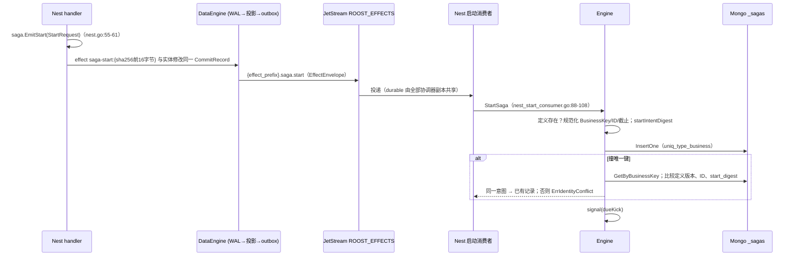
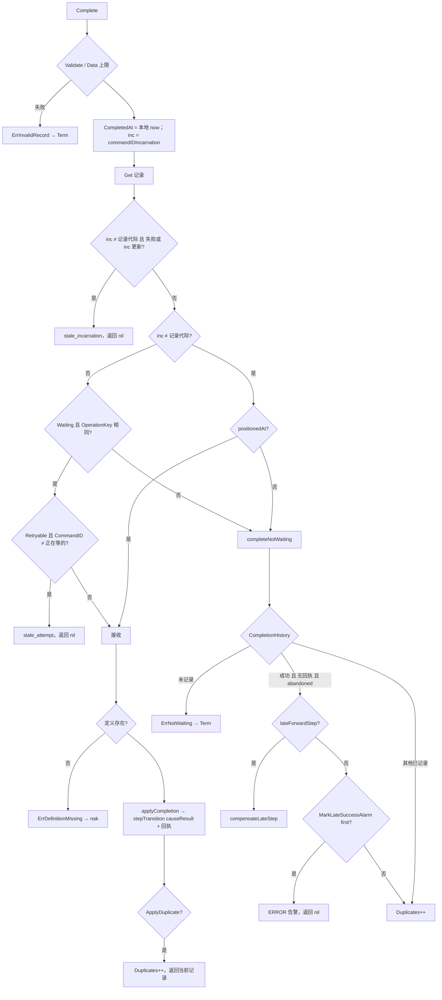
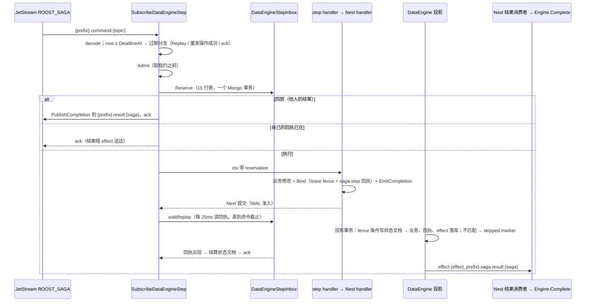
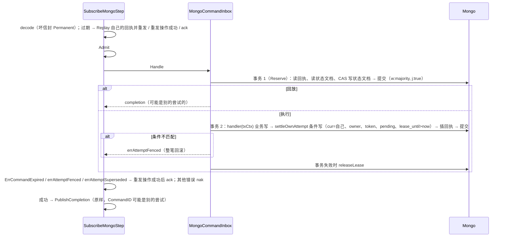

# 06 Saga 实现

> 本篇是框架整体文档 06 分区的**实现文档**，面向 review agent 与维护者。概念、用法、配置与运维见 [说明文档](../guide/06-saga.md)。
>
> 源码基准：tag `v1.23.0`（`28912cd6`），`path:line` 都按这个 tag；本篇涉及的 saga 源码在 tag 与写作时的 `origin/main`（`61dfb2bb`）之间没有改动。codebase-memory 图谱的 generation 停在 2026-09-30：`saga/step_transition.go`、`saga/step_operation_inbox.go`、`kit/saga/step_budgets.go` 未入索引（`not_tracked`），其余 saga 文件 `metadata_changed`。本篇不依赖图谱结论，全部按 tag 源码直接读取；§11 的两处行为用临时探针测试在 tag 上实跑确认（探针未提交）。

## 速览

- 协调器 = `Engine`（`saga/engine.go`）+ `MongoStore`（`saga/mongo_store.go`）。记录是一行带 `version` 的文档；协调循环按 `next_run_at` 领取（加租约），算出目标状态后**只经** `Engine.stepTransition`（`saga/step_transition.go:66-83`）写回，它决定关闭哪个操作、是否开新一生、带不带租约，再调 `Store.Apply`；`Apply` 在一个 Mongo 事务里写记录、outbox、回执、tombstone。
- 步骤侧 = `stepOperationInbox`（`saga/step_operation_inbox.go`），每个操作一份状态文档，`reserveInTransaction` 按 15 行表判定执行 / 回放 / 等待 / 接替；生效点是“对状态文档的条件写”：原生步骤在 DataEngine 投影事务里（lease fence），Mongo 步骤在 handler 事务里（`settleOwnAttempt`）。租约封顶到命令截止，所以一次尝试只能在协调器等它的窗口内生效。
- 协调器接收结果按代际（B1，从 `CommandID` 解析）与“是否正在等这次尝试”（方向 ③）判定；放弃关闭之后送达的正向成功走 `compensateLateStep`（方向 ④），可能重开终态。
- 最该 review 的地方：同一生、重试退避期间送达的成功被 `ErrNotWaiting` Term，之后若 saga 截止 / 人工补偿 / 定义缺失在下一次派发前关闭操作，这份成功永久丢失（§11 S1，探针已证实）。

本篇覆盖的包：

| 包路径 | 职责 |
| --- | --- |
| `saga/` | 协调器、Store、步骤收件箱、传输与消费者、Nest 接口、Assembly |
| `kit/saga/` | saga Mod：配置声明与读取、步骤预算、能力查找、生命周期、健康、跨 Mod 保留期校验 |
| `codegen/internal/roost/`（saga 部分） | `roost add saga` 定义生成器、bootstrap 渲染、demo 预算覆盖 |
| `nats/driver/jetstream.go`（结算部分） | handler 错误 → ack / nak（带退避）/ Term 的映射，saga 所有消费者都经过它 |

---

## 1. 包与文件地图

### 1.1 `saga/`（非测试）

| 文件 | 行数 | 职责 |
| --- | --- | --- |
| `record.go` | 372 | `Status` / `Phase` / `Step` / `StepBudget(s)` / `Definition` / `Record` / `Command` / `Completion` / `OutboxRecord` 与各自 `Validate`；`NewID` |
| `errors.go` | 16 | 哨兵错误 |
| `store.go` | 112 | `Store` 接口、`ApplyRequest`、`ApplyOutcome`、`OperationClosure`、两个可选扩展 `CompletionHistoryStore` / `LateSuccessAlarmStore`、`Publisher` |
| `engine.go` | 1191 | `Engine`：选项校验、注册、`StartSaga`、`Resume`、`Compensate`、`Complete`、协调循环、outbox 发布循环、状态推导函数、观测 |
| `step_transition.go` | 98 | `transitionCause`、`transition`、`stepTransition`（唯一写出口）、`openOperation` |
| `mongo_store.go` | 599 | `MongoStore`：四个集合、索引、`Apply` 事务、领取 / ack / nack、tombstone、告警标记 |
| `step_operation_inbox.go` | 527 | 操作状态文档与 Reserve 判定（两种收件箱共用）、租约授予 / 结算 / 交还 |
| `dataengine_step_inbox.go` | 193 | 原生收件箱：`Bind`（lease fence + 回执进 Nest 事务）、`Reserve`、`Replay`、`waitReplay` |
| `command_consumer.go` | 554 | Mongo 收件箱（`Handle` = Reserve 事务 + 执行事务）、两种步骤消费者、过期 / 不执行投递的 ack 与成功重发 |
| `nest.go` | 159 | `EmitStart`、`BindCommand`、`EmitCompletion`、effect 编解码 |
| `jetstream.go` | 167 | `JetStreamPublisher`、普通结果消费者、主题与投递参数校验 |
| `nest_start_consumer.go` | 118 | Nest 启动意图消费者 |
| `nest_completion_consumer.go` | 161 | 原生 Nest 结果消费者、两条结果流共用的终态分类 |
| `assembly.go` | 298 | `Assemble` / `Assembly.Start` / `Stop` / 健康探针 |

### 1.2 其余

| 文件 | 职责 |
| --- | --- |
| `kit/saga/config.go` | `saga.*` 声明（A4 ①），缺省值与 core 一致 |
| `kit/saga/mod.go` | `Mod`：`Init` 组 `AssemblyConfig`、`Provide` 调 `Assemble` 并注册 `*Engine` 能力与健康项、`Start` / `StopWithContext`、`StreamSettings` |
| `kit/saga/step_budgets.go` | `saga.step_defaults` / `saga.steps` → `coresaga.StepBudgets`，名字核对与大小写歧义检查 |
| `codegen/internal/roost/add.go:201-245`、`:462-553` | `roost add saga`：改 manifest、加 saga Mod、生成 `saga/<name>/definition.go` |
| `codegen/internal/roost/render.go:496-502` | bootstrap 渲染 `kitsaga.NewMod(kitsaga.CombineDefinitions(...)...)` |
| `codegen/internal/roost/demo.go:217-246` | demo 给 `gift_item.debit` 写 `max_attempts: 15` |
| `demo/internal/service/game/gift_saga.go.tmpl`、`demo/game/gift/gift.go.tmpl`、`demo/game/handler/{start_gift,gift_debit,gift_refund}.go.tmpl` | 仓库内唯一完整业务示例 |

[↑ 速览](#速览) · [说明文档 §1](../guide/06-saga.md#1-定位与边界)

---

## 2. 关键类型与数据结构

| 类型 | 位置 | 要点 |
| --- | --- | --- |
| `Status` / `Terminal()` | `saga/record.go:15-29` | 7 个值；`Terminal` 含 `ManualRequired` |
| `Step` / `StepBudget` / `StepBudgets.Resolve` / `Validate` | `saga/record.go:72-159` | 字段级取值：覆盖 > 定义 > 配置缺省 > 内置；覆盖先原样后小写查 |
| `Definition.Validate` | `saga/record.go:185-201` | 类型名 ≤128、版本 >0、1～256 步、主题合法、`Timeout>0`、`1≤MaxAttempts≤1000`、`BackoffMin>0`、`BackoffMax≥BackoffMin`、步骤名不重复 |
| `Record` | `saga/record.go:209-244` | `StartDigest`（启动身份）、`Incarnation`、`LateStep` / `LateData`、`OperationKey` / `CommandID`（仅 waiting）、`Lease` |
| `Record.Validate` / `lateStepValid` | `saga/record.go:254-272` | waiting ⇔ 有 `OperationKey`+`CommandID`+`Attempt>0`；非 waiting 不得有它们；`Compensating` 要求 `Phase=Compensate` 且有可补偿步骤；`Compensated` 要求 `CompletedSteps=0`；`LateStep-1 ≥ CompletedSteps` 且只在补偿方向或 `ManualRequired` |
| `Command` / `Completion` | `saga/record.go:274-320` | `Completion.Validate`：成功不得带 `Retryable` / `Error`，失败必须有 `Error` |
| `OutboxRecord` | `saga/record.go:341-347` | 命令 + 发布尝试次数 + 下次时间 + 发布租约 |
| `NewID` | `saga/record.go:354-372` | 8 字节随机前缀 + 进程内自增，hex 32 字符 |
| `ApplyRequest` | `saga/store.go:27-36` | `ExpectedVersion`、`ExpectedLease`、`After`、`Outbox`、`Receipt`、`CloseOperation` |
| `Store` | `saga/store.go:51-63` | 10 个方法；`Apply` 必须原子、必须在条件不满足时返回 `ErrConflict` |
| `OperationClosure` / `CompletionHistory` | `saga/store.go:66-94` | `Unknown`（旧 tombstone）/ `ClosedWithResult` / `Abandoned` |
| `LateSuccessAlarmStore` | `saga/store.go:100-102` | 按（操作，代际）原子地“只告警一次” |
| `Options` / `DefaultOptions` | `saga/engine.go:22-46` | Owner、两类 worker 数与 batch、租约、超时、发布退避、载荷上限、步骤预算 |
| `Stats` | `saga/engine.go:65-83` | 计数语义见说明文档 §6.1 |
| `Engine` | `saga/engine.go:85-103` | `definitions` 在 `mu` 下；`running/cancel/done` 在 `runMu` 下；两个 kick 通道容量 1 |
| `transitionCause` / `transition` | `saga/step_transition.go:15-49` | 9 种原因；`fenced`、`receipt`、`outbox` |
| `stepOperationInbox` | `saga/step_operation_inbox.go:65-75` | `receipt` 回调由两种收件箱各自提供（原生读 `_dataengine_receipts`，Mongo 读收件箱集合） |
| `Reservation` | `saga/step_operation_inbox.go:77-87` | 导出 `Token` / `Duplicate` / `Completion`；未导出 `operationKey` / `commandID` / `owner` / `digest` 供 `Bind`、结算、交还核对 |
| `stepOperation`（状态文档） | `saga/step_operation_inbox.go:92-117` | 顶层字段名与 `coredata.LeaseFence.Predicate` 一致（`dataengine/lease_fence.go:39-84`） |
| `recordDoc` / `outboxDoc` / `completionDoc` / `operationDoc` | `saga/mongo_store.go:418-557` | 持久形状见 §7 |
| `AssemblyConfig` | `saga/assembly.go:18-31` | 存储、引擎、前缀、流、三个消费者配置 |
| kit `config` | `kit/saga/config.go:31-75` | `app.ServiceIdentity` + `saga.*` |

[↑ 速览](#速览) · [说明文档 §2](../guide/06-saga.md#2-核心概念与术语)

---

## 3. 主流程

### 3.1 启动 saga



- 启动摘要固定为 `{type, business_key, definition_version, data, deadline_at}` 的 JSON SHA-256（`saga/engine.go:270-285`）；无摘要的旧记录只有在“完全未推进”时才按字段比较（`saga/engine.go:250-253`）。
- `StartSaga` 的错误全部让启动消费者 nak 重投（`ErrDefinitionMissing` 在滚动发布时正需要这样）。`handleNestStart` 只对信封错误标 `Permanent`，所以 `ErrIdentityConflict` 与“`Data` 超过 `MaxPayloadBytes`”的 `ErrInvalidRecord` 这两类重投不会变的错误也 nak 到 `MaxDeliver`（`saga/nest_start_consumer.go:106-107`）——见 §11 S7。

### 3.2 协调循环与派发

`coordinatorLoop`（`saga/engine.go:755-790`）：`ClaimDue` 按 `next_run_at` 升序取至多 `CoordinatorBatch` 条到期记录，逐条 `FindOneAndUpdate`（条件 `_id + version + lease_until ≤ now`，`$set` 租约、`$inc lease_token`，`saga/mongo_store.go:213-241`），每条 `processClaimed`（`saga/engine.go:844-925`）：

| 顺序 | 条件 | 目标状态 | `transition` |
| --- | --- | --- | --- |
| 1 | 定义版本未注册 | `ManualRequired`，`last_error=definition not registered` | `causeDefinitionMissing`，fenced（`engine.go:845-862`） |
| 2 | 正向且 `now ≥ DeadlineAt` | `beginCompensation`：有可补偿步骤 → `Compensating`，否则 `Failed` | `causeDeadline`，fenced（`engine.go:863-871`） |
| 3 | `Waiting`（到期 = 尝试超时） | `retryOrCompensate`：未用尽 → 同步骤 `Pending`/`Compensating` + 退避；正向用尽 → 补偿 / `Failed`；补偿用尽 → `ManualRequired` | `causeTimeout`，fenced（`engine.go:872-880`、`:981-1019`） |
| 4 | 步骤下标越界 | `ManualRequired`，`last_error=invalid saga step` | `causeInvalidStep`，fenced（`engine.go:881-895`） |
| 5 | 其余（`Pending` / `Compensating` 到期） | `Waiting`，`Attempt+1`，`next_run_at = now+Timeout`，铸 `OperationKey` / `CommandID`；命令主题按方向选择，补偿迟到步骤时载荷是 `LateData` | `causeDispatch`，fenced，带 outbox（`engine.go:896-924`） |

所有出口都走 `stepTransition`，冲突（`ErrConflict`）计数后跳过，其他错误计 `WorkerFailures`（`engine.go:777-787`）。

### 3.3 outbox 发布

`publisherLoop`（`saga/engine.go:792-842`）：`ClaimOutbox`（`next_attempt_at ≤ now` 且发布租约空闲，领取时**复查**两个条件，NC-41，`saga/mongo_store.go:352-381`）→ `PublishSagaCommand`（主题 `<prefix>.command.<topic>`、`MsgID = CommandID`，`saga/jetstream.go:57-70`）→ 成功 `AckOutbox`（按 owner+token 删除），失败 `NackOutbox`（`next_attempt_at = now + backoff(CommandID, attempt+1)`，`attempt+1`，释放租约）。ack 前进程退出 → 租约过期后再发一次；JetStream 在 `duplicate_window`（缺省 10m）内按 `MsgID` 去重，窗口外的重复由步骤收件箱按 `CommandID` 去重。

### 3.4 `stepTransition`（唯一写出口）

```text
after.Incarnation = before.Incarnation
if cause == Resume || (cause == ManualCompensate && before.Phase == Compensate): after.Incarnation++
request = {ExpectedVersion: before.Version, After: after, Outbox, Receipt}
if fenced: request.ExpectedLease = before.Lease
if openOperation(before) != "" && != openOperation(after): CloseOperation = openOperation(before)
if Receipt != nil && Receipt.Success: CloseOperation = Receipt.IdempotencyKey
store.Apply(request)
```

（`saga/step_transition.go:66-83`）`openOperation`：`Waiting` → `OperationKey`；`Pending` / `Compensating` 且 `Attempt>0`（重试退避中）→ 当前方向 + 步骤的操作键；其余为空（`saga/step_transition.go:88-98`）。由此：

- 超时未用尽：before 与 after 开着同一操作 → 不关闭；用尽 / 截止 / 人工补偿 / 定义缺失 / 拒绝 → 关闭（tombstone `abandoned`）；
- 接收成功 → 关闭结果所属操作（`result`），覆盖了“Resume 后 before 没有开着的操作”与“迟到成功的操作早已放弃关闭”两种情形；
- 出口在 `after` 上写的 `Incarnation` 无效。

### 3.5 `Store.Apply`（`saga/mongo_store.go:243-350`）

1. 校验：`After.Version == ExpectedVersion+1`（`:244`），`After.Validate()`（`:247`）。
2. 快路径：无 outbox、无回执、无关闭 → 不开事务，`ReplaceOne(applyFilter)`，`MatchedCount≠1` → `ErrConflict`（`:250-259`）。
3. 事务路径（`WithTransaction`，回调可重跑，`outcome` 每次重置，`:274-277`）：
   1. 有回执：读 `_saga_completions[CommandID]`；存在且摘要相同 → `ApplyDuplicate`、**不写任何东西**直接提交；摘要不同 → `ErrIdentityConflict`（`:278-292`）；
   2. 有关闭：读 tombstone，属于别的 saga → `ErrIdentityConflict`（`:293-302`）；
   3. `ReplaceOne` 记录，按 `_id + version (+ lease_owner + lease_token)` 过滤（`:303-309`、`:559-566`）；
   4. 有 outbox：删除同一 `IdempotencyKey` 仍排队的命令，插入新命令（`:310-317`）；
   5. 有回执：插入 `{_id: CommandID, digest, created_at: CompletedAt}`（`:318-322`）；
   6. 有关闭：tombstone 不存在 → 插入（`closure = result` 当且仅当回执是成功，否则 `abandoned`）；已存在且本次是成功、原来不是 `result` → 改为 `result`；然后删除这个操作所有仍排队的命令（`:323-346`）。

### 3.6 结果接收 `Complete`



（`saga/engine.go:419-525`）冲突时最多重读重试 8 次（`:430`）。`applyCompletion`（`:927-975`）：

| 结果 | 正向 | 补偿 |
| --- | --- | --- |
| 成功 | `Data ← result.Data`（非 nil 时）；`CompletedSteps = Step+1`、`Step++`；已过 saga 截止 → 补偿（这一步计入）；最后一步 → `Completed`，否则 `Pending` | 迟到步骤 → 清 `LateStep/LateData`；否则 `CompletedSteps--`；`nextCompensation` |
| 拒绝 | `compensationState` | `ManualRequired` |
| 可重试失败 | `retryState`（未用尽重试，用尽同上两格） | 同左 |

`nextCompensation`（`:607-626`）是选下一个补偿的唯一处：`LateStep>0` → 补 `LateStep-1`；否则 `CompletedSteps>0` → 补 `CompletedSteps-1`；否则 `Compensated`。

### 3.6.1 v1.23.1 起统一规则

维护者 2026-10-07 选 A（[方案](../../feature/SAGA-COMPLETION-RULE-UNIFIED-2026-10-07.md)）：上面流程图里按记录状态逐条列举的接收分支（B1 代际、方向 ③、RR-20261006-42 退避）
收敛为 `judgeCompletion`（`saga/engine.go`）一处，`Complete` 只按它的四个结论走：

> **成功是操作的结论，只要这个操作开过、还没有带结果关闭，就接收。** 拒绝是本生这个操作的结论，可重试失败是一次尝试的结论，只在协调器正等着时接收。

| 顺序 | 条件 | 结论 |
| --- | --- | --- |
| 0 | completion 代际 > 记录代际 | `stale_incarnation` |
| S | 成功，且（本生：`openOperation(r)=k`；旧一生：`positionedAt(r,k)`） | 接收（`applyCompletion`，带结果关闭） |
| S' | 成功，其余 | `completeNotWaiting`：放弃关闭 → 方向 ④ 补偿 / 告警；带结果关闭 → 重复；没开过 → `ErrNotWaiting` |
| R/F-old | 拒绝 / 可重试失败，旧一生 | `stale_incarnation` |
| R/F-gone | 本生，记录不在等 `k` | `completeNotWaiting` |
| F-stale | 可重试失败，本生，在等 `k`，不是正在等的尝试 | `stale_attempt` |
| R / F | 其余 | 接收 |

记录停在 `k` 上时 `k` 不可能已带结果关闭（离开后回到同一操作键只有开新一生的 Resume / 补偿方向人工 Compensate，二者都不回到已带结果
关闭的步骤），所以 S 不读 tombstone。行为与原 5 条规则一致；守卫 `saga/completion_rule_guard_test.go`（48 格判定表 + `Complete` 不得自己读
记录状态、只调用一次 `judgeCompletion`）。下文不变量表 I8 / I9 的行号指向原分支，v1.23.1 起对应 `judgeCompletion`。

### 3.7 迟到成功（方向 ④）与重开

`lateForwardStep`（`saga/engine.go:540-546`）：只处理本 saga 的正向操作、`step ≥ CompletedSteps`、`LateStep` 为空或就是这一步，且记录已离开正向（补偿方向 / `Failed` / `ManualRequired`）。`compensateLateStep`（`:554-580`）在一个 `stepTransition(causeLateSuccess, receipt)` 里：写回执、tombstone 改 `result`（成功回执触发）、`LateStep = s+1`、`LateData = Data`；记录没有开着的操作且不是 `ManualRequired` 时立即 `nextCompensation`（重开 `Failed` / `Compensated`）。之后 `reportLateCompensation`（WARN，`late_after_abandon{phase=forward}`）与 `reportReopen`（`saga.reopened_total`，`:595-602`）。`Resume` / `Compensate` 在 `record.LateStep>0` 时也 `reportReopen`（`:358-360`、`:398-400`）。

补偿方向的迟到成功走 `markLateSuccessAlarm`：在 tombstone 上 `$set late_alarms.r<代际>`，条件是该键不存在，`MatchedCount==1` 才是第一次（`saga/mongo_store.go:196-211`）。

### 3.8 `Resume` / `Compensate`

- `Resume`（`saga/engine.go:300-365`）：只接受 `Failed` / `ManualRequired`；定义必须存在；`Attempt/LastError/CommandID/OperationKey` 清零；截止：显式新截止（必须在未来）> `ClearDeadline` > 原截止（正向且已过 → `ErrDeadlineExpired`）；有补偿方向 / 已完成步骤 / 迟到步骤 → `nextCompensation`，否则回到正向 `Pending`；`causeResume` 开新一生。
- `Compensate`（`saga/engine.go:369-405`）：已在补偿 / 已补偿直接返回；`Waiting` 拒绝；无可补偿拒绝；`beginCompensation`；`causeManualCompensate`（仅当 `before.Phase==Compensate` 时开新一生）。允许的起点包括 `Pending`（含重试退避中，此时操作被放弃关闭）、`Completed`、正向 `ManualRequired`、`Failed`（仅当带 `LateStep`）。

### 3.9 步骤收件箱 Reserve：15 行判定表

`reserve`（`saga/step_operation_inbox.go:140-162`）开一个 Mongo 事务跑 `reserveInTransaction`（`:178-258`），首次插入撞唯一键时整笔重试一次。记号：`c` 本次命令，`s` 状态文档，`cur` 当前尝试。

| # | 条件（按序，命中即停） | 结论 | 源码 |
| --- | --- | --- | --- |
| 1 | `c` 自己的回执存在 | 回放（`Duplicate` + completion）；若 `cur=c` 且 pending 顺手结算，失败只 WARN + 计数 | `:180-191` |
| 2 | `now ≥ c.DeadlineAt` | `ErrCommandExpired` | `:192-195` |
| 3 | `s` 不存在 | 插入，token 1，执行 | `:200-202`、`:270-282` |
| 4 | `c ∈ s.superseded` | `errAttemptSuperseded` | `:203-205` |
| 5 | `cur=c`，摘要不同 | `ErrIdentityConflict` | `:206-209` |
| 6 | `cur=c`，settled | 回放 `s.completion` | `:210-213` |
| 7 | `cur=c`，pending，租约有效 | `Duplicate`（无 completion：同一命令另一投递在途） | `:218-220` |
| 8 | `cur=c`，pending，租约过期 | 重新授予自己的租约（token+1，不记 superseded） | `:221` |
| 9 | `cur≠c`，pending，`cur` 的回执存在 | 先结算 `cur`（CAS），再继续 10～15 | `:223-234` |
| 10 | `cur` settled 且 success | 回放成功（任何一生） | `:235-239` |
| 11 | `s.refusals[r<c 的代际>]` 存在 | 回放那份拒绝 | `:240-245` |
| 12 | `c` 的代际 ≤ `refusals_dropped_through` | `errAttemptSuperseded` | `:246-249` |
| 13 | `cur` pending，租约有效 | `errOperationAttemptInFlight` | `:250-253` |
| 14 | `cur` pending，租约过期 | 接替：token+1，`cur` 追加进 `superseded`（留最近 16），计 `superseded_total` | `:254`、`:287-319` |
| 15 | 其余（`cur` 是可重试失败或别的生的拒绝） | 授予租约，执行 | `:257` |

`grantLease` 以读到的 `version` 做 CAS（`:308`），在事务里与任何并发写同一文档（另一 Reserve、投影 fence 确认、结算、交还）写冲突，输家整笔重跑重新判定。租约 `min(now+LeaseDuration, DeadlineAt)`（`:321-327`）。拒绝只留代际最大的两生，剪掉时记 `refusals_dropped_through`（`:330-361`）。

### 3.10 原生步骤



关键点：

- `Bind` 核对 reservation 与命令身份、owner、摘要，绑 `LeaseFence{Database, Resource: _dataengine_step_operations, DocumentID: IdempotencyKey, Owner, Token, Digest}` 与 `saga-step/<CommandID>` 回执（`saga/dataengine_step_inbox.go:93-115`、`saga/nest.go:66-91`）；`EmitCompletion` 把结果写进回执载荷并发 effect（`saga/nest.go:112-125`）。
- handler 以 `ErrFencedEntityPending` 失败 → `releaseLease`（`lease_until=now`），重投可立即 Reserve（`saga/command_consumer.go:491-498`）；**其他错误不交还**，返回错误 → nak → 重投走第 7 行 `Duplicate` → `waitReplay` 等到截止（`:476-503`）。
- 生效点与接替写同一文档：投影的确认写 `updated_at`（`dataengine/lease_fence.go:92-94`），与接替的 CAS 写冲突，二者只能有一个提交（03 分区 [§3.4](./03-dataengine.md#34-mongostoreprojectfenced)）。

### 3.11 Mongo 步骤



（`saga/command_consumer.go:103-182`、`:252-350`）两次落盘提交是维护者选 A 的代价（[延迟分析](../../feature/SAGA-MONGO-STEP-LATENCY-2026-10-06.md)）。

### 3.12 消费者错误 → 结算

结算统一在 `nats/driver/jetstream.go:106-127`：nil → ack；`Permanent` → Term（`terminal.total{reason=permanent}`）；其他错误且 `NumDelivered ≥ MaxDeliver` → Term（`reason=max_deliver`）；否则 `NakWithDelay(min·2^(n-1) 封顶 max)`（`:130-168`）。

| 消费者 | 信封 / 版本 / 校验失败 | 业务错误 |
| --- | --- | --- |
| 普通结果 `SubscribeCompletions` | Permanent（`saga/jetstream.go:118-135`） | `ErrNotWaiting` / `ErrNotFound` / `ErrInvalidRecord` / `ErrIdentityConflict` → Permanent；其他（含 `ErrDefinitionMissing`、`ErrConflict` 8 次耗尽、Mongo 错误）→ nak（`:144-147`、`saga/nest_completion_consumer.go:150-159`） |
| 原生结果 `SubscribeNestCompletions` | Permanent，含 topic 与 `SagaID` 不符（NC-40，`saga/nest_completion_consumer.go:104-126`） | 同上 |
| Nest 启动 | Permanent（`saga/nest_start_consumer.go:88-105`） | 全部 nak，包括 `ErrIdentityConflict` |
| Mongo 步骤 | Permanent（`saga/command_consumer.go:279-297`） | 过期 / fence / 被接替 → 重发后 ack；在途 → nak；其他 → nak |
| 原生步骤 | **nak**（`decodeStepCommand` 返回普通错误，`saga/command_consumer.go:411-414`） | 过期 / 被接替 → ack；在途 → nak；handler 错误 → nak |

### 3.13 Assembly 与 kit Mod

- `Assemble`（`saga/assembly.go:101-126`）：建 `MongoStore`、`JetStreamPublisher`、`Engine`，注册定义；不碰 Mongo / NATS。
- `Start`（`:132-193`）：`EnsureInfrastructure`（索引）→ `EnsureStream` → 普通结果、Nest 启动、原生结果三个消费者（任一失败拆掉已起的）→ goroutine 跑 `Engine.Run`。消费者 ctx 是独立的 `runCtx`，不是 `Start` 的 ctx。
- `Stop`（`:199-242`）：先 `Drain` 三个消费者并等 `Closed()`；超时则 `Stop` 硬停、取消循环、返回 ctx 错误；否则取消循环、`Engine.Stop`、等循环退出。
- kit `Mod`（`kit/saga/mod.go`）：`DependsOn` Mongo、NATS，可选 DataEngine（`:50-56`）；`Init` 读配置、算预算、校验 `completion_receipt_ttl > stream_max_age`（`:111-113`）与 `> dataengine.effects.max_age`（结果效果流就是 DataEngine 效果流时，`:121-137`）；`Provide` 查能力、`Assemble`、注册 `mods.ModSaga → *Engine` 与健康项（`:139-165`）；`Start` 用 30s 超时建基础设施（`:167-174`）。

[↑ 速览](#速览) · [说明文档 §4](../guide/06-saga.md#4-怎么用业务作者视角)

---

## 4. 不变量清单

每条：内容 / 强制位置 / 守卫测试（测试名后括号是 `saga/` 下的文件，另注明的除外）。

| # | 不变量 | 强制位置 | 守卫测试 |
| --- | --- | --- | --- |
| I1 | `ApplyRequest` 只在 `stepTransition` 里产生、任何地方不能改写、`Store.Apply` 只在 `stepTransition` 里调用 | `saga/step_transition.go:66-83`（结构） | `TestEveryCoordinatorWriteGoesThroughStepTransition`（`step_transition_guard_test.go`，`go/types` 检查全包非测试代码） |
| I2 | 代际只由 `before` 与原因决定：Resume 总是 +1，人工 Compensate 仅在补偿方向 +1 | `saga/step_transition.go:67-70` | `TestStepTransitionAloneDecidesTheIncarnation`（`step_transition_guard_test.go`）、`TestResumeMintsCommandIDsDisjointFromPreviousLife`（`engine_test.go`） |
| I3 | 离开一个开着的操作就关闭它（放弃关闭）；接收成功关闭结果所属操作（带结果关闭） | `saga/step_transition.go:75-80`、`saga/mongo_store.go:323-346` | `TestMongoStoreTombstoneTellsAbandonedFromResolved`（`step_operation_promises_test.go`）、`TestMongoStoreTombstoneOfAFailureCloseIsAbandoned`（`step_operation_review_test.go`）、`TestDefinitionFenceDuringBackoffAbandonsTheOperation`、`TestStoreContractClosesOperationAndRemovesStaleOutbox`（`engine_test.go`） |
| I4 | 记录、outbox、回执、tombstone 原子提交；新命令替换同操作的排队命令 | `saga/mongo_store.go:268-349` | `TestStoreContractNewAttemptSupersedesQueuedAttempt`（`engine_test.go`）、`TestOutboxSupersedeAndUnknownAckOnMongoStore`（`coordinator_takeover_review_test.go`） |
| I5 | 每次写恰好 `version+1`；协调循环的写还要匹配租约 owner+token | `saga/mongo_store.go:244`、`:559-566`；`saga/engine.go:981-985`、`:1029-1033` | `TestRetryOrCompensateAdvancesVersionByOne`、`TestApplyCompletionAdvancesVersionByOne`、`TestStepRefusalMovesSagaIntoCompensationOnMongoStore`（`compensation_version_promises_test.go`）、`TestCoordinatorLeaseTakeoverFencesTheLateApply`（`coordinator_takeover_review_test.go`）、`TestRealMongoCoordinatorLeaseTakeover`（integration） |
| I6 | 记录形状合法（waiting 字段、`Compensated` 无已完成步骤、`LateStep` 约束）；读写都校验 | `saga/record.go:254-272`；`saga/mongo_store.go:97`、`:247`、`:472-478` | `TestMongoStoreLateStepCompensationRoundTrip`（`saga_direction_3_4_promises_test.go`）、`TestMongoIncarnationSurvivesEveryRecordReadAndReplace`（`mongo_resume_incarnation_promises_test.go`） |
| I7 | 同一结果回执幂等：同 `CommandID` 同摘要 → `ApplyDuplicate` 不写；不同摘要 → `ErrIdentityConflict` | `saga/mongo_store.go:278-292`、`:579-595` | `TestLateDuplicateCompletionIsAcknowledgedAfterNextStep`（`engine_test.go`）、`TestCompletionDigestIsStableForMarshalableReceipts`（`digest_promises_test.go`） |
| I8 | 结果代际核对：上一生的失败不接收；上一生的成功只在记录停在该操作上时接收 | `saga/engine.go:429-442`、`:488-497`、`:1097-1111` | `TestCoordinatorChecksTheIncarnationOfACompletion`、`TestCommandIDIncarnationInvertsCommandID`（`step_operation_incarnation_promises_test.go`）、`TestMongoResumePersistsGenerationAndAcceptsFreshCompletion` |
| I9 | 同一生只接收正在等的那次尝试的可重试失败；成功与拒绝从任何尝试接收 | `saga/engine.go:443-447` | `TestNativeStepStaleAttemptRetryableFailureDoesNotAbandonTheLastAttempt`、`TestNativeStepReplayedRefusalOfAnEarlierAttemptIsAccepted`、`TestMongoStoreIgnoresARetryableFailureOfAnEarlierAttempt`（`saga_direction_3_4_promises_test.go`） |
| I10 | 放弃关闭后的正向成功恰好被计入一次并补偿那一步；`LateStep` 至多一个；终态可重开 | `saga/engine.go:510-513`、`:540-580`、`:607-626` | `TestNativeStepLateSuccessReopensAFailedSagaToCompensateTheStep`、`...AfterCompensatedCompensatesOnlyThatStep`、`...DuringAnInFlightCompensationIsCompensatedNext`、`...OnManualRequiredIsCompensatedOnResume`（`saga_direction_3_4_promises_test.go`）、`TestRealMongoLateSuccessReopensACompensatedSagaOnce`（integration）、`TestLateSuccessfulStepIsIncludedInCompensation`（`engine_test.go`） |
| I11 | 补偿方向迟到成功只告警，按（操作，代际）一次 | `saga/engine.go:514-521`、`saga/mongo_store.go:196-207` | `TestNativeStepLateCompensationSuccessIsOnlyAlarmed`、`TestMongoStoreMarksALateSuccessAlarmOncePerLife`（`step_operation_incarnation_promises_test.go`）、`TestRealMongoLateSuccessAlarmIsMarkedOnce` |
| I12 | 重开计数与日志：`late_success` / `resume` / `compensate`；补偿中收到迟到成功不算重开，普通 Resume 不算 | `saga/engine.go:358-360`、`:398-400`、`:575-577`、`:595-602` | `saga_reopen_observability_promises_test.go` 的 6 个用例 |
| I13 | 一个操作的所有尝试（含跨代际）至多一次生效 | `saga/step_operation_inbox.go:178-258`；生效点 `:455-474`（Mongo）、`dataengine/lease_fence.go:75-84`（原生） | `TestNativeStepTakesEffectAtMostOncePerOperation`、`TestNativeStepOperationInterleavingsWithCoordinatorDecisions`（`step_operation_promises_test.go`）、`TestMongoStepAttemptsOfOneOperationTakeEffectOnce`、`TestRealMongoStepAttemptsOfOneOperationTakeEffectOnce`、`TestRealMongoStepProcessesConcurrentAttemptsTakeEffectOnce`、`TestRealSagaCrossProcessKillRecovers`（integration） |
| I14 | 租约不超过命令截止；生效点要求 `lease_until > now` | `saga/step_operation_inbox.go:321-327`、`:463`；`dataengine/lease_fence.go:82` | `TestNativeStepLeaseNeverOutlivesTheCommandDeadline`、`TestDataEngineStepInboxUsesAbsoluteOperationExpiry`（`dataengine_step_inbox_test.go`） |
| I15 | 状态文档满足投影 fence 谓词且每个字段都起作用；接替与投影只能一个提交 | `saga/step_operation_inbox.go:92-106`、`saga/dataengine_step_inbox.go:109-114` | `TestDataEngineOperationStateSatisfiesProjectorFencePredicate`、`TestRealMongoTakeoverFencesTheEarlierAttemptsProjection`、`TestRealMongoSupersedeAndProjectionOfTheSameAttemptSerialize`（integration） |
| I16 | 判定只读一份文档，与尝试次数 / Resume 次数无关；拒绝留两生、被接替留 16 条 | `saga/step_operation_inbox.go:42-47`、`:287-361` | `TestOperationAttemptsAccumulatedOverResumesDoNotBlockANewLife`（`step_operation_attempt_cap_promises_test.go`）、`TestOperationStateKeepsTheRefusalsOfTheTwoNewestLives`、`TestOperationStateRemembersTheLatestSupersededAttempts`（`step_operation_state_promises_test.go`） |
| I17 | 不会执行的投递（过期 / 被接替 / 被 fence）在 ack 前把同操作已生效的成功重发 | `saga/command_consumer.go:298-317`、`:327-334`、`:415-475`、`:509-516` | `TestNativeStepExpiredDeliveryStillReplaysTheOperationsSuccess`（`step_operation_review_test.go`）、`TestExpiredStepCommandWithoutReceiptIsAcknowledgedNotRedelivered`（`step_expired_promises_test.go`）、`TestMongoStepConsumerFollowsTheOperationInbox` |
| I18 | `Admit` 在取租约之前 | `saga/command_consumer.go:318-322`、`:444-448` | `TestStepConsumersAdmitBeforeTakingTheClaim`（`step_admission_promises_test.go`） |
| I19 | 实体屏障拒绝时交还租约 | `saga/command_consumer.go:492-498` | `TestDataEngineStepHandsBackTheLeaseWhenTheEntityIsFenced`（`fenced_entity_promises_test.go`）、`TestNativeStepCancellationAndFenceRecovery` |
| I20 | 原生步骤的业务修改、回执、fence、结果 effect 原子提交 | `saga/nest.go:66-125` | `TestNativeSagaStepCommitsMutationReceiptAndCompletionEffectAtomically`（`nest_atomic_test.go`） |
| I21 | 两条结果流终态分类相同；`ErrDefinitionMissing` 可重试 | `saga/nest_completion_consumer.go:150-159`、`saga/jetstream.go:144-146` | `TestCompletionConsumersTermTheSameTerminalErrors`、`TestACompletionBeforeItsDefinitionIsRegisteredIsRetriedNotTerminated`、`TestADefinitionThatNeverArrivesEndsInTheCoordinatorFence`、`TestRealNatsCompletionNakBackoffAndMaxDeliver`（integration） |
| I22 | 原生结果的 topic 必须是 `saga.result.<payload.SagaID>`，否则在任何写入前 Term | `saga/nest_completion_consumer.go:124-126` | `TestNestCompletionRejectsForeignSagaRouteBeforeMutation` |
| I23 | 启动身份与可变运行数据分离 | `saga/engine.go:236-262` | `TestStartIdentitySurvivesProgressAndResume`、`TestStartIdentityCompatibilityAndForeignIntents`、`TestStartSagaRejectsBusinessKeyWithDifferentIntent` |
| I24 | 领取批内最后一条处理完之前租约不过期（选项算术） | `saga/engine.go:150-188` | `TestNewEngineRefusesEachUnsafeOption`（`promises_test.go`）、`TestEngineRejectsPublisherBatchWhichCanOutliveLease` |
| I25 | outbox 领取复查到期与租约（不越过并发 Nack 的退避） | `saga/mongo_store.go:363-365` | `TestOutboxClaimRechecksDueAfterAnotherPublisher` |
| I26 | 三个消费者都是健康必需项 | `saga/assembly.go:249-257`、`kit/saga/mod.go:207-209` | `TestAssemblyHealthIncludesEveryRequiredConsumer`、`TestAssemblyNativeConsumerClosureIsVisibleAfterFormalStart`、`TestSagaModHealthDetectsEveryConsumerAndRecovers`（`kit/saga/health_promises_test.go`） |
| I27 | 回执 TTL 长于 saga 流与（同流时）DataEngine 效果流的保留期 | `kit/saga/mod.go:111-113`、`:121-137` | `TestModRefusesAnEffectStreamThatOutlivesTheCompletionReceipts`、`TestModChecksEffectRetentionOnlyAgainstTheStreamItReadsResultsFrom`（`kit/saga/effect_retention_promises_test.go`） |
| I28 | 步骤预算：覆盖 > 定义 > 缺省 > 内置；名字核对；大小写歧义报错 | `saga/record.go:120-136`、`kit/saga/step_budgets.go:39-106` | `TestStepBudgetsComeFromConfigWithPerStepOverrides`、`TestStepBudgetConfigRejectsTyposAndImpossibleValues`、`TestStepBudgetConfigRejectsNamesThatDifferOnlyInCase`、`TestPerStepOverrideAppliesToMixedCaseNamesWithoutDefinitions`、`TestExactOverrideWinsOverTheLowercaseFallback`（`kit/saga/`） |
| I29 | 协调器时间不被结果里的时间污染 | `saga/engine.go:426-428` | `TestCompletionCannotInjectRemoteClockIntoState` |
| I30 | 不能序列化的命令没有身份（不塌缩到 `sha256(nil)`） | `saga/command_consumer.go:547-554` | `TestCommandDigestReportsUnmarshalableCommands`、`TestMongoCommandInboxRefusesCommandsWhoseIdentityCannotBeDigested`（`digest_promises_test.go`） |

[↑ 速览](#速览) · [说明文档 §7](../guide/06-saga.md#7-保证与不保证)

---

## 5. 并发

### 5.1 goroutine 归属

| goroutine | 数量 | 起止 |
| --- | --- | --- |
| `coordinatorLoop` | `CoordinatorWorkers`（缺省 4） | `Engine.Run` 起，ctx 取消后 `wg.Wait`（`saga/engine.go:718-729`） |
| `publisherLoop` | `PublisherWorkers`（缺省 4） | 同上 |
| `Engine.Run` 宿主 | 1 | `Assembly.Start` 起（`saga/assembly.go:182-191`），退出时 `running=false`、关 `done` |
| 三个协调器侧消费者回调 | 由 nats 驱动决定，并发受 `MaxAckPending` 约束 | `Subscribe` 起，`Drain` / `Stop` 止 |
| 步骤消费者回调 | 同上；原生回调里 `waitReplay` 同步轮询直到回执或命令截止 | 业务 `Subscribe*Step` 起 |

多协调器副本：记录由租约分配到某个副本的 `coordinatorLoop`；结果由共享 durable 落到任意副本的 `Complete`。`Complete` / `Resume` / `Compensate` 不持租约，只按版本 fence，并会清掉记录上的租约（`clearLease`），之后持租约者的写因版本不符得 `ErrConflict`。

### 5.2 锁

| 锁 | 保护 | 备注 |
| --- | --- | --- |
| `Engine.mu`（RW） | `definitions` | 只在注册与查定义时短持 |
| `Engine.runMu` | `running` / `cancel` / `done` | `Run` 二次调用报错；`Stop` 未运行时返回 nil |
| `Assembly.lifecycleMu` | `Start` / `Stop` 串行 | |
| `Assembly.stateMu`（RW） | 三个订阅、`cancel`、`done` | |
| `Assembly.errMu`（RW） | `runErr` | |

没有跨锁嵌套。跨进程的串行化全部靠 Mongo：记录用 `version`(+租约)、outbox 用租约 owner+token、状态文档用事务内写冲突 + `version` CAS、tombstone 告警用 `$exists:false` 条件更新。

### 5.3 领取租约的时间预算

`NewEngine` 要求批内最后一条也能在租约内处理完（`saga/engine.go:177-188`）：`(LeaseDuration − StoreTimeout)/CoordinatorBatch > StoreTimeout`，`(LeaseDuration − StoreTimeout)/PublisherBatch − PublishTimeout > StoreTimeout`。缺省 15s / 3s / batch 3 / 1：协调器每条 4s > 3s，发布每条 12s − 3s = 9s > 3s。

[↑ 速览](#速览)

---

## 6. 失败与不确定结果处理

### 6.1 按来源

| 来源 | 处理 |
| --- | --- |
| `Apply` 返回 `ErrConflict` | `Complete` / `Resume` / `Compensate` 重读重试 ≤8 次，仍冲突返回 `ErrConflict`（结果消费者 nak）；协调循环计数后跳过这条，等下次领取 |
| `Apply` 提交结果未知（驱动错误） | 返回错误。带回执的转移重投时按回执判 `ApplyDuplicate`；不带回执的（派发、超时）下次领取时记录版本已变或未变，按版本重新判断，重复派发的命令由收件箱按 `CommandID` 去重 |
| `WithTransaction` 回调重跑 | `Apply` 每次回调开头重置 `outcome`（`saga/mongo_store.go:275-277`）；Mongo 步骤 handler 可能被调多次，契约要求它只经 txCtx 写 Mongo |
| 命令发布失败 | `NackOutbox` 退避；发布成功但 ack 失败 → 租约过期后重发，`MsgID` 去重（窗口内）+ 收件箱去重 |
| 步骤进程在 handler 中被杀 | 原生：WAL 里的记录重启后投影，租约已过期则 fence 跳过；Mongo：服务端事务到 `transactionLifetimeLimitSeconds` 才中止，期间同文档写冲突；之后接替 |
| 原生 handler 返回 `ErrCommitIndeterminate` 等错误 | 不交还租约，重投 `Duplicate` 后 `waitReplay` 等回执到截止：记录可能已在 WAL 里 |
| 投影积压超过命令截止 | 记录被 fence 跳过（实体驱逐重载），这次尝试作废，下一次尝试执行 |
| 结果先于定义到达 | nak 退避；定义一直不来 → 超时后无定义的协调器 fence 到 `ManualRequired`（放弃关闭），之后的重投按迟到成功处理 |
| 协调器在等时 Mongo 不可用 | `ClaimDue` 失败计 `StoreFailures`、等 `PollInterval` / kick 后重试 |

### 6.2 已知语义缺口（详见 §11）

- S1：同一生、退避期间送达的成功被 Term，随后操作在下一次派发前被放弃关闭 → 生效未补偿、无告警。
- 补偿顺序在迟到步骤时不是严格倒序（设计如此，`SAGA.md:178`）。
- `Completed` 可被人工 `Compensate`（源码允许、文档未写）。
- S7：启动意图 `Data` 超过 `MaxPayloadBytes` 或身份冲突时，Nest 启动消费者 nak 到 `MaxDeliver`，saga 从未创建、业务无感知。

[↑ 速览](#速览) · [说明文档 §6](../guide/06-saga.md#6-运行与运维)

---

## 7. 持久化与协议格式

### 7.1 协调器（库 `saga.database`，缺省 `saga`）

| 集合 | `_id` | 字段 | 索引 |
| --- | --- | --- | --- |
| `_sagas` | saga ID | `recordDoc`（`saga/mongo_store.go:418-447`）：`type`、`definition_version`、`business_key`、`start_digest`(omitempty)、`status`、`phase`、`step`、`completed_steps`、`attempt`、`incarnation`(omitempty)、`late_step`/`late_data`(omitempty)、`version`、`data`、`last_error`、`operation_key`、`command_id`、`next_run_at`、`deadline_at`、`created_at`、`updated_at`、`lease_owner`/`lease_token`/`lease_until`（空租约写 epoch） | `uniq_type_business`（唯一）、`claim_due(status,next_run_at,lease_until)`、`operations`、`operations_by_type`、`operations_by_definition`（`:74-82`） |
| `_saga_outbox` | `CommandID` | `saga_id`、`command{...}`、`attempt`、`next_attempt_at`、`created_at`、`last_error`、发布租约 | `claim_due`、`by_saga`、`by_operation(command.idempotency_key)`（`:83-89`） |
| `_saga_completions` | `CommandID` | `digest`、`created_at` | TTL `created_at`（`completion_receipt_ttl`） |
| `_saga_operations`（tombstone） | 操作键 | `saga_id`、`closure`(`result`/`abandoned`，旧文档无)、`late_alarms.r<代际>`、`created_at` | TTL `created_at` |

### 7.2 步骤侧

| 集合 | 位置 | `_id` | 内容 |
| --- | --- | --- | --- |
| `_dataengine_step_operations` | DataEngine 库 | 操作键 | `stepOperation`（§2），TTL `expires_at`（每次写刷新为 `now+ReceiptTTL`） |
| `_dataengine_receipts` | DataEngine 库 | `saga-step/<CommandID>` | 由 DataEngine 投影写：`digest`、`payload`（结果 effect 载荷） |
| `<收件箱集合>_operations` | Mongo 步骤自选库 | 操作键 | 同 `stepOperation` |
| `<收件箱集合>`（缺省 `_saga_step_inbox`） | 同上 | `CommandID` | `digest`、`completion`（JSON）、`created_at`（TTL） |

### 7.3 标识与摘要

| 标识 | 格式 | 位置 |
| --- | --- | --- |
| 操作键 | `<sagaID>:<phase 1/2>:<step>` | `saga/engine.go:1058-1060` |
| `CommandID` | 第 0 代 `<操作键>:<attempt>`；第 N 代 `<操作键>:r<N>:<attempt>`；非此格式按第 0 代 | `saga/engine.go:1087-1111` |
| 命令摘要 | `sha256(json(Command))`，`BindCommand` 回执同一口径 | `saga/command_consumer.go:547-554`、`saga/nest.go:74-78` |
| 结果摘要 | `sha256(json{command_id,idempotency_key,saga_id,success,retryable,data,error})`（不含 `completed_at`） | `saga/mongo_store.go:579-595` |
| 启动 effect ID | `saga-start:<hex(sha256(载荷))[:16 字节]>` | `saga/nest.go:47-51` |
| 结果 effect ID | `saga-completion:<CommandID>`，topic `saga.result.<sagaID>`，key = 操作键 | `saga/nest.go:93-108` |

### 7.4 线协议

| 消息 | 主题 | 信封 | `MsgID` |
| --- | --- | --- | --- |
| 步骤命令 | `<saga.subject_prefix>.command.<topic>` | `{"version":1,"command":{...}}` | `CommandID` |
| 步骤结果（Mongo 步骤 / 回放） | `<saga.subject_prefix>.result.<sagaID>` | `{"version":1,"completion":{...}}` | `CommandID + ":result"` |
| 启动意图 | `<effect_prefix>.saga.start` | `nestwal.EffectEnvelope`，载荷 `{"version":1,"start":{...}}` | DataEngine 定 |
| 原生结果 | `<effect_prefix>.saga.result.<sagaID>` | `nestwal.EffectEnvelope`，载荷 `{"version":1,"completion":{...}}` | DataEngine 定 |

信封上限 8 MiB（`saga/jetstream.go:14`），`WireVersion = 1`（`saga/nest.go:18`）。

### 7.5 兼容性

- 第 0 代 `CommandID` 保持旧格式，旧回执可用；`incarnation`、`start_digest`、`late_*` 都是 omitempty。
- 无 `closure` 的 tombstone 不告警；无 `late_alarms` 的第一次照常告警并补上标记。
- 步骤收件箱状态文档与 v1.22.0 及以前的 claims **不兼容**（维护者“不考虑旧进程”），升级先停旧步骤进程、排空 WAL、丢弃 claims 集合。
- 线上未部署（2026-10-06），存储与协议改动不做旧进程 / 旧数据兼容（维护者决定）。

[↑ 速览](#速览) · [说明文档 §5](../guide/06-saga.md#5-配置)

---

## 8. 测试与门禁

### 8.1 单元与性质测试（无外部依赖，Mongo 用 `mongotest`）

```sh
GOWORK=off go test -race -count=1 ./saga/... ./kit/saga/...
GOWORK=off go vet ./saga/... ./kit/saga/...
```

| 主题 | 文件 |
| --- | --- |
| 写出口守卫 | `step_transition_guard_test.go` |
| 状态机基础 | `engine_test.go`、`engine_promises_test.go`、`compensation_version_promises_test.go`、`promises_test.go` |
| 代际 / 方向 ③④ / 重开 | `step_operation_incarnation_promises_test.go`、`saga_direction_3_4_promises_test.go`、`saga_reopen_observability_promises_test.go`、`mongo_resume_incarnation_promises_test.go` |
| 收件箱 | `step_operation_promises_test.go`（`nativeWorld`：真实投影器 + 两个收件箱 + 时钟推进）、`step_operation_state_promises_test.go`、`step_operation_attempt_cap_promises_test.go`、`step_operation_review_test.go`、`mongo_step_operation_promises_test.go`、`mongo_step_consumer_promises_test.go`、`dataengine_step_inbox_test.go` |
| 消费者 | `completion_consumer_terminal_promises_test.go`、`completion_definition_rollout_promises_test.go`、`step_expired_promises_test.go`、`step_admission_promises_test.go`、`step_consumer_promises_test.go`、`nest_completion_*`、`nest_start_consumer_test.go` |
| Assembly / Mod | `assembly_*_test.go`、`kit/saga/*_test.go` |

### 8.2 integration（真实 Mongo 副本集 / NATS）

```sh
export ROOST_DATAENGINE_IT_MONGO_URI=<副本集 URI>   # 私有：scripts/mirror-local.sh up
export ROOST_DATAENGINE_IT_NATS_URL=<nats URL>
GOWORK=off go test -tags integration -count=1 ./saga/
# 只跑 Mongo：-run '^TestRealMongo'；跨进程强杀：-run TestRealSagaCrossProcessKillRecovers
# 延迟基准：-run '^$' -bench 'BenchmarkRealMongoStep(Throughput|LatencyBreakdown)$' -benchtime 1000x -count 6
```

### 8.3 生成工程与仓库级

- `scripts/test-dataengine-generated.sh`（含 codegen 夹具 `codegen/internal/entity/testdata/dataengine/fenced_step_test.go`）；
- `GOWORK=off go test -count=1 ./codegen/...`（`roost add saga` 与 bootstrap 渲染断言在 `codegen/internal/roost/roost_test.go`）；
- 根包 `GOWORK=off go test -count=1 .`。

[↑ 速览](#速览)

---

## 9. 历史与重要修复

只列改变了设计的：

| 记录 | 改了什么 |
| --- | --- |
| [RR-20260917-07](../../bugfix/RR-20260917-07.md) | 原生结果走效果流，Assembly 增加第三个消费者 |
| [RR-20260926-30](../../bugfix/RR-20260926-30.md) | lease fence 确认改为一次写（与接管串行化）；实体屏障与跳过后驱逐 |
| [RR-20260926-19](../../bugfix/RR-20260926-19.md) | 原生步骤禁止 Remote 实体修改 |
| [U-0225](../../bugfix/U-0225-saga-compensation-version.md) | 补偿转移版本 +2 导致 Mongo 上永远进不了补偿；拆出 `beginCompensation` / `compensationState` |
| [U-0280](../../bugfix/U-0280-saga-step-reexecuted-after-crash.md) | 至多一次单位改为操作；租约封顶到截止；tombstone 关闭方式；步骤预算进配置 |
| [U-0281](../../bugfix/U-0281-saga-expired-command-nak-forever.md) | 过期命令直接 ack，不再 nak 到 `MaxDeliver` |
| [B1](../../feature/B1-SAGA-COMPLETION-INCARNATION-2026-10-06.md) | 协调器按代际接收结果；告警按（操作，代际）去重；补偿方向人工 Compensate 换代 |
| [NC-38](../../bugfix/RR-20261005-NC-38.md)、[NC-39](../../bugfix/RR-20261005-NC-39.md) | `incarnation` 持久化；启动身份独立成 `start_digest` |
| [NC-250](../../bugfix/RR-20261005-NC-250.md) | 定义缺失 fence 时退避中的操作也放弃关闭 |
| [方向 ①②](../../feature/SAGA-DIRECTION-STEP-TRANSITION-AND-MONGO-INBOX-2026-10-06.md) | `stepTransition` 唯一出口；Mongo 步骤纳入操作契约；结果流终态分类统一（O-S5-1） |
| [RR-20261006-14](../../bugfix/RR-20261006-14.md) | `stepTransition` 自己调 `Store.Apply`，守卫改为 `go/types` 全包 |
| [RR-20261006-15](../../bugfix/RR-20261006-15.md) / [-16](../../bugfix/RR-20261006-16.md) → [状态文档](../../feature/SAGA-OPERATION-STATE-DOC-2026-10-06.md) | claim + 守卫 + 按操作查询 → 每个操作一份状态文档 |
| [Mongo 步骤延迟](../../feature/SAGA-MONGO-STEP-LATENCY-2026-10-06.md) | 维护者选 A：保留两次提交 |
| [方向 ③④](../../feature/SAGA-DIRECTION-3-4-2026-10-07.md) | 只接收正在等的可重试失败；迟到成功补偿那一步、重开终态、`reopened_total` |
| 发版前审查（`PRERELEASE-AUDIT-FOLLOWUP-2026-10-06`） | `ErrDefinitionMissing` 从终态分类移出 |

[↑ 速览](#速览)

---

## 10. review 检查点

1. **写出口**：新增协调器写路径时，确认它只经 `stepTransition`；运行 `TestEveryCoordinatorWriteGoesThroughStepTransition`，并看守卫是否覆盖反射 / 方法值以外的新形态（守卫自述不查反射与 unsafe）。
2. **关闭规则**：新增 `transitionCause` 时逐个确认 `openOperation(before)` 与 `openOperation(after)` 的差能正确表达“放弃”；特别是 `Pending` 且 `Attempt>0`（退避中）是开着的。
3. **退避窗口**：`Complete` 同一生只在 `Waiting` 时接收（`saga/engine.go:443`），确认“退避中送达的成功”在所有放弃路径（截止、人工 Compensate、定义缺失）下都有人重发——当前没有（§11 S1）。
4. **重开对外影响**：搜索业务代码里按 `StatusFailed` / `StatusCompensated` / `StatusCompleted` 做一次性动作的地方，确认按 `Version` 处理重开；确认 `Compensate` 对 `Completed` 的语义是否被接受（§11 S5）。
5. **收件箱判定**：改 `reserveInTransaction` 时按 15 行表逐行对照；确认新写入都以 `version` CAS 或在同一事务里与生效点写同一文档。
6. **生效点**：确认 `stepOperation` 顶层字段名仍与 `coredata.LeaseFence.Predicate` 一致（`TestDataEngineOperationStateSatisfiesProjectorFencePredicate`）。
7. **租约封顶**：任何新的授予租约路径都要经过 `leaseUntil`（`:321-327`）。
8. **消费者分类**：五个消费者对“坏信封 / 未知版本”的处理不一致（原生步骤 nak，其余 Term），与 `SAGA.md:24-25`（“进入受退避约束的重新投递”）也不一致——定口径（§11 S2）。
9. **启动消费者**：`ErrIdentityConflict` 与超过 `MaxPayloadBytes` 的 `ErrInvalidRecord` 在 Nest 启动消费者上会 nak 到 `MaxDeliver`（`saga/nest_start_consumer.go:106-107` 未标 Permanent），确认应 Term 并告警；确认 `EmitStart` 的 4 MiB 上限与 `StartSaga` 的 `MaxPayloadBytes` 是否应在提交时统一（§11 S7）。
10. **原生 handler 错误**：确认“除屏障外都不交还租约”的取舍与 demo 注释一致（§11 S4）。
11. **配置**：`AckWait` 与步骤 `Timeout` 的关系没有校验（只有 `LeaseDuration > AckWait`），确认是否要加。v1.23.1 已修复，见 [RR-20261006-46](../../bugfix/RR-20261006-46.md)。
12. **坏记录**：`ClaimDue` 遇到校验不过的记录返回错误并丢弃已领取的批（§11 S3），确认是否需要 fence 到 `ManualRequired` 或跳过。
13. **TTL**：确认 `completion_receipt_ttl` 校验覆盖“结果效果流不是 DataEngine 效果流”的部署（现在只比较同流时）。
14. **时钟**：生效点与 Reserve 用步骤进程时钟，超时判定用协调器时钟；外部验证 E02 前不要放宽 `Timeout`。

[↑ 速览](#速览)

---

## 11. 源码疑点与文档不一致

### S1（缺陷，探针已证实）退避期间送达的成功在操作被放弃后永久丢失

- **条件**：同一代际，尝试 k 在命令截止前生效（原生：投影；Mongo：执行事务提交）；k 的结果在 k 超时之后才送达（投影 / outbox / JetStream 延迟），此时记录是 `Pending`（或补偿方向 `Compensating`）且 `Attempt≥1`、在等下一次派发；在下一次派发之前，saga 截止（`saga/engine.go:863-871`）、人工 `Compensate`（`:383-390` 允许退避中的记录）或定义缺失（`:845-862`）关闭了这个操作。
- **结果**：送达时 `Complete` 同一生只在 `Waiting` 时接收（`saga/engine.go:443`）；`completeNotWaiting` 查回执与 tombstone 都没有（操作还开着）→ `ErrNotWaiting`（`:507-509`）→ 两条结果流都 Term（`saga/nest_completion_consumer.go:150-159`、`saga/jetstream.go:144-146`）。随后操作被放弃关闭，再也不会派发这个操作的尝试，没有任何投递会走“重发同操作成功”的路径（`saga/command_consumer.go:415-475`、`:509-516` 都只在同操作的投递上发生）。这一步已生效，不在 `CompletedSteps`，`LateStep=0`，`late_after_abandon_total` 不增加。
- **探针**（tag 上临时测试，复用 `step_operation_promises_test.go` 的 `nativeWorld`：两步定义、`max_attempts=5`、saga 截止 t0+5.05s）：

  ```text
  after timeout: status=pending attempt=1 next=5.090224495s deadline=5.05s
  final: status=failed completed=0 late=0 lastErr="saga deadline exceeded" late_alarm_delta=0
  PROBE: step gift-1:1:0:1 took effect, success dropped in backoff, saga ended failed with nothing to compensate and no alarm
  ```

  `assertEffective(k.IdempotencyKey, 1)` 通过，即扣款确实落库一次。
- **为什么现有用例没覆盖**：`TestNativeStepExpiredDeliveryStillReplaysTheOperationsSuccess`（`step_operation_review_test.go:44`）覆盖的是“退避中丢弃 + 下一次尝试仍被派发（即使过期）”；方向 ④ 方案只处理“放弃关闭**之后**送达”（[方向 ③④ §2](../../feature/SAGA-DIRECTION-3-4-2026-10-07.md)）。
- **修复方向（推断，未验证）**：同一生、记录 `positionedAt` 这个操作（退避中）时也接收成功与拒绝（与 B1 对旧一生成功的规则 2 对齐；收件箱已保证之后的尝试只会回放它）。
- v1.23.1 已修复，见 [RR-20261006-42](../../bugfix/RR-20261006-42.md)。

### S2（不一致）原生步骤消费者对坏信封 nak 到 `MaxDeliver`，与其余消费者及 SAGA.md 都不同

- `SubscribeDataEngineStep` 的 `decodeStepCommand` 返回普通错误（`saga/command_consumer.go:411-414`、`:518-530`），驱动按非永久错误 nak，直到 `MaxDeliver`（缺省 25000、退避封顶 30s，约 8.7 天，`nats/driver/jetstream.go:130-138`）。`SubscribeMongoStep`（`:279-297`）、两条结果流、Nest 启动都标 `Permanent` 直接 Term。`TestDecodeStepCommandRefusesOversizedForeignAndInvalidEnvelopes`（`promises_impl_test.go:60`）只断言 `ErrInvalidRecord`，不断言 permanence。
- `SAGA.md:24-25` 写“未知版本直接拒绝并进入受退避约束的重新投递”，只有原生步骤消费者是这样；其余四个 Term。
- **影响**：一条 JSON 损坏 / 版本不对 / `Command.Validate` 失败的原生步骤命令会被反复投递约 8.7 天，按 U-0281 的描述长期占用该 durable 的 `MaxAckPending` 名额（是否计入未独立验证）。
- v1.23.1 已修复，见 [RR-20261006-44](../../bugfix/RR-20261006-44.md)。

### S3（低）`ClaimDue` 遇到校验不过的记录：丢弃已领取的批、坏记录永不 fence

- `MongoStore.ClaimDue` 逐条领取后才 `validatedRecord`，失败时返回 `out, err`（`saga/mongo_store.go:226-237`），`coordinatorLoop` 在 `err != nil` 时整批丢弃（`saga/engine.go:759-767`），已领取的记录要等 `LeaseDuration`（15s）后才被重新领取；坏记录本身每 15s 被领取一次、记一次 ERROR，从不进 `ManualRequired`。`List` 遇到一条坏记录整次失败（`saga/mongo_store.go:144-151`），运维面也读不出别的记录。
- 触发条件：手工改坏文档或不兼容的写者（例如旧 writer 整体 Replace 丢字段，T-219 一类）。
- v1.23.1 已修复，见 [RR-20261006-45](../../bugfix/RR-20261006-45.md)。

### S4（文档）demo 注释说原生步骤基础设施错误“delivery retries”

- `demo/game/handler/gift_debit.go.tmpl:25-27`（“that rolls everything back and lets the delivery retry”）、`demo/internal/service/game/gift_saga.go.tmpl:76-77`（“returned as an error so the delivery is retried with backoff”）。对原生步骤，除 `ErrFencedEntityPending` 外 handler 错误不交还租约（`saga/command_consumer.go:491-501`），重投命中第 7 行 `Duplicate`（`saga/step_operation_inbox.go:218-219`）、`waitReplay` 等到命令截止后才 nak，过期后 ack：这次尝试作废，下一次尝试要等步骤 `Timeout`。`SAGA.md:120-122` 只在 Remote 拒绝一节写了这一行为。对 Mongo 步骤注释是对的（`saga/command_consumer.go:134-141` 交还租约）。
- v1.23.1 已修复（注释改为实际行为：原生步骤除 `ErrFencedEntityPending` 外不交还租约，下一次尝试来自步骤超时后的协调器），随 RR-20261006-42～47 同批提交（文档项，不单独编号）。

### S5（文档）`Completed` 可被人工 `Compensate`

- `Engine.Compensate` 只拒绝 `Waiting` 与“无可补偿步骤”（`saga/engine.go:383-388`），`Completed`（`CompletedSteps = 步骤数`）会被带回 `Compensating`，不计 `reopened_total`。探针：`compensate completed: status=compensating step=1 completed=2 err=<nil> reopened=0`。`SAGA.md:261-264` 写“中止正向、开始补偿”，“运维观察”一节只说 `Failed` / `Compensated` 会变；没有用例覆盖。需要定：允许（写进文档与重开口径）还是拒绝。
- v1.23.1 已修复，见 [RR-20261006-47](../../bugfix/RR-20261006-47.md)。

### S6（文档）其他过时表述

| 位置 | 内容 | 现状 |
| --- | --- | --- |
| `SAGA.md:71` | `sagaKit.ReservationFromContext(ctx)` | 函数在 core：`saga.ReservationFromContext`（`saga/dataengine_step_inbox.go:48`） |
| `kit/README.md:27` | “幂等步骤 inbox（先占位再执行）” | 现为每操作状态文档 + 租约 + 接替 |
| `kit/README.md:536` | “Mod 在 roost-kit/saga”、“exactly-once 步骤” | 已合仓（`kit/saga`）；契约是“至多一次生效” |
| `kit/README.md:540` | “Mongo projection 在同一事务中对 claim 做条件写”“claim 租约封顶” | 对象已是操作状态文档 `_dataengine_step_operations` |

v1.23.1 已修复（上表四处改为现状），随 RR-20261006-42～47 同批提交（文档项，不单独编号）。

### S7（缺陷，探针已证实）Nest 启动消费者对确定性错误 nak 到 `MaxDeliver`，启动意图静默丢失

- `handleNestStart` 只把信封 / 解码错误标 `Permanent`，`StartSaga` 的错误原样返回（`saga/nest_start_consumer.go:102-107`）。其中两类重投永远不会变：
  - **`Data` 超过 `saga.max_payload_bytes`**：`NewStartEffect` / `EmitStart` 允许 `Data` 到 4 MiB（`saga/nest.go:36`），`StartSaga` 按 `MaxPayloadBytes`（缺省 64 KiB）拒绝为 `ErrInvalidRecord`（`saga/engine.go:224-226`）。业务的 Nest 事务（含实体修改）已经提交，启动意图却按 nak 退避重投约 8.7 天后 `max_deliver` Term，saga 从未创建，业务侧没有错误返回。
  - **`ErrIdentityConflict`**（同一 `(type, business_key)` 不同意图，`saga/engine.go:257-259`）：同样 nak 到 `MaxDeliver`。
- 探针（tag 上临时测试，`idleEngine` + 真实 `handleNestStart`）：

  ```text
  handleNestStart oversized data: err=saga: invalid record permanent=false
  handleNestStart identity conflict: err=saga: idempotency identity conflict permanent=false
  ```

- 对照：两条结果流把 `ErrInvalidRecord`、`ErrIdentityConflict` 归为终态 Term（`saga/nest_completion_consumer.go:150-159`）；`TestHandleNestStartRefusesEachMalformedEnvelopePermanently`（`promises_impl_test.go:93`）只覆盖信封层。`EmitStart` 与 `StartSaga` 的载荷上限不一致是根因之一：业务在提交时就该被拒绝，而不是在消费者里。
- v1.23.1 已修复，见 [RR-20261006-43](../../bugfix/RR-20261006-43.md)。

[↑ 速览](#速览) · [说明文档](../guide/06-saga.md)
