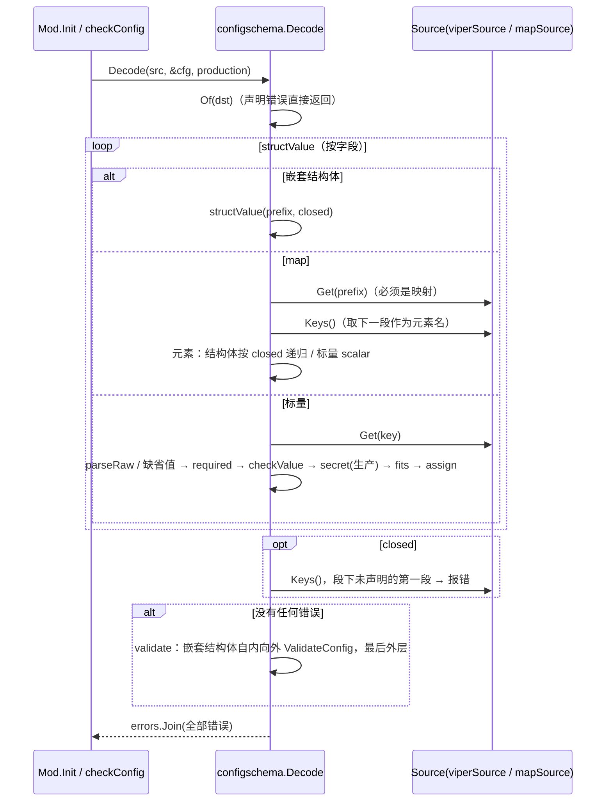
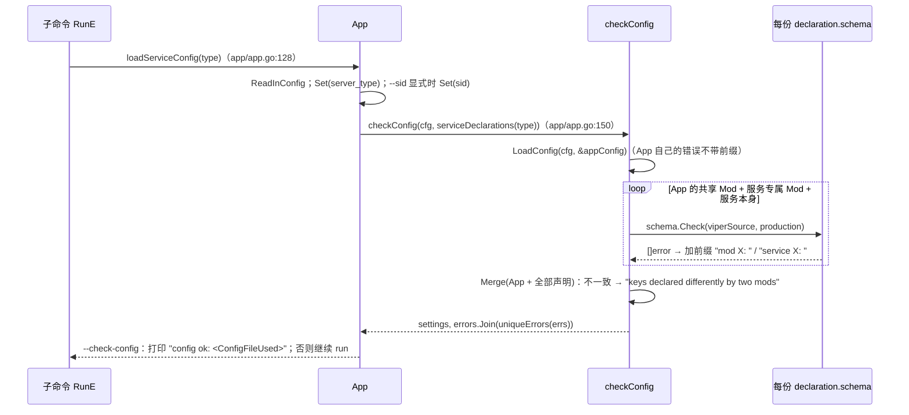
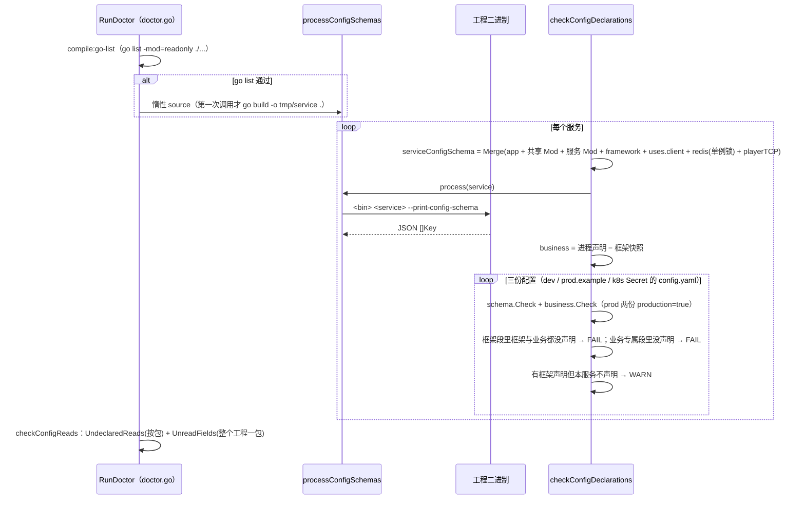
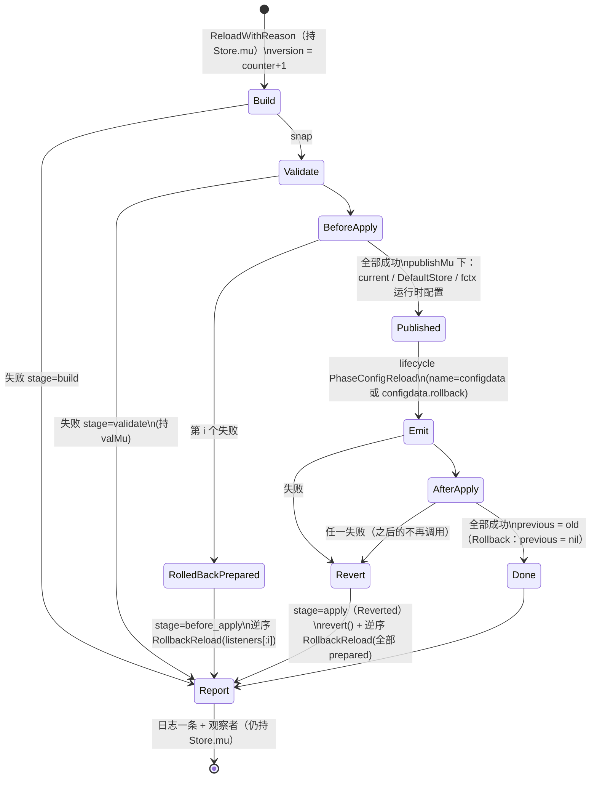
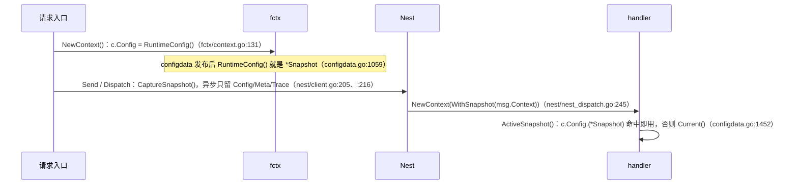
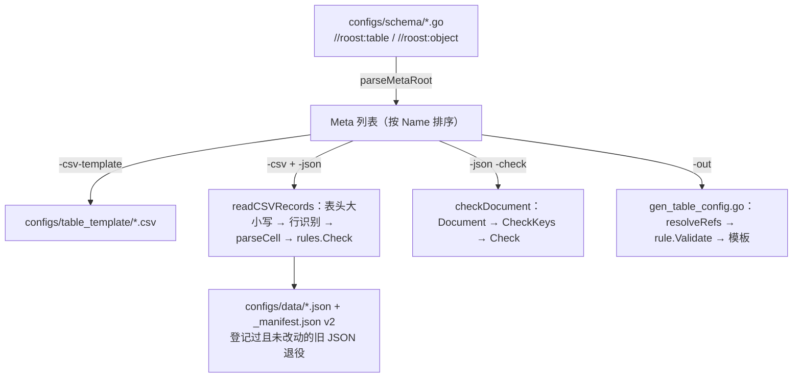

# 07 配置（实现）

> 配套说明文档：[guide/07-config.md](../guide/07-config.md)（是什么、怎么用、配置、运维、保证）。
> 读者：review agent 与要改这一块代码的人。源码基准：tag `v1.23.0`（`28912cd6`），全部 `path:line` 按这个 tag。
> 图谱说明：codebase-memory 的索引代际落后于 tag。`internal/configschema/*`、`app/config_schema.go`、`configdata/rules`、`configdata/keyspelling.go`、`codegen/internal/roost/config_schema_doctor.go`、`kit/internal/configschemagen` 不在图谱里（`not_tracked`），`configdata/configdata.go`、`hotcode/registry.go`、两个生成器是 `metadata_changed`。本篇只用图谱定位，结论全部按 tag 源码直接读取。

## 速览

- **服务配置**只有一份声明：配置结构体的 tag 经 `configschema.Of`（`internal/configschema/schema.go:90`）推成 `[]Key`。读取（`Decode`，`internal/configschema/check.go:23`）、启动检查（`app.checkConfig`，`app/config_schema.go:85`）、生成器（`kitconfig_gen.go` 快照 + `StarterYAML`）、doctor（`Schema.Check` + `Undeclared`）都从它出发。由结构体得到的 `Schema` 记着类型，`Check` 会解码一份新结构体，所以跨键规则 `ValidateConfig` 也会跑；从数据构造的 `Schema`（快照、`Merge` 结果、doctor 读回的 JSON）只按键检查，**不跑** `ValidateConfig`。
- **业务数据**的核心是 `configdata.Store`：`build`（读文件 → 键拼写 → 列规则 → 主键 → ref → `Validate*` → custom → 哈希）在锁外也能跑（DryRun）；`commit` 在 `Store.mu` 下走监听者四段协议，发布（`current`、`DefaultStore`、`fctx` 运行时配置三处）在全局 `publishMu` 下一次完成，AfterApply 失败时作为一个整体撤回。每次 Load / Reload / Rollback 恰好 `report` 一次。
- **请求钉住**靠 `fctx.Context.Config`：`NewContext` 时取 `fctx.RuntimeConfig()`，Nest 消息把它放进信封随消息传递，`ActiveSnapshot()` 先读它。
- **最容易改坏的地方**：`Decode` 与数据 `Check` 两条路径对 closed / map / 未知键的判断要保持一致；`commit` 的撤回只恢复“仍指向本次提交”的全局槽位；`runReloadBeforeApply` 返回的 `prepared` 决定谁收到 `RollbackReload`；tablegen 的 `Field.JSON` 回落到 csv 名（§11 F1）。

### 本篇覆盖的包

| 包 | 职责 |
| --- | --- |
| `internal/configschema` | tag → `Schema`、严格解析、`Decode` / `Check` / `Undeclared`、`Merge`、YAML 渲染、源码守卫 |
| `app`（配置部分） | `SchemaOf` / `LoadConfig` / `CheckConfig`、viper 适配器、`appConfig`、三个 CLI 开关 |
| `kit/internal/configschemagen` | 把 app 与 kit 的声明快照成 `codegen/internal/roost/kitconfig_gen.go` |
| `codegen/internal/roost`（配置部分） | 渲染配置段、doctor `config-schema:<服务>` / `config-reads`、`roost config check` |
| `configdata`、`configdata/rules` | 快照、定义、Store、规则与拼写检查 |
| `kit/configdata` | `config_data` Mod |
| `codegen/internal/tablegen`、`codegen/internal/cfggen` | 两条业务数据生成管线 |
| `featureflag`、`hotcode` | 进程内开关表、函数补丁点 |

---

## 1. 包与文件地图

| 文件 | 职责 |
| --- | --- |
| `internal/configschema/schema.go` | `Kind` / `Key` / `Schema` / `Validator`；`Of`（带 `sync.Map` 缓存）、`collectKeys` / `collectField` / `collectElem`、`checkDeclaration`、`checkKeyTree`、`Merge`、`Sections` |
| `internal/configschema/check.go` | `Source` 接口；`Decode` 与 `decoder`（`structValue` / `mapValue` / `scalar` / `read` / `validate`）；数据 `Schema.Check`；`Unknown` / `Undeclared`；`NewMapSource`（YAML → `Source`） |
| `internal/configschema/parse.go` | `ParseBool` / `Duration` / `Int` / `Float` / `String` / `Strings`；`checkValue`（min / max / enum）；`fits`（整数宽度） |
| `internal/configschema/yaml.go` | `StarterYAML`（生成器）与 `ReferenceYAML`（`--print-config`） |
| `internal/configschema/guard.go` | `GoPackages`、`UndeclaredReads`、`UnreadFields`：AST 守卫 |
| `app/config_schema.go` | `ConfigSchema` 别名、`ModConfigSchema`、`SchemaOf`、`LoadConfig`、`CheckConfig` / `checkConfig`、`ServiceConfigSchema`、`viperSource`、`environmentConfig`、`ServiceIdentity`、`appConfig` |
| `app/config_values.go` | 单键严格读取 `ConfigBool` / `ConfigDuration` / `ConfigInt` / `ConfigInt64`（工具与测试用） |
| `app/config_validation.go` | `ValidateServiceConfig`（= `CheckConfig(cfg)`）、`uniqueErrors` |
| `app/app.go:83`～`:178` | 子命令与 `--check-config` / `--print-config` / `--print-config-schema`；`loadServiceConfig`（装配时机归 [01](01-app-lifecycle.md)） |
| `kit/internal/configschemagen/main.go` | `groups()` 单元表、`render`、`-check` |
| `codegen/internal/roost/kitconfig_gen.go` | 生成的 `kitConfigSchemas map[string]configschema.Schema` |
| `codegen/internal/roost/catalog.go:16`～`:31` | `go:generate` 指令、`modConfigSection`、`frameworkConfigSection` |
| `codegen/internal/roost/config_schema_doctor.go` | `processConfigSchemas`、`businessDeclarations`、`serviceConfigSchema`、`checkConfigDeclarations`、`checkServiceConfigText`、`checkConfigReads` |
| `codegen/internal/roost/doctor.go:810` | `CheckConfig`（`roost config check`：只查 YAML 与 `sid`） |
| `configdata/doc.go` | B10 与 C2 契约的权威文字 |
| `configdata/configdata.go` | `Snapshot`、`Table`、`TableDef` / `ObjectDef` / `CustomDef`、`Registry`、`Store`、监听者、`commit`、`build`、`ActiveSnapshot`、`readJSON` |
| `configdata/fieldrules.go` | `FieldRule` / `RuleError` 别名、`resolveRules`（注册期规则绑定字段）、`checkRefs` |
| `configdata/keyspelling.go` | `checkKeySpelling` 与 `spellingWalker`（逐层大小写检查） |
| `configdata/auto.go` | `RegisterAutoTable`：`cfg` 标签 → key / index / rules |
| `configdata/external.go` | `RegisterExternalTables`：外部聚合体 + 文件指纹 |
| `configdata/rules/rules.go` | `Rule`、`Error`、`Document`、`Rows`、`MisspelledKey`、`CheckKeys`、`Check` / `CheckObject`、`Canonical` |
| `kit/configdata/configdata.go` | `config_data` Mod：声明、Store 构造、结果 → 指标、`Start` 时 Load |
| `codegen/internal/tablegen/main.go` | schema 解析、CSV 模板、CSV → JSON（含 manifest）、`-check`、生成 loader 与访问函数 |
| `codegen/internal/cfggen/main.go` | YAML meta 校验、groups 导出、生成结构体 / 注册 / 访问函数 |
| `featureflag/flags.go` | `Store`（RWMutex map + 原子版本） |
| `hotcode/registry.go`、`admin.go`、`plugin.go`、`plugin_stub.go` | 补丁点、admin 命令、Go plugin 加载 |
| `fctx/context.go` | `Context.Config`、`SetRuntimeConfig` / `RuntimeConfig`、`ContextSnapshot`（钉住依赖它） |

→ [说明文档](../guide/07-config.md)对应：§1 定位与边界。

## 2. 关键类型与数据结构

| 类型 | 位置 | 要点 |
| --- | --- | --- |
| `configschema.Kind` | `internal/configschema/schema.go:24` | bool / int / float / duration / string / strings / map / section。`section` 只给生成器写段注释，以及标记 closed |
| `configschema.Key` | `internal/configschema/schema.go:40` | 全部字段导出，可写成 Go 字面量与 JSON。`Starter` 由 `example` tag 是否**存在**决定（`tag.Lookup`，`:166`、`:180`） |
| `configschema.Schema` | `internal/configschema/schema.go:63` | `Keys` + 未导出的 `typ`。`typ != nil` 时 `Check` 走 `Decode`（`check.go:300`） |
| `configschema.Validator` | `internal/configschema/schema.go:70` | `ValidateConfig(production bool) error` |
| `schemaCache` | `internal/configschema/schema.go:77` | `reflect.Type → Schema`，`Of` 每类型只推一次 |
| `configschema.Source` | `internal/configschema/check.go:14` | `Get(key) (value, set)` + `Keys()`（叶子键）。实现：`app.viperSource`（`app/config_schema.go:156`）、`mapSource`（`check.go:443`） |
| `decoder` | `internal/configschema/check.go:39` | `src`、`production`、`errs`：错误只追加不提前返回 |
| `configDeclaration` | `app/config_schema.go:48` | `owner`（`mod <名>` / `service <名>`）+ `schema` |
| `appConfig` | `app/config_schema.go:203` | 嵌入 `ServiceIdentity`、`environmentConfig`；`log` / `time` / `metrics` / `shutdown` / `singleton` |
| `kitConfigSchemas` | `codegen/internal/roost/kitconfig_gen.go` | 键为单元名（`app`、Mod 名、服务名、`<服务>.client`），值为合并后的 `Schema`（无 `typ`） |
| `Snapshot` | `configdata/configdata.go:39` | `Version` / `LoadedAt` / `Hash` + `tables` / `objects` / `custom` / `fingerprints`。`Hash` 非空即封存，`SetFingerprint` 之后无效（`:72`） |
| `Table[K, V]` | `configdata/configdata.go:185` | `rows`（文件顺序）、`byKey map[K]int`、`indexes map[name]map[string][]int`。`MarshalJSON` 输出名字 + 行（`:227`），哈希靠它 |
| `BuildContext` | `configdata/configdata.go:299` | `Dir`、正在构建的 `Snapshot`、`StrictJSON`；只在 build 内有效 |
| `TableDef` / `ObjectDef` / `CustomDef` | `configdata/configdata.go:400` / `:494` / `:556` | 内部接口 `tableDef` / `objectDef` / `customDef`（`:366`～`:389`）：`declare` / `load` / `validate` / `build` |
| `Registry` | `configdata/configdata.go:594` | 三个切片 + `names map[Name]kind`。重名（含同类）一律报错（`:639`） |
| `ReloadEvent` | `configdata/configdata.go:703` | `Reason` / `Old` / `New` / `StartedAt` / `AppliedAt` |
| `ReloadListener` / `ReloadHook` | `configdata/configdata.go:711` / `:719` | 四段回调；`ReloadHook` 的空函数视为成功 |
| `Store` | `configdata/configdata.go:763` | `registry`、`dir`（`dirMu`）、`strict`、`lifecycle`、`current` / `previous`（原子指针）、`version`（单调计数器）、`mu`（Load / Reload / Rollback 串行）、`valMu`（ValidateReload 串行）、`listMu`（监听者 / 观察者表） |
| `ReloadStage` / `ReloadOutcome` | `configdata/configdata.go:890` / `:914` | 阶段 `build` / `validate` / `before_apply` / `apply`；`Reverted()` = 有错且阶段为 apply（`:936`） |
| `commitRequest` | `configdata/configdata.go:1008` | `clearPrevious`：Rollback 消耗一级撤销槽 |
| `publishMu` | `configdata/configdata.go:1024` | 进程级：串行化 `defaultStore` 与 `fctx` 运行时配置的切换 |
| `defaultStore` / `defaultRegistry` | `configdata/configdata.go:1428` | 生成代码注册到 `DefaultRegistry()`；`DefaultStore()` 是最近一次发布成功的 Store |
| `rules.Rule` / `rules.Error` | `configdata/rules/rules.go:30` / `:72` | `FieldRule` / `RuleError` 是它们的别名（`configdata/fieldrules.go:16`、`:20`） |
| `resolvedRule` | `configdata/fieldrules.go:23` | 规则 + 字段索引路径 + 字段类型 |
| `spellingWalker` | `configdata/keyspelling.go:52` | 每次加载一个；缓存结构体的 json 名 |
| `autoSpec` / `autoField` | `configdata/auto.go:165` / `:174` | 标签解析结果；`autoField.depth` 用于模拟 encoding/json 的提升与遮蔽 |
| `refKeyLookup` | `configdata/auto.go:466` | 每个 `*Table` 都实现：不知道目标表类型参数也能查主键 |
| `fctx.Context.Config` | `fctx/context.go:17` | 钉住的那一代（`any`，configdata 断言成 `*Snapshot`） |
| `fctx.ContextSnapshot` | `fctx/context.go:31` | Nest 信封；异步时只保留 `Config` / `Meta` / `Trace`（`nest/nest.go:686`） |
| tablegen `Meta` / `Field` | `codegen/internal/tablegen/main.go:45` / `:58` | `Field.JSON` 缺省回落为 csv 名（`:275`），见 §11 F1 |
| tablegen `tableJSONManifest` | `codegen/internal/tablegen/main.go:453` | `version`（2）、`generated_at`（从未写入）、`tables{file: sha256}` |
| cfggen `Meta` / `TableMeta` / `FieldMeta` | `codegen/internal/cfggen/main.go:59` / `:120` / `:130` | YAML meta 的结构（`KnownFields` 解析） |
| `featureflag.Store` | `featureflag/flags.go:15` | `mu` + `flags` + `ver`；`Replace` 在锁内加版本（`:62`～`:68`） |
| `hotcode.pointState` / `point` | `hotcode/registry.go:48` / `:59` | 每代状态整体发布（`atomic.Pointer`）；写者持 `writeMu` |
| `hotcode.Registry` | `hotcode/registry.go:96` | `mu`（点表）+ `applyMu`（串行 `ApplyBundle` 与 admin revert） |

→ [说明文档](../guide/07-config.md)对应：§2 核心概念与术语。

## 3. 主流程

### 3.1 tag → 声明（`configschema.Of`）

1. 解引用到结构体类型，查 `schemaCache`（`schema.go:90`～`:100`）。
2. `collectKeys`（`schema.go:123`）按字段顺序：
   - 无 `config` tag：匿名嵌入的结构体**同前缀**递归（`:129`）；导出字段没有 tag 报 `has no config tag`（`:135`）；未导出字段跳过。
   - 有 tag：字段必须导出（`:140`）；名字非空、全小写、不含空格与 `*`（`:143`）；`joinKey`（`:115`）——前缀以 `_` 结尾时直接拼接，否则加 `.`。
3. `collectField`（`:154`）：
   - 嵌套结构体（不是 `time.Duration`）：有 `help` 或 `,closed` 时先记一个 `KindSection` 键（`:157`），再递归。
   - map：键必须是字符串；记一个 `KindMap` 键，元素走 `collectElem(full+".*")`（`:161`）。结构体元素**总是** `Closed: true` 的 section（`:200`）；map 的 map 再加一层 `*`。
   - 标量：`kindOf`（`:216`）；读 `default` / `min` / `max` / `required` / `secret` / `help` / `example`；`enum` 只用于 string，拆分后**小写化**（`:181`）。
4. `checkDeclaration`（`:238`）：default / min / max 必须能按类型解析；default 还要过 `checkValue` 与 `fits`；example 非空且不含 `{` 时也要能解析、过 `checkValue`。
5. `checkKeyTree`（`:269`）：同名键（两个 section 除外）与“既是值又是段”都拒绝。

### 3.2 读取（`Decode`）



- `read`（`check.go:209`）的顺序：写了且非 nil → `parseRaw`；否则有 default → `parseValue`；然后 required（空 = nil / 空白串 / 空列表，`parse.go:207`）；有值才 `checkValue`；生产且 `secret` 时检查非空、非 `dev-`（`check.go:236`）。
- `validate`（`check.go:273`）不对**匿名嵌入**单独调用：被嵌入类型的 `ValidateConfig` 经方法提升由外层那一次调用执行；外层自己定义了就遮住它（`kit/dataengine/mod.go:160` 显式调用被嵌入的那个）。
- `production` 由 `isProductionServiceConfig`（`app/config_schema.go:186`）先单独解码 `environmentConfig` 得出；它自己的错误被丢弃，由后面完整检查报出。

### 3.3 启动检查与 CLI（装配时机见 [01 实现 §3.1](01-app-lifecycle.md#31-cli-分派)）



- `serviceDeclarations`（`app/config_schema.go:127`）= `modDeclarations(a.mods + entry.mods)` + 服务（若实现 `ModConfigSchema`）。
- `--print-config` 与 `--print-config-schema` 不读配置文件，只做 `ServiceConfigSchema`（`Merge`，`app/config_schema.go:118`）：前者 `ReferenceYAML`，后者把 `schema.Keys` 编码成 JSON（`app/app.go:170`）。
- 进程**不报**没人声明的键（`app/config_schema.go:97` 注释）；只有 closed 段与 map 下会报。

### 3.4 两种 `Schema.Check`

| | 由结构体得到（`typ != nil`） | 由数据构造（快照、Merge、doctor 读回） |
| --- | --- | --- |
| 入口 | `Decode(src, new(typ))`（`check.go:300`） | 逐键 `read`（`check.go:303`～`:340`） |
| closed 段 | `structValue` 的 `known` 集合（含匿名嵌入的子名，`check.go:92`） | 由同前缀的其他键推出 `known`（`check.go:307`）；名字含 `*` 的 section 跳过，交给末尾的 map 根检查 |
| map 下未知键 | 元素结构体按 closed 递归 | `mapRoot` 命中但 `declares` 不命中 → `is not a known key under <root>`（`check.go:335`） |
| `ValidateConfig` | 执行 | **不执行** |
| 使用者 | App 启动检查、`--check-config`、`LoadConfig` | doctor `config-schema`、`TestGeneratedConfigsMatchDeclarations` |

### 3.5 生成器：快照与渲染

```mermaid
flowchart LR
    K[kit Mod / app.AppConfigSchema] -->|groups()| G[configschemagen.render]
    G -->|Merge 同单元；冲突即失败| F[kitconfig_gen.go]
    F --> C1[modConfigSection / frameworkConfigSection<br/>StarterYAML]
    F --> D1[doctor serviceConfigSchema<br/>allFrameworkConfigSchema]
    C1 --> Y[configs/service/config.*.yaml 等]
```

- `groups()`（`kit/internal/configschemagen/main.go:50`）列出单元；`render`（`:115`）按名排序、`keyLiteral` 只写非零字段（`:144`），`go/format` 后写出。`-check` 比较字节，不同即退出 1（`:101`）。
- `go:generate` 指令在 `codegen/internal/roost/catalog.go:16`；CI 的 “go generate leaves the tree unchanged” 一步（`.github/workflows/ci.yml:62`）与 `TestKitConfigSchemasMatchKitDeclarations`（`codegen/internal/roost/config_declarations_promises_test.go:23`）两处抓漂移。
- `StarterYAML`（`internal/configschema/yaml.go:10`）只写 `Starter` 键，跳过含 `*` 的键；`{name}` 占位符按 vars 替换。`ReferenceYAML`（`:24`）写全部键：含占位符的 starter 键改写 default。

### 3.6 doctor



- `processConfigSchemas` 编译超时 5 分钟、每次运行 1 分钟（`config_schema_doctor.go:58`、`:70`）；`process` 返回错误时该服务的 `config-schema` 直接 FAIL（`:192`）。
- `roost config check`（`doctor.go:810`，`make config-check-all` 在 `make ci` 里）只查能解析、有 `sid`，生产模式查 `change_me` / `127.0.0.1` / `localhost` / `dev-` 子串，**不读声明**。

### 3.7 configdata：一次 build

`Store.build`（`configdata/configdata.go:1312`），每一步之前检查 `ctx.Err()`，每个定义包在 `safeDef`（panic → 错误，带栈）里：

1. 取一次 `Dir()` 并 `Stat`（必须是目录）。`defs()` 拷贝三张定义表（`configdata/configdata.go:658`）。
2. **表 load**（`configdata/configdata.go:435`）：`readJSON` → `rules.Document`（拒绝空 / null / null 包装 / 多包装，`configdata/rules/rules.go:102`）→ 解码（严格模式 `DisallowUnknownFields` + 拒绝尾随内容，`configdata/configdata.go:1484`）→ `checkKeySpelling`（`configdata/keyspelling.go:22`）→ 有规则时 `rules.Rows` + `rules.Check`（required / unique / min / enum）→ `newTable`（主键重复即错，`configdata/configdata.go:201`；建二级索引）。
3. **对象 load**（`configdata/configdata.go:514`）：同上，`CheckObject`。
4. **表 validate**（`configdata/configdata.go:466`）：`checkRefs`（目标表存在、键类型兼容——空表也查；零值且非 required 跳过；`configdata/fieldrules.go:142`）→ `ValidateTable` → 每行 `Validate`。
5. 对象 validate → custom build（可以假定 ref 完整，`configdata/configdata.go:1373`）→ custom validate。
6. `finalize`（`configdata/configdata.go:106`）：按 table / object / custom 分类、名字排序，长度前缀写入 sha256；有指纹用指纹；`json.Marshal` 失败或结构体全未导出（`"{}"`）即 build 失败；未消费的指纹名报错。

### 3.8 configdata：一次 Reload（状态机）



- `commit`（`configdata/configdata.go:1039`）是 Reload 与 Rollback 共用的唯一发布路径。
- `revert`（`:1061`）总是把本 Store 的 `current` 换回 `old`；全局两槽只有在 `DefaultStore() == s && fctx.RuntimeConfig() == req.target` 时才恢复，避免冲掉另一个 Store 在此期间的发布。
- `old == nil`（首次 Load）时 `runReloadRollback` 直接返回，不调用任何 `RollbackReload`（`:1297`）。
- `runReloadBeforeApply` 返回失败监听者的下标 `i`（`:1273`），所以失败的那个自己不收到 `RollbackReload`；apply 阶段失败时 `prepared = len(listeners)`，全部收到。

### 3.9 DryRun 与 Rollback

- `DryRun`（`:1106`）：**不持** `Store.mu`；`build` 也占一个版本号；`ValidateReload` 在 `valMu` 下；不发布、不 `report`。
- `Rollback`（`:1126`）：持 `Store.mu`；`previous` 为 nil 时报 `previous snapshot not found`（stage 记 build）；否则以 `previous` 为目标走 `commit`（`clearPrevious: true`，`emitName: configdata.rollback`，`extra.from_version`）。成功后 `previous` 清空，所以只有一级撤销；目标快照保留原版本号，版本会回落。

### 3.10 请求钉住



- `app.run` 先把 `*viper.Viper` 设成运行时配置（`app/app.go:189`），config_data Mod 的 `Start` 首次发布后才换成 `*Snapshot`。在这之间创建的请求上下文里 `Config` 是 viper，`ActiveSnapshot` 断言失败、回落 `Current()`（不钉住）。
- 只有 tablegen 生成的 `<T>Table()` 用 `ActiveSnapshot()`（`codegen/internal/tablegen/main.go:846`）；cfggen 的访问函数要调用方显式传快照。

### 3.11 tablegen 管线



- `roost generate` 依次跑 `config-template`、`config-data`（`configs/table` 没有 CSV 且 manifest 不拥有任何 JSON 时跳过）、`config-go`，都带 `-force`（`codegen/internal/roost/generate.go:132`～`:157`）。
- schema 解析（`main.go:187`）：标记必须在 `type` 的**上一行**（`markers[line-1]`，`:231`）；只取导出字段；`csv` 缺省 `snake(Name)`，`json` 缺省 = csv 名（`:267`～`:277`）；表的 `key=` 不写取第一个字段（`:292`）。
- `metaRules`（`:559`）是 tag → 规则的唯一翻译：CSV 转换、`-check` 与生成 loader 的 `Rules` 字面量都用它；表的主键隐含 unique（`:569`）。
- 生成的 loader（模板 `:760` 起）：`RegisterGeneratedConfigData` 对每个 meta 调 `configdata.RegisterTable` / `RegisterObject`，值类型是 schema 包里的原类型（`meta%d.Type`）——**运行时按这个 Go 类型的 json 名解码**，不是按 meta 的 `Field.JSON`。

### 3.12 cfggen 管线

1. `Run`（`codegen/internal/cfggen/main.go:163`）：`yaml.v3` 以 `KnownFields(true)` 解析 meta；`globals` 与兼容别名 `objects` 合并（`globalEntries`，`:76`）。
2. 可选 groups 导出（`exportForGroups`，`:242`）。
3. `validateMeta`（`:359`）：标识符冲突登记表；表必须有 key 且 key 类型可用；globals 拒绝 key / index / ref / unique（`:447`～`:465`）；beans 拒绝全部规则与 ref / index（`:492`～`:497`）；bean 环（`:524`）；跨表 ref 目标与类型（`:504`）。字段规则经 `validateFieldRules`（`:637`）用 `rules.Rule.Validate` 检查。
4. `generate`（`:702`）：表 → 带 `json` 与 `cfg` tag 的结构体 + `RegisterAutoTable`；globals → `RegisterObject` + `ObjectDef.Rules` 字面量（`globalRulesLiteral`，`:796`）；`//roost:register phase=config` 的 `RegisterConfigData` 注册到默认 Registry（`:749`）。

### 3.13 featureflag 与 hotcode

- featureflag：`Set` / `Replace` 在写锁内改 map 并加版本；`Enabled` 读锁。没有订阅、没有持久化。
- hotcode：
  - `Register`（`hotcode/registry.go:167`）记下原函数与签名；`Replace`（`:190`）签名必须完全相同，在 `writeMu` 下发布新一代 `pointState`；`Revert`（`:212`）发布原函数。
  - `Resolve[T]`（`:134`）无锁读当前代；签名只差命名时 `reflect.Convert`，真不同时回落 fallback 并计数（`:157`）。
  - `ApplyBundle`（`:261`）持 `applyMu`，先 `snapshot()` 各点当前代；`Apply` 返回错误或 panic 时把有变化的点 `restore` 成应用前那一代。admin 的 `hotcode.revert` 走 `revertBetweenApplies`（`:284`）与之串行。
  - `LoadPlugin`（`hotcode/plugin.go:27`）：`.so` 后缀检查 → `plugin.Open` → `Lookup("PatchBundle")`，接受值或 `*Bundle` → `Default.ApplyBundle`。

→ [说明文档](../guide/07-config.md)对应：§4 怎么用。

## 4. 不变量清单

| # | 内容 | 强制位置 | 守卫测试 |
| --- | --- | --- | --- |
| C-01 | 声明写错（tag 名不合法、default / min / max / example 解析不了或越界、enum 用在非 string、同名键、值与段冲突、不支持的类型）在 `Of` 时失败，`SchemaOf` panic | `internal/configschema/schema.go:143`、`:182`、`:238`、`:269`；`app/config_schema.go:64` | `TestOfRefusesBadDeclarations`（`internal/configschema/schema_test.go:149`） |
| C-02 | 读取取缺省、写了就按类型严格解析，全部错误一次报出且点名键；`ValidateConfig` 只在声明检查全通过后调用 | `internal/configschema/check.go:23`～`:37` | `TestDecodeAppliesDefaultsAndReadsValues`（`schema_test.go:61`）、`TestDecodeReportsEveryBadKeyByName`（`:76`）、`TestDecodeRunsValidateConfigOnlyAfterDeclarationsPass`（`:95`）、`TestLoadConfigFillsDefaultsAndRefusesOutOfRangeValues`（`app/config_declarations_promises_test.go:103`） |
| C-03 | 布尔不认 `on` / `yes`，时长要单位，整数不认 `8k` / `1.5` | `internal/configschema/parse.go:22`、`:42`、`:73` | `TestValidateServiceConfigRejectsABoolSwitchThatIsNotABool`（`app/config_types_promises_test.go:27`）、`TestValidateServiceConfigRejectsADurationWithoutAUnit`（`:54`）、`TestConfigIntAcceptsWholeNumbersOnly`（`app/config_declarations_promises_test.go:30`）、`TestKitModsRefuseConfigValuesOfTheWrongType`（`kit/strict_config_promises_test.go:21`） |
| C-04 | 生产环境 `secret` 键非空且不以 `dev-` 开头 | `internal/configschema/check.go:236` | `TestProductionSecrets`（`schema_test.go:103`）、`TestProductionRefusesDevSecrets`（`kit/config_schema_promises_test.go:173`） |
| C-05 | 数据 `Schema` 与结构体 `Schema` 对同一份配置给出相同的声明检查结果（除 `ValidateConfig`） | `internal/configschema/check.go:299` | `TestDataSchemaChecksLikeTheStruct`（`schema_test.go:119`） |
| C-06 | 同一键两份声明必须完全相同，否则启动失败 | `internal/configschema/schema.go:296`；`app/config_schema.go:100` | `TestMergeRefusesConflictingDeclarations`（`schema_test.go:134`）、`TestEveryKitModLoadsWhatItDeclares`（`kit/config_schema_promises_test.go:86`）、`TestPlayerTCPDeclarationAgreesWithKit`（`codegen/internal/roost/config_declarations_promises_test.go:153`） |
| C-07 | 启动检查覆盖 App + 本服务全部 Mod + 服务本身，在任何 Mod Init 之前，错误一次报全并点名主人 | `app/app.go:150`；`app/config_schema.go:85`～`:104`、`:127` | `TestCheckConfigReportsEveryModsErrorsAtOnce`（`app/config_declarations_promises_test.go:80`）、`TestServiceDeclarationsAreCheckedAndPrintedWithTheMods`（`:126`）、`TestKitModsRefuseOutOfRangeValuesAtLoadAndAtStartup`（`kit/config_schema_promises_test.go:115`）、`TestCheckConfigErrorsAreJoined`（`:232`） |
| C-08 | 框架代码读配置只经声明；每个声明的字段都被读 | `internal/configschema/guard.go:66`、`:144` | `TestFrameworkModsReadConfigOnlyThroughDeclarations`（`app/config_declarations_promises_test.go:171`）、`TestEveryDeclaredConfigFieldIsRead`（`:201`）、`TestConfigDeclarationGuardsCatchTheirDrift`（`:230`） |
| C-09 | 生成工程（game-demo）同样只经声明读、声明都被读；doctor `config-reads` 能红 | `codegen/internal/roost/config_schema_doctor.go:295` | `TestGeneratedProjectsReadConfigOnlyThroughDeclarations`（`codegen/internal/roost/config_reads_promises_test.go:56`）、`TestGeneratedProjectConfigGuardCatchesDrift`（`:86`） |
| C-10 | `internal/configschema` 与 `configdata/rules` 只依赖标准库（codegen 要导入） | — | `TestSharedConfigRulesStayALeaf`（`dependency_boundary_test.go:215`）、`TestCoreDependencyBoundary`（`:16`） |
| C-11 | 生成器快照与 kit 当前声明一致 | `kit/internal/configschemagen/main.go:101` | `TestKitConfigSchemasMatchKitDeclarations`（`codegen/internal/roost/config_declarations_promises_test.go:23`）；CI `go generate` 干净（`.github/workflows/ci.yml:62`） |
| C-12 | 生成的每份配置按服务实际注册的 Mod 检查通过，框架段没有声明之外的键；开发、生产示例与 Secret 示例都能过真实 `app.ValidateServiceConfig`（含 `env: production`） | `codegen/internal/roost/catalog.go:23`、`:29` | `TestGeneratedConfigsMatchDeclarations`（`config_declarations_promises_test.go:61`）、`TestGeneratedConfigCheckCatchesDrift`（`:99`）、`TestA4GeneratedConfigsPassValidation`（`generated_config_validation_promises_test.go:45`）、`TestGeneratedConfigsPassStrictAndProductionValidation`（`:161`，`-short` 跳过） |
| C-13 | doctor 读回业务声明：新生成的 game-demo 零 WARN / 零 FAIL，去掉服务的 `ConfigSchema` 后 WARN 回来 | `codegen/internal/roost/config_schema_doctor.go:42`、`:99` | `TestDoctorReadsBusinessDeclarationsFromTheProcess`（`config_reads_promises_test.go:132`，`-short` 跳过）、`TestGameDemoConfigsPassTheDoctorConfigCheck`（`config_declarations_promises_test.go:174`） |
| C-14 | 生产环境 `time.logic_offset` 必须为 0；`server_type` 必填；`sid` 为正 | `app/config_schema.go:234` | `TestProductionRefusesANonZeroLogicOffset`（`app/logic_offset_production_promises_test.go:12`）、`TestValidateServiceConfigAcceptsMinimalConfig`（`app/config_validation_test.go:9`） |
| C-15 | 数据文件形状：空 / null / null 包装 / 多包装一律拒绝 | `configdata/rules/rules.go:102` | `TestDocumentRefusesVanishingAndAmbiguousData`（`configdata/rules/rules_test.go:89`）、`TestReadJSONRejectsNullAndAmbiguousWrappers`（`configdata/reload_commit_test.go:239`）、`TestWrapperDocumentsHappyPathAndGuards`（`configdata/review_round2_test.go:110`） |
| C-16 | 每次 Load / Reload / DryRun 执行声明的规则，违反整次拒绝、旧快照不变，错误点名表 / 行 / 主键 / 字段 / 规则 | `configdata/configdata.go:454`～`:462`、`:529`～`:537`；`configdata/rules/rules.go:221` | `TestDeclaredRulesRejectReloadAndNameTheViolation`（`configdata/field_rules_promises_test.go:55`）、`TestCheckNamesTableRowKeyFieldAndRule`（`configdata/rules/rules_test.go:23`）、`TestReloadFailureKeepsOldSnapshot`（`configdata/configdata_test.go:98`） |
| C-17 | 规则声明在注册时检查：字段必须逐字是 json 名、类型适配、对象不许 unique / ref、同字段不许两条规则 | `configdata/fieldrules.go:33` | `TestRuleDeclarationsAreCheckedAtRegistration`（`field_rules_promises_test.go:98`）、`TestRuleFieldMustMatchTheJSONNameExactly`（`configdata/key_case_promises_test.go:156`）、`TestRuleValidateRejectsBadDeclarations`（`rules_test.go:112`） |
| C-18 | 数据键大小写敏感（逐层）；未声明的键行为不变 | `configdata/keyspelling.go:22`；`configdata/rules/rules.go:165` | `TestMisspelledKeysRejectLoad`（`key_case_promises_test.go:84`）、`TestMisspelledKeysRejectReloadAndDryRun`（`:104`）、`TestUndeclaredKeysKeepTheirBehaviour`（`:140`）、`TestCheckKeysRejectsCaseVariants`（`configdata/rules/key_spelling_promises_test.go:14`）、`TestLookupIsExact`（`:55`） |
| C-19 | ref：目标存在与键类型兼容在空表 / 全零列时也查；required ref 的零值也要存在 | `configdata/fieldrules.go:142`；`configdata/auto.go:457` | `TestAutoTableRefTargetCheckedEvenWhenColumnIsZero`（`configdata/auto_hardening_test.go:34`）、`TestAutoTableRefTypeMismatchIsSchemaError`（`:51`）、`TestAutoTableRequiredRefRejectsZero`（`:131`）、`TestAutoTableNamedAliasRefIsCompatible`（`:68`） |
| C-20 | 主键重复整次拒绝；同名定义（含同类）注册即错 | `configdata/configdata.go:201`、`:645` | `TestTableLoadRefusesDuplicateKeys`（`configdata/promises_test.go:25`）、`TestDuplicateRegistrationIsAnError`（`reload_commit_test.go:225`） |
| C-21 | custom 在全部表 / 对象校验之后 build；build / validate / 定义的 panic 变成 build 错误 | `configdata/configdata.go:1335`、`:1373` | `TestCustomBuildRunsAfterTableValidation`（`reload_commit_test.go:290`）、`TestBuildPanicInCustomBecomesError`（`:277`）、`TestExternalTablesBuildPanicBecomesError`（`auto_hardening_test.go:210`） |
| C-22 | 内容变化一定反映在 `Hash`；序列化不出 / 不透明的值让 build 失败；指纹名必须对应成员；外部表指纹与读取顺序无关 | `configdata/configdata.go:106`～`:164`；`configdata/external.go:122`～`:139` | `TestSnapshotHashCoversTableRowContent`（`configdata/configdata_test.go:238`）、`TestFinalizeMarshalErrorFailsBuild`（`auto_hardening_test.go:243`）、`TestOpaqueCustomWithoutFingerprintFailsBuild`（`review_round2_test.go:229`）、`TestUnknownFingerprintNameFailsBuild`（`:243`）、`TestSetFingerprintIsSealedAfterFinalize`（`:258`）、`TestExternalTablesContentDriftIsVisibleInHash`（`auto_hardening_test.go:184`）、`TestExternalFingerprintIsOrderIndependent`（`review_round2_test.go:313`） |
| C-23 | 外部表的读取不能逃出数据目录、build 返回后不能再读、一个文件都没读即失败 | `configdata/external.go:88`～`:123` | `TestRegisterExternalTablesRejectsPathEscape`（`configdata/auto_test.go:188`）、`TestExternalTablesReadInvalidAfterBuild`（`auto_hardening_test.go:222`）、`TestRegisterExternalTablesRebuildsOnReload`（`auto_test.go:147`） |
| C-24 | `RollbackReload` 只给 BeforeApply 成功过的监听者、逆序；首次 Load 不调用 | `configdata/configdata.go:1265`、`:1296` | `TestBeforeApplyFailureRollsBackOnlyPreparedListeners`（`reload_commit_test.go:157`）、`TestAfterApplyFailureRollsBackAllPreparedInReverse`（`:184`）、`TestFirstLoadFailureSkipsRollbackCallbacks`（`:207`）、`TestBeforeApplyPanicRollsBackOnlyPrepared`（`review_round2_test.go:14`） |
| C-25 | 监听者 panic 变成错误、走失败路径，状态一致 | `configdata/configdata.go:1215` | `TestListenerPanicFailsReloadAndKeepsStateConsistent`（`reload_commit_test.go:127`） |
| C-26 | 发布与撤回作为整体；撤回不冲掉另一个 Store 的发布；首次失败不在运行时配置里留 typed-nil | `configdata/configdata.go:1054`～`:1072` | `TestRevertRestoresAllGlobalSlots`（`review_round2_test.go:31`）、`TestFailedCommitDoesNotRollBackAnotherStorePublication`（`reload_commit_test.go:40`）、`TestFirstLoadFailureLeavesNoTypedNilInRuntimeConfig`（`review_round2_test.go:63`） |
| C-27 | 只有一级撤销；再次 Rollback 被拒 | `configdata/configdata.go:1095`、`:1135` | `TestRollbackRestoresPreviousPublishedSnapshot`（`configdata_test.go:149`）、`TestRollbackTwiceIsRejected`（`review_round2_test.go:77`） |
| C-28 | DryRun 不发布；与 Reload / SetDir 并发安全 | `configdata/configdata.go:1106` | `TestDryRunBuildsSnapshotWithoutPublishing`（`configdata_test.go:121`）、`TestConcurrentReloadDryRunAndSetDir`（`review_round2_test.go:286`） |
| C-29 | 每次 Load / Reload / Rollback 恰好一份结果；kit 按结果恰好一笔计数并设版本仪表 | `configdata/configdata.go:882`、`:1138`、`:1153`；`kit/configdata/configdata.go:72`～`:92` | `TestEveryReloadReportsOneOutcome`（`field_rules_promises_test.go:151`）、`TestFailedReloadAndRollbackAreCountedAndLogged`（`kit/configdata/reload_visibility_promises_test.go:56`） |
| C-30 | 请求读钉住的那一代；Nest 异步消息携带这一代 | `configdata/configdata.go:1452`；`fctx/context.go:131`；`nest/client.go:216`；`nest/nest_dispatch.go:245` | `TestStoreLoadReloadAndActiveSnapshot`（`configdata_test.go:23`）、`TestClientDispatchCarriesOnlyFrameworkEnvelope`（`nest/client_test.go:50`） |
| C-31 | 严格模式拒绝未知字段、包装对象与尾随内容 | `configdata/configdata.go:1484` | `TestStrictJSONRejectsUnknownFields`（`configdata/reload_commit_test.go:258`）、`TestStrictModeWrapperObjectAndTrailingJunk`（`configdata/review_round2_test.go:139`） |
| C-32 | auto 表标签错误在注册时失败（缺 key、类型不符、未知指令、遮蔽 / 并列的带标签字段、指针嵌入里的标签、skipempty 无 index） | `configdata/auto.go:190`～`:451` | `TestRegisterAutoTableTagMistakesFailAtRegistration`（`auto_test.go:98`）、`TestRegisterAutoTableRefusesEachTagMistakeByMessage`（`promises_test.go:73`）、`TestAutoTableRefusesTaggedTiesAndSkipEmptyWithoutIndex`（`auto_tag_guards_promises_test.go:10`）、`TestEmbeddedRefPositiveAndShadowingRejected`（`review_round2_test.go:174`） |
| C-33 | tablegen：一个 tag 同时驱动 CSV 转换、`-check` 与生成 loader 的规则；CSV 表头与 JSON 键大小写敏感 | `codegen/internal/tablegen/main.go:559`、`:605` | `TestOneTagDrivesTheGenerationCheckAndTheGeneratedLoader`（`codegen/internal/tablegen/rules_single_source_promises_test.go:17`）、`TestReadCSVRecordsEnforcesDeclaredRules`（`csv_rules_test.go:31`）、`TestCheckJSONEnforcesTheDeclaredRules`（`check_json_promises_test.go:26`）、`TestCheckJSONRejectsMisspelledKeys`（`key_case_promises_test.go:12`）、`TestCSVHeaderIsCaseSensitive`（`:30`） |
| C-34 | tablegen ref 目标必须是同 schema 的表、类型等于目标主键类型 | `codegen/internal/tablegen/main.go:1031` | `TestRefDeclarationsAreResolvedAtGeneration`（`check_json_promises_test.go:57`）；运行时 `codegen/scripts/tablegen-runtime.sh` |
| C-35 | tablegen 只退役 manifest 登记且未改动的 JSON；未登记的视为手写、永远保留；v1 manifest 遇未登记 JSON 要求人工处理 | `codegen/internal/tablegen/main.go:390`～`:447` | `TestConvertCSVToJSONRetiresOwnedDataAndPreservesManualData`（`retirement_test.go:11`）、`TestConvertCSVToJSONRefusesEditedOrLegacyUnownedRetirement`（`:40`）、`TestLegacyManifestUntrackedJSONErrorTellsRecoverySteps`（`legacy_manifest_promises_test.go:15`） |
| C-36 | cfggen：globals 的 required / min / enum 进 `ObjectDef.Rules`，unique / ref / index / key 拒绝；beans 拒绝规则；规则声明用与运行时相同的 `Rule.Validate` | `codegen/internal/cfggen/main.go:447`～`:497`、`:637`、`:796` | `TestCfggenGlobalRulesBecomeObjectDefRules`（`codegen/internal/cfggen/global_rules_promises_test.go:23`）、`TestCfggenGlobalRulesStillRejectWhatAnObjectCannotMean`（`:53`）、`TestCfggenRejectsEachFieldRuleForTheStatedReason`（`meta_promises_test.go:11`）；运行时 `codegen/scripts/cfggen-golden-runtime.sh` |
| C-37 | cfggen 生成的标识符冲突在写入前拒绝 | `codegen/internal/cfggen/main.go:364`～`:381` | `TestCfggenRejectsIdentifierCollisionsAndBadNames`（`main_test.go:155`）、`TestCfggenRejectsReservedBeanNamesBeforeWriting`（`namespace_promises_test.go:13`） |
| C-38 | featureflag 的版本与 map 一起可见 | `featureflag/flags.go:62`～`:68` | `TestReplaceVersionIsConsistentUnderConcurrentReads`（`featureflag/flags_test.go:35`） |
| C-39 | 补丁点状态整体发布：并发 Replace / Revert 不产生“函数与 Meta 不一致” | `hotcode/registry.go:69`～`:81` | `TestConcurrentReplaceAndRevertLeaveAConsistentPoint`（`hotcode/concurrent_patch_promises_test.go:18`）、`TestListReportsAClosurePatchFromTheSameFactoryAsPatched`（`patch_visibility_promises_test.go:11`） |
| C-40 | `Resolve` 签名只差命名时转换，真不同时计数 | `hotcode/registry.go:138` | `TestResolveConvertsAnIdenticalSignatureAndCountsRealMismatches`（`patch_visibility_promises_test.go:41`） |
| C-41 | 插件 Apply 失败或 panic 时恢复成应用前那一代 | `hotcode/registry.go:261` | `TestApplyBundleRollsBackWhenApplyPanics`（`patch_visibility_promises_test.go:74`） |
| C-42 | admin 命令登记到传入的实例；plugin 只接受 `.so`；非支持平台明确报错 | `hotcode/admin.go:28`；`hotcode/plugin.go:31`；`hotcode/plugin_stub.go` | `TestRegisterAdminCommandsTargetsInstanceRegistry`（`hotcode/admin_test.go:10`）、`TestLoadPluginRefusesEmptyAndNonSharedObjectPaths`（`plugin_guards_promises_test.go:13`）、`TestLoadPluginReportsUnsupportedPlatforms`（`plugin_stub_guards_promises_test.go:11`） |

→ [说明文档](../guide/07-config.md)对应：§7 保证与不保证。

## 5. 并发

| 对象 | 归属 / 锁 | 要点 |
| --- | --- | --- |
| `configschema.schemaCache` | `sync.Map` | `Of` 可以从任意 goroutine 调用；同一类型并发首次推导会重复计算，结果相同（覆盖写无害） |
| `app.viperSource` | 无锁 | 启动检查在 `run` 之前单线程执行；Mod `Init` 也是串行。viper 本身不是并发安全的，运行期不要再从多个 goroutine 调 `LoadConfig` 读同一个 viper（推断，未见守卫） |
| `Store.mu` | Load / Reload / Rollback 串行；`report` 与观察者在锁内同步执行 | 观察者不能回调本 Store 的 Load / Reload / Rollback（会自锁，`configdata.go:940` 注释）；观察者 panic 被吞掉 |
| `Store.valMu` | 只在 validate 阶段 | Reload 与 DryRun 的 `ValidateReload` 互斥 |
| `Store.listMu` | 监听者 / 观察者表、lifecycle 引用 | 执行回调前拷贝列表，回调时不持锁：回调里注册 / 注销监听者不死锁，但本次不生效 |
| `Store.dirMu` | `SetDir` / `Dir` | `build` 只取一次目录 |
| `publishMu` | 进程级 | 只包住三槽的写入与撤回判断，不包监听者回调 |
| `current` / `previous` / `version` | 原子 | `Current()` 无锁；版本号 `Add(1)` 在 DryRun 与 Reload 之间也不冲突 |
| 监听者回调 | 调用方 goroutine（持 `Store.mu`） | 回调阻塞即阻塞所有 Reload / Rollback；DryRun 的 build 不受影响 |
| `fctx` 运行时配置 | `runtimeConfigMu`（RWMutex） | 每次 `NewContext` 读一次 |
| `featureflag.Store` | RWMutex + 原子版本 | 不随请求钉住 |
| `hotcode.point` | `writeMu`（写者）+ `atomic.Pointer`（读者） | `Resolve` 不取锁；`ApplyBundle` 持 `applyMu`，admin revert 与之串行；直接调用 `Replace` / `Revert` 的业务代码不经过 `applyMu`（`registry.go:258` 注释写明会被一并恢复） |
| kit `config_data` Mod | `Start` 同步 Load | 启动期间在 App 的启动 goroutine 上执行；之后 reload 由业务 goroutine 触发 |

快池约束：`Store.Reload` 会做文件 I/O 与大量反射，**不能在 Nest 快池的 handler 里调用**（game-demo 的 `gm.config.reload` 走 admin 端点的 goroutine）。

→ [说明文档](../guide/07-config.md)对应：§4.11 热更与回滚。

## 6. 失败与不确定结果处理

| 场景 | 处理 | 位置 |
| --- | --- | --- |
| 配置值错 / 跨键规则错 | 启动前失败，错误只到 stderr（日志还没初始化） | `app/app.go:150`；[01 说明 §6.2](../guide/01-app-lifecycle.md#62-停机日志与退出) |
| 声明本身写错 | 第一次 `SchemaOf` panic（测试或启动） | `app/config_schema.go:64` |
| doctor 编译工程失败 | `go list` 失败：只做框架那一半；`go list` 过而 `go build` 失败或进程报错：该服务 FAIL | `codegen/internal/roost/doctor.go:73`～`:81`；`config_schema_doctor.go:192` |
| 数据 build 失败 | 不发布；`stage=build`；Warn 日志；`reload.total{failed}` | `configdata/configdata.go:873`～`:876` |
| validate / before_apply 失败 | 不发布；before_apply 时逆序回滚已准备的监听者 | `configdata/configdata.go:1045`～`:1052` |
| lifecycle emit / AfterApply 失败 | **已发布后撤回**；之间准入的请求读被撤回的一代；`reload.total{failed}` + `rollback.total{apply_failed}` | `configdata/configdata.go:1081`～`:1094`；`kit/configdata/configdata.go:81`～`:85` |
| 运维 Rollback 失败 | 记日志；不计任何计数（含 apply 阶段撤回的那种，§11 F4） | `kit/configdata/configdata.go:76`～`:78` |
| 监听者 / 观察者 / 定义 panic | 变成错误（带栈），走失败路径；观察者 panic 只吞掉 | `configdata/configdata.go:1215`、`:1335`、`:1000` |
| 回调里 `runtime.Goexit` | **不处理**：越过 recover，跳过撤回（`configdata.go:1213` 注释） | — |
| 启动 Load 失败 | `Start` 返回错误，App 启动失败 | `kit/configdata/configdata.go:100` |
| 插件 Apply 失败 / panic | 恢复改动过的点；错误带恢复的点数；Go 运行时无法卸载已加载的 plugin | `hotcode/plugin.go:55`；`hotcode/registry.go:268`～`:279` |
| `Resolve` 类型不符 | 回落 fallback，`ResolveMismatches` 计数（只能从 `hotcode.list` 看到） | `hotcode/registry.go:157` |

→ [说明文档](../guide/07-config.md)对应：§6 运行与运维。

## 7. 持久化 / 协议格式

**服务配置 YAML**：键是小写点分名；viper 把嵌套映射展开成 `a.b.c`（键名转小写）。生产判定读 `env` / `app.env` / `environment`。没有环境变量覆盖（全仓无 `AutomaticEnv` / `BindEnv`）。

**`--print-config-schema` 的 JSON**：`[]configschema.Key` 的默认 JSON 编码（字段名即 Go 字段名：`Name`、`Kind`、`Default`、`Starter`、`Example`、`Min`、`Max`、`Enum`、`Required`、`Secret`、`Closed`、`Help`），带两空格缩进（`app/app.go:175`～`:177`）。doctor 用 `json.Unmarshal` 读回（`config_schema_doctor.go:76`）。**改 `Key` 的导出字段就是改协议**：生成工程的二进制与运行 doctor 的 roost CLI 可能不是同一版本（推断：版本不一致时新增字段被忽略、改名字段读成零值，未验证）。

**`kitconfig_gen.go`**：`map[string]configschema.Schema` 字面量，只写非零字段（`kit/internal/configschemagen/main.go:144`）。

**业务数据 JSON**（`configs/data`）：

| 形状 | 说明 |
| --- | --- |
| 表 | 行对象数组；或只含一个 `rows` / `records` / `data` 键的对象包着它 |
| 对象 | 一个 JSON 对象；同样可以被单个包装键包着 |
| 键 | 逐字等于 Go 字段的 json 名（无 `json` tag 时是 Go 字段名） |
| `_manifest.json` | tablegen 专用：`{"version":2,"generated_at":"","tables":{"<file>.json":"<sha256>"}}`；`generated_at` 从未被写入（`codegen/internal/tablegen/main.go:357`） |

**tablegen CSV**：第 1 行表头（csv 名，大小写敏感）；之后可选的标题行、类型行、规则行，各自与 meta 逐格相同才被识别并跳过（`main.go:653`）；空行跳过；空的 required 单元格写成 null。规则行格式 `required;unique;min=1;ref=x;enum=a|b;parser=y`（`fieldRule`，`:1142`）。

**cfg 标签**（auto 表）：`key`、`index[=name]`、`skipempty`、`required`、`unique`、`min=<n>`、`enum=a|b`、`ref=<table>`，逗号分隔（`configdata/auto.go:22`）。

**lifecycle 事件**：`PhaseConfigReload`，`Name` 为 `configdata` 或 `configdata.rollback`，`Data` 含 `reason` / `version` / `hash`（Rollback 另有 `from_version`）（`configdata/configdata.go:1073`～`:1085`）。

**指标**：`configdata.reload.total{result}`、`configdata.rollback.total{trigger}`、`configdata.version`（Prometheus 名把 `.` 换成 `_`，细节见 [11 可观测](11-observability.md)）。

**版本兼容**：v1.23.0 起数据键大小写敏感、规则在加载层强制、0 / 负数不再静默取缺省——都是行为变化。维护者 2026-10-06 决定项目未上线不做旧数据兼容（[DECISIONS-PENDING](../../review/DECISIONS-PENDING-2026-10-05.md)）。

→ [说明文档](../guide/07-config.md)对应：§5 配置。

## 8. 测试与门禁

```bash
# 声明 / 读取 / 启动检查 / 守卫（不需要外部依赖）
GOWORK=off go test -count=1 ./internal/configschema/ ./app/ ./kit/ ./kit/configdata/
# 业务数据
GOWORK=off go test -count=1 ./configdata/... ./featureflag/ ./hotcode/
# 生成器与 doctor（-short 会跳过编译 game-demo 的用例：TestDoctorReadsBusinessDeclarationsFromTheProcess、TestGeneratedConfigsPassStrictAndProductionValidation）
GOWORK=off go test -count=1 ./codegen/internal/tablegen/ ./codegen/internal/cfggen/
GOWORK=off go test -count=1 -run 'Config|Doctor' ./codegen/internal/roost/
# 叶子包与依赖边界
GOWORK=off go test -count=1 -run 'SharedConfigRulesStayALeaf|CoreDependencyBoundary' .
# 快照漂移（CI 同款）
go generate ./codegen/internal/roost && git diff --exit-code codegen/internal/roost/kitconfig_gen.go
go run ./kit/internal/configschemagen -out codegen/internal/roost/kitconfig_gen.go -check
# 生成代码对真实运行时（CI 的 runtime 门）
sh codegen/scripts/tablegen-runtime.sh
sh codegen/scripts/cfggen-golden-runtime.sh
# 可运行示例
(cd examples && go run ./configgen)
```

覆盖空白（对应 §11）：tablegen 运行时夹具的字段全部写了 `json` 标签（`codegen/internal/tablegen/testdata/runtime/schema/schema.go:7`～`:15`），没有覆盖“漏写 json 标签”；没有用例在真实进程里触发 `stage=apply` 撤回与运维 Rollback（[B10 “未完成 / 后续”](../../feature/B10-C2-CONFIG-RULES-AND-RELOAD-VISIBILITY-2026-10-06.md#未完成--后续)）；没有用例覆盖“自我续发的 Nest 消息链”读到的代际。

→ [说明文档](../guide/07-config.md)对应：§6 运行与运维。

## 9. 历史与重要修复（只列改变了设计的）

| 记录 | 改了什么 |
| --- | --- |
| [RR-20261005-NC-190](../../bugfix/RR-20261005-NC-190.md) → [A4 ②](../../feature/REFACTOR-2026-10-05-strict-config-reads.md) | viper / cast 的宽松读取（`on` → false、`15` → 15ns、`8k` → 0）改为严格解析并点名键 |
| [A4 ①](../../feature/A4-1-MOD-CONFIG-SCHEMA-2026-10-07.md) | 每个 Mod 一份结构体声明；启动前统一检查；三张手写清单与正则扫描换成 AST 守卫；生成器配置段与 doctor 改为从声明来；`--check-config` / `--print-config` |
| [RR-20261006-38](../../bugfix/RR-20261006-38.md) | 生成配置里“有键无声明”的段被清掉，生成器只写 starter 键 |
| [RR-20261006-40](../../bugfix/RR-20261006-40.md)（A4 ① 收尾） | 业务服务实现 `ModConfigSchema`；`--print-config-schema`；doctor 编译工程读回业务声明；生成工程同样守卫 |
| [RR-20261005-NC-75](../../bugfix/RR-20261005-NC-75.md) → [B10](../../feature/B10-C2-CONFIG-RULES-AND-RELOAD-VISIBILITY-2026-10-06.md) | required / ref 从“生成期提示”变成加载层强制；新叶子包 `configdata/rules` 成为规则唯一实现；tablegen 的 CSV、`-check`、loader 共用 |
| [B10 / C2 §2.5](../../feature/B10-C2-CONFIG-RULES-AND-RELOAD-VISIBILITY-2026-10-06.md#25-c2契约与可见性) | 保持“AfterApply 前发布”，写明可见性契约；Store 自报 `ReloadOutcome`，kit 指标改从结果计，`reason` 不再作标签 |
| [configdata 键大小写敏感](../../feature/CONFIGDATA-CASE-SENSITIVE-KEYS-2026-10-06.md) | 新规则 `case`；`FieldRule.Field` 改为逐字匹配 json 名 |
| [第十二轮 §1.6](../../feature/ROUND12-SKILL-CFGGEN-2026-10-06.md#16-cfggen-globals-的-required--min--enum) | cfggen globals 支持 required / min / enum（`ObjectDef.Rules`） |
| B10 §2.4、DECISIONS-PENDING 第十三轮 | tablegen 与 cfggen 保持两条（维护者选 A） |
| [RR-20261005-NC-64](../../bugfix/RR-20261005-NC-64.md) | 开关热更说明改成 reload 真正读取的 JSON（T-231） |
| [RR-20260930-09](../../bugfix/RR-20260930-09.md)、[RR-20261001-04](../../bugfix/RR-20261001-04.md)、[RR-20261001-03](../../bugfix/RR-20261001-03.md) | tablegen manifest v2：所有权、退役、手写 JSON 保留；没有 CSV 时跳过 |
| [RR-20260927-34](../../bugfix/RR-20260927-34.md) | `config_data.dir` 改为相对路径、镜像按 `WORKDIR /app` 放数据 |
| [RR-20261005-NC-123](../../bugfix/RR-20261005-NC-123.md)、[NC-245](../../bugfix/RR-20261005-NC-245.md)、[NC-246](../../bugfix/RR-20261005-NC-246.md)、[NC-247](../../bugfix/RR-20261005-NC-247.md)、[NC-244](../../bugfix/RR-20261005-NC-244.md) | hotcode：状态整体发布、Apply 失败恢复、Patched 由写者记录、Resolve 转换与计数、`*Bundle` 导出 |

→ [说明文档](../guide/07-config.md)对应：§3 设计原因。

## 10. review 检查点

**服务配置声明**

1. 新 Mod / 服务读的每个键都在声明里、声明的字段都被读？`go generate ./codegen/internal/roost` 是否刷新了 `kitconfig_gen.go`？新的 kit Mod 是否加进 `kit/internal/configschemagen/main.go:50` 的 `groups()`（不加则生成器不写它的段，doctor 把它的键判为“没有任何框架声明” FAIL）？
2. 两个 Mod 共用的键是否嵌入**同一个结构体**？tag 恰好相同但语义不同的两份声明 `Merge` 不会报错。
3. 新的跨键规则放在 `ValidateConfig` 里时，doctor 不会执行它（§3.4）：这条规则是否也需要在 `--check-config` 的发布流程里被跑到？
4. 外层结构体新增 `ValidateConfig` 时，是否显式调用了被嵌入结构体的那个（方法遮蔽）？
5. 新增 `,closed` 段是否用在以 `_` 结尾的前缀上（§11 F7：那样 closed 不生效）？
6. `secret` 只该用在 string 字段：非 string 的 secret 字段在生产环境恒报错（`check.go:237` 只断言 string）。
7. 改 `configschema.Key` 的导出字段：`--print-config-schema` 的 JSON 与 `kitconfig_gen.go` 的字面量都随之变化，doctor 与旧二进制的兼容是否考虑过？
8. 守卫是按名字的语法检查：包级 `viper.GetString(...)`（全局 viper）不在 `isViperValue` 的识别范围（`guard.go:223`），是否有人用全局 viper 绕过？声明字段名与包内任意 `.Name` 选择子同名即算“已读”。

**业务数据**

9. 新的 `ReloadListener`：有副作用的 `AfterApply` 是否写了 `Rollback`？`RollbackReload` 是否容忍“`AfterApply` 没跑过”（apply 阶段失败时全部 prepared 都会收到）？是否把 nil `Old` 当成“回到缺省”？
10. 监听者 / 观察者回调里是否有阻塞 I/O（持 `Store.mu`）或 `t.Fatal` / `runtime.Goexit`？
11. 改 `commit` 时：三槽是否仍在 `publishMu` 下一起写、一起判断撤回？`previous` 是否只在完全成功后写入？
12. 改 `build` 顺序时：ref 是否仍在全部表加载之后、custom 是否仍在全部校验之后？
13. 新的定义类型是否实现 `declare`（注册期规则检查），并在 `load` 里调 `checkKeySpelling`？
14. 新的读取入口是否用 `ActiveSnapshot()` 而不是 `Current()`？在快池 handler 里是否调用了 `Reload`？
15. 生成的 tablegen schema 是否每个字段都有 `json` 标签（§11 F1）？`key=` 是否拼对（§11 F5）？
16. 外部表（Luban）的数据不经 configdata 的规则与大小写检查：外部工具自己的校验是否足够？

**featureflag / hotcode**

17. 读开关的位置是否在事务开始之前？是否依赖它随请求钉住（它不会）？
18. 新补丁点的函数是否“每次调用独立”？调用处是否每次 `Resolve`（缓存函数值会让补丁永不生效）？
19. 直接调用 `hotcode.Replace` / `Revert` 的代码与 `ApplyBundle` 并发时会被一起恢复（`registry.go:258`）：是否只经 admin 命令操作？

→ [说明文档](../guide/07-config.md)对应：§4 怎么用、§7 保证与不保证。

## 11. 源码疑点与文档不一致

按严重程度排列。“推断”表示由代码推出、未写探针验证。

### F1（缺陷）tablegen schema 字段漏写 `json` 标签：多词字段静默读成零值，单词字段整次加载失败

- **条件**：`configs/schema` 里某个导出字段没有 `json` 标签（或写成 `json:",omitempty"` 这类空名字）。
- **生成器**：`Field.JSON` 回落成 csv 名，csv 名又缺省为 `snake(Name)`（`codegen/internal/tablegen/main.go:267`～`:277`）。CSV 转换按 `field.JSON` 写 JSON 键（`:633`），`-check` 也按它检查（`:522`、`:527`），所以生成期一切正常。
- **运行时**：生成的 loader 用 schema 的原 Go 类型解码（模板 `:789`、`:806`），encoding/json 按 Go 字段名匹配（`configdata/fieldrules.go:102` 的 `decodedJSONName` 同理）。
  - `MaxStack` ↔ 键 `max_stack`：不只差大小写，encoding/json 不匹配、拼写检查也不认为是拼错（`configdata/rules/rules.go:171` 用 `EqualFold`）→ **整列静默为 0**，未声明键在宽松模式被忽略。
  - `Level` ↔ 键 `level`：拼写规则判为大小写错误 → 每次 Load / Reload 失败，错误是 `case: key "level" must be spelled "Level"`（`configdata/keyspelling.go:78`）。
  - `HP` ↔ 键 `h_p`（`snake` 按每个大写字母切分，`main.go:1205`）：同 `MaxStack`，静默为 0。
  - 该字段若带规则或是表的主键（主键隐含 unique，`main.go:569`）：生成的 `Rules` 字面量写 `Field: "max_stack"`，注册时 `resolveRules` 找不到 json 名为 `max_stack` 的字段 → `rule field max_stack matches no field`，`RegisterConfigData` 返回错误（`configdata/fieldrules.go:55`～`:66`）。
- **为什么测试没抓到**：脚手架（`codegen/internal/roost/add.go:446`）、帮助（`help.go:276`）、game-demo 与运行时夹具全部写了 `json` 标签。
- **修复方向（推断）**：生成器把 `JSON` 缺省改为 Go 字段名（与 encoding/json 一致），或要求每个字段显式写 `json` 并在 `parseMetaFile` 报错。

### F2（缺陷）game-demo 的开关监听者没有 `Rollback`：apply 阶段撤回后开关停在被撤回的那一代

- **条件**：同一 Store 上，`game.featureflags` 监听者之后还有一个监听者的 `AfterApply` 失败（或 lifecycle emit 在它之前失败则不触发）。
- **结果**：`commit` 撤回 `current`（`configdata/configdata.go:1090`～`:1093`），对 prepared 监听者调 `RollbackReload`；这个监听者没有 `Rollback` 函数（`demo/internal/service/game/flags.go.tmpl:55`～`:66`），`featureflag.DefaultStore()` 保持新一代的开关，直到下一次成功的 reload。
- **文档不一致**：同文件 `:53`～`:54` 注释说“A rollback needs no handler”，这只对运维 `Store.Rollback` 成立（它通过 `AfterApply` 重新发布），对撤回不成立。
- 当前 game-demo 只有这一个监听者，所以生成工程里尚不可触发；业务加第二个监听者即可触发。

### F3（缺陷，推断）自我续发的 Nest 异步消息链永远读最初那一代快照

- **条件**：一个 handler 在处理消息时用 `Send` / `Dispatch` 给自己（或链上下一跳）发异步消息，形成持续的链（例如自驱动的循环）。
- **机制**：handler 的上下文由 `WithSnapshot(msg.Context)` 建立（`nest/nest_dispatch.go:245`），`Config` 是上一条消息带来的代际；发送时 `asyncMessageContextSnapshot(fctx.CaptureSnapshot())`（`nest/client.go:216`）把这个 `Config` 原样放进新消息（`nest/nest.go:686`～`:696`）。链上没有任何一跳会重新取 `fctx.RuntimeConfig()`，所以 reload 之后这条链一直读旧快照，旧快照也一直不能被 GC。
- **对照**：`fctx/context.go:27`～`:30` 注释说“Async Nest dispatch ... deliberately do not propagate it”，与 `nest/client.go:212`～`:216` 的行为（异步也携带代际）相反——注释过时。
- **修复方向（推断）**：异步消息只在“由请求派生”时携带代际，或在 handler 内发给自己时重取运行时配置；需要维护者决定语义。

### F4（观测缺口）运维 Rollback 在 apply 阶段被撤回时不计任何指标

- **条件**：`Store.Rollback` 发布了上一代，然后 lifecycle emit 或某个 `AfterApply` 失败 → 撤回（`outcome.Rollback=true`、`Stage=apply`）。
- **结果**：kit 的观察者对 `outcome.Rollback && Err != nil` 什么都不计（`kit/configdata/configdata.go:76`～`:78`），`configdata_rollback_total{trigger="apply_failed"}` 只统计 Reload 的撤回（`:83`～`:85`）。但这次 Rollback 的目标确实被发布过，之间准入的请求读到了它；只有一条 Warn 日志。
- 说明文档 §6.2 写“撤回一次记 apply_failed”，对 Rollback 的撤回不成立（已在说明文档注明）。

### F5（缺陷，低）tablegen `key=` 写错时静默回落到第一个字段

- **条件**：`//roost:table key=Idd`（不存在的字段名）。
- **结果**：`keyFieldInfo` 找不到同名字段就返回第一个字段（`codegen/internal/tablegen/main.go:1104`～`:1113`），生成的主键、唯一规则、`<T>By<Key>` 都基于第一个字段，没有任何报错。
- **修复方向**：`parseMetaFile` 在 `key=` 指向不存在的字段时报错。

### F6（缺陷，低）tablegen 单例 CSV 多于一行数据时，多余行被静默丢弃

- **条件**：`//roost:object` 的 CSV 有两行以上数据。
- **结果**：`convertCSVToJSON` 只取 `rows[0]`（`codegen/internal/tablegen/main.go:375`～`:377`）；生成的 `Convert<T>CSV` 同样只取第一行（模板 `:875`～`:879`）。

### F7（潜在）`_` 结尾的前缀与 `,closed` 组合时 closed 不生效；doctor 对 `_` 结尾的 YAML 段拼键与 viper 不同

- `rejectUnknown` 按 `prefix + "."` 找段下的键（`internal/configschema/check.go:113`），数据路径同样（`:310`）。前缀以 `_` 结尾时键是直接拼接的（`schema.go:115`），永远匹配不到，closed 检查静默失效。当前没有这种组合（`kit/saga/config.go:64`、`:69`、`:73` 的 `_` 前缀都没加 closed）。
- doctor 的 `NewMapSource.flatten` 用 `joinKey` 拼 YAML 路径（`check.go:455`）：运维若把平铺键写成嵌套形式 `saga: {result_: {ack_wait: 5s}}`，doctor 拼成 `saga.result_ack_wait`、判为已声明且合法；进程里 viper 的键是 `saga.result_.ack_wait`，没有声明匹配它，`saga` 段又不是 closed → **进程静默忽略这个值，doctor 却显示绿**。

### F8（缺陷，低）浮点键的 `NaN` 绕过 min / max；YAML 里 ≥ 2^63 的整数读成负数

- `ParseFloat` 接受 `NaN`（`strconv.ParseFloat` 与 YAML `.nan`），`checkValue` 的 `<` / `>` 比较对 NaN 恒假（`internal/configschema/parse.go:238`、`:250`）。
- yaml.v3 把超出 int64 的正整数解成 `uint64`，`integer()` 直接 `int64(n)` 溢出成负数（`parse.go:311`～`:312`）。有 `min` 的字段会报一个令人困惑的负数错误；没有 `min` 的 int64 字段会静默得到负值。

### F9（不一致）同一个错误值被多个 Mod 重复报出

- `uniqueErrors` 按错误文本去重（`app/config_validation.go:18`），但每条错误先被加了主人前缀（`app/config_schema.go:94`），所以嵌入 `app.ServiceIdentity` 的每个 Mod 都对 `sid: abc` 各报一行；`uniqueErrors` 的注释（`:17`）说的“两个 Mod 共用同一个键的声明时……”实际上去不掉。

### F10（文档 / 注释过时）

| 位置 | 内容 | 现状 |
| --- | --- | --- |
| `internal/configschema/schema.go:11` | “根包 TestSharedConfigSchemaStaysALeaf 守住” | 用例名是 `TestSharedConfigRulesStayALeaf`（`dependency_boundary_test.go:215`） |
| `internal/configschema/parse.go:71`、`:135` | “环境变量覆盖都是字符串”“环境变量只能写成后者” | app 不做环境变量覆盖（全仓无 `AutomaticEnv` / `BindEnv`） |
| `internal/configschema/guard.go:123` | 守卫识别 `app.NewConfigReader` | app 里没有这个函数（旧名），只剩防回归作用 |
| `codegen/docs/CODEGEN_REFERENCE.zh-CN.md:480` | manifest 含 `generated_at` | 字段存在但从未赋值，总是空串（`codegen/internal/tablegen/main.go:357`） |
| `fctx/context.go:27`～`:30` | 异步 Nest 派发不传播上下文快照 | 异步消息携带 `Config` / `Meta` / `Trace`（见 F3） |
| `demo/internal/service/game/flags.go.tmpl:53`～`:54` | rollback 不需要处理函数 | 见 F2 |

[↑ 速览](#速览) · [说明文档](../guide/07-config.md)

## v1.23.1 B4 更正（2026-10-08，未发布）

F1/F5/F6：RR-20261008-15；F2：RR-20261008-16；F3：RR-20261008-17；F7/F8/F9：RR-20261008-18；F4：RR-20261008-19。异步消息每次准入捕获当前 RuntimeConfig，已排队消息仍固定一代，同步调用保持当前代际。featureflag 撤回恢复发布前实际视图（含 GM 覆盖）。

F10：修正 fctx/flags 注释和 schema 守卫名称；ParseInt 注释不再声称 App 自动读取环境变量。guard 对已删除 NewConfigReader 的识别保留为防回归规则，不声称存在此 API。table manifest 的 generated_at 当前未填充，不作更新时间。
