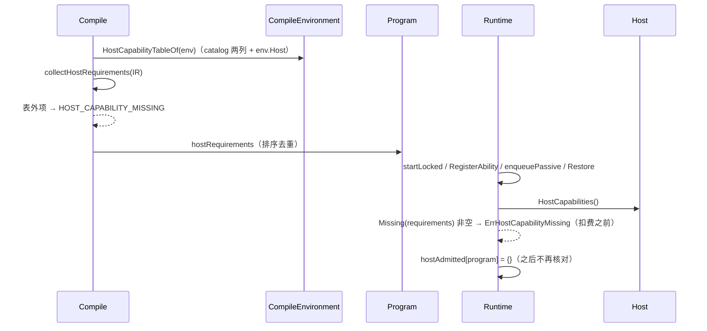
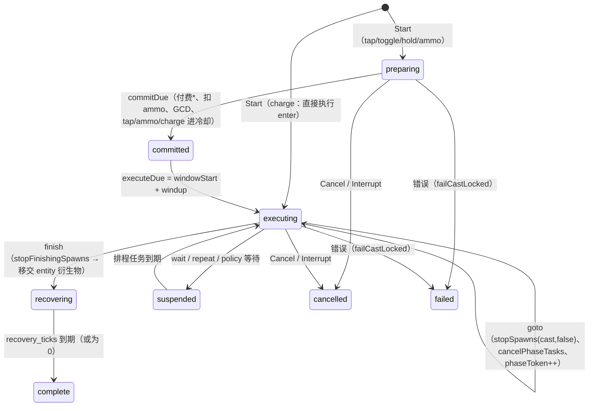
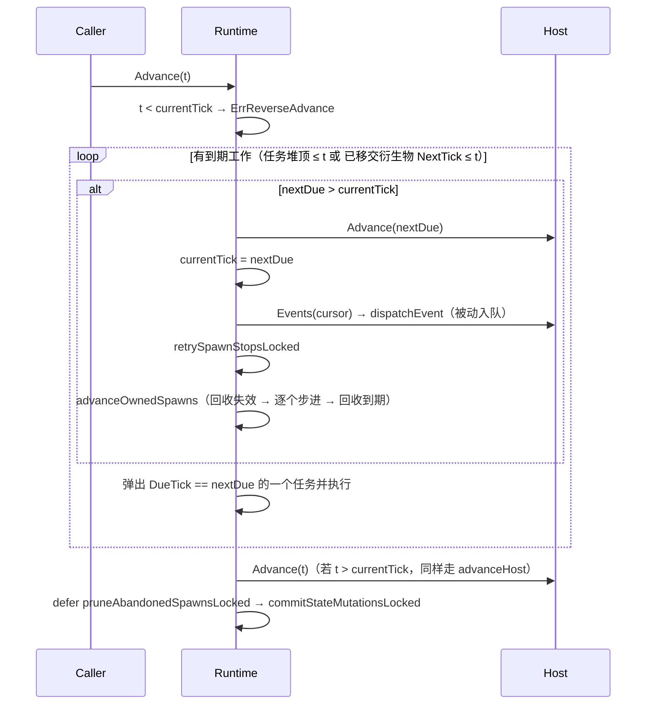
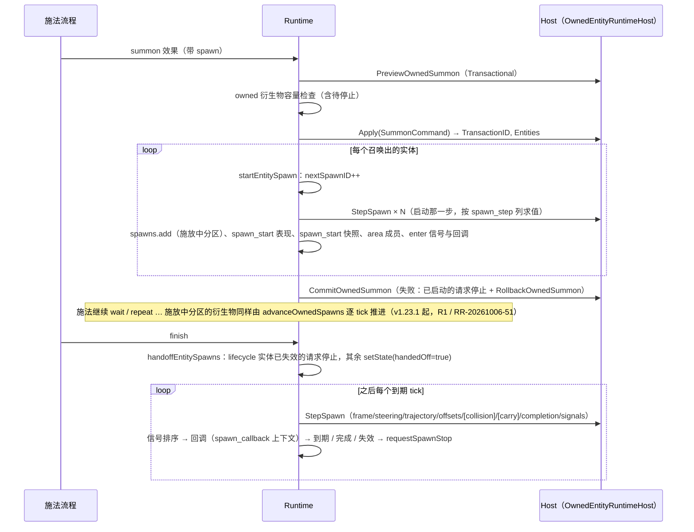
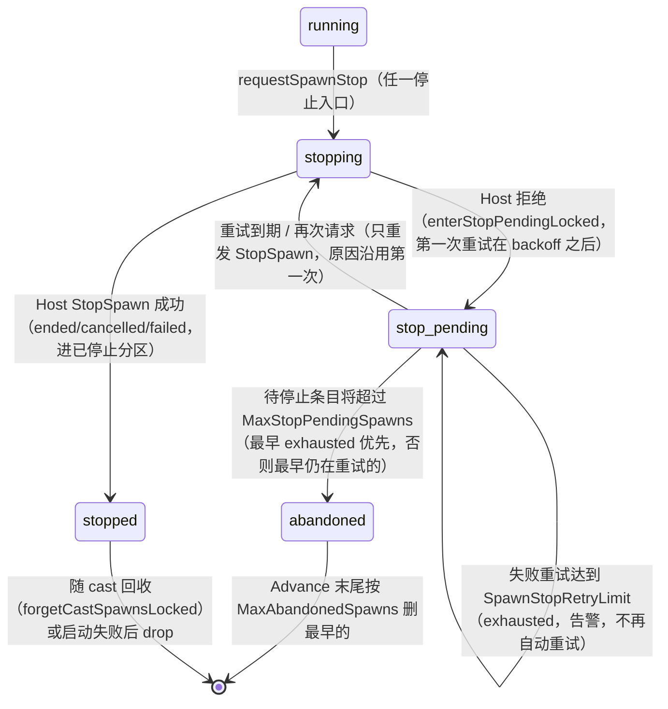

# 08 skill 与战斗（实现）

> 配套说明文档：[guide/08-skill.md](../guide/08-skill.md)（是什么、怎么写技能、怎么接 Host、配置、运维、保证）。
> 读者：review agent 与要改这一块代码的人。源码基准：tag `v1.23.0`（`28912cd6`），全部 `path:line` 按这个 tag。
> 图谱说明：codebase-memory 索引代际停在 2026-09-30，10 月新增的 `skill/spawn_table.go`、`skill/runtime_spawn_stop.go`、`skill/spawn_owned.go`、`skill/host_capability*.go`、`skill/eval_contexts.go`、`skill/phase_events.go` 等不在图里。本篇只用图谱定位，结论全部按 tag 源码直接读取。标“探针”的结论是在 scratchpad 的 tag 副本里加临时测试实跑得出的（探针未入库；写法在 §11 各条的“证据”里说明，可照着重写）。

## 速览

- **编译器是一串有序证明**：`Compile`（`skill/lower.go:61`）先跑 18 个固定顺序的 pass（`skill/compile.go:16-42`，任一 pass 出错即停），再由 `lowerProgram`（`skill/lower.go:76`）把名字降成 handle / 槽位 / 下标。lower 里“名字 → 槽位”只经 `resolveName`（`skill/lower.go:33`），查不到记 `LOWER_UNRESOLVED`，不交出 Program（B3 ①）。三张“单一来源”的表撑起“编译通过 ⇒ Runtime 与 Host 能执行”：求值上下文表（`skill/eval_contexts.go:194`）、phase 事件派发表（`skill/phase_events.go:25`）、Host 能力表（`skill/host_capability.go:109-118`）。
- **Runtime 是单锁确定性状态机**：一把不可重入的 `sync.Mutex`（`skill/runtime.go:210`），所有公开方法持锁，所有 Host 调用都在锁内发生。推进只有 `Advance(tick)`（`skill/scheduler.go:259`）：按（到期 tick, 序号）出堆执行任务，在每个到期 tick 推进已移交的衍生物、重试待停止的停止。
- **衍生物（Spawn）记录分五个分区**，分区只由 `Status` 与 `handedOff` 两个字段决定（`skill/spawn_table.go:39-53`），只有 `spawnTable.setState`（`skill/spawn_table.go:77`）改这两个字段。停止只有 `requestSpawnStop`（`skill/runtime_spawn_stop.go:79`）一个入口：Host 拒绝后转待停止，按退避重试；超过上限转已放弃。删除记录只有三个登记点。两个源码守卫把这些写死（`skill/spawn_partition_promises_test.go:334`、`skill/spawn_stop_entries_promises_test.go:336`）。
- **本篇写作时探针证实的三处 Runtime 缺口**（详见 §11）：施放中的衍生物不逐 tick 推进，丢掉移交前的 tick（R1）；运动衍生物启动时第一步之后的步骤被 Host 拒绝，Host 侧已登记的衍生物无人停止（R2）；衍生物回调发出的事件丢掉施法的根事件与 proc 深度（R3）。v1.23.1 已修复（RR-20261006-51～53，端到端用例 `skill/spawn_lifecycle_e2e_promises_test.go`）。另有 Host 边界、skillsync / skillcompose、战斗包的若干条（H、Y、C 编号）。
- **改代码前先看 §10 review 检查点**，特别是“新增停止入口 / 新增删除记录点 / 新增 Host 可选接口 / 新增 phase 事件 / 新增求值上下文”这几类改动各自要同步改哪张表、哪个守卫。

### 本篇覆盖的包

| 包 | 职责 |
| --- | --- |
| `skill/`（编译器） | `Parse` / `ParseGenerated` 严格解析、`Compile`（normalize + 18 pass + lower）、`Inspect*` 只读视图、诊断、digest |
| `skill/`（Runtime） | `Runtime`：cast 生命周期、调度器、衍生物与召唤物、被动 / proc、state mutation / 表现事件、checkpoint 版本 7 |
| `skill/`（Host 边界） | `Host` 接口与可选接口、Host 能力表、`MemoryHost`、`RecordingHost` / `ReplayHost` |
| `skill/skillsync` | manifest / state / presentation 三条同步流、`Coordinator`、`Outbox`、`Applier` |
| `skill/skillcompose` | 技能组合契约，只经 `skill.Inspect` 消费 Program |
| `skill/combat` | 零依赖战斗数学 |
| `skill/combatcomponent` | `CombatDao`（A1）、`CombatComponent.ProjectAttributes`、`HostAdapter`、`StatusBridge` |
| `attribute/`、`spatial/` | 实体属性容器（代码生成用）；格子阻挡索引与 A* 寻路 |

[↑ 速览](#速览) · [说明文档](../guide/08-skill.md)

---

## 1. 包与文件地图

### 1.1 `skill/` 编译器

| 文件 | 职责 |
| --- | --- |
| `skill/parse.go`、`skill/parse_duplicate.go` | `Parse` / `ParseWithLimits` / `ParseGenerated*`（`skill/parse.go:54-100`）；解析前的形状上限 `DefaultParseLimits`（`skill/parse.go:30-32`）；重复键、大小写变体键拒绝 |
| `skill/wire_*.go` | wire 语法的穷举定义：`Definition`（`skill/wire_definition.go:5`）、九种 flow（`skill/wire_flow.go:78-224`）、效果（`skill/wire_effect.go:193` 的 `decodeEffect`）、衍生物回调键（`skill/wire_flow.go:272-282`）、motion、select、activation |
| `skill/compile.go` | pass 列表与执行（`skill/compile.go:16-42`）；`optional_quantity` 是空 pass（`skill/compile.go:68`），`lower` pass 只置 `lowerReady`（`skill/compile.go:69`） |
| `skill/compile_normalize.go` | wire → IR，补缺省（例如 `refund_before_commit` 缺省为真，`skill/compile_normalize.go:79`） |
| `skill/compile_shape.go` | 结构合法性；`spawn` / `on` 只能挂在 `summon` 上（`skill/compile_shape.go:95-104`） |
| `skill/compile_capability.go`、`skill/compile_authority.go` | 环境 authority 校验（`ENVIRONMENT_INVALID`，`skill/compile_authority.go:56-66`）、目录引用；同一 pass 末尾调 `runOwnedEntityPass`、`runStatusInstancePass`、`runHostCapabilityCheck`（`skill/compile_capability.go:41-43`） |
| `skill/compile_host_capability.go` | 收集 Program 的 Host 需求并对照能力表（`skill/compile_host_capability.go:10-23`、`:25-116`） |
| `skill/compile_input.go` | input 布局；同一 pass 内调 `runStatePass` / `runAbilityPass`（`skill/compile_input.go:49-50`） |
| `skill/compile_typecheck.go` | `type_snapshot` pass = effect result 布局 + 快照 + 类型检查（`skill/compile_typecheck.go:23-27`），按求值上下文表生成作用域 |
| `skill/eval_contexts.go` | 求值上下文（`skill/eval_contexts.go:37-65`）、引用表（`:194`）、快照表（`:397`）、Runtime 侧 `ErrReferenceOutOfContext`（`:371`） |
| `skill/phase_events.go` | phase 事件派发表（`skill/phase_events.go:25-38`） |
| 其余 `skill/compile_*.go` | 一个 pass 一个文件：tags、temporal、effect result、graph、memory、lifetime、motion、proc、identity / random、budget、visual |
| `skill/lower.go` | `resolveName`（`skill/lower.go:33`）、`Compile`（`:61-72`）、`lowerProgram`（`:76`） |
| `skill/program*.go`、`skill/ir*.go` | Program 与 IR；`skill/program_digest.go` 三个 digest；`Program` 结构在 `skill/program.go:3-43` |
| `skill/compile_environment.go`、`skill/environment_kinds.go` | `CompileEnvironment`（`skill/compile_environment.go:291-304`）、`DefaultCompileEnvironment`（`:306`）、缺省上限（`:394-396`）；`AuthorityDigest`（`skill/environment_kinds.go:38`，实现在 `skill/compile_authority.go:21-37`） |
| `skill/inspect.go` | `Inspect*` 只读视图（skillcompose 只经它消费 Program） |
| `skill/diagnostic.go` | 诊断码（`skill/diagnostic.go:19-63`） |

### 1.2 `skill/` Runtime

| 文件 | 职责 |
| --- | --- |
| `skill/runtime.go` | `RuntimeOptions`（`skill/runtime.go:29-87`）、`castInstance`（`:146`）、`Runtime`（`:209-262`）、缺省值 `newRuntimeCore`（`:285-370`）、`Start` / `startLocked`（`:376-497`） |
| `skill/scheduler.go` | 任务类型（`skill/scheduler.go:17-143`）、最小堆、`Advance`（`:259-311`）、`advanceHost`（`:324-334`）、`collectHostEvents`（`:336`）、`failCastLocked`（`:477`） |
| `skill/executor.go` | flow 执行、`executeCast`（`skill/executor.go:20`）、`resolveControl`（`:294`） |
| `skill/runtime_cast_window.go` | 窗口阶段：`prepareCastWindow`（`:42`）、`commitCast`（`:80`）、`beginCastExecution`（`:127`）、`beginCastRecovery`（`:143`）、`Cancel`（`:233`）、`Interrupt`（`:282`）、`releaseCast`（`:336`）；GCD 保留 id `$gcd`（`:8`） |
| `skill/runtime_cast_policy.go` | toggle / hold / charge 的等待、脉冲与自动释放（`skill/runtime_cast_policy.go:5-37`） |
| `skill/runtime_turn.go` | 付费 `payCostList`（`skill/runtime_turn.go:7-29`） |
| `skill/runtime_cast.go` | 效果下发、`effectEventContext`（`skill/runtime_cast.go:231-236`） |
| `skill/runtime_owned_entity.go` | 召唤物：`executeOwnedSummon`（`skill/runtime_owned_entity.go:5-86`）、`executeOwnedCommand`（`:88`） |
| `skill/spawn.go` | `SpawnInstance`（`skill/spawn.go:76-113`）、状态常量（`:10-23`）、`stopSpawn`（`:213`）、`terminateSpawn`（`:286`）、`stopScopedSpawns`（`:315`） |
| `skill/spawn_table.go` | 五分区表 |
| `skill/spawn_owned.go` | `startEntitySpawn`（`:20`）、`detachedSpawnCast`（`:112`）、`handoffEntitySpawns`（`:206`）、`OwnedSpawns`（`:245`）、`advanceOwnedSpawns`（`:287`）、回收、回调（`:431`）、`RemoveProgram`（`:494`）、`Shutdown`（`:534`） |
| `skill/runtime_spawn_stop.go` | 停止状态机：`requestSpawnStop`（`:79`）、`enterStopPendingLocked`（`:98`）、`makeRoomForStopPendingLocked`（`:113`）、`abandonSpawnLocked`（`:136`）、`pruneAbandonedSpawnsLocked`（`:159`）、`retrySpawnStopsLocked`（`:176`） |
| `skill/spawn_motion.go`、`skill/spawn_area.go`、`skill/spawn_numeric.go` | 运动步骤（`skill/spawn_motion.go:8-304`）、区域成员、数值轨道 |
| `skill/runtime_proc.go`、`skill/runtime_dispatch.go` | 被动入队（`skill/runtime_proc.go:22-58`）与执行（`:61-124`）；事件派发（`skill/runtime_dispatch.go:22-61`） |
| `skill/runtime_retention.go` | 完成队列、根事件计数（`:137`）、`RetentionStats`（`:24`） |
| `skill/runtime_host_capability.go` | 能力准入（`:16-41`）与 `hostCheckedResolver`（`:44-58`） |
| `skill/runtime_checkpoint.go` | checkpoint 版本 7 的写出（`:344`）与恢复（`:371`） |
| `skill/runtime_mutation.go`、`skill/runtime_sync.go`、`skill/presentation*.go` | state mutation（`StateDeltas`，`skill/runtime_mutation.go:67`）、状态快照、表现事件（`PollPresentation`，`skill/presentation.go:122`）与恢复快照 |
| `skill/runtime_ability.go`、`skill/runtime_state.go`、`skill/runtime_input.go`、`skill/runtime_random.go`、`skill/trace.go` | 技能栏位、持久状态、施法中输入、HMAC 随机、trace |

### 1.3 `skill/` Host 边界

| 文件 | 职责 |
| --- | --- |
| `skill/host.go` | Host 契约注释（`skill/host.go:3-39`）、`Host` 接口（`:40-53`）、`HostEventCompactor`（`:62`）、`InputPositionResolver`（`:68`）、`AbilityRelationProvider`（`:81`）、读 / 选择请求类型 |
| `skill/host_owned_entity.go` | `OwnedEntityRuntimeHost`（`skill/host_owned_entity.go:65-72`）、owned 选择形状与过滤 |
| `skill/host_spawn.go` | 衍生物命令：8 种 `MotionStep`（`skill/host_spawn.go:9-44`）、`SpawnNumericSnapshot`、`SpawnHostState` |
| `skill/host_command.go`、`skill/host_combat.go`、`skill/host_status.go`、`skill/host_state.go`、`skill/host_temporal.go` | 效果命令与结果、状态存储 |
| `skill/host_capability.go` | 能力表八列（`:109-118`）、`HostCapabilityTableOf`（`:136`）、`FullHostCapabilityCatalog`（`:166`）、`Has` / `Missing`、环境校验 |
| `skill/host_capability_check.go` | `CheckHostCapabilities`：按 Host 声明逐项调用 Host 的一致性自检（`:24-37`），只在测试里调用 |
| `skill/memory_host*.go` | `MemoryHost`：参考实现兼测试世界（结构与 Read / PayCosts / Events 在 `memory_host.go`，效果、战斗、状态、选择、衍生物、运动、召唤物、持久状态、时间快照各一个文件） |
| `skill/replay.go` | `RecordingHost`（`:23-126`）与 `ReplayHost`（`:130-214`） |

### 1.4 `skill/skillsync`、`skill/skillcompose`

| 文件 | 职责 |
| --- | --- |
| `skill/skillsync/skillsync.go` | 三个 topic（`:14-18`）、记录类型（`:27-65`）、`Projector`（`:67-135`） |
| `skill/skillsync/coordinator.go` | `Coordinator`：`PublishSnapshot`（`:226`）、`Flush`（`:254`）、`prepareFlush`（`:268-361`）、`appendPending`（`:363`）、`Acknowledge`（`:379`）、`Recover`（`:416`）、`CloseObserver`（`:548`） |
| `skill/skillsync/visibility.go` | `EntityVisibilityPolicy` 与三个过滤函数（`:59`、`:226`、`:318`） |
| `skill/skillsync/outbox.go`、`file_outbox.go`、`file_replace_*.go` | 待 ACK 包的 outbox（内存 / 文件存储） |
| `skill/skillsync/applier.go` | 客户端 `Applier`：准入（`:152-223`）、记录应用（`:230-333`） |
| `skill/skillsync/schema.go`、`observability.go` | schema 协商与迁移；健康与指标 |
| `skill/skillcompose/contract*.go`、`canonical.go` | 合同结构、`BuildContract`（`skill/skillcompose/contract_builder.go:15`）、`ValidateContract`（`skill/skillcompose/contract_validate.go:8`）、规范化 digest（`skill/skillcompose/canonical.go:10`） |
| `skill/skillcompose/profile_extract.go`、`validator.go`、`graph.go`、`matcher.go`、`prompt_view.go` | 从 Program 提取画像、校验候选、因果图、特性匹配、给生成器的提示视图 |

### 1.5 `skill/combat`、`skill/combatcomponent`、`attribute/`、`spatial/`

| 文件 | 职责 |
| --- | --- |
| `skill/combat/combat.go` | 包说明（零依赖、无随机、无墙钟），基点运算 |
| `skill/combat/attributes.go`、`buffs.go` | `AttributeSet`（`:37`）、`BuffContainer`（`skill/combat/buffs.go:83`） |
| `skill/combat/damage.go` | 十二阶段顺序 `PipelineStages`（`skill/combat/damage.go:29-33`）、`ResolveDamage`（`:129`）、`ResolveHeal`（`:265`）、`AddShield`（`:277`） |
| `skill/combat/roll.go` | HMAC 派生的 `RollValue` / `ChanceRoll`（`skill/combat/roll.go:24`、`:41`） |
| `skill/combatcomponent/component.go` | `CombatDao`（`:49-61`，A1 回滚接口 `:183-187`）、`CombatComponent`（`:222`）、`ProjectAttributes`（`:251`）、唯一投影写入点 `deriveProjection`（`:262`） |
| `skill/combatcomponent/adapter.go` | `HostAdapter`：把战斗命令接到业务 Host（`:43-66`），能力表（`:274`） |
| `skill/combatcomponent/status_bridge.go` | `StatusBridge`：状态 / 属性修正命令（`:36`） |
| `attribute/attribute.go`、`attribute/container.go` | 属性 id / 元数据 / Profile 契约；分层容器与脏位（`attribute/container.go:49-170`） |
| `spatial/geometry.go`、`block_index.go`、`terrain.go`、`pathfind.go` | 饱和几何、格子索引、网格阻挡、A*（`spatial/pathfind.go:26`） |

[↑ 速览](#速览) · [说明文档 §1](../guide/08-skill.md#1-定位与边界)

---

## 2. 关键类型与数据结构

### 2.1 编译器侧

| 类型 | 位置 | 要点 |
| --- | --- | --- |
| `Definition` | `skill/wire_definition.go:5` | 严格解析后的 wire 定义；不是运行时对象 |
| `CompileEnvironment` | `skill/compile_environment.go:291-304` | `CompilerSemanticsRevision`、`Revision`、`Digest`、`Limits`、`Numeric`、`Gameplay`、`Motion`、`SpawnProperties`、`Host`、`Visual` |
| authority digest | `skill/compile_authority.go:21-37` | SHA-256(JSON{Domain="roost.skill/v2/gameplay-authority", Revision, Limits, Numeric, Gameplay, Motion, SpawnProperties, Host})。**Visual 与 CompilerSemanticsRevision 不进**；`Digest` 不等于重算值时 `ENVIRONMENT_INVALID`（`skill/compile_authority.go:63-65`） |
| `compileArtifacts` | `skill/compile_context.go:23-48` | pass 之间传递的产物：IR、类型、图、身份、上限、`hostRequirements`、`lowerReady` |
| `Program` | `skill/program.go:3-43` | 全部字段私有；`operations` / `phases` / `spawnTemplates` 等按下标执行；`identity` 带 gameplay / presentation / 源文档三个 digest（`skill/lower.go:122` 起写入）；`hostRequirements` 不进 gameplay digest（`skill/program.go:40-42`） |
| `evalReferenceTable` | `skill/eval_contexts.go:194` | 每一行是一种引用，每一格是“可用 + 语义”或“不可用 + 原因 / 改用 …” |
| `phaseEventTable` | `skill/phase_events.go:25-38` | `enter` / `cancel` / `direction_changed` / `target_changed` / `release` / `pulse` 有派发点；`recast` / `timeout` 没有 |
| `hostCapabilityColumns` | `skill/host_capability.go:109-118` | 八列与各列封闭集合只在这里登记一次 |

### 2.2 Runtime 侧

| 类型 | 位置 | 要点 |
| --- | --- | --- |
| `Runtime` | `skill/runtime.go:209-262` | `mutex`；`casts` map；`scheduler`（最小堆）；`frames`（排程任务冻结的局部变量帧）；`spawns spawnTable`；冷却、技能资源、policy、proc 账本、根事件计数；trace / presentation / state event / state mutation 四个投递缓冲；`hostAdmitted map[*Program]struct{}` |
| `castInstance` | `skill/runtime.go:146-182` | `status`（running / suspended / finished / failed）、`windowStage`、`phaseToken`（goto / 取消时加一，旧 token 的任务作废）、`pendingTasks`、`logicalFinished`、`committed` / `costsPaid` / `cooldownStarted`、`eventContext`、`evalContext`（不进 checkpoint） |
| `scheduledTask` | `skill/scheduler.go:145-149` | `(DueTick, Sequence, Payload)`；堆序按 DueTick 再按 Sequence（`skill/scheduler.go:154-159`）。Payload 13 种：flow 续接、repeat、chain、`spawnStepTask`、commit、execute、recovery、pulse、auto release（以上带 cast id + phase token + frame），以及 ammo 充能、被动、外部事件、能力覆盖到期（系统任务） |
| `SpawnInstance` | `skill/spawn.go:76-113` | `Status`、`Scope`（实际只出现 `entity`）、`StartTick` / `NextTick` / `EndTick`、`HostState`、`Motion`、`Numeric`、`Owner`、`LifecycleEntity`、`Program`；私有：施法输入 / memory / 局部变量、快照、随机键、`eventContext`、`AreaMembers`、`stopCause`、`handedOff`、`areaCallbackFinishedCast`、三个重试字段 |
| `spawnTable` | `skill/spawn_table.go:63-153` | `[5]map[SpawnID]*SpawnInstance`；`setState` / `add` / `drop` / `get` / `count` / `each` / `sortedIDs` |
| `EventContext` | `skill/ir_event.go:6-27` | `EventID` / `RootEventID` / `ParentEventID` / `ProcDepth` 等；`newRootEvent`（`:30`）、`deriveEvent`（`:34-45`） |
| `RuntimeCheckpoint` | `skill/runtime_checkpoint.go:43-47` | `{Version, Payload, Checksum}`；Payload 是 `runtimeCheckpointPayload`（`:70-128`）的 JSON |

### 2.3 衍生物分区（`skill/spawn_table.go:5-53`）

| 分区 | 字段 | 谁按它查 | live（钉住 cast、占 owned 容量、Shutdown / RemoveProgram 要停） |
| --- | --- | --- | --- |
| `spawnCasting` | `running`，未移交 | 施法收尾 / 打断 / 失败停衍生物、移交、施法期间 lifecycle 失效回收（`reapUnhandedEntitySpawns`，`skill/spawn_owned.go:264`） | 是 |
| `spawnHandedOff` | `running`，已移交 | `OwnedSpawns`、`advanceOwnedSpawns`、`nextOwnedSpawnTick`（`skill/scheduler.go:313`）、回收 | 是 |
| `spawnStopPending` | `stop_pending` | `retrySpawnStopsLocked`、`makeRoomForStopPendingLocked`、`RetentionStats` | 是 |
| `spawnStopped` | `ended` / `cancelled` / `failed` | `forgetCastSpawnsLocked`（`skill/runtime_retention.go:97`）、checkpoint、快照 | 否 |
| `spawnAbandoned` | `abandoned` | `pruneAbandonedSpawnsLocked` | 否 |

`spawnLivePartitions` 在 `skill/spawn_table.go:36`；`liveOnHost()` 在 `skill/spawn.go:118-120`。

### 2.4 Host 侧

| 类型 | 位置 | 要点 |
| --- | --- | --- |
| `Host` | `skill/host.go:40-53` | 嵌入 `AuthorityProvider`、`HostCapabilityProvider`、`StateStore`；`Advance` / `CurrentRevision` / `Read` / `Select` / `PayCosts` / `Apply` / `StepSpawn` / `StopSpawn` / `Events` |
| 可选接口 | 见右 | `HostEventCompactor`（`skill/host.go:62`，断言在 `skill/runtime.go:277`、`skill/runtime_event.go:15`、`skill/scheduler.go:361`）；`InputPositionResolver`（`skill/host.go:68`，`skill/runtime_input.go:309`）；`AbilityRelationProvider`（`skill/host.go:81`，`skill/runtime_ability.go:139`）；`OwnedEntityRuntimeHost`（`skill/host_owned_entity.go:65-72`，`skill/runtime_owned_entity.go:6`、`skill/spawn_owned.go:213/265/342/402/521/557`）；`RuntimeStateExtensionProvider`（`skill/runtime_sync.go:124`，`:337`） |
| `HostCapabilityTable` | `skill/host_capability.go:49-56` | `Attributes`（catalog 里 Readable 的属性）、`Resources`（catalog 全部资源）+ `HostCapabilityCatalog`（`SpawnKinds`、`MotionSteps`、`SpawnNumericFields`、`ResourceOperations`、`ModifierOperations`、`Summon`） |
| `MotionStep` | `skill/host_spawn.go:9-44` | `Static` / `Frame` / `Steering` / `Trajectory` / `Offsets` / `Collision` / `Carry` / `Completion` / `Signals`；只含解析后的整数事实，Host 不需要读 Program |
| `HostRecord` | `skill/replay.go:12-19` | kind、`%T:%#v` 请求键、类型化结果、错误、前后 revision |

### 2.5 skillsync / skillcompose / combat

| 类型 | 位置 | 要点 |
| --- | --- | --- |
| `Header` / `StateRecord` / `PresentationRecord` / `ManifestRecord` | `skill/skillsync/skillsync.go:35-65` | JSON 载荷；`Header.SchemaVersion` 由 `NewProjector(v)` 指定、不能为 0（`:71-76`） |
| `CoordinatorOptions` | `skill/skillsync/coordinator.go:46-55` | Runtime、History（`syncstream`）、Publisher、Projector、Visibility（必填）、Outbox、`RequireDurableOutbox`、`MaxPacketsPerFlush`（缺省 256） |
| `OutboxOptions` | `skill/skillsync/outbox.go:83-94` | 缺省（`:127-155`）：ACK 重发 5s、失败重试 100ms 起指数退避上限 30s、待 ACK 包 100000 / 256 MiB / 每流 4096、最老 24h、每批 512 |
| `SkillCompositionContract` | `skill/skillcompose/contract.go:5-31` | 版本 `skillcompose/v2`；authority、policy、sources（技能 id + gameplay digest）、grants、预算、digest |
| `combat.Combatant` | `skill/combat/damage.go:39` | 伤害管线读写的平铺定点字段；闪避 / 暴击是调用方预先掷好的布尔事实 |
| `CombatDao` | `skill/combatcomponent/component.go:49-61` | `combatant`、`attributes *combat.AttributeSet`、`buffs *combat.BuffContainer`、`dataengine.Tracker`；三个脏位 `FieldVitals` / `FieldAttributes` / `FieldBuffs`（`:42-46`）；持久化 schema 版本 2（`:38`） |

[↑ 速览](#速览) · [说明文档 §2](../guide/08-skill.md#2-核心概念与术语)

---

## 3. 主流程

### 3.1 编译管线


1. `ParseWithLimits`（`skill/parse.go:58`）：先按 `ParseLimits` 检查字节数、深度、token、字符串长度、容器条目（`skill/parse.go:30-32` 缺省 1 MiB / 64 / 100000 / 64 KiB / 4096），再严格解码：未知字段、重复键、大小写变体键、尾随数据都拒绝。
2. `compileToArtifactsInternal`（`skill/compile.go:13-45`）按固定顺序跑 18 个 pass；每个 pass 之后 `context.hasErrors()` 就停。诊断按 `diagnosticLess` 稳定排序。
3. `Compile`（`skill/lower.go:61-72`）在没有 error 级诊断时调 `lowerProgram`：降低 input、能力属性、衍生物属性、state、memory、cast 与 costs、phases、快照、量纲、随机位点、事件计划；每次名字查找经 `resolveName`。有 `failures` 就返回 nil 与全部 `LOWER_UNRESOLVED`（`skill/lower.go:107-109`）；操作数 / 随机位点数与身份 pass 不一致是编译器自身不变量，panic（`skill/lower.go:110-115`）。
4. gameplay digest 在 lower 末尾按 Program 内容计算（`skill/lower.go:122`）；它进 checkpoint 的程序引用、proc 账本键、组合契约、召唤命令。

### 3.2 求值上下文表

- 编译期：类型检查按值位点所在上下文从 `evalReferenceTable` 生成作用域；不可用格诊断原样带出这一格的原因（`skill/eval_contexts.go:9-31` 的说明）。缓存型快照（`cast_start` / `phase_start` / `spawn_start`）能否在读取处用、实体能否在采样点求出，查 `evalSnapshotTable`（`skill/eval_contexts.go:397`）。
- Runtime：`castInstance.evalContext` 记当前上下文，`switchEvalContext`（`skill/eval_contexts.go:388`）在 memory 默认值、采样、衍生物字段、状态默认值求值时临时切换；表外引用返回 `ErrReferenceOutOfContext`（`:371`），不落到 `ErrProgramInvariant`。
- 衍生物的启动步用施法本身求值、但按 `spawn_step` 列查表（`skill/spawn_owned.go:40-45`），移交后每一步用 `detachedSpawnCast(spawn, evalSpawnStep)`（`skill/spawn_owned.go:112-121`）；所以 `spawn_step` 列里的引用必须在两边都求得出（NC-224）。

### 3.3 Host 能力表与准入（B3 ③）



- 需求收集（`skill/compile_host_capability.go:25-116`）：`read_attribute` 与 `attribute_compare` → attribute；costs / sustain costs / `resource` 效果 → resource（+ resource_operation）；`attribute_modifier` → modifier_operation；`summon`、`issue_entity_command`、owned 选择 → summon；衍生物 → spawn_kind；运动衍生物固定要 frame / steering / offsets / completion，写了 collision / carry 再要这两项（与 `stepSpawnMotion` 一一对应，RR-20261006-37）；只交给 Host 的数值字段（`skill/host_capability.go:123`）→ spawn_numeric_field。
- Runtime 准入点：`startLocked`（`skill/runtime.go:409`，在 authority 校验之后、`freezeCastInput` 与付费之前）、`RegisterAbility`（`skill/runtime_ability.go:93`）、`enqueuePassive`（`skill/runtime_proc.go:46`）、checkpoint 恢复的 `hostCheckedResolver`（`skill/runtime_checkpoint.go:439`）。
- `HostCapabilities()` 是 `Host` 接口的一部分，没有“未实现则跳过”的分支（守卫 `TestNoHostCapabilitySkipBranch`，`skill/host_capability_required_promises_test.go:85`）。
- 能力表**不覆盖**的 Host 能力：可选接口本身（除 summon 列对应 `OwnedEntityRuntimeHost`）、status / damage / heal / shield / temporal / state 等命令。包装型 Host 转发能力表但不转发可选接口时，准入会放行（§11 H2）。

### 3.4 一次施放：窗口阶段与 cast 状态



\* `refund_before_commit=true`（缺省）时在 commit 付费；为假时在 `prepareCastWindow` 付费（`skill/runtime_cast_window.go:51-56`、`:88-93`），之后取消不退。

要点（全部按 `skill/runtime.go:376-497`、`skill/runtime_cast_window.go`）：

1. `Start` 依次检查：活跃 cast 数（`ErrRuntimeCapacityExceeded`）、编译语义修订（`ErrProgramSemanticsMismatch`）、authority（`ErrAuthorityMismatch`）、Host 能力准入、输入布局（`freezeCastInput`）、技能栏位。toggle 已激活时本次 = 关闭（`skill/runtime.go:418-427`）。根施放（非 proc）再检查互斥与 GCD（`:431-440`）。
2. cast ID 先暂取 `nextCastID+1`；HMAC 随机键由（MatchSeed, gameplay digest, caster, castID）派生（`:453`）。根施放 `eventContext = newRootEvent(castID)`；proc 施放 `deriveEvent(parent, castID<<32|1)` 且 `ProcDepth = parent+1`（`:454-459`）。
3. memory 默认值在 `memory_default` 上下文求值，然后 `cast_start` 采样（`:462-474`）。
4. `prepareCast` 失败：`failCastLocked`；若未提交、名下没有 live 或已放弃衍生物，删掉 cast、还回 ID（`:479-495`，NC-110 / RR-20261006-21）。
5. 冷却 key 是（cooldownOwner, program id）；proc 施放且 `cooldown_scope=target` 时 owner 是事件目标（`:450-452`）。GCD 存在保留 id `$gcd` 下，从 commit tick 起算（`skill/runtime_cast_window.go:103-109`）。
6. `finish` → `beginCastRecovery`（`skill/runtime_cast_window.go:143-170`）：先停 phase / cast scope 衍生物，再 `handoffEntitySpawns`；仍有排程任务（`parallel` 分支）时停在 suspended，等任务清空再进入后摇。
7. 终止只有三条路：`completeCastRecovery`（finished / complete）、`Cancel` / `Interrupt`（finished / cancelled，`:233-306`）、`failCastLocked`（failed，`skill/scheduler.go:477-486`，唯一失败终态入口，撤全部任务与帧、停衍生物、释放 policy 槽位、结束 ability 计数）。

### 3.5 `Advance(tick)` 一次推进



- 只在“有事可做”的 tick 推进 Host（`skill/scheduler.go:277-306`），不是逐 tick 推进；同一 `Advance` 里多次推进时，同一 tick 上任务与衍生物交替处理。
- 任何一步出错立即返回（`:292-304`），`currentTick` 已前进到出错的那个 tick；defer 照样清理已放弃分区并提交 state mutation（`:272-276`）。再次 `Advance` 会从还到期的工作继续。
- `collectHostEvents`（`skill/scheduler.go:336-365`）**先派发、后推进 cursor**：某个事件派发失败时 cursor 停在它前面，下次 `Advance` 还会再派发它（§11 H1）。

### 3.6 衍生物：启动、施放中、移交、逐 tick 推进

衍生物只由召唤效果启动（`skill/compile_shape.go:95-104`；Runtime 唯一创建点 `startEntitySpawn` 只被 `executeOwnedSummon` 调用，`skill/runtime_owned_entity.go:61`），所以 Runtime 里所有衍生物 `Scope == entity`。`SpawnScopePhase` / `SpawnScopeCast` 常量与 `stopScopedSpawns` 里对它们的分支在生产路径上没有创建点（§11 R7）。



- 启动步失败（`skill/spawn_owned.go:44-48`）：记录还没入表，只解除 carry 后返回；`executeOwnedSummon` 停掉此前已启动的、回滚召唤事务（`skill/runtime_owned_entity.go:61-68`）。**Host 侧被前几步登记的这个衍生物没人停**（§11 R2）。
- 启动后失败（快照、area 成员、信号回调出错）：`requestSpawnStop(…, StopCauseFailure)`，停成功则 `drop` 记录（`skill/spawn_owned.go:61-93`，三个 drop 登记点之一）。
- 运动步骤顺序（`skill/spawn_motion.go:8-304`）：非运动（area / minion）首步 `Static`，之后每步 `Static` + `Signals`；运动衍生物每步 `Frame` → `Steering` → `Trajectory` → `Offsets` → `Collision`（写了才发）→ `Carry`（写了才发）→ `Completion` → `Signals`。
- 信号排序（`skill/spawn.go:145-198`）：接触类（hit / collision）按距离、接触序、目标；之后 target_lost、transition、leave、enter、tick、end、cancel。
- 移交后推进（`skill/spawn_owned.go:287-339`）：先 `reapUnhandedEntitySpawns`（施法中 lifecycle 实体消失）与 `reapInvalidOwnedSpawns`，再按 ID 顺序步进 `NextTick <= currentTick` 的已移交衍生物；一个衍生物步进或回调出错时，`failOwnedSpawn` 请求停止它并把错误返回给 `Advance`，本 tick 剩余的衍生物留到下一次调用（`:300-320`）。area 回调 `finish`：施法仍在时结束施法，否则只停本 area（`:458-473`，NC-211）。

### 3.7 停止状态机（`skill/runtime_spawn_stop.go:9-54`）



- “停止中”是 `terminateSpawn`（`skill/spawn.go:286-305`）：先解除 carry，再区域离开信号（`emit_leave_on_stop`），再回调（只对 running、且本 area 没有 finish 过），最后 `stopSpawn`（`skill/spawn.go:213-248`）调 Host `StopSpawn`。成功后 entity 衍生物释放 Program 与施法数据。
- `requestSpawnStop`（`skill/runtime_spawn_stop.go:79-94`）：已不 live 的直接返回；对待停止的重入只重发 StopSpawn；`terminateSpawn` 之后仍 live 说明 Host 拒绝，转入待停止。错误照常返回本次调用方。
- 退避：`spawnStopRetryDelay(base, attempts)` 每失败一次翻倍，最多翻 6 次（`skill/runtime_spawn_stop.go:62-73`，缺省 4 → 256 tick）。重试只在 `advanceHost` 里发生（`skill/scheduler.go:332`），结果是 tick 与 Host 应答的确定函数。
- 停止入口（`skill/runtime_spawn_stop.go:21-27` 列举，守卫登记表 `skill/spawn_stop_entries_promises_test.go:132`）：`failCastLocked`、goto、`Cancel`、`Interrupt`、施法收尾（都经 `stopScopedSpawns`）、启动失败清理（`startEntitySpawn`、`executeOwnedSummon`）、移交时 lifecycle 已失效（`handoffEntitySpawns`）、`reapUnhandedEntitySpawns`、`terminateOwnedSpawn`、`RemoveProgram`、`Shutdown`。

### 3.8 召唤物 Summon 与指令

- 不带 `spawn` 的 `summon` 效果就是一次普通 `Apply(SummonCommand)`，结果是 `SummonEffectResult`（`skill/runtime_owned_entity.go:45-48`）。
- 带 `spawn` 时是事务：`Transactional=true` → `PreviewOwnedSummon`（Host 侧替换策略 `reject_new` / `replace_oldest` / `replace_newest` / `replace_nearest` / `replace_farthest`，`skill/host_owned_entity.go:49-56`）+ Runtime 的 owned 衍生物容量（总量 / 每 owner / 每程序 / 每单位模板，待停止也占，`skill/spawn_owned.go:160-197`）→ 容量不足是预期失败 `capacity_reached`，不是错误 → `Apply` → 逐个 `startEntitySpawn` → `CommitOwnedSummon`。任何一步失败都请求停止已启动的衍生物并 `RollbackOwnedSummon`（`:59-78`）。成功后立即回收一次（`:79-84`）。
- `dismiss` / `issue_entity_command` 走 `Apply(OwnedEntityCommand)`（`skill/runtime_owned_entity.go:88-112`），owned 选择走 `Select(OwnedEntitiesSelectShape)`。
- `RemoveProgram` 后 `RemoveOwnedEntitiesByProgram`，`Shutdown` 后 `RemoveOwnedEntitiesForMatchEnd`（`skill/spawn_owned.go:521-525`、`:557-561`）；Host 不实现 `OwnedEntityRuntimeHost` 时这两步静默跳过。

### 3.9 被动与 proc

1. 入口三个：`ActivatePassive`（`skill/runtime_proc.go:22-39`）、`QueueExternalEvent`（`skill/runtime_dispatch.go:10-20`，入队成系统任务，执行时 `dispatchEvent`）、Host 事件经 `collectHostEvents` / `drainHostEvents` → `dispatchEvent` → `PassiveRouter.Candidates`（`skill/runtime_dispatch.go:22-61`，候选按 owner、ability、digest 排序）。
2. `dispatchEvent` 先 `trackRootEventLocked(root)`（root = `RootEventID`，为 0 时用 `EventID`），再对每个候选 `enqueuePassive`：准入能力表、排一个 `passiveActivationTask`（到期 = max(当前 tick, 事件 tick)）。`ErrCastInputInvalid` 被吞，其余错误返回。
3. 执行（`skill/runtime_proc.go:61-124`）按序检查 filter、`max_depth`、self_trigger、once_per_root（账本键 = 根事件, 施法者, gameplay digest）、`max_events_per_root`、每 tick 上限、账本容量；任一不过记 `passive_suppressed`。通过后 `startLocked(program, input, &event)`：proc 施放绕过互斥与 GCD，`ProcDepth = 事件深度 + 1`。

### 3.10 投递出口：state mutation、状态事件、表现

- 每个公开写入口在锁内 `beginStateMutationLocked` / defer `commitStateMutationsLocked`（例如 `skill/runtime.go:388-389`、`skill/scheduler.go:272-273`）。提交（`skill/runtime_mutation.go:96-135`）先回收完成 cast，再按写入点增量 diff（或全量 diff）生成 `StateMutation`，种类见 `skill/runtime_mutation.go:14-30`（`spawn_upsert` / `spawn_remove` 等）。
- 表现事件（`skill/presentation.go:6-15`：cast / effect / `spawn_start` / `spawn_update` / `spawn_signal` / `spawn_stop`）进有界缓冲；`PollPresentation(after, limit)` 游标过期时返回 `CursorExpired`，消费者改取 `PresentationSnapshot()`（`skill/presentation_recovery.go:40`）。
- 三个缓冲都按上限丢最老的并计数（缺省 1024 / 2048 / 2048，`skill/runtime.go:304-314`）；不进 checkpoint。

### 3.11 checkpoint 与恢复（版本 7）

1. `Checkpoint`（`skill/runtime_checkpoint.go:344-369`）：持锁生成 payload；Host 的 `CurrentRevision` / `AuthorityIdentity` 与 payload 不符则 `ErrCheckpointHostMismatch`；JSON 编码（同一状态同一字节，O7）；超 `CheckpointMaxBytes` / `CheckpointMaxRecords` 拒绝；SHA-256 校验和。
2. `RestoreRuntime`（`:371-446`）：版本必须是 7（`:381`）；长度、校验和（常数时间比较）、重复键、未知字段、尾随数据、记录数；Host revision / authority 前后各核一次；payload 里的运行上限覆盖调用方选项（`:414-429`）；用 `newRuntimeCore` 而不是 `NewRuntime`，不快进事件 cursor（`:430-437`）；每个被引用的 Program 经 `hostCheckedResolver` → `resolveCheckpointProgram`（`:455-468`：id、gameplay / presentation digest、语义修订、authority 全等）。
3. 衍生物恢复（`:1084-1141`）：ID 不超过 `next_spawn_id`、status 合法、只有 entity 衍生物能 `handed_off`、已放弃记录必须带 `direct_program`；按字段重新分区。待停止字段核对见 `stopPendingRecordsValidLocked`（`:1211-1221`）。
4. 版本历史只在 `skill/runtime_checkpoint.go:16-28` 的注释里：3 加待停止，4 process → spawn，5 summon 改名，6 只存一份 `spawns`，7 加 abandoned 与 `max_abandoned_spawns`。线上未部署，旧版本一律拒绝，排空后升级。

### 3.12 skillsync：一次 Flush

1. `Flush(observer, key)`（`skill/skillsync/coordinator.go:254-266`）：拿 view 锁 → `prepareFlush` → 放锁 → 锁外 `publishObserver`（`PublishDue` 发这个 observer 的到期包）。
2. `prepareFlush`（`:268-361`）：`StateDeltas(cursor.state, remaining)`，游标过期就发过滤后的 `state_full`，否则逐条 `FilterStateMutation`（被拒的只推进游标）；再 `PollPresentation(cursor.presentation, remaining)`，过期就发 `presentation_reset` 并返回，否则逐条 `FilterPresentation`。每个包经 `appendPending`：先 `History.Append`（序号、epoch、BaseSequence 由 syncstream 分配），再 `Outbox.Put`；Put 失败时用 History 导出 `Reconcile`（`:363-377`）。
3. `Acknowledge`（`:379-408`）：epoch 必须等于 History 当前 epoch，序号不能超过 History 的 LatestSequence（否则 `ErrAckAhead`）；先删 outbox 副本，再 ACK History。
4. 客户端 `Applier.admit`（`skill/skillsync/applier.go:152-223`）：observer、epoch≠0、schema 范围（需要时迁移）；新 epoch 必须从 Full 包开始；Delta 包必须 `base == 当前 && seq == 当前+1`，否则 `ErrSequenceGap`；同一流同时只允许一个在途应用。
5. 包内不起 goroutine，全部由调用方驱动；Coordinator 有一把全局锁加按（observer, key）的 view 锁，调用 Visibility / Publisher / Runtime 时不持全局锁（`skill/skillsync/coordinator.go:87-88` 的注释）。

### 3.13 skillcompose

- `ExtractProfile(program)`（`skill/skillcompose/profile_extract.go:12-35`）只用 `skill.Inspect`：特性是 `effect.<操作种类>` 与 `select.<形状>`。
- `BuildContract`（`skill/skillcompose/contract_builder.go:15-90`）：authority 与 policy 必填、各 profile authority 一致、source 不重复、每个特性只授予 identity 变换、预算 = 各源之和再按 policy / caller 收紧；最后算规范化 digest 并 `ValidateContract`。
- `ValidateCandidate`（`skill/skillcompose/validator.go:9-124`）：合同有效 → 候选身份与 authority 一致 → sources 与合同完全相同 → 特性都被授予 → origin 指向授予过的变换 → 指标不超预算 → 因果图可达 sink（`skill/skillcompose/graph.go:9-40`）。

### 3.14 combatcomponent：A1 回滚与属性投影

- `CombatComponent` 的每个 mutator 必须在 Nest 事务里调用（不在事务里 panic，`skill/combatcomponent/component.go:213-221` 的说明）；DAO 用 `beginChange` / `markChanged` 登记字段级逆操作或快照，handler 失败 / 提交被拒时 DAO 回到事务开始时的值（A1，见 [03 DataEngine](./03-dataengine.md)）。`CaptureRollbackState` / `RestoreRollbackState`（`:183-187`）是 `rollback=state` 用的整块 JSON 快照。
- `ProjectAttributes(projection)`（`:251-254`）安装业务投影并立刻投影一次。唯一写入点 `deriveProjection`（`:262-279`）：克隆 vitals → 业务投影 → `reflect.DeepEqual` 相同则不写；不在事务里（加载、构造时）直接写内存不标脏；在事务里经 `beginChange(FieldVitals)` 写，随 DAO 一起回滚。触发点：`OnInitFinish`（`:240-243`）与每个改属性来源的 mutator 末尾（`InitCombatant`、`SetAttributeBase` / `Bounds`、buff 系列）。
- `HostAdapter.Apply`（`skill/combatcomponent/adapter.go:70`）返回 `(result, handled, err)`：只处理伤害 / 治疗 / 护盾 / 资源（和接了 `StatusBridge` 时的状态命令），其余交回业务 Host。它不在事务里被调用时需要 `Committer`，经 `RunDetachedTransaction` 开事务（`:43-48` 的字段说明）。
- `skill.Runtime` 不在事务里（B4）：handler 回滚只撤回 DAO，Runtime 的冷却、ammo、cast、衍生物不回退。

[↑ 速览](#速览) · [说明文档 §4](../guide/08-skill.md#4-怎么用)

---

## 4. 不变量清单

| # | 内容 | 强制位置 | 守卫测试 |
| --- | --- | --- | --- |
| I1 | 编译通过的 Program 不含“查不到却用了 0”的名字 | `resolveName`（`skill/lower.go:33-39`）；`lowerProgram` 有 failures 即返回 nil（`:107-109`） | `TestLowerRefusesEveryUnresolvedLookup`（`skill/lower_lookup_promises_test.go:105`） |
| I2 | 编译期接受的 phase 事件都有 Runtime 派发点 | `phaseEventTable`（`skill/phase_events.go:25-38`）；没有派发点的事件编译拒绝 | `TestPhaseEventTableIsTheSingleSource`（`skill/phase_events_promises_test.go:11`）、`TestCompileRejectsPhaseEventsTheRuntimeNeverDispatches`（`skill/phase_event_dispatch_promises_test.go:14`） |
| I3 | 引用能不能读只看求值上下文表；编译期与 Runtime 查同一张；每一格都有正例 / 反例 | `evalReferenceTable`（`skill/eval_contexts.go:194`）、`evalContextAllows`（`:374`） | `TestEvalContextTableEveryCellHasACase`（`skill/eval_contexts_table_test.go:259`）、`TestEvalContextTableCellsAgreeWithCompilerAndRuntime`（`:290`）、`TestRuntimeEvaluatesReferencesOnlyWhereTheTableAllows`（`:333`） |
| I4 | Program 的 Host 需求在编译期对照环境表、在首次使用时对照 Host 声明的表，表外在扣费之前拒绝 | `runHostCapabilityCheck`（`skill/compile_host_capability.go:10-23`）、`admitHostCapabilitiesLocked`（`skill/runtime_host_capability.go:16-31`） | `TestHostCapabilityMissingIsRejectedAtCompileTime`（`skill/host_capability_promises_test.go:159`）、`TestRuntimeRefusesProgramsOutsideTheHostTable`（`:184`）、`TestRestoreRefusesProgramsOutsideTheHostTable`（`:207`）、`TestRuntimeAsksHostOnlyForCompiledRequirements`（`:550`） |
| I5 | 编译器只经 `HostCapabilityTableOf` 读 Host 能力；Runtime 没有“未声明就跳过”的分支 | `skill/host_capability.go:136-140`；`Host` 接口嵌入 `HostCapabilityProvider`（`skill/host.go:42`） | `TestCompilerReadsHostCapabilitiesOnlyThroughTheTable`（`skill/host_capability_promises_test.go:636`）、`TestNoHostCapabilitySkipBranch`（`skill/host_capability_required_promises_test.go:85`） |
| I6 | 每条衍生物记录恰好在一个分区，分区由 `Status` + `handedOff` 决定；只有 `setState` 写这两个字段与分区 map | `skill/spawn_table.go:39-53`、`:77-87` | `TestSpawnPartitionsFollowRecordFields`（`skill/spawn_partition_promises_test.go:134`）、`TestSpawnPartitionWritesStayInSpawnTable`（`:334`，源码守卫） |
| I7 | 删除记录只在三个点：`pruneAbandonedSpawnsLocked`、`forgetCastSpawnsLocked`、启动失败且已停之后 | `skill/spawn_table.go:20-22` 注释；`drop` 调用点 `skill/runtime_spawn_stop.go:166`、`skill/runtime_retention.go:99`、`skill/spawn_owned.go:64/76/91` | `TestSpawnPartitionWritesStayInSpawnTable`（同上，登记 `spawnDropSites`）；`TestStopSweepSkipsSpawnsDroppedAtTheStopPendingLimit`（`skill/runtime_spawn_stop_sweep_promises_test.go:22`） |
| I8 | 停止只经 `requestSpawnStop`；`terminateSpawn` / `stopSpawn` 只由它调用；Host `StopSpawn` 只由 `stopSpawn` 调用；每个入口拒绝后的处理一致 | `skill/runtime_spawn_stop.go:79-94` | `TestSpawnStopEntriesAreRegistered`（`skill/spawn_stop_entries_promises_test.go:336`，AST 守卫）、`TestEveryStopEntryDefersARefusedStopTheSameWay`（`:274`） |
| I9 | 待停止条目不超过 `MaxStopPendingSpawns`；超限转已放弃而不删；已放弃只在 `Advance` 末尾清理 | `makeRoomForStopPendingLocked`（`skill/runtime_spawn_stop.go:113-131`）、`Advance` 的 defer（`skill/scheduler.go:276`） | `TestStopSweepAbandonsAtTheStopPendingLimit`（`skill/runtime_spawn_abandon_promises_test.go:53`）、`TestAbandonedSpawnsArePrunedOnlyAtTheEndOfAdvance`（`:138`） |
| I10 | 待停止重试有界、到上限告警且记录保留；重试状态随 checkpoint 走 | `retrySpawnStopsLocked`（`skill/runtime_spawn_stop.go:176-215`）、`stopPendingRecordsValidLocked`（`skill/runtime_checkpoint.go:1211`） | `TestStopRetriesAreBoundedAndAlertWhenExhausted`（`skill/runtime_spawn_stop_retry_promises_test.go:266`）、`TestStopPendingSurvivesCheckpointAndKeepsRetrying`（`:187`） |
| I11 | 移交后的衍生物停止被拒不冻结整个 Runtime | `terminateOwnedSpawn` → 待停止（`skill/spawn_owned.go:481-487`） | `TestHandedOffSpawnStopFailureDoesNotFreezeTheRuntime`（`skill/runtime_spawn_stop_retry_promises_test.go:405`） |
| I12 | 未提交的失败启动等于“没有施法”：撤全部任务、停衍生物、还 ID，不留完成队列条目 | `skill/runtime.go:479-495`、`failCastLocked`（`skill/scheduler.go:477`） | `TestFailedStartLeavesNoScheduledWorkForTheReusedCastID`（`skill/runtime_cast_terminal_promises_test.go:37`）、`TestFailedStartLeavesNoCompletedQueueEntry`（`skill/runtime_failed_cast_retention_promises_test.go:71`） |
| I13 | 终态 cast 按 `CompletedCastLimit` 回收；有 live 衍生物、排程任务或 policy 的不回收 | `pruneCompletedCastsLocked` / `castEvictableLocked`（`skill/runtime_retention.go:103-136`） | `TestCastsWhoseSpawnsEndedStayWithinTheCompletedCastLimit`（`skill/runtime_spawn_retention_promises_test.go:20`）、`TestPinnedCastsBeyondTheCompletedLimitStillRestore`（`skill/runtime_spawn_stop_retry_promises_test.go:223`） |
| I14 | checkpoint 同一状态同一字节；恢复 fail closed | `skill/runtime_checkpoint.go:344-446` | `TestRuntimeCheckpointBytesAreDeterministic`（`skill/checkpoint_deterministic_bytes_promises_test.go:40`）、`TestRuntimeCheckpointFailsClosed`（`skill/runtime_checkpoint_test.go:121`）、`FuzzRestoreRuntimeCheckpointNeverPanics`（`skill/fuzz_test.go:17`） |
| I15 | 解析拒绝大小写变体键与超限输入 | `skill/parse.go`、`skill/parse_duplicate.go` | `TestParseRejectsCaseVariantKeys`（`skill/parse_exact_keys_promises_test.go:12`）、`TestParseLimitsRejectWorkBeforeSemanticDecode`（`skill/production_limits_test.go:9`）、`FuzzParseGeneratedNeverPanics`（`skill/fuzz_test.go:9`） |
| I16 | `spawn` / `on` 只能挂在 `summon` 上；minion 衍生物不写不被读的字段 | `skill/compile_shape.go:95-104`；motion pass | `TestMinionSpawnRejectsFieldsItNeverReads`（`skill/compile_minion_spawn_promises_test.go:16`）；`TestCompileRejectsFieldsTheRuntimeDoesNotExecute`（`skill/compile_runtime_agreement_promises_test.go:132`） |
| I17 | 全部 fixture 能解析、编译、Inspect、运行 | — | `TestAllFixturesParseCompileInspectAndRun`（`skill/acceptance_test.go:21`） |
| I18 | 只交给 Host 的衍生物数值字段与 Runtime 实际用法一致 | `hostOnlySpawnNumericFields`（`skill/host_capability.go:123`） | `TestHostOnlySpawnNumericFieldsMatchRuntime`（`skill/host_capability_promises_test.go:592`） |
| I19 | combatcomponent 回滚后实体字节一致；投影随 DAO 回滚 | `skill/combatcomponent/component.go:183-187`、`:262-279` | `skill/combatcomponent/dao_rollback_promises_test.go`、`attribute_projection_promises_test.go`、`detached_indeterminate_fence_promises_test.go` |
| I20 | Applier 拒绝的包不改变 Applier 状态（NC-116） | `skill/skillsync/applier.go:182-223` | `skill/skillsync/applier_epoch_admission_promises_test.go:15` |

[↑ 速览](#速览) · [说明文档 §7](../guide/08-skill.md#7-保证与不保证)

---

## 5. 并发

| 组件 | goroutine 归属 | 锁 | 注意 |
| --- | --- | --- | --- |
| `skill.Runtime` | 不起 goroutine；调用方线程执行 | 一把 `sync.Mutex`（`skill/runtime.go:210`），每个公开方法持锁到返回 | Host 方法在 Runtime 锁内被调用：Host **不能**回调 Runtime（不可重入锁，死锁）、不能阻塞（会卡住所有调用方）。契约只写在 `skill/host.go:3-39`，没有运行期强制 |
| 锁序 | — | Runtime 锁 → Host 自己的锁（`MemoryHost.mutex`，例如 `skill/memory_host_spawn.go:6`） | 业务 Host 若在自己的锁里调用 Runtime（例如在 Host 事件回调里施法），会与 Runtime → Host 的顺序反向 |
| 在 Nest handler 里 | 实体锁 → Runtime 锁 → Host（`combatcomponent.Resolver` 要求实体已被调用方锁住，`skill/combatcomponent/adapter.go:14-16`） | — | 快池 handler 里调用 Runtime 等于在快池上跑整个 tick 的工作，见 [02 nest 与实体](./02-nest-entity.md) |
| `skillsync.Coordinator` | 不起 goroutine | 全局 RWMutex + 按（observer, key）的 view 锁；发布在锁外 | `CloseObserver` 不等待锁外正在进行的发布（§11 Y11） |
| `skillsync.Outbox` | 不起 goroutine | 一把 mutex；`Publish` 在锁外，`publishing` 标记防重复（`skill/skillsync/outbox.go:461-488`） | 计数用前后差累加，并发时会多计（§11 Y10） |
| `combat` / `attribute` / `spatial` | 无 | `attribute.Container` 自带锁（`attribute/container.go:3`）；`combat` 与 `spatial` 无锁 | `combat` 结构由所属实体锁保护 |

确定性：Runtime 不读墙钟、不用 `math/rand`；随机来自 HMAC（`skill/runtime_random.go`）。需要按顺序处理的集合一律 `sortedIDs` 或排序后遍历（例如 `skill/scheduler.go:341-345`、`skill/runtime_dispatch.go:35-50`）；`each` 只用在结果与顺序无关的地方（计数、取最小 ID）。

[↑ 速览](#速览) · [说明文档 §6](../guide/08-skill.md#6-运行与运维)

---

## 6. 失败与不确定结果处理

| 情形 | 处理 | 位置 |
| --- | --- | --- |
| 施法中任一错误 | `failCastLocked`：记第一次原因、撤全部任务与帧、请求停止衍生物、释放 policy 槽位；错误返回调用方 | `skill/scheduler.go:477-486` |
| `Cancel` / `Interrupt` / `Release` 中途出错 | 已改动 cast 后出错一律进失败终态，不停在半终止（NC-111） | `skill/runtime_cast_window.go:246-259`、`:336` 起 |
| Host 拒绝 `StopSpawn` | 本次错误返回；衍生物转待停止，Runtime 在之后的 tick 重试；`Shutdown` 不原地重试 | `skill/runtime_spawn_stop.go:29-39` |
| 移交后衍生物步进 / 回调出错 | 请求停止该衍生物，错误让这次 `Advance` 失败；下次 `Advance` 继续 | `skill/spawn_owned.go:199-204`、`:300-320` |
| Host 已提交副作用、之后的事件派发失败 | **没有补偿**：例如 `payCostList` 先 `PayCosts` 再 `drainHostEvents`，派发失败时 cast 未标记已付费，未提交的失败启动删掉 cast（§11 H1） | `skill/runtime_turn.go:23-28` |
| `Advance` 中途出错 | 已执行的部分不回退（`currentTick` 已前进、state mutation 照常提交）；调用方再 `Advance` | `skill/scheduler.go:272-306` |
| Nest handler 失败 / 提交被拒 | combatcomponent DAO 回滚；Runtime 不回退（B4）。要严格一致：先校验再推进 Runtime，或提交确认后再推进，或失败时 `Checkpoint` / `RestoreRuntime` | `docs/skill/skill-casting-and-combat.md` “Runtime 不在事务里（B4）” |
| checkpoint 恢复任一项不符 | 拒绝，不做“尽量恢复” | `skill/runtime_checkpoint.go:371-446` |
| skillsync outbox 拒收 | 先 Reconcile；仍失败则返回错误，游标不前进（但 History 已追加，§11 Y3） | `skill/skillsync/coordinator.go:363-377` |

[↑ 速览](#速览) · [说明文档 §6](../guide/08-skill.md#6-运行与运维)

---

## 7. 持久化 / 协议格式

### 7.1 Runtime checkpoint（版本 7，`skill/runtime_checkpoint.go`）

- 外层：`{"version":7,"payload":<bytes>,"checksum":"<sha256 hex>"}`（`:43-47`）。
- payload 顶层字段（`:70-128`）：`world_revision`、`authority`、`match_seed`、`semantics_revision`、全部运行上限（`max_passive_per_tick`、`max_owned*`、`max_active_casts`、`max_abilities`、`completed_cast_limit`、`root_event_limit`、`max_proc_ledger_entries`、`spawn_stop_retry_backoff`、`spawn_stop_retry_limit`、`max_stop_pending_spawns`、`max_abandoned_spawns`）、`current_tick`、`event_cursor`、各 `next_*` 计数器、投递缓冲的序号、`state_mutation_baseline`、`casts`、`spawns`、`frames`、`tasks`、`cooldowns`、`skill_states`、`active_policies`、`proc_ledger`、`root_event_counts`、`abilities`、`ability_by_program`。
- 衍生物记录（`:166-201`）：`id`、`cast_id`、`template_index`、`unit_template`、`status`、三个 tick、`scope`、`host_state`、`motion`、`numeric`、`owner`、`lifecycle_entity`、`program`（id + 三个身份字段 + authority）、`direct_program`、施法数据、`random_key`、`visible_revision`、`event_context`、`area_members`、`phase_token`、`stop_cause`、`handed_off`、`area_callback_finished_cast`、三个重试字段。
- 程序只存引用，恢复时由业务的 `ProgramResolver` 按（id, gameplay digest）给回。
- `match_seed` 明文进 checkpoint：checkpoint 等同对局随机密钥，存放要按密钥对待（推断：这是恢复所必需，不是缺陷）。

### 7.2 skillsync 线格式

- topic：`roost.skill.manifest` / `roost.skill.state` / `roost.skill.presentation`（`skill/skillsync/skillsync.go:14-18`）。
- 记录 kind：`manifest`、`state_full`、`state_delta`、`presentation`、`presentation_reset`（`:27-33`）；载荷 JSON，`Header.SchemaVersion` 由业务定、经 `NegotiateSchema` / `SchemaRegistry` 协商迁移（`skill/skillsync/schema.go:34-176`）。
- Full / Critical 标记：manifest、state_full、presentation_reset 为 Full；presentation 增量 `Critical=false`，但 `syncstream` 不读 `Critical`（§11 Y5）。
- 文件 outbox：每包一个文件，tmp + rename 落地，带校验和，envelope 版本 1（`skill/skillsync/file_outbox.go:20-113`）。

### 7.3 combatcomponent 持久化

- 集合缺省 `combat_state`，schema 版本 2，`Migrate` 做前向迁移（`skill/combatcomponent/component.go:35-38`、`:124`）；`PrepareMutation` 按三个脏位生成字段级 mutation（`:136`）。键空间与写入路径见 [03 DataEngine](./03-dataengine.md)。

[↑ 速览](#速览)

---

## 8. 测试与门禁

```bash
# 本分区单测（不需要外部依赖）；v1.23.0 tag 上本轮实跑全部通过
GOWORK=off go test -count=1 ./skill/                      # 约 27s
GOWORK=off go test -count=1 ./skill/skillsync/... ./skill/skillcompose/... \
  ./skill/combat/... ./skill/combatcomponent/... ./attribute/... ./spatial/...

# 根包门禁（依赖边界、文档链接、冲突标记）
GOWORK=off go test -count=1 -run 'Markdown|Conflict' .

# 模糊测试（解析与 checkpoint 恢复不 panic）
GOWORK=off go test -run '^$' -fuzz FuzzParseGeneratedNeverPanics -fuzztime 30s ./skill/
GOWORK=off go test -run '^$' -fuzz FuzzRestoreRuntimeCheckpointNeverPanics -fuzztime 30s ./skill/

# 示例工程（独立模块）
cd skill/examples && go run ./fireball && go run ./combat && go run ./statusbridge

# skillsync 端到端（独立模块）；长稳需 ROOST_SYNC_SOAK=1
cd skill/integration/sync-e2e && go test ./...
```

| 类别 | 代表测试 |
| --- | --- |
| 编译器单一来源 | §4 I1～I5、I15～I18 |
| 衍生物状态机 | `skill/spawn_partition_promises_test.go`、`skill/spawn_stop_entries_promises_test.go`、`skill/runtime_spawn_*_promises_test.go` |
| cast 终态 | `skill/runtime_cast_terminal*_promises_test.go`、`skill/runtime_failed_cast_retention_promises_test.go` |
| checkpoint | `skill/runtime_checkpoint_test.go`、`skill/checkpoint_*_promises_test.go`、`skill/completed_order_checkpoint_promises_test.go` |
| Host 能力 | `skill/host_capability_promises_test.go`、`skill/host_capability_required_promises_test.go`、`skill/combatcomponent/host_capability_promises_test.go` |
| state mutation | `skill/runtime_mutation_verify_test.go`、`skill/runtime_mutation_remove_identity_promises_test.go`、`skill/runtime_sync_test.go` |
| fixture 验收 | `skill/acceptance_test.go:21`（`skill/testdata/` 全部 36 个） |
| skillsync | `skill/skillsync/*_promises_test.go`、`coordinator_durability_test.go`、`outbox_production_test.go` |
| 源码守卫（仓级） | `cmd/glsvet` 扫描 `skill/skillsync`（不扫 `skill/skillcompose`）；根包 `dependency_boundary_test.go` 禁止 import 旧 roost-skill / roost-kit 路径 |

缺口：`Coordinator.RegisterProgram` / `PublishManifest` 在测试里也没有调用（manifest 发布路径零覆盖，§11 Y9）；`skillcompose` “只经 Inspect 消费 Program”没有源码守卫，只有 `TestProfileExtractionIsStableAndUsesInspectorFacts`（`skill/skillcompose/profile_test.go:10`）。

[↑ 速览](#速览)

---

## 9. 历史与重要修复（只列改变了设计的）

| 时间 | 改动 | 记录 |
| --- | --- | --- |
| 2026-10-05 | eval / 生命周期一批 NC：area 回调 finish 在移交后只停本 area（NC-211）、衍生物启动步按 `spawn_step` 求值（NC-224）、`spawn` 只挂 `summon`（NC-222）、memory 默认值上下文（NC-280） | `docs/bugfix/` 对应 NC 记录 |
| 2026-10-06 | 求值上下文表成为唯一来源（第五轮），O33 漂移格改为编译期拒绝（第七轮） | [SKILL-EVAL-CONTEXT-TABLE](../../feature/SKILL-EVAL-CONTEXT-TABLE-2026-10-06.md) |
| 2026-10-06 | B3 ① lower 查不到即编译错误；B3 ② phase 事件派发表 | [B3-SKILL-LOWER-FAILFAST](../../feature/B3-SKILL-LOWER-FAILFAST-2026-10-06.md) |
| 2026-10-06 | process → Spawn 全量改名，checkpoint 4 | [REFACTOR process-to-spawn](../../feature/REFACTOR-2026-10-06-skill-process-to-spawn.md) |
| 2026-10-06 | 停不下的衍生物由 Runtime 收尾：待停止 + 退避重试（RR-20261006-21 后续），停止入口统一（RR-21～32），checkpoint 3 | [REFACTOR spawn-stop-unified](../../feature/REFACTOR-2026-10-06-skill-spawn-stop-unified.md)、[RR-20261006-31](../../bug/RR-20261006-31.md)、[RR-20261006-32](../../bug/RR-20261006-32.md) |
| 2026-10-06 | 起过衍生物的 cast 永不回收、复用 ID 后记录挂错 cast | [RR-20261006-21](../../bug/RR-20261006-21.md)、[RR-20261006-23](../../bug/RR-20261006-23.md)、[RR-20261006-30](../../bug/RR-20261006-30.md) |
| 2026-10-06 | motion 槽位按 Runtime 实际发出的步骤核对 | [RR-20261006-37](../../bug/RR-20261006-37.md) |
| 2026-10-07 | B3 ③ Host 能力表、能力表并入 `Host` 接口 | [B3-3 方案](../../feature/B3-3-HOST-CAPABILITY-TABLE-2026-10-07.md)、[RR-20261006-39](../../bug/RR-20261006-39.md) |
| 2026-10-07 | Spawn 效果改名为 Summon，衍生物 `kind:"summon"` → `minion`，checkpoint 5 | [REFACTOR summon-rename](../../feature/REFACTOR-2026-10-07-skill-summon-rename.md) |
| 2026-10-07 | 衍生物分区存放（checkpoint 6）；待停止上限改为已放弃（选 B，checkpoint 7），修 RR-34 | [REFACTOR spawn-partition](../../feature/REFACTOR-2026-10-07-skill-spawn-partition.md)、[RR-20261006-34](../../bug/RR-20261006-34.md) |
| 2026-10-06 | 属性 → 伤害字段投影交给业务（O2，`ProjectAttributes`） | [ROUND12-SKILL-CFGGEN](../../feature/ROUND12-SKILL-CFGGEN-2026-10-06.md) |

[↑ 速览](#速览)

---

## 10. review 检查点

**编译器**

1. 新增一种名字查找（属性、状态、资源、单位模板……）时，lower 里是否经 `resolveName`？看 `TestLowerRefusesEveryUnresolvedLookup`（`skill/lower_lookup_promises_test.go:105`）是否覆盖这一种。
2. 新增引用或求值上下文时，`evalReferenceTable` 每一格是否在 `eval_contexts_table_test.go` 里有正例 / 反例？编译期作用域与 Runtime `evalContextAllows` 是否仍查同一行？
3. 新增 phase 事件：Runtime 派发点是否用 `phase_events.go` 的常量？`dispatched` 是否如实？
4. 新增 Runtime 发给 Host 的取值（新 motion 步骤、新资源操作、新数值字段）时，`collectHostRequirements` 是否同步收集？看 `TestRuntimeAsksHostOnlyForCompiledRequirements`（`skill/host_capability_promises_test.go:550`）的覆盖面。
5. 改 `CompileEnvironment` 字段时，是否进 `authorityDigest`（`skill/compile_authority.go:21-37`）？不进 digest 的字段改了，旧 Program 与 checkpoint 会被当作同一 authority。
6. 新 pass 是否放在它依赖的 pass 之后？`optional_quantity` 现在是空 pass，是否应删掉或补上内容（§11 R8）？

**Runtime**

7. 新增停止衍生物的路径：是否只调 `requestSpawnStop`，并在 `spawnStopEntries`（`skill/spawn_stop_entries_promises_test.go:132`）登记？是否在“取 ID 列表 → 逐个处理”的循环里删记录？
8. 新增删除记录的地方：是否在 `spawnDropSites` 登记，且确认此刻没有任何遍历在进行？
9. 改分区相关字段：是否只经 `setState`？`TestSpawnPartitionWritesStayInSpawnTable` 是否仍覆盖新文件？
10. 新增 Host 调用：是否在 Runtime 锁内？是否假定 Host 不回调 Runtime？是否先提交 Host 副作用、再做可能失败的派发（参考 `payCostList` 的形状，§11 H1）？
11. 新增排程任务类型：`scheduledTaskIdentity`、`cancelCastTasks`、checkpoint 写出与恢复（`skill/runtime_checkpoint.go:736`、`:1143`）、`scheduledTaskRootLocked` 是否都处理了？
12. 改 `startEntitySpawn` 的启动步：Host 已经因前几步登记了衍生物时，失败路径是否让 Host 停掉它（§11 R2）？
13. 改 `detachedSpawnCast` / `startEntitySpawn` 的 `eventContext`：衍生物事件是否继承施法的 `RootEventID` / `ProcDepth`（§11 R3）？
14. 改 `Advance` 主循环：衍生物是否仍只由 `advanceOwnedSpawns` 推进（施放中与已移交同一入口，`TestSpawnStepsHaveOneTickEntry` 守卫，§11 R1）？移交后衍生物出错时，同 tick 的其余衍生物何时推进？
15. 新增可选 Host 接口：包装型 Host（`RecordingHost` / `ReplayHost`）是否转发？能力表是否能表达它（§11 H2）？
16. checkpoint 字段变化：是否升 `RuntimeCheckpointVersion`、在 `:16-28` 记历史、更新 `FuzzRestoreRuntimeCheckpointNeverPanics` 的种子？

**skillsync / skillcompose / combat**

17. 改 Coordinator 游标：新 observer 的 `PublishSnapshot` 是否同时设好 presentation 游标（§11 Y1）？
18. 改 `appendPending`：History 追加与 outbox 写入失败时，是否会在下一次 Flush 重复追加（§11 Y3）？
19. 新增 `StateMutationKind`：`mutationVisibilityField` 是否显式处理？`DefaultDenyFields=false` 时未知 kind 会放行（§11 Y6）。
20. combatcomponent 新增 mutator：是否在事务外 panic？是否在末尾调用 `deriveProjection`？是否只改 DAO 字段？

[↑ 速览](#速览)

---

## 11. 源码疑点与文档不一致

编号说明：R = 编译器 / Runtime（本篇作者核对，探针写在 scratchpad 的 tag 副本里）；C = 战斗包（见 §11.4）；H = Host 边界、Y = skillsync / skillcompose（08 分区两份子调研的结论，记在 `docs/review/FRAMEWORK-DOCS-FINDINGS-2026-10-07.md` 的 F08-H / F08-Y 行；本轮按维护者要求只复核与文档相关的关键几条，标“本轮复核”的已在 tag 上读码或实测，其余标“子调研”）。维护者要求全部闭环，处置另行安排。

### 11.1 Runtime / 编译器

| # | 条件 | 后果 | 位置 | 证据 |
| --- | --- | --- | --- | --- |
| R1 | 召唤带衍生物后，施法没有立即 `finish`（还有 `wait` / `repeat` / policy 等待） | 施放中分区的衍生物在移交之前一步都不推进：`advanceOwnedSpawns` 与 `nextOwnedSpawnTick` 只看已移交分区；唯一会推进施放中衍生物的 `spawnStepTask` 在生产路径上没有创建点（只在 checkpoint 恢复里能解出来）。`EndTick` 仍从启动算起，移交后只补走一步，**中间的 tick 永久丢失**。说明文档 `docs/skill/README.md:15` 写“Runtime 逐 tick 推进” | `skill/spawn_owned.go:287-339`、`skill/scheduler.go:313-322`；`spawnStepTask` 只在 `skill/runtime_checkpoint.go:1157-1158` 构造，执行在 `skill/scheduler.go:430-432`、`:506-518` | 探针：area 衍生物 `duration_ticks:6, interval_ticks:1`，每 tick 回调伤害施法者。召唤后 `wait 3` 再 `finish`：施法者受伤 tick = `[0 3 4 5]`；召唤后直接 `finish`：`[0 1 2 3 4 5]`。**v1.23.1 已修复，见 [RR-20261006-51](../../bug/RR-20261006-51.md)** |
| R2 | 运动衍生物启动步里，`Frame` 之后的任何一步（steering / trajectory / offsets / collision / carry / completion / signals）被 Host 拒绝 | `startEntitySpawn` 在记录入表之前返回（`:44-48`），`executeOwnedSummon` 回滚召唤事务（召唤物实体被删）；但 Host 已因前几步登记了这个衍生物，Runtime 没有记录、不会停它，`Shutdown` 也停不到 | `skill/spawn_owned.go:43-48`、`skill/runtime_owned_entity.go:60-68`；`MemoryHost.StepSpawn` 每一步都写 `host.spawns`（`skill/memory_host_spawn.go:26`） | 探针：Host 在 `CompletionMotionStep` 上返回错误一次。`Activate` 返回错误，Runtime 记录数 0；Host 侧 spawn 1 `active=true`，20 次 `Advance` 加 `Shutdown` 后仍 `active=true`；owned 实体为空。**v1.23.1 已修复，见 [RR-20261006-52](../../bug/RR-20261006-52.md)** |
| R3 | 衍生物回调里的效果（伤害、治疗……） | 衍生物的 `eventContext` 只填 tick / source / owner / target / skill / cast / spawn（`skill/spawn_owned.go:38`），**不继承施法的 `EventID` / `RootEventID` / `ProcDepth`**。`effectEventContext` 在其上 `deriveEvent`，得到 root=0、depth=0，`dispatchEvent` 再把 root 改成事件自己的 ID。结果：① proc 深度在衍生物处清零，`max_depth` 管不住“被动 → 召唤衍生物 → 回调伤害 → 被动”的链（只剩每 tick 上限、容量与冷却兜底，推断）；② 同一个回调效果每个 tick、每个目标的 `EventID` 相同（`castID<<32 \| effect+1`），`once_per_root` 在整个衍生物寿命里只触发一次、`max_events_per_root` 跨 tick 累计；③ 若业务 Host 按 `skill/combat/roll.go:13-17` 的推荐用（RootEventID, EventID, EffectIndex, 目标）作掷骰坐标，同一目标每 tick 的暴击 / 闪避结果相同（推断，仓内两个 Host 都不掷骰） | `skill/spawn_owned.go:38`、`skill/runtime_cast.go:231-236`、`skill/ir_event.go:34-45`、`skill/runtime_dispatch.go:23-27`、`skill/runtime_proc.go:71-90` | 探针：以 `startLocked(…, parent{EventID:900, RootEventID:77, ProcDepth:3})` 启动。施法自身效果事件 root=77、depth=4；衍生物回调的伤害事件 tick 0～3、目标 1 和 2 全部是 `id=4294967299 root=4294967299 parent=0 depth=0`。**v1.23.1 已修复，见 [RR-20261006-53](../../bug/RR-20261006-53.md)** |
| R4 | proc 施放（`parentEvent != nil`）的第 0 号效果 | 施法自己的 `eventContext.EventID = castID<<32\|1`，与第 0 号效果的事件 ID（`castID<<32\|(0+1)`）相同，事件的 `ParentEventID` 指向自己 | `skill/runtime.go:457`、`skill/runtime_cast.go:232` | 探针（同 R3）：施法效果事件 `id=4294967297 parent=4294967297`。**v1.23.1 已修复，见 [RR-20261006-54](../../bug/RR-20261006-54.md)** |
| R5 | 解除 carry 的那一步（`CarryMotionStep{Attached:false}`）被 Host 拒绝 | `detachMotionCarry` 在调用 Host 之前就清掉 `CarryTarget` / `CarryAttached`，之后的停止重试只重发 `StopSpawn`，不会再解除；Host 若把挂载与衍生物分开记，被挂载的实体可能一直挂着（推断，取决于 Host 的 `StopSpawn` 是否顺带解除；`MemoryHost` 不记挂载状态） | `skill/spawn.go:250-281` | 读码 |
| R6 | 程序热替换、AI 生成技能逐次编译 | `hostAdmitted` 按 `*Program` 只增不删，`RemoveProgram` 也不清理，持有旧 Program，内存随程序更替无界增长 | `skill/runtime.go:261`、`skill/runtime_host_capability.go:20-29` | 读码（`hostAdmitted` 全仓只有这几处） |
| R7 | — | 死代码：`SpawnScopePhase` / `SpawnScopeCast` 没有创建点，`stopScopedSpawns` 里对它们的分支、goto 时的 `stopSpawns(cast,false)`（只停 phase scope）实际都是空操作；`spawnStepTask` / `executeSpawnStep` 只能从 checkpoint 解出（见 R1）。`skill/runtime_spawn_stop.go:23` 把 goto 列为停止入口，实际 goto 不停任何衍生物 | `skill/spawn.go:28-29`、`:315-334`；`skill/executor.go:40`、`:299` | 读码（`grep SpawnScopePhase` 只命中定义与判断） |
| R8 | — | `optional_quantity` 是空 pass（`func runOptionalQuantityPass(*compileContext) {}`），pass 名与 `artifacts.passOrder` 里都有它；说明文档里的“18 个 pass”包含这个空 pass 和只置标志的 `lower` | `skill/compile.go:24`、`:68-69` | 读码 |
| R9 | `HostEventCompactor` 的保留契约 | 契约要求“压缩型 Host 保留上次成功 checkpoint 以来的全部事件”，但 Runtime 每次消费完就以当前 cursor 调 `CompactEventsThrough`，`MemoryHost`（`CompactEvents=true` 时）照做删除；同时恢复又要求 Host revision 与 checkpoint 相同。两条放在一起，“checkpoint 之后、崩溃之前的事件要重放”这一说法自相矛盾，需维护者确认真实语义 | `skill/host.go:55-64`、`skill/scheduler.go:361-363`、`skill/runtime_checkpoint.go:430-437`、`skill/memory_host.go:398-413` | 读码（推断，未实测） |

### 11.2 Host 边界（F08-H）

| # | 条件 | 后果 | 位置 | 证据 |
| --- | --- | --- | --- | --- |
| H1 | `dispatchEvent` 返回错误：最典型的是 `PassiveRouter` 返回一个 Host 能力表覆盖不了的 Program（`enqueuePassive` 准入失败），也包括根事件表满（`ErrRuntimeCapacityExceeded`） | ① `collectHostEvents` 先派发后推进 cursor，cursor 永远停在这个事件前，之后每次 `Advance` 都在同一事件上报错（Runtime 卡死）；同一事件里排在前面、已入队的候选每次重试都再入队一次，根事件计数每次加一。② 施法付费路径 `payCostList` 先 `PayCosts` 再 `drainHostEvents`：派发失败时 `costsPaid` 未置位，未提交的启动被删、ID 回收，**钱已扣、不退**；此后每次带 cost 的施法都扣费再失败。B3 ③“在扣费之前拒绝”的承诺被绕过 | `skill/runtime_dispatch.go:51-58`、`skill/scheduler.go:346-352`、`skill/runtime_turn.go:23-28`、`skill/runtime.go:479-490` | 本轮复核（读码）：`:56` 只吞 `ErrCastInputInvalid`；cursor 在 `dispatchEvent` 成功后才前进。子调研探针：`Advance(1..4)` 每次报 `program … needs resource "mana"`，eventCursor 一直 0；施法路径 mana 100→90→80。**v1.23.1 已修复，见 [RR-20261006-55](../../bug/RR-20261006-55.md)**（后续：根事件表满改为配置上界校验 + 兜底跳过事件，维护者选 A） |
| H2 | 用 `RecordingHost` / `ReplayHost` 包装一个完整 Host | 包装器转发能力表（含 `Summon=true`），但不实现任何可选接口（`OwnedEntityRuntimeHost`、`HostEventCompactor`、`AbilityRelationProvider`、`RuntimeStateExtensionProvider`）。summon 准入放行，扣费后才在类型断言处报 `ErrHostContractViolation`；`RemoveProgram` / `Shutdown` 静默跳过召唤物清理；事件不压缩 | `skill/replay.go:23-126`、`:52-56`、`:144-146`；`skill/runtime_owned_entity.go:6-8` | 本轮复核（读码：`replay.go` 没有 `PreviewOwnedSummon` 等方法）。子调研探针：经 RecordingHost 施法 `err=host contract violation mana=90 owned=0`，直接用 MemoryHost `err=nil owned=1`。`skill/host_capability_required_promises_test.go:39-40` 的注释说“包装后照常施法”，测试只比较了表 |
| H3 | 恢复 checkpoint 时 Program 缺能力 | `resolveCheckpointProgram` 用 `%v` 包装 resolver 的错误，`errors.Is(err, ErrHostCapabilityMissing)` 为假；`docs/skill/skill.md:83-84` 说返回 `ErrHostCapabilityMissing`。另外能力核对排在身份比对之前，身份不符也先报成缺能力 | `skill/runtime_checkpoint.go:459-462`、`skill/runtime_host_capability.go:49-57` | 本轮复核（读码） |
| H4 | `NewRuntime(nil, …)`（合法）后调用 `ActivatePassive` | Program 有能力需求时在 `hostCoversProgram` 解引用 nil Host panic；`Advance` 也没有 nil 检查，`advanceHost` panic。其余入口（Start、RegisterAbility、QueueExternalEvent、Checkpoint、Restore）都检查了 | `skill/runtime_proc.go:22-38`、`skill/runtime_host_capability.go:37`、`skill/scheduler.go:259`、`:325` | 本轮复核（读码）；子调研探针证实 panic |
| H5 | 对接了 Runtime 的世界上调用 `CheckHostCapabilities` | 它真的调用 Host：`mul_bp` 探针用 `Value=0` 持续 1 tick，把属性乘成 0（`StatusBridge` 换算为 -100%）；还付零费、步进一个不停止的探针衍生物（`1<<40`）。注释写“零值修正”，不中性 | `skill/host_capability_check.go:8-10`、`:198-214`、`:216-221` | 本轮复核（读码）；只在测试里调用 |
| H6 | 未调用 `ConfigureGameplayCatalog` 的 `MemoryHost` | 按缺省 catalog 声明资源与资源操作，但只带 Handle 的 `PayCosts` / `Apply(ResourceCommand)` 报 `ErrCombatHandleInvalid`；任何带 cost 的技能施法失败（在扣费之前） | `skill/memory_host.go:152-188` 等 | 子调研探针 |
| H7 | `CheckHostCapabilities` 付费探针同时带资源名与 Handle，Runtime 只带 Handle | 只按名字解析资源的业务 Host 能通过自检、运行期付费失败；ResourceRead 只用名字、ResourceCommand 只用 Handle，三种键法不统一 | `skill/host_capability_check.go:161`、`skill/runtime_turn.go:21` | 本轮复核（读码：`skill/runtime_turn.go:21` 只填 `Handle`） |
| H8 | 能力表覆盖面 | status / damage / heal / shield / temporal / state 命令不在表里；summon 列同时覆盖 `issue_entity_command` 与 owned 选择，但这两者不走 `OwnedEntityRuntimeHost`（`skill/host_capability.go:43-44` 注释不准） | `skill/compile_host_capability.go:44-46`、`:77-78` | 子调研读码 |

### 11.3 skillsync / skillcompose（F08-Y）

| # | 条件 | 后果 | 位置 | 证据 |
| --- | --- | --- | --- | --- |
| Y1 | 晚加入的 observer 先 `PublishSnapshot` 再 `Flush`，且 Runtime 表现缓冲还没回绕 | `PublishSnapshot` 只设 `cursor.state`，`cursor.presentation` 仍为 0；`Flush` 从 0 拉表现，把缓冲里保留的历史一次性表现（最多 `PresentationLimit`，缺省 1024）当新事件发给新 observer | `skill/skillsync/coordinator.go:243-245`、`:320` | 本轮复核（读码）。子调研探针：300 次施法后加入，游标 `{state:2100 presentation:0}`，收到 300 条过期表现 |
| Y2 | History 设了 `IdleTTL` 且客户端在 TTL 内未 ACK，或调用 `RotateEpoch` | `SweepIdle` / `RotateEpoch` 删流不看 outbox 里未 ACK 的包；之后 ACK 得到 `ErrAckAhead`（或 epoch 不符），outbox 每 5s 重发，24h 后 `capacityError` 返回 `ErrOutboxPendingTooOld`，**所有 observer** 的 `PublishDue` / `Put` 被拒，只有 `CloseObserver` 能解 | `syncstream/lifecycle_journal.go:167-196`、`:115-117`；`skill/skillsync/coordinator.go:393-395`；`skill/skillsync/outbox.go:228-230`、`:562-567` | 本轮复核 `coordinator.go:393-395` 与 `outbox.go:228-230`（读码）；子调研探针复现两种触发 |
| Y3 | outbox 拒收（容量满、过龄、存储失败）且 Reconcile 也失败 | `appendPending` 已经 `History.Append`，返回错误时游标不前进，下一次 `Flush` 再追加同一 mutation 的副本 | `skill/skillsync/coordinator.go:363-377` | 本轮复核（读码）；子调研探针：3 次 Flush，History 里 3 份同一 mutation |
| Y4 | `FieldVisible` 拒绝 `VisibilityClock` | 只有快照清掉 Tick / WorldRevision；增量 mutation 与表现自带的 tick / revision 原样下发，Projector 还写进 Header | `skill/skillsync/visibility.go:63-69`、`:226-316`；`skill/skillsync/skillsync.go:98-101`、`:109-112` | 本轮复核 `visibility.go:63-69`（读码）；子调研探针 |
| Y5 | 传输层丢一条 presentation 包 | 文档说表现“可丢弃”；Projector 设 `Critical=false`，但 `Packet.Critical` 在非测试代码里没人读，Applier 照样严格检查链，丢一条即 `ErrSequenceGap` | `skill/skillsync/skillsync.go:114`、`skill/skillsync/applier.go:215-216`；文档 `docs/skill/architecture-and-migration.md:42`、`skill/README.md:330` | 子调研探针 |
| Y6 | Runtime 新增 mutation kind，且 `DefaultDenyFields=false` | 未知 kind 映射为 `"unknown"` 字段，缺省放行；推不出实体时 entity=0 视为可见；快照嵌套结构整体复制。`docs/skill/visual-sync-production-guide.md:375-376`“新增 Runtime 字段不会自动泄漏”只在顶层成立 | `skill/skillsync/visibility.go:42-50`、`:377-378` | 子调研探针 |
| Y7 | 任何能改合同 JSON 的一方 | `ValidateContract` 只核对无密钥 SHA-256（`CanonicalContract` 是导出函数），改 Grants / Budgets 后重算 digest 即通过；文档“签 / 重签契约”的说法不准 | `skill/skillcompose/contract_validate.go:77-83`、`skill/skillcompose/canonical.go:10` | 本轮复核（读码） |
| Y8 | 候选技能只有 shield / status / attribute_modifier / resource / 位移等操作 | 因果图只把 `damage` / `heal` / `summon` 当 sink，报 `CAUSAL_DISCONNECTED`；“图”只是按操作数组顺序连成的线性链 | `skill/skillcompose/graph.go:26-40` | 本轮复核（读码） |
| Y9 | — | 死代码 / 零覆盖：`Coordinator.RegisterProgram` / `PublishManifest` 仓内（含测试）无调用；`ExportMetrics`；skillcompose 的 `DefaultCatalog`、`Metrics.Bounded`；合同的 `Constraints` / `Obligations` / `Packages` 只校验格式不参与候选校验 | `skill/skillsync/coordinator.go:180`、`:204`；`skill/skillcompose/catalog.go:4-31` | 子调研 grep |
| Y10 | 并发 `publishDue` / `RetryPending` | `capturePublishMetrics` 用前后差的全局计数累加，窗口重叠时多计 | `skill/skillsync/coordinator.go:509-546` | 子调研探针（实发 4 次，计 7 次） |
| Y11 | 有发布批次在飞时 `CloseObserver` | `CloseObserver` 不等待锁外的发布，返回后仍会向该 observer 发包；文档称它是“生命周期栅栏” | `skill/skillsync/coordinator.go:247-251`、`:260-265`；`skill/skillsync/outbox.go:568-606` | 子调研探针 |
| Y12 | observer 不断更替 / 业务注册程序 | `closedObservers` 只在 `OpenObserver` 时删除，`plans` 只增不删 | `skill/skillsync/coordinator.go:176`、`:180-184`、`:554` | 子调研探针（关 10000 个 observer 后 `closedObservers=10000`） |
| Y13 | 同一流中间某包发布失败 | `PublishDue` 不跳过同流后续包，客户端收到 seq3 而没有 seq2，报 gap | `skill/skillsync/outbox.go:571-606` | 子调研探针 |
| Y14 | Windows | 文件 outbox 的 `Delete` 没有持久屏障（目录 sync 是空操作） | `skill/skillsync/file_replace_windows.go:36-38`、`skill/skillsync/file_outbox.go:271-285` | 子调研读码 |
| Y15 | 自定义 store 只实现 `OutboxStore` | 重启后 `CreatedAt` 被设为 now，`MaxPendingAge` 每次重启重新计时 | `skill/skillsync/outbox.go:198-206` | 子调研探针 |
| Y16 | 一个 Coordinator 注册多个 key | `Flush(observer, key)` 不按 key 过滤，每个 key 都收到整个 Runtime 的 state 与表现；同 key 重复 `RegisterProgram` 静默覆盖 | `skill/skillsync/coordinator.go:180-184`、`:268-361` | 子调研探针 |

### 11.4 战斗包（combat / combatcomponent / attribute / spatial）

来源：08 分区战斗包子调研（本轮新增，未登记进 findings 表）；标“本轮复核”的已在 tag 上读码确认。

| # | 条件 | 后果 | 位置 | 证据 |
| --- | --- | --- | --- | --- |
| C1 | 目标 Dodge / Parry，同时有暴击覆盖钩子且 `CanCritical` | 回避后仍进入暴击阶段：钩子被消耗、`Critical=true`、Result 为 dodged（MemoryHost 同样） | `skill/combat/damage.go:153-159`、`:199-218` | 子调研探针 |
| C2 | 吸血时来源已死，或来源 `Health > MaxHealth`（业务投影写低了 MaxHealth 就可达，`deriveProjection` 不钳 Health） | 死者 Health 增加（Alive 仍 false）；超上限的来源吸血后血量反被压到 MaxHealth | `skill/combat/damage.go:250-253` | 本轮复核（读码：只判 `source != nil && VampBP > 0`）；子调研探针 0→50、150→100 |
| C3 | `Alive=true` 且 `Health<0`（状态已损坏） | HealthDamage 为负，血量变 0 但不判死亡 | `skill/combat/damage.go:243-249` | 子调研探针 |
| C4 | 同一属性的 modifier Flat / Rate 累加溢出 | `flatSum` / `rateSum` 普通加法回绕，`Current` 为负（两个 MaxInt64 → -2）；包注释称“every step saturates” | `skill/combat/attributes.go:94-95`、`:108-109` | 本轮复核（读码）；子调研探针 |
| C5 | `ModifyStatusInstance` 的 add_stacks 值极大 | int64 回绕，实例被移除；MemoryHost 饱和到上限 | `skill/combatcomponent/status_bridge.go:171` | 子调研探针 |
| C6 | `HostAdapter.ResourceAttribute == nil` | 资源命令 / 资源读 / `PayCosts` 空指针 panic；`HostCapabilities` 却容忍 nil（只是不声明资源） | `skill/combatcomponent/adapter.go:127`、`:326`、`:357`（对照 `:278`、`:286`） | 本轮复核（读码：`:127` 直接调用） |
| C7 | 资源属性上挂着 buff modifier | 资源读出 `Current`（含加成），付费按 `Base` 检查与扣减：读到 80 却付不了 70 | `skill/combatcomponent/adapter.go:330` 对 `:131`、`:370` | 子调研探针 |
| C8 | 未知 DamageType / Element，或公式策略不是 `twelve_stage_v1` | HostAdapter 照常结算，MemoryHost 报错（`skill/memory_host_combat.go:85-96`）；文档说两者行为一致 | `skill/combatcomponent/adapter.go:169-190` | 子调研探针 |
| C9 | buff 被 Ignored、伤害被回避 / 无变化 | 照样标脏，产生一次空持久写 | `skill/combatcomponent/component.go:411`、`:498` | 子调研探针 |
| C10 | 对永久实例（DueTick=0）refresh；永久 spec 重新应用到计时实例；重新应用时调低 MaxStacks | 永久变成 now+1 到期；保留旧到期；层数不降 | `skill/combatcomponent/status_bridge.go:205-209`、`skill/combat/buffs.go:159-177` | 子调研探针 |
| C11 | 用 `ChanceRoll` 预掷的闪避 / 暴击 | 这些事实是持久化的 vitals 字段，HostAdapter 没有按伤害实例注入的入口；示例把 `ForceCritical` 永久写进 vitals | `skill/combat/damage.go:61-66`、`skill/combatcomponent/adapter.go:185-190`、`skill/examples/statusbridge/main.go:97-99` | 子调研读码 |
| C12 | buff 到期 | 框架里没有任何地方调用 `TickBuffs`，到期完全靠业务驱动，文档没写 | `skill/combatcomponent/component.go:472` | 子调研 grep |
| C13 | `rollback=state`，吸血来源或 AdoptBuff 目的实体不在 `CaptureEntities` 范围 | 这些实体的 DAO 不会恢复（推断，未验证） | `skill/combatcomponent/component.go:334-371` | 子调研读码 |
| C14 | 每次 mutator 调用 | `beginChange` 每次都复制 BaseState / State，即使逆操作已登记或处于 state 策略；StatusBridge 按层数循环会放大（推断，性能） | `skill/combatcomponent/component.go:339-353` | 子调研读码 |
| C15 | spatial 并发 | `FindPath` 对 `GridTerrain` 逐点加读锁，搜索期间视图不一致（demo 自己持锁规避）；访问预算把过期出堆节点也算进去；`BlockIndex.Add` 不跨块去重 | `spatial/pathfind.go:43-82`、`spatial/terrain.go:44-46`、`spatial/block_index.go:93-109` | 子调研读码 |
| C16 | — | 零依赖与“skill 不 import spatial”只靠现状成立，没有守卫测试钉住（`go list -deps` 实测成立） | `skill/combat/combat.go:6` | 子调研实测 |

### 11.5 文档与源码不一致

| 文档位置 | 说法 | 源码事实 |
| --- | --- | --- |
| `docs/skill/production-readiness.md:31-39` | checkpoint 版本 5 | 版本 7（`skill/runtime_checkpoint.go:29`） |
| `skill/README.md:367` | “checkpoint 版本 6” 写成当前 | 版本 7 |
| `docs/skill/README.md:15`、`skill/README.md` 术语表 | 衍生物“Runtime 逐 tick 推进” | 移交之前不推进（R1）。v1.23.1 起成立（RR-20261006-51） |
| `skill/runtime_spawn_stop.go:23` 注释 | goto 是停止入口 | goto 只停 phase scope，实际不存在这种衍生物（R7） |
| `docs/skill/skill.md:83-84` | 恢复缺能力返回 `ErrHostCapabilityMissing` | 错误链里没有（H3） |
| `skill/host_capability_check.go:8-10`、B3 方案 `:100` | “零值属性修正” | `mul_bp` 零值把属性乘成 0（H5） |
| `skill/host_capability_required_promises_test.go:39-40` 注释、B3 方案 §12.4 | 包装型 Host 只需转发能力表，“包装后照常施法” | 可选接口丢失，summon 施法失败（H2） |
| `skill/README.md:308-313` | Host 并发契约“四条” | `skill/host.go:3-39` 已是六条（加了 StopSpawn 幂等、HostCapabilities） |
| B3 方案 §5 流程图（`docs/feature/B3-3-HOST-CAPABILITY-TABLE-2026-10-07.md:89`） | `host.(HostCapabilityProvider).HostCapabilities()` | 该形状已被 §12 删除并由守卫禁止 |
| `docs/skill/architecture-and-migration.md:42`、`skill/README.md:330` | 表现包可丢弃 | 丢包即 `ErrSequenceGap`（Y5） |
| `docs/skill/architecture-and-migration.md:53` | Flush 轮询 `StateEvents` | 实际是 `StateDeltas`（`skill/skillsync/coordinator.go:271`） |
| `docs/skill/visual-sync-production-guide.md:375-376`、`:380-381` | 新字段不会自动泄漏；`CloseObserver` 是生命周期栅栏 | Y6、Y11 |
| `docs/skill/architecture-and-migration.md`、`visual-sync-production-guide.md`、`breaking-upgrade-skill-package.md`、`skill-implementation-guide.md:344`、`skill/README.md:1/375/383/386`、`skill/integration/sync-e2e/go.mod:8` | roost-skill / roost-kit 独立仓、三仓发布 | 已合成单仓单模块 |
| `skill/integration/sync-e2e/soak_test.go:14-18` | 注释与 Skip 文案写 `CUBE_SYNC_SOAK` | 实际读 `ROOST_SYNC_SOAK` |
| `docs/release/v1.23.0/` 分册 | 进程 / process、`kind:"summon"`、checkpoint 5 / 6 | 以现行名字与版本 7 为准 |
| `skill/README.md:30`、`:344`，`docs/skill/skill-casting-and-combat.md:185` | `HostAdapter` “实现 skill.Host 的战斗面”、与 MemoryHost 行为一致 | `Apply` / `Read` 返回 `(result, handled, err)`，签名不同，要业务包一层；不校验 DamageType / Element / 公式策略（C8） |
| `docs/skill/skill-casting-and-combat.md:143` | StatusBridge 的授权矩阵与操作门控照搬 MemoryHost | add_stacks 溢出、层数上限来源、到期钳制三处不同（C5 等）；mul_bp 加性 vs 乘性是代码注释里声明过的差异（`skill/combatcomponent/status_bridge.go:31-35`） |
| `skill/combat/attributes.go:56-57`、`:133-134` 注释 | Observe 每个属性通知一次；Snapshot 只含非零输入 | 每个 modifier 通知一次；revoke 后为 0 的行仍在 |
| `skill/combatcomponent/component.go:11-14` 注释 | 生成的实体工厂构造 CombatDao | codegen 与 demo 模板里没有装配 CombatDao / CombatComponent 的地方，只在 `skill/examples/` 里用 |
| `skill/README.md:380-390` | 依赖图写 `roost-skill/skill`、`roost-kit/syncstream` 等旧模块路径 | 单模块 `github.com/tjbdwanghaibo/roost-core` |

[↑ 速览](#速览) · [说明文档 §7](../guide/08-skill.md#7-保证与不保证)

## 2026-10-07 B1 第一批更正（未发布）

- Y4、Y6：已修复，见 [RR-20261007-07](../../bugfix/RR-20261007-07.md)。快照、增量、表现和 reset 的顶层 Tick/WorldRevision 均经过时钟策略；未知 mutation 默认拒绝。嵌套结构仍按字段组整体投影，不声称可自动阻止所有未来嵌套字段。
- Y10：已修复，见 [RR-20261007-08](../../bugfix/RR-20261007-08.md)。Coordinator 直接读取 outbox 的唯一发布计数。即使 Publish 回调内 ACK 删除了 pending，实际调用仍计数；指标范围为配置的整个 outbox。
- Y1：已修复，见 [RR-20261007-09](../../bugfix/RR-20261007-09.md)。History 接受快照后推进对应源游标，并安排当前持续表现 reset；全量 Recover 同样推进游标。reset 在下一次 Flush 入账，调用方应继续正常 Flush。见 recover-cursor-red 日志的补充行为失败。
- Y3：已修复，见 [RR-20261007-10](../../bugfix/RR-20261007-10.md)。appendPending 用非零 Sequence 明确已接受；即使 outbox 失败也推进源游标。下一次接受前先修复派生 outbox，交接锁串行追加、ACK 与修复，不跨网络发布或 Visibility 回调。源游标当前仍为进程内状态，重启应先 PublishSnapshot 建立新基线。
- Y2：已修复，见 [RR-20261007-11](../../bugfix/RR-20261007-11.md)。SweepIdle 仅回收全部 ACK 的流；过龄只限制同流新增记录，重启/重发/ACK 保留。Reconcile 退休不存在、旧 epoch、已确认身份；Coordinator 检测 epoch 变化后重建派生交付与源游标。外部 RotateEpoch 必须先停止生产/发布，再重建快照；不支持边发布边任意修改 History。
- Y13：已修复，见 [RR-20261007-12](../../bugfix/RR-20261007-12.md)。同流发布批次互斥，失败跳过本批同流后续包；失败退避阻止后续首次交付。成功包不等待 ACK 才允许下一包，保留流水吞吐；重启保守重发已有记录，不从尝试次数猜测成功。
- Y11：已修复，见 [RR-20261007-13](../../bugfix/RR-20261007-13.md)。存在已预留/在飞发布时返回 ErrApplyInProgress，调用方稍后重试 CloseObserver；成功关闭才保证没有这批发布仍在飞。不在内部等待可能永不返回的第三方 Publish。

### B1 Host / 组合边界续记（未发布）

- H2：已修复 [RR-20261007-14](../../bugfix/RR-20261007-14.md)，调试 Host 丢失可选能力。
- H3：已修复 [RR-20261007-15](../../bugfix/RR-20261007-15.md)，checkpoint 丢失缺能力错误身份。
- H4：已修复 [RR-20261007-16](../../bugfix/RR-20261007-16.md)，nil Host 的推进和被动入口 panic。
- R6：已修复 [RR-20261007-17](../../bugfix/RR-20261007-17.md)，准入缓存无界持有临时程序。
- Y8：已修复 [RR-20261007-18](../../bugfix/RR-20261007-18.md)，合法非伤害效果被组合校验拒绝。

Y5/Y7/Y9：文档更正 presentation 的可靠链、无密钥摘要的信任边界、公开扩展 API 的保留；Constraints/Obligations/Packages 只做格式校验。R9：世界与 Runtime 成对恢复；HostEventCompactor 可压缩已消费事件，不能在更新 Host 上用旧 checkpoint 重建世界。Y6 嵌套投影限制已明确，不保证未来嵌套字段自动隐藏。

## v1.23.1 B1 续批校正（未发版）

- Y12 / Y15 / Y16 / Y17：RR-20261007-19～20。持久 store 必须保存 CreatedAt；显式 OpenObserver，MaxObservers 默认 4096，MaxPrograms 默认 1024，成功关闭/注销释放额度。key 是整个 Runtime 的同步命名空间，不筛选 Program；一个 key 的 manifest 不可被另一个程序覆盖。
- R5：RR-20261007-21，解除 carry 的失败会留在 StopPending 重试，成功后才清附着状态。取消回调只一次。
- R7：正式创建的衍生物只有 entity scope；删除 goto / 正常 finish 的空停止调用与无创建点分支，保留公开 scope 常量并标弃用。取消 / 失败停本次施法所有未移交衍生物；DSL 行为回归验证 goto、正常 finish 不提前解除 carry。
- R8：删除空 optional_quantity pass，编译流水线 17 阶段（含 lower 就绪）。实际类型 / 可选值约束仍由 type_snapshot 等有实现阶段检查。
- H5 / H6 / H7：RR-20261007-22～24。自检 mul_bp 中性值 10000、统一收回探针；MemoryHost 初始化默认 catalog；付费探针与 Runtime 都只给句柄。
- H8：能力表检查其声明的可配置列；damage/heal/shield/status/temporal/state 属 Host 基础实现契约，不能以表验证通过宣称这些命令已做行为验收。summon 列描述已按 OwnedEntityRuntimeHost / Apply / Select 的真实入口更正。
- D1：RR-20261007-25，MaxAbilityOverlays 默认 10000，独立于根事件表，入口拒绝 / 到期释放 / 恢复检查；checkpoint 版本 **10**，新增 max_ability_overlays，旧版拒绝，升级先停旧、清空旧 checkpoint 再起新。
- Y14：遵循维护者 Windows 仅编译与 CLI 兼容的决定，Windows 持久屏障不在本轮实现范围。

以上基于当前工作树源码；CBM 2026-09-30 代际不覆盖这些新增实现。

B1 最终验收：全仓 build/vet/test（130 包）、6 包 race、独立 sync-e2e race 通过；本批本地提交，未推送/发布。
