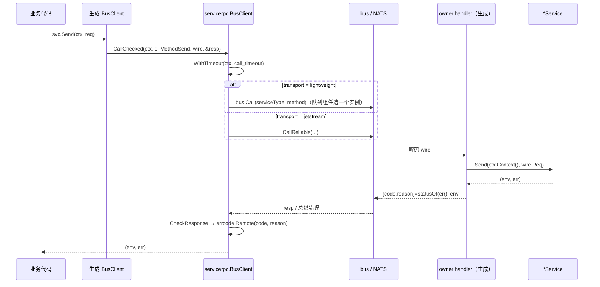
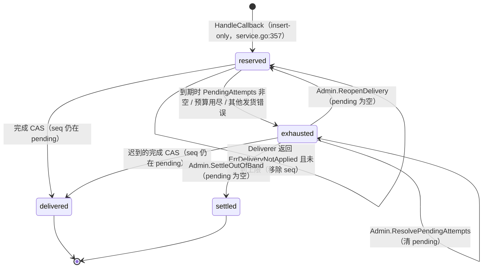
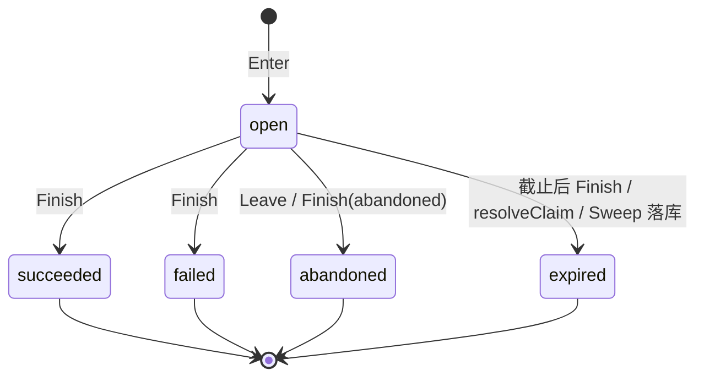
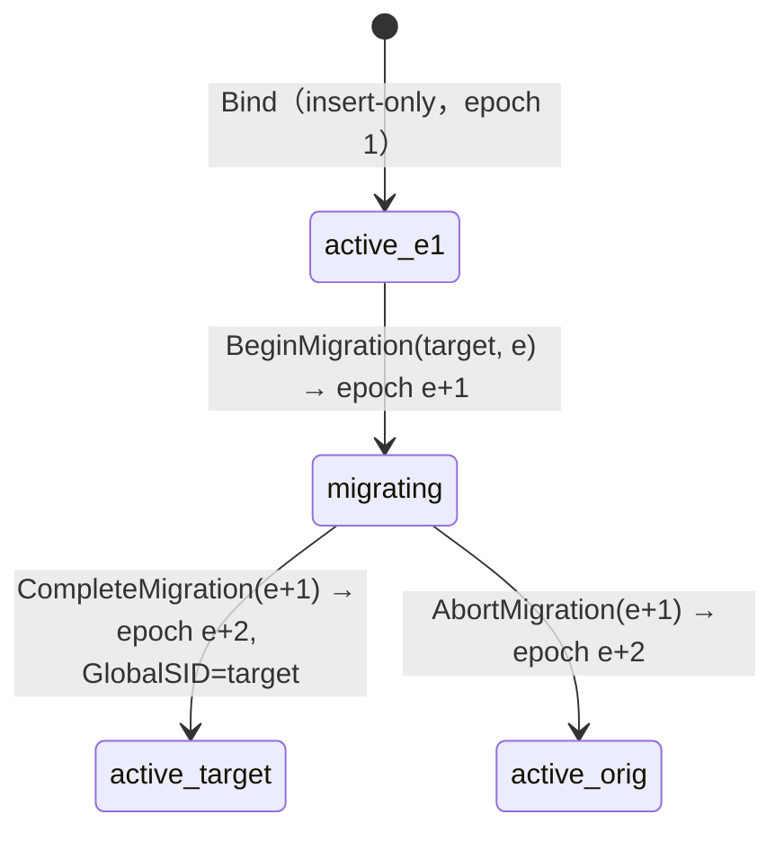
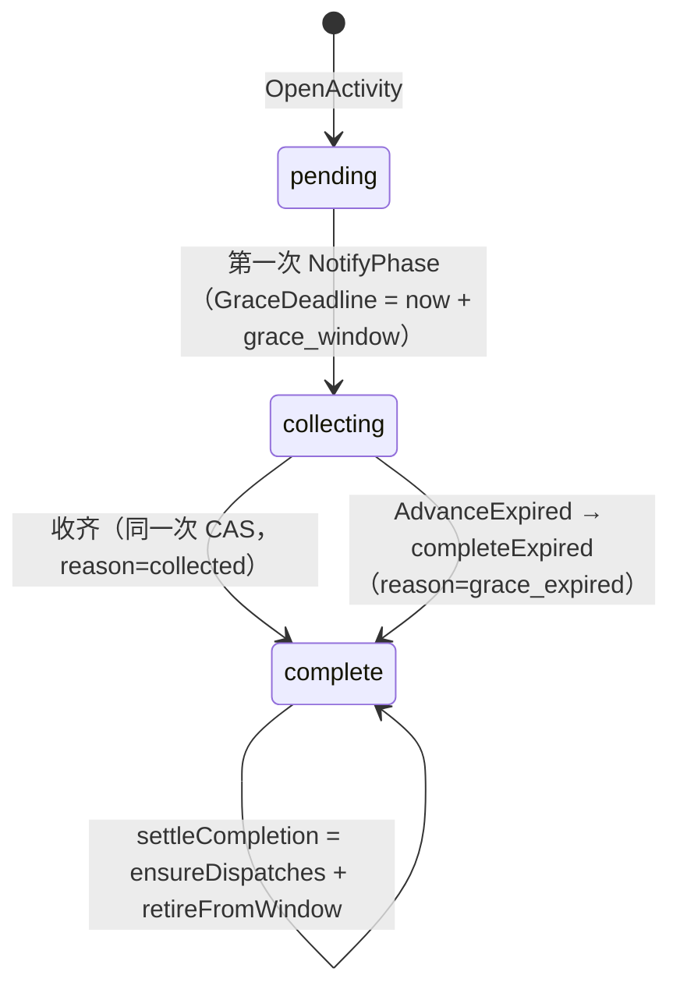

# 09 kit 服务（实现）

> 配套说明文档：[guide/09-kit-services.md](../guide/09-kit-services.md)（是什么、怎么用、配置、运维、保证与限制）。
> 源码基准：tag `v1.23.0`（`28912cd6`），文中 `path:line` 都按这个 tag。codebase-memory 图谱的代际早于 tag（2026-09-30 前后），`kit/service/global/activity/groups.go`、`kit/service/account/creation_table.go`、`kit/mods/service_servicemods.go` 等 C4 / B9 / C6 之后的文件不在图谱里或已变化；本篇只用图谱定位，结论全部按 tag 源码直接读取。
> 已登记、本篇直接引用的问题：[框架文档发现登记](../../review/FRAMEWORK-DOCS-FINDINGS-2026-10-07.md) 的 F09-R1～R4、F09-V、F09-K、F09-D；本次新发现编号 N1～N16，见 §11。

## 速览

- **结构**：十个服务各是一个 Mod，形状统一——owner Mod（`NewMod`，持有 Redis 存储，发布公开能力 + `.local`）、`Server`（Service 的 `Init` 里注册总线 handler，`run(ctx)` 跑周期工作）、`ClientMod`（只有总线客户端）。mail / match / session 的领域实现在 core 的 `service/<x>/`，kit 包只是别名 + Mod；其余七个服务整体在 `kit/service/<x>/`。
- **存储**：除 rank（自写 Lua）和 mail 信封（SETNX + TTL）外，全部经 `versionstore.Store` 的 Get / Create / Update / Delete(If)；每个服务一个必填 `key_prefix`，每类记录一个子命名空间，集成测试 `everyNamespace` 是键空间的书面规格。
- **关键不变量**：每个写操作有自己的幂等依据（请求 ID 账本 / 状态比对 / 令牌），所以“总线回复丢失 → 调用方重试”安全；运维面只经 `.local`；owner 发布包装而不是实现本体；业务错误经响应信封按 code 还原。
- **最该盯的地方**：服务层零处理 `ErrOutcomeUnknown`（F09-V）；生成客户端 affinity 不生效（F09-R1）、传输超时与 JetStream 兼容（F09-R2、R3）；亚秒级时长按秒截断（N2）；activity 坏记录 / game 永久宕机的 sweep 与 dispatch 出口（F09-K、N5）。

### 本篇覆盖的包

| 包 | 职责 |
| --- | --- |
| `kit/service/{account,platform,global,global/activity,chat,rank,directory}` | 七个整体在 kit 的服务（领域 + 存储 + Mod + 生成物） |
| `service/{mail,match,session}` | 三个领域实现在 core 的服务（接口、领域逻辑、Redis 存储、传输半生成物） |
| `kit/service/{mail,match,session}` | 别名（`alias.go`）、Mod、`run`、装配半生成物；session 另有 `options.go`（`WithSweepOwners`） |
| `kit/mods`（服务部分） | Mod 名表、`Redis` 能力查找、`CheckKeyPrefix`、`ValidateClusterKeyPrefix`、`ServiceMetricsConfig` |
| `servicerpc` | `BusClient`（超时 / 传输 / 发现 + picker）、`KeyAffinityPicker`、响应状态约定 |
| `servicemetrics`、`kit/service/servicemetrics` | Reporter / Sink / Recorder / MetricsReporter（kit 包是 core 的再导出） |
| `kit/service/integration` | 真实 Redis 上的集成测试、键空间守卫、Mod 形状守卫 |
| `kit/service/examples/split` | 两种部署的最小示例与测试 |
| game-demo 模板（`demo/internal/service/game/{playerowner,gift_saga}.go.tmpl`、`demo/game/controllers/player/enter_game.go.tmpl`、`demo/internal/access/player/tcp/auth.go.tmpl`） | 玩家静态绑定、WriteGate、赠礼 FromSID 转交 |

跨分区：versionstore 实现见 [03 实现 §2.5、§3.11、§7.4](03-dataengine.md)；bus / NATS / ownerroute 见 [05 实现](05-remote-mirror.md)；saga 协调器与步骤收件箱见 [06 实现](06-saga.md)；配置声明与 `LoadConfig` 见 [07 实现](07-config.md)；Mod 装配与启动顺序见 [01 实现](01-app-lifecycle.md)；servicerpc 生成器（`codegen/internal/servicerpc`）见 [12 代码生成](12-codegen.md)。

---

## 1. 包与文件地图

### 1.1 服务包的通用文件

| 文件 | 职责 |
| --- | --- |
| `<x>_rpc.go` / `mail.go` / `rank.go` | `//roost:rpc` 接口：跨进程契约，注释写明哪些方法刻意不在这里 |
| `*_rpc_gen.go` | 传输半（生成）：wire 类型、`rpcStatus`、`statusOf`、`RegisterHandlers`、`BusClient`、`DefaultCallTimeout`、`CapabilityName`、`LocalCapabilityName` |
| `*_rpc_assembly_gen.go` | 装配半（生成，始终在 kit）：`OwnerCapabilities`、`Server`（Init 注册 handler、Start 跑 `run`）、`ClientMod` |
| `types.go` / `chat.go` / `directory.go` | 错误码与 sentinel、`Error` 映射、上界常量、领域类型与 `Validate` |
| `service.go` / `store.go` | 业务逻辑 |
| `redis_store.go` | 用 `versionstore.NewRedisStore` 构造各子命名空间 |
| `<x>_mod.go` | owner Mod：配置结构体、Init（校验前缀与协作者）、Provide（构造存储与服务、发布能力） |
| `server_run.go` | `run(ctx)`：周期工作或显式“什么也不做” |
| `admin.go` | `Admin` 接口与实现：只经 `.local`，运维备注必填 |

### 1.2 逐服务

| 服务 | 特有文件 |
| --- | --- |
| account | `creation_table.go`（建角判定表，纯函数）、`create_role.go`（计划推进与释放）、`identity.go`（Verifier / Allocator / NameValidator / RegistryBound，`ErrVerifierUnavailable`） |
| platform | `identity.go`（Verifier / PlayerResolver）；订单与 pending 索引在 `redis_store.go:38-65` |
| session（core） | `sweep_source.go`（`SweepPending` / `BackgroundSweepEnabled`）；kit 侧 `options.go`（`WithSweepOwners`） |
| global | 只有路由；`redis_store.go:30-32` 说明旧 lease 键 |
| activity | `groups.go`（组文件解析与 `checkExpected`）、`admin.go`（四个运维方法）、`coordinator_rpc_gen.go` |
| mail（core） | `mailbox.go`（邮箱状态机、淘汰、墓碑）、`send_intent.go`（发送意图逐字段比较，RR-20261001-02） |
| match（core） | `queue_store.go`（整队列一个版本化值）、`grouping.go`（分组策略） |
| rank | `member.go`（ZSET 成员字节序编码）、Lua 脚本在 `redis_store.go:100-126` 及读脚本 |
| chat | `store.go`（channelState、ring、幂等键表、分页、裁剪）、`service.go`（对外方法转调 store） |
| directory | `store.go`（Reserve / Commit / Cancel / Lookup / Release） |

### 1.3 横切

| 文件 | 职责 |
| --- | --- |
| `kit/mods/service_name.go:16-62` | 十个 Mod 名（`service.` 前缀）与 `All` |
| `kit/mods/service_servicemods.go:17-76` | `Redis`、`CheckKeyPrefix`、`ValidateClusterKeyPrefix`、`ServiceMetricsConfig` |
| `servicerpc/client.go` | `BusClient.Call` / `CallChecked` / `CallDiscoveredChecked` / `PickServer`、`OptionsFromConfig`、`WithTransport` |
| `servicerpc/affinity.go` | `KeyAffinityPicker`、`WithKeyAffinity`、`WithAffinityKey` |
| `servicerpc/status.go` | `Error` / `Check`：errcode 的薄包装 |
| `servicemetrics/servicemetrics.go:15-110` | Reporter 六个事件、`Sink`（nil 安全）、`KeyedReporter.DepthOf` |
| `servicemetrics/metrics_reporter.go:12-32` | 生产 Reporter 的指标名与标签 |

→ [说明文档](../guide/09-kit-services.md)对应：§本篇覆盖的包、§4.1。

## 2. 关键类型与数据结构

| 类型 | 字段要点 | 位置 |
| --- | --- | --- |
| `account.Account` | `Banned`（只读，无写入方）、角色列表 | `kit/service/account/types.go:205-215` |
| `account.Role` | `PlayerID`、`AccountID`、`ServerID`（建角定下不变）、`Name`、`Profile` | 同文件 |
| `account.Slot` | `AccountID`、`ServerID`、`PlayerID`（已发布）、`Creation{ID, PlayerID, Name, Admitted, …}`（持久计划） | 同文件；判定见 `creation_table.go:186-201` |
| `account.GameServer` | 区服登记（ID、Status、名字） | `types.go:242-249` |
| `platform.Order` | `State`（reserved / delivered / exhausted / settled）、`Attempts`、`MaxAttempts`、`AttemptSequence`、`PendingAttempts []uint64`、`NextAttemptAtUnix`、内容摘要 | `kit/service/platform/types.go:187-206` 及其后 |
| `session.Run` | `ID`（128 位随机）、`OwnerID`、`RequestID`、`State`、`DeadlineUnix`（秒）、`Resources[]{Kind, ID, Released, Forced}` | `service/session/types.go` |
| `session.Claim` | `OwnerID`、`RunID` | `service/session/service.go:278-280` |
| `global.RouteBinding` | `GameSID`、`GroupID`、`GlobalSID`、`TargetGlobalSID`、`State`（active / migrating）、`Epoch` | `kit/service/global/types.go` |
| `activity.Activity` | `Status`（pending / collecting / complete）、`Expected`、`NotifiedGameSIDs`、`GraceDeadlineUnix`、`CompletionReason` | `kit/service/global/activity/types.go` |
| `activity.Window` | 每组一条：`Keys`、`Opening{key → Intent}`、`Delivering`、`RefusedOpens` | 同上；名额上限 `MaxPendingActivities = 256`（`types.go:232`） |
| `activity.Dispatch` | `Token`（ACK 授权）、`Result`、`State`（pending / acked / exhausted）、`Attempts`、`NextAttemptAtUnix` | `kit/service/global/activity/types.go:735-745` |
| `mail.Mailbox` | `Entries{mailID → Entry}`、`Unread`、`SettledClaims`（墓碑）、`Evicted` | `service/mail/mailbox.go` |
| `mail.Entry` | `Status`、`EnvelopeExpiresAtUnix`、`ClaimToken`、`ClaimDeadlineUnix`、`ClaimAttempts` | `service/mail/types.go:222` 起 |
| `chat.channelState` | `LastSeq`、`Ring []Message`、`Requests{requestID → seq}`、`Evicted` | `kit/service/chat/store.go:91-106` |
| `match.queueState` | `Tickets`、`Waiting`、`Matches`、`Requests`（只增，见 §7.2 已知观察） | `service/match/queue_store.go:28-41` |
| `rank` member | `value(16hex) tie(16hex) owner(16hex) 十进制owner base64(brief)`，score 恒 0 | `kit/service/rank/member.go:21-63` |
| `directory.Entry` | `Owner`、`Token`、`State`（reserved / committed）、`ExpiresAtUnix` | `kit/service/directory/directory.go` |
| `PlayerOwners` | 驻留表、卸载中表、`sid`、evictor、fencer | `demo/internal/service/game/playerowner.go.tmpl:42-60` |

## 3. 主流程

### 3.1 一次跨进程服务调用

1. 生成的 `BusClient.call` 固定 `CallChecked(ctx, 0, …)`（`service/mail/mail_rpc_gen.go:360-367`；模板 `codegen/internal/servicerpc/template.go:205`）。`serverID=0` 走 `bus.Call` / `CallReliable`（`servicerpc/client.go:137-145`），不经 discovery；affinity 标记生成的 `WithKeyAffinity` 选项因此无处生效（F09-R1）。
2. 单次超时：`context.WithTimeout(ctx, c.timeout)`（`servicerpc/client.go:125-126`）；`NewBusClient` 把非正数换成 3s（`service/mail/mail_rpc_gen.go:347-358`）。轻量传输底层每次尝试另有 5s 上限（F09-R2，`nats/driver/rpc.go:164`）。 **F09-R2 v1.23.1 已修复，见 [RR-20261006-73](../../bugfix/RR-20261006-73.md)**（按调用方期限计时，错误链带 ctx 语义）。
3. 传输选择：`WithTransport` / `OptionsFromConfig`（`servicerpc/client.go:67-91`）存在，但生成的 ClientMod 不调用它们（F09-R3）。 **F09-R3 v1.23.1 已修复，见 [RR-20261006-74](../../bugfix/RR-20261006-74.md)**（生成的 ClientMod 读 `nats.rpc.transport`）。
4. 响应：`CallChecked` 先返回总线错误，再 `CheckResponse`（`servicerpc/client.go:148-161`）；`errcode.Remote` 重建 `IntError{Code, Message}`（`errcode/errcode.go:61-80`），`Is` 按 code 比较（`:190-202`）。

`CallDiscoveredChecked`（`servicerpc/client.go:163-182`）让发现、选择、传输共用一份预算（RR-20261004-NC-10），但非测试代码不调用它（F09-R1）。

### 3.2 Mod 装配

1. owner Mod `Init`：`app.LoadConfig` 读配置 → `mods.CheckKeyPrefix`（`kit/mods/service_servicemods.go:34-39`）→ platform / rank / activity 再 `ValidateClusterKeyPrefix`（`:46-56`；调用点 `kit/service/platform/platform_mod.go:149`、`kit/service/rank/rank_mod.go:80`、`kit/service/global/activity/activity_mod.go:115`）→ 校验构造参数（缺协作者点名报错）。
2. owner Mod `Provide`：`mods.Redis(r)` 取 Redis（缺时报能力名，`service_servicemods.go:17-23`）→ `NewRedisStores` → `New(Config{...})` → 注册公开名（包装）与 `.local`（本体）（`kit/service/mail/mail_rpc_assembly_gen.go:59-64`）。
3. `Server.Init`：从注册表取 `.local`；只有公开名没有 `.local` 时点名拒绝（`:107-131`）；调 `RegisterHandlers(bus, impl)`。
4. `Server.Start`：起 `run(ctx)`；Stop 取消 ctx。
5. `ClientMod`：依赖 `ModNats`（`:206`），Init 读 `service_type` / `call_timeout`（`:218-240`），Provide 构造 `BusClient` 并以公开名注册。

### 3.3 account 建角

判定表 `decideCreation(slot, entry, name)`（`kit/service/account/creation_table.go:116-178`）展开如下（行 = slot 状态，列 = 入口；pending 两行再按名字状态细分）：

| slot \ 入口 | 同名（entrySameName） | 同名被拒后（SameNameRefused） | 换名（OtherName） | 运维 Resolve |
| --- | --- | --- | --- | --- |
| absent | makePlan | makePlan | makePlan | refuseUnresolvable |
| foreign（记录属于别的账号 / 区服） | refuseConflict | refuseConflict | refuseConflict | refuseConflict |
| legacy（无计划身份的旧 slot） | refuseConflict | refuseConflict | refuseConflict | refuseUnresolvable |
| published | returnRole | returnRole | refuseRoleLimit | refuseUnresolvable |
| pending，名字未读 | resume | readName | readName | readName |
| pending-unadmitted，free | resume | releaseRefuseNameTaken | releaseAndRetry | resolveRelease |
| pending-unadmitted，reservedByPlan / committedByPlan | resume | releaseRefuseNameTaken | refuseRoleLimit | refuseUnresolvable |
| pending-unadmitted，reservedElsewhere | resume | releaseRefuseNameTaken | releaseAndRetry | resolveRelease |
| pending-admitted，free / reservedElsewhere | resume | refuseNameTaken | refuseRoleLimit | resolveRelease |
| pending-admitted，reservedByPlan / committedByPlan | resume | refuseNameTaken | refuseRoleLimit | refuseUnresolvable |
| pending（任一），committedElsewhere（计划已死） | resume | releaseRefuseNameTaken | releaseAndRetry | resolveRelease |

- 分类：`classifySlot`（`:186-201`）、`classifyName`（`:206-219`）、`creationEntryFor`（`:224-229`）。全部格子由 `TestCreationTableEveryCell`（`creation_table_test.go:80`）覆盖。
- 执行循环 `createRole`（`create_role.go:23-101`）：读 slot → 分类 → 查表 → 执行；`actReleaseAndRetry` 每次调用至多一次。
- 计划推进 `resumeRoleCreation`（`create_role.go:149-264`）：
  1. directory `Reserve(name, owner = slotKey/planID)`（`creationOwner`，`:134-136`）；被拒（`ErrKeyTaken`）→ `Lookup` → `refuseResumedName`（`:270-293`）。
  2. 名字已 committed 但 token 不是本计划 admit 过的 → 拒绝。
  3. admission CAS：把预约 token 记到 slot（`Admitted=true`）。此后的存储错误只向前恢复，不删 slot（除非计划已死）。
  4. `Roles.Create(playerID)`；输了读回，是别人的 ID → Cancel 名字、释放 slot。
  5. directory `Commit`。
  6. 发布 CAS：slot 写 `PlayerID`；失败读回。
- 释放 `releaseCreationSlot`（`:295-307`）：`DeleteIf`，谓词 `PlayerID==0 && 同一 Creation.ID && (planDead || !Admitted)`——只能删“还没 admit 或已证明死掉”的计划。
- 新计划 `makeCreationPlan`（`:108-129`）：先 `Allocator` 分配 playerID，再 insert-only 写 slot，输了读赢家。

### 3.4 platform 订单状态机

- claim：`kit/service/platform/service.go:445-500`（delivered / exhausted / settled 原样返回；未到期 → held；pending 非空 → exhausted；预算用尽 → exhausted）。
- 完成：`:549-571`（settled 或 seq 不在 pending → 不动；否则移除 seq，非 delivered 则转 delivered）。
- 失败：`recordFailure`（`:594-627`）：NotApplied 移除 seq；非 NotApplied 或到上限 → exhausted。
- 退避：`backoff = DeliveryBackoff × min(attempt, maxBackoffMultiplier=8)`（`:648-657`）。
- 后台：`server_run.go:36-140`，候选 `pendingOrderIDs`（`service.go:710`）；`BackgroundRetryEnabled` 只看 `cfg.Pending != nil`（`:720`），而 Mod 在 `pending == nil` 时回落到订单存储（`platform_mod.go:178-181`）。
- pending 索引：订单与 `<prefix>:pending` ZSET 在同一个脚本里写；分数：终态出索引，否则 NextAttemptAtUnix / PaidAtUnix / CreatedAtUnix（`redis_store.go:38-87`）。

### 3.5 session：Enter 与 claim

1. 校验；读请求账本 `Requests.Get(requestID)`：owner 不同 → `ErrRequestInvalid`；同 owner → 重放（run 不存在 → `ErrConflict`）（`service/session/service.go:222-251`）。
2. 生成 128 位 runID，`Runs.Create`（`:254-275`）。
3. `Claims.Create(ownerID)`；没拿到就 `Get` 当前持有者交给 `resolveClaim`（`:406-441`）：持有者的 run 活着 → `ErrAlreadyRunning`；否则 resolve（终态 / 过期）、释放资源、释放 claim，再 Create 一次（`:278-326`）。
4. `Requests.Update` 作 CAS 插入并拿赢家（RR-20260908-01，`:338-351`）；失败返回 `run, err`。
5. 账本撞上别人：**先 releaseClaim 再 discard**（RR-20260909-02，`:352-381`），`releaseClaim` 用 `DeleteIf` 只删指向本 run 的 claim（`:443-467`）。

- 终态不可变（`service.go:626-628`）；终态后 `releasePending`（`:651-676`）对每个未释放资源调 Releaser 再 `markReleased`（`:678`），全部释放后 `releaseClaim`。
- Attach（`:477-539`）：一次 CAS，拒绝伪造的释放字段（RR-20260929-14）、非 owner、终态、过期、同 kind 另一个 ID、超过 8 个资源。
- Sweep（`:760-834`）：limit ≤ 200，按 owner 排序逐个处理 claim：孤儿 → 清；活 run → 跳过；终态 → `releasePending`；过期 → resolve(expired)；之后释放 claim。
- ForceRelease（`service/session/admin.go:86`）：把某个资源标记为 released + forced，用于 Releaser 永远失败时放开 owner。

### 3.6 global 迁移

- Bind：`kit/service/global/service.go:64-95`；Begin：`:116-151`；Complete：`:154-193`；Abort：`:196-224`。epoch 不符 → `ErrRouteStale`；Complete 在“同 epoch 且非 migrating”时按重放返回（`:169-175`），但真实重试带的是旧 epoch，进不了这个分支（F09-V S1）。Abort 对非 migrating 绑定是 no-op 却计 `accepted`（`:209-224`）。

### 3.7 activity

**活动**：`OpenActivity`（`kit/service/global/activity/service.go:274-316`）先 `checkExpected`（`groups.go:153-171`），再 `admitToWindow`（`:347-398`：Opening 条目 + 不可变 Intent，名额 = Keys + Opening ≤ 256，超了 `ErrBacklog`），然后 `Activities.Create`，最后 `confirmWindow`（`:320-343`：Opening → Keys）。

- NotifyPhase：`:565-665`；拒绝先写审计再报错（`refuseNotify`，`:667-704`；`appendAudit` `:709`，每活动最多 64 条）。sweep 不碰 pending（`kit/service/global/activity/types.go:392-397`）。
- AdvanceExpired：`:783-1048`；Opening 条目超过 `OpeningGrace` 且活动不存在：有 Intent → 代为 Create 并确认；无 Intent → 回收（RR-20261001-09）；Intent 损坏 → 跳过保留计数。超过 256 条的窗口用 ScanAfter 轮转（`:815-829`）。
- **进度账本** `applyProgress`（`:1216-1384`）：读活动（complete 则拒绝）→ 读参与者、释放已 applied 或已过期的 pending 证明 → `Ledger.Create(reserved)`（同键 delta 不同 → RequestInvalid；已 applied → 重放）→ `Participants.Update`（Applied 已有 → no-op；pending 满 32 → `ErrProgressBacklog`；累加带溢出守卫）→ `markReservationApplied`（`:1398`）→ `clearPendingProgress`（`:1386`）。外层 mutate 比较 Applies 不一致返回 `ErrVersionMismatch`，最多 8 次（`:1196-1214`）。
- **dispatch**：`ensureDispatches`（`:1458`）为每个 expected game 建一条；`AttemptDispatch`（`:1609-1680`）：Attempts ≥ Max → exhausted，否则 Attempts++、NextAttempt = now + backoff×min(attempt,10)（`:1685`）；`AckDispatch`（`:1702`）常量时间比较 token → acked；`Admin.ReopenDispatch`（`kit/service/global/activity/admin.go:105-160`）exhausted → pending（token 不变、次数清零）。owed 索引 `<prefix>:owed:<group>:<sid>` 是 ZSET，只放 pending（`redis_store.go:75-134`）。
- **run**（`kit/service/global/activity/server_run.go:59-151`）：每 20s 对每组：AdvanceExpired(64) → DeliveringActivities(64) → 对每个活动 DueDispatches **只观察**（RR-20260919-10，`:118-126`），等待 ≥ 10 分钟计 `dispatch.stale` → RetireDelivered（`service.go:495-545`）。组内任何一步出错整组 return（`server_run.go:90-98`）。

### 3.8 mail

- Send（`service/mail/service.go:158-253`，重放 `replaySend` `:295`）：`Sends.Create(requestID, intent)` 账本 → 信封 `SETNX`（TTL = 业务剩余时长 + 24h，`redis_store.go:164-193`）→ 直发 `deliver` 或交 broadcast Deliverer → `Sends.Update` 记结果。同 RequestID 重放比较发送意图（`send_intent.go`）。
- deliver（`:377-482`）：邮箱 `Update`：已在 → 幂等；墓碑在 → 由墓碑回答；满 → `evict` 只淘汰 claimed / deleted（`mailbox.go:226-270`），仍满 → `ErrMailboxFull`；墓碑 > 200 → `ErrClaimHistoryFull`。
- 领取：ReserveClaim（`service.go:758-901`：校验 Addresses、要求已投递进该邮箱、claimable、token 首次生成后不变、租期 = now + `ClaimLease` 秒数、Attempts++）→ CommitClaim（`:903-996`：token 一致 → claimed；已 claimed 同 token → 重放）→ CancelClaim（`:998-1057`：token 与 attempts 都一致才释放）。

| 条目转移 | 入口 |
| --- | --- |
| unread → read | MarkRead |
| unread / read → claimed | CommitClaim（token 一致） |
| unread / read / claimed → deleted | Delete |
| 任意 → 移除 | expireEntries（信封已过期且无未结 token，`mailbox.go:83-103`） |
| claimed / deleted → SettledClaim 墓碑 | evict（`mailbox.go:226-270`），墓碑随信封过期删除（`:287-315`） |

### 3.9 chat

- Append（`kit/service/chat/store.go:345-393`）：规则 / 发送者 / requestID / SystemOnly / body / ref 校验 → `policy.CanPublish`（`:380`）→ `store`（`:443-510`）：一次 `Update` 内完成重放判断（键在 Requests 且消息在 ring：同发送者 → 重放，不同 → `ErrConflict`；键在但消息已淘汰 → `ErrAlreadyPublished`）、分配 seq、append、trim（`:179`）。幂等键表上限 `requestKeyBudget = clamp(2×retain, 200, 2048)`（`:216`）。
- AppendSystem（`:395-439`）：先由 `SystemAuthenticator` 校验令牌。
- pageOf（`:572-667`）：gap 只按本页跨过的范围判断（RR-20261001-08）；BeforeSeq 越界返回最新页，AfterSeq 越界报 `ErrCursorInvalid`。
- Prune（`:669-722`）：系统钟，按 `retention_age` 删旧消息；`NewStore` 把 0 换成 72h（`:312-314`，F09-K）。

### 3.10 match

- Enqueue（`service/match/queue_store.go:173-262`）：一次 `Update`：`expireLocked` → requestID 重放（检查 owner，`:194-213`）→ 一个 subject 一张活票（`:217-222`）→ 上限 → 新票（ID 128 位随机，`:165-171`；`ExpiresAt = now + TicketTTL` 按秒，`:233`）。
- Commit（`:373-454`）：matchID 在 CAS 外生成（`:391`）；CAS 内先全部校验（同队列、waiting、无重复票与 subject）再改状态（`:397-448`）。
- Sweep（`:470-499`）：`expireLockedLimit`（`:529-551`）。
- 后台：`kit/service/match/server_run.go:34-69`，只扫 `match.sweep_queues`（`match_mod.go:38-59` 解析 `mode:group_size[:partition]`）。

### 3.11 rank

Submit（`kit/service/rank/redis_store.go:141-213`）：Tie=0 → 提交时间毫秒（`:145-149`）→ 循环至多 `maxSubmitAttempts`=8 次：Lua 读 owner 当前 member + 请求 ring → ring 已有该 requestID → 重放 → `nextScore`（`:400-430`，Set / Max / Add，带溢出守卫）→ Lua swap（`:100-126`，比较 owner HASH 里的旧 member）→ `CountCompareAndSet("<prefix>:o:")`（`:180`、`:192`）；用尽 `CountConflict` + `ErrConflict`（`:211`）。旧 v1 ring 读到后迁成 v2（`:452-484`）。

### 3.12 directory

Reserve（`kit/service/directory/store.go:92-158`）：`Update`：不存在或已过期 → 新 reserved（随机 token、过期时间）；同 owner → 幂等返回；否则 `ErrKeyTaken`。Commit（`:160-213`）：token 一致且未过期 → committed（永久）。Cancel（`:215-252`）：`DeleteIf` token 一致。Release（`:269-300`）：只比 owner，`DeleteIf` 谓词 owner / token / state 未变。`New` 要求存储实现 `ConditionalDeleter`（`:51-58`）。

### 3.13 玩家静态绑定与赠礼转交（game-demo）

1. 装配（`demo/internal/service/game/service.go.tmpl`）：`NewPlayerOwners`（`:130`，拒绝 sid ≤ 0）→ `Evict`（`:145`）→ 注册 `PlayerOwnerCapability`（`:146`）→ 注册 WriteGate（`:151`）→ matchmaker → gift saga → `Fence(tcp runtime)`（`:199`）→ `Start`（`:201`）。
2. 认证：`newPrincipal` 把 `Role.ServerID` 写进 `Claims["server_id"]`（`demo/internal/access/player/tcp/auth.go.tmpl:68-103`）。
3. 登录：`BoundServerID` 读 claim（`demo/game/controllers/player/enter_game.go.tmpl:169-188`）→ 没有则 fail-closed（`:45-50`）→ `owners.Serve(loginCtx, playerID, boundSID)`（`:66`）→ 错误经 `errcode.ClientError` 回包（`:75-76`）。
4. `Serve`（`playerowner.go.tmpl:180-217`）：sid ≠ 本服 → `ErrPlayerElsewhere`（附 `owner_sid` field，`:185`）；卸载中 → 等到结束（≤ evictWait，受 ctx 限制）；否则驻留。
5. 写准入：生成的中间件懒查 `access.player.write_gate`（`codegen/internal/roost/render_access.go:360-446`），`AdmitMessage` 对 `MsgEnterGame` 豁免（`playerowner.go.tmpl:275-284`）；**找不到 gate 时放行**（F09-K，启动窗口推断）。
6. 卸载：每 30s `unloadIdle`（`:365-384`）→ `unloadOne`（`:390-420`）→ `runEviction`（`:427-441`），成功先删记录再关 done，失败保留记录；`playerEvictor`（`:459-490`）先 `scene.Leave` 再 Destroy。
7. 赠礼：发送方写 `FromSID = owners.SID()`（`demo/game/controllers/player/send_gift.go.tmpl:37-43`）；`Encode` 拒绝 `FromSID ≤ 0`（`demo/game/gift/gift.go.tmpl:113-121`）。debit / refund 步骤的准入谓词 `admitPhase`（`demo/internal/service/game/gift_saga.go.tmpl:457-503`）：解码失败放行交给 handler 拒绝；`FromSID ≤ 0` 拒绝；`AdmitBound(From, FromSID)` 非本服 → `handOver`（`ownerroute.Router` 按 FromSID，`:277-310`，失败只 Warn）再拒绝等重投；本服卸载中 → 拒绝不转交。接收进程 `runHandoff`（`:325-398`）核对信封与载荷、phase、`AdmitBound`，`inbox.Reserve` 去重后执行 `Sync_GiftDebit` / `Sync_GiftRefund`，不 ack（原进程持续 nak 直到回执可见，`:321-324`）。

→ [说明文档](../guide/09-kit-services.md)对应：§4.5～4.15。

## 4. 不变量清单

| # | 内容 | 强制位置 | 守卫测试 |
| --- | --- | --- | --- |
| I1 | owner 进程以公开名发布**包装**，实现本体只在 `.local` | `kit/service/mail/mail_rpc_assembly_gen.go:59-64`（各服务同） | `TestEveryOwningModPublishesTheInterfaceAndNotTheImplementation`（`kit/service/integration/mods_test.go:574`）、`TestTheOwnerOnlyCapabilityHoldsTheImplementation`（`:976`） |
| I2 | 只有 Server 注册 handler；只装客户端的进程启动 Server 被拒 | `mail_rpc_assembly_gen.go:107-131` | `TestOnlyTheMailServerRegistersHandlers`（`mods_test.go:692`）、`TestTheMailClientModRegistersNoHandlers`（`:731`）、`TestEveryServerServesInTheOwningProcess`（`:1030`） |
| I3 | 运维面不上总线 | 接口里不声明（如 `kit/service/account/account_rpc.go:20-25`） | `TestTheOperatorSurfacesAreNotReachableThroughTheBusCapability`（`mods_test.go:931`）、`TestEveryOwnerOnlyCapabilityIsThePublicNamePlusLocal`（`:883`） |
| I4 | owner Mod 与 ClientMod 不能同处一个进程 | 同名 Mod | `TestTheTwoMailModsCannotShareAProcess`（`mods_test.go:631`） |
| I5 | ClientMod 依赖 NATS Mod（不是 `bus` 能力名） | `mail_rpc_assembly_gen.go:206` | `TestEveryClientModDependsOnTheNATSMod`（`client_mods_test.go:28`） |
| I6 | Mod 名唯一且带 `service.` 前缀；名表与生成的 CapabilityName 一致 | `kit/mods/service_name.go:16-62` | `TestEveryCapabilityNameIsUnique` / `IsNamespaced`（`kit/mods/service_servicemods_test.go:12`、`:33`）、`TestTheNameTableAgreesWithEachGeneratedCapability`（`mods_test.go:831`） |
| I7 | `key_prefix` 必填、无空白；多键原子写的服务在 Cluster 下要求首个闭合 hash tag | `kit/mods/service_servicemods.go:34-56` | `TestKeyPrefixRejectsWhitespace`、`TestClusterKeyPrefixUsesFirstRedisHashTag`（`service_servicemods_test.go:41`、`:52`） |
| I8 | 每个键落在已声明命名空间里，每个命名空间至少写过一次 | `kit/service/integration/redis_test.go:703-729`（规格） | `TestPerPackageKeyNamespacesDoNotCollide`（`:748`）、`TestEveryModWritesUnderItsConfiguredPrefix`（`mods_test.go:341`）；缺口见 F09-K ③ |
| I9 | 建角判定只有一张表，所有入口共用 | `kit/service/account/creation_table.go:116-178` | `TestCreationTableEveryCell`、`TestCreationTableClassifiers`（`creation_table_test.go:80`、`:126`） |
| I10 | 每个账号每个区服至多一个角色；名字大小写不敏感唯一 | slot insert-only + directory | `TestOneRolePerAccountPerServer`、`TestRoleNamesAreUniqueCaseInsensitively`（`kit/service/account`） |
| I11 | SelectRole 先签名后持久化 | `kit/service/account/service.go:290-304` | `TestSelectRoleDoesNotPersistWhenSigningFails` |
| I12 | 支付回调重放不重复发货；内容不同报 mismatch | `kit/service/platform/service.go:308-407` | `TestCallbackReportsEachOrderRaceAndGrantsNothing`、`TestBugfix4CallbackReceiptMustOwnPendingProof` |
| I13 | 发货完成只认仍在 pending 的尝试序号；settled 不被覆盖 | `service.go:549-571` | `TestReconciledSettlementRejectsStaleDeliveryCompletion`、`TestSettledIsTerminalAndDistinctFromDelivered` |
| I14 | 运维重开不会造成二次发放 | `kit/service/platform/admin.go:98-152` | `TestReopeningRefusesAnyStateThatWouldGrantTwice`、`TestConcurrentReopensGrantOneFreshBudget` |
| I15 | session：RequestID 必填；同 owner 重放；一个 RequestID 不跨 owner | `service/session/service.go:222-251` | `TestAnEnterWithoutAnIdempotencyKeyIsRefused`、`TestEnterIsIdempotentPerRequestID`、`TestOneRequestIDCannotServeTwoOwners`（`service/session/session_test.go`） |
| I16 | 每个 owner 只有一个活 run | claim insert-only，`service.go:278-326` | `TestAnOwnerRacingItselfGetsOneRun`、`TestSessionAllowsOneLiveRunPerOwnerOnRedis`（`kit/service/integration/redis_test.go`） |
| I17 | 碰撞撤销不会删掉别人重取的 claim | `service.go:352-381`、`:443-467` | `TestEnterCollisionCleanupNeverRemovesAReacquiredClaim`（`enter_collision_cleanup_promises_test.go`） |
| I18 | 资源释放记录在 run 上，不重复释放成功的资源 | `service.go:651-700` | `TestEveryAttachedResourceIsReleasedExactlyOnce` |
| I19 | 调用方不能自己选 expired；账本写失败不报成功 | `service.go`（Finish 校验、`:345-351`） | `TestACallerCannotChooseTheExpiredOutcome`、`TestEnterReportsALostLedgerWriteInsteadOfSuccess`（`ledger_failure_test.go`） |
| I20 | global 迁移需要当前 epoch；Bind 同参数重试返回同一绑定 | `kit/service/global/service.go:64-224` | `TestMigrationRequiresTheCurrentEpoch`、`TestBindRetriedAfterUnknownOutcomeReturnsTheSameBinding`（`bind_retry_promises_test.go:33`） |
| I21 | activity 窗口名额有界并计拒绝 | `kit/service/global/activity/service.go:347-398` | `TestPendingWindowIsBoundedAndCountsRefusals` |
| I22 | sweep 不完成 pending 活动；只推进过期的 collecting | `kit/service/global/activity/service.go:783-1048`、`kit/service/global/activity/types.go:392-397` | `TestAdvanceExpiredNeverCompletesAPendingActivity`、`TestAdvanceExpiredLeavesALiveWindowAlone` |
| I23 | 一个坏 Opening 不拖住组内其他条目（AdvanceExpired 层） | `service.go:883-922` | `TestOneFailingOpeningCreateDoesNotStallTheRestOfTheGroup`（`legacy_opening_sweep_promises_test.go`）；sweepGroup 层未覆盖（F09-K） |
| I24 | 进度按 requestID 只记一次 | `service.go:1216-1384` | `TestAReplayedRequestIDIsANoOp` |
| I25 | ACK 需要令牌 | `service.go:1702` 起 | `TestDispatchAckRequiresItsToken`、`TestDispatchIsRetriedAckedAndFinallyExhausted` |
| I26 | 邮件：淘汰保留领取身份；淘汰后 Commit 由墓碑重放；删除的未领邮件不复活 | `service/mail/mailbox.go:186-315` | `TestEvictionKeepsTheClaimIdentityOfAClaimedMail`、`TestCommitClaimReplaysAfterTheEntryWasEvicted`、`TestBugfix4DeletedUnclaimedMailMustNotResurrect` |
| I27 | 邮件过期与领取租期走业务单调钟 | `service/mail/service.go:51-64` | `TestMailExpiryAndTheClaimLeaseRunOnTheMonotonicBusinessClock` |
| I28 | chat 发布按键幂等；系统令牌不能从请求体解码 | `kit/service/chat/store.go:443-510`、`:395-439` | `TestPublishIsIdempotentPerRequestKey`、`TestSystemTokenCannotBeDecodedFromARequestBody` |
| I29 | match：Commit 失败不改队列；并发 Commit 只成一局；票操作要求 owner | `service/match/queue_store.go:373-454` | `TestFailedCommitLeavesTheQueueUntouched`、`TestConcurrentCommitsProduceExactlyOneMatch`、`TestTicketOperationsRequireOwnership` |
| I30 | rank：CAS 重试后不溢出；请求幂等；坏 ring fail-closed | `kit/service/rank/redis_store.go:141-213`、`:452-484` | `TestBugfix5ConcurrentAddsCannotWrapAfterCASRetry`、`TestAddModeIsIdempotentPerRequest`、`TestMalformedRequestRingFailsClosed` |
| I31 | directory：Commit 需要持有的 token；并发 Commit 只有持有者成功 | `kit/service/directory/store.go:160-213` | `TestCommitRequiresTheHeldToken`、`TestConcurrentCommitOnlySucceedsForTheHolder` |
| I32 | 玩家只由绑定 sid 的 game 服务；认证器 claim 与登录读到的 sid 一致 | `playerowner.go.tmpl:180-235`、`auth.go.tmpl:68-103` | `TestEnterGameServesOnlyThePlayersBoundToThisServer`（`enter_game_test.go.tmpl`）、`TestAdmitBoundServesOnlyItsOwnSid`、`TestTheAuthenticatorsPrincipalCarriesTheSidTheLoginReads`（`auth_test.go.tmpl:39`） |
| I33 | WriteGate 豁免登录、拒绝其他；卸载中不准入 | `playerowner.go.tmpl:251-284` | `TestTheWriteGateExemptsLoginAndRefusesEverythingElse`、`TestAnUnloadInFlightAdmitsNothing` |
| I34 | 赠礼发送方 sid 是本进程 sid；退款预算覆盖发送方崩溃重启 | `send_gift.go.tmpl:37-43`；`saga.steps.gift_item.debit.max_attempts: 15` | `TestSendGiftWritesThisProcessSidAsTheSendersSid`、`TestARefundOutlastsACrashRestartOfTheSendersSid`（`gift_saga_budget_test.go.tmpl:39`） |

## 5. 并发

- **goroutine 归属**：每个 owner 进程的 `Server.Start` 起一个 `run(ctx)`（platform / session / activity / match / chat 有循环；account / global / mail / rank 只等 ctx）。handler 在总线驱动的 goroutine 上执行，服务方法本身无锁、无共享内存状态——全部状态在 Redis。
- **并发控制只有 CAS**：versionstore `Update` 的读-改-CAS 循环（冲突重试上限 8，用尽 `ErrConflict`）；rank 自己的 Lua swap 循环（8 次）；activity `ApplyProgress` 外层再有 8 次的 mutate 比较。**`Update` 的 mutate 函数可能被调多次**：在里面计数会多记（F09-V S8）。
- **单键 vs 多键**：platform（订单 + pending ZSET）、rank（ZSET + HASH）、activity（dispatch + owed ZSET）是多键原子写，所以要求 Cluster hash tag；其余服务每次写一个键。account 建角、session Enter 跨多个键但不要求原子，靠持久计划 / 账本 + `DeleteIf` 做恢复。
- **match**：一条队列一个值，同队列所有写互相冲突；affinity 原本用来降冲突，但现在不生效（F09-R1）。
- **game-demo PlayerOwners**：驻留表与卸载表由一把锁保护；`Admit` 在快池上调用，只看内存记录不阻塞（`playerowner.go.tmpl:251-269`）；`CloseServedSessions` 在锁外关连接（`:306-325`）；卸载在独立 goroutine，`Serve` 等它结束最多 `evictWait`（快池禁止阻塞的规则见 [02 实现](02-nest-entity.md)）。
- **时钟**：业务过期用 `app.BusinessClock(r).Now`（单调高水位，见 [10 时间实现](10-time.md)），token 与 chat 裁剪用系统钟；global / platform / directory 不注入，用 `time.Now`（`kit/service/global/service.go:48-49`、`kit/service/platform/service.go:186-187`、`kit/service/directory/store.go:65-66`）。

## 6. 失败与不确定结果处理

| 情形 | 服务的处理 | 调用方该做什么 |
| --- | --- | --- |
| 总线超时 / 传输错误 | 不在服务内；`BusClient` 返回总线错误 | 用同一个请求 ID 重试 |
| `versionstore.ErrConflict`（8 次 CAS 用尽） | 映射成本服务冲突码（ClientError） | 退避后重试 |
| `versionstore.ErrOutcomeUnknown` | **不处理**，原样返回 → `CodeInternal`（F09-V；`grep -rn 'versionstore.Resume\|ErrOutcomeUnknown' kit/service service` 为 0） | 同一个请求 ID 重试；依赖 §说明 7.1 的幂等依据 |
| `ErrVersionMismatch`（DeleteIf / 自定义 mutate） | 各自解释：directory → OwnerMismatch（`directory.go:88-93`）；session Delete 视为成功（`service/session/service.go:391-404`）；activity mutate 重试（`kit/service/global/activity/service.go:1205`、`:1331`）；account 释放 / Admin（`create_role.go:303`、`admin.go:168`） | — |
| `ErrMalformedRecord` | platform 后台：延后 15 分钟（`kit/service/platform/server_run.go:111-130`）；activity：sweep 整组停摆（F09-K）；其余：Internal | 运维修数据（T-156、T-181、T-230） |
| 外部副作用不确定（发货、资源释放、附件发放） | platform：pending attempt + exhausted 等人工；session：资源保持未释放、claim 不放；mail：三段式领取，未 Commit 的预约到租期后可重领 | 外部系统必须幂等；`ErrDeliveryNotApplied` 只在“确定没生效”时返回 |
| 部分成功（多步写中途失败） | account：计划持久、向前恢复；session：discard / releaseClaim 有序撤销；activity：Opening Intent + sweep 扶正 | — |
| 认领尝试回复丢失 | platform claim、activity AttemptDispatch 的重试会再花一次尝试（F09-V S4） | 预算要留余量 |

## 7. 持久化 / 协议格式

### 7.1 键空间

`
` = 该服务的 `key_prefix`（例：`roost:demo:mail`）。全部 JSON 编码（versionstore 信封见 [03 实现 §7.4](03-dataengine.md)）。

| 服务 | 键 | 内容 | TTL | 构造位置 |
| --- | --- | --- | --- | --- |
| account | `
:acct:<accountID>` | Account | 无 | `kit/service/account/redis_store.go:53-58` |
| | `
:role:<playerID>` | Role | 无 | `:61-66` |
| | `
:srv:<sid>` | GameServer | 无 | `:69-74` |
| | `
:slot:<accountID>@<sid>` | Slot（建角计划） | 无 | `:77-82`；`service.go:266` |
| | `
:names:name:<小写名>` | directory Entry（过期是字段） | 无 | `:85-95` |
| platform | `
:order:<id>` | Order | 无 | `kit/service/platform/redis_store.go:43` |
| | `
:pending` | ZSET（非终态订单） | 无 | `:65` |
| session | `
:run:<runID>` / `:claim:<ownerID>` / `:req:<requestID>` | Run / Claim / 账本 | 前两者无；req = `request_ttl` | `service/session/redis_store.go:65-88` |
| global | `
:route:<gameSID>` | RouteBinding | 无 | `kit/service/global/redis_store.go:44` |
| activity | `
:act:` / `:part:` / `:req:` / `:audit:` / `:disp:` / `:win:<group>` | Activity / Participant / 预约（TTL = `reservation_ttl`）/ 审计 / Dispatch / Window | 只有 req 有 | `kit/service/global/activity/redis_store.go:55-98` |
| | `
:owed:<group>:<sid>` | ZSET（pending dispatch） | 无 | `:115` |
| mail | `
:env:<id>` | Envelope（SETNX） | 业务剩余时长 + 24h | `service/mail/redis_store.go:164-193` |
| | `
:box:<playerID>` / `:send:<requestID>` | Mailbox / 发送账本 | box 无；send = `send_ttl` | `:85`、`:95` |
| chat | `
:ch:<ref>` | channelState（ref 中 `%` `:` 转义，`chat.go:403-421`） | 无 | `kit/service/chat/redis_store.go:30` |
| match | `
:queue:<Queue.Key()>` | queueState（Key 单射转义，`types.go:189-201`） | 无 | `service/match/redis_store.go:30` |
| rank | `
:z:<board>` / `
:o:<board>` | ZSET（成员编码）/ HASH（当前 member + 请求 ring） | 无 | `kit/service/rank/redis_store.go:78`、`:85` |
| directory | `
:name:<normalized>` | Entry | 无（过期是字段） | `kit/service/directory/redis_store.go:36` |

- `everyNamespace`（`kit/service/integration/redis_test.go:707-729`）列 26 个子命名空间，**缺 `:platform:pending`**（F09-K ③）；`namespaceOf` 用 `strings.Contains` 取最长匹配（`:999-1007`）。
- 旧键：`<global prefix>:lease:*`（v1.20.0 删除 lease API 后不再读写，`kit/service/global/redis_store.go:30-32`）。
- 按维护者“未部署不做兼容”的决定（2026-10-06），rank 的 v1 ring 迁移（`kit/service/rank/redis_store.go:452-484`）是可清理项（推断）。

### 7.2 总线协议

- subject 与 service type：`<svc>.service_type`（缺省服务名：account / platform / session / global / activity / mail / chat / match / rank）。
- 请求：`rpc<Method>Request`，字段名取接口方法的**参数名**（`service/mail/mail_rpc_gen.go:90-100`）。注意生成器的 snake_case 会把 `TicketIDs` 写成 `ticket_i_ds`（`service/match/matchmaker_rpc_gen.go:170`，N15）。
- 响应：嵌入 `rpcStatus{code, reason}` + 返回值字段（`service/mail/mail_rpc_gen.go:64-88`）。
- 版本兼容：wire 字段即 JSON 字段；改接口参数名就是改协议。未部署，不做兼容。

## 8. 测试与门禁

| 范围 | 命令 | 说明 |
| --- | --- | --- |
| 各服务单测（内存后端） | `GOWORK=off go test -count=1 ./kit/service/... ./service/...` | `^func Test` 个数：account 68、platform 68、session 55、global 19、activity 99、mail 92、match 45、chat 49、rank 48、directory 25 |
| servicerpc / versionstore | `GOWORK=off go test -count=1 ./servicerpc/ ./versionstore/` | 14 / 42 |
| 生成器 | `GOWORK=off go test -count=1 ./codegen/internal/servicerpc/` | 含 `TestAnAffinityMarkerReachesTheGeneratedClient`（`golden_test.go:168`，只比文本，F09-R1） |
| 集成（真实 Redis） | `REDIS_ADDR=127.0.0.1:6379 GOWORK=off go test -tags integration -count=1 -p 1 ./kit/redis/ ./kit/service/... ./service/...` | CI 同款（`.github/workflows/ci.yml:164`）；CI 还检查没有用例因缺 Redis 变量而跳过 |
| 集成 race | `go test -tags integration -count=1 -p 1 -race ./kit/service/integration/ ./kit/service/mail/ ./kit/service/rank/ ./service/mail/` | `ci.yml:178` |
| activity 的 Redis 变体 | `ROOST_REVIEW4_BACKEND=redis`、`ROOST_BUGFIX5_BACKEND=redis`、`ROOST_REVIEW_CLUSTER` | 同一批用例换后端 |
| 键空间 / Mod 形状 | 上面集成命令中的 `kit/service/integration`（29 个用例） | `redis_test.go`、`mods_test.go`、`client_mods_test.go`、`business_clock_test.go` |
| 两种部署示例 | `GOWORK=off go test -count=1 ./kit/service/examples/split/` | |
| game-demo 静态绑定 / 赠礼 | 生成 game-demo 后 `go test ./internal/service/game/ ./game/controllers/player/ ./internal/access/player/tcp/` | playerowner 与 gift_handoff 共 28 个用例；生成工程门禁见 12 |
| 真实进程演练 | `docs/bugfix/REAL-PROCESS-DRILLS-2026-10-06.md` | 静态绑定（OWN-2、OWN-3）、在途 saga 接手，含 Cluster |

## 9. 历史与重要修复（只列改变了设计的）

| 记录 | 改了什么 |
| --- | --- |
| [M-06](../../bugfix/M-06-match-domain-into-core.md) / [M-07](../../bugfix/M-07-mail-domain-into-core.md) / [M-08](../../bugfix/M-08-session-domain-into-core.md) | match / mail / session 领域实现移入 core，kit 只留别名与 Mod |
| [M-10](../../bugfix/M-10-servicerpc-split.md) | servicerpc 生成物拆成传输半与装配半 |
| RR-20260908-01、RR-20260909-02 | session 账本改用 Update 拿赢家；碰撞时先 releaseClaim 再 discard，claim 改 `DeleteIf` |
| RR-20260919-04 | platform 订单存储自带 pending 索引，与订单同一次写；后台重试缺省开 |
| RR-20260919-10 | activity sweep 不再代为 AttemptDispatch，只观察 |
| RR-20260929-19 → RR-20261001-06 → B9 | account 建角从“各入口各写判断”改成持久计划 + 一张判定表（[方案](../../feature/B9-C5-WINDOW-ENTRIES-ROLE-TABLE-2026-10-06.md)） |
| RR-20261001-09、NC-42 | activity Opening 条目带不可变 Intent，sweep 代为 Create；无 Intent 按宽限回收 |
| RR-20261004-NC-10 | `CallDiscoveredChecked` 发现与调用共用一份预算 |
| v1.20.0 global lease 删除 | global 只剩路由；进程活性改由 App 单实例锁（[01](01-app-lifecycle.md)） |
| [PLAYEROWNER-STATIC-BINDING](../../feature/PLAYEROWNER-STATIC-BINDING-2026-10-05.md) | 玩家动态租约改为建角定 sid 的静态绑定；赠礼按 FromSID 转交 |
| RR-20261006-05 | global Bind 同参数重试按状态视为重放 |
| RR-20261006-29 | game 贡献遇到未开窗口时自己开窗 |
| [C4](../../feature/C4-ACTIVITY-GROUPS-FILE-2026-10-06.md) | 活动组文件，每组 ≤ 64 |
| [C6](../../feature/C6-DEFAULT-SERVICE-METRICS-2026-10-06.md) | 服务指标缺省开，`service_metrics.enabled` 一处关 |
| D-L3 | 业务过期统一走业务单调钟（mail 的领取租期也改成业务钟） |
| [A2-3](../../feature/A2-3-VERSIONSTORE-WRITE-TOKEN-2026-10-07.md) | versionstore 一次性写令牌、`ErrOutcomeUnknown`、`Resume`（服务层未接入，F09-V） |

服务的 09-29 批次修复记录：`docs/bugfix/SERVICE-BUGFIX-2026-09-29*.md`；服务实现说明：`docs/review/IMPLEMENTATION-SERVICE-*.md`。

## 10. review 检查点

1. **身份**：每个上总线的方法，身份参数在服务里是否都和存储记录核对过？看 account `SelectRole`（`service.go:284`）、mail `ReserveClaim`（`service/mail/service.go:771`、`:818-833`）、session `Attach`；同时确认没有新方法把身份放进请求体结构里（生成 handler 只解参数）。
2. **运维面**：新增的 Admin / Sweep / Upsert 方法是否只经 `.local`？看 `TestTheOperatorSurfacesAreNotReachableThroughTheBusCapability`（`mods_test.go:931`）是否覆盖新方法。
3. **幂等依据**：新写操作的重放依据是什么（请求 ID / 状态 / 令牌）？回复丢失后用**同样参数**重试是否得到成功而不是 Stale / Conflict（对照 F09-V S1、S2）？
4. **`ErrOutcomeUnknown`**：新代码是否把它当普通错误吞掉或翻译成业务拒绝？应原样上抛或按幂等依据重试。
5. **mutate 副作用**：`versionstore.Update` 的 mutate 里有没有计数、日志、外部调用？重试会重复执行。
6. **新命名空间**：新增的 `Prefix: prefix + ":x:"` 是否同时加进 `everyNamespace`（`redis_test.go:707-729`）并被 `driveEveryPackage` 写到？ZSET 索引类键尤其要检查（F09-K ③ 的同类）。
7. **Cluster**：新增多键原子写（Lua、versionstore Index）的服务是否在 Mod Init 调 `ValidateClusterKeyPrefix`？
8. **时长配置**：新 duration 键若最终按秒存，`min` 是否 ≥ 1s（N2）？
9. **后台循环**：`run` 里任一步失败是否会跳过整组 / 整批后续工作（对照 `kit/service/global/activity/server_run.go:90-98`）？坏记录是否会让每个 tick 都失败？
10. **错误数据上线**：需要客户端拿到的值（sid、重试时间）是否在响应字段里，而不是错误 fields（对照 F09-K ①）？
11. **生成物**：改了接口后是否重新生成两半？`TestTheNameTableAgreesWithEachGeneratedCapability` 是否仍过？affinity 标记是否真的影响运行时路由（F09-R1 修复后要有行为测试，不只比文本）？
12. **ClientMod 配置**：新加的传输 / 超时语义是否同时在 owner 和 client 两侧生效（对照 F09-R3）？
13. **静态绑定**：新的玩家写入口是否经 WriteGate 或 `AdmitBound`？跨进程消息是否按发送方 / 目标的绑定 sid 转交，而不是按当前进程处理？
14. **时钟**：业务过期是否用注入的业务钟而不是 `time.Now`？token / 运维时间用系统钟是否有意为之？

## 11. 源码疑点与文档不一致

### 11.1 已登记（直接引用，不重复调研）

| 编号 | 要点 | 本篇位置 |
| --- | --- | --- |
| F09-R1 | 生成客户端 affinity 不生效（`codegen/internal/servicerpc/template.go:205`、`servicerpc/client.go:145`）。v1.23.1 已修复，见 [RR-20261006-59](../../bug/RR-20261006-59.md)：affinity 方法经 discovery + 按键 picker 路由，缺 discovery 启动时拒绝 | §3.1 |
| F09-R2 | 轻量传输 `call_timeout` > 5s 截到 5s；超时 / 取消错误不带 ctx 语义（`nats/driver/rpc.go:164`） | §3.1 v1.23.1 已修复，见 RR-20261006-73 |
| F09-R3 | JetStream 传输与生成 ClientMod 不兼容（`bus/bus.go:659-666`） | §3.1 v1.23.1 已修复，见 RR-20261006-74 |
| F09-R4 | servicerpc 生成器若干漏洞（`wiresafe.go:60`、`parse.go:204-215`、`validate.go:142` 等）。marker 拼写一项 v1.23.1 已修复，见 [RR-20261006-56](../../bug/RR-20261006-56.md)；其余待处理 | — |
| F09-V | 服务层零处理 `ErrOutcomeUnknown` / `Resume`；A2-3 方案与源码 5 处不一致；S1～S8 | §6 |
| F09-K | `player_elsewhere` 丢 `owner_sid`；`everyNamespace` 漏 `:platform:pending`；chat `retention_age=0` → 72h；activity 坏记录整组停摆；WriteGate 启动窗口放行（推断）；SelectRole / PublishSystem 信任模型 | §3.9、§3.13、§7.1 |
| F09-D | `kit/service/README.md`、`kit/mods/service_name.go:24-27`、`kit/README.md:25`、`USER_GUIDE.md:85` | — |

### 11.2 本次新发现

每条按“条件 → 后果 → 位置；确认方式；分级”。确认方式“读码”指在 tag 源码上逐行读过，没有写探针（维护者要求本轮不重复做探针）。

**N1（低，读码）session Enter 撞上并发释放的 claim 时报 `ErrConflict`。**
条件：`Claims.Create` 没拿到 claim，紧接着的 `Claims.Get` 发现 claim 已被并发释放（例如同 owner 的 Finish 刚结束）。后果：代码把 `held.Value` 设为 `Claim{OwnerID}`（RunID 为空，`service/session/service.go:296-300`），`resolveClaim` 对空 RunID 返回 `ErrConflict`（`:407-416`），Enter 失败；注释“Retaking is handled by the retry below”不成立——下面的重取只在 `resolveClaim` 成功后才执行。调用方会看到 610111，重试可成功。建议：`!found` 时直接跳到重取。

**N2（低，读码）亚秒级时长被截成秒。**
`session.run_ttl`（`kit/service/session/session_mod.go:55`）、`match.ticket_ttl`（`kit/service/match/match_mod.go:80`）、`mail.claim_lease`（`kit/service/mail/mail_mod.go:53`）、`activity.grace_window`（`kit/service/global/activity/activity_mod.go:58`）都声明 `min:"1ns"`，但截止时间按 Unix 秒存：
- session：`DeadlineUnix = now.Add(TTL).Unix()`（`service/session/service.go:262`），`Validate` 要求 deadline > start（`types.go:326-329`）→ TTL < 1s 时 Enter 间歇报 `ErrRunInvalid`。
- match：`ExpiresAtUnix = now.Add(TicketTTL).Unix()`（`service/match/queue_store.go:233`），过期判断 `now.Unix() >= ExpiresAt`（`types.go:249`）→ 票一入队就过期。
- mail：`ClaimDeadlineUnix = now + int64(ClaimLease.Seconds())`（`service/mail/service.go:863`）→ 租期 0，预约立即可被重领。
- activity：`GraceDeadlineUnix = now.Add(GraceWindow).Unix()`（`kit/service/global/activity/service.go:624`）→ 宽限立即到期。
建议：这些键改为 `min:"1s"`，或在 Mod Init 拒绝。

**N3（低，读码）chat 幂等键在原消息被 ring 淘汰后被别人复用，新消息被当作“已发布”丢弃。**
条件：发送者 A 用键 K 发布，消息后来被 ring 容量淘汰，但 K 仍在 `Requests` 表里；发送者 B 在同频道用 K 发布。后果：`next.find(seq)` 找不到消息，直接返回 `ErrAlreadyPublished`（`kit/service/chat/store.go:457-477`），不检查发送者；580110 的含义是“已发布、ack 不重试”，B 的消息被静默丢掉。同一函数在消息还在时会对不同发送者报 `ErrConflict`，注释明确说“不能静默丢”。（调研半成品记录为探针证实，本轮未重跑。）

**N4（低，读码）chat 重投先过策略再判重放。**
条件：消息已存下，随后发送者被禁言 / 频道策略变化，客户端重投同一 RequestID。后果：`CanPublish`（`store.go:380`）先拒绝，返回 `ErrNotPermitted`，拿不到已存的原消息（重放判断在 `:457`）。客户端会以为发送失败。

**N5（低，读码；设计缺口 + 文档不一致）activity：game 永久宕机时 dispatch 永不 exhausted，也没有运维出口。**
条件：expected 中某个 game 永久下线（缩容、合服）。后果：尝试次数只在 game 自己调 `AttemptDispatch` 时消耗（唯一非生成调用方 `demo/internal/service/game/activity.go.tmpl:482`；sweep 只观察，`kit/service/global/activity/server_run.go:118-126`），dispatch 永远 pending，活动永远留在 Delivering（`RetireDelivered` 要求全部终态），每 20s 计一次 `dispatch.stale`；`Admin.ReopenDispatch` 只认 exhausted，`RemoveMalformedWindowEntry` 拒绝健康条目，没有“放弃这个 game”的出口。`kit/service/global/activity/admin.go:26-27` 说“宕机超过 attempts×backoff 就会 exhausted”，与 RR-20260919-10 之后的行为相反。反方向：game 侧下游故障约 75s（5+10+15+20+25s）就会打成 exhausted。

**N6（低，读码；信任模型）activity `LookupDispatch` 在总线上返回 ACK 令牌。**
`Dispatch.Token` 带 JSON 字段（`kit/service/global/activity/types.go:739-743`），`LookupDispatch` 上总线（`activity_rpc.go:114-115`）。注释称令牌“使 ACK 成为送达的证据，而非任何人都能做的声明”（`types.go:739-742`），但任何总线进程都能先 Lookup 再 Ack。和 F09-K 的身份信任模型同类：总线必须是可信内网。

**N7（低，读码；文档不一致）platform 后台重试关不掉。**
`platform_mod.go:175-177` 说“想关重试就显式说”，demo `collaborators.go.tmpl:186-203` 说部署方可以提供“刻意不做后台重试”；但 `WithPendingOrders(nil)` 回落到订单存储自带的索引（`platform_mod.go:178-181`），没有任何关闭方式。

**N8（低，推断）platform 发货慢于退避时会被下一轮打成 exhausted。**
条件：Deliverer 耗时超过当前退避（首轮 5s），期间后台 tick 到来。后果：claim 看到 PendingAttempts 非空且已到期 → exhausted（`kit/service/platform/service.go:471-477`），计 `order.exhausted`；随后原尝试成功时完成 CAS 仍把它转 delivered（`:549-571`），结果正确但多一次告警；原尝试返回 NotApplied 时停在 exhausted 等人工。是有意的保守设计（“到期不证明外部调用没生效”），但运维需要知道 exhausted 不一定是真失败。

**N9（低，读码；异味）`platform.ValidateSession(0, token)` 接受任意有效 token。**
`security.VerifySessionToken` 在 `expectPlayerID == 0` 时跳过 playerID 比较（`security/session_token.go:78`），platform 的 `ValidateSession` 直接透传（`kit/service/platform/service.go:255-260`）。仓内没有以 0 调用的地方；account 的同名方法随后按 playerID 读角色，0 会得到 RoleMissing，不受影响。

**N10（低，读码）account `UpsertServer` 允许负数 sid。**
只拒绝 `ID == 0`（`kit/service/account/service.go:397-400`），也不校验 Status 枚举。建在负数 sid 上的角色在登录端点 `BoundServerID` 一律 fail-closed（非正整数视为没有绑定），重新 SelectRole 也走不出去。

**N11（低，读码；文档）session `Releaser` 注释自相矛盾。**
`service/session/service.go:42` 写“called at most once per resource”，`:49-51` 写“失败会重试，必须容忍重复释放”；实际是至少一次（Releaser 成功而 `markReleased` 失败时会再调）。demo `collaborators.go.tmpl` 写 exactly once（未逐行核对）。

**N12（低，推断）mail 投递时信封已不存在，会留下永不过期的未读条目。**
条件：`Deliver(playerID, mailID)` 时信封读不到（广播迟到超过信封 TTL、mailID 写错）。后果：`expiry = 0`（`service/mail/service.go:366-374`），`expireEntries` 跳过 `EnvelopeExpiresAtUnix <= 0` 的条目（`mailbox.go:86`），Unread 永久 +1 并占容量；删除后的墓碑同样不过期，积累到 200 触发 `ErrClaimHistoryFull`，之后该玩家所有投递被拒。`Deliver` 是进程内方法（broadcast Deliverer 调用），不上总线。

**N13（文档）mail 注释过时。**
`kit/service/mail/mail_mod.go:92-93` 说领取租期用系统钟；实际 D-L3 之后用业务钟（`service/mail/service.go:51-64`，守卫 I27）。

**N14（低，读码）directory Release 与文档不符。**
- `Release` 注释说只删 committed 条目（`kit/service/directory/directory.go:195-198`），实现不看 State（`store.go:269-300`），owner 可以不带 token 释放自己的 reserved 条目。
- `Release` 不判断过期：A 的预约已过期，B 调 Release 得到 `ErrOwnerMismatch`（`store.go:286-289`），而 `Lookup` 对同一条目报“不存在”（`:263-265`）。
- `directory.Error` 不映射 `versionstore.ErrConflict`（`directory.go:84-97`），对外是 Internal；directory 没有 RPC，影响限于进程内调用方。

**N15（异味）match wire 字段名 `ticket_i_ds`。**
`service/match/matchmaker_rpc_gen.go:170`：生成器把 `TicketIDs` 拆成 `ticket_i_ds`。功能无碍（两端同一生成器），但 wire 名难读；修生成器时要同时改两端（未部署，无兼容负担）。可并入 F09-R4 一起处理。

**N16（文档）`kit/mods` 的残留旧名。**
`kit/mods/service_name.go:1` 写 “Package servicemods”（实际 `package mods`）；`kit/mods/service_servicemods.go:20` 的错误文本让人 “add roost-kit/redis.NewRedisMod()”（合仓前旧名，现为 `kit/redis`）。

### 11.3 其他文档与源码不一致（补充 F09-D）

| 文档 | 说法 | 源码 |
| --- | --- | --- |
| `kit/service/account/account_rpc.go:33-39` | “server's name index keyed by server id” | 名字目录全局，不带 sid（`kit/service/account/redis_store.go:85-95`） |
| `kit/service/account/account_rpc.go:53-54` | SelectRole 的所有权“checked against the stored role rather than taken from the request” | `accountID` 本身是请求参数（F09-K 信任模型） |
| `kit/service/account/service.go:262-265` | “The directory enforces one owner per key, which is exactly one role per account per server” | 一账号一区服一角色由 slot 的 insert-only 保证（`create_role.go:108-129`），directory 管的是名字 |
| `kit/service/global/activity/activity_rpc.go:12` | “Five of the Service methods are not here” | 不上总线的 Service 方法远多于 5 个（§说明 4.1 表） |
| `kit/service/global/activity/admin.go:26-27` | 宕机超过 attempts×backoff 就 exhausted | 见 N5 |
| `kit/service/global/activity/server_run.go` 包注释 | “重试到期投递” | 只观察（`:118-126`） |
| `kit/service/integration/doc.go:5-7` | “seven of its nine packages” | 十个服务包 |
| `docs/feature/C6-DEFAULT-SERVICE-METRICS-2026-10-06.md:41` | `mods.ServiceMetrics(cfg, reporter)` | `ServiceMetricsConfig.ApplyServiceMetrics`（`kit/mods/service_servicemods.go:66-76`） |
| `docs/feature/C4-ACTIVITY-GROUPS-FILE-2026-10-06.md:30`、`:77-78` | Service 逻辑不变 / 未设 groups_file 不变 | `groups_file` 已是必填，`New` 拒绝 `Groups == nil`（`kit/service/global/activity/service.go:202-208`） |
| `codegen/internal/roost/demo.go:641` | gift 各步骤 “idempotent per command through the Mongo step inbox” | debit / refund 走 DataEngine 原生 inbox（`gift_saga.go.tmpl:139-145`） |

→ [说明文档](../guide/09-kit-services.md)对应：§7 保证与不保证。

## v1.23.1 B3 实施补充（2026-10-08，未发布）

N1～4/N7/N9/N10/N12/N14、F09-K chat/活动扫描、F09-V S6 已修复，见 RR-20261008-01～08。N5 新增 Admin.ExhaustDispatch：仅 owner 进程内，人工提供原因，pending→exhausted，不伪造 ACK/尝试，沿用原 token 可 Reopen；已有 Memory 行为回归。

N6：LookupDispatch 可读 token，总线应为可信内网；token 证明持有投递身份，不证明目标 game 身份。N8 排除为错误重试：外部发货超退避期限后保守进入 exhausted，表示结果待确认；迟到成功仍可 delivered，不能据 exhausted 推断未发货。N11：Releaser 为至少一次尝试，须按 run/resource 幂等；N13 邮件过期与领取租期均业务单调钟；N16 合仓路径更正为 kit/redis。

其余 F09-V/R4/K/D 尚在继续；本节不撤销原始审查证据，不把旧疑点一并关闭。

## B3 完整实现与疑点裁决（2026-10-08，未发布）

- N1～4/N7/N9/N10/N12/N14：RR-20261008-01～07；活动坏记录与 S6：RR-20261008-08。
- F09-V 的预算/指标：RR-20261008-09；S1/S2：RR-20261008-10；S5：RR-20261008-11。route/Run codec v2 拒绝旧值；自定义 RunStore 若不实现 AdmissionSource，仍须自行枚举未准入记录。
- F09-R4 / N15：RR-20261008-12；F09-K 转服、WriteGate：RR-20261008-13～14。namespace guard 新增 platform pending 与 session admission，并真实写入索引；共 28 个命名空间。
- N5：Admin.ExhaustDispatch 为 owner 内运维入口，必须填写原因；只把 pending 改 exhausted，保留 token，可 Reopen，不伪造 ACK。`TestOperatorCanRetirePermanentlyOfflineGameAndReopenSameDelivery` 及 admin 回归验证状态边界（具体名称见 remaining_promises_test.go）。N6/N8/N11/N13/N16：可信总线、保守 exhausted、至少一次资源释放、业务钟命名与 Mod 文案的契约更正。
- S4 排除“自动重复发货”疑点：platform 认领 CAS 错误立即返回，不调用 Deliver；后续发现 PendingAttempts 走 exhausted，须人工核对。`TestUnknownClaimDoesNotCallOrRepeatExternalGrant` 模拟认领成功丢回复；既有 UnknownGrant 测试覆盖外部已发货丢回复。activity 的 attempt 是发出领取尝试的预算，不是客户端收到次数；丢回复可能耗预算，Lookup/Ack/人工 Reopen 沿原 token 恢复，不能承诺自动无限重试。
- S7 为契约说明：appendAudit 记录每次拒绝调用；API 没有请求幂等键，同一拒绝重试会再记一条，MaxNotifyAudits 满后累计 Overflowed，不会再次应用玩法进度。既有 `TestEveryRefusedNotifyWritesAnAudit`、`TestAuditsAccumulateAndAreBounded` 验证此边界。
- S8 在已列调用点排除：global stale、match 拒绝、account banned、activity bad_token 的 mutate 上报后立即返回 save=false/error，不会进入 CAS 重试；成功分支指标在 Update 返回后上报。不能由“mutate 可能重试”推导这些拒绝实际重复计数，也不把结论扩展到所有未来调用方。
- F09-D：当前服务 README 和源码注释改为单仓路径、可信入口身份、全局名字目录/slot、owner 周期工作与实际命名空间；A2-3 调用表更正追加在其末节。原始 v1.23.0 描述保留作为历史证据。

CBM 仍为 2026-09-30 代际；上述结论以当前工作树源码和行为回归为准，integration/docs 为图谱排除范围。

## v1.23.1 当前口径补充（2026-10-08，未发布）

当前10个kit服务包，9个独立托管服务，game-demo共10个进程；directory是嵌入能力。B3现行契约和F09-D更正见B8。 原正文保留v1.23.0证据。完整对应表见 [B8文档收口](../../review/B8-DOCUMENTATION-CLOSURE-2026-10-08.md)。
