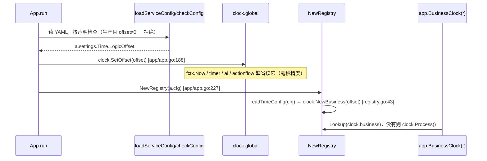
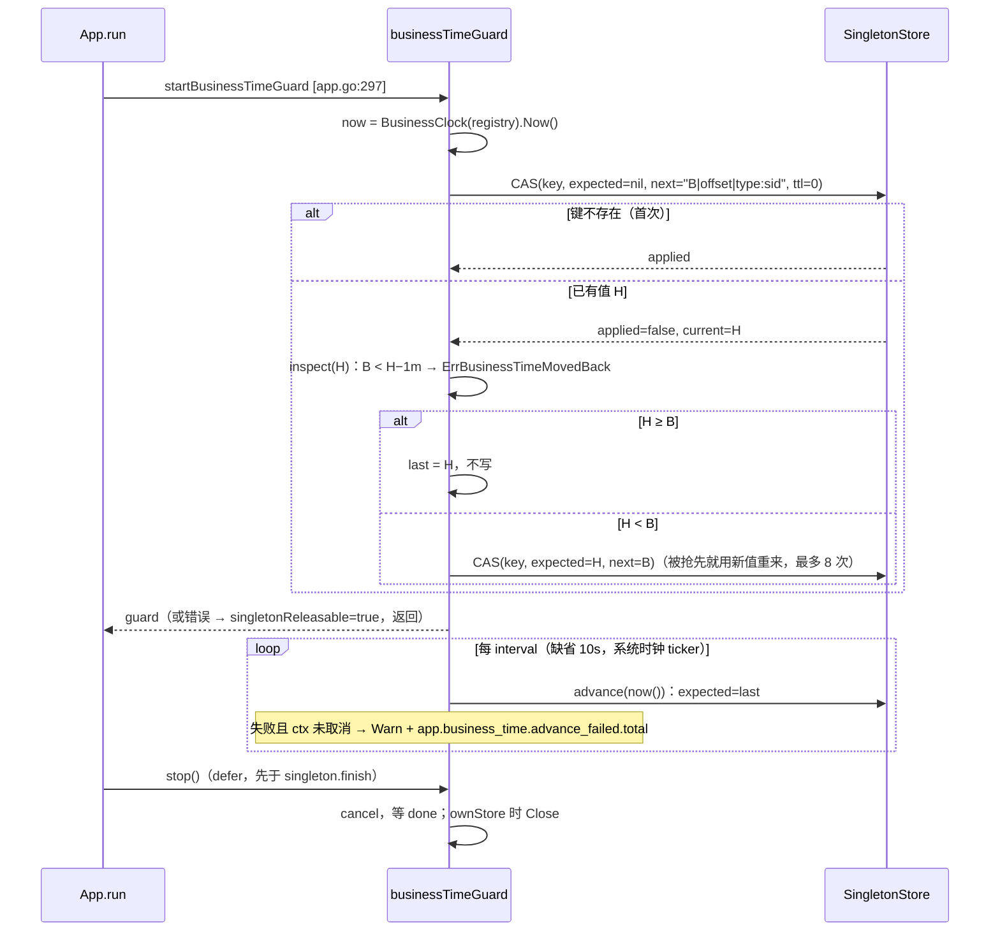

# 10 时间（实现）

> 配套说明文档：[guide/10-time.md](../guide/10-time.md)（是什么、两个钟的归属总表、怎么用、配置、运维、保证）。
> 读者：review agent，以及要改这一块代码的人。源码基准：tag `v1.23.0`（`28912cd6`），全部 `path:line` 按这个 tag。
> 图谱说明：codebase-memory 的索引代际是 2026-09-30，落后于 tag。`app/business_time.go`、`app/business_clock.go`、`app/config_schema.go`、`cmd/glsvet/clockhints.go` 是 `not_tracked`，`clock/clock.go`、`timer/scheduler.go` 是 `metadata_changed`。本篇只用图谱定位，结论全部按 tag 源码直接读取。

## 速览

- **两个钟**：业务时钟有两份实现，读同一个配置键。一份是 Registry 里的 `clock.NewBusiness(offset)`（`app/registry.go:43`）；另一份是进程级的 `clock.global`，由 `clock.SetOffset` 在 `app/app.go:188` 设一次。系统时钟就是 `time` 包。生产环境非 0 偏移由 `appConfig.ValidateConfig` 拒绝（`app/config_schema.go:242`）。
- **高水位守卫**（`app/business_time.go`）：挂在单实例锁之后、`sortMods` 与任何 Mod `Init` 之前（`app/app.go:297`）。只用 `SingletonStore.CompareAndSet`（`ttl = 0`）实现“只增”：启动时回退超过 1 分钟就拒绝，读写失败也拒绝（fail-closed）；之后每 10s 推进一次，推进失败只记 Warn 和计数。生产不运行守卫。
- **定时器**（`timer/scheduler.go`）：不加锁的最小堆，`Less` 依次比较 End、Priority、ID（`:405-414`）。Tick 中途的增、删、改有确定语义：目标在堆里就立即出堆，新建的推迟到最外层 Tick 结束。到期而类型没有 handler 的节点照样删除，同时记 Warn 和计数（`:300-305`）。
- **最容易改坏的地方**：
  - `advance` 的 `inspect` 只看第一次读到的值（`app/business_time.go:191-196`）；
  - `stop` 必须先于单实例锁的 `finish` 执行（defer 的登记顺序，`app/app.go:276` 与 `:302`）；
  - `Tick` 的 `running` 只由最外层清除（`timer/scheduler.go:269-280`）；
  - `ChangeTimer` 在 Tick 中途要先出堆再推迟回堆（`:237-248`）。

### 本篇覆盖的包

| 包 / 文件 | 职责 |
| --- | --- |
| `clock` | `Business` 接口与两种实现，进程级逻辑时钟 |
| `app/business_clock.go`、`app/registry.go:43`、`app/app.go:188`、`app/config_schema.go:224-256` | 业务时钟的登记、取用、偏移读取与生产校验 |
| `app/business_time.go` | 高水位守卫 |
| `timer` | 实体定时器调度器 |
| `cmd/glsvet/clockhints.go` | 时钟提示 |
| `codegen/internal/roost/logic_offset_doctor.go` | doctor `time:logic_offset` |
| `demo/game/entities/world/timer_component.go.tmpl`、`demo/db/def/world.go.tmpl` | World 定时器宿主（参考实现） |

---

## 1. 包与文件地图

| 文件 | 行数 | 职责 |
| --- | --- | --- |
| `clock/clock.go` | 131 | `Business`（`:26`）、`BusinessFunc`（`:31`）、`offsetBusiness` / `NewBusiness`（`:37-48`）、`processBusiness` / `Process`（`:51-57`）、`Clock` 接口与 `logicClock`（`:61-131`，偏移以毫秒存成 `atomic.Int64`） |
| `app/business_clock.go` | 26 | `ModBusinessClock = "clock.business"`（`:9`）、`logicOffsetKey`（`:13`）、`BusinessClock(r)`（`:21`） |
| `app/business_time.go` | 245 | 哨兵错误（`:26`、`:30`）、常量（`:32-52`）、`businessTimeMark`（`:56`）、`businessTimeGuard`（`:78`）、`startBusinessTimeGuard`（`:97`）、`check`（`:146`）、`advance`（`:173`）、`advanceLoop`（`:208`）、`stop`（`:228`） |
| `app/config_schema.go` | — | `isProductionServiceConfig`（`:186`）、`appConfig.Time`（`:216`）、`timeConfig`（`:224-226`）、`ValidateConfig` 的生产偏移规则（`:242-244`）、`readTimeConfig`（`:249`） |
| `app/app.go` | — | `clock.SetOffset`（`:188`）、`NewRegistry`（`:227`）、守卫挂点（`:294-302`） |
| `app/singleton.go` | — | `SingletonStore` 契约，包括“ttl 为 0 表示不过期”和“它也承载高水位键”（`:31-36`）；`SingletonOpener`（`:55-57`） |
| `timer/scheduler.go` | 433 | 包注释写着排序与 D-L2 规则（`:1-13`）、`Node`（`:40`）、`Scheduler`（`:65`）、`NewScheduler`（`:79`）、`SetClock`（`:120`）、`ReportUnhandledTypes`（`:165`）、`RemoveTimer`（`:196`）、`ChangeTimer`（`:222`）、`Tick`（`:259`）、`timerHeap`（`:402-433`） |
| `cmd/glsvet/clockhints.go` | 172 | 开关（`:27`、`:29`）、业务目录判定（`:38-71`）、`vetClockHints`（`:85`）、`reportClockHints`（`:102`）；`cmd/glsvet/main.go:162` 调用它 |
| `codegen/internal/roost/logic_offset_doctor.go` | 129 | 三套配置的定义（`:24-32`）、`checkLogicOffsets`（`:37`）、`configLogicOffset`（`:97`，按 `configschema.ParseDuration` 解析，与 App 一致） |
| `demo/game/entities/world/timer_component.go.tmpl` | 261 | 每次调用从 DAO 建调度器（`:130-150`）、`persist` 钩子（`:165-185`）、`Tick` 快路径（`:233-242`） |
| `demo/db/def/world.go.tmpl` | — | `Timers` / `TimerSeed` / `TimerNextDue`（`:22`、`:25`、`:33`）、`TimerNode`（`:49-58`） |

→ [说明文档](../guide/10-time.md)对应：§1 定位与边界。

## 2. 关键类型与数据结构

| 类型 | 位置 | 要点 |
| --- | --- | --- |
| `clock.Business` | `clock/clock.go:26` | 只有 `Now()`。系统时钟没有对应的类型 |
| `offsetBusiness` | `clock/clock.go:37` | 偏移在构造时定下，之后不可改；`offset == 0` 时直接返回 `time.Now()`（`:44-46`）。纳秒精度 |
| `logicClock` | `clock/clock.go:70` | `offsetMilli atomic.Int64`；`SetOffset` 存 `offset.Milliseconds()`，向零截断（`:122`）。包级变量 `global`（`:74`） |
| `processBusiness` | `clock/clock.go:51` | 每次 `Now()` 都读 `global`，所以能看到 App 启动时设下的偏移 |
| `timeConfig` | `app/config_schema.go:224` | `LogicOffset time.Duration`，配置键 `logic_offset`，没有 min / max |
| `businessTimeMark` | `app/business_time.go:56` | `raw`（CAS 的 expected，键不存在时为 nil）、`unixMs`、`writer`（只用于展示） |
| `businessTimeGuard` | `app/business_time.go:78` | `store`、`ownStore`（只为高水位打开的连接）、`key`、`offset`、`writer`、`now`（= `BusinessClock(a.registry).Now`）、`interval`、`metrics`、`last`、`cancel`、`done` |
| `timer.Node` | `timer/scheduler.go:40` | `ID`、`Type`、`Priority`、`Param1/2`、`Payload`、`End`、`Delay`；未导出的 `index`（堆下标，-1 表示不在堆里）、`handler`（只用于闭包） |
| `timer.Scheduler` | `timer/scheduler.go:65` | `seed`（最近一次发出的 ID）、`nodes`（堆）、`byID`、`handlers`、`onChange`、`running`、`deferred`、`clock` |
| `timer.Context` | `timer/scheduler.go:56` | 交给 handler：`OwnerID`、`Node`（副本）、`Now`（Tick 的 now） |
| `Handler` | `timer/scheduler.go:62` | 返回 `time.Duration`：≤0 表示结束，>0 表示按 `now + next` 重排，保留 ID |

→ [说明文档](../guide/10-time.md)对应：§2 核心概念与术语。

## 3. 主流程

### 3.1 偏移的两条读取路径

两条路径读的是同一个 viper 实例里的同一个键。`readTimeConfig` 读失败时取零值（`app/config_schema.go:248-256`），但类型错误在这之前已被 `checkConfig` 拒绝。所以进入 `NewRegistry` 时，两边的值一致；唯一的差别是精度，见 §11 T3。

### 3.2 高水位守卫：谁检查

`startBusinessTimeGuard`（`app/business_time.go:97-142`）的判定顺序：

| 条件 | 结果 | 位置 |
| --- | --- | --- |
| 生产（`isProductionServiceConfig`） | 返回 nil，不检查 | `:98-100` |
| 开了单实例锁（`lock != nil`） | 共用锁的 store，键是 `lock.settings.KeyPrefix + ":business_time"`，`ownStore=false` | `:113-114` |
| 没开锁，偏移为 0 | 返回 nil，不检查 | `:115-117` |
| 没开锁，偏移不为 0，没有 opener 或 `key_prefix` 为空 | `ErrBusinessTimeGuardMissing` | `:119-124` |
| 没开锁，偏移不为 0，opener 报错或返回 nil | 拒绝启动 | `:125-131` |
| 没开锁，偏移不为 0，store 打开成功 | `ownStore=true`，键是 trim 之后的 prefix + 后缀 | `:132` |

然后执行 `check()`。失败时关掉自己打开的 store 并返回错误（`:134-137`）；成功则启动 `advanceLoop`（`:138-140`）。

### 3.3 启动检查与运行中推进

`advance`（`:173-204`）的循环不变量：`expected` 永远是上一次读到的原值。只有 CAS 生效、或者读到的值不小于目标时才退出。`inspect` 在第一次读到非空值时调用一次，然后置为 nil（`:191-196`），所以被抢先重来时，不会拿别人刚写的更大值误判回退。

错误信息里的“最小可用偏移”是 `g.offset + (H − B) − tolerance`（`:158`），也就是恰好落在边界上的偏移。

### 3.4 `Scheduler.Tick`

```mermaid
flowchart TD
    A[Tick now] --> B{now 为零?}
    B -- 是 --> C[now = s.now&#40;&#41;]
    B -- 否 --> D
    C --> D{running?}
    D -- 否 --> E[running=true，defer：清 running 并按登记顺序执行 deferred]
    D -- 是（重入） --> F
    E --> F[取堆顶 min]
    F --> G{min 为空或 now < End?}
    G -- 是 --> R[返回]
    G -- 否 --> H[出堆、删 byID；typed 时发 ChangeDelete]
    H --> I{handler?}
    I -- 闭包 --> J[next = handler]
    I -- typed 有 handler --> J
    I -- typed 无 handler --> K[Warn + timer.unhandled_dropped_total kind，next=0]
    J --> L{next > 0?}
    K --> F
    L -- 否 --> F
    L -- 是 --> M[End = now+next，保留 ID 入堆；typed 时发 ChangeUpsert] --> F
```

Tick 中途其他入口的语义（`timer/scheduler.go:191-257`、`:343-354`）：

| 调用 | 目标在堆里 | 目标不在堆里（正在触发的自己，或本次新建的） |
| --- | --- | --- |
| `RemoveTimer` | 立即出堆，发 ChangeDelete（NC-141） | 推迟到最外层 Tick 结束；返回 true 只表示“已接受” |
| `ChangeTimer` | 立即出堆、不发变化；推迟到 Tick 结束再按新期限入堆，发一次 Upsert | 整个操作推迟 |
| `NewTimer*` / `NewClosureTimer` | — | **ID 立即分配**（`seed++`），入堆推迟（`:343-354`）。所以 ID 顺序就是调用顺序 |

推迟的操作按登记顺序执行。先改期、后取消，结果是取消（`:273-278`）。执行时 `running` 已经清除，这些操作直接生效，不会再被推迟。

### 3.5 World 宿主的调用形状（参考实现）

| 入口 | 做什么 | 位置 |
| --- | --- | --- |
| `OnInitFinish` | 用零值 now 建调度器 → `ReportUnhandledTypes` → `settle` 写 `timer_next_due`（nopersist）。不武装、不触发 | `timer_component.go.tmpl:113-118` |
| `ScheduleActivityPhase(id, at, now)` | 幂等（同一个 activity 只有一个节点）；`delay = at − now`，≤0 时改成 1ms；建调度器 → `NewTimer` → `settle` | `:195-214` |
| `Tick(now)` | `timer_next_due` 为 0 或 `now < next` 时只读一个数就返回；否则建调度器 → `Tick` → `settle` | `:233-242` |
| `persist` | Upsert → `SetTimers`，必要时推进 `TimerSeed`；Delete → `DelTimers` | `:165-185` |

时间来源：`TickWorldTimers` 带的是 `runner.clock().UnixMilli()`，即业务时钟（`demo/internal/service/game/activity.go.tmpl:244`）；arm 带的是 Unix 秒（`demo/game/handler/arm_activity.go.tmpl:20`）。调度器的 `SetClock` 钉成同一个 now（`timer_component.go.tmpl:148`）。

### 3.6 glsvet 时钟提示

`vetDirectory` → `vetClockHints(fileSet, dir)`（`cmd/glsvet/main.go:162`）：
1. 开关关闭，或目录不是业务目录（`isBusinessDirectory`：`moduleRelative` 向上找 `go.mod`，路径中任一段等于 `-businessdirs` 里的名字）时，直接返回 0。
2. 带注释重新解析这个目录（`clockhints.go:89-91`）。
3. 对每个文件：找 `time` 的导入名（`_` 和 `.` 导入跳过）；收集含 `glsvet:system-clock` 的注释行，豁免这一行和下一行；文档注释含这条指令的 `FuncDecl` 整个跳过。
4. 遍历 `SelectorExpr`：选择子是 `Now` / `Since` / `Until`，接收者是导入名，且 `ident.Obj == nil`（不是同名的局部变量）时，打印 hint。

### 3.7 doctor `time:logic_offset`

`checkLogicOffsets`（`logic_offset_doctor.go:37`）：对每一套配置（dev / prod example / k8s secret example）按服务名顺序读文件。缺文件的服务不算在这一套里。用 `configLogicOffset` 解析：secret 文件先取 `stringData["config.yaml"]`；值按 `configschema.ParseDuration` 解析，空、`"0"`、0 都算 0。一套之内出现不同值，或任一文件格式错，就 FAIL。三套之间不比较。

→ [说明文档](../guide/10-time.md)对应：§4 怎么用。

## 4. 不变量清单

| # | 内容 | 强制位置 | 守卫测试 |
| --- | --- | --- | --- |
| I-1 | 生产环境 `time.logic_offset` 必须为 0 | `app/config_schema.go:242-244` | `TestProductionRefusesANonZeroLogicOffset`（`app/logic_offset_production_promises_test.go:12`） |
| I-2 | Registry 业务时钟 = 真实时间 + 配置偏移；`BusinessClock(nil)` 退回进程级时钟 | `app/registry.go:43`、`app/business_clock.go:21-26` | `TestBusinessClockFollowsTheConfiguredOffset`（`app/business_clock_promises_test.go:22`） |
| I-3 | 偏移只移动业务时间，不影响单实例锁租约和 ctx 截止 | `app/singleton.go:194-196`（锁用自己的真实时钟） | `TestOffsetMovesBusinessTimeButNotTheSingletonLease`（`app/business_clock_promises_test.go:42`） |
| I-4 | 运行期没有修改偏移的入口：`clock.SetOffset` 的非测试调用点只有一处 | `app/app.go:188` | **没有结构守卫**，只能靠 `git grep -n 'clock.SetOffset\|clock.Set(' -- '*.go' ':!*_test.go'` |
| I-5 | 非生产：业务时间 < 高水位 − 1 分钟时拒绝启动，此时没有任何 Mod Init 过，高水位不变，锁已释放 | `app/business_time.go:151-160`、`app/app.go:297-301` | `TestBusinessTimeMovingBackRefusesToStart`（`app/business_time_promises_test.go:48`）；真实 Redis `TestBusinessTimeHighWaterMarkOnRealRedis`（`kit/redis/business_time_integration_test.go:77`，`-tags integration`） |
| I-6 | 首次启动、同偏移重启、前拨、容差内回退、偏移改小不超过经过的真实时间：都照常启动，高水位只增 | `app/business_time.go:173-204` | `TestBusinessTimeMayMoveForwardOrStay`（`:85`） |
| I-7 | 读写高水位失败就拒绝启动（fail-closed） | `app/business_time.go:161-166` | `TestAnUnreadableHighWaterMarkRefusesToStart`（`:157`） |
| I-8 | 偏移不为 0、没开锁：只为高水位打开连接，拒绝或正常停机时都关闭；没有 opener 报 `ErrBusinessTimeGuardMissing`；偏移为 0 不碰 store | `app/business_time.go:115-133`、`:238-245` | `TestAnOffsetWithoutTheSingletonStillGuardsBusinessTime`（`:178`，四个子用例） |
| I-9 | 生产不运行守卫 | `app/business_time.go:98-100` | `TestProductionDoesNotRunTheBusinessTimeGuard`（`:235`） |
| I-10 | 运行中推进高水位；停机后不再写 | `app/business_time.go:208-236` | `TestTheHighWaterMarkAdvancesWhileRunning`（`:126`） |
| I-11 | 推进失败计数，停机时 ctx 取消引起的失败不计 | `app/business_time.go:218-222` | `TestAFailedHighWaterMarkAdvanceIsCounted`（`:251`）。“停机不计”这一半没有专门断言 |
| I-12 | 定时器顺序是 (End, Priority, ID) 全序，与入堆顺序、存储遍历顺序无关；改期和重排都保留 ID | `timer/scheduler.go:405-414`、`:240-243`、`:310-312` | `TestTimersWithTheSameDeadlineFireInRegistrationOrder`、`TestPriorityOrdersTimersWithTheSameDeadline`、`TestPriorityIsKeptThroughStorageAndRescheduling`（`timer/order_and_unhandled_promises_test.go:35`、`:86`、`:105`）；World `TestDeadlinesDueAtTheSameMomentFireInArmOrder`、`TestTimerPriorityIsStoredAndOrdersAfterARestart`（`demo/game/entities/world/timer_component_test.go.tmpl:499`、`:597`） |
| I-13 | 到期而类型没有 handler：删除，并记 Warn 和计数；`ReportUnhandledTypes` 只报告，每种类型一次，按类型号升序 | `timer/scheduler.go:298-306`、`:165-189` | `TestADueTimerWithoutAHandlerIsDroppedWithAWarningAndACount`、`TestStoredTypesWithoutAHandlerAreReportedOncePerType`（`:162`、`:202`）；World `TestAStoredTimerOfATypeWithNoHandlerIsReportedAndCountedWhenDropped`（`timer_component_test.go.tmpl:535`） |
| I-14 | Tick 中途取消 / 改期一个本次也已到期的节点，不会按旧期限触发 | `timer/scheduler.go:200-213`、`:237-248` | `TestRemoveFromAHandlerStopsATimerDueInTheSameTick`、`TestChangeFromAHandlerPostponesATimerDueInTheSameTick`（`timer/scheduler_promises_test.go:20`、`:43`） |
| I-15 | 推迟的操作保持原意，钩子看到的变化序列与最终状态一致 | `timer/scheduler.go:271-279` | `TestDeferredOperationsDuringTickKeepTheirMeaning`、`TestChangesSeenByTheHookDuringATickMatchTheFinalState`、`TestPostponedTimerDuringTickComposesWithLaterOperations`（`:73`、`:136`、`:201`） |
| I-16 | 重入 Tick 时只有最外层清 `running`、执行推迟操作 | `timer/scheduler.go:269-280` | `TestReentrantTickKeepsTheOuterTickSemantics`（`:172`） |
| I-17 | 新定时器的 End 按注入的时钟打 | `timer/scheduler.go:127-132`、`:364` | `TestSchedulerSetClockStampsNewTimers`（`timer/scheduler_test.go:76`） |
| I-18 | World 定时器随 DAO 回滚 | `timer_component.go.tmpl:130-185`（只存在于 DAO） | World `TestTheTimerHeapRollsBackWithTheTransaction` / `TestTimerRollbackIsTheDaoRollback`（`demo/game/entities/world/timer_component_test.go.tmpl:178`、`:319`） |
| I-19 | glsvet 时钟提示不计入违例；豁免、非业务目录、同名局部变量、测试文件、模块根以上的 `game` 段都不提示 | `cmd/glsvet/clockhints.go:85-141`、`main.go:162` | `TestClockHints*`（`cmd/glsvet/clockhints_test.go:31`、`:54`、`:77`、`:119`、`:133`） |
| I-20 | 同一套配置里各服务的偏移一致 | `codegen/internal/roost/logic_offset_doctor.go:37` | `TestDoctorNamesTheServicesWhoseLogicOffsetDisagrees`（`codegen/internal/roost/logic_offset_doctor_promises_test.go:50`） |
| I-21 | kit Mod 把业务时钟注入服务，偏移会移动这些服务的业务时间，但不移动保留期和 token | 各 `*_mod.go`（guide §4.1） | `TestTheModWiresTheCoordinatorToTheBusinessClock`（`kit/service/global/activity/business_clock_promises_test.go:16`）、`TestOffsetMovesMatchChatAndAccountBusinessTimesButNotRetentionOrSessions`（`kit/service/integration/business_clock_test.go:21`，真实 Redis）、`TestDisplayTimeIsBusinessTimeAndRetentionIsSystemTime`（`kit/service/chat/business_clock_promises_test.go:13`）、`TestAccountTimesAreBusinessTimeAndSessionsAreSystemTime`（`kit/service/account/business_clock_promises_test.go:13`）、`TestMailExpiryAndTheClaimLeaseRunOnTheMonotonicBusinessClock`（`service/mail/business_clock_promises_test.go:15`）、`TestDispatchBackoffAndProofExpiryRunOnTheMonotonicBusinessClock`（`kit/service/global/activity/monotonic_business_time_promises_test.go:18`） |

→ [说明文档](../guide/10-time.md)对应：§7 保证与不保证。

## 5. 并发

| 对象 | goroutine 归属 | 同步方式 |
| --- | --- | --- |
| `clock.global` | 任意 goroutine 读；写只在 `App.run` 启动时一次 | `atomic.Int64`（`clock/clock.go:71`）。并发安全由 `TestLogicClockIsSafeForConcurrentUse` 守（`clock/clock_test.go:65`） |
| `offsetBusiness` | 任意 | 不可变值 |
| `businessTimeGuard` | `check` 在 `run` 的 goroutine 里执行；之后只有 `advanceLoop` 一个 goroutine 读写 `last`（`app/business_time.go:76-77`） | 单写者，不加锁。`stop` 先 cancel，再 `<-done`，然后才关 store |
| 多个进程写同一个高水位键 | 跨进程 | 只用 CAS；值单调，竞争只会让 H 变大，最多重来 8 次 |
| `timer.Scheduler` | 宿主自己的锁或事务里（World：Nest 实体锁） | **不加锁**。`running`、`deferred` 只在单 goroutine 下正确 |
| `timer.unhandled_dropped_total` | — | 走 `metrics` 包的默认注册表（`metrics/metrics.go:208`），`NewRegistry` 会把它设成本 App 的注册表（`app/registry.go:35-36`） |

快池约束：定时器 handler 在实体锁里运行，World 的 handler 只写 EFFECT、不做 I/O（`timer_component.go.tmpl:49-52`、`:250-260`）。`timer` 包本身不强制这一点，见 [02](02-nest-entity.md) 的快池规则。

守卫的推进间隔用 `time.NewTicker`，是系统时钟（`app/business_time.go:210`），而写入的值是业务时间。两者混用是有意的：间隔是系统用途。

→ [说明文档](../guide/10-time.md)对应：§4.4 实体定时器。

## 6. 失败与不确定结果处理

| 情形 | 处理 | 位置 |
| --- | --- | --- |
| 启动检查发现回退 | 返回 `ErrBusinessTimeMovedBack`，错误信息点名偏移、两边的时刻、键、写入者、最小可用偏移；`run` 置 `singletonReleasable = true`，此时还没有任何 Mod 启动 | `app/business_time.go:151-163`、`app/app.go:298-300` |
| 启动时 CAS 报错，或值无法解析 | 包成 `app: business time high-water mark <key>: …` 拒绝启动 | `:165`、`:187-190` |
| CAS 8 次都被抢先 | `high-water mark still changing after 8 attempts`。启动时拒绝；运行中计一次失败 | `:203` |
| 单次调用超时 | 每次 CAS 3s（`:177`）；启动检查的总超时 3s × 8（`:148`） | — |
| 运行中推进失败 | Warn + 计数，下一拍再试，不 fail-stop | `:218-222` |
| 停机中推进失败 | `ctx.Err() != nil` 时不计数、不记日志 | `:218` |
| 自己打开的 store 关闭失败 | Warn | `:242-244` |
| 推迟期间 handler panic | `Tick` 的 defer 仍会清 `running`、执行推迟操作，然后 panic 继续向上传。是否回滚由宿主决定（World 靠 Nest 回滚 DAO） | `timer/scheduler.go:271-279`（推断：没有专门用例） |
| 宿主事务回滚后重试同一次 Tick | 未注册类型的计数会再记一次（已写进注释与 OBSERVABILITY） | `timer/scheduler.go:29-31` |
| World handler 记录 EFFECT 失败 | 返回 30s，节点保留，窗口晚一点关闭 | `timer_component.go.tmpl:250-260` |

→ [说明文档](../guide/10-time.md)对应：§6 运行与运维。

## 7. 持久化 / 协议格式

**高水位键**：`<singleton.key_prefix>:business_time`（`app/business_time.go:47`）。单实例锁的键是 `<prefix>:<type>:<sid>`，段数不同，两者不会冲突。值的格式是 `<业务时间 unix 毫秒>|<写入者偏移>|<server_type>:<sid>`，例如 `1791334200000|24h0m0s|game:1`（`:54`、`:104`、`:174`）。只比较第一段；解析时只按第一个 `|` 切分（`:68`）。不设 TTL（CAS 的 `ttl = 0`，`redis/cas.go:113-119` 对 0 不设过期）。维护者 2026-10-06 定了“未上线不做兼容”，所以没有格式版本字段。

**World 定时器节点**（`demo/db/def/world.go.tmpl:49-58`）：`type`、`priority`、`param1`、`param2`、`payload`（omitempty）、`end_unix_milli`、`delay_millis`。`timers` 是 `map[int64]*TimerNode`，键是节点 ID（`:22`，`persist,map=fast`）；`timer_seed` 持久化（`:25`）；`timer_next_due` 是 `nopersist,nosync`（`:33`）。`priority` 是 D-L1 之后加的：旧文档没有这个键，解码为 0，不升 schema。End 按毫秒存储。

**指标名**：`app.business_time.advance_failed.total`（无标签）、`timer.unhandled_dropped_total{kind=<类型号>}`。导出时点号换成下划线，见 11 可观测<!-- pending: ../guide/11-observability.md -->。

**进程级时钟精度**：毫秒（`clock/clock.go:122`），由 `TestLogicClockOffsetRoundTripsAtMillisecondResolution`（`clock/clock_test.go:13`）固定。

→ [说明文档](../guide/10-time.md)对应：§5 配置。

## 8. 测试与门禁

全部用 `GOWORK=off`。

| 范围 | 命令 |
| --- | --- |
| 本分区单测（含竞态） | `go test -race -count=3 ./clock/ ./timer/ ./app/ ./cmd/glsvet/` |
| 业务钟接线（kit / service） | `go test -race -count=3 ./service/mail/ ./kit/service/mail/ ./kit/service/global/activity/ ./kit/service/chat/ ./kit/service/account/ ./service/match/ ./kit/service/match/ ./kit/service/rank/ ./kit/service/session/ ./service/session/` |
| doctor | `go test -count=1 -run TestDoctorNamesTheServicesWhoseLogicOffsetDisagrees ./codegen/internal/roost/` |
| 真实 Redis：高水位 | `REDIS_ADDR=<隔离 Redis> go test -tags integration -count=1 -run TestBusinessTimeHighWaterMarkOnRealRedis ./kit/redis/` |
| 真实 Redis：match / chat / account 换钟 | `REDIS_ADDR=<隔离 Redis> go test -tags integration -count=1 -run TestOffsetMoves ./kit/service/integration/` |
| 核心包不应有时钟提示 | `go run ./cmd/glsvet ./nest ./entity ./dataengine/engine ./sync/entitysync` |
| 生成工程 | 生成 game-demo，replace 到工作树：`go test ./game/entities/world/ ./internal/service/game/`（`TestTheWindowFollowsTheBusinessClock`、`TestTheWorldTickCarriesBusinessTime`，`demo/internal/service/game/activity_test.go.tmpl:467`、`:492`）；`glsvet ./...` 退出码 0、没有提示 |
| 根包 | `go test -count=1 .` |

真实依赖用例按仓库规则只在隔离环境里跑（随机前缀，用完删键）。

已知覆盖缺口（不是缺陷，供 review 判断）：
- `advance` 在多个进程并发竞争、8 次 CAS 用尽时的行为没有用例；
- 高水位值无法解析（`parseBusinessTimeMark` 报错）的启动拒绝没有用例；
- I-11 的“停机不计数”没有断言；
- `NewScheduler` 跳过非法存量节点的行为没有用例（§11 T1）。

→ [说明文档](../guide/10-time.md)对应：§6 运行与运维。

## 9. 历史与重要修复（只列改变了设计的）

| 时间 / 版本 | 改动 | 记录 |
| --- | --- | --- |
| 2026-10-05 | World 的定时器堆从组件字段移进 DAO，每次调用重建调度器，随事务回滚（A1） | [RR-20261005-NC-140](../../bugfix/RR-20261005-NC-140.md)、[A1 方案](../../feature/REFACTOR-2026-10-05-dao-unified-rollback.md) |
| 2026-10-05 | Tick 中途 `RemoveTimer` / `ChangeTimer` 一个仍在堆里的目标时立即出堆（之前会按旧期限先触发） | [RR-20261005-NC-141](../../bugfix/RR-20261005-NC-141.md) |
| 2026-10-05 | 重入 Tick 只有最外层清 `running` | [RR-20261005-NC-147](../../bugfix/RR-20261005-NC-147.md) |
| v1.21.0 `5abae51e` | D-L1 排序 (End, Priority, ID)、`NewTimerWithPriority`；D-L2 未注册类型可见 | [D-L1 / D-L2 方案](../../feature/D-L1-L2-TIMER-ORDER-AND-UNHANDLED-2026-10-06.md) |
| v1.21.0 `b9fc5342`、`fa472ee7` | D-L3 双时钟、`clock.Business`、`ModBusinessClock`、生产偏移为 0、glsvet 提示；第八轮 match / chat / account 换钟、doctor 一致性检查 | [D-L3 方案](../../feature/D-L3-BUSINESS-SYSTEM-CLOCK-2026-10-06.md) |
| v1.21.0 `5a3c4a60` → v1.22.0 `3e77beb9` | 为“偏移往回调”加的 activity / mail `SystemNow` 和可配置信封宽限，在业务时间只许前进之后删除 | D-L3 方案 §9、§10 |
| v1.22.0 `3e77beb9` | 业务时间只许前进：高水位守卫 | [单调方案](../../feature/BUSINESS-TIME-MONOTONIC-2026-10-06.md) |
| v1.23.0 `7b73aabc` | 推进失败计数 `app.business_time.advance_failed.total` | [R12 kit 批 §8](../../feature/DECISIONS-R12-KIT-2026-10-06.md) |

逐项的修前红和验证命令见 [v1.23.0 app / clk 分册](../../release/v1.23.0/impl-app-own-clk-ops-tool.md) CLK-1～CLK-6。

→ [说明文档](../guide/10-time.md)对应：§3 设计原因。

## 10. review 检查点

1. **偏移入口唯一**：`git grep -n 'clock.SetOffset\|clock.Set(\|clock.Reset()' -- '*.go' ':!*_test.go'` 应该只命中 `app/app.go:188` 和 `clock` 包自己。新增的 admin / ops 命令不能改偏移。
2. **两份业务钟一致**：确认 `app/app.go:188` 与 `app/registry.go:43` 仍然读同一个声明（`timeConfig`），并且 `NewRegistry` 在 `loadServiceConfig` 之后调用（`:182` → `:227`）。如果有人把 `NewRegistry` 挪到配置加载之前，Registry 的钟会读到 0。
3. **守卫挂点**：`startBusinessTimeGuard` 必须在单实例锁 `acquire` 之后、`sortMods` 之前（`app/app.go:297`）。`defer businessTime.stop()` 必须登记在 `singleton.finish` 的 defer 之后（这样它先执行，`:276` 对 `:302`），而且在错误返回之后才登记（nil 守卫不会被登记）。
4. **只增**：`advance` 只在 `mark.unixMs >= at` 时停止写入（`app/business_time.go:197`）；`inspect` 只调用一次（`:195`）。改这里时，要确认被抢先重来不会误判回退，也不会把高水位写小。
5. **fail-closed**：启动检查的任何错误都不能被吞掉。确认 `check` 的所有分支都返回错误（`:161-166`）。
6. **生产零行为变化**：`isProductionServiceConfig` 为真时，守卫不能碰 store（`:98`）；`offsetBusiness.Now` 在偏移为 0 时不做 `Add`（`clock/clock.go:44`）。
7. **新的时间用途**：业务包里每一处新增的 `time.Now()`，要么改成业务钟，要么写 `//glsvet:system-clock <理由>`，理由必须属于 guide §4.1 系统表里的用途。`game` 目录以外的业务包 glsvet 看不到，要逐个查 `git grep -n 'time.Now()' -- 'kit/service/**/*.go' 'service/**/*.go' ':!*_test.go'`。
8. **新的 kit 服务**：Mod 是否注入了 `app.BusinessClock(r).Now`？同时需要系统钟的，是否单独加了 `SystemNow` 并注入 `time.Now`？`SystemNow` 为 nil 时退回 `Now`（chat / account 的约定），这个方向是否可以接受（§11 T2）？
9. **定时器排序**：改 `timerHeap.Less` 时必须保持全序（最后一个键是唯一的 ID）。改 `ChangeTimer` 或重排逻辑时，必须保留原 ID。
10. **Tick 中途的语义**：新增的 Scheduler 方法如果在 `running` 时改堆，要沿用“在堆里立即出堆、不在堆里推迟”的规则，并补 `scheduler_promises_test.go` 那一类用例。
11. **宿主时钟**：任何用自己的时间调用 `Tick(now)` 的新宿主，都要 `SetClock` 到同一个来源。确认这一点：看宿主的 `NewTimer` 调用前是否 `SetClock`（World 的做法见 `timer_component.go.tmpl:148`）。
12. **未注册类型**：新增定时器类型时，确认宿主的 `RegisterHandler` 在 `ReportUnhandledTypes` 之前完成；下线类型时，在 CHANGELOG 里写明存量节点会被丢弃。

→ [说明文档](../guide/10-time.md)对应：§4 怎么用、§7 保证与不保证。

## 11. 源码疑点与文档不一致

本次核对发现、尚未登记的问题。没有改代码，也没有改其他文档。

### T1（缺陷，低）`NewScheduler` 静默跳过非法的存量节点：不删除、不告警、不计数

- **条件**：宿主交给 `NewScheduler` 的存量节点里，有 `ID <= 0`、`Type == TypeClosure (0)` 或 `End.IsZero()` 的。可能来自存储被手工改动、旧版本写坏，或者宿主映射代码有 bug。
- **后果**：这些节点被 `continue` 跳过（`timer/scheduler.go:87-91`），不入堆、不发 `ChangeDelete`，也不打日志、不计数。对 World 这类“每次调用都从 DAO 重建”的宿主来说，节点永远留在 DAO 里：`TimersLen()` 把它们算进剩余数（`timer_component.go.tmpl:236`、`:241`），但它们永远不会触发，也不会被清理。这与 D-L2 “丢弃要看得见”的方向不一致。另外，`ID` 为负或 0 的节点也不参与 `seed` 推进（`:92-94`）。
- **修复方向**：对跳过的节点打 Warn，并计入一个计数（或复用 `timer.unhandled_dropped_total` 加 `kind`）；需要的话，向宿主发一次 `ChangeDelete` 清理掉。

### T2（设计不一致，低）kit 服务的 `Config.Now` 缺省是系统时钟，框架库的缺省是业务时钟

- **条件**：非生产环境，`time.logic_offset ≠ 0`，业务代码不经 kit Mod、直接手工构造服务，并且没有设 `Config.Now`。
- **后果**：这个服务的业务时间戳（邮件过期、run 截止、票据时间、排行 tiebreak、活动窗口）读的是 `time.Now`，与 `fctx.Now`、World 定时器、经 Mod 装配的其他服务差一个偏移。缺省值的位置：`service/session/service.go:149-151`、`service/mail/service.go:106-108`、`service/mail/redis_store.go:158-160`、`service/match/queue_store.go:154-156`、`kit/service/rank/redis_store.go:71-73`、`kit/service/account/service.go:146-148`、`kit/service/global/activity/service.go:239-241`、`kit/service/chat/store.go:315-317`。框架库的缺省却是 `clock.Now()`：`timer/scheduler.go:131`、`ai/controller.go:242`、`actionflow/mission_runner.go:436`。反方向也有问题：chat / account 的 `SystemNow` 为 nil 时退回 `Now`（`kit/service/chat/store.go:318-320`、`kit/service/account/service.go:149-151`）。只注入了业务 `Now` 的手工装配，会让会话 token 有效期和聊天保留期跟着偏移走。生产偏移为 0，两种缺省没有差别。glsvet 不覆盖 `kit/` 和 `service/`，查不出这类问题。
- **出处**：D-L3 方案 §4 有意保留了“没注入时仍退回 `time.Now`”（为了偏移为 0 时行为不变），所以这是取舍，不是回归。记在这里，供维护者判断是否要统一成 `clock.Now`（偏移为 0 时同样不改变行为）。

### T3（精度差异，极低）进程级时钟按毫秒存偏移，Registry 时钟保留纳秒

- **条件**：`time.logic_offset` 不是整毫秒，例如 `1.5ms`。
- **后果**：`fctx.Now` / `timer` 缺省（`clock/clock.go:122` 截到 1ms）与 `app.BusinessClock(r)`（`clock/clock.go:40-47`，纳秒）相差不到 1ms。实际配置都是小时、天级，可以忽略。方案 §2 说“两处读的是同一份配置的同一个键”，这句话成立，但两边的值并不逐纳秒相等。
- **修复方向**：不需要修；或者在 `NewBusiness` 里也截到毫秒。

### T4（潜在，推断）宿主按毫秒存 End，同一次调用内的排序与重建后的排序可能不同

- **条件**：同一次调用里武装的两个节点，End 只在亚毫秒位上不同。例如 `SetClock` 的时间带纳秒，delay 也不是整毫秒。
- **后果**：同一次调用内按 End 排序；持久化时 End 截成毫秒（`timer_component.go.tmpl:177`），重建后两者 End 相等，改按 Priority、ID 排序，先后可能反过来。World 的 arm 用 Unix 秒、tick 用毫秒，现有调用碰不到这种情况。新宿主如果用纳秒时间打期限，就可能遇到。
- **修复方向**：在宿主文档里写明“End 以存储精度为准”，或者在 `addNode` 里把 End 截到毫秒。

### T5（注释过时）`clockhints.go` 说主检查“按不带注释的模式解析”

- `cmd/glsvet/clockhints.go:83-84` 说主检查不带注释解析，所以要重新解析一次。但 `cmd/glsvet/main.go:156-160` 已经改为 `parser.ParseComments`（注释写着 2026-10-06 改过）。结果是每个业务目录被解析两次，没有正确性影响。D-L3 方案 §7 的同一句描述也已过时（它是历史记录，可以不改）。

### T6（文档缺口）`OBSERVABILITY.md` 没有列出 `app_business_time_advance_failed_total`

- 这个指标只出现在 `docs/TROUBLESHOOTING.md` T-284、CHANGELOG 和方案里。`OBSERVABILITY.md` 已经为 `timer.unhandled_dropped_total` 写了一节（`OBSERVABILITY.md:119`），却没有这个指标。交给 11 分区汇总处理。

### T7（文档不一致，低）偏移可以为负，文档只说“前拨”

- `timeConfig.LogicOffset` 没有 `min`（`app/config_schema.go:225`），doctor 也接受负值。首次部署可以用负偏移，让业务时间落后于真实时间，此后同样只许前进。D-L3 方案、USER_GUIDE 都只写了“前拨”。不是缺陷，建议在说明里补一句，或者加 `min:"0s"`。

→ [说明文档](../guide/10-time.md)对应：§7 保证与不保证。

[↑ 速览](#速览) · [说明文档](../guide/10-time.md)
