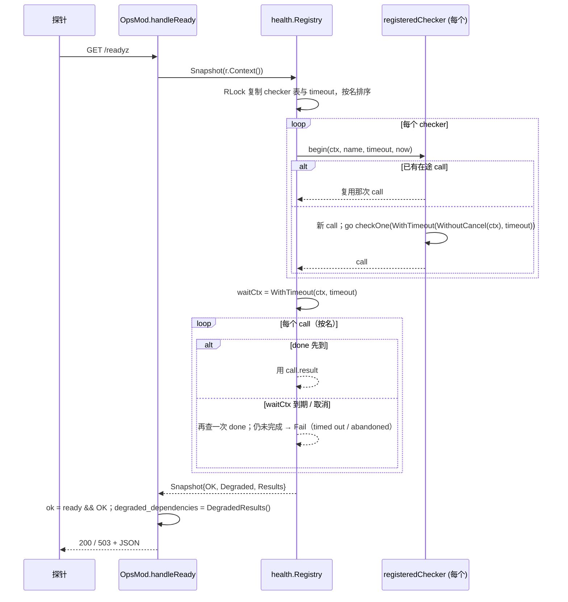
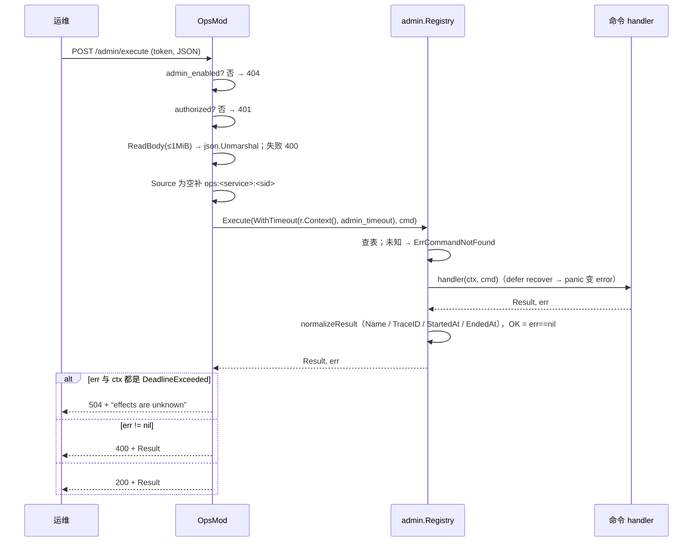

# 11 可观测与运维（实现）

> 配套说明文档：[guide/11-observability.md](../guide/11-observability.md)（是什么、怎么用、配置、端点、全仓指标总表、仪表盘、告警基线、保证）。
> 读者：review agent，以及要改这一块代码的人。源码基准：tag `v1.23.0`（`28912cd6`），全部 `path:line` 按这个 tag。
> 图谱说明：codebase-memory 索引代际 2026-09-30，落后于 tag。本篇涉及的 18 个核心文件里 15 个是 `metadata_changed` 或 `not_tracked`（`servicemetrics/metrics_reporter.go`、`app/business_time.go`、`nest/dispatcher_series.go` 未跟踪），只有 `security/session_token.go`、`sync/lockstep/room.go` 与图谱一致。结论全部按 tag 源码直接读取。

## 速览

- **三个注册表，一个出口**：`app.NewRegistry` 预置 `health.Registry`、`metrics.Registry`（同时设为包级默认）、`admin.Registry`、`admin.MetadataRegistry`（`app/registry.go:34-39`）；`kit/ops` 在 `Provide` 时把前三个取出来，`Start` 时同步 bind 一个 HTTP server 暴露（`kit/ops/ops_mod.go:136-216`）。
- **指标注册表**（`metrics/metrics.go`）：四张 map（counter / gauge / timer / histogram）共用 `labels`、`names`、`series` 三张账；写路径是 RLock 查 → 未命中再 Lock 双检 → `reserveSeriesLocked` 占名额（`:569-663`）。值本身全是 `atomic.Int64`。导出在 `metrics/prometheus.go`，按名排序、不写 `# TYPE`。
- **health 快照**（`health/health.go:148-259`）：每个 checker 至多一个在途 `checkCall`，快照并发 `begin` 全部、共用一个 `waitCtx` 等待；到期未返回记 Fail，那次调用在后台跑完再清空在途位。
- **最容易改坏的地方**：
  - `reserveSeriesLocked` 只在“这个 key 还没有任何类型的序列”时占名额（`:642`），`DeleteSeries` 按 key 从四张表一起删、名额减一（`:526-537`）——新加第五种类型必须同时改这两处；
  - `checkCall` 的 ctx 用 `WithoutCancel(请求 ctx)`（`health/health.go:200`），改回请求 ctx 会让一个探针断开连带别的探针看到取消；
  - `/admin/execute` 的 504 判断要求 **err 与 ctx 都是** DeadlineExceeded（`kit/ops/ops_mod.go:396`），否则 handler 自己的超时也会被说成“ops.admin_timeout 到期”；
  - `nest/dispatcher_series.go` 的 `dispatcherSeriesNames` 必须列全所有带 `dispatcher` 标签的指标（`:23-31`）；
  - failurelog 的 Eval 报错不降级（`failurelog/failurelog.go:230-239`）。

### 本篇覆盖的包

| 包 / 文件 | 职责 |
| --- | --- |
| `metrics/metrics.go`、`metrics/prometheus.go` | 注册表、序列上限、删除、直方图、文本导出 |
| `health/health.go` | checker 注册与并发快照 |
| `admin/admin.go` | 命令注册表与执行、元数据注册表 |
| `kit/ops/ops_mod.go` | ops Mod |
| `kit/statslog/statslog.go` | stats_log Mod 与 `/statsz` 数据源 |
| `log/log.go`、`log/rotation.go`、`log/ordered_text_handler.go`、`log/elog.go` | 日志 |
| `failurelog/failurelog.go` | Redis 失败列表 |
| `security/*.go` | token、签名、限流 |
| `servicemetrics/*.go`、`kit/service/servicemetrics/servicemetrics.go`、`kit/mods/service_servicemods.go:58-77` | 服务事件 |
| `app/registry.go`、`app/config_schema.go:203-263`、`app/app.go:190-216` | 注册表创建、日志与指标配置、日志生命周期 |
| `nest/dispatcher_series.go`、`robot/loadtest/manager.go:614-632` | `DeleteSeries` 的两个拥有者 |
| `OBSERVABILITY.md`、`observability/grafana-roost-overview.json`、`demo/deploy/dev/observability/**` | 文档与仪表盘 |

---

## 1. 包与文件地图

| 文件 | 职责 |
| --- | --- |
| `metrics/metrics.go` | `Kind`、`Metric`（快照行）、四种内部序列类型、`Registry` 与包级包装、`DeleteSeries` / `SeriesCount` / `Reset`、`reserveSeriesLocked`、`metricKey` |
| `metrics/prometheus.go` | `PrometheusText`：名字与标签清洗、计数器补 `_total`、timer 四序列、直方图 `_bucket{le}`；标签值转义 |
| `health/health.go` | `Status`、`Result`、`Snapshot`（含 `DegradedResults`）、`Checker` / `CheckerFunc`、`Registry`（`Register` / `SetCheckTimeout` / `Reset` / `Snapshot`）、`registeredChecker.begin`、`checkCall.wait`、`checkOne` |
| `admin/admin.go` | `Command` / `Result` / `CommandDef` / `CommandMeta` / `RiskLevel`、`Registry.Register / Execute / Names`、`MetadataRegistry`、`DecodePayload` / `MustPayload`、元数据深拷贝 |
| `kit/ops/ops_mod.go` | `OpsMod`、`config`（`ops.*` 声明与 `ValidateConfig`）、就绪 hook、`Start` / `StopWithContext`、六个 handler、`authorized` / `bearerToken` / `secretEqual` |
| `kit/statslog/statslog.go` | `StatsRecord` 等记录类型、`StatsLogMod`（配置、周期循环、文件、provider、采集、gauge 发布、Nest 窗口差分） |
| `log/log.go` | `Options`、`Init` / `Close` / `Default`、包级 `Debug..Error`、`ParseLevel`、`contextHandler`（注入上下文属性）、`fanOutWriter` |
| `log/rotation.go` | `timeRotatingFileWriter`：按时间片轮转、打开失败继续写旧片并 1s 后重试 |
| `log/ordered_text_handler.go` | 文本 handler：把运行时属性排在 level 与 msg 之间 |
| `log/elog.go` | `ELog`：链式条件日志（`If` / `With` / `EntityID` …） |
| `failurelog/failurelog.go` | `RedisList`：三条 Lua 脚本 + 无 Lua 适配器的降级路径、计数 |
| `security/session_token.go`、`payload_signature.go`、`ratelimit.go` | 见文件名 |
| `servicemetrics/servicemetrics.go`、`metrics_reporter.go`、`recorder.go` | `Reporter` / `KeyedReporter` / `Sink`、生产实现、测试实现 |
| `nest/dispatcher_series.go` | 派发器 gauge 的持有计数与删除 |

## 2. 关键类型与数据结构

| 类型 | 位置 | 要点 |
| --- | --- | --- |
| `metrics.Registry` | `metrics/metrics.go:170-182` | `mu sync.RWMutex`；`counters/gauges/timers/histograms map[key]*T`；`labels map[key]Labels`、`names map[key]name`（key 存在于这两张即“已占名额”）；`series map[name]int`；`droppedByName map[name]int64`、`droppedSeries atomic` |
| key 编码 | `metrics/metrics.go:665-716` | `name{k="v",…}`，键排序、值 `strconv.Quote`；单标签走快路径不排序 |
| `histogram` | `metrics/metrics.go:80-96` | `[17]atomic.Int64` 桶（各桶计数，非累积）、`overflow`、`minNanos`（初值 MaxInt64）、`maxNanos`、`count`、`totalNanos` |
| `metrics.Metric` | `metrics/metrics.go:40-54` | 快照行；直方图带 `Buckets`、`Overflow`，不带 min/max |
| `health.Registry` | `health/health.go:73-77` | `checkers map[name]*registeredChecker`、`timeout`（缺省 `DefaultCheckTimeout`=1.5s，`:71`） |
| `registeredChecker` / `checkCall` | `health/health.go:84-94` | `mu` 保护 `call`；`call.done` 关闭后 `result` 可读 |
| `health.Snapshot` | `health/health.go:36-40` | `OK`（无 Fail）、`Degraded`、`Results`（按名排序） |
| `admin.Registry` | `admin/admin.go:72-75` | `map[name]CommandDef`，同名覆盖 |
| `admin.MetadataRegistry` | `admin/admin.go:77-80` | 风险、审批、dry-run、隐藏等元数据；进出都深拷贝（`:258-294`） |
| `OpsMod` | `kit/ops/ops_mod.go:39-58` | 配置字段、三个注册表、`lifecycle`、`serverMu` 保护 `server` / `boundAddr`、`ready atomic.Bool`、`readyMsg atomic.Value` |
| `StatsLogMod` | `kit/statslog/statslog.go:90-122` | `mu` 保护文件、provider、`lastNestWork/lastNestAt`、`writeErr`；`gaugeMu` 保护已发布的 category / kind 集合 |
| `StatsRecord` | `kit/statslog/statslog.go:51-60` | JSONL 一行的形状（§7） |
| `log` 包级状态 | `log/log.go:21-29` | `loggerMu` 保护 `defaultLogger`、`outputFile`、`consoleOutput`、`sinkOptions` |
| `timeRotatingFileWriter` | `log/rotation.go:26-39` | `mu`；`slice` 当前时间片名；`retryAt` 打开失败后的重试时刻 |
| `failurelog.Config` / `RedisList` | `failurelog/failurelog.go:76-96` | `Namespace`（只作标签）、`TTL`、`MaxEntries`（0 取 10000，负数不裁） |
| `security.RateLimiter` | `security/ratelimit.go:93-106` | `bkt map[{Owner,Action}]*bucket`、`owners map[Owner]int`、清扫时刻与三个计数 |
| `servicemetrics.Sink` | `servicemetrics/servicemetrics.go:57` | 值类型包一个可空 `Reporter` |
| `MetricsReporter` | `servicemetrics/metrics_reporter.go:33-49` | 只存服务名；每次上报都走包级默认注册表 |

→ [说明文档](../guide/11-observability.md)对应：§2 核心概念与术语。

## 3. 主流程

### 3.1 指标写入

1. 包级函数 `metrics.IncCounter(name, labels, delta)` → `DefaultRegistry()`（`atomic.Pointer` 读，`metrics/metrics.go:190-199`）。
2. `Registry.IncCounter`：`delta==0` 或名字为空直接返回（`:277-287`）；`counter(name, labels)` 取序列。
3. `counter`（`:569-590`）：`metricKey` → RLock 查 map → 命中返回；未命中 Lock 双检 → `reserveSeriesLocked(name, key)`：
   - `names[key]` 已存在（别的类型已用同一 key）→ 直接通过，不再计数（`:642-644`）；
   - `series[name] >= max` → `droppedByName[name]++`，首次 Warn，返回 false，写入被丢弃（`:645-660`）；
   - 否则 `series[name]++`。
4. 建序列：`labels[key] = cloneLabels(labels)`、`names[key] = name`。
5. 解锁后原子加值，记 `lastUpdated`。

Histogram 的 `observe`（`:98-119`）先 CAS 更新 min / max，再加 `totalNanos`、落桶、最后 `count++`——读到某个 count 的读者一定也看到了它撑开的范围。

### 3.2 `/metrics` 导出

```mermaid
sequenceDiagram
    participant P as Prometheus
    participant O as OpsMod.handleMetrics
    participant R as metrics.Registry
    participant T as PrometheusText
    P->>O: GET /metrics
    O->>R: Snapshot()（RLock，复制标签，合成 obs.series.dropped，按名+标签排序）
    R-->>O: []Metric
    O->>T: PrometheusText(snapshot)
    T-->>O: 文本（名字清洗、计数器补 _total、timer 四序列、直方图累积桶）
    O-->>P: 200 text/plain; version=0.0.4
```

要点：`Snapshot` 全程持读锁（`metrics/metrics.go:417-418`），写路径的“新建序列”会等它；已有序列的原子写不受影响。直方图 `le` 以秒计（`prometheus.go:35`），而 `_sum_nanos` 是纳秒——求平均要自己换算。

### 3.3 序列删除（拥有者模式）

| 拥有者 | 何时删 | 怎么防“删了又被写回来” | 位置 |
| --- | --- | --- | --- |
| Nest 派发器 | `OnDestroyWithContext` 排空返回 nil 后，`releaseSeries` 把同名持有数减到 0 时删 5 个指标 | 上报走 `reportSeries`，与删除同一把包级锁，只在仍持有时上报 | `nest/dispatcher_series.go:41-81`、`nest/dispatcher.go:310-323` |
| loadtest 运行记录 | 运行挤出 `HistoryLimit` 时按 `run` 标签删（名字为空 = 任何名字），同 RunID 仍在用则不删 | 运行已结束，不再写 | `robot/loadtest/manager.go:614-632` |

`Registry.DeleteSeries`（`metrics/metrics.go:511-541`）遍历 `labels`（O(全部序列)），对匹配的 key 从四张表都删，`series[name]--`，到 0 删账。`droppedByName` 不动（它是计数器）。

### 3.4 health 快照与 `/readyz`



`checkOne`（`health/health.go:236-259`）恢复 panic 为 Fail、补 `Name`、空 Status 当 OK、`Err` 转字符串、补 `CheckedAt`。聚合（`:177-183`）：OK 不动，Degraded 置位，其余（Fail、未知值）`OK=false`。

### 3.5 `/admin/execute`



### 3.6 ops 启停

- `Init` 读 `ops.*`（`kit/ops/ops_mod.go:120-134`）；`ValidateConfig` 由配置层在启动检查时调用（`:82-97`）。
- `Provide`：取 health / metrics / admin / lifecycle，登记 `ops.ready.service_started`、`ops.ready.service_stopping` 两个 hook，最后 `Register(ModOps)`（`:136-175`）。
- `Start`：未启用直接返回；已有 server 报错；建 engine 与 server（写超时 `max(15s, admin_timeout+5s)`），**同步 `net.Listen`**，失败即返回错误；成功后 goroutine `Serve`（`:177-216`）。
- `StopWithContext`：锁内取 server、锁外 `Shutdown(ctx)`；失败保留 server 供重试，成功才清空（`:244-268`）。`Stop()` 用固定 5s（`:236-242`）。

### 3.7 日志

1. `App.run` 在读配置后、任何 Mod Init 前 `flog.Init`（`app/app.go:190-204`），`defer` 里先记 `app run failed` 再 `flog.Close`（`:212-216`）。
2. `Init`（`log/log.go:61-105`）：解析级别 → 组 sink（console / file）→ `newLogger`（JSON 或有序文本，外包 `contextHandler`）→ 锁内换默认、关旧文件 → `slog.SetDefault`。
3. 每条记录：`contextHandler.Handle` 前置 `contextAttrs`（`:234-304`）；写入 `fanOutWriter`，每个 sink 独立写、失败计 `log.write_errors{sink}`，返回第一个错误（`:346-366`）。
4. 文件 sink 有轮转时 `timeRotatingFileWriter.Write`（`log/rotation.go:64-76`）：每次写前 `rotateLocked`，新片打不开 → 计 `log.rotate_failures`、记 `retryAt = now+1s`、继续写旧片；首次打开失败才返回错误。
5. `Close`（`log/log.go:125-145`）：关文件，默认 logger 换成只写 console（无 console 时 stderr）的同格式 logger；调用方自己 SetDefault 过别的 logger 时不覆盖。

### 3.8 failurelog

- `AppendRaw`（`failurelog/failurelog.go:98-130`）：Eval `appendTrimScript`（RPUSH → 若 max>0 LTRIM 保留最新 max 条 → 若 ttl>0 PEXPIRE 整表）。Eval 报错 → 计 `append{result=error}` 返回（不降级）；Eval 返回 nil（适配器没有 Lua）→ 计 `degraded{op=append}`，走 RPUSH + `trim`（`:407-439`，这里才计 `failurelog_trim_total`）+ Expire。
- `DeleteRaw`（`:178-214`）：脚本按值多重集删除（DEL + RPUSH 保留项，保留 PTTL）；无 Lua 时优先 `LRem`，再退到 LRANGE + DEL + RPUSH（崩溃窗口会丢整表，注释 `:345-347`）。
- `Purge`（`:145-163`）：脚本 LLEN + DEL。

### 3.9 stats_log

- `Start`（`kit/statslog/statslog.go:231-266`）：未启用直接返回（**之后不会发布任何 gauge**）；先打开一次文件、失败只告警；goroutine 每 `interval` `FlushOnce`。
- `FlushOnce`（`:355-373`）→ `collect`（`:398-427`）：`ReadMemStats`、实体 `Range` 计数、provider（逐个 recover）、Nest `Stats()` 与上次的差分（`formatNestStats` 更新 `lastNestWork/lastNestAt`，`:493-508`）、`publishGauges` → JSON 一行 → 追加 + `Sync`。
- `CollectStats`（`:182-187`）就是 `collect()`，供 `/statsz`。
- `reportWrite`（`:275-296`）：每次失败计 `stats_log.write_failures`，错误文本变化时 Warn 一次，恢复时 Info。

### 3.10 限流

`AllowN`（`security/ratelimit.go:139-176`）：`n > burst` 直接拒、不占 key；锁内若距上次清扫 ≥ `SweepInterval` 先 `gcLocked`；新 key 先查主体上限、再查全表上限，均通过才建 `rate.Limiter`；最后 `limiter.AllowN(now, n)`。

### 3.11 服务事件

服务 → `Sink.X(...)`（nil 安全）→ `MetricsReporter.X` → 包级 `metrics.IncCounter / SetGauge`，名字固定 6 个、`service` 标签恒在（`servicemetrics/metrics_reporter.go:43-89`）。`DepthOf` 在 Reporter 不实现 `KeyedReporter` 时退回 `Depth(name+"."+key)`（`servicemetrics/servicemetrics.go:97-106`）。kit 服务 Mod 在 Init 时按 `service_metrics.enabled` 把 reporter 置 nil（`kit/mods/service_servicemods.go:72-77`）。

→ [说明文档](../guide/11-observability.md)对应：§4 怎么用、§6.1～6.2 端点与健康来源。

## 4. 不变量清单

| # | 不变量 | 强制位置 | 守卫测试 |
| --- | --- | --- | --- |
| O-1 | 每个指标名的序列数 ≤ 上限；超出写入丢弃、计 `obs.series.dropped{metric}`、每名首次 Warn | `metrics/metrics.go:638-662`、`:466-476` | `TestRegistryLimitsMetricSeriesCardinality`、`TestSeriesLimitDropIsVisible`（`metrics/metrics_test.go:45`、`:67`） |
| O-2 | `DeleteSeries` 四类都删、归还名额、空 match 不删、删后 `/metrics` 不再出现 | `metrics/metrics.go:511-541` | `TestDeleteSeriesRemovesEveryKindByLabelAndReturnsTheQuota`（`metrics/delete_series_promises_test.go:11`） |
| O-3 | 直方图分位数 ∈ [min, max]；溢出桶不低估；相同样本即该值 | `metrics/metrics.go:133-168` | `metrics/histogram_quantile_bounds_promises_test.go:18`、`:42`、`:52` |
| O-4 | 标签值只用 exposition 的三种转义，非法 UTF-8 换 U+FFFD；计数器不重复加 `_total` | `metrics/prometheus.go:54-62`、`:111-119` | `TestPrometheusLabelValuesUseTheExpositionEscapes`（`prometheus_escape_promises_test.go:12`）、`TestPrometheusTextDoesNotDoubleTotalSuffix`（`metrics_test.go:30`） |
| O-5 | 派发器 gauge 在最后一个同名派发器排空后删除；未排空不删；上报不复活已删序列 | `nest/dispatcher_series.go:41-81` | `nest/dispatcher_series_lifecycle_promises_test.go:43`、`:75`、`:96`、`:149` |
| O-6 | loadtest `run` 序列随运行记录挤出历史删除 | `robot/loadtest/manager.go:620-632` | `TestRunSeriesLeaveTheRegistryWithTheRunRecord`（`robot/loadtest/run_series_lifecycle_promises_test.go:21`） |
| O-7 | 可靠 RPC 的 `method` 标签有界（被调方 = 已注册 + `_unregistered`；调用方 ≤256 + `_other`） | `bus/jetstream_rpc.go:664-711` | `bus/rpc_method_label_bound_promises_test.go:35`、`:79` |
| O-8 | 每个 checker 至多等 `timeout`；同一 checker 至多一次在途调用；panic 记 Fail | `health/health.go:148-259` | `TestSnapshotBoundsEveryCheckerByOneDeadline`（`health/checker_deadline_promises_test.go:12`）、`TestRegistrySnapshotRecoversCheckerPanic`（`health_test.go:31`）、`TestReadyzReportsAStuckCheckerAsFailInsteadOfHanging`（`kit/ops/readyz_checker_deadline_promises_test.go:21`） |
| O-9 | Degraded 不影响 OK；`/readyz` = 就绪位 ∧ 无 Fail；降级项列出 | `health/health.go:177-183`、`kit/ops/ops_mod.go:284-309` | `TestRegistrySnapshotCountsDegradedAsAvailable`（`health_test.go:54`）、`kit/ops/readyz_degraded_promises_test.go:46`、`:67` |
| O-10 | 就绪位只由 `service.started` / `service.stopping` hook 改 | `kit/ops/ops_mod.go:154-173` | `TestOpsReadyReflectsLifecycleState`（`kit/ops/ops_mod_test.go:51`） |
| O-11 | admin 关闭时 404 隐藏；没配 token 什么都不放行；只认 `X-Admin-Token` 或 `Bearer `；常数时间比较 | `kit/ops/ops_mod.go:341-349`、`:425-457` | `ops_mod_test.go:34`、`:115`、`:146` |
| O-12 | 打开 admin 必须有 token；`dev-` 要 `allow_dev_token`；生产非回环 addr 要 `allow_public_addr` | `kit/ops/ops_mod.go:82-97` | `TestOpsAdminRequiresExplicitSecureToken`（`ops_mod_test.go:19`）、`TestOpsModRefusesTokenlessAdminAndBareRegistries`（`mod_guards_promises_test.go:14`）、`kit/config_schema_promises_test.go:208` |
| O-13 | 命令在 `admin_timeout` 内执行，期限到回 504；写超时 ≥ 期限 + 5s；缺省期限与声明一致 | `kit/ops/ops_mod.go:192-197`、`:389-400`、`:33-37` | `TestOpsAdminCommandRunsUnderTheConfiguredDeadline`（`admin_deadline_promises_test.go:23`）、`TestOpsAdminTimeoutDefaultMatchesTheDeclaration`（`mod_guards_promises_test.go:33`） |
| O-14 | `Start` 返回 nil 即已监听；端口被占失败 | `kit/ops/ops_mod.go:198-206` | `TestOpsStartFailsWhenTheAddressIsTaken`（`listen_promises_test.go:20`）、`TestOpsStartServesOnTheBoundAddress`（`stop_contract_test.go:19`） |
| O-15 | 停止被打断时保留 server 归属，重试能排空；并发停止各用自己的 ctx | `kit/ops/ops_mod.go:244-268` | `kit/ops/shutdown_ownership_promises_test.go:31`、`:177`、`:207`、`:240`；`TestOpsStopContract`（`stop_contract_test.go:45`） |
| O-16 | 命令 handler panic 变错误、`OK=false`；结果无法编码不报成功 | `admin/admin.go:153-171` | `TestRegistryExecuteRecoversHandlerPanic`（`admin_test.go:64`）、`TestAdminResultThatCannotBeEncodedIsNotReportedAsSuccess`（`kit/ops/response_encoding_promises_test.go:79`） |
| O-17 | 元数据进出深拷贝，调用方改副本不影响注册表 | `admin/admin.go:258-294` | `admin/schema_ownership_promises_test.go:10`、`:62`、`:113`、`:133` |
| O-18 | 一个日志 sink 失败不影响其他 sink、按 sink 计数；轮转失败继续写旧片 | `log/log.go:346-366`、`log/rotation.go:91-116` | `TestAFailingConsoleDoesNotStopTheFileSink`、`TestRotationFailureKeepsWritingTheCurrentSlice`（`log/write_failure_promises_test.go:115`、`:60`） |
| O-19 | `Close` 之后日志落到 console / stderr | `log/log.go:125-145` | `log/close_fallback_promises_test.go:31`、`:70` |
| O-20 | 运行时属性排在 level 与 msg 之间 | `log/ordered_text_handler.go:12-20`、`:130` | `TestRuntimeAttrsAreWrittenBetweenLevelAndMessage`（`log/log_test.go:46`） |
| O-21 | failurelog 脚本结果未知不重放；无 Lua 才降级且计数 | `failurelog/failurelog.go:230-302` | `failurelog/unknown_result_promises_test.go:56`、`:102`；`unknown_result_integration_test.go:120`（真 Redis）；`TestScriptFallbackIsCountedAsDegraded`（`failurelog_fix_test.go:101`） |
| O-22 | 每个 failurelog 操作拒绝空 key | `failurelog/failurelog.go:102`、`:136`、`:149`、`:169`、`:182` | `TestRedisListRefusesAnEmptyKeyOnEveryOperation`（`key_guards_promises_test.go:11`） |
| O-23 | 限流：一个主体占不满别人的表；不可满足的需求不占 key；满表拒绝不触发全表扫描 | `security/ratelimit.go:139-176` | `security/owner_capacity_promises_test.go:12`、`:35`、`:66`；`admission_promises_test.go:10` |
| O-24 | token 篡改 / 错玩家 / 过期 / 格式错一律拒绝 | `security/session_token.go:53-111` | `TestSessionTokenRefusesEachMalformedOrForgedToken`（`session_token_promises_test.go:21`） |
| O-25 | 服务事件固定 6 个名字、`service` 标签；nil Reporter 安全；0 条 Dropped 不上报 | `servicemetrics/metrics_reporter.go`、`servicemetrics.go:77-81` | `servicemetrics/metrics_reporter_promises_test.go:28`、`:88`；`servicemetrics_test.go:61`、`:109` |
| O-26 | stats gauge 对缺席的 category / kind 写回 0；文件写失败计数、同错只告警一次 | `kit/statslog/statslog.go:205-229`、`:275-296` | `TestEntityGaugesReturnToZeroWhenAKindEmpties`（`gauge_lifecycle_promises_test.go:57`）、`write_failure_promises_test.go:103`、`:118` |
| O-27 | 生成仪表盘：JSON 合法、每面板有查询、占位符已替换、两个指定指标有面板 | 生成器 `codegen/internal/roost/demo.go:625-629` | `TestDemoTemplateGeneratesABuildableWritePath` 内 `codegen/internal/roost/demo_test.go:503-573` |

**没有守卫的约定**（review 时人工看）：指标名与 `OBSERVABILITY.md` / 两个仪表盘一致；标签取值有界；`dispatcherSeriesNames` 列全。

→ [说明文档](../guide/11-observability.md)对应：§7 保证与不保证。

## 5. 并发

| 对象 | goroutine 归属 | 锁 / 原子 | 注意 |
| --- | --- | --- | --- |
| `metrics.Registry` | 任意调用方 | `mu`（RW）只保护 map 与账；值全原子 | `Snapshot` 与 `DeleteSeries` 都是 O(序列数) 持锁；新建序列会被它们阻塞，热路径（已有序列）不阻塞 |
| 默认注册表指针 | — | `atomic.Pointer` | `SetDefaultRegistry` 后旧注册表里已缓存的序列对象仍可写，但不再被导出 |
| `health` 在途调用 | 每 checker 一个 goroutine（`health/health.go:199`） | `registeredChecker.mu` 只保护 `call` 指针 | checker 在锁外运行；`Reset` / 重新 `Register` 后旧 goroutine 写的是旧对象，无害 |
| ops HTTP | `net/http` 每请求一个 goroutine；`Serve` 一个 | `serverMu` 保护 `server/boundAddr`；`ready` 原子 | `Shutdown` 在锁外等待（RR-20261004-NC-04） |
| admin 命令 | 在 HTTP 请求 goroutine 里同步执行 | `admin.Registry.mu` 只在查表时持读锁 | 不配合 ctx 的命令 ops 杀不掉，会拖住 `Shutdown` 到其 ctx 结束 |
| stats_log | 周期 goroutine 一个；`/statsz` 请求 goroutine 并发 `collect` | `mu`（文件、provider、Nest 窗口）、`gaugeMu`（已发布集合） | 两路 `collect` 并发时 Nest 窗口基线互相覆盖（§11 N6） |
| 日志 | 任意 | `loggerMu`（默认 logger 与文件句柄）；轮转 writer 自己的 `mu` | 轮转 writer 的 `Write` 在锁内做 `MkdirAll + Open`，失败后 1s 内不重试 |
| failurelog | 调用方 | 无本地锁；原子性靠 Lua | 降级路径非原子（注释写明） |
| RateLimiter | 调用方 | 单把 `mu`，清扫在锁内 | 全表 10 万 key 时清扫在锁内 O(N)，每 `SweepInterval` 至多一次 |
| 派发器序列 | Nest | 包级 `dispatcherSeries.mu` | 上报每 1024 次投递一次，不在热路径 |

快池禁止阻塞的约束（[02](02-nest-entity.md)）对本篇的含义：在 Nest handler 里写指标是原子操作，可以；在 handler 里调 `health.Snapshot`、`metrics.Snapshot` 或写 failurelog（Redis I/O）不可以。

→ [说明文档](../guide/11-observability.md)对应：§6 运行与运维。

## 6. 失败与不确定结果处理

| 场景 | 处理 | 位置 |
| --- | --- | --- |
| 序列上限打满 | 丢弃写入、计数、首次 Warn；旧序列照常 | `metrics/metrics.go:645-660` |
| checker 卡住 / 超时 | 记 Fail（`check timed out`）；在途调用后台继续 | `health/health.go:211-234` |
| 探针断开（请求 ctx 取消） | 本次快照记 `check abandoned`；在途调用不受影响 | 同上 |
| checker panic | Fail，`Error: panic: …` | `health/health.go:237-246` |
| admin 命令到期 | 504，“effects are unknown”；运维按 trace_id 核对后决定重试 | `kit/ops/ops_mod.go:389-400` |
| admin 命令不配合 ctx 且超过写超时 | 回复写不出去，客户端见传输错误；同样是结果未知 | 同上注释 |
| admin 结果无法 JSON 编码 | `httpserver.JSON` 不报成功（T-242） | `kit/ops/ops_mod.go:473-475` |
| ops 端口被占 | `Start` 返回错误，进程启动失败 | `kit/ops/ops_mod.go:201-204` |
| ops 停止超时 | 返回 ctx 错误、保留 server，重试再停 | `kit/ops/ops_mod.go:257-266` |
| 日志 sink 写失败 | 计 `log.write_errors{sink}`，其他 sink 照写；slog 吞掉返回的错误 | `log/log.go:348-366` |
| 新日志分片打不开 | 计 `log.rotate_failures`，继续写旧片，1s 后重试 | `log/rotation.go:100-107` |
| 首次打开日志文件失败 | `Init` 返回错误，App 启动失败 | `log/log.go:79-83` |
| failurelog Eval 报错 | Warn + 返回包装错误（`errors.Is` 保留）；不降级 | `failurelog/failurelog.go:256-260` |
| failurelog 脚本返回值解析不了 | 按“已执行、结果未知”报错 | `failurelog/failurelog.go:297-300` |
| stats 文件不可写 | 计数 + 去重告警；Start 不失败；gauge 照常发布 | `kit/statslog/statslog.go:240-247`、`:275-296` |
| stats provider panic | 该 provider 记 `{"error": "panic: …"}` | `kit/statslog/statslog.go:451-458` |
| 业务时间推进失败 | 计 `app.business_time.advance_failed.total` + Warn，下一拍重试（见 [10](10-time.md)） | `app/business_time.go:217-221` |

→ [说明文档](../guide/11-observability.md)对应：§6.6 常见故障。

## 7. 持久化 / 协议格式

**Prometheus 文本**（`metrics/prometheus.go:13-45`）：无 `# TYPE` / `# HELP`；每行 `name{k="v",…} <int64>`；标签键排序。

| Kind | 输出 |
| --- | --- |
| Counter | `<name>[_total]` |
| Gauge | `<name>` |
| Duration | `<name>_count`、`_sum_nanos`、`_max_nanos`、`_last_nanos` |
| Histogram | `<name>_bucket{le="0.001"…"65.536"}`（累积）、`_bucket{le="+Inf"}`、`_sum_nanos`、`_count` |

**`/readyz` JSON**（`kit/ops/ops_mod.go:298-308`）：`{ok, degraded, degraded_dependencies[], service, sid, message, server_time_ms, metrics, dependencies[]}`，依赖项 `{name, status, message?, error?, checked_at_ms}`（`health/health.go:20-27`）。

**admin**：请求 `admin.Command{name, trace_id?, operator?, source?, payload?, created_at?}`；响应 `admin.Result{name, trace_id?, ok, message?, data?, started_at?, ended_at?}`（`admin/admin.go:21-40`），时间为系统时钟毫秒。

**failurelog（bus 死信）**：Redis List，键 `<nats.reliable.prefix 缺省 roost:bus>:dlq:<module>:<msg>`（空值写 `_`，`bus/reliable.go:221-233`）；元素是序列化后的死信记录；TTL 整表、每次追加刷新。

**stats_log JSONL**（`kit/statslog/statslog.go:32-88`）：每行 `{timestamp, timestamp_ms, service, sid, runtime{goroutines, num_cpu, gomaxprocs, heap_alloc, heap_alloc_bytes, heap_sys, heap_sys_bytes, sys, sys_bytes, num_gc}, entity{total, by_category, by_kind}, nest{fast, slow, fast_continuations, window_seconds, processed_messages, slow_200ms_messages, processed_messages_total, slow_200ms_messages_total, delayed_messages, stopped}, providers{…}}`，时间为系统时钟。

**会话 token**：`base64url(<playerID>:<expiresAtMs>:<nonce12B-base64url>) "." base64url(HMAC-SHA256(secret, payload))`（`security/session_token.go:43-50`、`:90-92`）。没有版本字段；换格式需要所有校验方同时升级（线上未部署，不做兼容）。

**日志行**：文本格式 `time=… level=… goId=… frame=… server_time_ms=… [source handler caller caller_func] msg=… 其余属性`；JSON 格式为 slog 标准 JSON 加同名属性。

→ [说明文档](../guide/11-observability.md)对应：§5 配置、§6.1 端点。

## 8. 测试与门禁

```bash
# 本篇包（tag 上 2026-10-07 实跑全部 ok）
GOWORK=off go test -count=1 ./metrics ./health ./log ./failurelog ./admin ./security ./servicemetrics ./kit/ops ./kit/statslog
# 并发
GOWORK=off go test -race -count=3 ./metrics ./health ./kit/ops ./kit/statslog ./log
# 序列生命周期与标签上界（跨包）
GOWORK=off go test -count=1 -run 'Series|LabelsAre|MethodLabel' ./nest ./robot/loadtest ./bus
# failurelog 真 Redis（需要 integration 环境，见 docs/agent-skills/roost-coding）
GOWORK=off go test -count=1 -tags integration -run TestIntegrationLostScriptReplyDoesNotAppendTwice ./failurelog
# 生成仪表盘守卫（生成 game-demo，较慢）
GOWORK=off go test -count=1 -run TestDemoTemplateGeneratesABuildableWritePath ./codegen/internal/roost
# 文档门禁
GOWORK=off go test -count=1 -run 'Markdown|Conflict' .
```

| 门禁 | 覆盖 | 不覆盖 |
| --- | --- | --- |
| `metrics` 包用例 | 上限、删除、分位数、转义、key 编码 | 指标名与文档 / 仪表盘一致 |
| `health` + `kit/ops` | 期限、单在途、Degraded、就绪位、鉴权、期限、停止归属 | 哪些 checker 真的被生产注册 |
| `demo_test.go:503-573` | 生成仪表盘结构 + 两个名字 | 其余 20 多个查询的名字与标签 |
| `TestTrackedMarkdownRelativeLinksResolve` | 文档相对链接 | 文档里的指标名 |

→ [说明文档](../guide/11-observability.md)对应：§6.4 仪表盘。

## 9. 历史与重要修复（只列改变了设计的）

| 记录 | 改变 |
| --- | --- |
| [RR-20261005-NC-263](../../bugfix/RR-20261005-NC-263.md) | 日志从 `io.MultiWriter` 改为逐 sink 扇出并计数；轮转失败继续写旧片 |
| [RR-20261005-NC-165](../../bugfix/RR-20261005-NC-165.md) | `log.Close` 后默认 logger 回落到 console / stderr |
| [RR-20261006-07](../../bugfix/RR-20261006-07.md) | App 在关日志前写最终错误 |
| [RR-20261005-NC-264](../../bugfix/RR-20261005-NC-264.md) | 标签值按 exposition 转义（替换 `strconv.Quote`） |
| [RR-20261005-NC-161](../../bugfix/RR-20261005-NC-161.md) | `HistogramCount`：0 表示无数据 |
| [RR-20261006-27](../../bugfix/RR-20261006-27.md) | 直方图分位数钳在 [min,max] |
| [R12 §2](../../feature/DECISIONS-R12-KIT-2026-10-06.md#2-metrics-按标签删除)、[RR-20261006-18](../../bugfix/RR-20261006-18.md)、[RR-20261006-19](../../bugfix/RR-20261006-19.md) | 引入 `DeleteSeries` 与“拥有者删除”；派发器序列随派发器删除；RPC method 标签有界 |
| [R12 §3](../../feature/DECISIONS-R12-KIT-2026-10-06.md#3-readyz-每个-checker-的期限) | health 快照并发 + 每 checker 期限 + 单在途 |
| [D1](../../feature/D1-READYZ-DEGRADED-IS-READY-2026-10-06.md) | Degraded 算就绪 |
| [R12 §4](../../feature/DECISIONS-R12-KIT-2026-10-06.md#4-ops-必须带-bearer) | `Authorization` 必须带 `Bearer ` |
| [OPS-ADMIN-TIMEOUT](../../feature/OPS-ADMIN-TIMEOUT-2026-10-06.md) | admin 命令期限、写超时、504 |
| [RR-20261005-NC-230](../../bugfix/RR-20261005-NC-230.md) | ops 同步 bind |
| [RR-20261004-NC-04](../../bugfix/RR-20261004-NC-04.md) | ops 停止失败保留 server 归属 |
| [RR-20261004-NC-03](../../bugfix/RR-20261004-NC-03.md) | 命令元数据深拷贝 |
| [RR-20261005-NC-160](../../bugfix/RR-20261005-NC-160.md) | failurelog 脚本报错不降级；降级计数 |
| [C6](../../feature/C6-DEFAULT-SERVICE-METRICS-2026-10-06.md) | 服务事件默认落到注册表，6 个固定名、对象进标签 |
| [R12 §5](../../feature/DECISIONS-R12-KIT-2026-10-06.md#5-cas-冲突率统一计数) | CAS 冲突统一由 versionstore 计数 |
| [RR-20260928-04](../../bugfix/RR-20260928-04.md)、[RR-20261005-NC-164](../../bugfix/RR-20261005-NC-164.md) | stats_log 写失败可见；实体 gauge 缺席写 0 |

发版汇总：[v1.23.0 app / ops 分册](../../release/v1.23.0/impl-app-own-clk-ops-tool.md) APP-10、APP-11、OPS-1～OPS-6。

→ [说明文档](../guide/11-observability.md)对应：§3 设计原因。

## 10. review 检查点

1. 新增指标：名字是否点号分层或沿用存量下划线前缀？是否同步了 `OBSERVABILITY.md` 和引用它的仪表盘？（无守卫，§11 N3）
2. 新增标签：取值是否来自本进程常量 / 注册表？取自对端消息、错误文本、实体 ID 的一律打回（F05-5 是现存反例）。
3. 带动态标签的序列：拥有者是谁？销毁时是否 `DeleteSeries`？删除与上报之间是否有“删了又写回”的竞态（参照 `reportSeries`）？
4. 新增带 `dispatcher` 标签的指标：是否加进 `dispatcherSeriesNames`（`nest/dispatcher_series.go:25-31`）？`TestTheSlowRerouteSeriesGoesWithItsDispatcher` 只覆盖已列的。
5. 同一名字是否在不同写入点用了不同标签键集合（现存：`player_tcp_connection_rejected_total`、`player_tcp_auth_failure_total`）？
6. 同一名字是否被两种类型使用（例如 Duration 与 Histogram 都叫 `x`，导出的 `x_count` / `x_sum_nanos` 冲突）？当前全仓 0 处，扫描脚本见本篇 §11 附注。
7. 新 checker：是否配合 ctx？Status 是否只用三值？Degraded / Fail 的划分是否符合“还能服务 / 不能安全工作”？有没有真的 `Register`（对照 F04-3）？
8. checker 里有没有 I/O 超过 1.5s 的可能（dataengine 的 `RefreshBacklog` 是一次 Mongo 往返，`kit/dataengine/mod.go:500-504`）？
9. `/admin/execute` 新命令：handler 是否配合 ctx？会不会重复执行？是否自己留审计（框架不留，§11 N5）？
10. 改 `health.Snapshot`：在途调用的 ctx 是否仍脱离请求取消？等待是否仍共用一个 `waitCtx`？期限与返回同时到达时是否仍先查 `done`（`:217-222`）？
11. 改 ops 停止：`Shutdown` 是否仍在锁外？失败时是否保留 server？
12. 改日志 sink：一个 sink 失败是否还会挡住另一个？`Close` 之后的日志去了哪里？
13. 改 failurelog：任何 Eval 错误路径是否会落到非原子降级？裁剪是否计数（§11 N4）？
14. 改 stats_log：`/statsz` 与周期采集是否共享 Nest 窗口基线（§11 N6）？gauge 是否只在采集时刷新？
15. 改 `security`：比较是否仍是常数时间（`hmac.Equal` / `subtle.ConstantTimeCompare`）？新 secret 配置键是否带 `secret:"true"`（对照 `ops.admin_token` 没有）？
16. 仪表盘：每个查询的名字与标签能否在本篇总表里找到？

→ [说明文档](../guide/11-observability.md)对应：§4.2 写指标的规则。

## 11. 源码疑点与文档不一致

已登记、本篇只引用：

| # | 内容 | 本篇体现 |
| --- | --- | --- |
| F04-3 | entitysync `Manager.CheckHealth`（`sync/entitysync/manager.go:1018`）没有生产注册方；`OBSERVABILITY.md:154`、T-267、`kit/ops/readyz_degraded_promises_test.go:14-19` 却列为 Degraded 来源 | 说明 §6.2 健康来源表 |
| F04-5 | lockstep 指标无 `lockstep.` 前缀（`sync/lockstep/room.go:266`、`:270`、`:301`、`:435`、`:457`、`:461`、`:486`） | 说明 §6.3 总表“名字不符”、§6.5 告警基线 |
| F05-5 | 异步消息 `bus_dead_letter_total` / `bus_dispatch_drop_total` 等的 `module,msg` 取自对端，无上界（`bus/bus.go:801-805`、`:1045-1048`；未注册名在 `dispatchMsg` 里直接进死信，`:849-853`。`bus_dispatch_total` / `_duration` / `bus_duplicate_total` 在查到 handler 之后才写，有界；requeue / purge 的标签来自运维查询） | 总表备注 |
| F10 T6 | `OBSERVABILITY.md` 未收录 `app_business_time_advance_failed_total` | 总表备注；`OBSERVABILITY.md` 另有 87 个指标未收录（总表 OBS 列） |

本篇新发现（未登记）：

### N1（仪表盘不一致，中）总览仪表盘查询不存在的指标

- 条件：导入 `observability/grafana-roost-overview.json`。
- 后果：“Durable wait / 外化闸门推迟”面板的第二条线查 `entitysync_flush_gate_deferred_total`（`:261`），源码只有 `entitysync_durability_gate_deferred_total`（`sync/entitysync/flush.go:209`），这条线永远为空，持久化落后导致的整 subject 暂缓在面板上不可见。

### N2（生成仪表盘 / 文档不一致，中低）demo 仪表盘与 README 的标签和开关写错

- 条件：生成 game-demo。
- 后果：① `roost-demo.json.tmpl:663` 用 `sum by (subject)` 聚合 `nats_jetstream_terminal_total`，该指标只有 `reason` 标签（`nats/driver/jetstream.go:115`），面板只剩一条 `subject=""` 的线，分不出 permanent 与 max_deliver；`README.md.tmpl:21` 同样写 `{subject}`，并说“重试 20 次仍失败才计入”，漏了 permanent。② `README.md.tmpl:24` 说 `bus_rpc_*` 只在 `nats.reliable.enabled` 时计数，实际开关是 `nats.rpc.transport: jetstream`（`kit/nats/nats_mod.go:72-75`）。

### N3（结构性缺口，中）指标名在文档与仪表盘里没有任何守卫

- 条件：改名、加前缀、改标签。
- 后果：`OBSERVABILITY.md`、总览仪表盘没有测试引用；生成仪表盘的守卫只核对两个名字（`codegen/internal/roost/demo_test.go:540-573`）。F04-5、N1、N2 都是这个缺口放进来的。建议：一个根包测试从源码收集指标名（本篇的扫描脚本思路），校验 `OBSERVABILITY.md` 与两个仪表盘里出现的名字和 `by(...)` 标签都存在。

### N4（缺陷，低中）死信列表被裁剪时生产路径不计数

- 条件：某个 `(module,msg)` 的死信超过 `MaxEntries`（缺省 10000，kit 无配置键，`bus/reliable.go:21`、`:46-48`），且 Redis 支持 Lua（生产常态）。
- 后果：`appendTrimScript` 在脚本里 `LTRIM` 掉最老的死信（`failurelog/failurelog.go:17-28`），`tryAppendWithScript` 只看返回值是否为 nil、不看长度（`:274-282`）；`failurelog_trim_total` 只在无 Lua 的降级路径 `trim()` 里计（`:418`）。死信被静默丢弃，没有任何计数或日志；`OBSERVABILITY.md:77` 却写 trim 带 namespace 计数。脚本已返回 RPUSH 后的长度，`len - max` 就是被裁条数。

### N5（能力缺口，中）`/admin/execute` 没有审计记录

- 条件：执行任何 admin 命令，或用错 token 访问。
- 后果：`handleAdminExecute`（`kit/ops/ops_mod.go:360-405`）与 `admin.Registry.Execute`（`admin/admin.go:133-172`）都不记日志、不计指标：谁（`operator`）、从哪（`source`）、`trace_id`、命令名、结果、耗时都不落地；401 也不记录。504 的回复让运维“按 trace_id 核对”（T-263），框架却没有可核对的记录；game-demo 注释说 hotcode 命令享有“同样的 token 与 audit”（`demo/internal/service/game/gm.go.tmpl:499-501`），实际没有 audit。

### N6（缺陷，低）`/statsz` 改写 stats_log 的 Nest 窗口基线

- 条件：stats_log 启用，期间有人访问 `/statsz`。
- 后果：`CollectStats` 就是 `collect()`，其中 `formatNestStats` 把 `lastNestWork/lastNestAt` 更新成这次调用（`kit/statslog/statslog.go:493-500`）。下一行 JSONL 的 `processed_messages` / `slow_200ms_messages` 只覆盖“上次 `/statsz` 之后”，`/statsz` 响应里那段计数不进文件；把 JSONL 各行相加会少算（`window_seconds` 本身是对的）。并发的周期采集与 `/statsz` 也会互相覆盖基线。

### N7（观测缺口，低中）DataEngine 投影 / outbox 积压没有指标

- 条件：投影落后、outbox 堆积。
- 后果：积压只出现在 `dataengine` checker 的消息文本与 `Stats()` 里（`kit/dataengine/mod.go:481-512`、`dataengine/engine/health.go:14`），没有 gauge；`OBSERVABILITY.md:156` 让运维“看各来源自己的指标（… `dataengine_*`）”，但 `dataengine.*` 只有 load / fence 四个计数。Degraded 只是一个布尔，无法画趋势或按阈值告警。

### N8（注释过时，低）servicemetrics 仍说“注册表不能删除序列”

- `servicemetrics/servicemetrics.go:45-46`（“The metrics registry cannot delete a series”）、`servicemetrics/metrics_reporter.go:9`（“注册表没有删除序列的入口”）。`Registry.DeleteSeries` 已存在（`metrics/metrics.go:511`）。结论（“默认 Reporter 不加动态标签”）仍成立，理由要改成“Reporter 不是对象的拥有者”。

### N9（文档不一致，低）`OBSERVABILITY.md` 的过时说法

| 位置 | 写的 | 源码 |
| --- | --- | --- |
| `:18` | “skillv2/combat 是零依赖包，不直接接 obs” | 包名是 `skill`，它直接写 `skill.spawn.*` 三个指标（`skill/runtime_spawn_stop.go:140`、`:167`、`:203`） |
| `:26` | `nest.dispatch.total` labels: handler/result | 还有 `type`（`nest/trace.go:26-29`） |
| `:29` | `delayed_messages` labels: dispatcher/pool | 只有 `dispatcher`（`nest/dispatcher.go:321`） |
| `:94` | 小节“kit/lockstep” | 包是 `sync/lockstep`；名字见 F04-5 |
| `:154`、`:156` | Degraded 来源含 entitysync、不含 remote_mirror；“看 `dataengine_*`” | F04-3；`remote_mirror` 兴趣表满也是 Degraded（`kit/remoteentity/remote_mirror_mod.go:225-227`）；N7 |
| `:168` | “上调 `WithMaxSeriesPerMetric`” | 运维面是配置键 `metrics.max_series_per_metric`（`app/config_schema.go:229`） |
| 全文 | 指标清单 | 167 个名字里 88 个未收录（说明 §6.3 OBS 列） |

### N10（未接线，低）syncstream / skillsync 的指标与健康导出没有生产调用方

- `syncstream.History.ExportMetrics`、`syncstream.ExportMetrics`、`skillsync.Coordinator.ExportMetrics` 及对应 `Health`（`syncstream/observability.go:18-41`、`syncstream/observability_impl.go:14-41`、`skill/skillsync/observability.go:23-53`）仓内无非测试调用；`MetricSink` 是 float64 接口，没有到 `metrics.Registry`（int64）的适配器。outbox 积压、发布失败这类信号（F08-Y S2 的前兆）在生产里不可见。判定：接线或按 C8 口径写明保留理由。

### N11（时钟口径不一致，低）日志 `server_time_ms` 一个键两种钟

- 条件：`time.logic_offset ≠ 0` 的测试环境。
- 后果：`contextAttrs` 在有 `fctx` 时写 `c.NowMilli`（请求开始时钉住的业务时间，`fctx/context.go:129-130`），没有时写 `time.Now()`（`log/log.go:273-277`）。同一个日志文件里同名字段在请求内外相差一个偏移；D-L3 把“日志”归为系统时钟（[10 说明 §4.1](../guide/10-time.md#41-哪些逻辑走哪个钟归属总表)），该表也没列这一项。

### N12（性能，低）`/readyz` 为了一个计数复制整张注册表

- `metricCount()` 调 `Snapshot()`（`kit/ops/ops_mod.go:407-412`）：持读锁复制全部序列的标签并排序，只为取 `len`。序列数到上万时每次探针都做一次；期间新建序列被阻塞。`Registry.SeriesCount()`（`metrics/metrics.go:544`）可替代（口径差一项：不含 `obs.series.dropped` 合成行）。

### N13（观察）命令元数据注册表无人使用

- `ModAdminMetadata` 在每个 App 里创建（`app/registry.go:39`），`RegisterMetadata` / `MetadataList` 仓内无非测试调用；`Risk`、`ApprovalRequired`、`DryRunSupported`、`Hidden` 没有执行方，`/admin/commands` 只列名字（`kit/ops/ops_mod.go:354-357`）。判定：删除，或接到 `/admin/commands` 与执行前检查。

### N14（观察，低）`ops.admin_token` 不是 secret 键

- `ops.admin_token` 没有 `secret:"true"`（`kit/ops/ops_mod.go:73`），运行时的生产检查不拦 `dev-` token：生产配置写 `admin_token: dev-x` + `allow_dev_token: true` 能启动。拦截只在 `roost config check --production` 的整文件字符串扫描（`codegen/internal/roost/doctor.go:822-830`），不跑这个命令就没有；`codegen/internal/roost/demo.go:166-168` 与 `demo/README.md:400` 的说法只对这条命令成立。同一扫描还把任何含 `127.0.0.1` / `localhost` 的标量判为禁止，与“生产 ops 应绑回环”的运行时规则方向相反（目前靠生产示例改写成 `0.0.0.0` 绕开，`codegen/internal/roost/render.go:653-655`）。

### N15（观察，低）其他

- `sync` checker 只看 bus 对象非空，不探传输连通（`kit/syncbus/mod.go:191-197`）；NATS 断开由 `nats` checker 报，JetStream 消费停摆不在 `/readyz`。
- `bus_rpc_pending_total` 是 Gauge 却以 `_total` 结尾（`bus/jetstream_rpc.go:655`），在 PromQL 里会被误当计数器 `rate`。
- `/admin/execute` 把“未知命令”和 handler 的内部错误都映射为 400（`kit/ops/ops_mod.go:401`）。
- `log.rotate_interval` 没有下限，负值等同于不轮转、不报错（`app/config_schema.go:213`、`log/log.go:218`）。

附注：指标总表的扫描方法——遍历全仓非测试 `.go` / `.tmpl`，匹配 `.(IncCounter|SetGauge|AddGauge|ObserveDuration|ObserveHistogram)(`，取第一个参数（字面量或同仓常量），在调用括号内收集 `"key":` 形式的标签键，变量标签人工补全；再按 Prometheus 名规则展开，检查不同类型间的导出名冲突（v1.23.0 为 0）。

→ [说明文档](../guide/11-observability.md)对应：§6.3 总表、§6.4 仪表盘、§7 不保证。

[↑ 速览](#速览) · [说明文档](../guide/11-observability.md)
