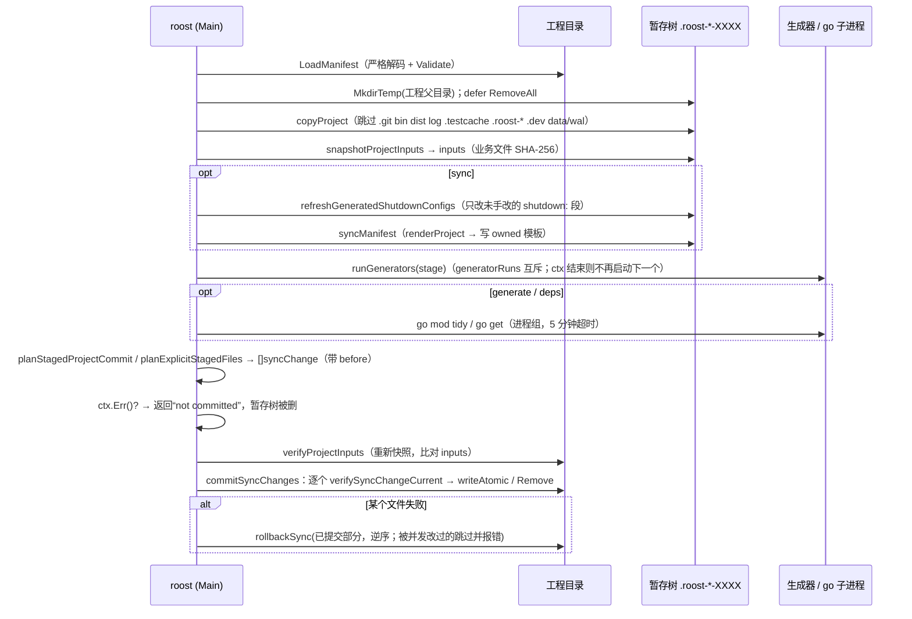
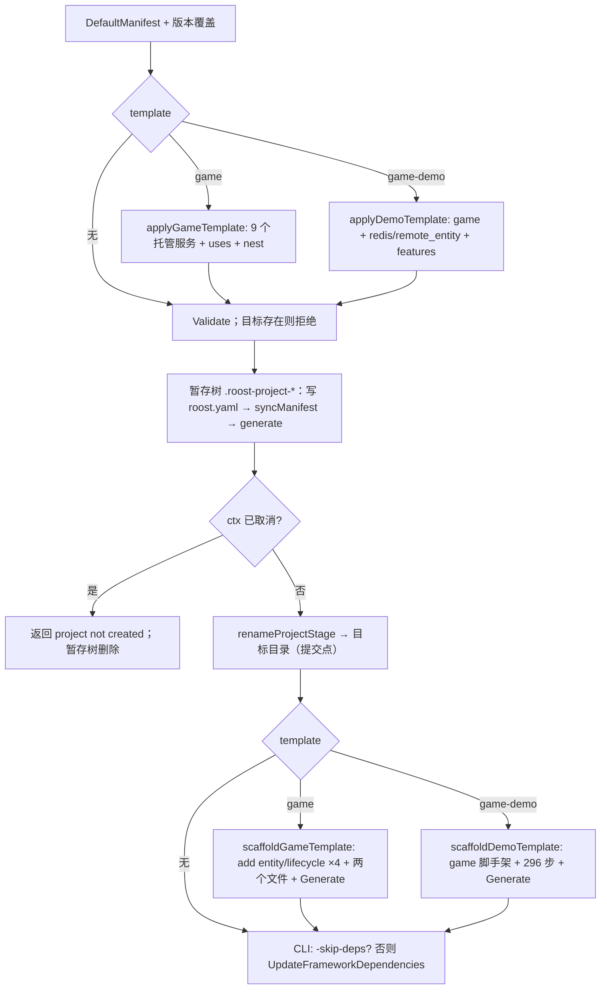
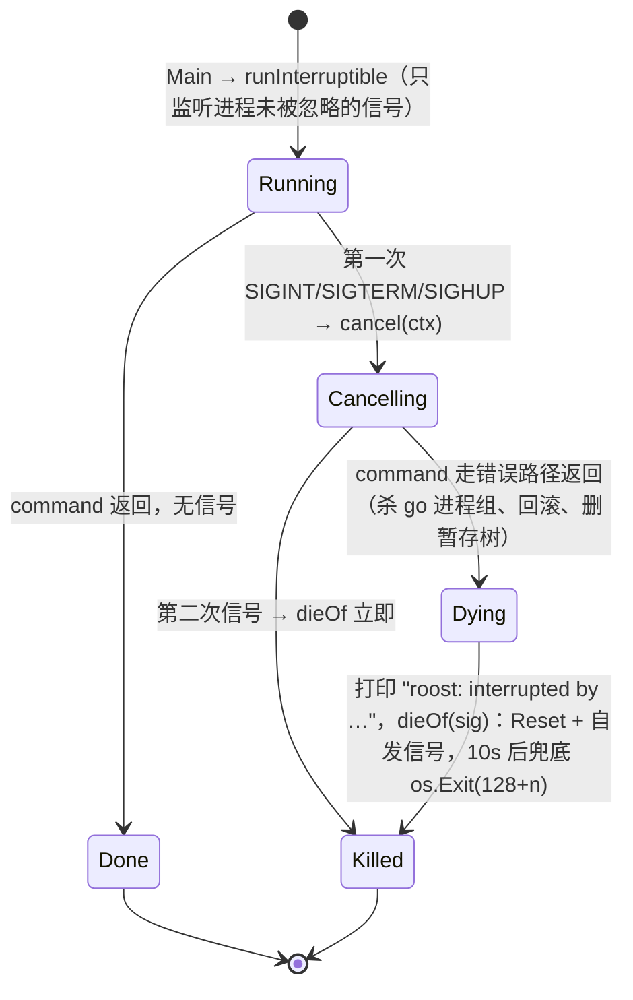

# 12 代码生成与工程（实现）

> 配套说明文档：[guide/12-codegen.md](../guide/12-codegen.md)（是什么、怎么用、配置、运维、保证）。
> 读者：review agent 与要改这一块代码的人。源码基准：tag `v1.23.0`（`28912cd6`），全部 `path:line` 按这个 tag；生成代码的行号是生成器模板源码的行号。
> 本篇按维护者要求不派子 agent、不依赖 codebase-memory 图谱，全部按 tag 源码直接读取。§11 的探针在 tag 的 detached worktree 里临时加测试文件运行后删除；“实测”的工程用 tag 构建的 `roost` 以 `-skip-deps` 生成。

## 速览

- **一条主线**：CLI 的每个写操作（`project new / sync / upgrade / deps`、`generate`、改清单的 `add`）都是“复制工程到旁边的暂存树 → 在暂存树里渲染 / 生成 / `go mod tidy` → 计划一组 `syncChange`（每个带 `before` 字节）→ 核对业务输入哈希 → 逐个文件乐观并发检查后提交，失败逆序回滚”。入口在 `codegen/internal/roost/project.go:194`、`generate.go:215`、`dependencies.go:33`。
- **所有权靠文件内容判断**：含 `Code generated` 的、`configs/data/*.json`、`docs/generated/`、protocol 产物是“生成产物”；`renderProject` 里 `Owned=true` 的模板是“codegen 所有”，覆盖还要过 `canOverwriteGenerated`（生成头或 `.github/`、`deploy/{dev,shell,docker,k8s}/` 前缀，`project.go:626`）；其余全是业务文件，只创建不覆盖。
- **生成器**是 `codegen/internal/<名字>` 下一组语法级 AST 解析器，`generatorsFor` 按固定顺序编排（`generate.go:85`），`registry` 总在最后并且总跑。标记前缀在 `codegen/internal/marker` 统一，但**各生成器对未知键的处理不统一**（§11 G1）。
- **最容易改坏的地方**：① 往暂存流程里加一个“直接写工程”的步骤（绕过 `syncChange`，失去回滚与并发检查）；② 改 `skippedProjectDirectory` 只改一处（三处遍历必须一致，`generate.go:518`）；③ 改 bootstrap 的 Mod 列表而不改 `serviceShutdownPlan`（两者必须数同一张表，`shutdown_budget.go:112`）；④ 生成物开始调用新 API 而不抬 `minimumVersions.Core`（minimum lane 会红）；⑤ 新增标记键而沿用宽松的 `parseKV`。

### 本篇覆盖的包

| 包 | 职责 |
| --- | --- |
| `codegen/internal/roost` | CLI、清单、暂存提交、模板渲染、doctor、停机预算、模板 game / game-demo、框架发布校验 |
| `codegen/internal/{entity,dao,nest,protocol,servicerpc,attribute,eventgen,errcode,webroute,registry}` | 生成器 |
| `codegen/internal/{marker,genutil,project}` | 标记前缀、写文件 / golden、找 go.mod |
| `demo/` | game-demo 模板原件（`embed.FS`，`demo/embed.go`） |
| `robot/` | 机器人与压测框架 |
| `scripts/`、`codegen/scripts/`、根包 `*_test.go`、`.github/workflows/` | 发布 / 验收脚本、根包门禁、CI |

---

## 1. 包与文件地图

| 路径 | 职责 |
| --- | --- |
| `codegen/cmd/roost/main.go` | `roost.Main(os.Args[1:], …)`，`flag.ErrHelp` 以外的错误 `log.Fatal` |
| `codegen/internal/roost/cli.go` | 子命令分派：`RunContext`（`:26`）、`runProject`（`:98`）、`runGenerate`（`:276`）、`runAdd`（`:297`）、`runConfig`（`:357`）、`runID`（`:477`）、`runFramework`（`:79`）、`runEnvironment`（`:576`）、`rejectUnsupportedFlags`（`:545`） |
| `.../interrupt.go` | `Main`：信号 → ctx 取消 → 回滚 → 按原信号退出（B6） |
| `.../command_tree*.go` | `runCommandTree`：go 子命令作为独立进程组运行，取消时整树杀掉 |
| `.../manifest.go` | `Manifest` 类型、严格解码、`Validate`、版本下限 |
| `.../catalog.go` | Kit Mod catalog（13 个）、依赖补齐、feature 白名单；`//go:generate` 生成 `kitconfig_gen.go` |
| `.../kitconfig_gen.go` | app 与 kit 全部 Mod 配置声明的快照（07） |
| `.../project.go` | `NewProjectContext`、`SyncProjectContext`、提交计划 / 提交 / 回滚、`writeAtomic`、`projectRoot` |
| `.../generate.go` | 生成器编排、`GenerateTransactional`、`--check` / `--changed`、输入快照、暂存树复制 |
| `.../dependencies.go` | `UpdateFrameworkDependencies`（`go get` + `tidy` 于暂存树）、`TidyProjectDependencies` |
| `.../consolidate.go`、`migration/consolidation_imports.yaml` | `upgrade --consolidate` 的导入改写 |
| `.../add.go`、`add_entity.go`、`add_workflow.go`、`add_rpc.go`、`add_skill.go` | `roost add` 各 kind |
| `.../id.go` | ID 扫描、检查、分配 |
| `.../render.go` | `renderProject`（全部模板文件清单与所有权）、`main.go`、bootstrap、服务配置、Makefile、CI、Dockerfile |
| `.../render_deploy.go`、`render_cicd.go`、`render_dev_run.go` | shell / Docker / k8s 部署、发布与部署 workflow、本地 `run.sh` |
| `.../render_access.go`、`render_player_tcp.go`、`player_tcp_config.go` | 玩家接入层与 TCP（行为归 04） |
| `.../render_docs.go`、`render_workflow_docs.go`、`help.go`、`next_optional.go` | 生成工程文档、`roost help`、`project next` |
| `.../doctor.go`、`config_schema_doctor.go`、`logic_offset_doctor.go` | `project doctor`、`config check`、`project diff` |
| `.../shutdown_budget.go` | 停机预算计划、`shutdown:` 段渲染 / 解析 / 刷新、doctor 检查 |
| `.../framework_services.go`、`activity_groups.go` | 托管框架服务 catalog、collaborators、`game` 模板、活动组文件 |
| `.../demo.go` | `game-demo` 模板：清单变化、296 步脚手架、模板变量 |
| `.../framework_release.go` | `roost framework verify` |
| `codegen/internal/marker/marker.go` | `//roost:` / `//cube:` 前缀、`FindLegacy` |
| `codegen/internal/registry/{parse,gen,run}.go` | `//roost:register` 扫描、排序、聚合渲染、旧聚合检测 |
| `codegen/internal/entity/` | 实体 wire、守卫测试、mirror DTO、nocoll DAO、remote DAO 作用域、孤儿清理 |
| `codegen/internal/dao/` | Mongo DAO、嵌套结构、Redis DAO 模板 |
| `codegen/internal/nest/` | handler invoke / Sender / SyncSender / 注册聚合 |
| `codegen/internal/protocol/` | 协议解析、proto / pb / msgid / bind / handlers / manifest、反向生成、退役 |
| `codegen/internal/servicerpc/` | 接口先行 RPC：解析、校验（wire 安全）、传输半 / 装配半 |
| `codegen/internal/{attribute,eventgen,errcode,webroute}/` | 属性 profile、事件、错误码表、HTTP 路由 |
| `codegen/internal/{tablegen,cfggen}/` | 业务数据配置（07） |
| `robot/{transport,session,action,scenario,runner,loadtest,protocol}`、`robot/{robot,blackboard,dialers,lockstep}.go` | 机器人分层 |
| `scripts/pretag.sh`、`scripts/test-*-generated.sh`、`scripts/test-remote-matrix.sh`、`scripts/mirror-local.sh` | 发布门禁与验收 |
| `codegen/scripts/{source-head-check,full-scenario-adds,core-pin,*-runtime}.sh` | 兼容矩阵本地镜像、运行期守卫 |
| `ci_generated_code_test.go`、`ci_full_scenario_test.go`、`conflict_marker_gate_test.go`、`doc_links_gate_test.go`、`examples_run_test.go`、`ci_paths_test.go` | 根包门禁 |

→ [说明文档](../guide/12-codegen.md)对应：§1 定位与边界。

## 2. 关键类型与数据结构

| 类型 | 位置 | 要点 |
| --- | --- | --- |
| `Manifest` | `codegen/internal/roost/manifest.go:92` | `schema project versions cicd shared_mods services access features sagas ids`；私有字段 `configuredShutdown`（不进 YAML，`withConfiguredShutdown` 填，`:104`） |
| `ServiceSpec` | `manifest.go:143` | `Mods Framework Uses Rpcs UsesRpcs` |
| `VersionSpec` | `manifest.go:116` | `Core Kit Codegen` + 合仓前遗留 `Skill Service`（omitempty） |
| `minimumVersions` | `manifest.go:86` | core `v1.23.0`、kit `v1.14.8`、codegen `v1.15.0`；注释逐版记录抬高原因 |
| `modSpec` / `modCatalog` | `catalog.go:8`、`:45` | import 路径、别名、构造表达式、依赖、dev compose 服务 |
| `frameworkServiceSpec` / `frameworkCatalog` | `framework_services.go:26`、`:58` | 9 个 kit 服务：包、接口、依赖（全部 `redis nats`）、`NewMod` 参数、链式协作者、collaborators 模板 |
| `plannedFile` | `project.go:42` | `Body`、`Owned` |
| `syncChange` | `project.go:47` | `rel path body before existed remove`：提交单元，`before` 是计划时读到的字节，用于乐观并发与回滚 |
| `SyncResult` | `project.go:35` | `Created Updated Removed Unchanged` |
| `generator` | `generate.go:57` | `Feature Name Prefixes Always Run(root, w)` |
| `GenerateOptions` | `generate.go:45` | `Changed Check DryRun Force Stdout` |
| `stagePathError` | `generate.go:386` | 把暂存树路径替换成工程路径，保留 `Unwrap`（N08 O3） |
| `serviceShutdown` | `shutdown_budget.go:81` | `mods declaring declared dataEngine playerTCP margin release total grace` |
| `CheckItem` / `DoctorReport` | `doctor.go:33`、`:39` | `name status(ok/warn/fail) detail`；`--json` 直接序列化 |
| `registry.Registration` | `codegen/internal/registry/parse.go:37` | `ImportPath Func Phase Order ReturnsError Position` |
| `registry.Phases` | `registry/parse.go:32` | `pre kind config component entity protocol nest route post` |
| `demoScaffoldStep` | `demo.go:140` | `add *AddOptions` / `write string` / `run func` 三选一 + `why` |
| `servicerpc.Half` | `codegen/internal/servicerpc/gen.go:27` | `all` / `transport`（只依赖 core）/ `assembly`（Server、ClientMod、OwnerCapabilities） |
| `FrameworkReleaseManifest` / `FrameworkReleaseLock` | `framework_release.go:26`、`:39` | schema 3：一个 `release`；lock 记 module path、版本、`h1:` sum |
| `robot.Config` / `robot.Context` | `robot/robot.go:37`、`:54` | 每机器人不可变配置（ID、PlayerID、传输、协议表、Auth、Seed）与运行句柄（Blackboard、RunAction） |
| `runner.Executor` | `robot/runner/runner.go:35` | `pool` / `looping` / `arrival-rate` |
| `loadtest.RunState` / `StopReason` | `robot/loadtest/manager.go:25`～`:41` | `running stopping finished failed`；`completed duration manual shutdown error threshold` |

生成头：`// Code generated by roost-codegen. DO NOT EDIT.`（`project.go:20`）。识别“生成产物”只看子串 `Code generated`（`generate.go:345`、`:555`、`project.go:308`），识别“可覆盖的 codegen 文件”看完整的 `Code generated by roost-codegen`（`project.go:627`）。

→ [说明文档](../guide/12-codegen.md)对应：§2 核心概念与术语。

## 3. 主流程

### 3.1 暂存提交（`project sync` / `generate` / `project deps`）



要点：

1. 计划（`planStagedProjectCommit`，`project.go:284`）只收两类路径：`renderProject` 的全部模板路径，加上暂存树里所有“生成产物”；再遍历真实工程，把“仍是生成产物、但暂存树里已经不存在”的文件计为删除（生成器可以靠“不再输出”来退役文件）。业务源码虽然被复制进暂存树，**永远不会被提交回去**（`:281`～`:283`）。
2. `sync` 额外把刷新过的三件套配置作为显式文件合并进提交（`project.go:250`～`:257`）；`generate` / `deps` 合并 `go.mod` / `go.sum`（`generate.go:272`、`dependencies.go:76`）。同一路径出现两次且内容不同 → `conflicting staged changes`（`project.go:517`）。
3. 提交点之后不再检查 ctx：一旦开始就做完或自行回滚（`generate.go:287`～`:291`）。
4. `--check` 不走暂存提交：复制到 `os.MkdirTemp("")`，跑全部生成器（不带 `-force`），比对前后“生成产物”快照（按 LF 归一，`generate.go:447`～`:475`、`:558`～`:560`）。
5. `--changed`：`git status --porcelain --untracked-files=all` 的路径与每个生成器的 `Prefixes` 做前缀匹配，`Always` 的 registry 无条件保留（`generate.go:590`～`:631`）。

### 3.2 `project new` 与模板



- 提交点是目录 rename（`project.go:126`、`:161`；Windows 上对访问拒绝重试 2s）。之后的模板脚手架**直接在目标目录里**做：每个 `add` 改清单的步骤会再走一次完整的 `SyncProjectContext`（暂存复制 + 全部生成器），失败即返回、目录保留（§11 G4）。
- demo 步骤顺序有语义：`add endpoint` 会解析 handler 参数与协议请求字段并拒绝不匹配，所以两边文件要先写好（`demo.go:135`～`:139`）。`writeDemoFile` 写的文件不带生成头，之后 `sync` / `upgrade` 不碰；有些步骤**故意覆盖** `add` 刚生成的骨架（`demo.go:57`～`:62`）。
- 模板变量：`{{MODULE}}`、`{{PROJECT}}`、`{{GAME_SERVICE}}`、`{{GAME_SERVICE_PKG}}`；`internal/service/game/` 下的文件落到 `internal/service/<首个服务>/`（`demo.go:16`～`:52`）。

### 3.3 生成器流水线

`runGenerators`（`generate.go:410`）：持 `generatorRuns` 互斥 → `marker.FindLegacy` 列出旧前缀文件 → 按 `generatorsFor` 顺序，跳过 feature 未开的（`Always` 除外）→ 每个生成器前检查 ctx → `gen.Run(root, stdout)`。各生成器的内部流程：

| 生成器 | 流程（入口） | 退役 / 孤儿处理 |
| --- | --- | --- |
| entity | `findEntityDirs`（含标记或已有自有 `_gen_wire*.go` 的目录）→ 每目录 `parsePackage` → 整包先校验（remote DAO 作用域、nocoll DAO）再写 → 每实体 `<snake>_gen_wire.go` + 守卫测试；包级 `RegisterEntity` 放在按名字第一个实体的文件里调用全部兄弟（`codegen/internal/entity/main.go:36`～`:180`） | `retireEntityOrphans`；实体改 mirror 时删旧守卫测试 |
| dao | 解析 `db/def` 的 `//roost:dao` / `//roost:redisdao` 与字段 tag（一个标记只能绑一个结构体，`dao/parse.go:224`）→ 模板渲染 | 孤儿生成文件清理（`codegen/README.md` “孤儿生成文件清理”） |
| nest | 递归 `-dir` 找 `//roost:nest` 函数 → invoke wrapper / sender / syncsender；`-dir` 末段是 `game` 时另写 `internal/registry/nest_gen.go`（`nest/main.go:26`～`:50`、`:166`） | `retirement_test.go` 覆盖 |
| protocol | `parseDefDir` → 校验（消息号唯一、req/resp id 相等、类型导出）→ 写各产物；无结构体时退役全部产物（`protocol/run.go:26`～`:80`） | `retire.go` |
| servicerpc | 对每个 `internal/rpc/<n>`：解析 `//roost:rpc` 接口 → `validate` / `wiresafe` → 两半渲染（text/template + go/format）（`servicerpc/run.go:26`、`gen.go:65`） | `orphanGeneratedFiles`（`run.go:181`） |
| registry | `checkLegacyAggregators` → `Scan`（跳过点目录、vendor、testdata、node_modules、`_test.go`；任何 .go 解析失败即报错）→ `validate`（同一函数标两次）→ 排序 → 渲染（内容不变不写）（`registry/run.go:31`） | — |

### 3.4 中断（B6）



出处：`interrupt.go:38`～`:130`。被 `nohup` 忽略的信号不捕获（`:101`～`:112`）；Windows / 其他平台 `interruptSignals` 为空，直接运行（`command_tree_windows.go:14`、`command_tree_other.go:11`）。测试钩子 `stagePhaseHook` 在 `copy` / `generator` / `commit` 三点注入中断（`interrupt.go:132`～`:143`）。

### 3.5 doctor

`DoctorWithOptions`（`doctor.go:52`）：清单 → go / git → `go mod verify` → `go list -mod=readonly ./...`（成功才编译进程读回业务声明，`config_schema_doctor.go:42`）→ strict 时 `go test -run=^$ ./...` → 每服务 `CheckConfig` → `config-schema` / `config-reads`（07）→ `shutdown:`（`shutdown_budget.go:443`）→ `time:logic_offset`（10）→ `ids` → `cicd:*` → `collaborators:*` → 可选 workflow → strict 时 `generate --check` 与 `project diff`。最后若 ctx 已结束返回“interrupted, no report”，否则输出并把全部 FAIL `errors.Join` 返回（`:126`～`:143`）。go 命令都经 `runCommandTree`，输出截尾 2048 字节（`:161`～`:180`）。

### 3.6 停机预算

`serviceShutdownPlan`（`shutdown_budget.go:126`）：`mods = len(shared) + len(serviceModConstructors(...))`——**与 `renderBootstrap` 注册的是同一张表**（`render.go:432` 的注释与 `:129`）；dataengine 声明 30s、玩家 TCP 声明 10s，其余按 3s 底线；margin 5s；开单实例锁 +3s；`grace = max(total, configuredShutdown[svc]) + 5s`。`configuredShutdown` 来自三件套里实际写的最大 `shutdown.total_timeout`（缺键或解析失败按 App 缺省 30s，`:169`～`:220`）。刷新只替换“与它自己摘要行描述的计划逐字相同”的块（`:312`～`:350`，按 LF 识别、按原行尾写回）。

### 3.7 框架发布（`release.yml`）

`pretag.sh`（打 tag 前，人工）→ push tag → `release.yml`：派生 tag、仓库卫生、`roost framework verify --expected-release $TAG`（从代理取已发布的 roost-core，校验 path / sum / 无 replace / 无内部伪版本，写 `framework-lock.json`，`framework_release.go:103`）→ 按 tag 生成 full 工程并验证 → 构建多平台 CLI、SHA256SUMS → `gh release create`（`.github/workflows/release.yml:38`～`:218`）。

→ [说明文档](../guide/12-codegen.md)对应：§4 怎么用。

## 4. 不变量清单

| # | 内容 | 强制位置 | 守卫测试 |
| --- | --- | --- | --- |
| G-01 | 暂存命令在提交点前被取消 / 失败时工程不变，暂存树总被删除 | `project.go:207`、`:263`；`generate.go:239`、`:281`；`dependencies.go:47`、`:80` | `TestInterruptedCommandRemovesItsStagingTree`（`codegen/internal/roost/interrupt_stage_promises_test.go:39`）、`TestInterruptInEveryStagePhaseRemovesTheStageAndDiesOfTheSignal`（`interrupt_phases_promises_test.go:40`） |
| G-02 | 生成期间业务输入（非生成、非 owned、非 go.mod/sum）被改 → 拒绝提交 | `generate.go:302`、`:354` | `TestProjectInputSnapshotRejectsConcurrentBusinessEdit`（`roost_test.go:859`）、`TestRelatedBusinessFilesPreserveConcurrentEntityEdit`（`:903`） |
| G-03 | 每个文件提交前内容必须等于计划时的 `before`；回滚不覆盖被并发改过的文件 | `project.go:571`、`:636`；`add.go:296` | `TestSyncConcurrencyGuardRefusesDrift`（`roost_test.go:1682`）、`TestSyncRollbackPreservesConcurrentEdit`（`:1697`）、`TestGuardedRollbackDoesNotOverwriteConcurrentEdit`（`:959`）、`TestRollbackSyncReportsAFileItCannotInspect`（`rollback_inspect_promises_test.go:14`） |
| G-04 | 整份计划先预检所有权冲突，再写任何文件 | `project.go:599`～`:623` | `TestSyncPreflightsConflictsBeforeWriting`（`roost_test.go:1646`） |
| G-05 | 业务文件只创建不覆盖；owned 文件覆盖前要求生成头或部署 / CI 前缀 | `project.go:608`、`:626` | `TestNewProjectSyncPreservesBusinessFiles`（`roost_test.go:91`）、`TestSyncRefusesUnmanagedMakefile`（`:1583`）、`TestSyncUpgradesLegacyGeneratedMakefile`（`:1542`） |
| G-06 | `generate` 后面的生成器失败时，前面生成器的输出不提交 | `generate.go:259`～`:262` | `TestTransactionalGenerateDoesNotCommitEarlierGeneratorOnLaterFailure`（`roost_test.go:1750`） |
| G-07 | 生成器不改进程工作目录；暂存树不成为任何子进程的 cwd | `generate.go:32`～`:43`、`:67` | `TestGeneratorsDoNotMoveTheProcessIntoTheTreeTheyGenerate`（`generator_cwd_promises_test.go:25`）、`TestSyncProjectStagesNeverBecomeAChildsWorkingDirectory`（`:65`） |
| G-08 | go 子命令超时 / 取消时整棵进程树被杀，调用在 `WaitDelay`（5s）内返回 | `command_tree.go:32`～`:42` | `TestDoctorGoCommandTimeoutReturnsAndLeavesNoGrandchild`（`go_command_tree_promises_test.go:220`）、`TestDependencyCommandCancelWithBufferedOutputReturnsAndLeavesNoGrandchild`（`:269`）、`TestDependencyCommandInterruptKillsTheGoTreeAndStillKillsRoost`（`:345`） |
| G-09 | 复制、输入快照、删除计划三处遍历跳过同一组目录 | `generate.go:530`（`skippedProjectDirectory`） | `TestSyncCommitsGeneratedOrphanDeletion`（`roost_test.go:1715`）；RR-20261005-NC-74 的 `runtime_dirs_promises_test.go` |
| G-10 | 清单严格解码（未知字段报错），Validate 一次报全；旧 Mod / feature 名改写成规范名 | `manifest.go:243`～`:244`、`:272`、`:303` | `TestLoadManifestRejectsUnknownFields`（`roost_test.go:173`）、`TestValidateCanonicalizesLegacyModAndFeatureNames`（`manifest_legacy_test.go:10`）、`TestManifestRejectsModulePathInjection`（`roost_test.go:950`）、`TestManifestRejectsIDsOutsideFrameworkEncoding`（`:1020`） |
| G-11 | 改清单的 `add` 在同步失败时把清单写回原样 | `add.go:329`～`:351` | `TestAddManifestMutationRollsBackWhenSyncPreflightFails`（`roost_test.go:611`） |
| G-12 | 生成器下限 = framework-compat minimum 版本集 = `core-pin.sh` 输出 | `manifest.go:86`；`.github/workflows/framework-compat.yml:50`；`codegen/scripts/core-pin.sh:29` | `TestFrameworkCompatMinimumSetMatchesTheGeneratorFloor`（`deploy_hygiene_test.go:108`）、`TestCorePinScriptPrintsTheGeneratorMinimum`（`core_pin_script_promises_test.go:20`）、`TestFrameworkMinimumVersionGuard`（`roost_test.go:1124`） |
| G-13 | 生成工程的 go 指令 = 本模块 go 指令（1.27） | `render.go:245` | `TestGeneratedGoVersionMatchesTheGeneratorsOwn`（`deploy_hygiene_test.go:273`） |
| G-14 | 注册聚合确定、严格：阶段 → order → 路径 → 函数名；方法 / 未导出 / 带参 / 非 error 返回 / 未知选项 / 缺 phase / 重复标记都拒绝；无法解析的文件报错而不是丢注册 | `registry/parse.go:94`～`:255` | `TestScanOrdersByPhaseThenOrderThenPath`（`codegen/internal/registry/registry_test.go:32`）、`TestScanIsDeterministicAcrossRuns`（`:69`）、`TestScanRejectsUnusableMarkers`（`:96`）、`TestScanReportsAnUnparsableFileInsteadOfDroppingItsRegistrations`（`promises_test.go:12`）、`TestRunRefusesWhenAHandWrittenAggregatorIsStillPresent`（`registry_test.go:290`） |
| G-15 | `RegisterAll` 只执行一次，返回首个错误，最后整体校验实体注册表 | `registry/gen.go:93`～`:135` | `TestGeneratedAggregateValidatesTheEntityRegistry`（`validate_promises_test.go:14`）、`TestRenderChecksTheErrorOfErrorReturningRegistrations`（`promises_test.go:30`） |
| G-16 | 停机预算按 bootstrap 实际注册的 Mod 计算；宽限期不低于配置实际 total + 5s；一次 sync 收敛 | `shutdown_budget.go:126`～`:151`、`:312` | `TestGeneratedShutdownTimeoutFollowsEachServicesMods`（`shutdown_budget_test.go:162`）、`TestSyncNeverLowersTheGracePeriodBelowTheConfiguredTotal`（`:307`）、`TestOneSyncConvergesAfterAServiceLosesAMod`（`shutdown_budget_promises_test.go:166`）、`TestSyncRollsTheShutdownRefreshBackWithTheTemplates`（`:346`）、`TestSyncRefusesAConfigEditedWhileItRuns`（`:366`） |
| G-17 | 预算常量与 kit / 玩家 TCP 声明的缺省值一致 | `shutdown_budget.go:43`、`:54` | `config_declarations_promises_test.go:136`、`:146` |
| G-18 | `project diff` / `upgrade --dry-run` 列出下一次 sync 会改的每个文件（含刷新的配置） | `doctor.go:877` | `TestProjectDiffListsEveryFileTheNextSyncRewrites`（`diff_preview_promises_test.go:74`）、`TestUpgradeDryRunListsEveryFileTheUpgradeRewrites`（`:105`） |
| G-19 | 暂存树里的错误信息点名工程路径 | `generate.go:379` | `TestStagedGeneratorErrorsNameTheProjectPath`（`stage_error_messages_promises_test.go:25`） |
| G-20 | demo 的 embed 覆盖每个文件；脚手架步骤与随附文件一一对应；生成结果可编译 | `demo.go:83`、`:370` | `TestDemoEmbedCoversEveryFile`（`demo_test.go:17`）、`TestDemoTemplateStepsAndShippedFilesAgree`（`:53`）、`TestDemoTemplateGeneratesABuildableWritePath`（`:110`）；CI demo 场景 |
| G-21 | 编排层不重复生成器的缺省路径字面量（U-0118） | `generate.go:85`（引用 `dao.DefaultDefDir` 等） | `TestOrchestratorDoesNotRepeatGeneratorDefaultPaths`（`literal_coupling_test.go:26`） |
| G-22 | entity / mirror / web / register 标记拒绝未知键与非法值 | `entity/parse.go:286`～`:345`、`entity/mirror.go:133`、`webroute/parse.go:79`～`:99`、`registry/parse.go:182` | `TestParseDirRejectsUnknownMarkerParameters`（`codegen/internal/entity/marker_promises_test.go:50`）、`TestParseFileRefusesEachBadMarkerByMessage`（`codegen/internal/webroute/promises_test.go:15`）、`TestScanRejectsUnusableMarkers` |
| G-23 | 仓内 `go:generate` 产物与生成器一致 | CI `ci.yml:62`～`:71`（`go generate ./...` 后 `git status --porcelain` 为空） | `TestCIRegeneratesTheCommittedGeneratedCode`（`ci_generated_code_test.go:113`，只钉 workflow 内容） |
| G-24 | 每个 `codegen/scripts/*-runtime.sh` 被某个 workflow 无条件运行；联网用例被某个 workflow 以 `ROOST_NETWORK_TESTS=1` 点名运行 | `ci.yml:72`～`:81`；`framework-compat.yml:255`～`:273` | `TestEveryCodegenRuntimeGuardRunsInSomeWorkflow`（`ci_generated_code_test.go:152`）、`TestNetworkCodegenTestsRunInSomeWorkflow`（`:184`） |
| G-25 | full 场景 add 序列只在 `full-scenario-adds.sh` 定义一次、不吞失败 | `codegen/scripts/full-scenario-adds.sh:13` | `TestFullScenarioAddSequenceIsDefinedOnceAndNotSwallowed`（`ci_full_scenario_test.go:33`） |
| G-26 | 跟踪文件无冲突标记；跟踪 Markdown 的相对链接都能解析；所有 `examples/` main 包实跑退出 0 | 根包 | `TestNoMergeConflictMarkersInTrackedFiles`（`conflict_marker_gate_test.go:30`）、`TestTrackedMarkdownRelativeLinksResolve`（`doc_links_gate_test.go:37`）、`TestExamplesRun`（`examples_run_test.go:46`） |
| G-27 | workflow 里引用的包路径存在 | 根包 | `TestCIWorkflowPackagePathsExist`（`ci_paths_test.go:26`） |

→ [说明文档](../guide/12-codegen.md)对应：§7 保证与不保证。

## 5. 并发

| 对象 | 归属 / 锁 | 说明 |
| --- | --- | --- |
| 生成器执行 | `generatorRuns sync.Mutex`（`generate.go:43`） | 同一进程内串行；生成器按一次性命令写成，没审过并发。跨进程冲突靠提交时的乐观检查 |
| 工程文件 | **无全局锁** | 计划与生成不持锁；每个 `syncChange.before` + `verifySyncChangeCurrent` 是唯一并发保护（`project.go:567`～`:583`）。两个 roost 并发 `sync` 的结果是后提交者失败并要求重跑 |
| 信号 | `runInterruptible` 的 watcher goroutine（`interrupt.go:64`～`:82`） | 第一次信号 cancel；`finished` 关闭后 watcher 退出；`caught` 由 mutex 保护 |
| go 子进程 | 进程组（Unix `Setpgid`，`command_tree_unix.go:18`） | 取消时 `killTree` 杀整组；终端的 Ctrl-C 只到 roost |
| `writeAtomic` | 同目录临时文件 → fsync → chmod → rename（Windows 不能覆盖时经唯一备份名换位，`project.go:662`～`:718`） | 单文件原子；多文件之间靠回滚 |
| `RegisterAll` | `sync.Once`（生成代码，`registry/gen.go:93`～`:105`） | 首次结果对所有调用方相同 |
| robot | 每机器人一个 goroutine；loadtest 单活跃运行状态机 | 见 `robot/loadtest/manager.go`；lockstep 机器人缺陷归 04（F04-9） |

## 6. 失败与不确定结果处理

| 失败点 | 行为 | 位置 |
| --- | --- | --- |
| 暂存阶段任何错误 | 原样返回（路径替换成工程路径），暂存树删除，工程不变 | `generate.go:259`～`:267`、`project.go:228`～`:236` |
| 提交中途写失败 | 已写部分逆序回滚；被并发改过的文件跳过并在错误里点名 | `project.go:538`～`:554`、`:636`～`:660` |
| 依赖解析失败（sync / upgrade / new 之后） | 文件已提交，`go.mod` 未改；错误提示“after the cause is fixed run roost project deps” | `cli.go:146`～`:148`、`:203`～`:205`、`:264`～`:268` |
| `go` 命令失败 | `go.mod` / `go.sum` 从快照恢复（`rollbackDependencyUpdate`），区分超时 / 中断 / 普通失败 | `dependencies.go:151`～`:156`、`:174`～`:188`、`:221` |
| 清单改动后同步失败 | 清单写回原字节 | `add.go:342`～`:349` |
| `add transport` / `add saga` 的配置改写后失败 | 按备份恢复（只恢复仍等于本次写入内容的文件） | `add.go:145`～`:178`、`:203`～`:238` |
| 模板脚手架失败 | **不回滚**：目标目录已提交，返回已创建文件列表与错误 | `project.go:129`～`:142` |
| doctor 被中断 | 不输出半份报告 | `doctor.go:126`～`:128` |
| `go mod tidy` 在 `generate` 里失败 | 暂存树丢弃，生成物不提交 | `generate.go:263`～`:267` |

## 7. 持久化 / 协议格式

| 产物 | 格式 / 兼容规则 |
| --- | --- |
| `roost.yaml` | `schema: 1`；头注释写明下限（`manifest.go:296`）；严格解码；Marshal 前必过 Validate。旧名在内存里改写成规范名，下一次写回时落盘 |
| 生成头 | Go：`// Code generated by roost-codegen. DO NOT EDIT.`；YAML / shell：`# Code generated by roost-codegen. DO NOT EDIT.`（k8s base 统一补头，`render_deploy.go:49`～`:57`） |
| `shutdown:` 段摘要行 | 正则 `Generated for this service's (\d+) Mods: (\d+)s declared + 3s x (\d+) undeclared + (\d+)s for Service.Shutdown( + (\d+)s for the singleton release)? = (\d+)s`（`shutdown_budget.go:261`）。改摘要文字就是改刷新识别规则，老工程的段将不再自动刷新 |
| `internal/registry/generated.go` | 包 `registry`，固定导入名 `fmt sync entity` 保留（`TestAggregateReservesItsFixedImportNames`） |
| `configs/data/_manifest.json` | `{"version": 2, "tables": {}}` 起步（`render.go:157`，07） |
| `codegen/ci/framework-release.yaml` | schema 3：`release`、`consumer_go`；`pretag.sh` 与 `release.yml` 两次比对 |
| `framework-lock.json`（release 产物） | `schema release consumer_go modules[path version sum go_mod_sum]`；仓里 `codegen/framework-lock.json` 是合仓前的 schema 1 旧文件（§11 G5） |
| demo 模板 | `demo/**.tmpl`，`embed`；占位符见 §3.2 |
| 根包门禁的豁免 | 链接门禁豁免 `docs/history/` 与 `artifacts/` 目标（`doc_links_gate_test.go:24`～`:30`）；示例门禁的 `exampleRuns` 必须与发现的 main 包一致（`examples_run_test.go:32`～`:39`） |

## 8. 测试与门禁

```bash
# 生成器与 CLI 单测（-short 跳过编译 game-demo 的几条）
GOWORK=off go test -count=1 ./codegen/...
GOWORK=off go test -count=1 -short ./codegen/internal/roost

# 要从模块代理解析已发布框架的两条（CI codegen-network job）
GOWORK=off ROOST_NETWORK_TESTS=1 go test -count=1 -v \
  -run '^(TestExplicitFirstBusinessWorkflowGeneratesAccessLifecycleAndEndpoint|TestDoctorPlayerTCPPassesAfterAuthAndConfig)$' ./codegen/internal/roost/

# 根包门禁（本篇文档自己要过的是 Markdown|Conflict）
GOWORK=off go test -count=1 -run 'Markdown|Conflict' .
GOWORK=off go test -count=1 -run 'TestCIRegenerates|TestEveryCodegenRuntimeGuard|TestNetworkCodegen|TestFullScenario|TestExamplesRun|TestCIWorkflowPackagePathsExist' .

# 仓内 go:generate 漂移（CI 同款）
go generate ./... && git status --porcelain

# 运行期守卫（联网，钉 minimumVersions.Core；ROOST_CORE_PIN 覆盖）
for s in codegen/scripts/*-runtime.sh; do sh "$s"; done

# framework-compat source-head 的本地镜像
bash codegen/scripts/source-head-check.sh minimal
bash codegen/scripts/source-head-check.sh full

# 生成工程 × 真实依赖（需隔离环境，见 scripts/README.md）
./scripts/test-sync-modes-generated.sh
ROOST_DATAENGINE_IT_MONGO_URI=… ./scripts/test-dataengine-generated.sh
./scripts/test-remote-generated.sh          # 需 Mongo / Redis / NATS
./scripts/test-remote-matrix.sh             # 先 source env.sh；持 remote-acceptance.lock
scripts/mirror-local.sh test                # 私有环境

# 发版前
./scripts/pretag.sh vX.Y.Z
```

CI 分工：`ci.yml` 跑 `go generate` 漂移、5 个运行期守卫与全部单测；`framework-compat.yml` 跑 3 × 3 生成物矩阵（minimum / released 用 `GOWORK=off` 走代理，并执行 `generate --check`；source-head 经临时 go.work；full 起进程到 `service init`；demo 起 10 个进程跑 6 个机器人）与 `codegen-network`；`upgrade-compat.yml` 用已发布的老 codegen（v1.11.0、v1.12.1）生成工程再用当前生成器升级并编译；`release.yml` 见 §3.7。

## 9. 历史与重要修复（只列改变了设计的）

| 时间 | 变化 | 记录 |
| --- | --- | --- |
| 2026-09 | 三仓合一仓：roost-codegen 并入 `roost-core/codegen/`，`go.mod` 只 require roost-core；发布清单 schema 3 一个版本；`upgrade --consolidate` 改写导入 | [`docs/ARCHITECTURE_V3_SINGLE_MODULE_PLAN.zh-CN.md`](../../ARCHITECTURE_V3_SINGLE_MODULE_PLAN.zh-CN.md)、[`docs/feature/SINGLE_MODULE_MIGRATION.md`](../../feature/SINGLE_MODULE_MIGRATION.md) |
| 2026-09-20 | 发布清单版本漂移十个版本，判据挪到 `pretag.sh` | [U-0270](../../bugfix/U-0270-framework-release-version-drift.md) |
| 2026-09-21 | 根包门禁把“CI 重新生成 go:generate 产物”“CI 跑运行期守卫”写成普通测试；守卫改钉 `minimumVersions.Core` | [RR-20260921-05](../../bugfix/RR-20260921-05.md) |
| 2026-09-26 | 停机预算按服务实际 Mod 计算、宽限期不低于配置；刷新移进 sync 的暂存树、一次收敛；diff 预览含刷新 | [RR-20260926-66](../../bugfix/RR-20260926-66.md)、[RR-20260926-80](../../bugfix/RR-20260926-80.md)、[RR-20261005-NC-71](../../bugfix/RR-20261005-NC-71.md) |
| 2026-09-30 | `project deps` 也走暂存树，只冻结迁移自己的输出 | [RR-20260930-CG-14](../../bugfix/RR-20260930-CG-14.md) |
| 2026-10-04 | 生成器不再 `chdir`；go 子命令作为进程树运行、取消即整树杀掉 | [RR-20261004-12](../../bugfix/RR-20261004-12.md)、[RR-20261004-13](../../bugfix/RR-20261004-13.md) |
| 2026-10-05 | `.dev/`、`data/wal` 不再算工程输入 | [RR-20261005-NC-74](../../bugfix/RR-20261005-NC-74.md) |
| 2026-10-06 | 信号由 `Main` 统一接管（维护者决定 B6），取代在调用栈中间重抛 | [B6 方案](../../feature/B6-CLI-SIGNAL-OWNERSHIP-2026-10-06.md)、[RR-20261005-NC-70](../../bugfix/RR-20261005-NC-70.md) |
| 2026-10-06 | full 场景 add 序列单一定义（A11）；冲突标记、文档链接、示例实跑三个根包门禁 | `ci_full_scenario_test.go:1`～`:9`、[发版前验证](../../bugfix/PRERELEASE-VERIFICATION-2026-10-06.md) |
| 2026-10-07（A4 ①） | 生成配置段改由 kit Mod 的声明快照渲染 | [07 实现](07-config.md) |

## 10. review 检查点

**暂存与提交**

1. 新增的 CLI 写操作是否全部经 `syncChange` 提交？有没有在提交点之前直接 `os.WriteFile` 到工程（例如模板脚手架那样）？
2. 新的输出目录是否需要加进 `skippedProjectDirectory`？三处遍历（`copyProject`、`snapshotProjectInputs`、`planStagedProjectCommit` 的真实工程遍历）是否仍用同一个函数？
3. 新生成器的输出是否带生成头，或被 `isGeneratedData` / `protocol.IsGeneratedArtifact` 识别？否则 `generate --check` 看不到它的漂移、`sync` 也不会提交它。
4. 新模板文件的 `Owned` 是否正确？`Owned=true` 且不在部署 / CI 前缀下的文件，必须带完整生成头，否则第二次 sync 报 `refusing to overwrite non-generated file`。
5. 新增 `go` 子命令是否经 `runCommandTree`、带超时、`GOWORK=off`？
6. `commitSyncChanges` 之后是否还有会失败的步骤？失败时用户看到的状态是否明确（参照依赖解析失败的提示）？

**生成器**

7. 新标记键是否用“拒绝未知键”的解析（照 `entity/parse.go:286`）？还在用 `parseKV` / `parseMarkerOptions` 的生成器（dao、nest、rpc、attribute）是否有键名拼错的用例（§11 G1）？
8. 生成物开始调用新的 core / kit API 时，`minimumVersions.Core` 与 framework-compat 的 `version_args` 是否一起抬？`manifest.go` 的注释是否补上原因？
9. 新生成器是否加进 `generatorsFor` 并设了正确的 `Prefixes`（`--changed` 依赖它；跨生成器依赖不在 `filterChanged` 的考虑内）？
10. 生成物是否经 `go/format`、输出顺序是否与 map 迭代无关？是否用 `genutil.WriteIfChanged` 保 mtime？
11. 旧输出的退役：生成器不再输出某文件时，是否能被 `planStagedProjectCommit` 识别为“仍是生成产物、暂存树里没了”而删除？
12. `//roost:register` 新阶段：`Phases` 顺序是否有语义依据？`STATIC_REGISTRATION.md` 与 01 是否同步？

**模板与部署**

13. bootstrap 新增 Mod 时，`serviceModConstructors` 是否是唯一来源（`serviceShutdownPlan` 数的是它）？新 Mod 声明停机预算时，`serviceShutdownPlan` 是否计入？
14. 新的配置段是否会被 `appendModConfigSections` 追加到三件套（含 Secret 示例，CRLF 保持）？`productionizeConfig` 的替换是否误伤非地址字段（参照 `replicas` 的处理）？
15. 部署模板的宽限期是否全部取 `serviceShutdownPlan(...).grace`？doctor 的 `deployedGracePeriods` 是否认得新模板？
16. game-demo 新步骤：顺序是否满足 `add endpoint` 的前置？`TestDemoTemplateStepsAndShippedFilesAgree` 是否覆盖？最低版本是否需要抬？
17. 生成文档里的公式、服务数、命令与源码是否一致（F01-4、§11 G5 都是这类）？

**门禁与脚本**

18. 新的 `*-runtime.sh` 是否进了 `ci.yml` 的无条件步骤？新的联网用例是否加进 `TestNetworkCodegenTestsRunInSomeWorkflow` 的名单与 `codegen-network` 的 `-run`？
19. 新的验收脚本是否把“跳过 / 没有用例运行”当失败（参照 `test-remote-matrix.sh:32`～`:40`）？`test-sync-modes-generated.sh` 是否也需要这条？
20. 发版：`pretag.sh` 不跑 `go generate` 漂移（§11 G7），发版前是否手动确认过 CI 的漂移步骤或本地跑过？

→ [说明文档](../guide/12-codegen.md)对应：§4 怎么用、§7 保证与不保证。

## 11. 源码疑点与文档不一致

已登记、本篇不重复调研：F01-4、F01-7、F02-4 / F03-9、F04-9～F04-12、F05-6、F07（F1 / F5 / F6）、F09-R1 / R3 / R4、F09-N15（见 `docs/review/FRAMEWORK-DOCS-FINDINGS-2026-10-07.md`）。以下为本次新发现，按严重程度排列。

### G1（缺陷，探针实测）`//roost:nest`、`//roost:dao`、`//roost:redisdao`、`//roost:attribute` 静默忽略拼错的键

- **条件**：标记里某个键名拼错，例如 `//roost:nest rollback=undo durabilty=strict`、`//roost:dao coll=players db=game dbscop=sid`、`//roost:redisdao … tll=1h`。
- **代码**：nest 用 `parseMarkerOptions` 收下任意键（`codegen/internal/nest/parse.go:462`～`:474`），只读 `rollback` / `durability` / `sync` / `target(s)`（`:149`～`:154`、`:667`）；`rollbackMeta` 对空 durability 取 `nest.DurabilityAsync`（`codegen/internal/nest/gen.go:200`～`:225`）。dao / redisdao 用 `parseKV`（`codegen/internal/dao/parse.go:549`～`:557`）只取已知键，`dbscope` 缺省 `global`（`:251`～`:254`），`ttl` / `version` / `mode` 同理；attribute 同样 `parseKV`（`codegen/internal/attribute/parse.go:88`）。只有值会被校验。
- **探针**：在 tag 上临时加测试，解析上面两条标记：nest 得到 `rollback="undo" durability=""`、生成 `nest.HandlerMeta{Rollback: nest.RollbackUndo, Durability: nest.DurabilityAsync}`；dao 得到 `DbScope="global"`。
- **后果**：作者要 strict（WAL fsync 后才回复）实际得到 async，崩溃窗口内已回复的事务可能丢失；要按 sid 分库实际写进全局库。都不报错、不告警，生成物看起来正常。
- **对照**：entity 标记早已改成拒绝未知键，注释写明原因“a typo in a key … used to be read as parameter absent, which silently changes what gets generated”（`codegen/internal/entity/parse.go:286`～`:288`）；webroute 同（`webroute/parse.go:87`～`:90`）。rpc 的同类问题已登记为 F09-R4。
- **修复方向**：四个解析器统一成“已知键白名单 + 未知键报错”，各补一条拼错用例。
- **v1.23.1 已修复，见 [RR-20261006-56](../../bug/RR-20261006-56.md)**：15 种带选项的标记收敛到 `codegen/internal/marker` 的 `Spec.Parse` / `CheckFile`，未知键、重复键报错并带 `文件:行`；守卫 `TestEveryMarkerRefusesAMisspeltKey` / `TestEveryMarkerKindHasASpecAndAGuardCase`（G5 里 protocol / `id.go` 的任意前缀正则一并改掉）。

### G2（缺陷，实测）`versions.codegen` 的下限与 Makefile 的用法在合仓后对不上

- **条件**：`roost.yaml` 写 `versions.codegen: v1.15.x`（清单头注释、生成文档 `render_docs.go:367` 都把 `v1.15.0` 列为合法下限），或 `project upgrade -codegen v1.15.0`；或写 `v1.16.0`～`v1.22.x` 任一。
- **代码**：校验接受 ≥ `v1.15.0`（`manifest.go:86`～`:90`、`:389`）；Makefile 写 `CODEGEN_MODULE := github.com/tjbdwanghaibo/roost-core/codegen`、`ROOST := go run $(CODEGEN_MODULE)/cmd/roost@$(CODEGEN_VERSION)`，`CODEGEN_VERSION` 取 `versions.codegen`（`render.go:873`～`:875`、`:1044`～`:1049`）。合仓后这个版本号实际是 **roost-core 的版本**。
- **实测**：`GOWORK=off go run github.com/tjbdwanghaibo/roost-core/codegen/cmd/roost@v1.15.0 version` → `module …roost-core@v1.15.0 found, but does not contain package …/codegen/cmd/roost`；`@v1.16.0` 能跑，打印 `roost-codegen v1.16.0`。
- **后果**：钉 `v1.15.x` 时生成工程的 `make sync / generate / check-generated / doctor / config-check-all / id-check / ci` 全部失败，生成的 `.github/workflows/ci.yml` 也跑 `make check-generated`（`render.go:1121`）而红；钉 `v1.16`～`v1.22` 时用比生成工程旧的生成器 `sync`，可能把模板改写回旧形状。
- **门禁盲区**：framework-compat 的 `minimum` lane 正是 `-codegen-version v1.15.0`（`.github/workflows/framework-compat.yml:50`），但只用当前构建的 `roost` 二进制，不跑 make，所以抓不到。
- **修复方向**：codegen 下限改为“latest 或 ≥ 当前 core 下限”（或直接让 Makefile 用 `versions.core` 并废弃 `versions.codegen`），文档与 minimum lane 同步；补“生成的 Makefile 在 minimum 版本集上能跑 `make check-generated`”的门禁。
- **v1.23.1 已修复，见 [RR-20261006-57](../../bug/RR-20261006-57.md)**：Makefile 按 `versions.core` 运行生成器（`CORE_VERSION`），`versions.codegen` 废弃（写了即拒绝，`project upgrade` 删掉）；minimum lane 经钉住的 core 实跑 `make id-check` 并检查每条生成器调用。发版时 core 下限须升到 v1.23.1（v1.23.0 的生成器读不了不带 `versions.codegen` 的清单）。

### G3（缺陷，读码 + git 行为实测）工程在 git 仓库子目录时 `generate --changed` 一个生成器都不跑

- **条件**：工程根不是 git 仓库根（monorepo、或像本仓 `examples/` 那样的子目录工程），执行 `roost generate --changed` / `make generate-changed`。
- **代码**：`gitChanged` 取 `git status --porcelain --untracked-files=all` 的路径（`generate.go:590`～`:609`）；porcelain v1 的路径**总是相对仓库根**（git 文档；在子目录里实测输出 `?? sub/proj/a.go`），`filterChanged` 拿它与相对工程根的前缀（`db/def/`、`protocol/def/` …）比较（`:611`～`:631`）。带空格等需要转义的路径被 porcelain 用引号包住（实测 `?? "sub/proj/b c.go"`），也匹配不上。
- **后果**：除 `Always` 的 registry 外全部被过滤，命令输出成功，改过的定义没有重新生成；之后 `--check` / CI 才发现。
- **测试**：`filterChanged` / `gitChanged` 没有任何用例（`codegen/internal/roost/*_test.go` 无引用）。
- **修复方向**：用 `git status --porcelain -z` 并以 `git rev-parse --show-prefix` 去掉前缀（或改用 `git -C root ls-files -m -o --exclude-standard`），补子目录与带空格路径的用例。
- **v1.23.1 已修复，见 [RR-20261006-58](../../bug/RR-20261006-58.md)**：`-z` + `--show-prefix` + `-- .`，rename 两侧都算改动；补子目录、带空格、rename 用例。

### G4（限制，读码）模板脚手架在提交点之后执行，失败留下半成品目录

- **条件**：`project new -template game|game-demo` 在 rename 之后的任一脚手架步骤失败（例如 demo 的 296 步之一，或其中某次 `SyncProjectContext` 遇到环境问题）。
- **代码**：`project.go:126`～`:142`（注释 `:61`～`:64` 写明“the template scaffolding after the rename runs to completion”，但没有失败时的处理）；CLI 直接返回错误（`cli.go:134`～`:137`），不提示目录已存在。
- **后果**：目标目录是半成品；重跑 `project new` 报 `target … already exists`。
- **修复方向（推断）**：把模板脚手架移进暂存树后再 rename，或失败时在错误里点名目录并建议删除。

### G5（文档 / 注释不一致）

| 位置 | 写的 | 实际 |
| --- | --- | --- |
| `codegen/internal/roost/cli.go:124`、`framework_services.go:420`～`:422`；`project.go:30`～`:31` | `-template game` 托管 account / chat / mail / match / session 五个；`NewOptions` 注释说 account / mail / match / chat 四个 | catalog 全部 9 个（另有 activity、global、platform、rank），实测 `roost.yaml` |
| `.github/workflows/framework-compat.yml:67`～`:68`、`:201`～`:202` | game 模板托管 4 个；demo 起 6 个进程 | 9 个托管服务；`run.sh` 起全部 10 个服务（`render_dev_run.go:36`～`:52`） |
| `codegen/framework-lock.json` | schema 1，列 codegen v1.13.5、core v1.12.0、roost-skill 等五仓 | 合仓前遗留，无任何代码读取；release 产物是 schema 3 的同名文件（REVIEW-2026-09-08 曾提到“未追完”） |
| `codegen/README.md:221`、`docs/TROUBLESHOOTING.md` T-164 | `framework verify --expected-codegen`、清单 `codegen:` 字段 | flag 已改为 `--expected-release`（`cli.go:86`），清单只有 `release:`（schema 3） |
| `docs/framework/guide/01-app-lifecycle.md:102` | 生成工程入口是 `cmd/<project>/main.go` | 工程根 `main.go`（`render.go:80`，实测）；已在 00 汇总时改正 |
| `codegen/internal/marker/marker.go:5`～`:7` | 每个解析器都经 marker 包 | protocol 用自己的正则 `^//[a-z]+:protocol` / `^//[a-z]+:msg`，接受任意小写前缀且不计入旧前缀提示（`codegen/internal/protocol/parse.go:19`～`:20`）；`id.go:16` 同 |
| `codegen/internal/roost/shutdown_budget.go:30` | 公式注释不含单实例锁 | 代码含（`:148`）；与 F01-4 同源 |
| `codegen/internal/roost/cli.go:299` | `roost add` 用法列 18 种 kind | `rpc` 也支持（`:328`） |
| `codegen/internal/roost/cli.go:572` | `version` 打印 `roost-codegen <版本>` | 模块已是 roost-core（外观） |

### G6（外观）新工程仍写合仓前的 `versions.skill` / `versions.service`

- `DefaultManifest` 设 `Skill: "latest", Service: "latest"`（`manifest.go:203`），新工程的 `roost.yaml` 带这两行（实测）。字段注释说“Sync drops the fields”（`manifest.go:119`～`:122`），实际只有 `upgrade --consolidate` 的 `consolidateManifest` 会删（`consolidate.go:626`～`:648`），`sync` 不改清单。不影响行为，但新人会照着去设一个已经不存在的模块版本。

### G7（流程缺口，推断）发版门禁不覆盖 `go:generate` 漂移

- `pretag.sh` 跑 build / vet / tidy / `go test ./...`（`scripts/pretag.sh:88`～`:105`），不跑 `go generate ./...`；根包 `TestCIRegeneratesTheCommittedGeneratedCode` 只检查 `ci.yml` 里有这一步（`ci_generated_code_test.go:113`），真正的重新生成只在 CI 发生。维护者规则是“打 tag 后不等 CI”，因此一个改了 servicerpc 模板却没重新生成 kit 服务 `*_rpc_gen.go` 的提交可以被打进 tag，CI 事后才红。
- **修复方向**：`pretag.sh` 在测试前加 `go generate ./... && git status --porcelain` 检查（与 CI 同一判据）。

### G8（低，读码）`snapshotProjectInputs` / 计划只按 `Code generated` 子串判断“生成产物”

- 业务文件只要在任何位置含子串 `Code generated`（例如注释里引用了这句话），就被当成生成产物：不进入业务输入快照（并发编辑检查漏掉它），`generate --check` 把它纳入比对（`generate.go:345`、`:555`；`project.go:308`、`:349`）。在暂存树里它不会消失，所以不会被误删；影响是并发保护与漂移检查的边界变模糊。Go 的约定是匹配整行 `^// Code generated .* DO NOT EDIT\.$`，可以照此收紧。

→ [说明文档](../guide/12-codegen.md)对应：§7.2 已知限制与本次核对发现的问题。

2026-10-08 F12 G4：v1.23.1 已修复（未发布），见 [RR-20261008-36](../../bugfix/RR-20261008-36.md)。game/game-demo 全部脚手架都在同级暂存目录内完成，成功且 ctx 未取消后一次 rename 发布；失败清暂存目录，不发布目标。依赖下载仍是 CLI 后置步骤，失败有明确已创建诊断。

2026-10-08 F12 G8：v1.23.1 已修复（未发布），见 [RR-20261008-37](../../bugfix/RR-20261008-37.md)。Go 使用标准 ast.IsGenerated 并核对包声明前的规范注释，其他格式只认开头的完整生成标记。分类与 Roost 覆盖权限分开，另一生成器的文件不能覆盖。

2026-10-08 F12 G6：v1.23.1 已修复（未发布），见 [RR-20261008-38](../../bugfix/RR-20261008-38.md)。DefaultManifest 不再生成失效的 versions.skill/service。历史输入字段保留给 upgrade --consolidate 识别并移除，普通 sync 不擅改业务清单。
