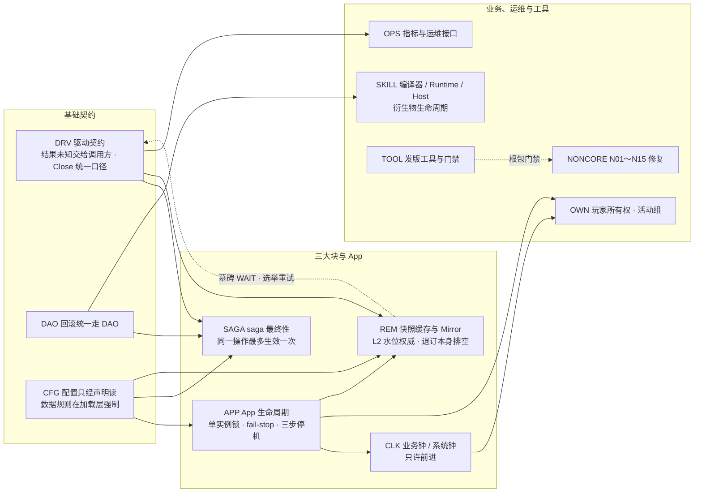

# v1.23.0 说明总文档（v1.19.2 → v1.23.0）

给维护者读，也让 review agent 能按编号定位。配套的 [实现总文档](v1.23.0-IMPLEMENTATION.md) 写给 review agent；每条的正文在 [`v1.23.0/`](v1.23.0/) 下的三套分册里（说明 / 实现 / 汇总摘要），本文只做总目录、总表与导航。

维护者要求（2026-10-06）：“希望这次跑完后整理出一个实现和说明的双文档，越详细越好，我自己阅读并且给另一个agent做review，所以需要兼顾人类阅读和agent使用”。规格见 [release-dual-docs-spec](../review/handoff-v1.23.0/release-dual-docs-spec.md)。

## 结论

- **范围**：`v1.19.2..5e72ca4d`，6 个版本（v1.20.0～v1.23.0）、335 个提交，按 12 个主题整理成 **191 条**（分册 1 有 45 条、分册 2 有 44 条、分册 3 有 102 条）。其中 8 条只是去重用的索引（NONCORE-1 / 23 / 24 / 40 / 45 / 50 / 56 以别册为准；REM-13 与 CFG-12 是同一项），实际 183 项。
- **v1.23.0 是破坏性版本**：存储格式（saga 收件箱、versionstore 信封、skill checkpoint、skill 环境 digest）、接口（`ISyncBus`、`skill.Host`、Spawn / Summon 改名）、配置（声明范围检查、`groups_file` 必填、Ops Bearer）和指标名都有变化。**不做旧格式、旧进程兼容**，维护者原话（2026-10-06）：“不考虑旧进程，完成按照新的处理，线上还没有旧的进程跑”。升级前先读 [§2 破坏性变化与升级清单](#2-破坏性变化与升级清单)，共 47 行。
- **WANTED 未决 0，仍未闭环 0，待维护者决定 0。** 只剩外部环境验证（E01～E28），不阻塞发版，见 [§6](#6-外部验证清单)。
- **代码冻结在 `5e72ca4d`**（2026-10-07），之后只改了文档；本文与分册的 `path:line` 都以它为准。打 tag 时要做的发版步骤见 [§8](#8-打-tag-时的发版步骤)。

## 目录

1. [一页总览](#1-一页总览)：文件与规模、版本时间线、主题地图
2. [破坏性变化与升级清单](#2-破坏性变化与升级清单)：升级顺序、47 行总表
3. [业务 / 运维改动清单](#3-业务--运维改动清单)：不破坏、但要做或要知道的事
4. [维护者决定索引](#4-维护者决定索引)：按轮次，带原话与条目编号
5. [主题导航](#5-主题导航)：每个主题一句话 + 分册锚点
6. [外部验证清单](#6-外部验证清单)：E 编号与条目的对应
7. [未决与闭环状态](#7-未决与闭环状态)：WANTED、仍未闭环、保持不做的项
8. [打 tag 时的发版步骤](#8-打-tag-时的发版步骤)
9. [相关文档](#9-相关文档)

---

## 1. 一页总览

### 1.1 文件与规模

| 分册 | 主题与条目数 | 条目 | 说明 | 实现 | 汇总摘要 |
| --- | --- | --- | --- | --- | --- |
| 1 | APP 15 · OWN 7 · CLK 6 · OPS 8 · TOOL 9 | 45 | [guide-app-own-clk-ops-tool](v1.23.0/guide-app-own-clk-ops-tool.md) | [impl-app-own-clk-ops-tool](v1.23.0/impl-app-own-clk-ops-tool.md) | [_summary](v1.23.0/_summary-app-own-clk-ops-tool.md) |
| 2 | SAGA 17 · DRV 8 · DAO 4 · REM 15 | 44 | [guide-saga-drv-dao-rem](v1.23.0/guide-saga-drv-dao-rem.md) | [impl-saga-drv-dao-rem](v1.23.0/impl-saga-drv-dao-rem.md) | [_summary](v1.23.0/_summary-saga-drv-dao-rem.md) |
| 3 | CFG 16 · SKILL 30 · NONCORE 56 | 102 | [guide-cfg-skill-noncore](v1.23.0/guide-cfg-skill-noncore.md) | [impl-cfg-skill-noncore](v1.23.0/impl-cfg-skill-noncore.md) | [_summary](v1.23.0/_summary-cfg-skill-noncore.md) |
| 合计 | 12 个主题 | 191 | | | |

**怎么定位一条**：编号是 `<主题>-<序号>`，锚点是小写编号（例如 `#saga-14`），同一编号在说明分册和实现分册里各有一个锚点，互相链接。

- 说明分册每条写：一句话结论、背景（之前的问题与 RR / U / 决定轮次）、维护者决定（原话）与没采用的方案、现在的行为（配置键、错误、日志、指标）、兼容与迁移、已知限制与外部验证、链接。
- 实现分册每条写：全部提交与首发版本、改动文件与关键符号（`path:line`）、不变量与强制位置、控制流、失败与不确定结果、测试（用例名、修前红文本原样、修后命令）、性能证据、未验证项、review 检查点。

本文里的条目链接都指向说明分册；要看实现，点进去后用条目开头的“实现”链接，或直接看 [实现总文档](v1.23.0-IMPLEMENTATION.md)。

### 1.2 版本时间线

| 版本 | tag 提交 | 日期 | 首发条目 | 主要内容 |
| --- | --- | --- | --- | --- |
| v1.19.2（起点） | `4ee44f34` | 2026-10-04 | — | 本范围的基线 |
| v1.20.0 | `999dc672` | 2026-10-05 | 19 | App 单实例锁、fail-stop、`Live`（[APP-1](v1.23.0/guide-app-own-clk-ops-tool.md#app-1)～[APP-5](v1.23.0/guide-app-own-clk-ops-tool.md#app-5)、[APP-13](v1.23.0/guide-app-own-clk-ops-tool.md#app-13)）；删 global 租约 API（[APP-3](v1.23.0/guide-app-own-clk-ops-tool.md#app-3)）；game-demo 玩家静态绑定、赠礼按 `FromSID` 准入（[OWN-2](v1.23.0/guide-app-own-clk-ops-tool.md#own-2)、[OWN-3](v1.23.0/guide-app-own-clk-ops-tool.md#own-3)）；N04 / N05 / N08 第一批修复（[NONCORE-9](v1.23.0/guide-cfg-skill-noncore.md#noncore-9)、[NONCORE-10](v1.23.0/guide-cfg-skill-noncore.md#noncore-10)、[NONCORE-13](v1.23.0/guide-cfg-skill-noncore.md#noncore-13)、[NONCORE-14](v1.23.0/guide-cfg-skill-noncore.md#noncore-14)、[NONCORE-27](v1.23.0/guide-cfg-skill-noncore.md#noncore-27)、[NONCORE-28](v1.23.0/guide-cfg-skill-noncore.md#noncore-28)、[NONCORE-32](v1.23.0/guide-cfg-skill-noncore.md#noncore-32)） |
| v1.20.1 | `be7407ab` | 2026-10-05 | 30 | U-0280 / U-0281 原生步骤收件箱与步骤预算配置（[SAGA-1](v1.23.0/guide-saga-drv-dao-rem.md#saga-1)～[SAGA-3](v1.23.0/guide-saga-drv-dao-rem.md#saga-3)）；驱动 NC-100 / 101（[DRV-1](v1.23.0/guide-saga-drv-dao-rem.md#drv-1)、[DRV-2](v1.23.0/guide-saga-drv-dao-rem.md#drv-2)）；skill 施法终态单一入口等 N09 第一批（[SKILL-1](v1.23.0/guide-cfg-skill-noncore.md#skill-1)～[SKILL-5](v1.23.0/guide-cfg-skill-noncore.md#skill-5)）；N02 / N03 / N06 / N07 / N10 / N11 第一批 |
| v1.20.2 | `c85d4565` | 2026-10-06 | 33 | 维护者第二、三轮：A1 回滚统一走 DAO（[DAO-1](v1.23.0/guide-saga-drv-dao-rem.md#dao-1)）、A2 驱动不重放写（[DRV-3](v1.23.0/guide-saga-drv-dao-rem.md#drv-3)）、A3 共用停机类型（[APP-6](v1.23.0/guide-app-own-clk-ops-tool.md#app-6)）、A4 ② 严格读配置（[CFG-1](v1.23.0/guide-cfg-skill-noncore.md#cfg-1)～[CFG-5](v1.23.0/guide-cfg-skill-noncore.md#cfg-5)）、B1 代际（[SAGA-6](v1.23.0/guide-saga-drv-dao-rem.md#saga-6)）、B2 L2 水位权威（[REM-1](v1.23.0/guide-saga-drv-dao-rem.md#rem-1)）、B3 ①② lower fail-fast（[SKILL-13](v1.23.0/guide-cfg-skill-noncore.md#skill-13)）、C4 活动组文件（[OWN-5](v1.23.0/guide-app-own-clk-ops-tool.md#own-5)）、C6 服务指标（[OPS-1](v1.23.0/guide-app-own-clk-ops-tool.md#ops-1)）、C7 遍历契约（[NONCORE-47](v1.23.0/guide-cfg-skill-noncore.md#noncore-47)） |
| v1.21.0 | `4881f2b7` | 2026-10-06 | 35 | 第四～九轮：D-L3 双时钟（[CLK-1](v1.23.0/guide-app-own-clk-ops-tool.md#clk-1)、[CLK-2](v1.23.0/guide-app-own-clk-ops-tool.md#clk-2)）、D1 readyz（[APP-10](v1.23.0/guide-app-own-clk-ops-tool.md#app-10)）、B10 / C2 配置规则（[CFG-7](v1.23.0/guide-cfg-skill-noncore.md#cfg-7)、[CFG-8](v1.23.0/guide-cfg-skill-noncore.md#cfg-8)）、saga 方向 ①②（[SAGA-8](v1.23.0/guide-saga-drv-dao-rem.md#saga-8)、[SAGA-9](v1.23.0/guide-saga-drv-dao-rem.md#saga-9)）、求值上下文表与 O33（[SKILL-14](v1.23.0/guide-cfg-skill-noncore.md#skill-14)～[SKILL-16](v1.23.0/guide-cfg-skill-noncore.md#skill-16)）、Mirror 第 1～5 步（[REM-2](v1.23.0/guide-saga-drv-dao-rem.md#rem-2)～[REM-6](v1.23.0/guide-saga-drv-dao-rem.md#rem-6)）、N01 留项（[OPS-3](v1.23.0/guide-app-own-clk-ops-tool.md#ops-3)、[APP-8](v1.23.0/guide-app-own-clk-ops-tool.md#app-8)） |
| v1.22.0 | `9bf690fb` | 2026-10-06 | 6 | 业务时间高水位（[CLK-3](v1.23.0/guide-app-own-clk-ops-tool.md#clk-3)）、activity / mail 回业务钟（[CLK-4](v1.23.0/guide-app-own-clk-ops-tool.md#clk-4)）、configdata 键大小写敏感（[CFG-10](v1.23.0/guide-cfg-skill-noncore.md#cfg-10)）、Mirror 第 6 步本机替代（[REM-7](v1.23.0/guide-saga-drv-dao-rem.md#rem-7)、[REM-8](v1.23.0/guide-saga-drv-dao-rem.md#rem-8)、[TOOL-6](v1.23.0/guide-app-own-clk-ops-tool.md#tool-6)） |
| **v1.23.0（本版）** | 待打（代码冻结 `5e72ca4d`） | 2026-10-07 | 68 | 第十～十三轮：收件箱单状态文档与 saga 方向 ③④（[SAGA-14](v1.23.0/guide-saga-drv-dao-rem.md#saga-14)～[SAGA-17](v1.23.0/guide-saga-drv-dao-rem.md#saga-17)）、versionstore 写令牌（[DRV-7](v1.23.0/guide-saga-drv-dao-rem.md#drv-7)）、`ISyncBus` 排空退订（[REM-15](v1.23.0/guide-saga-drv-dao-rem.md#rem-15)）、A4 ① 配置声明（[CFG-14](v1.23.0/guide-cfg-skill-noncore.md#cfg-14)、[CFG-15](v1.23.0/guide-cfg-skill-noncore.md#cfg-15)）、B3 ③ Host 能力表（[SKILL-30](v1.23.0/guide-cfg-skill-noncore.md#skill-30)）、衍生物生命周期七步与 Spawn / Summon 改名（[SKILL-23](v1.23.0/guide-cfg-skill-noncore.md#skill-23)～[SKILL-29](v1.23.0/guide-cfg-skill-noncore.md#skill-29)）、nats 驱动自持关闭状态（[DRV-5](v1.23.0/guide-saga-drv-dao-rem.md#drv-5)）、`groups_file` 必填（[OWN-5](v1.23.0/guide-app-own-clk-ops-tool.md#own-5)）、metrics 删序列 / Ops Bearer / CAS 统一计数（[OPS-2](v1.23.0/guide-app-own-clk-ops-tool.md#ops-2)、[OPS-4](v1.23.0/guide-app-own-clk-ops-tool.md#ops-4)、[OPS-5](v1.23.0/guide-app-own-clk-ops-tool.md#ops-5)）、真实进程演练（[APP-15](v1.23.0/guide-app-own-clk-ops-tool.md#app-15)）、根包门禁（[TOOL-4](v1.23.0/guide-app-own-clk-ops-tool.md#tool-4)、[TOOL-5](v1.23.0/guide-app-own-clk-ops-tool.md#tool-5)） |

“首发条目”是三份 `_summary` 按首发版本的合计（v1.20.0：11 + 0 + 8；v1.20.1：0 + 5 + 25；v1.20.2：5 + 5 + 23；v1.21.0：7 + 10 + 18；v1.22.0：3 + 2 + 1；v1.23.0：19 + 22 + 27），合计 191。一条跨多个版本的（例如 [OWN-5](v1.23.0/guide-app-own-clk-ops-tool.md#own-5) 在 v1.20.2 首发、v1.23.0 改为必填）按首发计，后续变化写在条目里。tag 提交用 `git rev-list -n1 <tag>` 核对。

### 1.3 主题地图

箭头读作“建立在……之上”：例如 SAGA 的 Mongo 收件箱按 DRV 的“结果未知”口径分类错误；CLK 的高水位挂在 APP 的单实例锁之后；OWN 的 activity 用 APP 的 `Live` 与 CLK 的业务钟；OPS 的 CAS 冲突计数点在 versionstore 写令牌的结算之后（[OPS-5](v1.23.0/guide-app-own-clk-ops-tool.md#ops-5)、[DRV-7](v1.23.0/guide-saga-drv-dao-rem.md#drv-7)）。

本版的三条主线（详见 [§5 主题导航](#5-主题导航)）：

1. **“结果未知”与最终性**：DRV 先定“驱动不重放写、结果未知交给调用方”，SAGA 在这之上把“同一步骤操作最多生效一次”从原生步骤推到 Mongo 步骤、再收成每个操作一份状态文档，最后让协调器补偿放弃之后迟到生效的步骤；versionstore 用写令牌把多数结果未知在 store 内核对成确定结果。
2. **停机与生命周期**：App 单实例锁、fail-stop、三步停机共用类型（`operation.Lifetime` / `Serial`、契约骨架），一路下沉到 `ISyncBus` 的退订本身排空、nats 驱动自持唯一的已关闭状态；skill 衍生物的停止也收成一个状态机。
3. **一份声明、一张表**：配置由每个 Mod 的声明驱动启动检查、生成器和 doctor；skill 编译器、Runtime、Host 查同一张求值上下文表和同一张能力表；配置数据规则只在加载层强制。

---

## 2. 破坏性变化与升级清单

“破坏性”指：升级后以前能用的东西会失败，或语义变化需要调用方改。本表合并三份分册 `_summary` 的兼容破坏表并去重（分册 1 §2.1、分册 2“行为变化 / 兼容破坏”、分册 3“破坏性”与“行为收紧”），每行链接到条目。

- 从 v1.19.2 直接升级的，全部适用；从中间版本升级的，按“首发”列取舍。
- **本版不做兼容**：存储格式与协议不读旧格式、不支持新旧进程混跑（维护者 2026-10-06：“不考虑旧进程，完成按照新的处理，线上还没有旧的进程跑”）。
- **已生成工程不迁移**（维护者决定）：模板变化只对新生成、`roost generate` 或 `roost project sync` 之后的工程生效。

### 2.1 推荐的升级顺序

一次部署按下面的顺序做完，括号里是对应的总表行号。

1. **停掉全部旧进程**，不做滚动混跑（1、3、4）。原生 saga 步骤进程先排空 WAL 再停；skill Runtime 的 checkpoint 先排空。
2. **清旧数据**：丢弃 `_dataengine_inbox_claims` 与各 Mongo 步骤的 `<收件箱集合>_claims`（1，SAGA.md「操作状态文档」）；清空各服务 versionstore 前缀下的键与带索引 store 的索引有序集合（3，[TROUBLESHOOTING T-291](../TROUBLESHOOTING.md)）；从 v1.20.0 之前升级的删 `<global.key_prefix>:lease:*`（8，[DEPLOYMENT §7.1](../DEPLOYMENT.md#71-升级后的手工清理)）。
3. **改配置**：用新版本对每份生产配置跑 `<bin> <service> --check-config`（25、26、30）；协调器补 `activity.groups_file` 与 `configs/activity_groups.yaml`（27）；生产 `time.logic_offset: 0`（32）；同机多实例各配 `ops.addr`（33）。
4. **改代码与数据**：技能 JSON、Host 实现、客户端按 Spawn / Summon 对照表改名（11、12）；Host 实现 `HostCapabilities()`（10）；跑一次 `CompileAll`（35）；自写 `ISyncBus` / 订阅方按新签名改（9）；自写 Mod 改成配置声明（17）；自定义 saga Store 持久化 `LateStep` / `LateData`（2）。
5. **改运维**：脚本改 `Authorization: Bearer`（28）；看板与告警按指标行（36～43）改。
6. **起新进程，观察新指标**：`saga.reopened_total`（[SAGA-17](v1.23.0/guide-saga-drv-dao-rem.md#saga-17)）、`versionstore.unknown_outcome.total`（[DRV-7](v1.23.0/guide-saga-drv-dao-rem.md#drv-7)）、`skill.spawn.abandoned.total`（[SKILL-29](v1.23.0/guide-cfg-skill-noncore.md#skill-29)）。

### 2.2 总表（47 行）

| # | 类别 | 改了什么 | 谁受影响 | 要做什么 | 不做会怎样 | 首发 | 条目 |
| --- | --- | --- | --- | --- | --- | --- | --- |
| 1 | 存储格式 | saga 步骤收件箱改为**每个操作一份状态文档**：原生 `_dataengine_step_operations`（`saga/dataengine_step_inbox.go:18`）、Mongo 步骤 `<收件箱集合>_operations`（`saga/command_consumer.go:50`）；旧 `_dataengine_inbox_claims` / `<收件箱集合>_claims` 不再读写（`a013f9ff`） | 运行 saga 步骤服务的运维 | 停全部旧步骤进程（原生步骤进程先排空 WAL）→ `drop` 旧 claims 集合 → 起新进程；不混跑 | 旧进程写的 claim 新进程不读；WAL 里旧记录的 fence 指向旧文档，投影时被跳过 | v1.23.0 | [SAGA-14](v1.23.0/guide-saga-drv-dao-rem.md#saga-14) |
| 2 | 存储格式 | saga 记录新增 `late_step` / `late_data`（`Record.LateStep` / `LateData`，`omitempty`）（`a6a902cd`） | 自己实现 saga Store 的业务 | 原样保存两个字段，并实现 `CompletionHistoryStore` | 放弃之后迟到生效的正向步骤不被补偿 | v1.23.0 | [SAGA-16](v1.23.0/guide-saga-drv-dao-rem.md#saga-16) |
| 3 | 存储格式 | versionstore 信封带一次性写令牌：`<version>\|<令牌>…\n<payload>`（`versionstore/write_token.go`，`6b3a0eb9`） | 用 versionstore 的全部服务（account、activity、chat、rank 等）的运维 | 停旧进程 → 清空各服务 versionstore 前缀下的键与带索引 store 的索引有序集合（T-291）→ 起新版本 | 读旧信封全部报 `ErrMalformedRecord`（`no write token (old envelope format; clear the store on upgrade)`，`versionstore/write_token.go:179`） | v1.23.0 | [DRV-7](v1.23.0/guide-saga-drv-dao-rem.md#drv-7) |
| 4 | 存储格式 | **skill checkpoint 版本升到 7**（`skill/runtime_checkpoint.go:29`，`:16-28` 注释逐版写明本版 3～7 各改了什么），只恢复当前版本 | 保存 skill Runtime checkpoint 的业务 | 升级前排空 checkpoint；不要拿新旧版本各自写出的字节互相比对 | 恢复返回 `ErrCheckpointUnsupported` | v1.23.0 | [SKILL-24](v1.23.0/guide-cfg-skill-noncore.md#skill-24)～[SKILL-29](v1.23.0/guide-cfg-skill-noncore.md#skill-29)、[SKILL-18](v1.23.0/guide-cfg-skill-noncore.md#skill-18) |
| 5 | 存储格式 | **skill 环境与 digest 全变**：Host 能力表（`CompileEnvironment.Host`）进 authority digest（`skill/compile_authority.go:29`），删 `Motion.EnabledSlots` / `HostFeatures`；两次改名改变字段名、因而改变 digest；`SourceDocumentDigest` 改为逐字段 | 保存或签名 digest 的一方：skillcompose 契约、录制回放、按 digest 比对的工具 | 重新编译、重签契约、旧录制回放重录；保存旧源文档 digest 的一次性重算 | 按旧 digest 签的契约与回放不再适用 | v1.23.0 | [SKILL-25](v1.23.0/guide-cfg-skill-noncore.md#skill-25)、[SKILL-27](v1.23.0/guide-cfg-skill-noncore.md#skill-27)、[SKILL-28](v1.23.0/guide-cfg-skill-noncore.md#skill-28)、[SKILL-30](v1.23.0/guide-cfg-skill-noncore.md#skill-30) |
| 6 | 存储格式 | saga 记录持久增量 `incarnation`、`start_digest`（NC-37～40） | 自定义 saga Store；从 v1.20.0 及以前升级的协调器 | 自定义 Store 保存新字段；协调器统一升级 | 缺摘要的旧记录重投时冲突 | v1.20.1 | [NONCORE-16](v1.23.0/guide-cfg-skill-noncore.md#noncore-16)、[NONCORE-17](v1.23.0/guide-cfg-skill-noncore.md#noncore-17) |
| 7 | 存储格式 | 活动组从 game 配置 `activity.game_sids` 改为组文件 `configs/activity_groups.yaml`（每组 ≤ 64）（`277e1252`） | 托管 activity 的工程 | 新工程用组文件，game 与协调器读同一份 | 键被删除，game 读不到候选 | v1.20.2 | [OWN-5](v1.23.0/guide-app-own-clk-ops-tool.md#own-5) |
| 8 | 存储格式 | global 租约旧键 `<global.key_prefix>:lease:*` 不再读写（无 TTL） | 从 v1.20.0 之前升级的运维 | 手工删除（DEPLOYMENT §7.1） | 旧键一直占 Redis 内存 | v1.20.0 | [APP-3](v1.23.0/guide-app-own-clk-ops-tool.md#app-3) |
| 9 | 接口 | **`ISyncBus`**：`syncbus.Handler` 改为 `func(ctx, msg) error`（`sync/syncbus/sync.go:24`）；`Subscribe` / `SubscribeLive` 返回 `*syncbus.Subscription`，`Unsubscribe(ctx)` 本身排空（`sync/syncbus/subscription.go:92`）；`PatchSyncer.Stop`、`cache.ReplicaSyncer.Stop` 改为 `Stop(ctx) error`；`syncstream.Subscribe*` 返回 `*Subscription`（`ebf679e1`） | 自己实现 `ISyncBus` 或直接调用这些 API 的代码（仓内已全部迁移） | 按新签名改；handler 里退订自己时传 handler 收到的投递 ctx；替身用 `syncbus.NewSubscription` + `Deliver` | 编译失败；handler 里用 `context.Background()` 退订自己会一直等自己 | v1.23.0 | [REM-15](v1.23.0/guide-saga-drv-dao-rem.md#rem-15) |
| 10 | 接口 | **`skill.Host` 必须提供能力表** `HostCapabilities() HostCapabilityTable`（`skill/host_capability.go:63`）；Runtime 准入不再对“没实现”的 Host 跳过；表外能力在编译、启动、注册、恢复处被拒（`cd8ed341`、`e999f68e`） | 自己实现 `skill.Host` 的业务 | 声明能力表（嵌入 `*skill.MemoryHost` 的自动得到）；测试里用 `skill.CheckHostCapabilities` 核对声明与行为一致 | 编译不过；需要表外能力的 Program 被拒；配置了 catalog 的 MemoryHost / HostAdapter 对表外属性、资源报错（原来读成 0） | v1.23.0 | [SKILL-30](v1.23.0/guide-cfg-skill-noncore.md#skill-30) |
| 11 | 接口 | **Spawn 改名**：skill “进程”（process）全量改为衍生物（spawn）：DSL `process` → `spawn`、`$process` → `$spawn`、`StepProcess` → `StepSpawn`、mutation / 表现 kind `process_*` → `spawn_*`、指标 `skill.process.*` → `skill.spawn.*`；不留别名（`4451a0a5`） | 技能 JSON 作者、Host 实现、客户端、告警 | 按 [Spawn 对照表](../feature/REFACTOR-2026-10-06-skill-process-to-spawn.md) 改名 | Parse 失败（`unknown field "process"`）；客户端认不出 kind | v1.23.0 | [SKILL-25](v1.23.0/guide-cfg-skill-noncore.md#skill-25) |
| 12 | 接口 | **Summon 改名**：生成宿主单位的效果 `spawn` → `summon`、`despawn` → `dismiss`、衍生物 kind `summon` → `minion`、Host `PreviewOwnedSpawn` → `PreviewOwnedSummon` 等（`509c381f`） | 同上 | 按 [Summon 对照表](../feature/REFACTOR-2026-10-07-skill-summon-rename.md) 改名 | Parse 失败（`unsupported effect "spawn"`） | v1.23.0 | [SKILL-27](v1.23.0/guide-cfg-skill-noncore.md#skill-27) |
| 13 | 接口 | 衍生物新状态 `stop_pending` / `abandoned`；`Host.StopSpawn` 必须幂等；`Shutdown` / `RemoveProgram` 停不下的衍生物由 Runtime 重试、不再列在 `OwnedSpawns`；放弃时不发 `spawn_remove` | Host 实现、客户端 / 渲染器、读 `OwnedSpawns` 的代码 | 宿主 `StopSpawn` 幂等；客户端认两个新状态；改看 `StateSnapshot` / `RetentionStats` | Runtime 重试时宿主重复停止出错；客户端把新状态当未知 | v1.23.0 | [SKILL-24](v1.23.0/guide-cfg-skill-noncore.md#skill-24)、[SKILL-26](v1.23.0/guide-cfg-skill-noncore.md#skill-26)、[SKILL-29](v1.23.0/guide-cfg-skill-noncore.md#skill-29) |
| 14 | 接口 | 删 `global` 租约 API（`AcquireLease` / `RenewLease` / `ReleaseLease` / `Lease` / `LiveGames` 等）、错误码 570105～570109、`mods.ModRedisLock` / `ModEtcdElection` | 仓外调用这些 API 的应用 | 改用 App 单实例锁与 `SingletonLiveness.Live`；键级锁 / 选主自己用 `redisdriver.Assemble(cfg).Locks` / `etcddriver.Assemble(cfg).Election` | 编译失败 | v1.20.0 | [APP-3](v1.23.0/guide-app-own-clk-ops-tool.md#app-3) |
| 15 | 接口 | `app.Service.Shutdown` 在 Init 返回错误时也会被调用（NC-193） | 自写 `app.Service` | `Shutdown` 容忍部分初始化 | 解引用未初始化字段 panic → 收尾不完整，单实例锁只能等 TTL 过期 | v1.20.2 | [APP-9](v1.23.0/guide-app-own-clk-ops-tool.md#app-9) |
| 16 | 接口 | `health.Snapshot.OK` 改为“没有 Fail”；`/readyz` Degraded 回 200（D1） | 直接读 `Snapshot.OK` 的代码；靠 readiness 在 80% 容量卸载流量的部署 | 要旧语义用 `OK && !Degraded`；看响应体 `degraded` | 降级时不再摘 endpoint | v1.21.0 | [APP-10](v1.23.0/guide-app-own-clk-ops-tool.md#app-10) |
| 17 | 接口 | 读配置 API 改为声明：`app.ConfigReader`、`kit/mods.Duration` / `RedisClusterAddrs` 等删除；Mod 用“配置结构体 + tag”，实现 `ConfigSchema()`，Init 里 `app.LoadConfig`（`app/config_schema.go:64`、`:68`）（`d1226825`） | 自写 Mod 与业务服务 | 改成声明 + `app.LoadConfig`；业务服务同样声明（行 26） | 编译失败；doctor `config-reads` FAIL | v1.23.0 | [CFG-14](v1.23.0/guide-cfg-skill-noncore.md#cfg-14)、[CFG-15](v1.23.0/guide-cfg-skill-noncore.md#cfg-15) |
| 18 | 接口 | `activity.New` 必须带 `Config.Groups`（`061cb538`） | 手工装配 activity 协调器的代码 | 传 `LoadGroupsFile` / `ParseGroups` 的结果 | `New` 报错 | v1.23.0 | [OWN-5](v1.23.0/guide-app-own-clk-ops-tool.md#own-5) |
| 19 | 接口 | 删 `activity.Config.SystemNow`、`mail.Config.SystemNow`、`mail.RedisConfig.StorageGrace`；`mail.DefaultEnvelopeStorageGrace` → `EnvelopeStorageGrace` | 手工装配 activity / mail | 删对应赋值、改名 | 编译失败 | v1.22.0 | [CLK-4](v1.23.0/guide-app-own-clk-ops-tool.md#clk-4) |
| 20 | 接口 | actionflow `ActionRunner` / `MissionRunner` 回调里的变更延后到回调返回后执行，不再返回 `ErrReentrantMutation`；ai `OnMissionEnd` 里 SetMission 返回 nil、结束后启动 | 在回调里改 runner 的业务 | 按延后语义写；要清场先 `EndCurMission` 再 `EndAll` | 回调里的变更生效时机与以前不同 | v1.20.2 / v1.21.0 | [NONCORE-35](v1.23.0/guide-cfg-skill-noncore.md#noncore-35)、[NONCORE-37](v1.23.0/guide-cfg-skill-noncore.md#noncore-37) |
| 21 | 接口 | Close 统一口径：重复 Close 返回 nil、并发后到者等第一个；nats 关闭后每个导出方法只 `errors.Is(fnats.ErrClosed)`（不再 Is nats.go 的 `ErrConnectionClosed`），`Connected()` 关闭后一直为 false（`d05a04a1`、`f0de827a`） | 靠“第二次 Close 报错”或 nats.go 原错误判断的工具与测试 | 改看命令错误 `errors.Is(err, goredis.ErrClosed)` / `errors.Is(err, fnats.ErrClosed)` | 判断失效 | v1.21.0（NC-233 / 260）/ v1.23.0 | [DRV-5](v1.23.0/guide-saga-drv-dao-rem.md#drv-5)、[APP-7](v1.23.0/guide-app-own-clk-ops-tool.md#app-7)、[NONCORE-53](v1.23.0/guide-cfg-skill-noncore.md#noncore-53) |
| 22 | 接口 | Redis 写命令、含写 pipeline、脚本、DistLock 的回复丢失不再由驱动重放，返回结果未知；Mongo 提交发出后的失败包 `ErrCommitResultUnknown` | 业务的 Redis / Mongo 调用点 | 按 [`redis/driver/README.md`](../../redis/driver/README.md) §6 核对；只在 `driver.IsDefinitelyNotExecuted` 为真时重试；Mongo 按持久回执裁决 | 网络抖动时重复执行，或把可能已提交当成未提交 | v1.20.1 / v1.20.2 | [DRV-1](v1.23.0/guide-saga-drv-dao-rem.md#drv-1)、[DRV-3](v1.23.0/guide-saga-drv-dao-rem.md#drv-3) |
| 23 | 接口 | `//roost:entity remote=mirror` / `lifetime=mirror_cache` 改为迁移诊断 | 用这两个标注的工程（仓内无） | 改为普通 struct 上的 `//roost:mirror entityKind=… coll=…` | 生成报错 | v1.21.0 | [REM-6](v1.23.0/guide-saga-drv-dao-rem.md#rem-6) |
| 24 | 接口（模板） | game-demo：玩家静态绑定（`player_elsewhere` 含义收窄、`ErrLeaseNotHeld` → `ErrNotServedHere`、删 `game_route` 与 `game/playerroute`）；`start_gift` 多 `fromSID` 参数，`gift.Encode` 拒绝无 sid | 按新模板生成的工程、客户端 | 客户端按新含义处理 100015（改连 `owner_sid`）；已生成工程不迁移 | 旧赠礼载荷不执行 | v1.20.0 | [OWN-2](v1.23.0/guide-app-own-clk-ops-tool.md#own-2)、[OWN-3](v1.23.0/guide-app-own-clk-ops-tool.md#own-3) |
| 25 | 配置 | **A4 ① 按声明检查**：以前“写 0 或负数静默取默认”的键按声明范围拒绝（如 `dataengine.outbox.workers: 0`）；字符串枚举对所有服务检查；syncbus 不再回退读 `room.*` / `sync.*` | 全部部署 | 要缺省就不写该键；syncbus 写在 `syncbus.*`；用 `<bin> <service> --check-config` 检查真实配置 | 启动失败（报错以 `config: <键>` 开头） | v1.23.0 | [CFG-14](v1.23.0/guide-cfg-skill-noncore.md#cfg-14) |
| 26 | 配置 | 业务服务也声明自己读的键；新生成 game-demo 漏写 `activity.*` / `platform.*` 启动即拒绝；doctor 新增 `config-reads`（用户代码直接读 viper 即 FAIL）（`6e0619bb`） | 生成工程 | 补齐键；业务读取改为服务声明 | 启动失败；doctor FAIL | v1.23.0 | [CFG-15](v1.23.0/guide-cfg-skill-noncore.md#cfg-15) |
| 27 | 配置 | **`activity.groups_file` 必填**（`kit/service/global/activity/activity_mod.go:61` `required:"true"`）；协调器开窗前按组文件核对 expected（`055a15d6`、`2c01e06d`） | 托管 activity 协调器的工程 | 补键与 `configs/activity_groups.yaml`（T-260），game 与协调器读同一份、一起改 | 协调器拒绝启动（`config: activity.groups_file is required …`）；组文件不一致的开窗返回 `ErrInvalid` | v1.23.0 | [OWN-5](v1.23.0/guide-app-own-clk-ops-tool.md#own-5) |
| 28 | 配置 | **Ops `Authorization` 只认 `Bearer <token>`**（`kit/ops/ops_mod.go:443` `bearerToken`）（`7b73aabc`） | 运维脚本 | 改 `Authorization: Bearer <token>` 或 `X-Admin-Token: <token>` | 裸 token 返回 401 | v1.23.0 | [OPS-4](v1.23.0/guide-app-own-clk-ops-tool.md#ops-4) |
| 29 | 配置 | **`cluster_addrs`**：生产 Redis 校验认 `redis.cluster_addrs`（与 `addr` 二选一，检查在 `kit/redis/redis_mod.go` 的配置声明）；accountctl 加 `-redis-cluster`；dev `run.sh` 读 Cluster 种子（`3b06c66c`） | 整体切到 Redis Cluster 的生成工程 | 按 [USER_GUIDE“生成工程切到 Redis Cluster”](../USER_GUIDE.md#生成工程切到-redis-cluster)：写 `cluster_addrs`，`key_prefix` 与 `remote_entity.lock_key` 带 hash tag，accountctl 用 `-redis-cluster` | （放宽）修前只写 `cluster_addrs` 的生产配置启动失败；清单以外的切换方式没有演练过（[APP-15](v1.23.0/guide-app-own-clk-ops-tool.md#app-15) ⑥ 只验证了清单） | v1.23.0 | [APP-14](v1.23.0/guide-app-own-clk-ops-tool.md#app-14) |
| 30 | 配置 | 严格读取：布尔只认 true / false（及 1 / 0）、时长必须带单位、整数不接受小数（NC-190、A4 ②） | 全部部署 | 升级前用新版本启动一次，按点名修正 | 启动失败 | v1.20.2 | [CFG-1](v1.23.0/guide-cfg-skill-noncore.md#cfg-1)、[CFG-2](v1.23.0/guide-cfg-skill-noncore.md#cfg-2) |
| 31 | 配置 | 配置数据规则（required / unique / min / enum / ref）在加载层强制；键大小写敏感 | 配置数据作者 | 修正数据；改成声明的拼写；要运行时规则重新 `roost generate` | 启动 / reload 整次拒绝 | v1.21.0 / v1.22.0 | [CFG-7](v1.23.0/guide-cfg-skill-noncore.md#cfg-7)、[CFG-10](v1.23.0/guide-cfg-skill-noncore.md#cfg-10) |
| 32 | 配置 | 生产 `time.logic_offset` 必须为 0；非生产偏移只许前进（高水位），非 0 偏移必须能连上协调存储 | 生产配置；测试环境 | 生产写 0；测试环境要“回到过去”只能清库重建 | 拒绝启动 | v1.21.0 / v1.22.0 | [CLK-1](v1.23.0/guide-app-own-clk-ops-tool.md#clk-1)、[CLK-3](v1.23.0/guide-app-own-clk-ops-tool.md#clk-3) |
| 33 | 配置 | Ops 端口被占即启动失败；`/admin/execute` 带 `ops.admin_timeout`（缺省 10s）期限，到期 504 | 同机多实例；超过 10s 的 admin 命令 | 各配 `ops.addr`；调大 `ops.admin_timeout` | 启动失败；504 | v1.21.0 | [OPS-3](v1.23.0/guide-app-own-clk-ops-tool.md#ops-3) |
| 34 | 配置 | saga：只差大小写的类型 / 步骤名拒绝；`saga.completion_receipt_ttl` 必须大于 `dataengine.effects.max_age` | 注册了这类名字、或调过这两个键的部署 | 改名；保证回执 TTL 大于流保留期（缺省 720h > 168h） | saga Mod 启动失败（T-281） | v1.23.0 | [SAGA-5](v1.23.0/guide-saga-drv-dao-rem.md#saga-5)、[SAGA-12](v1.23.0/guide-saga-drv-dao-rem.md#saga-12) |
| 35 | 配置（数据） | skill 编译三次收紧：字段名逐字、不派发的 phase 事件、负 tick、表外引用、O33 漂移格子、minion 带 `duration_ticks` 等；诊断码 `REFERENCE_UNKNOWN` → `INPUT_UNAVAILABLE` | 技能定义作者；按诊断码匹配的工具 | 升级前跑一次 `CompileAll`，按诊断与 JSON 路径改写（作者文档“引用在哪里能读”） | 游戏服启动期 `CompileAll` 失败 | v1.20.2～v1.23.0 | [SKILL-6](v1.23.0/guide-cfg-skill-noncore.md#skill-6)～[SKILL-8](v1.23.0/guide-cfg-skill-noncore.md#skill-8)、[SKILL-10](v1.23.0/guide-cfg-skill-noncore.md#skill-10)、[SKILL-14](v1.23.0/guide-cfg-skill-noncore.md#skill-14)～[SKILL-17](v1.23.0/guide-cfg-skill-noncore.md#skill-17) |
| 36 | 指标 | 服务指标改为 `service.{accepted,refused,replayed,dropped,conflict}.total` 与 `service.depth` 六个固定名 + `key` 标签；`Recorder` 事件名变化 | 看板、告警、项目测试 | 改查新名 | 看板无数据 | v1.20.2 | [OPS-1](v1.23.0/guide-app-own-clk-ops-tool.md#ops-1) |
| 37 | 指标 | CAS 冲突改在 versionstore 统一计数：chat `conflict:append` / `conflict:prune`、rank `conflict:submit` 不再上报 | 看板、告警 | 改查 `versionstore_conflict_total{store}` / `versionstore_cas_total` | 无数据 | v1.23.0 | [OPS-5](v1.23.0/guide-app-own-clk-ops-tool.md#ops-5) |
| 38 | 指标 | `configdata.reload.total` 去掉 `reason`、`result` 不再有 `rollback`；新增 `configdata.rollback.total{trigger}` | 看板 | 改查新标签 | 无数据 | v1.21.0 | [CFG-8](v1.23.0/guide-cfg-skill-noncore.md#cfg-8) |
| 39 | 指标 | skill 指标 `skill.process.*` → `skill.spawn.*`；`skill.spawn.stop_pending_dropped.total` → `skill.spawn.abandoned.total`（另有 `abandoned_pruned`） | 告警 | 改名 | 告警失效 | v1.23.0 | [SKILL-25](v1.23.0/guide-cfg-skill-noncore.md#skill-25)、[SKILL-29](v1.23.0/guide-cfg-skill-noncore.md#skill-29) |
| 40 | 指标 | RPC `method` 标签有界：未注册方法记 `_unregistered`，一个 Bus 超过 256 个方法之后记 `_other`；loadtest 运行、已销毁派发器的序列从 `/metrics` 消失 | 按 `bus_rpc_*{method}` 做的看板 | 认识两个新值 | 看板出现两类新标签 | v1.23.0 | [OPS-2](v1.23.0/guide-app-own-clk-ops-tool.md#ops-2) |
| 41 | 指标 | `dataengine.fence.skipped.total` 的 `resource` 标签变为 `_dataengine_step_operations` | 告警 | 改标签 | 告警失效 | v1.23.0 | [SAGA-14](v1.23.0/guide-saga-drv-dao-rem.md#saga-14) |
| 42 | 日志 | 停机 hook 超时错误文本 `hooks did not return …` → `hook "<名字>" did not return …`（`errors.Is(err, context.DeadlineExceeded)` 不变） | 按错误文本告警 | 改匹配 | 匹配不到 | v1.23.0 | [APP-8](v1.23.0/guide-app-own-clk-ops-tool.md#app-8) |
| 43 | 日志 | saga 迟到成功日志：正向由 ERROR 改为 WARN `...; compensating it`，ERROR 只剩补偿方向 `...; the coordinator cannot account for it` | 按日志告警 | 按 [T-226](../TROUBLESHOOTING.md) / T-292 改匹配 | 告警误报或漏报 | v1.23.0 | [SAGA-16](v1.23.0/guide-saga-drv-dao-rem.md#saga-16) |
| 44 | 行为 | 放弃之后迟到生效的正向步骤由协调器补偿：`Failed` / `Compensated` **可被重开**回 `Compensating`；同一生较早尝试晚到的可重试失败不再推进记录 | 按 saga 终态做业务的一方（失败通知、释放预留、对账） | 动作按 saga id 幂等；读到终态记 `Record.Version`，版本变大按新状态重做（SAGA.md「运维观察」、T-292） | 把被重开的 saga 当成永远失败或已补偿 | v1.23.0 | [SAGA-16](v1.23.0/guide-saga-drv-dao-rem.md#saga-16)、[SAGA-17](v1.23.0/guide-saga-drv-dao-rem.md#saga-17) |
| 45 | 行为 | 普通 NATS 部署不再收 Remote 快照推送（推送需要 JetStream），JetStream 部署换新 DeliverNew durable | 用普通 NATS 的部署 | 接受按需读取或改用 JetStream；JetStream 部署可删旧 DeliverAll durable | 读到的快照最长陈旧到 `cached_max_staleness` | v1.21.0 | [REM-4](v1.23.0/guide-saga-drv-dao-rem.md#rem-4) |
| 46 | 平台 | **Windows 不保证正确**，Windows 问题暂存（维护者：“windows的问题可以暂存，加一个说明 window问题不保证正确”）（`7fec136e`） | 部署方 | 生产部署在 Linux | 信号与进程树、暂存目录、行尾、hotcode 等 Windows 问题不修 | v1.23.0 | [TOOL-8](v1.23.0/guide-app-own-clk-ops-tool.md#tool-8) |
| 47 | 生成器 | **生成器 Core 下限提到 v1.23.0**：新生成代码用 `app.LoadConfig` / `app.SchemaOf`、`kitsaga.StreamSettings`、`activity.Config.Groups` 等（之前两次：v1.20.2、v1.21.0） | 用新 CLI 生成工程的人；发版者 | 新工程 `require` core ≥ v1.23.0；打 tag 时改 `codegen/internal/roost/manifest.go:83`（冻结点为 `v1.21.0`）与 `.github/workflows/framework-compat.yml:50`（发版步骤，见 [§8](#8-打-tag-时的发版步骤)） | 新工程配 v1.22.0 core 编译失败 | v1.23.0 | [CFG-14](v1.23.0/guide-cfg-skill-noncore.md#cfg-14)、[CFG-15](v1.23.0/guide-cfg-skill-noncore.md#cfg-15)、[OWN-5](v1.23.0/guide-app-own-clk-ops-tool.md#own-5) |

---

## 3. 业务 / 运维改动清单

不在 §2（不会让以前能用的东西失败），但升级时要做或要知道的事。来源：分册 1 的 26 项清单、分册 2“需业务或运维改动”、分册 3“需要业务改代码或配置的清单”，已去掉 §2 里有的。

### 3.1 写业务代码的人

| # | 要做什么 | 条目 |
| --- | --- | --- |
| 1 | 业务时间读 `app.BusinessClock(registry)` 或注入的 `Config.Now`；租约、超时、TTL、日志继续用系统时间 | [CLK-1](v1.23.0/guide-app-own-clk-ops-tool.md#clk-1) |
| 2 | Mongo 步骤 handler 的业务写必须经传入的事务 ctx，才享有“同一操作最多生效一次”；调用别的服务的步骤仍按 `IdempotencyKey` 幂等 | [SAGA-9](v1.23.0/guide-saga-drv-dao-rem.md#saga-9) |
| 3 | 新写的 Redis 调用点按驱动契约表核对：写错误按结果未知处理，返回值只在 `err == nil` 时可信；不要经 `Client.Raw()` 发写命令 | [DRV-3](v1.23.0/guide-saga-drv-dao-rem.md#drv-3) |
| 4 | 在 store 之外再重试 versionstore 写的，可以用 `versionstore.Resume(ctx, err)` 让下一次调用续核上一次的令牌（可选） | [DRV-7](v1.23.0/guide-saga-drv-dao-rem.md#drv-7) |
| 5 | 新写实体组件：事务会改的状态放进 DAO（不落库的用 `nopersist,sync` / `nopersist,nosync`），不在组件方法里调 `RecordUndo` / `RecordUndoToken` / `DeferRollback`；glsvet 提示写非 DAO 字段时，移进 DAO 或给缓存字段标 `//roost:cache` | [DAO-1](v1.23.0/guide-saga-drv-dao-rem.md#dao-1)、[DAO-4](v1.23.0/guide-saga-drv-dao-rem.md#dao-4) |
| 6 | 在 nest handler 里推进 `skill.Runtime`：会失败的检查放在 Runtime 调用之前，扣费交给 Runtime commit；严格一致的玩法在提交确认后再推进 | [DAO-2](v1.23.0/guide-saga-drv-dao-rem.md#dao-2) |
| 7 | 要让 buff 影响伤害：写纯投影函数并 `component.ProjectAttributes(fn)` | [DAO-3](v1.23.0/guide-saga-drv-dao-rem.md#dao-3) |
| 8 | 新的停机对象用 `internal/operation.Lifetime` / `Serial`，回归用 `internal/stopcontract.Check`；新的遍历入口套 `rangecontract.Check` | [APP-6](v1.23.0/guide-app-own-clk-ops-tool.md#app-6)、[APP-7](v1.23.0/guide-app-own-clk-ops-tool.md#app-7)、[NONCORE-47](v1.23.0/guide-cfg-skill-noncore.md#noncore-47) |
| 9 | 自写 health checker 在 1.5s 内返回（或 `Registry.SetCheckTimeout`），超过记 Fail | [APP-11](v1.23.0/guide-app-own-clk-ops-tool.md#app-11) |
| 10 | 读 Remote 快照：`Cached + minVersion` 不满足时返回 `ErrRemoteSnapshotStale`；`Linearizable` 只在 loader 声明时开放 | [REM-2](v1.23.0/guide-saga-drv-dao-rem.md#rem-2) |
| 11 | errcode 用字面量编号；两端 `nats.rpc.transport` 一致；同一目录不要有两个在写的 skillsync 文件 outbox | [NONCORE-25](v1.23.0/guide-cfg-skill-noncore.md#noncore-25)、[NONCORE-6](v1.23.0/guide-cfg-skill-noncore.md#noncore-6)、[NONCORE-33](v1.23.0/guide-cfg-skill-noncore.md#noncore-33) |
| 12 | 自定义 robot `IdentityProvider` 按“`Count` + 每次扩回的数量”准备身份（序号只增不回收） | [OPS-7](v1.23.0/guide-app-own-clk-ops-tool.md#ops-7) |
| 13 | 自定义 saga Store 可选实现 `LateSuccessAlarmStore`，否则迟到成功每次送达都告警 | [SAGA-6](v1.23.0/guide-saga-drv-dao-rem.md#saga-6) |
| 14 | 新增示例登记进根包 `exampleRuns`，示例模块依赖变化时在该模块 `GOWORK=off go mod tidy` | [TOOL-4](v1.23.0/guide-app-own-clk-ops-tool.md#tool-4) |
| 15 | skillsync：可见性变化时重发快照 | [SKILL-3](v1.23.0/guide-cfg-skill-noncore.md#skill-3) |

### 3.2 运维

| # | 要做什么 | 条目 |
| --- | --- | --- |
| 1 | 想用单实例锁：写 `singleton.{enabled,key_prefix,ttl,renew_interval,guard,startup_wait}`，`shutdown.total_timeout` 与部署宽限期加 3s，k8s `startupProbe` 覆盖 `startup_wait + 30s`；崩溃重启最多等约 15s，Redis 连续不可用约 10s 进程 fail-stop | [APP-1](v1.23.0/guide-app-own-clk-ops-tool.md#app-1)、[APP-2](v1.23.0/guide-app-own-clk-ops-tool.md#app-2) |
| 2 | 已生成工程的 `etcd.service_prefix` 补结尾 `/`（同一部署一起改） | [APP-2](v1.23.0/guide-app-own-clk-ops-tool.md#app-2) |
| 3 | 认识 saga 新指标与告警：`late_after_abandon_total{phase}`（补偿方向才要人工 `Resume`，T-226）、`stale_incarnation_total` / `stale_attempt_total`（正常现象）、`reopened_total`（T-292） | [SAGA-2](v1.23.0/guide-saga-drv-dao-rem.md#saga-2)、[SAGA-6](v1.23.0/guide-saga-drv-dao-rem.md#saga-6)、[SAGA-16](v1.23.0/guide-saga-drv-dao-rem.md#saga-16)、[SAGA-17](v1.23.0/guide-saga-drv-dao-rem.md#saga-17) |
| 4 | 补偿方向停在 `ManualRequired` 的 saga 修复原因后用 `Resume`；投影积压超过步骤 `Timeout` 时调大 `Timeout` 或处理 Mongo 变慢，不要调大 `LeaseDuration` | [SAGA-2](v1.23.0/guide-saga-drv-dao-rem.md#saga-2)、[SAGA-6](v1.23.0/guide-saga-drv-dao-rem.md#saga-6) |
| 5 | Mongo 服务端建议 `transactionLifetimeLimitSeconds=20`；Mongo 步骤吞吐约为之前的一半（维护者已接受） | [SAGA-9](v1.23.0/guide-saga-drv-dao-rem.md#saga-9)、[SAGA-11](v1.23.0/guide-saga-drv-dao-rem.md#saga-11) |
| 6 | 墓碑 WAIT 两键 `remote_entity.snapshot_l2_tombstone_wait_replicas`（0 关闭）/ `_timeout`（(0, 1s]），`result` 为 short 或 error 增长时查副本延迟（T-277） | [DRV-4](v1.23.0/guide-saga-drv-dao-rem.md#drv-4) |
| 7 | consumer 节点多时按“consumer 数 × `snapshot_interest_per_consumer` ≤ `snapshot_interest_subs`”调值 | [REM-5](v1.23.0/guide-saga-drv-dao-rem.md#rem-5) |
| 8 | 装 `RemoteMirrorMod` 的服务手工调大 `shutdown.total_timeout` 与部署宽限期；同 sid 重启立即接管旧锁需 `singleton.enabled=true` | [REM-6](v1.23.0/guide-saga-drv-dao-rem.md#rem-6)、[REM-10](v1.23.0/guide-saga-drv-dao-rem.md#rem-10) |
| 9 | 新指标：`versionstore.unknown_outcome.total{store,result}`、`mongo_ensure_index_election_retries_total`（T-282）、`app.business_time.advance_failed.total` | [DRV-7](v1.23.0/guide-saga-drv-dao-rem.md#drv-7)、[DRV-6](v1.23.0/guide-saga-drv-dao-rem.md#drv-6)、[CLK-5](v1.23.0/guide-app-own-clk-ops-tool.md#clk-5) |
| 10 | 同一套配置里所有服务的 `time.logic_offset` 一致（doctor 检查） | [CLK-2](v1.23.0/guide-app-own-clk-ops-tool.md#clk-2) |
| 11 | 维护 `configs/activity_groups.yaml`（每组 ≤ 64、sid 唯一）；坏的窗口条目用 `Admin.MalformedWindowEntries` / `RemoveMalformedWindowEntry` | [OWN-5](v1.23.0/guide-app-own-clk-ops-tool.md#own-5)、[NONCORE-21](v1.23.0/guide-cfg-skill-noncore.md#noncore-21) |
| 12 | 已有工程的 `.gitignore` 手工补 `/data/wal/` | [NONCORE-51](v1.23.0/guide-cfg-skill-noncore.md#noncore-51) |
| 13 | 读 loadtest 结果的脚本：分位数估计收在观测范围内（通常变小），阈值结果多 `samples`，失败运行的 `error` 写明违反的阈值 | [OPS-8](v1.23.0/guide-app-own-clk-ops-tool.md#ops-8) |
| 14 | 仓外生产配置用 `--check-config` / doctor 检查（外部验证 E24） | [CFG-14](v1.23.0/guide-cfg-skill-noncore.md#cfg-14)、[CLK-2](v1.23.0/guide-app-own-clk-ops-tool.md#clk-2) |

### 3.3 客户端

| # | 要做什么 | 条目 |
| --- | --- | --- |
| 1 | `player_elsewhere`（100015）改连 `owner_sid` 对应服；`owner_sid=0` 时重新 `SelectRole` | [OWN-2](v1.23.0/guide-app-own-clk-ops-tool.md#own-2) |
| 2 | chat 展示时间改读 `Message.SentAtUnix` | [CLK-2](v1.23.0/guide-app-own-clk-ops-tool.md#clk-2) |
| 3 | skill：mutation / 表现 kind 改名（`spawn_*`），衍生物状态认 `stop_pending` 与 `abandoned` | [SKILL-25](v1.23.0/guide-cfg-skill-noncore.md#skill-25)、[SKILL-24](v1.23.0/guide-cfg-skill-noncore.md#skill-24)、[SKILL-29](v1.23.0/guide-cfg-skill-noncore.md#skill-29) |

### 3.4 工具与测试作者

| # | 要做什么 | 条目 |
| --- | --- | --- |
| 1 | 按诊断码 / 文案字符串匹配的工具更新；按生成 TCP 越界报错文本匹配的脚本更新 | [SKILL-15](v1.23.0/guide-cfg-skill-noncore.md#skill-15)、[SKILL-19](v1.23.0/guide-cfg-skill-noncore.md#skill-19)、[CFG-13](v1.23.0/guide-cfg-skill-noncore.md#cfg-13) |
| 2 | glsvet 对没检查到的输入退出 2；codegen 联网用例需 `ROOST_NETWORK_TESTS=1` | [NONCORE-51](v1.23.0/guide-cfg-skill-noncore.md#noncore-51)、[NONCORE-31](v1.23.0/guide-cfg-skill-noncore.md#noncore-31) |
| 3 | 共享隔离环境：integration 一律加 `-run`，故障注入自建代理或进程，全局命令持 `remote-acceptance.lock` | [TOOL-7](v1.23.0/guide-app-own-clk-ops-tool.md#tool-7)、[NONCORE-51](v1.23.0/guide-cfg-skill-noncore.md#noncore-51) |

---

## 4. 维护者决定索引

出处全部是 [DECISIONS-PENDING](../review/DECISIONS-PENDING-2026-10-05.md) 的各轮决定表（“原话”列引原文；表里只写了“按推荐”的照写）。各轮选项与推荐理由见该文件前半的 A / B / C / D 表。

### 跨轮的总原则

| 时间 | 原话 | 影响 |
| --- | --- | --- |
| 2026-10-05 | “反复出问题要上报方向判断”（roost-coding 第 107 行） | [实现总文档 §4](v1.23.0-IMPLEMENTATION.md#4-反复出问题模块的方向判断汇总) 的四条决定链 |
| 2026-10-06 | “不考虑旧进程，完成按照新的处理，线上还没有旧的进程跑” | 本版存储与协议不做兼容（[SAGA-14](v1.23.0/guide-saga-drv-dao-rem.md#saga-14)、[DRV-7](v1.23.0/guide-saga-drv-dao-rem.md#drv-7)、[SKILL-25](v1.23.0/guide-cfg-skill-noncore.md#skill-25)、[REM-15](v1.23.0/guide-saga-drv-dao-rem.md#rem-15) 等） |
| 2026-10-06 | “这次不能有wanted，需要都解决后再给review, review是查问题” | [TOOL-9](v1.23.0/guide-app-own-clk-ops-tool.md#tool-9)；WANTED 未决 0（[§7](#7-未决与闭环状态)） |
| 2026-10-06 | “希望这次跑完后整理出一个实现和说明的双文档……” | 本文与实现总文档 |

### 第二轮（2026-10-05）

| # | 决定 | 原话 / 决定行 | 条目 |
| --- | --- | --- | --- |
| A1 | 回滚统一走 DAO（不采用推荐） | “回滚都使用 DAO 的实现方式，这样回滚都可以统一” | [DAO-1](v1.23.0/guide-saga-drv-dao-rem.md#dao-1)（后续 [DAO-2](v1.23.0/guide-saga-drv-dao-rem.md#dao-2) ～ [DAO-4](v1.23.0/guide-saga-drv-dao-rem.md#dao-4)） |
| A2 | ① 驱动契约表 ② RedisMod 不重放写；③ 当时暂不做 | “按推荐” | [DRV-3](v1.23.0/guide-saga-drv-dao-rem.md#drv-3)；③ 第十三轮改为本版做 → [DRV-7](v1.23.0/guide-saga-drv-dao-rem.md#drv-7) |
| A3 | ① 共用停机类型 + 契约骨架、③ glsvet 只提示；② 当时留到下个大版本 | “按推荐” | [APP-6](v1.23.0/guide-app-own-clk-ops-tool.md#app-6)、[NONCORE-52](v1.23.0/guide-cfg-skill-noncore.md#noncore-52)；② 第十三轮 → [REM-15](v1.23.0/guide-saga-drv-dao-rem.md#rem-15) |
| A4 | 先 ② 逐个严格读取，① schema 作为后续 | “按推荐” | [CFG-1](v1.23.0/guide-cfg-skill-noncore.md#cfg-1)～[CFG-4](v1.23.0/guide-cfg-skill-noncore.md#cfg-4)；① 第十三轮 → [CFG-14](v1.23.0/guide-cfg-skill-noncore.md#cfg-14)、[CFG-15](v1.23.0/guide-cfg-skill-noncore.md#cfg-15) |
| A5 | 共享隔离环境，全局运维命令保留锁 | “按推荐：② 共享，全局运维命令保留锁” | [TOOL-7](v1.23.0/guide-app-own-clk-ops-tool.md#tool-7)、[NONCORE-51](v1.23.0/guide-cfg-skill-noncore.md#noncore-51) |
| C1 | 删掉无读取方的生产要求 | “随 A4 按方案 1” | [CFG-5](v1.23.0/guide-cfg-skill-noncore.md#cfg-5) |
| B1 | 协调器按代际收 completion | “协调器接收 completion 时核对代际：做” | [SAGA-6](v1.23.0/guide-saga-drv-dao-rem.md#saga-6) |
| B3 | ①② lower fail-fast 与事件表单一来源；③ 当时下个大版本；④ 保持 B | “lower 查找失败一律报错：做” | [SKILL-13](v1.23.0/guide-cfg-skill-noncore.md#skill-13)；③ 第十三轮 → [SKILL-30](v1.23.0/guide-cfg-skill-noncore.md#skill-30) |
| B5 / B7 / C3 / C8 | etcd 选举、ai / actionflow、event / index 与零调用方 API 保留 | “etcd 选举：保留（不弃用）”“ai / actionflow：保留在 core” | 保持（无条目） |
| C6 | 默认 metrics adapter | “默认 metrics adapter：做” | [OPS-1](v1.23.0/guide-app-own-clk-ops-tool.md#ops-1) |
| C7 | 遍历回调语义定为仓库级契约 | “遍历回调语义定为仓库级契约：是” | [NONCORE-47](v1.23.0/guide-cfg-skill-noncore.md#noncore-47) |

### 第三轮（2026-10-05）

| # | 决定 | 原话 / 决定行 | 条目 |
| --- | --- | --- | --- |
| B2 | 共享 L2 为快照水位权威 | “按推荐” | [REM-1](v1.23.0/guide-saga-drv-dao-rem.md#rem-1) |
| C4 | 活动组由一个配置文件定义，每组上限 64 | “活动组（参与同一全服活动的 game sid 集合）应由一个配置文件定义；每组上限暂定 64，启动 / 加载时校验” | [OWN-5](v1.23.0/guide-app-own-clk-ops-tool.md#own-5)、[NONCORE-20](v1.23.0/guide-cfg-skill-noncore.md#noncore-20) |
| B7 | actionflow 回调变更进延后队列（b） | “按推荐（b）” | [NONCORE-35](v1.23.0/guide-cfg-skill-noncore.md#noncore-35) |

### 第四轮（2026-10-06）

| # | 决定 | 原话 / 决定行 | 条目 |
| --- | --- | --- | --- |
| 留项 | 补齐 15 个非核心单元的留项 | 决定行原文 | [NONCORE-1](v1.23.0/guide-cfg-skill-noncore.md#noncore-1)、[NONCORE-36](v1.23.0/guide-cfg-skill-noncore.md#noncore-36)、[SKILL-14](v1.23.0/guide-cfg-skill-noncore.md#skill-14) 等 |
| B4 | skill Runtime 状态不进事务，文档写明约束 | “保持现状，文档写明约束” | [DAO-2](v1.23.0/guide-saga-drv-dao-rem.md#dao-2) |
| B6 | CLI 入口统一接管信号 | 决定行原文 | [NONCORE-31](v1.23.0/guide-cfg-skill-noncore.md#noncore-31) |
| B9 | activity 窗口条目统一入口；account 建角判定表 | 决定行原文 | [NONCORE-21](v1.23.0/guide-cfg-skill-noncore.md#noncore-21) |
| B10 | 规则统一由运行时加载层强制 | “config 使用要容易，手写整理代码尽量少，结构简单易懂” | [CFG-7](v1.23.0/guide-cfg-skill-noncore.md#cfg-7) |
| C2 | 热更失败与回滚可见 | “需要可见” | [CFG-8](v1.23.0/guide-cfg-skill-noncore.md#cfg-8) |
| C5 | 停机中的进程仍算“活着” | “保持现状，写进 `Live` 契约” | [APP-5](v1.23.0/guide-app-own-clk-ops-tool.md#app-5) |
| C9 | 过时测试开关放进网络 lane | “过时测试开关要测” | [NONCORE-31](v1.23.0/guide-cfg-skill-noncore.md#noncore-31) |
| Mirror | 补齐 Mirror 剩余实现 | 决定行原文 | [REM-2](v1.23.0/guide-saga-drv-dao-rem.md#rem-2)、[REM-4](v1.23.0/guide-saga-drv-dao-rem.md#rem-4)、[REM-6](v1.23.0/guide-saga-drv-dao-rem.md#rem-6)、[REM-8](v1.23.0/guide-saga-drv-dao-rem.md#rem-8) |

### 第五轮（2026-10-06）

| # | 决定 | 原话 / 决定行 | 条目 |
| --- | --- | --- | --- |
| 求值上下文表 | 一张表写明每种上下文可用的引用，编译期与 Runtime 共用 | “做” | [SKILL-15](v1.23.0/guide-cfg-skill-noncore.md#skill-15) |
| NC-224 方向 B | 不冻结施法输入，维持编译期拒绝 | “不做” | [SKILL-14](v1.23.0/guide-cfg-skill-noncore.md#skill-14)、[SKILL-15](v1.23.0/guide-cfg-skill-noncore.md#skill-15) |
| account 换名释放 | 未 admitted 计划也释放 slot | “做” | [NONCORE-22](v1.23.0/guide-cfg-skill-noncore.md#noncore-22) |
| D1 | Degraded 算就绪 | “按推荐” | [APP-10](v1.23.0/guide-app-own-clk-ops-tool.md#app-10) |
| MissionRunner | 改为延后队列 | 决定行原文 | [NONCORE-37](v1.23.0/guide-cfg-skill-noncore.md#noncore-37) |
| EndAll 清场 | 保持现状，写清用法 | “按推荐” | [NONCORE-37](v1.23.0/guide-cfg-skill-noncore.md#noncore-37) |

### 第六轮（2026-10-06）

| # | 决定 | 原话 / 决定行 | 条目 |
| --- | --- | --- | --- |
| D-L1 | 同期限按登记顺序，新增可选 `priority` | 决定行原文 | [CLK-6](v1.23.0/guide-app-own-clk-ops-tool.md#clk-6)（[NONCORE-40](v1.23.0/guide-cfg-skill-noncore.md#noncore-40)） |
| D-L2 | 未注册类型删除时 Warn + 计数 | “按推荐” | [CLK-6](v1.23.0/guide-app-own-clk-ops-tool.md#clk-6) |
| D-L3 | 业务钟 / 系统钟两个时钟、边界写死 | “修订（维护者确认推荐边界）” | [CLK-1](v1.23.0/guide-app-own-clk-ops-tool.md#clk-1)、[CLK-4](v1.23.0/guide-app-own-clk-ops-tool.md#clk-4) |
| D-L4 | `Parallel*` 回调 panic 保持 | “按推荐” | 保持 |
| saga 方向 | ① 离开当前步骤收成一个转移 ② Mongo 步骤纳入收件箱；③④ 当时暂不做 | “按推荐” | [SAGA-8](v1.23.0/guide-saga-drv-dao-rem.md#saga-8)、[SAGA-9](v1.23.0/guide-saga-drv-dao-rem.md#saga-9)；③④ 第十三轮 → [SAGA-16](v1.23.0/guide-saga-drv-dao-rem.md#saga-16) |

### 第七轮、第八轮、第九轮（2026-10-06）

| 轮 | 决定 | 原话 / 决定行 | 条目 |
| --- | --- | --- | --- |
| 七 | O33 漂移格子改为编译期拒绝；O34～O36 保持并写作者文档 | 决定行原文；“按推荐” | [SKILL-16](v1.23.0/guide-cfg-skill-noncore.md#skill-16) |
| 七 | O37 account 判定表 free 格也释放 | “按推荐” | [NONCORE-22](v1.23.0/guide-cfg-skill-noncore.md#noncore-22) |
| 八 | match / chat / account 换业务钟，saga 截止留系统钟，doctor 检查偏移一致 | 决定行原文 | [CLK-2](v1.23.0/guide-app-own-clk-ops-tool.md#clk-2) |
| 九 | Mirror 第 4 步：推送依赖 JetStream，普通 NATS 退化按需 | “按推荐” | [REM-4](v1.23.0/guide-saga-drv-dao-rem.md#rem-4) |
| 九 | O4 兴趣容量按 consumer 配额 | “按推荐” | [REM-5](v1.23.0/guide-saga-drv-dao-rem.md#rem-5) |
| 审查跟进 | Cached + AllowStale 回归、stepTransition 守卫补漏、`ErrDefinitionMissing` 可重试等 | 发版前审查（无决定轮次） | [REM-3](v1.23.0/guide-saga-drv-dao-rem.md#rem-3)、[SAGA-8](v1.23.0/guide-saga-drv-dao-rem.md#saga-8)、[SAGA-10](v1.23.0/guide-saga-drv-dao-rem.md#saga-10)、[CFG-9](v1.23.0/guide-cfg-skill-noncore.md#cfg-9) |

### 第十轮、第十一轮（2026-10-06）

| 轮 | 决定 | 原话 / 决定行 | 条目 |
| --- | --- | --- | --- |
| 十 | O-M6-1 同 sid 重启的 owner 广播“请重新续租” | “按推荐” | [REM-9](v1.23.0/guide-saga-drv-dao-rem.md#rem-9) |
| 十 | O-M6-3 L2 删除墓碑写入加 `WAIT` | “按推荐” | [DRV-4](v1.23.0/guide-saga-drv-dao-rem.md#drv-4) |
| 十一 | O-M6-6 同 sid 新进程接管上一代的 Remote 锁 | “按推荐” | [REM-10](v1.23.0/guide-saga-drv-dao-rem.md#rem-10) |
| 十一 | 收尾：盘点全部未完成问题，处理完后统一发一个版本 | 决定行原文 | 收尾第 1～4 批：[NONCORE-8](v1.23.0/guide-cfg-skill-noncore.md#noncore-8)、[NONCORE-38](v1.23.0/guide-cfg-skill-noncore.md#noncore-38)（第 1 批）；[CFG-12](v1.23.0/guide-cfg-skill-noncore.md#cfg-12)、[CFG-13](v1.23.0/guide-cfg-skill-noncore.md#cfg-13)、[NONCORE-5](v1.23.0/guide-cfg-skill-noncore.md#noncore-5)、[TOOL-2](v1.23.0/guide-app-own-clk-ops-tool.md#tool-2)、[OPS-6](v1.23.0/guide-app-own-clk-ops-tool.md#ops-6)（第 2 批）；[SKILL-20](v1.23.0/guide-cfg-skill-noncore.md#skill-20)、[SKILL-21](v1.23.0/guide-cfg-skill-noncore.md#skill-21)、[NONCORE-33](v1.23.0/guide-cfg-skill-noncore.md#noncore-33)（第 3 批）；[NONCORE-54](v1.23.0/guide-cfg-skill-noncore.md#noncore-54)、[OWN-6](v1.23.0/guide-app-own-clk-ops-tool.md#own-6)、[SAGA-5](v1.23.0/guide-saga-drv-dao-rem.md#saga-5)、[APP-12](v1.23.0/guide-app-own-clk-ops-tool.md#app-12)、[NONCORE-12](v1.23.0/guide-cfg-skill-noncore.md#noncore-12)（第 4 批） |

### 第十二轮（2026-10-06，收尾盘点 B 类）

总原话：“B 类的都按照推荐即可，mongo 的延迟可以分析下”。

| # | 决定 | 条目 |
| --- | --- | --- |
| O-S5-2 | saga Mod 启动时校验回执 TTL 与流保留期 | [SAGA-12](v1.23.0/guide-saga-drv-dao-rem.md#saga-12) |
| metrics 按标签删除 | Registry 按标签删除，拥有者销毁时删 | [OPS-2](v1.23.0/guide-app-own-clk-ops-tool.md#ops-2) |
| readyz checker 期限 | 每个 checker 1.5s | [APP-11](v1.23.0/guide-app-own-clk-ops-tool.md#app-11) |
| 驱动 Close 契约 | 写进驱动契约表（后转 RR-20261006-10 统一口径） | [DRV-5](v1.23.0/guide-saga-drv-dao-rem.md#drv-5) |
| cfggen globals 规则 | 支持 required / min / enum | [CFG-11](v1.23.0/guide-cfg-skill-noncore.md#cfg-11) |
| bus SETNX 去重 | 保持，写进契约 | [NONCORE-8](v1.23.0/guide-cfg-skill-noncore.md#noncore-8) |
| L2 落后权威 | 保持，写明上界 | [REM-11](v1.23.0/guide-saga-drv-dao-rem.md#rem-11) |
| Ops Bearer | 收紧为必须带 `Bearer ` | [OPS-4](v1.23.0/guide-app-own-clk-ops-tool.md#ops-4) |
| CAS 冲突率口径 | versionstore 层统一计数 | [OPS-5](v1.23.0/guide-app-own-clk-ops-tool.md#ops-5) |
| N10 O-T3 / O-T4 | 保持并写文档 | [NONCORE-38](v1.23.0/guide-cfg-skill-noncore.md#noncore-38) |
| robot Stage 序号 | 只增不回收 | [OPS-7](v1.23.0/guide-app-own-clk-ops-tool.md#ops-7)（[NONCORE-45](v1.23.0/guide-cfg-skill-noncore.md#noncore-45)） |
| buff 投影 | 组件给投影入口，投影交业务 | [DAO-3](v1.23.0/guide-saga-drv-dao-rem.md#dao-3) |
| skill 剩余观察 | O22 编译期拒绝、O7 排序、O29 改文案，其余保持并写作者文档 | [SKILL-17](v1.23.0/guide-cfg-skill-noncore.md#skill-17)、[SKILL-18](v1.23.0/guide-cfg-skill-noncore.md#skill-18)、[SKILL-19](v1.23.0/guide-cfg-skill-noncore.md#skill-19) |
| Mirror 剩余观察 | O-M6-5 启动遇选举有界重试，其余保持 | [DRV-6](v1.23.0/guide-saga-drv-dao-rem.md#drv-6) |
| 低优先 | `:lease:*` 迁移说明、业务时间高水位推进失败计数 | [APP-3](v1.23.0/guide-app-own-clk-ops-tool.md#app-3)、[CLK-5](v1.23.0/guide-app-own-clk-ops-tool.md#clk-5) |
| Mongo 步骤延迟 | 分析后选 A 接受现状：“目前真正走 saga 的实际业务场景不多，55tps 足够了” | [SAGA-11](v1.23.0/guide-saga-drv-dao-rem.md#saga-11) |
| activity 预约身份、NC-151 | 保持 | 保持 |

### 第十三轮（2026-10-06～07，发版前收口）

| # | 决定 | 原话 / 决定行 | 条目 | 提交 |
| --- | --- | --- | --- | --- |
| 不留 WANTED | 交给 review 前全部疑点闭环 | “这次不能有wanted，需要都解决后再给review, review是查问题” | [TOOL-9](v1.23.0/guide-app-own-clk-ops-tool.md#tool-9)，闭环见 [§7](#7-未决与闭环状态) | `87d8d91e` 等 |
| Windows | README / DEPLOYMENT 写明不保证正确 | “windows的问题可以暂存，加一个说明 window问题不保证正确” | [TOOL-8](v1.23.0/guide-app-own-clk-ops-tool.md#tool-8) | `7fec136e` |
| 合并 fixn | 撞号顺延为 RR-20261006-12 / -13 | 维护者同意 | [NONCORE-54](v1.23.0/guide-cfg-skill-noncore.md#noncore-54)、[DAO-4](v1.23.0/guide-saga-drv-dao-rem.md#dao-4) | `b7471ae4` |
| A1 盲区 | 选 A：glsvet 对组件方法写非 DAO 字段给提示，缓存字段 `//roost:cache` 豁免 | “tag命名需要简洁一些” | [DAO-4](v1.23.0/guide-saga-drv-dao-rem.md#dao-4) | `565f657b` |
| saga 收件箱 | 直接改成一份状态文档，不做兼容 | “我希望直接改成一份状态文档”；“不考虑旧进程，完成按照新的处理，线上还没有旧的进程跑” | [SAGA-14](v1.23.0/guide-saga-drv-dao-rem.md#saga-14) | `a013f9ff` |
| NONCORE-46 | 选 A：TaskPool 统计取一致快照 | 维护者选 A | [NONCORE-46](v1.23.0/guide-cfg-skill-noncore.md#noncore-46) | `41bdb9e5` |
| B10 两条管线 | 选 A：保持 tablegen 与 cfggen，写明分工 | 维护者选 A | [CFG-16](v1.23.0/guide-cfg-skill-noncore.md#cfg-16) | `2c01e06d` |
| skill 宿主撤除失败 | Runtime 记录待撤除并退避重试 | “如果是技能本身的问题是不是技能自己处理比较好” | [SKILL-24](v1.23.0/guide-cfg-skill-noncore.md#skill-24) | `1ce01e5c` |
| skill “进程”改名 | 选 Spawn（衍生物），不保留旧名 | “skill的一个流程叫做进程很奇怪，用更专业的词语” | [SKILL-25](v1.23.0/guide-cfg-skill-noncore.md#skill-25) | `4451a0a5` |
| nats/driver 已关闭状态 | 方向调整，选 A：驱动自持唯一的已关闭状态 | 决定行原文 | [DRV-5](v1.23.0/guide-saga-drv-dao-rem.md#drv-5) | `f0de827a` |
| 停止入口统一 | 四个入口走同一套停止 / 待停止状态机 | “停止入口统一” | [SKILL-26](v1.23.0/guide-cfg-skill-noncore.md#skill-26) | `3fad5b6e` |
| 生成宿主实体改名 | 第 1 类改 Summon，kind 改 minion | “第 1 类改 Summon”；“按照推荐处理” | [SKILL-27](v1.23.0/guide-cfg-skill-noncore.md#skill-27) | `509c381f` |
| 衍生物两张表 | 选 A，按类别分区存放 | “如果为了性能可以给spawns分类map，这样也不用扫全部” | [SKILL-28](v1.23.0/guide-cfg-skill-noncore.md#skill-28) | `6826eeb2` |
| 待停止上限 | 选 B：挪进“已放弃”分区，不删记录 | 维护者选 B | [SKILL-29](v1.23.0/guide-cfg-skill-noncore.md#skill-29) | `f28285ad` |
| 版本号与命名 | 发 v1.23.0；移除召唤物用 `dismiss` | “用推荐的” | 本版；[SKILL-27](v1.23.0/guide-cfg-skill-noncore.md#skill-27) | — |
| 原“下个大版本”项 | A2 ③、A3 ②、A4 ①、saga ③④、B3 ③ 本版完成 | “还有留到下个版本的几项在本机能完成吗？希望本次能完成了” | [DRV-7](v1.23.0/guide-saga-drv-dao-rem.md#drv-7)、[REM-15](v1.23.0/guide-saga-drv-dao-rem.md#rem-15)、[CFG-14](v1.23.0/guide-cfg-skill-noncore.md#cfg-14)、[CFG-15](v1.23.0/guide-cfg-skill-noncore.md#cfg-15)、[SAGA-16](v1.23.0/guide-saga-drv-dao-rem.md#saga-16)、[SKILL-30](v1.23.0/guide-cfg-skill-noncore.md#skill-30) | `6b3a0eb9`、`ebf679e1`、`d1226825`、`6e0619bb`、`a6a902cd`、`cd8ed341`、`e999f68e` |
| saga 迟到成功重开终态 | 选 A：允许重开，补指标与日志 | 维护者同意 A | [SAGA-16](v1.23.0/guide-saga-drv-dao-rem.md#saga-16)、[SAGA-17](v1.23.0/guide-saga-drv-dao-rem.md#saga-17) | `93efc3cc` |
| 配置声明形式 | 选 A：配置结构体 + tag | 维护者同意 A | [CFG-14](v1.23.0/guide-cfg-skill-noncore.md#cfg-14) | `d1226825` |
| versionstore 墓碑 | 选 A：不加墓碑，键不存在时 Create / Delete 回复丢失返回 `ErrOutcomeUnknown` | 维护者选 A | [DRV-7](v1.23.0/guide-saga-drv-dao-rem.md#drv-7) | `6b3a0eb9`（决定记录 `5e72ca4d`） |
| groups_file 必填 | 按“线上未部署不做兼容”改为必填，`activity.New` 也要组 | 交接规格“待收尾小项” | [OWN-5](v1.23.0/guide-app-own-clk-ops-tool.md#own-5) | `2c01e06d`、`061cb538` |

---

## 5. 主题导航

每个主题一句话；“说明”“实现”链到分册里该主题的第一条，“先读”是理解该主题最关键的几条。

| 主题 | 一句话 | 条目 | 先读 |
| --- | --- | --- | --- |
| **APP** App 生命周期 | 任何 Mod Init 之前取 Redis 单实例锁、失锁 fail-stop；停机三步共用类型；`/readyz` 降级算就绪；真实进程单机与 Cluster 演练都已实测 | [APP-1](v1.23.0/guide-app-own-clk-ops-tool.md#app-1)～[APP-15](v1.23.0/guide-app-own-clk-ops-tool.md#app-15)（[实现](v1.23.0/impl-app-own-clk-ops-tool.md#app)） | [APP-1](v1.23.0/guide-app-own-clk-ops-tool.md#app-1)、[APP-4](v1.23.0/guide-app-own-clk-ops-tool.md#app-4)、[APP-6](v1.23.0/guide-app-own-clk-ops-tool.md#app-6)、[APP-15](v1.23.0/guide-app-own-clk-ops-tool.md#app-15) |
| **OWN** 玩家所有权与活动组 | 玩家静态绑定到 sid（取代反复出问题的租约状态机）；活动组由一个文件定义、协调器按组核对、`groups_file` 必填 | [OWN-1](v1.23.0/guide-app-own-clk-ops-tool.md#own-1)～[OWN-7](v1.23.0/guide-app-own-clk-ops-tool.md#own-7)（[实现](v1.23.0/impl-app-own-clk-ops-tool.md#own)） | [OWN-2](v1.23.0/guide-app-own-clk-ops-tool.md#own-2)、[OWN-5](v1.23.0/guide-app-own-clk-ops-tool.md#own-5) |
| **CLK** 业务时钟 | 业务时间 = 真实时间 + 偏移、生产偏移为 0、只许前进；系统用途留真实时间 | [CLK-1](v1.23.0/guide-app-own-clk-ops-tool.md#clk-1)～[CLK-6](v1.23.0/guide-app-own-clk-ops-tool.md#clk-6)（[实现](v1.23.0/impl-app-own-clk-ops-tool.md#clk)） | [CLK-1](v1.23.0/guide-app-own-clk-ops-tool.md#clk-1)、[CLK-3](v1.23.0/guide-app-own-clk-ops-tool.md#clk-3) |
| **OPS** 运维与可观测 | 服务指标默认落地、按标签删序列、标签有界；Ops 只认 Bearer；CAS 冲突在 versionstore 统一计数 | [OPS-1](v1.23.0/guide-app-own-clk-ops-tool.md#ops-1)～[OPS-8](v1.23.0/guide-app-own-clk-ops-tool.md#ops-8)（[实现](v1.23.0/impl-app-own-clk-ops-tool.md#ops)） | [OPS-1](v1.23.0/guide-app-own-clk-ops-tool.md#ops-1)、[OPS-2](v1.23.0/guide-app-own-clk-ops-tool.md#ops-2) |
| **TOOL** 发版工具与门禁 | pretag 与脚本不吞失败；根包冲突标记、示例实跑、文档链接三道门禁；Windows 不保证正确；交 review 前不留 WANTED | [TOOL-1](v1.23.0/guide-app-own-clk-ops-tool.md#tool-1)～[TOOL-9](v1.23.0/guide-app-own-clk-ops-tool.md#tool-9)（[实现](v1.23.0/impl-app-own-clk-ops-tool.md#tool)） | [TOOL-4](v1.23.0/guide-app-own-clk-ops-tool.md#tool-4)、[TOOL-7](v1.23.0/guide-app-own-clk-ops-tool.md#tool-7) |
| **SAGA** saga 最终性 | 同一步骤操作最多生效一次：原生 → Mongo 步骤 → 每个操作一份状态文档；协调器只收正在等的那次尝试的失败，放弃后迟到生效的步骤由协调器补偿 | [SAGA-1](v1.23.0/guide-saga-drv-dao-rem.md#saga-1)～[SAGA-17](v1.23.0/guide-saga-drv-dao-rem.md#saga-17)（[实现](v1.23.0/impl-saga-drv-dao-rem.md#saga-1)） | [SAGA-2](v1.23.0/guide-saga-drv-dao-rem.md#saga-2)、[SAGA-14](v1.23.0/guide-saga-drv-dao-rem.md#saga-14)、[SAGA-16](v1.23.0/guide-saga-drv-dao-rem.md#saga-16) |
| **DRV** 驱动契约 | 驱动不重放写、结果未知交给调用方；versionstore 按写令牌核对；Close 统一口径，nats 自持已关闭状态 | [DRV-1](v1.23.0/guide-saga-drv-dao-rem.md#drv-1)～[DRV-8](v1.23.0/guide-saga-drv-dao-rem.md#drv-8)（[实现](v1.23.0/impl-saga-drv-dao-rem.md#drv-1)） | [DRV-3](v1.23.0/guide-saga-drv-dao-rem.md#drv-3)、[DRV-5](v1.23.0/guide-saga-drv-dao-rem.md#drv-5)、[DRV-7](v1.23.0/guide-saga-drv-dao-rem.md#drv-7) |
| **DAO** 回滚统一走 DAO | 组件不持有可回滚状态；skill Runtime 是写明的例外；buff 投影写进 DAO；glsvet 提示组件自登记 undo 与写非 DAO 字段 | [DAO-1](v1.23.0/guide-saga-drv-dao-rem.md#dao-1)～[DAO-4](v1.23.0/guide-saga-drv-dao-rem.md#dao-4)（[实现](v1.23.0/impl-saga-drv-dao-rem.md#dao-1)） | [DAO-1](v1.23.0/guide-saga-drv-dao-rem.md#dao-1) |
| **REM** 快照缓存与 Mirror | 共享 L2 是快照水位权威，L1 只缓存 L2 确认过的版本；Mirror 只读契约、可确认订阅、配额；同步总线退订本身排空 | [REM-1](v1.23.0/guide-saga-drv-dao-rem.md#rem-1)～[REM-15](v1.23.0/guide-saga-drv-dao-rem.md#rem-15)（[实现](v1.23.0/impl-saga-drv-dao-rem.md#rem-1)） | [REM-1](v1.23.0/guide-saga-drv-dao-rem.md#rem-1)、[REM-4](v1.23.0/guide-saga-drv-dao-rem.md#rem-4)、[REM-15](v1.23.0/guide-saga-drv-dao-rem.md#rem-15) |
| **CFG** 配置 | 每个 Mod 声明自己的配置，启动检查 / 生成器 / doctor 共用；配置数据规则只在加载层强制、键大小写敏感；tablegen 与 cfggen 两条管线写明分工 | [CFG-1](v1.23.0/guide-cfg-skill-noncore.md#cfg-1)～[CFG-16](v1.23.0/guide-cfg-skill-noncore.md#cfg-16)（[实现](v1.23.0/impl-cfg-skill-noncore.md#cfg-1)） | [CFG-7](v1.23.0/guide-cfg-skill-noncore.md#cfg-7)、[CFG-14](v1.23.0/guide-cfg-skill-noncore.md#cfg-14) |
| **SKILL** skill | 编译器、Runtime、Host 查同一张求值上下文表与同一张能力表；衍生物生命周期七步收成一个停止状态机与分区存放；Spawn / Summon 改名 | [SKILL-1](v1.23.0/guide-cfg-skill-noncore.md#skill-1)～[SKILL-30](v1.23.0/guide-cfg-skill-noncore.md#skill-30)（[实现](v1.23.0/impl-cfg-skill-noncore.md#skill-1)） | [SKILL-13](v1.23.0/guide-cfg-skill-noncore.md#skill-13)、[SKILL-15](v1.23.0/guide-cfg-skill-noncore.md#skill-15)、[SKILL-26](v1.23.0/guide-cfg-skill-noncore.md#skill-26)、[SKILL-28](v1.23.0/guide-cfg-skill-noncore.md#skill-28)、[SKILL-30](v1.23.0/guide-cfg-skill-noncore.md#skill-30) |
| **NONCORE** 非核心 review | N01～N15 十五个单元的修复与收尾：HTTP、bus、etcd、cache、saga 消费者、account / activity、codegen CLI、actionflow、timer、robot、遍历契约、停机三步、nest 用例隔离 | [NONCORE-1](v1.23.0/guide-cfg-skill-noncore.md#noncore-1)～[NONCORE-56](v1.23.0/guide-cfg-skill-noncore.md#noncore-56)（[实现](v1.23.0/impl-cfg-skill-noncore.md#noncore-1)） | [NONCORE-35](v1.23.0/guide-cfg-skill-noncore.md#noncore-35)、[NONCORE-47](v1.23.0/guide-cfg-skill-noncore.md#noncore-47)、[NONCORE-52](v1.23.0/guide-cfg-skill-noncore.md#noncore-52)、[NONCORE-54](v1.23.0/guide-cfg-skill-noncore.md#noncore-54) |

**去重口径**（两边都留编号，以“为准”的一方为主条目）：[NONCORE-1](v1.23.0/guide-cfg-skill-noncore.md#noncore-1) 以 [APP-4](v1.23.0/guide-app-own-clk-ops-tool.md#app-4) / [APP-7](v1.23.0/guide-app-own-clk-ops-tool.md#app-7) / [APP-8](v1.23.0/guide-app-own-clk-ops-tool.md#app-8) / [OPS-3](v1.23.0/guide-app-own-clk-ops-tool.md#ops-3) 为准；[NONCORE-23](v1.23.0/guide-cfg-skill-noncore.md#noncore-23) 以 [SAGA-7](v1.23.0/guide-saga-drv-dao-rem.md#saga-7) 为准；[NONCORE-24](v1.23.0/guide-cfg-skill-noncore.md#noncore-24) 以 [OWN-6](v1.23.0/guide-app-own-clk-ops-tool.md#own-6) 为准；[NONCORE-40](v1.23.0/guide-cfg-skill-noncore.md#noncore-40) 以 [CLK-6](v1.23.0/guide-app-own-clk-ops-tool.md#clk-6) 为准；[NONCORE-45](v1.23.0/guide-cfg-skill-noncore.md#noncore-45) 以 [OPS-7](v1.23.0/guide-app-own-clk-ops-tool.md#ops-7) 为准；[NONCORE-50](v1.23.0/guide-cfg-skill-noncore.md#noncore-50) 以 [APP-9](v1.23.0/guide-app-own-clk-ops-tool.md#app-9) 为准；[NONCORE-56](v1.23.0/guide-cfg-skill-noncore.md#noncore-56) 以 [OWN-1](v1.23.0/guide-app-own-clk-ops-tool.md#own-1) 为准；[REM-13](v1.23.0/guide-saga-drv-dao-rem.md#rem-13) 与 [CFG-12](v1.23.0/guide-cfg-skill-noncore.md#cfg-12) 是同一项（收尾第 2 批 A8）。C9 归 [NONCORE-31](v1.23.0/guide-cfg-skill-noncore.md#noncore-31)，B9 归 [NONCORE-21](v1.23.0/guide-cfg-skill-noncore.md#noncore-21)，C6 归 [OPS-1](v1.23.0/guide-app-own-clk-ops-tool.md#ops-1)。

---

## 6. 外部验证清单

外部验证只能在外部环境做（Linux 内核网络、跨主机、多节点 HA、长时间容量、多机 Redis Cluster、Windows、真实部署与客户端），**都不阻塞发版**。每项的验证内容、做法与通过标准见 [EXTERNAL-VERIFICATION-2026-10-06](../review/EXTERNAL-VERIFICATION-2026-10-06.md)；下表把三份分册登记的相关条目合到一起。本机能做的替代（故障矩阵 21 格、Mirror 第 6 步本机替代、私有 Redis Cluster 与副本集、真实进程演练）已做，结论在各条目里。

| # | 项 | 相关条目 |
| --- | --- | --- |
| E01 | Mirror 七类场景在 Linux 内核网络下 | [REM-2](v1.23.0/guide-saga-drv-dao-rem.md#rem-2)、[REM-4](v1.23.0/guide-saga-drv-dao-rem.md#rem-4)、[REM-8](v1.23.0/guide-saga-drv-dao-rem.md#rem-8)、[TOOL-6](v1.23.0/guide-app-own-clk-ops-tool.md#tool-6) |
| E02 | 跨主机真实分区、MTU、时钟偏差 | [SAGA-2](v1.23.0/guide-saga-drv-dao-rem.md#saga-2)、[SAGA-9](v1.23.0/guide-saga-drv-dao-rem.md#saga-9)、[SAGA-16](v1.23.0/guide-saga-drv-dao-rem.md#saga-16)、[REM-1](v1.23.0/guide-saga-drv-dao-rem.md#rem-1)、[REM-2](v1.23.0/guide-saga-drv-dao-rem.md#rem-2)、[REM-8](v1.23.0/guide-saga-drv-dao-rem.md#rem-8)、[REM-9](v1.23.0/guide-saga-drv-dao-rem.md#rem-9)、[TOOL-6](v1.23.0/guide-app-own-clk-ops-tool.md#tool-6) |
| E03 | Remote 跨机与弱网 | [NONCORE-13](v1.23.0/guide-cfg-skill-noncore.md#noncore-13) |
| E04 | Sync 真实网络、弱网、慢消费者（skillsync 经真实传输端到端） | [SKILL-3](v1.23.0/guide-cfg-skill-noncore.md#skill-3)、[SKILL-4](v1.23.0/guide-cfg-skill-noncore.md#skill-4)、[SKILL-23](v1.23.0/guide-cfg-skill-noncore.md#skill-23) |
| E05 | 真实网关 / 反向代理后的 HTTP 与 robot 重连 | [NONCORE-2](v1.23.0/guide-cfg-skill-noncore.md#noncore-2)～[NONCORE-5](v1.23.0/guide-cfg-skill-noncore.md#noncore-5)、[NONCORE-43](v1.23.0/guide-cfg-skill-noncore.md#noncore-43)、[NONCORE-44](v1.23.0/guide-cfg-skill-noncore.md#noncore-44) |
| E06 | NATS JetStream 多节点 HA | [SAGA-1](v1.23.0/guide-saga-drv-dao-rem.md#saga-1)、[SAGA-10](v1.23.0/guide-saga-drv-dao-rem.md#saga-10)、[SAGA-13](v1.23.0/guide-saga-drv-dao-rem.md#saga-13)、[REM-4](v1.23.0/guide-saga-drv-dao-rem.md#rem-4)、[REM-15](v1.23.0/guide-saga-drv-dao-rem.md#rem-15)、[NONCORE-6](v1.23.0/guide-cfg-skill-noncore.md#noncore-6)、[NONCORE-13](v1.23.0/guide-cfg-skill-noncore.md#noncore-13)、[NONCORE-52](v1.23.0/guide-cfg-skill-noncore.md#noncore-52) |
| E07 | etcd 多节点 HA | [NONCORE-7](v1.23.0/guide-cfg-skill-noncore.md#noncore-7)、[NONCORE-52](v1.23.0/guide-cfg-skill-noncore.md#noncore-52) |
| E08 | 多机 Redis Cluster：驱动（写不重放、MOVED / ASK）、单实例锁、Lua 布局、高水位 | [APP-1](v1.23.0/guide-app-own-clk-ops-tool.md#app-1)、[APP-5](v1.23.0/guide-app-own-clk-ops-tool.md#app-5)、[APP-7](v1.23.0/guide-app-own-clk-ops-tool.md#app-7)、[APP-14](v1.23.0/guide-app-own-clk-ops-tool.md#app-14)、[APP-15](v1.23.0/guide-app-own-clk-ops-tool.md#app-15)、[CLK-3](v1.23.0/guide-app-own-clk-ops-tool.md#clk-3)、[DRV-1](v1.23.0/guide-saga-drv-dao-rem.md#drv-1)、[DRV-3](v1.23.0/guide-saga-drv-dao-rem.md#drv-3)、[DRV-4](v1.23.0/guide-saga-drv-dao-rem.md#drv-4)、[DRV-7](v1.23.0/guide-saga-drv-dao-rem.md#drv-7)、[REM-1](v1.23.0/guide-saga-drv-dao-rem.md#rem-1)、[REM-10](v1.23.0/guide-saga-drv-dao-rem.md#rem-10)、[REM-12](v1.23.0/guide-saga-drv-dao-rem.md#rem-12)、[CFG-1](v1.23.0/guide-cfg-skill-noncore.md#cfg-1)、[NONCORE-42](v1.23.0/guide-cfg-skill-noncore.md#noncore-42) |
| E09 | account / chat / activity 在 Cluster 与多进程下 | [APP-14](v1.23.0/guide-app-own-clk-ops-tool.md#app-14)、[APP-15](v1.23.0/guide-app-own-clk-ops-tool.md#app-15)、[OWN-5](v1.23.0/guide-app-own-clk-ops-tool.md#own-5)、[NONCORE-11](v1.23.0/guide-cfg-skill-noncore.md#noncore-11)、[NONCORE-19](v1.23.0/guide-cfg-skill-noncore.md#noncore-19)、[NONCORE-21](v1.23.0/guide-cfg-skill-noncore.md#noncore-21)、[NONCORE-22](v1.23.0/guide-cfg-skill-noncore.md#noncore-22) |
| E10 | 异步复制丢写与切主：墓碑、`WAIT`、锁 | [APP-1](v1.23.0/guide-app-own-clk-ops-tool.md#app-1)、[DRV-4](v1.23.0/guide-saga-drv-dao-rem.md#drv-4)、[DRV-7](v1.23.0/guide-saga-drv-dao-rem.md#drv-7)、[REM-1](v1.23.0/guide-saga-drv-dao-rem.md#rem-1)、[REM-11](v1.23.0/guide-saga-drv-dao-rem.md#rem-11)、[REM-12](v1.23.0/guide-saga-drv-dao-rem.md#rem-12)、[NONCORE-15](v1.23.0/guide-cfg-skill-noncore.md#noncore-15) |
| E11 | Mongo 跨主机副本集、mongos、切主中提交 | [DRV-2](v1.23.0/guide-saga-drv-dao-rem.md#drv-2)、[DRV-3](v1.23.0/guide-saga-drv-dao-rem.md#drv-3)、[DRV-6](v1.23.0/guide-saga-drv-dao-rem.md#drv-6)、[SAGA-9](v1.23.0/guide-saga-drv-dao-rem.md#saga-9)、[SAGA-14](v1.23.0/guide-saga-drv-dao-rem.md#saga-14)、[NONCORE-9](v1.23.0/guide-cfg-skill-noncore.md#noncore-9)、[NONCORE-16](v1.23.0/guide-cfg-skill-noncore.md#noncore-16)～[NONCORE-18](v1.23.0/guide-cfg-skill-noncore.md#noncore-18) |
| E12 | saga Mongo 步骤延迟的生产形态 | [SAGA-9](v1.23.0/guide-saga-drv-dao-rem.md#saga-9)、[SAGA-11](v1.23.0/guide-saga-drv-dao-rem.md#saga-11)、[SAGA-14](v1.23.0/guide-saga-drv-dao-rem.md#saga-14) |
| E13 | 多主机强杀：owner / 锁迁移、双实例、旧回调、跨服赠礼 | [APP-1](v1.23.0/guide-app-own-clk-ops-tool.md#app-1)、[APP-4](v1.23.0/guide-app-own-clk-ops-tool.md#app-4)、[APP-15](v1.23.0/guide-app-own-clk-ops-tool.md#app-15)、[OWN-2](v1.23.0/guide-app-own-clk-ops-tool.md#own-2)、[OWN-3](v1.23.0/guide-app-own-clk-ops-tool.md#own-3)、[SAGA-2](v1.23.0/guide-saga-drv-dao-rem.md#saga-2)、[SAGA-16](v1.23.0/guide-saga-drv-dao-rem.md#saga-16)、[REM-5](v1.23.0/guide-saga-drv-dao-rem.md#rem-5)、[REM-9](v1.23.0/guide-saga-drv-dao-rem.md#rem-9)、[REM-10](v1.23.0/guide-saga-drv-dao-rem.md#rem-10)、[REM-14](v1.23.0/guide-saga-drv-dao-rem.md#rem-14)、[NONCORE-15](v1.23.0/guide-cfg-skill-noncore.md#noncore-15) |
| E14 | Remote outbox“Mongo 已提交、发布前崩溃”精确注入 | [REM-8](v1.23.0/guide-saga-drv-dao-rem.md#rem-8) |
| E15 | Mirror 长时间容量 | [REM-2](v1.23.0/guide-saga-drv-dao-rem.md#rem-2)、[REM-4](v1.23.0/guide-saga-drv-dao-rem.md#rem-4)、[REM-5](v1.23.0/guide-saga-drv-dao-rem.md#rem-5)、[REM-8](v1.23.0/guide-saga-drv-dao-rem.md#rem-8)、[REM-14](v1.23.0/guide-saga-drv-dao-rem.md#rem-14)、[TOOL-6](v1.23.0/guide-app-own-clk-ops-tool.md#tool-6) |
| E16 | Mirror 大规模扇出与目标负载（待维护者给目标负载） | [REM-2](v1.23.0/guide-saga-drv-dao-rem.md#rem-2)、[REM-4](v1.23.0/guide-saga-drv-dao-rem.md#rem-4)、[REM-5](v1.23.0/guide-saga-drv-dao-rem.md#rem-5)、[REM-8](v1.23.0/guide-saga-drv-dao-rem.md#rem-8)、[REM-14](v1.23.0/guide-saga-drv-dao-rem.md#rem-14) |
| E17 | Remote / DataEngine 24 小时与稳定容量 | 分册未单列（既有容量项） |
| E18 | Linux fsync 次数与吞吐对照 | 分册未单列 |
| E19 | 物理断电与 dm-flakey（World 定时器三进程提交被拒、日志磁盘写满） | [NONCORE-39](v1.23.0/guide-cfg-skill-noncore.md#noncore-39)、[NONCORE-44](v1.23.0/guide-cfg-skill-noncore.md#noncore-44) |
| E20 | Sync 与 Nest 的 MMO 目标负载 | 分册未单列 |
| E21 | 真实 systemd 部署（启动等待、停机宽限期、ops 端口冲突） | [APP-2](v1.23.0/guide-app-own-clk-ops-tool.md#app-2)、[APP-8](v1.23.0/guide-app-own-clk-ops-tool.md#app-8)、[OPS-3](v1.23.0/guide-app-own-clk-ops-tool.md#ops-3)、[NONCORE-1](v1.23.0/guide-cfg-skill-noncore.md#noncore-1) |
| E22 | k8s 滚动停机与部署物（`startupProbe`、停机预算） | [APP-2](v1.23.0/guide-app-own-clk-ops-tool.md#app-2)、[APP-8](v1.23.0/guide-app-own-clk-ops-tool.md#app-8)、[NONCORE-1](v1.23.0/guide-cfg-skill-noncore.md#noncore-1) |
| E23 | distroless 镜像与多阶段构建 | 分册未单列 |
| E24 | 仓库外生产配置的 doctor 检查（`time:logic_offset`） | [CLK-1](v1.23.0/guide-app-own-clk-ops-tool.md#clk-1)、[CLK-2](v1.23.0/guide-app-own-clk-ops-tool.md#clk-2) |
| E25 | Windows：CLI 信号与进程树、暂存树、文件 outbox 替换——**暂存，不保证正确** | [TOOL-8](v1.23.0/guide-app-own-clk-ops-tool.md#tool-8)、[NONCORE-27](v1.23.0/guide-cfg-skill-noncore.md#noncore-27)、[NONCORE-28](v1.23.0/guide-cfg-skill-noncore.md#noncore-28)、[NONCORE-31](v1.23.0/guide-cfg-skill-noncore.md#noncore-31)、[NONCORE-33](v1.23.0/guide-cfg-skill-noncore.md#noncore-33) |
| E26 | Linux 上 CLI 信号、强杀、NC-202 pid 认领 | [NONCORE-31](v1.23.0/guide-cfg-skill-noncore.md#noncore-31)、[NONCORE-51](v1.23.0/guide-cfg-skill-noncore.md#noncore-51) |
| E27 | hotcode 真实插件加载（Windows 部分暂存） | [NONCORE-34](v1.23.0/guide-cfg-skill-noncore.md#noncore-34)、[NONCORE-36](v1.23.0/guide-cfg-skill-noncore.md#noncore-36)、[TOOL-8](v1.23.0/guide-app-own-clk-ops-tool.md#tool-8) |
| E28 | 生产流量下竞态窗口的实际频率 | 分册未单列 |

---

## 7. 未决与闭环状态

| 项 | 数 | 依据 |
| --- | --- | --- |
| **WANTED 未决** | **0** | [WANTED](../bug/WANTED.md) 里 2026-10 的条目全部已转 RR 或分流；交 review 前不留 WANTED（[TOOL-9](v1.23.0/guide-app-own-clk-ops-tool.md#tool-9)） |
| **仍未闭环** | **0** | 分册 1、分册 3 的 `_summary` 都写 0；分册 2 的 `_summary` 定稿时写 1（TROUBLESHOOTING T-226 现象列的旧日志文本），随后由 `34a3585d` 按源码改正，现为 0 |
| **待维护者决定** | **0** | DECISIONS-PENDING 文首“当前总状态”；第十三轮全部定案 |
| 外部验证 | E01～E28 | [§6](#6-外部验证清单)，不阻塞发版 |

### 7.1 发版前闭环的疑点

维护者 2026-10-06：“这次不能有wanted，需要都解决后再给review, review是查问题”。下表是交给 review 前闭环的全部疑点（合并分册 2“WANTED”表与 DECISIONS 第十三轮）。

| 原疑点 | 去向 | 闭环提交 | 条目 |
| --- | --- | --- | --- |
| W-2026-10-06-01 nest 无 Guard 作用域分支把 Guard 放回池 | 转 RR-20261006-12 并修复 | `b7471ae4` | [NONCORE-54](v1.23.0/guide-cfg-skill-noncore.md#noncore-54) |
| W-2026-10-06-02 驱动重复 Close 口径不一致 | 转 RR-20261006-10 并修复 | `d05a04a1` | [DRV-5](v1.23.0/guide-saga-drv-dao-rem.md#drv-5) |
| glsvet A1 提示只认直接调用 | 转 RR-20261006-13 并修复 | `b7471ae4` | [DAO-4](v1.23.0/guide-saga-drv-dao-rem.md#dao-4) |
| A1 盲区：组件普通字段存可变状态不登记 undo | 维护者选 A，字段写提示 + `//roost:cache` | `565f657b` | [DAO-4](v1.23.0/guide-saga-drv-dao-rem.md#dao-4) |
| stepTransition 守卫看不到包级 helper 改写的请求 | 转 RR-20261006-14：`stepTransition` 自写 Store + `go/types` 全包守卫 | `5ca32611` | [SAGA-15](v1.23.0/guide-saga-drv-dao-rem.md#saga-15) |
| `maxOperationAttempts` 4096 在多次 Resume 后可被超过 | 转 RR-20261006-15 / -16，之后由单状态文档取代 | `5ca32611`、`20ee535f` → `a013f9ff` | [SAGA-14](v1.23.0/guide-saga-drv-dao-rem.md#saga-14) |
| “L1 写入只经 `admitLocked`”字面不成立、没有守卫 | 逐点核对无绕过；注释与文档按源码改正，加写入点 AST 守卫 | `155b9f91` | [REM-1](v1.23.0/guide-saga-drv-dao-rem.md#rem-1) |
| 兴趣表满时 release 不留撤销水位 | 转 RR-20261006-11 修复，溢出水位到期实测 | `155b9f91`、`d5682dc4` | [REM-14](v1.23.0/guide-saga-drv-dao-rem.md#rem-14) |
| 兴趣 handler 出错时 JetStream 是否重投 | 实测为 Ack（符合设计） | `d5682dc4` | [REM-5](v1.23.0/guide-saga-drv-dao-rem.md#rem-5) |
| RR-20261005-01 的回归随 C4 删除 | 改名重写为组文件形态 + 新守卫 `TestAGroupFitsOneLiveQuery` | `d5682dc4` | [NONCORE-20](v1.23.0/guide-cfg-skill-noncore.md#noncore-20)、[OWN-4](v1.23.0/guide-app-own-clk-ops-tool.md#own-4) |
| nats Close 同一处修了三次（RR-10 / -24 / -26） | 上报方向判断，维护者选 A：驱动自持唯一的已关闭状态 | `0db819b0` → `f0de827a` | [DRV-5](v1.23.0/guide-saga-drv-dao-rem.md#drv-5) |
| versionstore“键不存在 / 删除之后”无法核对 | 维护者选 A：不加墓碑，保持结果未知、写明契约 | `6b3a0eb9` | [DRV-7](v1.23.0/guide-saga-drv-dao-rem.md#drv-7) |
| saga ④ 是否允许重开 `Failed` / `Compensated` | 维护者选 A：允许重开，补指标与日志 | `a6a902cd`、`93efc3cc` | [SAGA-16](v1.23.0/guide-saga-drv-dao-rem.md#saga-16)、[SAGA-17](v1.23.0/guide-saga-drv-dao-rem.md#saga-17) |
| 分册 1 列出的 6 项“本机可做、记录里写明没做” | 真实进程演练四项、OpenActivity 核对、派发器 / RPC 序列删除 | `0db819b0`、`3b06c66c`、`055a15d6`、`2c01e06d` | [APP-15](v1.23.0/guide-app-own-clk-ops-tool.md#app-15)、[OWN-5](v1.23.0/guide-app-own-clk-ops-tool.md#own-5)、[OPS-2](v1.23.0/guide-app-own-clk-ops-tool.md#ops-2) |
| SKILL-1 / SKILL-3 检查点里“没有单独用例”的路径 | 补测，查出 RR-20261006-21 / 22 / 23 | `5c1f4176` | [SKILL-23](v1.23.0/guide-cfg-skill-noncore.md#skill-23) |
| A2 ③ / A3 ② / B3 ③ / A4 ① 实施中的缺陷 | 登记并修复 RR-20261006-35 / 36 / 37 / 38 / 39 / 40 | `6b3a0eb9`、`ebf679e1`、`cd8ed341`、`d1226825`、`e999f68e`、`6e0619bb` | [DRV-8](v1.23.0/guide-saga-drv-dao-rem.md#drv-8)、[REM-15](v1.23.0/guide-saga-drv-dao-rem.md#rem-15)、[SKILL-30](v1.23.0/guide-cfg-skill-noncore.md#skill-30)、[CFG-14](v1.23.0/guide-cfg-skill-noncore.md#cfg-14)、[CFG-15](v1.23.0/guide-cfg-skill-noncore.md#cfg-15) |

### 7.2 维护者决定“保持不做”的项

这些不是遗留问题，是维护者明确选择不改的（理由在各条目）：

| 项 | 决定 | 条目 |
| --- | --- | --- |
| Mongo 步骤延迟的选项 B / C | 第十二轮选 A，接受每次尝试两次落盘提交 | [SAGA-11](v1.23.0/guide-saga-drv-dao-rem.md#saga-11) |
| versionstore 墓碑与保留期 | 第十三轮选 A，不加 | [DRV-7](v1.23.0/guide-saga-drv-dao-rem.md#drv-7) |
| L2 落后权威的后台补写 | 第十二轮保持，写明上界 | [REM-11](v1.23.0/guide-saga-drv-dao-rem.md#rem-11) |
| bus SETNX 去重、activity 预约身份、NC-151 `timeout_ticks` warning | 第十二轮保持 | [NONCORE-8](v1.23.0/guide-cfg-skill-noncore.md#noncore-8)、[SKILL-7](v1.23.0/guide-cfg-skill-noncore.md#skill-7) |
| B3 ④（实现 phase 计时等还是编译期拒绝） | 第二轮保持 B | [SKILL-10](v1.23.0/guide-cfg-skill-noncore.md#skill-10) |
| D-L4 `Parallel*` 回调 panic、B5 etcd 选举、C8 零调用方 API | 保持 | — |

---

## 8. 打 tag 时的发版步骤

代码冻结期不做，打 tag 时一次做完（[交接 README §3](../review/handoff-v1.23.0/README.md)）：

1. `codegen/ci/framework-release.yaml` 改 `release: v1.23.0`。
2. 生成器 Core 下限：`codegen/internal/roost/manifest.go:83` 的 `minimumVersions.Core`（冻结点为 `v1.21.0`）与 `.github/workflows/framework-compat.yml:50` 的 minimum 行（`-roost-core-version v1.21.0`）提到 v1.23.0（总表第 47 行；[CFG-14](v1.23.0/guide-cfg-skill-noncore.md#cfg-14)、[CFG-15](v1.23.0/guide-cfg-skill-noncore.md#cfg-15)、[OWN-5](v1.23.0/guide-app-own-clk-ops-tool.md#own-5) 都要求）。
3. 在干净 worktree 跑 `scripts/pretag.sh v1.23.0`，再跑 `scripts/test-remote-matrix.sh`（21 格，独占共享隔离环境、持 `remote-acceptance.lock`，[TOOL-7](v1.23.0/guide-app-own-clk-ops-tool.md#tool-7)）。
4. 打 tag 并 push；对着 tag 生成 game-demo（`GOPROXY=direct`）做 build / vet。
5. 回填 bug / bugfix README、交接、bugfix SKILL 里的版本号（“未发版” → v1.23.0）。
6. 发版后按 [framework-docs-spec](../review/handoff-v1.23.0/framework-docs-spec.md) 写框架整体双文档。

发版后清理：分册 1 §7 与分册 2“文档与源码不一致”表里列为“发版后清理”的代码注释（`stopModsReverse` 注释错位、`entity/remote_snapshot.go` / `remoteentity/snapshot_client.go` 的 `admitLocked` 注释、`entity/remote_mirror.go` `After` 注释、名不副实的测试名）已在冻结前由 `b7471ae4`、`155b9f91`、`5ca32611` 改完，没有遗留。

---

## 9. 相关文档

- [实现总文档](v1.23.0-IMPLEMENTATION.md)：review 顺序、复跑环境、全局守卫、按包索引、方向判断、review 检查点。
- [CHANGELOG `[v1.23.0]`](../../CHANGELOG.md)：顶部“破坏性变化与升级清单”是本文 §2 的精简版；逐条变更在其下。
- [DECISIONS-PENDING](../review/DECISIONS-PENDING-2026-10-05.md)：全部维护者决定与实施状态。
- [外部验证清单](../review/EXTERNAL-VERIFICATION-2026-10-06.md)、[交接 handoff-v1.23.0](../review/handoff-v1.23.0/README.md)。
- 使用与运维：[USER_GUIDE](../USER_GUIDE.md)、[DEPLOYMENT](../DEPLOYMENT.md)、[TROUBLESHOOTING](../TROUBLESHOOTING.md)、[SAGA.md](../../SAGA.md)、[skill 作者文档](../skill/skill-casting-and-combat.md)。
- 规范：[roost-coding](../agent-skills/roost-coding/SKILL.md)、[roost-bugfix](../agent-skills/roost-bugfix/SKILL.md)。
