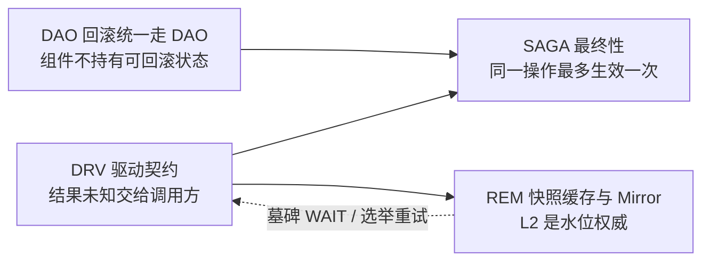

# v1.23.0 说明 · SAGA / DRV / DAO / REM

v1.19.2 → v1.23.0 双文档的“说明”部分，覆盖四个主题：saga 最终性（SAGA）、Redis / Mongo 驱动契约（DRV）、回滚统一走 DAO（DAO）、remoteentity 快照缓存与 Mirror（REM）。
写给维护者阅读，也让 review agent 能按编号定位。每条的代码位置、不变量、测试与 review 检查点在实现文档 [impl-saga-drv-dao-rem.md](impl-saga-drv-dao-rem.md) 的同编号条目里。

- **基准**：发版提交 `02c8a10d`；“v1.23.0（本版）”指 v1.22.0 之后的提交。
- **原话**：维护者原话以 [DECISIONS-PENDING](../../review/DECISIONS-PENDING-2026-10-05.md) 各轮“维护者决定”表为准，feature 记录里有更完整的原话时一并引用。
- **不在本部分**：App 单实例锁 / 停机 / readyz（APP）、业务时钟（CLK）、严格配置 A4 / B10（CFG）、skill 编译器（SKILL）、N01～N15 非核心修复（NONCORE）、Ops 与指标（OPS）、门禁脚本（TOOL）。

## 一页总览

### 版本时间线（本部分）

| 版本 | tag 提交 | 日期 | 本部分首发的条目 |
| --- | --- | --- | --- |
| v1.20.0 | `999dc672` | 2026-10-05 | （本部分无） |
| v1.20.1 | `be7407ab` | 2026-10-05 | [SAGA-1](#saga-1)、[SAGA-2](#saga-2)、[SAGA-3](#saga-3)、[DRV-1](#drv-1)、[DRV-2](#drv-2) |
| v1.20.2 | `c85d4565` | 2026-10-06 | [SAGA-4](#saga-4)、[SAGA-6](#saga-6)、[DRV-3](#drv-3)、[DAO-1](#dao-1)、[REM-1](#rem-1) |
| v1.21.0 | `4881f2b7` | 2026-10-06 | [SAGA-7](#saga-7)、[SAGA-8](#saga-8)、[SAGA-9](#saga-9)、[SAGA-10](#saga-10)、[DAO-2](#dao-2)、[REM-2](#rem-2)、[REM-3](#rem-3)、[REM-4](#rem-4)、[REM-5](#rem-5)、[REM-6](#rem-6) |
| v1.22.0 | `9bf690fb` | 2026-10-06 | [REM-7](#rem-7)、[REM-8](#rem-8) |
| v1.23.0（本版） | `02c8a10d`（本文基准；tag 由发版提交打） | 2026-10-06 | [SAGA-5](#saga-5)、[SAGA-11](#saga-11)、[SAGA-12](#saga-12)、[SAGA-13](#saga-13)、[DRV-4](#drv-4)、[DRV-5](#drv-5)、[DRV-6](#drv-6)、[DAO-3](#dao-3)、[REM-9](#rem-9)、[REM-10](#rem-10)、[REM-11](#rem-11)、[REM-12](#rem-12)、[REM-13](#rem-13) |

### 主题地图



- **DRV** 是底座：驱动不再自动重放写命令，“确定没执行”才重发，提交结果未知用专用哨兵报给调用方。SAGA 的 Mongo 收件箱、REM 的 L2 写入都按这个口径分类错误。
- **SAGA** 收紧“同一步骤操作最多生效一次”：先是原生步骤（U-0280），再是协调器按代际收 completion（B1），然后把“离开当前步骤”收成一个出口（方向①），最后让 Mongo 步骤走同一套收件箱契约（方向②），代价是每次尝试两次落盘提交，维护者接受。
- **DAO** 是 Nest 事务回滚的统一口径：组件的可回滚状态一律进 DAO；skill Runtime 是写明的例外；buff 投影经组件入口写进 DAO。
- **REM** 先定水位权威（共享 L2，B2），再按 Mirror 方案补只读契约、共享 SnapshotClient、可确认订阅、首载缓冲、兴趣代际与配额、kit 装配与 codegen，最后是本机替代实测与三条观察（O-M6-1 / 3 / 6）。

### 条目总表

| 编号 | 一句话 | 首发 | 行为变化 / 兼容破坏 | 需业务改动 |
| --- | --- | --- | --- | --- |
| [SAGA-1](#saga-1) | 过期且无回执的原生步骤命令直接 ack，不再无限 nak 占满共享 durable（U-0281） | v1.20.1 | 是（nak → ack） | 否 |
| [SAGA-2](#saga-2) | 原生步骤操作实例收件箱：同一操作最多生效一次、租约封顶到命令截止、放弃后迟到成功告警，含两处复核修复（U-0280） | v1.20.1 | 是（跨尝试回放 / 等待 / 接替；投影积压时步骤停住；持久格式只增） | 否（运维按 T-226 处置告警） |
| [SAGA-3](#saga-3) | 步骤超时与重试预算由配置 `saga.step_defaults` / `saga.steps` 提供 | v1.20.1 | 是（零值预算由 `Register` 补齐；写错配置 `Init` 失败） | 否（可选配置） |
| [SAGA-4](#saga-4) | 步骤覆盖原样查不到时按小写回退（RR-20261005-NC-194） | v1.20.2 | 是（无定义时大小写混写的覆盖开始生效） | 否 |
| [SAGA-5](#saga-5) | 步骤预算拒绝只差大小写的类型 / 步骤名（RR-20261006-06，收尾 A12） | v1.23.0（本版） | 是，收紧（这类命名启动失败） | 仅有这类命名的工程要改名 |
| [SAGA-6](#saga-6) | 协调器接收 completion 时核对代际、迟到告警去重、补偿方向人工 Compensate 换代（B1） | v1.20.2 | 是，收紧 | 否（运维：补偿方向 `ManualRequired` 用 `Resume`） |
| [SAGA-7](#saga-7) | 定义缺失 fence 时退避中的步骤同样记为放弃（RR-20261005-NC-250） | v1.21.0 | 是（迟到成功由丢弃改为 ack + 告警） | 否 |
| [SAGA-8](#saga-8) | 离开当前步骤收成一个转移 `stepTransition` + 守卫测试与补漏（saga 方向 ①） | v1.21.0 | 否（唯一差异在正常不可达路径） | 否 |
| [SAGA-9](#saga-9) | Mongo 步骤纳入操作实例收件箱（两事务、`_claims` 集合），结果消费者终态分类统一（saga 方向 ②、O-S5-1、O-S5-3） | v1.21.0 | 是（Mongo 步骤延迟约翻倍；新集合；普通结果流 Term 4 种错误） | 业务：事务外副作用仍需按 `IdempotencyKey` 幂等；运维：建议 `transactionLifetimeLimitSeconds=20` |
| [SAGA-10](#saga-10) | `ErrDefinitionMissing` 改为可重试 nak；回放不交还 claim 列为观察 | v1.21.0 | 是（Term → nak 退避） | 否 |
| [SAGA-11](#saga-11) | Mongo 步骤延迟分析，维护者选 A（接受两次落盘提交） | v1.23.0（本版） | 否（无生产代码改动） | 否 |
| [SAGA-12](#saga-12) | saga Mod 启动时校验 `saga.completion_receipt_ttl > dataengine.effects.max_age`（O-S5-2） | v1.23.0（本版） | 是，收紧（不满足拒绝启动） | 仅调过这两个键的部署 |
| [SAGA-13](#saga-13) | 真实 NATS 上 nak 退避 / `MaxDeliver` 实测，`TestAssemblyConsumesNativeNestCompletionEffects` 偶发失败根因 | v1.23.0（本版） | 否（只改测试） | 否 |
| [DRV-1](#drv-1) | Redis 脚本（Eval / EvalSha / EvalBatchDurable）回复丢失不再被驱动重放，一次调用至多执行一次（RR-20261005-NC-100） | v1.20.1 | 是（收紧）：脚本回复丢失返回传输错误 | 否 |
| [DRV-2](#drv-2) | `mongo.transaction_timeout` 端到端约束事务含提交；EndSession 补发的 abort 有 5s 上限；退避中到期保留最后一次事务错误（RR-20261005-NC-101） | v1.20.1 | 是：分区时更早返回错误，该错误可能已提交 | 否 |
| [DRV-3](#drv-3) | A2：Redis 写 / 含写 pipeline / EvalBatchDurable / DistLock 不经驱动重放，只在 `IsDefinitelyNotExecuted` 时重发；Mongo 提交后失败包 `ErrCommitResultUnknown`；契约表进仓 | v1.20.2 | 是（收紧）：写命令回复丢失返回结果未知；Mongo 错误文本多前缀 | 否（新增调用点按契约表 §6 核对） |
| [DRV-4](#drv-4) | O-M6-3：L2 墓碑写入后同连接 WAIT 副本（驱动能力 `EvalReplicated`），只计数 / Warn 不回滚；新键 `snapshot_l2_tombstone_wait_replicas` / `_timeout` | v1.23.0（本版） | 是：删除 Remote 实体最多多等 50ms（缺省） | 否（运维可调键） |
| [DRV-5](#drv-5) | 驱动与 Mod 的 Close 统一口径：重复 Close 返回 nil、并发后到者等第一个、关闭后返回已关闭错误；`operation.Serial`（第十二轮 + RR-20261006-10） | v1.23.0（本版） | 是：单机 Redis 重复 Close 改为 nil；etcd 关闭后立即 `ErrClosed`；DistLock 遇 `ErrClosed` 不再记未知 | 依赖“第二次 Close 报错”的调用方需改判断 |
| [DRV-6](#drv-6) | O-M6-5：启动建索引遇 Mongo 换主错误码有界重试（每个索引 10 次 × 1s） | v1.23.0（本版） | 是：撞上选举时启动变慢而非失败 | 否 |
| [DAO-1](#dao-1) | A1：回滚统一走 DAO，组件不再持有可回滚状态、不再登记 undo；`nopersist,nosync` 字段有 mutator；glsvet A1 提示 | v1.20.2 | 是（规范）：组件写法改变；生成 DAO 只增方法；持久格式不变 | 新组件按规范；已生成工程不迁移 |
| [DAO-2](#dao-2) | B4：skill Runtime 状态不进事务，写成约束 + 守卫测试 | v1.21.0 | 否（代码行为不变） | 是（设计约束）：先校验后推进 Runtime，扣费交给 Runtime commit |
| [DAO-3](#dao-3) | combatcomponent 属性投影入口 `ProjectAttributes`：投影写 DAO vitals，随 DAO 回滚 | v1.23.0（本版） | 只新增 API；装了投影后被投影字段以投影为准 | 想让 buff 影响伤害的业务写投影函数 |
| [REM-1](#rem-1) | 共享 L2 为快照水位权威，L1 只缓存 L2 确认过的版本；`remote_entity.cached_max_staleness`；复制消息带 `published_at`，过老快照不再接受（O5） | v1.20.2 | 是（收紧：未确认 / 超上限条目先重新确认；L2 `DeleteAtVersion` 被拒返回 `ErrStaleWrite`） | 否 |
| [REM-2](#rem-2) | Mirror 第 1～3 步：`RemoteSnapshotReadOnly` / `RemoteObservation` / `RemoteMirrorReader`、唯一读出口 `Read` + `Covers`、共享 `SnapshotClient` | v1.21.0 | 是（收紧：Monotonic 只回源一次；Cached 最低版本不满足返回 `ErrRemoteSnapshotStale`；Linearizable 需声明；停止后 `ErrSnapshotClientStopped`） | 否（只增 API） |
| [REM-3](#rem-3) | nest `allow_stale` 的 Cached Remote 访问照旧接受低于 `min_version` 的快照 | v1.21.0 | 否（回到 Mirror 之前） | 否 |
| [REM-4](#rem-4) | Mirror 第 4 步：可确认订阅（JetStream DeliverNew，普通 NATS 退化按需）、首载缓冲（64，溢出再回源）、兴趣代际锁内分配与撤销水位 | v1.21.0 | 是（普通 NATS 不再推送；JetStream 换新 durable） | 运维：可删旧 DeliverAll durable |
| [REM-5](#rem-5) | O4 兴趣容量按 consumer 配额：`snapshot_interest_per_consumer`、`ErrInterestQuotaExceeded` / `ErrInterestRegistryFull`、指标 | v1.21.0 | 是（按 consumer 拒绝，可识别、计数） | 否 |
| [REM-6](#rem-6) | Mirror 第 5 步：kit `RemoteMirrorMod`、`remote_entity.mirror.shutdown_timeout`、codegen `//roost:mirror`、`remote=mirror` 迁移诊断、公会摘要两进程样例 | v1.21.0 | 是（生成器对 `remote=mirror` 报错；只读产物需 core ≥ v1.21.0） | 是：`remote=mirror` 改 `//roost:mirror`（仓内无使用方）；装只读 Mod 要调大停机总预算 |
| [REM-7](#rem-7) | RR-20261006-01：删除提交确认时实例已被清空，确认视为完成、照常发布墓碑 | v1.22.0 | 是（strict 删除从“结果未知”变成功并发布） | 否 |
| [REM-8](#rem-8) | Mirror 第 6 步本机替代：`scripts/mirror-local.sh` 私有依赖进程，两进程 7 类故障 0 违例；v1.20.2 对照 n=6 无显著差别 | v1.22.0 | 否（测试设施） | 否 |
| [REM-9](#rem-9) | O-M6-1：owner 启动在 `remote_entity_interest_refresh` 广播“请重新续租”，合并、间隔 ≥ 1s | v1.23.0（本版） | 是（改善；wire 只新增主题） | 否 |
| [REM-10](#rem-10) | O-M6-6：同 sid 重启按进程代际令牌立即接管上一代留下的 Remote 实体锁 | v1.23.0（本版） | 是（开单实例锁时 token 格式变长；只接管同持有者上一代） | 否（需 `singleton.enabled=true` 才受益） |
| [REM-11](#rem-11) | L2 落后权威的上界：`snapshot_l2_ttl + cached_max_staleness`（core 缺省约 5m30s），保持不加后台补写 | v1.23.0（本版，文档） | 否 | 否 |
| [REM-12](#rem-12) | Redis Cluster 迁槽 ASK / MOVED 下 L2 读写与墓碑 WAIT 实测；mirror-local Cluster 就绪判定补“每个主节点有 online 副本” | v1.23.0（本版） | 否 | 否 |
| [REM-13](#rem-13) | 生成配置写出 `remote_entity` 五个新键；生产化不再把墓碑 WAIT 副本数改成 3 | v1.23.0（本版） | 否（只影响新生成工程） | 否 |

### 行为变化 / 兼容破坏

按主题列出升级后能看到的变化（来自各条“现在的行为 / 兼容与迁移”）。标“收紧”的是以前能过、现在报错或拒绝的。

**SAGA**

- [SAGA-1](#saga-1)：运维无需改动；旧版本残留在 durable 里的过期旧尝试，升级后第一次投递即被 ack。
- [SAGA-2](#saga-2)：运维要认识新告警 `saga.completion.late_after_abandon_total{saga_type,phase}` 与 ERROR `saga: step succeeded after the coordinator abandoned it; the effect is not compensated`，按 TROUBLESHOOTING T-226 核对业务数据（Failed 且无完成步骤可 `Resume`，否则手工撤销）。投影积压超过步骤 `Timeout` 时步骤会停住而不是重复执行：调大 `Timeout` 或解决 Mongo 变慢，不要调大 `LeaseDuration`。契约要全部步骤进程与协调器升级后才成立（滚动升级期间按旧语义）。业务（已生成工程）无需改动。
- [SAGA-3](#saga-3)：生成工程可在服务配置里写 `saga.step_defaults` / `saga.steps.<type>.<step>`；`saga.steps` 写错类型 / 步骤 / 字段、取值越界或时长不带单位时启动失败。已生成工程 `definition.go` 里写死的预算照旧生效，配置覆盖优先。
- [SAGA-4](#saga-4)：无需改动；以前静默不生效的大小写混写覆盖现在生效（实际预算可能因此改变）。
- [SAGA-5](#saga-5)：注册了只差大小写的 saga 类型名或步骤名的工程，saga Mod 启动失败，需改名。
- [SAGA-6](#saga-6)：运维——补偿方向 `ManualRequired` 修复原因后用 `Resume`（`Compensate` 在这种状态下等价，进入新一生）；新指标 `saga.completion.stale_incarnation_total{saga_type,phase}` 是 Resume 之后的正常现象，不是故障。自定义 Store 可选实现 `LateSuccessAlarmStore`，否则每次送达都告警。
- [SAGA-7](#saga-7)：无需改动。
- [SAGA-8](#saga-8)：无需改动；在 saga 包里新增协调器写记录的出口必须经 `stepTransition`，否则守卫测试失败。
- [SAGA-9](#saga-9)：业务——Mongo 步骤 handler 的业务写必须经传入的事务 ctx，才享有“同一操作最多一次”；调用别的服务的步骤仍要按 `IdempotencyKey` 幂等。运维——新集合 `<收件箱集合>_claims`（启动时自动建索引）；Mongo 服务端建议 `transactionLifetimeLimitSeconds=20`；Mongo 步骤吞吐约为之前的一半，按业务量评估。直接调用 `MongoCommandInbox.Handle` 的代码会多看到 `ErrCommandExpired` 与可重试的在途错误。
- [SAGA-10](#saga-10)：无需改动；配置错误导致定义永不注册时，结果消息在步骤超时前按 nak 退避重投、占一个 `MaxAckPending` 位。
- [SAGA-11](#saga-11)：无需改动；对延迟敏感的流程可改用原生步骤或不走 saga。
- [SAGA-12](#saga-12)：运维——若把 `dataengine.effects.max_age` 调到不小于 `saga.completion_receipt_ttl`（缺省 168h / 720h），启动失败，需调大回执 TTL 或调小流保留期（T-281）。
- [SAGA-13](#saga-13)：无。

**DRV**

- [DRV-1](#drv-1)：业务调用 Redis 脚本时，回复丢失现在返回传输错误（结果未知）；依赖驱动“救回”的代码会看到错误。业务按请求 ID / 版本 CAS 处理，无需改代码。
- [DRV-2](#drv-2)：运维注意网络分区下事务在 `mongo.transaction_timeout`（缺省 30s）内返回错误（回调失败另加至多 5s）；5s 内没送达的 abort 留下的服务端事务持锁到 `transactionLifetimeLimitSeconds`（缺省 60s），期间同文档写入会 WriteConflict 重跑。
- [DRV-3](#drv-3)：业务 Redis 写命令（计数、入队、SETNX、带写 pipeline、Lua）在网络抖动时会返回 EOF / i/o timeout（TROUBLESHOOTING T-259）；新写的 Redis 调用点必须按 `redis/driver/README.md` §6 核对：写错误按结果未知处理，返回值只在 `err == nil` 时可信，多步写第一步未知时仍补后续保护（如 EXPIRE），只想在确定没执行时重试的用 `driver.IsDefinitelyNotExecuted`。Mongo 调用方见到 `fmongo.ErrCommitResultUnknown` 必须按持久回执裁决；判断是否可能已提交不要再看 `UnknownTransactionCommitResult` 标签或 `DeadlineExceeded`。业务不要经 `Client.Raw()` 发写命令。
- [DRV-4](#drv-4)：运维可调 `remote_entity.snapshot_l2_tombstone_wait_replicas`（0 关闭）与 `_timeout`（(0, 1s]）；`result=short|error` 增长时查副本延迟（T-277）；要彻底避免删除复活需部署约束 `min-replicas-to-write`。已有工程配置不回写，缺省值生效。
- [DRV-5](#drv-5)：工具 / 集成测试若靠“第二次 Close 返回 `ErrClosed`”判断已关闭，改用 `errors.Is(<命令错误>, goredis.ErrClosed)`；并发 Close 的后到者现在会等（最长到自己的 ctx）。新写的驱动 / Mod 停止入口按 roost-coding 用 `internal/operation.Serial`。
- [DRV-6](#drv-6)：无需改动；运维看到启动慢几秒且 `mongo_ensure_index_election_retries_total` 非零，是启动撞上了选举（T-282）。

**DAO**

- [DAO-1](#dao-1)：业务新写实体组件时，事务会改的状态放进 DAO（不该落库的用 `nopersist,sync` / `nopersist,nosync`），派生值由唯一 derive 在加载与改源字段的事务里写；不要在组件方法里调 `RecordUndo` / `RecordUndoToken` / `DeferRollback`（glsvet 会打 `hint:`）。已生成工程的旧 `captureRollback` 仍可用；需要新模板时 `roost project sync`。
- [DAO-2](#dao-2)：在 nest handler 里推进 `skill.Runtime` 的业务：会失败的业务检查放在 Runtime 调用之前；不要在 Runtime 之外手工扣费；提交被拒 / 结果未知需要严格一致的玩法，提交确认后再推进 Runtime 或用 `Checkpoint` / `RestoreRuntime`。
- [DAO-3](#dao-3)：要让 buff / 属性修饰影响伤害的业务，写一个纯投影函数并在实体工厂里 `component.ProjectAttributes(fn)`；装了投影后 `InitCombatant` 里给的被投影字段会被覆盖；投影函数不要改 `Health` / `Shield` / `Alive`。

**REM**

- [REM-1](#rem-1)：L2 断网时写入的快照不再直接服务 Cached 读，要回源权威；超过 `cached_max_staleness`（缺省 = `snapshot_cache_ttl`）的条目每个窗口多一次 HGET 或回源。L2 与权威都失败时读返回错误。业务无需改；运维可按需调 `cached_max_staleness`。滚动升级期间旧发布者不带 `published_at`。
- [REM-2](#rem-2)：依赖 `Cached + minVersion` 交出低版本的调用方会收到 `ErrRemoteSnapshotStale`；`Linearizable` 只在 loader 声明线性化时开放（Manager 照旧声明）；`Assembly.Stop` 后读返回 `ErrSnapshotClientStopped`。
- [REM-4](#rem-4)：普通 NATS（kit 缺省 transport）部署不再收快照推送，新版本最晚在陈旧上限后读到，启动多一条 Warn；JetStream 部署快照主题换新 DeliverNew durable，**运维**可删旧 DeliverAll durable。
- [REM-5](#rem-5)：`snapshot_interest_subs` 语义变为每节点内存上限；单 consumer 超配额的 key 无推送、按需读取。consumer 节点多时**运维**按“consumer 数 × 配额 ≤ subs”调值。
- [REM-6](#rem-6)：**业务**：`//roost:entity remote=mirror` / `lifetime=mirror_cache` 生成报错，改用普通 struct 上的 `//roost:mirror entityKind=… coll=…`；**运维**：装 `RemoteMirrorMod` 的服务手工调大 `shutdown.total_timeout` 与部署宽限期（StopBudget 不计入生成器总预算）。生成器 Core 下限 v1.21.0。
- [REM-7](#rem-7)：strict 删除 Managed Remote 实体返回成功并发布墓碑（之前“结果未知”）。
- [REM-9](#rem-9)：JetStream 上推送开着的节点多一个 DeliverNew durable（续租请求主题）。
- [REM-10](#rem-10)：开 App 单实例锁时 Remote 锁 token 变长（Redis `owner`、Mongo `_grant_token`）；混跑时新旧都退回 TTL。
- [REM-13](#rem-13)：新生成工程配置多五个键；已有工程不回写。

### 需要业务或运维改动的清单

| 编号 | 谁 | 要做什么 | 不做的后果 |
| --- | --- | --- | --- |
| [SAGA-2](#saga-2) | 运维 | 认识新告警 `saga.completion.late_after_abandon_total{saga_type,phase}` 与 ERROR“step succeeded after the coordinator abandoned it”，按 TROUBLESHOOTING T-226 核对业务数据；投影积压超过步骤 `Timeout` 时调大 `Timeout` 或处理 Mongo 变慢，不要调大 `LeaseDuration` | 放弃后迟到生效的副作用不会被补偿，只有告警 |
| [SAGA-3](#saga-3) | 业务（可选） | 需要按环境调步骤预算时写 `saga.step_defaults` / `saga.steps.<type>.<step>`；写错类型 / 步骤 / 字段、取值越界、时长不带单位会启动失败 | 无（不写就用 `definition.go` 里的预算） |
| [SAGA-5](#saga-5) | 业务 | 注册了只差大小写的 saga 类型名或步骤名（如 `gift_item` 与 `Gift_Item`）的工程改名 | saga Mod 启动失败 |
| [SAGA-6](#saga-6) | 运维 | 补偿方向停在 `ManualRequired` 的 saga 修复原因后用 `Resume`（`Compensate` 在该状态下等价，进入新一生）；`saga.completion.stale_incarnation_total` 在 Resume 之后增长是正常现象 | 无 |
| [SAGA-9](#saga-9) | 业务 | Mongo 步骤 handler 的业务写必须经传入的事务 ctx 才享有“同一操作最多生效一次”；调用别的服务的步骤仍按 `IdempotencyKey` 幂等 | 事务外的写可能跨尝试重复 |
| [SAGA-9](#saga-9) | 运维 | 新集合 `<收件箱集合>_claims`（启动自动建索引）；建议 Mongo 服务端 `transactionLifetimeLimitSeconds=20`（O-S5-3）；Mongo 步骤吞吐约减半，按业务量评估（维护者已接受，见 [SAGA-11](#saga-11)） | kill -9 遗留的事务持锁到服务端上限（缺省 60s） |
| [SAGA-12](#saga-12) | 运维 | 若调过 `dataengine.effects.max_age` / `saga.completion_receipt_ttl`，保证 `completion_receipt_ttl > effects.max_age`（缺省 720h > 168h） | 启动失败（T-281） |
| [DRV-3](#drv-3) | 业务 | 新写的 Redis 调用点按 `redis/driver/README.md` §6 核对：写错误按结果未知处理，只想在确定没执行时重试的用 `driver.IsDefinitelyNotExecuted`；Mongo 见到 `fmongo.ErrCommitResultUnknown` 按持久回执裁决；不要经 `Client.Raw()` 发写命令 | 网络抖动时重复执行或误判未提交 |
| [DRV-4](#drv-4) | 运维（可选） | 按需调 `remote_entity.snapshot_l2_tombstone_wait_replicas`（0 关闭）/ `_timeout`（(0, 1s]）；`result=short|error` 增长时查副本延迟（T-277）；要消除删除复活需部署约束 `min-replicas-to-write` | 无（缺省 1 / 50ms 生效） |
| [DRV-5](#drv-5) | 工具 / 测试作者 | 靠“第二次 Close 返回 `ErrClosed`”判断已关闭的代码改用命令错误 `errors.Is(err, goredis.ErrClosed)`；新写的驱动 / Mod 停止入口用 `internal/operation.Serial` | 判断失效（单机 Redis 重复 Close 现在返回 nil） |
| [DAO-1](#dao-1) | 业务 | 新写实体组件时，事务会改的状态放进 DAO（不落库的用 `nopersist,sync` / `nopersist,nosync`），派生值由唯一 derive 写；组件方法里不调 `RecordUndo` / `RecordUndoToken` / `DeferRollback`（glsvet 打 `hint:`）。已生成工程不需迁移 | 回滚后组件内存与 DAO 不一致 |
| [DAO-2](#dao-2) | 业务 | 在 nest handler 里推进 `skill.Runtime` 时：会失败的检查放在 Runtime 调用之前；扣费交给 Runtime commit 路径；严格一致的玩法在提交确认后再推进 Runtime | handler 失败回滚后冷却 / ammo / cast 状态不回退 |
| [DAO-3](#dao-3) | 业务（可选） | 要让 buff / 属性修饰影响伤害，写纯投影函数并 `component.ProjectAttributes(fn)`；装了投影后 `InitCombatant` 里给的被投影字段会被覆盖 | buff 对伤害没有效果（与之前相同） |
| [REM-4](#rem-4) | 运维 | 普通 NATS 部署不再收快照推送（读按 `cached_max_staleness` 回源，启动一条 Warn）；JetStream 部署可删除快照主题旧的 DeliverAll durable | 普通 NATS 上读到的快照最长陈旧到上限 |
| [REM-5](#rem-5) | 运维 | consumer 节点多时按“consumer 数 × `snapshot_interest_per_consumer` ≤ `snapshot_interest_subs`”调值 | 超配额的 key 无推送、按需读取（有指标与限频 Warn） |
| [REM-6](#rem-6) | 业务 | `//roost:entity remote=mirror` / `lifetime=mirror_cache` 改为普通 struct 上的 `//roost:mirror entityKind=… coll=…`（仓内无使用方）；生成器 Core 下限 v1.21.0 | 生成报迁移错误 |
| [REM-6](#rem-6) | 运维 | 装 `RemoteMirrorMod` 的服务手工调大 `shutdown.total_timeout` 与部署宽限期（只读 Mod 的停机预算不计入生成器总预算） | 停机超预算 |
| [REM-10](#rem-10) | 运维 | 想让同 sid 重启立即接管旧锁，需 `singleton.enabled=true`；开启后 Remote 锁 token 变长，新旧混跑时退回按 TTL | 不开则照旧等 `remote_entity.lock_ttl` |


## SAGA：saga 最终性

<a id="saga-1"></a>
### SAGA-1 过期且无回执的原生步骤命令直接 ack（U-0281）

| 首发 | 类型 | 行为变化 / 兼容破坏 | 需业务 / 运维改动 | 实现 |
| --- | --- | --- | --- | --- |
| v1.20.1 | 缺陷修复（U-0281，无 RR 号，T-225） | 是：原生步骤消费者对“已过 `DeadlineAt`、没有回执”的命令由无限 nak 改为 ack；无 API / 持久格式 / wire 变化 | 否 | [SAGA-1](impl-saga-drv-dao-rem.md#saga-1) |

**结论**：`SubscribeDataEngineStep` 收到已过截止、查不到自己回执的命令时不再返回 `context.DeadlineExceeded`（按退避 nak 到 `MaxDeliver`），而是计数、记 Info 后 ack；共享 durable 的 `MaxAckPending` 不会再被这类旧尝试占满。

**背景**：真实进程演练 drill6（2026-10-05，代码 `47a9132c`，生成 game-demo，两个 sid + kill -9 / SIGSTOP）。sid 1300 宕机期间，赠礼 debit 步骤的各次尝试投到 sid 1302 被 `Admit` 拒绝并 nak，每次 5s 后过期；这些过期旧尝试一直留在 durable 里重投。修前过期分支只在有回执时返回 nil，没有回执就返回 `context.DeadlineExceeded`，它不是 `nats.Permanent`，适配层按 250ms～30s 退避 nak 到 `MaxDeliver=25000`（约 8.7 天）。演练证据（原样，出自 [U-0281 记录](../../bugfix/U-0281-saga-expired-command-nak-forever.md)）：

```text
consumer game-gift-debit  delivered=1028 ack_floor=436 num_ack_pending=256 num_redelivered=256 num_waiting=3 num_pending=512
fetch ... stream_seq=469 delivered=29 published=14:28:44.544 data={"version":1,"command":{"id":"gift-100068-demo-100068-1791-7:1:0:2",...
```

`num_ack_pending` 停在 256 上限十分钟不动，之后两个 sid 新发的赠礼全部超时 Failed。同一演练的另一缺陷是 [SAGA-2](#saga-2)（U-0280）。

**维护者决定**：无决定轮次，按 bugfix 流程修复。记录写明的授权原文：

> 确认是缺陷就按先红后绿修
>
> —— [U-0281 记录](../../bugfix/U-0281-saga-expired-command-nak-forever.md)“来源”

选 ack 的理由：协调器自己拥有超时（`processClaimed` 的 `StatusWaiting` 分支按 `retryOrCompensate` 重试或补偿），不需要步骤侧对旧尝试再回答；原生尝试的结果走 WAL → 投影 → completion effect，从不经过这条命令消息，ack 不会丢掉“已提交、未投影”的尝试。没有采用：

| 方案 | 不采用的原因（记录原意） |
| --- | --- |
| 调小 `MaxDeliver` | 只缩短占位时间、不消除；默认值是为实体屏障期间的重投预算定的（RR-20260926-63） |
| 过期时 `Term` | 结果相同，但会走 ERROR 日志与 `nats.jetstream.terminal.total{reason="permanent"}` 的故障口径，而这是正常结果 |
| 上报“已过期未执行” completion | `Engine.Complete` 当时只比 `IdempotencyKey`，会被当成当前尝试的结果、错误消耗一次重试 |

**现在的行为**：

| 情形 | 处理 | 可见信号 |
| --- | --- | --- |
| 过期、有自己的回执 | 标记 claim completed 后 ack（结果随 effect 送达） | 无 |
| 过期、没有回执、同一操作实例另一次尝试已成功（[SAGA-2](#saga-2) 复核 2 起） | 经 saga 结果流重发那次成功，再 ack | 计数 `saga.step.attempt_replayed_total` |
| 过期、没有回执、也没有可重发的成功 | 不调 `Admit`、不 `Reserve`、不执行，ack | 计数 `saga.step.expired_unexecuted_total`（无标签）；Info `saga: step command expired before it ran; acknowledged without executing`（`command_id` / `saga_id` / `deadline_at`） |
| 读回执出错 | 返回错误，nak 重投（无法判断有没有回执，保持修前） | 消费者错误日志 |

Mongo 步骤路径（`SubscribeMongoStep`）本来就对过期无回执命令 ack，U-0281 只给它加了守卫用例。

**兼容与迁移**：无需改动。旧版本残留在 durable 里的这类消息，升级后的进程第一次投递到即 ack。

**已知限制 / 待外部验证**：

- 没有在真实 NATS 上重跑“durable 被占满后恢复”（drill6 的 sid 宕机场景），单测只证明消费者返回 nil（记录“未验证项”）。
- Mongo 路径边角：`AckWait` 小于步骤 `Timeout` 时同一消息可能在第一次投递提交前被重投并 ack，第一次投递发布 completion 失败后无法再重投——修前相同，默认 `AckWait` 30s 大于模板 `Timeout` 5s（记录原意）。
- 外部验证清单没有单列本项；NATS 多节点 HA 见 [E06](../../review/EXTERNAL-VERIFICATION-2026-10-06.md)。

**链接**：[实现](impl-saga-drv-dao-rem.md#saga-1) · [U-0281 记录](../../bugfix/U-0281-saga-expired-command-nak-forever.md) · [TROUBLESHOOTING T-225](../../TROUBLESHOOTING.md) · [SAGA.md](../../../SAGA.md) · [CHANGELOG v1.20.1](../../../CHANGELOG.md)

<a id="saga-2"></a>
### SAGA-2 原生步骤操作实例收件箱：同一操作最多生效一次（U-0280）

| 首发 | 类型 | 行为变化 / 兼容破坏 | 需业务 / 运维改动 | 实现 |
| --- | --- | --- | --- | --- |
| v1.20.1 | 缺陷修复（U-0280，T-226；维护者 2026-10-05 决定 A + B + C'；含两处独立复核修复） | 是：原生步骤跨尝试回放 / 等待 / 接替；claim 租约封顶到命令截止；放弃后迟到的成功记 ERROR；原生 handler 返回值不再校验；claim 与 tombstone 持久格式只增 | 运维：新告警按 T-226 处置；投影积压超过步骤 `Timeout` 时步骤停住而不是重复执行；契约要全部步骤进程与协调器升级后才成立。业务：无需改（已生成工程不迁移） | [SAGA-2](impl-saga-drv-dao-rem.md#saga-2) |

**结论**：框架把原生 saga 步骤的“最多生效一次”从“同一命令（`CommandID`）”提升到“同一操作实例（`IdempotencyKey` = saga + 方向 + 步骤，跨 Resume 代际）”；每次尝试只可能在协调器等它的窗口内生效；协调器放弃之后才到的成功不再静默，而是 ERROR + 计数。

**背景**：drill6（2026-10-05，代码 `47a9132c`）里 kill -9 / 失锁后同一步骤同一方向出现两个尝试号的回执——重复扣款、重复退款（道具复制）、已扣款却 Failed（道具丢失）。统计（原样，出自 [drill6-duplicate-steps-summary.txt](../../bugfix/evidence/U-0280/drill6-duplicate-steps-summary.txt)）：

```text
6b-A2 sagas=73 status={"4":18,"5":11,"6":44} debit_receipts>1=1 refund_receipts>1=0 failed_with_debit_receipt=4 manual_required=0
6b-A3 sagas=20 status={"4":10,"5":10} debit_receipts>1=3 refund_receipts>1=2 failed_with_debit_receipt=0 manual_required=0
6b-B sagas=20 status={"4":10,"5":9,"6":1} debit_receipts>1=3 refund_receipts>1=2 failed_with_debit_receipt=1 manual_required=0
```

根因是三处事实组合：(1) claim 与回执按 `CommandID`，而 `CommandID = operationKey:attempt` 每次尝试都不同，尝试 k+1 看不到 k；(2) 命令截止只有一次尝试的 `Timeout`（模板 5s），claim 租约却是 `LeaseDuration`（分钟级），已写进 WAL 的 k 在截止后、租约内重放仍会投影生效；(3) 协调器对迟到结果：等 k+1 时收下 k 的结果（k+1 再执行一次）、退避期间 `ErrNotWaiting` 丢弃、放弃之后按 tombstone 计 `duplicates` 吞掉。不需要崩溃，投影积压超过步骤 `Timeout` 时同一进程上也成立。v1.19.2 上同样存在，不是 15 次重试预算引入的。

**维护者决定**：记录“实施”一节写的维护者决定（原样，出自 [U-0280 记录](../../bugfix/U-0280-saga-step-reexecuted-after-crash.md)）：

> 维护者决定：A + B + C'，并补充“**框架重试的次数可以是一个配置，一次操作可以有多次尝试**”；已生成工程不迁移，仓库内模板与生成物同步。

修法前的追加指示（同一记录“来源”，原样）：

> **修法若要改设计、公开语义或协调器状态机，写完方案就停下交回**

所以 `50e9a4e8` 只提交方案与确定性复现，`054fdd66` 才实施。各候选与取舍（记录“修法候选与取舍”的摘要）：

| 候选 | 结论 | 理由 |
| --- | --- | --- |
| A 收件箱按操作实例互斥并回放 | 采用 | 解决 (a)(b) 与投影积压；承诺在框架里兑现，不靠每个模板自己做对 |
| B claim 租约封顶到命令截止 | 采用 | 把“放弃后生效”收窄到“截止前已投影、放弃后才送达”；代价是投影积压超过 `Timeout` 时步骤停住（维护者接受） |
| C' 放弃后迟到的成功只告警 | 采用 | 让剩余窗口可见；不重开终态 |
| C 自动补偿迟到成功 | 未采用 | 改协调器状态机、要重开 Failed / Compensated，影响所有使用方，另行决定 |
| E 模板按 `IdempotencyKey` 做业务幂等 | 未采用 | 原生路径提交点在投影，业务层要理解屏障与跳过才能做对，模板已证明容易做错 |
| “超时不换 CommandID”简化方向 | 未采用 | 要改 `commandDigest`（摘要含 `DeadlineAt` / `Attempt` / `CreatedAt`，用在回执、claim、`BindCommand`、lease fence 上）、`MaxAttempts` 含义要重定义、Resume 仍会重做 |
| F 协调器只收当前尝试的结果 | 未采用 | 更糟：k 的真实结果被丢，k+1 照样执行 |

**现在的行为**（契约正文在 [SAGA.md「原生步骤执行契约」](../../../SAGA.md)）：

1. 最多生效一次的单位是操作实例；一次操作最多 `MaxAttempts` 次尝试（配置，见 [SAGA-3](#saga-3)），跨 Resume 代际仍是同一实例。
2. claim 租约 `lease_until = min(now + LeaseDuration, Command.DeadlineAt)`（新建与接管都封顶）；截止后才投影的记录 lease fence 不匹配，被跳过。已过截止的命令 `Reserve` 返回 `saga.ErrCommandExpired`。
3. 新尝试先看同一操作实例的其他尝试：成功（任何一生）或本生的拒绝 → 不执行，把那次 completion 经 saga 结果流重发；可重试失败 → 照常执行；pending 且租约有效 → nak 等待；pending 且租约过期 → 接替（`superseded` + `lease_token+1`），被接替尝试的迟到投递 ack 不执行。
4. 协调器放弃（重试用尽、saga 截止、人工 `Compensate`、定义缺失）后才到的成功：ERROR + 计数，不重开终态、不自动补偿；以失败关闭（可重试失败用尽、拒绝）也算放弃关闭（复核 1）。
5. 过了自己截止、不会执行的投递，ack 前把同一操作实例已生效的成功重发（复核 2）。

可见信号：

| 类别 | 名字 | 含义 |
| --- | --- | --- |
| 错误 | `saga.ErrCommandExpired`（导出） | 命令已过截止，收件箱不再分配租约；消费者 ack |
| 错误 | 包内 `errOperationAttemptInFlight` | 另一次尝试租约有效；消费者返回它，nak 重投（可重试） |
| 错误 | 包内 `errAttemptSuperseded` | 本尝试已被接替；消费者 ack |
| 指标 | `saga.completion.late_after_abandon_total{saga_type,phase}` | 放弃之后迟到的成功（B1 起按（操作，代际）只计一次，见 [SAGA-6](#saga-6)） |
| 指标 | `saga.step_inbox.superseded_total` | 接替次数 |
| 指标 | `saga.step.attempt_replayed_total` | 回放 / 重发同一操作已有结果的次数 |
| 日志 | ERROR `saga: step succeeded after the coordinator abandoned it; the effect is not compensated` | 需要运维按 T-226 核对业务数据 |
| Stats / 健康 | `Engine.Stats().LateAfterAbandon`；kit saga 健康消息多 `late_after_abandon=` | 同上 |

选项语义变化：`DataEngineStepInboxOptions.LeaseDuration`（缺省 1 分钟）现在只是上限，实际租约不超过命令截止；`LeaseDuration > AckWait` 的订阅校验保留。

**兼容与迁移**：

- 公开 API 只增：`saga.StepBudget` / `StepBudgets` / `StepKey` / `DefaultStepBudget`、`Options.StepBudgets`、`Stats.LateAfterAbandon`、`OperationClosure` / `CompletionHistory` / `CompletionHistoryStore`（可选接口，`Store` 不变）、`ErrCommandExpired`、`MongoStore.CompletionHistory`；kit `StepBudgetsFromConfig`。
- 持久格式只增：`_dataengine_inbox_claims` 的 claim 多 `operation_key` / `incarnation` / `superseded_by` 与 `superseded` 状态、新索引 `by_operation`、守卫文档（`namespace=saga-step-op`）；`_saga_operations` tombstone 多 `closure`（`result` / `abandoned`）。wire（`WireVersion=1`）与摘要不变。
- 行为收紧：投影积压超过步骤 `Timeout` 时步骤停住（修前是重复执行）；原生 handler 返回值不再校验（修前零值 `Completion` 让每次成功后多一次 nak）。
- 混跑：契约只在全部步骤进程与协调器升级后成立（旧 claim 没有 `operation_key`、租约不封顶；旧 tombstone 没有 `closure`，按“未知”不告警）。已生成工程不迁移，模板不再需要业务幂等。

**已知限制 / 待外部验证**：混跑没有实跑；“截止前已投影、放弃后才送达”只在单测里构造，三轮 kill -9 没有自然出现；依赖协调器、步骤进程、投影进程时钟偏差远小于 `Timeout`，未注入偏差实测（[E02](../../review/EXTERNAL-VERIFICATION-2026-10-06.md)）；多主机强杀见 [E13](../../review/EXTERNAL-VERIFICATION-2026-10-06.md)；新旧混跑属于“本机能做、不算外部”的待办（外部验证清单“不在本清单”一节）。租约封顶读的是步骤进程的系统时钟，与第八轮“saga 截止保留系统时钟”一致（见 CLK 部分）。

**链接**：[实现](impl-saga-drv-dao-rem.md#saga-2) · [U-0280 记录](../../bugfix/U-0280-saga-step-reexecuted-after-crash.md) · [修前红全文](../../bugfix/evidence/U-0280/formal-red-before.txt) · [kill -9 修后统计](../../bugfix/evidence/U-0280/kill9/u0280b/analysis.txt) · [TROUBLESHOOTING T-226](../../TROUBLESHOOTING.md) · [SAGA.md](../../../SAGA.md) · [CHANGELOG v1.20.1](../../../CHANGELOG.md)

<a id="saga-3"></a>
### SAGA-3 步骤超时与重试预算由配置提供

| 首发 | 类型 | 行为变化 / 兼容破坏 | 需业务 / 运维改动 | 实现 |
| --- | --- | --- | --- | --- |
| v1.20.1 | 功能变更（U-0280 实施内，`054fdd66`；维护者要求重试次数可配置） | 是：`Step` 的预算字段留空时由 `Engine.Register` 补齐（以前 `ErrInvalidDefinition`）；`saga.steps` 写错类型 / 步骤 / 字段时 saga Mod `Init` 失败 | 运维可选：按步骤调预算；`roost add saga` 生成的定义不再写预算；已生成工程不迁移 | [SAGA-3](impl-saga-drv-dao-rem.md#saga-3) |

**结论**：每个步骤的 `Timeout` / `MaxAttempts` / `BackoffMin` / `BackoffMax` 按“按步骤覆盖 > 定义里写的值 > `saga.step_defaults` > 框架默认 5s / 5 次 / 100ms..5s”逐字段取值，配置在 saga Mod `Init` 时严格校验。

**背景**：U-0280 之前，game-demo 为了让退款覆盖一次崩溃重启，生成后把 `definition.go` 里 debit 的 `MaxAttempts` 改成 15（`ac5acfbe`）——预算写死在代码里，运维调不了。

**维护者决定**：U-0280 实施时的补充要求（原样，出自 [U-0280 记录](../../bugfix/U-0280-saga-step-reexecuted-after-crash.md)“实施”）：

> 维护者决定：A + B + C'，并补充“**框架重试的次数可以是一个配置，一次操作可以有多次尝试**”；已生成工程不迁移，仓库内模板与生成物同步。

`MaxAttempts` 仍是“这次操作最多派发几次尝试”，与维护者的说法一致（这是不选“超时不换 CommandID”方向的理由之一，见 [SAGA-2](#saga-2)）。

**现在的行为**：

| 键 | 缺省 | 范围 / 校验 | 含义 |
| --- | --- | --- | --- |
| `saga.step_defaults.timeout` | 5s | 正时长，必须带单位（不带单位的数字自 RR-20261005-NC-190 起报错，见 CFG 部分） | 一次尝试等结果的时长，也是命令的 `DeadlineAt` |
| `saga.step_defaults.max_attempts` | 5 | 整数 1..1000 | 一次操作最多派发几次尝试 |
| `saga.step_defaults.backoff_min` | 100ms | 正时长 | 相邻两次尝试的最小退避 |
| `saga.step_defaults.backoff_max` | 5s | 正时长；与 `backoff_min` 合并后上限不得小于下限 | 最大退避 |
| `saga.steps.<type>.<step>.<字段>` | 无 | 字段只能是上面四个；saga Mod 拿到定义时，`<type>` / `<step>` 必须对应某个注册定义的步骤 | 按步骤覆盖，优先于定义与 `step_defaults`，作用于该类型所有版本 |

`Init` 失败的报错（源码原文）：`saga.steps.%s.%s: no registered saga %q has a step %q`、`%s.%s: unknown step budget field (want timeout, max_attempts, backoff_min, backoff_max)`、`%s: want 1..1000, got %q`、`%s: want a positive duration, got %q`；core 的 `StepBudgets.Validate` 报 `ErrInvalidDefinition`（`step budget <名字> {...}`）。`kitsaga.StepBudgetsFromConfig(cfg, definitions...)` 导出，生成工程测试用它得到与运行时相同的预算。

生成侧：`roost add saga` 生成的步骤只写名字与 topic，saga Mod 的生成配置带 `step_defaults` 与空的 `steps: {}`；game-demo 改为在 game 服务配置里写 `saga.steps.gift_item.debit.max_attempts: 15`（带理由注释）。

**兼容与迁移**：无需改动。已生成工程 `definition.go` 里写死的预算照旧生效，配置的按步骤覆盖优先于它。收紧点：`saga.steps` 下写错名字或字段、取值越界，启动即失败（以前没有这组键）。大小写相关的两处后续修复见 [SAGA-4](#saga-4)、[SAGA-5](#saga-5)。

**已知限制 / 待外部验证**：`kitsaga.NewMod()` 不带定义时无法核对 `saga.steps` 下的名字，写错的覆盖不会报错（按源码推断，记录没有单列）；只给 `steps.<type>.<step>.backoff_min` 而它大于实际生效的 `backoff_max` 时，kit 校验放行、在 `Engine.Register` 才以 `ErrInvalidDefinition: step N` 失败，报错不点名配置键（按源码推断，未验证）。无外部验证项。

**链接**：[实现](impl-saga-drv-dao-rem.md#saga-3) · [U-0280 记录](../../bugfix/U-0280-saga-step-reexecuted-after-crash.md) · [CHANGELOG v1.20.1](../../../CHANGELOG.md)

<a id="saga-4"></a>
### SAGA-4 步骤覆盖原样查不到时按小写回退（RR-20261005-NC-194）

| 首发 | 类型 | 行为变化 / 兼容破坏 | 需业务 / 运维改动 | 实现 |
| --- | --- | --- | --- | --- |
| v1.20.2 | 缺陷修复（RR-20261005-NC-194，P3，N14 审查） | 是：`kitsaga.NewMod()` 不带定义时，大小写混写的 `saga.steps` 覆盖从“静默不生效”变为生效 | 否 | [SAGA-4](impl-saga-drv-dao-rem.md#saga-4) |

**结论**：`StepBudgets.Resolve` 先按定义里原样的 `{Type, Step}` 找覆盖，找不到再按全小写找；原样写法优先。

**背景**：viper 把配置键一律转小写。saga Mod 没拿到定义时（项目没有登记 saga 时生成的就是 `kitsaga.NewMod()`，定义之后经 `Register` 登记），覆盖只能以小写键保存；`Resolve` 原样精确查找，于是 `saga.steps.GiftItem.Debit.max_attempts: 15` 对 `GiftItem` / `Debit` 不生效、步骤按默认 5 次跑，没有任何报错。修前红（原样，出自 [nc194-red.txt](../../review/evidence/noncore-review-20261005-n14/nc194-red.txt)）：

```text
--- FAIL: TestPerStepOverrideAppliesToMixedCaseNamesWithoutDefinitions (0.00s)
    step_override_case_promises_test.go:29: withDefinitions=false: GiftItem/Debit max_attempts = 5, want the configured 15 (overrides map[{giftitem debit}:{0s 15 0s 0s}])
```

**维护者决定**：无决定轮次，按 bugfix 流程修复。没采用：无定义而 `saga.steps` 非空时让 `Init` 失败——会让 `NewMod()` + `Register` 的用法完全不能按步骤覆盖（[修复记录](../../bugfix/RR-20261005-NC-194.md)）。

**现在的行为**：覆盖查找顺序为“原样 → 小写”。拿到定义的路径（生成工程正常路径）不变：已知表按小写匹配后还原成定义里的写法。

**兼容与迁移**：无需改动。

**已知限制 / 待外部验证**：只差大小写的两个类型同时登记时配置无法区分（审查 O2，本条不处理）；拿到定义时的这种冲突在 [SAGA-5](#saga-5) 改为报错，不带定义时仍会被同一条覆盖同时命中（按源码推断）。无外部验证项。

**链接**：[实现](impl-saga-drv-dao-rem.md#saga-4) · [问题](../../bug/RR-20261005-NC-194.md) · [修复记录](../../bugfix/RR-20261005-NC-194.md) · [CHANGELOG v1.20.2](../../../CHANGELOG.md)

<a id="saga-5"></a>
### SAGA-5 步骤预算拒绝只差大小写的类型 / 步骤名（RR-20261006-06，收尾 A12）

| 首发 | 类型 | 行为变化 / 兼容破坏 | 需业务 / 运维改动 | 实现 |
| --- | --- | --- | --- | --- |
| v1.23.0（本版） | 缺陷修复（RR-20261006-06，P3，收尾第 4 批 A12） | 是，行为收紧：注册了只差大小写的 saga 类型名或同一类型下只差大小写的步骤名，`SagaMod.Init` / `StepBudgetsFromConfig` 由静默成功改为报错 | 只有这类命名的工程要改名；生成器产出的全小写下划线名不受影响 | [SAGA-5](impl-saga-drv-dao-rem.md#saga-5) |

**结论**：`StepBudgetsFromConfig` 建“已知步骤表”时，同一个小写键对应两个不同原名就直接报歧义错误，不再让后注册的静默覆盖先注册的。

**背景**：已知表按小写建（viper 键只能这样对上）；`gift_item` 与 `Gift_Item` 同时登记时，`saga.steps.gift_item.debit` 的覆盖落在后注册的那个上，另一个静默拿不到，落到谁身上取决于定义顺序。修前红（原样，出自 [问题记录](../../bug/RR-20261006-06.md)）：

```text
step_budgets_test.go:116: types: err=<nil> overrides=map[{Gift_Item debit}:{0s 15 0s 0s}], want an ambiguity error
```

**维护者决定**：收尾盘点项，随第十一轮“收尾”行的决定（原样：“盘点全部未完成问题，处理完后统一发一个版本”）处理，实施状态见 [DECISIONS-PENDING](../../review/DECISIONS-PENDING-2026-10-05.md) 第十一轮表“收尾 · 第 4 批”行；收尾第 4 批记录写“维护者已授权”。取舍写在 [修复记录](../../bugfix/RR-20261006-06.md)：与 configdata 大小写敏感（v1.22.0）方向一致——不猜、直接拒绝；只要定义里有这种名字就报错，不论配置里有没有写到它（拖到“写了覆盖才报”会让同一份定义加一行配置后突然启动失败）；没有改成大小写敏感匹配，因为 viper 已把配置键折成小写，信息在读取前就丢了。

**现在的行为**：报错原文（源码 `kit/saga/step_budgets.go`）：

```text
saga definitions: types %q and %q differ only in case; saga.steps keys are case-insensitive and cannot tell them apart
saga definition %q: steps %q and %q differ only in case; saga.steps keys are case-insensitive and cannot tell them apart
```

同一个名字重复出现（同一定义传两次、同类型多个版本）不算冲突。

**兼容与迁移**：注册了只差大小写名字的工程需要改名，否则 saga Mod 启动失败。

**已知限制 / 待外部验证**：只覆盖 saga Mod 拿到定义的路径；`kitsaga.NewMod()` 不带定义时检测不到这种冲突（按源码推断）。无外部验证项。

**链接**：[实现](impl-saga-drv-dao-rem.md#saga-5) · [问题](../../bug/RR-20261006-06.md) · [修复记录](../../bugfix/RR-20261006-06.md) · [收尾第 4 批](../../bugfix/CLOSING-BATCH-4-2026-10-06.md) · [CHANGELOG](../../../CHANGELOG.md)

<a id="saga-6"></a>
### SAGA-6 协调器接收 completion 时核对代际（B1）

| 首发 | 类型 | 行为变化 / 兼容破坏 | 需业务 / 运维改动 | 实现 |
| --- | --- | --- | --- | --- |
| v1.20.2 | 维护者决定 B1（10-05 第二轮），接 U-0280 | 是，行为收紧：旧一生的拒绝 / 失败不再被新一生接收；旧一生的成功在记录停在该操作上时直接接收；同一迟到成功只告警一次；补偿方向 `ManualRequired` 上的人工 `Compensate` 递增代际，新 `CommandID` 带 `:rN:`；tombstone 多 `late_alarms` | 运维：补偿方向 `ManualRequired` 修复后的正确做法写明为 `Resume`（`Compensate` 与之等价）；新指标 | [SAGA-6](impl-saga-drv-dao-rem.md#saga-6) |

**结论**：协调器与收件箱用同一张表判断结果：completion 的代际从 `CommandID` 解析，旧一生的拒绝 / 失败只计数不接收，成功在任何一生里都算数；放弃后迟到的成功按（操作，代际）只告警一次。

**背景**：独立审查指出 `Engine.Complete` 只要记录在 `Waiting` 且 `OperationKey == IdempotencyKey` 就接收，同一操作任何一生、任何一次尝试的结果都算，与收件箱“成功任何一生回放、拒绝只在本生回放”不一致。四个边角的修前红（原样，出自 [B1 red-before.txt](../../bugfix/evidence/B1/red-before.txt)，节选每条首行）：

```text
step_operation_incarnation_promises_test.go:49: the refusal of gift-1:1:0:1 from the previous life was accepted by the resumed life waiting on gift-1:1:0:r1:1: the saga is now failed (step 0, completed 0); the inbox would run gift-1:1:0:r1:1 anyway, so its debit ends outside CompletedSteps
step_operation_incarnation_promises_test.go:86: one effective success of gift-2:1:0:1 arrived three times after the coordinator abandoned the step; saga.completion.late_after_abandon_total grew by 3, want 1: the alarm must count the uncompensated step, not its deliveries
step_operation_incarnation_promises_test.go:111: success of gift-3:1:0:1 arrived after Resume, before the new life dispatched the step: late_after_abandon grew by 1 (want 0) and the saga is pending at step 0 with 0 completed (want step 1, 1 completed): it is alarmed as uncompensated now and counted later when the inbox replays it
step_operation_incarnation_promises_test.go:159: manual Compensate re-dispatched the refund as gift-4:2:0:1, the CommandID of the refused attempt: the native inbox sees a different digest under the same ID (identity conflict, nak forever) and a Mongo inbox replays the old refusal; the refund never re-runs
```

**维护者决定**：[DECISIONS-PENDING](../../review/DECISIONS-PENDING-2026-10-05.md) 第二轮表 B1 行（原样）：

> 协调器接收 completion 时核对代际：做

待决表里的推荐原文是“代际过滤做；Mongo 步骤另写方案”（Mongo 步骤后来在 [SAGA-9](#saga-9) 纳入）。方案里的取舍：选解析 `CommandID` 而不加 `Completion.Incarnation` 字段——已生成工程的 handler 不会填，缺省 0 会把新一生的结果误判为旧代际，还要改 wire / `completionDigest`；告警标记放在 tombstone 上而不另建集合——tombstone 已是“这个操作被放弃”的持久事实、同一 TTL。

**现在的行为**：

| completion | 记录状态 | 处理 |
| --- | --- | --- |
| 旧一生（或比记录还新）的拒绝 / 可重试失败 | 任意 | 不接收；`Stats().StaleIncarnation` + `saga.completion.stale_incarnation_total{saga_type,phase}` + WARN `saga: ignored a step result from an earlier incarnation of the saga`；返回 `record, nil`（消费者 ack） |
| 旧一生的成功 | 正停在这个操作上（在等它；或 Resume 后还没派发 / 新一生在退避） | 接收为该操作的结果，tombstone 由“放弃”升级为“带结果” |
| 同一生 | `Waiting` 且 `OperationKey` 相同 | 接收（与修前同） |
| 其余成功 | 已放弃关闭 | 按（操作，代际）第一次告警（ERROR + `late_after_abandon_total`），之后计 `Duplicates` |
| 其余 | 无回执、无 tombstone | `ErrNotWaiting` |

人工 `Compensate`：只在记录已处于补偿方向（`ManualRequired`）时进入新一生；从正向发起的补偿保持现有 `CommandID`。

**兼容与迁移**：公开 API 只增（`Stats.StaleIncarnation`、`LateSuccessAlarmStore`、`MongoStore.MarkLateSuccessAlarm`）；持久格式只增 tombstone 的 `late_alarms`（`r<代际>: 首次告警时间`）。旧 tombstone 缺 `late_alarms` 时第一次迟到成功照常告警并补标记。混跑：旧协调器仍按 `IdempotencyKey` 接收任一代际、每次送达都告警、人工 `Compensate` 不换代；全部协调器升级后才是不变量。没实现 `LateSuccessAlarmStore` 的自定义 Store 每次送达都告警（宁可重复，不丢告警）。

**已知限制 / 待外部验证**：新旧协调器混跑没有实跑（外部验证清单列为“本机能做、不算外部”）；没有做真实 Mongo 上去掉 `$exists` 条件的负对照。

**链接**：[实现](impl-saga-drv-dao-rem.md#saga-6) · [B1 方案与实施](../../feature/B1-SAGA-COMPLETION-INCARNATION-2026-10-06.md) · [U-0280 记录 B1 一节](../../bugfix/U-0280-saga-step-reexecuted-after-crash.md) · [SAGA.md 失败语义](../../../SAGA.md) · [CHANGELOG v1.20.2](../../../CHANGELOG.md)

<a id="saga-7"></a>
### SAGA-7 定义缺失 fence 时退避中的步骤同样记为放弃（RR-20261005-NC-250）

| 首发 | 类型 | 行为变化 / 兼容破坏 | 需业务 / 运维改动 | 实现 |
| --- | --- | --- | --- | --- |
| v1.21.0 | 缺陷修复（RR-20261005-NC-250，P3，N06 S5 剩余项） | 是：定义缺失把记录 fence 到 `ManualRequired` 时，若当前步骤在重试退避，写“放弃关闭”的 tombstone、删掉它仍排队的命令；之后到达的成功由 `ErrNotWaiting` 丢弃改为 ack 并告警一次 | 否 | [SAGA-7](impl-saga-drv-dao-rem.md#saga-7) |

**结论**：截止、人工 `Compensate`、定义缺失三个“放弃当前步骤”的出口共用一个“当前开着哪个操作”的判断，定义缺失出口不再漏关退避中的操作。

**背景**：定义缺失分支原来传 `record.OperationKey` 作为要关闭的操作；在等结果（`Waiting`）时它就是当前操作，但重试退避中（`Attempt > 0`）`retryState` 已把它清空，传进去的是空串——不写 tombstone、不删排队命令。较早尝试的成功之后到达时，`CompletionHistory` 既无回执也无 tombstone，返回 `ErrNotWaiting`，原生结果流 Term、普通结果流 nak 到 `MaxDeliver`，都不告警。同形的截止与人工 `Compensate` 出口在 U-0280 已补，定义缺失是第三个。滚动升级期间某个协调器缺少定义版本时可触发。修前红（原样，出自 [red-before.txt](../../bugfix/evidence/NC-250/red-before.txt)，正向子用例）：

```text
definition_fence_abandon_promises_test.go:92: the fenced operation still has 1 queued command(s) (first nc250-forward:1:1:1): the definition fence did not close the operation it abandoned
definition_fence_abandon_promises_test.go:99: late success after the definition fence = saga: step is not waiting for a result, want nil (acknowledged and alarmed): ErrNotWaiting means the coordinator has no record of the abandoned operation and drops the effect silently
definition_fence_abandon_promises_test.go:102: a step that took effect after the definition fence abandoned it was not alarmed: LateAfterAbandon=0, counter grew by 0, want 1 and 1
```

**维护者决定**：无决定轮次，按 bugfix 流程修复。修复记录写明先做了方向判断（B1 方案第 8 节“下一个缺陷若落在迟到成功只告警上，不要再给协调器加特例”），修法是减少分叉。没采用：只在定义缺失分支再补一个 `if record.Attempt > 0`（第三份手写判断，下一个新出口还会漏）；在 `completeNotWaiting` 对“已终态、无任何历史”的成功也告警（会把 TTL 之后的重复、Resume 后不相关的结果都算告警）。

**现在的行为**：定义缺失 fence 后，退避中那次操作的迟到成功：ack、ERROR `saga: step succeeded after the coordinator abandoned it; the effect is not compensated`、`Stats().LateAfterAbandon` 与 `saga.completion.late_after_abandon_total` 各 +1，不重开终态；被放弃尝试的排队命令不再发布。修好定义后 `Resume`：没有完成步骤时新一生回放 / 接收它，有完成步骤时按 T-226 手工撤销这一步。

**兼容与迁移**：持久格式不变（多写一份与截止 / 人工 Compensate 同种的 tombstone）。混跑：旧协调器 fence 的记录仍没有 tombstone。

**已知限制 / 待外部验证**：混跑没有实跑；真实 Mongo 上没有单独复跑 NC-250 的触发（路径只经过 `MongoStore.Apply` 已有的 `CloseOperation` 写，mongotest 覆盖；真实跨进程用例经过修后的 engine 通过）。修复时新增的 `abandonedOperation` 已在 [SAGA-8](#saga-8) 被 `stepTransition` / `openOperation` 取代。

**链接**：[实现](impl-saga-drv-dao-rem.md#saga-7) · [问题](../../bug/RR-20261005-NC-250.md) · [修复记录](../../bugfix/RR-20261005-NC-250.md) · [N06 S5 审查](../../review/REVIEW-2026-10-06-n06s5.md) · [CHANGELOG v1.21.0](../../../CHANGELOG.md)

<a id="saga-8"></a>
### SAGA-8 离开当前步骤收成一个转移 stepTransition（saga 方向 ①）

| 首发 | 类型 | 行为变化 / 兼容破坏 | 需业务 / 运维改动 | 实现 |
| --- | --- | --- | --- | --- |
| v1.21.0 | 重构（维护者第六轮决定 saga 方向 ①）+ 发版前复审守卫补漏 | 否（唯一差异：正常不可达的“步骤下标越界且已派发”现在按放弃关闭该操作） | 否 | [SAGA-8](impl-saga-drv-dao-rem.md#saga-8) |

**结论**：协调器写记录的 8 个出口（派发、超时、截止、定义缺失、步骤越界、接收结果、人工 Compensate、Resume）都只算出目标状态，由 `stepTransition` 一处决定关闭哪个操作、是否开新一生、带不带协调器租约；守卫测试在源码层面禁止新出口绕过它。

**背景**：“放弃关闭”这条子规则在截止、人工 Compensate、定义缺失三个出口各漏写过一次（U-0280 补前两个，NC-250 补第三个）；`closedOperation` 与 `abandonedOperation` 是同一个问题（“离开前在哪个操作上”）的两份回答。N06 S5 review 的方向判断把它列为同一不变量“每个操作实例的结果恰好被计入一次，不被计入的有人知道”被反复打破的信号。

**维护者决定**：[DECISIONS-PENDING](../../review/DECISIONS-PENDING-2026-10-05.md) 第六轮“saga 方向”行（原样）：

> 按推荐：① “离开当前步骤”收成一个转移（截止 / 人工 Compensate / 定义缺失 / 正常推进共用）② Mongo 步骤纳入与原生步骤同一套“同一操作最多生效一次”的收件箱契约；③④ 暂不做

选测试守卫而不是 glsvet：规则只针对一个包、一个函数，放在包内最近处；glsvet 是跨包的执行契约检查（方案原意）。

**现在的行为**：对业务与运维不可见。守卫 `TestEveryCoordinatorWriteGoesThroughStepTransition` 在 saga 包里有人手拼 `ApplyRequest` 时报出文件与行号；发版前复审（`42419890`）补上不写字面量的两种绕过——改 `stepTransition` 返回请求的字段、`var request ApplyRequest` 逐字段拼再经 `store := e.store` 别名写入，以及 `new(ApplyRequest)`、对结果取地址。

**兼容与迁移**：无需改动。

**已知限制 / 待外部验证**：守卫是语法层检查，只看 `saga` 包非测试文件；只检查 `Engine` 方法里的 `Apply` 调用（详见实现条目的 review 检查点）。无外部验证项。

**链接**：[实现](impl-saga-drv-dao-rem.md#saga-8) · [方案与实施](../../feature/SAGA-DIRECTION-STEP-TRANSITION-AND-MONGO-INBOX-2026-10-06.md) · [守卫负对照](../../feature/evidence/sagadir/guard-negative.txt) · [CHANGELOG v1.21.0](../../../CHANGELOG.md)

<a id="saga-9"></a>
### SAGA-9 Mongo 步骤纳入操作实例收件箱，结果消费者终态分类统一（saga 方向 ②、O-S5-1、O-S5-3）

| 首发 | 类型 | 行为变化 / 兼容破坏 | 需业务 / 运维改动 | 实现 |
| --- | --- | --- | --- | --- |
| v1.21.0 | 功能（维护者第六轮决定 saga 方向 ②）+ 审查观察 O-S5-1 / O-S5-3 | 是：Mongo 步骤跨尝试回放 / 等待 / 接替；每次执行多一个 Reserve 事务（真实副本集单协程 9.0 → 17.4 ms/op）；新集合 `<收件箱集合>_claims`；同一命令在途时的并发重投改为 nak；普通结果流对 4 种终态错误 Term；直接调 `Handle` 会多看到 `ErrCommandExpired` 与可重试的在途错误 | 业务：业务写必须经 handler 拿到的事务 ctx 才在契约内，事务外调用仍要按 `IdempotencyKey` 幂等。运维：新集合自动建索引；建议服务端 `transactionLifetimeLimitSeconds=20`（O-S5-3）；按业务量评估 Mongo 步骤容量 | [SAGA-9](impl-saga-drv-dao-rem.md#saga-9) |

**结论**：`MongoCommandInbox` 与 `DataEngineStepInbox` 共用 claim / 守卫 / 判定代码（`saga/step_operation_inbox.go`），Mongo 步骤也按操作实例最多生效一次；生效点是 handler 的 Mongo 事务里对自己 claim 的条件写。两个结果消费者共用同一份终态分类。

**背景**：修前 `MongoCommandInbox.Handle` 在一个事务里插入以 `CommandID` 为 `_id` 的回执、跑 handler、写 completion，只保证同一命令最多一次。N06 S5 实跑里尝试 k 在 WriteConflict 重试里拖过截止才提交，协调器已发出 k+1，k+1 也提交——同一操作两份业务写（O-S5-4），也是“放弃后迟到成功”的主要来源。修前红（原样，出自 [mongo-step-red-green.txt](../../feature/evidence/sagadir/mongo-step-red-green.txt)，真实副本集）：

```text
        mongo_step_operation_promises_test.go:74: operation gift-1:1:1 took effect 2 time(s), want 1: the business write ran for [gift-1:1:1:1 gift-1:1:1:2] although attempt gift-1:1:1:1 had already committed
        mongo_step_operation_promises_test.go:119: attempt gift-1:1:1:2 ran while attempt gift-1:1:1:1 was still in flight with a live lease
        mongo_step_operation_promises_test.go:140: operation gift-1:1:1 took effect 2 time(s), want 1: attempt gift-1:1:1:1 committed after gift-1:1:1:2 took it over (k returned <nil>, executions=map[gift-1:1:1:1:2 gift-1:1:1:2:1])
```

**维护者决定**：同 [SAGA-8](#saga-8) 引的第六轮“saga 方向”行（“② Mongo 步骤纳入与原生步骤同一套‘同一操作最多生效一次’的收件箱契约；③④ 暂不做”）。B1 第二轮“Mongo 步骤另写方案”由此落地。没有把 Reserve 与执行合成一个事务：那样在途尝试对别人不可见，只能靠写冲突等待、无法接替，被杀进程遗留的事务还会连守卫一起锁住（方案原意；延迟代价的后续分析与决定见 [SAGA-11](#saga-11)）。O-S5-3 不改默认步骤预算（它约束所有 saga 的失败检测时间，且要到约 12 次才盖住默认 60s）。

**现在的行为**：

- Mongo 步骤 `Handle` = Reserve 事务（与原生同一份判定）+ 执行事务（handler → `settleOwnClaim` 条件写 → 插回执）。条件写不匹配 → 包内 `errAttemptFenced`，整笔事务中止、业务写回滚。执行事务失败后交还租约，重投立即重试。
- `SubscribeMongoStep`：回放的 completion 原样发布（`CommandID` 是生效那次的）；截止已过 / 被 fence / 被接替的投递不执行，ack 前重发同一操作已生效的成功；在途等待 nak。日志 Info `saga: step attempt will not run; acknowledged without executing`、计数 `saga.step.expired_unexecuted_total`。
- 新选项：

| `CommandInboxOptions` 字段 | 缺省 | 含义 |
| --- | --- | --- |
| `Owner` | `saga-mongo-inbox-<随机 ID>` | 这个收件箱实例在 claim 上的名字 |
| `LeaseDuration` | 1 分钟 | 一次尝试的租约上限，再封顶到命令截止；不要求大于 `AckWait` |

- 新集合 `<收件箱集合>_claims`（缺省 `_saga_step_inbox_claims`），索引 `claim_expired`、`uniq_command`（唯一）、`ttl_expires_at`、`by_operation`、`by_operation_decision`（RR-20261006-15 复核；集合很大时可在发布前手工建好）；回执集合格式不变。
- O-S5-1：普通结果流（`SubscribeCompletions`）与原生 effect 流共用 `isTerminalCompletionError`，对 `ErrNotWaiting` / `ErrNotFound` / `ErrInvalidRecord` / `ErrIdentityConflict` Term（`ErrDefinitionMissing` 在发版前审查移出终态，见 [SAGA-10](#saga-10)）。
- O-S5-3：SAGA.md 与 USER_GUIDE 建议把服务端 `transactionLifetimeLimitSeconds` 调到 20s，或让 Mongo 步骤 `Timeout × MaxAttempts` 加退避长于该参数——被 kill -9 的进程遗留的 Mongo 事务会持锁到这个上限。

**兼容与迁移**：

- 持久格式只增；wire、摘要、回执格式不变；公开 API 只增（`CommandInboxOptions.Owner` / `LeaseDuration`）。
- 混跑：旧 Mongo 步骤进程不写 claim，新进程看不到它处理的尝试；“同一命令最多一次”仍成立，“同一操作实例最多一次”要全部 Mongo 步骤进程升级后才成立；仍有旧进程时“退避中到达的成功 + 最后一次尝试过期”少一次被接收的机会，按契约第 4 条落到告警。
- 已生成工程不迁移；仓库模板（gift deliver 注释）与 `roost add saga` 生成物同步注释。

**已知限制 / 待外部验证**：混跑没有实跑；实施时只测了单协程延迟（并发吞吐在 [SAGA-11](#saga-11) 补测）；生产形态延迟见 [E12](../../review/EXTERNAL-VERIFICATION-2026-10-06.md)，Mongo 跨主机副本集与切主见 [E11](../../review/EXTERNAL-VERIFICATION-2026-10-06.md)。

**链接**：[实现](impl-saga-drv-dao-rem.md#saga-9) · [方案与实施](../../feature/SAGA-DIRECTION-STEP-TRANSITION-AND-MONGO-INBOX-2026-10-06.md) · [跨进程强杀实跑](../../feature/evidence/sagadir/cross-process-kill.txt) · [SAGA.md「Mongo 步骤」](../../../SAGA.md) · [USER_GUIDE](../../USER_GUIDE.md) · [CHANGELOG v1.21.0](../../../CHANGELOG.md)

<a id="saga-10"></a>
### SAGA-10 结果先于定义到达时 nak 退避；回放不交还 claim 列为观察

| 首发 | 类型 | 行为变化 / 兼容破坏 | 需业务 / 运维改动 | 实现 |
| --- | --- | --- | --- | --- |
| v1.21.0 | 缺陷修复（发版前审查观察第 3 条）+ 观察（第 4 条，不改） | 是：`ErrDefinitionMissing` 不再被两条结果流 Term，改为按可重试错误 nak 退避 | 否 | [SAGA-10](impl-saga-drv-dao-rem.md#saga-10) |

**结论**：滚动发布时步骤结果可能先被还没升级的协调器消费；它现在 nak 退避等新定义上线，而不是把结果 Term 掉。

**背景**：`Engine.Complete` 只在记录正等着这个操作时才查定义，这时缺定义只可能是“派发它的进程有这个版本、本进程还没有”，属可恢复的暂时状态。O-S5-1 把 `ErrDefinitionMissing` 放进了两条流共用的终态分类，结果消息被 Term，记录只能等步骤超时重派或被 fence 到 `ManualRequired`。修前红（原样，出自 [发版前审查观察收尾](../../bugfix/PRERELEASE-AUDIT-FOLLOWUP-2026-10-06.md)）：

```text
--- FAIL: TestACompletionBeforeItsDefinitionIsRegisteredIsRetriedNotTerminated (0.00s)
    --- FAIL: TestACompletionBeforeItsDefinitionIsRegisteredIsRetriedNotTerminated/plain_result_stream (0.00s)
        completion_definition_rollout_promises_test.go:61: completion before the definition is registered = saga: definition not registered: rally (permanent=true); want ErrDefinitionMissing nak'd with backoff — the definition arrives with the new process, a terminated result is gone
    --- FAIL: TestACompletionBeforeItsDefinitionIsRegisteredIsRetriedNotTerminated/native_result_stream (0.00s)
        completion_definition_rollout_promises_test.go:61: completion before the definition is registered = saga: definition not registered: rally (permanent=true); want ErrDefinitionMissing nak'd with backoff — the definition arrives with the new process, a terminated result is gone
--- FAIL: TestADefinitionThatNeverArrivesEndsInTheCoordinatorFence (0.00s)
    completion_definition_rollout_promises_test.go:97: first delivery = saga: definition not registered: rally (permanent=true), want a retryable ErrDefinitionMissing
```

**维护者决定**：无独立决定轮次。来源是发版前审查报告里列为“观察”的五条，维护者授权“确认是缺陷的按先红后绿修；纯语义取舍的写文档”（记录原文），实施状态登在 [DECISIONS-PENDING](../../review/DECISIONS-PENDING-2026-10-05.md)“发版前审查跟进”表。O-S5-1 的“两条流共用一个分类函数”不拆。

**现在的行为**：

| 情形 | 结果 |
| --- | --- |
| 结果先到、定义随后上线 | 第一次投递 nak（`ErrDefinitionMissing`，可重试，缺省 250ms～30s 退避），定义注册后重投被接收、记录推进 |
| 定义一直不来 | 步骤超时后没有定义的协调器把记录 fence 到 `ManualRequired`（放弃关闭，[SAGA-7](#saga-7)），之后的重投按迟到成功 ack 并告警一次；`MaxDeliver` 兜底 |
| `MongoCommandInbox.Handle` 撞回执唯一键（只在混跑时）回放 | 不交还本次拿到的 claim（观察，不改）：读 claim 的每条路径都先看回执，交还与否没有可观察差别，代码处写明理由 |

**兼容与迁移**：无需改动。代价：定义确实永远不会注册（配置错误）时，结果消息在步骤超时前按 nak 退避重投、占一个 `MaxAckPending` 位；步骤超时时长与之前“Term 后等超时”相同。

**已知限制 / 待外部验证**：“滚动发布”用两个 Engine 共用一个 mongotest 存储模拟；真实 NATS 上的 nak 退避与 `MaxDeliver` 在 [SAGA-13](#saga-13) 补测。观察第 4 条在回执过期（缺省 30 天）之后 claim 仍 pending 时会被接替，已在任何重试窗口之外（记录原意）。

**链接**：[实现](impl-saga-drv-dao-rem.md#saga-10) · [发版前审查观察收尾](../../bugfix/PRERELEASE-AUDIT-FOLLOWUP-2026-10-06.md) · [SAGA.md](../../../SAGA.md) · [CHANGELOG v1.21.0](../../../CHANGELOG.md)

<a id="saga-11"></a>
### SAGA-11 Mongo 步骤延迟分析与维护者选 A

| 首发 | 类型 | 行为变化 / 兼容破坏 | 需业务 / 运维改动 | 实现 |
| --- | --- | --- | --- | --- |
| v1.23.0（本版） | 分析 + 维护者决定（第十二轮） | 否：没有改生产代码，只新增一个 `integration` tag 的基准文件 | 否；对延迟敏感的流程可改用原生步骤或不走 saga（决定原意） | [SAGA-11](impl-saga-drv-dao-rem.md#saga-11) |

**结论**：Mongo 步骤纳入收件箱后单次尝试延迟约翻倍、吞吐约减半，代价几乎全部来自多出的一次 `w:majority, j:true` 落盘提交；不放松契约就没有安全的优化。维护者选 A：接受现状。

**背景**：[SAGA-9](#saga-9) 实施时在真实副本集上测得单协程 9.0 → 17.4 ms/op（那一轮 6 次均值；下表 8.965 → 18.321 是延迟分析另测的一轮，benchstat 中位数，口径见[分析](../../feature/SAGA-MONGO-STEP-LATENCY-2026-10-06.md)开头），维护者第十二轮要求分析（[DECISIONS-PENDING](../../review/DECISIONS-PENDING-2026-10-05.md) 第十二轮开头，原样）：

> B 类的都按照推荐即可，mongo 的延迟可以分析下

**分析结果**（私有三节点副本集，mongod 8.0.28，同机三节点，Apple M5；修前 `a95cf4dc` vs 修后 `78e26853`，同机交替 6 轮，每轮 `-benchtime 1000x`，benchstat n=6，原始数据 [throughput-benchstat.txt](../../feature/evidence/mongolat/throughput-benchstat.txt)）：

| 指标 | 修前 | 修后 | 变化 |
| --- | --- | --- | --- |
| 单次 Handle（顺序单协程） | 8.965 ms ±3% | 18.321 ms ±12% | +104%（p=0.002） |
| 事务 / 次 | 1 | 2 | |
| 提交耗时 / 次（客户端） | 8.061 ms ±5% | 15.900 ms ±14% | +97% |
| 数据命令 / 次 | 4 | 8 | |
| ops/s，1 协程 | 111.05 ±5% | 54.45 ±3% | −51% |
| ops/s，8 协程 | 597.0 ±3% | 296.1 ±2% | −50% |
| ops/s，32 协程 | 1.792k ±24% | 1.022k ±7% | −43% |

写关注实测（[write-concern.txt](../../feature/evidence/mongolat/write-concern.txt)）：`w:majority, j:true` 提交 9.5～9.6 ms，`w:1, j:false` 0.11 ms——只要要求日志落盘就是 7～10 ms。生产 Linux + NVMe 跨主机约 1～5 ms 是推断，未测。

**维护者决定**：分析文档“维护者决定（2026-10-06）”一节的原话（原样，出自 [SAGA-MONGO-STEP-LATENCY](../../feature/SAGA-MONGO-STEP-LATENCY-2026-10-06.md)）：

> 选 **A：接受现状**。原话：“按照A，目前真正走saga的实际业务场景不多，55tps足够了”

[DECISIONS-PENDING](../../review/DECISIONS-PENDING-2026-10-05.md) 第十二轮“Mongo 步骤延迟”行里的写法（原样）：

> **维护者选 A（接受现状）**：“目前真正走 saga 的实际业务场景不多，55tps 足够了”。契约与实现不变

（两处转录的空格与是否带“按照A，”不同，以 feature 文档的完整原话为准。“55tps”对应单协程修后 54.45 ops/s。）

| 选项 | 每次尝试提交 | 单次延迟（本机） | 吞吐（本机 32 协程） | 契约 | 结论 |
| --- | --- | --- | --- | --- | --- |
| **A 接受现状** | 2 | 18.3 ms | 1.0k ops/s | 在途等待、截止时接替、最多一次、截止前生效全部保留 | **采用** |
| B 合并事务（守卫在前） | 1 | 9.2 ms（实测，3 轮） | 1.4k ops/s（实测） | 截止时接替丢失，卡住或被杀的尝试挡住后续尝试直到其事务结束；② 的用例 2 要改断言 | 不采用 |
| C 乐观单事务（守卫在后） | 1 | 预计同 B（未测） | 未测 | 在途等待丢失，与在途尝试重叠的新尝试会执行 handler，事务外调用可能重复 | 不采用 |

另外三个候选同样不采用：首次尝试快路径（写偏斜违反最多一次，或退化成 B / C）、合并守卫与 claim 写（收益小于测量噪声，且要改原生投影的 fence 格式）、降低 Reserve 写关注（有“回放一份最终没生效的成功”的反例）；跨投递批量预约是将来吞吐成为瓶颈时的首选方向。

**现在的行为**：不变。影响面只在 saga 的 Mongo 步骤（`MongoCommandInbox`），原生步骤、普通 DAO / Entity 写入与 remote entity 不经过这条路径。

**兼容与迁移**：无需改动。

**已知限制 / 待外部验证**：64 个以上协程吞吐、选项 C 实测、生产形态提交耗时都没测——[E12](../../review/EXTERNAL-VERIFICATION-2026-10-06.md)（通过标准建议：生产形态下 8 与 32 协程 ops/s ≥ 55）。

**链接**：[实现](impl-saga-drv-dao-rem.md#saga-11) · [延迟分析](../../feature/SAGA-MONGO-STEP-LATENCY-2026-10-06.md) · [合并事务负对照](../../feature/evidence/mongolat/spike-merged-tx-contract-red.txt) · [DECISIONS-PENDING 第十二轮](../../review/DECISIONS-PENDING-2026-10-05.md)

<a id="saga-12"></a>
### SAGA-12 saga Mod 启动时校验效果流保留期与完成回执 TTL（O-S5-2）

| 首发 | 类型 | 行为变化 / 兼容破坏 | 需业务 / 运维改动 | 实现 |
| --- | --- | --- | --- | --- |
| v1.23.0（本版） | 维护者决定（第十二轮，按推荐） | 是，行为收紧：结果效果流就是 DataEngine 效果流时，`saga.completion_receipt_ttl` 不大于 `dataengine.effects.max_age` 拒绝启动 | 只有把效果流保留期调到不小于回执 TTL 的部署要改配置；生成配置不写这两个键，取缺省不受影响 | [SAGA-12](impl-saga-drv-dao-rem.md#saga-12) |

**结论**：原生步骤的完成结果在 DataEngine 效果流上保留多久，完成回执就必须活得更久；saga Mod `Init` 现在校验这条跨 Mod 关系，不满足就报错并点名两个键与取值。

**背景**：N06 S5 review 观察 O-S5-2：回执先过期时，流里的结果再投递一次，协调器既无回执也无 tombstone，分不清“已计入的重复”和“放弃之后才生效的成功”，只能 `ErrNotWaiting` → Term。saga 流自身的同一前提（ttl > `saga.stream_max_age`）启动时早已校验，效果流跨 Mod 没有。修前红（原样，出自 [DECISIONS-R12-KIT](../../feature/DECISIONS-R12-KIT-2026-10-06.md)）：

```text
effect_retention_promises_test.go:19: saga Mod started although dataengine.effects.max_age (800h) outlives saga.completion_receipt_ttl (720h)
effect_retention_promises_test.go:43: renamed shared stream with 800h retention: <nil>; want the cross-Mod check to refuse
```

**维护者决定**：[DECISIONS-PENDING](../../review/DECISIONS-PENDING-2026-10-05.md) 第十二轮，维护者原话“B 类的都按照推荐即可，mongo 的延迟可以分析下”；O-S5-2 行（原样）：

> saga Mod 启动时校验 `dataengine.effects.max_age` 与 `saga.completion_receipt_ttl`

只在结果效果流与 DataEngine 效果流同名时比较：别的流的保留期不归这份配置管。

**现在的行为**：

| 键 | 缺省 | 校验 | 含义 |
| --- | --- | --- | --- |
| `saga.completion_receipt_ttl` | 720h | 必须 > `saga.stream_max_age`（既有）；结果效果流 = DataEngine 效果流时还必须 > `dataengine.effects.max_age` | 协调器完成回执保留期 |
| `dataengine.effects.max_age` | 168h（`kitdataengine.DefaultEffectMaxAge`） | 由 DataEngine Mod 读，saga Mod 按同一读法读 | 效果流保留期 |
| `saga.result_effect_stream` | 跟随 `saga.start_effect_stream`，再缺省 `ROOST_EFFECTS` | — | saga 读原生结果的流 |
| `dataengine.effects.stream` | `ROOST_EFFECTS` | — | DataEngine 效果流名 |

报错原文（源码 `kit/saga/mod.go`）：`saga: saga.completion_receipt_ttl (%s) must exceed dataengine.effects.max_age (%s): native step results are kept on the effect stream %s that long, and a result redelivered after its completion receipt expired can no longer be told from a late success and is terminated; raise saga.completion_receipt_ttl or lower dataengine.effects.max_age`。排查见 TROUBLESHOOTING T-281。

**兼容与迁移**：只有效果流保留期 ≥ 回执 TTL 的部署会被拒绝启动（之前这种配置会让 TTL 之后的重投被 Term）；调大 `saga.completion_receipt_ttl` 或调小 `dataengine.effects.max_age`。

**已知限制 / 待外部验证**：结果放在别的流上时不比较。无外部验证项。

**链接**：[实现](impl-saga-drv-dao-rem.md#saga-12) · [DECISIONS-R12-KIT §1](../../feature/DECISIONS-R12-KIT-2026-10-06.md) · [TROUBLESHOOTING T-281](../../TROUBLESHOOTING.md) · [CHANGELOG](../../../CHANGELOG.md)

<a id="saga-13"></a>
### SAGA-13 真实 NATS 上的 nak 退避 / MaxDeliver 实测与 saga 偶发失败根因

| 首发 | 类型 | 行为变化 / 兼容破坏 | 需业务 / 运维改动 | 实现 |
| --- | --- | --- | --- | --- |
| v1.23.0（本版） | 测试 / 发版前验证（`ba13cb05`） | 否：只改测试，产品代码未改 | 否 | [SAGA-13](impl-saga-drv-dao-rem.md#saga-13) |

**结论**：`TestAssemblyConsumesNativeNestCompletionEffects` 的偶发失败是用例的时序假设，产品行为正确，已改断言；新增真实 JetStream 用例证明 [SAGA-10](#saga-10) 的 nak 退避按次翻倍、`MaxDeliver` 后终止、定义上线后重投被接收。

**背景**：`-cpu 1` 加压时该用例 8/480 失败（原样，出自 [发版前补充验证](../../bugfix/PRERELEASE-VERIFICATION-2026-10-06.md)）：

```text
--- FAIL: TestAssemblyConsumesNativeNestCompletionEffects (0.00s)
    nest_completion_promises_test.go:145: the saga is still waiting after its native step reported success: {ID:native-1 Type:rally ... Status:waiting Phase:forward Step:1 CompletedSteps:1 Attempt:1 Incarnation:0 Version:3 ... OperationKey:native-1:1:1 CommandID:native-1:1:1:1 ...}
```

读到的记录在等**第 1 步**——第 0 步的结果已被收下，`Complete` 之后 kick 协调器立即派发了第 1 步，记录重新进入 `waiting`。用例假设“测试的 `Get` 一定先于协调器派发”。另外 [SAGA-10](#saga-10) 的“滚动发布”只在替身上断言了错误分类，真实重投节奏由 broker 与 `nats/driver` 的 settle 决定，之前没有实测。

**维护者决定**：无决定轮次，属 v1.23.0 发版前补充验证；记录结论是用例问题、产品行为正确，不登记 RR。

**现在的行为**：产品行为不变。实测结论：定义一直不来时（`MaxDeliver=3`、`NakBackoffMin=200ms`）投递 3 次、间隔 202 ms / 402 ms，之后再等一个 AckWait（3s）+1s 无第 4 次，`NumAckPending=0`、`NumPending=0`，记录仍在等第 0 步；定义在第 1 次投递后上线时第 2 次投递被接收并 ack，记录推进到第 1 步。顺带确认 `ErrNotFound` 按终态处理、不会无限重投（首次运行两个子用例共用一个 effect 前缀，第二个消费者读到第一个子用例的消息、按 `saga: not found` 终态 Term；改成各自前缀后通过）。

**兼容与迁移**：无需改动。

**已知限制 / 待外部验证**：真实 NATS 用例在单机共享隔离环境上跑；多节点 JetStream HA 见 [E06](../../review/EXTERNAL-VERIFICATION-2026-10-06.md)。

**链接**：[实现](impl-saga-drv-dao-rem.md#saga-13) · [发版前补充验证](../../bugfix/PRERELEASE-VERIFICATION-2026-10-06.md) · [CHANGELOG](../../../CHANGELOG.md)

> 背景（不展开）：v1.20.1 里另有 NC-37～42 的 saga 修复（三消费者健康与持久恢复代际 `47fca740`、持久启动身份与完成路由 `12726715`、原子领取与恢复校验 `10c73e0c`），见 NONCORE 部分。

## DRV：Redis / Mongo 驱动契约

<a id="drv-1"></a>
### DRV-1 Redis 脚本不经驱动重放（RR-20261005-NC-100）

| 首发 | 类型 | 行为变化 / 兼容破坏 | 需业务 / 运维改动 | 实现 |
| --- | --- | --- | --- | --- |
| v1.20.1 | 缺陷修复（RR-20261005-NC-100，P1） | 是（行为收紧）：脚本回复丢失时返回传输错误（结果未知），不再被驱动换连接重发 | 否：调用方本来就要处理传输错误；依赖驱动“救回”脚本调用的代码现在会看到错误 | [DRV-1](impl-saga-drv-dao-rem.md#drv-1) |

**结论**：`Eval` / `EvalSha` / `EvalBatchDurable` 发出的 Lua 脚本一次调用最多在服务端执行一次；回复丢了就把错误交给调用方，不再由 go-redis 重放。

**背景**：go-redis 的 `MaxRetries`（`fredis.DefaultConfig` 缺省 3）在 EOF、部分回复、无截止的读超时之后，会把同一条命令换连接重发。脚本已经执行、只是回复丢了时，第二次执行会把自己刚写的值当成别人的写。真实 Redis 上 `versionstore.RedisStore.Update` 的 CAS 脚本因此把一次 mutate 写了两次并返回成功（chat / account / activity / mail / session / match / global 等服务的写都经过它）。同一触发也会重放 cache RefHMap、rank swap、remoteentity marker / L2 快照 / versioned lock 等脚本。这是 N04 review（基线 `be7bcc18`）登记的 P1。

修前红文本（原样，出处 `docs/bug/RR-20261005-NC-100.md`）：

```text
# 真实 Redis 8.10.1（隔离 17379）+ 本用例自建 toxiproxy 代理（limit_data 1 字节，downstream）
lost_reply_integration_test.go:154: one Update wrote its mutation 2 times: stored [hello msg-1 msg-1] / v3
  (update returned [hello msg-1 msg-1] / v3 applied=true err=<nil>, mutate ran 2 times)

# 包内 RESP 替身（第一次 EVAL 计数后断开不回复），生产构造 NewRedisClient、MaxRetries 3
script_no_retry_promises_test.go:153: one eval call executed the script 2 times on the server (reply=1 err=<nil>); want exactly once
script_no_retry_promises_test.go:153: one evalsha call executed the script 2 times on the server (reply=1 err=<nil>); want exactly once
```

**维护者决定**：无决定轮次，按 bugfix 流程修复。修复记录里没采用的方案（`docs/bugfix/RR-20261005-NC-100.md`“根因与决策”）：

- 把 `MaxRetries` 改成 -1：也会关掉读命令的透明重试，而且 Cluster 的换节点重试只看 `NoRetry`、不看 `MaxRetries`，解决不了脚本。
- versionstore 里把“Applied=false 且 Current 等于自己的 Next”判为已应用：另一个写者可能写出字节相同的信封，会把一次丢失的更新报成成功。
- 信封带一次性写令牌：能把未知结果变成确定结果，但改持久格式，留作方向建议（后来成为 A2 ③，维护者决定留到下个大版本，见 [DRV-3](#drv-3)）。

**现在的行为**：

- 一次 `Eval` / `EvalSha` / `EvalBatchDurable` 在服务端至多执行一次；回复丢失（EOF、连接重置、读超时）时返回传输错误。
- `versionstore.Store.Update` 的契约写明：传输错误是结果未知，调用方重试需要幂等的 mutate（通常把请求 ID 记在值里），store 自己不重放。
- 普通读命令的驱动重试不变。
- v1.20.1 时脚本在“确定没执行”的错误（LOADING、拨号失败等）上也不重发；这部分可用性由 v1.20.2 的 A2 补回（[DRV-3](#drv-3)）。
- 无新配置键、无 API / 持久格式 / wire 变化。

**兼容与迁移**：无需改代码。行为收紧点：以前可能被驱动“救回”成成功（也可能被重放成错误结果）的脚本调用，现在以传输错误返回。服务层的请求 ID 去重、versioned lock 的未知结果认领本来就按“调用方看到错误”设计。

**已知限制 / 待外部验证**：Redis Cluster 下脚本的 MOVED / ASK 与节点故障本机未验证，见外部验证清单 E08。同一提交还修了 NC-102（mongotest 唯一索引遇数组返回 `ErrUnsupported`，不再给出与真实 Mongo 相反的判定），属 NONCORE 部分，不在此展开。

**链接**：[实现](impl-saga-drv-dao-rem.md#drv-1) · [问题记录](../../bug/RR-20261005-NC-100.md) · [修复记录](../../bugfix/RR-20261005-NC-100.md) · [证据目录](../../bugfix/evidence/noncore-bugfix-20261005-revn04/README.md) · [N04 review](../../review/REVIEW-2026-10-05-n04-revn04.md) · [CHANGELOG](../../../CHANGELOG.md)（v1.20.1 段）

<a id="drv-2"></a>
### DRV-2 Mongo 事务提交受 transaction_timeout 约束（RR-20261005-NC-101 及两处复审）

| 首发 | 类型 | 行为变化 / 兼容破坏 | 需业务 / 运维改动 | 实现 |
| --- | --- | --- | --- | --- |
| v1.20.1 | 缺陷修复（RR-20261005-NC-101，P2；复审补修 2 处） | 是：网络分区时 `WithTransaction` 在 `transaction_timeout` 内返回错误（回调失败时另加至多 5s abort），不再阻塞到网络恢复；该错误可能已提交 | 否：现有调用方都按持久回执裁决未知结果 | [DRV-2](impl-saga-drv-dao-rem.md#drv-2) |

**结论**：`mongo.transaction_timeout` 现在端到端约束整次 `ISession.WithTransaction`（含提交），`EndSession` 里驱动补发的 abort 也有 5s 上限；窗口在重跑退避里到期时，返回的错误保留最后一次事务错误的链。

**背景**：`mongo/driver/session.go` 原来把带截止的 ctx 交给驱动便捷 API `mongo.Session.WithTransaction`。驱动 v2.6.0 用 background ctx 提交，提交重试只看它自己的 120s 计时器，且只在两次尝试之间检查。回调之后网络黑洞时，DataEngine 投影、Remote committer、saga、effect inbox 的事务阻塞到网络恢复，超出事务窗口与停机预算。

修前红文本（原样，出处 `docs/bugfix/evidence/noncore-bugfix-20261005-revn04/nc101-real-mongo-red.txt`，节选两行结论）：

```text
    transaction_deadline_integration_test.go:152: WithTransaction with transaction_timeout=2s returned after 30.2s (bound 4s); the commit is not bounded
    transaction_deadline_integration_test.go:152: WithTransaction with transaction_timeout=2s returned after 29.79s (bound 4s); the commit is not bounded
```

两处独立复审（`docs/bugfix/RR-20261005-NC-101.md`“复审追加”）：

1. 提交因截止失败时驱动不更新事务状态，调用方 `defer EndSession(ctx)` 会先补发 `AbortTransaction(ctx)`；投影器传的是无截止的常驻 ctx，网络黑洞时同样阻塞到恢复（2s 窗口实测 30.01s / 24.97s）。
2. 窗口在 TransientTransactionError 重跑的退避里关闭时，自实现循环只返回 `ctx.Err()`，丢掉了最后一次回调 / 提交错误；saga step inbox 按 `ErrDuplicateKey` 换会话重试、Remote committer 撞键回读回执这些分支在窗口到期时落空。

**维护者决定**：无决定轮次，按 bugfix 流程修复。没采用：客户端 CSOT `SetTimeout(TransactionTimeout)`——它作用于该客户端每一个操作（含长扫描 `StreamFind`），改变面过大。复审“仍未解决（观察）”提出的“提交发出后包专用哨兵”由 v1.20.2 的 A2 实施（`ErrCommitResultUnknown`，见 [DRV-3](#drv-3)）。

**现在的行为**：

| 配置键 | 缺省 | 范围 / 校验 | 含义 |
| --- | --- | --- | --- |
| `mongo.transaction_timeout` | 30s（`fmongo.DefaultConfig`） | `<= 0` 时取驱动的 120s | 端到端约束回调重试与提交；提交发出后的错误可能已提交 |

- 重试规则与驱动便捷 API 相同：回调返回 TransientTransactionError 时整体重跑（5ms 起、×1.5、封顶 500ms 全抖动退避，期间看 ctx）；提交返回 UnknownTransactionCommitResult（非 MaxTimeMSExpired）只重试提交；提交返回 TransientTransactionError 时重跑回调。截止已到时不发提交、abort 后返回 ctx 错误。
- 回调失败后的 abort、`EndSession`：`context.WithoutCancel(ctx)` 加 5s 上限（尽力而为；没送达的事务由服务端在 `transactionLifetimeLimitSeconds`，缺省 60s，后中止）。
- 窗口在退避里关闭：返回 `errors.Join(ctx.Err(), 最后一次错误)`，`errors.Is(err, context.DeadlineExceeded)` 仍成立，最后一次错误的链（如 `ErrDuplicateKey`、Transient 标签）也在。
- 截止落在提交中途：返回驱动错误（链与标签保留）。v1.20.2 起外面再包 `fmongo.ErrCommitResultUnknown`（[DRV-3](#drv-3)）。

**兼容与迁移**：无需改动。调用方在网络分区下更早拿到错误（≤ `transaction_timeout`，回调失败另加至多 5s）。代价：5s 内没送达的 abort 留下的服务端事务持锁到 `transactionLifetimeLimitSeconds`，其间写同一文档的事务得到 WriteConflict 并按 Transient 重跑。

**已知限制 / 待外部验证**：分片集群（mongos）、主从切换期间的提交未实测；驱动升级时便捷 API 规则若变化需同步本循环。见外部验证清单 E11。

**链接**：[实现](impl-saga-drv-dao-rem.md#drv-2) · [问题记录](../../bug/RR-20261005-NC-101.md) · [修复记录（含复审追加与 A2 后续）](../../bugfix/RR-20261005-NC-101.md) · [mongo/driver 契约表](../../../mongo/driver/README.md) · [CHANGELOG](../../../CHANGELOG.md)（v1.20.1 段）

<a id="drv-3"></a>
### DRV-3 A2 驱动重放契约：写不重放、确定没执行才重发、提交结果未知带哨兵

| 首发 | 类型 | 行为变化 / 兼容破坏 | 需业务 / 运维改动 | 实现 |
| --- | --- | --- | --- | --- |
| v1.20.2 | 维护者决定（第二轮 A2，按推荐 ①②） | 是（行为收紧）：Redis 写命令回复丢失返回传输错误；`WithTransaction` 提交后失败的错误文本多前缀 `mongo: transaction commit result unknown:` | 否（无新配置键）；新增 Redis 调用点须对照契约表 §6 核对清单 | [DRV-3](impl-saga-drv-dao-rem.md#drv-3) |

**结论**：Redis 写命令、含写的 pipeline、`EvalBatchDurable`、DistLock 都不经 go-redis 重放，只在 `driver.IsDefinitelyNotExecuted(err)` 为真时由驱动层重发；Mongo 提交发出之后的失败包 `fmongo.ErrCommitResultUnknown`；两份驱动契约表写进仓库。

**背景**：NC-21、NC-52、NC-100、NC-101、NC-160 同属一类问题：驱动的默认重试 / 超时语义与框架约定“结果未知交给调用方”不一致。NC-100 只修了脚本；SET、SETNX、INCR、RPUSH、整条 pipeline、DistLock 仍会被重放（NC-100 修复记录“观察 3”）。修前实测（原样，出处 `docs/feature/A2-DRIVER-REPLAY-CONTRACT-2026-10-05.md`“先红后绿”）：

```text
  incr: err=<nil>; Redis holds counter=2                 one incr call was applied 2 times
  rpush: err=<nil>; Redis holds list=[msg-1 msg-1]       one rpush call was applied 2 times
  pipeline: err=<nil>; Redis holds counter=2 list=[msg-1 msg-1]
  setnx: the replayed SET NX saw this call's own key and reported it as taken (value=mine)
  distlock: the replayed SET NX saw this call's own key and reported it as taken (held-after-reconcile=1)
```

**维护者决定**（出处 `docs/review/DECISIONS-PENDING-2026-10-05.md` 第二轮表 A2 行）：

> 按推荐：① 驱动行为契约表 ② RedisMod 默认不重放写命令；③ 暂不做

待决定表里 A2 的三个选项是：① 在 `redis/driver`、`mongo/driver` 写驱动行为契约表；② RedisMod 默认不重放写命令，只对“确定未发出”的错误重试；③ versionstore 写入带一次性令牌（改持久格式）。推荐 ① + ②，③ 暂不做。文首“当前总状态”写明 ③ 留到下个大版本。没采用的实现方案（A2 方案“选型”）：go-redis 的 hook 改不了命令的 NoRetry；`MaxRetries = -1` 会让读命令也失去重试，且关不掉 Cluster 的换节点重试。

**现在的行为**（契约表要点，全文见 [redis/driver README](../../../redis/driver/README.md)、[mongo/driver README](../../../mongo/driver/README.md)）：

| 对象 | 驱动是否重放 | 何时重发 |
| --- | --- | --- |
| 读命令（GET、MGET、HGET、ZRANGE…）、只读 pipeline | go-redis 自动重试，最多 `MaxRetries` 次；Cluster 按 `MaxRedirects` 换节点 | 驱动规则 |
| 写命令 19 个：SET、SETNX、DEL、EXPIRE、INCR、INCRBY、HSET、HDEL、LPUSH、RPUSH、LPOP、RPOP、LTRIM、LREM、ZADD、ZREM、SADD、SREM、PUBLISH | 不重放（带 `NoRetry`） | 仅 `IsDefinitelyNotExecuted` 为真，最多 `resendsFor(MaxRetries)` 次 |
| EVAL / EVALSHA | 不重放 | 同上（补回 NC-100 之后丢掉的可用性） |
| 含任一写命令的 pipeline、`EvalBatchDurable` | 整条不重放 | 每条命令的错误都证明没执行时才整条重发（后者换新的独占连接） |
| DistLock 的 SETNX、释放脚本、续期脚本 | 不重放 | 同写命令 |
| `Client.Raw()` 直接发的命令 | 不受契约约束 | 业务不要用 Raw 发写命令 |

| 错误分类（`IsDefinitelyNotExecuted`） | 内容 | 调用方怎么做 |
| --- | --- | --- |
| 确定没执行 | 拨号失败（`*net.OpError` Op=dial，含拨号超时）、`ErrPoolTimeout`、`ErrPoolExhausted`、`ErrClosed`；服务端执行前拒绝：LOADING、MASTERDOWN、TRYAGAIN、CLUSTERDOWN、max clients、READONLY、NOREPLICAS | 可安全重试（`ErrClosed` 不重发） |
| 结果未知 | EOF、`io.ErrUnexpectedEOF`、连接重置、读写超时、调用方 ctx 取消 / 到期、握手阶段失败、其他 | 不能当“没写”；重试前先让写可安全重复（请求 ID、版本 CAS、值守卫令牌）或先回读 |
| 已执行并报错 | WRONGTYPE、脚本 `ERR ... user_script` | 已处理；脚本报错前的写不回滚 |

- 重发次数：`MaxRetries` -1 → 不重发，0 → 3，其他照用；退避 10ms 起、封顶 1s（与 go-redis 缺省同公式）；退避中 ctx 结束返回“上一次错误 + ctx 错误”，仍算确定没执行。
- 写命令的返回值（SETNX 的 bool、计数、INCR 新值、LPOP 元素）只在 `err == nil` 时可信。
- cache：`RedisJSONHashStore.Set`（HSET）与 `RedisRawSortedSetStore.SetScore`（ZADD）在写结果未知时仍补发一次 EXPIRE，返回写的错误，不留永不过期的键。
- Mongo：`ISession.WithTransaction` 提交发出后失败返回 `fmt.Errorf("%w: %w", fmongo.ErrCommitResultUnknown, err)`，原错误链、标签与 `errors.Is(err, context.DeadlineExceeded)` 都保留；回调失败、提交前到期、Transient 之后窗口在退避里关闭、`StartTransaction` 失败都**不**带这个哨兵。判断是否可能已提交只认 `ErrCommitResultUnknown`，不要再靠 `UnknownTransactionCommitResult` 标签或 `DeadlineExceeded`。
- 新增公开 API：`driver.IsDefinitelyNotExecuted`、`fmongo.ErrCommitResultUnknown`。无新配置键，无持久格式 / wire 变化。

**兼容与迁移**：

- 行为收紧：写命令回复丢失以前可能被“救回”成成功，也可能被重放成错误结果（计数翻倍、列表重复、SETNX 误报“已占用”、整条 pipeline 重放）；现在返回传输错误（结果未知）。排障见 TROUBLESHOOTING T-259。
- 写命令与脚本遇到 LOADING 等确定没执行的错误时现在会重发，可用性比 NC-100 之后好。
- `Raw()`、`kit/redis.SingletonStore`（本来就是 `MaxRetries = -1`）不变。
- Mongo 错误文本多了前缀；`errors.Is` / `errors.As` 语义不变，方案核对过没有调用方按 `==` 比较。
- 新增 Redis 调用点按契约表 §6 核对：写错误按结果未知处理；多步写第一步未知时仍补后续保护（如 EXPIRE）；吞错误的路径写明会留下什么状态。

**已知限制 / 待外部验证**：

- `noReplay` 在 `ClusterClient` 里的 MOVED / ASK 跟随与换节点行为只按源码核对过，多机 Cluster 见 E08。
- 握手阶段失败无法与写出之后的失败区分，保守归为结果未知。
- 调用方核对里列出的观察与后续：bus `BeginConsume` 的 SETNX 去重（第十二轮决定保持、契约写进 `bus/reliable.go`）；global `Bind` 结果未知后重试误报冲突（RR-20261006-05，`611d5d72`）；L2 快照 DEL 被吞（B2 改为带版本删除重发）。
- ③ versionstore 一次性写令牌留到下个大版本。

**链接**：[实现](impl-saga-drv-dao-rem.md#drv-3) · [A2 方案与实施](../../feature/A2-DRIVER-REPLAY-CONTRACT-2026-10-05.md) · [redis/driver 契约表](../../../redis/driver/README.md) · [mongo/driver 契约表](../../../mongo/driver/README.md) · [决定表](../../review/DECISIONS-PENDING-2026-10-05.md) · [NC-100 修复记录 A2 后续](../../bugfix/RR-20261005-NC-100.md) · [CHANGELOG](../../../CHANGELOG.md)（v1.20.2 段）

<a id="drv-4"></a>
### DRV-4 L2 墓碑写入后 WAIT 副本（O-M6-3，驱动能力 EvalReplicated）

| 首发 | 类型 | 行为变化 / 兼容破坏 | 需业务 / 运维改动 | 实现 |
| --- | --- | --- | --- | --- |
| v1.23.0（本版） | 维护者决定（第十轮 O-M6-3，按推荐） | 是：删除 Remote 实体（及只读方 apply 删除消息时写墓碑）最多多等 `snapshot_l2_tombstone_wait_timeout`（缺省 50ms）；单机无副本时不等 | 否；运维可调两个新键，单机开发环境无需改动 | [DRV-4](impl-saga-drv-dao-rem.md#drv-4) |

**结论**：L2 带版本删除（写墓碑的脚本）成功后，在同一条连接上对该键所在主节点发 `WAIT`，等副本确认再返回；结果只计数和告警，不回滚、不报错。缩小“墓碑还没复制就切主、新只读方读回已删除实体”的窗口。

**背景**：Mirror 第 6 步本机替代观察 O-M6-3：Redis 切主时如果墓碑还没复制到副本，L1 为空的新只读方在陈旧上限内会读回已删除的实体。私有环境确定性复现（副本经 toxiproxy 加 500ms 复制延迟，写墓碑后立刻 `REPLICAOF NO ONE` 提升副本），修前红文本（原样，出处 `docs/feature/MIRROR-M6-OBSERVATIONS-2026-10-06.md` §6.2）：

```
--- FAIL: TestMirrorLocalTombstoneSurvivesAFailoverOnlyWithWait/pre_fix (0.03s)
    snapshot_l2_tombstone_red_integration_test.go:213: the tombstone must survive the failover: delete took 0s; fresh reader found=true version=1, tombstone=""
```

**维护者决定**（出处 `docs/review/DECISIONS-PENDING-2026-10-05.md` 第十轮表 O-M6-3 行）：

> 按推荐：只对 L2 删除墓碑写入加 `WAIT`（等副本确认后返回），缩小切主时墓碑未复制导致的删除短暂复活窗口

只对墓碑做，普通快照写入不变（删除本来就少）。彻底消除需要 `min-replicas-to-write` 等部署约束或陈旧上限内也做权威校验，属于另外的取舍，不在本轮。

**现在的行为**：

| 键 | 缺省 | 范围 / 校验 | 含义 |
| --- | --- | --- | --- |
| `remote_entity.snapshot_l2_tombstone_wait_replicas` | 1（core `DefaultConfig` 与 kit；core `Config{}` 零值为 0 = 关闭） | 整数，A4 严格读取；负数启动报错 | 墓碑写入后等几个副本确认；0 关闭 |
| `remote_entity.snapshot_l2_tombstone_wait_timeout` | 50ms | 时长，A4 严格读取；要等副本时必须在 (0, 1s]（`MaxSnapshotL2TombstoneWaitTimeout`） | `WAIT` 的超时；调用方最多多等这么久 |

- 驱动能力 `fredis.ReplicatedEvaler.EvalReplicated`：脚本与 `ROLE` 一条流水线（一次往返），`ROLE` 报告主节点连着的副本数为 0 时不发 `WAIT`；否则同一连接 `WAIT numReplicas timeout`。Cluster 按脚本第一个键取该槽主节点（`MasterForKey`），`WAIT` 只发往它；脚本回 MOVED / ASK 时改经集群客户端普通发送一次、不 WAIT。脚本不经驱动重放，`WAIT` 从不重放（换了连接的 WAIT 会给出假的确认）。
- `WAIT` / `ROLE` 出错不改变脚本的分类：脚本属于已执行，副本是否收到属于“复制结果未知”（`ReplicatedEvalResult.WaitErr`）。
- 指标 `remote_entity.snapshot_l2_tombstone_wait_total{result}`，`result` 取值：`confirmed`、`short`（WAIT 超时、确认不足）、`no_replicas`、`error`、`skipped`（Cluster 重定向 / 客户端不支持 / 未启用）。
- 日志：`short` / `error` 每个 store 10s 一条 Warn：`remote_entity: snapshot tombstone written on the Redis primary but not confirmed by its replicas; a failover now may bring the deleted snapshot back until cached_max_staleness`；`no_replicas` 每个 store 首次一条 Info（单机开发环境属正常）。排障见 TROUBLESHOOTING T-277。
- 旧构造 `NewSnapshotL2Store` / `NewSnapshotL2StoreWithKeyPrefix` 不等副本（行为与修前相同）；`Assemble` 与 kit `RemoteMirrorMod` 改用新构造 `NewSnapshotL2StoreFromConfig`。

**兼容与迁移**：无需改动。新生成工程的配置模板已写出两个键（收尾第 2 批 A8，`fcc78ad0`）；已有工程的配置不回写，缺省值照样生效。不改快照 / 兴趣 wire、L2 键与 Lua、生成形状。

**已知限制 / 待外部验证**：

- `WAIT` 只缩小窗口：副本在确认前断开 / 被暂停时 `WAIT` 超时，墓碑仍只在主上（计为 `short` / `no_replicas`，可观测）。
- 多机真实复制延迟下的效果见 E10；Cluster 多机见 E08。
- Cluster 槽位迁移（MOVED / ASK）期间的墓碑与 L2 读写本机实测见 [REM-12](guide-saga-drv-dao-rem.md#rem-12)。

**链接**：[实现](impl-saga-drv-dao-rem.md#drv-4) · [Mirror 第 6 步观察记录](../../feature/MIRROR-M6-OBSERVATIONS-2026-10-06.md) · [第 6 步本机替代](../../feature/MIRROR-STEP-6-LOCAL-2026-10-06.md) · [redis/driver 契约表 §1–§2](../../../redis/driver/README.md) · [USER_GUIDE](../../USER_GUIDE.md) · [TROUBLESHOOTING](../../TROUBLESHOOTING.md)（T-277） · [CHANGELOG](../../../CHANGELOG.md)（Unreleased 段）

<a id="drv-5"></a>
### DRV-5 驱动与 Mod 的 Close 统一口径（第十二轮“驱动 Close 契约” + RR-20261006-10）

| 首发 | 类型 | 行为变化 / 兼容破坏 | 需业务 / 运维改动 | 实现 |
| --- | --- | --- | --- | --- |
| v1.23.0（本版） | 维护者决定（第十二轮，写进契约表）→ 实测不一致登记 WANTED W-2026-10-06-02 → 转缺陷修复 RR-20261006-10（P3） | 是：单机 Redis 重复 Close 返回 nil（原 `ErrClosed`）；etcd / 单实例锁 store 首次出错后再调返回 nil；etcd 关闭后调用立即返回 `fetcd.ErrClosed`；DistLock 遇 `ErrClosed` 不再记成未知；并发 Close 后到者等第一个做完 | 依赖“第二次 Close 报错”判断已关闭的调用方改用 `errors.Is(<命令错误>, goredis.ErrClosed)`（仓内只有 NC-233 用例，已改） | [DRV-5](impl-saga-drv-dao-rem.md#drv-5) |

**结论**：全仓驱动与 kit Mod 的 Close 统一为三条：重复 Close 幂等返回 nil，第一次的错误只报给第一次；并发 Close 的后到者等第一个做完（会阻塞的在自己的 ctx 内等）；Close 之后的其他调用返回该驱动可 `errors.Is` 的已关闭错误。

**背景**：第十二轮维护者决定把驱动 Close 行为写进 A2 契约表（`88f33776`，收尾第 1 批）。按当时源码实测发现三种口径并存，登记为 WANTED W-2026-10-06-02、代码未改：

| 口径 | 对象（基线源码） |
| --- | --- |
| 重复 Close 返回 nil | mongo `Client.Close`（NC-260）、redis Cluster、redis `IPubSub`、kit `RedisMod` / `MongoMod` |
| 粘滞返回第一次的结果 | etcd `Client.Close`、kit 单实例锁 `singletonStore.Close` |
| 每次报错 | redis 单机 `Client.Close`（第二次 `redis: client is closed`）、nats `Assembly.Close`（每次 `ErrClosedUndrained`） |

另有：redis 单机与 mongo 的并发后到者不等第一个释放完；kit Redis / Mongo / Nats Mod 的 `StopWithContext` 读写字段不加锁（数据竞争）；etcd 关闭后调用阻塞到调用方截止；nats `Publish` 关闭后空等 3 × 20ms 且错误不能 `errors.Is` 到 `fnats.ErrClosed`；redis DistLock 在客户端关闭后把锁记成结果未知。修前红文本（原样节选，出处 `docs/bug/RR-20261006-10.md`“复现”）：

```
--- FAIL: TestClientRepeatedCloseReturnsNilOnEveryDeployment/single
    close_contract_promises_test.go:54: Close #2 = redis: client is closed, want nil: repeated Close is idempotent on every deployment
--- FAIL: TestDistLockAfterClientCloseKeepsReportingErrClosed/single（cluster 同）
    close_contract_promises_test.go:135: Acquire #2 after Close = (false, redis: distributed lock ownership is uncertain; call Release to reconcile), want (false, goredis.ErrClosed): the SetNX was never sent
--- FAIL: TestClientConcurrentCloseWaitsForTheFirstDisconnect            (mongo/driver)
    close_contract_promises_test.go:56: concurrent Close returned <nil> while the first Close was still disconnecting; want it to wait
```

**维护者决定**（出处 `docs/review/DECISIONS-PENDING-2026-10-05.md` 第十二轮表“驱动 Close 契约”行；该轮总原话为“B 类的都按照推荐即可，mongo 的延迟可以分析下”）：

> 写进 A2 驱动契约表

转 RR 的依据是“维护者要求同类行为统一”（`docs/bug/RR-20261006-10.md` 转述，记录未保留原文）。没采用的口径与做法（`docs/bugfix/RR-20261006-10.md`）：

- “粘滞返回第一次的结果”：第一次之后已没有可以重试的资源，粘滞错误让停机重试永远不收敛，违反三步停机“已停完的对象再调用返回 nil”。
- mongo 并发 Close 用 `sync.Mutex`：后到者的等待不受自己 ctx 约束。
- etcd 每次调用合并客户端 ctx：每次多一次 `WithCancel` + `AfterFunc`，契约只要求“Close 之后发起的调用”快速失败。
- DistLock 把全部 `IsDefinitelyNotExecuted` 错误都当“状态不变”：范围超出 Close，另议。

**现在的行为**：

| 对象 | 第二次 Close | Close 之后的操作 | 并发 Close |
| --- | --- | --- | --- |
| redis `Client.Close` / `Assembly.Close`（单机与 Cluster 相同） | nil（第一次的错误只报一次） | `goredis.ErrClosed`（`IsDefinitelyNotExecuted` 为真，写命令不重发） | 后到者等第一个做完，nil |
| redis `IPubSub.Close` | nil | 消息 channel 已关 | 同上 |
| redis `DistLock` / `AutoExtendLock` | （无 Close；第二次 Release 返回 `ErrLockNotHeld`） | Acquire / Release / Extend 每次 `goredis.ErrClosed`，锁状态不变 | — |
| mongo `Client.Close(ctx)` | nil | `mongo.ErrClientDisconnected` | 后到者在**自己的 ctx** 内等；ctx 先结束返回 ctx 错误，可再调用 |
| etcd `Client.Close` | nil | Get / Put / Txn / Grant / KeepAlive / Revoke 等立即 `fetcd.ErrClosed`（Watch 本来就立即结束） | 后到者等第一个做完 |
| nats `Assembly.Close(ctx)` | nil（终态 `ErrClosedUndrained` 只报给那一次，是唯一保留的例外） | `Publish` 立即返回，可 `errors.Is` 到 `fnats.ErrClosed` | 串行，后到者在自己的 ctx 内等 |
| kit `RedisMod` / `MongoMod` / `NatsMod.StopWithContext` | nil | — | 串行（修掉数据竞争） |
| kit 单实例锁 `singletonStore.Close` | nil | `goredis.ErrClosed` | 后到者等第一个做完 |

新增内部类型 `internal/operation.Serial`：零值可用的停止入口串行器，`Lock(ctx)` 的等待受调用方 ctx 约束。roost-coding 写入规则（`02c8a10d`）：停止入口的并发串行用 `operation.Serial`，不用 `sync.Mutex`；驱动与 Mod 的 Close 统一按上述口径。

**兼容与迁移**：见表头“行为变化”。App 停机路径对每个 Mod 只串行调一次，不受影响。依赖“第二次 Close 报错”判断已关闭的代码改用命令错误判断。

**已知限制 / 待外部验证**：验证用不可达地址与私有 redis-server（Close 路径不经网络）；未用真实 Mongo / etcd / NATS；三个 toxiproxy 用例与 Cluster 用例未跑（`docs/bugfix/RR-20261006-10.md`“验证”）。同提交 `d05a04a1` 里的文档相对链接门禁 `TestTrackedMarkdownRelativeLinksResolve` 与 `skill/README.md` 链接修正属 TOOL 主题，见 TOOL 部分。

**链接**：[实现](impl-saga-drv-dao-rem.md#drv-5) · [问题记录](../../bug/RR-20261006-10.md) · [修复记录](../../bugfix/RR-20261006-10.md) · [WANTED W-2026-10-06-02](../../bug/WANTED.md) · [redis/driver README §5](../../../redis/driver/README.md) · [mongo/driver README §5](../../../mongo/driver/README.md) · [roost-coding](../../agent-skills/roost-coding/SKILL.md) · [CHANGELOG](../../../CHANGELOG.md)（Unreleased 段）

<a id="drv-6"></a>
### DRV-6 启动建索引遇 Mongo 选举有界重试（O-M6-5）

| 首发 | 类型 | 行为变化 / 兼容破坏 | 需业务 / 运维改动 | 实现 |
| --- | --- | --- | --- | --- |
| v1.23.0（本版） | 维护者决定（第十二轮“Mirror 剩余观察”行，O-M6-5） | 是：启动撞上换主时启动变慢（每次重试 1s）而不是直接失败；用完返回点名选举的错误 | 否 | [DRV-6](impl-saga-drv-dao-rem.md#drv-6) |

**结论**：`EnsureIndexes` 的每个索引遇到副本集换主错误码时最多试 10 次、间隔 1s；其他错误立即原样返回。覆盖 DataEngine、Remote owner、saga、效果收件箱的全部启动 DDL。

**背景**：Mirror 第 6 步本机替代 S5 之后，mongo-1 选回期间起 owner，`EnsureInfrastructure` 返回 `InterruptedDueToReplStateChange`，子进程启动失败。普通读写由驱动的可重试读写吸收，`createIndexes` 不在其列。修前红文本（原样，出处 `docs/feature/DECISIONS-R12-KIT-2026-10-06.md` §7；把上界临时改成 1 次等同旧行为）：

```
owner_startup_election_integration_test.go:86: owner storage init #9 failed during the election: remote_entity: ensure transaction indexes: mongo: replica set primary election did not settle after 1 attempts 1s apart: write exception: write concern error: (InterruptedDueToReplStateChange) operation was interrupted
```

**维护者决定**（出处 `docs/review/DECISIONS-PENDING-2026-10-05.md` 第十二轮表“Mirror 剩余观察”行）：

> 保持；O-M6-5 owner 启动遇 Mongo 选举做有界重试

只在 `EnsureIndexes` 一处做：它只在启动时调用，一处覆盖全部启动 DDL，不改 saga 收件箱文件。索引创建幂等，重做安全。

**现在的行为**：

- 认的错误码：11602 InterruptedDueToReplStateChange、10107 NotWritablePrimary、13435、13436、189 PrimarySteppedDown、91 ShutdownInProgress、11600 InterruptedAtShutdown（`mongo.ServerError.HasErrorCode`，写关注错误里的也算）。
- 用完返回 `mongo: replica set primary election did not settle after 10 attempts 1s apart: <最后的错误>`；ctx 先到期返回 `mongo: replica set primary election did not settle before the deadline (attempt n of 10): <ctx 错误>; last error: …`；原错误都在链里。
- 指标 `mongo.ensure_index.election_retries.total`（导出名 `mongo_ensure_index_election_retries_total`），每次因换主失败的尝试 +1。排障见 TROUBLESHOOTING T-282。
- 上界在调用方的启动期限之内（`dataengine.startup_timeout`、`remote_entity.op_timeout` 缺省 30s）。

**兼容与迁移**：无需改动；无新配置键。

**已知限制 / 待外部验证**：多机副本集与 mongos 上的选举期间行为见 E11。重试次数按“每个索引”计，一次 `EnsureIndexes` 含多个索引时最坏总时长可超过 10s，由调用方 ctx 兜底（见实现 §8）。

**链接**：[实现](impl-saga-drv-dao-rem.md#drv-6) · [第十二轮 kit 批记录 §7](../../feature/DECISIONS-R12-KIT-2026-10-06.md) · [第 6 步本机替代](../../feature/MIRROR-STEP-6-LOCAL-2026-10-06.md) · [TROUBLESHOOTING](../../TROUBLESHOOTING.md)（T-282） · [CHANGELOG](../../../CHANGELOG.md)（Unreleased 段）

## DAO：回滚统一走 DAO

<a id="dao-1"></a>
### DAO-1 回滚统一走 DAO（A1）

| 首发 | 类型 | 行为变化 / 兼容破坏 | 需业务 / 运维改动 | 实现 |
| --- | --- | --- | --- | --- |
| v1.20.2 | 维护者决定（第二轮 A1，**不采用推荐**） | 是（规范）：组件不再持有需回滚的内存状态、不再登记 undo；生成 DAO 的 `nopersist,nosync` 字段新增 mutator（只增方法）；持久格式不变 | 业务新写组件按新规范；已生成工程不迁移（需要时 `roost project sync`），旧 `captureRollback` 在新 core 上仍可用 | [DAO-1](impl-saga-drv-dao-rem.md#dao-1) |

**结论**：事务内会改、回滚时要恢复的状态一律放在 DAO（不该落库的用 `nopersist` 字段），由 Nest 现有的 DAO 回滚（`rollback=undo` 的生成 setter 逆操作、`rollback=state` 的 DAO 快照）统一兜住；组件只读写 DAO，不再自己登记 undo。

**背景**：同一缺口出过四次——NC-61（属性层只在组件内存，`3d4fe9f3`）、NC-65（玩家加载不重建 Gear / Final，`197f7bb9`）、NC-140（World 定时器堆不随事务回滚，`23a10f42`）、N09 O1（skill Runtime 状态不在事务里）。前三次都是组件自己调 `CurrentRollbackTx().RecordUndo(...)` 补，每个组件各写一套快照、各自决定在哪里调用，漏一处就是资产错。

**维护者决定**（出处 `docs/review/DECISIONS-PENDING-2026-10-05.md` 第二轮表 A1 行）：

> **不采用推荐**：维护者要求“回滚都使用 DAO 的实现方式，这样回滚都可以统一”——组件的可回滚状态一律进 DAO（必要时为非持久字段），由 Nest 的 DAO 回滚统一兜住，不再让组件各自登记 undo / 重建

原推荐是 ① 规范 + 模板写明“组件内存是 DAO 的缓存，改前登记 undo”、属性容器加 `Checkpoint/Restore` 与统一 `rebuild()`；② Nest 回滚后调用组件重建钩子（核心线改动）。方案里比较过“回滚后由持久字段重算”（B）：要新增 nest 回滚后钩子、回滚时读配置可能读到别的代、重算若写 DAO 会在已关闭的事务里登记 undo 而 panic；成功路径少记几条 undo 的收益经基准可忽略，未采用。“DAO 恢复代计数 + 组件惰性缓存”也未采用（每个读入口都要比对代数，漏一处就是陈旧读）。

**现在的行为**：

| 被迁移的位置 | 以前 | 现在 |
| --- | --- | --- |
| game-demo `AttributeComponent`（模板） | 组件字段 `container`（Base / Gear / Final 三层）+ `captureRollback` 复制全部层并 `RecordUndo` | 三层都在 DAO：`attr_base`（`persist,sync`）、新增 `attr_gear`（`nopersist,nosync`）、`attr_final`（`nopersist,sync`）；`Container()` / `Final()` 每次从 DAO 构造副本 |
| game-demo `TimerComponent`（模板） | 组件常驻 `timer.Scheduler` 堆 + `captureRollback` | 节点 `timers`、种子 `timer_seed`（已有，`persist`）+ 新增 `timer_next_due`（`nopersist,nosync`，空转 Tick O(1) 判断）；武装 / 触发时从 DAO 建一次性调度器，写穿后丢弃 |
| `skill/combatcomponent` | 组件方法 `undoVitals / undoAttributes / undoBuffs` 调 `nest.RecordUndo` | 逆操作登记移进 `CombatDao.beginChange` / `markChanged`（与生成 DAO setter 同形），组件里不再出现 `RecordUndo` |
| 生成 DAO（codegen） | `nopersist,nosync` 字段没有 mutator（map 连 Get / Range / Len 都没有） | 所有字段都生成 mutator；`nopersist,nosync` 的 mark 函数为空：参与 undo / 快照，不进提交记录、WAL、Mongo、同步 |
| `cmd/glsvet` | — | 组件方法（接收者类型名以 `Component` 结尾或嵌入 `ComponentBase`）里直接调 `RecordUndo` / `RecordUndoToken` / `DeferRollback` 时打印 `hint:`，不计入 findings、不改退出码 |

派生值规则：派生值本身是 DAO 字段，由组件里唯一的 derive 在“加载（`OnInitFinish`）”与“改源字段的同一事务”里写；热更新走业务事务重算；**回滚不是触发点**（派生值与源字段一起被 DAO 恢复）。

**兼容与迁移**：

- 持久格式、schema 版本不变；新增字段都是 `nopersist`，不进文档、不进 WAL。
- 生成 DAO 只新增方法，golden 随之更新。
- 已生成工程不迁移；旧模板的 `captureRollback` 在新 core 上仍能工作（`RecordUndo` API 未删），但 glsvet 会对它打 `hint:`。
- 业务新写的组件：不要在组件字段里放事务会改的状态，不要在组件方法里登记 undo；需要索引 / 堆时在一次调用内从 DAO 构建。手写 DAO 自己的方法登记逆操作是允许的。
- Nest 零改动。

**已知限制 / 待外部验证**：

- skill Runtime 状态未纳入，第四轮 B4 决定不进事务（[DAO-2](#dao-2)）。
- 未在真实三进程（WAL + Mongo 投影）链路上跑被拒提交；用真实 Nest 引擎 + 拒绝的 committer 与真实文件 WAL 覆盖。
- 定时器武装 / 触发每次从 DAO 建调度器（O(n log n)），World 节点数个位到十位可接受；到数千时要换写法（方案 §8）。
- 无外部验证清单项。

**链接**：[实现](impl-saga-drv-dao-rem.md#dao-1) · [方案与实施](../../feature/REFACTOR-2026-10-05-dao-unified-rollback.md) · [证据目录](../../feature/evidence/dao-unified-rollback-20261005/bench-stat.txt) · [决定表](../../review/DECISIONS-PENDING-2026-10-05.md) · [roost-coding 执行契约](../../agent-skills/roost-coding/SKILL.md) · [codegen README](../../../codegen/README.md) · [NC-61](../../bugfix/RR-20261005-NC-61.md) / [NC-65](../../bugfix/RR-20261005-NC-65.md) / [NC-140](../../bugfix/RR-20261005-NC-140.md) · [CHANGELOG](../../../CHANGELOG.md)（v1.20.2 段）

<a id="dao-2"></a>
### DAO-2 skill Runtime 状态不进事务（B4）

| 首发 | 类型 | 行为变化 / 兼容破坏 | 需业务 / 运维改动 | 实现 |
| --- | --- | --- | --- | --- |
| v1.21.0 | 维护者决定（第四轮 B4，保持现状 + 文档约束） | 否：代码行为不变，只把现状写成约束并加守卫测试 | 是（设计约束）：在 nest handler 里推进 `skill.Runtime` 的业务须“先校验、后推进”，扣费交给 Runtime 的 commit 路径 | [DAO-2](impl-saga-drv-dao-rem.md#dao-2) |

**结论**：`skill.Runtime` 的状态是 A1“事务内会改的状态一律进 DAO”的明确例外：handler 失败或提交被拒时 DAO 回滚，Runtime 不回退，业务按这个前提设计。

**背景**：N09 O1：Runtime 是自带锁、调度器、进程表和投递缓冲的独立执行引擎，状态散在十几个 map 里。A1 方案 §4.4 列为后续：放进 DAO 只有两条路——每笔事务把 `Checkpoint()` 写进非持久 DAO 字段（每笔一次 JSON + sha256 全量序列化，投递缓冲按设计不进 checkpoint），或把 Runtime 的权威状态拆成 DAO 字段（等于重写 Runtime）。

**维护者决定**（出处 `docs/review/DECISIONS-PENDING-2026-10-05.md` 第四轮表 B4 行）：

> skill Runtime 状态**不进**事务：保持现状，文档写明约束（handler 失败回滚后 Runtime 状态不回退，业务按此设计）

待决定表 B4 的选项是“文档约束 / Runtime 参与回滚；属性投影放组件还是交业务”，推荐“先写文档约束；投影交业务（组件给入口）”。投影一半在第十二轮实施（[DAO-3](#dao-3)）。

**现在的行为**（`docs/skill/skill-casting-and-combat.md`“Runtime 不在事务里（B4）”）：

| 回退 | 不回退 |
| --- | --- |
| 经 `HostAdapter` / `StatusBridge` 改的战斗 DAO：法力等资源（`PayCosts`）、血量、护盾、属性修饰、buff | 冷却与全局冷却、ammo 库存与充能排程、cast 状态与排程任务、owned 进程、ability 状态覆盖、proc 账本与同根事件计数、state mutation 流与 presentation 缓冲、Runtime 观察到的 revision；业务 `RevisionSource.CommitEffect` 推进的 revision 与追加的事件 |

典型后果是“法力已回滚、技能已进冷却”。四条设计约束：

1. 先校验、后推进：会让 handler 返回 error 的业务检查都放在调用 Runtime 之前。
2. 扣费交给 Runtime 的提交路径：costs 由 Runtime 在 commit 时经 `Host.PayCosts` 原子支付（“支付 → ammo 扣减 → 冷却”）；不要在 Runtime 之外先手工扣法力再施法。
3. 失败用 Runtime 自己的终态表达（`EffectResult` 失败分支、`CastFailed`），不靠 handler 失败表达。
4. 提交被拒 / 结果未知只能由业务处理：严格一致的玩法在提交确认后再推进 Runtime，或失败时用 `Checkpoint` / `RestoreRuntime` 恢复（全量序列化，成本高）。

roost-coding A1 条写明这一例外；glsvet 的 A1 提示只看组件方法里的 undo 登记，不会命中 Runtime，无需豁免，守卫测试 `TestSkillPackagesGetNoComponentUndoHint` 钉住 skill 各包零提示。

**兼容与迁移**：无代码行为变化。接入方按四条约束检查自己的 handler。

**已知限制 / 待外部验证**：Runtime 回滚不一致是设计接受的；没有框架补偿。无外部验证清单项。

**链接**：[实现](impl-saga-drv-dao-rem.md#dao-2) · [施法语义文档（B4 一节）](../../skill/skill-casting-and-combat.md) · [A1 方案 §4.4](../../feature/REFACTOR-2026-10-05-dao-unified-rollback.md) · [决定表](../../review/DECISIONS-PENDING-2026-10-05.md) · [roost-coding](../../agent-skills/roost-coding/SKILL.md) · [CHANGELOG](../../../CHANGELOG.md)（v1.21.0 段）

<a id="dao-3"></a>
### DAO-3 combatcomponent 属性投影入口（N09 O2）

| 首发 | 类型 | 行为变化 / 兼容破坏 | 需业务 / 运维改动 | 实现 |
| --- | --- | --- | --- | --- |
| v1.23.0（本版） | 维护者决定（第十二轮“buff 投影”，按推荐） | 只新增 API；不装投影的业务行为不变。装了投影后，被投影的字段以投影为准，`InitCombatant` 里给的这些字段值会被覆盖 | 想让 buff / 属性修饰影响伤害的业务要写一个投影函数并 `ProjectAttributes` 一次 | [DAO-3](impl-saga-drv-dao-rem.md#dao-3) |

**结论**：`CombatComponent.ProjectAttributes(fn)` 让业务给一个纯函数说明“哪个属性写到哪个伤害字段”；组件在装上时、`OnInitFinish`、以及每个改属性来源的 mutator 末尾同一事务里把投影写进 DAO 的 vitals，回滚随 DAO。

**背景**：伤害管线 `ResolveDamage` 读 `Combatant` 平铺字段（Armor 等），buff 与属性修饰只改 `CombatDao.attributes`；组件没有把属性写到 Combatant 的入口（`attributes` 不导出，`applyState` 还会换掉 AttributeSet 实例，`Observe` 挂不住），经 `StatusBridge` / `ApplyBuff` 加的护甲对伤害没有任何影响。修前红文本（原样，出处 `docs/feature/ROUND12-SKILL-CFGGEN-2026-10-06.md` §2 表 O2 行）：

```text
health damage without / with the +100 armor buff = 100 / 100, want 100 / 50
```

**维护者决定**（出处 `docs/review/DECISIONS-PENDING-2026-10-05.md` 第十二轮表“buff 投影”行；该轮总原话“B 类的都按照推荐即可，mongo 的延迟可以分析下”）：

> 组件给投影入口，投影交业务

没采用（`docs/feature/ROUND12-SKILL-CFGGEN-2026-10-06.md` §1.5）：只在伤害时算一份投影视图、不存（伤害管线要逐字段写回，其他读 `Combatant()` 的地方看到未投影值；且 A1 已规定派生值是 DAO 字段）；组件内置属性 → 字段映射表（游戏设计，交业务）；构造参数形式（实体工厂之外的测试 / 示例也要能后装）。

**与 DAO 回滚的关系**：投影值是 A1 意义上的派生值——存在 DAO 的 vitals（`FieldVitals`）里，由组件里唯一的 derive（`deriveProjection`）写。

- 在事务里：经 `beginChange(FieldVitals)` / `markChanged(FieldVitals)`，与源字段（attributes / buffs）同一笔逆操作或同一份快照；handler 失败或提交被拒时，源字段与投影一起回到事务开始时的值，业务不写任何回滚代码，回滚也不重算。
- 不在事务里（加载 `OnInitFinish`、构造时 `ProjectAttributes`）：直接写内存，不登记逆操作、不标脏；与存储里的值只在投影函数变了时不同，下一次 vitals 提交写回。
- 结果与现值相同（`reflect.DeepEqual`）时什么都不做，不产生持久写。
- 投影函数是代码不是状态，组件持有它不违反“组件不持有需要回滚的内存状态”。

**现在的行为**：

- 触发点：装上时一次；`OnInitFinish`（新建与从存储加载共用）一次；`InitCombatant`、`SetAttributeBase` / `SetAttributeBounds`、`ApplyBuff`（被免疫时不投影）、`RemoveBuff`、`SetBuffStacks`、`AdoptBuff`、`DispelBuffs`、`TickBuffs` 末尾各一次（`StatusBridge` 与资源命令经这些 mutator 落地）。`SetBuffDueTick` 不改属性、不投影；伤害不改属性、不重投影。
- 投影函数约束：纯函数；只写由属性决定的字段（Armor、MagicResistance、Penetration、各 `*BP`、`MaxHealth` 等），不要改 `Health` / `Shield` / `Alive`。
- 示例 `skill/examples/statusbridge` 改用它（删掉手写 `syncArmor`），并把演示包进 `nest.RunDetachedTransaction`——A1 之后战斗组件在事务外调用即 panic（`persistence mutation outside transaction`），build / vet 看不出来；由此加了根包 `TestExamplesRun` 示例实跑门禁（`ba13cb05`，见 TOOL 部分）。

**兼容与迁移**：只新增 API。装投影后 `InitCombatant` 给的被投影字段值会被覆盖。同提交 `229a5aa0` 里的 skill 剩余观察（O22 / O7 / O29 等）与 cfggen globals 规则属于 SKILL / CFG 主题，见对应部分。

**已知限制 / 待外部验证**：投影函数的纯度由约定保证，没有运行期检查。无外部验证清单项。

**链接**：[实现](impl-saga-drv-dao-rem.md#dao-3) · [第十二轮 skill / cfggen 记录 §1.5](../../feature/ROUND12-SKILL-CFGGEN-2026-10-06.md) · [施法语义文档“属性投影（O2）”](../../skill/skill-casting-and-combat.md) · [N09 第一批 review（O2 原文）](../../review/REVIEW-2026-10-05-n09-batch1.md) · [决定表](../../review/DECISIONS-PENDING-2026-10-05.md) · [CHANGELOG](../../../CHANGELOG.md)（Unreleased 段）

## REM：remoteentity 快照缓存与 Mirror

<a id="rem-1"></a>
### REM-1 共享 L2 为快照水位权威（B2）与 Cached 读最大陈旧时间

| 首发 | 类型 | 行为变化 / 兼容破坏 | 需业务 / 运维改动 | 实现 |
| --- | --- | --- | --- | --- |
| v1.20.2 | 维护者决定（第三轮 B2）+ N05 O5 / O6 | 是：L2 断网或结果未知时写入的条目不再直接服务 Cached 读，要回源；超过陈旧上限的条目先重新确认；早于 `snapshot_l2_ttl / 2` 的复制快照被丢弃；L2 `DeleteAtVersion` 被更新快照拒绝时返回 `cache.ErrStaleWrite`（之前 nil） | 否（新键有缺省值）；可选：按需配置 `remote_entity.cached_max_staleness` | [REM-1](impl-saga-drv-dao-rem.md#rem-1) |

**结论**：一个 key 的快照水位（最新版本 / 是否已删除）只由共享 L2 裁决，进程内 L1 只是它的有界副本；Cached / Monotonic 读只交出在 `cached_max_staleness` 之内被 L2 或权威确认过的条目。

**背景**：Remote 快照缓存在 RR-20260913-01 链（U-0187 与两轮残余）、RR-20260913-05/06/08、NC-35 / NC-36、NC-130 / NC-131 里一个入口一个入口地补“旧值复活 / 删除复活”，判定状态散在五处（本机墓碑侧表、`Superseded` 钩子、`FatalRemoteError` 分类、L1 冷时 L2 预查、L2 墓碑）。N05 审查（revn05）的判断是“谁是水位权威”没有单一答案，并登记三条观察：O4 兴趣容量全集群合计（后由 [REM-5](#rem-5) 处理）、O5 JetStream DeliverAll 给新 sid 重放历史快照，L2 已过期时旧值复活、O6 Cached 没有成文的最大陈旧时间。v1.20.2 里同时发布的 NC-130（L2 CAS 落败报 `ErrStaleWrite`，`6f06f0da`）、NC-131（表满时 Stats 先清过期兴趣，`c3475150`）、RR-20260913-01 残余（L2 墓碑，`366058a7`）属于 NONCORE 主题，这里只作背景，见 NONCORE 部分。

**维护者决定**：

> B2 | 按推荐：共享 L2 为快照水位权威，L1 只是有界副本；Cached 读最大陈旧时间写成配置与契约

（出处：[DECISIONS-PENDING 第三轮](../../review/DECISIONS-PENDING-2026-10-05.md)；第二轮该行为“维护者问‘什么意思’，已解释，待决定”。）

- 选它的理由（B2 方案 §1～§2）：把五处分散判定收成一个入口 `admitLocked`、一条排序规则 `remoteSnapshotEntryStale`，与 L2 的两个 Lua 脚本同一规则；L2 本来就是跨节点共享层，L1 让位给它不需要新协议。
- 没采用的方案：(b) 订阅代际 + 首载缓冲（Mirror 方案路线，依赖 JetStream）——当时作为另一选项列出，未选为水位方案；首载缓冲后来在 Mirror 第 4 步（[REM-4](#rem-4)）以“仍经 `admitLocked`”的形式补上。L2 不可用时不选“拒绝缓存”：Cached 读不回源，拒绝缓存会让 L2 一断就全部未找到（B2 §3）。

**现在的行为**：

- 所有 L1 写入先在 L2 上以版本 CAS（快照）或带版本删除（墓碑）落地：L2 接受 → L1 记下并带确认时刻；L2 已有更新值 → L1 改记 L2 的值；同版本异值 → `ErrRemoteVersionConflict`；L2 断网 / 结果未知 → L1 照记但未确认（权威加载的结果例外，按加载开始时刻确认）。
- 非线性读（Cached / Monotonic）：已确认且未超上限的条目直接交出（热路径不碰 Redis）；否则先重新确认——读 L2（一次 HGET），L2 落后时把本机较新的版本 / 删除补写进 L2，L2 回答不了或已无值时回源权威；都失败时返回错误，不交出旧值。`Cached` 在 L1 与 L2 都没有该 key 时仍是“未找到”，不回源。
- 复制消息 wire 增加 `published_at`；接收方丢弃早于 `snapshot_l2_ttl / 2` 的快照更新（删除消息不过滤）。旧发布者不带该字段时照旧接受。
- 删掉本机墓碑侧表、`Superseded` 钩子用法、`ReadThroughStore` / `FatalRemoteError` 分类、L1 冷时的 L2 预查；L2 键格式与两个 Lua 脚本一字未改。

| 键 | 缺省 | 范围 / 校验 | 含义 |
| --- | --- | --- | --- |
| `remote_entity.cached_max_staleness` | 不配置 = `snapshot_cache_ttl`（core 缺省 30s；`snapshot_cache_ttl` 也为 0 时 30s） | A4 严格读取（不带单位的数字报错）；设置了必须为正；登记在 `app` 的 `frameworkDurationKeys`，`ValidateServiceConfig` 启动前检查类型；core `NewSnapshotClient` 拒绝负值 | Cached / Monotonic 交出的快照距最近一次被 L2 或权威确认的最长时间 |

指标：`remote_entity.snapshot_replica_historic_dropped_total`（O5 丢弃的历史快照）。错误：`entity.ErrRemoteVersionConflict`（同版本异值，不可重试，一致性错误）、`cache.ErrStaleWrite`（L2 层拒绝旧写，缓存内部消化，不返回给读者）。

**兼容与迁移**：

- 行为收紧：L2 断网期间写入的条目不再一直交出到 L1 TTL；超过上限的条目每个 key 每个窗口每个节点最多多一次 HGET（约 22µs）或一次回源。
- 公开 API 只增：`RemoteSnapshotCacheConfig.MaxStaleness` / `Now`、`Config.CachedMaxStaleness`；`RemoteSnapshotCache.Stats` 签名不变。
- 滚动升级：旧发布者的消息不带 `published_at`，O5 在全部升级前仍可能出现；旧进程仍按旧规则写 L1。
- 生成配置模板在 v1.20.2 没有写这个键（v1.23.0 由 [REM-13](#rem-13) 补上）；已生成工程无需改动，不配置时用缺省值。

**已知限制 / 待外部验证**：

- 陈旧上限确认的是 L2：owner 写 L2 失败或结果未知时 L2 本身落后于权威，上界见 [REM-11](#rem-11)。
- 没有共享 L2 的装配（测试、单进程）里 L1 自己是水位，删除标记受 L1 容量淘汰。
- O5 的发布时刻判定依赖跨节点时钟（窗口留了一半给偏差）：跨主机时钟偏差未验证（E02）；Redis 异步复制丢写对水位的影响见 E10、多机 Cluster 下 Lua 布局见 E08（[外部验证清单](../../review/EXTERNAL-VERIFICATION-2026-10-06.md)）。

**链接**：[实现](impl-saga-drv-dao-rem.md#rem-1) · [B2 方案与实施](../../feature/B2-REMOTE-SNAPSHOT-L2-WATERMARK-2026-10-06.md) · [N05 审查](../../review/REVIEW-2026-10-05-n05-revn05.md) · [RR-20260913-01](../../bugfix/RR-20260913-01.md) · [NC-130](../../bugfix/RR-20261005-NC-130.md) · [NC-131](../../bugfix/RR-20261005-NC-131.md) · [NC-35](../../bugfix/RR-20261005-NC-35.md) / [NC-36](../../bugfix/RR-20261005-NC-36.md) · [USER_GUIDE](../../USER_GUIDE.md) · [CHANGELOG](../../../CHANGELOG.md)

<a id="rem-2"></a>
### REM-2 Mirror 第 1～3 步：只读契约、快照唯一读出口、共享 SnapshotClient

| 首发 | 类型 | 行为变化 / 兼容破坏 | 需业务 / 运维改动 | 实现 |
| --- | --- | --- | --- | --- |
| v1.21.0 | 维护者决定（第四轮“Mirror”） | 是（收紧）：Monotonic 未命中只回源一次；`Cached` 带最低版本且 L1 只有更低版本时返回 `ErrRemoteSnapshotStale`；`Linearizable` 只在 loader 声明能力时开放；`Assembly.Stop` 后快照读返回 `ErrSnapshotClientStopped` | 否（只增 API）；依赖“Cached 交出低于最低版本的值”的调用方会看到错误（nest allow_stale 的回归见 [REM-3](#rem-3)） | [REM-2](impl-saga-drv-dao-rem.md#rem-2) |

**结论**：只读方唯一的能力是 `entity.RemoteSnapshotReadOnly`（按完整 key 读不可变快照）；全部读出口经 `RemoteSnapshotCache.Read` 与同一个 `RemoteObservation.Covers` 判定；Manager 的读 / 兴趣 / 复制接收 / 生命周期提取为 `remoteentity.SnapshotClient`，只读服务不需要写 backend。

**背景**：PLAN-REMOTE-POLICY-MIRROR（09-13 起的待实施方案）六步表的 1～3 步。B2 之后核对出的缺口（MIRROR-STEPS-1-3 §2）：Manager 的 `ReadRemoteSnapshot` 在 `Get` 合并回源之后再等 2ms、再直接 `LoadAuthoritative`，一次 Monotonic 未命中回源两次且第二次不合并、不受等待名额约束；`Get(Cached, minVersion)` 在 L1 有更低版本时照样交出；只有版本下限，换代（route / marker epoch 更新）后版本更小的快照被误判为旧；任何 loader 都被当成线性化；旧 `remote=mirror` 只是元数据，同进程想消费只能再注册一次全局解码器（`ErrRemoteSnapshotDecoderDuplicate`）。

**维护者决定**：

> Mirror | 上述全部完成后，补齐 PLAN-REMOTE-POLICY-MIRROR 剩余实现（只读 DTO reader / 契约、共享 snapshot client、订阅代际与首载缓冲、kit 装配与 codegen 只读产物、真实环境故障与性能报告）

（出处：[DECISIONS-PENDING 第四轮](../../review/DECISIONS-PENDING-2026-10-05.md)。）实施记录里的维护者原则：“由底层统一兜住，结构简单易懂，使用方手写代码尽量少”（[MIRROR-STEPS-1-3](../../feature/MIRROR-STEPS-1-3-2026-10-06.md) §1）。方案选项见 [PLAN](../../review/PLAN-REMOTE-POLICY-MIRROR.md)：本批按方案六步表做 1～3，4～6 后续；Manager 组合共享客户端而不是复制一份读路径（“禁止两份协议”）。

**现在的行为**：

- 新类型：`entity.RemoteSnapshotReadOnly`、观察 token `entity.RemoteObservation`（排序与 L1 / L2 准入同一规则：更新的 epoch 胜、同 epoch 比版本、混合 epoch 返回 `ErrRemoteObservationIncomparable`；两个 epoch 都为零的 token 只约束版本）、DTO reader `entity.RemoteMirrorReader[T]`（解码字节副本，改 DTO 不污染缓存；读侧再核对身份与 schema / codec；不注册 kind 或全局解码器）。
- `remoteentity.SnapshotClient`：`NewSnapshotClient(cfg, SnapshotClientDeps{L2, Loader, LinearizableLoader, ConsumerSID})`，非法组合直接拒绝（ConsumerSID 为 0、声明线性化却没有 loader、兴趣 TTL / 加载超时非正、陈旧上限为负、带 L2 却没有 L2 TTL、配额越界）；`ReadSnapshot` / `ReadRemoteSnapshot` / `RenewInterest` / `ReleaseInterest` / `Stats` / `Start(bus)` / `Stop(ctx)`。客户端只有一次生命：Stop 之后 Start 返回 `ErrSnapshotClientStopped`。
- Manager 新增 `ReadSnapshot`、`SnapshotClient()`；同进程的只读方用 `Manager.SnapshotClient()` 构造 reader，不重复注册身份。
- 停机按 A3 三步：关读准入与依赖准入、取消在途权威加载、退订；在 ctx 内等复制 handler 与依赖调用；超时返回 ctx 错误、可再次等待。

错误（都不是可重试的“稍后再来”，而是语义答复）：`ErrRemoteSnapshotStale`（Cached 最低版本不满足；Monotonic 回源后仍不满足）、`ErrRemoteObservationIncomparable`（token 与快照 epoch 一新一旧，调用方应重读并以新 token 为准）、`ErrRemoteReadUnsupported`（读者不提供 Linearizable）、`ErrSnapshotClientStopped`（客户端已停）。指标：`remote_entity.remote.read_total{result,consistency}`、`remote_entity.remote.read_latency`。配置键不变。

**兼容与迁移**：

- 公开 API 只增不删（`Manager.ReadRemoteSnapshot`、`BindSync`、`SetSyncer`、`Stats`、`RemoteSnapshotCache.Get/LoadAuthoritative` 签名不变）；wire、L2 键、Lua、生成形状、配置键不变。
- nest `RemoteAcquireCache` + `MinVersion` 受“Cached 最低版本”收紧影响；带 `AllowStale` 的情形在发版前复审中修回（[REM-3](#rem-3)）。
- owner 的提交后总线发布不经客户端准入（停止后仍可发布）：提交路径的停机顺序属 K3，未改。

**已知限制 / 待外部验证**：本批未做压测（维护者要求节省额度）；读结果没有“确认时刻 / 年龄”字段，新鲜度由 `cached_max_staleness` 保证。真实环境故障与性能在第 6 步本机替代（[REM-8](#rem-8)），Linux / 多机部分为 E01 / E02 / E15 / E16。

**链接**：[实现](impl-saga-drv-dao-rem.md#rem-2) · [MIRROR-STEPS-1-3](../../feature/MIRROR-STEPS-1-3-2026-10-06.md) · [PLAN-REMOTE-POLICY-MIRROR](../../review/PLAN-REMOTE-POLICY-MIRROR.md) · [CHANGELOG](../../../CHANGELOG.md)

<a id="rem-3"></a>
### REM-3 allow_stale 的 Cached Remote 访问接受低于 min_version 的快照（发版前复审修复）

| 首发 | 类型 | 行为变化 / 兼容破坏 | 需业务 / 运维改动 | 实现 |
| --- | --- | --- | --- | --- |
| v1.21.0 | 缺陷修复（发版前复审，Mirror 第 2 步回归） | 否：行为回到 Mirror 第 1～3 步之前；不带 `AllowStale` 的访问照旧被拒（错误文本为 `remote snapshot stale`） | 否 | [REM-3](impl-saga-drv-dao-rem.md#rem-3) |

**结论**：nest 带 `AllowStale`（生成器标签 `allow_stale`）的 Cached Remote 访问不再把 `MinVersion` 交给读出口，由 `RemoteSnapshot.Accepts` 判定，低版本快照照旧被接受。

**背景**：Mirror 第 2 步（[REM-2](#rem-2)）让 Cached 读出口对低于最低版本的 L1 返回 `ErrRemoteSnapshotStale`。nest 的 `RemoteAcquireCache` 访问在 `Accepts` 之前就拿到这个错误，`allow_stale` 对 Cached 失效，`required` 的访问整笔被拒。发版前复审（DECISIONS-PENDING“发版前审查跟进”表“审查修复”行）发现。

**维护者决定**：无决定轮次，按 bugfix 流程修复（发版前审查修复，记在 [DECISIONS-PENDING“发版前审查跟进”](../../review/DECISIONS-PENDING-2026-10-05.md)）。没采用：让 Cached 读出口对 AllowStale 放宽——读出口是所有读者共用的后置条件，放宽会影响非 nest 调用方；修在 nest 的调用点只影响这一种访问。

**现在的行为**：`AllowStale && consistency == Cached` 时 nest 以 `minVersion = 0` 读，再由 `Accepts` 按 AllowStale 判定；Monotonic / Linearizable 与不带 AllowStale 的 Cached 访问不变。无新配置键、日志或指标。

**兼容与迁移**：无需改动。

**已知限制 / 待外部验证**：无。发版前审查报告本身没有入库（[PRERELEASE-AUDIT-FOLLOWUP](../../bugfix/PRERELEASE-AUDIT-FOLLOWUP-2026-10-06.md) 第 3 行注明），本条的红绿文本只在提交说明里。

**链接**：[实现](impl-saga-drv-dao-rem.md#rem-3) · [MIRROR-STEPS-1-3 §6 更正](../../feature/MIRROR-STEPS-1-3-2026-10-06.md) · [CHANGELOG v1.21.0](../../../CHANGELOG.md)

<a id="rem-4"></a>
### REM-4 Mirror 第 4 步：可确认订阅、首载缓冲、兴趣代际与撤销水位

| 首发 | 类型 | 行为变化 / 兼容破坏 | 需业务 / 运维改动 | 实现 |
| --- | --- | --- | --- | --- |
| v1.21.0 | 维护者决定（第九轮“Mirror 第 4 步”） | 是：普通 NATS 上不再订阅快照推送（Cached 读按陈旧上限回源）；JetStream 上快照主题换用新的 DeliverNew durable，旧 DeliverAll durable 不再被消费 | 运维：JetStream 部署可删除旧的快照 DeliverAll durable；普通 NATS 部署会多一条启动 Warn（不需处理，要推送需改 `transport: jetstream`） | [REM-4](impl-saga-drv-dao-rem.md#rem-4) |

**结论**：快照推送只在能确认订阅的总线（JetStream DeliverNew）上开启，普通 NATS 显式退化为按需读取；权威加载在途时到达的复制消息进有界首载缓冲、加载后经 `admitLocked` 重放，溢出则丢缓冲并再回源一次；兴趣 renew / release 的代际在条带锁内分配，release 留撤销水位。

**背景**：方案六步表第 4 行要求“只有 bus/owner 能证明确认后的发布不被静默丢弃，才提供持续订阅保证”。修前红（MIRROR-STEP-4 §6.2）：加载在途时到达的增量缺基、直接回源且要求 v6 而权威给 v5，增量丢失、权威读两次；release 之后迟到的旧 renew 复活租约（多个投递顺序下 `interested=true`）。

**维护者决定**：

> Mirror 第 4 步 | 按推荐：推送订阅依赖 JetStream，`sync/syncbus/driver` 按主题加 DeliverNew 消费，保证确认订阅之后的发布不被静默丢掉；没开 JetStream 时退化为按需读取（Cached 按 `cached_max_staleness` 回源），显式检测并记日志；订阅可确认、首载缓冲有上界、溢出有明确行为，覆盖重连、旧 fetch 回调、renew / release 全交错；所有缓存写入仍只经 `admitLocked`

（出处：[DECISIONS-PENDING 第九轮](../../review/DECISIONS-PENDING-2026-10-05.md)。）与方案原文的差别（MIRROR-STEP-4 §2）：方案设想“水位与订阅代际绑定、淘汰水位时 key 退出 Ready、消息入口拒绝未准入 key”；B2 之后 L2 是水位权威，旧删除 / 旧 upsert / 淘汰后的旧消息已由 L2 CAS、墓碑与发布时刻过滤挡住，所以不做“Ready 门”，只把 DeliverAll 的历史重放从源头关掉（DeliverNew）并用首载缓冲解决加载在途的顺序问题。

**现在的行为**：

- `fsyncbus.ILiveSubscriber.SubscribeLive`（JetStream 实现：DeliverNew durable，durable 名用主题 + `.live` 派生，与 DeliverAll durable 分开）；`mirror.NewLive`（总线不支持时 `Start` 返回 `mirror.ErrLiveSubscribeUnsupported`）。
- `SnapshotClient.Start` / `Assembly.Start`：支持 `SubscribeLive` 时订阅快照推送；否则不订阅快照主题，Warn `remote_entity: snapshot push disabled: the sync bus cannot confirm subscriptions (JetStream required); …`，`Stats().PushEnabled=false`，gauge `remote_entity.snapshot_push_enabled{sid}=0`，kit 健康信息 `snapshot_push=false`。兴趣主题照旧订阅（普通订阅）。`Manager.BindSync` 旧用法不变。
- 首载缓冲：`RemoteSnapshotCache.ApplyReplica` 是复制消息唯一入口；某 key 权威加载在途时进缓冲（缺省 64 条 / key，core `Config.SnapshotReplicaBuffer`，**没有 kit 配置键**）；最后一个在途加载结束时取走并按到达顺序重放，全部经 `admitLocked`；溢出：清空缓冲、之后到达的也丢，加载装入后整体再回源一次；Warn `remote snapshot: bootstrap buffer overflowed; …`，计数 `remote_entity.snapshot_bootstrap_overflow_total`；重放失败只计数 `remote_entity.snapshot_bootstrap_replay_failed_total`；`BootstrapStats()` / `SnapshotClientStats.Bootstrap`。
- 兴趣代际：`RenewInterest` / `ReleaseInterest` 在同一 key 的条带锁内分配 generation；兴趣表 `release(g>0)` 留撤销水位（存活 `snapshot_interest_ttl`，计入每节点条目、不计入配额），不新于它的 renew 迟到后被忽略；generation 0（旧发布者）不留水位。

**兼容与迁移**：

- 公开 API 只增；快照 / 兴趣 wire、L2 键、Lua、生成形状不变。
- 普通 NATS（kit 缺省 transport）部署：推送关闭，新版本在陈旧上限（缺省 30s）后经 L2 / 权威读到；之前推送能更早刷新。
- JetStream 部署：快照主题的旧 DeliverAll durable（`sync_remote_entity_snapshot_<sid>_…`）不再消费，可由运维删除。

**已知限制 / 待外部验证**：

- 无 L2 的装配里 L1 删除标记被 LRU 淘汰后迟到的旧 upsert 仍可能复活（只适合单进程或测试）。
- 本批未做压测；JetStream 多节点 HA 与 Linux 网络下的推送续投见 E06 / E01，长时间容量 E15。

**链接**：[实现](impl-saga-drv-dao-rem.md#rem-4) · [MIRROR-STEP-4-AND-O4](../../feature/MIRROR-STEP-4-AND-O4-2026-10-06.md) · [USER_GUIDE](../../USER_GUIDE.md) · [TROUBLESHOOTING T-272](../../TROUBLESHOOTING.md) · [CHANGELOG v1.21.0](../../../CHANGELOG.md)

<a id="rem-5"></a>
### REM-5 O4：兴趣容量按 consumer 配额

| 首发 | 类型 | 行为变化 / 兼容破坏 | 需业务 / 运维改动 | 实现 |
| --- | --- | --- | --- | --- |
| v1.21.0 | 维护者决定（第九轮 O4） | 是：兴趣表按 consumer 配额拒绝；不再有全表 key 数上限；拒绝可识别、有计数与日志 | 运维：consumer 节点多时按“consumer 数 × 配额 ≤ `snapshot_interest_subs`”选值 | [REM-5](impl-saga-drv-dao-rem.md#rem-5) |

**结论**：每个 consumer 节点在兴趣表里各有配额，一个 consumer 用满不影响别的 consumer；超额的 key 明确拒绝、可识别、计数，consumer 本机就能感知并对该 key 按需读取。

**背景**：N05 O4——兴趣主题是广播，每个节点为全集群所有 consumer×key 存租约，上限 `snapshot_interest_subs`（262144）是全集群合计；超限时续租在 owner 处被拒、只记日志，consumer 不知道，推送停止。修前红：consumer A 占满全表后 consumer B 的兴趣在 owner 处被拒，B 的读路径 `_ = c.RenewInterest(...)` 吞掉错误、没有计数。

**维护者决定**：

> O4 | 按推荐：兴趣容量按节点计数（每个 consumer 节点各有配额），满了明确拒绝、可识别错误、日志与指标，续期失败时消费方感知并退化为按需读取；配额作为配置项，A4 严格读取并登记

（出处：[DECISIONS-PENDING 第九轮](../../review/DECISIONS-PENDING-2026-10-05.md)。）B2 时把 O4 的后果收紧到陈旧上限但未改容量（B2 §4），本轮改容量本身。

**现在的行为**：

| 键 | 缺省 | 范围 / 校验 | 含义 |
| --- | --- | --- | --- |
| `remote_entity.snapshot_interest_per_consumer` | 0 = `snapshot_interest_subs / 16`（core 缺省 262144 / 16 = 16384；生成配置 `snapshot_interest_subs: 100000` 时为 6250） | int；A4 严格读取，登记在 `frameworkIntKeys`；必须在 `[0, snapshot_interest_subs]`，越界 kit `Init` 与 core `NewSnapshotClient` 都拒绝 | 每个 consumer 节点在每个节点兴趣表里的租约配额 |
| `remote_entity.snapshot_interest_subs`（语义变化） | 262144（core） | 正整数 | 现在只是每节点兴趣表条目（租约 + 撤销水位）的内存上限 |
| `remote_entity.snapshot_interest_keys`（不变） | 65536（core） | 正整数 | consumer 本机兴趣表 key 上限 |

- 错误：`remoteentity.ErrInterestQuotaExceeded`（配额用满）、`remoteentity.ErrInterestRegistryFull`（每节点表满），都 `errors.Is` `entity.ErrRemoteOverloaded`。读路径不把它返回给读者：这个 key 没有推送，读取在陈旧上限后经 L2 / 权威回源。
- 指标：owner / 各节点兴趣表 `remote_entity.remote.interest_rejected_total{reason=consumer_quota|registry_full}`；consumer 侧 `remote_entity.remote.interest_renew_refused_total{reason=registry|local_table_full}`；`Stats().InterestRejected`（`Manager.Stats().InterestRefused`，kit 健康信息 `interest_refused=`）。
- 日志：Warn `remote_entity: snapshot interest refused; the consumer gets no push for this key and reads it on demand`，每个兴趣表每 10 秒至多一条。

**兼容与迁移**：wire 不变；新键有缺省值，不配置即可。行为变化：单个 consumer 超过配额的 key 不再有推送（之前可能占满全表、让别人被拒）。

**已知限制 / 待外部验证**：兴趣表是广播副本，consumer 本地判定与 owner 只在两边收到同一组消息时一致；总线丢兴趣消息时由租约过期收敛；`snapshot_interest_subs` 被打满时拒绝原因是全表的，consumer 只能从本地同样满的副本大致感知。兴趣表满载容量在多主机上的验证列入 E13 / E15 / E16。

**链接**：[实现](impl-saga-drv-dao-rem.md#rem-5) · [MIRROR-STEP-4-AND-O4](../../feature/MIRROR-STEP-4-AND-O4-2026-10-06.md) · [N05 审查 O4](../../review/REVIEW-2026-10-05-n05-revn05.md) · [TROUBLESHOOTING T-273](../../TROUBLESHOOTING.md)

<a id="rem-6"></a>
### REM-6 Mirror 第 5 步：kit RemoteMirrorMod、codegen `//roost:mirror` DTO、公会摘要样例

| 首发 | 类型 | 行为变化 / 兼容破坏 | 需业务 / 运维改动 | 实现 |
| --- | --- | --- | --- | --- |
| v1.21.0 | 维护者决定（第四轮“Mirror”，第 5 步） | 是：生成器对 `//roost:entity remote=mirror` 与 `lifetime=mirror_cache` 改为报迁移错误（之前生成名不副实的可写 Entity）；生成的只读产物需要 core ≥ v1.21.0 | 有 `remote=mirror` 声明的工程：改为普通 struct 上的 `//roost:mirror entityKind=… coll=…`（仓内、kit、demo 都没有使用方）；装 `RemoteMirrorMod` 的服务要手工调大 `shutdown.total_timeout` 与部署宽限期 | [REM-6](impl-saga-drv-dao-rem.md#rem-6) |

**结论**：只读消费者接入 = 声明一个 DTO + 一行装配：`//roost:mirror` 生成 `<DTO>MirrorSpec` / `Decode<DTO>` / `New<DTO>Reader`，服务里装 `kitremote.NewRemoteMirrorMod(sid)`，读取时 `New<DTO>Reader(kitremote.MirrorSource(registry))`。

**背景**：方案六步表第 5 行“kit 装配、codegen 只读产物、公会摘要样例”，入口见 MIRROR-STEP-4 §6.8。旧 `remote=mirror` 只是元数据（不订阅、不加载、不强制只读）却生成可写 Entity。

**维护者决定**：沿用第四轮“Mirror”行（见 [REM-2](#rem-2)）；实施记录写“维护者授权实施 Mirror 第 5 步”，原则“使用方手写的代码尽量少”（[MIRROR-STEP-5](../../feature/MIRROR-STEP-5-2026-10-06.md) §1）。样例没放 game-demo：demo 要新增服务、清单、部署与配置，验收还要起整套服务；生成工程 `testdata/remoteflow` 已有隔离库 / 前缀 / 清理与正式提交链路（§2 末段）。

**现在的行为**：

- `kit/remoteentity.RemoteMirrorMod`：只装 `SnapshotClient`（共享 L2 来自 `redis` Mod、总线来自 `syncbus` Mod、缺省 loader 是只读 Mongo loader `remoteentity.NewMongoSnapshotLoader`，`WithMirrorLoader(loader, linearizable)` 可换）；不要求 Mongo 原子 backend、锁或 finalizer；注册表里唯一能力 `mods.ModRemoteMirror`（`"remote_entity.mirror"`，类型 `entity.RemoteSnapshotReadOnly`）；健康项 `remote_mirror`（`snapshot_push`、`interest_refused`、`local_interests`、`bootstrap_overflows`；本机兴趣表满报 Degraded，停止后报 Fail）；三步停机、停止取消在途读取；`StopBudget()` 声明停机预算。
- `RemoteEntityMod`（owner 进程）把 `Manager.SnapshotClient()` 也登记为 `mods.ModRemoteMirror`：读取代码在 owner 进程与只读服务里一样；两个 Mod 装在同一进程时能力冲突，启动即失败。
- 只读服务的 `Linearizable` 读：缺省 loader 不声明线性化，返回 `entity.ErrRemoteReadUnsupported`。

| 键 | 缺省 | 范围 / 校验 | 含义 |
| --- | --- | --- | --- |
| `remote_entity.mirror.shutdown_timeout` | 5s（kit `defaultMirrorShutdownTimeout`；core `DefaultConfig` 没有这一项） | 设置了必须为正；A4 严格读取；登记在 `frameworkDurationKeys` | `RemoteMirrorMod` 的停机预算（`StopBudget`）；`RemoteEntityMod` 不读 |
| `remote_entity.mongo.database`（复用） | `remote_entity` | 字符串 | 只读 Mongo loader 读 `_remote_entity_snapshots` 的库 |

只读服务还读快照段的全部键（与 `RemoteEntityMod` 共用 `readSnapshotConfig`），锁、提交、finalizer 的键不读。Init 错误：`remote_entity mirror mod: non-zero sid is required …`；`MirrorSource` 找不到能力：`remote mirror: capability "remote_entity.mirror" not found: add kit/remoteentity.NewRemoteMirrorMod (read-only service) or RemoteEntityMod (owner process)`。日志：Info `remote_entity mirror mod: started`（带 `snapshot_push`、`cached_max_staleness`、`linearizable`）、Warn `remote_entity mirror mod: stop incomplete` / Info `stopped`。

- codegen：`//roost:mirror entityKind=<owner kind> coll=<owner DAO 集合>` 放在普通 struct 上，生成 `<dto>_gen_wire.go`（spec 的 `Scope` / `Schema` / `Codec=1` 与 Managed 生成的提交快照同一规则；BSON 解码；reader 构造）；不生成 kind / builder / 解码器注册、DAO、提交能力；DTO 带 `dao:` / `comp:` 标签或嵌入字段直接拒绝。`remote=mirror` / `lifetime=mirror_cache` 报 `remote=mirror no longer generates an entity: …`（解析与生成两处）。`remote=bogus` 的报错文本改为 `none|managed (a read-only mirror is a //roost:mirror DTO)`。

**兼容与迁移**：

- core 的 `entity.RemotePolicyMirror` 常量保留（不删 API）。
- 生成器 Core 下限随 v1.21.0 发版提交（`4881f2b7`）上调到 v1.21.0（CHANGELOG v1.21.0“生成器 Core 下限 v1.21.0”）。
- 手写 Mod 的 `StopBudget` 不计入生成器的 `shutdown.total_timeout`（RR-20260926-66 既有边界）。
- 生成的 spec 只设 `Kind` / `Scope` / `Schema` / `Codec`，`Tenant` 与 `Policy` 为 0（推断：多租户 / 多 profile 读要手改 spec；样例里跨租户 / profile 的读是改了 spec 的负对照）。

**已知限制 / 待外部验证**：owner 的 Mongo 删除仍是删文档（没有带版本的墓碑），只读 loader 读到删除是 `found=false`，防复活靠 L2 墓碑；读结果没有“确认时刻 / 年龄”字段。game-demo 没有加只读服务。真实环境与性能见 [REM-8](#rem-8)。

**链接**：[实现](impl-saga-drv-dao-rem.md#rem-6) · [MIRROR-STEP-5](../../feature/MIRROR-STEP-5-2026-10-06.md) · [USER_GUIDE](../../USER_GUIDE.md) · [TROUBLESHOOTING T-274](../../TROUBLESHOOTING.md) · [CHANGELOG v1.21.0](../../../CHANGELOG.md)

<a id="rem-7"></a>
### REM-7 RR-20261006-01 删除提交确认时实例已被清空：确认视为完成、照常发布墓碑

| 首发 | 类型 | 行为变化 / 兼容破坏 | 需业务 / 运维改动 | 实现 |
| --- | --- | --- | --- | --- |
| v1.22.0 | 缺陷修复（RR-20261006-01，P2） | 是：删除 Managed Remote 实体（strict）从“结果未知”变为成功，并且发布 L2 墓碑与推送删除 | 否（生成代码不变，无需重新生成） | [REM-7](impl-saga-drv-dao-rem.md#rem-7) |

**结论**：确认到达时登记里的实例已不是这个实体（被同一事务删除后清空、或已回收）时，Manager 摘掉它并把确认视为完成，`publishCommitted` 照常执行。

**背景**：Mirror 第 6 步本机替代 S4 场景发现。生成工程的 Managed `Guild` 在自己的 strict handler 里 `Destroy(..., true)`：调用方拿到 `remote entity persistence outcome is indeterminate: Guild: remote acknowledgement identity mismatch`；Mongo 已删，共享 L2 仍是删除前的 v3（无墓碑），只读方 8 秒后仍读到 v3（要等 L2 TTL 5 分钟）。根因：删除随事务走 `deferEntityDelete`，准入后实例就被清空（ID 归零）；strict / pipelined 的确认在投影器里稍后才到；`acknowledgeRemoteCommit` 把删除提交交给已清空的实例，生成代码按身份拒绝，`afterRemoteCommit` 在确认处返回，发布整段跳过。

**维护者决定**：无决定轮次，按 bugfix 流程修复（修复记录：“不是设计变化，不需要交回维护者”）。没采用：放宽生成代码的身份核对（它防的是把别的实体的回执用到自己身上）；只按 `commit.Delete` 跳过确认（实例还没清空时会改变那条路径，也挡不住实例被回收给别的实体时写到别人身上）；在 Destroy 时立刻摘登记（要改 entity / remoteentity 接线）。

**现在的行为**：删除 Managed Remote 实体（strict，实测）调用方得到成功，L2 写入带版本墓碑，推送删除；只读方在推送延迟内读到“不存在”（S4：26～36ms），L2 TTL 内的新读者也读不回删除前的版本。无新配置、日志或指标。

**兼容与迁移**：公开 API、wire、L2 键、Mongo 文档格式、生成代码都不变。依赖“删除总是返回结果未知”的调用方（不应存在）会看到 nil。

**已知限制 / 待外部验证**：pipelined 带 Remote 批次走同一 strict 路径，未单独实测；Durability 0 与清空的先后未在生成链路上核对（问题记录“影响”节）。

**链接**：[实现](impl-saga-drv-dao-rem.md#rem-7) · [问题](../../bug/RR-20261006-01.md) · [修复](../../bugfix/RR-20261006-01.md) · [MIRROR-STEP-6-LOCAL §3.4](../../feature/MIRROR-STEP-6-LOCAL-2026-10-06.md) · [TROUBLESHOOTING T-276](../../TROUBLESHOOTING.md)

<a id="rem-8"></a>
### REM-8 Mirror 第 6 步本机替代：私有依赖进程上的两进程故障与 v1.20.2 对照基准

| 首发 | 类型 | 行为变化 / 兼容破坏 | 需业务 / 运维改动 | 实现 |
| --- | --- | --- | --- | --- |
| v1.22.0 | 测试设施与验证（下一轮规划第 3 项） | 否（只加测试、脚本与文档；顺带修复见 [REM-7](#rem-7)） | 否 | [REM-8](impl-saga-drv-dao-rem.md#rem-8) |

**结论**：7 类故障在本机私有进程上两进程（owner + 只读服务）跑通，0 违例；同机 n=6 对照 v1.20.2，读延迟、回源次数、推送扇出没有可分辨的差别（L1 命中 p50 +41ns 显著，平均与 p99 不显著）。Linux 内核网络、跨主机分区、长稳等列入外部验证。

**背景**：方案六步表第 6 行要求 Linux 真实故障与性能报告；第 5 步记录 §6 列出需要的外部条件（Linux 主机、可独占注入故障的依赖、多主机、目标负载、时长额度）。

**维护者决定**：

> mirror 的第 6 项看下能否在本机用别的方式替代。

（出处：[NEXT-ROUND-PLAN-2026-10-06](../../review/NEXT-ROUND-PLAN-2026-10-06.md) §3“维护者原话”。）做法：`scripts/mirror-local.sh` 自起全部私有依赖进程（不碰共享隔离环境 `~/.roost-it`），本机替代不了的列外部验证清单。

**现在的行为**（对运维 / 开发者）：

- `scripts/mirror-local.sh up | status | down | clean | fault <动作> | test | test-core | bench <目录>`；默认不在 CI 跑。根目录 `$ROOST_MIRROR_LOCAL_HOME/roost-dataengine-it`（缺省在 `$TMPDIR` 下），端口偏移缺省 20000；拒绝 `~/.roost-it` 与偏移 0 / 1000；结束时核对无残留进程并删根目录。
- 环境变量：`ROOST_MIRROR_LOCAL_HOME`、`ROOST_MIRROR_LOCAL_OFFSET`、`ROOST_MIRROR_LOCAL_ONLY`（场景，逗号分隔，v1.23.0 起）、`ROOST_MIRROR_LOCAL_KEEP`、`ROOST_MIRROR_LOCAL_BASELINE`、`ROOST_MIRROR_LOCAL_COUNT`（缺省 6）、`ROOST_MIRROR_LOCAL_CORE_RUN`（`test-core` 的 `-run`，v1.23.0 起）。
- 场景 S1～S7：owner 强杀 + WAL 重放补发、NATS 节点强杀与 SIGSTOP 静默断线、toxiproxy 延迟 / 分区 / 丢数据、Redis 单机与 Cluster 切主（墓碑不回退、不复活）、Mongo stepDown、owner 转移、只读服务强杀重启。只读方每 5ms 自查三条：不回退、不复活、有界收敛（`cached_max_staleness + 1.5s`）。
- 观察 5 条：O-M6-1（[REM-9](#rem-9)）、O-M6-2（结果未知的既有契约，不改）、O-M6-3（墓碑 WAIT，见 [DRV-4](guide-saga-drv-dao-rem.md#drv-4)）、O-M6-4（静默断线靠 ping 发现，部署参数，不改）、O-M6-5（owner 启动撞 Mongo 选举，见 [DRV-6](guide-saga-drv-dao-rem.md#drv-6)）；实施 O-M6-1 时又登记 O-M6-6（[REM-10](#rem-10)）。

**兼容与迁移**：无需改动。

**已知限制 / 待外部验证**：E01（Linux 内核网络）、E02（跨主机真实分区、时钟偏差）、E14（Remote outbox“Mongo 已提交、发布前崩溃”精确注入，缺插桩）、E15（长时间容量）、E16（大规模扇出与目标负载，待维护者给目标负载）。macOS 绝对值不能外推到 Linux。

**链接**：[实现](impl-saga-drv-dao-rem.md#rem-8) · [MIRROR-STEP-6-LOCAL](../../feature/MIRROR-STEP-6-LOCAL-2026-10-06.md) · [外部验证清单](../../review/EXTERNAL-VERIFICATION-2026-10-06.md) · [CHANGELOG v1.22.0](../../../CHANGELOG.md)

<a id="rem-9"></a>
### REM-9 O-M6-1 owner 启动广播“请重新续租兴趣”

| 首发 | 类型 | 行为变化 / 兼容破坏 | 需业务 / 运维改动 | 实现 |
| --- | --- | --- | --- | --- |
| v1.23.0（本版） | 维护者决定（第十轮 O-M6-1） | 是（改善）：owner 同 sid 重启后推送在一次请求往返内恢复；wire 只新增主题 `remote_entity_interest_refresh` | 否；JetStream 上推送开着的节点多一个 DeliverNew durable | [REM-9](impl-saga-drv-dao-rem.md#rem-9) |

**结论**：owner 的 `Assembly.Start` 在订阅确认后广播一条续租请求，推送开着的只读方把本机仍有效的兴趣经同一续租入口立即续租一次；请求合并、两次遍历间隔不小于 1s，已 release 的 key 不复活。

**背景**：Mirror 第 6 步 S1 观察 O-M6-1：兴趣是广播软状态，同 sid 重启的 owner 从 durable 游标续读兴趣主题，已确认的兴趣不重放，兴趣表为空；只读方剩余不足一半才续租（缺省 TTL 30s → 最长约 15s），期间 owner 不推送，读取只靠陈旧上限回源（S1：v2 1.9s、v3 3.0s）。新 sid 的 owner（S6）反而从头重放、立刻知道兴趣。

**维护者决定**：

> O-M6-1 | 按推荐：同 sid 重启的 owner 启动时广播“请重新续租兴趣”，只读方收到后立即续租，推送不等 15s

（出处：[DECISIONS-PENDING 第十轮](../../review/DECISIONS-PENDING-2026-10-05.md)。）没采用的方向：兴趣主题按 subject 取最新（DeliverLastPerSubject）——观察原文列为可选方向，属协议调整（MIRROR-STEP-6-LOCAL §3.5）。

**现在的行为**：

- 谁发：`Assembly.Start` 在 `SnapshotClient.Start` 之后、存储初始化与 outbox 恢复之前，只在推送开着（`PushEnabled`）时发一次；失败只 Warn `remote_entity: could not ask consumers to renew their snapshot interest; pushes resume on their regular renewal`，不让启动失败。只读的 `RemoteMirrorMod` 不发。
- 谁收：推送开着的每个 `SnapshotClient` 多订阅这个主题（`mirror.NewLive`，JetStream DeliverNew）；推送关着不订阅。丢弃自己发的（`own`）与发出已超过 `snapshot_interest_ttl` 的（`historic`）；身份不符拒绝（`invalid`）。
- 遍历：单飞；进行中到达的请求只置待办，结束后再做一次；两次开始间隔 ≥ 1s；在单独 goroutine 里做，受 `work` 准入约束，`Stop` 取消并等待。每个 key 走 `renewInterest(refresh=true)`：条带锁内分配新代际、本机兴趣表按 O4 配额判定、广播；只续本机表里仍有效的 key。
- 指标：`remote_entity.remote.interest_refresh_requests_total{result=accepted|coalesced|historic|own|invalid|stopped}`、`remote_entity.remote.interest_refresh_renewed_total`、`remote_entity.remote.interest_refresh_sent_total{result=sent|error}`；部分 key 续租失败 Warn `remote_entity: interest refresh could not renew every interest; …`。

**兼容与迁移**：混跑：旧 owner 不发请求 → 新只读方不变；旧只读方不订阅新主题 → 按原续租周期收敛（最长约 15s）；JetStream 流 subject 是 `<prefix>.>`，不用改流配置；普通 NATS 两端都不收不发。无新配置键。

**已知限制 / 待外部验证**：请求过滤依赖跨节点时钟（`now - requested_at > snapshot_interest_ttl` 视为过期），跨主机时钟偏差未验证（E02）；多主机强杀重启见 E13。

**链接**：[实现](impl-saga-drv-dao-rem.md#rem-9) · [MIRROR-M6-OBSERVATIONS §2 / §6](../../feature/MIRROR-M6-OBSERVATIONS-2026-10-06.md) · [TROUBLESHOOTING T-278](../../TROUBLESHOOTING.md) · O-M6-3 墓碑 WAIT 见 [DRV-4](guide-saga-drv-dao-rem.md#drv-4)

<a id="rem-10"></a>
### REM-10 O-M6-6 同 sid 重启立即接管上一代进程留下的 Remote 实体锁

| 首发 | 类型 | 行为变化 / 兼容破坏 | 需业务 / 运维改动 | 实现 |
| --- | --- | --- | --- | --- |
| v1.23.0（本版） | 维护者决定（第十一轮 O-M6-6） | 是：开了 App 单实例锁时，取锁 token 格式变长（带 sid、持有者摘要与进程代际）；同一单实例锁持有者上一代留下的锁在第一次取锁时当场接管 | 否；要得到这项改善需 `singleton.enabled=true`（App 单实例锁，见 APP 部分） | [REM-10](impl-saga-drv-dao-rem.md#rem-10) |

**结论**：持有 App 单实例锁的进程第一次取某个 Remote 实体的共享锁时，若 owner 是同一单实例锁持有者（同 sid、同服务类型、同项目前缀）的上一代进程，在取锁 Lua 里当场接管（fence 递增、随后 Mongo 许可换代），不再等 `remote_entity.lock_ttl`。

**背景**：实施 O-M6-1 时登记的观察（MIRROR-M6-OBSERVATIONS §6.5）：owner 被 SIGKILL 后同 sid 重启，第一笔写要等旧进程持有的共享锁过 TTL；锁的重试预算用完报 `versioned lock not acquired`，Request 截止则是结果未知，朴素重试会多写一笔。锁值里没有 sid、没有进程代际，新进程分不清 owner 是自己上一代还是别的进程正在用。以前被 S1 的时序掩盖（v2 要等陈旧上限约 1.9s 才读到，写开始时旧锁差不多过期）。

**维护者决定**：

> O-M6-6 | 按推荐：同 sid 新进程（已持 App 单实例锁）启动时立即接管上一代同 sid 进程留下的 Remote 实体锁（按锁记录的进程代际令牌判定，只接管“同 sid、旧代际”）

（出处：[DECISIONS-PENDING 第十一轮](../../review/DECISIONS-PENDING-2026-10-05.md)。）方案选择（§7.2）：代际令牌复用 App 单实例锁的 token（不另造身份）；接管时机选“第一次取锁时在 Lua 里当场接管”而不是启动时扫描——判定与换 owner 在一条 Lua 里是原子 CAS；锁键按实体分布，启动扫描要 `SCAN` 全部锁键（Cluster 下逐节点），代价与实体数成正比且扫描期间新锁还会出现；懒接管零额外往返。

**现在的行为**：

- App 在 `singleton.enabled=true` 时登记只读能力 `app.ModSingletonIncarnation`（`app.SingletonIncarnation{Key, Sid, Token}`）；`RemoteEntityMod` 在 `Sid == localSid` 时把它交给 `AssemblyDeps.Incarnation`（`remoteentity.ProcessIncarnation{Holder, Token}`）。
- 新 token 格式：`~<sid>~<Holder SHA-256 前 16 位十六进制>~<Token>~<锁对象随机串>.<序号>`。
- 不接管：别的 sid / 服务类型 / 项目前缀、本代自己留下的、旧格式 token、`singleton.enabled=false`（kit 不传 Incarnation）。
- 指标 `remote_entity.lock_takeover_total`；每个 Assembly 第一次接管记 Info `remote_entity: took over a shared lock left by the previous process of this sid (singleton lock held); …`。
- Incarnation 格式错误时 `Assemble` 失败（`ErrVersionedLockConfig`：sid 为 0、Holder 为空、Token 不是 1～64 位字母数字 `-` `_`）。

**兼容与迁移**：锁 token 是不透明字符串（Redis `owner`、Mongo `_grant_token` 变长），wire、键、Mongo 字段不变；混跑时旧进程不认新格式、新进程不接管旧格式，都退回 TTL。公开 API 只增。core `DefaultConfig` 的 `LockTTL` 是 24h（生成配置 15s）：直接用 core 缺省又没开单实例锁的装配，强杀后同 sid 重启仍可能等很久，这一点没变。

**已知限制 / 待外部验证**：旧进程卡住后恢复的残余边界（与 APP-SINGLETON-LOCK §4 同类）：恢复后到续期拿到“不是我的”之间若恰好取锁，会按同一规则反向接管，新进程那一笔被 Mongo fence 确定拒绝，至多持续到旧进程 fail-stop；带 DataEngine 的服务里旧进程持有 WAL `flock`，新进程在打开 WAL 处退出，不会出现。多主机强杀见 E13，多机 Cluster 下锁 Lua 见 E08。

**链接**：[实现](impl-saga-drv-dao-rem.md#rem-10) · [MIRROR-M6-OBSERVATIONS §7](../../feature/MIRROR-M6-OBSERVATIONS-2026-10-06.md) · [APP-SINGLETON-LOCK](../../feature/APP-SINGLETON-LOCK-2026-10-05.md) · [TROUBLESHOOTING T-207](../../TROUBLESHOOTING.md) · 单实例锁本身见 APP 部分

<a id="rem-11"></a>
### REM-11 L2 落后于权威的上界（保持，写明上界）

| 首发 | 类型 | 行为变化 / 兼容破坏 | 需业务 / 运维改动 | 实现 |
| --- | --- | --- | --- | --- |
| v1.23.0（本版，文档；行为自 v1.20.2 起即如此） | 维护者决定（第十二轮“L2 落后权威”） | 否（只写文档，代码不变） | 否；需要更短上界的部署调小 `snapshot_l2_ttl` | [REM-11](impl-saga-drv-dao-rem.md#rem-11) |

**结论**：owner 提交后写 L2 失败或结果未知时，L2 最长落后权威 `snapshot_l2_ttl`（从旧值最后一次写进 L2 算起），读者在那之后最多再交出 `cached_max_staleness`；core 缺省配置下合计约 5m30s。不加后台补写。

**背景**：B2 的陈旧上限确认的是 L2（B2 §3“不覆盖”段），B2 实施时把“L2 落后于权威”列为后续（B2 §7）。

**维护者决定**：

> B 类的都按照推荐即可，mongo 的延迟可以分析下

（出处：[DECISIONS-PENDING 第十二轮](../../review/DECISIONS-PENDING-2026-10-05.md) 表头维护者原话；表内本行“L2 落后权威 | 保持，写明上界”。）没采用：后台补写队列（B2 §7 写“没有后台补写队列”）；陈旧上限内也做权威校验（O-M6-3 观察列为另外的取舍，未选）。

**现在的行为**（USER_GUIDE 已写明）：

- L2 的上界：CAS 与带版本删除每次成功都重设 L2 键的 TTL（同一版本重写也续期）；最后一次写入后 `snapshot_l2_ttl` 键过期，读者重新确认时 L2 没有值，回源权威。
- 读者看到的上界：`snapshot_l2_ttl + cached_max_staleness`。core `DefaultConfig`：5m + 30s ≈ 5m30s。**生成配置模板写的是 `snapshot_l2_ttl: 10m`、`cached_max_staleness: 30s`，按模板部署时上界约 10m30s**（推断，按源码 `codegen/internal/roost/catalog.go` 的模板值计算）。
- 通常更早修好：owner 的 L1 条目未确认，自己下一次读这个实体时把新版本 CAS 进 L2；推送开着时收到复制更新 / 删除的每个节点都会写 L2；这个实体的下一笔提交也会写 L2。`Linearizable` 不受影响。

**兼容与迁移**：无需改动。

**已知限制 / 待外部验证**：上界依赖 Redis 键 TTL 与本机时钟；Redis 异步复制丢写见 E10。

**链接**：[实现](impl-saga-drv-dao-rem.md#rem-11) · [B2 §7](../../feature/B2-REMOTE-SNAPSHOT-L2-WATERMARK-2026-10-06.md) · [USER_GUIDE](../../USER_GUIDE.md)

<a id="rem-12"></a>
### REM-12 Redis Cluster 迁槽（ASK / MOVED）下 L2 读写与墓碑 WAIT 实测；mirror-local Cluster 就绪判定

| 首发 | 类型 | 行为变化 / 兼容破坏 | 需业务 / 运维改动 | 实现 |
| --- | --- | --- | --- | --- |
| v1.23.0（本版） | 发版前补充验证（只加测试与测试脚本） | 否 | 否 | [REM-12](impl-saga-drv-dao-rem.md#rem-12) |

**结论**：私有 3 主 3 从 Cluster 上，Remote 快照 L2 的 HGET 与写脚本跟随 ASK / MOVED 落到正确节点；墓碑脚本遇重定向退回集群客户端普通发送一次、不 WAIT（计 `skipped`），墓碑落在目标上、之后旧版本写不能复活；槽位表刷新后墓碑 WAIT 打到新主并被副本确认。另修了 `scripts/mirror-local.sh` 的 Cluster 就绪判定（每个主节点要有 online 副本）。

**背景**：发版前补充验证第 4 项“可选的本地复验”。顺带发现：`cluster_up` 只等 `cluster_state:ok`，刚建好的集群副本还在全量同步，`ROLE` 不列出它们，墓碑 WAIT 按 `no_replicas` 跳过；既有 `TestMirrorLocalTombstoneWaitOnClusterGoesToTheKeysPrimary` 单独（或排第一个）跑时必红。属于测试环境脚本，不登记 RR。

**维护者决定**：无决定轮次，按发版前验证流程做（[PRERELEASE-VERIFICATION](../../bugfix/PRERELEASE-VERIFICATION-2026-10-06.md)）。墓碑 WAIT 本身（O-M6-3）的设计与配置见 [DRV-4](guide-saga-drv-dao-rem.md#drv-4)。

**现在的行为**：产品行为不变。测试设施：`scripts/mirror-local.sh` 新函数 `cluster_replicas_online`（每个主节点 `INFO replication` 有 `state=online` 的副本，30s 上限）；`ROOST_MIRROR_LOCAL_CORE_RUN='^TestMirrorLocalClusterSlotMigration|…' scripts/mirror-local.sh test-core` 可单跑。

**兼容与迁移**：无需改动。

**已知限制 / 待外部验证**：ASK 窗口只覆盖“键已搬到目标”；“键还在源上、槽位 MIGRATING”时命令直接在源上执行，未单列。多机 Cluster 切主见 E08，异步复制丢写见 E10。

**链接**：[实现](impl-saga-drv-dao-rem.md#rem-12) · [PRERELEASE-VERIFICATION §4b](../../bugfix/PRERELEASE-VERIFICATION-2026-10-06.md) · O-M6-3 见 [DRV-4](guide-saga-drv-dao-rem.md#drv-4)

<a id="rem-13"></a>
### REM-13 生成配置写出 remote_entity 新键（收尾第 2 批 A8）

| 首发 | 类型 | 行为变化 / 兼容破坏 | 需业务 / 运维改动 | 实现 |
| --- | --- | --- | --- | --- |
| v1.23.0（本版） | 收尾盘点小项（第十一轮“收尾 · 第 2 批”A8） | 否（只影响新生成工程的配置文件；取值等于缺省） | 否；已有工程的配置不回写，需要时手工加键 | [REM-13](impl-saga-drv-dao-rem.md#rem-13) |

**结论**：新生成工程的开发配置、生产示例、k8s Secret 示例的 `remote_entity` 段带上 `cached_max_staleness`、`snapshot_interest_per_consumer`、`snapshot_l2_tombstone_wait_replicas` / `_timeout`、`mirror.shutdown_timeout` 五个键与中文注释；生产化只把独占一行的 `replicas: 1` 改成 3，不再把墓碑 WAIT 的副本数一起改掉。

**背景**：B2 / O4 / O-M6-3 / Mirror 第 5 步新增的键都没写进生成模板，运维只能去 USER_GUIDE 找键名。B2 当时因 A1 正在改 codegen 而有意不加（B2 §5）。

**维护者决定**：

> 收尾 · 第 2 批 | 生成形状相关小项：A8 生成配置补 `remote_entity` 新键、……

（出处：[DECISIONS-PENDING 第十一轮](../../review/DECISIONS-PENDING-2026-10-05.md)；第十一轮“收尾 | 盘点全部未完成问题，处理完后统一发一个版本”。）

**现在的行为**：

| 键 | 模板写入值 | 依据 |
| --- | --- | --- |
| `cached_max_staleness` | `30s` | 零值取 `snapshot_cache_ttl`（模板为 30s）；kit 对设置了的值要求为正，所以写同值不能写 0 |
| `snapshot_interest_per_consumer` | `0` | 零值 = `snapshot_interest_subs / 16` |
| `snapshot_l2_tombstone_wait_replicas` | `1` | `DefaultConfig` 为 1 |
| `snapshot_l2_tombstone_wait_timeout` | `50ms` | `DefaultConfig` 为 50ms，上限 1s |
| `mirror.shutdown_timeout` | `5s` | kit `defaultMirrorShutdownTimeout`；只有 `RemoteMirrorMod` 读 |

**兼容与迁移**：只影响新生成工程；生成器 Core 下限不变（记录写 v1.21.0 / v1.22.0 的 kit 不认识墓碑两键，viper 忽略未知键）。

**已知限制 / 待外部验证**：GitHub 上 framework-compat 的 full 场景未等（按约定不等 CI）。

**链接**：[实现](impl-saga-drv-dao-rem.md#rem-13) · [CLOSING-BATCH-2 §A8](../../bugfix/CLOSING-BATCH-2-2026-10-06.md) · [CHANGELOG](../../../CHANGELOG.md)

## 外部验证清单（C 类，本部分相关）

下列项本机做不了或做了不能代表生产，统一登记在 [外部验证清单](../../review/EXTERNAL-VERIFICATION-2026-10-06.md)（E01～E28），**不阻塞发版**。本部分涉及的编号：

| 编号 | 项 | 相关条目 |
| --- | --- | --- |
| E01 | Mirror 七类场景在 Linux 内核网络下 | REM-4、REM-8 |
| E02 | 跨主机真实分区、MTU、时钟偏差 | SAGA-2、REM-1、REM-8、REM-9 |
| E06 | NATS JetStream 多节点 HA | SAGA-1、SAGA-13、REM-4 |
| E08 | 多机 Redis Cluster：驱动（写不重放、MOVED / ASK）、单实例锁、Lua 布局 | DRV-1、DRV-3、DRV-4、REM-1、REM-10、REM-12 |
| E10 | Redis 异步复制丢写与切主：墓碑、`WAIT`、锁 | DRV-4、REM-1、REM-11、REM-12 |
| E11 | Mongo 跨主机副本集、mongos、切主中提交 | DRV-2、DRV-3、DRV-6、SAGA-9 |
| E12 | saga Mongo 步骤延迟的生产形态 | SAGA-9、SAGA-11 |
| E13 | 多主机强杀：owner / 锁迁移、双实例、旧回调 | SAGA-2、REM-5、REM-9、REM-10 |
| E14 | Remote outbox“Mongo 已提交、发布前崩溃”精确注入 | REM-8 |
| E15 / E16 | Mirror 长时间容量 / 大规模扇出（E16 待维护者给目标负载） | REM-4、REM-5、REM-8 |

各条目自己记下的未验证项（含本机能做但没做的）：

- SAGA-1：真实 NATS 上“durable 被占满后恢复”未复现；外部验证清单未单列，NATS 多节点 HA 属 E06。
- SAGA-2：时钟偏差对租约封顶的影响未注入实测（E02）；多主机强杀（E13）；新旧步骤进程 / 协调器混跑未实跑（外部验证清单列为“本机能做、不算外部”）；真实进程下投影积压超过 `Timeout` 未实跑。
- SAGA-3 / SAGA-4 / SAGA-5：两条按源码推断的行为（无定义时写错名字静默不生效；覆盖 `backoff_min` 大于有效 `backoff_max` 在 `Register` 才报错）未写用例验证。
- SAGA-6：新旧协调器混跑未实跑；真实 Mongo 上去掉 `$exists` 的负对照未做。
- SAGA-7：混跑未实跑；真实 Mongo 上未单独复跑 NC-250 触发。
- SAGA-9：混跑未实跑；Mongo 跨主机副本集与切主（E11）；生产形态延迟（E12）。
- SAGA-10：滚动发布只在替身上模拟（真实 NATS 部分已由 SAGA-13 补）。
- SAGA-11：64 个以上协程吞吐、选项 C 实测、Linux + NVMe 跨主机提交耗时（E12）。
- SAGA-13：多节点 JetStream（E06）。
- DRV-1 / DRV-3：Redis Cluster 下 `noReplay` 的 MOVED / ASK 跟随与换节点、切主期间写不重复执行只按源码核对（E08）。
- DRV-2 / DRV-3：mongos、主从切换中的提交、提交结果未知分类与重试（E11）。
- DRV-4：多机真实复制延迟下墓碑 WAIT 与 `min-replicas-to-write` 的效果（E10）；多机 Cluster（E08）。Cluster 槽位迁移本机实测见 [REM-12](guide-saga-drv-dao-rem.md#rem-12)。
- DRV-5：未用真实 Mongo / etcd / NATS 验证 Close（Close 路径不经网络，用不可达地址）；toxiproxy 与 Cluster 用例未跑。无对应外部验证编号。
- DRV-6：多机副本集与 mongos 上 owner 启动撞选举（E11）。
- DAO-1：未在真实三进程（WAL + Mongo 投影）链路上跑被拒提交；无外部验证编号。
- DAO-2 / DAO-3：无外部验证项。
- REM-1：跨主机时钟偏差对 `published_at` 窗口的影响（E02）；Redis 异步复制丢写对 L2 水位（E10）；多机 Cluster 下 L2 Lua（E08）。无 L2 装配里删除标记受 LRU 淘汰。
- REM-2：本批未压测；读结果无“确认时刻 / 年龄”字段。
- REM-4：JetStream 多节点 HA 下的推送续投（E06）、Linux 网络（E01）、长时间容量（E15）；同 key 多个并发加载时只有最后结束的加载重放缓冲（推断，未有用例）；表满时 release 不留撤销水位（推断）；没有并发 renew / release 竞态用例直接钉住“代际锁内分配”。
- REM-5：兴趣表满载容量的多主机验证（E13 / E15 / E16）；owner 拒绝时 `InterestReplicaStore.ApplyReplica` 返回错误对 JetStream 重投的影响未核对。
- REM-6：game-demo 未加只读服务；生成 spec 不带 Tenant / Policy（推断需手写）。
- REM-7：pipelined 带 Remote 批次未单独实测；Durability 0 与清空先后未核对。
- REM-8：E01、E02、E14（Remote outbox 精确注入，缺插桩）、E15、E16（待维护者给目标负载）。
- REM-9：跨主机时钟偏差对“过期请求”判定（E02）；多主机强杀（E13）。
- REM-10：多主机强杀（E13）、多机 Cluster 锁 Lua（E08）；旧进程卡住恢复后的反向接管残余边界。
- REM-11：Redis 复制丢写（E10）；生成模板 L2 TTL 10m 下的实际上界未实测。
- REM-12：“键还在源上、槽位 MIGRATING”未单列；多机 Cluster（E08 / E10）。
- REM-13：framework-compat full 场景未等 GitHub 结果。

## 仍待维护者决定的事项

本部分**没有未决事项**：涉及的决定（第二轮 A1 / A2 / B1、第三轮 B2、第四轮 B4 与 Mirror、第六轮 saga 方向 ①②、第九轮 Mirror 第 4 步与 O4、第十轮 O-M6-1 / O-M6-3、第十一轮 O-M6-6、第十二轮 O-S5-2 / 驱动 Close 契约 / L2 落后上界 / buff 投影 / O-M6-5 / Mongo 步骤延迟）都已定案并实施或“保持”。

留到下个大版本、本轮不做的（维护者已定）：

- A2 ③ versionstore 写入带一次性令牌（改持久格式），见 [DRV-3](#drv-3)。
- saga 方向 ③④（第六轮“暂不做”），见 [SAGA-8](#saga-8)。
- Mongo 步骤延迟的选项 B / C（第十二轮选 A，不实施），见 [SAGA-11](#saga-11)。

实现文档各条“review 检查点”里列出的推断风险（例如 stepTransition 守卫看不到经包级 helper 改写的 `ApplyRequest`、兴趣表满时 release 不留撤销水位、glsvet A1 提示只认直接调用）是给 review 判断的，不是待决定项；确认是缺陷的按 roost-review 登记 RR。（之后的更新：后两条已转 RR-20261006-11 / -13 并修复；glsvet A1 另按第十三轮“A1 盲区”决定新增组件字段写提示，[记录](../../feature/A1-COMPONENT-FIELD-WRITE-HINT-2026-10-06.md)。）

## WANTED 未判项

- **W-2026-10-06-02**（驱动重复 Close 口径不一致）：已转 [RR-20261006-10](../../bug/RR-20261006-10.md)，随本版修复，见 [DRV-5](#drv-5)。`docs/review/DECISIONS-PENDING-2026-10-05.md` 文首仍把它列为“待 review 判断”，以 WANTED 与源码为准。
- W-2026-10-06-01（nest 无 Guard 作用域分支）：不属于本部分。发版文档之后已转 [RR-20261006-12](../../bug/RR-20261006-12.md) 并修复（`b7471ae4`，未发版）；它在 NONCORE 分册 [NONCORE-54](guide-cfg-skill-noncore.md#noncore-54) 登记。
