# v1.23.0 实现 · SAGA / DRV / DAO / REM

v1.19.2 → v1.23.0 双文档的“实现”部分，覆盖四个主题：saga 最终性（SAGA）、Redis / Mongo 驱动契约（DRV）、回滚统一走 DAO（DAO）、remoteentity 快照缓存与 Mirror（REM）。
写给 review agent，也让人能读懂。对应的说明文档是 [guide-saga-drv-dao-rem.md](guide-saga-drv-dao-rem.md)，两份文档用同一编号作锚点（`#saga-3` 这样的小写编号）。

- **源码基准**：代码冻结点 `5e72ca4d`（2026-10-07，之后只允许文档改动；初稿基于 `02c8a10d`，曾按 `e6828e4f`、`37338490` 重核）。文中所有 `path:line` 都按 `5e72ca4d` 的源码现查：`37338490` 之后改过的文件按 diff 逐处换算，落在改动块里的逐条对源码重写；历史记录（feature / bugfix）里的行号、符号名与源码冲突时以源码为准，并在条目里注明。红绿文本里的行号是当时基线的行号，原样保留。
- **范围**：`git log v1.19.2..5e72ca4d` 里属于这四个主题的改动。本轮按冻结点补写的条目：SAGA-16（saga 方向 ③④）、SAGA-17（重开可观测）、DRV-7（A2 ③ versionstore 写令牌）、DRV-8（RR-20261006-35）、REM-15（A3 ② 排空下沉到 `ISyncBus` 退订 + RR-20261006-36）；nats/driver 自持关闭状态与 RR-20261006-24 / -26 并入 DRV-5。每条写明首发版本；“v1.23.0（本版）”指 v1.22.0 之后、本次发版的提交。
- **不在本部分**：App 单实例锁、停机契约 A3 ①、readyz（APP）；业务时钟（CLK）；严格配置 A4 / A4 ① 每 Mod 配置声明 / B10（CFG，本部分的配置键只写键本身与读取位置）；skill 编译器（SKILL）；N01～N15 非核心 review 的修复（NONCORE，本部分只在背景里引用 NC-35/36、NC-37～42、NC-61/65/130/131/140 等）；Ops 与指标（OPS）；pretag、门禁脚本（TOOL）。

## 怎么用这份文档 review

### 建议顺序

1. **DRV 先读**。DRV-3（A2 驱动重放契约）定义了“结果未知交给调用方”的口径，后面 REM 的 L2 写入、SAGA 的 Mongo 收件箱、DRV-4 的墓碑 `WAIT` 都按这个口径分类错误。先确认 `driver.IsDefinitelyNotExecuted` 与 `mongo.ErrCommitResultUnknown` 的判定边界，再看调用方。DRV-7（A2 ③）是 versionstore 这一个调用方在 store 内把“结果未知”按写令牌核对成确定结果，DRV-8 是同批发现的带索引写 NaN 分数缺陷；DRV-5 的 nats 部分本版改为驱动自持唯一的已关闭状态。
2. **SAGA 按时间读**：SAGA-1 / 2（U-0281、U-0280 原生步骤收件箱）→ SAGA-6（B1 代际）→ SAGA-7（NC-250）→ SAGA-8（方向① stepTransition）→ SAGA-9（方向② Mongo 收件箱）→ SAGA-10～13（发版前收尾）→ SAGA-15（RR-20261006-14，`stepTransition` 自己写 Store）→ SAGA-14（第十三轮，收件箱改为每个操作一份状态文档）→ SAGA-16（方向 ③④：协调器只接收正在等的那次尝试的可重试失败；放弃后迟到生效的正向步骤由协调器补偿，`Failed` / `Compensated` 可被重开）→ SAGA-17（重开的指标与日志）。后一条常常改写前一条的代码位置与行为（SAGA-16 改写了 SAGA-2 / 6 / 7 里“迟到成功只告警”的部分），按时间读能看清每一步收窄了什么。
3. **DAO**：DAO-1 是框架契约变化（组件不再持有可回滚状态），DAO-2 是它的明确例外（skill Runtime），DAO-3 是例外边界上的投影入口，DAO-4 是 glsvet 对 A1 的两处提示补强（跟进一层 helper、组件字段写提示与 `//roost:cache`）。
4. **REM 按层读**：REM-1（B2 水位权威与 `admitLocked`）是后面所有 Mirror 步骤的不变量基础；REM-2～6 是 Mirror 第 1～5 步；REM-7～13 是第 6 步本机替代、观察与发版前实测；REM-14 是 REM-4 撤销水位在兴趣表满时的缺口（RR-20261006-11）；REM-15 是同步总线的退订本身排空（A3 ②），`mirror.Replicator`（REM-2 / REM-4 的复制器）不再自带准入门。

### 先读的规范

- `docs/agent-skills/roost-coding/SKILL.md`：“DataEngine 与 Remote”（超时 / 未知结果不等于未提交；Remote 持久写权限由 Mongo ownership / grant / fence 与版本共同校验，Redis 只是竞争协调）、“Nest 与 Entity”里的**回滚统一走 DAO** 与 **B4 例外**、“生命周期与装配的复审要点”（三步停机、Close 统一口径、排空在传输层 `Subscription.Unsubscribe(ctx)`）。
- `docs/agent-skills/roost-coding/references/fix-contract-review.md`：修复改变错误分类、TTL / 版本有效性、取消或关闭所有权时的组合契约复核。本部分的 SAGA-2 / 6 / 9 / 16、DRV-3 / 5 / 7、REM-1 / 4 / 15 都属于这一类。
- 驱动契约表：`redis/driver/README.md`、`mongo/driver/README.md`（§5 Close）。

### 本地复跑

- 单元与 race（不需要外部依赖）：`GOWORK=off go test -race -count=1 ./saga/... ./remoteentity/... ./entity/... ./redis/... ./mongo/... ./nats/... ./versionstore/ ./sync/syncbus/... ./cache/ ./syncstream/ ./skill/... ./internal/operation/...`；改了 nest / entity / dataengine / sync 的补 `go run ./cmd/glsvet ./nest ./entity ./dataengine/engine ./sync/entitysync`。
- 根包门禁：`GOWORK=off go test -count=1 .`（含文档链接、冲突标记、示例实跑）。
- 真实依赖（`-tags integration`）：隔离环境 `~/.roost-it/roost-dataengine-it`，`source ~/.roost-it/roost-dataengine-it/env.sh`（含凭据，只 source、不打印）。**一律加 `-run`** 只跑自己的用例；各条目的“测试”一节给出用例名。
- Mirror / Cluster 的私有依赖进程：`scripts/mirror-local.sh`（自建 Redis 单机 / Cluster、NATS、Mongo 副本集，不碰共享环境），见 REM-8 / REM-12。

### 不能碰的共享资源

- 共享隔离环境的 toxiproxy：不 `/reset`、不删别人的毒；故障注入一律自建代理或进程（维护者决定 A5）。
- 全局运维命令（`dataengine-env.sh up/down/heal/reset/fault`、故障矩阵 `scripts/test-remote-matrix.sh`）必须持有 `remote-acceptance.lock`；锁存在时不跑真实依赖用例。
- 主检出 `/Users/whb/roost/roost-core` 与其 `artifacts/`：只读；review 在独立 worktree 里做。
- 生成工程的 DAO 库名是编译期常量，复跑生成工程用例时改成唯一名字，用完删除。

## 条目总表

| 编号 | 一句话 | 首发 | 行为变化 / 兼容破坏 | 需业务改动 |
| --- | --- | --- | --- | --- |
| [SAGA-1](#saga-1) | 过期且无回执的原生步骤命令直接 ack，不再无限 nak 占满共享 durable（U-0281） | v1.20.1 | 是（nak → ack） | 否 |
| [SAGA-2](#saga-2) | 原生步骤操作实例收件箱：同一操作最多生效一次、租约封顶到命令截止、放弃后迟到成功告警，含两处复核修复（U-0280） | v1.20.1 | 是（跨尝试回放 / 等待 / 接替；投影积压时步骤停住；收件箱存储本版改为每个操作一份状态文档，见 SAGA-14；放弃后迟到的正向成功本版改为由协调器补偿，见 SAGA-16） | 否（运维按 T-226 处置补偿方向的告警） |
| [SAGA-3](#saga-3) | 步骤超时与重试预算由配置 `saga.step_defaults` / `saga.steps` 提供 | v1.20.1 | 是（零值预算由 `Register` 补齐；写错配置 `Init` 失败） | 否（可选配置） |
| [SAGA-4](#saga-4) | 步骤覆盖原样查不到时按小写回退（RR-20261005-NC-194） | v1.20.2 | 是（无定义时大小写混写的覆盖开始生效） | 否 |
| [SAGA-5](#saga-5) | 步骤预算拒绝只差大小写的类型 / 步骤名（RR-20261006-06，收尾 A12） | v1.23.0（本版） | 是，收紧（这类命名启动失败） | 仅有这类命名的工程要改名 |
| [SAGA-6](#saga-6) | 协调器接收 completion 时核对代际、迟到告警去重、补偿方向人工 Compensate 换代（B1） | v1.20.2 | 是，收紧（同一生内的接收规则本版再由 SAGA-16 ③ 收紧） | 否（运维：补偿方向 `ManualRequired` 用 `Resume`） |
| [SAGA-7](#saga-7) | 定义缺失 fence 时退避中的步骤同样记为放弃（RR-20261005-NC-250） | v1.21.0 | 是（迟到成功由丢弃改为 ack + 告警；本版正向的迟到成功改为补偿，见 SAGA-16） | 否 |
| [SAGA-8](#saga-8) | 离开当前步骤收成一个转移 `stepTransition` + 守卫测试与补漏（saga 方向 ①） | v1.21.0 | 否（唯一差异在正常不可达路径） | 否 |
| [SAGA-9](#saga-9) | Mongo 步骤纳入操作实例收件箱（两事务；本版状态文档集合 `<收件箱集合>_operations`，v1.21.0～v1.22.0 是 `_claims`），结果消费者终态分类统一（saga 方向 ②、O-S5-1、O-S5-3） | v1.21.0 | 是（Mongo 步骤延迟约翻倍；新集合；普通结果流 Term 4 种错误） | 业务：事务外副作用仍需按 `IdempotencyKey` 幂等；运维：建议 `transactionLifetimeLimitSeconds=20` |
| [SAGA-10](#saga-10) | `ErrDefinitionMissing` 改为可重试 nak；回执撞键时回放不交还租约列为观察 | v1.21.0 | 是（Term → nak 退避） | 否 |
| [SAGA-11](#saga-11) | Mongo 步骤延迟分析，维护者选 A（接受两次落盘提交） | v1.23.0（本版） | 否（无生产代码改动） | 否 |
| [SAGA-12](#saga-12) | saga Mod 启动时校验 `saga.completion_receipt_ttl > dataengine.effects.max_age`（O-S5-2） | v1.23.0（本版） | 是，收紧（不满足拒绝启动） | 仅调过这两个键的部署 |
| [SAGA-13](#saga-13) | 真实 NATS 上 nak 退避 / `MaxDeliver` 实测，`TestAssemblyConsumesNativeNestCompletionEffects` 偶发失败根因 | v1.23.0（本版） | 否（只改测试） | 否 |
| [SAGA-14](#saga-14) | 步骤收件箱改为每个操作一份状态文档：判定只读这一份，尝试次数与 Resume 次数不再进入判定（维护者第十三轮决定；取代 RR-20261006-15 / -16 的修法） | v1.23.0（本版） | 是，**不兼容**：存储形状改变，不读旧 claims 集合，不支持与旧步骤进程混跑；契约与延迟不变 | 运维：步骤服务先停旧再起新（原生步骤进程先排空 WAL），丢弃旧 claims 集合；业务无需改 |
| [SAGA-15](#saga-15) | `stepTransition` 改为 Engine 方法、自己写 Store；守卫改为 `go/types` 全包检查（RR-20261006-14） | v1.23.0（本版） | 否（每个出口写入的请求与之前逐字段相同） | 否 |
| [SAGA-16](#saga-16) | saga 方向 ③④：协调器只接收正在等的那次尝试的可重试失败（③，O-S5-7）；放弃之后迟到生效的正向步骤由协调器补偿这一步，`Failed` / `Compensated` 可被重开（④，U-0280 方向 C，维护者第十三轮选 A） | v1.23.0（本版） | 是：较早尝试晚到的可重试失败不再推进记录；放弃后迟到的正向成功由“只告警”改为自动补偿，终态可被重开回 `Compensating`；`Record` 多 `LateStep` / `LateData`（Mongo `late_step` / `late_data`） | 业务：按终态做的动作按 saga id 幂等、读到终态记下 `Version`（T-292）；自定义 Store 要持久化两个新字段 |
| [SAGA-17](#saga-17) | 重开可观测：`saga.reopened_total{saga_type,from_status,reason}`、`Stats().Reopened`、每次重开一条 WARN、迟到那一步补完一条 INFO（维护者第十三轮“允许重开、补指标与日志”的配套） | v1.23.0（本版） | 否（只增指标、日志与健康消息字段 `reopened=`） | 运维：认识新指标与日志（T-292） |
| [DRV-1](#drv-1) | Redis 脚本（Eval / EvalSha / EvalBatchDurable）回复丢失不再被驱动重放，一次调用至多执行一次（RR-20261005-NC-100） | v1.20.1 | 是（收紧）：脚本回复丢失返回传输错误 | 否 |
| [DRV-2](#drv-2) | `mongo.transaction_timeout` 端到端约束事务含提交；EndSession 补发的 abort 有 5s 上限；退避中到期保留最后一次事务错误（RR-20261005-NC-101） | v1.20.1 | 是：分区时更早返回错误，该错误可能已提交 | 否 |
| [DRV-3](#drv-3) | A2：Redis 写 / 含写 pipeline / EvalBatchDurable / DistLock 不经驱动重放，只在 `IsDefinitelyNotExecuted` 时重发；Mongo 提交后失败包 `ErrCommitResultUnknown`；契约表进仓 | v1.20.2 | 是（收紧）：写命令回复丢失返回结果未知；Mongo 错误文本多前缀 | 否（新增调用点按契约表 §6 核对） |
| [DRV-4](#drv-4) | O-M6-3：L2 墓碑写入后同连接 WAIT 副本（驱动能力 `EvalReplicated`），只计数 / Warn 不回滚；新键 `snapshot_l2_tombstone_wait_replicas` / `_timeout` | v1.23.0（本版） | 是：删除 Remote 实体最多多等 50ms（缺省） | 否（运维可调键） |
| [DRV-5](#drv-5) | 驱动与 Mod 的 Close 统一口径：重复 Close 返回 nil、并发后到者等第一个、关闭后返回已关闭错误；`operation.Serial`；nats/driver 自持唯一的“已关闭”状态（第十二轮 + RR-20261006-10 / -24 / -26 + 第十三轮方向调整） | v1.23.0（本版） | 是：单机 Redis 重复 Close 改为 nil；etcd 关闭后立即 `ErrClosed`；DistLock 遇 `ErrClosed` 不再记未知；nats 关闭后每个导出方法都 `errors.Is(fnats.ErrClosed)`、`Connected()` 为 false | 依赖“第二次 Close 报错”或按 nats.go 原错误判断的调用方需改判断 |
| [DRV-6](#drv-6) | O-M6-5：启动建索引遇 Mongo 换主错误码有界重试（每个索引 10 次 × 1s） | v1.23.0（本版） | 是：撞上选举时启动变慢而非失败 | 否 |
| [DRV-7](#drv-7) | A2 ③：versionstore 每次写在信封里带一次性令牌，回复丢失时 store 读一次按令牌核对（已生效返回那次结果 / 没执行原样重发 / 被别人抢先当比输），证明不了返回 `ErrOutcomeUnknown`；`Resume` 续核；墓碑维护者选 A 不加 | v1.23.0（本版） | 是，**不兼容**：信封格式改变，升级需清空 versionstore 的键（T-291）；回复丢失多数变为确定结果，剩下的错误多一层 `ErrOutcomeUnknown` | 运维：先停旧进程、清空 versionstore 键再起新版本；业务无需改代码（可选用 `Resume`） |
| [DRV-8](#drv-8) | RR-20261006-35：带索引的 compare-and-set 在发出前拒绝 NaN 分数，不再“值写入、索引不动、返回错误” | v1.23.0（本版） | 是，收紧：NaN 分数返回 `ErrCASInvalidCommand`、什么都不写 | 否（仓内分数都由整数时间换算） |
| [DAO-1](#dao-1) | A1：回滚统一走 DAO，组件不再持有可回滚状态、不再登记 undo；`nopersist,nosync` 字段有 mutator；glsvet A1 提示 | v1.20.2 | 是（规范）：组件写法改变；生成 DAO 只增方法；持久格式不变 | 新组件按规范；已生成工程不迁移 |
| [DAO-2](#dao-2) | B4：skill Runtime 状态不进事务，写成约束 + 守卫测试 | v1.21.0 | 否（代码行为不变） | 是（设计约束）：先校验后推进 Runtime，扣费交给 Runtime commit |
| [DAO-3](#dao-3) | combatcomponent 属性投影入口 `ProjectAttributes`：投影写 DAO vitals，随 DAO 回滚 | v1.23.0（本版） | 只新增 API；装了投影后被投影字段以投影为准 | 想让 buff 影响伤害的业务写投影函数 |
| [DAO-4](#dao-4) | glsvet A1 提示跟进一层同包 helper（RR-20261006-13）；组件方法写非 DAO 字段给提示，缓存字段 `//roost:cache` 豁免（第十三轮 A1 盲区） | v1.23.0（本版） | 否（只多提示，退出码不变）；`roost:nest` 文档标注开始生效 | 已有工程组件若有可变字段会看到提示：移进 DAO 或标 `//roost:cache` |
| [REM-1](#rem-1) | 共享 L2 为快照水位权威，L1 只缓存 L2 确认过的版本；`remote_entity.cached_max_staleness`；复制消息带 `published_at`，过老快照不再接受（O5） | v1.20.2 | 是（收紧：未确认 / 超上限条目先重新确认；L2 `DeleteAtVersion` 被拒返回 `ErrStaleWrite`） | 否 |
| [REM-2](#rem-2) | Mirror 第 1～3 步：`RemoteSnapshotReadOnly` / `RemoteObservation` / `RemoteMirrorReader`、唯一读出口 `Read` + `Covers`、共享 `SnapshotClient` | v1.21.0 | 是（收紧：Monotonic 只回源一次；Cached 最低版本不满足返回 `ErrRemoteSnapshotStale`；Linearizable 需声明；停止后 `ErrSnapshotClientStopped`） | 否（只增 API） |
| [REM-3](#rem-3) | nest `allow_stale` 的 Cached Remote 访问照旧接受低于 `min_version` 的快照 | v1.21.0 | 否（回到 Mirror 之前） | 否 |
| [REM-4](#rem-4) | Mirror 第 4 步：可确认订阅（JetStream DeliverNew，普通 NATS 退化按需）、首载缓冲（64，溢出再回源）、兴趣代际锁内分配与撤销水位 | v1.21.0 | 是（普通 NATS 不再推送；JetStream 换新 durable） | 运维：可删旧 DeliverAll durable |
| [REM-5](#rem-5) | O4 兴趣容量按 consumer 配额：`snapshot_interest_per_consumer`、`ErrInterestQuotaExceeded` / `ErrInterestRegistryFull`、指标 | v1.21.0 | 是（按 consumer 拒绝，可识别、计数） | 否 |
| [REM-6](#rem-6) | Mirror 第 5 步：kit `RemoteMirrorMod`、`remote_entity.mirror.shutdown_timeout`、codegen `//roost:mirror`、`remote=mirror` 迁移诊断、公会摘要两进程样例 | v1.21.0 | 是（生成器对 `remote=mirror` 报错；只读产物需 core ≥ v1.21.0） | 是：`remote=mirror` 改 `//roost:mirror`（仓内无使用方）；装只读 Mod 要调大停机总预算 |
| [REM-7](#rem-7) | RR-20261006-01：删除提交确认时实例已被清空，确认视为完成、照常发布墓碑 | v1.22.0 | 是（strict 删除从“结果未知”变成功并发布） | 否 |
| [REM-8](#rem-8) | Mirror 第 6 步本机替代：`scripts/mirror-local.sh` 私有依赖进程，两进程 7 类故障 0 违例；v1.20.2 对照 n=6 无显著差别 | v1.22.0 | 否（测试设施） | 否 |
| [REM-9](#rem-9) | O-M6-1：owner 启动在 `remote_entity_interest_refresh` 广播“请重新续租”，合并、间隔 ≥ 1s | v1.23.0（本版） | 是（改善；wire 只新增主题） | 否 |
| [REM-10](#rem-10) | O-M6-6：同 sid 重启按进程代际令牌立即接管上一代留下的 Remote 实体锁 | v1.23.0（本版） | 是（开单实例锁时 token 格式变长；只接管同持有者上一代） | 否（需 `singleton.enabled=true` 才受益） |
| [REM-11](#rem-11) | L2 落后权威的上界：`snapshot_l2_ttl + cached_max_staleness`（core 缺省约 5m30s），保持不加后台补写 | v1.23.0（本版，文档） | 否 | 否 |
| [REM-12](#rem-12) | Redis Cluster 迁槽 ASK / MOVED 下 L2 读写与墓碑 WAIT 实测；mirror-local Cluster 就绪判定补“每个主节点有 online 副本” | v1.23.0（本版） | 否 | 否 |
| [REM-13](#rem-13) | 生成配置写出 `remote_entity` 五个新键；生产化不再把墓碑 WAIT 副本数改成 3 | v1.23.0（本版） | 否（只影响新生成工程） | 否 |
| [REM-14](#rem-14) | 兴趣表满时 release 改记每个 consumer 一个的溢出水位，迟到的旧续租不再复活已撤销的租约（RR-20261006-11） | v1.23.0（本版） | 是，收紧（只在表满时：之前会复活的旧续租现在被忽略） | 否 |
| [REM-15](#rem-15) | A3 ②：排空下沉到同步总线——`Subscribe` / `SubscribeLive` 返回 `*syncbus.Subscription`，`Unsubscribe(ctx)` 本身是三步停机，handler 带投递 ctx；`mirror.Replicator` 删掉自带的准入门；修 RR-20261006-36（`PatchSyncer` / `ReplicaSyncer` / `syncstream` 停止不等在途回调） | v1.23.0（本版） | 是，**API 破坏**：`syncbus.Handler` 加 ctx、订阅返回 `*Subscription`、`PatchSyncer.Stop` / `ReplicaSyncer.Stop` 改为 `Stop(ctx) error`；停止在回调返回前不报完成 | 自己实现 `ISyncBus` 或直接用这些 API 的代码按新签名改（仓内已全部迁移）；handler 里退订自己必须传入它收到的投递 ctx |

各编号链接到本文的实现条目；说明见 [guide-saga-drv-dao-rem.md](guide-saga-drv-dao-rem.md) 同编号。

## SAGA：saga 最终性

<a id="saga-1"></a>
### SAGA-1 过期且无回执的原生步骤命令直接 ack（U-0281）

> 首发 v1.20.1 · [说明](guide-saga-drv-dao-rem.md#saga-1)

**1. 提交**

| 提交 | 版本 | 内容 |
| --- | --- | --- |
| `96720a05` | v1.20.1 | 过期分支未命中回执时计数、Info、返回 nil（ack）；回归 `saga/step_expired_promises_test.go`；SAGA.md、T-225、bugfix 记录、CHANGELOG |
| `877bb66c` | v1.20.1 | U-0280 复核 2：过期分支 ack 前先重发同一操作实例已生效的成功（见 [SAGA-2](#saga-2)） |
| `9669d181` | v1.21.0 | Mongo 步骤过期分支同样先重发（`ackUnexecutedAttempt`，见 [SAGA-9](#saga-9)） |

**2. 改动文件与关键符号**（行号以 `5e72ca4d` 为准）

| `path:line` | 符号 | 职责 |
| --- | --- | --- |
| `saga/command_consumer.go:380` | `SubscribeDataEngineStep` | 原生步骤消费者 |
| `saga/command_consumer.go:415` | 过期分支（`!time.Now().Before(command.DeadlineAt)`） | 在 `Admit` / `Reserve` / handler 之前判断过期 |
| `saga/command_consumer.go:437` | `metrics.IncCounter("saga.step.expired_unexecuted_total", ...)` | 无回执、无可重发成功时计数 |
| `saga/command_consumer.go:438` | `slog.Info("saga: step command expired before it ran; ...")` | 带 `command_id` / `saga_id` / `deadline_at` |
| `saga/dataengine_step_inbox.go:135` | `(*DataEngineStepInbox).Replay` | 只读回执，命中时 `markCompleted` |
| `saga/command_consumer.go:298` | `SubscribeMongoStep` 过期分支 | Mongo 路径（本来就 ack；现在先 `ackUnexecutedAttempt`） |

**3. 不变量与强制点**

- 过期命令不开始任何业务：过期判断在 `Admit` 之前（`saga/command_consumer.go:415` 早于 `:445` 的 `config.Admit`），分支内只调 `Replay` 与 `replayOperationSuccess`。
- 读回执出错不 ack：`:426-428` `replayErr != nil` 直接返回错误（nak）。
- 守卫测试：`TestExpiredStepCommandWithoutReceiptIsAcknowledgedNotRedelivered`（`saga/step_expired_promises_test.go`）把 `Admit` 与 handler 设成“一调用就失败”。

**4. 控制流**

1. 解码命令（`decodeStepCommand`，`saga/command_consumer.go:518`）。
2. `now >= DeadlineAt`：`inbox.Replay`；出错 → 返回错误（nak）。
3. 命中回执 → 返回 nil（ack；completion 随投影的 effect 送达）。
4. 未命中 → `replayOperationSuccess` 查同一操作实例另一次尝试已生效的成功：有 → 经 `transport.PublishCompletion` 重发（计 `saga.step.attempt_replayed_total`）后 ack；无 → 计 `saga.step.expired_unexecuted_total`、Info、ack。

**5. 失败与不确定结果**

| 情形 | 处理 | 对调用方的样子 |
| --- | --- | --- |
| 已提交 WAL、尚未投影（进程崩溃待重放 / 投影积压） | ack 这条过期消息；记录随后投影或因 fence 被跳过 | 结果经 WAL → 投影 → completion effect 送达协调器，不依赖这条消息 |
| 读回执暂时性错误 | 返回错误 | nak 重投，与修前相同 |
| 重发同一操作的成功时发布失败 | 返回错误 | nak 重投 |
| Mongo 路径 `AckWait < Timeout` | 第一次投递提交前被重投并 ack；第一次投递发布 completion 失败后无法再重投 | 协调器按超时重试；修前相同（记录“未验证项”） |

**6. 测试**

| 用例 | 文件 | 覆盖 |
| --- | --- | --- |
| `TestExpiredStepCommandWithoutReceiptIsAcknowledgedNotRedelivered`（5 个子用例：dataengine without receipt / with receipt / receipt unreadable、mongo without receipt / with receipt） | `saga/step_expired_promises_test.go` | 过期分支的 ack / 重投分类，`Admit` 与 handler 不被调用 |
| `TestNativeStepExpiredDeliveryStillReplaysTheOperationsSuccess` | `saga/step_operation_review_test.go` | 过期投递 ack 前重发同一操作的成功（U-0280 复核 2） |

修前红（原样，出自 [U-0281 记录](../../bugfix/U-0281-saga-expired-command-nak-forever.md)，基线 `12726715` + 新测试）：

```text
--- FAIL: TestExpiredStepCommandWithoutReceiptIsAcknowledgedNotRedelivered/dataengine_without_receipt (0.00s)
    step_expired_promises_test.go:63: expired command without a receipt = context deadline exceeded, want nil (ack): any error is nak'd and redelivered until MaxDeliver, holding a MaxAckPending slot all the while
```

其余四个子用例修前即通过（控制组 / 守卫）。修后命令与结果（记录“验证”表，原样摘录）：`go test -race -count=3 ./saga/... ./kit/saga/...` → `ok / ok`；`go test ./saga/ -run TestExpiredStep -race -count=300` → `ok`；`bash scripts/test-dataengine-generated.sh` → `rc=0，三个进程阶段 + cleanup 全部 PASS`；生成 game-demo `go build ./... && go vet ./... && go test ./...` → `通过，18 个包 ok`。负对照：记录未保留“退回修复变红”的单独记录（修前红即为对照）。

**7. 性能证据**：无（不涉及热路径，过期分支只多一次计数与日志）。

**8. 未验证项与已知风险**：NATS 多节点 HA 见 [E06](../../review/EXTERNAL-VERIFICATION-2026-10-06.md)。“返回 nil 即 ack、释放 `MaxAckPending` 位”这一段：消费者返回 nil 时驱动 `settleJetStreamDelivery` 调 `msg.Ack()`（`nats/driver/jetstream.go:110-111`），真实 JetStream 上 ack floor 推进、`NumAckPending` 归零由 `TestRealNatsCompletionNakBackoffAndMaxDeliver`（[SAGA-13](#saga-13)）与 `TestRealJetStreamInterestHandlerErrorIsAcknowledged`（[REM-5](#rem-5)）实测；drill6 那种“durable 被占满后恢复”的整机场景没有单独重放。已知限制（设计）：`saga.step.expired_unexecuted_total` 没有 `saga_type` 标签，按 Info 日志的 `saga_id` / `command_id` 区分步骤。

**9. review 检查点**

- [ ] `saga/command_consumer.go:415-444`：确认过期分支里没有任何路径调用 `config.Admit`、`inbox.Reserve` 或 `handler`；`TestExpiredStepCommandWithoutReceiptIsAcknowledgedNotRedelivered` 的 `Admit` / handler “一调用就失败”是否覆盖了全部五个子用例。
- [ ] `saga/command_consumer.go:426-428` 与 `:432-434`：`Replay` 或 `replayOperationSuccess` 持续失败（例如状态文档集合权限错误）时会一直 nak 到 `MaxDeliver`——与修前“读回执出错仍重投”同口径，确认这是接受的行为并有日志可查。
- [ ] `saga/command_consumer.go:298-318`（Mongo）：`replayCtx` 只有 3s，`PublishCompletion` 超时返回错误 → nak；确认不会因此在 Mongo 路径重新引入长期 nak。
- [ ] 确认 U-0281 记录“ack 不会丢掉已提交未投影的尝试”的前提仍成立：原生尝试的 completion 只经 effect 送达（`SubscribeDataEngineStep` 注释“never publishes the completion directly”，`saga/command_consumer.go:372-379`），唯一例外是 U-0280 之后的回放重发。

<a id="saga-2"></a>
### SAGA-2 原生步骤操作实例收件箱：同一操作最多生效一次（U-0280）

> 首发 v1.20.1 · [说明](guide-saga-drv-dao-rem.md#saga-2)

**1. 提交**

| 提交 | 版本 | 内容 |
| --- | --- | --- |
| `50e9a4e8` | v1.20.1 | 方案（未实施）：定位、确定性复现（evidence `u0280_repro_test.go.txt` / `repro-red.txt`）、候选 A～F、方向判断 |
| `054fdd66` | v1.20.1 | 实施 A + B + C'：收件箱按操作实例、租约封顶、tombstone `closure`、`CompletionHistoryStore`、迟到告警；步骤预算配置化（[SAGA-3](#saga-3)）；codegen / demo 同步 |
| `6be347db` | v1.20.1 | SAGA.md「原生步骤执行契约」、USER_GUIDE、T-226、kill -9 修前修后证据与 harness |
| `23b97942` | v1.20.1 | 复核 1：以失败关闭的 operation 记为放弃关闭（`mongo_store.go` closure 判定） |
| `877bb66c` | v1.20.1 | 复核 2：过期投递 ack 前重发同一操作已生效的成功（`operationSuccess` / `replayOperationSuccess`） |
| `69016a3e` | v1.20.1 | U-0280 记录补独立复核两处修复 |
| `23f82dbc` | v1.20.1 | 复核记录改用 rebase 后的提交号 |
| `3fabe34d` | v1.20.2 | B1：`commandIncarnation` 改调协调器的 `commandIDIncarnation`（[SAGA-6](#saga-6)） |
| `9669d181` | v1.21.0 | 操作实例代码原样移到 `saga/step_operation_inbox.go` 的 `stepOperationInbox`，原生与 Mongo 收件箱共用（[SAGA-9](#saga-9)） |
| `a013f9ff` | v1.23.0（本版） | 收件箱改为每个操作一份状态文档：claim、守卫文档与按操作查询删除，契约不变（[SAGA-14](#saga-14)） |
| `a6a902cd` | v1.23.0（本版） | saga 方向 ③④：契约第 4 条“放弃之后迟到的成功只告警”改为正向补偿、补偿方向告警；复核 1 的用例改写（[SAGA-16](#saga-16)） |

**2. 改动文件与关键符号**（行号以 `5e72ca4d` 为准。v1.20.1～v1.22.0 的收件箱是“每次尝试一份 claim + 每个操作一份守卫文档”，本版改为每个操作一份状态文档，见 [SAGA-14](#saga-14)；本条只列契约相关的位置）

| `path:line` | 符号 | 职责 |
| --- | --- | --- |
| `saga/step_operation_inbox.go:65` | `stepOperationInbox` | 原生与 Mongo 收件箱共用的状态文档读写与判定 |
| `saga/step_operation_inbox.go:92` | `stepOperation` | 每个操作实例一份（`_id = IdempotencyKey`）：当前尝试（`command_id`、`incarnation`、`digest`、`owner`、`lease_token`、`lease_until`、`deadline_at`、`status`、结论）、`refusals`、`superseded`、`version` |
| `saga/step_operation_inbox.go:178` | `reserveInTransaction` | 一个事务里按 15 行判定表决定回放 / 等待 / 接替 / 执行（表见 [SAGA-14](#saga-14) §4） |
| `saga/step_operation_inbox.go:321` | `leaseUntil` | 租约封顶：`min(now+leaseDuration, DeadlineAt)`，新建（`createOperation`，`:270`）与取租约（`grantLease`，`:287`）共用 |
| `saga/step_operation_inbox.go:287` | `grantLease` | 以 `version` 做 CAS 取租约，`lease_token+1`；接替时把旧尝试记进 `superseded`、计 `saga.step_inbox.superseded_total`（`:316`） |
| `saga/step_operation_inbox.go:425` | `operationSuccess` | 只读查同一操作另一次尝试已生效的成功（复核 2） |
| `saga/step_operation_inbox.go:478` | `markCompleted` | 原生步骤读到权威回执后结算（只对仍是当前尝试、仍 pending 的状态生效） |
| `saga/step_operation_inbox.go:492` | `commandIncarnation` | 从 `CommandID` 取代际，调协调器同一个 `commandIDIncarnation`（B1） |
| `saga/step_operation_inbox.go:501` | `releaseLease` | 交还未用上的租约（`lease_until = now`），条件带 `command_id` / `digest` / `owner` / `lease_token` / `pending` |
| `saga/dataengine_step_inbox.go:18` | `dataEngineOperationCollection` | 原生状态文档集合 `_dataengine_step_operations`（v1.22.0 及以前是 `_dataengine_inbox_claims`） |
| `saga/dataengine_step_inbox.go:93` | `Bind` | 把 lease fence 绑进 Nest 事务，fence 指向 `(_dataengine_step_operations, IdempotencyKey)`（`:109-113`） |
| `dataengine/lease_fence.go:75` | `LeaseFence.Predicate` | 投影时的条件：`_id`、owner、token、digest、`status=pending`、`lease_until > now`（未改，状态文档的顶层字段名与它一致） |
| `saga/command_consumer.go:448-503` | `SubscribeDataEngineStep` Reserve 分支 | `ErrCommandExpired` / `errAttemptSuperseded` ack；回放他人结果经结果流重发；执行后 `waitReplay` |
| `saga/command_consumer.go:509` | `replayOperationSuccess` | 不执行的投递在 ack 前重发同一操作的成功 |
| `saga/engine.go:502` | `completeNotWaiting` | 回执 / tombstone 判重复或“放弃后迟到”；本版正向的迟到成功交给 `compensateLateStep`（[SAGA-16](#saga-16)） |
| `saga/engine.go:677` | `reportLateAfterAbandon` | ERROR + `saga.completion.late_after_abandon_total{saga_type,phase}`；本版只剩补偿方向与 `lateForwardStep` 判为不应发生的情形，日志改为 `...; the coordinator cannot account for it`（v1.20.1～v1.22.0 是 `...; the effect is not compensated`） |
| `saga/mongo_store.go:161` | `CompletionHistory` | 先查回执，再查 tombstone 与 `closure` |
| `saga/mongo_store.go:328` | `Apply` 的 closure 判定 | 只有 `Receipt.Success` 才记 `result`，其余 `abandoned`（复核 1） |
| `saga/store.go:65-94` | `OperationClosure` / `CompletionHistory` / `CompletionHistoryStore` | 可选扩展，`Store` 接口不变 |

**3. 不变量与强制点**

| 不变量 | 强制点 | 守卫测试 |
| --- | --- | --- |
| 同一操作实例的并发 Reserve 串行化 | 所有 Reserve 都读写同一份状态文档（`_id = IdempotencyKey`），取租约是以 `version` 为条件的写（`saga/step_operation_inbox.go:308`），并发者在 Mongo 事务里写冲突、整笔重跑后重新判定 | `TestRealMongoConcurrentAttemptsOfOneOperationReserveOnce`（真实 Mongo；mongotest 按集合检测写冲突，证明不了真实服务端的串行化） |
| 尝试只在截止前生效 | 租约封顶 `leaseUntil`（`:321-327`）；投影条件 `lease_until > now`（`dataengine/lease_fence.go:82`） | `TestNativeStepLeaseNeverOutlivesTheCommandDeadline`；`TestNativeStepTakesEffectAtMostOncePerOperation/c` |
| 接替与生效只能有一个提交 | 接替（`grantLease`）与投影的 `Confirmation`（`dataengine/lease_fence.go:86-94`）写同一份状态文档 | `TestRealMongoSupersedeAndProjectionOfTheSameAttemptSerialize`（两边都可能先赢，断言从不两者都生效）；接替先赢的一边由 `TestRealMongoTakeoverFencesTheEarlierAttemptsProjection` 确定性构造 |
| 已生效的成功不被重做、不被丢失 | 判定表第 10 步回放成功（`saga/step_operation_inbox.go:235-239`）；不执行的投递经 `replayOperationSuccess` 重发 | `TestNativeStepTakesEffectAtMostOncePerOperation/a`、`/b`；`TestNativeStepExpiredDeliveryStillReplaysTheOperationsSuccess` |
| 放弃之后才到的成功可见（本版起正向的被补偿，见 [SAGA-16](#saga-16)） | tombstone `closure`（`saga/mongo_store.go:328-341`）+ `completeNotWaiting` | `.../c'`（本版断言改为补偿第 0 步）、`TestMongoStoreTombstoneOfAFailureCloseIsAbandoned`、`TestMongoStoreTombstoneTellsAbandonedFromResolved` |
| 投影的 fence 谓词与收件箱写的文档逐字段对得上 | 状态文档顶层字段名取自 `coredata.LeaseFence` 的字段常量（`operationStatusPending = coredata.LeaseFenceStatusPending`，`saga/step_operation_inbox.go:34`） | `TestDataEngineOperationStateSatisfiesProjectorFencePredicate`（真实状态文档经 BSON 往返后匹配真实谓词，且每个字段单独偏离都不匹配） |

**4. 控制流 / 状态机**

状态文档的当前尝试只有两个状态（`pending` / `settled`），完整的 15 行判定表与 CAS 条件见 [SAGA-14](#saga-14) §4。与本条契约直接相关的转移：

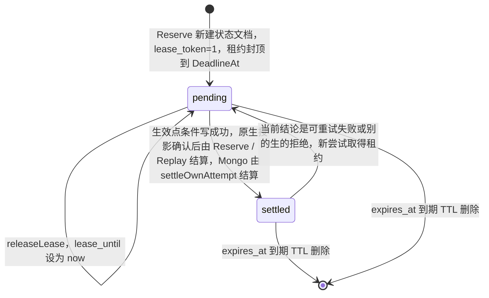
```mermaid
stateDiagram-v2
    [*] --> pending: Reserve 新建状态文档，lease_token=1，租约封顶到 DeadlineAt
    pending --> pending: 同一命令重投且租约有效，返回 Duplicate
    pending --> pending: 自己的租约已过期，重新取得，lease_token+1
    pending --> pending: 另一尝试在租约过期后接替，旧尝试记进 superseded，lease_token+1
    pending --> pending: releaseLease，lease_until 设为 now
    pending --> settled: 生效点条件写成功，原生投影确认后由 Reserve / Replay 结算，Mongo 由 settleOwnAttempt 结算
    settled --> pending: 当前结论是可重试失败或别的生的拒绝，新尝试取得租约
    settled --> [*]: expires_at 到期 TTL 删除
    pending --> [*]: expires_at 到期 TTL 删除
```

原生执行：消费者把 `Reservation` 放进 ctx（`withReservation`），handler 在 Nest 事务里 `Bind` + `EmitCompletion`；回执、lease fence 与 completion effect 同一条 WAL 记录；投影事务按 `LeaseFence.Predicate` 匹配状态文档并写 `updated_at`，不匹配整条记录跳过；消费者 `waitReplay`（25ms 轮询）等回执投影后 ack，`Replay` 读到回执时顺手结算状态文档。

**5. 失败与不确定结果**

| 情形 | 处理 | 对调用方的样子 |
| --- | --- | --- |
| kill -9 后 WAL 重放，截止已过 | 投影条件 `lease_until > now` 不匹配，记录被跳过，受影响实体驱逐重载（RR-20260926-30） | 不留回执、不发 completion；协调器按超时重试 |
| 投影积压超过 `Timeout` | 每次尝试都在截止后投影、被跳过 | 步骤停住直到积压消退或重试用尽；`dataengine.fence.skipped.total{resource="_dataengine_step_operations"}` 与 `saga.step_inbox.superseded_total` 增长 |
| handler 以 `ErrFencedEntityPending` 失败 | 交还租约（`saga/command_consumer.go:492-497`） | nak，屏障解除后重投立即重新 Reserve |
| 另一尝试租约有效 | `errOperationAttemptInFlight` | nak，重投时再判断 |
| 尝试 k 的成功在退避期间被协调器丢弃（`ErrNotWaiting`） | k+1 的 Reserve 先结算 k（第 9 步）再回放 k；若 k+1 已过期，过期分支重发 k 的成功 | 协调器收到 k 的成功（`CommandID` 是 k 的），不重复执行 |
| 成功在协调器放弃后到达 | v1.20.1～v1.22.0：`completeNotWaiting` 告警，返回 `record, nil`。本版：正向的同一事务记回执并补偿这一步（[SAGA-16](#saga-16)），补偿方向仍告警 | 消费者 ack；正向 WARN + 计数、saga 补偿那一步；补偿方向 ERROR + 计数，运维按 T-226 处置 |
| 回执 / tombstone TTL 之后的迟到成功 | 协调器无记录 | `ErrNotWaiting` → Term；不告警、不生效（守卫用例） |
| 读到回执后结算失败（Reserve 第 1 步） | 只记 Warn + `saga.step_inbox.mark_completed_error_total`（`saga/step_operation_inbox.go:184-188`），回执仍是权威 | Reserve 结论不变 |

**6. 测试**

| 用例 | 文件 | 覆盖 |
| --- | --- | --- |
| `TestNativeStepTakesEffectAtMostOncePerOperation`（a / b / c / c' / d） | `saga/step_operation_promises_test.go` | 三种交错 + 截止后重放跳过 + 投影积压接替；走真实 `SubscribeDataEngineStep` 与 dataengine `MongoStore.Project`。`c'` 本版按 ④ 改写：迟到成功后 saga 为 `Compensating`、只补第 0 步，告警计数 1、生效 1 次不变（[SAGA-16](#saga-16)） |
| `TestNativeStepOperationInterleavingsWithCoordinatorDecisions`（Resume 回放、saga 截止告警、人工 Compensate 退避中放弃告警、可重试失败不挡、本生拒绝回放、TTL 后不告警） | 同上 | 协调器决定 × 收件箱。本版 Resume 回放与 saga 截止两个子用例按 ③④ 改写：迟到成功由协调器补偿这一步（`Compensating` 不能 Resume），最终 `Compensated`，handler 只执行 1 次（[SAGA-16](#saga-16)） |
| `TestNativeStepLeaseNeverOutlivesTheCommandDeadline` | 同上 | 新建 / 重新取得封顶、过期 `ErrCommandExpired` |
| `TestNativeStepConsumerHandlesOperationOutcomes`（被接替 ack、在途 nak、零值 Completion 不 nak） | 同上 | 消费者分支 |
| `TestMongoStoreTombstoneTellsAbandonedFromResolved` | 同上 | abandoned / result / 旧 tombstone / Resume 升级 |
| `TestMongoStoreTombstoneOfAFailureCloseIsAbandoned` | `saga/step_operation_review_test.go` | 复核 1（以失败关闭记为放弃关闭）。复核 1 原来的时序用例 `TestNativeStepSuccessAfterAFailureClosedOperationIsAlarmed` 把“较早尝试晚到的可重试失败被接收”钉成了承诺，本版被方向 ③ 推翻，删除并改写为 `TestNativeStepStaleAttemptRetryableFailureDoesNotAbandonTheLastAttempt`（`saga/saga_direction_3_4_promises_test.go:20`，[SAGA-16](#saga-16)） |
| `TestNativeStepExpiredDeliveryStillReplaysTheOperationsSuccess` | 同上 | 复核 2 |
| `TestRealMongoConcurrentAttemptsOfOneOperationReserveOnce`、`TestRealMongoSupersedeAndProjectionOfTheSameAttemptSerialize`、`TestRealMongoTakeoverFencesTheEarlierAttemptsProjection` | `saga/step_operation_real_mongo_integration_test.go`（`-tags integration`） | 真实服务端写冲突、接替 / 投影串行化、接替先赢时旧尝试的投影被 fence |
| `TestDataEngineStepInboxReservesCommandIdentityAndAllowsNewAttempt`、`TestDataEngineStepInboxUsesAbsoluteOperationExpiry`、`TestDataEngineOperationStateSatisfiesProjectorFencePredicate` | `saga/dataengine_step_inbox_test.go` | 在途 / 截止后接替；状态文档集合只有 TTL 索引；fence 谓词逐字段对得上 |

修前红（原样，基线 `50e9a4e8`，全文 [formal-red-before.txt](../../bugfix/evidence/U-0280/formal-red-before.txt)，节选）：

```text
    step_operation_promises_test.go:56: operation gift-1:1:0 took effect 2 time(s) with 2 success receipt(s), want 1: debits by [gift-1:1:0:1 gift-1:1:0:2] (handler ran 2 times)
    step_operation_promises_test.go:93: attempt gift-3:1:0:1 was replayed 55s after its deadline and still took effect: the claim lease outlived the command deadline, so the saga stays failed with an uncompensated debit
    step_operation_promises_test.go:117: success of gift-4:1:0:1 arrived after the coordinator abandoned the step; saga.completion.late_after_abandon_total grew by 0, want 1 (duplicates grew by 1): an effective but uncompensated step must be visible
    step_operation_promises_test.go:133: attempt gift-5:1:0:1 was projected after attempt gift-5:1:0:2 superseded it: the step took effect twice
    step_operation_promises_test.go:169: operation gift-6:1:0 took effect 2 time(s) with 2 success receipt(s), want 1: debits by [gift-6:1:0:1 gift-6:1:0:r1:1] (handler ran 2 times)
    step_operation_promises_test.go:253: a refused step ran 2 times in one life, want 1
```

复核两处的红（原样，出自 [U-0280 记录](../../bugfix/U-0280-saga-step-reexecuted-after-crash.md)“复核”，记录里本身带省略号）：

```text
attempt gift-1:1:0:2 took effect after the coordinator closed the operation on a stale retryable failure; saga.completion.late_after_abandon_total grew by 0, want 1
... the expired delivery of gift-N:1:0:2 was acknowledged without replaying it: the saga ended failed with CompletedSteps=0 and no late_after_abandon alarm
```

负对照（原样，[real-mongo-guard-disabled-red.txt](../../bugfix/evidence/U-0280/real-mongo-guard-disabled-red.txt)，当时的实现里临时让守卫文档写入 `guardOperation` 直接返回；状态文档之后串行化由状态文档本身的 CAS 写承担，同一用例照常通过）：

```text
    step_operation_real_mongo_integration_test.go:95: round 1: 6 attempts of one operation reserved a live lease at the same time, want exactly 1 (results=[<nil> <nil> <nil> <nil> <nil> <nil>])
--- FAIL: TestRealMongoConcurrentAttemptsOfOneOperationReserveOnce (0.28s)
```

kill -9 复现（生成 game-demo，单 sid，三轮 kill -9；记录表格）：修前 u0280c 154 个 saga，debit 回执 >1 共 7、退款 >1 共 3，背包 30 / 27 / 29；修后 u0280b 164 个 saga，0 / 0，背包 30 / 30 / 30。修后原文（[u0280b/analysis.txt](../../bugfix/evidence/U-0280/kill9/u0280b/analysis.txt)）：

```text
tag=u0280b sagas=164 status={"5":164} (4=completed 5=compensated 6=failed 7=manual)
success receipts: debit=164 refund=164; sagas with debit>1=0 refund>1=0 failed_with_debit=0 compensated_debit!=refund=0
```

修后命令（记录“验证”）：`go test -race -count=3 ./saga/... ./kit/saga/...` 通过；`-race -count=200 -run 'TestNativeStep|TestDataEngineStepInbox|TestStepBudget'` 通过；`go test -tags integration -run 'TestRealMongo(ConcurrentAttempts|SupersedeAndProjection)' ./saga/` 通过；`bash scripts/test-dataengine-generated.sh` 通过；生成 game-demo build / vet / test 通过。状态文档改写后，上表全部用例不改断言通过（`-race -count=3`、私有三节点副本集 `-tags integration`，[SAGA-14](#saga-14) §6）。

**7. 性能证据**：U-0280 当时每次新建 / 接管 claim 多一次守卫 upsert 与一次 `by_operation` 索引查询，mongotest `BenchmarkDataEngineStepReservation/new_command` 0.52 → 1.33 ms/op（记录原文；替身按集合快照，不代表真实 Mongo；样本数记录未写）。本版状态文档之后原生 Reserve 是一个事务三条命令（读回执、读状态、写状态），真实副本集上与改写前吞吐无显著差别、分配 −45%（`BenchmarkRealMongoNativeReserveThroughput`，[SAGA-14](#saga-14) §7）。

**8. 未验证项与已知风险**：时钟偏差未注入实测（[E02](../../review/EXTERNAL-VERIFICATION-2026-10-06.md)）；多主机强杀（[E13](../../review/EXTERNAL-VERIFICATION-2026-10-06.md)）。“投影积压超过 `Timeout`”与“截止前已投影、放弃后才送达”由 `TestNativeStepTakesEffectAtMostOncePerOperation/d`、`/c'` 用真实消费者与真实投影器确定性构造。新旧步骤进程混跑不在支持范围（维护者 2026-10-06：“不考虑旧进程，完成按照新的处理，线上还没有旧的进程跑”，升级步骤见 [SAGA-14](#saga-14)）。

**9. review 检查点**

- [ ] `saga/step_operation_inbox.go:287-319` `grantLease`：确认取租约的写以读到的 `version` 为条件（`:308`）、`MatchedCount != 1` 返回 `ErrConflict`；在 Mongo 事务里并发两个 Reserve 时，后提交的一方因写冲突整笔重跑并重新读到前者写下的当前尝试（`TestRealMongoConcurrentAttemptsOfOneOperationReserveOnce` 是否在真实副本集上覆盖了“都读到同一 version、只有一个提交”）。
- [ ] `:321-327` 与 `:270-285` / `:287-319`：新建、重新取得自己的租约、接替三条路径的 `lease_until` 都经 `leaseUntil` 封顶到命令截止；确认没有别的写入路径会把 `lease_until` 写到截止之后（`releaseLease` 写 `now`，结算写 Unix 0）。
- [ ] `saga/dataengine_step_inbox.go:105-113`：`Bind` 校验 reservation 的 `operationKey` / `commandID` / `owner` / `digest` 与命令一致后，fence 的 `DocumentID` 取 `command.IdempotencyKey`、`Token` 取 reservation 的 token；确认 `TestDataEngineOperationStateSatisfiesProjectorFencePredicate` 的逐字段偏离覆盖了 `_id`、owner、token、digest、status、`lease_until` 六个条件。
- [ ] `saga/step_operation_inbox.go:180-190` 与 `:223-234`：Reserve 第 1 步结算失败只告警，第 9 步 `settleFromReceipt` 失败让整个 Reserve 失败——确认这种不对称是有意的（第 1 步的结论已由回执决定；第 9 步之后的判定依赖结算后的状态，失败就中止重跑）。
- [ ] `saga/command_consumer.go:466-471`（原生 `errAttemptSuperseded`）不重发同一操作的成功，而 Mongo 路径 `:327`（含 `errAttemptSuperseded`）会重发：确认原生侧“接替者负责回放或执行”足以覆盖被接替投递恰好是最后一次的情形。
- [ ] `saga/mongo_store.go:328-341`：只有 `Receipt.Success` 记 `result`；已存在 `abandoned` 的 tombstone 在新一生带结果关闭时升级为 `result`；确认反方向（`result` 不会被降级为 `abandoned`）。
- [ ] 时钟：租约封顶读步骤进程 `o.now()`（`saga/step_operation_inbox.go:192`），`DeadlineAt` 由协调器按自己的 `now` 算（派发出口 `Command{..., DeadlineAt: after.NextRunAt}`，`saga/engine.go:917`）；确认文档里“依赖时钟偏差远小于 `Timeout`”是唯一的跨进程时钟假设。

<a id="saga-3"></a>
### SAGA-3 步骤超时与重试预算由配置提供

> 首发 v1.20.1 · [说明](guide-saga-drv-dao-rem.md#saga-3)

**1. 提交**

| 提交 | 版本 | 内容 |
| --- | --- | --- |
| `054fdd66` | v1.20.1 | core `StepBudget` / `StepBudgets` / `Resolve` / `Validate`、`Options.StepBudgets`；kit `kit/saga/step_budgets.go`；codegen `add saga` 不写预算、生成配置带 `step_defaults`；demo debit 覆盖改走配置 |
| `f9367785` | v1.20.2 | RR-20261005-NC-190：预算时长改 `app.ConfigDuration` 严格读取（见 CFG 部分） |
| `3e3350d5` | v1.20.2 | A4：`max_attempts` 改 `app.ConfigInt` 严格读取（见 CFG 部分） |
| `48b3311a` | v1.20.2 | NC-194 小写回退（[SAGA-4](#saga-4)） |
| `611d5d72` | v1.23.0（本版） | RR-20261006-06 歧义报错（[SAGA-5](#saga-5)） |
| `d1226825` | v1.23.0（本版） | A4 ①：预算字段改由 saga Mod 的配置结构体声明（`kit/saga/config.go`），手写的 `readStepBudget` 删除；生成配置段改由声明渲染（见 CFG 部分） |

**2. 改动文件与关键符号**

| `path:line` | 符号 | 职责 |
| --- | --- | --- |
| `saga/record.go:83` | `StepBudget` | 四个字段，零值 = 未指定 |
| `saga/record.go:91` | `DefaultStepBudget` | 5s / 5 次 / 100ms..5s |
| `saga/record.go:110` | `StepBudgets{Defaults, Overrides}` | 配置默认值与按步骤覆盖 |
| `saga/record.go:120` | `StepBudgets.Resolve` | 逐字段取值：覆盖 > 定义 > Defaults > 内置 |
| `saga/record.go:139` | `StepBudgets.Validate` | 负数、超过 1000 次、退避上限小于下限 → `ErrInvalidDefinition` |
| `saga/engine.go:168` | `NewEngine` 校验 `options.StepBudgets` | 构造时拒绝 |
| `saga/engine.go:199` | `Engine.Register` | 先 `Resolve` 再 `Definition.Validate` |
| `saga/record.go:185` | `Definition.Validate` | 补齐后仍要 `Timeout>0`、`1≤MaxAttempts≤1000`、`BackoffMin>0`、`BackoffMax≥BackoffMin` |
| `kit/saga/step_budgets.go:31` | `StepBudgetsFromConfig` | 读 `saga.step_defaults` 与 `saga.steps.<type>.<step>` |
| `kit/saga/config.go:14-19` | `stepBudgetConfig` | 声明：`timeout` / `backoff_min` / `backoff_max` 正时长（`min:"1ns"`），`max_attempts` 1..1000；类型、范围与未知字段由 `app.LoadConfig` 按声明检查（A4 ①；之前是手写的 `readStepBudget`） |
| `kit/saga/config.go:35-37` | `StepDefaults` / `Steps` | `step_defaults` 是 `closed` 段（段下未声明的字段报错），`saga.steps.*.*` 的 map 元素同样 closed |
| `kit/saga/step_budgets.go:39` | `stepBudgets` | 名字核对（[SAGA-5](#saga-5)）、合并、`Validate` |
| `kit/saga/mod.go:106-110` | `Mod.Init` 调用 | 结果写入 `m.config.Engine.StepBudgets` |
| `codegen/internal/roost/kitconfig_gen.go:308-313` | saga Mod 生成配置段 | 由 `kit/saga/config.go` 的 `example` 标注经 `go generate` 生成，`modConfigSection`（`codegen/internal/roost/catalog.go:23-25`）渲染：带 `step_defaults`（5s / 5 / 100ms / 5s）与 `steps: {}` |
| `codegen/internal/roost/demo.go:243` | game-demo 补丁 | 写 `saga.steps.gift_item.debit.max_attempts: 15` |

**3. 不变量与强制点**：协调器实际使用的定义 = `Register` 时补齐后的定义（`saga/engine.go:200`）；取值上限 1000 在 kit 声明（`kit/saga/config.go:16` 的 `max:"1000"`）与 core（`saga/record.go:142`、`saga/record.go:192`）各查一次。守卫：`TestStepBudgetsComeFromConfigWithPerStepOverrides`、`TestStepBudgetConfigRejectsTyposAndImpossibleValues`（`kit/saga/step_budgets_test.go`）；demo 的 `gift_saga_budget_test.go`（经 `kitsaga.StepBudgetsFromConfig` 读两份配置核对“退款重试窗口 ≥ startup_wait + ttl + 45s”）。

**4. 控制流**

1. saga Mod `Init`：`app.LoadConfig` 按声明读出整份 `saga.*`（含 `step_defaults` / `steps`）→ `stepBudgets(c.StepDefaults, c.Steps, m.definitions)`（v1.20.1～v1.22.0 是 `StepBudgetsFromConfig` 内手写读取；它现在是同一份声明的包装，给生成工程测试用）。
2. 读 `saga.step_defaults`，与内置默认逐字段合并（`mergeStepBudget`）。
3. 有定义时建已知表（[SAGA-5](#saga-5) 起冲突报错），`saga.steps` 下每个 `<type>.<step>` 必须在表里，键还原成定义里的写法；无定义时以小写键保存。
4. `budgets.Validate()`。
5. `Assemble` → `Engine.Register(definition)` → `Resolve`（原样 → 小写回退，[SAGA-4](#saga-4)）→ `Definition.Validate`。

**5. 失败与不确定结果**

| 情形 | 处理 | 对调用方的样子 |
| --- | --- | --- |
| `saga.steps` 写错类型 / 步骤（有定义） | `Init` 返回错误 | 进程启动失败，报错点名键 |
| 未知字段、`max_attempts` 越界、时长非正或不带单位 | App 启动前按全部 Mod 的声明检查、`Init` 的 `app.LoadConfig` 同一份声明（A4 ①） | 同上（错误以 `config: <键>` 开头，见 CFG 部分） |
| 无定义（`NewMod()`）时写错名字 | 无法核对，保存为小写覆盖（`kit/saga/step_budgets.go:57-68`），`Resolve` 原样与小写都找不到即不生效（`saga/record.go:124-127`） | 静默不生效（源码核对） |
| 覆盖只给 `backoff_min`，大于实际生效的 `backoff_max` | kit `Validate` 只在同一份覆盖里两个值都非零时比较上下限（`saga/record.go:142`），放行；`Resolve` 逐字段合并后（`:130-131`）`Definition.Validate` 在 `Register` 时失败（`:192-193`） | `ErrInvalidDefinition: step N`，不点名配置键（源码核对） |

**6. 测试**

| 用例 | 文件 | 覆盖 |
| --- | --- | --- |
| `TestStepBudgetsComeFromConfigWithPerStepOverrides` | `kit/saga/step_budgets_test.go` | 默认值、按步骤覆盖、优先级 |
| `TestStepBudgetConfigRejectsTyposAndImpossibleValues`（unknown saga / step / field、zero attempts、too many attempts、negative timeout、inverted backoff） | 同上 | `Init` 拒绝 |
| `TestStepBudgetDurationsRefuseValuesWithoutAUnit` | `kit/saga/config_types_promises_test.go` | 见 CFG 部分 |

修前红：U-0280 记录写 demo 预算用例改回 5 次时照原文红（原样，出自 [U-0280 记录](../../bugfix/U-0280-saga-step-reexecuted-after-crash.md)）：`a refund gets at least 25.75s of retries (max_attempts 5 x timeout 5s ...) ... = 1m30s`。其余新用例的修前红记录未保留原文。修后：随 U-0280 整体验证通过（`-race -count=200 -run '...|TestStepBudget'`）。

**7. 性能证据**：无（只在启动时执行）。

**8. 未验证项与已知风险**：无外部验证项。第 5 节两条行为已按源码核对（无定义时写错名字静默不生效；覆盖后的上下限在 `Register` 才报错、不点名键），是否改进见第 9 节第 1、2 条；已生成工程 `definition.go` 里写死的预算仍生效，运维只能用按步骤覆盖压过它。

**9. review 检查点**

- [ ] `kit/saga/step_budgets.go:40` 与 `saga/record.go:141-147`：`step_defaults` 只写 `backoff_min: 10s`（大于内置 `backoff_max` 5s）时，合并后的 Defaults 会被 `Validate` 拒绝——确认这是期望（运维必须同时写 `backoff_max`），且报错能看懂。
- [ ] 同一情形放在 `saga.steps.<type>.<step>` 下：覆盖本身通过 `Validate`，`Resolve` 后 `BackoffMin > BackoffMax`，在 `saga/record.go:192` 以 `ErrInvalidDefinition: step N` 失败；是否应在 kit 层把覆盖与定义 / 默认合并后再校验并点名配置键？
- [ ] `saga/record.go:120-135`：同一覆盖作用于该类型的所有定义版本，确认新旧版本步骤名相同但语义不同时这是可接受的。
- [ ] 生成的 `step_defaults` 来自 `kit/saga/config.go:15-18` 的 `example` 标注（`codegen/internal/roost/kitconfig_gen.go:309-312`），与 core `DefaultStepBudget()`（`saga/record.go:91`）数值一致（5s / 5 / 100ms / 5s）；`TestSagaDeclaredDefaultsMatchCoreDefaults`（`kit/saga/config_declaration_promises_test.go:13`）是否也钉住这四个 `example`，还是只比 `default` 标注？
- [ ] `kit/saga/mod.go:61-110`：`Init` 先 `app.LoadConfig` 读完整份声明，再 `stepBudgets` 只做名字核对与 `Validate`；确认生成工程测试用的 `StepBudgetsFromConfig`（`kit/saga/step_budgets.go:31-37`）与 `Init` 读同一份声明，对同一个写错的键给出相同报错（A4 ① 的声明检查见 CFG 部分）。

<a id="saga-4"></a>
### SAGA-4 步骤覆盖原样查不到时按小写回退（RR-20261005-NC-194）

> 首发 v1.20.2 · [说明](guide-saga-drv-dao-rem.md#saga-4)

**1. 提交**

| 提交 | 版本 | 内容 |
| --- | --- | --- |
| `efe219c1` | v1.20.2 | N14 审查登记 NC-190～194 |
| `48b3311a` | v1.20.2 | `Resolve` 小写回退；`StepBudgetsFromConfig` 注释；回归用例 |
| `0aa2e1b9` | v1.20.2 | N14 收口：修复状态、索引、CHANGELOG |

**2. 改动文件与关键符号**

| `path:line` | 符号 | 职责 |
| --- | --- | --- |
| `saga/record.go:120` | `StepBudgets.Resolve` | `:124` 原样查找，`:125-127` 查不到再按 `strings.ToLower` 查 |
| `kit/saga/step_budgets.go:29-30` | `StepBudgetsFromConfig` 注释 | 写明无定义时以小写键保存、由 `Resolve` 回退 |
| `kit/saga/step_override_case_promises_test.go` | 回归用例 | 有 / 无定义两条路径 |

**3. 不变量与强制点**：原样写法优先于小写回退（`saga/record.go:124-127`），守卫 `TestExactOverrideWinsOverTheLowercaseFallback`。

**4. 控制流**：`Resolve` 对每个步骤：`Overrides[{Type, Step}]` → 未命中则 `Overrides[{lower(Type), lower(Step)}]` → 逐字段 `firstDuration` / `firstAttempts`。

**5. 失败与不确定结果**

| 情形 | 处理 | 对调用方的样子 |
| --- | --- | --- |
| 无定义、类型 `GiftItem` 与 `giftitem` 同时登记 | 两者原样都查不到时都命中同一条小写覆盖（`saga/record.go:124-127`） | 两个类型拿到同一份覆盖，不报错（源码核对） |
| 代码里同时给原样与小写两份覆盖 | 原样优先 | 守卫用例钉住 |

**6. 测试**

| 用例 | 文件 | 覆盖 |
| --- | --- | --- |
| `TestPerStepOverrideAppliesToMixedCaseNamesWithoutDefinitions` | `kit/saga/step_override_case_promises_test.go` | 有 / 无定义两条路径都得到 15 次 |
| `TestExactOverrideWinsOverTheLowercaseFallback` | 同上 | 原样优先 |

修前红（原样，[nc194-red.txt](../../review/evidence/noncore-review-20261005-n14/nc194-red.txt)）：

```text
# 基线 f6245613，修复前；GOWORK=off go test -count=1 -run TestPerStepOverrideAppliesToMixedCaseNamesWithoutDefinitions ./kit/saga
--- FAIL: TestPerStepOverrideAppliesToMixedCaseNamesWithoutDefinitions (0.00s)
    step_override_case_promises_test.go:29: withDefinitions=false: GiftItem/Debit max_attempts = 5, want the configured 15 (overrides map[{giftitem debit}:{0s 15 0s 0s}])
FAIL
```

修后（[修复记录](../../bugfix/RR-20261005-NC-194.md)）：两条用例通过；`saga`、`kit/saga` `-race -count=3` 通过。负对照：记录未保留。

**7. 性能证据**：无（启动时一次 map 查找）。

**8. 未验证项与已知风险**：无外部验证项。只差大小写的两个类型同时登记时配置无法区分（审查 O2）；有定义路径在 [SAGA-5](#saga-5) 改为报错，无定义路径的行为见第 5 节（源码核对），是否在 `Engine.Register` 层检测见第 9 节。

**9. review 检查点**

- [ ] `saga/record.go:124-127`：回退只在“整对 `{Type, Step}` 原样未命中”时发生；确认不存在“类型原样、步骤小写”这种混合键的写入路径（`StepBudgetsFromConfig` 无定义时两者都小写，有定义时都还原）。
- [ ] `kit/saga/step_budgets.go:57-68`：无定义时 `key` 就是 viper 的小写键；确认 `NewMod()` + `Engine.Register` 的生成路径（项目没有登记 saga 时）是唯一会走到回退的路径。
- [ ] 无定义时两个只差大小写的类型同时命中同一覆盖：是否需要在 `Engine.Register` 层检测（`Engine` 知道全部已注册类型）？
- [ ] `TestPerStepOverrideAppliesToMixedCaseNamesWithoutDefinitions` 直接调 `budgets.Resolve` 而不是经 `Engine.Register`：确认 `Register`（`saga/engine.go:199-201`）没有在 `Resolve` 之外再做大小写处理。

<a id="saga-5"></a>
### SAGA-5 步骤预算拒绝只差大小写的类型 / 步骤名（RR-20261006-06，收尾 A12）

> 首发 v1.23.0（本版） · [说明](guide-saga-drv-dao-rem.md#saga-5)

**1. 提交**

| 提交 | 版本 | 内容 |
| --- | --- | --- |
| `611d5d72` | v1.23.0（本版） | 收尾第 4 批：`knownSagaSteps` 歧义报错与用例（A12）；同提交里的 A14（RR-20261006-08，mongotest `$in` 具名切片）让 saga 用例去掉绕行、改走完整 `ClaimDue`，mongotest 部分不属于本主题 |
| `53fd9e9c` | v1.23.0（本版） | DECISIONS-PENDING 收尾第 4 批标为已实施 |

**2. 改动文件与关键符号**

| `path:line` | 符号 | 职责 |
| --- | --- | --- |
| `kit/saga/step_budgets.go:85` | `knownSagaSteps` | 按小写键建已知表；同一小写键对应两个不同原名即报错 |
| `kit/saga/step_budgets.go:91` | 类型冲突报错 | `saga definitions: types %q and %q differ only in case; ...` |
| `kit/saga/step_budgets.go:100` | 步骤冲突报错 | `saga definition %q: steps %q and %q differ only in case; ...` |
| `kit/saga/step_budgets.go:41` | `StepBudgetsFromConfig` 调用点 | 在读 `saga.steps` 之前建表，所以与配置内容无关 |

**3. 不变量与强制点**：一个小写键最多对应一个原名（`kit/saga/step_budgets.go:90`、`:99`）；同名重复（同一定义两次、同类型多版本）不算冲突（比较的是原名是否不同）。守卫 `TestStepBudgetConfigRejectsNamesThatDifferOnlyInCase`。

**4. 控制流**：`StepBudgetsFromConfig` → 读 `step_defaults` → `knownSagaSteps(definitions)`（冲突即返回错误）→ 遍历 `saga.steps`。

**5. 失败与不确定结果**

| 情形 | 处理 | 对调用方的样子 |
| --- | --- | --- |
| 定义里有 `gift_item` 与 `Gift_Item` | 报错，不论配置是否写了 `saga.steps` | saga Mod `Init` 失败 |
| 同一定义传两次 | 不报错 | 正常启动 |
| `NewMod()` 不带定义 | 不建表，检测不到 | 见 [SAGA-4](#saga-4) 第 5 节 |

**6. 测试**

| 用例 | 文件 | 覆盖 |
| --- | --- | --- |
| `TestStepBudgetConfigRejectsNamesThatDifferOnlyInCase`（types / types_swapped / steps，加“同一定义两次不报错”） | `kit/saga/step_budgets_test.go` | 两种注册顺序、步骤冲突、非冲突 |

修前红（原样，[问题记录](../../bug/RR-20261006-06.md)）：

```text
step_budgets_test.go:116: types: err=<nil> overrides=map[{Gift_Item debit}:{0s 15 0s 0s}], want an ambiguity error
```

修后（[修复记录](../../bugfix/RR-20261006-06.md)）：`go test -race -count=3 ./kit/saga` 通过；整批 `gofmt`、`go vet`、`-race -count=3 ./nest ./app ./kit/service/global ./kit/saga ./mongo/mongotest ./saga`、根包、`go build ./... && go vet ./...` 通过（[收尾第 4 批](../../bugfix/CLOSING-BATCH-4-2026-10-06.md)）。负对照：记录未保留。

**7. 性能证据**：无（启动时一次）。

**8. 未验证项与已知风险**：无定义路径不覆盖；`map` 遍历顺序不影响结果（任何顺序下冲突都会被发现，`types_swapped` 子用例钉住）。

**9. review 检查点**

- [ ] `kit/saga/step_budgets.go:88-104`：冲突判断是“同小写键、原名不同”；确认 Unicode 大小写（非 ASCII 类型名）下 `strings.ToLower` 的折叠与 viper 键的折叠一致，否则会出现 viper 能区分而这里报冲突（或反之）。
- [ ] 报错发生在不写任何 `saga.steps` 的部署上：确认 CHANGELOG / 兼容说明已提示“注册了只差大小写名字的工程启动失败”，且生成器 `add saga` 不可能产出这种名字。
- [ ] 同一提交 `611d5d72` 改了 `saga/coordinator_takeover_review_test.go`、`saga/step_operation_promises_test.go`、`saga/cross_process_real_integration_test.go`（A14 去绕行）：确认只删了领取函数参数，断言未改（记录写 integration 用例本批未在真实 Mongo 重跑）。
- [ ] 与 [SAGA-4](#saga-4) 的组合：有定义时冲突先报错，回退不会被走到；无定义时回退仍让两类型共用覆盖——两条路径的行为不一致是否接受。

<a id="saga-6"></a>
### SAGA-6 协调器接收 completion 时核对代际（B1）

> 首发 v1.20.2 · [说明](guide-saga-drv-dao-rem.md#saga-6)

**1. 提交**

| 提交 | 版本 | 内容 |
| --- | --- | --- |
| `3fabe34d` | v1.20.2 | `Complete` 判定顺序、`commandIDIncarnation`、stale 计数、告警去重（`LateSuccessAlarmStore` / `MarkLateSuccessAlarm` / `late_alarms`）、人工 Compensate 换代；方案文档、SAGA.md、U-0280 记录追加 |
| `76088da2` | v1.20.2 | DECISIONS-PENDING B1 标为已实施 |
| `a95cf4dc` | v1.21.0 | 换代判断并入 `stepTransition`（[SAGA-8](#saga-8)） |
| `a6a902cd` | v1.23.0（本版） | 同一生的规则再收紧（方向 ③）；放弃后迟到的正向成功改为补偿（方向 ④），见 [SAGA-16](#saga-16)；`TestCoordinatorChecksTheIncarnationOfACompletion/E2` 按 ④ 改写 |

**2. 改动文件与关键符号**

| `path:line` | 符号 | 职责 |
| --- | --- | --- |
| `saga/engine.go:419` | `Engine.Complete` | B1 判定顺序 |
| `saga/engine.go:429` | `commandIDIncarnation(...)` 调用 | 从 `CommandID` 解析 completion 的代际 |
| `saga/engine.go:437-448` | 接收判定 | 旧一生失败 / 更新代际 → stale；旧一生成功 → `positionedAt`；同一生 → 等待中（本版同一生里较早尝试的可重试失败不接收，`:442-447`，[SAGA-16](#saga-16)） |
| `saga/engine.go:488` | `positionedAt` | 在等它，或 `Pending` / `Compensating` 且当前方向 + 步骤就是它 |
| `saga/engine.go:502` | `completeNotWaiting` | 放弃后迟到成功按（操作，代际）只告警一次（本版只剩补偿方向；正向交给 `compensateLateStep`，按回执去重，[SAGA-16](#saga-16)） |
| `saga/engine.go:655` | `reportStaleIncarnation` | WARN + `saga.completion.stale_incarnation_total{saga_type,phase}` |
| `saga/engine.go:1087` / `:1097` | `commandID` / `commandIDIncarnation` | 铸造与解析同处：第 0 代 `key:attempt`，第 N 代 `key:rN:attempt` |
| `saga/step_transition.go:68` | 换代规则 | Resume 总是；人工 Compensate 只在 `before.Phase == PhaseCompensate` |
| `saga/store.go:100` | `LateSuccessAlarmStore` | 可选接口 |
| `saga/mongo_store.go:196` | `MongoStore.MarkLateSuccessAlarm` | 条件更新 `late_alarms.r<N>` `$exists:false`，`MatchedCount==1` 才是第一次 |
| `saga/mongo_store.go:539` | `operationDoc.LateAlarms` | tombstone 子文档 |

**3. 不变量与强制点**

- 协调器与收件箱对“同一生”的判断不分叉：两边都调 `commandIDIncarnation`（`saga/engine.go:1097`、`saga/step_operation_inbox.go:492-494`），守卫 `TestCommandIDIncarnationInvertsCommandID`。
- 同一迟到成功只告警一次：单文档条件更新的原子性（`saga/mongo_store.go:200-206`），守卫 `TestRealMongoLateSuccessAlarmIsMarkedOnce`（20 轮 × 8 并发，每轮恰好 1 个 first）。
- 新一生的 `CommandID` 与上一生不相交：`Incarnation` 只由 `stepTransition` 按 before 与原因决定（v1.23.0 起它重写 `after.Incarnation`，出口写的值不起作用，守卫 `TestStepTransitionAloneDecidesTheIncarnation`，见 [SAGA-15](#saga-15)）。

**4. 控制流 / 状态机**

saga 记录状态机（含代际；`Incarnation` 只在 `stepTransition` 里 +1）：

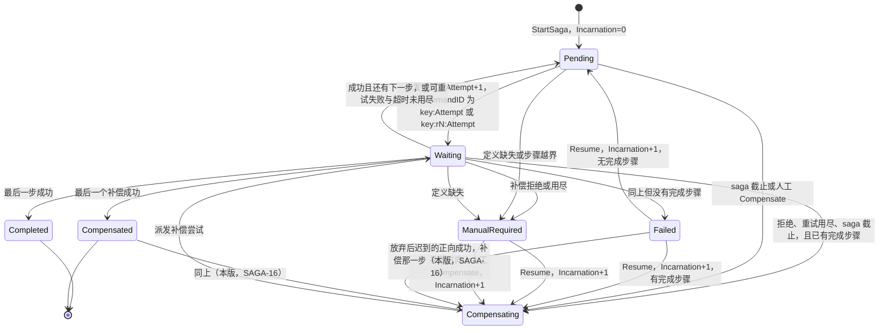
```mermaid
stateDiagram-v2
    [*] --> Pending: StartSaga，Incarnation=0
    Pending --> Waiting: 派发尝试，Attempt+1，CommandID 为 key:Attempt 或 key:rN:Attempt
    Waiting --> Pending: 成功且还有下一步，或可重试失败与超时未用尽
    Waiting --> Completed: 最后一步成功
    Waiting --> Compensating: 拒绝、重试用尽、saga 截止，且已有完成步骤
    Waiting --> Failed: 同上但没有完成步骤
    Pending --> Compensating: saga 截止或人工 Compensate
    Compensating --> Waiting: 派发补偿尝试
    Waiting --> Compensated: 最后一个补偿成功
    Waiting --> ManualRequired: 补偿拒绝或用尽
    Pending --> ManualRequired: 定义缺失或步骤越界
    Waiting --> ManualRequired: 定义缺失
    Failed --> Pending: Resume，Incarnation+1，无完成步骤
    Failed --> Compensating: Resume，Incarnation+1，有完成步骤
    ManualRequired --> Compensating: Resume，Incarnation+1
    ManualRequired --> Compensating: 补偿方向上人工 Compensate，Incarnation+1
    Failed --> Compensating: 放弃后迟到的正向成功，补偿那一步（本版，SAGA-16）
    Compensated --> Compensating: 同上（本版，SAGA-16）
    Completed --> [*]
    Compensated --> [*]
```

`Complete` 接收判定：

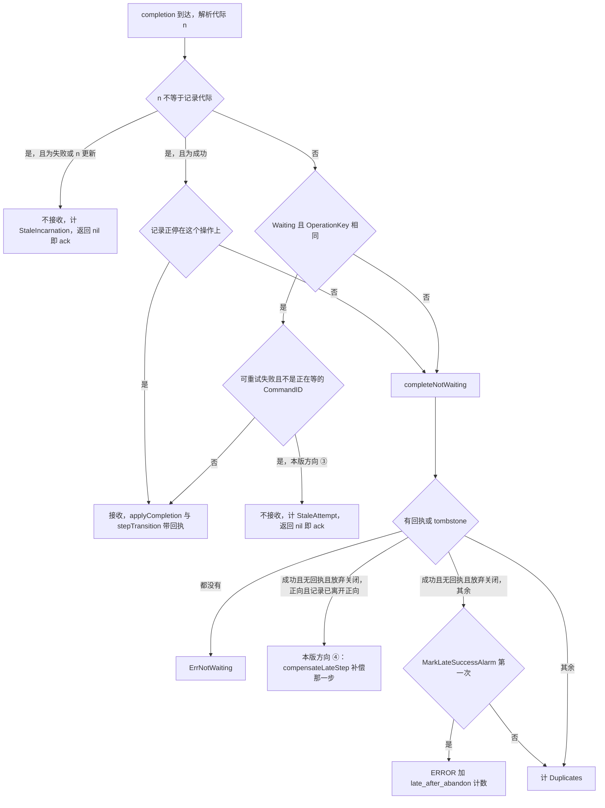
```mermaid
flowchart TD
    A[completion 到达，解析代际 n] --> B{n 不等于记录代际}
    B -->|是，且为失败或 n 更新| S[不接收，计 StaleIncarnation，返回 nil 即 ack]
    B -->|是，且为成功| P{记录正停在这个操作上}
    B -->|否| W{Waiting 且 OperationKey 相同}
    P -->|是| ACC[接收，applyCompletion 与 stepTransition 带回执]
    P -->|否| NW[completeNotWaiting]
    W -->|是| R{可重试失败且不是正在等的 CommandID}
    R -->|是，本版方向 ③| SA[不接收，计 StaleAttempt，返回 nil 即 ack]
    R -->|否| ACC
    W -->|否| NW
    NW --> H{有回执或 tombstone}
    H -->|都没有| E[ErrNotWaiting]
    H -->|成功且无回执且放弃关闭，正向且记录已离开正向| C4[本版方向 ④：compensateLateStep 补偿那一步]
    H -->|成功且无回执且放弃关闭，其余| M{MarkLateSuccessAlarm 第一次}
    M -->|是| L[ERROR 加 late_after_abandon 计数]
    M -->|否| D[计 Duplicates]
    H -->|其余| D
```

**5. 失败与不确定结果**

| 情形 | 处理 | 对调用方的样子 |
| --- | --- | --- |
| Resume 后旧一生的拒绝晚到（E1） | 不接收，计 stale | 消费者 ack；新一生照常执行 |
| 同一生较早尝试晚到的可重试失败（本版，[SAGA-16](#saga-16) ③） | 不接收，计 `StaleAttempt` | 消费者 ack；正在等的尝试照常执行 |
| 同一迟到成功送达多次（E2） | v1.20.2～v1.22.0：第一次告警，之后 `Duplicates`。本版正向的第一次送达即补偿这一步（回执去重），之后 `Duplicates` | 消费者 ack |
| Resume 后、派发前旧一生成功到达（E3） | 接收为结果，tombstone 升级为 `result` | saga 前进，不告警 |
| 补偿方向 `ManualRequired` 上人工 Compensate（E4） | 进入新一生，新 `CommandID` 带 `:rN:` | 补偿真正重新执行 |
| Store 没实现 `LateSuccessAlarmStore` | 每次送达都告警 | 宁可重复，不丢告警 |
| `MarkLateSuccessAlarm` 出错 | `Complete` 返回错误 | 消费者 nak 重投 |

**6. 测试**

| 用例 | 文件 | 覆盖 |
| --- | --- | --- |
| `TestCoordinatorChecksTheIncarnationOfACompletion`（E1～E4 + “补偿方向 ManualRequired 用 Resume 重新执行补偿”守卫） | `saga/step_operation_incarnation_promises_test.go` | `nativeWorld`：真实 `SubscribeDataEngineStep` + mongotest 上真实收件箱 + 真实投影器，手动推进时钟。`E2` 本版按 ④ 改写：三次送达后 saga 为 `Compensating`、`LateStep=1`，“只计一次”不变 |
| `TestMongoStoreMarksALateSuccessAlarmOncePerLife` | 同上 | MongoStore 上 3 次送达 = 1 告警 + 2 重复；按代际标记；旧 tombstone 补标记；旧一生拒绝不接收 |
| `TestCommandIDIncarnationInvertsCommandID` | 同上 | 解析是铸造的逆 |
| `TestRealMongoLateSuccessAlarmIsMarkedOnce` | `saga/late_alarm_real_mongo_integration_test.go`（`-tags integration`） | 真实 Mongo 并发标记 |

修前红：见说明条目引的四条首行，全文 [B1 red-before.txt](../../bugfix/evidence/B1/red-before.txt)（基线 `3a71321c`，`go test ./saga/ -count=1 -run TestCoordinatorChecksTheIncarnationOfACompletion`）。修后（方案第 8 节）：`go test -race -count=3 ./saga/... ./kit/saga/...` 通过；新增与相关用例 `-race -count=200` 通过；`go test -tags integration -run 'TestRealMongo(LateSuccessAlarmIsMarkedOnce|ConcurrentAttempts|SupersedeAndProjection)' ./saga/` 通过。负对照：没有做真实 Mongo 上去掉 `$exists` 条件的负对照（方案“未验证”）。

**7. 性能证据**：无（只在迟到成功路径多一次条件更新）。

**8. 未验证项与已知风险**：无外部验证项。新旧协调器混跑不在验证范围（维护者 2026-10-06：“不考虑旧进程，完成按照新的处理，线上还没有旧的进程跑”）。B1 方案的方向判断写明：若之后在“Mongo 步骤仍按命令”或“迟到成功只告警”两处再出缺陷，应走 Mongo 步骤纳入收件箱（已在 [SAGA-9](#saga-9) 做）或 C，而不是继续在协调器加特判；C 本版已实施（saga 方向 ④，[SAGA-16](#saga-16)）。

**9. review 检查点**

- [ ] `saga/engine.go:437-439`：`incarnation > record.Incarnation` 的成功也被当作 stale 丢弃（返回 `record, nil`，消费者 ack）——确认“比记录还新”确实不可能由协调器产生（`Incarnation` 只增、只在 `stepTransition` 改），丢弃不会吞掉真实结果。
- [ ] `saga/engine.go:1097-1110`：`commandIDIncarnation` 用 `operationKey+":r"` 前缀切分；`operationKey` 本身是 `<sagaID>:<phase>:<step>`，确认 sagaID 的字符集（`validSubjectToken`）不可能让第 0 代的 `key:attempt` 被误解析成 `key:rN:...`。
- [ ] `saga/engine.go:488-499` `positionedAt` 对 `Pending` / `Compensating` 用 `operationKey(record.ID, record.Phase, record.Step)`：确认 Resume 进入补偿方向时（`Step = CompletedSteps-1`）旧一生**正向**成功不会被当作“停在这个操作上”（方向不同、键不同）。
- [ ] `saga/step_transition.go:68`：人工 Compensate 只在 `before.Phase == PhaseCompensate` 时换代；从正向退避中发起的补偿保持 `CommandID`——确认这时补偿方向在这一生里确实从未派发过（否则会复用 ID，E4 同形）。
- [ ] `saga/mongo_store.go:196-207`：过滤条件包含 `saga_id`；不同 saga 不会因为相同 `IdempotencyKey` 误标（`IdempotencyKey` 含 sagaID，通常不会）；没有 tombstone 时返回 false，`completeNotWaiting` 这时走 `Duplicates`——确认与“没有 tombstone 就 `ErrNotWaiting`”的前序判断不矛盾（`history.Recorded` 已保证 tombstone 存在）。

<a id="saga-7"></a>
### SAGA-7 定义缺失 fence 时退避中的步骤同样记为放弃（RR-20261005-NC-250）

> 首发 v1.21.0 · [说明](guide-saga-drv-dao-rem.md#saga-7)

**1. 提交**

| 提交 | 版本 | 内容 |
| --- | --- | --- |
| `31b48bc0` | v1.21.0 | 新增 `abandonedOperation`，截止 / 人工 Compensate / 定义缺失三个出口共用；回归用例；N06 S5 剩余项审查用例（`TestCoordinatorLeaseTakeoverFencesTheLateApply`、`TestOutboxSupersedeAndUnknownAckOnMongoStore`、真实跨进程 `TestRealSagaCrossProcessKillRecovers` / `TestRealMongoCoordinatorLeaseTakeover`）；SAGA.md O-S5-3 说明 |
| `a95cf4dc` | v1.21.0 | `abandonedOperation` / `closedOperation` 删除，由 `stepTransition` + `openOperation` 取代（[SAGA-8](#saga-8)） |

**2. 改动文件与关键符号**（当前源码）

| `path:line` | 符号 | 职责 |
| --- | --- | --- |
| `saga/engine.go:844-861` | `processClaimed` 定义缺失分支 | fence 到 `ManualRequired`，`stepTransition(..., causeDefinitionMissing, fenced)` |
| `saga/step_transition.go:88` | `openOperation` | `Waiting` → `OperationKey`；`Pending` / `Compensating` 且 `Attempt>0` → 当前方向 + 步骤的操作 |
| `saga/step_transition.go:75-77` | 关闭规则 | `before` 开着的操作在 `after` 不再开着就关闭 |
| `saga/mongo_store.go:323-346` | `Apply` 的 `CloseOperation` | 写 tombstone（放弃关闭）、删排队命令 |
| `saga/definition_fence_abandon_promises_test.go` | 回归 | 正向、补偿两个方向 |

**3. 不变量与强制点**：协调器离开一个已派发过的操作（不论在等还是在退避）都写 tombstone；强制点在 `stepTransition`（`saga/step_transition.go:75`），守卫是 [SAGA-8](#saga-8) 的 `TestEveryCoordinatorWriteGoesThroughStepTransition`。

**4. 控制流**：协调器领到退避到期的记录 → 找不到定义 → `after.Status = ManualRequired`、清 `OperationKey` / `CommandID` → `stepTransition`：`openOperation(before)` = `<saga>:<phase>:<step>`（`Attempt>0`），`openOperation(after)` = 空 → `CloseOperation` = 该操作 → `MongoStore.Apply` 同一事务写放弃 tombstone、删排队命令。之后的迟到成功走 `completeNotWaiting`：v1.21.0～v1.22.0 一律告警一次；本版正向的由 `compensateLateStep` 只记 `LateStep`（记录在 `ManualRequired`，运维修好定义后 `Resume` 先补这一步），补偿方向的仍告警一次（[SAGA-16](#saga-16)）。

**5. 失败与不确定结果**

| 情形 | 处理 | 对调用方的样子 |
| --- | --- | --- |
| fence 时步骤在等结果 | 关闭 `OperationKey`（修前也对） | 同修前 |
| fence 时步骤在退避 | 关闭当前操作（修前漏） | 迟到成功 ack + 计数；补偿方向 ERROR，正向本版只记 `LateStep`、WARN，`Resume` 时先补（[SAGA-16](#saga-16)） |
| 步骤越界（`invalid saga step`）且 `Attempt>0` | `stepTransition` 后也会放弃关闭（[SAGA-8](#saga-8) 唯一行为差异） | 正常不可达 |
| 混跑：旧协调器 fence | 没有 tombstone | 迟到成功仍 `ErrNotWaiting` |

**6. 测试**

| 用例 | 文件 | 覆盖 |
| --- | --- | --- |
| `TestDefinitionFenceDuringBackoffAbandonsTheOperation`（forward / compensate） | `saga/definition_fence_abandon_promises_test.go` | 排队命令删除、迟到成功 ack、告警 +1 |
| `TestCoordinatorLeaseTakeoverFencesTheLateApply`（3 种顺序） | `saga/coordinator_takeover_review_test.go` | 审查用例：去掉 `applyFilter` 的租约条件做负对照，第一种顺序变红（修复记录） |
| `TestOutboxSupersedeAndUnknownAckOnMongoStore` | 同上 | 审查用例 |
| `TestRealMongoCoordinatorLeaseTakeover`、`TestRealSagaCrossProcessKillRecovers` | `saga/cross_process_real_integration_test.go`（`-tags integration`） | 真实依赖 |

修前红：说明条目引了正向三条，全文 [red-before.txt](../../bugfix/evidence/NC-250/red-before.txt)。修后（原样，[green-after.txt](../../bugfix/evidence/NC-250/green-after.txt)）：

```text
2026/10/06 07:58:57 ERROR saga: step succeeded after the coordinator abandoned it; the effect is not compensated saga_id=nc250-compensate saga_type=rally status=manual_required phase=compensate step=0 command_id=nc250-compensate:2:0:1 operation=nc250-compensate:2:0
--- PASS: TestDefinitionFenceDuringBackoffAbandonsTheOperation (0.00s)
    --- PASS: TestDefinitionFenceDuringBackoffAbandonsTheOperation/forward (0.00s)
    --- PASS: TestDefinitionFenceDuringBackoffAbandonsTheOperation/compensate (0.00s)
```

真实依赖（[real-run.txt](../../bugfix/evidence/NC-250/real-run.txt)，第 3 次即修后）：`recovered in 1m26.705s: 60 sagas completed, 120 operations, 121 committed step executions (102 by coordinator-b), 1 operations re-run by a later attempt (allowed for Mongo steps: idempotent by IdempotencyKey), 120 coordinator receipts`——这时 Mongo 步骤还不在收件箱契约内，[SAGA-9](#saga-9) 之后同一用例为 0 个重复提交。

**7. 性能证据**：无（只多写一份 tombstone）。

**8. 未验证项与已知风险**：无外部验证项。新旧协调器混跑不在验证范围（同 [SAGA-6](#saga-6)）。NC-250 的关闭写的是 `MongoStore.Apply` 既有的 `CloseOperation` 分支（`saga/mongo_store.go:323-346`），mongotest 用例覆盖关闭逻辑，真实副本集上的同一分支由 `TestRealSagaCrossProcessKillRecovers` 与 `TestRealMongoCoordinatorLeaseTakeover` 经过（截止与超时出口）。

**9. review 检查点**

- [ ] `saga/step_transition.go:88-98`：`openOperation` 对 `Pending` / `Compensating` 只在 `Attempt > 0` 时返回操作；确认 `retryState`（`saga/engine.go:991-1019`）在退避时保留 `Attempt`（不清零），否则退避中的操作不会被识别。
- [ ] `saga/engine.go:844-861`：定义缺失分支 `after` 没有改 `Phase` / `Step`；确认 `openOperation(after)` 因 `Status = ManualRequired` 返回空，从而一定关闭。
- [ ] `saga/mongo_store.go:323-346`：关闭时 `DeleteMany` 删的是 `command.idempotency_key == CloseOperation` 的排队命令；确认已被 publisher 领取（租约中）的命令也会被删，或其后续 Ack / Nack 对已删文档的处理是安全的（`TestOutboxSupersedeAndUnknownAckOnMongoStore` 是否覆盖）。
- [ ] 修复记录与源码的对应：记录里的 `abandonedOperation` 已不存在（`a95cf4dc` 删除），确认 `openOperation` 对截止、人工 Compensate、定义缺失三个出口给出与 `abandonedOperation` 相同的答案（方案“行为对照”逐出口）。

<a id="saga-8"></a>
### SAGA-8 离开当前步骤收成一个转移 stepTransition（saga 方向 ①）

> 首发 v1.21.0 · [说明](guide-saga-drv-dao-rem.md#saga-8) · 本版补强见 [SAGA-15](#saga-15)（RR-20261006-14）

**1. 提交**

| 提交 | 版本 | 内容 |
| --- | --- | --- |
| `b3538251` | v1.21.0 | 记录维护者第六轮决定（含 saga 方向 ①②） |
| `a95cf4dc` | v1.21.0 | 新增 `saga/step_transition.go`，`engine.go` 8 个出口改调，删除 `abandonedOperation` / `closedOperation`；守卫测试；负对照证据 |
| `8d4bec52` | v1.21.0 | 方案与 DECISIONS-PENDING 写入提交号 |
| `42419890` | v1.21.0 | 发版前复审：守卫补上不写字面量的两种绕过，负对照固定在 `saga/testdata/stepguard` |
| `5ca32611` | v1.23.0（本版） | RR-20261006-14：`stepTransition` 改为 `Engine` 方法、自己调 `Store.Apply`；守卫改为 `go/types` 全包检查；`saga/testdata/stepguard` 与 `TestStepTransitionGuardSeesBypassesWithoutALiteral` 删除（[SAGA-15](#saga-15)） |

**2. 改动文件与关键符号**（当前源码 `5e72ca4d`；v1.21.0 时 `stepTransition` 是返回 `ApplyRequest` 的包级函数、守卫是 `go/ast` 语法检查，见 [SAGA-15](#saga-15)）

| `path:line` | 符号 | 职责 |
| --- | --- | --- |
| `saga/step_transition.go:15-36` | `transitionCause` | dispatch / result / timeout / deadline / definitionMissing / invalidStep / manualCompensate / resume / lateSuccess（本版，[SAGA-16](#saga-16)） |
| `saga/step_transition.go:39` | `transition` | `cause`、`fenced`、`receipt`、`outbox` |
| `saga/step_transition.go:66` | `(*Engine).stepTransition` | 唯一构造 `ApplyRequest`、唯一调 `Store.Apply`（`:81`），按 before 与原因重写 `after.Incarnation`（`:67-70`） |
| `saga/step_transition.go:88` | `openOperation` | “当前开着哪个操作”的唯一回答 |
| `saga/engine.go:350` / `:390` / `:462` / `:566` / `:857` / `:865` / `:874` / `:889` / `:919` | 9 个出口 | Resume / Compensate / Complete / 放弃后迟到的正向成功（本版 `compensateLateStep`，[SAGA-16](#saga-16)）/ 定义缺失 / 截止 / 超时 / 步骤越界 / 派发，都写 `e.stepTransition(ctx, record, after, transition{...})` |
| `saga/step_transition_guard_test.go:39` | `TestEveryCoordinatorWriteGoesThroughStepTransition` | `go/types` 检查 saga 包全部非测试文件 |
| `saga/step_transition_guard_test.go:46` | `TestStepTransitionAloneDecidesTheIncarnation` | 五种原因下出口写 `after.Incarnation=99`，写入的代际只取决于 before 与原因 |

**3. 不变量与强制点**

| 不变量 | 强制点 |
| --- | --- |
| 所有协调器写记录经 `stepTransition` | 结构：出口拿到的是写入后的 `Record`，手里没有请求；守卫规则 3：`Store.Apply`（调用或方法值）只在 `stepTransition` 里出现（`saga/step_transition_guard_test.go:167-175`） |
| 请求只能是 `stepTransition` 的决定 | 守卫规则 1：`ApplyRequest`（或其指针）类型的值只能在 `stepTransition` 里产生（复合字面量、`new`、零值变量、类型转换、函数返回、下标、解引用都算，`:176-202`）；规则 2：任何地方不能改写请求（赋值、自增、`range` 赋值、取地址，`:120-166`） |
| `Incarnation` 只由 `stepTransition` 决定 | `saga/step_transition.go:67-70` 先把 `after.Incarnation` 设回 `before.Incarnation`，Resume 或补偿方向的人工 Compensate 再加一；`TestStepTransitionAloneDecidesTheIncarnation` |
| 守卫没有失明 | 看不到 `stepTransition` 里的 `Store.Apply`、或看不到任何对请求参数的读取（`MongoStore.Apply`）时 `t.Fatal`（`saga/step_transition_guard_test.go:206-212`） |

**4. 控制流**：每个出口算出 `after` → `e.stepTransition(ctx, before, after, transition{...})`：(1) `after.Incarnation = before.Incarnation`，`Resume`，或 `ManualCompensate` 且 `before.Phase == PhaseCompensate` → 加一；(2) `ExpectedVersion = before.Version`，`fenced` 时带 `before.Lease`；(3) `openOperation(before)` 非空且不等于 `openOperation(after)` → `CloseOperation`；(4) 接收了成功 → `CloseOperation = receipt.IdempotencyKey`（覆盖第 3 步）；(5) `e.store.Apply(ctx, request)`，返回 `request.After` 与 `ApplyOutcome`。

**5. 失败与不确定结果**

| 情形 | 处理 | 对调用方的样子 |
| --- | --- | --- |
| 新出口手拼请求、改写请求或直接调 `Store.Apply` | 守卫测试失败并报文件:行号与规则 | CI 红 |
| 步骤越界且已派发（`Attempt > 0`） | 放弃关闭该操作，v1.21.0 之前的代码不关闭 | 正常不可达；方案列为唯一行为差异 |
| `ManualRequired` 上人工 Compensate（`Attempt>0`） | v1.21.0 之前会对已关闭的操作再关一次；新规则不重复关闭 | 可观察结果相同（tombstone 不改关闭方式，排队命令已删） |
| `Store.Apply` 返回 `ErrConflict` | `stepTransition` 原样返回，出口照旧重读重试 | 与 v1.21.0 相同 |

**6. 测试**

| 用例 | 文件 | 覆盖 |
| --- | --- | --- |
| `TestEveryCoordinatorWriteGoesThroughStepTransition` | `saga/step_transition_guard_test.go` | 生产源码无违例（三条规则 + 防失明） |
| `TestStepTransitionAloneDecidesTheIncarnation` | 同上 | 代际只由 before 与原因决定 |
| U-0280、U-0281、B1、NC-250 与 `step_operation_*` 全部既有用例 | `saga/` | 不改断言通过（`-race -count=3` 全包；关键用例 `-race -count=50`） |

v1.21.0 守卫的负对照（原样，[guard-negative.txt](../../feature/evidence/sagadir/guard-negative.txt)；这是当时的语法守卫，现在的类型守卫见 [SAGA-15](#saga-15)）：

```text
# 负对照：在 saga 包里临时加一个手拼请求的 Engine 出口（handBuiltExit：Incarnation++ 后 store.Apply(ctx, ApplyRequest{...})），
# GOWORK=off go test -count=1 -run TestEveryCoordinatorWriteGoesThroughStepTransition ./saga/   （验证后删除该文件）
--- FAIL: TestEveryCoordinatorWriteGoesThroughStepTransition (0.00s)
    step_transition_guard_test.go:20: ./zz_guard_negative.go:8:2: Incarnation changed outside stepTransition in handBuiltExit
    step_transition_guard_test.go:20: ./zz_guard_negative.go:9:12: store.Apply in handBuiltExit does not take stepTransition(...)
    step_transition_guard_test.go:20: ./zz_guard_negative.go:9:31: ApplyRequest built outside stepTransition in handBuiltExit
FAIL
```

`42419890` 的两种绕过负对照在 v1.21.0～v1.22.0 是常驻用例 `TestStepTransitionGuardSeesBypassesWithoutALiteral`；本版随 RR-20261006-14 删除（维护者要求负对照不留仓库），两种写法在新结构下一种编译不过、一种被类型守卫报出（[SAGA-15](#saga-15) §6）。

**7. 性能证据**：无（不涉及热路径；类型守卫一次约 0.1～0.2s，含 `go list -export`）。

**8. 未验证项与已知风险**：无外部验证项。v1.21.0 语法守卫的盲区（包级 helper 改写参数里的请求再写入）已由 RR-20261006-14 闭环，见 [SAGA-15](#saga-15)。

**9. review 检查点**

- [ ] `saga/step_transition.go:75-80`：成功回执覆盖 `CloseOperation` 为 `receipt.IdempotencyKey`；确认可重试失败 / 拒绝的回执不会走这一分支，以失败关闭时仍按第 3 步关闭 `before` 开着的操作、由 Store 记为 `abandoned`。
- [ ] `fenced` 只在协调循环出口为 true（`saga/engine.go:857-919`），`Complete` / `Compensate` / `Resume` 只按版本 fence；确认这与 `ClaimDue` 的租约语义一致（方案第 4 条）。
- [ ] `saga/engine.go:350-362` 与 `:390-402`：Resume / Compensate 现在返回 `stepTransition` 写入的记录（v1.22.0 及以前读 `request.After`）；确认 `written` 的 `Incarnation` 与 Store 里的一致（`TestStepTransitionAloneDecidesTheIncarnation` 同时比较返回值与存储值）。
- [ ] v1.21.0 版的四条守卫盲区（`engineMethod` 只看 Engine 方法、参数上的字段赋值不报、`isRequestFromTransition` 按名字计数、`saga/testdata/stepguard` 的两种绕过）已由 RR-20261006-14 闭环（`5ca32611`）：确认 [SAGA-15](#saga-15) 的类型守卫三条规则对这四种形状都报出或使其编译不过（修后负对照原文 [guard-after.txt](../../bugfix/evidence/RR-20261006-14/guard-after.txt)）。

<a id="saga-9"></a>
### SAGA-9 Mongo 步骤纳入操作实例收件箱，结果消费者终态分类统一（saga 方向 ②、O-S5-1、O-S5-3）

> 首发 v1.21.0 · [说明](guide-saga-drv-dao-rem.md#saga-9) · 收件箱存储本版改为每个操作一份状态文档，见 [SAGA-14](#saga-14)

**1. 提交**

| 提交 | 版本 | 内容 |
| --- | --- | --- |
| `9669d181` | v1.21.0 | `saga/step_operation_inbox.go`（共用核心 + `settleOwnClaim` / `errAttemptFenced`）；`MongoCommandInbox` 两事务；`SubscribeMongoStep` 分支；O-S5-1 共用 `isTerminalCompletionError` 并加 `ErrIdentityConflict`；O-S5-3 文档；codegen / demo 注释；证据 `bench.txt` / `cross-process-kill.txt` / `mongo-step-red-green.txt` / `o-s5-1-red.txt` |
| `8d4bec52` | v1.21.0 | 方案与 DECISIONS-PENDING 写入提交号 |
| `5a3c4a60` | v1.21.0 | `ErrDefinitionMissing` 移出终态；`ErrDuplicateKey` 回放分支加观察注释（[SAGA-10](#saga-10)） |
| `ff08c941` | v1.23.0（本版） | 延迟分析与基准文件（[SAGA-11](#saga-11)） |
| `a013f9ff` | v1.23.0（本版） | 状态文档：`<收件箱集合>_claims` → `<收件箱集合>_operations`，`settleOwnClaim` → `settleOwnAttempt`，Reserve 事务 5 条命令 → 3 条（[SAGA-14](#saga-14)） |

**2. 改动文件与关键符号**（当前源码 `5e72ca4d`）

| `path:line` | 符号 | 职责 |
| --- | --- | --- |
| `saga/command_consumer.go:35` | `MongoCommandInbox` | 嵌入 `stepOperationInbox`，`collection` 存回执 |
| `saga/command_consumer.go:41-47` | `CommandInboxOptions` | `ReceiptTTL`、`Owner`、`LeaseDuration` |
| `saga/command_consumer.go:50` | `mongoInboxOperationSuffix = "_operations"` | 状态文档集合 = 收件箱集合 + 后缀（v1.21.0～v1.22.0 是 `mongoInboxClaimSuffix = "_claims"`） |
| `saga/command_consumer.go:83` | `EnsureInfrastructure` | 回执 TTL 索引 + `ensureOperationIndexes`（只有 `ttl_expires_at`） |
| `saga/command_consumer.go:103` | `Handle` | Reserve 事务 → 执行事务；失败交还租约 |
| `saga/command_consumer.go:146` | `execute` | handler → `settleOwnAttempt`（`:175`）→ 插回执（`:178`），同一事务 |
| `saga/step_operation_inbox.go:455` | `settleOwnAttempt` | 条件写 `_id` / `command_id` / `digest` / `owner` / `lease_token` / `pending` / `lease_until > now`，写结论；不匹配 → `errAttemptFenced` |
| `saga/command_consumer.go:252` | `SubscribeMongoStep` | 过期、fence、接替、在途分支 |
| `saga/command_consumer.go:354` | `ackUnexecutedAttempt` | 不执行的投递 ack 前重发同一操作的成功 |
| `saga/nest_completion_consumer.go:150` | `isTerminalCompletionError` | 两条结果流共用 |
| `saga/jetstream.go:144` | 普通结果流调用点 | O-S5-1 |
| `saga/nest_completion_consumer.go:137` | 原生结果流调用点 | O-S5-1 |

**3. 不变量与强制点**

| 不变量 | 强制点 | 守卫 |
| --- | --- | --- |
| 同一操作实例至多一次业务写生效 | Reserve 事务（`saga/step_operation_inbox.go:140-162`）+ 执行事务里的条件写（`saga/command_consumer.go:175`） | `TestMongoStepAttemptsOfOneOperationTakeEffectOnce`（mongotest）与 `TestRealMongoStepAttemptsOfOneOperationTakeEffectOnce`（真实副本集，同一份用例） |
| 接替与生效只能一个提交 | 接替（`grantLease`，`saga/step_operation_inbox.go:287`）与 `settleOwnAttempt`（`:455`）写同一份状态文档 | 同上“in-flight attempt past its deadline”；`TestRealMongoStepProcessesFenceAttemptsInFlightAcrossProcesses`（两个进程） |
| 回执格式不变 | 执行事务最后 `InsertOne(commandReceiptDoc{...})`（`saga/command_consumer.go:178`） | `findReceipt` / `readReceipt` 读法不变 |
| 两条结果流终态分类一致 | 共用 `isTerminalCompletionError` | `TestCompletionConsumersTermTheSameTerminalErrors` |
| 跨进程强杀下每个操作恰好一次提交 | 上述全部 | `TestRealSagaCrossProcessKillRecovers` |

**4. 控制流 / 状态机**

Reserve 事务与执行事务（`MongoCommandInbox.Handle`，本版状态文档形状；v1.21.0～v1.22.0 的 Reserve 事务是 5 条命令：读回执、读自己的 claim、守卫 upsert、按操作查 claim、写 claim）：

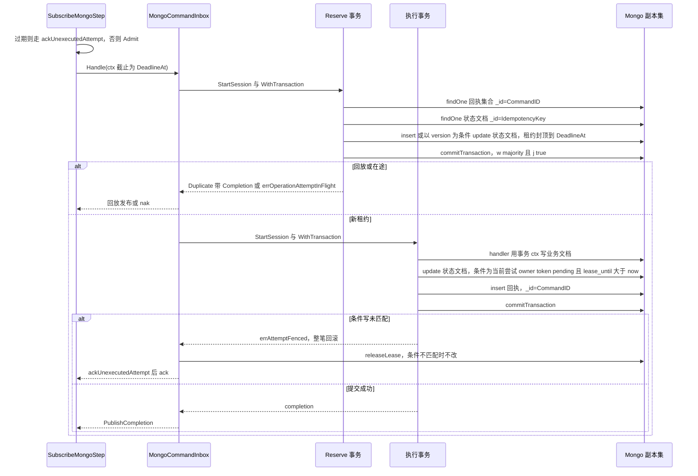
```mermaid
sequenceDiagram
    participant C as SubscribeMongoStep
    participant I as MongoCommandInbox
    participant R as Reserve 事务
    participant X as 执行事务
    participant M as Mongo 副本集
    C->>C: 过期则走 ackUnexecutedAttempt，否则 Admit
    C->>I: Handle(ctx 截止为 DeadlineAt)
    I->>R: StartSession 与 WithTransaction
    R->>M: findOne 回执集合 _id=CommandID
    R->>M: findOne 状态文档 _id=IdempotencyKey
    R->>M: insert 或以 version 为条件 update 状态文档，租约封顶到 DeadlineAt
    R->>M: commitTransaction，w majority 且 j true
    alt 回放或在途
        R-->>I: Duplicate 带 Completion 或 errOperationAttemptInFlight
        I-->>C: 回放发布或 nak
    else 新租约
        I->>X: StartSession 与 WithTransaction
        X->>M: handler 用事务 ctx 写业务文档
        X->>M: update 状态文档，条件为当前尝试 owner token pending 且 lease_until 大于 now
        X->>M: insert 回执，_id=CommandID
        X->>M: commitTransaction
        alt 条件写未匹配
            X-->>I: errAttemptFenced，整笔回滚
            I->>M: releaseLease，条件不匹配时不改
            I-->>C: ackUnexecutedAttempt 后 ack
        else 提交成功
            X-->>I: completion
            I-->>C: PublishCompletion
        end
    end
```

`SubscribeMongoStep` 对 `Handle` 结果的分支（`saga/command_consumer.go:325-349`）：`ErrCommandExpired` / `errAttemptFenced` / `errAttemptSuperseded` → `ackUnexecutedAttempt` 后 ack；其他错误（含 `errOperationAttemptInFlight`、被截止打断的执行事务）→ nak；成功或回放 → `PublishCompletion`（回放的 `CommandID` 是生效那次的）。

**5. 失败与不确定结果**

| 情形 | 处理 | 对调用方的样子 |
| --- | --- | --- |
| handler 返回错误 / ctx 取消 | 执行事务回滚，`releaseLease`（`WithoutCancel`） | nak，重投立即重新 Reserve |
| 执行事务提交结果未知 | 若已提交，状态文档已 `settled`，交还条件（要求 `pending`）不匹配不改；重投读到回执回放 | 至多一次仍成立 |
| 执行事务撞回执唯一键 | 正常不可达（同一命令的两次投递由租约串行，后一次在 Reserve 第 1 步读到回执）；纵深防御：回放那份回执，不交还租约（[SAGA-10](#saga-10)） | 返回 duplicate |
| k 卡在执行事务里拖过截止，k+1 接替 | k 的条件写不匹配 → `errAttemptFenced`，不留回执 | k 不生效，k+1 执行 |
| 被 kill -9 的进程遗留事务持锁 | 服务端到 `transactionLifetimeLimitSeconds` 才中止 | 后续尝试写同一批文档时等待；O-S5-3 建议调到 20s |
| 事务外副作用（如发邮件）在被 fence 的尝试里已发出 | 框架不保证 | 业务仍需按 `IdempotencyKey` 幂等 |
| 普通结果流收到 `ErrNotWaiting` / `ErrNotFound` / `ErrInvalidRecord` / `ErrIdentityConflict` | `nats.Permanent` → Term | 不再 nak 到 `MaxDeliver` |

**6. 测试**

| 用例 | 文件 | 覆盖 |
| --- | --- | --- |
| `TestMongoStepAttemptsOfOneOperationTakeEffectOnce`（committed attempt is replayed / in-flight attempt past its deadline is taken over） | `saga/mongo_step_operation_promises_test.go` | mongotest |
| `TestRealMongoStepAttemptsOfOneOperationTakeEffectOnce` | `saga/mongo_step_operation_real_mongo_integration_test.go`（`-tags integration`） | 同一份用例跑真实副本集 |
| `TestMongoStepConsumerFollowsTheOperationInbox`（回放发布、在途 nak、过期重发、被接替 ack） | `saga/mongo_step_consumer_promises_test.go` | 消费者分支 |
| `TestCompletionConsumersTermTheSameTerminalErrors` | `saga/completion_consumer_terminal_promises_test.go` | O-S5-1：`ErrNotFound` / `ErrNotWaiting` / `ErrIdentityConflict` 两条流都 Term |
| `TestRealSagaCrossProcessKillRecovers` | `saga/cross_process_real_integration_test.go`（`-tags integration`） | 每个操作实例业务事务恰好提交一次 |
| `TestRealMongoStepProcessesFenceAttemptsInFlightAcrossProcesses`、`TestRealMongoStepProcessesConcurrentAttemptsTakeEffectOnce` | `saga/mongo_step_multiprocess_real_mongo_integration_test.go`（`-tags integration`，本版） | 两个步骤进程：handler 里被 SIGKILL 后接替、停在事务里的提交被 fence、两进程各 4 个尝试并发恰好一个执行（[SAGA-14](#saga-14)） |
| `BenchmarkMongoCommandInboxHandle` / `BenchmarkRealMongoCommandInboxHandle` | `saga/mongo_step_benchmark_test.go` / `saga/mongo_step_benchmark_real_mongo_integration_test.go` | 前后对照 |

修前红：说明条目引了真实副本集三行，全文 [mongo-step-red-green.txt](../../feature/evidence/sagadir/mongo-step-red-green.txt)（基线 `a5e7b070` = `b3538251` + ①）。O-S5-1 修前红（原样，[o-s5-1-red.txt](../../feature/evidence/sagadir/o-s5-1-red.txt)，节选）：

```text
        completion_consumer_terminal_promises_test.go:74: plain result stream = saga: not found (permanent=false), want saga: not found terminated: a redelivery cannot change it, and naking it holds a MaxAckPending slot until MaxDeliver
        completion_consumer_terminal_promises_test.go:74: plain result stream = saga: step is not waiting for a result (permanent=false), want saga: step is not waiting for a result terminated: a redelivery cannot change it, and naking it holds a MaxAckPending slot until MaxDeliver
        completion_consumer_terminal_promises_test.go:74: plain result stream = saga: idempotency identity conflict (permanent=false), want saga: idempotency identity conflict terminated: a redelivery cannot change it, and naking it holds a MaxAckPending slot until MaxDeliver
```

修后跨进程强杀（原样，[cross-process-kill.txt](../../feature/evidence/sagadir/cross-process-kill.txt)）：

```text
    cross_process_real_integration_test.go:384: recovered in 1m22.732s: 60 sagas completed, 120 operations, 120 committed step executions (104 by coordinator-b), 0 operations committed by more than one attempt (want 0), 120 coordinator receipts
--- PASS: TestRealSagaCrossProcessKillRecovers (86.01s)
```

存活进程 232 次 `saga: step command is past its deadline`、41 次 WriteConflict，期间出现 MaxTimeMSExpired、连接中断导致的提交结果未知，仍然恰好一次（同文件统计）。修后验证命令（方案“验证”）：`go test -race -count=3 ./saga/... ./kit/saga/...`；新增与 `TestNativeStep*`、`TestDataEngineStepInbox*`、`TestExpiredStepCommand*`、`TestMongoCommandInbox*` `-race -count=20`；`-run '^TestRealMongo'` 全部 saga 真实 Mongo 用例；`scripts/test-dataengine-generated.sh`；生成 game-demo build / vet / test。负对照：合并单事务的 spike 让本用例在真实副本集变红（[SAGA-11](#saga-11)）。

**7. 性能证据**（原样数值，[bench.txt](../../feature/evidence/sagadir/bench.txt)，同机 Apple M5，顺序单协程，每次新命令）

| 基准 | 样本 | 修前 | 修后 |
| --- | --- | --- | --- |
| `BenchmarkMongoCommandInboxHandle`（mongotest） | 2000 次 × 5 | 433704～450968 ns/op，8169 allocs/op | 3557160～3626163 ns/op，63276～63278 allocs/op |
| `BenchmarkRealMongoCommandInboxHandle`（真实三节点副本集） | 500 次 × 6，交替 | 8807913～9246100 ns/op | 16148137～18714654 ns/op |

结论：延迟代价来自多出的一次事务提交（多数派写）；mongotest 按集合快照、按操作查询是扫描，只作同口径对照。并发吞吐与时间分解见 [SAGA-11](#saga-11)。本版状态文档改写后 Reserve 少两条数据命令，真实副本集 `BenchmarkRealMongoStepThroughput` 与改写前无显著差别（g=1 54.2 → 55.0 ops/s，p=0.29），分配 −27%（[SAGA-14](#saga-14) §7）。

**8. 未验证项与已知风险**：Mongo 跨主机副本集与切主（[E11](../../review/EXTERNAL-VERIFICATION-2026-10-06.md)）；生产形态延迟（[E12](../../review/EXTERNAL-VERIFICATION-2026-10-06.md)）；时钟偏差（[E02](../../review/EXTERNAL-VERIFICATION-2026-10-06.md)）。`CommandInboxOptions.LeaseDuration` 不要求大于 `AckWait` 是设计（租约总被截止封顶，截止后的投递走过期分支），同一命令在途时的重投读到“自己的租约有效”→ nak，见第 9 节第 4 条。新旧 Mongo 步骤进程混跑不在支持范围（维护者 2026-10-06 决定，升级先停旧再起新，[SAGA-14](#saga-14)）。

**9. review 检查点**

- [ ] 确认 Reserve 与执行在**两个**事务里的边界：`saga/command_consumer.go:114`（`i.reserve`，自带 `WithTransaction`）与 `:146-183`（`execute`）之间没有共享 session；`settleOwnAttempt`（`saga/command_consumer.go:175`）在 handler 之后、插回执之前，确认 handler 若用了非事务 ctx 写业务，框架无法发现（契约要求业务写经事务 ctx）。
- [ ] `saga/command_consumer.go:126-132` 撞 `ErrDuplicateKey`：注释写“正常不可达、留作纵深防御”；确认同一命令的两次投递确实被状态文档的租约串行（后一次在 Reserve 第 1 步读到回执或第 7 步 Duplicate），以及读回执失败时落到 `:133-140` 交还租约 + 返回原错误后，重投的行为。
- [ ] `saga/command_consumer.go:327` 把 `errAttemptSuperseded` 与过期 / fence 同样处理（先重发同一操作的成功再 ack），而原生 `:466-471` 不重发——两侧不对称是否有意。
- [ ] `SubscribeMongoStep` 没有 `LeaseDuration > AckWait` 校验（对照原生 `saga/command_consumer.go:399`）：`AckWait` 小于实际执行时长时，同一命令的重投读到“自己是当前尝试、租约有效”（判定表第 7 步）→ `Reservation.Duplicate` 无 completion → `errOperationAttemptInFlight` → nak（`:118-124`），确认这条路径不会在截止前让第二个投递执行。
- [ ] `saga/step_operation_inbox.go:455-475` `settleOwnAttempt` 的过滤条件与原生投影的 `LeaseFence.Predicate` 是否等价（同样要求 `command_id`、`digest`、`owner`、`lease_token`、`pending`、`lease_until > now`），两条生效点不应有一条比另一条宽。
- [ ] `saga/nest_completion_consumer.go:150-159`：确认 `TestCompletionConsumersTermTheSameTerminalErrors` 覆盖的三种错误之外，`ErrInvalidRecord` 在两条流上同样是 Term（用例没有单列它）。
- [ ] O-S5-3：`transactionLifetimeLimitSeconds=20` 只是文档建议（SAGA.md、USER_GUIDE §7），生成的 compose 模板没改（方案原意）；确认 `roost doctor` 或部署文档是否需要检查它。

<a id="saga-10"></a>
### SAGA-10 结果先于定义到达时 nak 退避；回执撞键时回放不交还租约（观察）

> 首发 v1.21.0 · [说明](guide-saga-drv-dao-rem.md#saga-10)

**1. 提交**

| 提交 | 版本 | 内容 |
| --- | --- | --- |
| `5a3c4a60` | v1.21.0 | 发版前审查观察收尾（5 条，saga 占第 3、4 条）：`isTerminalCompletionError` 删 `ErrDefinitionMissing`；`Handle` 的 `ErrDuplicateKey` 分支加注释；回归 `saga/completion_definition_rollout_promises_test.go`；SAGA.md、方案 O-S5-1 段更正 |
| `3d3b0c09` | v1.21.0 | 记录写入提交号 |
| `8016580b` | v1.21.0 | DECISIONS-PENDING 登记发版前审查跟进 |
| `ba13cb05` | v1.23.0（本版） | 真实 NATS 上的 nak 退避 / `MaxDeliver` 实测（[SAGA-13](#saga-13)） |
| `a013f9ff` | v1.23.0（本版） | 状态文档：`ErrDuplicateKey` 分支注释改为“正常不可达、留作纵深防御”，理由改按状态文档写（[SAGA-14](#saga-14)） |

**2. 改动文件与关键符号**

| `path:line` | 符号 | 职责 |
| --- | --- | --- |
| `saga/nest_completion_consumer.go:150` | `isTerminalCompletionError` | 终态只剩 `ErrNotWaiting` / `ErrNotFound` / `ErrInvalidRecord` / `ErrIdentityConflict`（`:154`） |
| `saga/engine.go:457-460` | `Complete` 里的定义查找 | 只在 `accept` 为真（记录正等着这个操作）时查，缺失返回 `ErrDefinitionMissing` |
| `saga/command_consumer.go:126-132` | `Handle` 的 `ErrDuplicateKey` 分支 | 观察：回放那份回执、不交还租约，注释写明理由（v1.21.0 写的是“不交还 claim”，本版改为状态文档的租约） |

**3. 不变量与强制点**：可恢复的暂时状态不能被当成终态 Term；强制点是共用分类函数（两条流同一处），守卫 `TestACompletionBeforeItsDefinitionIsRegisteredIsRetriedNotTerminated`、`TestADefinitionThatNeverArrivesEndsInTheCoordinatorFence`，以及 O-S5-1 的 `TestCompletionConsumersTermTheSameTerminalErrors` 不改断言通过。

**4. 控制流**：结果到达 → `Complete` → 记录在等这个操作 → `e.definition(...)` 缺失 → `ErrDefinitionMissing` → 不是终态 → 消费者 nak（`NakBackoffMin` 起翻倍）→ (a) 新进程上线、定义注册 → 重投被接收；(b) 一直不来 → 步骤超时后没有定义的协调器在 `processClaimed`（`saga/engine.go:844-861`）fence 到 `ManualRequired` 并放弃关闭 → 之后重投走 `completeNotWaiting` → 迟到成功 ack 并告警一次 → `MaxDeliver` 兜底。

**5. 失败与不确定结果**

| 情形 | 处理 | 对调用方的样子 |
| --- | --- | --- |
| 结果先到、定义随后 | nak 退避，重投接收 | 记录推进 |
| 定义永不注册（配置错误） | 步骤超时前持续 nak，占一个 `MaxAckPending` 位 | 步骤超时时长与之前相同 |
| 执行事务撞回执唯一键（本版起正常不可达：同一命令的两次投递由状态文档的租约串行） | 回放回执，状态文档留 pending、租约有效 | 读状态文档的每条路径都先看回执，不会因此等待（观察结论） |
| 回执过期后状态文档仍 pending | 状态文档与回执同一保留期（`receiptTTL`，缺省 30 天，`expires_at` 每次写入刷新）；仍 pending 时按判定表第 13 / 14 步等待或接替 | 已在任何重试窗口之外 |

**6. 测试**

| 用例 | 文件 | 覆盖 |
| --- | --- | --- |
| `TestACompletionBeforeItsDefinitionIsRegisteredIsRetriedNotTerminated`（plain / native result stream） | `saga/completion_definition_rollout_promises_test.go` | 两个 Engine 共用 mongotest 存储模拟滚动发布 |
| `TestADefinitionThatNeverArrivesEndsInTheCoordinatorFence` | 同上 | fence 后重投被 ack，`LateAfterAbandon = 1` |
| `TestRealNatsCompletionNakBackoffAndMaxDeliver` | `saga/consumer_nak_maxdeliver_real_integration_test.go` | 真实 JetStream（[SAGA-13](#saga-13)） |

修前红：说明条目已原样引（出自 [发版前审查观察收尾](../../bugfix/PRERELEASE-AUDIT-FOLLOWUP-2026-10-06.md) 第 3 节）。修后（同记录）：两条流第一次投递返回可重试的 `ErrDefinitionMissing`、记录不动；注册定义后同一条消息重投被接收，记录推进到第 1 步；定义不来时 fence 之后的重投被 ack，`LateAfterAbandon` = 1。整批验证：`go test -race -count=3 ./kit/service/global/activity/ ./saga/... ./kit/saga/... ./configdata/... ./codegen/internal/tablegen/` 通过。观察第 4 条没有用例（写不出在承诺上变红的用例，记录原意）。

**7. 性能证据**：无。

**8. 未验证项与已知风险**：滚动发布由两个 Engine 共用一个存储确定性模拟（错误分类）；真实 JetStream 上的 nak 退避、`MaxDeliver` 与定义上线后的接收由 [SAGA-13](#saga-13) 实测。多节点 JetStream 见 [E06](../../review/EXTERNAL-VERIFICATION-2026-10-06.md)。

**9. review 检查点**

- [ ] `saga/engine.go:437-460`：确认 `ErrDefinitionMissing` 只可能在 `accept` 为真之后返回（`:457-460`）；`completeNotWaiting` 路径（`:450-455`）不查定义——否则“定义永不来”的结果会在不等待的记录上无限 nak。
- [ ] `StartSaga`（`saga/engine.go:219`）与 `Resume`（`:324`）也返回 `ErrDefinitionMissing`：确认 start 效果消费者（`saga/nest_start_consumer.go`）对它的分类与本条一致或有意不同。
- [ ] 观察第 4 条（状态文档形状）：核对读状态文档的三条路径都先看回执——Reserve 第 1 步读本命令回执（`saga/step_operation_inbox.go:180-190`）、第 9 步读当前尝试的回执并结算（`:223-234`）、`operationSuccess` 对 pending 的当前尝试读回执（`:441-450`）；没有别的读状态文档并据租约决定等待的路径。
- [ ] 共用分类函数之后，任何新增“暂时性”错误都要显式不进 `isTerminalCompletionError`；是否需要一条用例枚举 `saga/errors.go` 的全部哨兵并断言其分类，防止下次误加。

<a id="saga-11"></a>
### SAGA-11 Mongo 步骤延迟分析与维护者选 A

> 首发 v1.23.0（本版） · [说明](guide-saga-drv-dao-rem.md#saga-11)

**1. 提交**

| 提交 | 版本 | 内容 |
| --- | --- | --- |
| `78e26853` | v1.23.0（本版） | 记录第十二轮决定（含“Mongo 步骤延迟待分析”） |
| `ff08c941` | v1.23.0（本版） | 分析文档、证据 `evidence/mongolat/*`、基准文件 `saga/mongo_step_latency_real_mongo_integration_test.go`；无生产代码改动 |
| `47f04413` | v1.23.0（本版） | DECISIONS-PENDING 标为已分析，待维护者选 A / B / C |
| `4c557678` | v1.23.0（本版） | 记录维护者决定（选 A），分析文档追加“维护者决定”一节 |

**2. 改动文件与关键符号**

| `path:line` | 符号 | 职责 |
| --- | --- | --- |
| `saga/mongo_step_latency_real_mongo_integration_test.go:222` | `BenchmarkRealMongoStepLatencyBreakdown` | 包住 `fmongo.IMongo` 统计每次尝试的事务 / 命令 / 提交耗时 |
| `saga/mongo_step_latency_real_mongo_integration_test.go:285` | `BenchmarkRealMongoStepThroughput` | g = 1 / 8 / 32 协程，报 ops/s、p50、p99 |
| `saga/mongo_step_latency_real_mongo_integration_test.go:340` | `BenchmarkRealMongoCommitWriteConcern` | 裸驱动单文档事务，只换写关注 |

文件带 `integration` tag，只有带 `-bench` 才运行，不会被 `-run '^TestRealMongo'` 选中；库名 `roost_mongolat_<pid>_<ns>`，跑完删除。

**3. 不变量与强制点**：契约不变（[SAGA-9](#saga-9)）。分析的“必要性”论证：(i) 在途尝试租约有效时别人要等，需要在途状态在业务事务提交前可见；(ii) 截止后即使旧事务还开着也要能接替——两者合起来要求在开业务事务之前已提交一份“我在途”的记录。守住它的是 ② 的用例 2（`in-flight attempt past its deadline is taken over and cannot commit`）。

**4. 控制流**：每次尝试的命令构成（分析文档表，原意）：修前 1 个事务 4 条命令 + 1 次提交；修后 Reserve 事务 5 条命令（读回执、读自己的 claim、守卫 upsert、按操作查 claim、写 claim）+ 1 次提交，执行事务 3 条命令（业务写、claim 条件写、插回执）+ 1 次提交。修前 5 次往返，修后 10 次。本版状态文档（[SAGA-14](#saga-14)）之后 Reserve 事务是 3 条命令（读回执、读状态文档、写状态文档）+ 1 次提交，执行事务 3 条命令（业务写、状态文档条件写、插回执）+ 1 次提交；落盘提交次数不变（每次尝试 2 次），所以本条“两次提交是延迟主因”的结论不变。

**5. 失败与不确定结果**（各候选的正确性，分析文档原意）

| 候选 | 结论 | 失败点 |
| --- | --- | --- |
| 1 合并事务（选项 B） | 不采用 | 接替丢失；spike 在真实副本集上用例 2 变红 |
| 2 首次尝试快路径 | 不采用 | 不写守卫 → 写偏斜违反最多一次；否则退化为 B 或 C |
| 3 合并守卫与 claim 写 | 当时不采用（不是为延迟） | 收益约 0.1～0.3 ms，小于噪声；要改原生投影 fence 指向。**之后已做到**：维护者第十三轮决定“直接改成一份状态文档”（`a013f9ff`，[SAGA-14](#saga-14)），守卫、claim 与按操作查询合成一份状态文档，原生 fence 改指向状态文档（`dataengine` 不改，谓词字段名一致）；实测延迟无显著变化、分配 −27%～−45%，与这里的预估一致 |
| 4 Reserve 降写关注 | 不采用 | 读侧反例：回放一份最终被回滚的成功 |
| 5 跨投递批量预约 | 暂不做 | 有效但引入调度层；无业务量证据；吞吐成瓶颈时首选 |

**6. 测试**

合并事务 spike 的负对照（原样，出自 [SAGA-MONGO-STEP-LATENCY](../../feature/SAGA-MONGO-STEP-LATENCY-2026-10-06.md) 候选 1，补丁全文见 [spike-merged-tx-contract-red.txt](../../feature/evidence/mongolat/spike-merged-tx-contract-red.txt)）：

```text
in-flight_attempt_past_its_deadline_is_taken_over_and_cannot_commit:
  attempt gift-1:1:1:2 after gift-1:1:1:1's deadline: {...} duplicate=false err=saga: another attempt of this step operation holds a live lease, want it to take over and execute
```

分析期间验证（文档“实施状态与验证”）：`gofmt -l saga kit/saga` 为空；`go vet ./saga/`、`go vet -tags integration ./saga/`、`go build ./... && go vet ./...`；`go test -race -count=3 ./saga/`；私有副本集 `go test -tags integration -count=1 -run '^TestRealMongo' ./saga/` 全部通过。

**7. 性能证据**

| 基准 | 样本 | 修前 | 修后 | 结论 |
| --- | --- | --- | --- | --- |
| `RealMongoStepLatencyBreakdown` sec/op | n=6（每轮 1000x，交替） | 8.965m ±3% | 18.321m ±12% | +104.35%（p=0.002）；延迟分析那一轮（benchstat 中位数）。② 实施那一轮的 9.0 → 17.4 ms/op 是 `BenchmarkRealMongoCommandInboxHandle` 500x × 6 的均值，两轮口径见 [SAGA-MONGO-STEP-LATENCY](../../feature/SAGA-MONGO-STEP-LATENCY-2026-10-06.md) 开头 |
| `RealMongoStepThroughput/g=1` ops/s | n=6 | 111.05 ±5% | 54.45 ±3% | −50.96% |
| `RealMongoStepThroughput/g=8` ops/s | n=6 | 597.0 ±3% | 296.1 ±2% | −50.40% |
| `RealMongoStepThroughput/g=32` ops/s | n=6 | 1.792k ±24% | 1.022k ±7% | −43.01% |
| p99（g=1 / 8 / 32） | n=6 | 14.06 / 22.67 / 46.27 ms | 28.11 / 39.12 / 65.08 ms | |
| commit-ms/op | n=6 | 8.061 ±5% | 15.900 ±14% | +97.25% |
| allocs/op（Breakdown） | n=6 | 598.0 | 1336.5 | +123.49% |
| spike 合并事务 | 3 轮 | — | 9.20 ms/op；108 / 624 / 1431 ops/s | 与修前无显著差别，但契约用例红 |

数值原样取自 [throughput-benchstat.txt](../../feature/evidence/mongolat/throughput-benchstat.txt)（base = `9669d181^`（`a95cf4dc`），after = `78e26853`）。服务端口径（141 次 Handle，诊断日志）：`commitTransaction` 修前平均 8.34 ms（等写关注 7.67 ms），修后 8.44 ms（8.04 ms），次数翻倍。结论：瓶颈是副本集每秒能做的落盘提交数（8 协程修前 597 次提交/s，修后 592 次/s）。

**8. 未验证项与已知风险**：生产形态（Linux + NVMe + 跨主机副本集的提交耗时，文档写 1～5 ms 是推断；更高并发下的吞吐）见 [E12](../../review/EXTERNAL-VERIFICATION-2026-10-06.md)。选项 B / C 未采用（维护者选 A），C 不实施也不实测。测量期间机器 load average 3.6～6.7（文档记录）。

**9. review 检查点**

- [ ] 核对“55tps”与证据：维护者原话的 55tps 对应 `RealMongoStepThroughput/g=1` 修后 54.45 ops/s（单协程）；8 / 32 协程是 296 / 1022 ops/s。确认 E12 的通过标准（8 与 32 协程 ≥ 55）与原话口径一致。
- [ ] 确认 `saga/mongo_step_latency_real_mongo_integration_test.go` 只在 `-bench` 下运行（`-run '^TestRealMongo'` 不会选中），不会拖慢常规 integration 跑。
- [ ] 必要性论证依赖“Mongo 事务未提交的写只能通过写冲突被感知”：核对 `BenchmarkRealMongoCommitWriteConcern` 与 spike 证据是否足以支撑“没有不放松契约的单事务做法”，尤其选项 C 只做了推断。
- [ ] 候选 4 的反例（`w:1` Reserve 读到未达多数派的回执并回放）：确认当前 Reserve 事务确实以 `w:majority` 提交、snapshot 读（`mongo/driver` 事务选项），否则反例在现状下也成立。
- [ ] 影响面声明“原生步骤不经过这条路径”：原生 `DataEngineStepInbox.Reserve` 同样调 `stepOperationInbox.reserve`（分析文档“原生步骤为什么没有这笔代价”一节）；本版补了原生 Reserve 吞吐基准 `BenchmarkRealMongoNativeReserveThroughput`（`saga/step_operation_benchmark_real_mongo_integration_test.go:22`，[SAGA-14](#saga-14) §7：g=1 / 8 / 32 约 110 / 552 / 1671 ops/s），确认容量评估按它计入原生步骤的 Reserve 提交。

<a id="saga-12"></a>
### SAGA-12 saga Mod 启动时校验效果流保留期与完成回执 TTL（O-S5-2）

> 首发 v1.23.0（本版） · [说明](guide-saga-drv-dao-rem.md#saga-12)

**1. 提交**

| 提交 | 版本 | 内容 |
| --- | --- | --- |
| `7b73aabc` | v1.23.0（本版） | 第十二轮 kit 批第 1 项：`kit/saga/mod.go` `checkEffectRetention`；`kit/dataengine/mod.go` `EffectStreamRetention` / `DefaultEffectStream` / `DefaultEffectMaxAge`；回归 `kit/saga/effect_retention_promises_test.go`；T-281（同提交另有 8 项不属于本主题） |
| `d6a677e0` | v1.23.0（本版） | DECISIONS-PENDING 第十二轮 kit 批标为已实施 |

**2. 改动文件与关键符号**

| `path:line` | 符号 | 职责 |
| --- | --- | --- |
| `kit/saga/mod.go:111` | 既有校验 | `CompletionReceiptTTL <= Stream.MaxAge` 报错 |
| `kit/saga/mod.go:114` | `Init` 末尾 | `return m.checkEffectRetention(cfg)` |
| `kit/saga/mod.go:121` | `checkEffectRetention` | 结果效果流名 = DataEngine 效果流名时比较 |
| `kit/dataengine/mod.go:525-526` | `DefaultEffectStream` / `DefaultEffectMaxAge` | `ROOST_EFFECTS` / `7 * 24 * time.Hour` |
| `kit/dataengine/mod.go:531` | `EffectStreamRetention` | 按 DataEngine Mod 的读法返回流名与保留期（严格读取） |
| `kit/dataengine/mod.go:98-105` / `:150` | `EffectsConfig`；DataEngine Mod 的 `Effects` 字段 | `dataengine.effects.*` 的声明（缺省 `ROOST_EFFECTS` / 168h）；`EffectStreamRetention` 读的是同一个结构体（A4 ① 之后，`d1226825`；之前两处各自严格读取） |

**3. 不变量与强制点**：结果效果流 = DataEngine 效果流时 `saga.completion_receipt_ttl > dataengine.effects.max_age`；强制点 `kit/saga/mod.go:129`（`ttl <= effectMaxAge` 报错），两边读同一份缺省与读法（`EffectStreamRetention`）。守卫 `TestModRefusesAnEffectStreamThatOutlivesTheCompletionReceipts`、`TestModChecksEffectRetentionOnlyAgainstTheStreamItReadsResultsFrom`。

**4. 控制流**：`Init` 读完全部 saga 键 → 步骤预算 → 回执 TTL > saga 流保留期 → `EffectStreamRetention(cfg)`（读 `dataengine.effects.stream`、`dataengine.effects.max_age`）→ `TrimSpace(NestResults.Stream)` 与之不同 → 返回 nil；相同 → 比较。

**5. 失败与不确定结果**

| 情形 | 处理 | 对调用方的样子 |
| --- | --- | --- |
| 同流且 `ttl <= max_age` | `Init` 返回错误，点名两个键、两个取值与流名 | 启动失败，T-281 |
| 结果在别的流上 | 不比较 | 正常启动 |
| `dataengine.effects.max_age` 写法不合法 | `EffectStreamRetention` 严格读取报错，包成 `saga: ...` | 启动失败（DataEngine Mod 也会报同一键） |
| DataEngine Mod 没装（可选依赖） | 仍按缺省 `ROOST_EFFECTS` / 168h 比较 | 缺省 720h > 168h，通过 |

**6. 测试**

| 用例 | 文件 | 覆盖 |
| --- | --- | --- |
| `TestModRefusesAnEffectStreamThatOutlivesTheCompletionReceipts` | `kit/saga/effect_retention_promises_test.go` | 800h vs 720h 拒绝，错误含两个键与两个值 |
| `TestModChecksEffectRetentionOnlyAgainstTheStreamItReadsResultsFrom` | 同上 | 缺省、同流回执更长、结果在别的流、两边一起改名（含改名后 800h 拒绝） |

修前红：说明条目已原样引（[DECISIONS-R12-KIT §1](../../feature/DECISIONS-R12-KIT-2026-10-06.md)）。修后：“修后通过；缺省值、同流且回执更长、结果在别的流、两边一起改名四种都照常启动”（同记录原文）。负对照：修前红即对照，未另做。

**7. 性能证据**：无（启动时一次）。

**8. 未验证项与已知风险**：只比较同名流；如果运维让两个名字不同的流其实是同一份数据（不可能由配置表达），不在本校验范围。

**9. review 检查点**

- [ ] `kit/saga/mod.go:126`：saga 侧 `TrimSpace(NestResults.Stream)`，而 `EffectStreamRetention`（`kit/dataengine/mod.go:531-539`）返回声明读出的 `Effects.Stream` 原值（A4 ① 之后不再有 `effectStreamName` 的 `TrimSpace`）；确认 `NestResults.Stream` 的回退链（`result_effect_stream` → `start_effect_stream`，后者声明缺省 `ROOST_EFFECTS`，`kit/saga/mod.go:72`、`kit/saga/config.go:66`）与 `Assemble` 实际订阅的流名一致，且两边对首尾空白的处理不会让同一条流比较成不同，否则校验比较的是错的流。
- [ ] `kit/saga/mod.go:129`：`<=` 使相等也被拒绝；确认这是期望（相等时最后一刻的重投与回执过期同时发生）。
- [ ] `EffectStreamRetention` 与 DataEngine Mod `Init` 读同一个结构体 `EffectsConfig`（`kit/dataengine/mod.go:98-105`）：确认 `dataengine.effects.max_age` 写错时运维只看到一种措辞（App 启动前的声明检查先报，见 CFG 部分），而不是 saga Mod 再包一层 `saga: ...` 报第二遍。
- [ ] 跨 Mod 校验放在 saga Mod 里而不是 App 层：确认在 DataEngine Mod 不存在、或两个 Mod 分属不同进程（结果流由别的进程的 DataEngine 写）时，这条校验读的 `dataengine.*` 配置确实是写流那一方的配置。

<a id="saga-13"></a>
### SAGA-13 真实 NATS 上的 nak 退避 / MaxDeliver 实测与 saga 偶发失败根因

> 首发 v1.23.0（本版） · [说明](guide-saga-drv-dao-rem.md#saga-13)

**1. 提交**

| 提交 | 版本 | 内容 |
| --- | --- | --- |
| `ba13cb05` | v1.23.0（本版） | 发版前补充验证：`saga/nest_completion_promises_test.go` 断言修正；新增 `saga/consumer_nak_maxdeliver_real_integration_test.go`；另含示例实跑门禁、global / Redis Cluster 用例（不属于本主题） |

**2. 改动文件与关键符号**

| `path:line` | 符号 | 职责 |
| --- | --- | --- |
| `saga/nest_completion_promises_test.go:99` | `TestAssemblyConsumesNativeNestCompletionEffects` | 断言改为与协调器时序无关的事实 |
| `saga/nest_completion_promises_test.go:140-160` | 新断言 | 不再等第 0 步、`CompletedSteps==1 && Step==1`、`Store.CompletionRecorded` 为真 |
| `saga/consumer_nak_maxdeliver_real_integration_test.go:79` | `TestRealNatsCompletionNakBackoffAndMaxDeliver` | 两个子用例，各自流 / 前缀 |
| `saga/engine.go:480` | `Complete` 末尾 `e.signal(e.dueKick)` | 偶发失败的产品侧原因：收下结果后立即唤醒协调器派发下一步 |

**3. 不变量与强制点**：测试只断言产品承诺（第 0 步被收下、回执已写），不断言协调器 goroutine 的调度顺序。nak 退避与 `MaxDeliver` 由 broker 与 `nats/driver` 的 settle 决定，用例在真实 JetStream 上核对。

**4. 控制流**：真实 NATS 用例：协调器存储用 mongotest，一个“还没有该定义版本”的 Engine 作 `Completer`，`SubscribeNestCompletions` 消费一条原生 completion effect；`recordingCompleter` 记每次投递时间与错误；子用例 2 在第一次投递返回后注册定义。

**5. 失败与不确定结果**

| 情形 | 实测结果 |
| --- | --- |
| 定义一直不来，`MaxDeliver=3`、`NakBackoffMin=200ms` | 投递 3 次，间隔 202 ms / 402 ms；再等 AckWait（3s）+1s 无第 4 次；`NumAckPending=0`、`NumPending=0`；记录仍在等第 0 步 |
| 定义在第 1 次投递后上线 | 第 2 次投递被接收并 ack，记录推进到第 1 步，之后不再投递 |
| 两子用例共用 effect 前缀（首次运行） | 第二个消费者（DeliverAll）读到第一个子用例的消息，`saga: not found` 按终态 Term——用例隔离问题，改为各自前缀 |

**6. 测试**

偶发失败复现条件（[发版前补充验证](../../bugfix/PRERELEASE-VERIFICATION-2026-10-06.md) 第 1 节）：`go test -race -c` 编出 `saga.test`，后台并行跑 nest / dataengine / sync / entity / skill 三轮加压；A：8 实例 × 3 轮 × `-test.count=20 -test.cpu 1,2,8`（1440 次）。修前 A 失败 8 次，全部在 `-cpu 1`（8/480），B、C 各 0 次；修后同一脚本 A 1440 次 0 失败（其中 `-cpu 1` 480 次），B、C 0 失败（记录：修前失败率下 480 次全过的概率约 e⁻⁸）。修前红原文见说明条目。

真实 NATS 用例：

```text
go test -tags integration -count=1 -race -v -run '^TestRealNatsCompletionNakBackoffAndMaxDeliver$' ./saga/ → PASS（item4-saga-nats.out）
```

（命令与结果原样摘自记录第 4a 节；原始输出在主检出被忽略的 `artifacts/perf/relprep-20261006/`，未入库。）整批验证：`go vet -tags integration ./saga/ ./remoteentity/ ./kit/service/integration/` 通过；`go test -race -count=3 ./saga/` ok；根包与 `go build ./... && go vet ./...` 通过。

**7. 性能证据**：无。

**8. 未验证项与已知风险**：同包其余 `Status == StatusWaiting` 断言逐个核对后未改（`saga/completion_definition_rollout_promises_test.go:74` 的引擎没有 `Run`；`saga/step_operation_incarnation_promises_test.go:310` 断言的是 `Complete` 返回值）——记录原意；原始压测输出不在仓库里。

**9. review 检查点**

- [ ] `saga/nest_completion_promises_test.go:140-160`：新断言 `!(Status==Waiting && OperationKey==第 0 步)` 加 `CompletedSteps==1 && Step==1` 加 `CompletionRecorded`，确认它仍能抓住“结果没被收下”的产品回退（例如把 `Complete` 改成不写回执时会红）。
- [ ] `saga/consumer_nak_maxdeliver_real_integration_test.go`：间隔断言只要求 `≥ want*9/10`，没有上界；确认“按次翻倍”的结论（202 / 402 ms）来自日志而非断言，退避上限 `NakBackoffMax` 未被覆盖。
- [ ] “第 3 次失败后 Term”：确认是 broker 达到 `MaxDeliver` 停止投递，还是 `nats/driver` 在最后一次主动 Term；两者对 `nats.jetstream.terminal.total` 计数的影响不同。
- [ ] 同包其他用例里断言协调器中间状态（`Status == StatusWaiting` 等）且引擎在 `Run` 的，是否还有同类时序假设（记录只核对了两处）。

<a id="saga-14"></a>
### SAGA-14 步骤收件箱改为每个操作一份状态文档（维护者第十三轮；取代 RR-20261006-15 / -16 的修法）

> 首发 v1.23.0（本版） · [说明](guide-saga-drv-dao-rem.md#saga-14)

**1. 提交**

| 提交 | 版本 | 内容 |
| --- | --- | --- |
| `5ca32611` | 未发布（中间态） | RR-20261006-15：claim 写 `outcome`，按操作只取有影响的 claim（`operationClaimsFilter`），上限改名 `maxDecisiveOperationClaims`；`TestOperationAttemptsAccumulatedOverResumesDoNotBlockANewLife` 复现用例（同提交另含 RR-20261006-14，见 [SAGA-15](#saga-15)） |
| `20ee535f` | 未发布（中间态） | RR-20261006-16：不带 `outcome` 的旧 claim 单独计数（`maxLegacyOperationClaims = 8192`）；RR-15 复核补索引 `by_operation_decision`、新旧进程混跑用例 |
| `a013f9ff` | v1.23.0（本版） | 每个操作一份状态文档：重写 `saga/step_operation_inbox.go`，原生集合 `_dataengine_step_operations`、Mongo 步骤 `<收件箱集合>_operations`；删除 claim / 守卫 / 按操作查询 / `outcome` / 两个上限 / 混跑用例；新增状态文档用例、两进程用例、原生 Reserve 基准；SAGA.md「操作状态文档」、CHANGELOG、方案文档 |
| `e6828e4f` | v1.23.0（本版） | DECISIONS-PENDING 第十三轮补实施状态 |

RR-15 / -16 的两个中间提交只在 main 上存在过，v1.23.0 发布的是状态文档；它们修的问题（跨 Resume 累积的尝试让这一步永远 Reserve 不了）自 v1.20.1 的 `maxOperationAttempts = 4096` 起就存在，本版由状态文档从结构上消除。

**2. 改动文件与关键符号**（`5e72ca4d`）

| `path:line` | 符号 | 职责 |
| --- | --- | --- |
| `saga/step_operation_inbox.go:19-29` | 文件头注释 | 每个操作一份状态文档；判定只读这一份；没有按操作的查询与上限 |
| `saga/step_operation_inbox.go:32-48` | 常量 | `operationStatusPending = coredata.LeaseFenceStatusPending`、`settled`；结论 `success` / `refused` / `retryable`；`maxRememberedRefusalLives = 2`（`:44`）、`maxRememberedSuperseded = 16`（`:47`） |
| `saga/step_operation_inbox.go:92` | `stepOperation` | 状态文档：当前尝试的顶层字段名与 `coredata.LeaseFence` 的谓词一致；`refusals`、`refusals_dropped_through`、`superseded`、`version`、`expires_at` |
| `saga/step_operation_inbox.go:132` | `ensureOperationIndexes` | 只有 `ttl_expires_at`（`expires_at`，`ExpireAt`） |
| `saga/step_operation_inbox.go:140` | `reserve` | 一个事务跑 `reserveInTransaction`；首次插入撞唯一键重试一次 |
| `saga/step_operation_inbox.go:178` | `reserveInTransaction` | 15 行判定表（见 §4），注释按表中行号写 |
| `saga/step_operation_inbox.go:270` | `createOperation` | 第一份状态文档，token 1 |
| `saga/step_operation_inbox.go:287` | `grantLease` | 以 `version` 为条件取租约（`:308`），token+1；接替时追加 `superseded` 并只留最近 16 条（`:289-294`）；剪枝拒绝（`pruneRefusals`，`:330`） |
| `saga/step_operation_inbox.go:373` | `settleFromReceipt` | 第 9 步：当前尝试已有回执（原生已投影未结算）时先以 `version` 为条件结算 |
| `saga/step_operation_inbox.go:399` | `settleUpdate` | 结算写：`status=settled`、`result`、`completion`、`lease_until = Unix 0`，拒绝时写 `refusals.r<代际>` |
| `saga/step_operation_inbox.go:425` | `operationSuccess` | 不执行的投递在 ack 前查同一操作已生效的成功 |
| `saga/step_operation_inbox.go:455` | `settleOwnAttempt` | Mongo 步骤生效点（执行事务内的条件写） |
| `saga/step_operation_inbox.go:478` | `markCompleted` | 原生读到回执后结算（只对仍是当前尝试、仍 pending 的状态生效） |
| `saga/step_operation_inbox.go:501` | `releaseLease` | 交还未用上的租约 |
| `saga/dataengine_step_inbox.go:18` | `dataEngineOperationCollection` | `_dataengine_step_operations` |
| `saga/dataengine_step_inbox.go:93-115` | `Bind` | 校验 reservation 的 `operationKey` / `commandID` / `owner` / `digest`，fence 指向状态文档 |
| `saga/dataengine_step_inbox.go:48-54` | `ReservationFromContext` | 同样要求未导出的 `commandID` / `owner` / `digest` 非空 |
| `saga/command_consumer.go:50` | `mongoInboxOperationSuffix` | `<收件箱集合>_operations` |
| `dataengine/lease_fence.go:75` | `LeaseFence.Predicate` | 未改：`_id`、owner、token、digest、`status=pending`、`lease_until > now` |

**3. 不变量与强制点**

| 不变量 | 强制点 | 守卫测试 |
| --- | --- | --- |
| 同一操作最多生效一次 | 生效只有两条路：原生投影的 fence 确认、Mongo 的 `settleOwnAttempt`，条件都要求“本尝试是当前尝试、token 相同、pending、租约未到期”；token 每次授予加一 | `TestNativeStepTakesEffectAtMostOncePerOperation`、`TestMongoStepAttemptsOfOneOperationTakeEffectOnce`、`TestRealSagaCrossProcessKillRecovers`、`TestRealMongoStepProcessesConcurrentAttemptsTakeEffectOnce` |
| 接替与生效只能一个提交 | 接替（`grantLease`）与投影确认 / 结算写同一份文档，Mongo 只让一个提交；投影先提交时接替方重跑走第 9 步 | `TestRealMongoSupersedeAndProjectionOfTheSameAttemptSerialize`、`TestRealMongoTakeoverFencesTheEarlierAttemptsProjection` |
| 判定与尝试次数、Resume 次数无关 | Reserve 只按 `_id` 读一份文档；历史只有两段有界数组（`refusals` 两生、`superseded` 16 条） | `TestOperationAttemptsAccumulatedOverResumesDoNotBlockANewLife`（5 生 × 820 次真实 `Handle`，超过原 4096；断言新一生执行、之后回放、整个操作只有一份文档）与真实 Mongo 版 `TestRealMongoOperationAttemptsAccumulatedOverResumesDoNotBlockANewLife`（5 × 220） |
| 拒绝只在同一生回放，剪掉的一生不执行 | 第 11、12 步；`pruneRefusals` 只留代际最大的两生并记 `refusals_dropped_through` | `TestOperationStateKeepsTheRefusalsOfTheTwoNewestLives` |
| 被接替的尝试截止前不执行 | 第 4 步；`superseded` 只留最近 16 条，按接替先后剪 | `TestOperationStateRemembersTheLatestSupersededAttempts`、`TestMongoStepConsumerFollowsTheOperationInbox/a superseded attempt is acknowledged without running` |
| 投影的 fence 谓词逐字段对得上 | 字段名取自 `coredata` 的 fence 常量 | `TestDataEngineOperationStateSatisfiesProjectorFencePredicate` |

**4. 控制流 / 判定表**

`reserveInTransaction`（`saga/step_operation_inbox.go:178-258`），按顺序命中即停。`c` 是这次投递的命令，`s` 是读到的状态文档，`cur` 是 `s` 的当前尝试：

| # | 条件 | 结论 | 写入 | 源码 |
| --- | --- | --- | --- | --- |
| 1 | `c` 自己的回执存在 | 回放（Duplicate + 那份 completion） | 若 `cur = c` 且 pending：结算，失败只记 Warn + `saga.step_inbox.mark_completed_error_total` | `:180-190` |
| 2 | `now ≥ c.DeadlineAt` | `ErrCommandExpired` | 无 | `:192-195` |
| 3 | `s` 不存在 | 执行（新租约，token 1） | insert；并发插入撞唯一键由 `reserve` 重试一次 | `:200-202` |
| 4 | `c ∈ s.superseded` | `errAttemptSuperseded` | 无 | `:203-205` |
| 5 | `cur = c`，摘要不同 | `ErrIdentityConflict` | 无 | `:207-209` |
| 6 | `cur = c`，settled | 回放 `s.completion` | 无 | `:211-213` |
| 7 | `cur = c`，pending，租约有效 | Duplicate（同一命令另一次投递在途） | 无 | `:218-220` |
| 8 | `cur = c`，pending，租约过期 | 执行（重新取得自己的租约） | 取租约，不记 superseded | `:221` |
| 9 | `cur ≠ c`，pending，`cur` 的回执存在 | 先结算 `cur`，按 10～15 继续 | 结算写 | `:223-234` |
| 10 | `cur` settled 且 success | 回放成功（任何一生） | 无 | `:235-239` |
| 11 | `s.refusals` 有 `c` 这一生的拒绝 | 回放那份拒绝 | 无 | `:240-245` |
| 12 | `c` 的代际 ≤ `refusals_dropped_through` | `errAttemptSuperseded` | 无 | `:246-249` |
| 13 | `cur` pending，租约有效 | `errOperationAttemptInFlight` | 无 | `:251-253` |
| 14 | `cur` pending，租约过期 | 执行（接替 `cur`） | 取租约，`cur` 追加进 superseded，计 `saga.step_inbox.superseded_total` | `:254` |
| 15 | 其余（`cur` 可重试失败，或别的生的拒绝） | 执行 | 取租约 | `:257` |

写入的 CAS 条件（方案 3.2～3.5）：

| 写入 | 过滤条件 | 内容 |
| --- | --- | --- |
| 取租约（`grantLease`） | `_id`、`version = s.version` | 当前尝试 = `c`、`owner`、`lease_token+1`、`lease_until = min(now+LeaseDuration, DeadlineAt)`、`deadline_at`、`pending`，清 `result` / `completion`，`superseded` 与剪枝后的 `refusals`，`version+1`，刷新 `expires_at` |
| Mongo 生效点（`settleOwnAttempt`） | `_id`、`command_id = c`、`digest`、`owner`、`lease_token`、`pending`、`lease_until > now` | 结算；不匹配 → `errAttemptFenced`，执行事务中止 |
| 原生结算（`markCompleted` / `settleFromReceipt`） | `_id`、`command_id = c`、`pending`（`settleFromReceipt` 另带 `version`） | 结算（回执已是权威，不看租约） |
| 原生投影确认 | `LeaseFence.Predicate` | `$set updated_at` |
| 交还租约（`releaseLease`） | `_id`、`command_id`、`digest`、`owner`、`lease_token`、`pending` | `lease_until = now`，`version+1` |

**5. 失败与不确定结果**（论证见方案第 4 节）

| 情形 | 处理 | 对调用方的样子 |
| --- | --- | --- |
| 并发 Reserve 同一操作 | 写同一文档，事务写冲突，输家整笔重跑并重新判定；CAS 不匹配返回 `ErrConflict` | 至多一个取得租约，其余回放、等待或报冲突后重试 |
| 被接替的尝试截止未到又被投递（租约被提前交还，或 `LeaseDuration` 短于步骤 `Timeout`） | 第 4 步 ack，不执行 | 正常运行里至多一两条；方案 4.4 |
| 第 17 次接替之后，最早那条被接替尝试的截止仍未到又被投递 | 不在 `superseded` 里，按当前状态判定（可能执行）；仍受“token 不同则生效点不匹配”约束 | 至多一次不受影响；方案 4.4 的极端情形 |
| 同一生收到拒绝后、截止未到的更早尝试又来 | 第 11 步回放拒绝 | 不执行 |
| 一个 `Timeout` 内连续两次 Resume、两生都被拒绝后，更老一生的投递 | 第 12 步 `errAttemptSuperseded`，ack 不执行（协调器已前进至少两生，按 B1 不接收它的结果） | 方案 4.5 的极端情形 |
| 回执先于结算（原生投影已提交、还没结算） | 本命令重投在第 1 步、其他尝试在第 9 步、不执行的投递在 `operationSuccess` 读到回执后结算 | 回执是权威，结论不变 |
| 执行事务提交结果未知 | 若已提交，状态文档已 settled，交还条件不匹配；重投读到回执回放 | 至多一次仍成立 |

**6. 测试**

| 用例 | 文件 | 覆盖 |
| --- | --- | --- |
| 全部既有收件箱用例（U-0280、U-0281、B1、方向 ②、O-S5-1 的 `*_promises_test.go`，`mongo_step_operation_promises_test.go`，`TestRealMongo*`） | `saga/` | 不改断言通过；只读写 claim 内部结构的断言改为读状态文档的同义断言 |
| `TestOperationAttemptsAccumulatedOverResumesDoNotBlockANewLife` / `TestRealMongoOperationAttemptsAccumulatedOverResumesDoNotBlockANewLife` | `saga/step_operation_attempt_cap_promises_test.go:23` / `saga/mongo_step_operation_real_mongo_integration_test.go:51` | RR-15 的承诺：5 生 × 820（真实 Mongo 5 × 220）次真实 `Handle` 后新一生执行、之后回放、只有一份文档 |
| `TestOperationStateKeepsTheRefusalsOfTheTwoNewestLives` | `saga/step_operation_state_promises_test.go:20` | 拒绝只留两生；被剪掉的一生不执行；没剪掉的老一生回放自己的拒绝 |
| `TestOperationStateRemembersTheLatestSupersededAttempts` | `saga/step_operation_state_promises_test.go:76` | 被接替尝试截止前不执行、截止后过期、只记最近 16 条 |
| `TestDataEngineOperationStateSatisfiesProjectorFencePredicate`、`TestDataEngineStepInboxUsesAbsoluteOperationExpiry` | `saga/dataengine_step_inbox_test.go:199` / `:149` | fence 谓词逐字段起作用；只有 TTL 索引 |
| `TestRealMongoStepProcessesFenceAttemptsInFlightAcrossProcesses`、`TestRealMongoStepProcessesConcurrentAttemptsTakeEffectOnce` | `saga/mongo_step_multiprocess_real_mongo_integration_test.go:251` / `:317`（`-tags integration`） | 原混跑用例里验证契约本身的三个场景，两边同一版本：handler 里被 SIGKILL 后接替、停在事务里的提交被 fence、两进程并发至多一次 |
| `TestRealMongoTakeoverFencesTheEarlierAttemptsProjection` | `saga/step_operation_real_mongo_integration_test.go:188`（`-tags integration`） | 接替先赢的一边确定性构造：k 写进 WAL 后 k+1 接替，再投影 k，k 因 token 不匹配被跳过、没有回执 |
| `TestRealMongoFencedProjectionSerializesWithLeaseTakeover` | `dataengine/engine/lease_fence_integration_test.go`（`-tags integration`） | 投影与接替写同一份状态文档 |

实施中的一处红（原样，方案“实施中的一处修正”）：初版按截止时间剪 `superseded`，`-race -count=3` 时

```text
TestMongoStepConsumerFollowsTheOperationInbox/a superseded attempt is acknowledged without running
delivery of the superseded attempt = saga: another attempt of this step operation holds a live lease, want nil (ack)
```

接替方时钟在前，按它判断截止已过的尝试在投递方看来截止未到；改为按接替先后只留最近 16 条后转绿（方案 4.4）。

RR-15 / -16 的修前红仍是本条的历史证据：RR-15 `after 4100 attempts over 5 lives, the first attempt of the next life gift-1:1:0:r5:1: {...} duplicate=false err=saga: optimistic concurrency conflict: operation gift-1:1:0 has more than 4096 attempts, ...`（[red-before.txt](../../bugfix/evidence/RR-20261006-15/red-before.txt)）；RR-16 `... has more than 4096 undecided, successful or same-life refused attempts ...`（[red-before.txt](../../bugfix/evidence/RR-20261006-16/red-before.txt)）。状态文档之后同一用例（改写为真实 `Handle`）通过。

修后验证（方案“验证”，`GOWORK=off`）：`gofmt -l` 空；`go vet ./saga/... ./kit/saga/...` 与 `-tags integration`（含 `./dataengine/...`）；`go build ./... && go vet ./...`；`go run ./cmd/glsvet ./nest ./entity ./dataengine/engine ./sync/entitysync`；`go test -race -count=3 ./saga/... ./kit/saga/...`；私有三节点副本集 `go test -tags integration -count=1 ./saga/` 全部通过；跨进程强杀 60/60 完成、120 个操作、120 次提交、0 个操作被多次提交（[cross-process-kill.txt](../../feature/evidence/sagadoc/cross-process-kill.txt)，恢复 1m5s）；`scripts/test-dataengine-generated.sh`、`go test -count=1 ./codegen/...`、根包通过。

**7. 性能证据**（[bench.txt](../../feature/evidence/sagadoc/bench.txt)；Apple M5，私有三节点副本集 mongod 8.0.28，base `76885daa` 与 after 各编一个测试二进制交替 6 轮，`-benchtime 1000x`，benchstat 中位数；load average 3.7～5.4）

| 基准 | 协程 | ops/s base → after | p50 ms | p99 ms | allocs/op |
| --- | --- | --- | --- | --- | --- |
| `BenchmarkRealMongoStepThroughput`（Mongo 步骤 `Handle`） | 1 | 54.2 → 55.0（p=0.29） | 18.7 → 18.1 | 26.0 → 26.0 | 1343 → 980（−27%） |
| | 8 | 287 → 278（p=0.49） | 27.0 → 28.0 | 41.7 → 44.2 | 1352 → 987 |
| | 32 | 972 → 978（p=1.00） | 30.6 → 29.9 | 70.5 → 76.6 | 1350 → 987 |
| `BenchmarkRealMongoNativeReserveThroughput`（原生 `Reserve`，新增，`saga/step_operation_benchmark_real_mongo_integration_test.go:22`） | 1 | 109 → 110（p=0.85） | 9.11 → 9.07 | 14.2 → 14.5 | 834 → 460（−45%） |
| | 8 | 582 → 552（p=0.09） | 13.2 → 14.0 | 23.3 → 24.9 | 843 → 464 |
| | 32 | 1734 → 1671（p=0.39） | 16.1 → 17.6 | 42.1 → 46.1 | 843 → 467 |

结论：延迟与吞吐没有统计显著的变化（全部 p > 0.05；原生 g=8 单独交替复测 8 轮 `-benchtime 2000x` 为 619 → 607 ops/s，p=0.28）；分配降 27～45%。每次尝试的落盘提交次数不变（Reserve 1 次 + 生效点 1 次），省下的两条数据命令只有 0.1～0.3 ms，被 8～9 ms 的提交淹没，与 [SAGA-11](#saga-11) 候选 3 的预估一致。收益在于不随历史变慢。

**8. 未验证项与已知风险**：生产形态（Linux、跨主机副本集）的延迟见 [E12](../../review/EXTERNAL-VERIFICATION-2026-10-06.md)，跨主机副本集与切主见 [E11](../../review/EXTERNAL-VERIFICATION-2026-10-06.md)。不兼容是维护者的决定（见说明条目）：新代码不读旧 claims 集合，不支持与 v1.22.0 及以前的步骤进程混跑。

**9. review 检查点**

- [ ] 对照方案 3.1 的 15 行表逐行核对 `saga/step_operation_inbox.go:178-258` 的判定顺序，特别是第 4 步（被接替）在第 5 步（身份）之前、第 9 步（先结算当前尝试）在第 10～15 步之前。
- [ ] `grantLease`（`:287-319`）的 CAS 只以 `version` 为条件：确认所有会改变当前尝试或租约的写（取租约、结算、交还）都 `version+1`（`settleUpdate` 的 `$inc`、`releaseLease` 的 `$inc`），投影确认只写 `updated_at`、不改 `version`——在 Mongo 事务里它与取租约仍写同一文档、写冲突串行化，确认这一点不依赖 `version`。
- [ ] `markCompleted`（`:478-487`）的过滤条件不带 `version`、不带 token：回执已是权威时直接结算；确认它不会把一个已被接替（`command_id` 已不是它）的状态结算掉（条件里有 `command_id`）。
- [ ] 方案 4.4 的取舍：`superseded` 按接替先后只留 16 条、不按截止剪；确认“第 17 次接替后最早那条截止仍未到”只在租约被提前交还或 `LeaseDuration` 短于 `Timeout` 时出现，且即使被当作新尝试判定，生效点的 token 条件仍保证至多一次。
- [ ] 方案 4.5 的取舍：只留两生的拒绝，更老一生的投递 `errAttemptSuperseded`（ack 不执行）；确认协调器（B1，`saga/engine.go:437-448`）对比当前代际旧的拒绝本来就不接收，这里不执行不会丢失任何会被接收的结果。
- [ ] 升级步骤：SAGA.md「操作状态文档」写“原生步骤进程要排空 WAL”——WAL 里旧进程留下的记录的 fence 指向旧 `_dataengine_inbox_claims` 文档，新投影器按新谓词去旧集合找不到文档会跳过；确认说明文档的升级步骤足以避免这种跳过（先停旧、排空，再清集合、起新）。
- [ ] `saga/dataengine_step_inbox.go:48-54` 与 `:105-107`：`Reservation` 新增的未导出 `operationKey` 在 `Bind` 里被校验，但 `ReservationFromContext` 只校验 `commandID` / `owner` / `digest` 非空；确认缺 `operationKey` 的 reservation（例如手工构造）在 `Bind` 处被拒。

<a id="saga-15"></a>
### SAGA-15 stepTransition 自己写 Store，守卫改为全包类型检查（RR-20261006-14）

> 首发 v1.23.0（本版） · [说明](guide-saga-drv-dao-rem.md#saga-15) · 背景见 [SAGA-8](#saga-8)

**1. 提交**

| 提交 | 版本 | 内容 |
| --- | --- | --- |
| `5ca32611` | v1.23.0（本版） | `stepTransition` 改为 `Engine` 方法、内含 `e.store.Apply`，重写 `after.Incarnation`；`engine.go` 8 个出口改调；守卫重写为 `go/types`；新增 `TestStepTransitionAloneDecidesTheIncarnation`；删除 `saga/testdata/stepguard/bypass.go` 与 `TestStepTransitionGuardSeesBypassesWithoutALiteral`；证据 `guard-red-before.txt` / `guard-after.txt`（同提交另含 RR-20261006-15，见 [SAGA-14](#saga-14)） |
| `ca029401` | v1.23.0（本版） | DECISIONS-PENDING 第十三轮补实施状态 |

**2. 改动文件与关键符号**：见 [SAGA-8](#saga-8) §2（当前源码）。要点：`saga/step_transition.go:66` `func (e *Engine) stepTransition(ctx, before, after Record, t transition) (Record, ApplyOutcome, error)`；`saga/step_transition_guard_test.go:86` `stepTransitionGuardViolations`（规则 1 `:176-202`、规则 2 `:120-166`、规则 3 `:167-175`、防失明 `:206-212`）；`:245` `typeCheckSagaSources`（`go list -export -deps` 取依赖导出数据，按编译器的文件集类型检查）。

**3. 不变量与强制点**：见 [SAGA-8](#saga-8) §3。新增的结构性强制：出口拿到的是写入后的 `Record`，手里没有 `ApplyRequest`，修前那份 helper 绕过在修后编译不过。

**4. 控制流**：见 [SAGA-8](#saga-8) §4。

**5. 失败与不确定结果**

| 情形 | 处理 |
| --- | --- |
| 有人在 saga 包里构造 / 改写 `ApplyRequest` 或调用 `Store.Apply` | 守卫报出文件:行号与规则 |
| 运行守卫的环境没有模块缓存且离线 | `go list -export` 失败，守卫 `t.Fatalf`（报错而不是静默通过） |
| 反射或 `unsafe` 构造请求 | 不在检查范围（包内没有对 `ApplyRequest` 用它们）；其他包构造 `saga.ApplyRequest` 直接调 `Store.Apply` 不经过协调器，不属于本守卫的不变量（全仓除 saga 外没有引用 `ApplyRequest`） |

**6. 测试**

修前红（原样，[guard-red-before.txt](../../bugfix/evidence/RR-20261006-14/guard-red-before.txt)：临时 helper 绕过放进 saga 包，原守卫两个用例都通过）：

```text
--- PASS: TestEveryCoordinatorWriteGoesThroughStepTransition (0.00s)
--- PASS: TestStepTransitionGuardSeesBypassesWithoutALiteral (0.00s)
ok  	github.com/tjbdwanghaibo/roost-core/saga	1.295s
```

修后负对照（临时文件，跑完删除，[guard-after.txt](../../bugfix/evidence/RR-20261006-14/guard-after.txt)）：A. 修前那份 helper 绕过原样放进修后代码，`undefined: stepTransition`，编译失败；B. 修后仍能编译的七种写法逐个报出（14 条）：helper 改写参数里的请求再 `store.Apply`、出口手拼字面量交给 helper、`var request ApplyRequest` 逐字段赋值后经 `store := e.store` 别名写入、泛型 `zeroOf[ApplyRequest]()`、`apply := e.store.Apply` 方法值、从同形结构体做类型转换、指针 helper `clearClose(*ApplyRequest)`。

修后：`TestEveryCoordinatorWriteGoesThroughStepTransition`、`TestStepTransitionAloneDecidesTheIncarnation` 通过；`go test -race -count=3 ./saga/... ./kit/saga/...`、私有三节点副本集 `-run '^TestRealMongo' ./saga/`、根包、`go build ./... && go vet ./...` 通过（[修复记录](../../bugfix/RR-20261006-14.md)）。之后的状态文档改写（[SAGA-14](#saga-14)）没有动协调器与守卫，守卫照常通过。

**7. 性能证据**：守卫一次约 0.1～0.2s（含 `go list -export`）；生产代码每个出口写入的请求与修前逐字段相同，无运行期变化。

**8. 未验证项与已知风险**：无外部验证项。

**9. review 检查点**

- [ ] `saga/step_transition_guard_test.go:120-202`：确认三条规则对 `ApplyRequest` 指针、切片元素、嵌套结构体字段、方法值、泛型实例化都按类型判定（`isRequest` 用 `types.Identical`，指针先解一层），没有按名字匹配的残留。
- [ ] `:245-307` `typeCheckSagaSources`：确认文件集取自 `go list` 的 `GoFiles`（与编译器一致，含构建标签筛选），不会漏掉只在某个构建标签下编译的非测试文件。
- [ ] 规则 1 允许“读收到的参数”（`ParamVar` / `RecvVar`）：确认 Store 实现（`MongoStore.Apply`、内存 Store）只读参数、不把它存起来或改写后再传出（规则 2 也会报改写）。

<a id="saga-16"></a>
### SAGA-16 saga 方向 ③④：只接收正在等的那次尝试的可重试失败；放弃后迟到生效的正向步骤只补偿这一步

> 首发 v1.23.0（本版） · [说明](guide-saga-drv-dao-rem.md#saga-16) · 改写了 [SAGA-2](#saga-2) 契约第 4 条、[SAGA-6](#saga-6) 的同一生规则、[SAGA-7](#saga-7) 的迟到成功处理；可观测性见 [SAGA-17](#saga-17)

**1. 提交**

| 提交 | 版本 | 内容 |
| --- | --- | --- |
| `a6a902cd` | v1.23.0（本版） | ③：`Complete` 同一生分支加 `reportStaleAttempt`；④：`completeNotWaiting` 把迟到的正向成功交给 `compensateLateStep`（`lateForwardStep` 判定范围），`nextCompensation` 是选下一个补偿的唯一一处，`processClaimed` 补偿迟到那一步时载荷取 `LateData`，`Compensate` 在 `LateStep > 0` 时也允许；`causeLateSuccess`；`Record.LateStep` / `LateData` 与 `lateStepValid`；`MongoStore` 的 `late_step` / `late_data`；4 条断言被推翻的既有用例按决定改写；新用例与真实 Mongo 用例；方案、SAGA.md、USER_GUIDE、T-226、CHANGELOG |
| `93efc3cc` | v1.23.0（本版） | 重开的指标与日志（[SAGA-17](#saga-17)） |

方案与实施记录：[SAGA-DIRECTION-3-4](../../feature/SAGA-DIRECTION-3-4-2026-10-07.md)（§1～§7 与“实施状态”）。基线 `66d72a33`。无新 RR：③④ 是方向变更，实施中没有发现缺陷。

**2. 改动文件与关键符号**（`5e72ca4d`）

| `path:line` | 符号 | 职责 |
| --- | --- | --- |
| `saga/engine.go:442-447` | `Complete` 同一生分支 | 记录在等这个操作、completion 是可重试失败且 `CommandID` 不是正在等的那次 → `reportStaleAttempt`，返回 `record, nil`（消费者 ack）；成功与本生的拒绝照旧接收（③） |
| `saga/engine.go:645` | `reportStaleAttempt` | `Stats().StaleAttempt`、`saga.completion.stale_attempt_total{saga_type,phase}`、WARN `saga: ignored a retryable failure from an earlier attempt; waiting for the current attempt` |
| `saga/engine.go:502` / `:511-513` | `completeNotWaiting` | 成功、无回执、tombstone 是放弃关闭 → `lateForwardStep` 判为可补偿就交给 `compensateLateStep`，否则按 B1 告警一次（④） |
| `saga/engine.go:540` | `lateForwardStep` | 只处理正向操作、记录已离开正向（补偿方向、`Failed`、`ManualRequired`）；正向非终态、已记着另一个迟到步骤、步骤在已完成前缀内都退回只告警（防御，论证见方案 4.3） |
| `saga/engine.go:554` | `compensateLateStep` | 一个 Store 事务：记回执、tombstone 改带结果关闭（`stepTransition` 收到成功回执的既有行为）、写 `LateStep = s+1` 与 `LateData`；记录在两个补偿之间或已终态时 `nextCompensation` 立即转去补偿第 s 步（`:562-565`），某个补偿在途 / 退避或 `ManualRequired` 时只记下 |
| `saga/engine.go:607` | `nextCompensation` | 选下一个补偿的唯一一处：`LateStep > 0` 先补它，否则 `CompletedSteps-1`，都没有是 `Compensated`；`compensationState`（`:1037`）、`applyCompletion` 补偿成功分支（`:955-962`）、`Resume`（`:342-344`）、迟到成功到达都经它 |
| `saga/engine.go:629` | `compensatingLateStep` | 当前补偿就是迟到那一步（`Phase == Compensate && Step == LateStep-1`）；没有新状态 |
| `saga/engine.go:635` | `reportLateCompensation` | 自动补偿的迟到成功仍计 `late_after_abandon_total{phase="forward"}`、`Stats().LateAfterAbandon`，日志降为 WARN `saga: step succeeded after the coordinator abandoned it; compensating it` |
| `saga/engine.go:677` | `reportLateAfterAbandon` | 只剩补偿方向与防御分支：ERROR `saga: step succeeded after the coordinator abandoned it; the coordinator cannot account for it` |
| `saga/engine.go:913-916` | `processClaimed` 派发 | 补偿迟到那一步时命令载荷是 `LateData`（那一步正向成功的 Data） |
| `saga/engine.go:936-962` | `applyCompletion` | 迟到那一步补偿成功：结果不进入 `Data` 链、`CompletedSteps` 不变、清 `LateStep` / `LateData`，回到倒序 |
| `saga/engine.go:386` | `Compensate` | `CompletedSteps == 0 && LateStep == 0` 才拒绝 |
| `saga/engine.go:1063` | `parseOperationKey` | `operationKey` 的逆，取方向与步骤号 |
| `saga/step_transition.go:34-35` | `causeLateSuccess` | 新转移原因，仍经 `stepTransition`（守卫 `TestEveryCoordinatorWriteGoesThroughStepTransition` 不变） |
| `saga/record.go:227-233` / `:248-249` / `:265` | `Record.LateStep` / `LateData`；`Clone`；`lateStepValid` | `LateStep` 是步骤号 + 1（0 = 没有）；不变量：没有迟到步骤时没有载荷，有时在已完成前缀之外、记录在补偿方向或 `ManualRequired`、不在 `Completed` / `Compensated` / `Failed` 上；`Compensating` 要求 `CompletedSteps > 0 || LateStep > 0`（`Validate`，`:257`） |
| `saga/mongo_store.go:433-434` / `:464-469` | `recordDoc.LateStep` / `LateData`（`late_step` / `late_data`，`omitempty`）；`lateData` | 正常记录不多写字节；空载荷读回 nil |
| `saga/store.go:88-91` | `CompletionHistoryStore` 注释 | 正向的补偿、补偿方向的告警；没实现它的 Store 一律按重复处理，迟到生效的步骤不会被补偿 |

**3. 不变量与强制点**

| 不变量 | 强制点 | 守卫 |
| --- | --- | --- |
| 可重试失败只推进它所属的那次尝试（③） | `saga/engine.go:442-447` | `TestNativeStepStaleAttemptRetryableFailureDoesNotAbandonTheLastAttempt`、`TestMongoStoreIgnoresARetryableFailureOfAnEarlierAttempt` |
| 操作的结论（成功、本生的拒绝）从哪次尝试来都接收：下一次尝试回放的是较早那次的 completion | 同上（只拦 `Retryable`） | `TestNativeStepReplayedRefusalOfAnEarlierAttemptIsAccepted`（修前修后都绿） |
| 迟到的正向成功至多一次计入、第 s 步的补偿只派发一次 | 只在“无回执、放弃关闭”时处理；处理的事务同时写回执与带结果关闭，并发送达同一份成功时 `Apply` 按回执去重（`ApplyDuplicate`，`saga/engine.go:570-573`） | `TestRealMongoLateSuccessReopensACompensatedSagaOnce`（真实副本集 8 路并发 × 10 轮） |
| 最多一个迟到步骤，`LateStep-1 >= CompletedSteps` | 正向一次只开一个操作，放弃即离开正向；回到正向只有 `Resume`，那时旧一生的成功按 B1 规则 2 直接接收为结果（方案 4.3）；`lateStepValid` 与 `lateForwardStep` 双重兜底 | `TestNativeStepLateSuccessDuringAnInFlightCompensationIsCompensatedNext` 等 |
| 在途的补偿不被打断 | `compensateLateStep` 只在 `openOperation(record) == ""` 且不是 `ManualRequired` 时转去补偿（`saga/engine.go:562`） | `TestNativeStepLateSuccessDuringAnInFlightCompensationIsCompensatedNext` |
| 运维的记录不自动跑 | `ManualRequired` 只记 `LateStep`，`Resume` / `Compensate` 时经 `nextCompensation` 先补它 | `TestNativeStepLateSuccessOnManualRequiredIsCompensatedOnResume` |
| 补偿方向只告警 | `lateForwardStep` 只认 `PhaseForward` | `TestNativeStepLateCompensationSuccessIsOnlyAlarmed`（修前修后都绿） |
| 迟到那一步的补偿结果不进入 `Data` 链 | `applyCompletion` 的 `late` 分支（`saga/engine.go:936-939`） | `TestNativeStepLateSuccessDuringAnInFlightCompensationIsCompensatedNext`（第 0 步的 Data 链不被覆盖） |

**4. 控制流 / 状态机**

迟到的正向成功（第 s 步）到达时，按记录所处位置（方案 4.1 表）：

| 记录位置 | 处理 |
| --- | --- |
| `Failed`（只可能是第 0 步被放弃）、`Compensated`、`Compensating` 且还没派发下一个补偿（`Attempt == 0`） | 立即 `Compensating` / `Phase=Compensate` / `Step=s` / `NextRunAt=now`，`LastError = step <s> took effect after the coordinator abandoned it`；终态被重开 |
| 某个补偿在等结果（`Waiting`）或在重试退避（`Compensating`、`Attempt > 0`） | 只记 `LateStep`；那个补偿接收结果后 `nextCompensation` 先补第 s 步 |
| `ManualRequired`（补偿失败，或正向定义缺失） | 只记 `LateStep`；人工 `Resume` / `Compensate` 时先补第 s 步 |

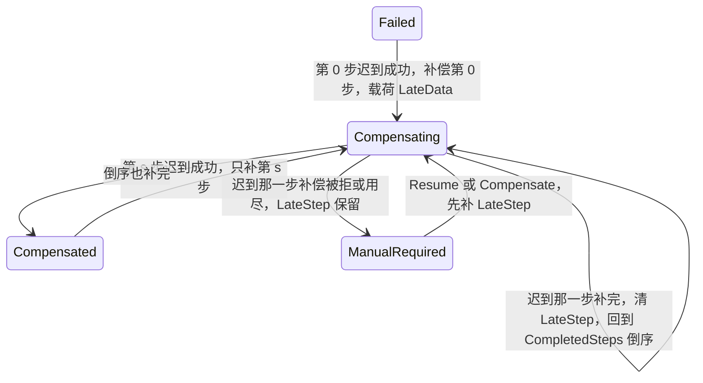
```mermaid
stateDiagram-v2
    Failed --> Compensating: 第 0 步迟到成功，补偿第 0 步，载荷 LateData
    Compensated --> Compensating: 第 s 步迟到成功，只补第 s 步
    Compensating --> Compensating: 迟到那一步补完，清 LateStep，回到 CompletedSteps 倒序
    Compensating --> Compensated: 倒序也补完
    Compensating --> ManualRequired: 迟到那一步补偿被拒或用尽，LateStep 保留
    ManualRequired --> Compensating: Resume 或 Compensate，先补 LateStep
```

顺序：第 s 步在“下一个边界”补偿，可能排在一个已在途的补偿之后（在途的补偿不能放弃，它可能生效）；正常业务按 `IdempotencyKey` 设计的资源状态不依赖跨步骤的补偿顺序（方案 4.3，SAGA.md 写明）。补偿第 s 步的 `IdempotencyKey` 是 `<saga>:2:s`，正常倒序里第 s 步不在 `CompletedSteps` 内、同一生里没派发过这个操作，`CommandID` 不会与旧回执相撞。

**5. 失败与不确定结果**

| 情形 | 处理 | 对调用方的样子 |
| --- | --- | --- |
| 同一生较早尝试晚到的可重试失败 | 不接收，计 `StaleAttempt` | 消费者 ack；正在等的尝试照常执行 |
| 较早尝试的拒绝经下一次尝试回放 | 接收（操作的结论） | 立即补偿，不等超时 |
| 迟到正向成功写记录冲突 | `compensateLateStep` 返回 `ErrConflict`，`Complete` 重读重试 | 与接收一次结果相同 |
| 同一迟到成功重复送达 | 回执已在 → `Duplicates` | 消费者 ack |
| 迟到那一步补偿被拒 / 用尽 | `ManualRequired`，`LateStep` 保留 | 运维修复后 `Resume` 先补它 |
| 防御情形（正向非终态、另一个迟到步骤、步骤在已完成前缀内） | 退回只告警（ERROR） | 不应发生（方案 4.3） |
| 自定义 Store 没实现 `CompletionHistoryStore` | 一律按重复处理 | 迟到生效的步骤不会被补偿（`saga/store.go:88-91`） |
| 自定义 Store 不持久化 `LateStep` / `LateData` | 记录读回后丢掉迟到步骤 | 该步不会被补偿；SAGA.md 持久格式一节要求原样保存 |

**6. 测试**

| 用例 | 文件 | 覆盖 |
| --- | --- | --- |
| `TestNativeStepStaleAttemptRetryableFailureDoesNotAbandonTheLastAttempt` | `saga/saga_direction_3_4_promises_test.go:20` | ③：k 的可重试失败不改变记录，k+1 的成功被接收，无迟到告警，`StaleAttempt == 1` |
| `TestNativeStepReplayedRefusalOfAnEarlierAttemptIsAccepted` | 同上 `:61` | ③ 守卫：回放的较早拒绝仍被接收、立即补偿 |
| `TestNativeStepLateSuccessReopensAFailedSagaToCompensateTheStep` | 同上 `:83` | ④：`Failed` 重开、补偿第 0 步（载荷是正向 Data）、`Compensated`；重复送达只计重复 |
| `TestNativeStepLateSuccessAfterCompensatedCompensatesOnlyThatStep` | 同上 `:171` | ④：`Compensated` 重开只补迟到那一步 |
| `TestNativeStepLateSuccessDuringAnInFlightCompensationIsCompensatedNext` | 同上 `:202` | ④：在途补偿不打断，之后先补迟到那一步，Data 链不被覆盖 |
| `TestNativeStepLateSuccessOnManualRequiredIsCompensatedOnResume` | 同上 `:228` | ④：`ManualRequired` 只记录，`Resume` 先补迟到那一步再补前缀 |
| `TestNativeStepLateCompensationSuccessIsOnlyAlarmed` | 同上 `:263` | 补偿方向只告警（守卫） |
| `TestMongoStoreIgnoresARetryableFailureOfAnEarlierAttempt`、`TestMongoStoreLateStepCompensationRoundTrip` | 同上 `:285` / `:314` | mongotest：③ 在 MongoStore 上；`late_step` / `late_data` 往返、回执与转移同一事务、补偿命令载荷 |
| `TestRealMongoLateSuccessReopensACompensatedSagaOnce` | `saga/late_step_real_mongo_integration_test.go:15`（integration） | 真实副本集：同一迟到成功 8 路并发 × 10 轮，每轮恰好一次把 `Compensated` 带回补偿第 1 步 |

断言被 ③④ 推翻的 4 条既有用例（按维护者决定改写，其余断言不动；方案“实施状态”原表）：

| 用例 | 原断言 | 改为 |
| --- | --- | --- |
| `TestNativeStepSuccessAfterAFailureClosedOperationIsAlarmed`（U-0280 复核 1，`saga/step_operation_review_test.go`） | 较早尝试晚到的可重试失败被接收、saga `Failed`、迟到成功告警 | 删除，同一时序改写成 ③ 的红绿用例 `TestNativeStepStaleAttemptRetryableFailureDoesNotAbandonTheLastAttempt`（原文件留了指向说明，`saga/step_operation_review_test.go:11`）；复核 1 的“以失败关闭记为放弃关闭”仍由 `TestMongoStoreTombstoneOfAFailureCloseIsAbandoned` 守住 |
| `TestNativeStepTakesEffectAtMostOncePerOperation/c'`（U-0280） | 迟到成功后 saga 仍 `Failed` | `Compensating`、只补第 0 步；告警计数 1、生效 1 次不变 |
| `TestNativeStepOperationInterleavingsWithCoordinatorDecisions` 的 Resume 回放 / saga 截止两个子用例（N06 S5） | 迟到成功后仍 `Failed`，运维 Resume 让新一生回放、继续向前 | 协调器自己补偿这一步（`Compensating` 不能 Resume），最终 `Compensated`，handler 只执行 1 次；截止子用例告警计数 1 不变 |
| `TestCoordinatorChecksTheIncarnationOfACompletion/E2`（B1） | 三次送达后 saga 仍 `Failed` | `Compensating`、`LateStep=1`；“三次送达只计一次”不变 |

改写的理由：这 4 条把被 ③④ 取消的旧行为（较早尝试的失败被接收；放弃后迟到的正向成功只告警、终态不变）钉成了承诺。改写只动这几处断言，各用例里其余承诺（生效次数、告警计数、handler 执行次数、代际）原样保留。

修前红（原样节选，基线 `66d72a33`，全文 [red-before.txt](../../feature/evidence/saga34/red-before.txt)）：

```text
--- FAIL: TestNativeStepStaleAttemptRetryableFailureDoesNotAbandonTheLastAttempt (0.00s)
    saga_direction_3_4_promises_test.go:40: a retryable failure of earlier attempt gift-1:1:0:1 moved the record while the coordinator waits for gift-1:1:0:2: status=failed step=0 command="" last_error="busy"; want still waiting for gift-1:1:0:2
--- FAIL: TestNativeStepLateSuccessReopensAFailedSagaToCompensateTheStep (0.00s)
    saga_direction_3_4_promises_test.go:99: step gift-3:1:0 took effect after the saga failed, but the saga was not brought back to compensate it: status=failed phase=forward step=0 completed=0
--- FAIL: TestNativeStepLateSuccessAfterCompensatedCompensatesOnlyThatStep (0.00s)
    saga_direction_3_4_promises_test.go:180: step gift-4:1:1 took effect after it was abandoned, but the compensated saga was not reopened to compensate it: status=compensated step=0
--- FAIL: TestNativeStepLateSuccessDuringAnInFlightCompensationIsCompensatedNext (0.00s)
    saga_direction_3_4_promises_test.go:211: after the in-flight compensation the late step gift-5:1:1 must be compensated next: status=compensated step=0 completed=0
--- FAIL: TestNativeStepLateSuccessOnManualRequiredIsCompensatedOnResume (0.00s)
    saga_direction_3_4_promises_test.go:247: after Resume the late step gift-6:1:1 must be compensated first, got {ID:gift-6:2:0:r1:1 ...}
```

修后（方案“验证”）：`go test -race -count=3 ./saga/... ./kit/saga/...` 通过；新增与改写的用例（及 B1 / U-0280 交错用例）`-race -count=50` 通过；私有三节点副本集（`scripts/mirror-local.sh`，offset 26900）上 `go test -tags integration -count=1 ./saga/` 全部通过，跨进程强杀 `TestRealSagaCrossProcessKillRecovers` 60/60 完成、120 个操作、0 个操作被多次提交（[integration.txt](../../feature/evidence/saga34/integration.txt)）；`TestRealMongoLateSuccessReopensACompensatedSagaOnce` `-count=3` 通过；`scripts/test-dataengine-generated.sh`、根包、`go build ./... && go vet ./...` 通过。未改 nest / entity / dataengine / sync 与生成模板，没有跑 glsvet、codegen、game-demo 重生成（按影响面）。

**7. 性能证据**：未做基准（方案 §5）：③ 在 `Complete` 多一次字符串比较；④ 正常路径只多两个 `omitempty` 字段与 `Validate` 里几次整数比较，`Apply` / `ClaimDue` / 收件箱 / 投影都不变；迟到路径是一次 `Apply` 事务加一次正常补偿。

**8. 未验证项与已知风险**

- 时钟偏差仍是契约前提（与 SAGA.md 契约第 2 条相同）：③ 的论证“k 的拒绝已送达与 k+1 在执行不会同时成立”依赖协调器与步骤进程的时钟偏差远小于 `Timeout`；偏差注入见 [E02](../../review/EXTERNAL-VERIFICATION-2026-10-06.md)，多主机强杀见 [E13](../../review/EXTERNAL-VERIFICATION-2026-10-06.md)。
- 补偿顺序偏离严格倒序（迟到那一步排在已在途的补偿之后）是设计取舍（方案 4.3），SAGA.md 写明，依赖业务补偿不要求跨步骤严格倒序。
- 不兼容：线上未部署，维护者 2026-10-06 决定不做兼容；`Failed` / `Compensated` 不再是永远不变的终态，按终态做业务的一方见 [SAGA-17](#saga-17)。

**9. review 检查点**

- [ ] `saga/engine.go:442-447`：③ 只拦 `Retryable` 的失败；确认拒绝（`Retryable=false`）与成功从较早尝试来时一定是“操作的结论”——对照收件箱判定表第 10～11 步（[SAGA-14](#saga-14) §4）：本生拒绝回放、任何一生的成功回放。
- [ ] `saga/engine.go:540-546` `lateForwardStep`：确认 `record.Status == StatusManualRequired` 且 `Phase == PhaseForward`（定义缺失 fence）时，`LateStep` 写进去后 `lateStepValid`（`saga/record.go:265-272`）放行、`Resume`（`saga/engine.go:342-344`）先补它而不是回到正向。
- [ ] `saga/engine.go:562`：`openOperation(record) == ""` 时立即转去补偿；确认 `Compensating` 且 `Attempt == 0`（两个补偿之间）与 `Failed` / `Compensated` 都满足，而 `Waiting` 与退避中（`Attempt > 0`）不满足。
- [ ] `nextCompensation`（`saga/engine.go:607-626`）是选下一个补偿的唯一一处：grep `after.Step = after.CompletedSteps - 1`，确认没有别的出口自己算补偿步骤。
- [ ] `applyCompletion` 的 `late` 分支（`saga/engine.go:936-962`）：迟到那一步补偿成功时 `CompletedSteps` 不减、`Data` 不覆盖；确认补偿被拒（`Retryable=false`）走 `ManualRequired` 时 `LateStep` 保留，下一次 `Resume` 仍先补它。
- [ ] `lateStepValid` 禁止 `LateStep > 0` 出现在 `Failed` / `Compensated` / `Completed`：确认 `compensationState`（`saga/engine.go:1037-1049`）在 `CompletedSteps == 0 && LateStep > 0` 时走 `nextCompensation` 而不是 `Failed`。

<a id="saga-17"></a>
### SAGA-17 重开的可观测性：saga.reopened_total、Stats().Reopened、WARN / INFO

> 首发 v1.23.0（本版） · [说明](guide-saga-drv-dao-rem.md#saga-17) · 前置 [SAGA-16](#saga-16)

**1. 提交**

| 提交 | 版本 | 内容 |
| --- | --- | --- |
| `93efc3cc` | v1.23.0（本版） | `saga.reopened_total{saga_type,from_status,reason}` 与 `Stats().Reopened`（kit saga 健康消息加 `reopened=`）；`reportReopen`；迟到那一步补完的 INFO；SAGA.md「运维观察」；T-292；用例 |
| `3f2b4897` | v1.23.0（本版） | DECISIONS-PENDING 第十三轮一行更新 |

实施记录：[SAGA-DIRECTION-3-4 §8](../../feature/SAGA-DIRECTION-3-4-2026-10-07.md#8-重开的可观测性维护者第十三轮选-a2026-10-07)。基线 `f18f6f42`。

**2. 改动文件与关键符号**（`5e72ca4d`）

| `path:line` | 符号 | 职责 |
| --- | --- | --- |
| `saga/engine.go:78-82` | `Stats.Reopened` | 重开次数 |
| `saga/engine.go:582-589` | `reopenLateSuccess` / `reopenResume` / `reopenCompensate` | `reason` 标签只有三个取值 |
| `saga/engine.go:595` | `reportReopen` | 计数、指标 `saga.reopened_total`（标签 `saga_type`、`from_status` = 原状态、`reason`），WARN `saga: reopened to compensate a step that took effect after the coordinator abandoned it`（`saga_id`、`saga_type`、`from_status`、`reason`、`late_step`、`status`、`version`） |
| `saga/engine.go:575-577` | `compensateLateStep` 调用点 | 写入成功、且写之前记录是 `Failed` / `Compensated` 时计 `late_success`；迟到成功到达时 saga 还在补偿中不计 |
| `saga/engine.go:358-360` / `:398-400` | `Resume` / `Compensate` 调用点 | `ManualRequired` 期间记下的迟到步骤（`LateStep > 0`）被补时计 `resume` / `compensate`，`from_status=manual_required`；没有迟到步骤的普通 `Resume` 不计 |
| `saga/engine.go:474-478` | `Complete` | 迟到那一步补偿成功时 INFO `saga: compensated the step that took effect after the coordinator abandoned it`（之后的 `status`），运维按 `saga_id` 把两端对上 |
| `kit/saga/mod.go:217` | 健康消息 | 末尾多 `reopened=<n>` |

**3. 不变量与强制点**：计数与日志都在写入成功之后（与 `reportLateCompensation` 同一位置），冲突重试、重复送达不会多计（重复送达按回执去重，`ApplyDuplicate` 分支在 `reportReopen` 之前返回，`saga/engine.go:570-573`）。指标只有三个低基数标签，saga id 与步骤号只进日志。不改记录、持久格式与状态机。

**4. 控制流**：迟到成功 → `compensateLateStep` 写入成功 → `reportLateCompensation`（`late_after_abandon_total{phase="forward"}`、WARN `...; compensating it`）→ 原状态是 `Failed` / `Compensated` 时 `reportReopen(late_success)`。`ManualRequired` 上 `Resume` / `Compensate` 写入成功 → 有 `LateStep` 时 `reportReopen(resume|compensate)`。迟到那一步补偿成功 → `Complete` 记 INFO。

终态通知机制（实施记录核对）：saga 没有向业务推送终态的机制——`Publisher` 只发步骤命令，`SubscribeCompletions` / `SubscribeNestCompletions` 是步骤发给协调器的结果流，`SubscribeNestStarts` 是启动入口；业务只能 `Get` / `List` 读记录。所以按要求不新增事件，在 SAGA.md「运维观察」写明业务怎样识别重开：读到终态时记下 `Record.Version`，版本变大就按新状态重做；重开期间 `Compensating` 且 `LateStep>0`。

**5. 失败与不确定结果**

| 情形 | 处理 | 结果 |
| --- | --- | --- |
| 写记录冲突重试 | 计数在写入成功之后 | 不多计 |
| 同一迟到成功重复送达 | 回执去重 | 不多计 |
| 迟到成功到达时 saga 还在补偿中（非终态） | 不是重开 | 只计 `late_after_abandon_total{phase="forward"}` |
| `ManualRequired` 期间记下 `LateStep` 的那一刻 | 记录仍等运维 | 不计；`Resume` / `Compensate` 时计 |
| `Compensated` / `Completed` / `Failed` 的 `Stats()` 计数 | 按到达终态的次数计 | 重开的 saga 补偿完再次到达终态会再计一次，不能当作 saga 个数（SAGA.md「运维观察」） |

**6. 测试**

| 用例 | 文件 | 覆盖 |
| --- | --- | --- |
| `TestReopeningAFailedSagaIsCountedAndLogged` | `saga/saga_reopen_observability_promises_test.go:88` | `from_status=failed,reason=late_success` +1、WARN 字段、重复送达不再计、`Stats().Reopened == 1` |
| `TestReopeningACompensatedSagaIsCountedAndLogged` | 同上 `:129` | `from_status=compensated,reason=late_success` |
| `TestLateSuccessDuringCompensationIsNotAReopen` | 同上 `:150` | 非终态不计（守卫） |
| `TestResumeCompensatingALateStepIsCountedAndLogged` | 同上 `:166` | `from_status=manual_required,reason=resume` |
| `TestPlainResumeIsNotAReopen` | 同上 `:192` | 无迟到步骤的 Resume 不计（守卫） |
| `TestManualCompensateOfALateStepIsCountedAndLogged` | 同上 `:213` | `reason=compensate`（修后加入的新 API 用例） |

修前红（原样，基线 `f18f6f42` 只加测试，全文 [red-before.txt](../../feature/evidence/sagareopen/red-before.txt)）：

```text
--- FAIL: TestReopeningAFailedSagaIsCountedAndLogged (0.00s)
    saga_reopen_observability_promises_test.go:108: a Failed saga was reopened by a late success of gift-1:1:0, but saga.reopened_total{from_status=failed,reason=late_success} grew by 0, want 1
--- FAIL: TestReopeningACompensatedSagaIsCountedAndLogged (0.00s)
    saga_reopen_observability_promises_test.go:140: a Compensated saga was reopened by a late success of gift-2:1:1, but saga.reopened_total{from_status=compensated,reason=late_success} grew by 0, want 1
--- FAIL: TestResumeCompensatingALateStepIsCountedAndLogged (0.00s)
    saga_reopen_observability_promises_test.go:183: Resume compensates the late step 1 recorded during ManualRequired, but saga.reopened_total{from_status=manual_required,reason=resume} grew by 0, want 1
```

修后：全部通过；`go vet ./saga/... ./kit/saga/...`、`go test -race -count=3 ./saga/... ./kit/saga/...`、根包、`go build ./... && go vet ./...` 通过。不改持久格式与状态机，没有跑真实 Mongo 用例（按影响面）。

**7. 性能证据**：无（只在重开路径多一次计数与一条日志）。

**8. 未验证项与已知风险**：无外部验证项。业务侧识别重开靠读记录的 `Version`（saga 没有终态推送），这是写明的使用方式，不是缺陷。

**9. review 检查点**

- [ ] `saga/engine.go:575-577`：`reportReopen` 的判断用的是写之前的 `record.Status`；确认 `Compensating` 且 `Attempt == 0`（两个补偿之间）收到迟到成功时立即补偿但不计重开，与 T-292 的现象描述一致。
- [ ] `saga/engine.go:358-360` / `:398-400`：`Resume` / `Compensate` 只在 `record.LateStep > 0` 时计；确认 `Compensate` 对补偿方向 `ManualRequired`（`LateStep == 0`）的普通人工补偿不计。
- [ ] SAGA.md「运维观察」与 T-292 写的识别方法（`Version` 变大、`Compensating` 且 `LateStep>0`、`LastError` 文本）与源码一致：`compensateLateStep` 的 `LastError`（`saga/engine.go:563`）只在立即转去补偿时写。

## DRV：Redis / Mongo 驱动契约

<a id="drv-1"></a>
### DRV-1 Redis 脚本不经驱动重放（RR-20261005-NC-100）

> 首发 v1.20.1 · [说明](guide-saga-drv-dao-rem.md#drv-1)

**1. 提交**

| 提交 | 版本 | 内容 |
| --- | --- | --- |
| `81659082` | v1.20.1 | NC-100～102：脚本包成 `scriptCmd`（`NoRetry`）经 `rdb.Process` 发送；`EvalBatchDurable` 同一命令；`versionstore.Store.Update` 注释写明结果未知；故障矩阵加 `./versionstore`；回归 `script_no_retry_promises_test.go`、`versionstore/lost_reply_integration_test.go`。同提交含 NC-101（[DRV-2](#drv-2)）与 NC-102（mongotest 唯一索引遇数组返回 `ErrUnsupported`，NONCORE） |
| `998857ab` | v1.20.1 | revn04 证据补共享 toxiproxy 事故影响核对与 `-run` 复跑结果（只改证据 README） |
| `cf5721c9` | v1.20.2 | A2：`scriptCmd` 并入通用 `noReplay`（`redis/driver/replay.go`），脚本在确定没执行时恢复重发（见 [DRV-3](#drv-3)） |
| `6b3a0eb9` | v1.23.0（本版） | A2 ③：versionstore 在 store 内按写令牌核对回复丢失的写（[DRV-7](#drv-7)）；NC-100 的真实 Redis 用例现在打印 `lost reply surfaced as <nil>`（核对成已生效） |

**2. 改动文件与关键符号**（当前源码 `5e72ca4d`）

| `path:line` | 符号 | 职责 |
| --- | --- | --- |
| `redis/driver/client.go:336` | `newScriptCmd` | 与 go-redis `cmdable.eval` 相同的参数与首键位置（`SetFirstKeyPos(3)`），集群槽位计算不变 |
| `redis/driver/client.go:353` | `runScript` | 组装脚本命令后经 `sendOnce` 发一次（A2 之后的形状；NC-100 当时是 `scriptCmd` + `rdb.Process`） |
| `redis/driver/client.go:359` / `:363` | `Client.Eval` / `EvalSha` | 走 `runScript` |
| `redis/driver/client.go:384` | `Client.EvalBatchDurable` | 脚本批次 + WAITAOF 同一独占连接；整批不经驱动重放 |
| `redis/driver/client.go:408` | `evalBatchOnConn` | 每条脚本与 WAITAOF 都以 `noReplay{…}` 入流水线，含 NoRetry 的流水线整体不重发 |
| `redis/driver/replay.go:64` | `noReplay` | `NoRetry() == true`，`Clone` 保留标记（`:69`） |
| `versionstore/versionstore.go:88-102` | `Store.Update` 注释 | 传输错误是结果未知、store 从不盲目重放（NC-100）；本版起 Redis store 按写令牌自行核对，证明不了的返回 `ErrOutcomeUnknown`，`Resume` 续核（[DRV-7](#drv-7)） |
| `versionstore/redis_store.go:344` | `RedisStore.Update` | CAS 脚本调用方；“比较输了”时重读重跑 mutate；传输错误在 NC-100～v1.22.0 原样返回，本版交给 `settle` 核对（[DRV-7](#drv-7)） |
| `kit/scripts/integration/dataengine-env.sh:164` | 故障矩阵 `test` | 加入 `./versionstore`（根包 `TestFaultMatrixScriptNamesEveryFullEnvironmentSuite` 要求列入，`integration_coverage_promises_test.go:216`） |

**3. 不变量与强制点**

- 不变量：一次脚本调用在服务端至多执行一次；回复丢失返回错误。
- 强制点：所有脚本经 `runScript` → `sendOnce`（`redis/driver/replay.go:110`），后者把命令包成 `noReplay` 再交给 `rdb.Process`；go-redis 的 `processWithRetry` / `generalProcessPipeline` / Cluster `process` 看到 `NoRetry` 都跳过。MOVED / ASK 重定向分支在 NoRetry 检查之前，照常跟随（脚本在错误节点上没有执行）。
- 守卫测试：`TestAScriptWhoseReplyIsLostIsNotReplayedByTheDriver`（`redis/driver/script_no_retry_promises_test.go:127`，RESP 替身：eval / evalsha 各执行恰好 1 次且返回错误）；`TestNoReplayMarkSurvivesCloneAndUnmarkedCommandsKeepTheDriverRetry`（原名 `TestOnlyScriptCommandsOptOutOfTheDriverRetry`，`:167`，标记克隆后仍在、普通 GET 不带标记）；`TestRealRedisUpdateWhoseReplyIsLostNeverWritesTwice`（`versionstore/lost_reply_integration_test.go:106`，`-tags integration`，真实 Redis + 自建随机端口 toxiproxy 代理）。

**4. 控制流**

1. `versionstore.RedisStore.Update` 调 `IRedis.Eval(CAS 脚本)`。
2. `Client.Eval` → `runScript` → `newScriptCmd` → `sendOnce(ctx, rdb, resends, cmd)`。
3. `sendOnce` 发 `noReplay{cmd}`；成功返回结果；错误时只有 `shouldResend`（确定没执行且不是 `ErrClosed`）才退避重发（A2 起；v1.20.1 时一律不重发）。
4. 回复丢失 → EOF / 超时原样返回 → v1.20.1～v1.22.0：`Update` 原样返回错误（不重读、不重试）；本版：`Update` 读一次键按写令牌核对，已生效返回那次结果、确定没执行才原样重发同一条命令（[DRV-7](#drv-7)）。驱动层仍不重放。

**5. 失败与不确定结果**

| 情形 | 处理 | 调用方看到 |
| --- | --- | --- |
| 脚本执行后回复丢失（EOF / 部分回复 / 读超时） | 不重发 | 传输错误（结果未知）；`IsDefinitelyNotExecuted` 为假 |
| 取连接时拨号失败、LOADING 等执行前拒绝 | v1.20.1：不重发；v1.20.2 起：重发至多 `resendsFor(MaxRetries)` 次 | 成功，或最后一次的确定未执行错误 |
| Cluster MOVED / ASK | go-redis 跟随重定向 | 正常结果 |
| 脚本自身报错（`ERR … user_script`） | 不重发 | 已执行并报错 |

**6. 测试**

| 用例 | 文件 | 覆盖 |
| --- | --- | --- |
| `TestAScriptWhoseReplyIsLostIsNotReplayedByTheDriver` | `redis/driver/script_no_retry_promises_test.go` | eval / evalsha 回复丢失只执行一次、返回错误 |
| `TestNoReplayMarkSurvivesCloneAndUnmarkedCommandsKeepTheDriverRetry`（原名 `TestOnlyScriptCommandsOptOutOfTheDriverRetry`） | 同上 | `noReplay` 标记与克隆；普通命令仍可重试 |
| `TestRealRedisUpdateWhoseReplyIsLostNeverWritesTwice` | `versionstore/lost_reply_integration_test.go` | 真实 Redis：一次 Update 在 Redis 中至多一次写入；NC-100 时调用方拿到错误，本版 store 内核对成已生效（`err=nil`，见 [DRV-7](#drv-7)） |

修前红文本（原样，出处 `docs/bugfix/evidence/noncore-bugfix-20261005-revn04/nc100-driver-red.txt`）：

```text
=== RUN   TestAScriptWhoseReplyIsLostIsNotReplayedByTheDriver
=== RUN   TestAScriptWhoseReplyIsLostIsNotReplayedByTheDriver/eval
    script_no_retry_promises_test.go:153: one eval call executed the script 2 times on the server (reply=1 err=<nil>); want exactly once
=== RUN   TestAScriptWhoseReplyIsLostIsNotReplayedByTheDriver/evalsha
    script_no_retry_promises_test.go:153: one evalsha call executed the script 2 times on the server (reply=1 err=<nil>); want exactly once
--- FAIL: TestAScriptWhoseReplyIsLostIsNotReplayedByTheDriver (0.04s)
    --- FAIL: TestAScriptWhoseReplyIsLostIsNotReplayedByTheDriver/eval (0.03s)
    --- FAIL: TestAScriptWhoseReplyIsLostIsNotReplayedByTheDriver/evalsha (0.01s)
FAIL
FAIL	github.com/tjbdwanghaibo/roost-core/redis/driver	0.383s
FAIL
```

真实 Redis 修前 / 修后（原样，出处 `nc100-versionstore-real-red.txt` / `nc100-versionstore-real-green.txt`，同一证据目录）：

```text
=== RUN   TestRealRedisUpdateWhoseReplyIsLostNeverWritesTwice
    lost_reply_integration_test.go:154: one Update wrote its mutation 2 times: stored [hello msg-1 msg-1] / v3 (update returned [hello msg-1 msg-1] / v3 applied=true err=<nil>, mutate ran 2 times)
--- FAIL: TestRealRedisUpdateWhoseReplyIsLostNeverWritesTwice (0.12s)
FAIL
FAIL	github.com/tjbdwanghaibo/roost-core/versionstore	0.668s
FAIL
=== RUN   TestRealRedisUpdateWhoseReplyIsLostNeverWritesTwice
    lost_reply_integration_test.go:163: lost reply surfaced as EOF; Redis holds [hello msg-1] / v2
--- PASS: TestRealRedisUpdateWhoseReplyIsLostNeverWritesTwice (0.03s)
PASS
ok  	github.com/tjbdwanghaibo/roost-core/versionstore	0.578s
```

修后其他命令与结果（原样，出处 `docs/bugfix/RR-20261005-NC-100.md`“回归命令与结果”）：

```text
GOWORK=off go test -race -count=3 ./redis/... ./versionstore/ ./cache/...                      ok
REDIS_ADDR=127.0.0.1:17379 GOWORK=off go test -tags integration -count=1 -p 1 ./kit/service/... ./service/... ./versionstore/ ./cache/...
  1008 pass / 30 环境 skip / 0 fail（真实 Redis，各用例独立前缀）
GOWORK=off go test -tags integration -count=1 -run TestRealVersionedLock ./remoteentity/     ok（真实 Redis）
GOWORK=off go test -tags integration -count=1 -run 'TestMGet|TestIntegrationPipeline|TestDistLockExpiry' ./redis/driver/   ok
```

负对照：问题记录写明，同一真实 Redis 用例把 `MaxRetries` 设为 -1 时 Update 返回 `EOF`、Redis 中 `[hello msg-1] / v2`（探针已删，结论写入正式回归）。

**7. 性能证据**：无（不涉及热路径；只改命令的重试标记）。

**8. 未验证项与已知风险**

- Redis Cluster 下脚本的 MOVED / ASK 与节点故障（本机无 Cluster），外部验证 E08。
- `redis/driver/lock_toxic_integration_test.go` 会 `/reset` 共享 toxiproxy，按 A5 只能在自建代理或私有环境上跑，不在共享隔离环境上运行。
- remoteentity marker / snapshot L2 / versioned lock 的脚本在回复丢失时返回错误而不是被驱动重放：驱动层由 `TestAScriptWhoseReplyIsLostIsNotReplayedByTheDriver`（eval / evalsha）覆盖，调用方对错误的处理沿用各自的结果未知契约，真实锁路径由 `TestRealVersionedLock*`（`remoteentity`，`-tags integration`）覆盖。
- 测试名：A2 之后原名 `TestOnlyScriptCommandsOptOutOfTheDriverRetry` 名不副实（写命令也带 `NoRetry`），fixs 已改名为 `TestNoReplayMarkSurvivesCloneAndUnmarkedCommandsKeepTheDriverRetry`（`redis/driver/script_no_retry_promises_test.go:167`）。

**9. review 检查点**

- [ ] 确认全部脚本入口都经 `runScript` / `noReplay`：`grep -n 'rdb.Eval\|rdb.EvalSha\|\.Eval(ctx' redis/driver/*.go`，生产代码里不应有直接 `c.rdb.Eval(...)`；`EvalReplicated`（`redis/driver/replicated.go:72-75`）与 `evalBatchOnConn`（`redis/driver/client.go:408`）都包了 `noReplay`。
- [ ] 确认 `noReplay.Clone`（`redis/driver/replay.go:69`）保留标记：Cluster 路由层复制命令时若退回原命令，就会重新可重放。
- [ ] 确认 `newScriptCmd`（`redis/driver/client.go:336`）的首键位置与 go-redis `cmdable.eval` 一致（无键时不设 `FirstKeyPos`），否则 Cluster 槽位计算会变。
- [ ] 确认 `versionstore/redis_store.go:344` 的 `Update` 在传输错误上不重跑 mutate、不盲目重发：本版传输错误只交给 `settle`（`versionstore/write_token.go:302`），后者读到的字节证明“没执行”才原样重发同一条命令（同一令牌、同一期望值），其余返回 `ErrOutcomeUnknown`；“比较输了”才重读重跑 mutate。
- [ ] 确认仓内生产代码没有经 `Client.Raw()` 发脚本或写命令（当前 `grep -rn 'Raw()' --include='*.go' . | grep -v _test.go` 只有定义处）。

<a id="drv-2"></a>
### DRV-2 Mongo 事务提交受 transaction_timeout 约束（RR-20261005-NC-101 及两处复审）

> 首发 v1.20.1 · [说明](guide-saga-drv-dao-rem.md#drv-2)

**1. 提交**

| 提交 | 版本 | 内容 |
| --- | --- | --- |
| `81659082` | v1.20.1 | `session.WithTransaction` 自实现与驱动便捷 API 相同的重试规则，提交用带 `transaction_timeout` 截止的 ctx；回调失败的 abort 有 5s 上限；`mongo/config.go` 注释；回归 `transaction_deadline_integration_test.go` |
| `edbe290b` | v1.20.1 | 复审 1：`EndSession` 用 `WithoutCancel` + 5s 上限；回归 `TestRealMongoEndSessionAfterCommitTimeoutIsBounded` |
| `f608503b` | v1.20.1 | 复审 2：窗口在退避里到期时返回 `errors.Join(ctx.Err(), lastErr)`；回归 `transaction_retry_chain_test.go` |
| `cf5721c9` | v1.20.2 | A2：提交发出后失败包 `fmongo.ErrCommitResultUnknown`（见 [DRV-3](#drv-3)） |

**2. 改动文件与关键符号**

| `path:line` | 符号 | 职责 |
| --- | --- | --- |
| `mongo/driver/session.go:19` | `defaultTransactionTimeout` | `TransactionTimeout <= 0` 时用 120s（同驱动） |
| `mongo/driver/session.go:22` | `transactionAbortTimeout` | abort 与 EndSession 的 5s 上限 |
| `mongo/driver/session.go:24-25` | `transactionBackoffInitial` / `Max` | 5ms 起、封顶 500ms |
| `mongo/driver/session.go:56` | `session.WithTransaction` | 自实现重试循环；`ctx` 套 `TransactionTimeout` 截止（`:64`） |
| `mongo/driver/session.go:69` / `:78` | `lastErr` / 退避分支 | 记住触发重跑的错误；退避中到期返回 `errors.Join(ctx.Err(), lastErr)` |
| `mongo/driver/session.go:98` | 提交前截止检查 | 已到期不发提交，abort 后返回 ctx 错误 |
| `mongo/driver/session.go:119` | `session.commit` | UnknownTransactionCommitResult（非 MaxTimeMS）只重试提交；Transient 返回 `retryCallback` |
| `mongo/driver/session.go:142` | `session.abort` | `WithoutCancel` + 5s |
| `mongo/driver/session.go:160` | `session.EndSession` | `WithoutCancel` + 5s；无进行中事务时驱动不发命令 |
| `mongo/config.go:12` | `Config.TransactionTimeout` 注释 | 端到端约束回调重试与提交 |

**3. 不变量与强制点**

- 不变量 1：整次 `WithTransaction`（含提交）不晚于 `TransactionTimeout` 返回；回调失败时另加至多 5s abort。强制点：`mongo/driver/session.go:64` 的 `context.WithTimeout` 交给回调与 `CommitTransaction`。
- 不变量 2：调用方 `defer EndSession(ctx)` 不因无截止的 ctx 而无界阻塞。强制点：`mongo/driver/session.go:164`。
- 不变量 3：窗口到期时最后一次事务错误的链不丢。强制点：`mongo/driver/session.go:78`。
- 守卫测试：`TestRealMongoCommitIsBoundedByTransactionTimeout`（`mongo/driver/transaction_deadline_integration_test.go:103`）、`TestRealMongoEndSessionAfterCommitTimeoutIsBounded`（`:191`）、`TestWithTransactionKeepsTheLastCallbackErrorWhenTheWindowClosesInBackoff`（`mongo/driver/transaction_retry_chain_test.go:23`，不需要服务端、不靠 sleep）。

**4. 控制流**

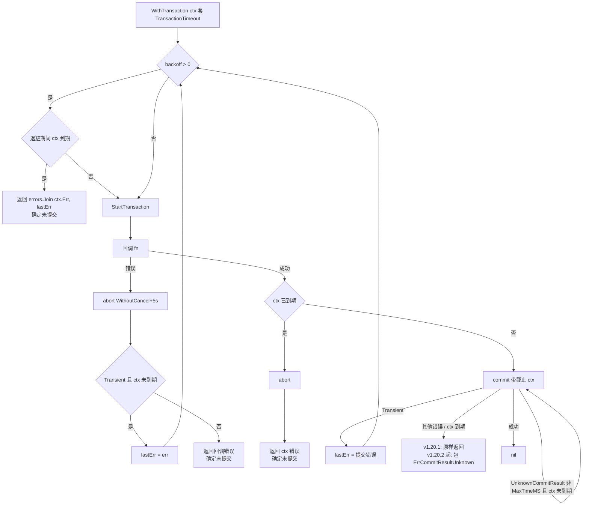
```mermaid
flowchart TD
    A[WithTransaction ctx 套 TransactionTimeout] --> B{"backoff > 0"}
    B -- 是 --> C{退避期间 ctx 到期}
    C -- 是 --> R1["返回 errors.Join ctx.Err, lastErr<br/>确定未提交"]
    C -- 否 --> D
    B -- 否 --> D[StartTransaction]
    D --> E[回调 fn]
    E -- 错误 --> F[abort WithoutCancel+5s]
    F --> G{Transient 且 ctx 未到期}
    G -- 是 --> H["lastErr = err"] --> B
    G -- 否 --> R2["返回回调错误<br/>确定未提交"]
    E -- 成功 --> I{ctx 已到期}
    I -- 是 --> J[abort] --> R3["返回 ctx 错误<br/>确定未提交"]
    I -- 否 --> K[commit 带截止 ctx]
    K -- UnknownCommitResult 非 MaxTimeMS 且 ctx 未到期 --> K
    K -- Transient --> L["lastErr = 提交错误"] --> B
    K -- 其他错误 / ctx 到期 --> R4["v1.20.1: 原样返回<br/>v1.20.2 起: 包 ErrCommitResultUnknown"]
    K -- 成功 --> R5[nil]
```

调用方随后 `defer EndSession(ctx)`：提交因截止失败时驱动事务状态仍是 InProgress，驱动在 `EndSession` 里补发 abort；`mongo/driver/session.go:164` 给它 `WithoutCancel` + 5s 上限。

**5. 失败与不确定结果**

| 情形 | 处理 | 调用方看到 |
| --- | --- | --- |
| 回调返回非 Transient 错误 | abort（5s 上限）后返回 | 回调错误，确定未提交 |
| 回调 / 提交 Transient，窗口在退避里到期 | 不再重跑 | `errors.Join(ctx.Err(), lastErr)`，确定未提交；`errors.Is` DeadlineExceeded 与 lastErr 链都成立 |
| 回调完成时截止已到 | 不发提交，abort | ctx 错误，确定未提交 |
| 提交发出后网络黑洞 / 截止落在提交中途 | 不 abort（与驱动一致） | 驱动错误；v1.20.2 起包 `ErrCommitResultUnknown`，可能已提交 |
| 提交后 `EndSession` 补发 abort 遇黑洞 | 5s 后放弃 | 无错误；服务端事务持锁到 `transactionLifetimeLimitSeconds`（缺省 60s） |

**6. 测试**

| 用例 | 文件 | 覆盖 |
| --- | --- | --- |
| `TestRealMongoCommitIsBoundedByTransactionTimeout` | `mongo/driver/transaction_deadline_integration_test.go` | 真实副本集 + 自建 toxiproxy，upstream / downstream 黑洞，2s 窗口不晚于 4s 返回 |
| `TestRealMongoEndSessionAfterCommitTimeoutIsBounded` | 同上 | 提交超时后 `EndSession` 不晚于 9s |
| `TestWithTransactionKeepsTheLastCallbackErrorWhenTheWindowClosesInBackoff` | `mongo/driver/transaction_retry_chain_test.go` | 退避中到期保留 `ErrDuplicateKey` 与 Transient 标签 |
| `TestRealMongoWriteErrorAbortsTransactionAndKeepsDriverChain` | `mongo/driver/real_mongo_transaction_test.go` | 既有：transient 重跑一次、写错误中止不重跑 |

修前红文本（原样，出处 `docs/bugfix/evidence/noncore-bugfix-20261005-revn04/nc101-real-mongo-red.txt`）：

```text
=== RUN   TestRealMongoCommitIsBoundedByTransactionTimeout
=== RUN   TestRealMongoCommitIsBoundedByTransactionTimeout/upstream
    transaction_deadline_integration_test.go:150: upstream: elapsed=30.2s calls=1 committed=1 err=<nil>
    transaction_deadline_integration_test.go:152: WithTransaction with transaction_timeout=2s returned after 30.2s (bound 4s); the commit is not bounded
=== RUN   TestRealMongoCommitIsBoundedByTransactionTimeout/downstream
    transaction_deadline_integration_test.go:150: downstream: elapsed=29.79s calls=1 committed=1 err=server selection error: context deadline exceeded, current topology: { Type: Single, Servers: [{ Addr: 127.0.0.1:56845, Type: Unknown, Last error:  connection(127.0.0.1:56845[-201]) incomplete read of message header: context deadline exceeded: client timed out waiting for server response: read tcp 127.0.0.1:56949->127.0.0.1:56845: i/o timeout: connection(127.0.0.1:56845[-201]) incomplete read of message header: context deadline exceeded: client timed out waiting for server response: read tcp 127.0.0.1:56949->127.0.0.1:56845: i/o timeout }, ] }
    transaction_deadline_integration_test.go:152: WithTransaction with transaction_timeout=2s returned after 29.79s (bound 4s); the commit is not bounded
--- FAIL: TestRealMongoCommitIsBoundedByTransactionTimeout (61.25s)
    --- FAIL: TestRealMongoCommitIsBoundedByTransactionTimeout/upstream (30.59s)
    --- FAIL: TestRealMongoCommitIsBoundedByTransactionTimeout/downstream (30.65s)
FAIL
FAIL	github.com/tjbdwanghaibo/roost-core/mongo/driver	61.781s
FAIL
```

修后（原样节选，出处 `nc101-real-mongo-green.txt`，整包 integration 输出）：

```text
    transaction_deadline_integration_test.go:150: upstream: elapsed=2s calls=1 committed=0 err= connection(127.0.0.1:57151[-144]) incomplete read of message header: context deadline exceeded: client timed out waiting for server response: read tcp 127.0.0.1:57154->127.0.0.1:57151: i/o timeout: connection(127.0.0.1:57151[-144]) incomplete read of message header: context deadline exceeded: client timed out waiting for server response: read tcp 127.0.0.1:57154->127.0.0.1:57151: i/o timeout
--- PASS: TestRealMongoCommitIsBoundedByTransactionTimeout (5.37s)
    --- PASS: TestRealMongoCommitIsBoundedByTransactionTimeout/upstream (2.79s)
    --- PASS: TestRealMongoCommitIsBoundedByTransactionTimeout/downstream (2.58s)
```

两处复审的红绿（原样，出处 `docs/bugfix/RR-20261005-NC-101.md`“复审追加”）：

```text
GOWORK=off go test -tags integration -count=1 -run TestRealMongoEndSessionAfterCommitTimeoutIsBounded -v ./mongo/driver/
# 修前（81659082 的 session.go）：
#   upstream: WithTransaction=2s EndSession done at 30.01s（看门狗恢复网络的时刻）  FAIL bound 9s
#   downstream: WithTransaction=2s EndSession done at 24.97s                         FAIL bound 9s
# 修后：upstream / downstream 均 EndSession done at 7s（2s 窗口 + 5s abort 上限）     PASS
```

```text
GOWORK=off go test -count=5 -run TestWithTransactionKeepsTheLastCallbackErrorWhenTheWindowClosesInBackoff ./mongo/driver/
# 修前：5/5 FAIL  err=context deadline exceeded after 10 callbacks lost the last callback error (errors.Is ErrDuplicateKey=false, transient label=false)
# 修后：-count=60 与 -race -count=30 全部 PASS（60 次里 1 次窗口落在回调与检查之间，那条分支本来就返回回调错误）
```

其他修后验证（`docs/bugfix/RR-20261005-NC-101.md`）：`go test -race -count=3 ./mongo/...` ok；mongotest 消费包 `./dataengine/engine ./kit/dataengine ./kit/saga ./nestwal ./remoteentity ./saga` ok；第 22 轮 28 个正式链路消费叶子在真实副本集上两次全部通过。

**7. 性能证据**：未测（只改超时与错误包装，正常路径无额外往返；`EndSession` 在无进行中事务时不发命令）。

**8. 未验证项与已知风险**

- mongos 上提交失败后 abort 的并发问题（本实现同样不 abort，未实测）、主从切换期间的提交、`transactionLifetimeLimitSeconds` 与短窗口的组合：E11。
- 驱动升级时便捷 API 规则若变，需同步本循环（`mongo/driver/README.md` 文首写明）。
- 上限内没送达的 abort 留下的服务端事务持锁到 60s，其间同文档写入得到 WriteConflict 并重跑。
- 主节点切换期间的事务行为属 E11（NC-101 修复当轮没有跑 kit/dataengine 含主节点切换的真实 Mongo 套件；本机副本集的切主在 [DRV-6](#drv-6) 的 `TestMirrorLocalOwnerStorageInitSurvivesAMongoElection` 里覆盖启动 DDL 一条路径）。

**9. review 检查点**

- [ ] 确认 `CommitTransaction` 只经 `session.commit`（`mongo/driver/session.go:121`）调用，且传入的是 `:64` 带截止的 ctx，不是 background。
- [ ] 确认 `session.commit` 在 `ctx.Err() != nil` 时（`:125`）直接返回、不再重试提交；这使“Transient 标签 + ctx 已到期”的提交错误被当作结果未知返回——确认这一保守归类可接受（它确实已发出提交）。
- [ ] 确认 `lastErr` 只在两处赋值（`:92` 回调 Transient、`:104` 提交 Transient），两处都一定未提交，因此退避分支 `:78` 不带 `ErrCommitResultUnknown` 是正确的。
- [ ] 确认全部正式调用方都 `defer session.EndSession(...)` 且不依赖 EndSession 的阻塞语义：`grep -rn 'EndSession(' --include='*.go' dataengine remoteentity saga nestwal`。
- [ ] 确认 `abort` / `EndSession` 用的是 `context.WithoutCancel(ctx)` 加上限（`:143`、`:164`），而不是 `context.Background()` 无上限。

<a id="drv-3"></a>
### DRV-3 A2 驱动重放契约：写不重放、确定没执行才重发、提交结果未知带哨兵

> 首发 v1.20.2 · [说明](guide-saga-drv-dao-rem.md#drv-3)

**1. 提交**

| 提交 | 版本 | 内容 |
| --- | --- | --- |
| `d346b45c` | v1.20.2 | 记录维护者第二轮决定（A2 按推荐） |
| `cf5721c9` | v1.20.2 | `redis/driver/replay.go`（新）；19 个写方法、pipeline、`EvalBatchDurable`、DistLock 改走 `sendOnce`；`mongo.ErrCommitResultUnknown`；cache 补发 EXPIRE；两份 README 契约表；USER_GUIDE / TROUBLESHOOTING T-259 / NC-100、NC-101 bugfix 追记 |
| `bb3aa647` | v1.20.2 | DECISIONS-PENDING A2 标为已实施 |
| `5df60765` | v1.20.2 | A4 留项：kit/redis 的 `redis.db` / `pool_size` / `min_idle_conns` 严格读取（A4 方案写明这三项“留给 A2 之后”，属 CFG 主题，此处只记关联） |
| `88f33776` | v1.23.0 | A2 方案“未完成 / 观察”补第十二轮后续（bus SETNX 去重保持、Close 契约），README §5（见 [DRV-5](#drv-5)） |
| `db67b8ee` | v1.23.0 | 契约表 §1 / §2 增 `EvalReplicated` 与 WAIT 分类（见 [DRV-4](#drv-4)） |
| `d05a04a1` | v1.23.0 | 契约表 §5 改为统一后的 Close 口径（见 [DRV-5](#drv-5)） |

**2. 改动文件与关键符号**

| `path:line` | 符号 | 职责 |
| --- | --- | --- |
| `redis/driver/replay.go:36` | `IsDefinitelyNotExecuted` | 唯一的错误分类函数（拨号 / 池 / `ErrClosed` / 七种执行前拒绝） |
| `redis/driver/replay.go:57` | `shouldResend` | 确定没执行且不是 `ErrClosed` |
| `redis/driver/replay.go:64` | `noReplay` | 给任意命令加 `NoRetry` |
| `redis/driver/replay.go:73` | `resendsFor` | -1 → 0，0 → 3，其他照用 |
| `redis/driver/replay.go:92` | `waitBeforeResend` | 10ms 起、封顶 1s，与 go-redis 缺省同公式 |
| `redis/driver/replay.go:110` | `sendOnce` | 发一次；确定没执行才重发；退避中 ctx 结束返回 `errors.Join(err, ctx.Err())` |
| `redis/driver/replay.go:127` / `:132` | `buildWrite` / `write` | 用 go-redis 类型化方法组装（入队到用完即弃的 Pipeliner、不经它发送），再 `sendOnce` |
| `redis/driver/replay.go:139` | `allNotExecuted` | pipeline 每条都确定没执行 |
| `redis/driver/client.go:22` / `:91` | `Client.resends` | 由 `Config.MaxRetries` 换算 |
| `redis/driver/client.go:150`–`:464` | `Set` `SetNX` `Del` `Expire` `Incr` `IncrBy` `HSet` `HDel` `LPush` `RPush` `LPop` `RPop` `LTrim` `LRem` `ZAdd` `ZRem` `SAdd` `SRem` `Publish` | 19 个写方法全部 `write(ctx, c, …)` |
| `redis/driver/pipeline.go:45` | `queueWrite` | 写命令以 `noReplay` 入队，置 `hasWrites` |
| `redis/driver/pipeline.go:115` | `pipeline.Exec` | 含写的整条只在 `allNotExecuted` 时重发（`:124`）；只读 pipeline 交给驱动 |
| `redis/driver/client.go:384` | `EvalBatchDurable` | 整批确定没执行时换新连接重发（`:398`） |
| `redis/driver/lock.go:94` / `:133` / `:161` | `distLock.Acquire` / `Release` / `Extend` | SETNX 经 `sendOnce`，释放 / 续期脚本经 `runScript` |
| `redis/driver/assembly.go:30` | `Assemble` | 把客户端的 `resends` 传给锁工厂 |
| `cache/redis_hash.go:59`（补发在 `:92-96`） | `RedisJSONHashStore.Set` | HSET 结果未知仍补发 EXPIRE，返回 HSET 的错误 |
| `cache/redis_raw.go:93`（补发在 `:98-101`） | `RedisRawSortedSetStore.SetScore` | ZADD 同上 |
| `mongo/errors.go:16` | `ErrCommitResultUnknown` | 提交已发出、结论未知的哨兵 |
| `mongo/session.go:10-11` | `ISession.WithTransaction` 注释 | 写明哨兵语义 |
| `mongo/driver/session.go:111` | `WithTransaction` | `fmt.Errorf("%w: %w", fmongo.ErrCommitResultUnknown, err)` |
| `redis/driver/README.md`、`mongo/driver/README.md` | 契约表 | §1 重放、§2 分类、§3 ctx 替换、§4 默认值、§5 Close、§6 新增调用点核对清单 |

**3. 不变量与强制点**

- 不变量 1：经 `fredis.IRedis` 的写命令不会被 go-redis 在任何错误上自动重发。强制点：每个写方法唯一经 `write` → `sendOnce` → `noReplay`；pipeline 写方法唯一经 `queueWrite`。
- 不变量 2：重发只发生在 `shouldResend` 为真时，且次数 ≤ `resends`。强制点：`sendOnce`（`redis/driver/replay.go:114`）、`pipeline.Exec`（`redis/driver/pipeline.go:124`）、`EvalBatchDurable`（`redis/driver/client.go:398`）、`EvalReplicated`（`redis/driver/replicated.go:57`）四处循环。
- 不变量 3：`ErrCommitResultUnknown` 只在提交命令已发出后返回。强制点：`mongo/driver/session.go:111` 是唯一包装处，位于 `s.commit(ctx)` 之后、`retryCallback` 判断之后。
- 守卫测试：`TestAWriteWhoseReplyIsLostIsNotReplayedByTheDriver`（`redis/driver/write_no_replay_promises_test.go:204`，21 个调用点）、`TestNotExecutedErrorsAreStillResent`（`:226`，7 种拒绝 × 调用点）、`TestResendsStopAtTheConfiguredBudget`（`:265`）、`TestAPipelineWithAnExecutedCommandIsNotResent`（`:285`）、`TestReadsKeepTheDriverRetry`（`:300`）、`TestDurableBatchIsResentWhenNothingExecuted`（`:313`）、`TestIsDefinitelyNotExecuted`（`:326`，分类表）、`TestRealRedisAWriteWhoseReplyIsLostRunsOnce`（`redis/driver/write_lost_reply_integration_test.go:71`，真实 Redis）、`TestAWriteWhoseReplyIsLostStillGetsItsTTL`（`cache/redis_lost_write_ttl_promises_test.go:53`）、`TestWithTransactionFailuresBeforeTheCommitAreNotResultUnknown`（`mongo/driver/transaction_retry_chain_test.go:60`）、`TestRealMongoCommitIsBoundedByTransactionTimeout`（断言提交被截断时 `errors.Is ErrCommitResultUnknown`）。

**4. 控制流**

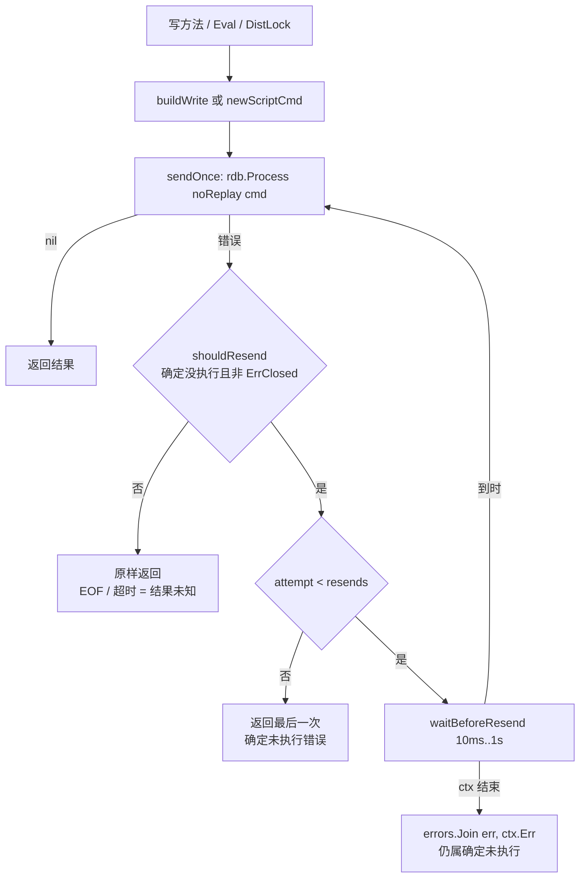
```mermaid
flowchart TD
    W[写方法 / Eval / DistLock] --> B[buildWrite 或 newScriptCmd]
    B --> S["sendOnce: rdb.Process noReplay cmd"]
    S -- nil --> OK[返回结果]
    S -- 错误 --> C{"shouldResend<br/>确定没执行且非 ErrClosed"}
    C -- 否 --> U["原样返回<br/>EOF / 超时 = 结果未知"]
    C -- 是 --> D{"attempt < resends"}
    D -- 否 --> N["返回最后一次<br/>确定未执行错误"]
    D -- 是 --> E[waitBeforeResend 10ms..1s]
    E -- ctx 结束 --> J["errors.Join err, ctx.Err<br/>仍属确定未执行"]
    E -- 到时 --> S
```

pipeline：`Exec` 先整体发一次；`hasWrites` 为真且每条命令错误都 `shouldResend` 时，清错误、整条重新入队再发（`redis/driver/pipeline.go:124-134`）；只要有一条可能已执行就不重发。

**5. 失败与不确定结果**

| 情形 | 处理 | 调用方看到 |
| --- | --- | --- |
| 写命令回复丢失（EOF / 重置 / 读超时 / ctx 到期） | 不重发 | 传输错误，结果未知；返回值不可信 |
| 拨号失败 / 池超时 / 池耗尽 | 退避后重发 ≤ resends | 成功或最后的确定未执行错误 |
| LOADING / MASTERDOWN / TRYAGAIN / CLUSTERDOWN / max clients / READONLY / NOREPLICAS | 同上 | 同上 |
| `ErrClosed`（客户端已关） | 不重发 | `ErrClosed`（确定未执行） |
| pipeline 中部分已执行 | 整条不重发 | `Exec` 返回错误；各 future 带各自结果 |
| WRONGTYPE、脚本 `ERR … user_script` | 不重发 | 已执行并报错 |
| HSET / ZADD 结果未知（cache） | 仍补发一次 EXPIRE，吞掉 EXPIRE 的错误 | 返回 HSET / ZADD 的错误 |
| Mongo 提交发出后失败 | 不 abort | `ErrCommitResultUnknown` 包原错误 |
| Mongo 回调失败 / 提交前到期 / 退避中到期 / StartTransaction 失败 | — | 不带哨兵，确定未提交 |

**6. 测试**

| 用例 | 文件 | 覆盖 |
| --- | --- | --- |
| `TestAWriteWhoseReplyIsLostIsNotReplayedByTheDriver` | `redis/driver/write_no_replay_promises_test.go` | 21 个调用点（`writeCalls`：incr、incrby、rpush、lpush、lpop、rpop、set（经 SetNX）、del、hset、hdel、expire、zadd、zrem、sadd、srem、ltrim、lrem、publish、eval、pipeline、distlock）回复丢失只执行一次、返回错误且不被判为确定未执行 |
| `TestNotExecutedErrorsAreStillResent` | 同上 | 7 种拒绝下各调用点重发 |
| `TestResendsStopAtTheConfiguredBudget` | 同上 | 1 次发送 + 3 次重发后交回 LOADING |
| `TestAPipelineWithAnExecutedCommandIsNotResent` | 同上 | 有一条已执行就不整条重发 |
| `TestReadsKeepTheDriverRetry` | 同上 | 读命令仍由驱动重试（服务端执行 2 次） |
| `TestDurableBatchIsResentWhenNothingExecuted` | 同上 | `EvalBatchDurable` 整批重发 |
| `TestIsDefinitelyNotExecuted` | 同上 | 分类表（拨号、池、ErrClosed、EOF、超时、ctx、脚本错误…） |
| `TestRealRedisAWriteWhoseReplyIsLostRunsOnce` | `redis/driver/write_lost_reply_integration_test.go` | 真实 Redis + 自建 toxiproxy：incr / rpush / pipeline / setnx / distlock |
| `TestAWriteWhoseReplyIsLostStillGetsItsTTL` | `cache/redis_lost_write_ttl_promises_test.go` | HSET / ZADD 结果未知后键仍有 TTL |
| `TestWithTransactionFailuresBeforeTheCommitAreNotResultUnknown` | `mongo/driver/transaction_retry_chain_test.go` | 回调错误、提交前到期都不带哨兵 |

修前红文本（原样，出处 `docs/feature/A2-DRIVER-REPLAY-CONTRACT-2026-10-05.md`“先红后绿”）：

```text
# 修前（d346b45c 的 client.go / pipeline.go / lock.go / assembly.go；新用例与分类函数临时放在一起）
source ~/.roost-it/roost-dataengine-it/env.sh
GOWORK=off go test -tags integration -count=1 -run TestRealRedisAWriteWhoseReplyIsLostRunsOnce -v ./redis/driver/
  incr: err=<nil>; Redis holds counter=2                 one incr call was applied 2 times
  rpush: err=<nil>; Redis holds list=[msg-1 msg-1]       one rpush call was applied 2 times
  pipeline: err=<nil>; Redis holds counter=2 list=[msg-1 msg-1]
  setnx: the replayed SET NX saw this call's own key and reported it as taken (value=mine)
  distlock: the replayed SET NX saw this call's own key and reported it as taken (held-after-reconcile=1)
  （5/5 FAIL；真实 Redis + 本用例自建、端口随机的 toxiproxy 代理，limit_data 1 字节）
GOWORK=off go test -count=1 -run 'TestAWriteWhoseReplyIsLost|TestNotExecuted|TestDurableBatch' ./redis/driver/
  one {incr,incrby,rpush,lpush,lpop,rpop,set,del,hset,hdel,expire,zadd,zrem,sadd,srem,ltrim,lrem,publish,pipeline,distlock} call executed … 2 times on the server
  eval rejected once with "{LOADING,MASTERDOWN,TRYAGAIN,CLUSTERDOWN,ERR max number of clients reached,READONLY,NOREPLICAS} …" (never executed) failed instead of being resent
  EvalBatchDurable = [], local=0, LOADING Redis is loading the dataset in memory; want one result after one resend
  （28 个用例 / 子用例 FAIL）
GOWORK=off go test -tags integration -count=1 -run TestRealMongoCommitIsBoundedByTransactionTimeout -v ./mongo/driver/
  upstream committed=0 / downstream committed=1: commit was sent and cut by the deadline but err=… errors.Is ErrCommitResultUnknown=false DeadlineExceeded=true
GOWORK=off go test -count=1 -run TestAWriteWhoseReplyIsLostStillGetsItsTTL ./cache/
  HSET reached Redis but the key carries TTL 0s (want 1m0s): it never expires（ZADD 同）

# 修后：上述全部 PASS
  incr/rpush/pipeline/setnx/distlock: err=EOF; Redis holds counter=1 / [msg-1] / value=mine / held-after-reconcile=0
  mongo upstream / downstream: err=mongo: transaction commit result unknown: … context deadline exceeded（errors.Is 两者均成立）
```

修后验证（原样，同一出处“验证”）：

```text
GOWORK=off go test -race -count=3 ./redis/... ./cache/ ./mongo/...                         ok
source env.sh; GOWORK=off go test -tags integration -count=1 -p 1 ./redis/...              ok（含 NC-208 的自建代理 toxic 锁用例）
GOWORK=off go test -tags integration -count=1 -run 'TestRealMongo(Commit|EndSession|WriteError)' ./mongo/driver/   ok
REDIS_ADDR=<隔离 Redis> GOWORK=off go test -tags integration -count=1 -p 1 ./kit/service/... ./service/... ./versionstore/ ./cache/... ./failurelog/ ./kit/redis/ ./remoteentity/   20 个包 ok
GOWORK=off go build ./... && go vet ./...                                                  ok
GOWORK=off go test -count=1 .                                                              ok（根包门禁）
GOWORK=off go test -race -count=1 ./kit/redis/ ./versionstore/ ./failurelog/ ./service/mail/ ./remoteentity/ ./kit/service/rank/ ./app/   ok
```

负对照：A2 方案列出的“修前修后都应通过”的边界用例（`TestReadsKeepTheDriverRetry`、`TestNotExecutedErrorsAreStillResent` 的写命令与 pipeline 部分、`TestResendsStopAtTheConfiguredBudget`、`TestAPipelineWithAnExecutedCommandIsNotResent`、`TestIsDefinitelyNotExecuted`、`TestWithTransactionFailuresBeforeTheCommitAreNotResultUnknown`）守住“没把读命令或确定未执行的写一起关掉”。

调用方核对（A2 方案第 3 项）：全仓 `rg` 排除测试、codegen 模板与生成 DAO、attribute、bus / syncbus、saga 协调器后，versionstore、kit 单实例锁、remoteentity versioned lock / marker / L2、cache、rank、mail、failurelog、DistLock 逐一核对，“没有发现把传输错误当成失败、然后再写一遍非幂等写的生产调用方”；mail `redisEnvelopes.Create` 的 SETNX 误报 `ErrConflict` 在本次被修好。

**7. 性能证据**：未测（写命令多一次 Pipeliner 组装 + 包装；没有基准）。

**8. 未验证项与已知风险**

- Cluster 下 `noReplay` 的 MOVED / ASK 跟随与换节点只按源码核对（E08）。
- 握手阶段失败（新建连接时 HELLO 上的 EOF）保守归为结果未知，不重发。
- 覆盖范围（源码核对）：`writeCalls` 表里名为 `set` 的条目实际调用的是 `SetNX`；`Client.Set`（`redis/driver/client.go:150`）与 pipeline 的 `Set` / `Del` / `HSet` / `Expire` / `ZAdd` / `LPop` 没有逐个进“回复丢失只执行一次”的表，它们与表里的方法共用同一入口（19 个写方法都经 `write`，pipeline 写方法都经 `queueWrite`，`redis/driver/pipeline.go:45`），由 `TestAPipelineWithAnExecutedCommandIsNotResent` 覆盖 pipeline 整条不重发；是否逐个补进表见第 9 节。
- bus `BeginConsume` 的 SETNX 去重在回复丢失时进死信（第十二轮决定保持，契约在 `bus/reliable.go` 的 `ReliableStore` 注释）。
- ③ versionstore 一次性写令牌：第二轮定为下个大版本，第十三轮维护者要求本版完成，已实施（`6b3a0eb9`），见 [DRV-7](#drv-7)。

**9. review 检查点**

- [ ] grep 全部 Redis 写路径，确认没有走驱动自动重放：`grep -n 'c.rdb\.' redis/driver/client.go` 只应出现读命令（Get、MGet、Exists、TTL、HGet、HGetAll、HExists、LLen、LRange、ZScore、ZRank、ZRevRank、ZRange*、ZCard、SMembers、SIsMember、Ping）与 `Close`；写方法都经 `write(`。
- [ ] 确认 `redis/driver` 之外的生产代码不直接 import go-redis：`grep -rln 'redis/go-redis' --include='*.go' . | grep -v _test.go` 只应列出 `redis/driver/*.go`。
- [ ] 确认 `pipeline.go` 的每个写方法都走 `queueWrite`（`:59-112`），读方法（Get、HGet、HGetAll）不置 `hasWrites`；`Exec` 重发时重新入队的是 `Exec` 返回的（已包 `noReplay` 的）命令。
- [ ] 确认 `ErrCommitResultUnknown` 只在 commit 已发出后返回：`grep -n 'ErrCommitResultUnknown' mongo/driver/*.go` 只有 `mongo/driver/session.go:111` 一处包装，且位于 `s.commit(ctx)` 之后。
- [ ] 确认 `IsDefinitelyNotExecuted`（`redis/driver/replay.go:36`）没有把 EOF、`io.ErrUnexpectedEOF`、i/o timeout、`context.*` 归为“没执行”；对照 `TestIsDefinitelyNotExecuted` 的表。
- [ ] 确认 cache 两处补发 EXPIRE（`cache/redis_hash.go:92-96`、`cache/redis_raw.go:98-101`）返回的是写命令的错误而不是 EXPIRE 的错误。
- [ ] 确认 `kit/redis/singleton.go:74` 的单实例锁客户端仍是 `MaxRetries = -1`（`resendsFor(-1) == 0`，写与脚本都不重发）。

<a id="drv-4"></a>
### DRV-4 L2 墓碑写入后 WAIT 副本（O-M6-3，驱动能力 EvalReplicated）

> 首发 v1.23.0（本版） · [说明](guide-saga-drv-dao-rem.md#drv-4)

**1. 提交**

| 提交 | 版本 | 内容 |
| --- | --- | --- |
| `fa98f53f` | v1.23.0 | 记录第十轮决定（O-M6-1、O-M6-3） |
| `db67b8ee` | v1.23.0 | O-M6-3：`fredis.ReplicatedEvaler`、`driver.Client.EvalReplicated`；`DeleteAtVersion` 走 WAIT；`NewSnapshotL2StoreFromConfig`、`ValidateSnapshotL2TombstoneWait`；kit 严格读取两键、`app/config_validation.go` 登记；`scripts/mirror-local.sh test-core` 等。同提交含 O-M6-1（兴趣续租请求，属 REM 主题） |
| `d1d6d967` | v1.23.0 | DECISIONS-PENDING 第十轮标为已实施 |
| `fcc78ad0` | v1.23.0 | 收尾第 2 批 A8：生成配置写出 `snapshot_l2_tombstone_wait_replicas` / `_timeout`（1 / 50ms），`productionizeConfig` 只改独占一行的流 `replicas`，不再把墓碑 WAIT 的副本数一起改成 3 |
| `ba13cb05` | v1.23.0 | 发版前补充验证：Cluster 槽位迁移（ASK / MOVED）上的 L2 读写与墓碑 WAIT（`TestMirrorLocalClusterSlotMigrationSnapshotReadWriteAndTombstone`），见 [REM-12](impl-saga-drv-dao-rem.md#rem-12) |

**2. 改动文件与关键符号**

| `path:line` | 符号 | 职责 |
| --- | --- | --- |
| `redis/client.go:106` | `ReplicatedEvaler` | 可选能力接口 `EvalReplicated(ctx, script, keys, numReplicas, timeout, args...)` |
| `redis/client.go:111` | `ReplicatedEvalResult` | `Result`、`Waited`、`Replicas`、`WaitErr`、`Skipped` |
| `redis/client.go:125-132` | `ReplicatedSkip*` | `no_replicas` / `redirected` / `unsupported` / `disabled` |
| `redis/driver/replicated.go:25` | `Client.EvalReplicated` | 选节点（单机用客户端本身；Cluster `MasterForKey`），重发循环（`:52-63`） |
| `redis/driver/replicated.go:68` | `evalReplicatedOnConn` | 独占连接上 EVAL + ROLE 流水线；副本 > 0 才同连接 `WAIT`（`:98-99`） |
| `redis/driver/replicated.go:110` | `connectedReplicas` | 解析 ROLE，非 master 报错 |
| `redis/driver/replicated.go:129` | `isRedirect` | MOVED / ASK 前缀 |
| `remoteentity/snapshot_l2.go:176` | `NewSnapshotL2StoreFromConfig` | 按 Config 建 store 并校验 WAIT 设置 |
| `remoteentity/snapshot_l2.go:194` / `:198` | `MaxSnapshotL2TombstoneWaitTimeout` / `ValidateSnapshotL2TombstoneWait` | 上限 1s；副本数非负、要等时超时在 (0, 1s] |
| `remoteentity/snapshot_l2.go:324` | `remoteSnapshotL2Store.DeleteAtVersion` | 配置了副本数且客户端实现 `ReplicatedEvaler` 时走 `EvalReplicated`；返回值只由脚本决定 |
| `remoteentity/snapshot_l2.go:357` | `recordTombstoneWait` | 计数、指标标签、限频 Warn / 首次 Info |
| `remoteentity/config.go:21` / `:24` / `:88-89` | `Config.SnapshotL2TombstoneWaitReplicas` / `Timeout`；`DefaultConfig` | 零值关闭；缺省 1 / 50ms |
| `remoteentity/assemble.go:108` | `Assemble` | 改用 `NewSnapshotL2StoreFromConfig` |
| `kit/remoteentity/config.go:29-30` | `snapshotConfig.SnapshotL2TombstoneWaitReplicas` / `Timeout` | 两键的声明：副本数 `default:"1" min:"0"`，超时 `default:"50ms" min:"1ns" max:"1s"`；`apply`（`:73-74`）原样写进 core `Config`（A4 ① `d1226825` 之后；之前是 `readSnapshotConfig` 手写读取） |
| `kit/remoteentity/remote_mirror_mod.go:124` | `RemoteMirrorMod` | 同一构造 |
| `codegen/internal/roost/kitconfig_gen.go:291-292` | 声明快照 | 生成配置段与 doctor 的 `config-schema` 用；启动前的类型 / 范围检查由 App 合并全部 Mod 声明（`app.CheckConfig`）完成（之前登记在 `app/config_validation.go` 的 `frameworkDurationKeys` / `frameworkIntKeys`，A4 ① 删除清单） |

**3. 不变量与强制点**

- 不变量 1：`WAIT` 与写墓碑的脚本在同一条物理连接上，且只发往执行脚本的主节点。强制点：`evalReplicatedOnConn` 用 `node.Conn()` 独占连接（`redis/driver/replicated.go:69`），`WAIT` 经 `conn.Process`（`:99`）。
- 不变量 2：`WAIT` 从不重放；脚本只在流水线每条命令都确定没执行时整条重发。强制点：`:81` 只在脚本出错时计算 `retryable`；脚本成功后的任何 ROLE / WAIT 错误都返回 `retryable=false`。
- 不变量 3：`WAIT` 结果不改变 `DeleteAtVersion` 的返回值。强制点：`remoteentity/snapshot_l2.go:332-337` 只在 `EvalReplicated` 返回 err（脚本错误）时返回错误，`outcome` 只进 `recordTombstoneWait`。
- 不变量 4：配置非法时启动失败。强制点：kit 声明（`kit/remoteentity/config.go:29-30`，App 启动前与 `Init` 的 `app.LoadConfig` 同一份）与 core `ValidateSnapshotL2TombstoneWait`（`remoteentity/snapshot_l2.go:198`）。
- 守卫测试：`TestEvalReplicatedWaitsOnTheScriptsConnection`（`redis/driver/replicated_promises_test.go:104`）、`TestEvalReplicatedScriptErrorsAndDisabledWait`（`:147`）、`TestSnapshotL2TombstoneWaitIsObservedButNeverFailsTheDelete`（`remoteentity/snapshot_l2_tombstone_wait_promises_test.go:56`）、`TestSnapshotL2TombstoneWaitDisabledAndUnsupported`（`:102`）、`TestSnapshotL2TombstoneWaitSettingsAreValidated`（`:129`）、`TestTombstoneWaitConfiguration`（`kit/remoteentity/tombstone_wait_config_test.go:14`）。

**4. 控制流**

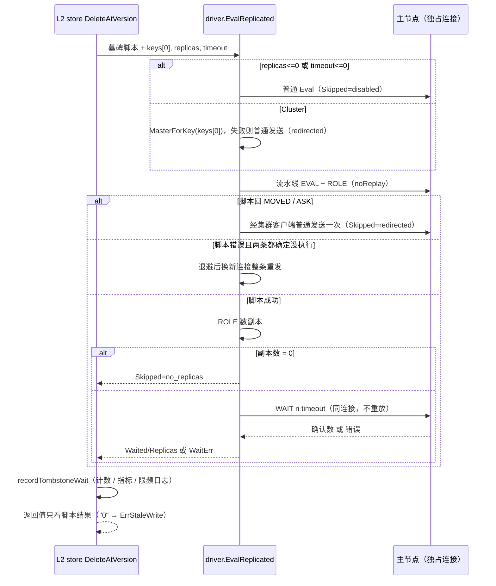
```mermaid
sequenceDiagram
    participant S as L2 store DeleteAtVersion
    participant D as driver.EvalReplicated
    participant P as 主节点（独占连接）
    S->>D: 墓碑脚本 + keys[0], replicas, timeout
    alt replicas<=0 或 timeout<=0
        D->>P: 普通 Eval（Skipped=disabled）
    else Cluster
        D->>D: MasterForKey(keys[0])，失败则普通发送（redirected）
    end
    D->>P: 流水线 EVAL + ROLE（noReplay）
    alt 脚本回 MOVED / ASK
        D->>P: 经集群客户端普通发送一次（Skipped=redirected）
    else 脚本错误且两条都确定没执行
        D->>D: 退避后换新连接整条重发
    else 脚本成功
        D->>D: ROLE 数副本
        alt 副本数 = 0
            D-->>S: Skipped=no_replicas
        else
            D->>P: WAIT n timeout（同连接，不重放）
            P-->>D: 确认数 或 错误
            D-->>S: Waited/Replicas 或 WaitErr
        end
    end
    S->>S: recordTombstoneWait（计数 / 指标 / 限频日志）
    S-->>S: 返回值只看脚本结果（"0" → ErrStaleWrite）
```

**5. 失败与不确定结果**

| 情形 | 处理 | 调用方（`DeleteAtVersion`）看到 |
| --- | --- | --- |
| 副本确认数 ≥ 配置 | `confirmed` 计数 | nil |
| `WAIT` 超时、确认不足 | `short` 计数 + 限频 Warn | nil |
| 主节点无副本 | 不发 WAIT，`no_replicas` 计数 + 首次 Info | nil |
| ROLE / WAIT 出错（EOF、超时） | `error` 计数 + 限频 Warn；复制结果未知 | nil（墓碑已在主上） |
| Cluster MOVED / ASK、取不到槽主、客户端不支持、未启用 | 普通发送，`skipped` 计数 | 脚本结果 |
| 脚本回复丢失 | 不重发 | 传输错误（结果未知；墓碑脚本幂等，可重发） |
| 脚本返回 0（L2 已有更新快照） | — | `cache.ErrStaleWrite` |

**6. 测试**

| 用例 | 文件 | 覆盖 |
| --- | --- | --- |
| `TestEvalReplicatedWaitsOnTheScriptsConnection` | `redis/driver/replicated_promises_test.go` | 假服务端按连接记录：WAIT 与 EVAL 同连接；没有副本不发 WAIT |
| `TestEvalReplicatedScriptErrorsAndDisabledWait` | 同上 | WAIT 出错只进 WaitErr；脚本错误不发 WAIT；关闭时只发 EVAL |
| `TestSnapshotL2TombstoneWaitIsObservedButNeverFailsTheDelete` | `remoteentity/snapshot_l2_tombstone_wait_promises_test.go` | 各结果计数；返回值只由脚本决定；快照写入不走 WAIT |
| `TestSnapshotL2TombstoneWaitDisabledAndUnsupported` | 同上 | 副本数 0 / 旧构造不调用新能力 |
| `TestSnapshotL2TombstoneWaitSettingsAreValidated` | 同上 | 设置校验 |
| `TestTombstoneWaitConfiguration` | `kit/remoteentity/tombstone_wait_config_test.go` | 两个 Mod 的严格读取 |
| `TestMirrorLocalTombstoneSurvivesAFailoverOnlyWithWait` | `remoteentity/snapshot_l2_tombstone_wait_integration_test.go:144` | 私有环境：复制滞后 + 立刻提升副本 |
| `TestMirrorLocalTombstoneWaitOnClusterGoesToTheKeysPrimary` | 同上 `:277` | Cluster：WAIT 只打该键主节点；副本暂停时按超时返回 `short` |

修前红文本（原样，出处 `docs/feature/MIRROR-M6-OBSERVATIONS-2026-10-06.md` §6.2；在基线 worktree 上用修前构造 `NewSnapshotL2StoreWithKeyPrefix`）：

```
--- FAIL: TestMirrorLocalTombstoneSurvivesAFailoverOnlyWithWait/pre_fix (0.03s)
    snapshot_l2_tombstone_red_integration_test.go:213: the tombstone must survive the failover: delete took 0s; fresh reader found=true version=1, tombstone=""
```

修后（原样，同一出处）：

```
MIRROR O-M6-3 without_wait: delete took 0s; after promoting the replica tombstone="" fresh reader found=true version=1; wait stats {Confirmed:0 ...}
MIRROR O-M6-3 with_wait: delete took 502ms; after promoting the replica tombstone="2" fresh reader found=false version=0; wait stats {Confirmed:1 ...}
MIRROR O-M6-3 cluster: stopped replica, delete took 241ms, wait stats {Confirmed:1 Short:1 NoReplicas:0 Failed:0 Skipped:0}
--- PASS: TestMirrorLocalTombstoneSurvivesAFailoverOnlyWithWait (9.56s)
--- PASS: TestMirrorLocalTombstoneWaitOnClusterGoesToTheKeysPrimary (0.43s)
```

负对照：`without_wait` 子用例保留为边界记录（不 WAIT 时现象可确定复现）。Cluster：`INFO commandstats` 的 `cmdstat_wait` 只在该键所在主节点 +1。其他验证（同一出处 §6.4）：`go test -race -count=3 ./remoteentity ./redis/... ./kit/remoteentity ./sync/syncbus/...`、根包、`./codegen/... ./kit/...` 通过；`scripts/mirror-local.sh test-core` 两次通过、基线上修前红一次。

**7. 性能证据**：删除路径最多多等 `timeout`（缺省 50ms）；私有环境 `with_wait` 子用例因人为 500ms 复制延迟耗时 502ms，Cluster 副本暂停时 241ms（200ms 超时）。普通快照写入不变。无吞吐基准。

**8. 未验证项与已知风险**

- 副本在确认前断开时 WAIT 挡不住（S4a′“未复制即切主”），计 `short` / `no_replicas`；真实多机复制延迟见 E10。
- `WAIT` 超时要低于 Redis 客户端读超时，否则客户端先超时、计为 `error`：上限 1s；kit 的 Redis 客户端读超时固定为 `fredis.DefaultConfig` 的 3s（`kit/redis/redis_mod.go:71-72`、`redis/config.go:28`，kit 的 Redis 声明里没有 `read_timeout`），所以只有直接用 core 构造、把 `ReadTimeout` 设到 1s 以下的装配会出现（源码核对）。
- 指标标签：源码统一为 `skipped`（`remoteentity/snapshot_l2.go:373-375`）；MIRROR-M6-OBSERVATIONS §3 原写 `redirected` / `unsupported`，已按源码更正（fixr，`155b9f91`），T-277 与发版前验证记录写的也是 `skipped`。
- `kit` 声明：只设 `_timeout` 不设 `_replicas` 时，timeout 仍按 (0, 1s] 校验（即使副本数为 0）；core 校验只在 replicas > 0 时要求 timeout 合法——两层口径略有差别（源码观察，未见文档说明）。

**9. review 检查点**

- [ ] 确认 `evalReplicatedOnConn`（`redis/driver/replicated.go:68`）里 EVAL、ROLE、WAIT 用的是同一个 `conn`，且三条都包了 `noReplay`。
- [ ] 确认脚本成功后任何 ROLE / WAIT 错误都只进 `WaitErr`、返回 `retryable=false`（`:84-103`），外层循环（`:57`）不会因此重发脚本。
- [ ] 确认 Cluster 分支 `MasterForKey` 失败与脚本 MOVED / ASK 都退回 `plain(...)`（普通 `Eval`，仍经 `runScript` 不重放），且不发 WAIT。
- [ ] 确认 `DeleteAtVersion`（`remoteentity/snapshot_l2.go:324`）的返回值与修前一致（只由脚本结果决定），`recordTombstoneWait` 不返回错误。
- [ ] 确认两个键的声明（`kit/remoteentity/config.go:29-30`）由 `RemoteEntityMod` 与 `RemoteMirrorMod` 共用（两者都匿名嵌入 `snapshotConfig`，`:113`、`:139`），声明的 `default` 与 core `DefaultConfig` 一致（`TestRemoteEntityDeclaredDefaultsMatchCoreDefaults`，`kit/remoteentity/config_declaration_promises_test.go:14`），且 `TestTombstoneWaitConfiguration`（`kit/remoteentity/tombstone_wait_config_test.go:14`）覆盖错类型、负数、超过 1s。
- [ ] 确认只有墓碑删除走 WAIT：`grep -n 'EvalReplicated' --include='*.go' -r . | grep -v _test.go` 只应有驱动实现与 `remoteentity/snapshot_l2.go:332`。

<a id="drv-5"></a>
### DRV-5 驱动与 Mod 的 Close 统一口径（第十二轮“驱动 Close 契约” + RR-20261006-10 / -24 / -26 + nats 驱动自持关闭状态）

> 首发 v1.23.0（本版） · [说明](guide-saga-drv-dao-rem.md#drv-5)

**1. 提交**

| 提交 | 版本 | 内容 |
| --- | --- | --- |
| `78e26853` | v1.23.0 | 记录第十二轮决定（含“驱动 Close 契约写进 A2 驱动契约表”） |
| `88f33776` | v1.23.0 | 收尾第 1 批：按当时源码实测写 redis / mongo README §5（单机与 Cluster 不一致等），登记 WANTED W-2026-10-06-02，代码未改 |
| `8059b877` | v1.23.0 | DECISIONS-PENDING 收尾第 1 批与第十二轮文档类决定标为已实施 |
| `d05a04a1` | v1.23.0 | RR-20261006-10：redis / mongo / etcd / nats 驱动与 kit Redis / Mongo / Nats Mod、单实例锁 store 的 Close 统一；新增 `internal/operation.Serial`；两份 README §5 改成统一后的表。同提交的文档链接门禁属 TOOL |
| `02c8a10d` | v1.23.0 | roost-coding 加 `operation.Serial` 与 Close 统一口径 |
| `0db819b0` | v1.23.0 | 真实进程演练第 4 项：RR-20261006-24（nats Close 之后 Subscribe / QueueSubscribe / JetStream 三方法 / RPC CallAsync 的错误 `errors.Is` 不到 `fnats.ErrClosed`）、RR-20261006-26（排空被硬关后 `Connected()` 约 5s 内为 true）；当时的修法是逐出口加 `closedError` 翻译与 `closing` 标记（同提交的 RR-20261006-25 属 APP） |
| `f0de827a` | v1.23.0 | 维护者方向调整（第十三轮“nats/driver 已关闭状态”选 A）：`Client.state.closed` 是唯一判据，入口 `admit()`、失败 `wrapError` 先看它；删掉 `closedError` / `connectionClosedError` / `closing` / `Assembly.closed`；导出方法登记守卫 + 屏障 + 真实 NATS 窗口用例 |
| `e47d0cd6` | v1.23.0 | DECISIONS-PENDING 第十三轮补“nats/driver 已关闭状态”行 |

nats 的 Close 在本版修了三次（RR-20261004-08 之后的 RR-20261006-10、-24、-26），根因都是把 nats.go 的状态与错误透传、逐个出口补翻译；第三次之后按 roost-coding“反复出问题要上报方向判断”交维护者，改为驱动自持唯一的已关闭状态（`f0de827a`，[方案与验证](../../feature/REFACTOR-2026-10-06-nats-driver-closed-state.md)）。RR-24 / -26 的回归原样通过，判据以 `f0de827a` 为准。

前史（不属本条、只作背景）：NC-233（`2c1c7be7`，v1.21.0）`RedisMod` 第一次 Close 就交出连接；NC-260（`36220f34`，v1.21.0）mongo `Client.Close` 把 `ErrClientDisconnected` 当已关闭；NC-173 复核补修（`50f2ac2a`，v1.20.2）。

**2. 改动文件与关键符号**

| `path:line` | 符号 | 职责 |
| --- | --- | --- |
| `internal/operation/serial.go:14` / `:20` / `:39` | `Serial` / `Lock(ctx)` / `Unlock` | 容量 1 的 channel 做停止入口串行器；后到者等待受自己 ctx 约束 |
| `redis/driver/client.go:25` / `:483` | `Client.closeOnce` / `Client.Close` | `sync.Once` 只关一次，错误只报给第一次；单机与 Cluster 一致 |
| `redis/driver/assembly.go:44` | `Assembly.Close` | 转发 `Client.Close` |
| `redis/driver/pubsub.go:50` | `pubSub.Close` | `sync.Once`（修前已是） |
| `redis/driver/lock.go:113` / `:146` / `:174` | `distLock` Acquire / Release / Extend 的 `ErrClosed` 分支 | 直接返回、锁状态不变，不记成未知 |
| `mongo/driver/client.go:27-30` / `:119` | `closeSerial` / `closed` / `disconnect`；`Client.Close` | 串行化；断开成功（或驱动报 `ErrClientDisconnected`）才置 `closed`；FLE 断开失败不置位、下次重做 |
| `etcd/driver/client.go:23` / `:212` / `:224` | `closed`；`Client.Close`；`checkOpen` | Close 开始即置位；Get / Put / Txn / Grant / KeepAlive / Revoke 等先查，返回 `fetcd.ErrClosed` |
| `nats/driver/client.go:43-56` | `natsLifecycleState.closed`（`atomic.Bool`）/ `markClosed` | 驱动唯一的“已关闭”判据；`Client.Close`（`:228`）一开始就置位再关 nats.go 连接，`DrainWithContext` 排空正常结束时 CAS 置位（`:219`，排空期间被别人 Close 的返回 `fnats.ErrClosed`） |
| `nats/driver/client.go:77` / `:82` | `Client.closed` / `Client.admit` | 入口检查：已关闭（含 nil Client、没有连接）返回 `fnats.ErrClosed`，不碰 nats.go；Publish / Request / Subscribe / QueueSubscribe / Drain / DrainWithContext 都先经它 |
| `nats/driver/client.go:247` | `Client.wrapError` | 过了入口之后的失败：驱动已关闭一律 `fnats.ErrClosed`（不论 nats.go 返回什么，含 ctx 恰好结束时的 `ctx.Err()`）；未关闭才按 nats.go 的错误辅助分类（超时、无响应者、连接已关闭 / 正在排空） |
| `nats/driver/client.go:239` | `Client.Connected` | `!c.closed() && conn.IsConnected()`：nats.go 硬关后翻回 `DRAINING_PUBS` 的窗口里也为 false（RR-26） |
| `nats/driver/jetstream.go:36` | `JetStreamClient.admit` | JetStream 三方法同一入口检查 |
| `nats/driver/subscription.go:15` / `:22` | 订阅句柄 `Unsubscribe` / `IsValid` | 经 Client 的判据（新守卫在旧实现上找出的漏口之一） |
| `nats/driver/rpc.go:191` / `:254` | `errRPCStopped` / `expirePending` | RPC 停止后的结果同时 `errors.Is` 到 `fnats.ErrCancelled` 与 `fnats.ErrClosed`；只关连接、没停 RPC 时在途 CallAsync 到 5s 按 `fnats.ErrClosed` 终结 |
| `nats/driver/assembly.go:35` / `:77` | `closeSerial`；`Assembly.Close` | 串行；Assembly 不再有自己的 `closed` 字段，停 RPC 后看 Client 的判据（`:94`），已关闭返回 nil，否则排空；`ErrClosedUndrained` 只报给关掉连接的那一次（`:102`） |
| `kit/redis/singleton.go:95` / `:145` | `singletonStore.closeOnce` / `Close` | 错误只报给第一次 |
| `kit/redis/redis_mod.go:24` / `:30` / `:163` | `mu` / `assembly()` / `StopWithContext` | `mu` 保护 `asm`，Stop 持锁串行（go-redis Close 不等在途命令，持锁短） |
| `kit/mongo/mongo_mod.go:25-26` / `:136` / `:189` | `stopSerial` / `mu`；`StopWithContext`；`Client()` | Stop 用 `Serial` 串行（会阻塞到 ctx），`mu` 保护 `client` |
| `kit/nats/nats_mod.go:32` / `:202` | `stopSerial`；`StopWithContext` | 同上 |
| `redis/driver/README.md` §5、`mongo/driver/README.md` §5 | 契约表 | 统一后的口径 |
| `docs/agent-skills/roost-coding/SKILL.md:73` | A3 停机条目追加 | 停止入口用 `operation.Serial`；Close 统一口径；唯一例外 nats `ErrClosedUndrained`。`b7471ae4` 补了一条例外：临界区很短、关闭不等在途工作的可以用 `sync.Mutex`（kit `RedisMod` 停止持 `mu`，`kit/redis/redis_mod.go:23-24`） |

**3. 不变量与强制点**

- 不变量 1：重复 Close 返回 nil，第一次错误只报一次。强制点：redis `closeOnce`、单实例锁 `closeOnce`、etcd `Close` 的一次性逻辑、mongo 的 `closed` 标记、nats Client 的 `state.closed`（Assembly 看它）。
- 不变量 2：并发 Close 后到者等第一个做完；会阻塞的在自己的 ctx 内等。强制点：`sync.Once`（redis、pubsub、单实例锁、etcd）、`operation.Serial`（mongo、nats、MongoMod、NatsMod）、`sync.Mutex`（RedisMod，持锁短）。
- 不变量 3：Close 之后的调用返回可 `errors.Is` 的已关闭错误。强制点：go-redis 自身（`ErrClosed`）、mongo 驱动（`ErrClientDisconnected`）、etcd `checkOpen`、nats 每个导出方法入口的 `admit()` 与失败时的 `wrapError`（只看驱动自己的 `state.closed`，不看 nats.go 的连接状态；与 Close 并发的调用要么在 Close 之前完成，要么返回 `fnats.ErrClosed`）。
- 不变量 5（nats）：`Connected()` 在 Close 之后一直为 false。强制点：`nats/driver/client.go:239`。
- nats 的守卫：`TestEveryExportedDriverMethodHasAClosedStateCheck`（`nats/driver/closed_state_guard_promises_test.go:194`）解析本包非测试源码，要求每个导出方法在 `closedStateChecks`（`:62`）里有一行，免检的（JetStream 消费句柄的 Stop / Drain / Closed、worker 池协议 `rpcTask.OnRelease`）必须写理由——以后新加导出方法不登记就红。
- 不变量 4：DistLock 在 `ErrClosed` 上不改变锁状态。强制点：`redis/driver/lock.go:113`、`:146`、`:174`。
- 守卫测试：各包 `close_contract_promises_test.go`（下表）与 `internal/operation/serial_test.go`。无全仓“每个 Close 都符合口径”的静态守卫，靠 roost-coding 规则与各包用例。

**4. 控制流 / 状态机**

`operation.Serial` 的并发 Close（mongo / nats / Mod）：

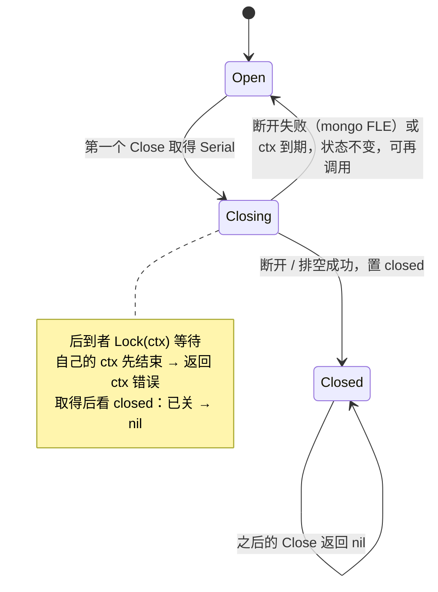
```mermaid
stateDiagram-v2
    [*] --> Open
    Open --> Closing: 第一个 Close 取得 Serial
    Closing --> Closed: 断开 / 排空成功，置 closed
    Closing --> Open: 断开失败（mongo FLE）或 ctx 到期，状态不变，可再调用
    Closed --> Closed: 之后的 Close 返回 nil
    note right of Closing
        后到者 Lock(ctx) 等待
        自己的 ctx 先结束 → 返回 ctx 错误
        取得后看 closed：已关 → nil
    end note
```

redis / etcd / 单实例锁用 `sync.Once`：第一个调用者执行关闭并拿到错误，并发后到者在 `Once.Do` 内等它完成后拿到 nil。

**5. 失败与不确定结果**

| 情形 | 处理 | 调用方看到 |
| --- | --- | --- |
| redis 第一次 Close 出错 | go-redis 遇错照样关完全部池 | 第一次：错误；之后：nil |
| mongo 第一次 Close ctx 已过期 | 驱动断开各 server 时忽略 ctx 错误，照样释放 | nil |
| mongo FLE 客户端断开失败 | 不置 `closed` | 错误；再调用重做断开（本项目不配 FLE） |
| nats 排空失败硬关 | `Client.Close` 置 `state.closed`（本版；`f0de827a` 之前是 `Assembly.closed`） | 第一次：`ErrClosedUndrained`；之后 nil |
| Close 之后调 nats 任一导出方法 | 入口 `admit()` | 立即 `fnats.ErrClosed`（不碰 nats.go）；`Connected()` / `IsValid()` 为 false |
| nats 调用已过入口、Close 在它碰 nats.go 前后发生 | `wrapError` 先看驱动状态 | `fnats.ErrClosed`，不会是 nats.go 的原错误或 ctx 错误（屏障用例） |
| nats.go 放弃重连后自己关闭（驱动没调 Close） | 驱动不置位；`wrapError` 把 nats.go 的关闭错误辅助分类为 `fnats.ErrClosed` | `Assembly.Close` 照旧排空失败、报一次 `ErrClosedUndrained`（`TestNatsModStopReleasesAssemblyWhoseConnectionIsAlreadyClosed`，`kit/nats/nats_mod_drain_budget_promises_test.go:174`） |
| 并发后到者自己的 ctx 先结束（mongo / nats / Mod） | 不取得串行器 | ctx 错误；对象状态不变，可再调 |
| Close 之后的 redis 命令 | `IsDefinitelyNotExecuted` 为真但 `shouldResend` 为假 | `goredis.ErrClosed`，不重发 |
| Close 之后 DistLock.Acquire | 锁状态不变 | 每次 `goredis.ErrClosed`（不再变成 `ErrDistLockStateUncertain`） |
| Close 之后 etcd Get / Put … | `checkOpen` | 立即 `fetcd.ErrClosed`；Watch 立即结束（`fetcd.ErrWatchClosed`） |
| 与 Close 并发的 etcd 在途调用 | 不打断 | 仍受调用方 ctx 约束（停机顺序由调用方负责） |

**6. 测试**

| 用例 | 文件 | 覆盖 |
| --- | --- | --- |
| `TestClientRepeatedCloseReturnsNilOnEveryDeployment` | `redis/driver/close_contract_promises_test.go:46` | 单机 / Cluster 第二次 Close 为 nil；Close 后 Set 返回 `ErrClosed` |
| `TestClientCloseErrorIsReportedOnce` | 同上 `:69` | 首次错误只报一次 |
| `TestClientConcurrentCloseAllReturnNil` | 同上 `:84` | 并发 Close 全部 nil |
| `TestAssemblyRepeatedCloseReturnsNil` | 同上 `:104` | Assembly 转发 |
| `TestDistLockAfterClientCloseKeepsReportingErrClosed` | 同上 `:120` | 锁不记成未知 |
| `TestClientConcurrentCloseWaitsForTheFirstDisconnect` | `mongo/driver/close_contract_promises_test.go:21` | 后到者等第一次断开 |
| `TestClientCloseRetriesAfterAFailedDisconnect` | 同上 `:78` | 控制（修前已成立） |
| `TestClientCloseErrorIsReportedOnceThenNil` / `TestClientConcurrentCloseAllReturnNil` / `TestClientCallsAfterCloseFailFastWithErrClosed` | `etcd/driver/close_contract_promises_test.go:32` / `:46` / `:62` | 首次错误只报一次；并发（控制）；关闭后快速失败 |
| `TestAssemblyTerminalCloseErrorIsReportedOnce` / `TestAssemblyConcurrentCloseReportsTheTerminalErrorOnce` / `TestClientPublishAfterCloseReportsErrClosed` | `nats/driver/close_contract_promises_test.go:36` / `:49` / `:75` | 终态错误只报一次；并发只报一次；Publish 关闭后 `fnats.ErrClosed` |
| `TestClientSubscribeAndJetStreamAfterCloseReportErrClosed` / `TestRPCCallAsyncAfterAssemblyCloseReportsErrClosed` | 同上 `:88` / `:132` | RR-20261006-24 回归（不可达地址） |
| `TestEveryExportedDriverMethodHasAClosedStateCheck` / `TestEveryExportedDriverMethodReportsErrClosedAfterClose` / `TestACallAdmittedBeforeCloseFinishingAfterItReportsErrClosed` / `TestInFlightCallAsyncExpiresAsErrClosedAfterClientClose` / `TestCallsRacingCloseEitherCompleteOrReportErrClosed` | `nats/driver/closed_state_guard_promises_test.go:194` / `:240` / `:303` / `:360` / `:384` | 导出方法登记守卫；`Assembly.Close` 与只 `Client.Close` 两种关闭后逐个方法 500ms 内回答；屏障（已过入口再 Close，含“ctx 也结束”一组）；在途 CallAsync 5s 到期；20 轮 × 6 协程与 Close 竞争（`-race`） |
| `TestRealNatsEveryExportedMethodAnswersFromTheDriverStateAfterAnUndrainedClose` | `nats/driver/closed_state_guard_real_promises_test.go:21`（integration） | 真实 NATS：排空被截断硬关后、nats.go 翻回 `DRAINING_PUBS`（`IsConnected` 为 true）的窗口里把每个导出方法跑一遍，全部按驱动状态回答 |
| `TestRealNatsModCloseContract` / `TestRealNatsModUndrainedCloseIsReportedOnce` | `kit/nats/close_contract_real_promises_test.go:61` / `:188`（integration） | RR-24：IClient / IRpc / IJetStream / IBus 共 11 个调用关闭后 `errors.Is(fnats.ErrClosed)`；RR-26：硬关之后 300ms 内 `Connected()` 一直为 false |
| `TestSingletonStoreCloseErrorIsReportedOnce` / `TestRedisModConcurrentStopIsSafe` | `kit/redis/close_contract_promises_test.go:19` / `:36` | 单实例锁 store；RedisMod 并发 Stop（`-race`） |
| `TestMongoModConcurrentStopIsSafe` | `kit/mongo/close_contract_promises_test.go:16` | `-race` |
| `TestNatsModConcurrentStopIsSafe` | `kit/nats/close_contract_promises_test.go:15` | `-race` |
| `TestSerialLaterCallerWaitsWithinItsOwnContext` | `internal/operation/serial_test.go:11` | 后到者在自己的 ctx 内等 |

修前红文本（原样，出处 `docs/bug/RR-20261006-10.md`“复现”）：

```
--- FAIL: TestClientRepeatedCloseReturnsNilOnEveryDeployment/single
    close_contract_promises_test.go:54: Close #2 = redis: client is closed, want nil: repeated Close is idempotent on every deployment
--- FAIL: TestClientConcurrentCloseAllReturnNil/single
    close_contract_promises_test.go:97: round 0: concurrent Close #1 = redis: client is closed, want nil (all = [<nil> redis: client is closed redis: client is closed redis: client is closed])
--- FAIL: TestAssemblyRepeatedCloseReturnsNil/single
    close_contract_promises_test.go:114: second Assembly.Close = redis: client is closed, want nil
--- FAIL: TestDistLockAfterClientCloseKeepsReportingErrClosed/single（cluster 同）
    close_contract_promises_test.go:135: Acquire #2 after Close = (false, redis: distributed lock ownership is uncertain; call Release to reconcile), want (false, goredis.ErrClosed): the SetNX was never sent

--- FAIL: TestClientConcurrentCloseWaitsForTheFirstDisconnect            (mongo/driver)
    close_contract_promises_test.go:56: concurrent Close returned <nil> while the first Close was still disconnecting; want it to wait

--- FAIL: TestClientCloseErrorIsReportedOnceThenNil                       (etcd/driver)
    close_contract_promises_test.go:41: Close #2 = context canceled, want nil: the first error is reported once
--- FAIL: TestClientCallsAfterCloseFailFastWithErrClosed (18.01s)
    close_contract_promises_test.go:94: Get after Close still blocked after 2s, want an immediate fetcd.ErrClosed
    （GetWithPrefix / Put / PutWithLease / Delete / DeleteWithPrefix / Txn / Grant / Revoke 同）
    close_contract_promises_test.go:91: KeepAlive after Close = etcdclient: leases keep alive halted, want fetcd.ErrClosed

--- FAIL: TestAssemblyTerminalCloseErrorIsReportedOnce                    (nats/driver)
    close_contract_promises_test.go:44: Close #2 = nats: connection closed before drain finished: nats: connection closed, want nil: the connection is already closed, the terminal error is reported once
--- FAIL: TestAssemblyConcurrentCloseReportsTheTerminalErrorOnce
    close_contract_promises_test.go:70: round 0: 4 concurrent Close calls reported the terminal error, want exactly 1
--- FAIL: TestClientPublishAfterCloseReportsErrClosed (0.06s)
    close_contract_promises_test.go:79: Publish after Close = nats: publish to roost.close failed after 3 retries: nats: connection closed, want fnats.ErrClosed

--- FAIL: TestSingletonStoreCloseErrorIsReportedOnce                      (kit/redis)
    close_contract_promises_test.go:31: Close #2 = redis: client is closed, want nil: the first error is reported once
--- FAIL: TestRedisModConcurrentStopIsSafe / TestMongoModConcurrentStopIsSafe / TestNatsModConcurrentStopIsSafe
    WARNING: DATA RACE（redis_mod.go:116/120、mongo_mod.go:117/129、nats_mod.go:183/197）
    testing.go:1865: race detected during execution of test
```

（红文本里的 `kit/redis/redis_mod.go:116/120` 等是基线 `ba13cb05` 的行号。）

RR-20261006-24 修前红（原样节选，出处 [app7-close-contract-real.txt](../../bugfix/evidence/real-process-drills/2026-10-06/app7-close-contract-real.txt)，不可达地址单元用例；真实 NATS 私有 JetStream 3 节点上同样 6 处）：

```
--- FAIL: TestClientSubscribeAndJetStreamAfterCloseReportErrClosed (0.00s)
    close_contract_promises_test.go:119: Subscribe after Close = nats: connection closed, want an error that errors.Is fnats.ErrClosed
    （QueueSubscribe / JetStream.EnsureStream / JetStream.Publish / JetStream.Subscribe 同）
    close_contract_promises_test.go:125: RPC.CallAsync after Client.Close = rpc: subscribe inbox: nats: connection closed, want an error that errors.Is fnats.ErrClosed
--- FAIL: TestRPCCallAsyncAfterAssemblyCloseReportsErrClosed (0.00s)
    close_contract_promises_test.go:137: RPC.CallAsync after Assembly.Close = nats: request cancelled, want an error that errors.Is both fnats.ErrClosed and fnats.ErrCancelled
```

RR-20261006-26 修前红（原样，出处 [rr26-red.txt](../../bugfix/evidence/real-process-drills/2026-10-06/rr26-red.txt)，真实 NATS，`-count=20` 全红；`DEBUG` 部分是查根因时的临时输出）：

```
--- FAIL: TestRealNatsModUndrainedCloseIsReportedOnce (0.21s)
    close_contract_real_promises_test.go:221: first Stop = nats: connection closed before drain finished: context deadline exceeded
    close_contract_real_promises_test.go:229: Assembly.Connected() = true after the undrained close returned (DEBUG status=DRAINING_PUBS closed=false draining=true); the connection was closed hard
```

根因（问题记录逐行说明）：nats.go v1.53.1 `drainConnection` 在硬关清空订阅后跳出等待循环，不检查连接已关闭就 `changeConnStatus(DRAINING_PUBS)` 再空等 `FlushTimeout(5s)`，这段时间 `IsConnected()` 为 true；驱动的 `Connected()` 当时直接返回它。

自持关闭状态的守卫在 RR-24 / -26 修法（`0db819b0`）上的红（原样节选，出处 [方案 §5](../../feature/REFACTOR-2026-10-06-nats-driver-closed-state.md)，五个源文件换回 `0db819b0` 跑新守卫，同一类又找出三个漏口）：

```
--- FAIL: TestEveryExportedDriverMethodReportsErrClosedAfterClose/Assembly.Close
    Client.Drain after Assembly.Close = nats: connection closed, want an error that errors.Is fnats.ErrClosed
    Client.DrainWithContext after Assembly.Close = nats: connection closed, want ...
    subscription.Unsubscribe after Assembly.Close = nats: connection closed, want ...
--- FAIL: TestEveryExportedDriverMethodReportsErrClosedAfterClose/Client.Close
    Assembly.Close after Client.Close = nats: connection closed before drain finished: nats: connection closed, want nil / false
    （Drain / DrainWithContext / Unsubscribe 同上）
--- FAIL: TestCallsRacingCloseEitherCompleteOrReportErrClosed
    round 1: third outcome while racing Close: nats: connection closed
```

修后：RR-24 / -26 的回归与 `nats/driver`、`kit/nats` 既有用例不改断言通过；变异 M1～M6（`Unsubscribe` / `EnsureStream` 跳过入口、新加导出方法不登记、`wrapError` / `expirePending` / `Connected()` 不看驱动状态）各自变红，M4 起初没红、补了屏障的“ctx 也结束”一组之后变红（方案 §5 变异表）。命令：`go test -race -count=3 ./nats/... ./kit/nats/`；私有 `scripts/mirror-local.sh` 环境 `-tags integration -race -count=3 -p 1 ./nats/... ./kit/nats/`；`go test -count=1 ./bus/... ./kit/... ./saga/...`；根包；`go build ./... && go vet ./...`。修后（`docs/bugfix/RR-20261006-10.md`“验证”）：各包 `close_contract_promises_test.go` 全部通过；`go test -race -count=3 ./internal/operation ./redis/driver ./mongo/driver ./etcd/driver ./nats/driver ./kit/redis ./kit/mongo ./kit/nats` 通过；私有 redis-server 上 `-tags integration -race -count=3 -p 1 ./redis/driver ./kit/redis` 通过；根包、build / vet 通过。负对照：mongo“重复 Close 返回 nil”“断开失败后重试”与 etcd 并发 Close 修前已成立，作为控制用例。`kit/redis/stop_retry_promises_test.go` 的 NC-233 用例原来靠“再调一次驱动 Close 得到 ErrClosed”制造 Close 错误，驱动幂等后改为先关底层 `Raw()` 连接池。

**7. 性能证据**：无（不涉及热路径）。

**8. 未验证项与已知风险**

- Close 契约（重复 Close 返回 nil、并发后到者等待、关闭后返回已关闭错误）在各驱动的包装层实现（`internal/operation.Serial` 与 closed 标志），用例用不可达地址与私有 redis-server 驱动同一代码路径；与服务端交互的断开动作（Mongo `Disconnect`、etcd / NATS 的连接关闭）是驱动库自身行为。nats 部分另在真实 NATS（私有 JetStream 3 节点）上实测（RR-24 / -26 与自持关闭状态的窗口用例，真实进程演练第 4 项）。
- nats 的边界（设计，方案 §7）：nats.go 放弃重连后自己关闭的连接驱动不置位（不注册 ClosedHandler 置位），由 `wrapError` 辅助分类为 `fnats.ErrClosed`；JetStream 消费句柄（`jetStreamSubscription`）的生命周期是 nats.go 的 ConsumeContext，不在判据内（守卫里写明免检理由）。关闭后的错误是 `fnats.ErrClosed` 本身，不再同时 `errors.Is` 到 nats.go 的 `ErrConnectionClosed`（RR-24 修法曾保留，文本不变；仓内没有按 nats.go 原错误判断的调用方）。
- etcd 与 Close 并发的在途调用不被打断；`Discovery` / 选举经 `Raw()` 直接用 clientv3，不在此列。
- 没有静态守卫约束新写的 Close；新驱动 / Mod 要按 roost-coding 规则自觉套用。
- 文档状态：`docs/review/DECISIONS-PENDING-2026-10-05.md` 文首“当前总状态”已写明 W-2026-10-06-02 转 RR-20261006-10 并修复；第十二轮表“驱动 Close 契约”行原写“代码未改”，本次加了更正（指向 `d05a04a1`）；`docs/bug/WANTED.md` 已标“已转 RR-20261006-10，已修复”。

**9. review 检查点**

- [ ] 确认 `operation.Serial.Lock`（`internal/operation/serial.go:20`）在 ctx 已结束但槽位空闲时仍能取得（先走非阻塞分支），以及每条成功路径都恰好 `Unlock` 一次（`mongo/driver/client.go:126`、`kit/mongo/mongo_mod.go:146`、nats Assembly / NatsMod）。
- [ ] 确认 mongo `Client.Close` 只在断开成功或 `ErrClientDisconnected` 时置 `closed`（`mongo/driver/client.go:130-133`），FLE 失败可重试。
- [ ] 确认 etcd 所有对外数据方法都先调 `checkOpen`（`etcd/driver/client.go:224`）：逐个核对 Get / GetPrefixSnapshot / Put / PutWithLease / Delete / DeleteWithPrefix / Txn / Grant / KeepAlive / Revoke。
- [ ] 确认 DistLock 三处 `ErrClosed` 分支（`redis/driver/lock.go:113`、`:146`、`:174`）都在修改 `l.state` 之前返回。
- [ ] 确认 `RedisMod.StopWithContext`（`kit/redis/redis_mod.go:163`）持 `mu` 期间只做 go-redis Close（不等在途命令），不会长时间阻塞健康检查的 `assembly()`。
- [ ] nats：核对 `closedStateChecks`（`nats/driver/closed_state_guard_promises_test.go:62`）每条免检理由是否成立，尤其 JetStream 消费句柄的 `Stop` / `Drain` / `Closed` 在连接关闭后各返回什么；并确认 `rg 'ErrConnectionClosed\|ErrConnectionDraining' nats/driver` 只剩 `wrapError`（`nats/driver/client.go:247`）与注释，没有调用点在它之前另行翻译 nats.go 的错误。
- [ ] nats：`Client.Close`（`nats/driver/client.go:228`）先 `markClosed` 再关连接，`DrainWithContext` 正常结束时 CAS 置位（`:219`）；确认排空期间被别人 Close 时排空方返回 `fnats.ErrClosed`、`Assembly.Close` 把它当“已关闭”返回 nil 还是报 `ErrClosedUndrained`，与 RR-20261006-10 统一口径第 1 条（第一次的错误只报一次）一致。
- [ ] grep 全仓其他 Close / StopWithContext，看是否还有“每次报错”或“粘滞”口径：`grep -rn 'func (.*) Close() error\|func (.*) Close(ctx' --include='*.go' . | grep -v _test.go`，对照 RR-20261006-10 修复记录里列为本来就幂等的对象（`serviceWatcher` / `watcher` / `localMirror` / `mirrorSubscription`）与保留例外（etcd 内部 `campaignSession.Close`）。

<a id="drv-6"></a>
### DRV-6 启动建索引遇 Mongo 选举有界重试（O-M6-5）

> 首发 v1.23.0（本版） · [说明](guide-saga-drv-dao-rem.md#drv-6)

**1. 提交**

| 提交 | 版本 | 内容 |
| --- | --- | --- |
| `78e26853` | v1.23.0 | 记录第十二轮决定 |
| `7b73aabc` | v1.23.0 | 第十二轮 kit 批（九项之一 O-M6-5）：`mongo/driver/collection.go` 的 `retryDuringElection`；单元与私有副本集回归。同提交其余八项（O-S5-2、metrics 按标签删除、readyz 期限、Ops Bearer、CAS 口径、RR-20261006-09、高水位计数、回滚面板）属 OPS / APP / SAGA 等主题 |
| `d6a677e0` | v1.23.0 | DECISIONS-PENDING 第十二轮 kit 批标为已实施 |

**2. 改动文件与关键符号**

| `path:line` | 符号 | 职责 |
| --- | --- | --- |
| `mongo/driver/collection.go:247` | `collection.EnsureIndexes` | 每个索引经 `retryDuringElection(ctx, startupElectionRetry, …)`（`:252`） |
| `mongo/driver/collection.go:268` / `:275` | `electionRetry` / `startupElectionRetry` | `{attempts: 10, interval: 1s}` |
| `mongo/driver/collection.go:282` | `electionRetryMetric` | `mongo.ensure_index.election_retries.total` |
| `mongo/driver/collection.go:284` | `electionErrorCodes` | 11602、10107、13435、13436、189、91、11600 |
| `mongo/driver/collection.go:286` | `isElectionError` | `errors.As(err, &mongo.ServerError)` + `HasErrorCode` |
| `mongo/driver/collection.go:299` | `retryDuringElection` | 计数、用完 / ctx 到期时点名选举，原错误 `%w` 在链里 |

调用方（全部启动 DDL）：`dataengine/engine/mongo_store.go:104/109/114`、`remoteentity/mongo_committer.go:228`、`saga/mongo_store.go:74/83/90/93`、`saga/command_consumer.go:88`、`saga/step_operation_inbox.go:133`、`nestwal/effect_inbox.go:73`。

**3. 不变量与强制点**

- 不变量：只对换主错误码重试，其他错误立即原样返回；每个索引至多 10 次尝试；ctx 先到期以 ctx 为准。强制点：`retryDuringElection` 是 `EnsureIndexes` 唯一调用的重试入口。
- 守卫测试：`TestIndexCreationRetriesThroughAnElectionWithinBounds`（`mongo/driver/election_retry_promises_test.go:17`：选举结束后成功并计 2 次重试；不结束时恰好 attempts 次后失败并点名、原错误在链里；ctx 先到期点名期限；非选举错误不重试）；`TestMirrorLocalOwnerStorageInitSurvivesAMongoElection`（`remoteentity/owner_startup_election_integration_test.go:24`，私有副本集）。

**4. 控制流**

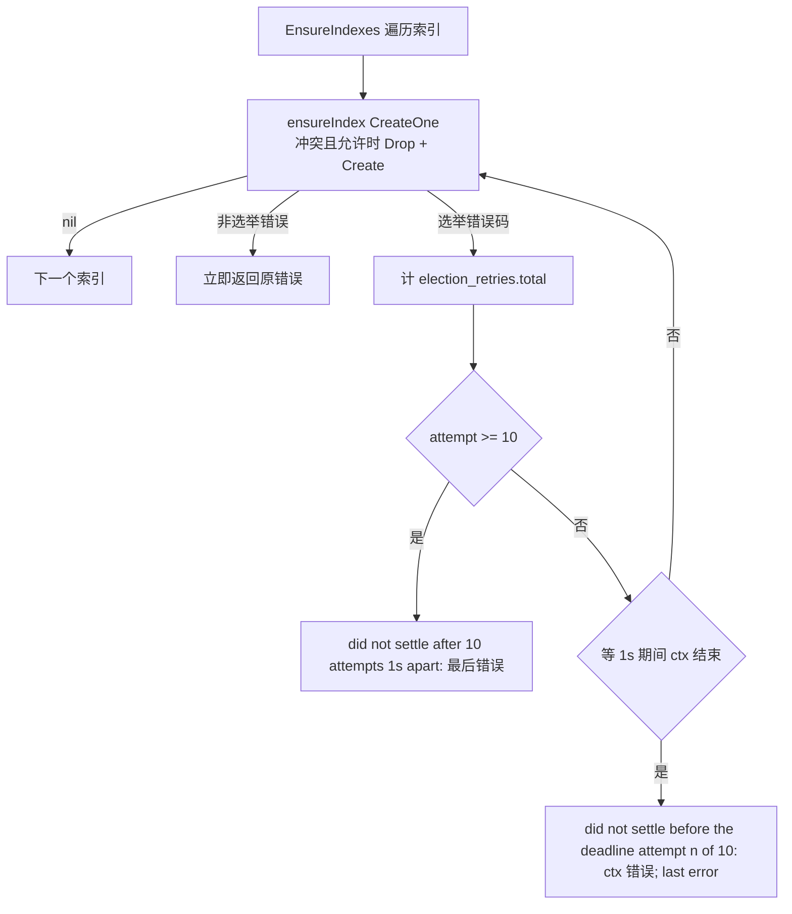
```mermaid
flowchart TD
    A[EnsureIndexes 遍历索引] --> B["ensureIndex CreateOne<br/>冲突且允许时 Drop + Create"]
    B -- nil --> N[下一个索引]
    B -- 非选举错误 --> R1[立即返回原错误]
    B -- 选举错误码 --> C[计 election_retries.total]
    C --> D{"attempt >= 10"}
    D -- 是 --> R2["did not settle after 10 attempts 1s apart: 最后错误"]
    D -- 否 --> E{等 1s 期间 ctx 结束}
    E -- 是 --> R3["did not settle before the deadline attempt n of 10: ctx 错误; last error"]
    E -- 否 --> B
```

**5. 失败与不确定结果**

| 情形 | 处理 | 调用方看到 |
| --- | --- | --- |
| 选举在 10 次内结束 | 重试成功 | nil；启动慢若干秒 |
| 选举 10 次仍未结束 | 放弃 | 点名选举的错误，启动失败 |
| 启动期限先到 | 放弃 | 点名期限的错误（`errors.Is` ctx 错误与原错误都成立） |
| 非选举错误（索引定义冲突、权限…） | 不重试 | 原错误 |
| 重试期间某次 CreateOne 其实已在旧主执行 | 再建同一索引幂等 | 无影响 |

**6. 测试**

| 用例 | 文件 | 覆盖 |
| --- | --- | --- |
| `TestIndexCreationRetriesThroughAnElectionWithinBounds` | `mongo/driver/election_retry_promises_test.go` | 四种情形（见上） |
| `TestMirrorLocalOwnerStorageInitSurvivesAMongoElection` | `remoteentity/owner_startup_election_integration_test.go` | 私有副本集 `fault mongo-stepdown` 期间连续执行 owner 存储初始化 |

修前红文本（原样，出处 `docs/feature/DECISIONS-R12-KIT-2026-10-06.md` §7；把上界临时改成 1 次，等同旧行为，未提交）：

```
owner_startup_election_integration_test.go:86: owner storage init #9 failed during the election: remote_entity: ensure transaction indexes: mongo: replica set primary election did not settle after 1 attempts 1s apart: write exception: write concern error: (InterruptedDueToReplStateChange) operation was interrupted
```

修后（原样，同一出处；同一用例连跑 6 轮）：

```
owner_startup_election_integration_test.go:104: stepDown: mongo-2; 20 owner storage inits all succeeded; slowest #4 took 1.120542541s; election retries 1
--- PASS: TestMirrorLocalOwnerStorageInitSurvivesAMongoElection (12.47s)
…（round 2～5 同形）
owner_startup_election_integration_test.go:104: stepDown: mongo-3; 20 owner storage inits all succeeded; slowest #4 took 1.126167625s; election retries 1
--- PASS: TestMirrorLocalOwnerStorageInitSurvivesAMongoElection (12.50s)
```

复跑入口（同一出处）：`ROOST_MIRROR_LOCAL_HOME=<私有目录> ROOST_MIRROR_LOCAL_OFFSET=<非 0 / 1000> ROOST_MIRROR_LOCAL_CORE_RUN='^TestMirrorLocalOwnerStorageInitSurvivesAMongoElection$' scripts/mirror-local.sh test-core`。批次验证：`go test -race -count=3 … mongo/driver …` ok、根包 ok、glsvet 退出 0。

**7. 性能证据**：无（启动路径；修后最慢一次初始化约 1.1s，即一次 1s 间隔的重试）。

**8. 未验证项与已知风险**

- 多机副本集与 mongos：E11。
- 次数按“每个索引”计（源码 `mongo/driver/collection.go:251-252`）：`EnsureIndexes` 带 N 个索引时，选举恰好跨越多个索引的最坏总时长约 N × 10s，总时长由调用方启动 ctx（缺省 30s）兜底。CHANGELOG 与 [第十二轮 kit 批 §7](../../feature/DECISIONS-R12-KIT-2026-10-06.md) 已写清（fixr），DECISIONS-PENDING 第十二轮行本次加注。
- 错误码表随驱动 / 服务端版本可能变化，升级时需核对。

**9. review 检查点**

- [ ] 确认 `EnsureIndexes` 只在启动路径调用：逐个看上面列出的 10 处调用点所在函数（`EnsureInfrastructure`、`EnsureRemoteStorage`、saga store / inbox 初始化），没有业务请求路径调用它。
- [ ] 确认 `isElectionError`（`mongo/driver/collection.go:286`）对写关注错误里的错误码也生效（`mongo.ServerError.HasErrorCode` 覆盖 `WriteException.WriteConcernError`）——修前红文本就是写关注错误。
- [ ] 确认 `ensureIndex` 的“冲突时 Drop 再 Create”（`AutoRecreate` 策略）在 Drop 之后遇到选举时，重试从 `CreateOne` 重新开始是安全的（索引已被 Drop，CreateOne 会重建）。
- [ ] 确认两条放弃错误都用 `%w` 保留原错误（`mongo/driver/collection.go:307-308`、`:314-315`），T-282 的日志文字与之一致。

<a id="drv-7"></a>
### DRV-7 A2 ③：versionstore 写入带一次性令牌，回复丢失由 store 核对（墓碑维护者选 A 不加）

> 首发 v1.23.0（本版） · [说明](guide-saga-drv-dao-rem.md#drv-7) · 前置 [DRV-1](#drv-1)、[DRV-3](#drv-3)；同批缺陷 [DRV-8](#drv-8)

**1. 提交**

| 提交 | 版本 | 内容 |
| --- | --- | --- |
| `6b3a0eb9` | v1.23.0（本版） | `versionstore/write_token.go`（新：令牌、信封头、判定 `judge`、`settle`、`Resume`、`UnknownOutcomeError`、指标）；`redis_store.go` 的 `Create` / `Update` / `DeleteIf` 走 `settle`、`WriteTokenHistory`、严格解码；`versionstore.go` 契约注释；替身加三个丢回复注入点；红绿用例与真实 Redis 单机 / Cluster 用例；T-291；同提交修 RR-20261006-35（[DRV-8](#drv-8)） |
| `5e72ca4d` | v1.23.0（本版） | DECISIONS-PENDING 第十三轮记录“versionstore 墓碑”维护者选 A |

方案与验证：[A2-3-VERSIONSTORE-WRITE-TOKEN](../../feature/A2-3-VERSIONSTORE-WRITE-TOKEN-2026-10-07.md)。基线 `66d72a33`。Lua 脚本未改，调用方未改。

**2. 改动文件与关键符号**（`5e72ca4d`）

| `path:line` | 符号 | 职责 |
| --- | --- | --- |
| `versionstore/write_token.go:41` / `:46` | `ErrOutcomeUnknown` / `ErrWriteTokenMismatch` | 核对后仍证明不了；同一令牌被用于不同的写 |
| `versionstore/write_token.go:55` | `DefaultWriteTokenHistory = DefaultMaxAttempts`（8） | 每键保留的令牌个数，等于单键竞争的设计上限 |
| `versionstore/write_token.go:60` | `MetricUnknownOutcome` | `versionstore.unknown_outcome.total{store, result=applied\|lost\|unresolved}` |
| `versionstore/write_token.go:69` / `:88` | `UnknownOutcomeError` / `Unwrap` | 带 `Key`、`Token`、最后的传输错误与这条写命令本身（未导出）；`errors.Is` 同时命中 `ErrOutcomeUnknown` 与传输错误 |
| `versionstore/write_token.go:102` / `:110` | `Resume` / `resumedWrite` | 把上一次的结果未知交给下一次调用：同一个键时先核对上一次的令牌；别的键忽略 |
| `versionstore/write_token.go:162` / `:193` / `:206` | `parseEnvelope` / `tokenFor` / `buildEnvelope` | 信封 `<version>\|<token_v>\|<token_v-1>…\n<payload>`：第 i 个令牌写出 `version-i`，下一次写 = 新令牌 + 读到的前 n-1 个；旧格式（头部没有令牌）、令牌为空、令牌多于版本号都是 `ErrMalformedRecord` |
| `versionstore/write_token.go:232` | `judge` | 按当前值判定：令牌在 → 已生效；与基准字节相同 → 没执行；由基准演进而来且没有本令牌 → 比输；其余（含键不存在）→ 证明不了 |
| `versionstore/write_token.go:282` | `replyNotLost` | 服务端错误回复、拨号失败、`ErrCASInvalidCommand` 不是回复丢失，原样返回、不核对 |
| `versionstore/write_token.go:302` | `settle` | 发出；回复丢失时读一次键按 `judge` 处理，只在“没执行”时原样重发同一条命令；重发与 compare-and-set 尝试共用 `MaxAttempts`；读失败立即返回结果未知 |
| `versionstore/write_token.go:418` / `:430` | `sameWrite` / `tokenMismatch` | `Resume` 的防误用：同一令牌、不同的值 / 种类 → `ErrWriteTokenMismatch`，不写 |
| `versionstore/redis_store.go:54-59` / `:135-140` | `RedisConfig.WriteTokenHistory` / `NewRedisStore` | 0 取缺省 8，负数报错 |
| `versionstore/redis_store.go:344` / `:416` | `Update` / `resumeUpdate` | 每次 compare-and-set 一个新令牌；结果未知交给 `settle`（`:387`）；`Resume` 时先核对上一次 |
| `versionstore/redis_store.go:454` | `Create` | 结果未知时核对，认出自己的令牌返回 `created=true`，否则结果未知（键原本不存在，不重发） |
| `versionstore/redis_store.go:491` / `:538` | `DeleteIf` / `finishDelete` | 键还是原值 → 原样重发；已由原值演进 → `ErrVersionMismatch`；键不存在 → 结果未知 |
| `versionstore/versionstore.go:88-130` | `Store` 接口注释 | `Update` / `Create` / `Delete` 各自写明回复丢失怎么核对、哪种情况仍是结果未知 |
| `versionstore/fake_redis_test.go` | 替身 | 先加“执行之后丢回复”“没执行就断开”“核对时读不到”三个注入点，在修前实现上确认变红 |

**3. 不变量与强制点**

| 不变量 | 强制点 | 守卫 |
| --- | --- | --- |
| 回复丢失的写不会被叠加执行第二次 | 令牌与值同一条 `SET`、同一个脚本里原子写入；`settle` 只在当前值与基准字节相同（基准含随机令牌，删掉重建不可能得到同样字节）时重发同一条命令，被延迟的原命令与重发至多一个生效 | `TestAnUpdateWhoseReplyIsLostIsNotAppliedTwiceWhenTheCallerRetries`、`TestAnUpdateThatNeverRanIsResentOnce`、`TestRealRedisAWriteWhoseReplyIsLostIsRecognisedByItsToken`（单机）、`TestRealRedisClusterAWriteWhoseReplyIsLostIsRecognisedByItsToken` |
| 只在能证明时下结论 | `judge`（`versionstore/write_token.go:232`）：键不存在、不在一条演进链上、令牌被挤出、没有基准都返回“证明不了” | `TestAbsenceProvesNothing`、`TestATokenPushedOutOfTheHistoryIsNotGuessed` |
| 自己的写不被判成冲突 | `Create` 认出自己的令牌返回 `created=true`；别人在上面又写一次时按令牌位置认出 | `TestACreateWhoseReplyIsLostIsNotReportedAsTakenWhenTheCallerRetries`、`TestAnUpdateWhoseReplyIsLostStaysAppliedOnceAfterSomeoneElseWritesOnTop` |
| `Resume` 不会把同一令牌用在不同的写上 | `sameWrite` / `tokenMismatch` | `TestResumeRefusesTheSameTokenForADifferentWrite`（去掉值比较的变异报 `create resumed with a different value returned <nil>`）、`TestResumeReturnsTheEarlierWriteInsteadOfWritingAgain`、`TestResumeAfterTheEarlierWriteProvablyLostPerformsTheWrite` |
| 每键开销有界 | 令牌列表按次数保留（缺省 8 个，约 96 字节），随键删除 / 过期，不新增键、不需要 TTL | `TestTheEnvelopeKeepsABoundedTokenHistory` |
| 旧信封不被静默接受 | 严格解码 | `TestAnUnreadableRecordIsReportedAsMalformed`（`versionstore/malformed_promises_test.go:19`） |

**4. 控制流**（一次写命令 P 发出后，方案 §3）

1. 回复到了：成功 / 比输按原样处理；服务端错误回复、拨号失败、`ErrCASInvalidCommand` 原样返回（`replyNotLost`）。
2. 回复丢失：`GET` 一次（读命令，驱动照常重试），按当前值 C 判定：

| 当前值 C | 判定 | 动作 |
| --- | --- | --- |
| C 的令牌列表里有 P 的令牌（位置对应 P 要写的版本） | P 已生效 | 返回 P 写的值与版本，`applied=true` |
| P 有基准值 B，C 与 B 字节相同 | P 没执行 | 原样重发 P（同一令牌、同一期望值） |
| C 在 B 的版本位置上正是 B 的最新令牌、且没有 P 的令牌 | P 没生效，别人写了下一个版本 | `Update` 当作比输，重读重跑 mutate；`Delete` 返回 `ErrVersionMismatch` |
| 其他：C 不存在、不在一条演进链上、令牌被挤出、P 没有基准值而 C 里没有 P 的令牌 | 证明不了 | 返回 `ErrOutcomeUnknown`（`*UnknownOutcomeError`） |

3. 核对与重发都在同一次调用里、用调用方的 ctx；`GET` 失败立即返回结果未知。

**5. 失败与不确定结果**：维护者第十三轮“versionstore 墓碑”选 A（不加墓碑），下面两种情况**保持结果未知**，由调用方按请求 ID 去重或回读裁决：

| 情形 | 为什么证明不了 | 调用方看到 |
| --- | --- | --- |
| `Create`（或对不存在键的 `Update`）回复丢失、核对时键仍不存在 | “键不存在”没有身份：分不清“P 没执行”与“P 执行了、随后被别人删掉”；不重发，否则会把别人删掉的东西再建出来 | `ErrOutcomeUnknown` |
| `Delete` / `DeleteIf` 回复丢失、核对时键不存在 | 删除不留下任何东西：分不清是自己删的还是别人删的 | `ErrOutcomeUnknown` |

要认出这两种只能把删除改成写墓碑（选项 B：版本跨删除递增、带删除者令牌、读者当作不存在、保留期 R），代价是一个无法从现有约束推出的保留期、删除频繁的 store 内存放大、`Get` / `IndexRemoveIfAbsent` / TTL 语义都要改（方案 §8）。维护者选 A：保持本次实现。仓内没有在传输错误上重试 `Create` / `Delete` 的调用方（A2 调用方核对表），跨进程 / 跨 RPC 的重试已由值里的请求 ID 去重（chat `RequestID`、mail Sends 账本、session 请求账本等）。

其余：

| 情形 | 处理 | 调用方看到 |
| --- | --- | --- |
| 令牌被挤出保留范围（键上又落了 8 次以上的写） | 证明不了 | `ErrOutcomeUnknown`（与 A2 ③ 之前相同，不判错） |
| 后端不可达（核对用的 `GET` 失败） | 立即停 | `ErrOutcomeUnknown`，链里有最后的传输错误 |
| go-redis 的 `ErrPoolTimeout` / `ErrClosed`（versionstore 不能 import 驱动，认不出） | 保守按回复丢失处理 | 核对的 `GET` 同样失败 → 结果未知 |
| 跨进程重试 | `UnknownOutcomeError` 只在进程内有效 | 照旧按值里的请求 ID 去重 |
| `MemoryStore` | 不会产生结果未知，忽略 `Resume` | — |

**6. 测试**

| 用例 | 文件 | 覆盖 |
| --- | --- | --- |
| `TestAnUpdateWhoseReplyIsLostIsNotAppliedTwiceWhenTheCallerRetries` / `TestACreateWhoseReplyIsLostIsNotReportedAsTakenWhenTheCallerRetries` / `TestAnUpdateWhoseReplyIsLostStaysAppliedOnceAfterSomeoneElseWritesOnTop` | `versionstore/write_token_promises_test.go:54` / `:76` / `:91` | 修前红的三种“朴素重试”场景 |
| `TestAnUpdateThatNeverRanIsResentOnce` | 同上 `:121` | 没执行时原样重发一次 |
| `TestResumeReturnsTheEarlierWriteInsteadOfWritingAgain` / `TestResumeAfterTheEarlierWriteProvablyLostPerformsTheWrite` / `TestResumeRefusesTheSameTokenForADifferentWrite` | 同上 `:141` / `:172` / `:198` | `Resume` 三种结果 |
| `TestATokenPushedOutOfTheHistoryIsNotGuessed` / `TestAbsenceProvesNothing` / `TestTheEnvelopeKeepsABoundedTokenHistory` | 同上 `:248` / `:282` / `:327` | 不猜；键不存在与 Delete 的边界（墓碑选 A 的两种结果未知）；令牌有界 |
| `TestRealRedisAWriteWhoseReplyIsLostIsRecognisedByItsToken` / `TestRealRedisClusterAWriteWhoseReplyIsLostIsRecognisedByItsToken` | `versionstore/write_token_integration_test.go:74` / `:101`（integration） | 真实 Redis 单机（自建 toxiproxy 丢回复）与私有 Cluster 3 主 3 从（ProcessHook 让脚本执行后丢回复，带固定索引、hash tag 同槽） |
| `TestRealRedisUpdateWhoseReplyIsLostNeverWritesTwice` | `versionstore/lost_reply_integration_test.go:106`（integration） | NC-100 用例：现在打印 `lost reply surfaced as <nil>; Redis holds [hello msg-1] / v2`（核对成已生效） |
| `TestAnUnreadableRecordIsReportedAsMalformed` | `versionstore/malformed_promises_test.go:19` | 旧信封报 `ErrMalformedRecord` |

修前红（原样节选，基线 `66d72a33`，替身与真实 Redis 单机 / Cluster 都红，出处方案 §10）：

```text
--- FAIL: TestAnUpdateWhoseReplyIsLostIsNotAppliedTwiceWhenTheCallerRetries
    update returned {Value:{Name:a Total:2} Version:3} applied=true err=<nil>; store holds {Value:{Name:a Total:2} Version:3} (want total 1 at v2)
--- FAIL: TestACreateWhoseReplyIsLostIsNotReportedAsTakenWhenTheCallerRetries
    a create whose reply was lost was reported as created=false {Value:{Name: Total:0} Version:0} err=<nil>; it is this caller's own write
--- FAIL: TestAnUpdateWhoseReplyIsLostStaysAppliedOnceAfterSomeoneElseWritesOnTop
    update returned {Value:{Name:a Total:102} Version:4} applied=true err=<nil>; store holds {Value:{Name:a Total:102} Version:4} (want this write at v2 total 1, store total 101 at v3)
--- FAIL: TestRealRedisAWriteWhoseReplyIsLostIsRecognisedByItsToken/update
    lost reply: update returned [hello msg-1 msg-1] / v3 applied=true err=<nil>; Redis holds [hello msg-1 msg-1] / v3 (want msg-1 once at v2)
--- FAIL: TestRealRedisAWriteWhoseReplyIsLostIsRecognisedByItsToken/create
    lost reply: create returned created=false [] / v0 err=<nil>; it is this caller's own write
--- FAIL: TestRealRedisClusterAWriteWhoseReplyIsLostIsRecognisedByItsToken/update   （同上文本）
--- FAIL: TestRealRedisClusterAWriteWhoseReplyIsLostIsRecognisedByItsToken/create   （同上文本）
```

`Resume` / `ErrWriteTokenMismatch` 是新 API：它们的红就是上面“朴素重试”的同一场景；防误用的检查用变异确认。修后（方案 §10）：`go test -race -count=3 ./redis/ ./versionstore/`；私有 mirror-local 环境 `-tags integration -count=1 -p 1 ./redis/ ./versionstore/`（单机 toxiproxy + Cluster 3 主 3 从）；指向私有单机 / Cluster 的 `-tags integration -p 1 -v ./kit/service/... ./service/...` 15 个包 ok、0 SKIP；`go test ./kit/service/... ./service/... ./demo/...`；根包；`go build ./... && go vet ./...` 通过。

**7. 性能证据**：未做基准。正常路径只多拼一段信封头（每键 ≤ 8 × 12 字节）；回复丢失时同一次调用里多一次 `GET` 和至多 `MaxAttempts` 次重发（受调用方 ctx 约束）。

**8. 未验证项与已知风险**

- 多机 Redis Cluster 下的丢回复与切主：本机私有 Cluster 3 主 3 从已红绿，多机见 [E08](../../review/EXTERNAL-VERIFICATION-2026-10-06.md)；异步复制丢写与切主见 [E10](../../review/EXTERNAL-VERIFICATION-2026-10-06.md)（主上已写入、未复制就切主时令牌随值一起丢，核对结果是“证明不了”或“没执行”，与值本身的复制语义一致）。
- 不兼容：持久格式改变，新版本读旧信封报 `ErrMalformedRecord`，旧版本读新信封同样报错；升级需清空各服务 versionstore 前缀下的键与带索引 store 的索引有序集合，不支持新旧进程混跑（T-291；线上未部署，维护者决定不做兼容）。
- 墓碑选 A 之后的两种结果未知是写明的契约（第 5 节），不是缺陷。

**9. review 检查点**

- [ ] `versionstore/write_token.go:232-266` `judge`：确认“没执行”只在 `bytes.Equal(current, write.base)` 时成立（基准字节含随机令牌），“比输”要求当前值在基准版本位置上正是基准的最新令牌且版本更大；键不存在一律“证明不了”。
- [ ] `versionstore/write_token.go:302-361` `settle`：确认重发与 compare-and-set 尝试共用 `MaxAttempts`、退避与 ctx 检查在每次重发前；`replyNotLost` 的错误在首发时原样返回、在重发时视为“这次重发没出去”再看一次。
- [ ] `replyNotLost`（`:282-292`）把带 `RedisError()` 的服务端错误回复当作“回复到了”：确认带索引脚本 `SET` 之后的 `ZADD` / `ZREM` 遇 `WRONGTYPE` 时值已改却返回错误（部署错误，RR-20261006-35 修复记录写明不处理），这一情形 `settle` 原样返回、不核对。
- [ ] `Resume` 只在进程内有效、只对同一个渲染后的键生效（`resumedWrite`，`:110-116`）：确认上层一次操作先写别的键时不会误用这份 Resume。
- [ ] 调用方核对（方案 §6）：仓内全部经 `Store` 接口或 `*RedisStore`，没有直接读写信封字节的代码；`kit/service/rank` 只用 `CountCompareAndSet` / `CountConflict`，不用信封。

<a id="drv-8"></a>
### DRV-8 RR-20261006-35：带索引写的 NaN 分数在发出前拒绝

> 首发 v1.23.0（本版） · [说明](guide-saga-drv-dao-rem.md#drv-8) · A2 ③（[DRV-7](#drv-7)）实施中发现

**1. 提交**

| 提交 | 版本 | 内容 |
| --- | --- | --- |
| `6b3a0eb9` | v1.23.0（本版） | `redis/cas.go` 拒绝 NaN 分数；替身改忠实（ZADD 拒绝 NaN 时 SET 已生效、返回错误回复）；用例；bug / bugfix 记录（与 A2 ③ 同一提交） |

**2. 改动文件与关键符号**

| `path:line` | 符号 | 职责 |
| --- | --- | --- |
| `redis/cas.go:132-133` | `CompareAndSet` | `Index.Remove == false` 且 `math.IsNaN(Index.Score)` 时返回包了 `ErrCASInvalidCommand` 的错误，什么都不发；`±Inf` 是 Redis 合法分数，不拒绝 |
| `versionstore/fake_redis_test.go` | 替身 | 带索引的 compare-and-set 在 ZADD 拒绝 NaN 时值已写入、返回带 `RedisError()` 的错误回复（与 Redis 一致） |

**3. 不变量与强制点**：RR-20260919-04 的承诺“索引条目当且仅当 compare-and-set 生效时移动”。强制点在 `CompareAndSet`——带索引写的唯一入口，所有调用方都受保护。守卫 `TestAnIndexedWriteWithANaNScoreChangesNothing`（`versionstore/index_score_promises_test.go:19`）、`TestRealRedisAnIndexedWriteWithANaNScoreChangesNothing`（`versionstore/write_token_integration_test.go:186`，integration）。

**4. 控制流**：`RedisStore.Update` / `Create` → `RedisIndex.Entry` 给出分数 → `CompareAndSet` 发出前检查 → NaN 时返回 `ErrCASInvalidCommand`（`replyNotLost` 认它，A2 ③ 不核对、不重发）。修前：`compareAndSetIndexedScript` 先 `SET` / `PSETEX` 值、再 `ZADD`，ZADD 拒绝 NaN 时脚本报错但 SET 不回滚。

**5. 失败与不确定结果**

| 情形 | 处理 | 调用方看到 |
| --- | --- | --- |
| `Entry` 返回 NaN | 发出前拒绝 | `ErrCASInvalidCommand`，值、版本、索引都不变（修前：值写入 v2、索引不动、返回 `ERR value is not a valid float`） |
| 索引 key 被别的类型占用（`WRONGTYPE`，部署错误） | 不处理（修复记录“未验证 / 风险”） | 值已改、返回服务端错误，与改前相同 |

**6. 测试**：修前红（原样，出处 [问题记录](../../bug/RR-20261006-35.md)，真实 Redis，基线 `66d72a33`）：

```text
    write_token_integration_test.go:219: a NaN index score: update applied=false err=ERR value is not a valid float script: 2deb7cee6d6074b90e0086b5a2a33539849b83d7, on @user_script:21.; Redis holds [hello nan] / v2 (want nothing written)
--- FAIL: TestRealRedisAnIndexedWriteWithANaNScoreChangesNothing (0.00s)
```

替身改忠实后单测同样红：`an update whose index score is NaN returned applied=false err=ERR value is not a valid float script: on @user_script and the store holds {Value:{Name:a Total:1} Version:2} (want nothing written, ErrCASInvalidCommand)`。修后：两条用例通过；`go test -race -count=3 ./redis/ ./versionstore/` 通过。负对照：替身修忠实之前用例是绿的（替身用 `ParseFloat` 把 NaN 当合法分数，比真实 Redis 宽松——roost-bugfix lessons“比被测实现更正确的替身会把缺陷藏起来”）。

**7. 性能证据**：无（发出前多一次浮点判断）。

**8. 未验证项与已知风险**：无外部验证项。P3：仓内两个带索引的 store（platform 订单、activity dispatch）的分数都由整数时间换算，现有调用方到不了，属于契约漏洞。

**9. review 检查点**

- [ ] `redis/cas.go:132-133`：确认只有带索引且不是 Remove 的写检查 NaN；`CompareAndDelete` 与 Remove 分支不用分数。
- [ ] `versionstore/fake_redis_test.go`：确认替身对 NaN 的行为与真实 Redis 一致（SET 已生效后报错），否则 `TestAnIndexedWriteWithANaNScoreChangesNothing`（`versionstore/index_score_promises_test.go:19`）会在回退修复时仍是绿的。

## DAO：回滚统一走 DAO

<a id="dao-1"></a>
### DAO-1 回滚统一走 DAO（A1）

> 首发 v1.20.2 · [说明](guide-saga-drv-dao-rem.md#dao-1)

**1. 提交**

| 提交 | 版本 | 内容 |
| --- | --- | --- |
| `3d4fe9f3` | v1.20.1 | 背景：NC-60～63（含 NC-61 属性层随事务回滚，组件 `captureRollback` 做法） |
| `197f7bb9` | v1.20.1 | 背景：NC-64/65（NC-65 玩家加载时重建 Gear 与 `attr_final`） |
| `23a10f42` | v1.20.1 | 背景：NC-140～147（NC-140 World 定时器堆随事务回滚，组件 `captureRollback` 做法） |
| `d346b45c` | v1.20.2 | 记录维护者第二轮决定（A1 不采用推荐） |
| `5407f127` | v1.20.2 | A1 实施：codegen `mutableFields`；demo 属性 / 定时器组件无状态；`CombatDao.beginChange` / `markChanged`；glsvet A1 提示；roost-coding、codegen README、生成工程文档、组件骨架注释；先红后绿证据与基准 |
| `aa415fa6` | v1.20.2 | DECISIONS-PENDING A1 标为已实施 |
| `62cec54e` | v1.21.0 | B4：roost-coding A1 条加 skill Runtime 例外，glsvet 守卫（见 [DAO-2](#dao-2)） |
| `88f33776` | v1.23.0 | 收尾第 1 批 A16：CombatComponent 注释按源码更正（事务里 DAO 加入字段、事务外 panic、`ProjectAttributes` 例外） |

**2. 改动文件与关键符号**

| `path:line` | 符号 | 职责 |
| --- | --- | --- |
| `codegen/internal/dao/gen.go:299` / `:512` | 模板函数 `mutableFields` / `filterMutable` | 所有非 `dao:"-"` 字段都生成 mutator（原 `dirtyFields` / `filterDirty` 只收 persist 或 sync） |
| `codegen/internal/dao/template_dao.go:222` | `{{range mutableFields .Dao.Fields}}` | mutator 生成范围 |
| `codegen/internal/dao/template_dao.go:226`、`:261`、`:332`、`:361` | 生成 setter 里的 `nest.CurrentRollbackTx()` + `RollbackUndo` | DAO 自己“记逆操作 → 改 → 标脏”；`nopersist,nosync` 的 mark 为空 |
| `demo/db/def/player.go.tmpl:40` / `:47` / `:55` | `AttrBase` / `AttrFinal` / `AttrGear`（新） | `persist,sync` / `nopersist,sync` / `nopersist,nosync` |
| `demo/db/def/world.go.tmpl:22` / `:25` / `:33` | `Timers` / `TimerSeed` / `TimerNextDue`（新） | `persist` / `persist` / `nopersist,nosync` |
| `demo/game/entities/player/attribute_component.go.tmpl:89` | `AttributeComponent.OnInitFinish` | 加载时 `derive()`，只写 nopersist 字段 |
| `…/attribute_component.go.tmpl:97` / `:108` | `Container()` / `Final()` | 每次从 DAO 构造副本 |
| `…/attribute_component.go.tmpl:120` / `:137` | `LevelUp` / `RefreshGear` | 改源字段并在同一事务 `recompose()` |
| `…/attribute_component.go.tmpl:149` / `:155` / `:194` | `derive` / `writeGear` / `recompose` | 唯一写派生层的函数 |
| `demo/game/entities/world/timer_component.go.tmpl:113` | `TimerComponent.OnInitFinish` | 从 DAO 节点算 `timer_next_due` |
| `…/timer_component.go.tmpl:130` / `:153` / `:165` | `scheduler` / `settle` / `persist` | 一次调用内从 DAO 建调度器；变更钩子写穿 DAO；写回最早到期 |
| `…/timer_component.go.tmpl:233` | `Tick` | `timer_next_due` 为 0 或未到直接返回（不建堆） |
| `skill/combatcomponent/component.go:334` / `:374` | `CombatDao.beginChange` / `markChanged` | 按字段掩码登记逆操作（`nest.RecordUndo(dao, Field…)`）/ 标持久与同步脏 |
| `cmd/glsvet/main.go:681-685` / `:703` | `componentUndoCalls` / `componentUndoHints` | 组件方法里的 `RecordUndo` / `RecordUndoToken` / `DeferRollback` 打 `hint:` |
| `cmd/glsvet/main.go:166` | `vetDirectory` | 打印提示、不计 findings |
| `codegen/internal/roost/add_entity.go:325` | 组件骨架注释 | 新规范 |
| `docs/agent-skills/roost-coding/SKILL.md:39` | 执行契约“回滚统一走 DAO” | 规则正文（含 B4 例外） |

Nest 侧（未改，作为机制背景）：`nest/rollback.go:163` / `:170` `RollbackTx.RecordUndo` / `RecordUndoToken`（同一 owner + field + token 只记第一条逆操作，`:187-191`）；`:198` 包级 `RecordUndo`（非 `RollbackUndo` 策略返回 false）；`:370` `RollbackTx.Rollback`（逆序执行）；`:980` `captureDao`（state 策略下经 `RollbackSnapshotter` 快照）；`nest/execution.go:277` `rejectCommit`（明确拒绝 → Rollback）。

**3. 不变量与强制点**

- 不变量 1：组件不持有事务会改的内存状态；事务会改的状态都在 DAO，回滚由 Nest 的 DAO 回滚（undo 逆操作或 state 快照）完成。强制点：没有硬门禁（规范 + 生成形状）；glsvet A1 提示只覆盖“组件方法里直接调 undo”这一种形状。
- 不变量 2：`nopersist,nosync` 字段参与回滚，不进提交记录 / WAL / Mongo / 同步。强制点：生成 DAO 的 mark 函数为空；`persistFields` / `syncFields` 不含它。
- 不变量 3：派生值只由唯一的 derive 写；回滚不触发重算。强制点：模板结构（`derive` / `settle` / `deriveProjection` 各一处）。
- 守卫测试：`TestTransientFieldsHaveMutatorsAndStayOutOfStorageAndSync`（`codegen/internal/dao/transient_field_promises_test.go:14`）；daoruntime `TestATransientFieldRollsBackWithTheTransaction` / `TestATransientFieldNeverReachesTheCommitRecordOrSync` / `TestATransientFieldIsInTheStateSnapshot`（`codegen/internal/dao/testdata/runtime/transient_test.go:21` / `:39` / `:94`）；`TestComponentRecordingItsOwnUndoIsHinted`（`cmd/glsvet/main_test.go:166`）；demo 模板 `TestAttributeRollbackIsTheDaoRollback`（`demo/game/entities/player/attribute_component_test.go.tmpl:340`）、`TestNonPersistentAttributeLayersStayOutOfTheWAL`（`:430`）、`TestTimerRollbackIsTheDaoRollback`（`demo/game/entities/world/timer_component_test.go.tmpl:319`）、`TestTimerBookkeepingStaysOutOfTheCommitRecord`（`:419`）；`TestCombatRollbackIsTheDaoRollback`（`skill/combatcomponent/dao_rollback_promises_test.go:29`）。

**4. 控制流**

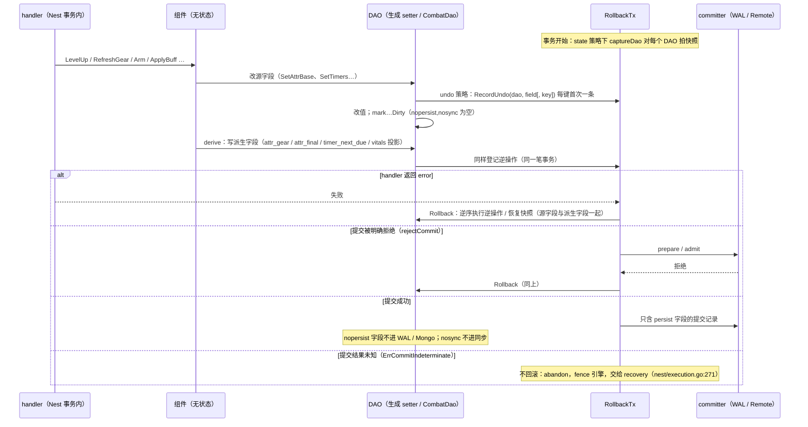
```mermaid
sequenceDiagram
    participant H as handler（Nest 事务内）
    participant C as 组件（无状态）
    participant D as DAO（生成 setter / CombatDao）
    participant T as RollbackTx
    participant K as committer（WAL / Remote）
    Note over T: 事务开始：state 策略下 captureDao 对每个 DAO 拍快照
    H->>C: LevelUp / RefreshGear / Arm / ApplyBuff …
    C->>D: 改源字段（SetAttrBase、SetTimers…）
    D->>T: undo 策略：RecordUndo(dao, field[, key]) 每键首次一条
    D->>D: 改值；mark…Dirty（nopersist,nosync 为空）
    C->>D: derive：写派生字段（attr_gear / attr_final / timer_next_due / vitals 投影）
    D->>T: 同样登记逆操作（同一笔事务）
    alt handler 返回 error
        H-->>T: 失败
        T->>D: Rollback：逆序执行逆操作 / 恢复快照（源字段与派生字段一起）
    else 提交被明确拒绝（rejectCommit）
        T->>K: prepare / admit
        K-->>T: 拒绝
        T->>D: Rollback（同上）
    else 提交成功
        T->>K: 只含 persist 字段的提交记录
        Note over D: nopersist 字段不进 WAL / Mongo；nosync 不进同步
    else 提交结果未知（ErrCommitIndeterminate）
        Note over T: 不回滚：abandon，fence 引擎，交给 recovery（nest/execution.go:271）
    end
```

**5. 失败与不确定结果**

| 情形 | 处理 | 结果 |
| --- | --- | --- |
| handler 返回 error（undo 策略） | `Rollback` 逆序执行 DAO 登记的逆操作 | 源字段与派生字段都回到事务开始时的值 |
| handler 返回 error（state 策略） | 恢复事务开始时的 DAO 快照（`CaptureRollbackState` 覆盖所有字段，含 nopersist） | 同上 |
| 提交被明确拒绝（WAL 准入失败、committer 拒绝、Remote 批次拒绝） | `rejectCommit` → `Rollback`，错误带 `ErrCommitRejected` | 同上 |
| 提交结果未知 | 不回滚，fence 引擎 | 调用方得到 `ErrCommitIndeterminate`；之后按 recovery 从存储重载 |
| 加载（`OnInitFinish`，无事务） | 只写 nopersist 字段：生成 setter 无事务时不登记 undo、不 `MarkPersist` | 不产生持久写 |
| 旧工程组件仍在登记 undo | 照常工作 | glsvet 打 `hint:`，退出码不变 |

**6. 测试**

| 用例 | 文件 | 覆盖 |
| --- | --- | --- |
| `TestTransientFieldsHaveMutatorsAndStayOutOfStorageAndSync` | `codegen/internal/dao/transient_field_promises_test.go` | 生成断言：有 mutator、快照覆盖、存储 / 提交 / 同步函数不碰它 |
| `TestATransientFieldRollsBackWithTheTransaction` 等 3 条 | `codegen/internal/dao/testdata/runtime/transient_test.go` | daoruntime：undo 回滚、state 快照、提交记录（Put 与 patch）与同步载荷不含 |
| `TestComponentRecordingItsOwnUndoIsHinted` | `cmd/glsvet/main_test.go` | 组件方法登记 undo 被提示 |
| `TestAttributeLayersRollBackWithTheTransaction`（NC-61） / `TestAttributeRollbackIsTheDaoRollback` | `demo/game/entities/player/attribute_component_test.go.tmpl` | 真实 Nest 派发 × undo / state × handler 失败 / 提交被拒 |
| `TestFinalIsRecomputedFromWornGearWhenThePlayerLoads`（NC-65） | 同上 | 加载时重建 |
| `TestNonPersistentAttributeLayersStayOutOfTheWAL` | 同上 | 真实 `nestwal` 写入 + 重放：有 `attr_base`，无 `attr_gear` / `attr_final` |
| `TestTheTimerHeapRollsBackWithTheTransaction`（NC-140） / `TestTimerRollbackIsTheDaoRollback` | `demo/game/entities/world/timer_component_test.go.tmpl` | 武装 / 触发 × 两种策略 × 两条失败路径 |
| `TestTimerBookkeepingStaysOutOfTheCommitRecord` | 同上 | 提交记录不含 `timer_next_due` |
| `TestCombatRollbackIsTheDaoRollback` / `TestNestUndoRollbackRestoresCombatStateExactly` | `skill/combatcomponent/dao_rollback_promises_test.go` / `skill/combatcomponent/component_test.go:106` | 战斗状态回滚字节一致 |

修前红文本（原样，出处 `docs/feature/evidence/dao-unified-rollback-20261005/red-demo.txt`；做法：新用例 + 旧组件模板，把两个 `captureRollback` 置为立即返回）：

```text
--- FAIL: TestAttributeLayersRollBackWithTheTransaction (0.00s)
    --- FAIL: TestAttributeLayersRollBackWithTheTransaction/a_later_step_fails (0.00s)
        attribute_component_test.go:241: rolled back to level 0 but the base layer kept the level-up: HP 110 attack 12, want HP 100 attack 10
    --- FAIL: TestAttributeLayersRollBackWithTheTransaction/the_commit_is_rejected (0.00s)
        attribute_component_test.go:241: rolled back to level 0 but the base layer kept the level-up: HP 110 attack 12, want HP 100 attack 10
--- FAIL: TestAttributeRollbackIsTheDaoRollback (0.00s)
    --- FAIL: TestAttributeRollbackIsTheDaoRollback/undo/handler_fails (0.00s)
        attribute_component_test.go:399: base after rollback = &{HP:110 Attack:12 Power:35 dirtyMask:7} (present true), want HP 100 attack 10
    --- FAIL: TestAttributeRollbackIsTheDaoRollback/undo/commit_rejected (0.00s)
        attribute_component_test.go:399: base after rollback = &{HP:110 Attack:12 Power:35 dirtyMask:7} (present true), want HP 100 attack 10
    --- FAIL: TestAttributeRollbackIsTheDaoRollback/state/handler_fails (0.00s)
        attribute_component_test.go:399: base after rollback = &{HP:110 Attack:12 Power:35 dirtyMask:7} (present true), want HP 100 attack 10
    --- FAIL: TestAttributeRollbackIsTheDaoRollback/state/commit_rejected (0.00s)
        attribute_component_test.go:399: base after rollback = &{HP:110 Attack:12 Power:35 dirtyMask:7} (present true), want HP 100 attack 10
FAIL
FAIL	example.com/a1demo/game/entities/player	0.969s
--- FAIL: TestTimerRollbackIsTheDaoRollback (0.00s)
    --- FAIL: TestTimerRollbackIsTheDaoRollback/arm/undo/handler_fails (0.00s)
        timer_component_test.go:350: rolled back, but node 1 is still pending
    --- FAIL: TestTimerRollbackIsTheDaoRollback/tick/undo/handler_fails (0.00s)
        timer_component_test.go:391: the rolled-back tick took the deadline away
    --- FAIL: TestTimerRollbackIsTheDaoRollback/arm/undo/commit_rejected (0.00s)
        timer_component_test.go:350: rolled back, but node 1 is still pending
    --- FAIL: TestTimerRollbackIsTheDaoRollback/tick/undo/commit_rejected (0.00s)
        timer_component_test.go:391: the rolled-back tick took the deadline away
    --- FAIL: TestTimerRollbackIsTheDaoRollback/arm/state/handler_fails (0.00s)
        timer_component_test.go:350: rolled back, but node 1 is still pending
    --- FAIL: TestTimerRollbackIsTheDaoRollback/tick/state/handler_fails (0.00s)
        timer_component_test.go:391: the rolled-back tick took the deadline away
    --- FAIL: TestTimerRollbackIsTheDaoRollback/arm/state/commit_rejected (0.00s)
        timer_component_test.go:350: rolled back, but node 1 is still pending
    --- FAIL: TestTimerRollbackIsTheDaoRollback/tick/state/commit_rejected (0.00s)
        timer_component_test.go:391: the rolled-back tick took the deadline away
FAIL
FAIL	example.com/a1demo/game/entities/world	0.489s
FAIL
```

combatcomponent（原样，出处 `red-combat.txt`；把组件里的 `nest.RecordUndo` 换成空操作）：

```text
--- FAIL: TestNestUndoRollbackRestoresCombatStateExactly (0.00s)
    component_test.go:161: defender state diverged after rollback:
--- FAIL: TestCombatRollbackIsTheDaoRollback (0.00s)
    --- FAIL: TestCombatRollbackIsTheDaoRollback/undo/handler_fails (0.00s)
        dao_rollback_promises_test.go:88: defender state diverged after rollback:
    --- FAIL: TestCombatRollbackIsTheDaoRollback/undo/commit_rejected (0.00s)
        dao_rollback_promises_test.go:88: defender state diverged after rollback:
FAIL
FAIL	github.com/tjbdwanghaibo/roost-core/skill/combatcomponent	0.487s
FAIL
```

codegen（原样，出处 `red-codegen.txt`；旧生成器）：

```text
--- FAIL: TestTransientFieldsHaveMutatorsAndStayOutOfStorageAndSync (0.01s)
    transient_field_promises_test.go:46: the generated DAO has no "func (d *VarietyDao) SetNeither(v int64)": a nopersist,nosync field cannot be changed inside a transaction
    transient_field_promises_test.go:46: the generated DAO has no "func (d *VarietyDao) SetPending(key int32, val int64)": a nopersist,nosync field cannot be changed inside a transaction
    transient_field_promises_test.go:46: the generated DAO has no "func (d *VarietyDao) DelPending(key int32)": a nopersist,nosync field cannot be changed inside a transaction
    transient_field_promises_test.go:46: the generated DAO has no "func (d *VarietyDao) GetPending(key int32) (int64, bool)": a nopersist,nosync field cannot be changed inside a transaction
    transient_field_promises_test.go:46: the generated DAO has no "func (d *VarietyDao) RangePending(": a nopersist,nosync field cannot be changed inside a transaction
    transient_field_promises_test.go:46: the generated DAO has no "func (d *VarietyDao) PendingLen() int": a nopersist,nosync field cannot be changed inside a transaction
FAIL
FAIL	github.com/tjbdwanghaibo/roost-core/codegen/internal/dao	0.470s
FAIL
```

glsvet 修前提示（原样，出处 `glsvet-hints-before.txt`；修后全仓 0 条，退出码均为 0）：

```text
base/game/entities/player/attribute_component.go:197:6: hint: component AttributeComponent.captureRollback registers its own undo (RecordUndo); keep transaction state in the DAO (a nopersist field if it must not be stored) so the DAO's rollback covers it
base/game/entities/world/timer_component.go:138:6: hint: component TimerComponent.captureRollback registers its own undo (RecordUndo); keep transaction state in the DAO (a nopersist field if it must not be stored) so the DAO's rollback covers it
skill/combatcomponent/component.go:276:2: hint: component CombatComponent.undoVitals registers its own undo (RecordUndo); keep transaction state in the DAO (a nopersist field if it must not be stored) so the DAO's rollback covers it
skill/combatcomponent/component.go:286:2: hint: component CombatComponent.undoAttributes registers its own undo (RecordUndo); keep transaction state in the DAO (a nopersist field if it must not be stored) so the DAO's rollback covers it
skill/combatcomponent/component.go:296:2: hint: component CombatComponent.undoBuffs registers its own undo (RecordUndo); keep transaction state in the DAO (a nopersist field if it must not be stored) so the DAO's rollback covers it
```

负对照：旧组件**带**手写 undo 时新用例全部通过（证明用例有效）；combatcomponent 的 state 两叶在红时也通过（状态本来就在 DAO 快照里）；codegen 的存储 / 同步隔离断言在旧生成器上已通过（缺的只是 mutator）。修后：`green-demo.txt` 全部 PASS；core `go test -race -count=3 ./cmd/glsvet ./codegen/internal/dao ./skill/combatcomponent`、`go test -count=1 ./codegen/...`、`go generate ./...` 后 porcelain、glsvet、`go build ./... && go vet ./...`、根包通过；生成 game-demo `go test -race -count=3 ./game/entities/... ./game/handler/...` 与 `go test -count=1 ./...` 通过；NC-61 / NC-65 / NC-140 原用例不改断言照样通过；`git diff d346b45c -- nest` 为空（方案 §8）。

**7. 性能证据**（Apple M5，Go 1.27.0，同机同命令 `-count 8 -benchtime 300ms`，n=8；旧 = `d346b45c` 模板生成，新 = 本分支模板生成；出处 `docs/feature/evidence/dao-unified-rollback-20261005/bench-stat.txt`，基准源码 `attribute_bench_test.go.txt` / `timer_bench_test.go.txt`）

| 基准 | sec/op 旧 → 新 | B/op 旧 → 新 | allocs/op 旧 → 新 |
| --- | --- | --- | --- |
| `A1AttributeLevelUpCommit` | 5.168µ → 5.163µ（~，p=0.721） | 8.553Ki → 8.388Ki（−1.93%） | 130 → 134（+3.08%） |
| `A1AttributeLevelUpRollback` | 3.016µ → 2.440µ（−19.10%） | 4.569Ki → 4.155Ki（−9.06%） | 64 → 64 |
| `A1AttributeRefreshGearCommit` | 6.658µ → 4.951µ（−25.63%） | 11.009Ki → 8.285Ki（−24.74%） | 146 → 118（−19.18%） |
| `A1TimerIdleTick` | 416.9n → 387.9n（~，p=0.083） | 1008 → 849（−15.77%） | 8 → 5（−37.50%） |
| `A1TimerArmAndFire` | 6.351µ → 6.661µ（+4.89%） | 12.19Ki → 13.37Ki（+9.65%） | 154 → 173（+12.34%） |

结论（方案 §8）：DAO 逐键 undo 低于旧实现每次复制全部层；代价在定时器武装 / 触发（每次从 DAO 建调度器，O(n log n)），World 节点数个位到十位可接受。combatcomponent 只是把同样的逆操作从组件搬进 DAO，未单独测。

**8. 未验证项与已知风险**

- 被拒提交的回滚由真实 Nest 引擎 + 拒绝的 committer 与真实文件 WAL 覆盖（与三进程 WAL + Mongo 投影链路是同一个 `rejectCommit` 路径）。
- glsvet A1 提示（当前形状，见 [DAO-4](#dao-4)）：组件识别口径是接收者类型名以 `Component` 结尾或匿名嵌入 `ComponentBase`；undo 登记提示看方法体里的直接调用与一层同包 helper（RR-20261006-13，`b7471ae4`）；字段写提示看组件方法（`OnInitFinish` / `OnDestroy` 除外）写非 DAO 句柄、非函数类型、未标 `//roost:cache` 的字段，同样跟进一层 helper（第十三轮“A1 盲区”，`565f657b`）。两者都是语法层提示、不计入失败：没有类型信息时看不见先取到局部变量再改、经方法调用改、嵌入提升的字段、两层以上的 helper（设计取舍，记录写明，[A1 字段写提示 §2](../../feature/A1-COMPONENT-FIELD-WRITE-HINT-2026-10-06.md)）。
- 已生成工程不迁移，旧 `captureRollback` 仍在用户工程里；glsvet 在 CI（`go run ./cmd/glsvet ./...`）里会打提示但不失败。
- 定时器节点数到数千时需换写法（方案 §8）。

**9. review 检查点**

- [ ] 确认组件上不再有可回滚字段：读 `demo/game/entities/**/*_component.go.tmpl` 与 `skill/combatcomponent/component.go:222-225` 的组件结构体，字段只应是 `owner` / `dao` / 投影函数这类非事务状态。
- [ ] 确认 glsvet A1 提示覆盖的范围：`cmd/glsvet/main.go:703` `componentUndoHints`（直接调用，RR-20261006-13 起跟进一层同包 helper，`packageUndoHelpers` `:756`）与 `cmd/glsvet/componentfields.go:271` `componentFieldHints`（第十三轮“A1 盲区”，[DAO-4](#dao-4)）；`TestComponentRecordingItsOwnUndoIsHinted`（`cmd/glsvet/main_test.go:166`）、`TestComponentRecordingUndoThroughHelperIsHinted`（`:222`）、`TestComponentFieldWritesOutsideTheDaoAreHinted`（`cmd/glsvet/componentfields_promises_test.go:17`）覆盖了哪些形状；CI 的 `go run ./cmd/glsvet ./...` 输出里当前应为 0 条 A1 hint。
- [ ] 确认全仓生产代码里登记 undo 的只有 DAO：`grep -rln 'RecordUndo\|DeferRollback' --include='*.go' . | grep -v _test.go` 只应是 `nest/`、`cmd/glsvet/main.go`（字符串）、`codegen/internal/dao/template_*.go`、`skill/combatcomponent/component.go`（且只在 `CombatDao.beginChange` 里，`:340-354`）。
- [ ] 确认 `nopersist,nosync` 字段不进提交记录 / WAL / 同步：看 `template_dao.go` 里 `persistFields` / `syncFields` 的使用点与 daoruntime `TestATransientFieldNeverReachesTheCommitRecordOrSync`。
- [ ] 确认 `CombatDao.beginChange`（`skill/combatcomponent/component.go:334`）在事务外 panic、在 state 策略下 `nest.RecordUndo` 返回 false 由快照兜底，且同一字段一笔事务只记第一条逆操作（`nest/rollback.go:187-191` 的 `undoKeys`）。
- [ ] 确认 demo 的 `OnInitFinish` 只写 nopersist 字段（`demo/game/entities/player/attribute_component.go.tmpl:89`、`demo/game/entities/world/timer_component.go.tmpl:113`），加载不产生持久写。

<a id="dao-2"></a>
### DAO-2 skill Runtime 状态不进事务（B4）

> 首发 v1.21.0 · [说明](guide-saga-drv-dao-rem.md#dao-2)

**1. 提交**

| 提交 | 版本 | 内容 |
| --- | --- | --- |
| `5407f127` | v1.20.2 | A1 方案 §4.4 把 Runtime 列为后续；`docs/skill/skill-casting-and-combat.md` 写现状约束 |
| `2954c583` | v1.21.0 | 记录维护者第四轮决定（含 B4） |
| `62cec54e` | v1.21.0 | “Runtime 不在事务里（B4）”一节；skill README；roost-coding A1 例外；glsvet `componentUndoHints` 注释 + `TestSkillPackagesGetNoComponentUndoHint` |
| `86882561` | v1.21.0 | DECISIONS-PENDING B4 标为已实施 |

**2. 改动文件与关键符号**

| `path:line` | 符号 | 职责 |
| --- | --- | --- |
| `docs/skill/skill-casting-and-combat.md:147` | “Runtime 不在事务里（B4）” | 回退 / 不回退对照表与四条设计约束 |
| `docs/agent-skills/roost-coding/SKILL.md:39` | A1 条“明确例外” | 不要为 Runtime 补 undo 或 DAO 化 |
| `cmd/glsvet/main.go:687-702` | `componentUndoHints` 注释 | 说明 Runtime 不会被命中、无需豁免 |
| `cmd/glsvet/main_test.go:271` | `TestSkillPackagesGetNoComponentUndoHint` | skill 各包零 A1 提示 |
| `skill/README.md` | combatcomponent 段 | 补 B4 说明 |

**3. 不变量与强制点**

- 不变量：Runtime 状态不参与 Nest 回滚；战斗 DAO 参与。强制点：无代码强制（这是“保持现状”的决定）；Runtime 没有任何 DAO 字段，也不登记 undo。
- 守卫：`TestSkillPackagesGetNoComponentUndoHint` 扫 `skill`、`skill/combatcomponent`、`skill/combat`、`skill/skillsync` 四个目录的非测试文件，A1 提示必须为 0。它防的是“有人给 Runtime / skill 组件补 undo 登记”，同时保证 glsvet 不会因 B4 误报。

**4. 控制流**（handler 推进 Runtime 后失败）

1. handler 校验业务条件（应全部放在 Runtime 调用之前）。
2. handler 调 `Runtime.Start / Activate / Advance …`；Runtime 经 `HostAdapter` 改战斗 DAO（资源、血量、buff），commit 时 `Host.PayCosts` → ammo 扣减 → 冷却。
3. handler 之后返回 error 或提交被拒：Nest 回滚战斗 DAO；Runtime 的冷却、ammo、cast、proc 账本、revision 不回退。
4. 结果：“法力已回滚、技能已进冷却”。业务若需要严格一致：提交确认后再推进 Runtime，或失败时 `Checkpoint` / `RestoreRuntime`。

**5. 失败与不确定结果**

| 情形 | 处理 | 结果 |
| --- | --- | --- |
| Runtime 调用前业务校验失败 | handler 返回 error | 无副作用（推荐写法） |
| Runtime 调用后 handler 返回 error | DAO 回滚 | Runtime 状态与 DAO 不一致（设计接受） |
| `PayCosts` 失败 | cast 不提交 | 冷却与 ammo 不动；启动阶段失败的 cast 直接删除（NC-110） |
| Host 命令返回 error | `failCastLocked` 记 `CastFailed` | 冷却按已提交处理；DAO 与 Runtime 看法一致 |
| 提交被拒 / 结果未知 | 只能由业务处理 | 见步骤 4 |

**6. 测试**

| 用例 | 文件 | 覆盖 |
| --- | --- | --- |
| `TestSkillPackagesGetNoComponentUndoHint` | `cmd/glsvet/main_test.go:271` | skill 四个包零 A1 提示 |

修前红文本：记录未保留原文（B4 是“写成约束 + 守卫”，守卫在实施时新增即绿，没有修前红）。验证命令：记录未保留原文（`62cec54e` 提交说明只列改动）。

**7. 性能证据**：无（不涉及代码路径）。

**8. 未验证项与已知风险**

- 守卫只覆盖 4 个目录；`skill/skillcompose` 与 `skill/examples/*` 不在扫描列表（源码观察）。
- Runtime 与 DAO 的不一致由业务按约束避免，没有运行期检测。

**9. review 检查点**

- [ ] 确认 `TestSkillPackagesGetNoComponentUndoHint`（`cmd/glsvet/main_test.go:271`）的目录列表是否应补 `skill/skillcompose`（`find skill -name '*.go' ! -name '*_test.go' -exec dirname {} \; | sort -u` 列出 8 个目录）。
- [ ] 确认 `docs/skill/skill-casting-and-combat.md:147` 一节列的“不回退”项与 Runtime 源码一致：`runtime_cast_window.go` 的 `commitCast` 顺序“支付 → ammo → 冷却”，`failCastLocked` 的冷却处理。
- [ ] 确认 roost-coding A1 条（`docs/agent-skills/roost-coding/SKILL.md:39`）的例外文字与 DECISIONS-PENDING 第四轮 B4 行一致。
- [ ] 确认仓内没有生产代码在 nest handler 里推进 Runtime 后再做会失败的业务检查（当前 Runtime 无正式生产调用方，方案 §4.4）。

<a id="dao-3"></a>
### DAO-3 combatcomponent 属性投影入口（N09 O2）

> 首发 v1.23.0（本版） · [说明](guide-saga-drv-dao-rem.md#dao-3)

**1. 提交**

| 提交 | 版本 | 内容 |
| --- | --- | --- |
| `78e26853` | v1.23.0 | 记录第十二轮决定（buff 投影按推荐） |
| `229a5aa0` | v1.23.0 | `AttributeProjection`、`CombatComponent.ProjectAttributes`、`deriveProjection`；各 mutator 末尾投影；`OnInitFinish` 投影；statusbridge 示例改用并包进事务；回归 `attribute_projection_promises_test.go`；文档。同提交 O22 / O7 / O29 与 cfggen globals 规则属 SKILL / CFG |
| `6bf15516` | v1.23.0 | DECISIONS-PENDING 第十二轮三行标为已实施 |
| `88f33776` | v1.23.0 | A16：`FieldVitals` 注释写明含 `ProjectAttributes` 写的字段；组件注释更正 |
| `ba13cb05` | v1.23.0 | 根包 `TestExamplesRun` 示例实跑门禁（起因是 statusbridge 在 A1 之后运行即 panic；属 TOOL） |

**2. 改动文件与关键符号**

| `path:line` | 符号 | 职责 |
| --- | --- | --- |
| `skill/combatcomponent/component.go:232` | `AttributeProjection` | `func(attribute func(combat.AttributeID) int64, combatant *combat.Combatant)` |
| `skill/combatcomponent/component.go:224` | `CombatComponent.projection` | 投影函数（代码，不是状态） |
| `skill/combatcomponent/component.go:240` | `OnInitFinish` | 加载 / 新建后投影一次 |
| `skill/combatcomponent/component.go:251` | `ProjectAttributes` | 安装并立即投影；nil 卸下 |
| `skill/combatcomponent/component.go:262` | `deriveProjection` | 唯一写投影字段的入口：克隆 vitals → 调投影 → `reflect.DeepEqual` 相同则不动 → 无事务直接写内存 / 有事务 `beginChange(FieldVitals)` + 写 + `markChanged(FieldVitals)` |
| `skill/combatcomponent/component.go:384`–`:472` | `InitCombatant`、`SetAttributeBase`、`SetAttributeBounds`、`ApplyBuff`、`RemoveBuff`、`SetBuffStacks`、`AdoptBuff`、`DispelBuffs`、`TickBuffs` | 末尾调 `deriveProjection`；`SetBuffDueTick`（`:442`）不调 |
| `skill/examples/statusbridge/main.go` | 示例 | `ProjectAttributes(projectCombat)`；整段包进 `nest.RunDetachedTransaction` |

**3. 不变量与强制点**

- 不变量 1：伤害读到的 Combatant 投影字段总是当前属性的结果。强制点：每个改属性来源的 mutator 末尾调 `deriveProjection`。
- 不变量 2：投影与源字段在同一事务里、同一笔逆操作 / 快照，回滚一起恢复。强制点：`deriveProjection` 在事务内经 `CombatDao.beginChange(FieldVitals)`（`skill/combatcomponent/component.go:276`，`beginChange` 定义在 `:334`）登记 vitals 逆操作（undo 策略同一字段一笔事务只记第一条，恢复的是事务开始时的 vitals）。
- 不变量 3：加载不产生持久写。强制点：`nest.CurrentRollbackTx() == nil` 分支（`skill/combatcomponent/component.go:272`）直接写内存、不 `markChanged`。
- 守卫测试：`TestBuffAttributeModifierReachesDamage`（`skill/combatcomponent/attribute_projection_promises_test.go:33`）、`TestAttributeProjectionRollsBackWithTheDao`（`:69`）、`TestAttributeProjectionReprojectsOnLoad`（`:132`）；`TestExamplesRun`（`examples_run_test.go:46`）保证示例实跑。

**4. 控制流**

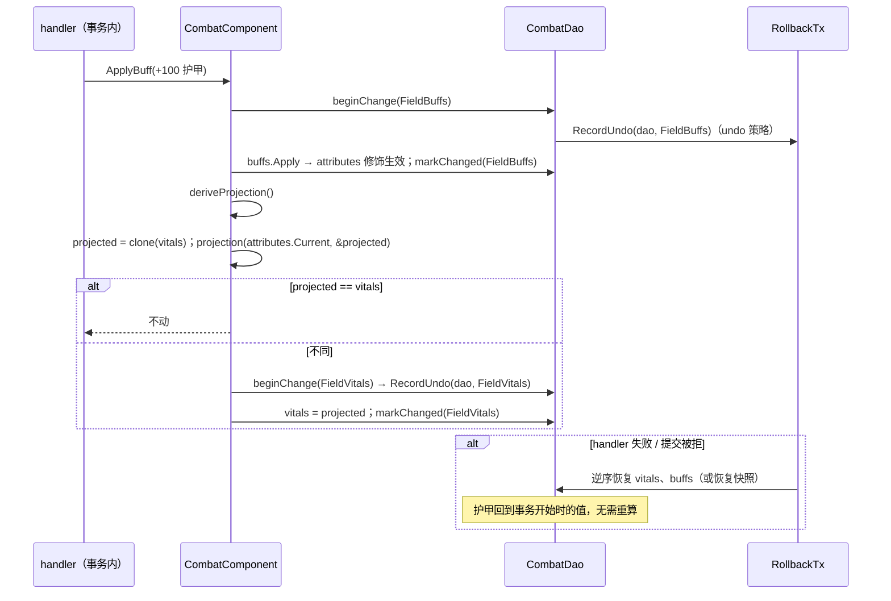
```mermaid
sequenceDiagram
    participant H as handler（事务内）
    participant C as CombatComponent
    participant D as CombatDao
    participant T as RollbackTx
    H->>C: ApplyBuff(+100 护甲)
    C->>D: beginChange(FieldBuffs)
    D->>T: RecordUndo(dao, FieldBuffs)（undo 策略）
    C->>D: buffs.Apply → attributes 修饰生效；markChanged(FieldBuffs)
    C->>C: deriveProjection()
    C->>C: projected = clone(vitals)；projection(attributes.Current, &projected)
    alt projected == vitals
        C-->>H: 不动
    else 不同
        C->>D: beginChange(FieldVitals) → RecordUndo(dao, FieldVitals)
        C->>D: vitals = projected；markChanged(FieldVitals)
    end
    alt handler 失败 / 提交被拒
        T->>D: 逆序恢复 vitals、buffs（或恢复快照）
        Note over D: 护甲回到事务开始时的值，无需重算
    end
```

**5. 失败与不确定结果**

| 情形 | 处理 | 结果 |
| --- | --- | --- |
| handler 失败 / 提交被拒（undo） | 逆操作恢复 vitals 与源字段 | 投影字段回到事务开始时的值，字节一致、无残留脏位 |
| 同上（state） | 恢复 DAO 快照 | 同上 |
| 加载时投影函数已变 | 只写内存，不标脏 | 存储里的 vitals 在下一次 vitals 提交时写回 |
| 投影结果与现值相同 | 什么都不做 | 无持久写、无逆操作 |
| `ApplyBuff` 被免疫 | 不 markChanged、不投影 | — |
| 投影函数改了 `Health` 等过程状态 | 约定禁止，无运行期检查 | 行为未定义（风险） |

**6. 测试**

| 用例 | 文件 | 覆盖 |
| --- | --- | --- |
| `TestBuffAttributeModifierReachesDamage` | `skill/combatcomponent/attribute_projection_promises_test.go` | +100 护甲 buff 前后各打 100 物理伤害：100 / 50；移除 buff 后回到 100 |
| `TestAttributeProjectionRollsBackWithTheDao` | 同上 | 两种回滚策略 × handler 失败 / 提交被拒：投影护甲随 DAO 回到 20，字节一致、无残留脏位 |
| `TestAttributeProjectionReprojectsOnLoad` | 同上 | 加载后 `OnInitFinish` 投影出存储属性 50、不标脏 |

修前红文本（原样，出处 `docs/feature/ROUND12-SKILL-CFGGEN-2026-10-06.md` §2 表 O2 行；旧 API 下同一场景）：

```text
health damage without / with the +100 armor buff = 100 / 100, want 100 / 50
```

负对照（同一出处）：把 `deriveProjection` 里的 `beginChange(FieldVitals)` 去掉，undo 策略的两个子用例失败，state 策略通过（vitals 本来就在 DAO 快照里）。修后验证（同一出处 §3）：`go test -race -count=3 ./skill/... ./codegen/internal/cfggen/ ./configdata/...` 通过；`skill/examples` 的 `combat`、`fireball`、`statusbridge` 都运行退出 0（statusbridge 修前 panic）。

**7. 性能证据**：未测（每个改属性的 mutator 多一次 Combatant 克隆 + `reflect.DeepEqual`；只在装了投影时发生）。

**8. 未验证项与已知风险**

- 投影纯度只靠约定；投影函数写了过程状态字段会被每次投影覆盖或回滚，没有检查。
- 加载时投影函数变化导致内存与存储不同、直到下一次 vitals 提交才写回：期间若只改了别的字段，存储里的 vitals 仍是旧投影（文档已写明“下一次 vitals 提交写回”）。

**9. review 检查点**

- [ ] `skill/combatcomponent/component.go` 的投影写入用 `reflect.DeepEqual` 比较整个 Combatant（含 map）决定是否写 DAO：每个改属性来源的 mutator 末尾多一次 Combatant 克隆与比较，只在装了投影时发生；这一成本没有基准，确认对战斗热路径可以接受（或需要补基准）。
- [ ] 确认每个改 attributes / buffs 的 mutator 末尾都调了 `deriveProjection`：`grep -n 'beginChange(Field\(Attributes\|Buffs\))' skill/combatcomponent/component.go` 的每个函数都应有对应调用；`SetBuffDueTick`（`:442`）例外是有意的。
- [ ] 确认 `deriveProjection`（`:262`）在事务内先 `beginChange` 再写 `dao.combatant`，且在事务外的分支不 `markChanged`。
- [ ] 确认 `HostAdapter` / `StatusBridge` 的命令最终都经上述 mutator 落地（`skill/combatcomponent/adapter.go`、`status_bridge.go`），而不是直接改 `dao.attributes` / `dao.buffs`。
- [ ] 确认 `ApplyDamage`（`:487`）不改属性、因而不重投影的前提成立（只改 vitals 的 Health / Shield 等）。
- [ ] 确认 `skill/examples/statusbridge/main.go` 在 `nest.RunDetachedTransaction` 内调用战斗 mutator，且已登记在根包 `TestExamplesRun` 的 `exampleRuns` 里。

<a id="dao-4"></a>
### DAO-4 glsvet A1 提示：跟进一层同包 helper（RR-20261006-13）与组件字段写提示 `//roost:cache`（第十三轮 A1 盲区）

> 首发 v1.23.0（本版） · [说明](guide-saga-drv-dao-rem.md#dao-4) · 背景见 [DAO-1](#dao-1)

**1. 提交**

| 提交 | 版本 | 内容 |
| --- | --- | --- |
| `b7471ae4` | v1.23.0（本版） | RR-20261006-13：`componentUndoHints` 跟进一层同包包级 helper（`packageUndoHelpers`、`undoCallName`）；回归 `TestComponentRecordingUndoThroughHelperIsHinted`；A1 方案 glsvet 一条补“跟进一层同包 helper”（同提交另含 RR-20261006-12，属 NONCORE） |
| `71c8f394` | v1.23.0（本版） | 记录维护者第十三轮“A1 盲区”选 A |
| `565f657b` | v1.23.0（本版） | 组件字段写提示：`cmd/glsvet/componentfields.go`（新）、`vetDirectory` 接线并改为 `parser.ParseComments`、两个 A1 提示计入 hint 汇总；夹具 `testdata/a1fields/quest.go`；roost-coding A1 条、A1 方案 §5、`codegen/README.md` 与生成工程文档（`render_docs.go`）、`docs/skill/skill-casting-and-combat.md`、CHANGELOG |
| `dcf170e4` | v1.23.0（本版） | DECISIONS-PENDING 第十三轮 A1 盲区补实施状态 |

**2. 改动文件与关键符号**（`5e72ca4d`）

| `path:line` | 符号 | 职责 |
| --- | --- | --- |
| `cmd/glsvet/main.go:155-160` | `vetDirectory` 解析 | 改为 `parser.ParseComments`（读 `//roost:cache` 与 `roost:nest` 文档标注） |
| `cmd/glsvet/main.go:166-173` | 接线 | 两个 A1 提示打印 `hint:` 并计入 `hintCount`（结尾 `N hint(s) for review`，`:97`），不计 findings |
| `cmd/glsvet/main.go:703` | `componentUndoHints` | 组件方法里直接调 `RecordUndo` / `RecordUndoToken` / `DeferRollback`，或以 `f(...)` 调用同包 helper |
| `cmd/glsvet/main.go:756` | `packageUndoHelpers` | 收集同包里**直接**登记 undo 的包级函数（名字本身就是这三个的包装函数不算 helper，避免重复） |
| `cmd/glsvet/componentfields.go:47` | `componentTypes` | 组件识别（名字以 `Component` 结尾或匿名嵌入 `ComponentBase`），两个 A1 提示共用 |
| `cmd/glsvet/componentfields.go:30-38` | `cacheDirective`、初始化钩子表 | `//roost:cache`；`OnInitFinish` / `OnDestroy` 不检查 |
| `cmd/glsvet/componentfields.go:110` / `:126` / `:148` | `hasCacheDirective` / `isDaoHandleType` / `isFuncFieldType` | 豁免：字段上一行或行尾 `//roost:cache`；类型名以 `Dao` / `DAO` 结尾；函数类型字段 |
| `cmd/glsvet/componentfields.go:191` | `fieldWrites` | 以 `接收者.字段` 为根的赋值左值（`=`、`op=`、`++` / `--`、`range` 赋值，含 `c.f[k]`、`c.f.x`、`*c.f`）与内建 `delete` / `clear` 的第一个参数 |
| `cmd/glsvet/componentfields.go:242` | `packageFieldWriteHelpers` | 一层同包 helper：参数类型是本包组件（或指针）、函数体写了它的未豁免字段 |
| `cmd/glsvet/componentfields.go:271` | `componentFieldHints` | 输出 `hint: component X.M writes field f outside the DAO ...` |
| `docs/agent-skills/roost-coding/SKILL.md:39` | A1 条 | 补 helper 跟进与 `//roost:cache` |

**3. 不变量与强制点**：两个提示都只打印、不改退出码（`cmd/glsvet/main.go:166-173`），所以不会让 CI 或生成工程的 glsvet 门禁变红；口径与 A3 停止提示一致（跟进一层同包 helper，不跟方法调用）。守卫：`TestComponentRecordingItsOwnUndoIsHinted`、`TestComponentRecordingUndoThroughHelperIsHinted`、`TestSkillPackagesGetNoComponentUndoHint`（`cmd/glsvet/main_test.go:166` / `:222` / `:271`），`TestComponentFieldWritesOutsideTheDaoAreHinted`、`TestSkillPackagesGetNoComponentFieldHint`、`TestNestDirectiveMarksAHandlerWithoutTheHandlerPrefix`（`cmd/glsvet/componentfields_promises_test.go:17` / `:50` / `:72`）。

**4. 控制流**：`vetDirectory` → 每个包：`componentUndoHints`（组件方法体里找三种调用名；对 `f(...)` 查 `packageUndoHelpers`）→ `componentFieldHints`（组件字段表 + 豁免 → 组件方法体的写 → 一层 helper）→ 打印 `hint:` 并计数 → 其余 finding 检查照旧。

**5. 失败与不确定结果**（语法层提示，没有类型信息）

| 形状 | 是否提示 | 理由（记录原意） |
| --- | --- | --- |
| 组件方法直接写未豁免字段 / 改字段里的 map、slice 元素 | 提示 | 规则本体 |
| 经一层同包包级 helper 写字段或登记 undo | 提示（在调用处） | 与 A3 停止提示同口径 |
| 两层以上 helper、方法调用 `x.f()`、先取局部变量再改、嵌入提升的字段 | 不提示 | 没有类型信息时按名字匹配会误报（例如组件调 DAO setter `c.dao.SetLevel(v)`），回归里钉住“两层链不报”“调 DAO setter 不报” |
| `OnInitFinish` / `OnDestroy` 里写字段 | 不提示 | 不在业务事务里 |
| DAO 句柄、函数类型字段、`//roost:cache` 字段 | 不提示 | 不是事务状态 |

**6. 测试**

RR-20261006-13 修前红（原样，[问题记录](../../bug/RR-20261006-13.md)）：

```text
main_test.go:260: hints = [], want exactly one hint: BuffComponent.push registering undo through rememberPop (not the DAO setter call, not the two-level outer → rememberPop chain)
--- FAIL: TestComponentRecordingUndoThroughHelperIsHinted (0.00s)
```

字段写提示修前红（原样节选，[A1 字段写提示记录](../../feature/A1-COMPONENT-FIELD-WRITE-HINT-2026-10-06.md) §3，`componentfields.go` 已在、`vetDirectory` 未接线）：

```text
missing hint "quest.go:31:44: hint: component QuestComponent.Accept writes field active outside the DAO"
...
0 field-write hints, want 5 (no hint for the //roost:cache fields, the func field, the DAO handle, OnInitFinish or reads)
```

（红时期望的列号是初稿算错的，绿时改为实际列 `31:45`；失败原因是没有任何输出，与列号无关。）`TestNestDirectiveMarksAHandlerWithoutTheHandlerPrefix` 在旧 `main.go` 上 `findings = 0, want 1`。修后五条提示齐全、豁免字段零提示、退出码 0。

误报核对（两份记录原文）：全仓 `./...` 与 `-tests ./...`、全部 `testdata` 目录、两个示例模块、重新生成的 game-demo，修前修后 A1 提示都是 0 条；规则初稿在 `skill/combatcomponent/component.go:252` `CombatComponent.ProjectAttributes` 写 `projection` 报 1 条，判为规则误判（装配方法装投影函数），收紧为“函数类型字段不提示”。改为带注释解析后全仓 finding 与提示排序后逐行相同。验证：`go test -race -count=3 ./cmd/glsvet/...`、`go run ./cmd/glsvet ./nest ./entity ./dataengine/engine ./sync/entitysync`、`go test -count=1 ./codegen/...`、`go generate ./...` 后 porcelain、重新生成 game-demo 的 build / vet / test / glsvet、根包、`go build ./... && go vet ./...` 通过。

**7. 性能证据**：无（静态检查）。

**8. 未验证项与已知风险**：无外部验证项。第 5 节“不提示”的形状是维护者选 A（提示而非门禁）下的设计取舍。

**9. review 检查点**

- [ ] `cmd/glsvet/componentfields.go:191-229` `fieldWrites`：确认 `op=`、`++` / `--`、`range` 的 key / value 赋值、`delete` / `clear` 都被识别，且只认以接收者为根的左值（局部变量同名不误报）。
- [ ] `:110-124` `hasCacheDirective`：确认上一行与行尾两种写法都认、`//roost:cache 理由` 也认，且不会把 `//roost:cachex` 之类的前缀误认。
- [ ] `cmd/glsvet/main.go:756-` `packageUndoHelpers`：确认名字本身就是 `RecordUndo` / `RecordUndoToken` / `DeferRollback` 的包级包装函数不会被重复提示（直接检查已命中），以及 helper 只看函数体里的**直接**调用。
- [ ] 带注释解析之后 `isNestHandler` 开始读 `roost:nest` 文档标注：确认名字不以 `handler` 开头、只靠标注的 handler 现在会被检查（`TestNestDirectiveMarksAHandlerWithoutTheHandlerPrefix`），且记录说的“全仓与 game-demo 无新违例”在当前源码上仍成立（`go run ./cmd/glsvet ./...` 无输出）。

## REM：remoteentity 快照缓存与 Mirror

<a id="rem-1"></a>
### REM-1 共享 L2 为快照水位权威（B2）与 Cached 读最大陈旧时间

> 首发 v1.20.2 · [说明](guide-saga-drv-dao-rem.md#rem-1)

**1. 提交**

| 提交 | 版本 | 内容 |
| --- | --- | --- |
| `6f06f0da` | v1.20.2 | 背景（NONCORE，NC-130）：L2 CAS 落败报 `ErrStaleWrite`，Publish 不再把旧快照装进 L1 |
| `c3475150` | v1.20.2 | 背景（NONCORE，NC-131）：表满时 Stats 先清过期兴趣 |
| `366058a7` | v1.20.2 | 背景（NONCORE，RR-20260913-01 残余）：版本化删除在共享 L2 留墓碑 |
| `b7f98343` | v1.20.2 | 记录维护者第三轮决定（B2 L2 为水位权威） |
| `f376bba0` | v1.20.2 | B2 主体：`admitLocked` 唯一写入口、`confirmedAt`、`refresh`、`MaxStaleness`、`published_at` 与历史丢弃、L2 `DeleteAtVersion` 返回 `ErrStaleWrite`；用例、矩阵、基准 |
| `7d49e54d` | v1.20.2 | `remote_entity.cached_max_staleness` 按 A4 严格读取并登记 `frameworkDurationKeys`；USER_GUIDE / CHANGELOG / 交接 / N05 / Mirror 方案状态 |
| `05633529` | v1.20.2 | DECISIONS-PENDING B2 标为已实施 |
| `88f33776` | v1.23.0（本版） | B2 §7 回填“L2 落后于权威”的上界（见 [REM-11](#rem-11)） |
| `fcc78ad0` | v1.23.0（本版） | 生成配置模板写出 `cached_max_staleness`（见 [REM-13](#rem-13)） |
| `155b9f91` | v1.23.0（本版） | 写入点结构守卫 `TestRemoteSnapshotCacheWritesStayInTheListedFunctions`；类型注释、`admitLocked` / `loadAuthoritative` / `ApplyReplica` 注释与 B2 §2 按源码改为“新值经 `admitLocked`，其余直接写点只回填 L2 的值或删除”（同提交的 RR-20261006-11 见 [REM-14](#rem-14)） |

**2. 改动文件与关键符号**（行号以 `5e72ca4d` 为准）

| `path:line` | 符号 | 职责 |
| --- | --- | --- |
| `entity/remote_snapshot.go:105` | `RemoteSnapshotCacheConfig` | 新增 `MaxStaleness`（`:119`）、`Now`（`:121`） |
| `entity/remote_snapshot.go:127` | `RemoteSnapshotCache` 类型注释 | 写明 B2 契约：L2 唯一权威、L1 有界副本、写入经 `admitLocked`、降级不冒充已确认 |
| `entity/remote_snapshot.go:166` | `publishMu [64]sync.Mutex` | 同一 key 全部 L1 写入与它们的 L2 调用串行化 |
| `entity/remote_snapshot.go:215` | `remoteSnapshotEntry` | L1 条目：快照或删除标记 + `confirmedAt`（0 = 未确认） |
| `entity/remote_snapshot.go:275` | `NewRemoteSnapshotCache` 缺省 | `MaxStaleness` 零值取 `TTL`，`TTL` 也为零取 30s |
| `entity/remote_snapshot.go:334` | `fresh` | `confirmedAt != 0 && now-confirmedAt <= maxStaleness` |
| `entity/remote_snapshot.go:606` | `remoteSnapshotEntryStale` | L1 唯一新旧判定（快照按 epoch / 版本；删除只按版本，同版本删除胜） |
| `entity/remote_snapshot.go:689` | `readConfirmed` | 热路径一次 L1 读 + 一次读时钟；否则 `coalesce` 合并的 `refresh` |
| `entity/remote_snapshot.go:724` | `refresh` | 锁外读 L2，锁内与 L1 比较：同值改记确认、L2 更新改记 L2、L1 更新补写 L2、L2 无值回源 |
| `entity/remote_snapshot.go:812` | `loadForRefresh` | L2 担保不了时回源；权威说不存在就删掉加载开始前确认的 L1 快照 |
| `entity/remote_snapshot.go:906` | `publishLocked` | 快照写入的前置判断（同值只延有效期 / 补确认；已确认的更新条目在前则不写 L2） |
| `entity/remote_snapshot.go:942` | `admitLocked` | 唯一的“先 L2 后 L1”写入口：接受 / stale→`adoptSharedLocked` / 冲突原样返回 / 其他错误降级未确认 |
| `entity/remote_snapshot.go:964` | `writeShared` | 快照 `l2.Set`（CAS），删除 `DeleteAtVersion`（无能力时退化为 `Delete`） |
| `entity/remote_snapshot.go:988` | `adoptSharedLocked` | L2 拒绝后让 L1 跟上 L2；L2 无活值时删掉不新于被拒写的 L1 快照 |
| `entity/remote_snapshot.go:1013` | `setL1Locked` | 实际写 L1（`AtomicLocalStore.SetWithTTL`，L1 自己的 Stale / Conflict 准入） |
| `entity/remote_snapshot.go:1101` | `DeleteAtVersion` | 删除标记经 `admitLocked` |
| `remoteentity/snapshot_l2.go:43` | `remoteSnapshotL2CAS` | L2 版本 CAS 脚本（未改），成功时 `PEXPIRE`（`:70`） |
| `remoteentity/snapshot_l2.go:88` | `remoteSnapshotL2DeleteAtVersion` | 墓碑脚本（未改），`PEXPIRE`（`:98`） |
| `remoteentity/snapshot_l2.go:324` | `remoteSnapshotL2Store.DeleteAtVersion` | 脚本返回 0（L2 持有更新快照）时返回 `cache.ErrStaleWrite`（`:348`），之前 nil |
| `remoteentity/syncer.go:37` | `remoteSnapshotWire.PublishedAt` | 复制 wire 新字段 `published_at`（omitempty） |
| `remoteentity/syncer.go:126` | `SnapshotReplicaStore.ApplyReplica` 历史过滤 | 早于 `snapshot_l2_ttl / 2` 的快照更新丢弃并计数；删除在 `:113` 之前处理、不过滤 |
| `remoteentity/syncer.go:147` | `SnapshotReplicaStore.historic` | 无发布时刻或无 L2 TTL 时不过滤 |
| `remoteentity/config.go:44` | `Config.CachedMaxStaleness` | 核心配置项 |
| `remoteentity/snapshot_client.go:158` | `newSnapshotClient` | 把 `CachedMaxStaleness` 交给缓存 `MaxStaleness` |
| `kit/remoteentity/config.go:25` | `snapshotConfig.CachedMaxStaleness` | `cached_max_staleness` 的声明：时长、`min:"1ns"`（配置了必须为正，不配置等于 `snapshot_cache_ttl`）；`apply`（`:70`）写进 core `Config`（A4 ① `d1226825` 之后；之前是 `readSnapshotConfig` 手写严格读取、`app/config_validation.go` 清单登记） |

**3. 不变量与强制点**

- 不变量 I1：一个 key 的全部 L1 写入在该 key 的 `publishMu` 分片锁下进行（`entity/remote_snapshot.go:166`）。核对结果：`Publish`（`:891`）、`fetchAndAdmit`（`:469`）、`refresh`（`:738`）、`loadForRefresh`（`:822`）、`Delete`（`:1083`）、`DeleteAtVersion`（`:1105`）都先取这把锁。
- 不变量 I2：写进 L1 的快照值要么被 L2 以 CAS / 带版本删除接受过（`admitLocked`），要么就是刚从 L2 读到的值（`refresh` / `adoptSharedLocked`），要么带 `confirmedAt = 0` 降级。
  - **写入点清单（源码 `5e72ca4d`）**：新值经 `admitLocked`（`entity/remote_snapshot.go:942`）的是 `publishLocked`（`:929`）、`DeleteAtVersion`（`:1115`）与 `refresh` 的“L1 比 L2 新”修复分支（`:770`）；直接写 L1、写入的都不是新值的点：`refresh` 的 `setL1Locked`（`:749`、`:761`、`:784`、`:800`，记下 L2 刚读到的值或改记确认时刻）、`adoptSharedLocked` 的 `setL1Locked`（`:1006`）与 `l1.Delete`（`:1002`）、`loadForRefresh` 的 `l1.Delete`（`:825`）、无版本 `Delete` 的 `l1.Delete`（`:1093`）。全部在 `publishMu` 下，值都来自 L2 或权威“不存在”。v1.20.2～v1.22.0 的方案 §2.1、类型注释与 DECISIONS 第九轮写“全部 L1 写入都经 `admitLocked`”，字面不成立；fixr（`155b9f91`）逐点核对没有绕过准入，把类型注释（`entity/remote_snapshot.go:131-137`）、`admitLocked` / `loadAuthoritative` / `ApplyReplica` 注释、`remoteentity/snapshot_client.go:35-37` 与 B2 §2、DECISIONS 第九轮改为“新值经 `admitLocked`，其余直接写点只回填 L2 的值或删除”（[RR-20261006-11 记录](../../bugfix/RR-20261006-11.md) §2.1）。
- 不变量 I3：非线性读只交出 `fresh` 的条目（`readConfirmed` `entity/remote_snapshot.go:687`、`refresh` `:736`）；`Linearizable` 每次读权威（`Read` `:658`）。
- 不变量 I4：同版本异值是一致性错误、不降级（`admitLocked` `entity/remote_snapshot.go:949`、`refresh` `:751`）。
- 不变量 I5：早于 `snapshot_l2_ttl / 2` 的复制快照不进缓存（`remoteentity/syncer.go:126`）。
- 守卫测试：`TestB2*` 六条（`remoteentity/snapshot_l2_watermark_promises_test.go`）；组合矩阵 `TestRealB2WatermarkMatrixStandalone` / `TestRealB2WatermarkMatrixCluster`（`remoteentity/snapshot_l2_watermark_matrix_integration_test.go`）；O5 `TestRealJetStreamReplayAfterL2ExpiryDoesNotResurrect`（`remoteentity/snapshot_replay_jetstream_integration_test.go`）。结构守卫（本版，fixr `155b9f91`）：`TestRemoteSnapshotCacheWritesStayInTheListedFunctions`（`entity/remote_snapshot_write_guard_test.go:41`）按源码 AST 检查——直接写 L1（`setL1Locked`、`l1` 上除读以外的方法）与直接写 L2（`l2` 上除 `Get` 以外的方法）只出现在封闭表 `remoteSnapshotDirectWriters`（`:26`，每个函数带理由）里，表里的函数不再写时也报错；需要分片锁的 helper（`*Locked` 与 `writeShared`）只被 `*Locked` 方法或自己取 `publishMu` 的函数调用。负对照（临时改源码，未提交）：`ApplyUpdate` 里加一句 `setL1Locked`、去掉 `loadForRefresh` 的取锁，守卫报三条（原文见记录 §2.1）。

**4. 控制流**

写入（发布 / 复制 / 加载回填 / 删除）：

1. 调用方取 `publishMu[shard(key)]`。
2. `publishLocked` 前置判断（同值且已确认且有效期不更晚 → 直接返回，不写 L2；L1 已确认持有更新条目 → 返回，不写 L2，避免 L2 过期时复活旧值）。删除走 `DeleteAtVersion` 的同类判断。
3. `admitLocked`：记 `started`，`writeShared` 调 L2（受 `loadTimeout` 限时）。
4. 按结果写 L1：接受 → `confirmedAt = started`（权威结果取更早的加载开始时刻）；`ErrStaleWrite` → `adoptSharedLocked` 读 L2 并记下；冲突 → 原样返回；其他 → `confirmedAt = authoritativeAt`（发布 / 复制为 0，未确认）。
5. 释放锁；`notify` 唤醒版本等待者。

```mermaid
flowchart TD
  W["写入：Publish / ApplyUpdate / fetchAndAdmit / DeleteAtVersion"] --> L["取 publishMu["shard(key)"]"]
  L --> P{"publishLocked / DeleteAtVersion 前置判断"}
  P -- "同值已确认 或 L1 已确认更新" --> X["返回，不写 L2"]
  P -- "需要写" --> A["admitLocked：writeShared 调 L2"]
  A -- "接受" --> C["setL1Locked，confirmedAt = started（权威取加载开始时刻）"]
  A -- "ErrStaleWrite" --> D["adoptSharedLocked：读 L2"]
  D -- "L2 有值" --> D1["setL1Locked(L2 的值, confirmedAt = started)"]
  D -- "L2 无活值" --> D2["删掉不新于被拒写的 L1 快照"]
  D -- "L2 读不到" --> D3["L1 保持原样"]
  A -- "同版本异值" --> E["返回 ErrRemoteVersionConflict，L1 不写"]
  A -- "断网 / 结果未知" --> U["setL1Locked，confirmedAt = authoritativeAt（通常 0 = 未确认）"]
```

非线性读：

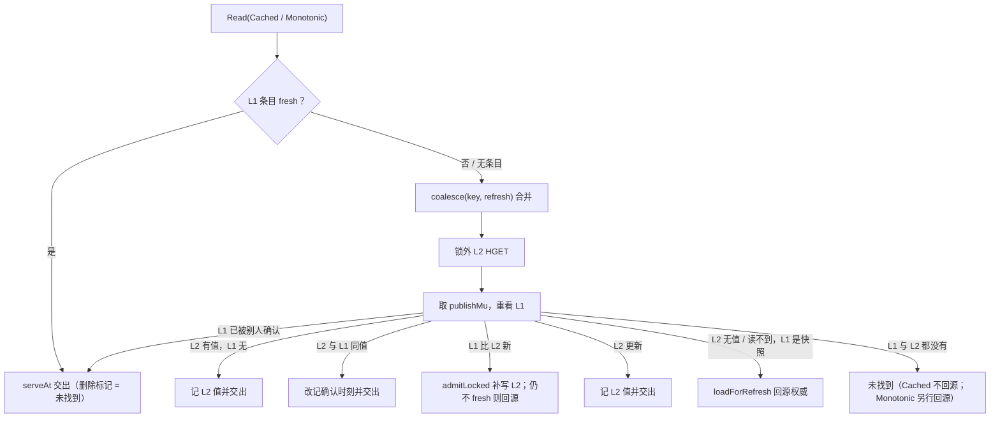
```mermaid
flowchart TD
  R["Read(Cached / Monotonic)"] --> H{"L1 条目 fresh？"}
  H -- "是" --> S["serveAt 交出（删除标记 = 未找到）"]
  H -- "否 / 无条目" --> CO["coalesce(key, refresh) 合并"]
  CO --> G["锁外 L2 HGET"]
  G --> LK["取 publishMu，重看 L1"]
  LK -- "L1 已被别人确认" --> S
  LK -- "L2 有值，L1 无" --> F1["记 L2 值并交出"]
  LK -- "L2 与 L1 同值" --> F2["改记确认时刻并交出"]
  LK -- "L1 比 L2 新" --> F3["admitLocked 补写 L2；仍不 fresh 则回源"]
  LK -- "L2 更新" --> F4["记 L2 值并交出"]
  LK -- "L2 无值 / 读不到，L1 是快照" --> AU["loadForRefresh 回源权威"]
  LK -- "L1 与 L2 都没有" --> NF["未找到（Cached 不回源；Monotonic 另行回源）"]
```

**5. 失败与不确定结果**

| 情形 | 处理 | 对调用方 |
| --- | --- | --- |
| 写入时 L2 断网 / 结果未知 | L1 照记，`confirmedAt = 0`，`remoteErrors` 计数 | 写入成功；之后的非线性读不交出这份，先重新确认 |
| 写入被 L2 以 stale 拒绝 | L1 改记 L2 当前值 | 发布不报错（输给更新值是预期结果） |
| 同版本异值 | 不写 L1 | `ErrRemoteVersionConflict` |
| 读时条目未确认 / 超上限、L2 可读 | 按 `refresh` 规则确认、补写或改记 | 交出确认过的值 |
| 读时 L2 读不到且权威成功 | 权威结果按加载开始时刻确认 | 交出权威结果 |
| 读时 L2 与权威都失败 | 不交出 | 返回错误（loader 的错误或 `ErrRemoteSnapshotStale`） |
| 复制消息早于 `snapshot_l2_ttl / 2` | 丢弃，计 `remote_entity.snapshot_replica_historic_dropped_total` | 无（之后按需读取） |
| 旧发布者的消息无 `published_at` | 照旧接受 | 滚动升级期间 O5 仍可能出现 |

**6. 测试**

| 用例 | 文件 | 覆盖 |
| --- | --- | --- |
| `TestB2CachedReadPastMaxStalenessReconfirmsAgainstL2` | `remoteentity/snapshot_l2_watermark_promises_test.go:84` | 超过上限的 Cached 读先对 L2 重新确认 |
| `TestB2EntryWrittenDuringL2OutageIsNotServedUnconfirmed` | 同上 `:112` | L2 断网时写入的条目不以未确认身份交出 |
| `TestB2PublisherRepairsALostL2Write` | 同上 `:178` | owner 下一次读补写丢失的 L2 写 |
| `TestB2LostL2DeleteIsRepairedByTheNextRead` | 同上 `:205` | 丢失的带版本删除由下一次读重发 |
| `TestB2HistoricReplicaPastL2MemoryIsNotAdmitted` | 同上 `:255` | O5：过老的复制快照不准入 |
| `TestB2ConcurrentWritersAndReconfirmingReadersConvergeOnL2` | 同上 `:293` | 并发写与重新确认读收敛到 L2 |
| `TestRemoteSnapshotCacheWritesStayInTheListedFunctions` | `entity/remote_snapshot_write_guard_test.go:41` | 本版结构守卫：直接写 L1 / L2 只在封闭表里的函数、需要分片锁的 helper 只在持锁处调用（负对照三条，见 [RR-20261006-11 记录](../../bugfix/RR-20261006-11.md) §2.1） |
| `TestRealB2WatermarkMatrixStandalone` / `…Cluster` | `remoteentity/snapshot_l2_watermark_matrix_integration_test.go:43` / `:47` | 真实 Redis 单机与自建 3 主 3 从 Cluster，各 20 格 |
| `TestRealJetStreamReplayAfterL2ExpiryDoesNotResurrect` | `remoteentity/snapshot_replay_jetstream_integration_test.go:33` | 真实 JetStream + Redis 复现 O5 |
| `TestCachedMaxStalenessConfiguration` | `kit/remoteentity/cached_max_staleness_test.go:13` | 严格读取、必须为正 |

修前红（原样，出处 [B2 §7“先红后绿”](../../feature/B2-REMOTE-SNAPSHOT-L2-WATERMARK-2026-10-06.md)）：

```text
--- FAIL: TestB2CachedReadPastMaxStalenessReconfirmsAgainstL2
    Cached read 11s after confirmation (max staleness 10s) returned payload="v1" version=1 found=true err=<nil>; L2 holds v2
--- FAIL: TestB2EntryWrittenDuringL2OutageIsNotServedUnconfirmed
    an entry written while L2 was unreachable was served unconfirmed: payload="v1" version=1 found=true err=<nil>; L2 holds v2
--- FAIL: TestB2PublisherRepairsALostL2Write
    L2 after the owner's next read holds version=1 held=true err=<nil>; the lost v2 write was never repaired
--- FAIL: TestB2LostL2DeleteIsRepairedByTheNextRead
    L2 still serves the deleted snapshot version=1 held=true err=<nil>; the lost delete was never repaired
--- FAIL: TestB2HistoricReplicaPastL2MemoryIsNotAdmitted
    a replica published 10m ago (L2 TTL 1m) was admitted: payload="v1-from-history" found=true err=<nil>

# 真实 JetStream + 真实 Redis（O5 复现）
--- FAIL: TestRealJetStreamReplayAfterL2ExpiryDoesNotResurrect
    replayed messages applied=1; late joiner Cached read found=true payload="v1" err=<nil>; L2 held=true version=1 err=<nil>
    the late joiner serves the replayed v1 (authority is at v2)

# 组合矩阵：单机与自建 Cluster 各 20 格，各红 8 格（两个后端相同）
--- FAIL: .../old-over-new/{publish,replica,load}/hot        the reader (hot=true) read version=1 ... found=true
--- FAIL: .../delete-resurrect/{publish,replica,load}/hot    the reader (hot=true) read version=1 ... found=true
--- FAIL: .../deliverall-replay/replica/cold                 L2 holds the stale input version=1 route=1
--- FAIL: .../deliverall-replay/replica/hot                  the reader (hot=true) read version=1 ... found=true
```

修后（原样，同出处）：

```text
ok  remoteentity  TestB2*（6 条，含并发收敛；-race -count=5）
--- PASS: TestRealB2WatermarkMatrixStandalone (4.04s)    20/20
--- PASS: TestRealB2WatermarkMatrixCluster (6.48s)       20/20（3 主 3 从，端口 17380～17385，自建自杀）
--- PASS: TestRealJetStreamReplayAfterL2ExpiryDoesNotResurrect (2.12s)
    replayed messages applied=1; late joiner Cached read found=false ...; L2 held=false
--- PASS: TestRealSnapshotL2KeyPrefixOnRedis / OnRedisCluster / StaleWrite / Tombstone（既有真实 Redis 用例）
```

改了断言的既有用例（契约变化，记录 B2 §7）：`TestRemoteSnapshotPublishDoesNotPinShardOnUnresponsiveL2`（`entity/remote_snapshot_test.go`）、`TestStaleBackfillControls/L2 outage`、`TestPublishConflictAfterPreflight`（`entity/snapshot_delete_l2_promises_test.go`，预查已删，改为直接验证 CAS 裁决）、`TestRemoteSnapshotL2DeleteAtVersionKeepsNewerSnapshot` 与 `TestRealSnapshotL2KeyPrefixOnRedis(Cluster)`（被拒的带版本删除返回 `cache.ErrStaleWrite`）、`TestRemoteSnapshotDeleteAtVersionPromiseFencesOlderSnapshot`。负对照：记录未保留单独的“退回修复变红”运行；修前红即基线实现上的红。

**7. 性能证据**（原样，出处 B2 §7；真实 Redis 单机，同机交替 3 轮 × count 2，`-benchtime 3000x`，Apple M5，Go 1.27.0；基准在 `remoteentity/snapshot_l2_watermark_bench_integration_test.go:66`～`:112`）

```text
                         │   修前      │   修后                         │
RealB2PublishWarm-10       34.53µ ± 7%   34.42µ ± 1%        ~ (p=0.589 n=6)
RealB2ReplicaCold-10       55.99µ ± 3%   34.68µ ± 2%  -38.06% (p=0.002 n=6)
RealB2CachedHit-10         147.2n ± 2%   143.8n ± 3%   -2.31% (p=0.015 n=6)
RealB2CachedReconfirm-10                 21.79µ ± 1%   （修前无此路径）
allocs/op: PublishWarm 29 → 29，ReplicaCold 46 → 28，CachedHit 0 → 0，CachedReconfirm 20
```

结论：L1 写的 L2 往返不变（一次 CAS）；冷节点复制写入少一次 HGET（−38%）；读命中不碰 Redis、无退化；超过上限的读多一次 HGET（约 22µs），每个 key 每个陈旧窗口一次。

**8. 未验证项与已知风险**

- O5 的发布时刻用发布方 `time.Now()` 与接收方 `time.Now()` 比较（`remoteentity/syncer.go:47`、`:126`），跨主机时钟偏差只靠“留一半窗口”吸收，未在多主机验证（E02）。
- 没有共享 L2 的装配里删除标记受 L1 容量淘汰，迟到旧消息可复活（只适合单进程 / 测试）。
- v1.20.2 之前的发布者不带 `published_at`，接收方照旧接受（不考虑旧进程，维护者 2026-10-06）。
- L2 落后于权威的上界见 [REM-11](#rem-11)。

**9. review 检查点**

- [ ] 确认结构守卫 `TestRemoteSnapshotCacheWritesStayInTheListedFunctions`（`entity/remote_snapshot_write_guard_test.go:41`）的封闭表 `remoteSnapshotDirectWriters`（`:26-34`）与当前写入点一一对应：`grep -n 'setL1Locked(\|admitLocked(\|l1.Delete(' entity/remote_snapshot.go` 当前为 `:749 :761 :770 :784 :800 :825 :929 :951 :959 :1002 :1006 :1093 :1115`，逐一确认都在 `publishMu[shard(key)]` 下或在 `*Locked` 函数里；“新值经 `admitLocked`、其余只回填 L2 的值或删除”的口径已写进类型注释（`:131-137`）与 B2 §2（闭环提交 `155b9f91`，[RR-20261006-11 记录](../../bugfix/RR-20261006-11.md) §2.1）。
- [ ] 确认 `refresh`（`entity/remote_snapshot.go:724`）在锁外读 L2、锁内重看 L1 时，`hasCurrent && fresh` 的短路（`:741`）不会把一个“别人刚以 `confirmedAt = authoritativeAt` 写入、但比 L2 旧”的条目当作 fresh 交出（关注 `authoritativeAt` 早于 `started` 的情形）。
- [ ] 确认 `publishLocked` 的“已确认的更新条目在前则不写 L2”（`entity/remote_snapshot.go:923`）与 O5 一起成立：L1 有已确认 v2、L2 已过期时，迟到的 v1 不会写进 L2（看 `TestRealB2WatermarkMatrix*` 的 `deliverall-replay/replica/hot` 格）。
- [ ] 确认 `adoptSharedLocked` 在 L2 无活值时只删“不新于被拒写”的 L1 快照、不记删除标记（`entity/remote_snapshot.go:1000`～`:1003`），并看注释给的理由（避免挡住键过期后另一 epoch 的合法写入）是否被某个用例钉住。
- [ ] 确认 `remoteSnapshotL2Store.DeleteAtVersion` 返回 `ErrStaleWrite`（`remoteentity/snapshot_l2.go:348`）之后，`admitLocked` 走 `adoptSharedLocked` 而不是降级（`entity/remote_snapshot.go:952`）。
- [ ] 确认 `historic`（`remoteentity/syncer.go:147`）只过滤快照更新、不过滤删除（删除分支 `:113` 在过滤之前返回）。
- [ ] 确认 `cached_max_staleness` 的声明（`kit/remoteentity/config.go:25`）：写成 `30`（无单位）报“needs a unit”、写 `0` 报“must be positive”（`min:"1ns"`），对照 `TestCachedMaxStalenessConfiguration`（`kit/remoteentity/cached_max_staleness_test.go:13`）；不配置时 `apply` 的 `setPositive`（`kit/remoteentity/config.go:70`）保留 core 缺省（= `snapshot_cache_ttl`）。

<a id="rem-2"></a>
### REM-2 Mirror 第 1～3 步：只读契约、快照唯一读出口、共享 SnapshotClient

> 首发 v1.21.0 · [说明](guide-saga-drv-dao-rem.md#rem-2)

**1. 提交**

| 提交 | 版本 | 内容 |
| --- | --- | --- |
| `2954c583` | v1.20.2（文档） | 记录维护者第四轮决定（含“之后补 Mirror”） |
| `8495c5c4` | v1.21.0 | 第 1～3 步：`entity/remote_mirror.go`（新）、`RemoteSnapshotCache.Read` 唯一读出口、`remoteentity/snapshot_client.go`（新）、Manager 委托；用例 |
| `b31d7640` | v1.21.0 | DECISIONS-PENDING Mirror 行标为第 1～3 步已实施 |
| `207163f9` | v1.21.0 | 发版前复审补修 nest allow_stale（见 [REM-3](#rem-3)） |

**2. 改动文件与关键符号**

| `path:line` | 符号 | 职责 |
| --- | --- | --- |
| `entity/remote_mirror.go:26` | `ErrRemoteObservationIncomparable` | 混合 epoch 不可比 |
| `entity/remote_mirror.go:29` | `ErrRemoteReadUnsupported` | 读者不提供请求的一致性 |
| `entity/remote_mirror.go:37` | `RemoteObservation` | 观察 token（MarkerEpoch / RouteEpoch / StateVersion） |
| `entity/remote_mirror.go:56` | `RemoteObservation.Covers` | 所有读出口共用的最低要求判定 |
| `entity/remote_mirror.go:74` | `RemoteSnapshotRead` | 一次只读请求（Key / Consistency / After） |
| `entity/remote_mirror.go:87` | `RemoteSnapshotReadOnly` | 只读方唯一能力 `ReadSnapshot` |
| `entity/remote_mirror.go:92` | `RemoteMirrorSpec` | 视图身份（Tenant / Kind / Scope / Policy / Schema / Codec） |
| `entity/remote_mirror.go:119` | `NewRemoteMirrorReader` | 校验 spec，返回 reader |
| `entity/remote_mirror.go:135` | `RemoteMirrorReader.Read` | 读侧核对 key / schema / codec，解码 `BytesCopy()`（`:151`） |
| `entity/remote_snapshot.go:648` | `RemoteSnapshotCache.Read` | 唯一读出口：Linearizable 每次读权威、Monotonic 不足合并回源、Cached 不回源且不满足返回 `ErrRemoteSnapshotStale` |
| `entity/remote_snapshot.go:634` | `Get` | 旧签名外观 |
| `entity/remote_snapshot.go:354` | `LoadAuthoritative` | 旧签名外观 |
| `entity/remote_snapshot.go:370` | `loaderMinVersion` | 只约束版本的 token 下推给 loader，带 epoch 的不下推 |
| `entity/remote_snapshot.go:379` | `covers` | 读出口最低要求检查 |
| `entity/remote_snapshot.go:230` | `remoteSnapshotLoadKey` | 合并键 `(key, after, refresh)` |
| `remoteentity/snapshot_client.go:22` | `ErrSnapshotClientStopped` | 客户端已停 |
| `remoteentity/snapshot_client.go:38` | `SnapshotClient` | 快照协议唯一实现 |
| `remoteentity/snapshot_client.go:104` | `NewSnapshotClient` | 校验后构造（`validateSnapshotClientConfig` `:114`） |
| `remoteentity/snapshot_client.go:135` | `newSnapshotClient` | 不校验的构造（Manager 内嵌） |
| `remoteentity/snapshot_client.go:167` | `ReadSnapshot` | 停止检查（`:183`）、Linearizable 能力门（`:186`）、续租兴趣（`:194`）、`cache.Read`（`:195`） |
| `remoteentity/snapshot_client.go:389` | `publishCommitted` | owner 提交后发布（包内，只读方拿不到） |
| `remoteentity/snapshot_client.go:452` | `Start` | 订阅复制主题，失败逐步回收 |
| `remoteentity/snapshot_client.go:505` | `unsubscribe` | Assembly 启动后续失败时退订 |
| `remoteentity/snapshot_client.go:524` | `Stop` | 三步停机 |
| `remoteentity/snapshot_client.go:558` | `gatedLoader` | 权威加载受 `work` 准入约束、Stop 时取消 |
| `remoteentity/snapshot_client.go:575` | `gatedSnapshotL2` | L2 调用受 `work` 准入约束 |
| `remoteentity/transaction_manager.go:725` | `Manager.ReadRemoteSnapshot` | 委托客户端（外层回退已删除） |
| `remoteentity/transaction_manager.go:734` | `Manager.ReadSnapshot` | 只读能力 |
| `remoteentity/transaction_manager.go:743` | `Manager.SnapshotClient` | 同进程只读方用 |
| `remoteentity/transaction_manager.go:815` | `afterRemoteCommit` | 发布改为 `publishCommitted`（`:822`） |

**3. 不变量与强制点**

- 唯一读出口：所有非线性 / 线性读经 `RemoteSnapshotCache.Read`（`entity/remote_snapshot.go:648`）；`SnapshotClient.ReadSnapshot` 只调它（`remoteentity/snapshot_client.go:195`）；Manager 的读委托客户端（`remoteentity/transaction_manager.go:729`、`:738`）。守卫：`TestRemoteSnapshotReadExitsShareOnePostCondition`（`entity/remote_mirror_promises_test.go`）、`TestReadRemoteSnapshotMonotonic*`（`remoteentity/snapshot_read_exit_promises_test.go`）。
- 只读方无写能力：`SnapshotClient` 没有导出的发布 / 删除方法，`publishCommitted` 包内（`remoteentity/snapshot_client.go:389`）。守卫：`TestSnapshotClientHasNoWriteCapability`（`remoteentity/snapshot_client_promises_test.go`）。
- Linearizable 能力门（`remoteentity/snapshot_client.go:186`），守卫 `TestSnapshotClientLinearizableNeedsADeclaredLoader`。
- 启动失败不留订阅（`Start`，`remoteentity/snapshot_client.go:477`～`:487`），守卫 `TestSnapshotClientStartFailureLeavesNoSubscription`。
- 停机三步、返回 nil 前不释放依赖（`Stop`，`remoteentity/snapshot_client.go:524`～`:552`，`work.Wait`），守卫 `TestSnapshotClientStopContract`（`stopcontract.Check` + `CallerReleases`）、`TestSnapshotClientStopCancelsLoads`。
- DTO 不污染缓存（`BytesCopy`，`entity/remote_mirror.go:151`），守卫 `TestRemoteMirrorReaderDTOMutationDoesNotPolluteCache`。
- 缓存写入不新增路径：客户端全部写入经 `Publish` / `DeleteAtVersion` / `LoadAuthoritative`（→ `admitLocked`），见 [REM-1](#rem-1)。

**4. 控制流**（`SnapshotClient.ReadSnapshot`）

1. 记读指标（defer）。
2. 已停 → `ErrSnapshotClientStopped`；Linearizable 而 loader 未声明 → `ErrRemoteReadUnsupported`。
3. 续租兴趣（失败忽略，O4 计数在 `renewInterest`）。
4. `cache.Read`：Linearizable → `loadAuthoritative`（不合并）；否则 `readConfirmed`；满足 `covers` 交出；Cached 不满足 → `ErrRemoteSnapshotStale` / 未命中 → 未找到；Monotonic 不满足或未命中 → `loadMonotonic` 按 `(key, After)` 合并回源一次。
5. `loadAuthoritative` 对返回值再做过期与 `covers` 检查（NC-36、RR-20260913-08）。

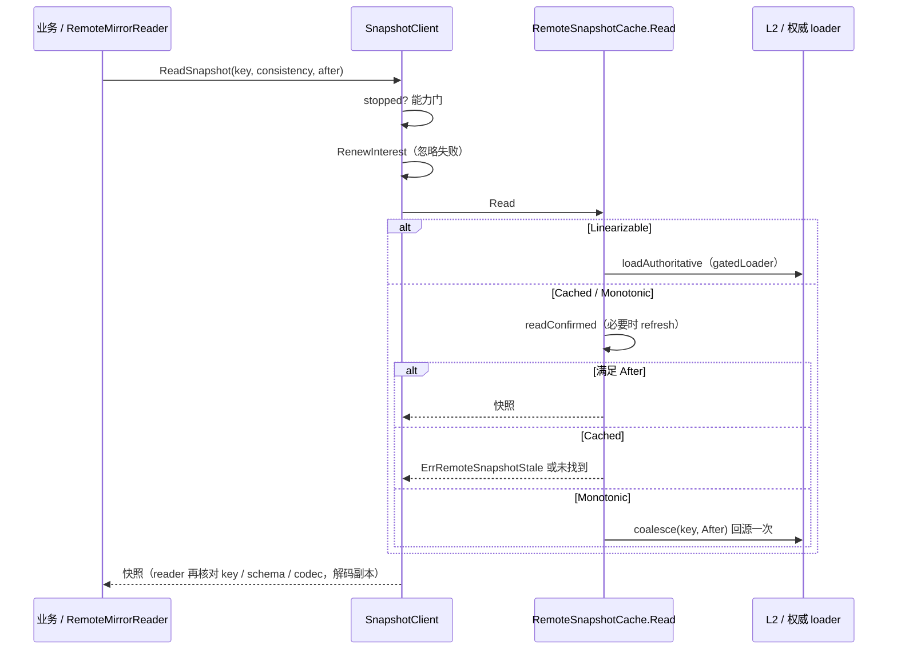
```mermaid
sequenceDiagram
  participant B as 业务 / RemoteMirrorReader
  participant C as SnapshotClient
  participant K as RemoteSnapshotCache.Read
  participant L as L2 / 权威 loader
  B->>C: ReadSnapshot(key, consistency, after)
  C->>C: stopped? 能力门
  C->>C: RenewInterest（忽略失败）
  C->>K: Read
  alt Linearizable
    K->>L: loadAuthoritative（gatedLoader）
  else Cached / Monotonic
    K->>K: readConfirmed（必要时 refresh）
    alt 满足 After
      K-->>C: 快照
    else Cached
      K-->>C: ErrRemoteSnapshotStale 或未找到
    else Monotonic
      K->>L: coalesce(key, After) 回源一次
    end
  end
  C-->>B: 快照（reader 再核对 key / schema / codec，解码副本）
```

**5. 失败与不确定结果**

| 情形 | 处理 | 对调用方 |
| --- | --- | --- |
| 客户端已停 | 不访问 L2 / 权威 / 总线 | `ErrSnapshotClientStopped` |
| Linearizable 未声明 | 不加载 | `ErrRemoteReadUnsupported` |
| Cached + After 不满足 | 不回源 | `ErrRemoteSnapshotStale` |
| token 与快照 epoch 混合 | 不交出 | `ErrRemoteObservationIncomparable` |
| Monotonic 回源后仍不满足 | 回源一次 | `ErrRemoteSnapshotStale` |
| 合并等待者超过 `snapshot_max_waiters` | 拒绝 | `ErrRemoteOverloaded` |
| Stop 时 loader 不响应取消 | 不杀 | Stop 返回 ctx 错误，客户端保持“停止中”，可再 Stop |
| reader 读到别的 key / schema / codec | 不解码 | 错误（`ErrRemoteSnapshotSchemaMismatch` 等） |

**6. 测试**

| 用例 | 文件 | 覆盖 |
| --- | --- | --- |
| `TestRemoteObservationCoversFollowsAdmissionOrder` | `entity/remote_mirror_promises_test.go` | token 排序与准入同规则 |
| `TestRemoteMirrorReaderDTOMutationDoesNotPolluteCache` | 同上 | DTO 独立副本 |
| `TestRemoteMirrorReaderNeedsNoRegistrationBesideTheOwner` | 同上 | 同进程无冲突注册 |
| `TestRemoteMirrorReaderRejectsForeignIdentityAndSchema` | 同上 | 读侧身份 / schema / codec |
| `TestRemoteSnapshotReadExitsShareOnePostCondition` | 同上 | 三个出口 × 同版本刷新 / 跨 epoch token + Cached 最低要求 |
| `TestReadRemoteSnapshotMonotonicMissLoadsAuthorityOnce` / `…BelowMinimumLoadsAuthorityOnce` | `remoteentity/snapshot_read_exit_promises_test.go` | 一次回源 |
| `TestSnapshotClientHasNoWriteCapability` 等 6 条 | `remoteentity/snapshot_client_promises_test.go` | 写能力、同进程读、线性化门、启动回收、停机契约、停机取消 |

修前红（原样，出处 [MIRROR-STEPS-1-3 §4](../../feature/MIRROR-STEPS-1-3-2026-10-06.md)）：

```text
# Manager 外层回退：一次 Monotonic 读回源两次
--- FAIL: TestReadRemoteSnapshotMonotonicMissLoadsAuthorityOnce
    one Monotonic miss loaded the authority 2 times, want 1 (the reader's fallback reloaded outside the coalesced load)
--- FAIL: TestReadRemoteSnapshotMonotonicBelowMinimumLoadsAuthorityOnce
    one Monotonic read below the minimum loaded the authority 2 times, want 1

# Cached 读交出低于最低版本的快照（基线 remote_snapshot.go 上用只走旧 API 的同场景用例）
--- FAIL: TestRedCachedReadBelowMinimum
    Cached read with minVersion=5 returned version=3 found=true err=<nil>; want ErrRemoteSnapshotStale, not a value below the minimum
```

（`TestRedCachedReadBelowMinimum` 是只在基线上跑的红用例，未入库。）负对照 N1～N8（原样节选，同出处）：

```text
N1 去掉启动失败时退订快照主题
--- FAIL: TestSnapshotClientStartFailureLeavesNoSubscription
    a failed Start left 1 snapshot subscription(s)
N2 Stop 不等依赖调用排空（去掉 c.work.Wait）
--- FAIL: TestSnapshotClientStopContract
    stopcontract: first Stop with work in flight = <nil>, want the ctx error (the stop must not report a drain that did not happen)
N3 给客户端加导出的 PublishRemoteSnapshot / DeleteRemoteSnapshot
--- FAIL: TestSnapshotClientHasNoWriteCapability
    SnapshotClient implements entity.IRemoteSnapshotPublisher: a read-only client must not carry write capability
N4 去掉 Linearizable 能力门
--- FAIL: TestSnapshotClientLinearizableNeedsADeclaredLoader
    Linearizable without a declared loader: found=true err=<nil> loads=1; want ErrRemoteReadUnsupported without loading
N5 解码器拿缓存底层切片（不复制）
--- FAIL: TestRemoteMirrorReaderDTOMutationDoesNotPolluteCache
    after the caller rewrote its DTO, the next read returned "XXXXXXXXXX" found=true err=<nil>; the cache was polluted
N7 token 只比版本
--- FAIL: TestRemoteObservationCoversFollowsAdmissionOrder（newer route / marker epoch、older route epoch、mixed 四格）
N8 带 epoch 的 token 也把版本下推给 loader
--- FAIL: TestRemoteSnapshotReadExitsShareOnePostCondition/token_across_an_epoch_change
    Read/Monotonic: a token from before the takeover returned route=0 version=0 found=false err=<nil>; the newer epoch satisfies it
```

修后：上表用例全部通过；`go test -race -count=3 ./entity ./remoteentity ./kit/remoteentity ./cache` 全过；真实依赖 `TestRealB2WatermarkMatrix*`、`TestRealJetStreamReplayAfterL2ExpiryDoesNotResurrect` 等与生成工程 12 条 `TestGeneratedRemote*` 通过（记录 §5，未保留逐行原文）。

**7. 性能证据**：未测（记录 §6：“本批没有做压测（维护者要求节省额度）”；读命中路径多一次原子读、每次 L2 调用多一次 `Lifetime` Begin / End）。第 6 步对照 v1.20.2 的结果见 [REM-8](#rem-8)。

**8. 未验证项与已知风险**

- owner 的提交后总线发布不经客户端准入（停止后仍可发布），属 K3。
- `RemoteSnapshotRead.After` 的注释原写“Cached 读……不满足就是未找到”，与源码 `Read` 对 Cached 不满足返回 `ErrRemoteSnapshotStale`（`entity/remote_snapshot.go:678-679`）不符；fixr（`155b9f91`）已按源码改正注释（`entity/remote_mirror.go:78-80`）。

**9. review 检查点**

- [ ] 确认仓内不再有绕过 `RemoteSnapshotCache.Read` 的读：grep `LoadAuthoritative(`、`.Get(ctx, key, consistency` 的调用方，确认只剩 `SnapshotReplicaStore.ApplyReplica` 的缺基回填（`remoteentity/syncer.go:139`）与外观本身。
- [ ] 确认 `loadAuthoritative` 对返回值的最终检查（`entity/remote_snapshot.go:423`～`:436`）覆盖 Linearizable 出口（`Read` `:667` 直接返回它）。
- [ ] 确认 `gatedSnapshotL2` 的四个方法（`remoteentity/snapshot_client.go:580`～`:614`）都先 `work.Begin()`，且 `Stop` 中 `work.Stop()` 先于 `stopCancel()`（`:537`～`:538`）。
- [ ] 确认 `Covers` 的“两个 epoch 都 ≥ 且至少一个更新”分支（`entity/remote_mirror.go:63`）与 L2 CAS 脚本的“marker 或 route 任一更小即拒”（`remoteentity/snapshot_l2.go` CAS 脚本）对混合 epoch 的处理一致。
- [ ] 确认 `RemoteSnapshotRead.After` 改正后的注释（`entity/remote_mirror.go:78-80`，`155b9f91`）与 `Read` 的实际行为一致：Cached 有确认值但不满足 After 返回 `ErrRemoteSnapshotStale`（epoch 不可比时 `ErrRemoteObservationIncomparable`），没有值才是未找到（`entity/remote_snapshot.go:676-686`）。

<a id="rem-3"></a>
### REM-3 allow_stale 的 Cached Remote 访问接受低于 min_version 的快照（发版前复审修复）

> 首发 v1.21.0 · [说明](guide-saga-drv-dao-rem.md#rem-3)

**1. 提交**

| 提交 | 版本 | 内容 |
| --- | --- | --- |
| `207163f9` | v1.21.0 | `nest/remote_access.go` 对 AllowStale + Cached 不下推最低版本；回归用例；CHANGELOG；MIRROR-STEPS-1-3 §6 更正 |
| `8016580b` | v1.21.0 | DECISIONS-PENDING 登记发版前审查与跟进的实施状态 |

**2. 改动文件与关键符号**

| `path:line` | 符号 | 职责 |
| --- | --- | --- |
| `nest/remote_access.go:127` | `resolveRemoteSnapshot` 中 `minVersion` | `AllowStale && consistency == RemoteReadCached` 时置 0（`:128`～`:131`） |
| `nest/remote_access.go:33` | `RemoteAccess.AllowStale` | 生成器标签 `allow_stale` |
| `nest/remote_cached_allow_stale_promises_test.go:35` | `TestCachedRemoteAccessWithAllowStaleStillAcceptsAnOlderSnapshot` | 回归 |

**3. 不变量与强制点**：AllowStale 的 Cached 访问由 `RemoteSnapshot.Accepts` 判定版本（单点：`nest/remote_access.go:128`）；不带 AllowStale 的 Cached 访问仍由读出口拒绝；Cached 不回源。守卫：上表用例（同一用例里有“不带 allow_stale 被拒”与“权威加载次数仍为 1”的对照断言）。

**4. 控制流**：1）nest 计算 `consistency`；2）AllowStale + Cached → `minVersion = 0`；3）`manager.ReadRemoteSnapshot(..., minVersion)`；4）返回的快照交 `Accepts`（按 AllowStale 放行低版本）。

**5. 失败与不确定结果**

| 情形 | 处理 | 对调用方 |
| --- | --- | --- |
| AllowStale + Cached，L1 低于 MinVersion | 读出口交出低版本，`Accepts` 放行 | 拿到旧快照 |
| 无 AllowStale + Cached，L1 低于 MinVersion | 读出口拒绝 | `remote snapshot stale`，`required` 访问整笔被拒 |
| Monotonic / Linearizable | 不变 | 不变 |

**6. 测试**：`TestCachedRemoteAccessWithAllowStaleStillAcceptsAnOlderSnapshot`（`nest/remote_cached_allow_stale_promises_test.go:35`）：真实 `SnapshotClient`，L1 先持有 v3；AllowStale + `min_version=5` 被接受；不带 AllowStale 被拒；权威加载次数为 1（Cached 不回源）。

修前红（原样，出处提交 `207163f9` 说明）：

```text
红（5505db4b，真实 SnapshotClient，L1 持有版本 3）：
  cached access with allow_stale and min_version=5 over a cached version 3:
  nest: remote access guild: remote snapshot stale; want the older snapshot accepted
绿：同一用例通过，不带 allow_stale 的对照仍被拒、Cached 不回源。
```

**7. 性能证据**：无（不涉及热路径）。

**8. 未验证项与已知风险**：无外部验证项。发版前审查报告未入库（红绿文本只在提交说明里）。仓内 `entity` / `remoteentity` 之外调用 `ReadRemoteSnapshot` 的只有 `nest/remote_access.go:133` 这一处（源码核对），没有别的 `Cached + minVersion` 调用方受收紧影响。

**9. review 检查点**

- [ ] 确认 `nest/remote_access.go:128` 的条件只在 Cached 时生效，Monotonic + AllowStale 仍把下限交给读出口（会回源）。
- [ ] grep 仓内其他 `ReadRemoteSnapshot(` / `ReadSnapshot(` 调用方，确认没有别处依赖“Cached 交出低于最低版本的值”。
- [ ] 确认 `RemoteSnapshot.Accepts` 对 AllowStale 的判定与生成器 `allow_stale` 标签一一对应（看 `nest/remote_access.go:171` 透传）。
- [ ] 确认回归用例里“不带 allow_stale”对照断言的是错误而不是未找到。

<a id="rem-4"></a>
### REM-4 Mirror 第 4 步：可确认订阅、首载缓冲、兴趣代际与撤销水位

> 首发 v1.21.0 · [说明](guide-saga-drv-dao-rem.md#rem-4)

**1. 提交**

| 提交 | 版本 | 内容 |
| --- | --- | --- |
| `23e17d81` | v1.21.0 | `ILiveSubscriber` / JetStream `SubscribeLive` / `mirror.NewLive`；`ApplyReplica` 首载缓冲；兴趣代际锁内分配与撤销水位；O4（见 [REM-5](#rem-5)）；用例与真实环境用例 |
| `c99b59f6` | v1.21.0 | DECISIONS-PENDING 第九轮标为已实施 |
| `155b9f91` | v1.23.0（本版） | durable 名实测用例 `TestRealJetStreamLiveDurableNameShape`；MIRROR-STEP-4 §4 / USER_GUIDE 改为实测名字；表满时 release 的溢出水位见 [REM-14](#rem-14) |

**2. 改动文件与关键符号**

| `path:line` | 符号 | 职责 |
| --- | --- | --- |
| `sync/syncbus/sync.go:52` | `ILiveSubscriber` | 可确认订阅能力（返回 nil 即确认） |
| `sync/syncbus/driver/jetstream.go:195` | `jetStreamSyncBus.SubscribeLive` | DeliverNew durable |
| `sync/syncbus/driver/jetstream.go:224` | `subscribe` 的 live 分支 | fanout 键 `topic+"\x00live"`、durable 主题 `topic+".live"`、`JetStreamDeliverNew` |
| `sync/syncbus/mirror/envelope.go:37` | `ErrLiveSubscribeUnsupported` | 总线不支持可确认订阅 |
| `sync/syncbus/mirror/envelope.go:60` | `NewLive` | 用 `SubscribeLive` 的复制器 |
| `sync/syncbus/mirror/envelope.go:67` | `Replicator.Live` | 是否 live |
| `entity/remote_snapshot.go:124` | `RemoteSnapshotCacheConfig.ReplicaBuffer` | 首载缓冲条数（缺省 64，`:250`、`:284`） |
| `entity/remote_snapshot.go:187` | `RemoteSnapshotReplica` | 一条复制消息（更新或删除） |
| `entity/remote_snapshot.go:396` | `loadAuthoritative` | `beginBootstrap` → `fetchAndAdmit` → `endBootstrap` → 溢出再回源 → `replayReplicas` |
| `entity/remote_snapshot.go:484` | `ApplyReplica` | 复制消息唯一入口 |
| `entity/remote_snapshot.go:515` / `:527` | `beginBootstrap` / `endBootstrap` | 登记 / 结束一次在途加载，最后一个取走缓冲 |
| `entity/remote_snapshot.go:544` | `bufferDuringBootstrap` | 进缓冲；满则清空并标记溢出、Warn、计数 |
| `entity/remote_snapshot.go:569` | `replayReplicas` | 按到达顺序重放，失败只计数 |
| `entity/remote_snapshot.go:581` | `BootstrapStats` | 累计计数 |
| `remoteentity/config.go:37` | `Config.SnapshotReplicaBuffer` | core 配置（无 kit 键） |
| `remoteentity/syncer.go:137` | `SnapshotReplicaStore.ApplyReplica` | 改走 `cache.ApplyReplica`；不在首载时的缺基回源（`:138`～`:140`） |
| `remoteentity/snapshot_client.go:452` | `SnapshotClient.Start` | 按 `bus.(ILiveSubscriber)` 选推送 / 退化（`:468`），Warn（`:497`），gauge（`:495`） |
| `remoteentity/snapshot_client.go:427` | `bindLocked` | live 时快照复制器用 `mirror.NewLive` |
| `remoteentity/snapshot_client.go:258` | `renewInterest` | generation 在条带锁内分配（`:270`） |
| `remoteentity/snapshot_client.go:312` | `ReleaseInterest` | generation 在条带锁内分配（`:319`） |
| `remoteentity/interest.go:40` | `interestLease.released` | 撤销水位 |
| `remoteentity/interest.go:191` | `renewIfNeeded` 撤销水位判定 | 不新于水位的 renew 被忽略 |
| `remoteentity/interest.go:281` | `release` | `g>0` 留水位（`:306`）；`g==0` 只撤销（`:292-296`）；表满放不下水位时 v1.21.0～v1.22.0 只撤销，本版改记溢出水位（`:300-304`，RR-20261006-11，[REM-14](#rem-14)） |
| `remoteentity/interest.go:310` | `drop` | 本机回滚 / 清理，不留水位 |
| `remoteentity/assembly.go:18` / `:20` | `Stats.SnapshotPush` / `InterestRefused` | Manager 统计 |

**3. 不变量与强制点**

- 推送只在可确认订阅上开：`SnapshotClient.Start` 的类型断言（`remoteentity/snapshot_client.go:468`）与 `mirror.Replicator.Start` 的 live 分支（`sync/syncbus/mirror/envelope.go:82`～`:87`）双重强制。守卫：`TestSnapshotClientWithoutConfirmedSubscriptionsReadsOnDemand`、`TestJetStreamSubscribeLiveUsesASeparateDeliverNewDurable`。
- 首载期间的复制消息不与加载结果交错写入：`bufferDuringBootstrap` 在 `bootMu` 下判定（`entity/remote_snapshot.go:544`）；`bootMu` 持有期间不调用 L2 / loader（注释 `:178`）。重放与加载结果都经 `admitLocked`。守卫：`TestSnapshotBootstrapBuffersDeltaDuringFirstLoad`、`TestSnapshotBootstrapReplayMatrix`、`TestSnapshotBootstrapOverflowDropsTheBufferAndReloads`。
- 溢出后再回源一次：`loadAuthoritative`（`entity/remote_snapshot.go:415`～`:418`，条件 `overflowed && err == nil`）。守卫：`TestSnapshotBootstrapOverflowDropsTheBufferAndReloads`（负对照：去掉再回源 → `version=5 loads=1 … Reloads:0`）。
- 兴趣代际锁内分配：`renewInterest` 在 `stripe.Lock()`（`remoteentity/snapshot_client.go:264`）之后才 `nextInterestGeneration()`（`:270`）；`ReleaseInterest` 同（`:317`、`:319`）。守卫：`TestInterestRenewReleaseConvergesInEveryDeliveryOrder`（覆盖线上乱序投递；**没有并发 renew / release 的竞态用例**直接钉住“锁内分配”）。
- release 撤销水位：`remoteentity/interest.go:191`、`:306`。守卫：同上，以及改了断言的 `TestStaleInterestReleaseDoesNotCancelANewerRenewal`（`remoteentity/interest_generation_promises_test.go:28`）。

**4. 控制流**

首载缓冲：

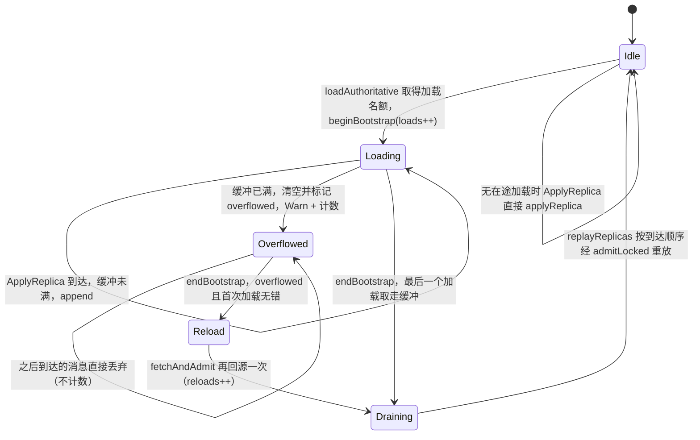
```mermaid
stateDiagram-v2
  [*] --> Idle
  Idle --> Loading: loadAuthoritative 取得加载名额，beginBootstrap(loads++)
  Loading --> Loading: ApplyReplica 到达，缓冲未满，append
  Loading --> Overflowed: 缓冲已满，清空并标记 overflowed，Warn + 计数
  Overflowed --> Overflowed: 之后到达的消息直接丢弃（不计数）
  Loading --> Draining: endBootstrap，最后一个加载取走缓冲
  Overflowed --> Reload: endBootstrap，overflowed 且首次加载无错
  Reload --> Draining: fetchAndAdmit 再回源一次（reloads++）
  Draining --> Idle: replayReplicas 按到达顺序经 admitLocked 重放
  Idle --> Idle: 无在途加载时 ApplyReplica 直接 applyReplica
```

订阅模式与兴趣代际：

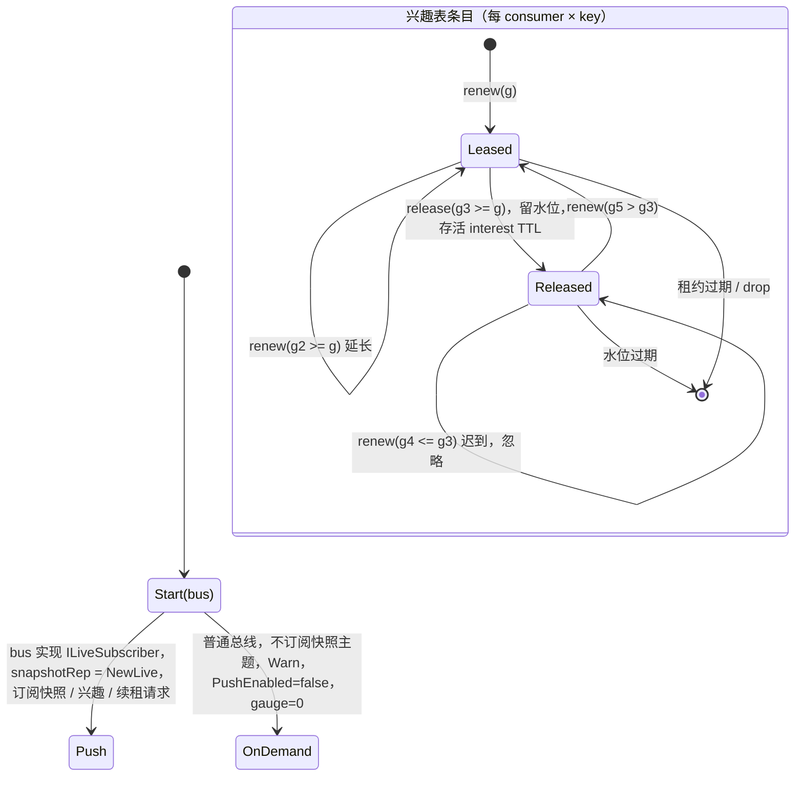
```mermaid
stateDiagram-v2
  state "Start(bus)" as S
  [*] --> S
  S --> Push: bus 实现 ILiveSubscriber，snapshotRep = NewLive，订阅快照 / 兴趣 / 续租请求
  S --> OnDemand: 普通总线，不订阅快照主题，Warn，PushEnabled=false，gauge=0
  state "兴趣表条目（每 consumer × key）" as I {
    [*] --> Leased: renew(g)
    Leased --> Leased: renew(g2 >= g) 延长
    Leased --> Released: release(g3 >= g)，留水位，存活 interest TTL
    Released --> Released: renew(g4 <= g3) 迟到，忽略
    Released --> Leased: renew(g5 > g3)
    Released --> [*]: 水位过期
    Leased --> [*]: 租约过期 / drop
  }
```

**5. 失败与不确定结果**

| 情形 | 处理 | 对调用方 |
| --- | --- | --- |
| 普通 NATS | 不订阅快照推送 | 读取在陈旧上限后回源；启动 Warn |
| `NewLive` 复制器在不支持的总线上 Start | 返回 `ErrLiveSubscribeUnsupported` | Start 失败（`SnapshotClient` 先做类型断言，正常不会走到） |
| 缓冲溢出 | 丢缓冲，加载装入后整体再回源一次 | 读者拿到第二次加载后的值 |
| 缓冲溢出但首次加载出错 | 不再回源（`err != nil`） | 读者拿到加载错误 |
| 重放失败（缺基、L2 冲突） | 只计数 | 新鲜度交给陈旧上限 |
| 多个并发加载（不同合并键）同一 key | 只有最后结束的加载取走缓冲 / 溢出标记（`endBootstrap`，`entity/remote_snapshot.go:527-541`：`loads` 归零才取） | 先结束的加载返回权威加载结果（满足读出口后置条件），缓冲里的较新值在最后一个加载结束时经 `admitLocked` 重放（源码核对） |
| 表满放不下撤销水位 | v1.21.0～v1.22.0：只撤销、不留水位；本版改记每个 consumer 一个的溢出水位（`remoteentity/interest.go:300-304`，RR-20261006-11，[REM-14](#rem-14)） | 迟到的旧 renew 被忽略，不再复活租约 |

**6. 测试**

| 用例 | 文件 | 覆盖 |
| --- | --- | --- |
| `TestSnapshotBootstrapBuffersDeltaDuringFirstLoad` | `remoteentity/mirror_step4_promises_test.go:74` | 加载在途的增量缓冲后重放，权威只读一次 |
| `TestInterestRenewReleaseConvergesInEveryDeliveryOrder` | 同上 `:114` | renew / release 全排列收敛到最后一次操作 |
| `TestSnapshotBootstrapReplayMatrix` | 同上 `:226` | 旧 upsert / 旧删除 / 同版本删除 / 更新的删除 / 删除后重建 / 重建先于删除 / 新旧 upsert 乱序 |
| `TestSnapshotBootstrapOverflowDropsTheBufferAndReloads` | 同上 `:292` | 溢出丢缓冲并再回源 |
| `TestSnapshotClientWithoutConfirmedSubscriptionsReadsOnDemand` | 同上 `:395` | 退化：不订阅、Warn、`PushEnabled=false`，经 L2 读到 owner 的新版本 |
| `TestJetStreamSubscribeLiveUsesASeparateDeliverNewDurable` | `sync/syncbus/driver/jetstream_live_promises_test.go:17` | DeliverNew durable 与 DeliverAll 分开 |
| `TestRealJetStreamLiveSubscriptionConfirmsAndResumes` | `remoteentity/mirror_step4_jetstream_integration_test.go` | 真实 JetStream：确认前不投、确认后投、退订期间的续投 |
| `TestRealJetStreamLiveSnapshotPushReachesTheReader` | 同上 | 真实 JetStream + Redis：推送到达只读方 |

修前红（原样，出处 [MIRROR-STEP-4 §6.2](../../feature/MIRROR-STEP-4-AND-O4-2026-10-06.md)）：

```text
--- FAIL: TestSnapshotBootstrapBuffersDeltaDuringFirstLoad
    after the first load: version=5 payload="base" found=true err=<nil> authority loads=2 replica err=remote snapshot stale; want v6 "base+delta" from one load (the delta buffered and replayed on top of the load)
--- FAIL: TestInterestRenewReleaseConvergesInEveryDeliveryOrder
    renew then release delivered in order [1 0]: interested=true, want false (the last operation issued decides)
    renew renew release delivered in order [2 1 0] / [1 2 0] / [2 0 1] / [0 2 1]: interested=true, want false
    release renew release delivered in order [2 1 0] / [2 0 1] / [0 2 1]: interested=true, want false
```

负对照（记录原文）：去掉首载缓冲（`bufferDuringBootstrap` 不生效）→ 第一条与 `TestSnapshotBootstrapReplayMatrix` 的计数断言红；去掉溢出后的再回源 → `TestSnapshotBootstrapOverflowDropsTheBufferAndReloads` 红（`version=5 loads=1 … Reloads:0`）。

真实环境（原样摘要，出处同 §6.3）：`TestRealJetStreamLiveSubscriptionConfirmsAndResumes` 一次 2.05s（退订时被停掉的拉取请求已交出 3、未确认，AckWait 2s 后重投），另一次 0.05s；`TestRealB2WatermarkMatrixStandalone`（4.04s）、`…Cluster`（6.43s）等全部 PASS；`scripts/test-remote-generated.sh` 12 条 PASS。

改了断言的既有用例：`TestStaleInterestReleaseDoesNotCancelANewerRenewal`（原把“release(13) 之后迟到的 renew(12) 重建租约”当前提，改为断言不复活）、`TestRemoteInterestRegistryHasHardCapacityLimits`、四个 Assembly 生命周期用例的测试总线补 `SubscribeLive`。

**7. 性能证据**：本批未压测（记录 §6.6：首载缓冲只在权威加载在途时取一次互斥锁，每条复制消息一次 `bootMu`）。第 6 步对照见 [REM-8](#rem-8)（推送扇出无显著差别）。

**8. 未验证项与已知风险**

- 无 L2 装配里 L1 删除标记被 LRU 淘汰后旧 upsert 可复活。
- 订阅断开到重连之间漏掉的推送只影响新鲜度（上界 `cached_max_staleness`）；JetStream durable 续投依赖流保留期（MaxAge）。
- durable 名（实测）：`durableSyncName` 经 `sanitizeSyncName` 把 `.` 换成 `_`（`sync/syncbus/driver/jetstream.go:431`、`:449`），隔离 NATS 上列出的服务端名字是 `sync_remote_entity_snapshot_live_<sid>_<16 位十六进制>`（DeliverAll 的是 `sync_remote_entity_snapshot_<sid>_<16 位十六进制>`），用例 `TestRealJetStreamLiveDurableNameShape`（`remoteentity/mirror_step4_jetstream_integration_test.go:97`，fixr `155b9f91`）；MIRROR-STEP-4 §4 与 USER_GUIDE 已按实测改正。
- 推送 / 退化在多节点 JetStream HA 与 Linux 网络下：E06 / E01。

**9. review 检查点**

- [ ] 确认兴趣代际在锁内分配：`renewInterest`（`remoteentity/snapshot_client.go:264`→`:270`）与 `ReleaseInterest`（`:317`→`:319`）都在 `stripe.Lock()` 之后取 generation；评估是否需要补一个并发 renew / release 的竞态用例（现有守卫只覆盖线上乱序）。
- [ ] 确认首载缓冲溢出后再回源一次：`entity/remote_snapshot.go:415`～`:418`；检查首次加载出错时不回源是否符合“溢出有明确行为”的决定，并看 `TestSnapshotBootstrapOverflowDropsTheBufferAndReloads` 是否覆盖出错分支。
- [ ] 确认缓冲重放与溢出回源都只经 `applyReplica` → `ApplyUpdate` / `DeleteAtVersion` / `Delete` 与 `fetchAndAdmit` → `publishLocked`，没有直接写 L1 的新路径（`entity/remote_snapshot.go:497`、`:569`）。
- [ ] 同一 key 多个并发加载（合并键 `(key, after, refresh)` 不同）时只有最后结束的加载重放缓冲（`endBootstrap`，`entity/remote_snapshot.go:535-537`）：第 5 节按源码给出的结论是先返回的加载交出的是权威加载结果、满足读出口后置条件；确认没有读者在此期间读到早于自己那次加载结果的值（同 key 的 L1 写都在 `publishMu` 下经 `admitLocked`，版本不回退）。
- [ ] 表满时 `release` 的撤销水位（v1.21.0～v1.22.0 不留，迟到的旧 renew 会复活租约）已由 RR-20261006-11 改为溢出水位（`155b9f91`，到期实测 `d5682dc4`）：具体检查点见 [REM-14](#rem-14) §9。
- [ ] 确认普通 NATS 退化时兴趣主题仍订阅、`refreshRep` 不建立（`remoteentity/snapshot_client.go:436`～`:439`、`:482`）。

<a id="rem-5"></a>
### REM-5 O4：兴趣容量按 consumer 配额

> 首发 v1.21.0 · [说明](guide-saga-drv-dao-rem.md#rem-5)

**1. 提交**

| 提交 | 版本 | 内容 |
| --- | --- | --- |
| `23e17d81` | v1.21.0 | `remoteInterestRegistry` 按 consumer 计、错误哨兵、指标与限频日志；kit 严格读取与 `frameworkIntKeys` 登记 |
| `c99b59f6` | v1.21.0 | DECISIONS-PENDING 第九轮 O4 标为已实施 |
| `fcc78ad0` | v1.23.0（本版） | 生成配置写出 `snapshot_interest_per_consumer: 0`（见 [REM-13](#rem-13)） |
| `d5682dc4` | v1.23.0（本版） | 兴趣 handler 出错时 JetStream 的结算实测为 Ack（`TestRealJetStreamInterestHandlerErrorIsAcknowledged`，含负对照），记入 MIRROR-STEP-4 §6.10；同提交的溢出水位到期实测见 [REM-14](#rem-14) |

**2. 改动文件与关键符号**

| `path:line` | 符号 | 职责 |
| --- | --- | --- |
| `remoteentity/interest.go:24` | `ErrInterestQuotaExceeded` | 包裹 `entity.ErrRemoteOverloaded` |
| `remoteentity/interest.go:28` | `ErrInterestRegistryFull` | 包裹 `entity.ErrRemoteOverloaded` |
| `remoteentity/interest.go:48` | `remoteInterestLimits` | PerConsumer / Total / ReleaseFence |
| `remoteentity/interest.go:58` | `interestQuotaShare = 16` | 缺省配额比例 |
| `remoteentity/interest.go:131` | `newRemoteInterestRegistry` | 缺省 `max(1, Total/16)` |
| `remoteentity/interest.go:200`～`:210` | `renewIfNeeded` 配额与表满判定 | 先按 consumer 配额，再按每节点上限；各自先 `pruneExpiredLocked` 再判 |
| `remoteentity/interest.go:217` | `rejectLocked` | 计数 + 每表每 10s 至多一条 Warn |
| `remoteentity/interest.go:229` | `setLocked` | 维护 `perConsumer`（不含撤销水位）与 `total` |
| `remoteentity/snapshot_client.go:292` | `renewInterest` 本机预判 | 本机兴趣表按同一配额判定，被拒不广播并回滚本机条目 |
| `remoteentity/snapshot_client.go:328` | `noteInterestRejected` | `interest_renew_refused_total{reason}` |
| `remoteentity/snapshot_client.go:128` | `validateSnapshotClientConfig` | 配额越界拒绝 |
| `remoteentity/config.go:34` | `Config.SnapshotInterestPerConsumer` | core 配置 |
| `kit/remoteentity/config.go:34` | `snapshotConfig.SnapshotInterestPerConsumer` | 声明：整数、`min:"0"`（0 取 `snapshot_interest_subs / 16`）（A4 ① `d1226825` 之后；之前是 `readSnapshotConfig` 手写严格读取、`app/config_validation.go` 清单登记） |
| `kit/remoteentity/config.go:47-62` | `snapshotConfig.ValidateConfig` | 跨键规则：每节点配额不超过 `snapshot_interest_subs`（未配置时按 core 缺省 262144 比较） |

**3. 不变量与强制点**

- 一个 consumer 的拒绝只取决于它自己的租约数（`perConsumer[sid] >= quota`，`remoteentity/interest.go:203`）；撤销水位不计入配额（`setLocked` `:238`～`:243`）。
- consumer 本机与 owner 用同一份判定：本机兴趣表收到自己的全部续租（`renewInterest` 调 `c.interests.renew`，`remoteentity/snapshot_client.go:292`）。
- 读路径不因拒绝失败（`ReadSnapshot` 忽略 `RenewInterest` 错误，`remoteentity/snapshot_client.go:194`）。
- 守卫：`TestInterestCapacityIsPerConsumer`、`TestInterestQuotaRefusalIsVisibleAndReadsGoOnDemand`（`remoteentity/mirror_step4_promises_test.go:171`、`:340`）、`TestRemoteInterestRegistryHasHardCapacityLimits`（`remoteentity/interest_test.go`）、`TestInterestPerConsumerConfiguration`（`kit/remoteentity/interest_quota_config_test.go`）。

**4. 控制流**（`renewIfNeeded`）

1. 校验（consumer 非 0、key 合法、未过期）。
2. 已有撤销水位且过期 → 删掉当作不存在。
3. 已有租约：代际更旧 → 忽略；否则延长 / 更新代际。
4. 已有撤销水位且 renew 代际不新于它 → 忽略。
5. 新租约：配额满 → 先清过期再判，仍满 → `consumer_quota` 拒绝；表满（新条目）→ 先清过期再判，仍满 → `registry_full` 拒绝。
6. 写入并维护计数。

**5. 失败与不确定结果**

| 情形 | 处理 | 对调用方 |
| --- | --- | --- |
| consumer 配额满（本机） | 回滚本机条目，计 `interest_renew_refused_total{reason=registry}` | 读不失败；该 key 无推送，按需读取 |
| 本机兴趣表 key 数满 | 先清过期，仍满则拒绝，计 `{reason=local_table_full}` | 同上（`ErrRemoteOverloaded`） |
| owner 处配额满 / 表满 | `interest_rejected_total{reason}`、限频 Warn；`InterestReplicaStore.ApplyReplica` 返回错误 | 同步总线对 handler 错误记 Warn 后 Ack，不重投、不 Term（真实 JetStream 实测 `TestRealJetStreamInterestHandlerErrorIsAcknowledged`，[MIRROR-STEP-4 §6.10](../../feature/MIRROR-STEP-4-AND-O4-2026-10-06.md)）；consumer 以更新代际在下次续租时恢复 |
| 配置 `per_consumer > subs` | kit `Init` 与 `NewSnapshotClient` 拒绝 | 启动失败 |

**6. 测试**

| 用例 | 文件 | 覆盖 |
| --- | --- | --- |
| `TestInterestCapacityIsPerConsumer` | `remoteentity/mirror_step4_promises_test.go:171` | A 占满不影响 B |
| `TestInterestQuotaRefusalIsVisibleAndReadsGoOnDemand` | 同上 `:340` | 超额 `ErrInterestQuotaExceeded`、计数、读取经权威 |
| `TestRemoteInterestRegistryHasHardCapacityLimits` | `remoteentity/interest_test.go` | 按 consumer 配额 + 每节点上限（改了断言） |
| `TestInterestPerConsumerConfiguration` | `kit/remoteentity/interest_quota_config_test.go` | 严格读取、范围、`ValidateServiceConfig` |
| `TestRealJetStreamInterestHandlerErrorIsAcknowledged` | `remoteentity/interest_handler_error_jetstream_integration_test.go:35`（`-tags integration`，本版） | owner 表满拒绝与身份不符两条消息：handler 各调一次，ack floor 推进到 2、无待确认、`NumRedelivered=0`，过 AckWait 后不再投递，`nats.jetstream.terminal.total` 不变；之后有空位时 consumer 以更新代际续租成功。负对照（临时让总线把 handler 错误交给驱动）两条消息各 NAK 重投到 MaxDeliver |

修前红（原样，出处 [MIRROR-STEP-4 §6.2](../../feature/MIRROR-STEP-4-AND-O4-2026-10-06.md)）：

```text
--- FAIL: TestInterestCapacityIsPerConsumer
    consumer B's interest was refused at the owner because consumer A filled the cluster-wide table; capacity must be counted per consumer
```

记录补充：修前 B 的读路径 `_ = c.RenewInterest(...)` 吞掉错误，没有计数。

**7. 性能证据**：未测。

**8. 未验证项与已知风险**

- 兴趣表是广播副本，两边收到的消息不同时判定可能不一致；总线丢兴趣消息由租约过期收敛。
- 缺省配额：core `DefaultConfig`（`snapshot_interest_subs` 262144）下为 16384；生成配置 `snapshot_interest_subs: 100000`（kit 声明的 `example`，`kit/remoteentity/config.go:33`，经 `codegen/internal/roost/kitconfig_gen.go:295` 写进生成配置）下为 6250。USER_GUIDE 与 MIRROR-STEP-4 已分开写明（fixr）。
- 满载容量的多主机验证：E13 / E15 / E16。

**9. review 检查点**

- [ ] 确认 `perConsumer` 计数在 `setLocked` / `removeLocked`（`remoteentity/interest.go:229`、`:251`）里对“租约 ↔ 撤销水位”互转维护正确（水位不计配额、租约变水位时减一）。
- [ ] 确认 `snapshot_interest_per_consumer` 写错类型时报错点名这个键（声明检查在 `ValidateConfig` 之前，`ValidateConfig` 只在声明检查通过后执行，`kit/remoteentity/config.go:47-62`），看 `TestInterestPerConsumerConfiguration`（`kit/remoteentity/interest_quota_config_test.go:13`）是否有错类型与“超过 subs”两类用例。
- [ ] `InterestReplicaStore.ApplyReplica` 在 owner 拒绝时返回错误（`remoteentity/interest.go:392`～`:394`）：已实测结算为 Ack、不重投（`d5682dc4`，`TestRealJetStreamInterestHandlerErrorIsAcknowledged`，`remoteentity/interest_handler_error_jetstream_integration_test.go:35`，链路见 [MIRROR-STEP-4 §6.10](../../feature/MIRROR-STEP-4-AND-O4-2026-10-06.md)）。确认这一结算依赖的是同步总线对所有主题的统一契约（`jetStreamSyncBus.invoke` 经 `Subscription.Deliver` 调 handler，出错记 Warn 后返回，`sync/syncbus/driver/jetstream.go:300-309`；A3 ② 之后的形状见 [REM-15](#rem-15)），兴趣主题仍是普通订阅（`remoteentity/snapshot_client.go:433`），以后若有人让总线把 handler 错误交给驱动 NAK，这里会变成 MaxDeliver 内反复重投。
- [ ] 确认 `rejectLocked` 的限频（`lastLogAt`）在锁内读写（`remoteentity/interest.go:219`）。

<a id="rem-6"></a>
### REM-6 Mirror 第 5 步：kit RemoteMirrorMod、codegen `//roost:mirror` DTO、公会摘要样例

> 首发 v1.21.0 · [说明](guide-saga-drv-dao-rem.md#rem-6)

**1. 提交**

| 提交 | 版本 | 内容 |
| --- | --- | --- |
| `a6985cf3` | v1.21.0 | kit `RemoteMirrorMod` / `MirrorSource` / `WithMirrorLoader`；`remoteentity.NewMongoSnapshotLoader`；`mods.ModRemoteMirror`；codegen `//roost:mirror` 与 `remote=mirror` 迁移诊断；`testdata/remoteflow` 两进程样例；`remote_entity.mirror.shutdown_timeout` 登记 |
| `43c60e82` | v1.21.0 | DECISIONS-PENDING Mirror 第 5 步标为已实施 |
| `4881f2b7` | v1.21.0 | 发版：生成器 Core 下限升到 v1.21.0（生成的只读产物用到 `entity.RemoteMirrorReader` 等） |
| `db67b8ee` | v1.23.0（本版） | `RemoteMirrorMod` 改用 `NewSnapshotL2StoreFromConfig`（O-M6-3 墓碑 WAIT，DRV 主题） |
| `fcc78ad0` | v1.23.0（本版） | 生成配置写出 `mirror.shutdown_timeout: 5s` |

**2. 改动文件与关键符号**

| `path:line` | 符号 | 职责 |
| --- | --- | --- |
| `kit/remoteentity/remote_mirror_mod.go:26` | `defaultMirrorShutdownTimeout` | 5s |
| `kit/remoteentity/remote_mirror_mod.go:36` | `RemoteMirrorMod` | 只读装配 |
| `kit/remoteentity/remote_mirror_mod.go:57` | `WithMirrorLoader` | 换权威 loader 与线性化声明 |
| `kit/remoteentity/remote_mirror_mod.go:75` | `MirrorSource` | 从注册表取 `entity.RemoteSnapshotReadOnly` |
| `kit/remoteentity/remote_mirror_mod.go:89` | `Init` | `app.LoadConfig(mirrorConfig)` 读 sid、快照段、`mirror.shutdown_timeout`、`mongo.database`（`:91-104`） |
| `kit/remoteentity/config.go:136-145` | `mirrorConfig` | 只读 Mod 的声明：`ServiceIdentity`、匿名嵌入 `snapshotConfig`、`mongo`、`mirror.shutdown_timeout`（`default:"5s" min:"1ns"`，`:142`）；锁、提交、finalizer 的键不在其中（A4 ① `d1226825` 之后；之前是 `readSnapshotConfig` 手写严格读取、`app/config_validation.go` 清单登记） |
| `kit/remoteentity/remote_mirror_mod.go:107` | `DependsOn` | redis、syncbus；缺省 loader 时加 mongo |
| `kit/remoteentity/remote_mirror_mod.go:116` | `Provide` | L2（`:124`）、loader（`:134`）、`NewSnapshotClient`（`:136`）、登记只读接口（`:147`）、健康项（`:150`） |
| `kit/remoteentity/remote_mirror_mod.go:156` | `Start` | 取 syncbus 启动客户端，Info 日志 |
| `kit/remoteentity/remote_mirror_mod.go:175` | `StopBudget` | 停机预算 |
| `kit/remoteentity/remote_mirror_mod.go:197` | `StopWithContext` | 客户端三步停机 |
| `kit/remoteentity/remote_mirror_mod.go:215` | `checkHealth` | OK / Degraded（本机兴趣表满）/ Fail（停止后） |
| `kit/remoteentity/remote_entity_mod.go:138` | `RemoteEntityMod` 能力表 | 登记 `ModRemoteMirror = Manager.SnapshotClient()` |
| `kit/remoteentity/config.go:20` / `:65` | `snapshotConfig` / `apply` | 两个 Mod 共用的快照段声明与写入 core `Config`（`RemoteEntityMod` 的 `entityConfig` `:113`、`RemoteMirrorMod` 的 `mirrorConfig` `:139` 都匿名嵌入它） |
| `kit/mods/name.go:38` | `ModRemoteMirror` | `"remote_entity.mirror"` |
| `remoteentity/mongo_committer.go:348` | `NewMongoSnapshotLoader` | 只读 loader，与 `MongoCommitter.LoadRemoteSnapshot` 共用 `loadMongoRemoteSnapshot`（`:358`） |
| `codegen/internal/entity/mirror.go:35` | `mirrorMarkerRe` | `//roost:mirror` 解析 |
| `codegen/internal/entity/mirror.go:50` | `remoteMirrorMigration` | 迁移诊断文本 |
| `codegen/internal/entity/mirror.go:53` | `extractMirrors` | 找标记与 struct |
| `codegen/internal/entity/mirror.go:174` | `validateMirrorFields` | 拒绝 `dao:` / `comp:` 标签与嵌入字段 |
| `codegen/internal/entity/mirror.go:187` | `generateMirror` | 生成 `<dto>_gen_wire.go` |
| `codegen/internal/entity/mirror.go:228` | `mirrorTemplate` | spec / Decode / New…Reader 模板 |
| `codegen/internal/entity/parse.go:318` / `:321` | 解析期诊断 | `remote=mirror` / `lifetime=mirror_cache` |
| `codegen/internal/entity/gen.go:35` | 生成期诊断 | 同一文本 |
| `codegen/internal/entity/testdata/remoteflow/guild_summary.go` | `GuildSummary` DTO | 样例 |
| `codegen/internal/entity/testdata/remoteflow/mirror_test.go` | 两进程样例 | JetStream / NATS |

**3. 不变量与强制点**

- 只读服务的注册表里没有写能力：`Provide` 只登记 `entity.RemoteSnapshotReadOnly(client)`（`kit/remoteentity/remote_mirror_mod.go:147`），客户端本身无导出写方法。守卫：`TestRemoteMirrorModRegistersOnlyReadCapability`；样例子进程断言注册表无 `remote_entity` / `remote_entity.atomic_store` / `redis.versioned_lock`。
- 同一身份不开第二个客户端：`ModRemoteMirror` 由两个 Mod 之一登记，同进程冲突启动即失败。守卫：`TestRemoteMirrorModRefusesASecondClientBesideTheOwner`。
- 生成物无注册 / 写能力：模板只有 spec、Decode、reader（`codegen/internal/entity/mirror.go:228`）。守卫：`TestMirrorDTOGeneratesReadOnlyView`（与 fixture 逐字一致）。
- `remote=mirror` 不再生成 Entity：解析期（`codegen/internal/entity/parse.go:318`）与生成期（`codegen/internal/entity/gen.go:35`）两处。守卫：`TestRemoteMirrorEntityMarkerIsAMigrationError`。
- 停机：`stopcontract.Check` + `CallerReleases`。守卫：`TestRemoteMirrorModStopContract`、`TestRemoteMirrorModStopCancelsInFlightReads`。

**4. 控制流**（只读服务生命周期）

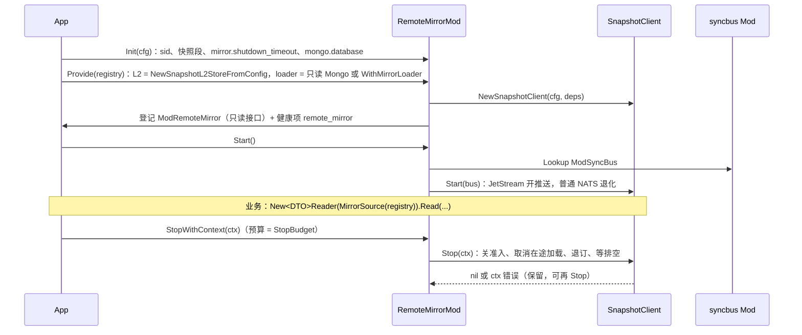
```mermaid
sequenceDiagram
  participant App
  participant M as RemoteMirrorMod
  participant C as SnapshotClient
  participant Bus as syncbus Mod
  App->>M: Init(cfg)：sid、快照段、mirror.shutdown_timeout、mongo.database
  App->>M: Provide(registry)：L2 = NewSnapshotL2StoreFromConfig，loader = 只读 Mongo 或 WithMirrorLoader
  M->>C: NewSnapshotClient(cfg, deps)
  M->>App: 登记 ModRemoteMirror（只读接口）+ 健康项 remote_mirror
  App->>M: Start()
  M->>Bus: Lookup ModSyncBus
  M->>C: Start(bus)：JetStream 开推送，普通 NATS 退化
  Note over App,C: 业务：New<DTO>Reader(MirrorSource(registry)).Read(...)
  App->>M: StopWithContext(ctx)（预算 = StopBudget）
  M->>C: Stop(ctx)：关准入、取消在途加载、退订、等排空
  C-->>M: nil 或 ctx 错误（保留，可再 Stop）
```

**5. 失败与不确定结果**

| 情形 | 处理 | 对调用方 |
| --- | --- | --- |
| sid 为 0 | Init 失败 | `remote_entity mirror mod: non-zero sid is required …` |
| `mirror.shutdown_timeout` 非正 / 错类型 | Init 失败 | 点名键 |
| 缺 redis / mongo / health / syncbus 能力 | Provide / Start 失败 | `required capability "…" not found` |
| 与 `RemoteEntityMod` 同进程 | 注册冲突 | 启动失败 |
| Linearizable 读，缺省 loader | 不加载 | `ErrRemoteReadUnsupported` |
| 停机超预算 | 返回 ctx 错误，Warn `stop incomplete` | 客户端保留，可再 Stop |
| 生成器遇 `remote=mirror` | 报迁移诊断 | `roost generate` 失败（T-274） |

**6. 测试**

| 用例 | 文件 | 覆盖 |
| --- | --- | --- |
| `TestRemoteMirrorModRegistersOnlyReadCapability` | `kit/remoteentity/remote_mirror_mod_promises_test.go` | 只读、换 loader 不依赖 mongo、未声明线性化 |
| `TestRemoteMirrorModRefusesASecondClientBesideTheOwner` | 同上 | 同进程冲突 |
| `TestRemoteMirrorModConfiguration` | 同上 | 快照段、新键、错类型 / 非正 / 越界 / hash tag 前缀、`ValidateServiceConfig` |
| `TestRemoteMirrorModStopContract` / `…StopCancelsInFlightReads` | 同上 | 停机契约、停止取消在途读 |
| `TestRemoteMirrorModHealthReportsPushMode` | 同上 | 健康信息 |
| `TestRemoteMirrorEntityMarkerIsAMigrationError` | `codegen/internal/entity/mirror_promises_test.go` | 迁移诊断 |
| `TestMirrorDTOGeneratesReadOnlyView` | 同上 | 生成物逐字、无写能力 |
| `TestMirrorDTOOnlyPackageIsDiscoveredAndRetired` / `TestMirrorMarkerValidation` | 同上 | 目录发现与孤儿清理、标记校验 |
| `TestGeneratedRemoteMirrorGuildSummary/{jetstream,nats}` + `TestGeneratedRemoteMirrorReaderProcess` | `codegen/internal/entity/testdata/remoteflow/mirror_test.go` | 两进程样例 |

新能力没有修前红；负对照（原样，出处 [MIRROR-STEP-5 §5.2](../../feature/MIRROR-STEP-5-2026-10-06.md)）：

```text
N1 去掉停止取消（gatedLoader 不再随 Stop 取消在途加载）
--- FAIL: TestRemoteMirrorModStopCancelsInFlightReads (2.00s)
    remote_mirror_mod_promises_test.go:273: Stop with a cancellable read in flight = context deadline exceeded; the in-flight load must be cancelled by the stop
N2 去掉只读限制（Mod 登记写 Manager 而不是只读客户端）
--- FAIL: TestRemoteMirrorModRegistersOnlyReadCapability
    the mirror capability *remoteentity.Manager is a remote entity manager
    the mirror capability is the write Manager
    Linearizable read through an undeclared loader = <nil>, want ErrRemoteReadUnsupported
N3 去掉 remote=mirror 迁移诊断（等于基线：旧形式被接受、生成可写 Entity）
--- FAIL: TestRemoteMirrorEntityMarkerIsAMigrationError
    parseDir accepted the source and produced 1 entities; want an error mentioning ["remote=mirror no longer generates an entity" "//roost:mirror entityKind="]
N4 生成物多出全局解码器注册
--- FAIL: TestMirrorDTOGeneratesReadOnlyView
    mirror view carries write / registration capability "MustRegisterRemoteSnapshotDecoder"
N5 样例：只读子进程调用 RegisterEntity（拿到 Guild 的 builder，能加载 / 写公会）
    mirror_test.go:493: the read-only process registered the Guild entity builder: it could load and write guilds
--- FAIL: TestGeneratedRemoteMirrorGuildSummary/jetstream
N6 样例：只读方在 JetStream 上不开推送
    mirror_test.go:336: read-only process push mode [push=false], want push=true
--- FAIL: TestGeneratedRemoteMirrorGuildSummary/jetstream
```

修后真实环境（原样，出处同 §5.4）：

```text
jetstream: MIRROR READY push=true / FIRST 1 alpha 1 / ISOLATED / SECOND 2 beta 2 35ms / STOPPED   PASS (1.67s)
nats:      MIRROR READY push=false / FIRST 1 alpha 1 / ISOLATED / SECOND 2 beta 2 3.007s / STOPPED PASS (4.14s)
```

改了断言的既有用例：`TestParseDirAcceptsEveryDocumentedMarkerForm`、`TestRemoteCapableMarkerIsRejectedWithTheCategoryReplacement`（原接受 `remote=mirror`，改为拒绝）。

**7. 性能证据**：本步未单独测；只读装配的读路径与 Manager 读同一个 `SnapshotClient`，第 6 步对照见 [REM-8](#rem-8)。

**8. 未验证项与已知风险**

- 生成的 spec 不带 `Tenant` / `Policy`（`codegen/internal/entity/mirror.go:234-240` 的模板只设 Kind / Scope / Schema / Codec，源码核对），多租户 / 多 profile 的视图要手写 spec（样例里跨租户 / profile 的读是改了 spec 的负对照）。
- `RemoteMirrorMod` 的 `StopBudget` 不计入生成器 `shutdown.total_timeout`（RR-20260926-66）。
- owner 删除没有带版本的 Mongo 墓碑，防复活只靠 L2 墓碑。
- 健康语义两 Mod 不同：只读 Mod 本机兴趣表满报 Degraded（`kit/remoteentity/remote_mirror_mod.go:225`），`RemoteEntityMod` 同一条件报 Fail（`kit/remoteentity/remote_entity_mod.go:170`）。

**9. review 检查点**

- [ ] 确认 `MirrorSource` 返回的接口在 owner 进程里断言不到 `*remoteentity.Manager`（`kit/remoteentity/remote_entity_mod.go:138` 登记的是 `SnapshotClient()` 而非 Manager）。
- [ ] 确认快照段声明 `snapshotConfig` 被两个 Mod 共用（同一个结构体，App 合并声明时两份完全相同）、`RemoteMirrorMod` 不读锁 / 提交 / finalizer 键（`mirrorConfig`，`kit/remoteentity/config.go:136-145`），并核对 Cluster 下无 hash tag 的 `lock_key` 不影响只读装配（`TestRemoteMirrorModConfiguration`）。
- [ ] 确认迁移诊断在解析期与生成期两处都触发（`codegen/internal/entity/parse.go:318`、`:321`，`codegen/internal/entity/gen.go:35`），`lifetime=mirror_cache` 与 `mirror-cache` 两种拼写（`codegen/internal/entity/parse.go:724`）都被拒。
- [ ] 确认生成的 `Schema` 与 owner 提交快照用同一个 `entity.RemoteSnapshotSchema(kind, RemoteSnapshotScope(coll))` 规则（`codegen/internal/entity/mirror.go:237`～`:238`），看 `TestMirrorDTOGeneratesReadOnlyView` 的“owner 提交仍用同一身份规则”断言。
- [ ] 评估两 Mod 对“本机兴趣表满”的健康状态（Degraded vs Fail）是否应统一。

<a id="rem-7"></a>
### REM-7 RR-20261006-01 删除提交确认时实例已被清空：确认视为完成、照常发布墓碑

> 首发 v1.22.0 · [说明](guide-saga-drv-dao-rem.md#rem-7)

**1. 提交**

| 提交 | 版本 | 内容 |
| --- | --- | --- |
| `4ca757aa` | v1.22.0 | `acknowledgeRemoteCommit` 身份不符摘掉并返回 nil；单元红绿用例；问题 / 修复记录；TROUBLESHOOTING T-276 |
| `b15e70c8` | v1.22.0 | 真实链路 S4a / S4b（见 [REM-8](#rem-8)） |
| `8d010147` | v1.22.0 | 文档：标为已实施 |

**2. 改动文件与关键符号**

| `path:line` | 符号 | 职责 |
| --- | --- | --- |
| `remoteentity/transaction_manager.go:996` | `Manager.acknowledgeRemoteCommit` | 推进内存实例；`live.ID() != commit.EntityID` 时 `detachEntity` 并返回 nil（`:1009`～`:1012`） |
| `remoteentity/transaction_manager.go:815` | `afterRemoteCommit` | 核对回执（`:816`）→ 确认（`:819`）→ `publishCommitted`（`:822`） |
| `remoteentity/snapshot_client.go:407` | `publishCommitted` 的 Invalidations 分支 | `DeleteAtVersion(key, NextVersion)` + 推送删除 |
| `remoteentity/remote_delete_ack_promises_test.go:57` | `TestRemoteDeleteCommitPublishesItsTombstoneAfterTheInstanceIsCleared` | 回归 |

**3. 不变量与强制点**：确认只推进“这个实体”的内存实例；实例已不是它时确认视为完成，发布不被跳过（单点：`remoteentity/transaction_manager.go:1009`）。回执校验仍在调用方 `validateRemoteReceipt`（`:816`），提交 / 发布 / 回执顺序不变。生成代码的身份核对不变。守卫：上表用例（先 `ClearBase` 再确认的顺序）。

**4. 控制流**

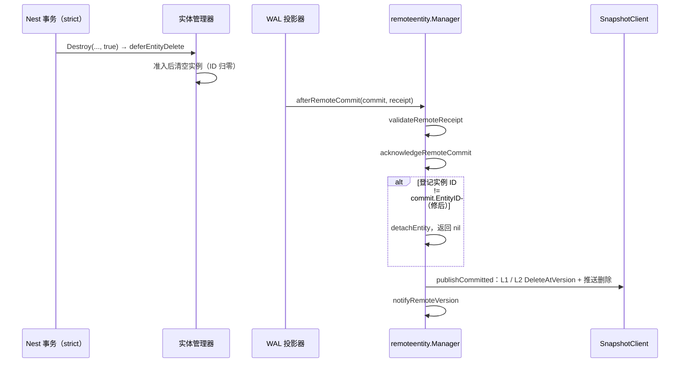
```mermaid
sequenceDiagram
  participant N as Nest 事务（strict）
  participant EM as 实体管理器
  participant P as WAL 投影器
  participant M as remoteentity.Manager
  participant C as SnapshotClient
  N->>EM: Destroy(..., true) → deferEntityDelete
  EM->>EM: 准入后清空实例（ID 归零）
  P->>M: afterRemoteCommit(commit, receipt)
  M->>M: validateRemoteReceipt
  M->>M: acknowledgeRemoteCommit
  alt 登记实例 ID != commit.EntityID（修后）
    M->>M: detachEntity，返回 nil
  end
  M->>C: publishCommitted：L1 / L2 DeleteAtVersion + 推送删除
  M->>M: notifyRemoteVersion
```

**5. 失败与不确定结果**

| 情形 | 处理 | 对调用方 |
| --- | --- | --- |
| 修前：实例已清空 | 生成代码身份核对拒绝，发布跳过 | `remote entity persistence outcome is indeterminate: Guild: remote acknowledgement identity mismatch` |
| 修后：实例已清空或已回收 | 摘登记，视为确认完成 | 成功；墓碑与推送删除发出 |
| 实例身份相符 | 原逻辑（版本向量、解冻） | 不变 |
| 回执过期（`remoteReceiptObsolete`） | 返回 nil | 不变 |

**6. 测试**

修前红（原样，出处 [修复记录](../../bugfix/RR-20261006-01.md)）：

```text
--- FAIL: TestRemoteDeleteCommitPublishesItsTombstoneAfterTheInstanceIsCleared (0.00s)
    remote_delete_ack_promises_test.go:93: the delete reached the authority but its acknowledgement failed: remote entity persistence outcome is indeterminate
        Guild: remote acknowledgement identity mismatch
```

真实链路探针原文（修前，出处 [问题记录](../../bug/RR-20261006-01.md)）：

```text
PROBE delete: [DELETEERR ... nest: finish remote write batch: remote entity persistence outcome is indeterminate: Guild: remote acknowledgement identity mismatch]
PROBE reader after 8s: [3]
PROBE ...:remote_entity:snapshot:0:238:4611686018525734841:1447779876:0: "... version\n3 ..."
PROBE mongo:            （两个集合都已空）
```

修后：同一用例通过——提交成功、发布一次 `DeleteRemoteSnapshot(key, NextVersion)`、缓存读到墓碑（修复记录“验证”）。真实链路 S4a / S4b：删除 26～36ms 到达只读方，切主后新起的只读方读到“不存在”，0 违例（MIRROR-STEP-6-LOCAL §3）。负对照：S4a 在修复之前“删除不发布，本场景红”（同 §3.1 表）。

**7. 性能证据**：无（不涉及热路径）。

**8. 未验证项与已知风险**：无外部验证项。确认的两条入口——批次内同步确认 `reconcileRemoteEntries`（`remoteentity/transaction_manager.go:518`，调用点 `:541`）与投影器稍后到达的 `afterRemoteCommit`（`:815`，调用点 `:819`）——都经同一个 `acknowledgeRemoteCommit`（`:996`）；修法与确认、清空的先后无关：实例还没清空时身份相符，走原有确认路径，已清空时按 `:1009` 摘掉并视为完成（源码核对）。所以 pipelined 带 Remote 批次与 Durability 0 不需要另一条修法；实测覆盖的是 strict 路径。包内 `testRemoteEntity.AcknowledgeRemoteCommit` 不核对身份，所以既有删除用例当初没暴露问题（问题记录“根因”末段）。

**9. review 检查点**

- [ ] 确认 `remoteentity/transaction_manager.go:1009` 的身份判定位于 `remoteReceiptObsolete`（`:1002`）之后，且 `detachEntity(live)` 只摘这个实例、不影响同 ID 新实例的登记。
- [ ] 确认实例被回收给别的实体（ID 非 0 但不同）时同样走摘除分支，不会 `SetRemoteVersionVector` 到别人身上。
- [ ] 确认 `publishCommitted` 的删除用 `commit.NextVersion`（`remoteentity/snapshot_client.go:411`、`:415`）与 `afterRemoteCommit` 的 `notifyRemoteVersion` 一致。
- [ ] 评估是否需要生成工程上的 pipelined 删除端到端用例。

<a id="rem-8"></a>
### REM-8 Mirror 第 6 步本机替代：私有依赖进程上的两进程故障与 v1.20.2 对照基准

> 首发 v1.22.0 · [说明](guide-saga-drv-dao-rem.md#rem-8)

**1. 提交**

| 提交 | 版本 | 内容 |
| --- | --- | --- |
| `2a4c835d` | v1.22.0 | 下一轮规划（第 3 项 Mirror 第 6 步本机替代） |
| `b15e70c8` | v1.22.0 | `scripts/mirror-local.sh`、`testdata/remoteflow/mirror_local_test.go`（S1～S7）、`remoteentity/mirror_local_bench_integration_test.go`、记录 |
| `4ca757aa` | v1.22.0 | 场景中发现并修复 RR-20261006-01（[REM-7](#rem-7)） |
| `8d010147` | v1.22.0 | 补第二次完整运行结果，规划标为已实施 |
| `db67b8ee` | v1.23.0（本版） | 脚本加 `test-core`、`fault redis-cluster-stop-replica` / `redis-cluster-cont`、副本端口导出；S1 报 `commit_ms` 等 |
| `d483238e` | v1.23.0（本版） | S1 夹具传进程代际，去掉“先等旧锁过期”绕行 |
| `ba13cb05` | v1.23.0（本版） | `cluster_replicas_online` 就绪判定（[REM-12](#rem-12)） |

**2. 改动文件与关键符号**

| `path:line` | 符号 | 职责 |
| --- | --- | --- |
| `scripts/mirror-local.sh:1` | 头注释 | 用法与隔离规则 |
| `scripts/mirror-local.sh:27`～`:40` | 根目录 / 偏移校验 | 拒绝 `~/.roost-it`、偏移 0 / 1000 |
| `scripts/mirror-local.sh:283` 起 | `fault_action` | `nats-kill/stop/cont/start`、`mongo-stepdown/settle`、Redis 单机 / Cluster 切主与暂停 |
| `scripts/mirror-local.sh:436`～`:456` | 命令分派 | `up/status/down/clean/fault/test/test-core/bench` |
| `codegen/internal/entity/testdata/remoteflow/mirror_local_test.go:97` | `TestGeneratedRemoteMirrorLocal` | S1～S7 编排（`ROOST_MIRROR_LOCAL=1` 才运行） |
| `codegen/internal/entity/testdata/remoteflow/mirror_local_test.go:849` | `TestGeneratedRemoteMirrorLocalProcess` | 子进程（owner / 只读方） |
| `remoteentity/mirror_local_bench_integration_test.go:172` / `:238` | `BenchmarkMirrorLocalRead` / `…Push` | 读与推送扇出基准（integration tag） |

**3. 不变量与强制点**（测试判据，只读方进程内自查，MIRROR-STEP-6 §3.2）：不回退（版本不低于此前最大）；不复活（读到“不存在”后再读到存在即违例）；有界收敛（确认时刻 T 之后超过 `T + cached_max_staleness + 1.5s` 仍读到旧值即违例）。违例打印 `MIRROR VIOLATION …`，编排要求 0 条；S4a′ 切到只计数。环境隔离由脚本强制（拒绝共享根目录与偏移）。

**4. 控制流**：`test` = `environment_up`（NATS 3 节点、Mongo 3 节点副本集、Redis 单机 + 副本 + toxiproxy、Redis 3 主 3 从 Cluster）→ `run_generated_tests`（`scripts/test-remote-generated.sh` 用正式生成器生成工程，`-race`）→ `finish`（`clean`：SIGCONT 暂停进程、停全部进程、核对无残留、删根目录）。`bench` = 同一基准文件复制到基线 worktree，当前与基线交替各跑 `ROOST_MIRROR_LOCAL_COUNT` 次，benchstat。

**5. 失败与不确定结果**（场景结论，原样摘自 MIRROR-STEP-6 §3.1 表）

| # | 注入 | 结果与收敛时间 |
| --- | --- | --- |
| S1 | owner 第二笔写在投影前被拖住，owner SIGKILL；同 WAL、同 sid 重启 | 重启就绪 574ms；v2 在就绪后 1.9s 读到；v3 3.0s 读到（都是陈旧上限 3s 回源，见 O-M6-1）；0 违例 |
| S2a | 只读方连着的 nats-2 SIGKILL | 本次流 leader 不在 nats-2：owner 无感，提交 → 读到 31ms。开发期一次 leader 恰在 nats-2：owner 4 次尝试 6.1s 才写成（首错 `nats: no response from stream`，回复为结果未知，见 O-M6-2），只读方随即读到 |
| S2b | nats-3 SIGSTOP 8s 后 SIGCONT | 2.98s 读到（L2 重新确认）；SIGCONT 后推送 34ms。第二次完整运行流 leader 恰在 nats-3：owner 6 次尝试 10.6s 才写成（首错 `nest: sync canceled context deadline exceeded`），写成后 1.4s 只读方读到（陈旧上限回源），SIGCONT 后 55ms |
| S3 | 只读方只经 toxiproxy，陈旧上限 60s | 基线 30ms；latency 200ms → 239ms；全部代理断开 5s 期间提交 → 恢复后 269ms 读到（共 5.3s，DeliverNew durable 续投）；timeout 毒丢数据 3s → 共 4.1s；之后 33ms |
| S4a | Redis 单机 graceful 切主；提交；删除；再切主；新读者 | 切主后提交 40ms 读到；删除 24ms 读到“不存在”；第二次切主后新读者读到“不存在”；0 违例（修复 RR-20261006-01 之前删除不发布，本场景红） |
| S4a′ | 单机未复制即切主 | 新读者约 2.9s（145 次读）读到已删除的 v1，之后回源 Mongo 得“不存在”；原读者（L1 有墓碑）0 次读到（O-M6-3） |
| S4b | Cluster SIGKILL 该键主节点 | 切主后提交 33ms 读到；删除 38ms；新读者读到“不存在”；0 违例 |
| S5 | owner 每 100ms 提交 60 笔，期间 `replSetStepDown` | owner 60/60 成功、最大延迟 48ms；权威回源 164/164 成功；最后版本 v61 读到（推送先于 owner 回复到达，−8ms） |
| S6 | owner A 转交 B | B 就绪 268ms，v3 34ms 读到；A 的写 `writer fenced`；B 第二笔 27ms |
| S7 | 只读方 SIGKILL，期间 owner 提交 v3，同 sid 重启 | 首读 v3 59ms（经 L2）；重启后推送 30ms；首载缓冲 0 次 |

**6. 测试**：完整运行两次 PASS（`-race`；rebase 前 107.5s，rebase 到 `a26c9454` 之后 111.7s），每次核对“无残留进程”（记录 §6）。RR-20261006-01 的修前红见 [REM-7](#rem-7)。根包 `TestGlobalEnvironmentOperationsHoldTheAcceptanceLock` 起初因脚本注释提到隔离环境脚本名而误报，注释改写（记录 §6）。

**7. 性能证据**（原样，出处 MIRROR-STEP-6 §4；n=6 交替，`goos: darwin`、`cpu: Apple M5`）

| 基准 | 口径 | v1.20.2 | 当前（v1.21.0 + 本轮） | benchstat |
| --- | --- | --- | --- | --- |
| Read/L1Hit（已确认、陈旧上限内） | 平均 / p50 / p99 每次读 | 720.5ns / 667ns / 1041ns | 731.6ns / 708ns / 959ns | 平均 ~（p=0.18）；p50 +6.15%（p=0.002，约 41ns）；p99 ~ |
| Read/L2Fetch（L1 无、L2 有） | 平均 / p50 / p99 | 24.60µs / 23.50µs / 50.79µs | 24.97µs / 23.73µs / 52.60µs | 均 ~ |
| Read/Authority（L1 / L2 都无，Monotonic 回源 Mongo） | 平均 / p50 / p99 | 125.6µs / 120.4µs / 270.5µs | 128.4µs / 121.9µs / 286.5µs | 平均 ~（p=0.093）；p50 +1.28%（p=0.041）；p99 ~ |
| 回源次数 | 权威加载 / 每次读 | L1Hit 0、L2Fetch 0、Authority 1.000 | 同左 | 相等 |
| Push 扇出 1 读者 × 10 key | 一轮全部读到（平均 / p50 / p99） | 1.841ms / 1.777ms / 2.335ms | 1.852ms / 1.808ms / 2.721ms | 均 ~ |
| Push 扇出 10 读者 × 10 key | 同上 | 4.036ms / 4.017ms / 4.762ms | 4.063ms / 4.009ms / 5.090ms | 均 ~ |
| Push 扇出 100 读者 × 10 key | 同上 | 26.06ms / 25.89ms / 33.04ms | 25.42ms / 24.94ms / 35.26ms | 均 ~ |

结论：读延迟、回源次数、推送扇出与 v1.20.2 无可分辨差别；L1 命中 p50 多约 41ns（原因未逐项拆分）。macOS 绝对值不能外推到 Linux。

**8. 未验证项与已知风险**：E01、E02、E14、E15、E16（见说明）。原始输出不入库（记录 §7：scratchpad 的 `m6-artifacts`）。S2 的 owner 侧数字取决于流 leader 落在哪个节点，两次运行差很多。

**9. review 检查点**

- [ ] 确认 `scripts/mirror-local.sh` 的隔离校验（`:27`～`:40`）在 `ROOST_MIRROR_LOCAL_HOME` 是 `~/.roost-it` 的符号链接时也拒绝（用了 `pwd -P`）。
- [ ] 确认 `clean` 先 SIGCONT 被暂停的进程再停（否则 SIGSTOP 的进程停不掉），并核对无残留的判定覆盖 toxiproxy。
- [ ] 确认只读方“有界收敛”判据的 1.5s 余量与 `cached_max_staleness` 的关系在 `mirror_local_test.go` 里按配置值计算，而不是写死。
- [ ] 确认 S4a′ 切到只计数模式的条件只用于该边界场景，不会把其他场景的违例吞掉。
- [ ] 确认基准对照只用两个版本都有的入口（记录 §4：`Assemble` / `Assembly.Start` / `Manager.ReadRemoteSnapshot` / `afterRemoteCommit`）。

<a id="rem-9"></a>
### REM-9 O-M6-1 owner 启动广播“请重新续租兴趣”

> 首发 v1.23.0（本版） · [说明](guide-saga-drv-dao-rem.md#rem-9)

**1. 提交**

| 提交 | 版本 | 内容 |
| --- | --- | --- |
| `fa98f53f` | v1.23.0（本版） | 记录第十轮决定 |
| `db67b8ee` | v1.23.0（本版） | `remoteentity/interest_refresh.go`（新）、`renewInterest(refresh)` 唯一续租入口、`Start` 第三个订阅、`Assembly.Start` 发请求；用例。同一提交还有 O-M6-3（DRV 主题） |
| `d1d6d967` | v1.23.0（本版） | DECISIONS-PENDING 第十轮标为已实施 |

**2. 改动文件与关键符号**

| `path:line` | 符号 | 职责 |
| --- | --- | --- |
| `remoteentity/interest_refresh.go:26` | `SyncTopicInterestRefresh` | `"remote_entity_interest_refresh"` |
| `remoteentity/interest_refresh.go:30` | `interestRefreshMinGap` | 1s |
| `remoteentity/interest_refresh.go:38` | `remoteInterestRefreshWire` | `requester_sid`、`requested_at` |
| `remoteentity/interest_refresh.go:44` | `remoteInterestRefreshReplicaKey` | `int64(uint32(sid)) + 1` |
| `remoteentity/interest_refresh.go:49` | `requestInterestRefresh` | owner 发请求（只在 push 开着时），计 `interest_refresh_sent_total{result}` |
| `remoteentity/interest_refresh.go:81` | `InterestRefreshStore.ApplyReplica` | 身份核对、丢自己的（`:97`）与过期的（`:100`） |
| `remoteentity/interest_refresh.go:116` | `acceptInterestRefresh` | 单飞 / 合并 |
| `remoteentity/interest_refresh.go:135` | `runInterestRefresh` | 间隔、循环到无待办 |
| `remoteentity/interest_refresh.go:185` | `refreshInterestsOnce` | 遍历本机仍有效的 key，`renewInterest(ctx, key, true)` |
| `remoteentity/snapshot_client.go:258` | `renewInterest` | 唯一续租入口；refresh 时只续仍有效的 key（`:274`） |
| `remoteentity/snapshot_client.go:438` | `bindLocked` | push 时建 `refreshRep = mirror.NewLive(...)` |
| `remoteentity/snapshot_client.go:482` | `Start` | push 时启动第三个订阅，失败逐步回收 |
| `remoteentity/assemble.go:179` | `Assembly.Start` | `snapshots.Start` 之后、存储初始化之前调用 `requestInterestRefresh`，失败只 Warn |

**3. 不变量与强制点**

- 续租只有一个入口 `renewInterest`（`remoteentity/snapshot_client.go:258`）：代际锁内分配、本机按 O4 配额判定、撤销水位都不被绕过。守卫：`TestInterestRefreshRenewsOnlyLiveInterests`。
- 遍历不复活已 release / 已过期的 key：条带锁内重查本机表（`remoteentity/snapshot_client.go:274`）。守卫同上。
- 有界：同一时刻至多一个遍历，进行中的请求只置待办（`remoteentity/interest_refresh.go:118`），两次开始间隔 ≥ 1s（`:139`）。守卫：`TestInterestRefreshRequestsCoalesceAndAreValidated`。
- 停机：遍历持 `work` 准入（`:123`、`:136`），`Stop` 取消 `stopCtx`。守卫：`TestInterestRefreshGapWaitEndsOnStop`。
- 推送关着时不订阅、不发送（`requestInterestRefresh`，`remoteentity/interest_refresh.go:50`；`Start`，`remoteentity/snapshot_client.go:482`）。守卫：`TestInterestRefreshNeedsPushAndToleratesOldConsumers`。
- 订阅失败逐步回收。守卫：`TestSnapshotClientRefreshSubscriptionFailureLeavesNoSubscription`。

**4. 控制流**

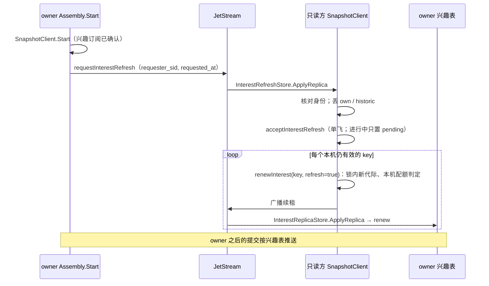
```mermaid
sequenceDiagram
  participant O as owner Assembly.Start
  participant Bus as JetStream
  participant R as 只读方 SnapshotClient
  participant OI as owner 兴趣表
  O->>O: SnapshotClient.Start（兴趣订阅已确认）
  O->>Bus: requestInterestRefresh（requester_sid, requested_at）
  Bus->>R: InterestRefreshStore.ApplyReplica
  R->>R: 核对身份；丢 own / historic
  R->>R: acceptInterestRefresh（单飞；进行中只置 pending）
  loop 每个本机仍有效的 key
    R->>R: renewInterest(key, refresh=true)：锁内新代际、本机配额判定
    R->>Bus: 广播续租
    Bus->>OI: InterestReplicaStore.ApplyReplica → renew
  end
  Note over O,OI: owner 之后的提交按兴趣表推送
```

**5. 失败与不确定结果**

| 情形 | 处理 | 对调用方 |
| --- | --- | --- |
| owner 发送失败 | Warn，计 `interest_refresh_sent_total{result=error}` | 启动不失败；退化到原续租周期 |
| 请求身份不符 | 计 `invalid`，返回错误 | 复制 handler 收到错误 |
| 请求过期 / 自己发的 | 计 `historic` / `own`，忽略 | 无 |
| 遍历进行中再来请求 | 计 `coalesced`，结束后再做一次 | 无 |
| 客户端已停 | 计 `stopped`（源码有，记录未列） | 无 |
| 遍历中部分 key 续租失败 | Warn `interest refresh could not renew every interest …` | 这些 key 按常规续租收敛 |

**6. 测试**

| 用例 | 文件 | 覆盖 |
| --- | --- | --- |
| `TestOwnerRestartWithTheSameSidGetsInterestBackWithoutWaitingForRenewal` | `remoteentity/interest_refresh_promises_test.go` | 同 sid 重启后 `Assembly.Start` 返回时兴趣已恢复 |
| `TestInterestRefreshRenewsOnlyLiveInterests` | 同上 | 不复活已 release / 过期 key，用新代际 |
| `TestInterestRefreshRequestsCoalesceAndAreValidated` | 同上 | 合并、过期 / 自己的不触发、身份不符被拒 |
| `TestInterestRefreshGapWaitEndsOnStop` | 同上 | 间隔等待中 Stop 不挂住 |
| `TestInterestRefreshNeedsPushAndToleratesOldConsumers` | 同上 | 推送关着时不订阅不发送；无订阅者时 owner 照常启动 |
| `TestSnapshotClientRefreshSubscriptionFailureLeavesNoSubscription` | 同上 | 订阅失败回收 |

修前红（原样，出处 [MIRROR-M6-OBSERVATIONS §6.2](../../feature/MIRROR-M6-OBSERVATIONS-2026-10-06.md)；基线 `fa98f53f` 的 detached worktree，红用例文件未入库）：

```text
--- FAIL: TestOwnerRestartWithTheSameSidGetsInterestBackWithoutWaitingForRenewal (0.00s)
    interest_refresh_red_test.go:127: after the owner restarted with the same sid the reader still reads v1, want v2 pushed right away: the restarted owner's interest table is empty (interested=false) and the reader renews only past half its lease
```

修后：整条用例通过；既有 Assembly 生命周期用例的订阅数从 2 改为 3（`liveSubscriptions`）。

**7. 性能证据**（原样，出处同 §6.3；私有环境，同机，基线与本分支各起一套）

| 场景 | 指标 | 基线 `fa98f53f` | 本分支 |
| --- | --- | --- | --- |
| S1 owner 强杀、同 sid 重启 | 重放补发的 v2：重启就绪 → 只读方读到 | 1895ms（陈旧上限回源） | −24ms（推送先于就绪信号到达） |
| S1 | 重启后的写 v3：确认之后只读方还要等多久（`visible_after_confirm_ms`；写本身 45 / 46ms） | 2246ms（陈旧上限回源） | −5ms（推送先于回复） |
| S1 | 只读方计数 | errors=0、违例 0、权威回源 0 | errors=0、违例 0、权威回源 0 |
| S7 只读方强杀、同 sid 重启 | 首读 v3 / 重启后推送 | 71ms / 33ms | 75ms / 29ms |

**8. 未验证项与已知风险**

- 过期判定用接收方 `time.Now()` 减发送方 `requested_at`（`remoteentity/interest_refresh.go:100`），跨主机时钟偏差未验证（E02）。
- 指标口径：源码结果值含 `stopped`（`remoteentity/interest_refresh.go:125`），owner 侧另有 `interest_refresh_sent_total`（`:73`）；MIRROR-M6-OBSERVATIONS §2 与 T-278 已按源码补上（fixr）。
- 多主机强杀重启：E13。

**9. review 检查点**

- [ ] 确认 `refreshInterestsOnce` 对每个 key 走 `renewInterest(ctx, key, true)` 而不是直接广播（`remoteentity/interest_refresh.go:201`），因而 O4 配额与撤销水位都生效。
- [ ] 确认 `renewInterest` 的 refresh 分支在条带锁内、`nextInterestGeneration()` 之后才判断“仍有效”（`remoteentity/snapshot_client.go:272`～`:278`）：被跳过的 key 也消耗了一个代际号；确认代际只被用来比较新旧（撤销水位、溢出水位都只比大小），没有别处依赖代际连续。
- [ ] 确认 `runInterestRefresh` 的间隔从 `refreshLastStart` 算起、首次遍历 `refreshLastStart` 为零值时不等待（`remoteentity/interest_refresh.go:139`）。
- [ ] 确认 `Assembly.Start` 中请求在 `SnapshotClient.Start` 之后（`remoteentity/assemble.go:167` → `:179`），且启动后续失败时 `unsubscribe` 退掉第三个订阅（`remoteentity/snapshot_client.go:508`）。
- [ ] 确认 `RemoteMirrorMod.Start` 不调 `requestInterestRefresh`（`kit/remoteentity/remote_mirror_mod.go:164`）。

<a id="rem-10"></a>
### REM-10 O-M6-6 同 sid 重启立即接管上一代进程留下的 Remote 实体锁

> 首发 v1.23.0（本版） · [说明](guide-saga-drv-dao-rem.md#rem-10)

**1. 提交**

| 提交 | 版本 | 内容 |
| --- | --- | --- |
| `e65f1cb6` | v1.23.0（本版） | 记录第十一轮决定 |
| `d483238e` | v1.23.0（本版） | `app.SingletonIncarnation` / `ModSingletonIncarnation`；`remoteentity.ProcessIncarnation`、`AssemblyDeps.Incarnation`、锁工厂带代际、取锁 Lua 接管分支、计数；kit 传入；用例；S1 夹具 |
| `8a292a5a` | v1.23.0（本版） | DECISIONS-PENDING 第十一轮标为已实施 |

**2. 改动文件与关键符号**

| `path:line` | 符号 | 职责 |
| --- | --- | --- |
| `app/singleton.go:80` | `SingletonIncarnation` | `{Key, Sid, Token}` |
| `app/singleton.go:90` | `ModSingletonIncarnation` | `"singleton_incarnation"`，只在 `singleton.enabled=true` 时登记 |
| `app/singleton.go:634-635` | `openSingleton` 登记 | token 取锁值第一段 |
| `kit/remoteentity/remote_entity_mod.go:122` | `Provide` | `Sid == localSid` 时传 `deps.Incarnation` |
| `remoteentity/assemble.go:28` | `AssemblyDeps.Incarnation` | 非 nil 时校验并装到锁工厂（`:113`～`:118`） |
| `remoteentity/versioned_lock.go:550` | `ProcessIncarnation` | `{Holder, Token}` |
| `remoteentity/versioned_lock.go:562` | `lockIncarnation` | `scope` / `self` 前缀 |
| `remoteentity/versioned_lock.go:568` | `newLockIncarnation` | 校验 sid、Holder、Token（1～64 位字母数字 `-` `_`）；摘要 = SHA-256 前 8 字节十六进制 |
| `remoteentity/versioned_lock.go:597` | `noteTakeover` | `remote_entity.lock_takeover_total` + 每 Assembly 一次 Info |
| `remoteentity/versioned_lock.go:633`～`:636` | `NewVersionedLock` | 代际前缀放在锁对象前缀之前 |
| `remoteentity/versioned_lock.go:138` | `TryLock` | ARGV[5] / ARGV[6] 交给 Lua；第 4 项回报为 1 时计数（`:151`～`:153`） |
| `remoteentity/versioned_lock_lua.go:16` | `versionedTryLockLua` | 接管判定（`:24`）与 owner 不存在 / 更早序号同一分支（`:27`） |

**3. 不变量与强制点**

- 只接管“同一单实例锁持有者的上一代”：owner 以 `scope` 开头且不以 `self` 开头（Lua `:24`）。原子：判定与换 owner 在一条 Lua 里。
- 接管 = TTL 过期后取锁：先 `INCR` fence 再写 owner（Lua `:29`～`:34`），fence 单调；随后 `GrantWrite(新 token)` 递增 Mongo `_grant_fence`，上一代许可作废。
- 只有持单实例锁的进程才传代际：kit 只在 `ModSingletonIncarnation` 存在且 sid 一致时传（`kit/remoteentity/remote_entity_mod.go:122`）。
- 守卫：`TestSameSidRestartTakesOverThePreviousIncarnationsSharedLock`、`TestLockTakeoverOnlyAppliesToThePreviousIncarnationOfTheSameSingletonHolder`、`TestAssembleRejectsAMalformedIncarnation`（`remoteentity/lock_takeover_promises_test.go`）、`TestSingletonIncarnationIsTheHeldLocksIdentity`（`app/singleton_incarnation_promises_test.go`）、`TestRemoteEntityModPassesTheSingletonIncarnationToTheLocks`（`kit/remoteentity/lock_incarnation_promises_test.go`）、`TestMirrorLocalSameSidRestartTakesOverTheOldIncarnationsLock`（`remoteentity/lock_takeover_integration_test.go`）。

**4. 控制流**

```mermaid
flowchart TD
  T["TryLock：token = self + 锁对象前缀 + 序号"] --> E["Eval versionedTryLockLua(ARGV3 前缀, ARGV4 序号, ARGV5 scope, ARGV6 self)"]
  E --> O{"owner"}
  O -- "不存在（TTL 过期）" --> A["INCR fence，HSET owner，PEXPIRE"]
  O -- "本锁对象更早序号" --> A
  O -- "以 scope 开头且不以 self 开头（上一代）" --> A2["同一分支，回报第 4 项 = 1"]
  O -- "别的 sid / 服务类型 / 前缀、本代、旧格式" --> N["返回 0：NotAcquired，照旧等 TTL"]
  A --> G["GrantWrite(新 token)：Mongo _grant_fence 递增"]
  A2 --> C["noteTakeover：计数 + 首次 Info"] --> G
```

**5. 失败与不确定结果**

| 情形 | 处理 | 对调用方 |
| --- | --- | --- |
| Incarnation 格式错误 | `Assemble` 失败 | `ErrVersionedLockConfig` |
| `singleton.enabled=false` | 不传代际，旧格式 token | 按 TTL 等待（不变） |
| 上一代仍有在途提交（卡住后恢复） | `CommitRemote` 要求 `_grant_fence` 等于它的 fence | 上一代被确定拒绝（`remote entity: state version conflict`） |
| 上一代 Touch / Refresh / Unlock | Lua 要求 owner 等于自己 token | 过期 / 未持有，不改动新一代 |
| 旧进程卡住恢复后反向接管 | 新进程那一笔被 Mongo fence 确定拒绝，下次取锁再接管 | 至多持续到旧进程 fail-stop |
| 取锁回复丢失 | owner 是本锁对象 token，下次按 RR-20261004-01 取回 | 不变 |

**6. 测试**：修前红（原样，出处 [MIRROR-M6-OBSERVATIONS §7.5](../../feature/MIRROR-M6-OBSERVATIONS-2026-10-06.md)；基线 worktree，红用例文件未入库）：

```text
--- FAIL: TestRedSameSidRestartFirstLockWaitsForTheOldProcesssLease (0.01s)
    lock_takeover_red_test.go:98: the restarted same-sid process's first lock = versioned lock not acquired after 7ms, want it acquired right away (the old process is dead; its lease runs for lock_ttl 3s)
```

```text
    lock_takeover_red_integration_test.go:69: the restarted same-sid process's first TryLock = versioned lock not acquired, want it to take over the dead process's lease (lock_ttl 3s)
--- FAIL: TestMirrorLocalSameSidRestartTakesOverTheOldIncarnationsLock (0.20s)
```

```text
    mirror_local_test.go:418: the first write after the restart took 2408ms (lock_ttl 3s): it waited for the killed owner's lease instead of taking it over (O-M6-6)
--- FAIL: TestGeneratedRemoteMirrorLocal/S1_owner_kill_restart_wal_replay (4.71s)
```

修后（原样，同出处）：

```text
MIRROR O-M6-6: restarted same-sid TryLock took 9ms (lock_ttl 3s); fence 1 -> 2; old grant commit: remote entity: state version conflict
--- PASS: TestMirrorLocalSameSidRestartTakesOverTheOldIncarnationsLock (0.29s)
--- PASS: TestMirrorLocalTombstoneSurvivesAFailoverOnlyWithWait (10.24s)
--- PASS: TestMirrorLocalTombstoneWaitOnClusterGoesToTheKeysPrimary (0.81s)
```

```text
MIRROR6 .../S1_owner_kill_restart_wal_replay owner_restart_ready_ms=566 replayed_v2_converge_ms=-19
MIRROR6 .../S1_owner_kill_restart_wal_replay first_write_started_after_kill_ms=566 (lock_ttl 3s)
MIRROR6 .../S1_owner_kill_restart_wal_replay after_restart_commit_v3 commit_ms=33 converge_ms=25 visible_after_confirm_ms=-8
MIRROR6 .../S1_owner_kill_restart_wal_replay reader_stats loads=0 errors=0 reads=182
--- PASS: TestGeneratedRemoteMirrorLocal/S1_owner_kill_restart_wal_replay (4.38s)
```

对照（不接管）：同一用例里别的 sid、同 sid 未启用单实例锁、旧格式 token、同一代另一个锁对象都是 NotAcquired。

**7. 性能证据**：S1 重启后第一笔写修前 2408ms（等旧租约）→ 修后 33ms，无多写（CHANGELOG / 记录）。取锁脚本多两个参数、零额外往返。

**8. 未验证项与已知风险**：旧进程卡住恢复后的反向接管边界（见说明）；core `DefaultConfig.LockTTL` 24h 且未开单实例锁的装配不受益；多主机强杀 E13、多机 Cluster 锁 Lua E08。

**9. review 检查点**

- [ ] 确认 Lua 接管判定（`remoteentity/versioned_lock_lua.go:24`）要求 `not earlier`，且本代自己留下的 token（以 `self` 开头）不被接管，对照 `TestLockTakeoverOnlyAppliesToThePreviousIncarnationOfTheSameSingletonHolder` 的“同一代另一个锁对象”子用例。
- [ ] 确认旧格式 token（`crand.Text` base32 大写开头）不可能以 `~` 开头，`Token` 字符集（`remoteentity/versioned_lock.go:578`～`:581`）排除 `~`，前缀判定无歧义。
- [ ] 确认 kit 只在 `incarnation.Sid == m.localSid` 时传（`kit/remoteentity/remote_entity_mod.go:122`），`NewRemoteEntityMod(sid)` 显式给了别的 sid 时不传。
- [ ] 确认接管后 `GrantWrite` 失败时走 `versionedAbandonLua` 只清本 token（记录 §7.5“组合契约复核”），上一代 owner 不被恢复。
- [ ] 确认 `noteTakeover` 在 `i == nil` 时仍计数但不 panic（`remoteentity/versioned_lock.go:598`～`:601`）。

<a id="rem-11"></a>
### REM-11 L2 落后于权威的上界（保持，写明上界）

> 首发 v1.23.0（本版，文档） · [说明](guide-saga-drv-dao-rem.md#rem-11)

**1. 提交**

| 提交 | 版本 | 内容 |
| --- | --- | --- |
| `78e26853` | v1.23.0（本版） | 记录第十二轮决定 |
| `88f33776` | v1.23.0（本版） | B2 §7 与 USER_GUIDE 写明上界（代码不变） |
| `8059b877` | v1.23.0（本版） | 收尾第 1 批与第十二轮文档类决定标为已实施 |

**2. 改动文件与关键符号**（上界由以下源码决定；本条无代码改动）

| `path:line` | 符号 | 职责 |
| --- | --- | --- |
| `remoteentity/snapshot_l2.go:70` | CAS 脚本 `PEXPIRE` | 每次成功写（含同版本同值重写）重设 TTL |
| `remoteentity/snapshot_l2.go:98` | 墓碑脚本 `PEXPIRE` | 墓碑同 TTL |
| `remoteentity/config.go:86` | `DefaultConfig.SnapshotL2TTL` | 5m |
| `kit/remoteentity/config.go:25-26` | 声明的 `example` | `cached_max_staleness: 30s`、`snapshot_l2_ttl: 10m`，经 `codegen/internal/roost/kitconfig_gen.go:288-289` 写进生成配置（A4 ① 之后；之前是 `catalog.go` 里手写的模板字符串） |
| `entity/remote_snapshot.go:792`～`:808` | `refresh` 的 L2 无值分支 | L1 有快照而 L2 无值 → 回源权威 |
| `entity/remote_snapshot.go:767`～`:782` | `refresh` 的“L1 比 L2 新”分支 | owner 自己下一次读补写 L2 |

**3. 不变量与强制点**：上界 = `snapshot_l2_ttl`（L2 记住旧值的最长时间）+ `cached_max_staleness`（读者最后一次确认后还能交出的时间）。没有后台补写，靠 owner 下一次读（`refresh` 补写）、复制更新 / 删除在每个接收节点写 L2、下一笔提交写 L2。无专门守卫测试（文档决定）；相关行为由 `TestB2PublisherRepairsALostL2Write`、`TestB2LostL2DeleteIsRepairedByTheNextRead` 钉住。

**4. 控制流**：1）owner 提交，L2 写失败 / 结果未知 → owner L1 记新版本但未确认；2）读者重新确认读到 L2 的旧值（同值 → 改记确认）；3）owner 下一次读 → `refresh` 发现 L1 比 L2 新 → `admitLocked` 补写；或 4）L2 键在最后一次写入后 `snapshot_l2_ttl` 过期 → 读者重新确认时 L2 无值 → 回源权威。

**5. 失败与不确定结果**

| 情形 | 处理 | 对调用方 |
| --- | --- | --- |
| owner 写 L2 失败且之后不再读 / 不再提交、无推送 | L2 旧值存活到 TTL | 读者最长 `snapshot_l2_ttl + cached_max_staleness` 读到旧值 |
| 推送开着 | 接收节点写 L2 | 通常更早修好 |
| Linearizable | 每次读权威 | 不受影响 |

**6. 测试**：无新增（文档决定）。

**7. 性能证据**：无。

**8. 未验证项与已知风险**

- 上界口径：core `DefaultConfig`（`snapshot_l2_ttl` 5m + `cached_max_staleness` 30s）约 5m30s；生成配置 `snapshot_l2_ttl: 10m`（kit 声明的 `example`，`kit/remoteentity/config.go:26`）约 10m30s。USER_GUIDE、B2 §7 与 DECISIONS 已分开写明（fixr）。
- “最后一次写进 L2”包括同值重写：读者重新确认读到同值时只改记确认时刻、不写 L2（`entity/remote_snapshot.go:760`～`:771`），读者不会续命 L2 的旧值；但 L2 的 CAS 脚本对同版本同值同样 `HSET` + `PEXPIRE`（`remoteentity/snapshot_l2.go:66-71`），L1 冷的节点在 O5 窗口内收到旧值的复制消息会把旧值写回并续期。O5 丢弃发布超过 `snapshot_l2_ttl / 2` 的快照更新，所以这种续期最晚发生在旧值发布后 `snapshot_l2_ttl / 2`，从旧值发布起算的最坏上界约 1.5 × `snapshot_l2_ttl` + `cached_max_staleness`（源码核对；发生条件是新版本的复制消息没有到达这些节点，推送开着时新版本的复制消息会把 L2 修好）。

**9. review 检查点**

- [ ] 确认“读者不会给 L2 旧值续期”：`refresh` 同值分支（`entity/remote_snapshot.go:755`）只 `setL1Locked`，不调 `admitLocked` / L2。
- [ ] 核对第 8 节“同值 CAS 续期”的推导：L1 冷节点在 O5 窗口内收到旧值的复制消息会把旧值写回 L2 并续期（CAS 脚本 `remoteentity/snapshot_l2.go:66`～`:70`），O5 的丢弃阈值 `snapshot_l2_ttl / 2`（`remoteentity/syncer.go:126`）决定续期最晚发生在旧值发布后多久；确认“从旧值发布起算约 1.5 × `snapshot_l2_ttl` + `cached_max_staleness`、从最后一次写进 L2 起算仍是 `snapshot_l2_ttl + cached_max_staleness`”两种起算口径都成立。
- [ ] 确认 USER_GUIDE（`docs/USER_GUIDE.md:347`）与 B2 §7 分开写明了 core 缺省（约 5m30s）与生成模板（`snapshot_l2_ttl: 10m`，约 10m30s）两种上界（`155b9f91`），并与本条第 8 节“同值 CAS 也续期”的起算口径一致。
- [ ] 确认 `snapshot_l2_ttl` 调小的代价（墓碑寿命同时变短）写进了说明。

<a id="rem-12"></a>
### REM-12 Redis Cluster 迁槽（ASK / MOVED）下 L2 读写与墓碑 WAIT 实测；mirror-local Cluster 就绪判定

> 首发 v1.23.0（本版） · [说明](guide-saga-drv-dao-rem.md#rem-12)

**1. 提交**

| 提交 | 版本 | 内容 |
| --- | --- | --- |
| `ba13cb05` | v1.23.0（本版） | 新增 `remoteentity/cluster_slot_migration_integration_test.go`；`scripts/mirror-local.sh` 加 `cluster_replicas_online`；记录（同一提交还有示例实跑门禁、saga 用例时序修复等，属其他主题） |

**2. 改动文件与关键符号**

| `path:line` | 符号 | 职责 |
| --- | --- | --- |
| `remoteentity/cluster_slot_migration_integration_test.go:32` | `TestMirrorLocalClusterSlotMigrationSnapshotReadWriteAndTombstone` | ASK / MOVED / 迁回 |
| `remoteentity/cluster_slot_migration_integration_test.go:256` | `existsAsking` | 在 IMPORTING 节点同连接先发 ASKING 再查键 |
| `scripts/mirror-local.sh:103` | `cluster_replicas_online` | 每个主节点有 `state=online` 的副本 |
| `scripts/mirror-local.sh:122` | `cluster_up` | 加等待 `cluster_replicas_online`（30s） |
| `remoteentity/snapshot_l2.go:357` | `recordTombstoneWait` | 结果分类（被测，属 DRV-4） |

**3. 不变量与强制点**：迁槽期间 L2 读写落到键实际所在节点、墓碑不丢、旧版本写不能复活；墓碑脚本遇重定向不 WAIT（计 `skipped`）。由测试断言（`:141`～`:142` ASK、`:161`～`:162` MOVED）。环境就绪判定由脚本强制。

**4. 控制流**：1）写 v1；2）ASK：源 `MIGRATING`、目标 `IMPORTING`、`MIGRATE` 键到目标 → HGET 跟随 ASK、写脚本跟随 ASK（源上不重建键）、墓碑脚本在源上回 ASK → 退回集群客户端普通发送一次（`skipped`），墓碑落在目标，之后旧版本写被拒；3）MOVED：`SETSLOT NODE` 完成迁移、客户端槽位表仍指向源 → 墓碑 `skipped`、写读跟随 MOVED；槽位表刷新后墓碑 WAIT 打到新主（`confirmed`）；4）槽位迁回源后读写照常。

**5. 失败与不确定结果**

| 情形 | 处理 | 结果 |
| --- | --- | --- |
| 墓碑遇 ASK / MOVED | 普通发送一次，不 WAIT | `skipped` 计数，墓碑落在目标 |
| 副本未 online（修前环境） | `ROLE` 不列副本 | WAIT 按 `no_replicas` 跳过，既有用例单独跑必红 |
| “键还在源上、槽位 MIGRATING” | 命令直接在源上执行 | 未单列 |

**6. 测试**

| 用例 | 文件 | 覆盖 |
| --- | --- | --- |
| `TestMirrorLocalClusterSlotMigrationSnapshotReadWriteAndTombstone` | `remoteentity/cluster_slot_migration_integration_test.go:32` | 新增 |
| `TestMirrorLocalTombstoneWaitOnClusterGoesToTheKeysPrimary` | `remoteentity/snapshot_l2_tombstone_wait_integration_test.go` | 既有，就绪判定修复后单独跑也绿 |

环境缺口修前红（原样，出处 [PRERELEASE-VERIFICATION §4b](../../bugfix/PRERELEASE-VERIFICATION-2026-10-06.md)）：

```text
snapshot_l2_tombstone_wait_integration_test.go:319: WAIT calls on 127.0.0.1:37401 went up by 0, want 1 (the key's primary is 127.0.0.1:37401)
```

修后：`ROOST_MIRROR_LOCAL_HOME=<scratch> ROOST_MIRROR_LOCAL_CORE_RUN='^TestMirrorLocalClusterSlotMigration|^TestMirrorLocalTombstoneWaitOnClusterGoesToTheKeysPrimary$' scripts/mirror-local.sh test-core` → 两条 PASS；默认集合（`^TestMirrorLocal`，5 条）全部 PASS；最终 stats `{Confirmed:1 Skipped:2}`（同出处，原始输出在主检出被忽略的 `artifacts/perf/relprep-20261006/item4-*.out`，不入库）。新用例本身是验证（产品行为原本正确），没有修前红。

**7. 性能证据**：无。

**8. 未验证项与已知风险**

- 用例的 ASK 窗口只构造“键已搬到目标”；“键还在源上、槽位 MIGRATING”时 Redis 对源上存在的键照常执行、不重定向，走的是与无迁移时相同的路径（Cluster 用例 `TestRealB2WatermarkMatrixCluster` 等覆盖）。
- 指标标签：源码 `recordTombstoneWait` 只有 `confirmed|short|no_replicas|error|skipped`（`remoteentity/snapshot_l2.go:377`～`:379`，统计字段 `Skipped`），MIRROR-M6-OBSERVATIONS §3 已按源码更正（fixr）。
- `cluster_replicas_online` 只看 `slave0:` 一行（`scripts/mirror-local.sh:108`），每主一个副本时等价于“至少一个 online 副本”。
- 多机 Cluster：E08；异步复制丢写：E10。

**9. review 检查点**

- [ ] 确认 MOVED 阶段的 `skipped` 断言只在客户端槽位表确实过期（`stale`）时才检查（`remoteentity/cluster_slot_migration_integration_test.go:161`），表已刷新时用例不误报也不漏测。
- [ ] 确认测试在迁槽后、读写前没有手工刷新槽位表而掩盖 MOVED 路径（`:170` 注释写的是环境就绪等待）。
- [ ] 确认 `cluster_replicas_online` 的 30s 上限与 `cluster_ok` 顺序（`scripts/mirror-local.sh:121`～`:122`）在冷启动时足够。
- [ ] 墓碑 WAIT 的设计、`EvalReplicated` 的重定向退化与指标标签见 [DRV-4](impl-saga-drv-dao-rem.md#drv-4)，确认两处文档对 `skipped` 的叫法一致。

<a id="rem-13"></a>
### REM-13 生成配置写出 remote_entity 新键（收尾第 2 批 A8）

> 首发 v1.23.0（本版） · [说明](guide-saga-drv-dao-rem.md#rem-13)

**1. 提交**

| 提交 | 版本 | 内容 |
| --- | --- | --- |
| `fcc78ad0` | v1.23.0（本版） | `catalog.go` 模板加五个键与注释；`render.go` 的 `streamReplicasLine` 只替换独占一行的 `replicas: 1`；两条生成用例（同一提交还有 A9 / A11 / A15 / A17，属其他主题） |
| `94548913` | v1.23.0（本版） | 记录与 DECISIONS-PENDING 标为已实施 |
| `d1226825` | v1.23.0（本版） | A4 ①：生成配置段改由 kit Mod 的配置声明渲染（属 CFG 主题），五个键的取值与注释改由声明的 `example` / `help` 给出，两条生成用例原样通过 |

**2. 改动文件与关键符号**

| `path:line` | 符号 | 职责 |
| --- | --- | --- |
| `kit/remoteentity/config.go:25` / `:29-30` / `:34` / `:142` | 五个键的声明（`example` 与 `help`） | 本版 A4 ①（`d1226825`）之后生成配置段由声明渲染：标了 `example` 的键（`Starter`）写进配置，`help` 写成注释；`fcc78ad0` 当时是在 `catalog.go` 的模板字符串里手写这五个键 |
| `codegen/internal/roost/kitconfig_gen.go:288-302` | 声明快照 | `go generate ./...` 从 kit 声明生成；`modConfigSection`（`codegen/internal/roost/catalog.go:23-25`）按它渲染 |
| `codegen/internal/roost/render.go:651` | `streamReplicasLine` | `(?m)^([ \t]*)replicas: 1$` |
| `codegen/internal/roost/render.go:658` | 生产化替换 | 只把匹配行改成 `replicas: 3` |
| `codegen/internal/roost/remote_entity_config_keys_promises_test.go` | `TestGeneratedRemoteEntitySectionCarriesTheSnapshotKeys` | 开发 / 生产两份配置带五个键 |
| `codegen/internal/roost/generated_config_validation_promises_test.go` | `TestGeneratedConfigsPassStrictAndProductionValidation` | 生成工程里注入检查：键都设置、取值等于 `DefaultConfig` / kit 缺省、`ValidateServiceConfig` 与两个 Mod 的 `Init` 都接受 |

**3. 不变量与强制点**：生成配置的取值与 core `DefaultConfig` / kit 缺省一致（守卫：`TestGeneratedConfigsPassStrictAndProductionValidation`）；生产化不改墓碑 WAIT 副本数（守卫：同上 + `TestGeneratedRemoteEntitySectionCarriesTheSnapshotKeys` 的 production=true 分支）。

**4. 控制流**：`roost project new` / `add` 渲染 Mod 配置段 → 开发配置原样；生产示例与 k8s Secret 示例经 `productionizeConfig` / `appendModConfigSections`，`streamReplicasLine` 只替换整行恰为 `replicas: 1` 的流副本数。

**5. 失败与不确定结果**

| 情形 | 处理 | 结果 |
| --- | --- | --- |
| 已有工程 | 不回写配置 | 不配置时用缺省值 |
| v1.21.0 / v1.22.0 的 kit 读到墓碑两键 | 记录写“viper 忽略未知键” | 生成器 Core 下限不变 |

**6. 测试**：修前红（原样，出处 [CLOSING-BATCH-2 §A8](../../bugfix/CLOSING-BATCH-2-2026-10-06.md)）：

```text
--- FAIL: TestGeneratedRemoteEntitySectionCarriesTheSnapshotKeys
    production=false: config lacks "cached_max_staleness: 30s"   （其余四个键同样，开发 / 生产各一遍）
--- FAIL: TestGeneratedConfigsPassStrictAndProductionValidation
    a4_config_test.go:92: config.game.yaml does not set remote_entity.cached_max_staleness
    a4_config_test.go:103: config.game.yaml: snapshot_l2_tombstone_wait_replicas = 0, want DefaultConfig 1
    （config.game.prod.example.yaml、secret.game.example.yaml 同样）
```

中间负对照（同出处）：只改模板、不改生产化时 `production=true: config lacks "snapshot_l2_tombstone_wait_replicas: 1"`（被改成了 3）。修后两条用例通过；`go test -count=1 ./codegen/...`、`go generate ./...` 无漂移、生成 game-demo build / vet / test 通过（记录“验证”表）。

**7. 性能证据**：无（不涉及热路径）。

**8. 未验证项与已知风险**

- 生成器 Core 下限不变的依据（源码核对）：v1.21.0 / v1.22.0 的 kit 不读墓碑两键，`app.ValidateServiceConfig` 只严格检查登记过的键与 `.call_timeout` 后缀（两个版本的 `app/config_validation.go` 里 `frameworkDurationSuffixes = []string{".call_timeout"}`，没有按全部键报“未知键”），所以旧 core 遇到新生成配置里的这两个键不会报错。
- 生成模板的 `snapshot_l2_ttl: 10m`、`snapshot_interest_subs: 100000` 与 core `DefaultConfig`（5m、262144）不同，影响 [REM-11](#rem-11) 上界与 [REM-5](#rem-5) 缺省配额的实际数值。
- 按约定不等 GitHub CI（framework-compat full 场景）；本地验证见 [CLOSING-BATCH-2 §A8](../../bugfix/CLOSING-BATCH-2-2026-10-06.md)（`TestGeneratedRemoteEntitySectionCarriesTheSnapshotKeys`、`TestGeneratedConfigsPassStrictAndProductionValidation`）。

**9. review 检查点**

- [ ] 确认 `streamReplicasLine`（`codegen/internal/roost/render.go:651`）不会匹配 `snapshot_l2_tombstone_wait_replicas: 1`（正则要求行首空白后紧接 `replicas`）。
- [ ] 确认声明的 `example`：`cached_max_staleness: 30s` 与 `snapshot_cache_ttl: 30s` 同值，`help` 说明“配置了必须为正”（`kit/remoteentity/config.go:24-25`，声明 `min:"1ns"`）。
- [ ] 确认 `mirror.shutdown_timeout` 写在 `remote_entity:` 下的 `mirror:` 子段，与 kit 声明的键名 `remote_entity.mirror.shutdown_timeout` 一致（`kit/remoteentity/config.go:141-143`；A4 ① 之后生成配置与声明同源，`codegen/internal/roost/kitconfig_gen.go:302`）。
- [ ] 确认 `TestGeneratedConfigsPassStrictAndProductionValidation` 对每份含 `remote_entity:` 的配置都同时跑 `RemoteEntityMod.Init` 与 `RemoteMirrorMod.Init`。

<a id="rem-14"></a>
### REM-14 兴趣表满时 release 改记溢出水位（RR-20261006-11）与到期实测

> 首发 v1.23.0（本版） · [说明](guide-saga-drv-dao-rem.md#rem-14) · 背景见 [REM-4](#rem-4)（撤销水位）、[REM-5](#rem-5)（容量）

**1. 提交**

| 提交 | 版本 | 内容 |
| --- | --- | --- |
| `155b9f91` | v1.23.0（本版） | RR-20261006-11：`release` 表满时记溢出水位（`interestOverflowFence`），`renewIfNeeded` 建新租约前查它，`pruneExpiredLocked` 清过期水位；回归 `TestInterestReleaseOnAFullRegistryStillFencesTheLateRenewal`。同提交另有 REM 疑点闭环（L1 写入点守卫见 [REM-1](#rem-1)，durable 名实测见 [REM-4](#rem-4)，注释与文档更正） |
| `6b38cc11` | v1.23.0（本版） | DECISIONS-PENDING 第十三轮补实施状态 |
| `d5682dc4` | v1.23.0（本版） | 到期实测：兴趣表时钟注入缝 `remoteInterestRegistry.now`；`TestInterestOverflowFenceExpiresOneTTLAfterTheLastRelease`、`TestInterestOverflowFencesAreOnePerConsumerAndReclaimedOnExpiry`；同提交的兴趣 handler 出错结算实测见 [REM-5](#rem-5) |
| `d6f5edd3` | v1.23.0（本版） | DECISIONS / 交接补提交号 |

**2. 改动文件与关键符号**（`5e72ca4d`）

| `path:line` | 符号 | 职责 |
| --- | --- | --- |
| `remoteentity/interest.go:76-80` | `remoteInterestRegistry.overflow` / `.now` | 每个 consumer 至多一个溢出水位，不占表容量；兴趣表读时钟的注入缝（生产取 `time.Now().UnixNano()`，`:83`、`:147`） |
| `remoteentity/interest.go:90` | `interestOverflowFence` | 代际上限、256 位 key 指纹位图（`[4]uint64`）、到期时刻 |
| `remoteentity/interest.go:96` | `interestOverflowBit` | 指纹 = `remoteInterestReplicaKey(...) % 256` |
| `remoteentity/interest.go:102` | `overflowFencedLocked` | 未到期、续租代际不新于上限、key 落在位图里 → 挡；读到过期的就地删除（`:107-110`） |
| `remoteentity/interest.go:116` | `fenceOverflowLocked` | 记一次表满 release：位图置位、代际取最大、到期 = 最后一次 release + `ReleaseFence`（`:125-128`） |
| `remoteentity/interest.go:195-198` | `renewIfNeeded` 溢出判定 | 撤销水位判定之后、配额判定之前；被挡时 `false, nil`（与撤销水位相同，不报错、不触发重投） |
| `remoteentity/interest.go:297-305` | `release` 表满分支 | 先 `pruneExpiredLocked`（可能腾出位置，就照常写撤销水位），仍满才 `fenceOverflowLocked` |
| `remoteentity/interest.go:350-355` | `pruneExpiredLocked` | 顺带清过期的溢出水位 |

**3. 不变量与强制点**：撤销之前发出、之后才到的续租不能建立租约——表不满时由撤销水位（`:306`、`:191`）挡，表满时由溢出水位（`:300-304`、`:195-198`）挡，两者存活同一个上界 `ReleaseFence`（= `snapshot_interest_ttl`：撤销之前发出的续租此时都已过期）。溢出水位每个 consumer 至多一个，内存与 `perConsumer` 同量级，不计入 `snapshot_interest_subs`。守卫：`TestInterestReleaseOnAFullRegistryStillFencesTheLateRenewal`、`TestInterestOverflowFenceExpiresOneTTLAfterTheLastRelease`、`TestInterestOverflowFencesAreOnePerConsumerAndReclaimedOnExpiry`。

**4. 控制流**：release(key, sid, g)：`g < 现有代际` → 忽略；`g == 0` → 只撤销；表满 → 清过期 → 仍满 → 溢出水位（位图置位、代际取大、到期后移）；否则写撤销水位。renew(interest)：过期 → 拒；撤销水位挡 → 忽略；溢出水位挡 → 忽略；配额 / 表满 → 拒；否则建租约。

**5. 失败与不确定结果**

| 情形 | 处理 | 后果 |
| --- | --- | --- |
| 同一窗口（一个兴趣 TTL）里这个 consumer 另一个 key 的迟到旧续租指纹碰撞 | 也被忽略 | 与续租被拒相同：这个 key 暂无推送、读取按陈旧上限回源；consumer 下一次续租（代际更新）照常建立。只在表满时出现（记录“取舍”） |
| 撤销之后发出的续租 | 代际更新，不受影响 | — |
| 同一 consumer 多次表满 release | 合并成一个水位，到期随最后一次后移 | 到期前一直挡 |
| 水位过期 | 读到时就地删；任何一次清理（另一 consumer 的表满 release 也会触发）都会回收 | 不需要原 consumer 再出现 |

未采用（记录原意）：水位不计入总上限（撤销水位数量由 release 速率 × TTL 决定，没有配置上界，等于放开内存上限）；每个 consumer 只记代际上限（会挡住同一窗口里该 consumer 所有 key 的迟到旧续租，误伤面更大）；表满时挤掉别的条目（只是把丢失挪了地方）。

**6. 测试**

修前红（原样，[问题记录](../../bug/RR-20261006-11.md)）：

```text
--- FAIL: TestInterestReleaseOnAFullRegistryStillFencesTheLateRenewal (0.00s)
    interest_release_full_promises_test.go:41: a renewal issued before the release brought the withdrawn lease back after the full registry dropped the watermark
FAIL
FAIL	github.com/tjbdwanghaibo/roost-core/remoteentity	0.569s
```

| 用例 | 文件 | 覆盖 |
| --- | --- | --- |
| `TestInterestReleaseOnAFullRegistryStillFencesTheLateRenewal` | `remoteentity/interest_release_full_promises_test.go:16` | 表满 release 后迟到的旧续租不复活；撤销之后的续租照常建立；指纹不碰撞的另一 key 的迟到旧续租照常建立 |
| `TestInterestOverflowFenceExpiresOneTTLAfterTheLastRelease` | `remoteentity/interest_overflow_expiry_promises_test.go:35` | 到期随最后一次 release 后移；到期前 1ns 仍挡、到期那一刻起清掉 |
| `TestInterestOverflowFencesAreOnePerConsumerAndReclaimedOnExpiry` | 同上 `:90` | 两个 consumer 表满共撤销 1500 个 key，溢出水位只有 2 条、表条目数不变；到期后被别的 consumer 的清理回收 |

到期用例是给已修代码补的验证，修前没有红；变异确认它们落在承诺上（原样，[修复记录](../../bugfix/RR-20261006-11.md) §5.1，临时改 `interest.go`，未提交）：

```text
M1 读时不判到期、清理也不删：
    interest_overflow_expiry_promises_test.go:83: the overflow fence still refused a renewal after it expired
    interest_overflow_expiry_promises_test.go:117: overflow after expiry = 3 entries (consumer 9 present: true), want only consumer 9's
M2 到期时刻不随后续 release 后移：
    interest_overflow_expiry_promises_test.go:63: the overflow fence expired one TTL after the first release; it must last until one TTL after the last
M3 清理不回收过期水位：
    interest_overflow_expiry_promises_test.go:117: overflow after expiry = 3 entries (consumer 9 present: true), want only consumer 9's
M4 每次 release 各记一条：
    interest_overflow_expiry_promises_test.go:48: overflow entries = 2 after two releases by one consumer, want 1
    interest_overflow_expiry_promises_test.go:103: overflow entries = 1500 after 1500 releases by two consumers, want 2
```

修后验证（记录 §3、§5.3，`GOWORK=off`）：`gofmt -l` 空；`go vet ./remoteentity/`、`-tags integration`；`go test -race -count=3 ./entity/... ./remoteentity/... ./sync/...` 通过；glsvet 三大模块无输出；根包与 `go build ./... && go vet ./...` 通过；`scripts/test-remote-generated.sh` 13 条 `TestGeneratedRemote*` 通过。

**7. 性能证据**：无（只在表满时多一次 map 查找与位运算；每个 consumer 至多一个 48 字节条目）。

**8. 未验证项与已知风险**：兴趣表满载容量的多主机验证见 [E13](../../review/EXTERNAL-VERIFICATION-2026-10-06.md) / [E15](../../review/EXTERNAL-VERIFICATION-2026-10-06.md) / [E16](../../review/EXTERNAL-VERIFICATION-2026-10-06.md)。指纹碰撞的误挡是设计取舍（见第 5 节），只影响推送、不影响读到的值。

**9. review 检查点**

- [ ] `remoteentity/interest.go:297-305`：表满时先 `pruneExpiredLocked` 再判断，清出空位就照常写撤销水位；确认溢出水位只在真的放不下时才记（`TestInterestReleaseOnAFullRegistryStillFencesTheLateRenewal` 的表在 release 时没有可清的过期条目）。
- [ ] `:195-198` 的位置在撤销水位判定之后、配额判定之前：确认被溢出水位挡下的续租返回 `false, nil`（不计 `interest_rejected_total`、不让复制 handler 报错），与撤销水位的行为一致。
- [ ] `:102-113` `overflowFencedLocked`：确认“代际不新于上限 **且** key 在位图里”才挡；撤销之后发出的续租代际一定更新（consumer 侧 `nextInterestGeneration` 单调），不会被误挡。
- [ ] 时钟注入缝 `now`（`:78-80`）：确认生产只经 `newRemoteInterestRegistry` 取系统时钟（`:147`），`renewIfNeeded` / `release` / `interested` 都经它读时间、没有残留的 `time.Now()` 直读（`grep -n 'time.Now' remoteentity/interest.go`）。

<a id="rem-15"></a>
### REM-15 A3 ②：排空下沉到同步总线——`ISyncBus` 退订带 ctx（含 RR-20261006-36）

> 首发 v1.23.0（本版） · [说明](guide-saga-drv-dao-rem.md#rem-15) · 影响 [REM-2](#rem-2)、[REM-4](#rem-4)、[REM-9](#rem-9) 用到的 `mirror.Replicator` 与快照 / 兴趣 / 续租请求三个订阅

**1. 提交**

| 提交 | 版本 | 内容 |
| --- | --- | --- |
| `ebf679e1` | v1.23.0（本版） | `syncbus.Handler` 加投递 ctx；`Subscribe` / `SubscribeLive` 返回 `*syncbus.Subscription`（新 `sync/syncbus/subscription.go`：`NewSubscription` / `Deliver` / `Unsubscribe` / `ErrUnsubscribed`）；JetStream / 普通 NATS 驱动与全部测试替身改用它；`mirror.Replicator` 删掉自己的 `operation.Lifetime` 准入门；`cache.ReplicaSyncer.Stop`、`PatchSyncer.Stop` 改为 `Stop(ctx) error`，`syncstream.Subscribe*` 返回 `*Subscription`（RR-20261006-36）；roost-coding 生命周期一节改为现行规则；红绿用例与真实 nats-server 用例 |

方案与验证：[A3-2-SYNCBUS-DRAINING-UNSUBSCRIBE](../../feature/A3-2-SYNCBUS-DRAINING-UNSUBSCRIBE-2026-10-07.md)；问题与修复：[RR-20261006-36](../../bug/RR-20261006-36.md) / [修复](../../bugfix/RR-20261006-36.md)。基线 `66d72a33`。A3 ①（共用 `operation.Lifetime` 与停机契约骨架，`50f2ac2a`）属 APP 部分。

**2. 改动文件与关键符号**（`5e72ca4d`）

| `path:line` | 符号 | 职责 |
| --- | --- | --- |
| `sync/syncbus/sync.go:24` | `Handler func(ctx, msg) error` | handler 收到投递 ctx |
| `sync/syncbus/sync.go:41` / `:53` | `ISubscriber.Subscribe` / `ILiveSubscriber.SubscribeLive` | 返回 `*Subscription` |
| `sync/syncbus/subscription.go:21` / `:33` | `Subscription` / `NewSubscription(topic, handler, release)` | 具体类型（不是接口）：排空只实现一次，内部是 A3 ① 的 `operation.Lifetime`；传输只负责把消息交给 `Deliver` 与提供 `release`（不等待） |
| `sync/syncbus/subscription.go:65` | `Deliver` | 退订开始后返回 `ErrUnsubscribed`（`:14`）、不调 handler；交给 handler 的 ctx 带本订阅的标记；handler panic 也归还准入 |
| `sync/syncbus/subscription.go:92` | `Unsubscribe(ctx)` | 三步停机：①关准入、`release` 只调一次；②归还 ctx 标记链上本订阅的调用（回调里退订自己），在 ctx 内等其余在途回调，超时返回 ctx 错误、保持“退订中”、可重试；③nil 之后无在途、无新回调，丢掉 handler 引用 |
| `sync/syncbus/driver/jetstream.go:279-292` | JetStream `subscribe` 的 `NewSubscription` | fanout 存 `*Subscription`；`release` 在 `b.mu` 下从 fanout 删除，最后一个本地订阅时删 fanout 并 `Stop` 消费者 |
| `sync/syncbus/driver/jetstream.go:300-309` | `invoke` | 锁外逐个 `Deliver`（每个订阅各拷一份消息，panic 隔离保留），`ErrUnsubscribed` 静默跳过，其余错误记 Warn |
| `sync/syncbus/driver/nats.go:69-109` | 普通 NATS `Subscribe` | nats.go 回调里解码、跳过本服消息后 `Deliver`；`release` 发 UNSUB（失败记 Warn） |
| `sync/syncbus/mirror/envelope.go:47-50` | `Replicator.subs` | 只记还没确认排空的订阅（`gate` / `draining` 准入门删除） |
| `sync/syncbus/mirror/envelope.go:137` / `:151` | `Replicator.Stop` / `StopWithContext` | `Stop` 用已取消的 ctx 只发起退订；`StopWithContext` 对每个未排空订阅 `Unsubscribe(ctx)`，nil 的移出列表 |
| `sync/syncbus/patch_syncer.go:61` | `PatchSyncer.Stop(ctx) error` | RR-36：原 `Stop()` 调 `unsub()` 就返回；`Apply` 收到投递 ctx |
| `cache/mirror.go:42` | `ReplicaSyncer.Stop(ctx) error` | RR-36：原 `Stop()` 调 `Replicator.Stop()`（只发起）；现转 `StopWithContext` |
| `syncstream/publisher.go:222` / `:250` | `Subscribe` / `SubscribeWithOptions` | RR-36：返回总线的 `*Subscription`，重组表随排空后释放的 handler 引用回收 |
| `docs/agent-skills/roost-coding/SKILL.md:76` | “排空在传输层” | 订阅者不再自己包 Lifetime 准入门；回调里退订自己必须传投递 ctx；新传输与替身一律 `NewSubscription` + `Deliver` |

未改（方案 §8）：`remoteentity.SnapshotClient.work`（守的是读路径对 L2 / 权威的调用，不只是复制回调）、`jetStreamSyncBus.deliveries`（传输自己的停机，NC-172，`sync/syncbus/driver/jetstream.go:94`、`:323-332`）、`bus` 的 JetStream RPC `handlers`（不是 `ISyncBus`）。

**3. 不变量与强制点**

| 不变量 | 强制点 | 守卫 |
| --- | --- | --- |
| `Unsubscribe(ctx)` 返回 nil = 这个订阅没有在途回调、也不会再有新回调 | `Subscription`（唯一实现，`sync/syncbus/subscription.go:92`），传输与替身只能经 `NewSubscription` + `Deliver` | `TestSubscriptionUnsubscribeStopContract`（`internal/stopcontract.Check` 骨架）、`TestUnsubscribeStopContract`（JetStream 与普通 NATS 驱动各一遍） |
| 退订开始后不再调用 handler | `Deliver` 先 `calls.Begin()`（`:66`） | `TestSubscriptionRefusesDeliveriesAfterUnsubscribe` |
| 回调里退订自己不死锁 | 投递 ctx 带 `deliveryMark` 链，`Unsubscribe` 先归还链上本订阅的调用再等其余（`:105-107`） | `TestSubscriptionSelfUnsubscribeWaitsOnlyForOthers`、`TestSubscriptionSelfUnsubscribeInReentrantDelivery`、`TestUnsubscribeFromOwnHandlerDoesNotDeadlock`、`TestRealSyncBusUnsubscribeFromOwnHandler` |
| 回调里传入无关 ctx 退订自己：不永久死锁就如实超时 | 契约写明（Go 没有 goroutine 身份，只能经 ctx 认出“自己”）；带期限的到期返回 ctx 错误，`Background` 会一直等 | `TestSubscriptionSelfUnsubscribeWithForeignContextTimesOut` |
| 订阅方停止返回即可释放依赖 | `Replicator.StopWithContext`、`PatchSyncer.Stop(ctx)`、`ReplicaSyncer.Stop(ctx)` 都等 `Unsubscribe(ctx)` | `TestPatchSyncerStopWaitsForInFlightApply`（`sync/syncbus/patch_syncer_stop_promises_test.go:13`）、`TestReplicaSyncerStopWaitsForInFlightStoreWrite`（`cache/replica_stop_promises_test.go:28`）、mirror 的停机骨架用例（现在验证“Replicator 把排空交给传输”） |
| 退订不取消在途回调的 ctx | 投递 ctx 是传输的基 ctx 加标记（JetStream / 普通 NATS 用 `fctx.BaseContext()`）；旧行为是退订后在途回调照常做完、durable 消费者随后 ACK，取消会让停机窗口里已 ACK 的消息在 Store 里半途放弃 | 方案 §2.3（设计） |

**4. 控制流**

```mermaid
sequenceDiagram
    participant T as 传输（JetStream / NATS）
    participant S as Subscription
    participant H as handler
    participant O as 订阅方（Replicator 等）
    T->>S: Deliver(投递 ctx, msg)
    S->>S: calls.Begin()，失败返回 ErrUnsubscribed
    S->>H: handler(ctx+标记, msg)
    O->>S: Unsubscribe(ctx)
    S->>S: calls.Stop()，release() 只一次
    S->>S: 归还 ctx 标记链上本订阅的调用（回调里退订自己时）
    S-->>O: 在 ctx 内等其余在途回调；超时返回 ctx 错误，可重试
    H-->>S: 返回，calls.End()
    S-->>O: nil：无在途、无新回调，丢掉 handler 引用
```

**5. 失败与不确定结果**

| 情形 | 处理 | 调用方看到 |
| --- | --- | --- |
| handler 卡住、`Unsubscribe` 的 ctx 先到期 | 准入保持关闭，订阅处于“退订中” | ctx 错误；用新 ctx 重试继续等同一批，handler 返回后 nil |
| 退订之后迟到的投递 | `Deliver` 返回 `ErrUnsubscribed` | 传输静默跳过（JetStream `invoke`）；durable 消费者已停 |
| handler panic | 照样归还准入，panic 继续向上传给传输（JetStream `invoke` 有 panic 隔离） | 不会让 `Unsubscribe` 永远等 |
| 普通 NATS UNSUB 失败（连接已关） | `release` 记 Warn | 订阅准入已关，不会再有回调 |
| 总线先停、订阅后退 | `release` 找不到 fanout 直接返回，等待只看这次订阅自己的计数 | nil（单个订阅的排空与总线停止互不依赖，方案 §2.4） |
| 订阅者 handler 不配合 ctx | 不会被终止 | 停止如实超时并保留责任（三步停机口径） |

**6. 测试**

| 用例 | 文件 | 覆盖 |
| --- | --- | --- |
| `TestSubscriptionUnsubscribeStopContract`、`TestSubscriptionRefusesDeliveriesAfterUnsubscribe`、`TestSubscriptionSelfUnsubscribeWaitsOnlyForOthers`、`TestSubscriptionSelfUnsubscribeInReentrantDelivery`、`TestSubscriptionSelfUnsubscribeWithForeignContextTimesOut`、`TestSubscriptionPanicReleasesAdmission` | `sync/syncbus/subscription_promises_test.go:19` / `:43` / `:74` / `:113` / `:143` / `:164` | `Subscription` 本身：骨架、退订后拒投、回调里退订自己（含同步重入）、无关 ctx 到期、panic 归还准入 |
| `TestUnsubscribeWaitsForInFlightHandler`、`TestUnsubscribeFromOwnHandlerDoesNotDeadlock`、`TestUnsubscribeStopContract` | `sync/syncbus/driver/unsubscribe_drain_promises_test.go:54` / `:104` / `:141` | JetStream（fake JetStream）与普通 NATS（fake 客户端，退订后回调登记不撤，模拟 UNSUB 之后仍交出已出队消息）各一遍 |
| `TestRealSyncBusUnsubscribeDrainsTheSubscription`、`TestRealSyncBusUnsubscribeFromOwnHandler` | `kit/syncbus/unsubscribe_drain_integration_test.go:69` / `:135`（integration） | 真实 nats-server（经 kit NatsMod + SyncBusMod），JetStream 与普通 NATS |
| `TestPatchSyncerStopWaitsForInFlightApply`、`TestReplicaSyncerStopWaitsForInFlightStoreWrite` | `sync/syncbus/patch_syncer_stop_promises_test.go:13`、`cache/replica_stop_promises_test.go:28` | RR-36 回归：屏障卡住回调 → 短预算停止 `DeadlineExceeded` → 放行后重试 nil 且回调已返回 → 迟到投递 `ErrUnsubscribed` |

修前红（原样，出处方案 §9，旧接口，屏障卡住 handler 后调退订函数）：

```text
--- FAIL: TestOldUnsubscribeReturnsWhileHandlerRuns (0.00s)
    --- FAIL: TestOldUnsubscribeReturnsWhileHandlerRuns/jetstream (0.00s)
        unsubscribe_drain_promises_test.go:50: unsubscribe returned while the handler was still running: the subscriber would release its dependencies under an in-flight callback
    --- FAIL: TestOldUnsubscribeReturnsWhileHandlerRuns/nats (0.00s)
        unsubscribe_drain_promises_test.go:50: unsubscribe returned while the handler was still running: the subscriber would release its dependencies under an in-flight callback
    old_unsubscribe_red_integration_test.go:90: unsubscribe returned while the handler was still running (real jetstream)
    old_unsubscribe_red_integration_test.go:90: unsubscribe returned while the handler was still running (real nats)
--- FAIL: TestRealSyncBusOldUnsubscribeReturnsWhileHandlerRuns (0.67s)
```

RR-20261006-36 修前红（原样，出处 [问题记录](../../bug/RR-20261006-36.md)，基线代码上临时加的屏障用例）：

```text
--- FAIL: TestOldPatchSyncerStopReturnsWhileApplyRuns (0.00s)
    old_stop_red_test.go:25: PatchSyncer.Stop returned while Apply was still running
--- FAIL: TestOldReplicaSyncerStopReturnsWhileStoreRuns (0.00s)
    old_stop_red_test.go:41: ReplicaSyncer.Stop returned while the Store write was still running
```

（`TestOld*` 是只在基线上跑的临时红用例，未入库。）修后（真实 nats-server，`-tags integration -race`）：

```text
    unsubscribe_drain_integration_test.go:120: first Unsubscribe=context deadline exceeded retry=<nil> handler_returned_at_nil=true calls_after_publish=1   (jetstream)
    unsubscribe_drain_integration_test.go:120: first Unsubscribe=context deadline exceeded retry=<nil> handler_returned_at_nil=true calls_after_publish=1   (nats)
--- PASS: TestRealSyncBusUnsubscribeDrainsTheSubscription (2.08s)
--- PASS: TestRealSyncBusUnsubscribeFromOwnHandler (1.68s)
--- PASS: TestRealJetStreamSyncBusStopDrainsAnInFlightHandler (0.48s)
```

其他验证（方案 §9）：私有 `scripts/mirror-local.sh`（3 节点 JetStream + Mongo 副本集 + Redis + Cluster + toxiproxy）上 `remoteentity` 的 `^TestRealJetStream|^TestMirrorLocal` 10 个用例、`scripts/test-remote-generated.sh` 13 个 `TestGeneratedRemote*`（含 `MirrorGuildSummary` 的 jetstream / nats）、`TestGeneratedRemoteMirrorLocal` S1～S3 通过；`go test -race -count=3` 覆盖 `sync/syncbus/...`、`syncstream`、`cache`、`remoteentity`、`kit/syncbus`、`kit/remoteentity`；glsvet（含 `-stophints`）；根包；`go test ./codegen/...`；`scripts/test-sync-modes-generated.sh`；`skill/integration/sync-e2e`。同一次运行里排在 Redis 切主用例之后的 7 个用例报 `READONLY`（直连地址变成只读副本），与本改动无关，重建环境重跑全部通过（方案 §9 原文）。

**7. 性能证据**：未做基准。代码量（方案 §8）：生产代码 +275 / −141，其中 `subscription.go` 是排空的唯一实现；mirror 去掉准入门；PatchSyncer 与 cache 的增量是补上原来缺失的等待。

**8. 未验证项与已知风险**

- API 破坏（维护者：线上未部署，“不留兼容期，直接替换”）：`syncbus.Handler` 加 ctx、`Subscribe` / `SubscribeLive` 返回 `*syncbus.Subscription`、`PatchSyncer.Stop` / `ReplicaSyncer.Stop` 改为 `Stop(ctx) error`、`syncstream.Subscribe*` 返回 `*Subscription`；自己实现 `ISyncBus` 的替身要用 `NewSubscription` / `Deliver`。wire、持久格式、durable 名、生成形状不变。
- RR-36 的三处没有生产调用方（`PatchSyncer`、`ReplicaSyncer` 只在测试里用，`syncstream` 只在 skill 集成测试里用），未在生成工程里验证；传输层排空在真实 NATS 上已验证。
- 多节点 JetStream HA 下的退订见 [E06](../../review/EXTERNAL-VERIFICATION-2026-10-06.md)。

**9. review 检查点**

- [ ] `sync/syncbus/subscription.go:92-114`：回调里退订自己时必须传入 handler 收到的投递 ctx（或其派生）。逐个核对仓内在 handler 里调 `Unsubscribe` 的地方（`rg -n 'Unsubscribe\(' --type go | grep -v _test`）传的是不是投递 ctx；传 `context.Background()` 的会等自己（`Background` 永远等）。
- [ ] `Deliver`（`:65-77`）：确认 `deliveryMark.outer` 链只串同一订阅更外层的同步重入调用，handler 在别的 goroutine 里拿着投递 ctx 退订时，本次调用已返回则标记已归还、不会重复归还（`end` 的幂等）。
- [ ] JetStream `release`（`sync/syncbus/driver/jetstream.go:279-292`）与 `invoke`（`:300-309`）：确认 fanout 快照在 `b.mu` 下取、锁外 `Deliver`，退订后快照里的旧订阅只会拿到 `ErrUnsubscribed`；最后一个本地订阅退订时停掉共享消费者不影响同一 fanout 里新加入的订阅。
- [ ] `mirror.Replicator.Stop`（`sync/syncbus/mirror/envelope.go:137-146`）用已取消的 ctx 只做第 1 步：确认 `SnapshotClient.Stop` 走的是 `StopWithContext`（等排空）而不是 `Stop`，否则 REM-2 的“返回 nil 前不释放依赖”会失效。
- [ ] 兴趣主题 handler 出错即 Ack 的统一契约（[REM-5](#rem-5)）在新 `invoke` 里不变：错误只记 Warn、不交给驱动 NAK。

## 全局守卫测试 / 门禁清单

本部分新增或加强的守卫测试（标 integration 的要 `-tags integration` 与真实依赖，按“本地复跑”一节加 `-run`）。根包门禁 `TestTrackedMarkdownRelativeLinksResolve`、`TestNoMergeConflictMarkersInTrackedFiles`、`TestExamplesRun` 归 TOOL 部分，本部分文档本身受前两条约束。

| 测试名 | 文件 | 守什么 | 条目 |
| --- | --- | --- | --- |
| `TestExpiredStepCommandWithoutReceiptIsAcknowledgedNotRedelivered` | `saga/step_expired_promises_test.go` | 过期命令不执行、无回执 ack、读错误重投 | SAGA-1 |
| `TestNativeStepTakesEffectAtMostOncePerOperation` | `saga/step_operation_promises_test.go` | 操作实例最多生效一次（a / b / c / c' / d） | SAGA-2 |
| `TestNativeStepOperationInterleavingsWithCoordinatorDecisions` | `saga/step_operation_promises_test.go` | 协调器决定 × 收件箱交错 | SAGA-2 |
| `TestNativeStepLeaseNeverOutlivesTheCommandDeadline` | `saga/step_operation_promises_test.go` | 租约封顶 | SAGA-2 |
| `TestNativeStepConsumerHandlesOperationOutcomes` | `saga/step_operation_promises_test.go` | 消费者分支 | SAGA-2 |
| `TestMongoStoreTombstoneTellsAbandonedFromResolved` | `saga/step_operation_promises_test.go` | tombstone `closure` | SAGA-2 |
| `TestMongoStoreTombstoneOfAFailureCloseIsAbandoned`、`TestNativeStepExpiredDeliveryStillReplaysTheOperationsSuccess` | `saga/step_operation_review_test.go` | 两处复核修复（复核 1 原时序用例 `TestNativeStepSuccessAfterAFailureClosedOperationIsAlarmed` 被方向 ③ 推翻，本版改写为 SAGA-16 的 ③ 用例） | SAGA-2 |
| `TestRealMongoConcurrentAttemptsOfOneOperationReserveOnce`、`TestRealMongoSupersedeAndProjectionOfTheSameAttemptSerialize`、`TestRealMongoTakeoverFencesTheEarlierAttemptsProjection` | `saga/step_operation_real_mongo_integration_test.go`（integration） | 真实服务端上同一操作的 Reserve 串行化（本版起由状态文档的写冲突承担）、接替 vs 投影两边各一 | SAGA-2 / SAGA-14 |
| `TestStepBudgetsComeFromConfigWithPerStepOverrides`、`TestStepBudgetConfigRejectsTyposAndImpossibleValues` | `kit/saga/step_budgets_test.go` | 预算配置与校验 | SAGA-3 |
| `TestPerStepOverrideAppliesToMixedCaseNamesWithoutDefinitions`、`TestExactOverrideWinsOverTheLowercaseFallback` | `kit/saga/step_override_case_promises_test.go` | 小写回退与原样优先 | SAGA-4 |
| `TestStepBudgetConfigRejectsNamesThatDifferOnlyInCase` | `kit/saga/step_budgets_test.go` | 大小写歧义报错 | SAGA-5 |
| `TestCoordinatorChecksTheIncarnationOfACompletion`、`TestMongoStoreMarksALateSuccessAlarmOncePerLife`、`TestCommandIDIncarnationInvertsCommandID` | `saga/step_operation_incarnation_promises_test.go` | B1 四个边角、告警去重、代际解析 | SAGA-6 |
| `TestRealMongoLateSuccessAlarmIsMarkedOnce` | `saga/late_alarm_real_mongo_integration_test.go`（integration） | 并发告警标记只有一个 first | SAGA-6 |
| `TestDefinitionFenceDuringBackoffAbandonsTheOperation` | `saga/definition_fence_abandon_promises_test.go` | 定义缺失出口放弃关闭 | SAGA-7 |
| `TestCoordinatorLeaseTakeoverFencesTheLateApply`、`TestOutboxSupersedeAndUnknownAckOnMongoStore` | `saga/coordinator_takeover_review_test.go` | N06 S5 审查用例（租约接管晚 Apply、outbox 替换与未知 ack） | SAGA-7 |
| `TestEveryCoordinatorWriteGoesThroughStepTransition` | `saga/step_transition_guard_test.go` | 协调器写记录只经 `stepTransition`：v1.21.0 起语法守卫，本版改为 `go/types` 全包检查（请求只能在 `stepTransition` 里产生、不能改写、`Store.Apply` 只在那里调用） | SAGA-8 / SAGA-15 |
| `TestStepTransitionAloneDecidesTheIncarnation` | 同上 | 代际只由 `stepTransition` 按 before 与原因决定（本版新增；原负对照 `TestStepTransitionGuardSeesBypassesWithoutALiteral` 与 `saga/testdata/stepguard` 随 RR-20261006-14 删除） | SAGA-15 |
| `TestMongoStepAttemptsOfOneOperationTakeEffectOnce` / `TestRealMongoStepAttemptsOfOneOperationTakeEffectOnce` | `saga/mongo_step_operation_promises_test.go` / `saga/mongo_step_operation_real_mongo_integration_test.go` | Mongo 步骤操作实例最多一次（mongotest 与真实副本集同一份用例） | SAGA-9 |
| `TestMongoStepConsumerFollowsTheOperationInbox` | `saga/mongo_step_consumer_promises_test.go` | Mongo 步骤消费者分支 | SAGA-9 |
| `TestCompletionConsumersTermTheSameTerminalErrors` | `saga/completion_consumer_terminal_promises_test.go` | 两条结果流同一终态分类（O-S5-1） | SAGA-9 |
| `TestRealSagaCrossProcessKillRecovers`（断言加强为每个操作恰好一次提交） | `saga/cross_process_real_integration_test.go`（integration） | 跨进程强杀 | SAGA-7 / SAGA-9 |
| `TestACompletionBeforeItsDefinitionIsRegisteredIsRetriedNotTerminated`、`TestADefinitionThatNeverArrivesEndsInTheCoordinatorFence` | `saga/completion_definition_rollout_promises_test.go` | 定义缺失可重试、最终由 fence 收尾 | SAGA-10 |
| `BenchmarkRealMongoStepLatencyBreakdown`、`BenchmarkRealMongoStepThroughput`、`BenchmarkRealMongoCommitWriteConcern` | `saga/mongo_step_latency_real_mongo_integration_test.go`（integration，只在 `-bench` 下运行） | 可复跑的延迟分析基准 | SAGA-11 |
| `TestModRefusesAnEffectStreamThatOutlivesTheCompletionReceipts`、`TestModChecksEffectRetentionOnlyAgainstTheStreamItReadsResultsFrom` | `kit/saga/effect_retention_promises_test.go` | O-S5-2 跨 Mod 校验 | SAGA-12 |
| `TestRealNatsCompletionNakBackoffAndMaxDeliver` | `saga/consumer_nak_maxdeliver_real_integration_test.go`（integration） | 真实 JetStream 上 nak 退避与 `MaxDeliver` | SAGA-13 |
| `TestOperationAttemptsAccumulatedOverResumesDoNotBlockANewLife` / `TestRealMongoOperationAttemptsAccumulatedOverResumesDoNotBlockANewLife` | `saga/step_operation_attempt_cap_promises_test.go` / `saga/mongo_step_operation_real_mongo_integration_test.go`（integration） | 跨 Resume 累积的尝试不挡新一生、整个操作只有一份状态文档（RR-20261006-15 的承诺） | SAGA-14 |
| `TestOperationStateKeepsTheRefusalsOfTheTwoNewestLives`、`TestOperationStateRemembersTheLatestSupersededAttempts` | `saga/step_operation_state_promises_test.go` | 状态文档的两段有界历史：拒绝两生、被接替 16 条 | SAGA-14 |
| `TestDataEngineOperationStateSatisfiesProjectorFencePredicate` | `saga/dataengine_step_inbox_test.go` | 投影的 fence 谓词逐字段匹配状态文档 | SAGA-14 |
| `TestRealMongoStepProcessesFenceAttemptsInFlightAcrossProcesses`、`TestRealMongoStepProcessesConcurrentAttemptsTakeEffectOnce` | `saga/mongo_step_multiprocess_real_mongo_integration_test.go`（integration） | 两个步骤进程：被杀后接替、停住的提交被 fence、并发至多一次 | SAGA-14 |
| `BenchmarkRealMongoNativeReserveThroughput` | `saga/step_operation_benchmark_real_mongo_integration_test.go`（integration，只在 `-bench` 下运行） | 原生 Reserve 吞吐基准 | SAGA-14 |
| `TestNativeStepStaleAttemptRetryableFailureDoesNotAbandonTheLastAttempt`、`TestNativeStepReplayedRefusalOfAnEarlierAttemptIsAccepted` | `saga/saga_direction_3_4_promises_test.go` | 同一生较早尝试的可重试失败不接收；回放的较早拒绝仍接收（方向 ③） | SAGA-16 |
| `TestNativeStepLateSuccessReopensAFailedSagaToCompensateTheStep`、`TestNativeStepLateSuccessAfterCompensatedCompensatesOnlyThatStep`、`TestNativeStepLateSuccessDuringAnInFlightCompensationIsCompensatedNext`、`TestNativeStepLateSuccessOnManualRequiredIsCompensatedOnResume`、`TestNativeStepLateCompensationSuccessIsOnlyAlarmed` | 同上 | 放弃后迟到的正向成功只补偿这一步、终态可重开、在途补偿不打断、`ManualRequired` 等 Resume；补偿方向只告警（方向 ④） | SAGA-16 |
| `TestMongoStoreIgnoresARetryableFailureOfAnEarlierAttempt`、`TestMongoStoreLateStepCompensationRoundTrip` | 同上 | MongoStore 上的 ③；`late_step` / `late_data` 往返与同一事务 | SAGA-16 |
| `TestRealMongoLateSuccessReopensACompensatedSagaOnce` | `saga/late_step_real_mongo_integration_test.go`（integration） | 同一迟到成功 8 路并发 × 10 轮，每轮恰好一次重开 | SAGA-16 |
| `TestReopeningAFailedSagaIsCountedAndLogged`、`TestReopeningACompensatedSagaIsCountedAndLogged`、`TestLateSuccessDuringCompensationIsNotAReopen`、`TestResumeCompensatingALateStepIsCountedAndLogged`、`TestPlainResumeIsNotAReopen`、`TestManualCompensateOfALateStepIsCountedAndLogged` | `saga/saga_reopen_observability_promises_test.go` | `saga.reopened_total` 三种 `reason` 各计一次、WARN 字段、非重开不计 | SAGA-17 |
| `TestAScriptWhoseReplyIsLostIsNotReplayedByTheDriver` | `redis/driver/script_no_retry_promises_test.go` | eval / evalsha 回复丢失只执行一次 | DRV-1 |
| `TestNoReplayMarkSurvivesCloneAndUnmarkedCommandsKeepTheDriverRetry`（原名 `TestOnlyScriptCommandsOptOutOfTheDriverRetry`） | 同上 | `noReplay` 克隆保留标记；普通命令可重试 | DRV-1 |
| `TestRealRedisUpdateWhoseReplyIsLostNeverWritesTwice` | `versionstore/lost_reply_integration_test.go` | 真实 Redis：Update 至多写一次（integration） | DRV-1 |
| `TestRealMongoCommitIsBoundedByTransactionTimeout` | `mongo/driver/transaction_deadline_integration_test.go` | 提交受窗口约束；提交被截断时带 `ErrCommitResultUnknown`（integration） | DRV-2 / DRV-3 |
| `TestRealMongoEndSessionAfterCommitTimeoutIsBounded` | 同上 | EndSession 补发 abort 有上限（integration） | DRV-2 |
| `TestWithTransactionKeepsTheLastCallbackErrorWhenTheWindowClosesInBackoff` | `mongo/driver/transaction_retry_chain_test.go` | 退避中到期保留最后一次错误链 | DRV-2 |
| `TestWithTransactionFailuresBeforeTheCommitAreNotResultUnknown` | 同上 | 确定未提交的错误不带哨兵 | DRV-3 |
| `TestAWriteWhoseReplyIsLostIsNotReplayedByTheDriver` | `redis/driver/write_no_replay_promises_test.go` | 21 个写调用点回复丢失只执行一次 | DRV-3 |
| `TestNotExecutedErrorsAreStillResent` / `TestResendsStopAtTheConfiguredBudget` / `TestAPipelineWithAnExecutedCommandIsNotResent` / `TestReadsKeepTheDriverRetry` / `TestDurableBatchIsResentWhenNothingExecuted` / `TestIsDefinitelyNotExecuted` | 同上 | 确定没执行才重发、次数上限、pipeline 不部分重放、读保留重试、分类表 | DRV-3 |
| `TestRealRedisAWriteWhoseReplyIsLostRunsOnce` | `redis/driver/write_lost_reply_integration_test.go` | 真实 Redis：incr / rpush / pipeline / setnx / distlock（integration） | DRV-3 |
| `TestAWriteWhoseReplyIsLostStillGetsItsTTL` | `cache/redis_lost_write_ttl_promises_test.go` | HSET / ZADD 结果未知后仍有 TTL | DRV-3 |
| `TestEvalReplicatedWaitsOnTheScriptsConnection` / `TestEvalReplicatedScriptErrorsAndDisabledWait` | `redis/driver/replicated_promises_test.go` | WAIT 同连接、无副本不等、WAIT 错误只进 WaitErr | DRV-4 |
| `TestSnapshotL2TombstoneWaitIsObservedButNeverFailsTheDelete` / `…DisabledAndUnsupported` / `…SettingsAreValidated` | `remoteentity/snapshot_l2_tombstone_wait_promises_test.go` | 计数、返回值只由脚本决定、设置校验 | DRV-4 |
| `TestTombstoneWaitConfiguration` | `kit/remoteentity/tombstone_wait_config_test.go` | 两 Mod 严格读取 | DRV-4 |
| `TestMirrorLocalTombstoneSurvivesAFailoverOnlyWithWait` / `TestMirrorLocalTombstoneWaitOnClusterGoesToTheKeysPrimary` | `remoteentity/snapshot_l2_tombstone_wait_integration_test.go` | 私有环境复制滞后切主 / Cluster 只打主节点（integration） | DRV-4 |
| 各包 `close_contract_promises_test.go`（redis / mongo / etcd / nats 驱动，kit redis / mongo / nats） | 见 DRV-5 实现 §6 | Close 统一口径；Mod 并发 Stop 无数据竞争 | DRV-5 |
| `TestSerialLaterCallerWaitsWithinItsOwnContext` | `internal/operation/serial_test.go` | 串行器等待受后到者 ctx 约束 | DRV-5 |
| `TestClientSubscribeAndJetStreamAfterCloseReportErrClosed`、`TestRPCCallAsyncAfterAssemblyCloseReportsErrClosed` | `nats/driver/close_contract_promises_test.go` | RR-20261006-24：关闭后订阅 / JetStream / CallAsync 也 `errors.Is(fnats.ErrClosed)` | DRV-5 |
| `TestEveryExportedDriverMethodHasAClosedStateCheck`、`TestEveryExportedDriverMethodReportsErrClosedAfterClose`、`TestACallAdmittedBeforeCloseFinishingAfterItReportsErrClosed`、`TestInFlightCallAsyncExpiresAsErrClosedAfterClientClose`、`TestCallsRacingCloseEitherCompleteOrReportErrClosed` | `nats/driver/closed_state_guard_promises_test.go` | nats 驱动自持关闭状态：导出方法登记守卫、两种关闭后逐个方法、屏障、在途 CallAsync、并发 | DRV-5 |
| `TestRealNatsEveryExportedMethodAnswersFromTheDriverStateAfterAnUndrainedClose` | `nats/driver/closed_state_guard_real_promises_test.go`（integration） | 真实 NATS 硬关后 `DRAINING_PUBS` 窗口里每个方法按驱动状态回答 | DRV-5 |
| `TestRealNatsModCloseContract`、`TestRealNatsModUndrainedCloseIsReportedOnce` | `kit/nats/close_contract_real_promises_test.go`（integration） | RR-24 真实 NATS 11 个调用；RR-26 硬关后 `Connected()` 一直 false | DRV-5 |
| `TestIndexCreationRetriesThroughAnElectionWithinBounds` | `mongo/driver/election_retry_promises_test.go` | 选举重试四种情形 | DRV-6 |
| `TestMirrorLocalOwnerStorageInitSurvivesAMongoElection` | `remoteentity/owner_startup_election_integration_test.go` | 私有副本集 stepDown 期间 owner 初始化（integration） | DRV-6 |
| `TestAnUpdateWhoseReplyIsLostIsNotAppliedTwiceWhenTheCallerRetries`、`TestACreateWhoseReplyIsLostIsNotReportedAsTakenWhenTheCallerRetries`、`TestAnUpdateWhoseReplyIsLostStaysAppliedOnceAfterSomeoneElseWritesOnTop`、`TestAnUpdateThatNeverRanIsResentOnce` | `versionstore/write_token_promises_test.go` | 回复丢失按令牌核对：不叠加、不把自己的写判成冲突、没执行才重发 | DRV-7 |
| `TestResumeReturnsTheEarlierWriteInsteadOfWritingAgain`、`TestResumeAfterTheEarlierWriteProvablyLostPerformsTheWrite`、`TestResumeRefusesTheSameTokenForADifferentWrite` | 同上 | `Resume` 续核与防误用 | DRV-7 |
| `TestATokenPushedOutOfTheHistoryIsNotGuessed`、`TestAbsenceProvesNothing`、`TestTheEnvelopeKeepsABoundedTokenHistory` | 同上 | 证明不了就返回结果未知（含墓碑选 A 的两种情况）、令牌有界 | DRV-7 |
| `TestRealRedisAWriteWhoseReplyIsLostIsRecognisedByItsToken`、`TestRealRedisClusterAWriteWhoseReplyIsLostIsRecognisedByItsToken` | `versionstore/write_token_integration_test.go`（integration） | 真实 Redis 单机 / 私有 Cluster 3 主 3 从 | DRV-7 |
| `TestAnIndexedWriteWithANaNScoreChangesNothing` / `TestRealRedisAnIndexedWriteWithANaNScoreChangesNothing` | `versionstore/index_score_promises_test.go` / `versionstore/write_token_integration_test.go`（integration） | 带索引写 NaN 分数什么都不写（RR-20261006-35） | DRV-8 |
| `TestTransientFieldsHaveMutatorsAndStayOutOfStorageAndSync` | `codegen/internal/dao/transient_field_promises_test.go` | `nopersist,nosync` 有 mutator、不进存储 / 同步 | DAO-1 |
| `TestATransientFieldRollsBackWithTheTransaction` / `…NeverReachesTheCommitRecordOrSync` / `…IsInTheStateSnapshot` | `codegen/internal/dao/testdata/runtime/transient_test.go` | daoruntime 运行验证 | DAO-1 |
| `TestComponentRecordingItsOwnUndoIsHinted` | `cmd/glsvet/main_test.go` | 组件方法登记 undo 被提示（不计失败） | DAO-1 |
| `TestAttributeRollbackIsTheDaoRollback` / `TestNonPersistentAttributeLayersStayOutOfTheWAL` / `TestTimerRollbackIsTheDaoRollback` / `TestTimerBookkeepingStaysOutOfTheCommitRecord` | `demo/game/entities/{player,world}/*_component_test.go.tmpl` | 生成 game-demo 的组合回滚、WAL 不含非持久字段 | DAO-1 |
| `TestCombatRollbackIsTheDaoRollback` | `skill/combatcomponent/dao_rollback_promises_test.go` | 两策略 × 两失败路径字节一致 | DAO-1 |
| `TestSkillPackagesGetNoComponentUndoHint` | `cmd/glsvet/main_test.go` | skill 四个包零 A1 提示 | DAO-2 |
| `TestComponentRecordingUndoThroughHelperIsHinted` | `cmd/glsvet/main_test.go` | 经一层同包 helper 登记 undo 被提示；调 DAO setter 与两层链不提示（RR-20261006-13） | DAO-4 |
| `TestComponentFieldWritesOutsideTheDaoAreHinted`、`TestSkillPackagesGetNoComponentFieldHint`、`TestNestDirectiveMarksAHandlerWithoutTheHandlerPrefix` | `cmd/glsvet/componentfields_promises_test.go` | 组件字段写提示与豁免；skill 四个包零字段写提示；`roost:nest` 文档标注生效 | DAO-4 |
| `TestBuffAttributeModifierReachesDamage` / `TestAttributeProjectionRollsBackWithTheDao` / `TestAttributeProjectionReprojectsOnLoad` | `skill/combatcomponent/attribute_projection_promises_test.go` | buff 进伤害、投影随 DAO 回滚、加载重投影不标脏 | DAO-3 |
| `TestB2CachedReadPastMaxStalenessReconfirmsAgainstL2` 等 `TestB2*` 6 条 | `remoteentity/snapshot_l2_watermark_promises_test.go` | 陈旧上限、未确认不交出、补写丢失的 L2 写 / 删除、O5、并发收敛 | REM-1 |
| `TestRealB2WatermarkMatrixStandalone` / `…Cluster` | `remoteentity/snapshot_l2_watermark_matrix_integration_test.go` | 真实 Redis 单机 / Cluster 各 20 格水位矩阵 | REM-1 |
| `TestRealJetStreamReplayAfterL2ExpiryDoesNotResurrect` | `remoteentity/snapshot_replay_jetstream_integration_test.go` | O5：DeliverAll 重放不复活 | REM-1 |
| `TestCachedMaxStalenessConfiguration` | `kit/remoteentity/cached_max_staleness_test.go` | 新键严格读取 | REM-1 |
| `TestRemoteSnapshotCacheWritesStayInTheListedFunctions` | `entity/remote_snapshot_write_guard_test.go` | 快照缓存直接写 L1 / L2 只在封闭表里的函数、分片锁 helper 只在持锁处调用（本版结构守卫） | REM-1 |
| `TestRemoteObservationCoversFollowsAdmissionOrder`、`TestRemoteMirrorReaderDTOMutationDoesNotPolluteCache`、`TestRemoteMirrorReaderNeedsNoRegistrationBesideTheOwner`、`TestRemoteMirrorReaderRejectsForeignIdentityAndSchema`、`TestRemoteSnapshotReadExitsShareOnePostCondition` | `entity/remote_mirror_promises_test.go` | token 排序、DTO 副本、无注册冲突、读侧身份、读出口后置条件 | REM-2 |
| `TestReadRemoteSnapshotMonotonicMissLoadsAuthorityOnce` / `…BelowMinimumLoadsAuthorityOnce` | `remoteentity/snapshot_read_exit_promises_test.go` | 一次 Monotonic 只回源一次 | REM-2 |
| `TestSnapshotClientHasNoWriteCapability`、`…LinearizableNeedsADeclaredLoader`、`…StartFailureLeavesNoSubscription`、`…StopContract`、`…StopCancelsLoads`、`…ReadsWhatTheOwnerPublishesInTheSameProcess` | `remoteentity/snapshot_client_promises_test.go` | 只读、线性化门、启动回收、三步停机 | REM-2 |
| `TestCachedRemoteAccessWithAllowStaleStillAcceptsAnOlderSnapshot` | `nest/remote_cached_allow_stale_promises_test.go` | allow_stale 的 Cached 访问 | REM-3 |
| `TestSnapshotBootstrapBuffersDeltaDuringFirstLoad`、`TestSnapshotBootstrapReplayMatrix`、`TestSnapshotBootstrapOverflowDropsTheBufferAndReloads`、`TestInterestRenewReleaseConvergesInEveryDeliveryOrder`、`TestSnapshotClientWithoutConfirmedSubscriptionsReadsOnDemand` | `remoteentity/mirror_step4_promises_test.go` | 首载缓冲、溢出再回源、renew / release 乱序收敛、退化 | REM-4 |
| `TestJetStreamSubscribeLiveUsesASeparateDeliverNewDurable` | `sync/syncbus/driver/jetstream_live_promises_test.go` | DeliverNew durable 与 DeliverAll 分开 | REM-4 |
| `TestRealJetStreamLiveSubscriptionConfirmsAndResumes`、`TestRealJetStreamLiveSnapshotPushReachesTheReader`、`TestRealJetStreamLiveDurableNameShape` | `remoteentity/mirror_step4_jetstream_integration_test.go` | 真实 JetStream 确认订阅与推送；服务端 durable 名的实际形状（本版） | REM-4 |
| `TestInterestCapacityIsPerConsumer`、`TestInterestQuotaRefusalIsVisibleAndReadsGoOnDemand` | `remoteentity/mirror_step4_promises_test.go` | 按 consumer 配额、拒绝可见 | REM-5 |
| `TestInterestPerConsumerConfiguration` | `kit/remoteentity/interest_quota_config_test.go` | 新键严格读取与范围 | REM-5 |
| `TestRealJetStreamInterestHandlerErrorIsAcknowledged` | `remoteentity/interest_handler_error_jetstream_integration_test.go`（integration） | 兴趣 handler 出错时 JetStream 结算为 Ack、不重投（本版） | REM-5 |
| `TestRemoteMirrorModRegistersOnlyReadCapability`、`…RefusesASecondClientBesideTheOwner`、`…Configuration`、`…StopContract`、`…StopCancelsInFlightReads`、`…HealthReportsPushMode` | `kit/remoteentity/remote_mirror_mod_promises_test.go` | 只读装配、冲突、配置、停机、健康 | REM-6 |
| `TestRemoteMirrorEntityMarkerIsAMigrationError`、`TestMirrorDTOGeneratesReadOnlyView`、`TestMirrorDTOOnlyPackageIsDiscoveredAndRetired`、`TestMirrorMarkerValidation` | `codegen/internal/entity/mirror_promises_test.go` | 迁移诊断、生成物无写能力 | REM-6 |
| `TestGeneratedRemoteMirrorGuildSummary/{jetstream,nats}`、`TestGeneratedRemoteMirrorReaderProcess` | `codegen/internal/entity/testdata/remoteflow/mirror_test.go` | 两进程样例（`scripts/test-remote-generated.sh`） | REM-6 |
| `TestRemoteDeleteCommitPublishesItsTombstoneAfterTheInstanceIsCleared` | `remoteentity/remote_delete_ack_promises_test.go` | 删除确认身份不符时照常发布 | REM-7 |
| `TestGeneratedRemoteMirrorLocal`（S1～S7） | `codegen/internal/entity/testdata/remoteflow/mirror_local_test.go` | 私有环境故障场景（`ROOST_MIRROR_LOCAL=1`） | REM-8 |
| `BenchmarkMirrorLocalRead` / `BenchmarkMirrorLocalPush` | `remoteentity/mirror_local_bench_integration_test.go` | v1.20.2 对照基准 | REM-8 |
| `TestOwnerRestartWithTheSameSidGetsInterestBackWithoutWaitingForRenewal`、`TestInterestRefreshRenewsOnlyLiveInterests`、`TestInterestRefreshRequestsCoalesceAndAreValidated`、`TestInterestRefreshGapWaitEndsOnStop`、`TestInterestRefreshNeedsPushAndToleratesOldConsumers`、`TestSnapshotClientRefreshSubscriptionFailureLeavesNoSubscription` | `remoteentity/interest_refresh_promises_test.go` | 续租请求恢复、合并、校验、停机 | REM-9 |
| `TestSameSidRestartTakesOverThePreviousIncarnationsSharedLock`、`TestLockTakeoverOnlyAppliesToThePreviousIncarnationOfTheSameSingletonHolder`、`TestAssembleRejectsAMalformedIncarnation` | `remoteentity/lock_takeover_promises_test.go` | 接管范围与校验 | REM-10 |
| `TestMirrorLocalSameSidRestartTakesOverTheOldIncarnationsLock` | `remoteentity/lock_takeover_integration_test.go` | 真实 Redis Lua + Mongo | REM-10 |
| `TestSingletonIncarnationIsTheHeldLocksIdentity` | `app/singleton_incarnation_promises_test.go` | 单实例锁身份登记 | REM-10 |
| `TestRemoteEntityModPassesTheSingletonIncarnationToTheLocks` | `kit/remoteentity/lock_incarnation_promises_test.go` | kit 传代际的条件 | REM-10 |
| `TestMirrorLocalClusterSlotMigrationSnapshotReadWriteAndTombstone` | `remoteentity/cluster_slot_migration_integration_test.go` | Cluster ASK / MOVED 下 L2 与墓碑 | REM-12 |
| `TestGeneratedRemoteEntitySectionCarriesTheSnapshotKeys` | `codegen/internal/roost/remote_entity_config_keys_promises_test.go` | 生成配置带五个键 | REM-13 |
| `TestGeneratedConfigsPassStrictAndProductionValidation` | `codegen/internal/roost/generated_config_validation_promises_test.go` | 生成配置取值等于缺省并通过严格校验 | REM-13 |
| `TestInterestReleaseOnAFullRegistryStillFencesTheLateRenewal` | `remoteentity/interest_release_full_promises_test.go` | 表满时 release 记溢出水位，迟到的旧续租不复活 | REM-14 |
| `TestInterestOverflowFenceExpiresOneTTLAfterTheLastRelease`、`TestInterestOverflowFencesAreOnePerConsumerAndReclaimedOnExpiry` | `remoteentity/interest_overflow_expiry_promises_test.go` | 溢出水位到期时刻、每 consumer 一个、过期回收 | REM-14 |
| `TestSubscriptionUnsubscribeStopContract`、`TestSubscriptionRefusesDeliveriesAfterUnsubscribe`、`TestSubscriptionSelfUnsubscribeWaitsOnlyForOthers`、`TestSubscriptionSelfUnsubscribeInReentrantDelivery`、`TestSubscriptionSelfUnsubscribeWithForeignContextTimesOut`、`TestSubscriptionPanicReleasesAdmission` | `sync/syncbus/subscription_promises_test.go` | `Subscription.Unsubscribe(ctx)` 三步停机、回调里退订自己、无关 ctx 如实超时 | REM-15 |
| `TestUnsubscribeWaitsForInFlightHandler`、`TestUnsubscribeFromOwnHandlerDoesNotDeadlock`、`TestUnsubscribeStopContract` | `sync/syncbus/driver/unsubscribe_drain_promises_test.go` | JetStream 与普通 NATS 驱动的退订排空 | REM-15 |
| `TestRealSyncBusUnsubscribeDrainsTheSubscription`、`TestRealSyncBusUnsubscribeFromOwnHandler` | `kit/syncbus/unsubscribe_drain_integration_test.go`（integration） | 真实 nats-server 上同一组承诺 | REM-15 |
| `TestPatchSyncerStopWaitsForInFlightApply` / `TestReplicaSyncerStopWaitsForInFlightStoreWrite` | `sync/syncbus/patch_syncer_stop_promises_test.go` / `cache/replica_stop_promises_test.go` | RR-20261006-36：订阅方停止等在途回调 | REM-15 |

## 按包的改动索引

| 包（目录） | 条目 |
| --- | --- |
| `saga/`（`command_consumer.go`） | SAGA-1、SAGA-2、SAGA-9、SAGA-10、SAGA-14 |
| `saga/`（`step_operation_inbox.go`、`dataengine_step_inbox.go`） | SAGA-2、SAGA-6、SAGA-9、SAGA-14 |
| `saga/`（`engine.go`、`step_transition.go`） | SAGA-2、SAGA-6、SAGA-7、SAGA-8、SAGA-10、SAGA-15、SAGA-16、SAGA-17 |
| `saga/`（`mongo_store.go`、`store.go`） | SAGA-2、SAGA-6、SAGA-7、SAGA-16 |
| `saga/`（`record.go`） | SAGA-3、SAGA-4、SAGA-16（`LateStep` / `LateData`） |
| `saga/`（`nest_completion_consumer.go`、`jetstream.go`） | SAGA-9、SAGA-10 |
| `saga/`（仅测试） | SAGA-11、SAGA-13、SAGA-14（两进程用例、原生 Reserve 基准）、SAGA-15（类型守卫） |
| `kit/saga/` | SAGA-3、SAGA-4、SAGA-5、SAGA-12、SAGA-17（健康消息 `reopened=`） |
| `kit/dataengine/`（`EffectStreamRetention`） | SAGA-12 |
| `dataengine/`（`lease_fence.go`，未改，契约依赖；`engine/lease_fence_integration_test.go` 本版改为状态文档） | SAGA-2、SAGA-14 |
| `codegen/internal/roost/`（`add.go`、`catalog.go`、`demo.go`）与 `demo/` 模板 | SAGA-2、SAGA-3、SAGA-9 |
| 文档：`SAGA.md`（含「操作状态文档」「运维观察」）、`docs/USER_GUIDE.md`、`docs/TROUBLESHOOTING.md`（T-225 / T-226 / T-281 / T-292） | SAGA-1、SAGA-2、SAGA-6、SAGA-9、SAGA-10、SAGA-12、SAGA-14、SAGA-16、SAGA-17 |
| `redis/driver` | DRV-1、DRV-3、DRV-4、DRV-5 |
| `redis`（`fredis` 接口；`cas.go` 的 NaN 检查） | DRV-4、DRV-8 |
| `mongo`（`fmongo`） | DRV-3 |
| `mongo/driver` | DRV-2、DRV-3、DRV-5、DRV-6 |
| `etcd/driver`、`nats/driver`（nats 本版自持关闭状态） | DRV-5 |
| `internal/operation` | DRV-5 |
| `kit/redis`、`kit/mongo`、`kit/nats` | DRV-5（kit/redis 单实例锁的 `MaxRetries=-1` 与 DRV-3 相关；kit/nats 的真实 NATS Close 用例） |
| `kit/remoteentity` | DRV-4 |
| `remoteentity` | DRV-4、DRV-6（调用方与集成用例） |
| `kit/remoteentity`（`config.go`，A4 ① 之后的声明） | DRV-4、REM-1、REM-5、REM-6、REM-13 |
| `versionstore` | DRV-1、DRV-7（`write_token.go`、`redis_store.go`）、DRV-8（替身与用例） |
| `cache` | DRV-3 |
| `codegen/internal/dao`、`codegen/internal/roost` | DAO-1 |
| `demo`（game-demo 模板） | DAO-1 |
| `cmd/glsvet` | DAO-1、DAO-2、DAO-4 |
| `skill/combatcomponent` | DAO-1、DAO-3 |
| `skill/examples/statusbridge` | DAO-3 |
| `docs/skill`、`docs/agent-skills/roost-coding` | DAO-1、DAO-2、DAO-3、DAO-4、DRV-5、REM-15 |
| `entity/` | REM-1（含写入点守卫）、REM-2、REM-4 |
| `remoteentity/` | REM-1、REM-2、REM-4、REM-5、REM-6（只读 Mongo loader）、REM-7、REM-8（基准）、REM-9、REM-10、REM-11、REM-12、REM-14 |
| `sync/syncbus/`（`sync.go`、`subscription.go`、`patch_syncer.go`、`driver/`、`mirror/`） | REM-4、REM-15 |
| `cache/`（`mirror.go`）、`syncstream/` | REM-15（RR-20261006-36） |
| `kit/remoteentity/` | REM-1、REM-5、REM-6、REM-10 |
| `kit/mods/` | REM-6、REM-10 |
| `app/`（`singleton.go`；`config_validation.go` 的键清单已由 A4 ① 删除） | REM-10 |
| `nest/` | REM-3 |
| `codegen/internal/entity/`（含 `testdata/remoteflow`） | REM-6、REM-8 |
| `codegen/internal/roost/` | REM-13 |
| `scripts/mirror-local.sh` | REM-8、REM-12 |
